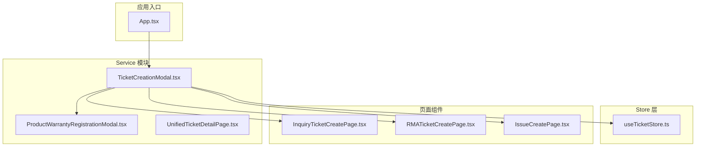
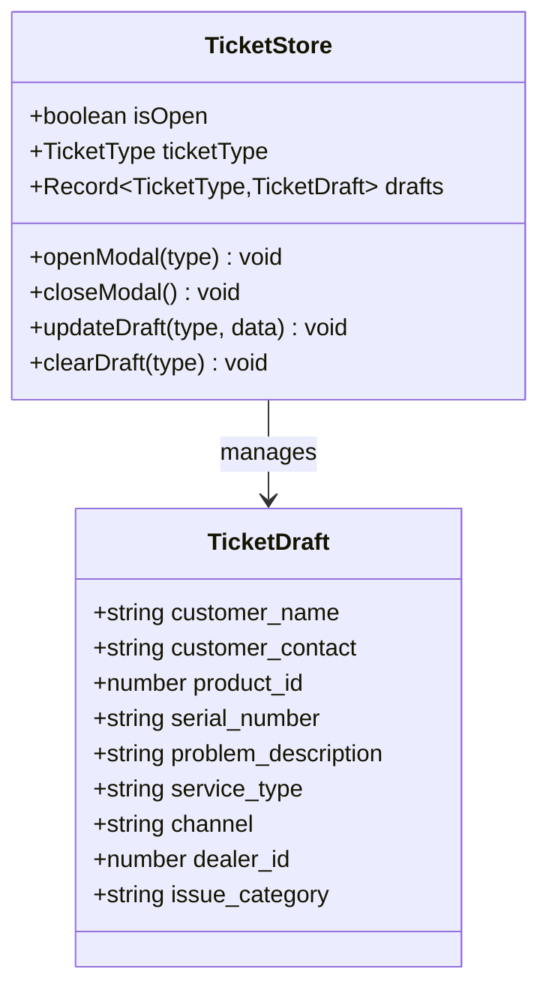
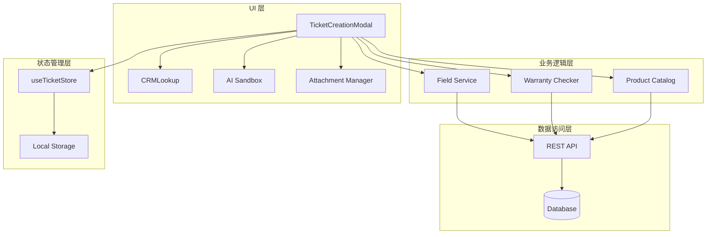
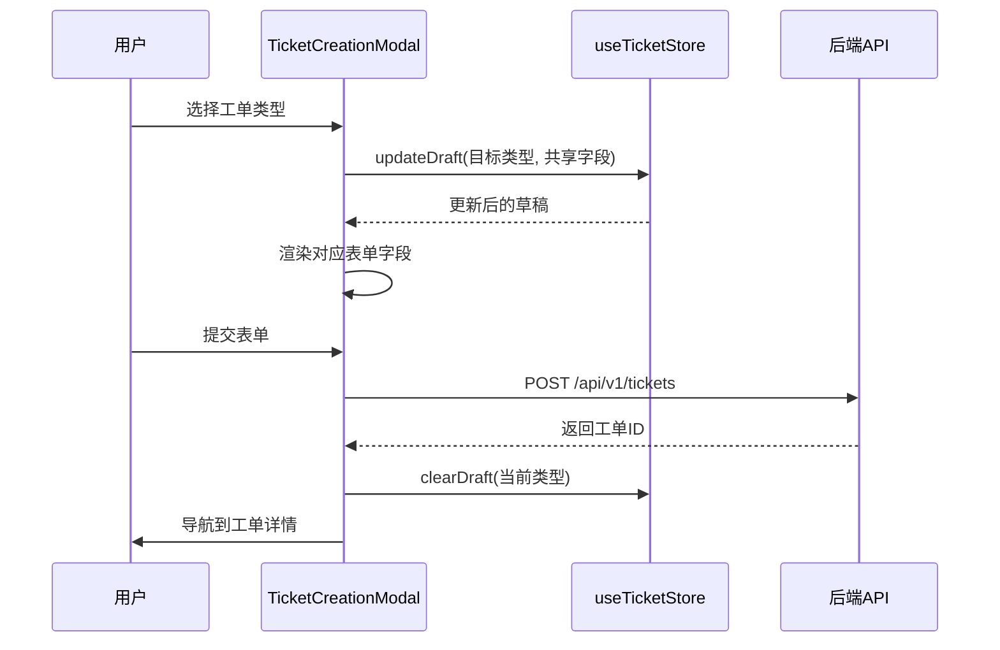
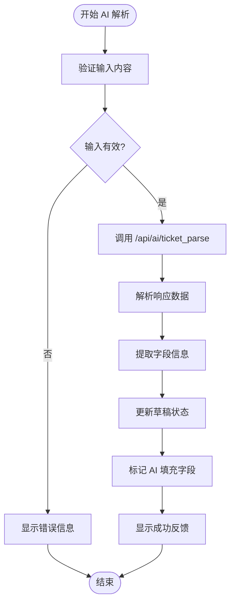
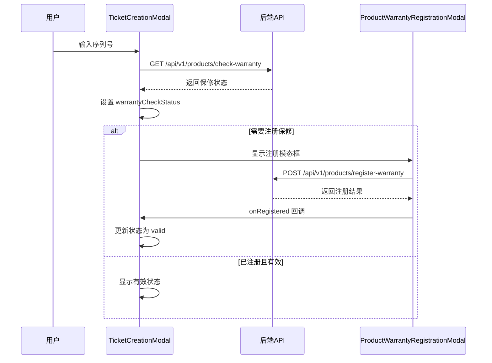
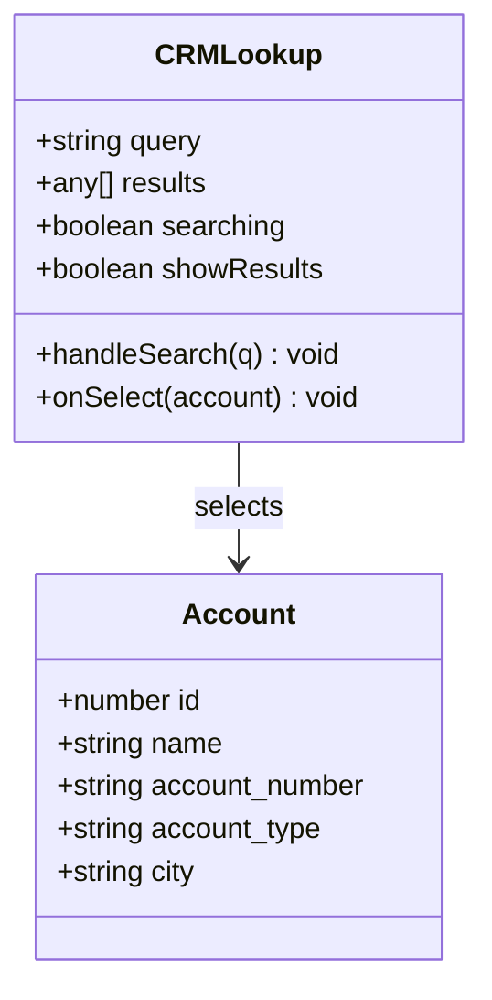
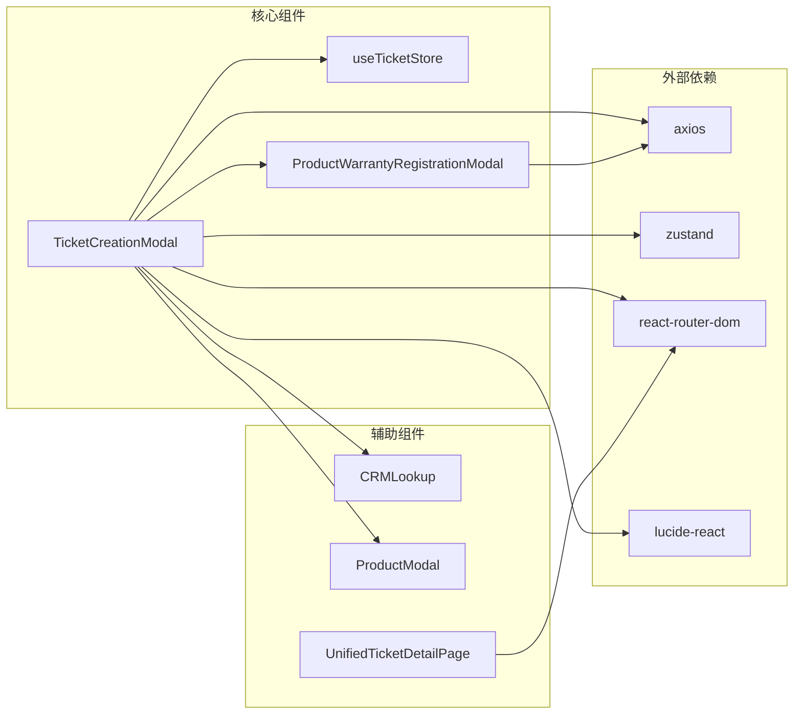

# 工单创建模态框

<cite>
**本文档引用的文件**
- [TicketCreationModal.tsx](file://client/src/components/Service/TicketCreationModal.tsx)
- [useTicketStore.ts](file://client/src/store/useTicketStore.ts)
- [InquiryTicketCreatePage.tsx](file://client/src/components/InquiryTickets/InquiryTicketCreatePage.tsx)
- [RMATicketCreatePage.tsx](file://client/src/components/RMATickets/RMATicketCreatePage.tsx)
- [IssueCreatePage.tsx](file://client/src/components/Issues/IssueCreatePage.tsx)
- [ProductWarrantyRegistrationModal.tsx](file://client/src/components/Service/ProductWarrantyRegistrationModal.tsx)
- [UnifiedTicketDetailPage.tsx](file://client/src/components/Service/UnifiedTicketDetailPage.tsx)
- [App.tsx](file://client/src/App.tsx)
</cite>

## 目录
1. [简介](#简介)
2. [项目结构](#项目结构)
3. [核心组件](#核心组件)
4. [架构概览](#架构概览)
5. [详细组件分析](#详细组件分析)
6. [依赖关系分析](#依赖关系分析)
7. [性能考虑](#性能考虑)
8. [故障排除指南](#故障排除指南)
9. [结论](#结论)

## 简介

工单创建模态框是 Longhorn 服务管理系统中的核心功能模块，提供了一个统一的界面来创建不同类型的工单（咨询工单、RMA 工单、经销商维修工单）。该模态框集成了 AI 助手、CRM 搜索、产品保修检查、文件附件上传等功能，旨在提升工单创建的效率和准确性。

## 项目结构

工单创建模态框位于客户端应用的 Service 模块中，采用模块化的组件设计：

**图表来源**
- [App.tsx:163-165](file://client/src/App.tsx#L163-L165)
- [TicketCreationModal.tsx:203-207](file://client/src/components/Service/TicketCreationModal.tsx#L203-L207)

**章节来源**
- [App.tsx:69-70](file://client/src/App.tsx#L69-L70)
- [TicketCreationModal.tsx:1-1096](file://client/src/components/Service/TicketCreationModal.tsx#L1-L1096)

## 核心组件

### TicketCreationModal 主组件

TicketCreationModal 是整个工单创建系统的核心组件，提供了以下主要功能：

- **多类型工单支持**：支持咨询工单、RMA 工单、经销商维修工单三种类型
- **AI 智能助手**：自动解析文本内容，提取关键信息
- **CRM 集成**：搜索和关联客户账户
- **产品保修检查**：验证产品保修状态
- **文件附件管理**：支持多种格式的文件上传

### useTicketStore 状态管理

使用 Zustand 实现的状态管理，负责维护工单草稿数据：

**图表来源**
- [useTicketStore.ts:22-32](file://client/src/store/useTicketStore.ts#L22-L32)
- [useTicketStore.ts:6-20](file://client/src/store/useTicketStore.ts#L6-L20)

**章节来源**
- [useTicketStore.ts:1-68](file://client/src/store/useTicketStore.ts#L1-L68)

## 架构概览

工单创建模态框采用了分层架构设计，确保了良好的可维护性和扩展性：

**图表来源**
- [TicketCreationModal.tsx:203-242](file://client/src/components/Service/TicketCreationModal.tsx#L203-L242)
- [useTicketStore.ts:40-67](file://client/src/store/useTicketStore.ts#L40-L67)

## 详细组件分析

### 工单类型切换机制

系统支持三种不同的工单类型，每种类型都有特定的字段和流程：

**图表来源**
- [TicketCreationModal.tsx:512-537](file://client/src/components/Service/TicketCreationModal.tsx#L512-L537)
- [TicketCreationModal.tsx:414-477](file://client/src/components/Service/TicketCreationModal.tsx#L414-L477)

### AI 智能助手工作流程

AI 助手提供了强大的自动化功能，能够从文本中提取关键信息：

**图表来源**
- [TicketCreationModal.tsx:341-412](file://client/src/components/Service/TicketCreationModal.tsx#L341-L412)

### 保修检查机制

对于 RMA 工单，系统提供了完整的保修检查功能：

**图表来源**
- [TicketCreationModal.tsx:296-328](file://client/src/components/Service/TicketCreationModal.tsx#L296-L328)
- [TicketCreationModal.tsx:1029-1040](file://client/src/components/Service/TicketCreationModal.tsx#L1029-L1040)

**章节来源**
- [TicketCreationModal.tsx:201-1096](file://client/src/components/Service/TicketCreationModal.tsx#L201-L1096)

### CRM 搜索集成

系统集成了 CRM 搜索功能，支持快速查找客户账户：

**图表来源**
- [TicketCreationModal.tsx:20-99](file://client/src/components/Service/TicketCreationModal.tsx#L20-L99)

**章节来源**
- [TicketCreationModal.tsx:17-199](file://client/src/components/Service/TicketCreationModal.tsx#L17-L199)

## 依赖关系分析

### 组件间依赖关系

**图表来源**
- [TicketCreationModal.tsx:1-14](file://client/src/components/Service/TicketCreationModal.tsx#L1-L14)
- [useTicketStore.ts:1-2](file://client/src/store/useTicketStore.ts#L1-L2)

### API 接口依赖

系统依赖多个后端 API 接口：

| API 端点 | 用途 | 方法 |
|---------|------|------|
| `/api/v1/accounts` | 获取账户列表 | GET |
| `/api/v1/tickets` | 创建工单 | POST |
| `/api/v1/context/by-serial-number` | 设备上下文查询 | GET |
| `/api/v1/products/check-warranty` | 保修状态检查 | GET |
| `/api/v1/upload` | 文件上传 | POST |
| `/api/ai/ticket_parse` | AI 工单解析 | POST |

**章节来源**
- [TicketCreationModal.tsx:42-44, 267-269, 347-352, 383-387, 457-462:42-44](file://client/src/components/Service/TicketCreationModal.tsx#L42-L44)

## 性能考虑

### 优化策略

1. **防抖机制**：序列号输入采用 1000ms 防抖，减少不必要的 API 调用
2. **状态持久化**：使用本地存储缓存工单草稿，避免数据丢失
3. **条件渲染**：根据工单类型动态渲染相关字段，减少 DOM 元素数量
4. **懒加载**：模态框按需加载，避免影响初始页面性能

### 内存管理

- 使用 React.memo 优化子组件渲染
- 及时清理事件监听器和定时器
- 合理管理文件对象的内存占用

## 故障排除指南

### 常见问题及解决方案

| 问题 | 可能原因 | 解决方案 |
|------|----------|----------|
| 工单创建失败 | 网络连接异常 | 检查网络状态，重试提交 |
| AI 解析失败 | 文本格式不正确 | 确保输入完整、清晰的文本描述 |
| 保修检查超时 | 服务器响应慢 | 稍后重试或检查序列号格式 |
| 文件上传失败 | 文件格式不支持 | 支持 JPG、PNG、PDF 格式，大小不超过 5MB |

### 调试技巧

1. **开发者工具**：使用浏览器开发者工具监控网络请求
2. **状态检查**：通过 Redux DevTools 或 Zustand DevTools 检查状态变化
3. **日志输出**：利用 console.log 输出关键调试信息

**章节来源**
- [TicketCreationModal.tsx:471-477](file://client/src/components/Service/TicketCreationModal.tsx#L471-L477)

## 结论

工单创建模态框是一个功能完整、架构清晰的服务管理组件。它通过模块化设计、状态管理和 API 集成，为用户提供了一站式的工单创建体验。系统的多类型支持、AI 助手、CRM 集成和保修检查等功能，显著提升了工单处理的效率和准确性。

未来可以考虑的功能增强包括：
- 更丰富的 AI 解析能力
- 工单模板系统
- 实时协作功能
- 移动端优化