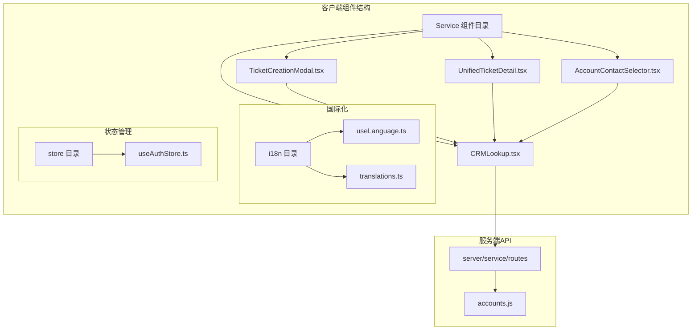
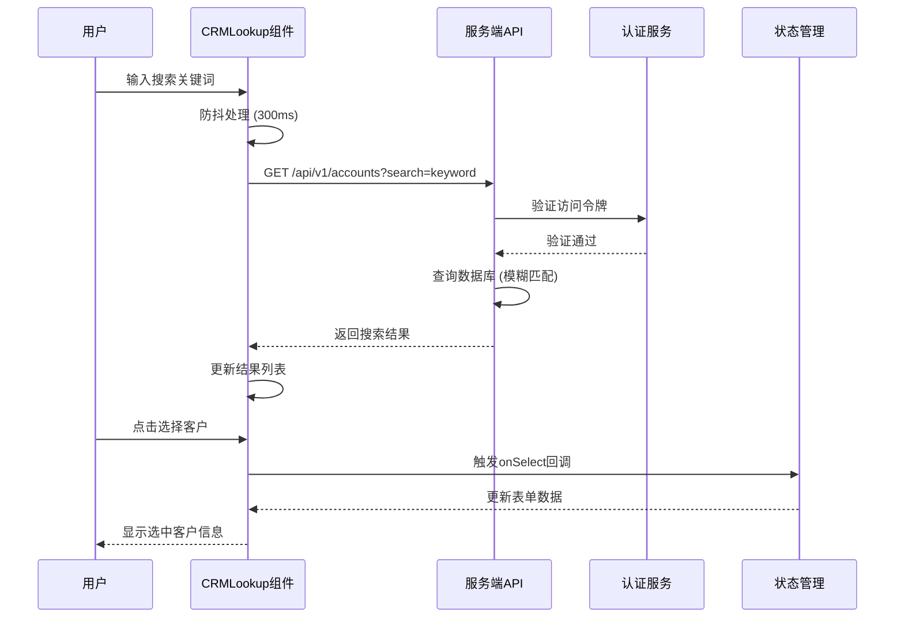
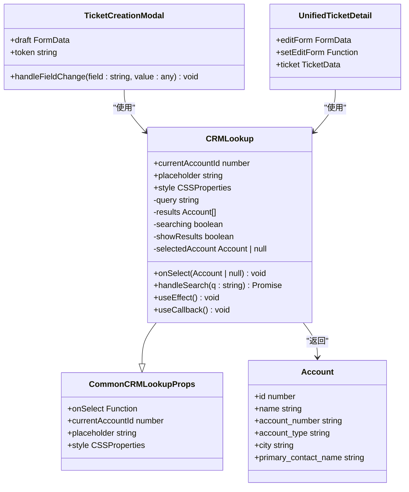
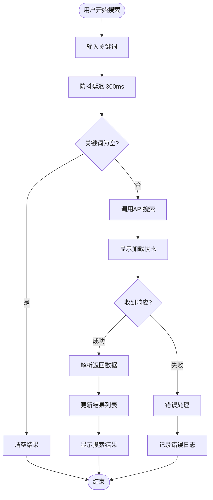
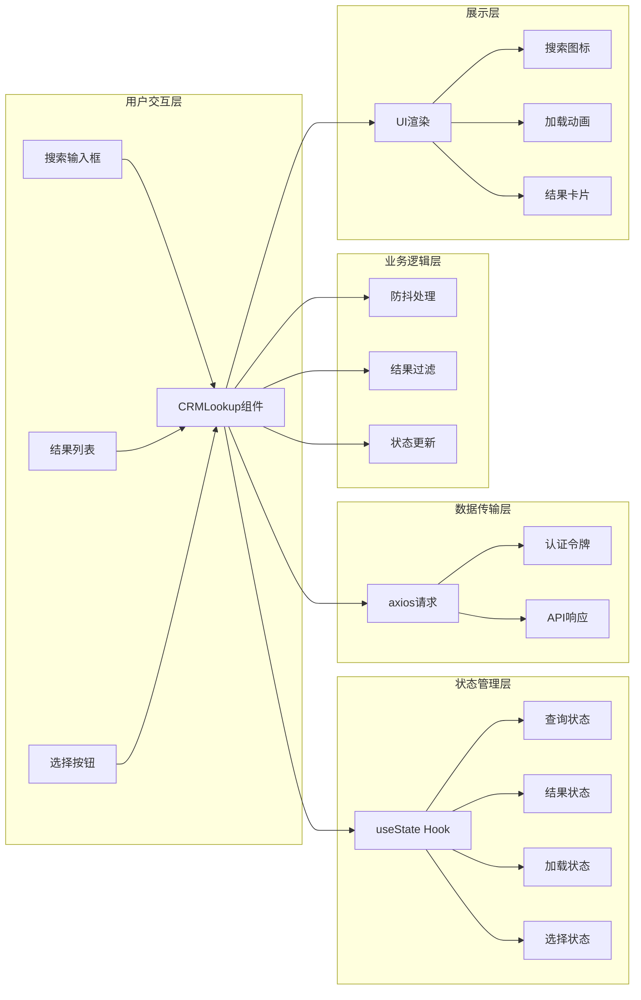
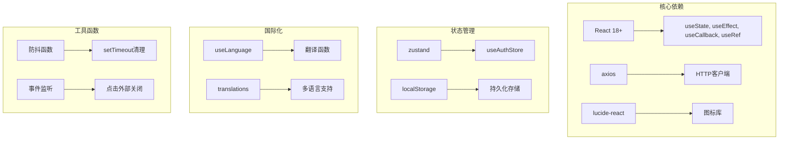
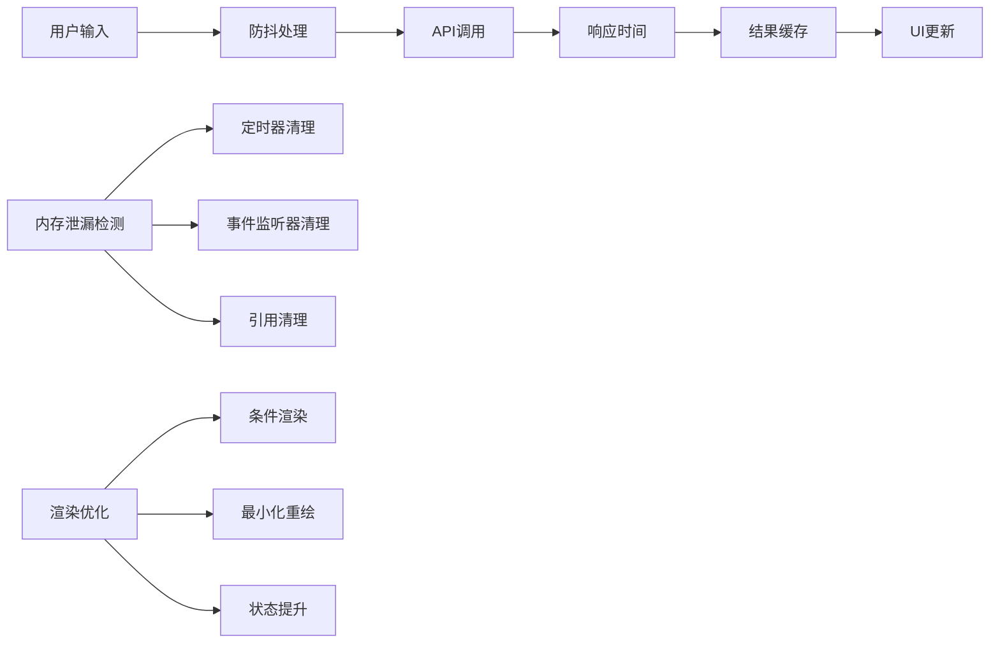

# CRM客户查找组件

<cite>
**本文档引用的文件**
- [CRMLookup.tsx](file://client/src/components/Service/CRMLookup.tsx)
- [TicketCreationModal.tsx](file://client/src/components/Service/TicketCreationModal.tsx)
- [UnifiedTicketDetail.tsx](file://client/src/components/Workspace/UnifiedTicketDetail.tsx)
- [useLanguage.ts](file://client/src/i18n/useLanguage.ts)
- [useAuthStore.ts](file://client/src/store/useAuthStore.ts)
- [accounts.js](file://server/service/routes/accounts.js)
- [AccountContactSelector.tsx](file://client/src/components/AccountContactSelector.tsx)
</cite>

## 目录
1. [简介](#简介)
2. [项目结构](#项目结构)
3. [核心组件](#核心组件)
4. [架构概览](#架构概览)
5. [详细组件分析](#详细组件分析)
6. [依赖关系分析](#依赖关系分析)
7. [性能考虑](#性能考虑)
8. [故障排除指南](#故障排除指南)
9. [结论](#结论)

## 简介

CRM客户查找组件是Longhorn服务管理系统中的核心功能模块，提供智能化的企业客户搜索和选择功能。该组件支持实时搜索、自动补全、多条件筛选，并与后端CRM系统深度集成，为工单创建、客户管理和业务流程提供关键的数据支撑。

该组件采用React Hooks构建，具备良好的用户体验和性能表现，支持多语言国际化，并通过认证令牌确保系统安全性。

## 项目结构

CRM客户查找组件位于客户端React应用的Service组件目录中，与工单管理系统紧密集成：



**图表来源**
- [CRMLookup.tsx:1-204](file://client/src/components/Service/CRMLookup.tsx#L1-L204)
- [TicketCreationModal.tsx:630-670](file://client/src/components/Service/TicketCreationModal.tsx#L630-L670)
- [UnifiedTicketDetail.tsx:2025-2046](file://client/src/components/Workspace/UnifiedTicketDetail.tsx#L2025-L2046)

**章节来源**
- [CRMLookup.tsx:1-204](file://client/src/components/Service/CRMLookup.tsx#L1-L204)
- [TicketCreationModal.tsx:630-670](file://client/src/components/Service/TicketCreationModal.tsx#L630-L670)
- [UnifiedTicketDetail.tsx:2025-2046](file://client/src/components/Workspace/UnifiedTicketDetail.tsx#L2025-L2046)

## 核心组件

### CRMLookup 主组件

CRMLookup是整个CRM客户查找系统的核心组件，提供完整的搜索和选择功能：

**主要特性：**
- 实时搜索和自动补全
- 多条件筛选（账户类型、地区、状态等）
- 智能防抖机制
- 外部ID同步
- 国际化支持
- 响应式设计

**数据结构：**
```typescript
interface Account {
    id: number;
    name: string;
    account_number: string;
    account_type: string;
    city?: string;
    primary_contact_name?: string;
}

interface CommonCRMLookupProps {
    onSelect: (account: Account | null) => void;
    currentAccountId?: number;
    placeholder?: string;
    style?: React.CSSProperties;
}
```

**章节来源**
- [CRMLookup.tsx:7-31](file://client/src/components/Service/CRMLookup.tsx#L7-L31)

### 使用场景

该组件在多个业务场景中发挥重要作用：

1. **工单创建流程** - 在TicketCreationModal中用于选择客户账户
2. **工单详情编辑** - 在UnifiedTicketDetail中用于修改客户信息
3. **客户管理** - 在AccountContactSelector中提供账户选择功能

**章节来源**
- [TicketCreationModal.tsx:632-670](file://client/src/components/Service/TicketCreationModal.tsx#L632-L670)
- [UnifiedTicketDetail.tsx:2029-2046](file://client/src/components/Workspace/UnifiedTicketDetail.tsx#L2029-L2046)

## 架构概览

CRM客户查找组件采用分层架构设计，确保前后端分离和组件复用：



**图表来源**
- [CRMLookup.tsx:41-59](file://client/src/components/Service/CRMLookup.tsx#L41-L59)
- [accounts.js:51-65](file://server/service/routes/accounts.js#L51-L65)

**章节来源**
- [CRMLookup.tsx:32-93](file://client/src/components/Service/CRMLookup.tsx#L32-L93)
- [accounts.js:51-65](file://server/service/routes/accounts.js#L51-L65)

## 详细组件分析

### 组件类图



**图表来源**
- [CRMLookup.tsx:7-31](file://client/src/components/Service/CRMLookup.tsx#L7-L31)
- [TicketCreationModal.tsx:634-669](file://client/src/components/Service/TicketCreationModal.tsx#L634-L669)
- [UnifiedTicketDetail.tsx:2031-2043](file://client/src/components/Workspace/UnifiedTicketDetail.tsx#L2031-L2043)

### 搜索流程



**图表来源**
- [CRMLookup.tsx:41-66](file://client/src/components/Service/CRMLookup.tsx#L41-L66)

### 数据流分析



**图表来源**
- [CRMLookup.tsx:32-203](file://client/src/components/Service/CRMLookup.tsx#L32-L203)

**章节来源**
- [CRMLookup.tsx:32-203](file://client/src/components/Service/CRMLookup.tsx#L32-L203)

## 依赖关系分析

### 外部依赖

组件依赖以下关键依赖包：



**图表来源**
- [CRMLookup.tsx:1-5](file://client/src/components/Service/CRMLookup.tsx#L1-L5)
- [useAuthStore.ts:1-37](file://client/src/store/useAuthStore.ts#L1-L37)
- [useLanguage.ts:1-59](file://client/src/i18n/useLanguage.ts#L1-L59)

### 内部依赖关系

```mermaid
graph TD
A[CRMLookup.tsx] --> B[useAuthStore.ts]
A --> C[useLanguage.ts]
A --> D[accounts.js (服务端)]
E[TicketCreationModal.tsx] --> A
F[UnifiedTicketDetail.tsx] --> A
G[AccountContactSelector.tsx] --> A
B --> H[认证令牌管理]
C --> I[国际化支持]
D --> J[账户数据API]
E --> K[工单创建流程]
F --> L[工单详情编辑]
G --> M[账户选择器]
```

**图表来源**
- [CRMLookup.tsx:32-33](file://client/src/components/Service/CRMLookup.tsx#L32-L33)
- [TicketCreationModal.tsx:632-633](file://client/src/components/Service/TicketCreationModal.tsx#L632-L633)
- [UnifiedTicketDetail.tsx:2029-2030](file://client/src/components/Workspace/UnifiedTicketDetail.tsx#L2029-L2030)

**章节来源**
- [CRMLookup.tsx:1-5](file://client/src/components/Service/CRMLookup.tsx#L1-L5)
- [TicketCreationModal.tsx:632-633](file://client/src/components/Service/TicketCreationModal.tsx#L632-L633)
- [UnifiedTicketDetail.tsx:2029-2030](file://client/src/components/Workspace/UnifiedTicketDetail.tsx#L2029-L2030)

## 性能考虑

### 优化策略

1. **防抖机制**：300ms延迟防止频繁API调用
2. **虚拟滚动**：限制结果列表最大高度（300px）
3. **条件渲染**：仅在需要时显示结果面板
4. **内存管理**：及时清理定时器和事件监听器

### 性能监控点



**图表来源**
- [CRMLookup.tsx:61-93](file://client/src/components/Service/CRMLookup.tsx#L61-L93)

## 故障排除指南

### 常见问题及解决方案

**问题1：搜索无结果**
- 检查网络连接状态
- 验证API端点可用性
- 确认搜索关键词长度（建议≥2字符）

**问题2：认证失败**
- 检查token是否过期
- 验证用户权限级别
- 确认CRM访问权限

**问题3：组件不响应**
- 检查防抖定时器是否正确清理
- 验证事件监听器绑定状态
- 确认组件卸载时的清理逻辑

**问题4：样式显示异常**
- 检查CSS变量定义
- 验证主题切换逻辑
- 确认响应式布局适配

**章节来源**
- [CRMLookup.tsx:54-58](file://client/src/components/Service/CRMLookup.tsx#L54-L58)
- [useAuthStore.ts:23-36](file://client/src/store/useAuthStore.ts#L23-L36)

### 调试技巧

1. **网络请求调试**：使用浏览器开发者工具监控API调用
2. **状态检查**：通过React DevTools检查组件状态变化
3. **错误边界**：实现错误边界捕获组件异常
4. **性能分析**：使用React Profiler分析渲染性能

## 结论

CRM客户查找组件作为Longhorn系统的重要组成部分，展现了现代前端开发的最佳实践：

**技术优势：**
- 采用React Hooks实现函数式组件
- 完善的状态管理和错误处理
- 良好的性能优化和用户体验
- 强大的国际化支持

**业务价值：**
- 提升工单创建效率
- 改善客户管理体验
- 标准化业务流程
- 增强系统可维护性

该组件的成功实施为整个Longhorn服务管理系统奠定了坚实的基础，其设计理念和实现方式可作为类似CRM系统的参考模板。