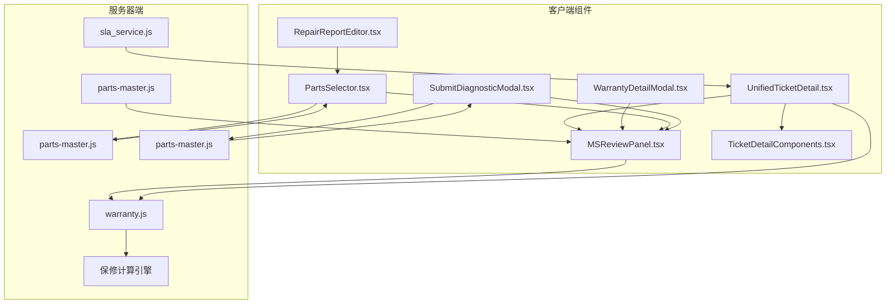
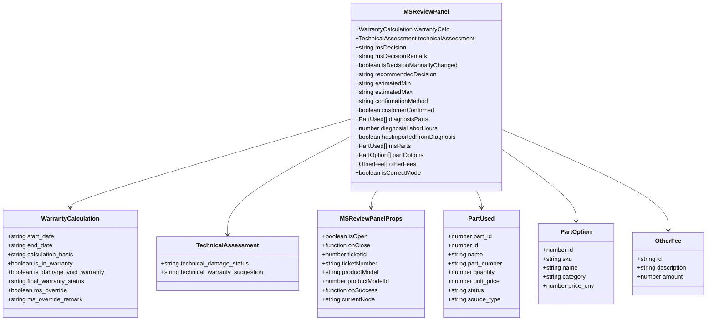
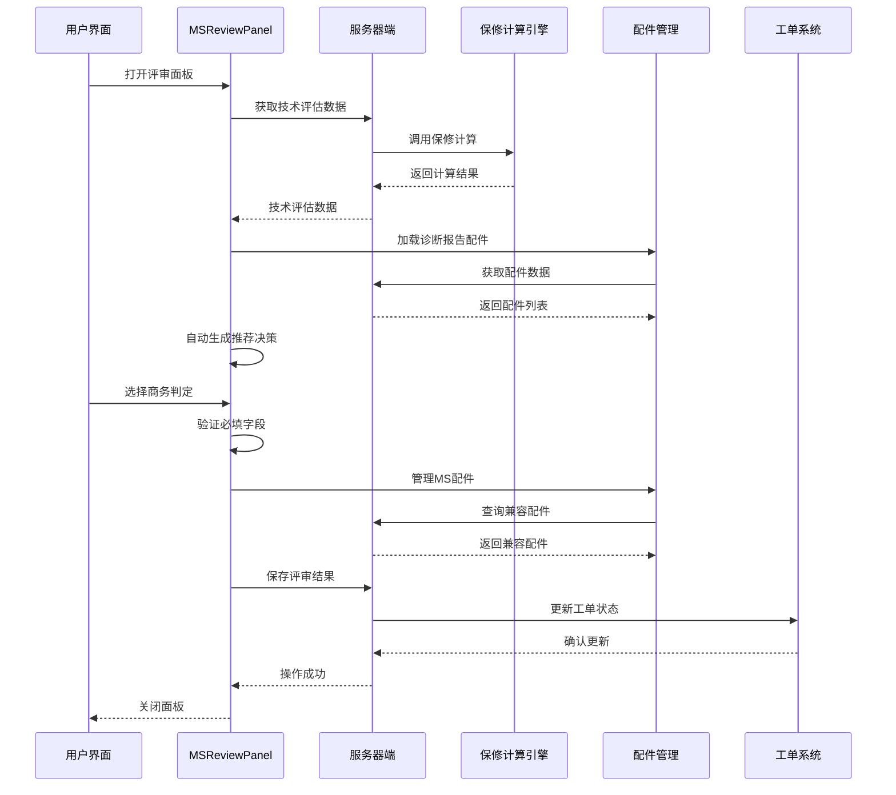
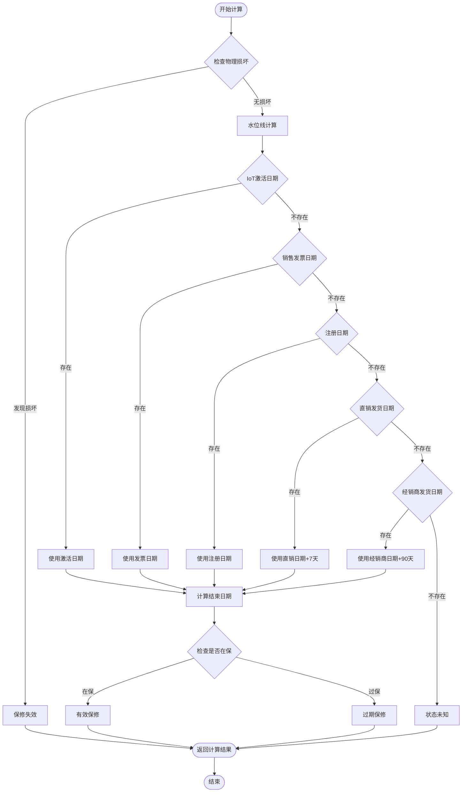
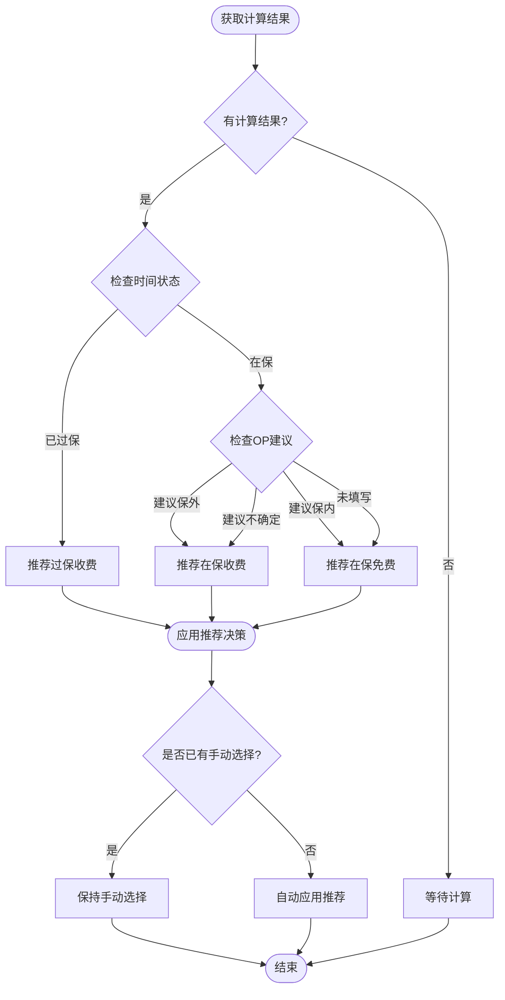
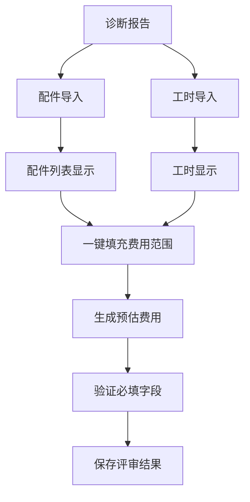
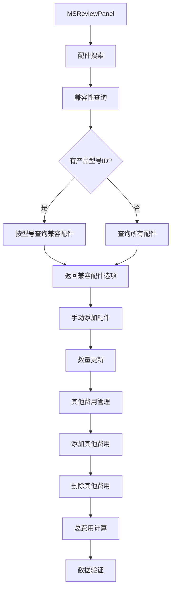
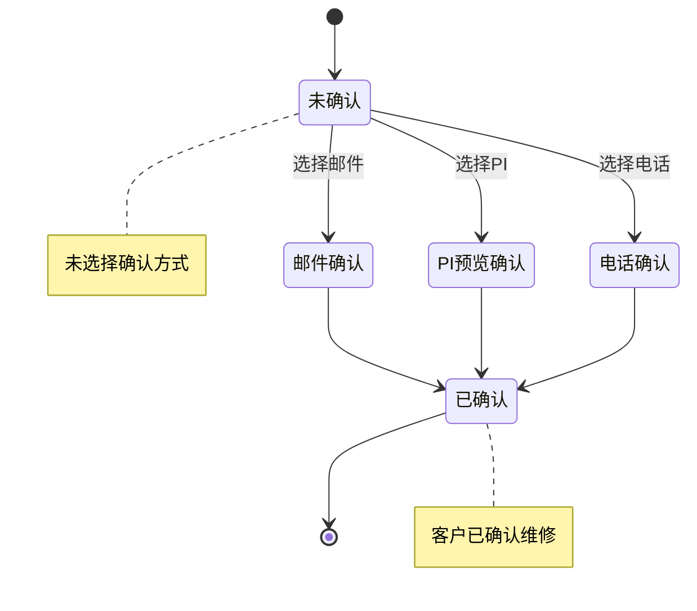
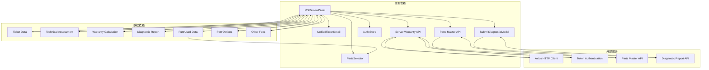
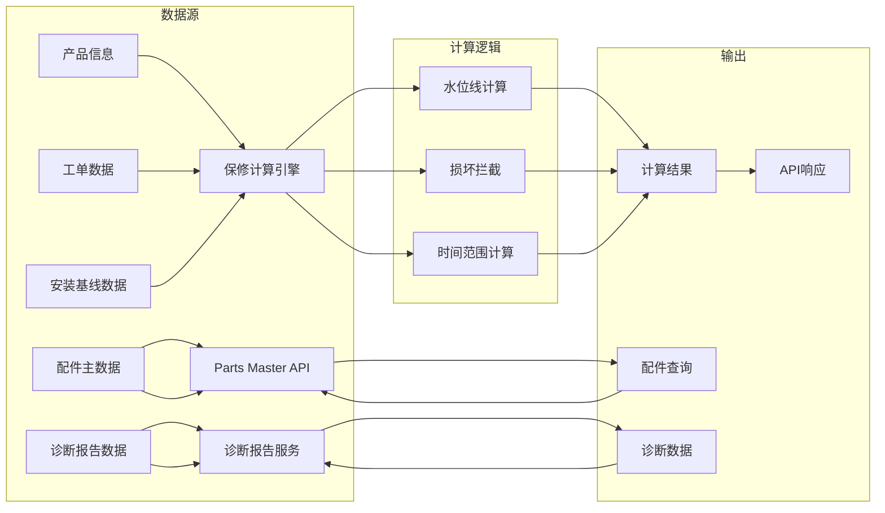

# MSReviewPanel 评审面板

<cite>
**本文档引用的文件**
- [MSReviewPanel.tsx](file://client/src/components/Workspace/MSReviewPanel.tsx)
- [UnifiedTicketDetail.tsx](file://client/src/components/Workspace/UnifiedTicketDetail.tsx)
- [warranty.js](file://server/service/routes/warranty.js)
- [TicketDetailComponents.tsx](file://client/src/components/Workspace/TicketDetailComponents.tsx)
- [sla_service.js](file://server/service/sla_service.js)
- [PartsSelector.tsx](file://client/src/components/Workspace/PartsSelector.tsx)
- [RepairReportEditor.tsx](file://client/src/components/Workspace/RepairReportEditor.tsx)
- [parts-master.js](file://server/service/routes/parts-master.js)
- [SubmitDiagnosticModal.tsx](file://client/src/components/Workspace/SubmitDiagnosticModal.tsx)
</cite>

## 更新摘要
**变更内容**
- 增强MSReviewPanel组件以支持全新的MS配件选择工作流
- 新增诊断报告集成功能，支持从诊断报告导入配件和工时预估
- 集成高级兼容性检查机制，基于产品型号ID查询兼容配件
- 新增费用管理功能，支持其他费用的添加和管理
- 实现快速费用填充功能，一键将诊断预估转换为费用范围
- 新增更正模式支持，允许在非ms_review节点进行更正操作
- 增强数据验证和必填字段检查机制

## 目录
1. [简介](#简介)
2. [项目结构](#项目结构)
3. [核心组件](#核心组件)
4. [架构概览](#架构概览)
5. [详细组件分析](#详细组件分析)
6. [依赖关系分析](#依赖关系分析)
7. [性能考虑](#性能考虑)
8. [故障排除指南](#故障排除指南)
9. [结论](#结论)

## 简介

MSReviewPanel 评审面板是 Longhorn 工单管理系统中的关键组件，专门负责保修商务审核流程。该面板实现了双层决策机制：系统自动计算保修状态与人工商务判定相结合，确保保修判断的准确性和合规性。

**更新** 新版本进行了重大增强，集成了全新的MS配件选择工作流、诊断报告集成、费用管理、兼容性检查等核心功能。这些增强功能为商务人员提供了更加完整和高效的维修费用管理解决方案。

该组件支持多种工作流场景，包括标准 RMA 流程、服务工单流程，并集成了客户确认机制、费用估算功能和详细的审核历史追踪。通过直观的用户界面和严格的业务逻辑验证，为商务人员提供了完整的保修审核解决方案。

## 项目结构

MSReviewPanel 评审面板位于客户端组件树中的工作区模块下，与相关的工单管理组件协同工作：

**图表来源**
- [MSReviewPanel.tsx:1-1225](file://client/src/components/Workspace/MSReviewPanel.tsx#L1-L1225)
- [UnifiedTicketDetail.tsx:180-379](file://client/src/components/Workspace/UnifiedTicketDetail.tsx#L180-L379)
- [PartsSelector.tsx:1-754](file://client/src/components/Workspace/PartsSelector.tsx#L1-L754)
- [parts-master.js:1-628](file://server/service/routes/parts-master.js#L1-L628)

**章节来源**
- [MSReviewPanel.tsx:1-1225](file://client/src/components/Workspace/MSReviewPanel.tsx#L1-L1225)
- [UnifiedTicketDetail.tsx:180-379](file://client/src/components/Workspace/UnifiedTicketDetail.tsx#L180-L379)

## 核心组件

### 主要功能特性

MSReviewPanel 实现了以下核心功能：

1. **双层决策机制**：结合系统自动计算和人工商务判定
2. **智能推荐系统**：基于时间计算和 OP 建议自动生成推荐决策
3. **手动调整保护**：强制要求手动调整时提供详细说明
4. **客户确认集成**：支持多种客户确认方式和状态追踪
5. **费用估算管理**：灵活的预估费用输入和验证机制
6. **工作流集成**：无缝集成到完整的工单处理流程
7. **诊断报告集成**：支持从诊断报告导入配件和工时预估
8. **快速费用填充**：一键将诊断预估转换为费用范围
9. **MS配件选择**：全新的MS专用配件选择和管理功能
10. **兼容性检查**：基于产品型号ID的配件兼容性验证
11. **费用管理**：支持其他费用的添加、编辑和删除
12. **更正模式支持**：允许在非ms_review节点进行更正操作

### 数据模型

组件使用以下核心数据结构：

**图表来源**
- [MSReviewPanel.tsx:23-103](file://client/src/components/Workspace/MSReviewPanel.tsx#L23-L103)
- [PartsSelector.tsx:12-33](file://client/src/components/Workspace/PartsSelector.tsx#L12-L33)

**章节来源**
- [MSReviewPanel.tsx:23-103](file://client/src/components/Workspace/MSReviewPanel.tsx#L23-L103)
- [PartsSelector.tsx:12-33](file://client/src/components/Workspace/PartsSelector.tsx#L12-L33)

## 架构概览

MSReviewPanel 采用分层架构设计，实现了清晰的关注点分离：

**图表来源**
- [MSReviewPanel.tsx:104-448](file://client/src/components/Workspace/MSReviewPanel.tsx#L104-L448)
- [warranty.js:34-81](file://server/service/routes/warranty.js#L34-L81)
- [PartsSelector.tsx:98-159](file://client/src/components/Workspace/PartsSelector.tsx#L98-L159)

## 详细组件分析

### 保修计算引擎

服务器端的保修计算引擎实现了复杂的水位线逻辑：

**图表来源**
- [warranty.js:238-286](file://server/service/routes/warranty.js#L238-L286)

### 决策推荐算法

系统实现了智能的决策推荐机制：

**图表来源**
- [MSReviewPanel.tsx:122-151](file://client/src/components/Workspace/MSReviewPanel.tsx#L122-L151)

### 诊断报告集成

**新增** 诊断报告集成功能允许从诊断报告导入配件和工时预估：

**图表来源**
- [MSReviewPanel.tsx:167-182](file://client/src/components/Workspace/MSReviewPanel.tsx#L167-L182)
- [MSReviewPanel.tsx:1038-1063](file://client/src/components/Workspace/MSReviewPanel.tsx#L1038-L1063)

### MS配件选择系统

**新增** 全新的MS配件选择功能，支持兼容性检查和费用管理：

**图表来源**
- [MSReviewPanel.tsx:224-284](file://client/src/components/Workspace/MSReviewPanel.tsx#L224-L284)
- [MSReviewPanel.tsx:286-335](file://client/src/components/Workspace/MSReviewPanel.tsx#L286-L335)

### 客户确认流程

客户确认机制提供了多种确认方式：

**图表来源**
- [MSReviewPanel.tsx:1075-1107](file://client/src/components/Workspace/MSReviewPanel.tsx#L1075-L1107)

**章节来源**
- [warranty.js:1-286](file://server/service/routes/warranty.js#L1-L286)
- [MSReviewPanel.tsx:122-151](file://client/src/components/Workspace/MSReviewPanel.tsx#L122-L151)

## 依赖关系分析

### 组件间依赖

MSReviewPanel 与其他组件形成了紧密的依赖关系：

**图表来源**
- [MSReviewPanel.tsx:62-103](file://client/src/components/Workspace/MSReviewPanel.tsx#L62-L103)
- [UnifiedTicketDetail.tsx:221-229](file://client/src/components/Workspace/UnifiedTicketDetail.tsx#L221-L229)
- [PartsSelector.tsx:62-62](file://client/src/components/Workspace/PartsSelector.tsx#L62-L62)
- [parts-master.js:28-135](file://server/service/routes/parts-master.js#L28-L135)

### 服务器端依赖

服务器端的保修计算服务依赖于多个数据源：

**图表来源**
- [warranty.js:43-70](file://server/service/routes/warranty.js#L43-L70)
- [parts-master.js:66-75](file://server/service/routes/parts-master.js#L66-L75)

**章节来源**
- [MSReviewPanel.tsx:62-103](file://client/src/components/Workspace/MSReviewPanel.tsx#L62-L103)
- [warranty.js:43-70](file://server/service/routes/warranty.js#L43-L70)
- [parts-master.js:66-75](file://server/service/routes/parts-master.js#L66-L75)

## 性能考虑

### 异步处理优化

MSReviewPanel 实现了多层异步处理来确保用户体验：

1. **延迟加载**：仅在面板打开时加载数据
2. **缓存策略**：避免重复的 API 调用
3. **并发处理**：同时获取技术评估和现有评审数据
4. **防抖机制**：防止重复提交
5. **诊断报告预加载**：提前加载诊断数据以支持快速填充
6. **配件搜索防抖**：优化搜索性能
7. **兼容性查询优化**：优先使用产品型号ID查询

### 内存管理

组件采用了有效的内存管理策略：

- 使用 `useEffect` 清理函数避免内存泄漏
- 条件渲染减少 DOM 元素数量
- 状态最小化原则避免不必要的重新渲染
- 诊断数据的懒加载优化
- 配件选项的自动清理机制

## 故障排除指南

### 常见问题及解决方案

| 问题类型 | 症状 | 解决方案 |
|---------|------|----------|
| 保修计算失败 | 页面显示错误消息 | 检查网络连接和服务器状态 |
| 数据加载缓慢 | 面板加载超时 | 检查 API 响应时间和缓存配置 |
| 手动调整验证失败 | 无法保存评审结果 | 确保提供调整原因和必填字段 |
| 客户确认问题 | 确认状态不更新 | 检查确认方式选择和网络状态 |
| 诊断报告导入失败 | 配件列表为空 | 检查诊断报告数据格式和权限 |
| 快速填充功能异常 | 一键填充按钮不可用 | 确认诊断报告中有配件或工时数据 |
| 配件搜索无结果 | 搜索不到兼容配件 | 检查产品型号ID和配件兼容性设置 |
| 费用计算错误 | 总费用显示异常 | 检查配件数量和单价设置 |
| 更正模式问题 | 无法在非ms_review节点更正 | 检查当前节点状态和权限设置 |

### 调试技巧

1. **开发者工具**：使用浏览器开发者工具监控网络请求
2. **日志记录**：检查控制台中的错误信息
3. **状态检查**：验证组件状态的正确性
4. **API 测试**：直接测试服务器端 API 端点
5. **诊断数据验证**：检查诊断报告数据的完整性
6. **兼容性检查**：验证产品型号ID和配件兼容性

**章节来源**
- [MSReviewPanel.tsx:135-138](file://client/src/components/Workspace/MSReviewPanel.tsx#L135-L138)
- [MSReviewPanel.tsx:171-174](file://client/src/components/Workspace/MSReviewPanel.tsx#L171-L174)

## 结论

MSReviewPanel 评审面板经过重大增强后，已成为一个功能完整、架构清晰的工单管理系统组件。新版本显著增强了以下核心能力：

1. **业务准确性**：通过双层决策机制确保保修判断的准确性
2. **用户体验**：提供直观的界面和流畅的操作体验
3. **系统集成**：无缝集成到现有的工单处理流程中
4. **可维护性**：采用模块化的架构设计便于维护和扩展
5. **诊断报告集成**：支持从诊断报告导入配件和工时预估
6. **快速费用填充**：提供一键填充功能提升工作效率
7. **数据验证增强**：改进的数据绑定和验证机制确保数据完整性
8. **MS配件管理**：全新的MS专用配件选择和管理功能
9. **兼容性检查**：基于产品型号ID的智能配件兼容性验证
10. **费用管理**：支持其他费用的灵活添加和管理
11. **更正模式支持**：允许在非ms_review节点进行更正操作

**更新** 新版本显著增强了配件选择工作流的支持，为商务审核流程提供了更加完整的解决方案。通过智能的推荐算法、严格的验证机制、直观的用户界面和强大的诊断报告集成，该组件为 Longhorn 系统的商务审核流程提供了坚实的技术基础。

该组件不仅满足了当前的业务需求，还为未来的功能扩展预留了充足的空间，包括更复杂的配件管理、更丰富的诊断报告集成和更灵活的费用计算选项。通过这些增强功能，MSReviewPanel 成为了一个真正意义上的综合性的商务审核平台。