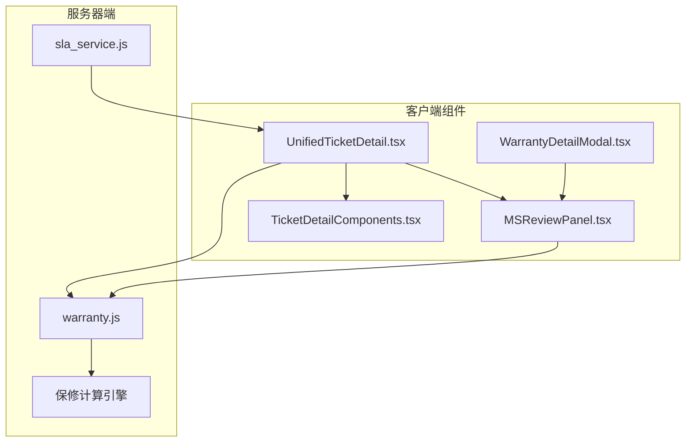
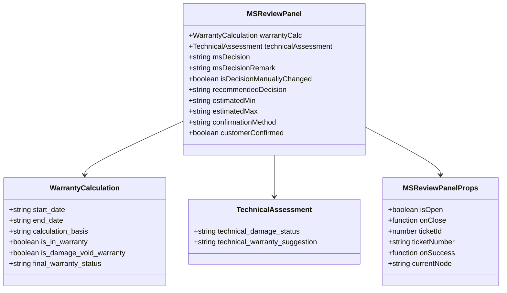
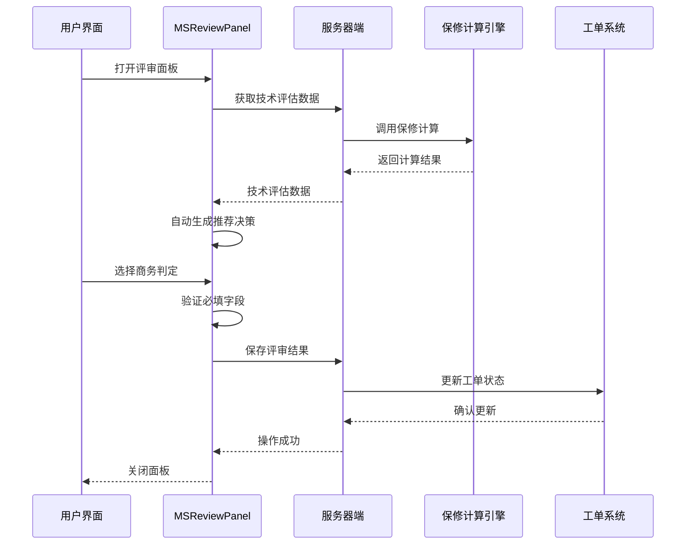
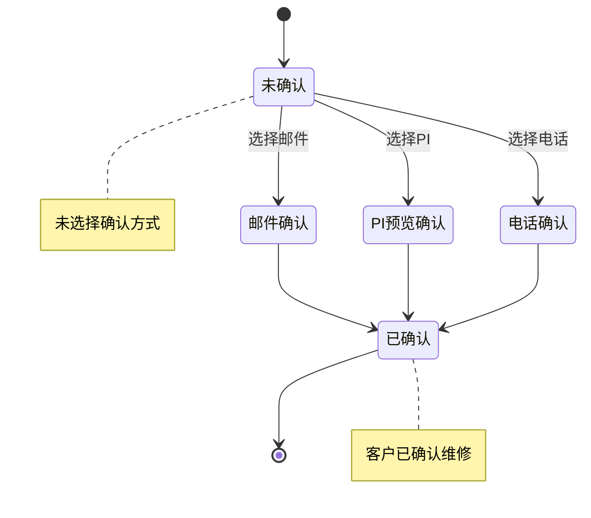
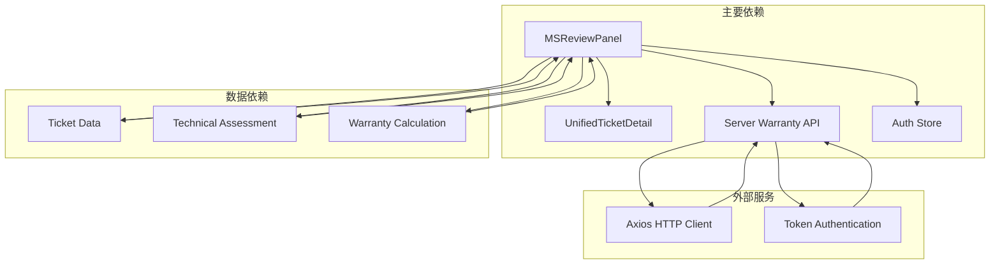
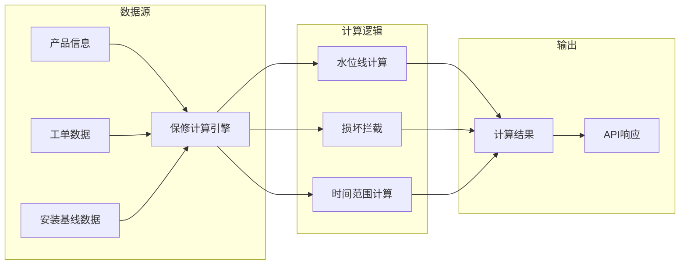

# MSReviewPanel 评审面板

<cite>
**本文档引用的文件**
- [MSReviewPanel.tsx](file://client/src/components/Workspace/MSReviewPanel.tsx)
- [UnifiedTicketDetail.tsx](file://client/src/components/Workspace/UnifiedTicketDetail.tsx)
- [warranty.js](file://server/service/routes/warranty.js)
- [TicketDetailComponents.tsx](file://client/src/components/Workspace/TicketDetailComponents.tsx)
- [sla_service.js](file://server/service/sla_service.js)
</cite>

## 目录
1. [简介](#简介)
2. [项目结构](#项目结构)
3. [核心组件](#核心组件)
4. [架构概览](#架构概览)
5. [详细组件分析](#详细组件分析)
6. [依赖关系分析](#依赖关系分析)
7. [性能考虑](#性能考虑)
8. [故障排除指南](#故障排除指南)
9. [结论](#结论)

## 简介

MSReviewPanel 评审面板是 Longhorn 工单管理系统中的关键组件，专门负责保修商务审核流程。该面板实现了双层决策机制：系统自动计算保修状态与人工商务判定相结合，确保保修判断的准确性和合规性。

该组件支持多种工作流场景，包括标准 RMA 流程、服务工单流程，并集成了客户确认机制、费用估算功能和详细的审核历史追踪。通过直观的用户界面和严格的业务逻辑验证，为商务人员提供了完整的保修审核解决方案。

## 项目结构

MSReviewPanel 评审面板位于客户端组件树中的工作区模块下，与相关的工单管理组件协同工作：

**图表来源**
- [MSReviewPanel.tsx:1-808](file://client/src/components/Workspace/MSReviewPanel.tsx#L1-L808)
- [UnifiedTicketDetail.tsx:180-379](file://client/src/components/Workspace/UnifiedTicketDetail.tsx#L180-L379)

**章节来源**
- [MSReviewPanel.tsx:1-808](file://client/src/components/Workspace/MSReviewPanel.tsx#L1-L808)
- [UnifiedTicketDetail.tsx:180-379](file://client/src/components/Workspace/UnifiedTicketDetail.tsx#L180-L379)

## 核心组件

### 主要功能特性

MSReviewPanel 实现了以下核心功能：

1. **双层决策机制**：结合系统自动计算和人工商务判定
2. **智能推荐系统**：基于时间计算和 OP 建议自动生成推荐决策
3. **手动调整保护**：强制要求手动调整时提供详细说明
4. **客户确认集成**：支持多种客户确认方式和状态追踪
5. **费用估算管理**：灵活的预估费用输入和验证机制
6. **工作流集成**：无缝集成到完整的工单处理流程

### 数据模型

组件使用以下核心数据结构：

**图表来源**
- [MSReviewPanel.tsx:32-62](file://client/src/components/Workspace/MSReviewPanel.tsx#L32-L62)

**章节来源**
- [MSReviewPanel.tsx:23-62](file://client/src/components/Workspace/MSReviewPanel.tsx#L23-L62)

## 架构概览

MSReviewPanel 采用分层架构设计，实现了清晰的关注点分离：

**图表来源**
- [MSReviewPanel.tsx:121-282](file://client/src/components/Workspace/MSReviewPanel.tsx#L121-L282)
- [warranty.js:34-81](file://server/service/routes/warranty.js#L34-L81)

## 详细组件分析

### 保修计算引擎

服务器端的保修计算引擎实现了复杂的水位线逻辑：

**图表来源**
- [warranty.js:211-285](file://server/service/routes/warranty.js#L211-L285)

### 决策推荐算法

系统实现了智能的决策推荐机制：

**图表来源**
- [MSReviewPanel.tsx:91-119](file://client/src/components/Workspace/MSReviewPanel.tsx#L91-L119)

### 客户确认流程

客户确认机制提供了多种确认方式：

**图表来源**
- [MSReviewPanel.tsx:659-690](file://client/src/components/Workspace/MSReviewPanel.tsx#L659-L690)

**章节来源**
- [warranty.js:1-286](file://server/service/routes/warranty.js#L1-L286)
- [MSReviewPanel.tsx:91-119](file://client/src/components/Workspace/MSReviewPanel.tsx#L91-L119)

## 依赖关系分析

### 组件间依赖

MSReviewPanel 与其他组件形成了紧密的依赖关系：

**图表来源**
- [MSReviewPanel.tsx:46-48](file://client/src/components/Workspace/MSReviewPanel.tsx#L46-L48)
- [UnifiedTicketDetail.tsx:189](file://client/src/components/Workspace/UnifiedTicketDetail.tsx#L189)

### 服务器端依赖

服务器端的保修计算服务依赖于多个数据源：

**图表来源**
- [warranty.js:43-70](file://server/service/routes/warranty.js#L43-L70)

**章节来源**
- [MSReviewPanel.tsx:46-48](file://client/src/components/Workspace/MSReviewPanel.tsx#L46-L48)
- [warranty.js:43-70](file://server/service/routes/warranty.js#L43-L70)

## 性能考虑

### 异步处理优化

MSReviewPanel 实现了多层异步处理来确保用户体验：

1. **延迟加载**：仅在面板打开时加载数据
2. **缓存策略**：避免重复的 API 调用
3. **并发处理**：同时获取技术评估和现有评审数据
4. **防抖机制**：防止重复提交

### 内存管理

组件采用了有效的内存管理策略：

- 使用 `useEffect` 清理函数避免内存泄漏
- 条件渲染减少 DOM 元素数量
- 状态最小化原则避免不必要的重新渲染

## 故障排除指南

### 常见问题及解决方案

| 问题类型 | 症状 | 解决方案 |
|---------|------|----------|
| 保修计算失败 | 页面显示错误消息 | 检查网络连接和服务器状态 |
| 数据加载缓慢 | 面板加载超时 | 检查 API 响应时间和缓存配置 |
| 手动调整验证失败 | 无法保存评审结果 | 确保提供调整原因和必填字段 |
| 客户确认问题 | 确认状态不更新 | 检查确认方式选择和网络状态 |

### 调试技巧

1. **开发者工具**：使用浏览器开发者工具监控网络请求
2. **日志记录**：检查控制台中的错误信息
3. **状态检查**：验证组件状态的正确性
4. **API 测试**：直接测试服务器端 API 端点

**章节来源**
- [MSReviewPanel.tsx:135-138](file://client/src/components/Workspace/MSReviewPanel.tsx#L135-L138)
- [MSReviewPanel.tsx:171-174](file://client/src/components/Workspace/MSReviewPanel.tsx#L171-L174)

## 结论

MSReviewPanel 评审面板是一个功能完整、架构清晰的工单管理系统组件。它成功地实现了以下目标：

1. **业务准确性**：通过双层决策机制确保保修判断的准确性
2. **用户体验**：提供直观的界面和流畅的操作体验
3. **系统集成**：无缝集成到现有的工单处理流程中
4. **可维护性**：采用模块化的架构设计便于维护和扩展

该组件为 Longhorn 系统的商务审核流程提供了坚实的技术基础，通过智能的推荐算法和严格的数据验证机制，确保了业务流程的规范性和可靠性。