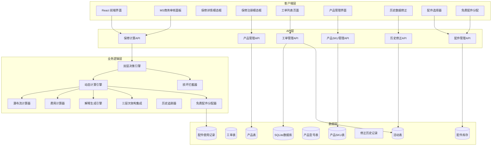
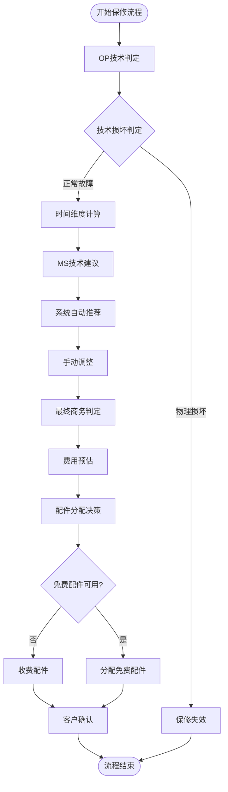
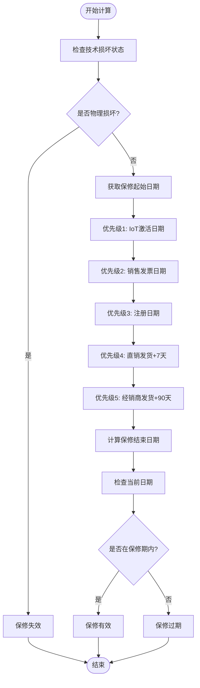
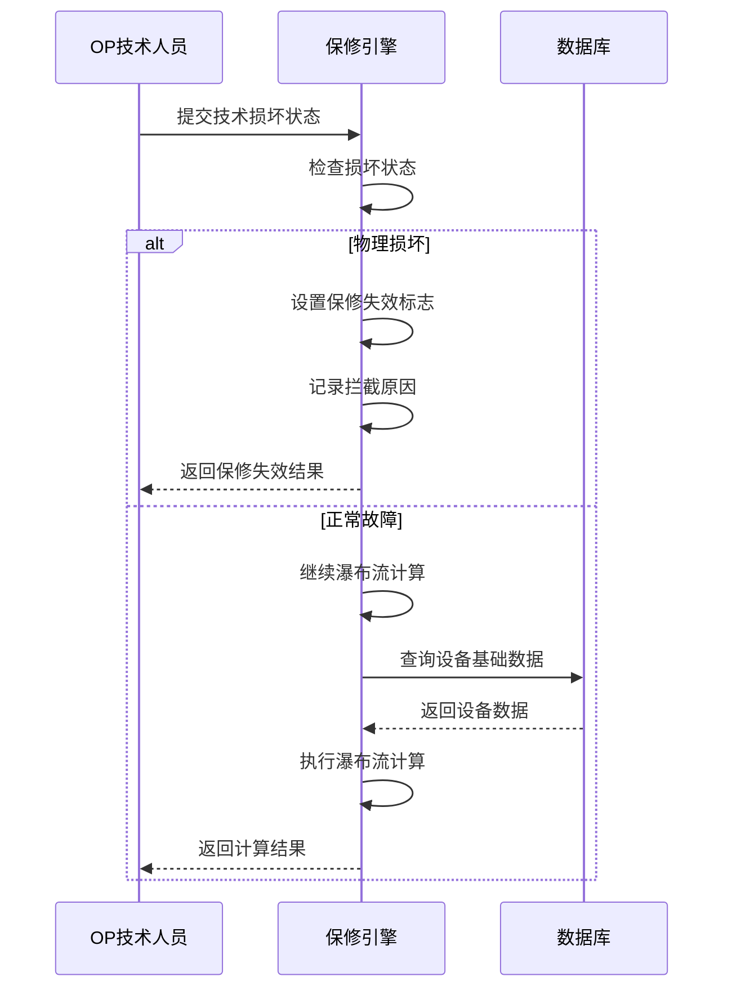
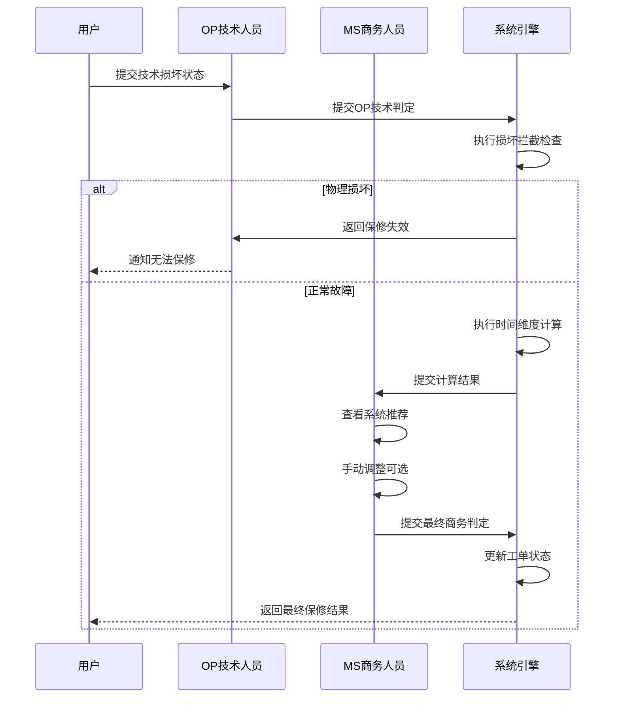
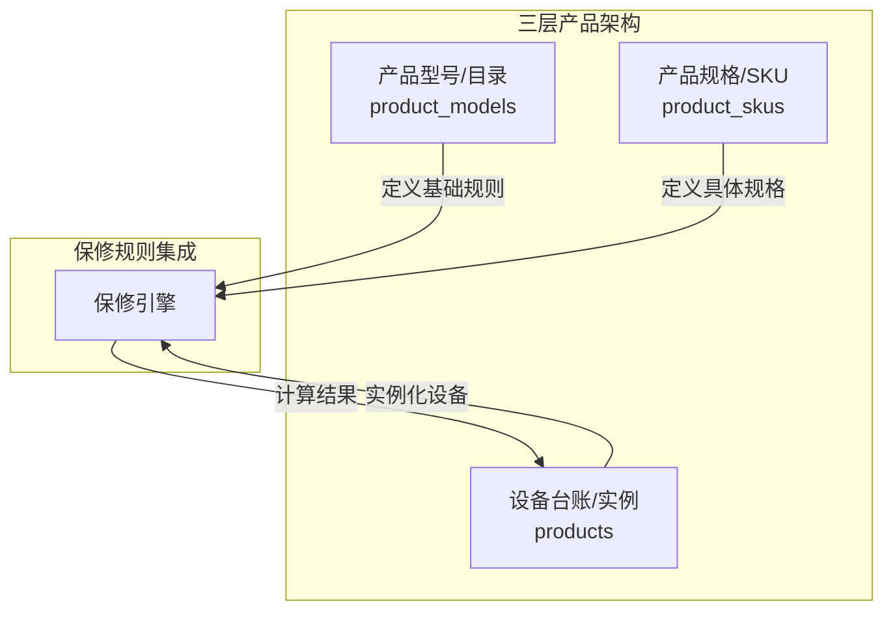
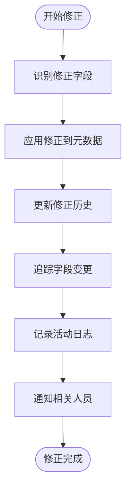
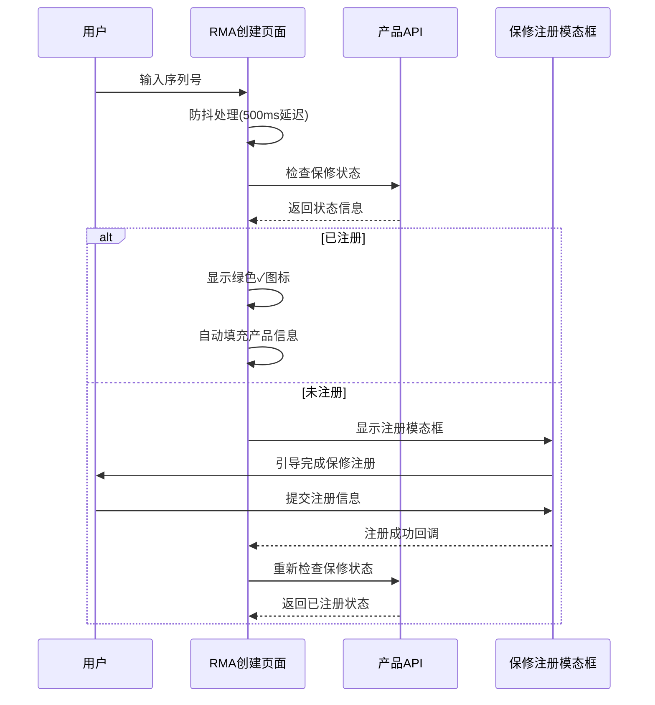

# 保修管理系统

<cite>
**本文档引用的文件**
- [server/service/warranty_service.js](file://server/service/warranty_service.js)
- [server/service/routes/warranty.js](file://server/service/routes/warranty.js)
- [server/service/routes/tickets.js](file://server/service/routes/tickets.js)
- [server/service/routes/ticket-activities.js](file://server/service/routes/ticket-activities.js)
- [client/src/components/Workspace/MSReviewPanel.tsx](file://client/src/components/Workspace/MSReviewPanel.tsx)
- [client/src/components/Workspace/UnifiedTicketDetail.tsx](file://client/src/components/Workspace/UnifiedTicketDetail.tsx)
- [client/src/components/RMATickets/RMATicketCreatePage.tsx](file://client/src/components/RMATickets/RMATicketCreatePage.tsx)
- [client/src/components/Service/ProductWarrantyRegistrationModal.tsx](file://client/src/components/Service/ProductWarrantyRegistrationModal.tsx)
- [client/src/components/Workspace/PartsSelector.tsx](file://client/src/components/Workspace/PartsSelector.tsx)
- [server/service/routes/products.js](file://server/service/routes/products.js)
- [server/service/migrations/033_product_architecture_upgrade.sql](file://server/service/migrations/033_product_architecture_upgrade.sql)
- [docs/Service_PRD_P2_warranty_update.md](file://docs/Service_PRD_P2_warranty_update.md)
- [docs/Service PRD_P2.md](file://docs/Service PRD_P2.md)
- [server/index.js](file://server/index.js)
- [package.json](file://package.json)
- [docker-compose.yml](file://docker-compose.yml)
</cite>

## 更新摘要
**变更内容**
- 重大增强：保修管理系统升级为双层决策流程，支持OP技术判定与MS商务判定分离
- 新增历史数据修正功能，支持工单数据的更正和历史记录追踪
- 增强MS审核面板，提供自动推荐和手动调整功能
- 完善两阶段费用结算流程，从单一阶段扩展为双层决策机制
- 增强前端保修详情展示，提供更详细的计算过程和历史追踪
- **新增**：增强Warranty服务路由以支持保修免费配件分配，在保修索赔处理过程中支持免费配件分配

## 目录
1. [项目概述](#项目概述)
2. [系统架构](#系统架构)
3. [核心组件](#核心组件)
4. [双层决策流程](#双层决策流程)
5. [动态保修计算引擎](#动态保修计算引擎)
6. [三层次产品架构集成](#三层次产品架构集成)
7. [历史数据修正功能](#历史数据修正功能)
8. [前端集成](#前端集成)
9. [数据模型](#数据模型)
10. [API 接口](#api-接口)
11. [部署配置](#部署配置)
12. [性能考虑](#性能考虑)
13. [故障排除指南](#故障排除指南)
14. [总结](#总结)

## 项目概述

保修管理系统是 Longhorn 服务 hub 的核心模块之一，负责处理产品保修相关的完整业务流程。该系统经过重大升级，实现了基于双层决策流程的智能保修管理，支持OP（运营部）技术判定与MS（市场部）商务判定分离的两阶段决策机制，建立了完善的历史数据修正和追踪体系。

系统主要功能包括：
- 双层决策流程：OP技术判定 + MS商务判定的两阶段决策
- 动态多因素保修状态自动计算
- 技术损坏判定拦截
- 瀑布流保修期计算
- 两阶段费用结算（预估费用 + 实际结算）
- 历史数据修正和追踪
- 保修注册管理
- 工单保修状态跟踪
- 详细计算过程解释
- 三层次产品架构集成
- **新增**：保修免费配件分配支持

## 系统架构



**图表来源**
- [server/service/routes/warranty.js:1-286](file://server/service/routes/warranty.js#L1-L286)
- [server/service/warranty_service.js:1-205](file://server/service/warranty_service.js#L1-L205)
- [client/src/components/Workspace/MSReviewPanel.tsx:1-808](file://client/src/components/Workspace/MSReviewPanel.tsx#L1-L808)
- [client/src/components/Workspace/PartsSelector.tsx:45-82](file://client/src/components/Workspace/PartsSelector.tsx#L45-L82)

## 核心组件

### 1. 双层决策引擎

双层决策引擎是系统的核心创新组件，实现了OP技术判定与MS商务判定的分离决策机制：



**图表来源**
- [client/src/components/Workspace/MSReviewPanel.tsx:90-119](file://client/src/components/Workspace/MSReviewPanel.tsx#L90-L119)
- [server/service/routes/warranty.js:211-285](file://server/service/routes/warranty.js#L211-L285)
- [client/src/components/Workspace/PartsSelector.tsx:45-82](file://client/src/components/Workspace/PartsSelector.tsx#L45-L82)

### 2. 动态保修计算引擎

动态保修计算引擎是系统的核心组件，实现了基于三层次产品架构的复杂保修状态判定逻辑，支持Model-SKU-Instance三层架构：



**图表来源**
- [server/service/routes/warranty.js:211-283](file://server/service/routes/warranty.js#L211-L283)

### 3. 技术损坏拦截器

系统实现了智能的损坏拦截机制，当 OP 判定为物理损坏时，直接终止保修流程：



**图表来源**
- [server/service/routes/warranty.js:222-228](file://server/service/routes/warranty.js#L222-L228)

### 4. 瀑布流计算逻辑

系统采用五级优先级的瀑布流计算方式，确保保修起始日期的准确性，并与三层次产品架构深度集成：

| 优先级 | 数据源 | 说明 | 适用场景 |
|--------|--------|------|----------|
| 1 | IoT激活日期 | 最高优先级，设备联网激活时间 | 智能设备，有IoT功能 |
| 2 | 销售发票日期 | 传统购买凭证，最可靠证据 | 有发票的购买记录 |
| 3 | 官网注册日期 | 用户主动注册保修信息 | 在线注册用户 |
| 4 | 直销发货日期+7天 | 直销模式下的特殊规则 | 直接销售给终端用户 |
| 5 | 经销商发货日期+90天 | 最低优先级，兜底方案 | 无其他证据时使用 |

**图表来源**
- [server/service/routes/warranty.js:234-265](file://server/service/routes/warranty.js#L234-L265)

## 双层决策流程

### 流程概述

系统实现了OP技术判定与MS商务判定的双层决策流程，确保保修判断的专业性和准确性：



**图表来源**
- [client/src/components/Workspace/MSReviewPanel.tsx:90-119](file://client/src/components/Workspace/MSReviewPanel.tsx#L90-L119)
- [server/service/routes/warranty.js:211-285](file://server/service/routes/warranty.js#L211-L285)

### 1. OP技术判定阶段

OP技术人员负责技术层面的损坏判定：

- **技术损坏状态**: `no_damage` | `physical_damage` | `uncertain`
- **技术建议**: `suggest_in_warranty` | `suggest_out_warranty` | `needs_verification`
- **拦截机制**: 物理损坏直接终止保修流程

### 2. MS商务判定阶段

MS商务人员负责商业层面的最终决策：

- **系统自动推荐**: 基于时间计算和OP建议的推荐
- **手动调整**: 支持手动覆盖系统推荐
- **最终判定**: `warranty_valid` | `warranty_void_damage` | `warranty_expired`

### 3. 决策矩阵

| 时间状态 | OP建议 | 系统推荐 | MS可调整 | 最终结果 |
|----------|--------|----------|----------|----------|
| 在保 | 保内 | 在保免费 | 否 | warranty_valid |
| 在保 | 保外/不确定 | 在保收费 | 是 | warranty_void_damage |
| 过保 | 任意 | 过保收费 | 否 | warranty_expired |
| 保内 | 保内 | 在保免费 | 否 | warranty_valid |
| 保内 | 保外/不确定 | 在保收费 | 是 | warranty_void_damage |

**章节来源**
- [client/src/components/Workspace/MSReviewPanel.tsx:90-119](file://client/src/components/Workspace/MSReviewPanel.tsx#L90-L119)
- [client/src/components/Workspace/MSReviewPanel.tsx:230-282](file://client/src/components/Workspace/MSReviewPanel.tsx#L230-L282)

## 动态保修计算引擎

### 核心算法实现

动态保修计算引擎基于以下核心算法，支持三层次产品架构：

#### 1. 产品类型识别
系统通过产品名称前缀自动识别产品类型，不同产品类型的默认保修期不同：

| 产品类型 | 默认保修期(月) | 识别前缀 |
|----------|----------------|----------|
| 摄影机 | 24 | MAVO, TERRA, KOMODO, EAGLE, KineMAX, KineMINI, KineRAW |
| 镜头 | 24 | KineLENS |
| 监视器 | 12 | KineMON |
| 配件 | 12 | KineMount, KineBACK, KineEVF |
| 默认 | 12 | 其他产品 |

#### 2. 动态计算逻辑
系统提供多种计算方式：

- **单个工单计算**: `calculateWarranty()` - 基于多因素计算单个工单的保修状态
- **批量计算**: `batchCheckWarranty()` - 批量计算多个工单的保修状态
- **实时计算**: `calculateWarrantyEndDate()` - 基于购买日期计算保修结束日期
- **产品级别计算**: `calculateWarrantyInfo()` - 基于产品数据计算保修状态

#### 3. 状态判定逻辑
系统根据当前日期与保修结束日期的关系，返回三种状态：

- **在保**: 当前日期 ≤ 保修结束日期
- **即将过期**: 在保期内剩余天数 ≤ 30天
- **已过期**: 当前日期 > 保修结束日期

#### 4. 详细解释功能
系统提供完整的计算过程解释，包括：
- 计算依据的详细说明
- 每个优先级的数据源说明
- 计算步骤的可视化展示
- 最终结果的状态说明

**章节来源**
- [server/service/warranty_service.js:8-106](file://server/service/warranty_service.js#L8-L106)
- [server/service/routes/warranty.js:211-283](file://server/service/routes/warranty.js#L211-L283)

## 三层次产品架构集成

### 架构升级概述

系统已从传统的单层产品管理升级为Model-SKU-Instance三层架构，以支持更复杂的保修规则和精确的设备管理：



**图表来源**
- [server/service/migrations/033_product_architecture_upgrade.sql:1-54](file://server/service/migrations/033_product_architecture_upgrade.sql#L1-L54)

### 1. 产品型号层 (Model)
产品型号层定义基础平台硬件型号，包含品牌信息、主视觉图片等：

- **核心字段**: `model_code`, `model_name`, `brand`, `internal_prefix`, `hero_image`
- **功能**: 定义基础平台硬件型号，支持品牌管理和视觉展示
- **保修规则**: 为SKU层提供基础保修规则模板

### 2. 产品规格层 (SKU)
产品规格层定义具体的销售形态，支持多种配置组合：

- **核心字段**: `sku_code`, `erp_code`, `display_name`, `spec_label`, `sku_image`
- **功能**: 定义具体的销售形态（套装、卡口、颜色），支持SKU级别的保修规则
- **关联关系**: 通过`model_id`关联到产品型号层

### 3. 设备实例层 (Instance)
设备实例层定义每一台具有唯一SN的设备实例：

- **核心字段**: `serial_number`, `sku_id`, `grade`, `warehouse`, `entry_channel`
- **功能**: 管理具体设备的生命周期，支持保修状态跟踪
- **保修依据**: 包含IoT激活、销售发票、注册等保修计算所需数据

**章节来源**
- [server/service/migrations/033_product_architecture_upgrade.sql:4-54](file://server/service/migrations/033_product_architecture_upgrade.sql#L4-L54)
- [docs/Service PRD_P2.md:711-796](file://docs/Service PRD_P2.md#L711-L796)

## 历史数据修正功能

### 功能概述

系统新增了完善的历史数据修正功能，支持对工单数据进行更正并追踪修正历史：



**图表来源**
- [server/service/routes/ticket-activities.js:718-745](file://server/service/routes/ticket-activities.js#L718-L745)

### 1. 修正历史追踪

系统自动追踪每次数据修正的历史：

- **修正计数**: `_correction_count` - 记录修正次数
- **最后修正时间**: `_last_corrected_at` - 记录最后一次修正时间
- **修正历史**: `_correction_history` - 存储完整的修正历史记录

### 2. 字段路径支持

系统支持复杂路径的字段修正：

- **简单字段**: `field_name`
- **嵌套字段**: `nested.field_name`
- **数组索引**: `array[0].field_name`

### 3. 内容原始备份

系统自动备份原始内容以便追溯：

- **原始内容**: `_original_content` - 存储修正前的内容
- **内容历史**: 支持多级内容变更追踪

### 4. 修正权限控制

系统实施严格的修正权限控制：

- **部门权限**: 不同部门只能修正特定字段
- **状态控制**: 只能在允许的状态下进行修正
- **审计日志**: 所有修正操作都会被记录

**章节来源**
- [server/service/routes/ticket-activities.js:718-745](file://server/service/routes/ticket-activities.js#L718-L745)

## 前端集成

### RMA 工单创建页面

RMA 工单创建页面集成了完整的保修检查功能：



**图表来源**
- [client/src/components/RMATickets/RMATicketCreatePage.tsx:73-110](file://client/src/components/RMATickets/RMATicketCreatePage.tsx#L73-L110)

### 保修详情模态框

保修详情模态框提供了完整的保修计算过程展示：

#### 1. 计算过程可视化
- **步骤1**: 显示保修起始日和计算依据
- **步骤2**: 显示保修结束日和标准保修期
- **步骤3**: 显示当前日期对比和状态

#### 2. 详细解释功能
- **计算依据**: 显示使用的数据源和优先级
- **OP技术判定**: 显示OP的技术损坏状态
- **MS审核**: 显示MS的预估费用和客户确认状态

#### 3. 状态展示
- **在保期内**: 绿色显示，免费维修
- **即将过期**: 黄色显示，提醒注意
- **已过期**: 红色显示，付费维修

**章节来源**
- [client/src/components/Workspace/WarrantyDetailModal.tsx:209-282](file://client/src/components/Workspace/WarrantyDetailModal.tsx#L209-L282)

### 保修注册模态框

保修注册模态框提供了完整的保修注册流程：

#### 1. 销售日期来源选择
- **发票日期**: 上传发票作为购买凭证
- **客户陈述**: 基于客户提供的购买日期

#### 2. 文件上传验证
系统支持 JPG、PNG、PDF 格式的发票文件，最大文件大小限制为 5MB。

#### 3. 归属信息管理
- **销售经销商**: 选择销售该产品的经销商
- **当前所有者**: 选择设备的实际使用者

**章节来源**
- [client/src/components/Service/ProductWarrantyRegistrationModal.tsx:326-369](file://client/src/components/Service/ProductWarrantyRegistrationModal.tsx#L326-L369)

### MS商务审核面板

MS商务审核面板是双层决策流程的核心组件：

#### 1. 自动推荐系统
- **时间维度计算**: 基于当前日期判断在保状态
- **OP建议整合**: 结合OP的技术建议
- **智能推荐**: 自动生成商务判定建议

#### 2. 手动调整功能
- **手动覆盖**: 支持手动调整系统推荐
- **调整原因**: 必须填写手动调整的原因
- **状态标记**: 区分自动推荐和手动调整

#### 3. 费用预估和确认
- **预估费用**: 支持填写费用范围
- **客户确认**: 记录客户确认方式
- **最终流转**: 根据确认状态决定流程走向

**章节来源**
- [client/src/components/Workspace/MSReviewPanel.tsx:90-119](file://client/src/components/Workspace/MSReviewPanel.tsx#L90-L119)
- [client/src/components/Workspace/MSReviewPanel.tsx:230-282](file://client/src/components/Workspace/MSReviewPanel.tsx#L230-L282)

### 免费配件分配功能

**新增功能**：系统现在支持在保修索赔处理过程中进行免费配件分配：

#### 1. 配件来源分类
- **总部库存**: `hq_inventory` - 公司总部库存
- **经销商库存**: `dealer_inventory` - 经销商库存
- **外部采购**: `external_purchase` - 外部采购配件
- **保修免费**: `warranty_free` - 保修免费配件

#### 2. 配件选择器集成
- **自动识别**: 根据保修状态自动识别可分配的免费配件
- **手动调整**: 支持手动选择和调整配件
- **成本计算**: 自动计算配件成本和保修状态

#### 3. 分配流程
- **状态检查**: 检查配件是否在保修范围内
- **库存验证**: 验证配件库存充足性
- **自动分配**: 自动分配免费配件到工单
- **手动确认**: 支持手动确认和调整分配结果

**章节来源**
- [client/src/components/Workspace/PartsSelector.tsx:45-82](file://client/src/components/Workspace/PartsSelector.tsx#L45-L82)

## 数据模型

### 数据库表结构

系统通过以下数据库表支持三层次产品架构、双层决策流程、历史数据修正功能和免费配件分配：

#### 1. 工单表扩展
新增的保修相关字段：

| 字段名 | 类型 | 约束 | 描述 |
|--------|------|------|------|
| `technical_damage_status` | TEXT | ENUM('no_damage','physical_damage','uncertain') | OP技术损坏判定 |
| `technical_warranty_suggestion` | TEXT | ENUM('suggest_in_warranty','suggest_out_warranty','needs_verification') | OP保修建议 |
| `warranty_calculation` | TEXT | JSON格式 | 保修计算结果 |
| `ms_review` | TEXT | JSON格式 | MS审核确认数据 |
| `final_settlement` | TEXT | JSON格式 | 最终结算数据 |
| `free_parts_allocation` | TEXT | JSON格式 | 免费配件分配记录 |

#### 2. 产品表扩展
产品表中的保修相关信息：

| 字段名 | 类型 | 描述 |
|--------|------|------|
| `warranty_months` | INTEGER | 保修月数 |
| `activation_date` | DATE | IoT激活日期 |
| `sales_invoice_date` | DATE | 销售发票日期 |
| `registration_date` | DATE | 官网注册日期 |
| `sales_channel` | TEXT | 销售渠道(DIRECT/DEALER) |
| `ship_to_dealer_date` | DATE | 发货给经销商日期 |
| `sku_id` | INTEGER | 关联到产品SKU |
| `grade` | TEXT | 品质等级(A/B/C) |
| `specification` | TEXT | 规格描述 |

#### 3. 新增产品SKU表
支持SKU级别的保修规则和规格管理：

| 字段名 | 类型 | 描述 |
|--------|------|------|
| `model_id` | INTEGER | 关联产品型号 |
| `sku_code` | TEXT | SKU编码(A系列) |
| `erp_code` | TEXT | ERP编码(9系列) |
| `display_name` | TEXT | 显示名称 |
| `spec_label` | TEXT | 规格标签 |
| `sku_image` | TEXT | SKU图片URL |

#### 4. 活动表扩展
支持历史数据修正追踪：

| 字段名 | 类型 | 描述 |
|--------|------|------|
| `_correction_history` | TEXT | JSON格式 | 修正历史记录 |
| `_last_corrected_at` | DATETIME | 最后修正时间 |
| `_correction_count` | INTEGER | 修正次数 |
| `_original_content` | TEXT | 原始内容备份 |

#### 5. 新增配件库存表
支持免费配件分配管理：

| 字段名 | 类型 | 描述 |
|--------|------|------|
| `part_number` | TEXT | 配件编号 |
| `part_name` | TEXT | 配件名称 |
| `warranty_category` | TEXT | 保修类别 |
| `current_stock` | INTEGER | 当前库存数量 |
| `min_stock_level` | INTEGER | 最低库存预警 |
| `supplier` | TEXT | 供应商信息 |
| `unit_cost` | DECIMAL | 单价 |

**章节来源**
- [server/service/migrations/033_product_architecture_upgrade.sql:1-54](file://server/service/migrations/033_product_architecture_upgrade.sql#L1-L54)
- [server/service/routes/ticket-activities.js:718-745](file://server/service/routes/ticket-activities.js#L718-L745)
- [client/src/components/Workspace/PartsSelector.tsx:45-82](file://client/src/components/Workspace/PartsSelector.tsx#L45-L82)

## API 接口

### 保修计算 API

系统提供完整的保修计算 API 接口：

#### 1. 保修计算接口
- **路径**: `POST /api/v1/warranty/calculate`
- **功能**: 计算指定工单的保修状态
- **请求参数**:
  - `ticket_id`: 工单ID
  - `technical_damage_status`: 技术损坏状态

#### 2. 产品保修检查接口
- **路径**: `GET /api/v1/warranty/product/:product_id`
- **功能**: 计算产品级别的保修状态
- **响应数据**: 详细的计算结果和状态信息

#### 3. 保修查询接口
- **路径**: `GET /api/v1/warranty/:ticketId`
- **功能**: 获取工单的保修计算结果
- **响应数据**: 技术损坏状态、保修建议、计算结果

#### 4. 保修保存接口
- **路径**: `POST /api/v1/warranty/:ticketId/save`
- **功能**: 保存保修计算结果到工单
- **请求参数**: `warranty_calculation`: 保修计算JSON对象

#### 5. 免费配件分配接口
- **路径**: `POST /api/v1/warranty/:ticketId/free-parts`
- **功能**: 为工单分配免费配件
- **请求参数**:
  - `part_numbers`: 配件编号数组
  - `allocation_reason`: 分配原因
  - `allocated_by`: 分配人

### 工单管理 API

#### 1. 工单数据修正接口
- **路径**: `PATCH /api/v1/tickets/:ticketId`
- **功能**: 修正工单数据并记录历史
- **请求参数**: 修正字段、修正原因、修正人

#### 2. 修正历史查询接口
- **路径**: `GET /api/v1/tickets/:ticketId/audit-history`
- **功能**: 查询工单的修正历史
- **响应数据**: 完整的修正历史记录

### 产品管理 API

#### 1. 产品保修检查
- **路径**: `GET /api/v1/products/check-warranty`
- **功能**: 检查产品是否有保修依据
- **查询参数**: `serial_number`: 产品序列号
- **响应**: 是否有保修依据、产品信息、保修状态

#### 2. 产品保修注册
- **路径**: `POST /api/v1/products/register-warranty`
- **功能**: 注册产品的保修信息
- **请求参数**: 产品序列号、销售日期、保修期等

### 配件管理 API

#### 1. 配件库存查询
- **路径**: `GET /api/v1/parts/inventory`
- **功能**: 查询配件库存状态
- **查询参数**: `category`: 配件类别、`search`: 搜索关键词

#### 2. 免费配件分配
- **路径**: `POST /api/v1/parts/free-allocation`
- **功能**: 分配免费配件到工单
- **请求参数**: 
  - `ticket_id`: 工单ID
  - `part_numbers`: 配件编号数组
  - `reason`: 分配原因

**章节来源**
- [server/service/routes/warranty.js:34-198](file://server/service/routes/warranty.js#L34-L198)
- [server/service/routes/products.js:37-120](file://server/service/routes/products.js#L37-L120)
- [server/service/routes/tickets.js:1-200](file://server/service/routes/tickets.js#L1-L200)
- [client/src/components/Workspace/PartsSelector.tsx:45-82](file://client/src/components/Workspace/PartsSelector.tsx#L45-L82)

## 部署配置

### Docker 郃置

系统支持 Docker 容器化部署，配置文件如下：

```yaml
version: '3.8'
services:
  longhorn:
    build:
      context: .
      dockerfile: Dockerfile
    container_name: longhorn-app
    restart: unless-stopped
    ports:
      - "4000:4000"
    environment:
      - NODE_ENV=production
      - PORT=4000
      - JWT_SECRET=your-secret-key-change-in-production
      - DB_PATH=/app/data/longhorn.db
    volumes:
      - ./data:/app/data
      - ./logs:/app/logs
      - ./uploads:/app/server/uploads
    healthcheck:
      test: ["CMD", "wget", "--no-verbose", "--tries=1", "--spider", "http://localhost:4000/api/health"]
      interval: 30s
      timeout: 10s
      retries: 3
      start_period: 40s
```

### 本地开发环境

系统提供完整的本地开发环境配置：

#### 1. 项目安装
```bash
npm run install-all
```

#### 2. 开发服务器启动
```bash
npm run server-dev
```

#### 3. 生产环境部署
```bash
npm run deploy
```

**章节来源**
- [docker-compose.yml:1-52](file://docker-compose.yml#L1-L52)
- [package.json:4-12](file://package.json#L4-L12)

## 性能考虑

### 1. 数据库优化

系统采用 SQLite 作为主要数据库，针对三层次架构、双层决策流程、历史数据修正和免费配件分配进行了以下优化：

- **索引优化**: 为常用查询字段建立索引，包括`sku_id`、`model_id`、`serial_number`、`part_number`
- **查询缓存**: 对频繁查询的结果进行缓存
- **批量操作**: 支持批量保修状态更新和配件分配
- **分区查询**: 基于SKU和型号的分区查询优化
- **历史追踪优化**: 为修正历史表建立专用索引
- **配件库存优化**: 为配件库存查询建立复合索引

### 2. 前端性能优化

- **防抖机制**: 序列号输入采用500ms防抖，减少API调用频率
- **懒加载**: 保修注册模态框按需加载
- **状态缓存**: 保修状态在组件间共享，避免重复计算
- **可视化渲染**: 详细解释功能采用渐进式渲染
- **自动推荐缓存**: MS审核面板的推荐结果进行缓存
- **配件选择优化**: 配件选择器支持搜索和缓存

### 3. API 性能优化

- **请求合并**: 支持批量工单保修状态查询
- **条件查询**: 仅返回必要的字段
- **分页处理**: 大数据量查询时使用分页
- **缓存策略**: 对计算结果进行短期缓存
- **历史数据分页**: 修正历史记录支持分页查询
- **配件库存分页**: 配件查询支持分页和过滤

## 故障排除指南

### 常见问题及解决方案

#### 1. 保修状态计算异常

**问题**: 保修状态计算结果不准确
**解决方案**:
1. 检查设备基础数据是否完整
2. 验证技术损坏状态输入
3. 确认计算日期是否正确
4. 检查优先级数据源的有效性
5. 验证三层次架构数据的完整性

#### 2. 双层决策流程异常

**问题**: MS审核面板无法显示推荐结果
**解决方案**:
1. 检查OP技术判定数据是否正确
2. 验证时间维度计算结果
3. 确认系统推荐逻辑是否正常
4. 检查网络连接和API响应
5. 验证用户权限和角色配置

#### 3. 历史数据修正失败

**问题**: 工单数据修正后历史记录不更新
**解决方案**:
1. 检查修正字段的权限控制
2. 验证修正状态的合法性
3. 确认活动表的写入权限
4. 检查数据库事务的完整性
5. 验证修正历史的JSON格式

#### 4. 免费配件分配异常

**问题**: 免费配件无法正确分配
**解决方案**:
1. 检查配件库存是否充足
2. 验证工单的保修状态
3. 确认配件类别是否匹配
4. 检查分配逻辑和权限
5. 验证配件分配记录的完整性

#### 5. 三层次架构数据同步问题

**问题**: SKU和实例数据不一致
**解决方案**:
1. 检查`sku_id`关联关系
2. 验证产品型号和SKU的对应关系
3. 确认实例化设备的SKU信息
4. 检查数据迁移脚本执行情况

#### 6. 保修注册失败

**问题**: 保修注册过程中出现错误
**解决方案**:
1. 检查发票文件格式和大小
2. 验证销售日期格式
3. 确认必填字段是否完整
4. 检查产品型号和SKU的匹配关系

#### 7. API 请求超时

**问题**: 保修计算API响应缓慢
**解决方案**:
1. 检查数据库连接状态
2. 验证网络连接
3. 查看服务器负载情况
4. 检查缓存配置

### 调试工具

系统提供以下调试工具辅助问题排查：

- **日志监控**: 详细的API调用日志
- **错误追踪**: 前端错误捕获和上报
- **性能监控**: 关键操作的性能指标
- **计算过程追踪**: 详细的计算步骤日志
- **修正历史追踪**: 完整的修正操作日志
- **配件分配追踪**: 完整的免费配件分配记录

**章节来源**
- [server/service/routes/warranty.js:77-80](file://server/service/routes/warranty.js#L77-L80)
- [server/service/routes/ticket-activities.js:718-745](file://server/service/routes/ticket-activities.js#L718-L745)
- [client/src/components/Workspace/PartsSelector.tsx:45-82](file://client/src/components/Workspace/PartsSelector.tsx#L45-L82)

## 总结

保修管理系统通过重大升级，实现了基于双层决策流程的智能保修管理，显著提升了系统的专业化和规范化水平。系统的主要优势包括：

### 核心优势

1. **双层决策流程**: OP技术判定与MS商务判定分离，确保专业性和准确性
2. **动态计算引擎**: 基于IoT激活日期、销售发票日期、注册日期和发货信息的多因素计算，确保保修期计算的准确性
3. **三层次架构集成**: 支持Model-SKU-Instance三层架构，提供更精确的保修规则和设备管理
4. **智能拦截**: OP技术判定与MS商业判定分离，提高决策质量和效率
5. **历史数据追踪**: 完善的修正历史记录，支持数据溯源和审计
6. **详细解释**: 完整的计算过程可视化，提供透明的决策依据
7. **用户体验**: 增强的前端集成，提供直观的用户操作体验
8. **免费配件分配**: **新增**：支持在保修索赔处理过程中进行免费配件分配，提升客户满意度

### 技术特色

- **模块化设计**: 各组件职责清晰，便于维护和扩展
- **数据一致性**: 通过数据库约束保证数据完整性
- **性能优化**: 针对高频操作进行专门优化
- **安全可靠**: 完善的权限控制和数据保护机制
- **可视化展示**: 详细的计算过程和状态展示
- **历史追踪**: 完整的修正历史记录和审计功能
- **配件管理**: **新增**：完善的配件库存管理和分配机制

### 未来发展方向

1. **AI辅助**: 集成AI技术进行智能保修判定
2. **移动端支持**: 开发移动端应用，支持现场服务
3. **数据分析**: 增强保修数据分析功能，提供决策支持
4. **自动化**: 进一步自动化保修流程，减少人工干预
5. **国际化**: 支持多语言界面和多地区法规
6. **预测分析**: 基于历史数据进行保修风险预测
7. **配件优化**: **新增**：优化免费配件分配算法，提高配件利用率

该系统为 Longhorn 服务 hub 提供了坚实的保修管理基础，为后续的功能扩展和技术升级奠定了良好的技术基础。通过双层决策流程、三层次架构集成、历史数据修正功能和免费配件分配支持，系统显著提升了保修管理的准确性和透明度，为用户提供更好的服务体验。