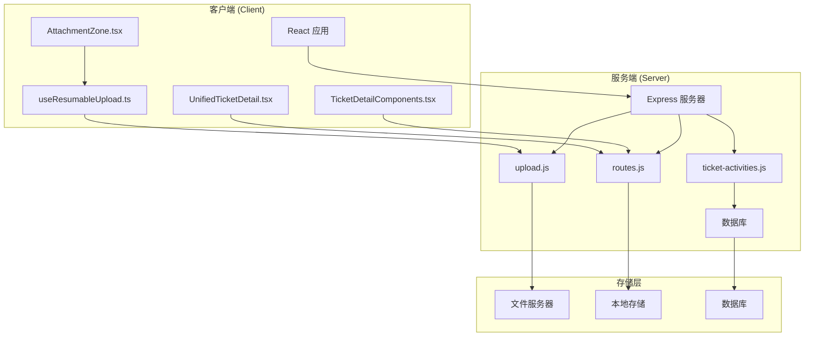
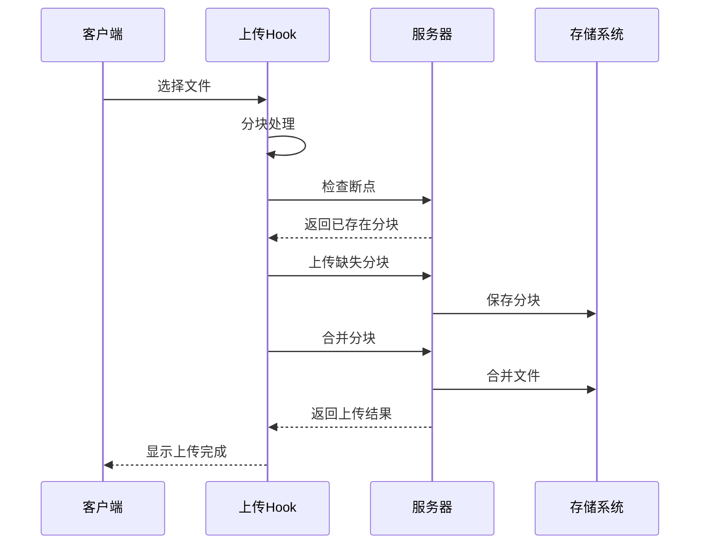
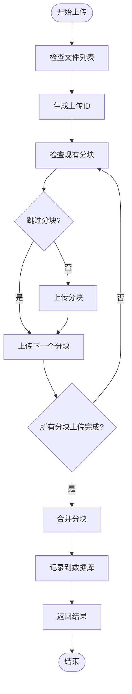
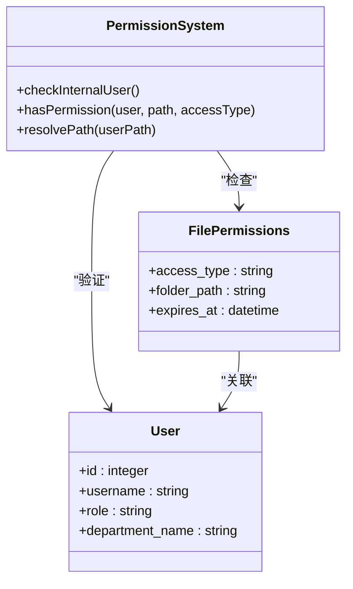
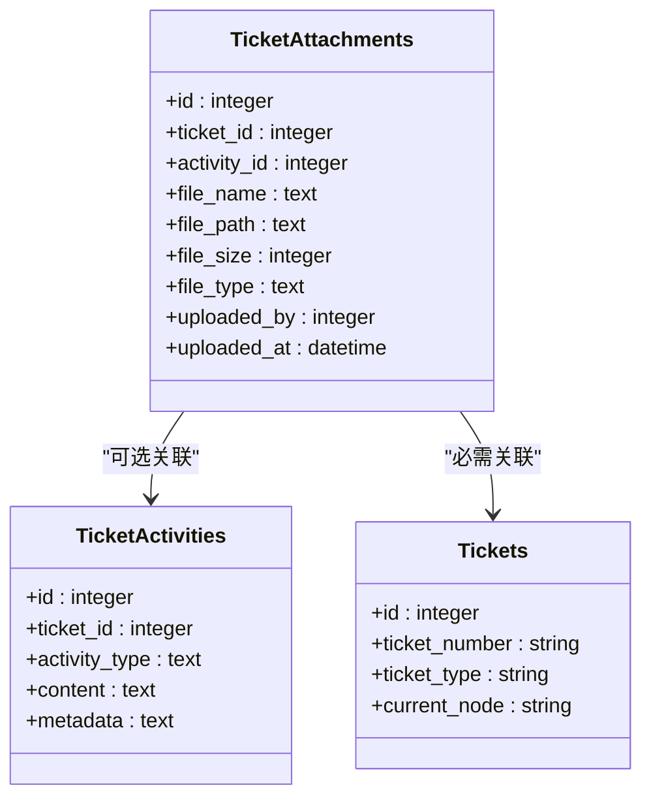
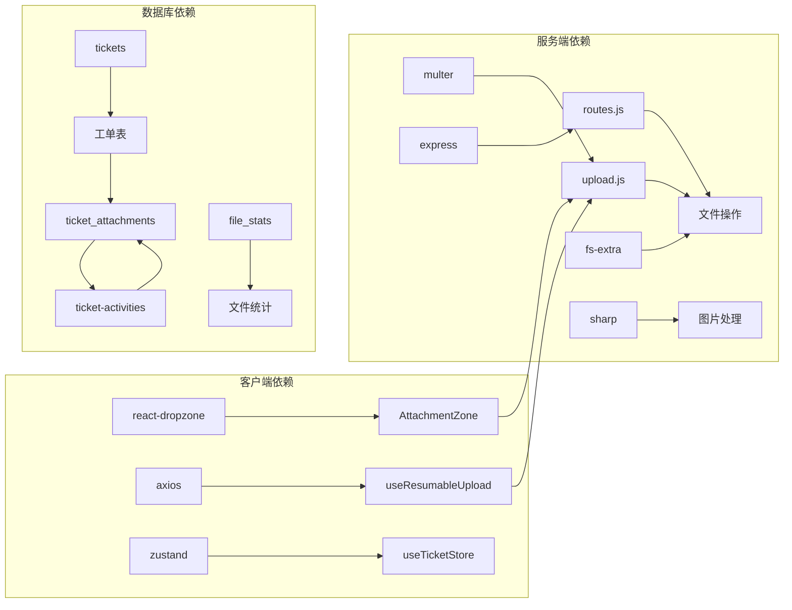

# 工单附件管理系统

<cite>
**本文档引用的文件**
- [AttachmentZone.tsx](file://client/src/components/Service/AttachmentZone.tsx)
- [useResumableUpload.ts](file://client/src/hooks/useResumableUpload.ts)
- [upload.js](file://server/service/routes/upload.js)
- [routes.js](file://server/files/routes.js)
- [UnifiedTicketDetailPage.tsx](file://client/src/components/Service/UnifiedTicketDetailPage.tsx)
- [UnifiedTicketDetail.tsx](file://client/src/components/Workspace/UnifiedTicketDetail.tsx)
- [TicketDetailComponents.tsx](file://client/src/components/Workspace/TicketDetailComponents.tsx)
- [ticket-activities.js](file://server/service/routes/ticket-activities.js)
- [index.js](file://server/index.js)
- [039_add_attachments_count.sql](file://server/migrations/039_add_attachments_count.sql)
</cite>

## 目录
1. [项目概述](#项目概述)
2. [项目结构](#项目结构)
3. [核心组件](#核心组件)
4. [架构概览](#架构概览)
5. [详细组件分析](#详细组件分析)
6. [依赖关系分析](#依赖关系分析)
7. [性能考虑](#性能考虑)
8. [故障排除指南](#故障排除指南)
9. [结论](#结论)

## 项目概述

工单附件管理系统是一个基于React和Node.js构建的企业级工单管理解决方案，专门用于处理工单相关的文件附件上传、存储和管理。该系统采用前后端分离架构，支持断点续传、批量上传、权限控制和多种文件类型的处理。

系统主要功能包括：
- 工单附件的拖拽上传和预览
- 断点续传和批量文件处理
- 权限控制和访问日志
- 文件分类存储和检索
- 工单活动时间轴集成
- 多种文件格式支持（图片、视频、PDF、文档等）

## 项目结构

**图表来源**
- [AttachmentZone.tsx:1-108](file://client/src/components/Service/AttachmentZone.tsx#L1-L108)
- [useResumableUpload.ts:1-340](file://client/src/hooks/useResumableUpload.ts#L1-L340)
- [upload.js:1-205](file://server/service/routes/upload.js#L1-L205)

**章节来源**
- [AttachmentZone.tsx:1-108](file://client/src/components/Service/AttachmentZone.tsx#L1-L108)
- [useResumableUpload.ts:1-340](file://client/src/hooks/useResumableUpload.ts#L1-L340)
- [upload.js:1-205](file://server/service/routes/upload.js#L1-L205)

## 核心组件

### 附件上传区域组件

AttachmentZone组件提供了直观的拖拽上传界面，支持多种文件类型的预览和管理。

**主要特性：**
- 拖拽文件上传
- 实时文件预览
- 图片、视频、文档类型识别
- 删除功能
- 国际化支持

### 断点续传Hook

useResumableUpload Hook实现了完整的断点续传机制，确保大文件上传的可靠性。

**核心功能：**
- 分块上传（默认5MB）
- 断点续传检测
- 进度跟踪
- 取消上传
- 速度计算

### 服务器端上传处理

服务器端提供RESTful API处理各种上传场景，包括工单附件和通用文件上传。

**上传类型：**
- 工单附件上传
- 保修发票上传
- 产品照片上传
- 临时文件上传

**章节来源**
- [AttachmentZone.tsx:1-108](file://client/src/components/Service/AttachmentZone.tsx#L1-L108)
- [useResumableUpload.ts:1-340](file://client/src/hooks/useResumableUpload.ts#L1-L340)
- [upload.js:1-205](file://server/service/routes/upload.js#L1-L205)

## 架构概览

**图表来源**
- [useResumableUpload.ts:178-307](file://client/src/hooks/useResumableUpload.ts#L178-L307)
- [upload.js:96-154](file://server/service/routes/upload.js#L96-L154)

系统采用分层架构设计：

1. **表现层**：React组件负责用户交互和状态管理
2. **业务逻辑层**：Hook和工具函数处理复杂的上传逻辑
3. **数据访问层**：服务器端路由处理文件操作
4. **存储层**：文件系统和数据库存储

## 详细组件分析

### 附件上传流程

**图表来源**
- [useResumableUpload.ts:178-307](file://client/src/hooks/useResumableUpload.ts#L178-L307)
- [upload.js:116-146](file://server/service/routes/upload.js#L116-L146)

### 权限控制系统

系统实现了多层次的权限控制机制：

**图表来源**
- [routes.js:12-94](file://server/files/routes.js#L12-L94)

**章节来源**
- [routes.js:12-94](file://server/files/routes.js#L12-L94)

### 工单附件集成

**图表来源**
- [index.js:258-276](file://server/index.js#L258-L276)
- [ticket-activities.js:346-376](file://server/service/routes/ticket-activities.js#L346-L376)

**章节来源**
- [index.js:258-276](file://server/index.js#L258-L276)
- [ticket-activities.js:346-376](file://server/service/routes/ticket-activities.js#L346-L376)

### 文件存储策略

系统采用灵活的存储策略，支持多种存储位置：

| 存储类型 | 路径 | 用途 | 权限 |
|---------|------|------|------|
| 文件服务器 | /Volumes/fileserver/Service | 生产环境主存储 | 读写权限 |
| 本地存储 | data/Service | 开发环境备份 | 读写权限 |
| 临时存储 | .chunks | 分块上传缓存 | 临时写入 |

**章节来源**
- [upload.js:16-24](file://server/service/routes/upload.js#L16-L24)
- [routes.js:41-46](file://server/files/routes.js#L41-L46)

## 依赖关系分析

**图表来源**
- [AttachmentZone.tsx:1-5](file://client/src/components/Service/AttachmentZone.tsx#L1-L5)
- [useResumableUpload.ts:6-9](file://client/src/hooks/useResumableUpload.ts#L6-L9)
- [upload.js:6-8](file://server/service/routes/upload.js#L6-L8)

**章节来源**
- [AttachmentZone.tsx:1-5](file://client/src/components/Service/AttachmentZone.tsx#L1-L5)
- [useResumableUpload.ts:6-9](file://client/src/hooks/useResumableUpload.ts#L6-L9)
- [upload.js:6-8](file://server/service/routes/upload.js#L6-L8)

## 性能考虑

### 上传性能优化

1. **分块上传**：默认5MB分块大小，平衡内存使用和网络效率
2. **断点续传**：智能检测已上传分块，避免重复传输
3. **并发控制**：限制同时上传的分块数量
4. **进度跟踪**：实时显示上传进度和速度

### 存储性能优化

1. **文件服务器**：生产环境使用网络存储提高可靠性
2. **缓存策略**：预加载常用目录结构
3. **索引优化**：数据库添加必要的索引提高查询性能
4. **清理机制**：定期清理临时文件和过期数据

### 内存管理

1. **流式处理**：大文件使用流式处理避免内存溢出
2. **垃圾回收**：及时释放文件对象和Blob URL
3. **分页加载**：大量文件时使用分页加载减少内存压力

## 故障排除指南

### 常见问题及解决方案

**问题1：上传中断**
- 检查网络连接稳定性
- 验证文件服务器可用性
- 确认磁盘空间充足
- 查看浏览器控制台错误信息

**问题2：权限不足**
- 确认用户角色和部门权限
- 检查目标目录的访问权限
- 验证文件路径安全性

**问题3：文件类型不支持**
- 检查文件扩展名和MIME类型
- 确认服务器端文件过滤器配置
- 验证客户端文件接受类型设置

**问题4：存储路径问题**
- 检查文件服务器挂载状态
- 验证相对路径解析逻辑
- 确认目录权限设置

**章节来源**
- [upload.js:60-73](file://server/service/routes/upload.js#L60-L73)
- [routes.js:12-18](file://server/files/routes.js#L12-L18)

### 调试工具

1. **服务器端日志**：详细记录上传过程和错误信息
2. **客户端控制台**：监控网络请求和状态变化
3. **数据库查询**：检查附件记录和工单关联
4. **文件系统检查**：验证文件存储和权限

## 结论

工单附件管理系统是一个功能完整、架构清晰的企业级解决方案。系统通过以下特点实现了高效可靠的工单附件管理：

1. **用户体验友好**：直观的拖拽上传界面和实时预览
2. **技术实现先进**：断点续传、分块上传等现代技术
3. **安全性保障**：多层次权限控制和访问日志
4. **可扩展性强**：模块化设计支持功能扩展
5. **性能优化**：针对大文件和高并发场景的优化

该系统为企业提供了完整的工单附件管理能力，能够满足各种规模企业的业务需求。通过持续的优化和维护，系统将继续为企业提供稳定可靠的服务。