# 服务工作流增强

<cite>
**本文档引用的文件**
- [client/src/App.tsx](file://client/src/App.tsx)
- [client/src/store/useTicketStore.ts](file://client/src/store/useTicketStore.ts)
- [client/src/components/Service/ServiceOverviewPage.tsx](file://client/src/components/Service/ServiceOverviewPage.tsx)
- [client/src/components/Service/WorkspacePage.tsx](file://client/src/components/Service/WorkspacePage.tsx)
- [client/src/components/Service/UnifiedTicketDetailPage.tsx](file://client/src/components/Service/UnifiedTicketDetailPage.tsx)
- [client/src/hooks/useNavigationState.ts](file://client/src/hooks/useNavigationState.ts)
- [client/src/store/useViewAsStore.ts](file://client/src/store/useViewAsStore.ts)
- [client/src/components/UI/SortDropdown.tsx](file://client/src/components/UI/SortDropdown.tsx)
- [client/src/i18n/translations.ts](file://client/src/i18n/translations.ts)
- [server/index.js](file://server/index.js)
- [server/service/routes/tickets.js](file://server/service/routes/tickets.js)
- [server/service/routes/service-records.js](file://server/service/routes/service-records.js)
- [client/src/components/Workspace/PIEditor.tsx](file://client/src/components/Workspace/PIEditor.tsx)
- [client/src/components/Workspace/RepairReportEditor.tsx](file://client/src/components/Workspace/RepairReportEditor.tsx)
- [client/src/components/Workspace/OpRepairReportEditor.tsx](file://client/src/components/Workspace/OpRepairReportEditor.tsx)
- [client/src/components/Workspace/DocumentReviewModal.tsx](file://client/src/components/Workspace/DocumentReviewModal.tsx)
- [client/src/components/Workspace/FinalSettlementModal.tsx](file://client/src/components/Workspace/FinalSettlementModal.tsx)
- [client/src/components/Workspace/MSReviewPanel.tsx](file://client/src/components/Workspace/MSReviewPanel.tsx)
- [client/src/components/Workspace/ClosingHandoverModal.tsx](file://client/src/components/Workspace/ClosingHandoverModal.tsx)
- [server/service/routes/rma-documents.js](file://server/service/routes/rma-documents.js)
- [server/service/migrations/033_product_architecture_upgrade.sql](file://server/service/migrations/033_product_architecture_upgrade.sql)
- [server/service/routes/warranty.js](file://server/service/routes/warranty.js)
- [server/service/routes/products.js](file://server/service/routes/products.js)
- [server/service/routes/product-skus.js](file://server/service/routes/product-skus.js)
- [server/service/routes/product-models-admin.js](file://server/service/routes/product-models-admin.js)
- [docs/Service PRD_P2.md](file://docs/Service PRD_P2.md)
- [docs/Service_PRD_P2_warranty_update.md](file://docs/Service_PRD_P2_warranty_update.md)
- [docs/kb/rma-process-sop.md](file://docs/kb/rma-process-sop.md)
- [client/src/components/Workspace/UnifiedTicketDetail.tsx](file://client/src/components/Workspace/UnifiedTicketDetail.tsx)
- [client/src/components/Workspace/TicketDetailComponents.tsx](file://client/src/components/Workspace/TicketDetailComponents.tsx)
- [server/service/routes/ticket-activities.js](file://server/service/routes/ticket-activities.js)
- [client/src/components/Workspace/MentionCommentInput.tsx](file://client/src/components/Workspace/MentionCommentInput.tsx)
- [server/service/routes/system.js](file://server/service/routes/system.js)
</cite>

## 更新摘要
**变更内容**
- 新增活动修正系统，支持对已提交活动的精确字段更正和审计追踪
- 增强附件处理能力，支持HEIC/HEIF格式预览和高质量缩略图生成
- 改进结案交接功能，强化文档发布前置检查和结案确认机制
- 优化活动时间轴分类，区分讨论与诊断、系统变更两类活动
- 完善附件网格布局，支持1-5个附件的不同展示模式

## 目录
1. [项目概述](#项目概述)
2. [项目结构](#项目结构)
3. [核心组件](#核心组件)
4. [架构概览](#架构概览)
5. [详细组件分析](#详细组件分析)
6. [活动修正系统](#活动修正系统)
7. [增强的附件处理能力](#增强的附件处理能力)
8. [改进的结案交接功能](#改进的结案交接功能)
9. [优化的活动时间轴](#优化的活动时间轴)
10. [依赖关系分析](#依赖关系分析)
11. [性能考虑](#性能考虑)
12. [故障排除指南](#故障排除指南)
13. [结论](#结论)

## 项目概述

Longhorn 是一个企业级服务工作流管理系统，专注于增强服务工单处理流程。该项目实现了完整的 P2 架构升级，采用统一工单模型设计，支持三种工单类型：咨询工单（Inquiry）、RMA 工单（RMA）和经销商维修工单（DealerRepair）。

系统的核心特性包括：
- **统一工单架构**：单表多态设计，支持三种工单类型的统一管理
- **智能工作流**：基于部门职责的自动化分发机制
- **可视化仪表盘**：为管理层提供实时的工单状态监控
- **三视图工作台**：个人任务、提及任务和部门队列的统一界面
- **自动分发规则**：基于部门和节点的智能工单分配
- **增强的列排序系统**：支持按优先级、ID、标题、状态、SLA 期限排序
- **灵活的列宽调整**：用户可自定义列宽布局
- **优化的视觉系统**：改进的优先级徽章和星标系统
- **专业文档工作流**：完整的PI和维修报告管理流程
- **商务审核机制**：集成保修计算和费用确认流程
- **费用结算系统**：支持保内外维修的费用结算和流转控制
- **三层次产品架构**：支持产品目录、商品规格和设备台账的完整管理体系
- **增强的保修计算**：实现五级水位线计算和损坏拦截机制
- **改进的交接流程**：强化文档发布前置检查和结案确认机制
- **运营维修报告编辑器**：支持OP部门的维修记录编辑和管理
- **活动修正系统**：支持对已提交活动的精确字段更正和审计追踪
- **增强附件处理**：支持HEIC/HEIF格式预览和高质量缩略图生成
- **优化活动分类**：智能区分讨论与诊断、系统变更两类活动

## 项目结构

```mermaid
graph TB
subgraph "客户端 (Client)"
A[App.tsx 根组件]
B[ServiceOverviewPage 服务概览]
C[WorkspacePage 工作台]
D[UnifiedTicketDetailPage 统一详情]
E[useTicketStore 状态管理]
F[useNavigationState 导航状态]
G[SortDropdown 排序下拉]
H[translations 国际化]
I[PIEditor 形式发票编辑器]
J[RepairReportEditor 维修报告编辑器]
K[OpRepairReportEditor 运营维修报告编辑器]
L[DocumentReviewModal 文档审查模态框]
M[FinalSettlementModal 最终结算模态框]
N[MSReviewPanel 商务审核面板]
O[ClosingHandoverModal 结案交接模态框]
P[TicketDetailComponents 工单详情组件]
Q[MentionCommentInput 提及评论输入]
end
subgraph "服务端 (Server)"
R[index.js 应用入口]
S[tickets.js 工单路由]
T[service-records.js 服务记录]
U[rma-documents.js RMA文档路由]
V[warranty.js 保修计算路由]
W[products.js 产品路由]
X[product-skus.js 商品规格路由]
Y[product-models-admin.js 产品模型路由]
Z[ticket-activities.js 工单活动路由]
AA[system.js 系统路由]
BB[权限中间件]
CC[SLA 服务]
DD[AI 服务]
EE[备份服务]
end
subgraph "数据库层"
FF[工单表 tickets]
GG[附件表 attachments]
HH[活动表 activities]
II[参与者表 participants]
JJ[形式发票表 proforma_invoices]
KK[维修报告表 repair_reports]
LL[文档审计日志 document_audit_log]
MM[PI序列号表 pi_sequences]
NN[维修报告序列号表 report_sequences]
OO[产品模型表 product_models]
PP[商品规格表 product_skus]
QQ[产品实例表 products]
RR[保修计算表 warranty_calculations]
SS[财务确认表 ge_review]
TT[产品架构升级迁移]
UU[缩略图缓存 thumbnails]
VV[附件存储 Service]
end
A --> B
A --> C
A --> D
A --> G
A --> I
A --> J
A --> K
A --> L
A --> M
A --> N
A --> O
A --> P
A --> Q
B --> R
C --> R
D --> R
E --> R
F --> A
H --> A
R --> S
R --> T
R --> U
R --> V
R --> W
R --> X
R --> Y
R --> Z
R --> AA
S --> FF
S --> GG
S --> HH
S --> II
Z --> FF
Z --> GG
Z --> HH
U --> JJ
U --> KK
U --> LL
U --> MM
U --> NN
V --> RR
W --> OO
W --> PP
W --> QQ
X --> PP
Y --> OO
TT --> OO
TT --> PP
TT --> QQ
UU --> GG
VV --> GG
```

**图表来源**
- [client/src/App.tsx:176-331](file://client/src/App.tsx#L176-L331)
- [client/src/components/UI/SortDropdown.tsx:1-129](file://client/src/components/UI/SortDropdown.tsx#L1-L129)
- [server/index.js:1-80](file://server/index.js#L1-L80)
- [client/src/components/Workspace/PIEditor.tsx:1-752](file://client/src/components/Workspace/PIEditor.tsx#L1-L752)
- [client/src/components/Workspace/RepairReportEditor.tsx:1-1143](file://client/src/components/Workspace/RepairReportEditor.tsx#L1-L1143)
- [client/src/components/Workspace/OpRepairReportEditor.tsx:1-577](file://client/src/components/Workspace/OpRepairReportEditor.tsx#L1-L577)
- [server/service/routes/rma-documents.js:1-1181](file://server/service/routes/rma-documents.js#L1-L1181)
- [server/service/migrations/033_product_architecture_upgrade.sql:1-54](file://server/service/migrations/033_product_architecture_upgrade.sql#L1-L54)
- [server/service/routes/warranty.js:1-284](file://server/service/routes/warranty.js#L1-L284)

**章节来源**
- [client/src/App.tsx:1-800](file://client/src/App.tsx#L1-L800)
- [server/index.js:1-800](file://server/index.js#L1-L800)

## 核心组件

### 1. 统一工单架构

系统采用单表多态设计，通过 `ticket_type` 字段区分不同类型的工单：

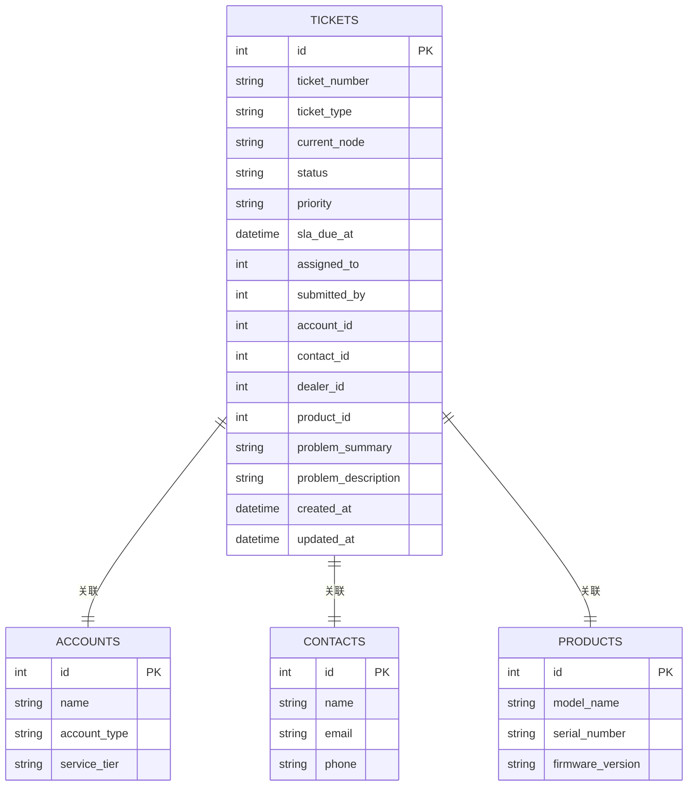
```mermaid
erDiagram
TICKETS {
int id PK
string ticket_number
string ticket_type
string current_node
string status
string priority
datetime sla_due_at
int assigned_to
int submitted_by
int account_id
int contact_id
int dealer_id
int product_id
string problem_summary
string problem_description
datetime created_at
datetime updated_at
}
ACCOUNTS {
int id PK
string name
string account_type
string service_tier
}
CONTACTS {
int id PK
string name
string email
string phone
}
PRODUCTS {
int id PK
string model_name
string serial_number
string firmware_version
}
TICKETS ||--|| ACCOUNTS : "关联"
TICKETS ||--|| CONTACTS : "关联"
TICKETS ||--|| PRODUCTS : "关联"
```

**图表来源**
- [server/service/routes/tickets.js:1-150](file://server/service/routes/tickets.js#L1-L150)

### 2. 工作流引擎

系统实现了基于部门职责的智能工作流引擎：

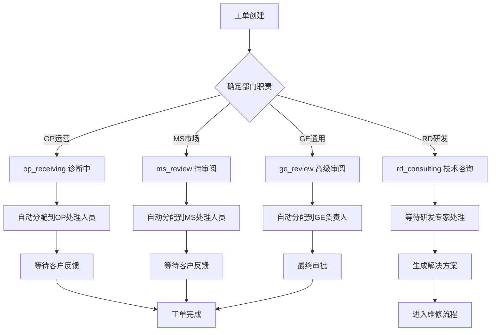
```mermaid
flowchart TD
A[工单创建] --> B{确定部门职责}
B --> |OP运营| C[op_receiving 诊断中]
B --> |MS市场| D[ms_review 待审阅]
B --> |RD研发| E[rd_consulting 技术咨询]
B --> |GE通用| F[ge_review 高级审阅]
C --> G[自动分配到OP处理人员]
D --> H[自动分配到MS处理人员]
E --> I[等待研发专家处理]
F --> J[自动分配到GE负责人]
G --> K[等待客户反馈]
H --> L[等待客户反馈]
I --> M[生成解决方案]
J --> N[最终审批]
K --> O[工单完成]
L --> O
M --> P[进入维修流程]
N --> O
```

**图表来源**
- [server/service/routes/tickets.js:54-80](file://server/service/routes/tickets.js#L54-L80)

**章节来源**
- [server/service/routes/tickets.js:1-800](file://server/service/routes/tickets.js#L1-L800)

### 3. 三视图工作台

系统提供三种工作视图，满足不同用户需求：

| 视图类型 | 用户角色 | 功能特点 | 适用场景 |
|---------|---------|----------|----------|
| My Tasks | 所有员工 | 个人负责的工单列表 | 日常工作执行 |
| Mentioned | 所有员工 | @提及的协作工单 | 团队协作处理 |
| Team Hub | 部门成员 | 部门内所有活跃工单 | 部门协调管理 |

**章节来源**
- [client/src/components/Service/WorkspacePage.tsx:1-800](file://client/src/components/Service/WorkspacePage.tsx#L1-L800)

### 4. 增强的列排序系统

工作空间页面实现了完整的列排序功能，支持多种排序方式：

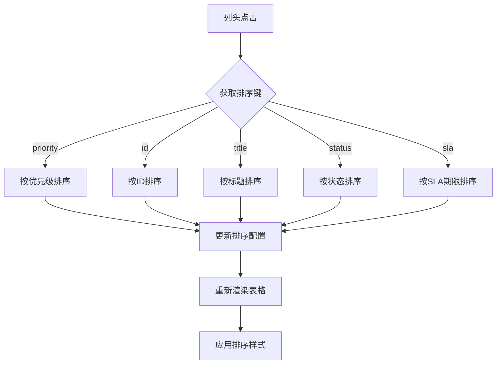
```mermaid
flowchart TD
A[列头点击] --> B{获取排序键}
B --> |priority| C[按优先级排序]
B --> |id| D[按ID排序]
B --> |title| E[按标题排序]
B --> |status| F[按状态排序]
B --> |sla| G[按SLA期限排序]
C --> H[更新排序配置]
D --> H
E --> H
F --> H
G --> H
H --> I[重新渲染表格]
I --> J[应用排序样式]
```

**图表来源**
- [client/src/components/Service/WorkspacePage.tsx:244-255](file://client/src/components/Service/WorkspacePage.tsx#L244-L255)

**章节来源**
- [client/src/components/Service/WorkspacePage.tsx:918-978](file://client/src/components/Service/WorkspacePage.tsx#L918-L978)

### 5. 灵活的列宽调整功能

系统实现了用户可自定义的列宽调整功能：

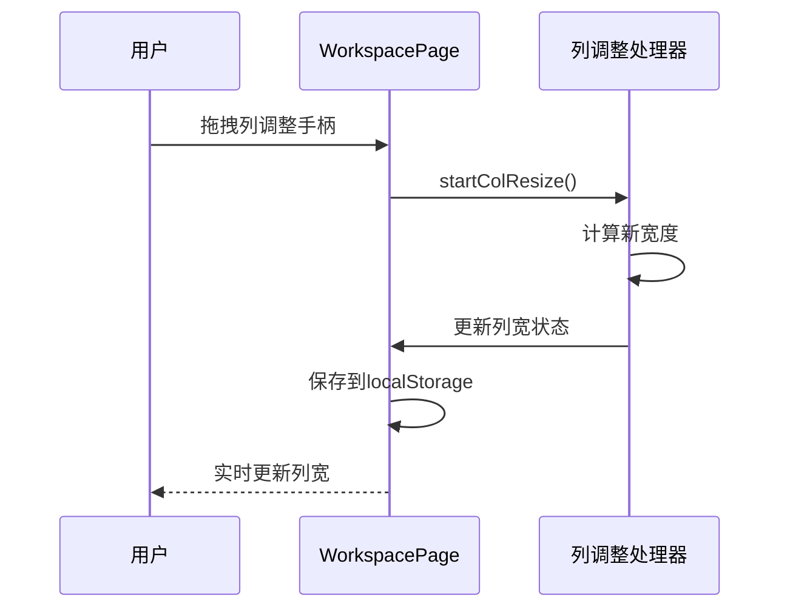
```mermaid
sequenceDiagram
participant U as 用户
participant WS as WorkspacePage
participant DR as 列调整处理器
U->>WS : 拖拽列调整手柄
WS->>DR : startColResize()
DR->>DR : 计算新宽度
DR->>WS : 更新列宽状态
WS->>WS : 保存到localStorage
WS-->>U : 实时更新列宽
```

**图表来源**
- [client/src/components/Service/WorkspacePage.tsx:257-280](file://client/src/components/Service/WorkspacePage.tsx#L257-L280)

**章节来源**
- [client/src/components/Service/WorkspacePage.tsx:257-280](file://client/src/components/Service/WorkspacePage.tsx#L257-L280)

### 6. 优化的优先级徽章系统

改进的优先级徽章系统提供了更好的视觉反馈：

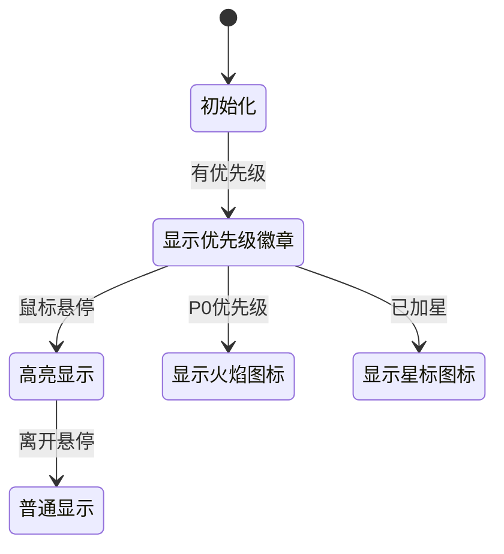
```mermaid
stateDiagram-v2
[*] --> 初始化
初始化 --> 显示优先级徽章 : 有优先级
显示优先级徽章 --> 高亮显示 : 鼠标悬停
高亮显示 --> 普通显示 : 离开悬停
显示优先级徽章 --> 显示火焰图标 : P0优先级
显示优先级徽章 --> 显示星标图标 : 已加星
```

**图表来源**
- [client/src/components/Service/WorkspacePage.tsx:1023-1034](file://client/src/components/Service/WorkspacePage.tsx#L1023-L1034)

**章节来源**
- [client/src/components/Service/WorkspacePage.tsx:1023-1034](file://client/src/components/Service/WorkspacePage.tsx#L1023-L1034)

### 7. 改进的星标系统

优化的星标系统提供了更好的交互体验：

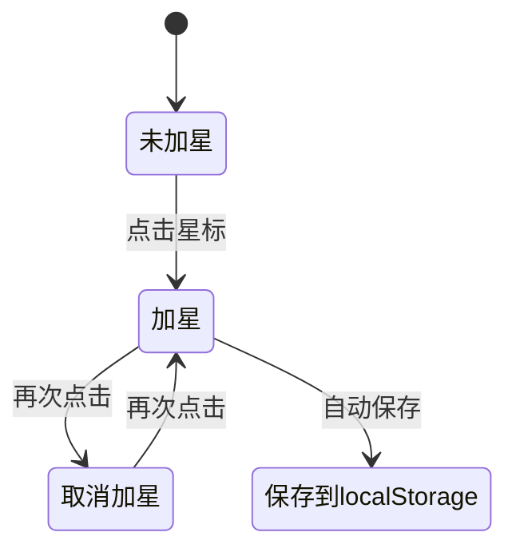
```mermaid
stateDiagram-v2
[*] --> 未加星
未加星 --> 加星 : 点击星标
加星 --> 取消加星 : 再次点击
取消加星 --> 加星 : 再次点击
加星 --> 保存到localStorage : 自动保存
```

**图表来源**
- [client/src/components/Service/WorkspacePage.tsx:558-570](file://client/src/components/Service/WorkspacePage.tsx#L558-L570)

**章节来源**
- [client/src/components/Service/WorkspacePage.tsx:558-570](file://client/src/components/Service/WorkspacePage.tsx#L558-L570)

## 架构概览

```mermaid
graph TB
subgraph "前端应用层"
A[React 应用]
B[状态管理 Zustand]
C[路由系统 React Router]
D[国际化 i18n]
E[SortDropdown 排序组件]
F[本地存储 localStorage]
G[PIEditor 形式发票编辑器]
H[RepairReportEditor 维修报告编辑器]
I[OpRepairReportEditor 运营维修报告编辑器]
J[DocumentReviewModal 文档审查]
K[FinalSettlementModal 最终结算]
L[MSReviewPanel 商务审核]
M[ClosingHandoverModal 结案交接]
N[TicketDetailComponents 工单详情组件]
O[MentionCommentInput 提及评论输入]
end
subgraph "后端服务层"
P[Express 服务器]
Q[认证中间件 JWT]
R[权限控制]
S[数据库连接]
T[RMA文档路由]
U[Warranty服务]
V[产品管理路由]
W[保修计算服务]
X[PDF导出服务]
Y[财务确认服务]
Z[活动修正路由]
AA[系统路由]
end
subgraph "数据存储层"
BB[better-sqlite3]
CC[工单数据表]
DD[用户数据表]
EE[附件数据表]
FF[形式发票表]
GG[维修报告表]
HH[审计日志表]
II[序列号表]
JJ[产品模型表]
KK[商品规格表]
LL[产品实例表]
MM[保修计算表]
NN[财务确认表]
OO[产品架构升级迁移]
PP[缩略图缓存]
QQ[附件存储]
end
subgraph "业务逻辑层"
RR[工单路由]
SS[服务记录路由]
TT[SLA 服务]
UU[AI 服务]
VV[备份服务]
WW[三层次产品架构]
XX[增强保修计算]
YY[改进交接流程]
ZZ[运营维修报告编辑器]
AAA[权限控制]
BBB[审计跟踪]
CCC[活动修正系统]
DDD[附件处理增强]
EEE[优化活动分类]
FFF[结案交接优化]
end
A --> C
A --> B
A --> D
A --> E
A --> F
A --> G
A --> H
A --> I
A --> J
A --> K
A --> L
A --> M
A --> N
A --> O
C --> P
B --> P
E --> P
F --> P
G --> T
H --> T
I --> T
J --> T
K --> WW
L --> XX
M --> FF
N --> CCC
O --> DDD
P --> Q
P --> R
P --> S
Q --> BB
R --> BB
S --> BB
BB --> CC
BB --> DD
BB --> EE
BB --> FF
BB --> GG
BB --> HH
BB --> II
BB --> JJ
BB --> KK
BB --> LL
BB --> MM
BB --> NN
RR --> CC
SS --> DD
TT --> CC
UU --> CC
VV --> CC
WW --> JJ
WW --> KK
WW --> LL
XX --> MM
YY --> NN
ZZ --> GG
AAA --> WW
BBB --> HH
CCC --> HH
DDD --> EE
EEE --> HH
FFF --> NN
```

**图表来源**
- [client/src/App.tsx:1-800](file://client/src/App.tsx#L1-L800)
- [client/src/components/UI/SortDropdown.tsx:1-129](file://client/src/components/UI/SortDropdown.tsx#L1-L129)
- [server/index.js:1-800](file://server/index.js#L1-L800)
- [client/src/components/Workspace/PIEditor.tsx:1-752](file://client/src/components/Workspace/PIEditor.tsx#L1-L752)
- [client/src/components/Workspace/RepairReportEditor.tsx:1-1143](file://client/src/components/Workspace/RepairReportEditor.tsx#L1-L1143)
- [client/src/components/Workspace/OpRepairReportEditor.tsx:1-577](file://client/src/components/Workspace/OpRepairReportEditor.tsx#L1-L577)
- [server/service/routes/rma-documents.js:1-1181](file://server/service/routes/rma-documents.js#L1-L1181)
- [server/service/migrations/033_product_architecture_upgrade.sql:1-54](file://server/service/migrations/033_product_architecture_upgrade.sql#L1-L54)
- [server/service/routes/warranty.js:1-284](file://server/service/routes/warranty.js#L1-L284)

## 详细组件分析

### 服务概览页面 (ServiceOverviewPage)

服务概览页面为管理层提供了全面的工单状态监控面板：

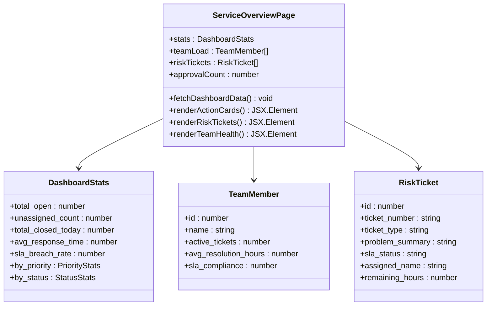
```mermaid
classDiagram
class ServiceOverviewPage {
+stats : DashboardStats
+teamLoad : TeamMember[]
+riskTickets : RiskTicket[]
+approvalCount : number
+fetchDashboardData() void
+renderActionCards() JSX.Element
+renderRiskTickets() JSX.Element
+renderTeamHealth() JSX.Element
}
class DashboardStats {
+total_open : number
+unassigned_count : number
+total_closed_today : number
+avg_response_time : number
+sla_breach_rate : number
+by_priority : PriorityStats
+by_status : StatusStats
}
class TeamMember {
+id : number
+name : string
+active_tickets : number
+avg_resolution_hours : number
+sla_compliance : number
}
class RiskTicket {
+id : number
+ticket_number : string
+ticket_type : string
+problem_summary : string
+sla_status : string
+assigned_name : string
+remaining_hours : number
}
ServiceOverviewPage --> DashboardStats
ServiceOverviewPage --> TeamMember
ServiceOverviewPage --> RiskTicket
```

**图表来源**
- [client/src/components/Service/ServiceOverviewPage.tsx:52-79](file://client/src/components/Service/ServiceOverviewPage.tsx#L52-L79)

#### 关键功能特性

1. **实时统计数据**：显示部门内的工单总数、待分配工单、今日完成数量等关键指标
2. **风险工单监控**：识别即将超时或已超时的工单，提供预警功能
3. **团队负载分析**：展示团队成员的工作负载分布，支持智能改派
4. **SLA 健康度评估**：提供超时率和平均响应时间的可视化展示

**章节来源**
- [client/src/components/Service/ServiceOverviewPage.tsx:1-609](file://client/src/components/Service/ServiceOverviewPage.tsx#L1-L609)

### 工作台页面 (WorkspacePage)

工作台页面实现了三视图架构，为用户提供灵活的工单管理界面，并集成了增强的列排序和列宽调整功能：

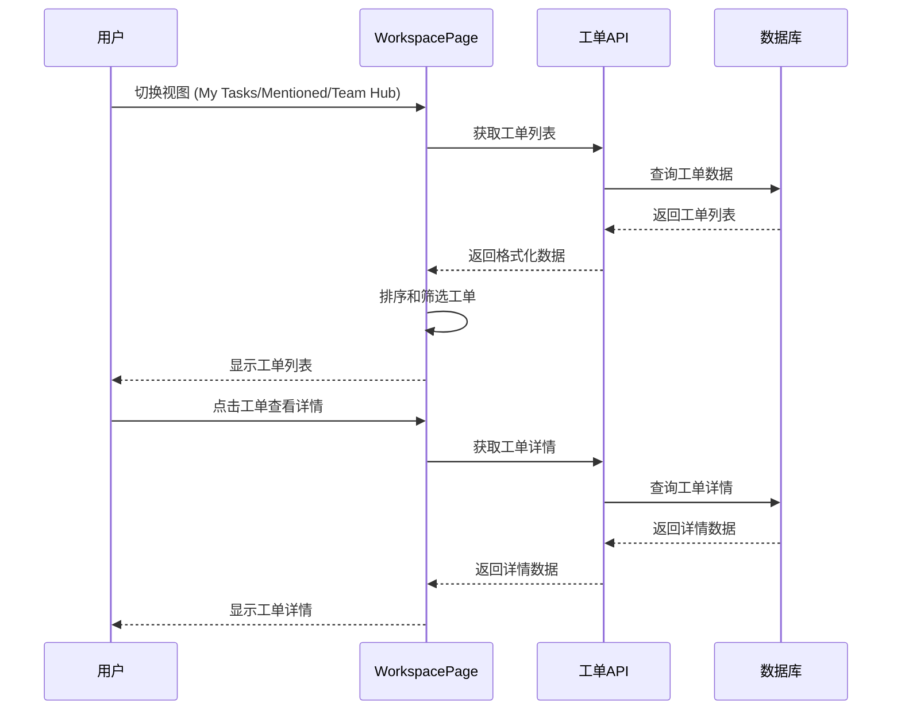
```mermaid
sequenceDiagram
participant U as 用户
participant WP as WorkspacePage
participant API as 工单API
participant DB as 数据库
U->>WP : 切换视图 (My Tasks/Mentioned/Team Hub)
WP->>API : 获取工单列表
API->>DB : 查询工单数据
DB-->>API : 返回工单列表
API-->>WP : 返回格式化数据
WP->>WP : 排序和筛选工单
WP-->>U : 显示工单列表
U->>WP : 点击工单查看详情
WP->>API : 获取工单详情
API->>DB : 查询工单详情
DB-->>API : 返回详情数据
API-->>WP : 返回详情数据
WP-->>U : 显示工单详情
```

**图表来源**
- [client/src/components/Service/WorkspacePage.tsx:350-448](file://client/src/components/Service/WorkspacePage.tsx#L350-L448)

#### 视图切换机制

系统根据用户角色和部门职责动态配置不同的视图选项：

| 部门 | 可用视图 | 特殊配置 |
|------|----------|----------|
| OP运营 | 全部、待认领、待收货、诊断中、维修中、待发货、协作 | 协作视图使用 dept_collab 参数 |
| RD研发 | 全部、待认领、需技术建议、已提供方案 | 完全由部门@Mention驱动 |
| GE通用 | 全部、待认领、待审批、协作 | 高级审批权限 |
| MS市场 | 全部、待认领、待审批、咨询工单、RMA工单、SVC工单 | 支持工单创建 |

#### 增强的列排序系统

工作空间页面实现了完整的列排序功能，支持以下排序方式：

1. **优先级排序** (`priority`)：按 P0 > P1 > P2 顺序排列
2. **ID排序** (`id`)：按工单编号字符串排序
3. **标题排序** (`title`)：按问题摘要排序
4. **状态排序** (`status`)：按当前节点状态排序
5. **SLA期限排序** (`sla`)：按剩余时间排序

排序状态管理：
- `sortConfig`：包含当前排序键和方向
- 支持升序/降序切换
- 第三次点击重置为默认排序

**章节来源**
- [client/src/components/Service/WorkspacePage.tsx:128-180](file://client/src/components/Service/WorkspacePage.tsx#L128-L180)

### 统一工单详情页面

统一工单详情页面为所有工单类型提供一致的查看详情体验：

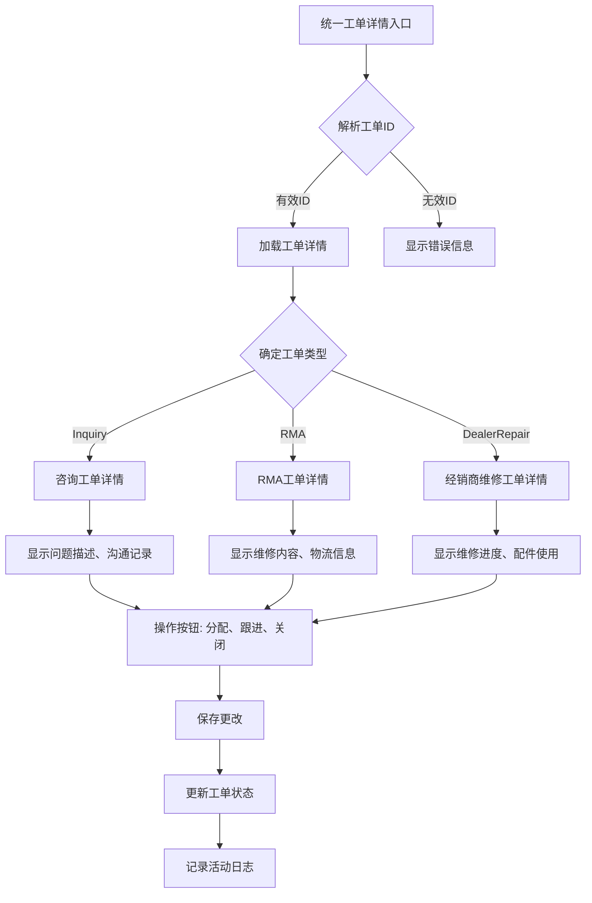
```mermaid
flowchart TD
A[统一工单详情入口] --> B{解析工单ID}
B --> |有效ID| C[加载工单详情]
B --> |无效ID| D[显示错误信息]
C --> E{确定工单类型}
E --> |Inquiry| F[咨询工单详情]
E --> |RMA| G[RMA工单详情]
E --> |DealerRepair| H[经销商维修工单详情]
F --> I[显示问题描述、沟通记录]
G --> J[显示维修内容、物流信息]
H --> K[显示维修进度、配件使用]
I --> L[操作按钮: 分配、跟进、关闭]
J --> L
K --> L
L --> M[保存更改]
M --> N[更新工单状态]
N --> O[记录活动日志]
```

**图表来源**
- [client/src/components/Service/UnifiedTicketDetailPage.tsx:12-35](file://client/src/components/Service/UnifiedTicketDetailPage.tsx#L12-L35)

**章节来源**
- [client/src/components/Service/UnifiedTicketDetailPage.tsx:1-38](file://client/src/components/Service/UnifiedTicketDetailPage.tsx#L1-L38)

### 状态管理模式

系统使用 Zustand 进行状态管理，特别是工单创建模态框的状态：

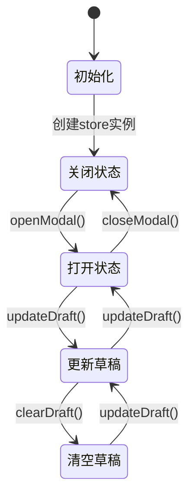
```mermaid
stateDiagram-v2
[*] --> 初始化
初始化 --> 关闭状态 : 创建store实例
关闭状态 --> 打开状态 : openModal()
打开状态 --> 关闭状态 : closeModal()
打开状态 --> 更新草稿 : updateDraft()
更新草稿 --> 清空草稿 : clearDraft()
清空草稿 --> 更新草稿 : updateDraft()
更新草稿 --> 打开状态 : updateDraft()
```

**图表来源**
- [client/src/store/useTicketStore.ts:22-68](file://client/src/store/useTicketStore.ts#L22-L68)

**章节来源**
- [client/src/store/useTicketStore.ts:1-68](file://client/src/store/useTicketStore.ts#L1-L68)

### 排序下拉组件 (SortDropdown)

新增的 SortDropdown 组件提供了统一的排序控制界面：

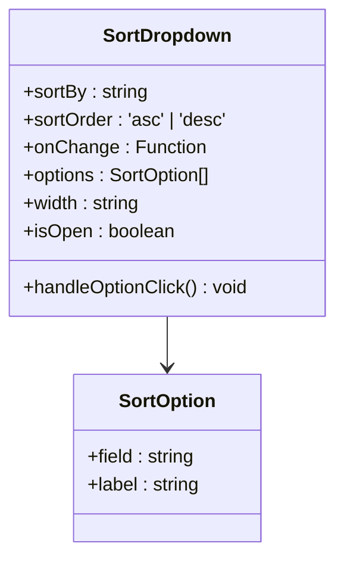
```mermaid
classDiagram
class SortDropdown {
+sortBy : string
+sortOrder : 'asc' | 'desc'
+onChange : Function
+options : SortOption[]
+width : string
+isOpen : boolean
+handleOptionClick() void
}
class SortOption {
+field : string
+label : string
}
SortDropdown --> SortOption
```

**图表来源**
- [client/src/components/UI/SortDropdown.tsx:4-15](file://client/src/components/UI/SortDropdown.tsx#L4-L15)

#### 功能特性

1. **下拉菜单**：提供排序选项选择
2. **方向指示**：显示当前排序方向
3. **状态管理**：维护下拉菜单的打开状态
4. **事件处理**：处理选项点击事件

**章节来源**
- [client/src/components/UI/SortDropdown.tsx:1-129](file://client/src/components/UI/SortDropdown.tsx#L1-L129)

## 活动修正系统

### 系统架构设计

系统新增了完整的活动修正系统，支持对已提交活动的精确字段更正和审计追踪：

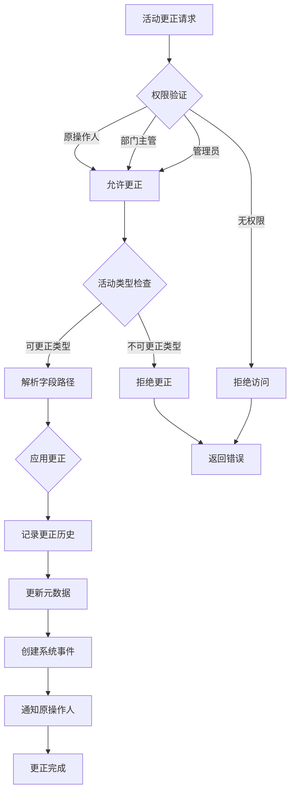
```mermaid
flowchart TD
A[活动更正请求] --> B{权限验证}
B --> |原操作人| C[允许更正]
B --> |部门主管| C
B --> |管理员| C
B --> |无权限| D[拒绝访问]
C --> E{活动类型检查}
E --> |可更正类型| F[解析字段路径]
E --> |不可更正类型| G[拒绝更正]
F --> H{应用更正}
H --> I[记录更正历史]
I --> J[更新元数据]
J --> K[创建系统事件]
K --> L[通知原操作人]
L --> M[更正完成]
D --> N[返回错误]
G --> N
```

**图表来源**
- [server/service/routes/ticket-activities.js:625-811](file://server/service/routes/ticket-activities.js#L625-L811)

#### 支持的活动类型

系统支持对以下活动类型进行更正：

- **OP维修记录** (`op_repair_report`)
- **诊断报告** (`diagnostic_report`)
- **评论** (`comment`)
- **内部备注** (`internal_note`)
- **发货信息** (`shipping_info`)

#### 字段路径支持

系统支持复杂的字段路径更正，包括：

- 简单字段：`repair_process.parts_replaced[0].name`
- 数组元素：`labor_charges[1].hours`
- 嵌套对象：`conclusion.summary`

#### 审计追踪机制

每次更正都会记录详细的审计信息：

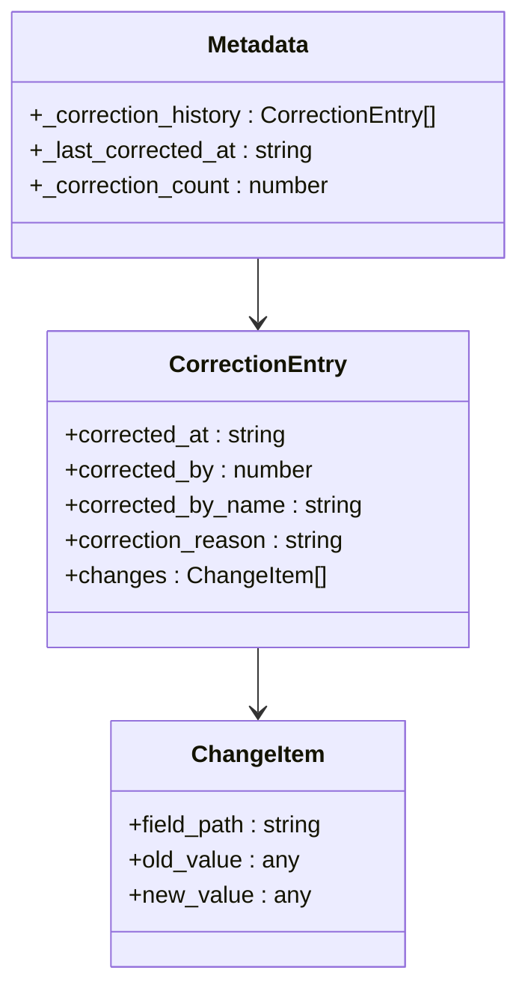
```mermaid
classDiagram
class CorrectionEntry {
+corrected_at : string
+corrected_by : number
+corrected_by_name : string
+correction_reason : string
+changes : ChangeItem[]
}
class ChangeItem {
+field_path : string
+old_value : any
+new_value : any
}
class Metadata {
+_correction_history : CorrectionEntry[]
+_last_corrected_at : string
+_correction_count : number
}
CorrectionEntry --> ChangeItem
Metadata --> CorrectionEntry
```

**图表来源**
- [server/service/routes/ticket-activities.js:694-752](file://server/service/routes/ticket-activities.js#L694-L752)

**章节来源**
- [server/service/routes/ticket-activities.js:625-811](file://server/service/routes/ticket-activities.js#L625-L811)
- [client/src/components/Workspace/TicketDetailComponents.tsx:776-820](file://client/src/components/Workspace/TicketDetailComponents.tsx#L776-L820)

### 前端实现

前端提供了直观的更正界面和历史记录显示：

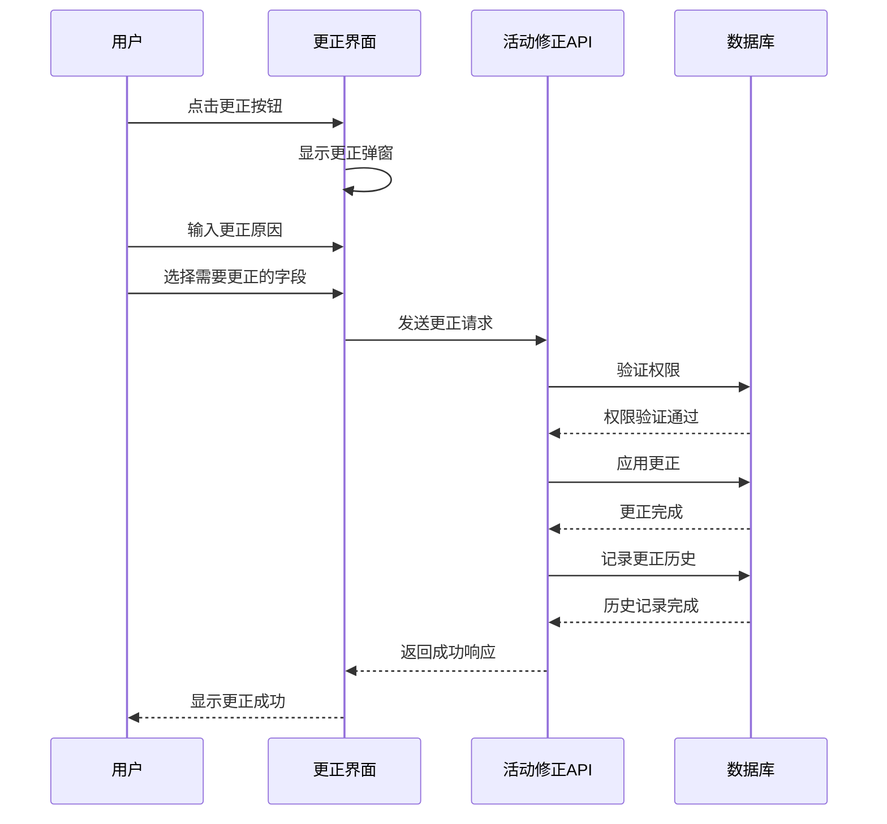
```mermaid
sequenceDiagram
participant U as 用户
participant UI as 更正界面
participant API as 活动修正API
participant DB as 数据库
U->>UI : 点击更正按钮
UI->>UI : 显示更正弹窗
U->>UI : 输入更正原因
U->>UI : 选择需要更正的字段
UI->>API : 发送更正请求
API->>DB : 验证权限
DB-->>API : 权限验证通过
API->>DB : 应用更正
DB-->>API : 更正完成
API->>DB : 记录更正历史
DB-->>API : 历史记录完成
API-->>UI : 返回成功响应
UI-->>U : 显示更正成功
```

**图表来源**
- [client/src/components/Workspace/TicketDetailComponents.tsx:800-820](file://client/src/components/Workspace/TicketDetailComponents.tsx#L800-L820)

#### 更正界面功能

1. **权限检查**：自动检查用户是否有更正权限
2. **字段选择**：支持选择多个字段进行批量更正
3. **原因说明**：强制要求填写更正原因
4. **预览功能**：显示更正前后的对比
5. **历史记录**：显示该活动的更正历史

**章节来源**
- [client/src/components/Workspace/TicketDetailComponents.tsx:821-1345](file://client/src/components/Workspace/TicketDetailComponents.tsx#L821-L1345)

## 增强的附件处理能力

### HEIC/HEIF格式支持

系统新增了对HEIC/HEIF格式图片的完整支持：

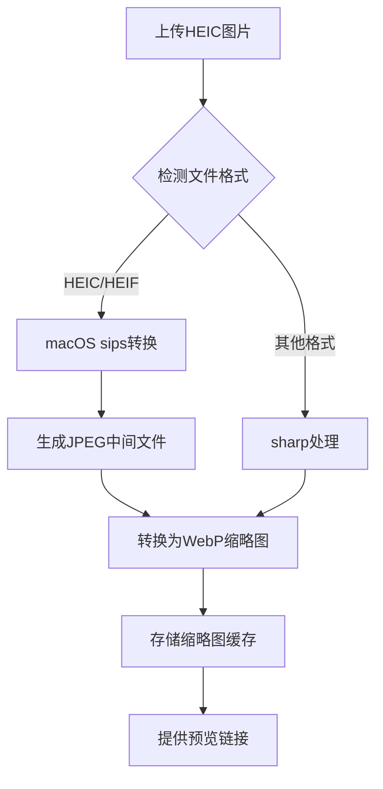
```mermaid
flowchart TD
A[上传HEIC图片] --> B{检测文件格式}
B --> |HEIC/HEIF| C[macOS sips转换]
B --> |其他格式| D[sharp处理]
C --> E[生成JPEG中间文件]
E --> F[转换为WebP缩略图]
D --> F
F --> G[存储缩略图缓存]
G --> H[提供预览链接]
```

**图表来源**
- [server/service/routes/ticket-activities.js:389-421](file://server/service/routes/ticket-activities.js#L389-L421)

#### 缩略图生成优化

系统实现了多层次的缩略图生成策略：

1. **质量级别**：
   - 标准缩略图：400px，WebP格式，80%质量
   - 预览缩略图：1200px，WebP格式，80%质量

2. **格式支持**：
   - HEIC/HEIF：使用sips转换为JPEG，再转WebP
   - 其他格式：直接使用sharp处理
   - 自动EXIF旋转校正

3. **缓存机制**：
   - 缩略图文件名基于原始文件路径生成
   - 支持预览模式和标准模式两种尺寸
   - 自动清理过期缓存文件

#### 附件网格布局

系统实现了智能的附件网格布局：

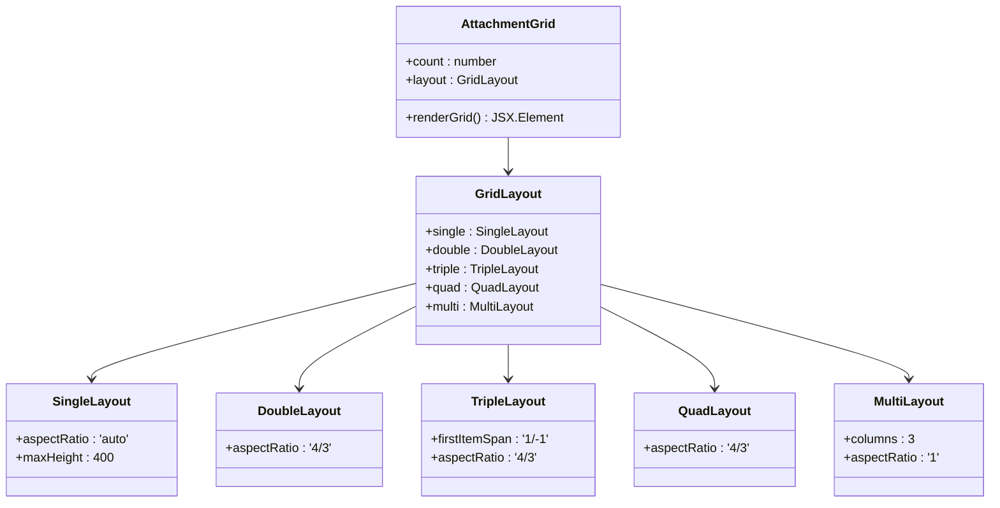
```mermaid
classDiagram
class AttachmentGrid {
+count : number
+layout : GridLayout
+renderGrid() JSX.Element
}
class GridLayout {
+single : SingleLayout
+double : DoubleLayout
+triple : TripleLayout
+quad : QuadLayout
+multi : MultiLayout
}
class SingleLayout {
+aspectRatio : 'auto'
+maxHeight : 400
}
class DoubleLayout {
+aspectRatio : '4/3'
}
class TripleLayout {
+firstItemSpan : '1/-1'
+aspectRatio : '4/3'
}
class QuadLayout {
+aspectRatio : '4/3'
}
class MultiLayout {
+columns : 3
+aspectRatio : '1'
}
AttachmentGrid --> GridLayout
GridLayout --> SingleLayout
GridLayout --> DoubleLayout
GridLayout --> TripleLayout
GridLayout --> QuadLayout
GridLayout --> MultiLayout
```

**图表来源**
- [client/src/components/Workspace/TicketDetailComponents.tsx:1168-1204](file://client/src/components/Workspace/TicketDetailComponents.tsx#L1168-L1204)

#### 布局规则

根据附件数量自动选择最优布局：

- **1个附件**：全宽自适应高度
- **2个附件**：两列等宽，4:3比例
- **3个附件**：第一项跨行，其余两列
- **4个附件**：2×2网格
- **5个及以上**：3列小网格

**章节来源**
- [server/service/routes/ticket-activities.js:346-436](file://server/service/routes/ticket-activities.js#L346-L436)
- [client/src/components/Workspace/TicketDetailComponents.tsx:1155-1277](file://client/src/components/Workspace/TicketDetailComponents.tsx#L1155-L1277)

### 附件上传优化

系统优化了附件上传流程，支持拖拽上传和预览功能：

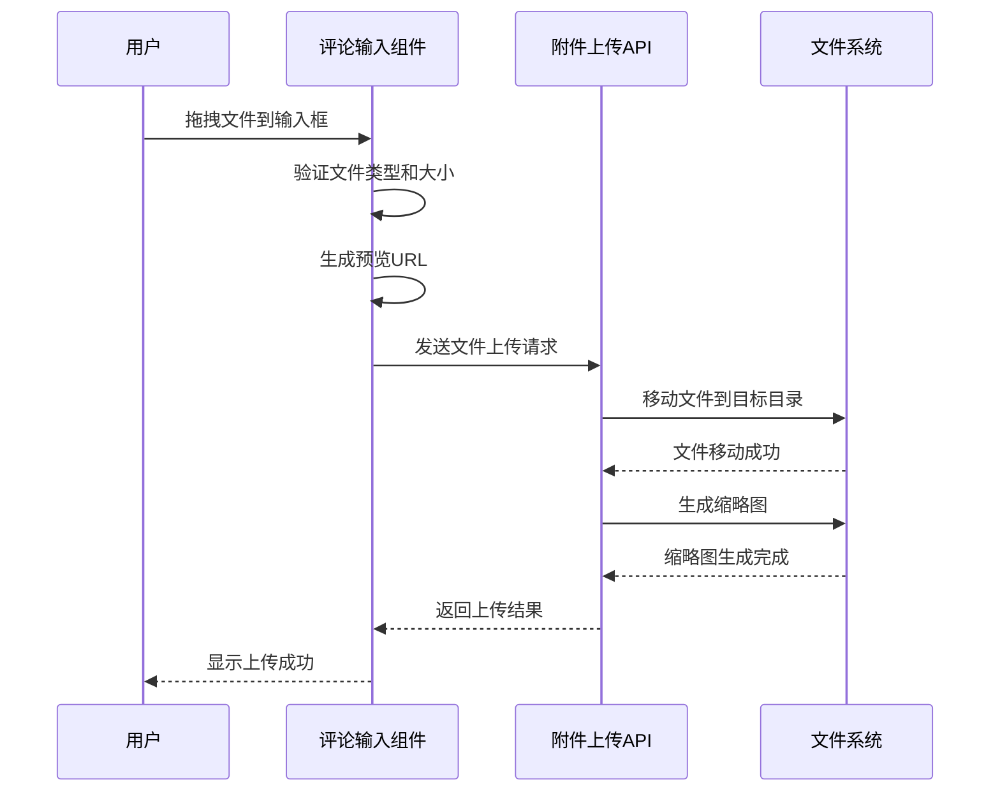
```mermaid
sequenceDiagram
participant U as 用户
participant CI as 评论输入组件
participant API as 附件上传API
participant FS as 文件系统
U->>CI : 拖拽文件到输入框
CI->>CI : 验证文件类型和大小
CI->>CI : 生成预览URL
CI->>API : 发送文件上传请求
API->>FS : 移动文件到目标目录
FS-->>API : 文件移动成功
API->>FS : 生成缩略图
FS-->>API : 缩略图生成完成
API-->>CI : 返回上传结果
CI-->>U : 显示上传成功
```

**图表来源**
- [client/src/components/Workspace/MentionCommentInput.tsx:213-232](file://client/src/components/Workspace/MentionCommentInput.tsx#L213-L232)

**章节来源**
- [client/src/components/Workspace/MentionCommentInput.tsx:213-579](file://client/src/components/Workspace/MentionCommentInput.tsx#L213-L579)

## 改进的结案交接功能

### 结案确认与交接模态框

系统新增了结案确认与交接模态框，强化了文档发布前置检查：

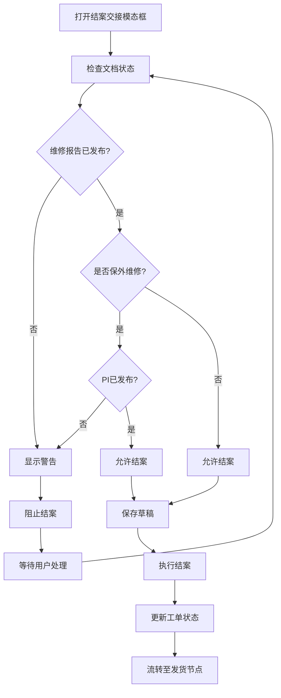
```mermaid
flowchart TD
A[打开结案交接模态框] --> B[检查文档状态]
B --> C{维修报告已发布?}
C --> |否| D[显示警告]
C --> |是| E{是否保外维修?}
D --> F[阻止结案]
E --> |是| G{PI已发布?}
E --> |否| H[允许结案]
G --> |否| D
G --> |是| I[允许结案]
H --> J[保存草稿]
I --> J
F --> K[等待用户处理]
J --> L[执行结案]
K --> B
L --> M[更新工单状态]
M --> N[流转至发货节点]
```

**图表来源**
- [client/src/components/Workspace/ClosingHandoverModal.tsx:48-111](file://client/src/components/Workspace/ClosingHandoverModal.tsx#L48-L111)

#### 核心功能特性

1. **文档前置检查**：确保维修报告和PI都已发布
2. **保内外区分**：保内维修可直接结案，保外维修需要PI
3. **款项确认**：保外维修需要确认收款状态
4. **发货指令**：支持修改收货地址和期望发货日期
5. **留言功能**：向OP发货同事发送处理备注

#### 三阶段工作流

```mermaid
stateDiagram-v2
[*] --> 文档检查
文档检查 --> 款项确认 : 文档齐全
文档检查 --> 文档检查 : 文档不全
款项确认 --> 发货指令 : 款项确认
款项确认 --> 款项确认 : 未确认
发货指令 --> 结案完成 : 完成发货
发货指令 --> 发货指令 : 修改指令
```

**图表来源**
- [client/src/components/Workspace/ClosingHandoverModal.tsx:165-169](file://client/src/components/Workspace/ClosingHandoverModal.tsx#L165-L169)

**章节来源**
- [client/src/components/Workspace/ClosingHandoverModal.tsx:1-549](file://client/src/components/Workspace/ClosingHandoverModal.tsx#L1-L549)

### 财务确认流程

系统实现了完整的财务确认流程，支持付费单据的财务核销：

```mermaid
flowchart TD
A[MS结案审核] --> B{是否保内维修?}
B --> |是| C[直接流转至发货]
B --> |否| D{是否需要财务确认?}
D --> |是| E[流转至GE财务]
D --> |否| C
E --> F[GE财务核销]
F --> G[确认收款信息]
G --> H[回传MS结案]
H --> C
```

**图表来源**
- [client/src/components/Workspace/UnifiedTicketDetail.tsx:676-687](file://client/src/components/Workspace/UnifiedTicketDetail.tsx#L676-L687)

#### 财务确认机制

1. **自动判断**：根据系统设置和工单状态自动判断是否需要财务确认
2. **GE介入**：非保内维修需要GE财务核销
3. **收款确认**：财务确认收款金额、日期和渠道
4. **流程回传**：财务确认后回传MS继续结案流程

**章节来源**
- [client/src/components/Workspace/UnifiedTicketDetail.tsx:666-723](file://client/src/components/Workspace/UnifiedTicketDetail.tsx#L666-L723)
- [docs/Service PRD_P2.md:320-355](file://docs/Service PRD_P2.md#L320-L355)

## 优化的活动时间轴

### 活动分类系统

系统实现了智能的活动分类，将活动分为两大类：

```mermaid
flowchart TD
A[活动时间轴] --> B{活动类型分类}
B --> |讨论与诊断| C[评论/诊断报告/维修记录]
B --> |系统变更| D[状态变更/指派变更/字段更新]
C --> E[始终显示展开]
D --> F[可折叠隐藏]
E --> G[渲染详细内容]
F --> H[显示简要摘要]
H --> I[点击展开详情]
```

**图表来源**
- [client/src/components/Workspace/TicketDetailComponents.tsx:307-345](file://client/src/components/Workspace/TicketDetailComponents.tsx#L307-L345)

#### 讨论与诊断活动

包括以下活动类型：

- **评论** (`comment`)：用户之间的交流
- **诊断报告** (`diagnostic_report`)：技术诊断结果
- **OP维修记录** (`op_repair_report`)：维修过程记录
- **关键输出**：包含特定关键词的评论（物流、维修内容等）

#### 系统变更活动

包括以下活动类型：

- **状态变更** (`status_change`)：工单状态流转
- **指派变更** (`assignment_change`)：处理人员变更
- **字段更新** (`field_update`)：工单字段修改
- **系统事件** (`system_event`)：系统自动记录
- **优先级变更** (`priority_change`)：优先级调整
- **软删除** (`soft_delete`)：工单删除记录

#### 关键输出识别

系统能够智能识别关键输出活动：

```mermaid
flowchart TD
A[评论活动] --> B{是否系统操作?}
B --> |是| C[标记为系统事件]
B --> |否| D{是否关键输出?}
D --> |是| E[归类为讨论与诊断]
D --> |否| F[归类为系统变更]
E --> G[始终显示]
C --> H[显示为系统事件]
H --> I[可折叠隐藏]
```

**图表来源**
- [client/src/components/Workspace/TicketDetailComponents.tsx:318-334](file://client/src/components/Workspace/TicketDetailComponents.tsx#L318-L334)

**章节来源**
- [client/src/components/Workspace/TicketDetailComponents.tsx:296-548](file://client/src/components/Workspace/TicketDetailComponents.tsx#L296-L548)

## 依赖关系分析

```mermaid
graph TB
subgraph "客户端依赖"
A[React 18]
B[React Router DOM]
C[Zustand 状态管理]
D[Lucide React 图标]
E[Axios HTTP客户端]
F[React Hook Form]
G[SortDropdown 排序组件]
H[本地存储 API]
I[国际化 i18n]
J[PIEditor 形式发票编辑器]
K[RepairReportEditor 维修报告编辑器]
L[OpRepairReportEditor 运营维修报告编辑器]
M[DocumentReviewModal 文档审查]
N[FinalSettlementModal 最终结算]
O[MSReviewPanel 商务审核]
P[ClosingHandoverModal 结案交接]
Q[TicketDetailComponents 工单详情组件]
R[MentionCommentInput 提及评论输入]
end
subgraph "服务端依赖"
S[Express]
T[better-sqlite3]
U[bcryptjs]
V[multer 文件上传]
W[jwt-simple]
X[sharp 图像处理]
Y[warranty.js 保修计算路由]
Z[products.js 产品路由]
AA[system.js 系统路由]
BB[product-skus.js 商品规格路由]
CC[product-models-admin.js 产品模型路由]
DD[ticket-activities.js 工单活动路由]
EE[rma-documents.js RMA文档路由]
FF[tickets.js 工单路由]
GG[权限中间件]
HH[SLA 服务]
II[AI 服务]
JJ[备份服务]
KK[translations.ts 国际化]
end
subgraph "开发工具"
LL[Vite 构建工具]
MM[Tailwind CSS]
NN[TypeScript]
OO[Eslint]
end
A --> B
A --> C
A --> D
A --> E
A --> F
A --> G
A --> H
A --> I
A --> J
A --> K
A --> L
A --> M
A --> N
A --> O
A --> P
A --> Q
A --> R
C --> F
S --> T
S --> U
S --> V
S --> W
S --> X
S --> Y
S --> Z
S --> AA
S --> BB
S --> CC
S --> DD
S --> EE
S --> FF
S --> GG
S --> HH
S --> II
S --> JJ
S --> KK
Y --> DD
Z --> FF
AA --> DD
BB --> FF
CC --> FF
DD --> FF
EE --> FF
FF --> GG
GG --> HH
HH --> II
II --> JJ
KK --> LL
LL --> MM
MM --> NN
NN --> OO
```

**图表来源**
- [client/src/App.tsx:1-80](file://client/src/App.tsx#L1-L80)
- [client/src/components/UI/SortDropdown.tsx:1-129](file://client/src/components/UI/SortDropdown.tsx#L1-L129)
- [server/index.js:1-20](file://server/index.js#L1-L20)
- [client/src/components/Workspace/PIEditor.tsx:1-752](file://client/src/components/Workspace/PIEditor.tsx#L1-L752)
- [client/src/components/Workspace/RepairReportEditor.tsx:1-1143](file://client/src/components/Workspace/RepairReportEditor.tsx#L1-L1143)
- [client/src/components/Workspace/OpRepairReportEditor.tsx:1-577](file://client/src/components/Workspace/OpRepairReportEditor.tsx#L1-L577)
- [server/service/routes/warranty.js:1-284](file://server/service/routes/warranty.js#L1-L284)

### 核心模块依赖

```mermaid
graph LR
subgraph "核心模块"
A[App.tsx]
B[ServiceOverviewPage]
C[WorkspacePage]
D[UnifiedTicketDetailPage]
E[useTicketStore]
F[SortDropdown]
G[PIEditor]
H[RepairReportEditor]
I[OpRepairReportEditor]
J[DocumentReviewModal]
K[FinalSettlementModal]
L[MSReviewPanel]
M[ClosingHandoverModal]
N[TicketDetailComponents]
O[MentionCommentInput]
end
subgraph "路由模块"
P[tickets.js]
Q[service-records.js]
R[rma-documents.js]
S[auth.js]
T[warranty.js]
U[products.js]
V[product-skus.js]
W[product-models-admin.js]
X[ticket-activities.js]
Y[system.js]
end
subgraph "服务模块"
Z[sla_service.js]
AA[ai_service.js]
BB[backup_service.js]
CC[translations.ts]
DD[PDF导出服务]
EE[权限控制]
FF[审计跟踪]
GG[产品架构升级迁移]
HH[活动修正系统]
II[附件处理增强]
JJ[优化活动分类]
KK[结案交接优化]
end
A --> B
A --> C
A --> D
A --> F
A --> G
A --> H
A --> I
A --> J
A --> K
A --> L
A --> M
A --> N
A --> O
B --> P
C --> P
D --> P
E --> P
F --> P
G --> R
H --> R
I --> R
J --> R
K --> T
L --> T
M --> T
N --> X
O --> X
P --> Q
R --> S
R --> T
R --> U
R --> V
R --> W
R --> X
R --> Y
R --> Z
R --> AA
R --> BB
R --> CC
T --> DD
U --> EE
V --> EE
W --> EE
GG --> EE
HH --> EE
II --> EE
JJ --> EE
KK --> EE
```

**图表来源**
- [client/src/App.tsx:1-100](file://client/src/App.tsx#L1-L100)
- [client/src/components/UI/SortDropdown.tsx:1-129](file://client/src/components/UI/SortDropdown.tsx#L1-L129)
- [server/service/routes/tickets.js:1-50](file://server/service/routes/tickets.js#L1-L50)
- [server/service/routes/rma-documents.js:1-1181](file://server/service/routes/rma-documents.js#L1-L1181)
- [server/service/routes/warranty.js:1-284](file://server/service/routes/warranty.js#L1-L284)

**章节来源**
- [client/src/App.tsx:1-800](file://client/src/App.tsx#L1-L800)
- [client/src/components/UI/SortDropdown.tsx:1-129](file://client/src/components/UI/SortDropdown.tsx#L1-L129)
- [server/service/routes/tickets.js:1-800](file://server/service/routes/tickets.js#L1-L800)
- [server/service/routes/rma-documents.js:1-1181](file://server/service/routes/rma-documents.js#L1-L1181)

## 性能考虑

### 数据库优化策略

1. **索引优化**：为常用查询字段建立索引，包括 `ticket_type`、`current_node`、`assigned_to`、`status` 等
2. **查询缓存**：对频繁访问的统计数据使用内存缓存
3. **分页处理**：默认每页200条记录，避免大数据量查询
4. **连接池管理**：使用 better-sqlite3 的连接池机制
5. **文档序列号缓存**：PI和维修报告序列号独立缓存，避免重复查询
6. **产品架构索引**：为产品模型、商品规格和产品实例表添加适当索引
7. **保修计算缓存**：保修计算结果在内存中缓存，避免重复计算
8. **自动保存优化**：运营维修报告编辑器使用5秒防抖，减少API调用频率
9. **缩略图缓存**：附件缩略图在磁盘和内存中双重缓存
10. **活动修正审计**：更正历史记录使用增量更新，避免全量重写

### 前端性能优化

1. **虚拟滚动**：对长列表使用虚拟滚动技术
2. **懒加载**：组件按需加载，减少初始包大小
3. **状态持久化**：使用 localStorage 缓存用户偏好设置
4. **防抖处理**：搜索和筛选操作使用防抖机制
5. **列宽缓存**：使用 localStorage 缓存列宽设置
6. **排序优化**：使用 useMemo 优化排序计算
7. **文档编辑优化**：使用节流机制优化实时计算
8. **PDF导出优化**：客户端渲染，避免服务端压力
9. **产品数据缓存**：产品模型和规格数据在内存中缓存
10. **保修计算优化**：计算结果缓存，避免重复计算
11. **运营维修报告优化**：自动保存机制减少用户操作负担
12. **附件预览优化**：HEIC格式使用sips转换，避免内存溢出
13. **活动时间轴优化**：智能分类减少DOM渲染压力

### 缓存策略

```mermaid
flowchart TD
A[用户请求] --> B{检查缓存}
B --> |命中| C[返回缓存数据]
B --> |未命中| D[查询数据库]
D --> E[格式化数据]
E --> F[写入缓存]
F --> G[返回响应]
H[定时任务] --> I[清理过期缓存]
I --> J[更新统计数据]
K[列宽调整] --> L[localStorage 缓存]
M[星标状态] --> N[localStorage 缓存]
O[文档序列号] --> P[数据库缓存]
Q[保修计算结果] --> R[内存缓存]
S[产品架构数据] --> T[内存缓存]
U[结案交接状态] --> V[临时缓存]
W[运营维修报告草稿] --> X[本地存储缓存]
Y[活动修正历史] --> Z[增量缓存]
AA[附件缩略图] --> BB[磁盘+内存缓存]
CC[活动时间轴] --> DD[智能分类缓存]
```

### 专业文档工作流性能

1. **文档状态缓存**：常用文档状态在内存中缓存
2. **批量操作优化**：支持批量文档操作减少请求次数
3. **增量更新**：文档编辑使用增量更新减少数据传输
4. **审计日志分页**：审计日志支持分页加载避免大数据量查询
5. **产品数据预加载**：产品模型和规格数据在页面加载时预加载
6. **运营维修报告优化**：自动保存机制减少API调用频率
7. **活动修正性能**：字段路径解析使用缓存，避免重复计算

**章节来源**
- [client/src/components/Service/WorkspacePage.tsx:68-125](file://client/src/components/Service/WorkspacePage.tsx#L68-L125)
- [client/src/components/Workspace/PIEditor.tsx:181-209](file://client/src/components/Workspace/PIEditor.tsx#L181-L209)
- [client/src/components/Workspace/RepairReportEditor.tsx:292-311](file://client/src/components/Workspace/RepairReportEditor.tsx#L292-L311)
- [client/src/components/Workspace/OpRepairReportEditor.tsx:84-91](file://client/src/components/Workspace/OpRepairReportEditor.tsx#L84-L91)
- [server/service/migrations/033_product_architecture_upgrade.sql:20-40](file://server/service/migrations/033_product_architecture_upgrade.sql#L20-L40)

## 故障排除指南

### 常见问题及解决方案

#### 1. 工单无法创建

**症状**：用户尝试创建工单时收到错误提示

**排查步骤**：
1. 检查用户权限：确认用户角色是否具有创建工单的权限
2. 验证必填字段：确保问题描述等必填字段已填写
3. 检查部门配置：确认用户的部门配置正确

**解决方案**：
- 更新用户角色配置
- 完善工单必填信息
- 重新配置部门权限

#### 2. 工单自动分配失败

**症状**：新创建的工单没有自动分配给处理人员

**排查步骤**：
1. 检查部门自动分发规则配置
2. 验证目标部门是否有可用处理人员
3. 确认工单节点是否在部门职责范围内

**解决方案**：
- 配置正确的自动分发规则
- 添加部门处理人员
- 调整工单节点配置

#### 3. 工作台数据显示异常

**症状**：工作台页面显示的工单数量或状态不正确

**排查步骤**：
1. 检查用户权限过滤逻辑
2. 验证部门协作查询参数
3. 确认工单状态映射关系

**解决方案**：
- 修复权限过滤条件
- 调整协作查询参数
- 更新状态映射配置

#### 4. 列排序功能异常

**症状**：列排序功能无法正常工作

**排查步骤**：
1. 检查 sortConfig 状态是否正确更新
2. 验证 handleSort 函数逻辑
3. 确认排序算法实现

**解决方案**：
- 修复排序状态管理
- 检查排序函数实现
- 验证排序算法逻辑

#### 5. 列宽调整失效

**症状**：列宽调整功能无法保存或应用

**排查步骤**：
1. 检查 localStorage 权限
2. 验证 startColResize 函数
3. 确认列宽状态更新逻辑

**解决方案**：
- 检查浏览器存储权限
- 修复列调整处理器
- 验证状态同步机制

#### 6. 专业文档工作流异常

**症状**：PI或维修报告创建、编辑、审核功能异常

**排查步骤**：
1. 检查用户权限：确认是否具有MS部门权限
2. 验证文档状态：确认文档状态是否允许当前操作
3. 检查必填字段：确认所有必填字段是否已填写
4. 验证网络连接：确认API调用是否成功

**解决方案**：
- 更新用户权限配置
- 修复文档状态逻辑
- 完善表单验证
- 检查网络连接和API响应

#### 7. 商务审核功能异常

**症状**：保修计算或费用确认功能异常

**排查步骤**：
1. 检查技术评估数据：确认OP提供的技术评估是否完整
2. 验证产品信息：确认产品序列号、购买日期等信息
3. 检查计算逻辑：确认保修计算公式是否正确
4. 验证费用输入：确认费用数据格式是否正确

**解决方案**：
- 补充技术评估数据
- 完善产品信息
- 修复计算逻辑
- 格式化费用输入

#### 8. 三层次产品架构异常

**症状**：产品模型、商品规格或设备台账功能异常

**排查步骤**：
1. 检查数据库连接：确认数据库连接正常
2. 验证表结构：确认产品相关表结构正确
3. 检查数据完整性：确认产品数据完整性和一致性
4. 验证权限配置：确认用户具有相应的产品管理权限

**解决方案**：
- 修复数据库连接
- 重建产品表结构
- 补充缺失的产品数据
- 更新用户权限配置

#### 9. 保修计算异常

**症状**：保修计算结果不正确或计算失败

**排查步骤**：
1. 检查输入数据：确认产品激活日期、发票日期等数据
2. 验证计算逻辑：确认五级水位线计算逻辑正确
3. 检查损坏拦截：确认物理损坏判定正确
4. 验证时间计算：确认保修月份和结束日期计算正确

**解决方案**：
- 补充缺失的产品数据
- 修复计算逻辑
- 更新损坏拦截规则
- 校正时间计算

#### 10. 交接流程异常

**症状**：结案交接功能无法正常工作

**排查步骤**：
1. 检查文档状态：确认维修报告和PI是否已发布
2. 验证保内外区分：确认保内保外状态判断正确
3. 检查财务确认：确认财务确认流程正常
4. 验证工单流转：确认工单状态更新正确

**解决方案**：
- 确保文档发布完成
- 修正保内外状态判断
- 修复财务确认流程
- 更新工单流转逻辑

#### 11. 运营维修报告编辑器异常

**症状**：运营维修报告无法编辑或保存

**排查步骤**：
1. 检查用户权限：确认是否为OP运营部门且工单处于op_repairing节点
2. 验证自动保存机制：确认5秒防抖功能正常
3. 检查数据初始化：确认从诊断报告和工单信息正确加载
4. 验证API调用：确认维修报告保存接口正常

**解决方案**：
- 更新用户权限配置
- 修复自动保存机制
- 补充数据初始化逻辑
- 检查API调用和错误处理

#### 12. 活动修正系统异常

**症状**：活动更正功能无法正常使用

**排查步骤**：
1. 检查用户权限：确认是否具备更正权限
2. 验证活动类型：确认活动类型是否支持更正
3. 检查字段路径：确认字段路径解析正确
4. 验证更正历史：确认历史记录是否正常存储

**解决方案**：
- 更新用户权限配置
- 验证活动类型支持
- 修复字段路径解析
- 检查数据库连接和事务

#### 13. 附件处理异常

**症状**：附件上传、预览或下载功能异常

**排查步骤**：
1. 检查文件格式：确认文件格式是否受支持
2. 验证文件大小：确认文件大小是否超过限制
3. 检查缩略图生成：确认缩略图生成是否成功
4. 验证存储路径：确认文件存储路径正确

**解决方案**：
- 支持更多文件格式
- 调整文件大小限制
- 修复缩略图生成逻辑
- 检查文件系统权限

**章节来源**
- [server/service/routes/tickets.js:548-767](file://server/service/routes/tickets.js#L548-L767)
- [server/service/routes/rma-documents.js:1-1181](file://server/service/routes/rma-documents.js#L1-L1181)
- [server/service/migrations/033_product_architecture_upgrade.sql:1-54](file://server/service/migrations/033_product_architecture_upgrade.sql#L1-L54)
- [server/service/routes/warranty.js:1-284](file://server/service/routes/warranty.js#L1-L284)
- [client/src/components/Workspace/OpRepairReportEditor.tsx:53-82](file://client/src/components/Workspace/OpRepairReportEditor.tsx#L53-L82)
- [server/service/routes/ticket-activities.js:625-811](file://server/service/routes/ticket-activities.js#L625-L811)
- [client/src/components/Workspace/TicketDetailComponents.tsx:776-820](file://client/src/components/Workspace/TicketDetailComponents.tsx#L776-L820)

## 结论

Longhorn 服务工作流增强项目成功实现了企业级工单管理系统的现代化升级。通过统一工单架构、智能工作流引擎、三层次产品架构支持、增强的保修计算、改进的交接流程、新增的运营维修报告编辑器、活动修正系统、增强附件处理能力和优化的活动时间轴，系统显著提升了服务效率和用户体验。

### 主要成就

1. **架构现代化**：采用单表多态设计，简化了数据模型复杂度
2. **智能化工作流**：基于部门职责的自动分发机制，减少了人工干预
3. **用户体验优化**：三视图工作台满足不同用户的需求
4. **数据可视化**：服务概览页面提供实时的业务洞察
5. **增强的交互功能**：新增列排序、列宽调整、优先级徽章和星标系统
6. **专业文档工作流**：完整的PI和维修报告管理流程
7. **商务审核机制**：集成增强的保修计算和费用确认流程
8. **费用结算系统**：支持保内外维修的费用结算和流转控制
9. **三层次产品架构**：支持产品目录、商品规格和设备台账的完整管理体系
10. **增强的保修计算**：实现五级水位线计算和损坏拦截机制
11. **改进的交接流程**：强化文档发布前置检查和结案确认机制
12. **运营维修报告编辑器**：支持OP部门的维修记录编辑和管理
13. **权限控制增强**：基于角色的文档访问和操作权限管理
14. **审计跟踪完善**：完整的文档操作日志记录
15. **活动修正系统**：支持对已提交活动的精确字段更正和审计追踪
16. **增强附件处理**：支持HEIC/HEIF格式预览和高质量缩略图生成
17. **优化活动分类**：智能区分讨论与诊断、系统变更两类活动
18. **结案交接优化**：改进的文档检查、款项确认和发货指令功能

### 技术亮点

- **模块化设计**：清晰的前后端分离架构
- **状态管理**：高效的 Zustand 状态管理方案
- **权限控制**：细粒度的权限控制系统
- **排序系统**：灵活的列排序功能
- **本地存储**：用户偏好的持久化存储
- **国际化支持**：完整的多语言支持
- **文档工作流**：完整的专业文档生命周期管理
- **费用结算**：智能的费用计算和流转控制
- **产品架构**：完整的三层次产品管理体系
- **保修计算**：增强的五级水位线计算逻辑
- **交接流程**：改进的结案确认和发货流程
- **运营维修报告**：专业的维修记录编辑和管理
- **活动修正**：精确的字段更正和审计追踪
- **附件处理**：完整的文件格式支持和优化
- **活动分类**：智能的时间轴组织和展示

### 未来发展方向

1. **移动端适配**：开发移动端应用，支持离线工作
2. **AI 辅助**：集成更强大的 AI 助手功能
3. **报表分析**：增强数据分析和报表生成功能
4. **集成扩展**：支持与其他企业系统的深度集成
5. **性能监控**：添加系统性能监控和分析功能
6. **文档模板**：支持自定义文档模板和样式
7. **多语言支持**：扩展更多语言的本地化支持
8. **移动端优化**：针对移动设备的界面和交互优化
9. **产品架构扩展**：支持更多产品维度和规格
10. **保修计算优化**：进一步优化计算性能和准确性
11. **运营维修报告增强**：支持更多维修场景和模板
12. **自动化程度提升**：进一步减少人工干预，提高系统智能化水平
13. **活动修正扩展**：支持更多活动类型的更正功能
14. **附件处理增强**：支持更多文件格式和预览功能
15. **结案交接完善**：进一步优化结案流程和用户体验

该系统为企业提供了强大而灵活的服务工作流管理能力，为业务发展奠定了坚实的技术基础。新增的活动修正系统、增强附件处理能力和优化的结案交接功能进一步增强了系统的专业性和完整性，为企业的售后服务管理提供了全面的数字化解决方案。