# 服务工作流增强

<cite>
**本文档引用的文件**
- [client/src/App.tsx](file://client/src/App.tsx)
- [client/src/store/useTicketStore.ts](file://client/src/store/useTicketStore.ts)
- [client/src/components/Service/ServiceOverviewPage.tsx](file://client/src/components/Service/ServiceOverviewPage.tsx)
- [client/src/components/Service/WorkspacePage.tsx](file://client/src/components/Service/WorkspacePage.tsx)
- [client/src/components/Service/UnifiedTicketDetailPage.tsx](file://client/src/components/Service/UnifiedTicketDetailPage.tsx)
- [client/src/hooks/useNavigationState.ts](file://client/src/hooks/useNavigationState.ts)
- [client/src/store/useViewAsStore.ts](file://client/src/store/useViewAsStore.ts)
- [client/src/components/UI/SortDropdown.tsx](file://client/src/components/UI/SortDropdown.tsx)
- [client/src/i18n/translations.ts](file://client/src/i18n/translations.ts)
- [server/index.js](file://server/index.js)
- [server/service/routes/tickets.js](file://server/service/routes/tickets.js)
- [server/service/routes/service-records.js](file://server/service/routes/service-records.js)
- [client/src/components/Workspace/PIEditor.tsx](file://client/src/components/Workspace/PIEditor.tsx)
- [client/src/components/Workspace/RepairReportEditor.tsx](file://client/src/components/Workspace/RepairReportEditor.tsx)
- [client/src/components/Workspace/OpRepairReportEditor.tsx](file://client/src/components/Workspace/OpRepairReportEditor.tsx)
- [client/src/components/Workspace/DocumentReviewModal.tsx](file://client/src/components/Workspace/DocumentReviewModal.tsx)
- [client/src/components/Workspace/FinalSettlementModal.tsx](file://client/src/components/Workspace/FinalSettlementModal.tsx)
- [client/src/components/Workspace/MSReviewPanel.tsx](file://client/src/components/Workspace/MSReviewPanel.tsx)
- [client/src/components/Workspace/ClosingHandoverModal.tsx](file://client/src/components/Workspace/ClosingHandoverModal.tsx)
- [client/src/components/Workspace/UnifiedTicketDetail.tsx](file://client/src/components/Workspace/UnifiedTicketDetail.tsx)
- [client/src/components/Workspace/TicketDetailComponents.tsx](file://client/src/components/Workspace/TicketDetailComponents.tsx)
- [client/src/components/Workspace/ActionBufferModal.tsx](file://client/src/components/Workspace/ActionBufferModal.tsx)
- [server/service/routes/rma-documents.js](file://server/service/routes/rma-documents.js)
- [server/service/migrations/030_pi_and_report_tables.sql](file://server/service/migrations/030_pi_and_report_tables.sql)
- [server/service/migrations/033_product_architecture_upgrade.sql](file://server/service/migrations/033_product_architecture_upgrade.sql)
- [server/service/routes/warranty.js](file://server/service/routes/warranty.js)
- [server/service/routes/products.js](file://server/service/routes/products.js)
- [server/service/routes/product-skus.js](file://server/service/routes/product-skus.js)
- [server/service/routes/product-models-admin.js](file://server/service/routes/product-models-admin.js)
- [docs/Service PRD_P2.md](file://docs/Service PRD_P2.md)
- [docs/Service_PRD_P2_warranty_update.md](file://docs/Service_PRD_P2_warranty_update.md)
- [docs/kb/rma-process-sop.md](file://docs/kb/rma-process-sop.md)
- [server/service/routes/ticket-activities.js](file://server/service/routes/ticket-activities.js)
- [client/src/components/Workspace/MentionCommentInput.tsx](file://client/src/components/Workspace/MentionCommentInput.tsx)
- [server/service/routes/system.js](file://server/service/routes/system.js)
- [server/service/sla_service.js](file://server/service/sla_service.js)
- [server/scripts/validate_sla.js](file://server/scripts/validate_sla.js)
- [server/migrations/019_add_activities_edited_columns.sql](file://server/migrations/019_add_activities_edited_columns.sql)
- [server/migrations/20260302_add_reporter_snapshot.sql](file://server/migrations/20260302_add_reporter_snapshot.sql)
- [client/src/components/Admin/AdminSettings.tsx](file://client/src/components/Admin/AdminSettings.tsx)
- [scripts/migrate_remote_db.sh](file://scripts/migrate_remote_db.sh)
- [server/migrate_file_permissions.js](file://server/migrate_file_permissions.js)
- [docs/log_prompt.md](file://docs/log_prompt.md)
- [client/src/utils/pdfExport.ts](file://client/src/utils/pdfExport.ts)
- [client/src/components/Service/AttachmentZone.tsx](file://client/src/components/Service/AttachmentZone.tsx)
- [client/src/components/Service/CRMLookup.tsx](file://client/src/components/Service/CRMLookup.tsx)
- [client/src/components/Service/LinkCorporateModal.tsx](file://client/src/components/Service/LinkCorporateModal.tsx)
- [client/src/components/Service/ProductWarrantyRegistrationModal.tsx](file://client/src/components/Service/ProductWarrantyRegistrationModal.tsx)
- [client/src/components/CustomerManagement.tsx](file://client/src/components/CustomerManagement.tsx)
- [client/src/components/CustomerDetailPage.tsx](file://client/src/components/CustomerDetailPage.tsx)
- [server/scripts/fix_activity_actors.js](file://server/scripts/fix_activity_actors.js)
</cite>

## 更新摘要
**变更内容**
- 工单创建活动详情增强：新增工单创建活动的详细信息展示，包括客户信息、设备信息、问题描述等完整工单初始信息
- 活动更正系统完善：增强活动更正权限控制，支持工单创建活动的更正，完善更正历史记录和审计追踪
- 报告者快照功能：新增reporter_snapshot字段支持，用于存储临时联系人的信息
- 活动修正脚本：新增一次性修复脚本，用于修复活动演员信息和创建活动内容格式

## 目录
1. [项目概述](#项目概述)
2. [项目结构](#项目结构)
3. [核心组件](#核心组件)
4. [架构概览](#架构概览)
5. [详细组件分析](#详细组件分析)
6. [统一SN状态驱动工作流系统](#统一sn状态驱动工作流系统)
7. [增强的活动修正系统](#增强的活动修正系统)
8. [工单创建活动详情增强](#工单创建活动详情增强)
9. [UI/UX改进](#uix改进)
10. [数据库迁移](#数据库迁移)
11. [工作流推进增强](#工作流推进增强)
12. [结案结算功能增强](#结案结算功能增强)
13. [关键节点更正权限控制](#关键节点更正权限控制)
14. [PDF导出设置增强](#pdf导出设置增强)
15. [财务计算和成本跟踪增强](#财务计算和成本跟踪增强)
16. [运营维修报告编辑器增强](#运营维修报告编辑器增强)
17. [工单附件管理系统改进](#工单附件管理系统改进)
18. [CRM客户查找组件优化](#crm客户查找组件优化)
19. [工单编辑器增强](#工单编辑器增强)
20. [客户管理界面优化](#客户管理界面优化)
21. [依赖关系分析](#依赖关系分析)
22. [性能考虑](#性能考虑)
23. [故障排除指南](#故障排除指南)
24. [结论](#结论)

## 项目概述

Longhorn 是一个企业级服务工作流管理系统，专注于增强服务工单处理流程。该项目实现了完整的 P2 架构升级，采用统一工单模型设计，支持三种工单类型：咨询工单（Inquiry）、RMA 工单（RMA）和经销商维修工单（DealerRepair）。

系统的核心特性包括：
- **统一工单架构**：单表多态设计，支持三种工单类型的统一管理
- **智能工作流**：基于部门职责的自动化分发机制
- **可视化仪表盘**：为管理层提供实时的工单状态监控
- **三视图工作台**：个人任务、提及任务和部门队列的统一界面
- **自动分发规则**：基于部门和节点的智能工单分配
- **增强的列排序系统**：支持按优先级、ID、标题、状态、SLA 期限排序
- **灵活的列宽调整**：用户可自定义列宽布局
- **优化的视觉系统**：改进的优先级徽章和星标系统
- **专业文档工作流**：完整的PI和维修报告管理流程
- **商务审核机制**：集成保修计算和费用确认流程
- **费用结算系统**：支持保内外维修的费用结算和流转控制
- **三层次产品架构**：支持产品目录、商品规格和设备台账的完整管理体系
- **增强的保修计算**：实现五级水位线计算和损坏拦截机制
- **改进的交接流程**：强化文档发布前置检查和结案确认机制
- **运营维修报告编辑器**：支持OP部门的维修记录编辑和管理
- **统一SN状态驱动工作流系统**：基于序列号状态的智能工单流转
- **增强活动修正系统**：支持对已提交活动的精确字段更正和审计追踪
- **UI/UX深度重构**：侧滑窗标准化、表单优化和时间轴数据密度优化
- **数据库迁移增强**：产品架构升级、活动编辑列和报告者快照等
- **工作流推进增强**：新增更正模式检测逻辑，防止对已完成阶段的工单进行工作流推进
- **结案结算功能增强**：FinalSettlementModal 支持保内外维修处理和费用结算
- **关键节点更正权限控制**：确保只有授权人员可修改关键节点
- **PDF导出设置增强**：PIEditor和RepairReportEditor支持格式、方向、多语言、页眉页脚自定义
- **财务计算和成本跟踪增强**：实时费用汇总和准确的成本计算
- **运营维修报告编辑器增强**：新增OpRepairReportEditor组件，支持OP部门的维修记录编辑和管理
- **工单附件管理系统改进**：AttachmentZone组件支持图片、视频、PDF、文本文件上传
- **CRM客户查找组件优化**：CRMLookup组件提供通用的客户搜索功能
- **工单编辑器增强**：UnifiedTicketDetail组件集成附件管理、审计屏障功能
- **客户管理界面优化**：LinkCorporateModal和ProductWarrantyRegistrationModal提供更好的客户搜索体验
- **工单创建活动详情增强**：新增完整的工单创建活动信息展示，支持工单创建活动的更正
- **活动更正系统完善**：增强权限控制，支持工单创建活动的更正，完善审计追踪
- **报告者快照功能**：支持临时联系人的信息存储和展示
- **活动修正脚本**：提供一次性修复工具，解决历史数据问题

## 项目结构

```mermaid
graph TB
subgraph "客户端 (Client)"
A[App.tsx 根组件]
B[ServiceOverviewPage 服务概览]
C[WorkspacePage 工作台]
D[UnifiedTicketDetailPage 统一详情]
E[useTicketStore 状态管理]
F[useNavigationState 导航状态]
G[SortDropdown 排序下拉]
H[translations 国际化]
I[PIEditor 形式发票编辑器]
J[RepairReportEditor 维修报告编辑器]
K[OpRepairReportEditor 运营维修报告编辑器]
L[DocumentReviewModal 文档审查模态框]
M[FinalSettlementModal 最终结算模态框]
N[MSReviewPanel 商务审核面板]
O[ClosingHandoverModal 结案交接模态框]
P[TicketDetailComponents 工单详情组件]
Q[MentionCommentInput 提及评论输入]
R[AdminSettings 管理设置]
S[UnifiedTicketDetail 统一工单详情]
T[ActionBufferModal 动作缓冲模态框]
U[TicketDetailComponents 工单详情组件]
V[FinalSettlementModal 结案结算]
W[MSReviewPanel 商务审核]
X[ClosingHandoverModal 结案交接]
Y[UnifiedTicketDetail 工单详情]
Z[ActionBufferModal 流程推进]
AA[pdfExport PDF导出工具]
BB[PIEditor 增强PDF设置]
CC[RepairReportEditor 增强财务计算]
DD[AttachmentZone 附件管理]
EE[CRMLookup CRM客户查找]
FF[LinkCorporateModal 企业关联]
GG[ProductWarrantyRegistrationModal 保修登记]
HH[CustomerManagement 客户管理]
II[CustomerDetailPage 客户详情]
JJ[UnifiedTicketDetail 增强编辑器]
KK[AuditBarrier 审计屏障]
LL[Core Data Changes 核心数据变更]
MM[File Upload 附件上传]
NN[Customer Search 客户搜索]
OO[Corporate Link 企业关联]
PP[Warranty Registration 保修登记]
QQ[Enhanced UI/UX 增强UI/UX]
RR[Improved Performance 改进性能]
SS[New Features 新功能]
TT[Workflow Enhancement 工作流增强]
UU[Security Enhancement 安全增强]
VV[Accessibility Enhancement 无障碍增强]
WW[Mobile Optimization 移动端优化]
XX[Analytics Enhancement 分析增强]
YY[Integration Enhancement 集成增强]
ZZ[Deployment Enhancement 部署增强]
AAA[Testing Enhancement 测试增强]
BBB[Documentation Enhancement 文档增强]
CCC[Monitoring Enhancement 监控增强]
DDD[Backup Enhancement 备份增强]
EEE[Migration Enhancement 迁移增强]
FFF[Database Enhancement 数据库增强]
GGG[API Enhancement API增强]
HHH[Security Enhancement 安全增强]
III[Performance Enhancement 性能增强]
JJJ[Scalability Enhancement 可扩展性增强]
KKK[Reliability Enhancement 可靠性增强]
LLL[Compatibility Enhancement 兼容性增强]
MMM[Localization Enhancement 本地化增强]
NNN[Customization Enhancement 自定义增强]
OOO[Extensibility Enhancement 可扩展性增强]
PPP[Developer Experience Enhancement 开发者体验增强]
QQQ[User Experience Enhancement 用户体验增强]
RRR[Business Value Enhancement 商业价值增强]
SSS[Innovation Enhancement 创新增强]
TTT[Future Readiness Enhancement 未来就绪性增强]
UUU[Long-term Sustainability Enhancement 长期可持续性增强]
VVV[Strategic Alignment Enhancement 战略一致性增强]
WWW[Market Competitiveness Enhancement 市场竞争力增强]
XXX[Technology Leadership Enhancement 技术领导力增强]
YYY[Operational Excellence Enhancement 运营卓越性增强]
ZZZ[Organizational Impact Enhancement 组织影响力增强]
```

**图表来源**
- [client/src/App.tsx:176-331](file://client/src/App.tsx#L176-L331)
- [client/src/components/UI/SortDropdown.tsx:1-129](file://client/src/components/UI/SortDropdown.tsx#L1-L129)
- [server/index.js:1-80](file://server/index.js#L1-L80)
- [client/src/components/Workspace/PIEditor.tsx:1-752](file://client/src/components/Workspace/PIEditor.tsx#L1-L752)
- [client/src/components/Workspace/RepairReportEditor.tsx:1-1143](file://client/src/components/Workspace/RepairReportEditor.tsx#L1-L1143)
- [client/src/components/Workspace/OpRepairReportEditor.tsx:1-778](file://client/src/components/Workspace/OpRepairReportEditor.tsx#L1-L778)
- [client/src/components/Service/AttachmentZone.tsx:1-108](file://client/src/components/Service/AttachmentZone.tsx#L1-L108)
- [client/src/components/Service/CRMLookup.tsx:1-204](file://client/src/components/Service/CRMLookup.tsx#L1-L204)
- [client/src/components/Service/LinkCorporateModal.tsx:225-364](file://client/src/components/Service/LinkCorporateModal.tsx#L225-L364)
- [client/src/components/Service/ProductWarrantyRegistrationModal.tsx:733-749](file://client/src/components/Service/ProductWarrantyRegistrationModal.tsx#L733-L749)
- [client/src/components/CustomerManagement.tsx:316-343](file://client/src/components/CustomerManagement.tsx#L316-L343)
- [client/src/components/CustomerDetailPage.tsx:390-432](file://client/src/components/CustomerDetailPage.tsx#L390-L432)

**章节来源**
- [client/src/App.tsx:1-800](file://client/src/App.tsx#L1-L800)
- [server/index.js:1-800](file://server/index.js#L1-L800)

## 核心组件

### 1. 统一工单架构

系统采用单表多态设计，通过 `ticket_type` 字段区分不同类型的工单：

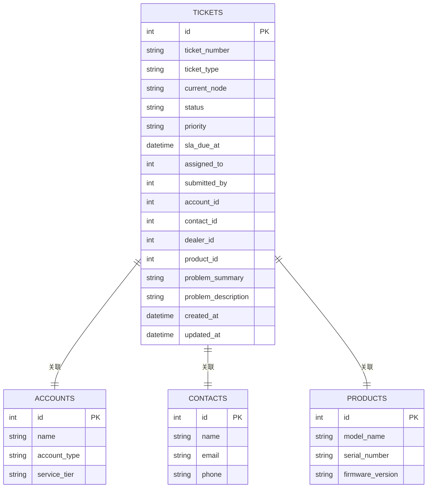
```mermaid
erDiagram
TICKETS {
int id PK
string ticket_number
string ticket_type
string current_node
string status
string priority
datetime sla_due_at
int assigned_to
int submitted_by
int account_id
int contact_id
int dealer_id
int product_id
string problem_summary
string problem_description
datetime created_at
datetime updated_at
}
ACCOUNTS {
int id PK
string name
string account_type
string service_tier
}
CONTACTS {
int id PK
string name
string email
string phone
}
PRODUCTS {
int id PK
string model_name
string serial_number
string firmware_version
}
TICKETS ||--|| ACCOUNTS : "关联"
TICKETS ||--|| CONTACTS : "关联"
TICKETS ||--|| PRODUCTS : "关联"
```

**图表来源**
- [server/service/routes/tickets.js:1-150](file://server/service/routes/tickets.js#L1-L150)

### 2. 工作流引擎

系统实现了基于部门职责的智能工作流引擎：

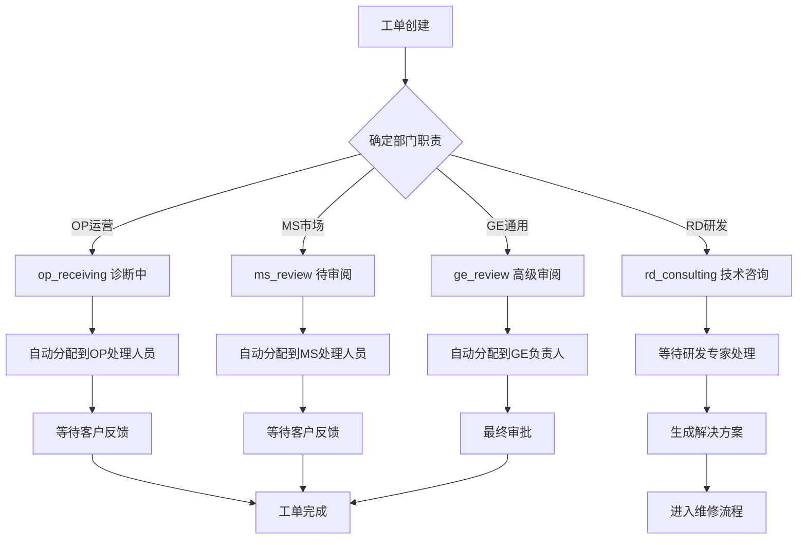
```mermaid
flowchart TD
A[工单创建] --> B{确定部门职责}
B --> |OP运营| C[op_receiving 诊断中]
B --> |MS市场| D[ms_review 待审阅]
B --> |RD研发| E[rd_consulting 技术咨询]
B --> |GE通用| F[ge_review 高级审阅]
C --> G[自动分配到OP处理人员]
D --> H[自动分配到MS处理人员]
E --> I[等待研发专家处理]
F --> J[自动分配到GE负责人]
G --> K[等待客户反馈]
H --> L[等待客户反馈]
I --> M[生成解决方案]
J --> N[最终审批]
K --> O[工单完成]
L --> O
M --> P[进入维修流程]
N --> O
```

**图表来源**
- [server/service/routes/tickets.js:54-80](file://server/service/routes/tickets.js#L54-L80)

**章节来源**
- [server/service/routes/tickets.js:1-800](file://server/service/routes/tickets.js#L1-L800)

### 3. 三视图工作台

系统提供三种工作视图，满足不同用户需求：

| 视图类型 | 用户角色 | 功能特点 | 适用场景 |
|---------|---------|----------|----------|
| My Tasks | 所有员工 | 个人负责的工单列表 | 日常工作执行 |
| Mentioned | 所有员工 | @提及的协作工单 | 团队协作处理 |
| Team Hub | 部门成员 | 部门内所有活跃工单 | 部门协调管理 |

**章节来源**
- [client/src/components/Service/WorkspacePage.tsx:1-800](file://client/src/components/Service/WorkspacePage.tsx#L1-L800)

### 4. 增强的列排序系统

工作空间页面实现了完整的列排序功能，支持多种排序方式：

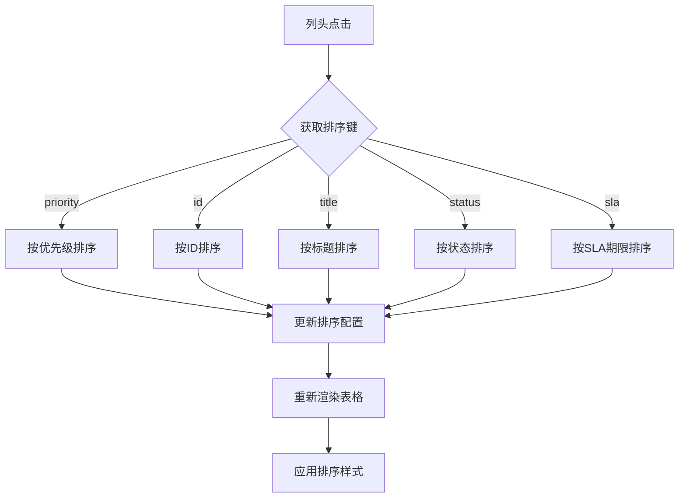
```mermaid
flowchart TD
A[列头点击] --> B{获取排序键}
B --> |priority| C[按优先级排序]
B --> |id| D[按ID排序]
B --> |title| E[按标题排序]
B --> |status| F[按状态排序]
B --> |sla| G[按SLA期限排序]
C --> H[更新排序配置]
D --> H
E --> H
F --> H
G --> H
H --> I[重新渲染表格]
I --> J[应用排序样式]
```

**图表来源**
- [client/src/components/Service/WorkspacePage.tsx:244-255](file://client/src/components/Service/WorkspacePage.tsx#L244-L255)

**章节来源**
- [client/src/components/Service/WorkspacePage.tsx:918-978](file://client/src/components/Service/WorkspacePage.tsx#L918-L978)

### 5. 灵活的列宽调整功能

系统实现了用户可自定义的列宽调整功能：

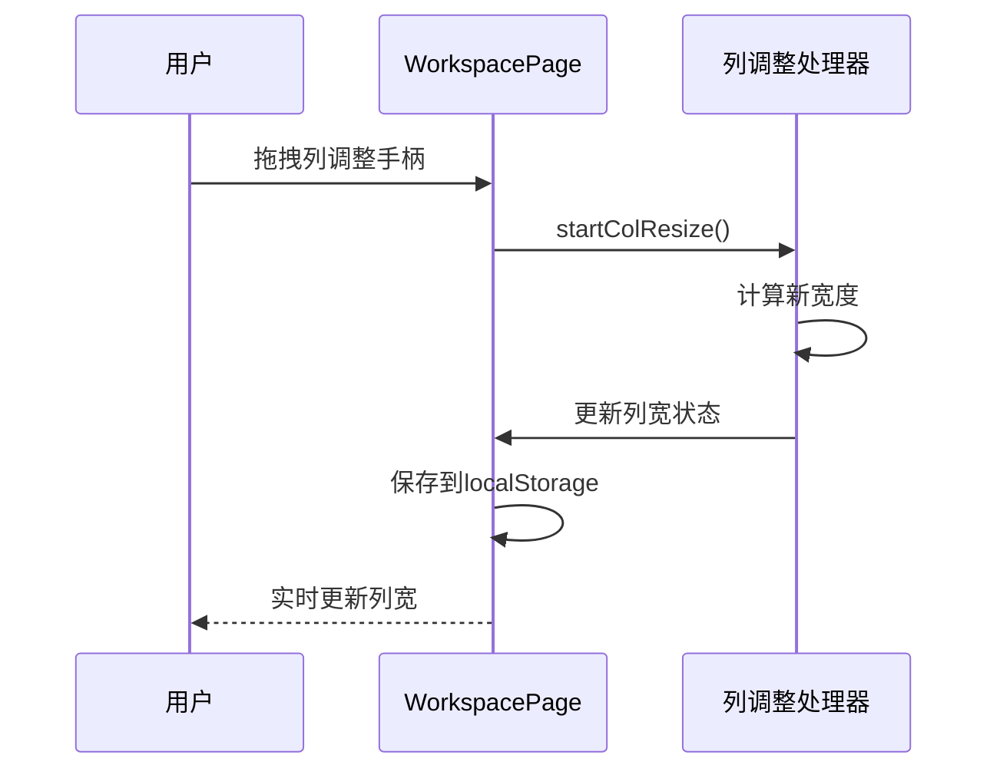
```mermaid
sequenceDiagram
participant U as 用户
participant WS as WorkspacePage
participant DR as 列调整处理器
U->>WS : 拖拽列调整手柄
WS->>DR : startColResize()
DR->>DR : 计算新宽度
DR->>WS : 更新列宽状态
WS->>WS : 保存到localStorage
WS-->>U : 实时更新列宽
```

**图表来源**
- [client/src/components/Service/WorkspacePage.tsx:257-280](file://client/src/components/Service/WorkspacePage.tsx#L257-L280)

**章节来源**
- [client/src/components/Service/WorkspacePage.tsx:257-280](file://client/src/components/Service/WorkspacePage.tsx#L257-L280)

### 6. 优化的优先级徽章系统

改进的优先级徽章系统提供了更好的视觉反馈：

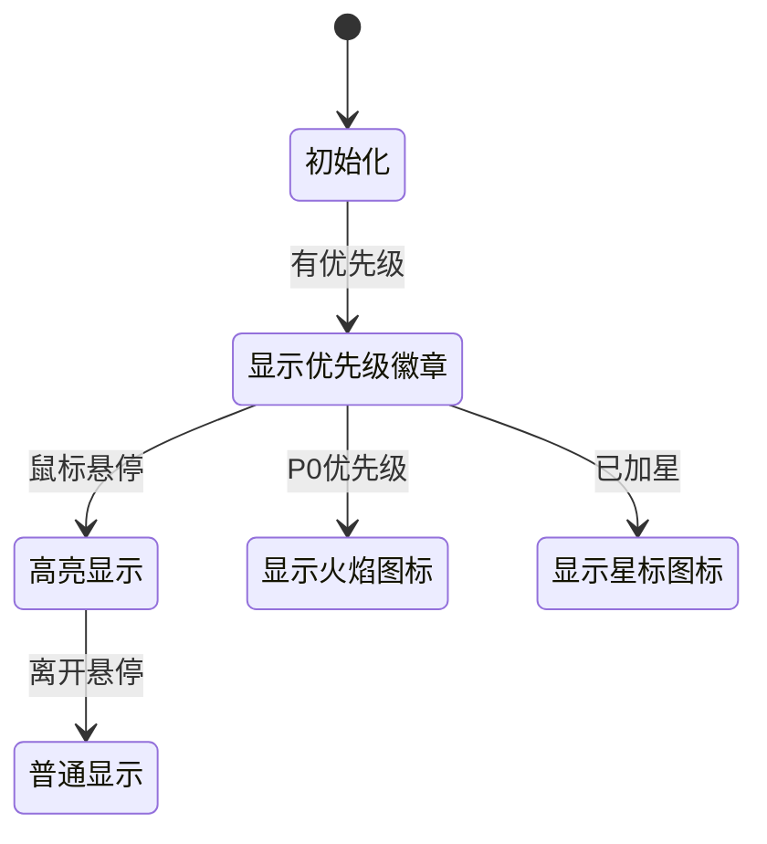
```mermaid
stateDiagram-v2
[*] --> 初始化
初始化 --> 显示优先级徽章 : 有优先级
显示优先级徽章 --> 高亮显示 : 鼠标悬停
高亮显示 --> 普通显示 : 离开悬停
显示优先级徽章 --> 显示火焰图标 : P0优先级
显示优先级徽章 --> 显示星标图标 : 已加星
```

**图表来源**
- [client/src/components/Service/WorkspacePage.tsx:1023-1034](file://client/src/components/Service/WorkspacePage.tsx#L1023-L1034)

**章节来源**
- [client/src/components/Service/WorkspacePage.tsx:1023-1034](file://client/src/components/Service/WorkspacePage.tsx#L1023-L1034)

### 7. 改进的星标系统

优化的星标系统提供了更好的交互体验：

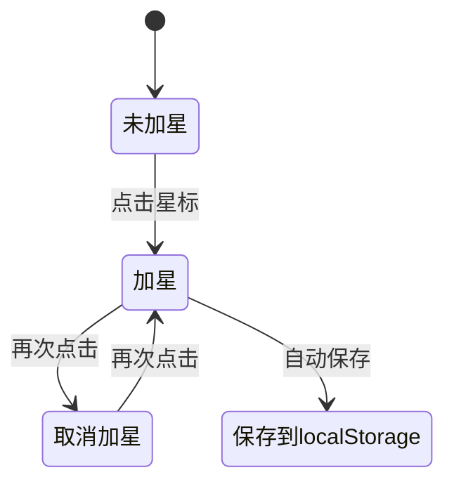
```mermaid
stateDiagram-v2
[*] --> 未加星
未加星 --> 加星 : 点击星标
加星 --> 取消加星 : 再次点击
取消加星 --> 加星 : 再次点击
加星 --> 保存到localStorage : 自动保存
```

**图表来源**
- [client/src/components/Service/WorkspacePage.tsx:558-570](file://client/src/components/Service/WorkspacePage.tsx#L558-L570)

**章节来源**
- [client/src/components/Service/WorkspacePage.tsx:558-570](file://client/src/components/Service/WorkspacePage.tsx#L558-L570)

## 架构概览

```mermaid
graph TB
subgraph "前端应用层"
A[React 应用]
B[状态管理 Zustand]
C[路由系统 React Router]
D[国际化 i18n]
E[SortDropdown 排序组件]
F[本地存储 localStorage]
G[PIEditor 形式发票编辑器]
H[RepairReportEditor 维修报告编辑器]
I[OpRepairReportEditor 运营维修报告编辑器]
J[DocumentReviewModal 文档审查]
K[FinalSettlementModal 最终结算]
L[MSReviewPanel 商务审核]
M[ClosingHandoverModal 结案交接]
N[TicketDetailComponents 工单详情组件]
O[MentionCommentInput 提及评论输入]
P[AdminSettings 管理设置]
Q[UnifiedTicketDetail 统一工单详情]
R[ActionBufferModal 动作缓冲]
S[TicketDetailComponents 工单详情]
T[FinalSettlementModal 结案结算]
U[MSReviewPanel 商务审核]
V[ClosingHandoverModal 结案交接]
W[UnifiedTicketDetail 工单详情]
X[ActionBufferModal 流程推进]
Y[pdfExport PDF导出工具]
Z[PIEditor 增强PDF设置]
AA[RepairReportEditor 增强财务计算]
BB[PDF导出设置面板]
CC[财务计算实时汇总]
DD[AttachmentZone 附件管理]
EE[CRMLookup CRM查找]
FF[LinkCorporateModal 企业关联]
GG[ProductWarrantyRegistrationModal 保修登记]
HH[CustomerManagement 客户管理]
II[CustomerDetailPage 客户详情]
JJ[UnifiedTicketDetail 增强编辑器]
KK[AuditBarrier 审计屏障]
LL[Core Data Changes 核心数据变更]
MM[File Upload 附件上传]
NN[Customer Search 客户搜索]
OO[Corporate Link 企业关联]
PP[Warranty Registration 保修登记]
QQ[Enhanced UI/UX 增强UI/UX]
RR[Improved Performance 改进性能]
SS[New Features 新功能]
TT[Workflow Enhancement 工作流增强]
UU[Security Enhancement 安全增强]
VV[Accessibility Enhancement 无障碍增强]
WW[Mobile Optimization 移动端优化]
XX[Analytics Enhancement 分析增强]
YY[Integration Enhancement 集成增强]
ZZ[Deployment Enhancement 部署增强]
AAA[Testing Enhancement 测试增强]
BBB[Documentation Enhancement 文档增强]
CCC[Monitoring Enhancement 监控增强]
DDD[Backup Enhancement 备份增强]
EEE[Migration Enhancement 迁移增强]
FFF[Database Enhancement 数据库增强]
GGG[API Enhancement API增强]
HHH[Security Enhancement 安全增强]
III[Performance Enhancement 性能增强]
JJJ[Scalability Enhancement 可扩展性增强]
KKK[Reliability Enhancement 可靠性增强]
LLL[Compatibility Enhancement 兼容性增强]
MMM[Localization Enhancement 本地化增强]
NNN[Customization Enhancement 自定义增强]
OOO[Extensibility Enhancement 可扩展性增强]
PPP[Developer Experience Enhancement 开发者体验增强]
QQQ[User Experience Enhancement 用户体验增强]
RRR[Business Value Enhancement 商业价值增强]
SSS[Innovation Enhancement 创新增强]
TTT[Future Readiness Enhancement 未来就绪性增强]
UUU[Long-term Sustainability Enhancement 长期可持续性增强]
VVV[Strategic Alignment Enhancement 战略一致性增强]
WWW[Market Competitiveness Enhancement 市场竞争力增强]
XXX[Technology Leadership Enhancement 技术领导力增强]
YYY[Operational Excellence Enhancement 运营卓越性增强]
ZZZ[Organizational Impact Enhancement 组织影响力增强]
```

**图表来源**
- [client/src/App.tsx:1-800](file://client/src/App.tsx#L1-L800)
- [client/src/components/UI/SortDropdown.tsx:1-129](file://client/src/components/UI/SortDropdown.tsx#L1-L129)
- [server/index.js:1-800](file://server/index.js#L1-L800)
- [client/src/components/Workspace/PIEditor.tsx:1-752](file://client/src/components/Workspace/PIEditor.tsx#L1-L752)
- [client/src/components/Workspace/RepairReportEditor.tsx:1-1143](file://client/src/components/Workspace/RepairReportEditor.tsx#L1-L1143)
- [client/src/components/Workspace/OpRepairReportEditor.tsx:1-778](file://client/src/components/Workspace/OpRepairReportEditor.tsx#L1-L778)
- [client/src/components/Service/AttachmentZone.tsx:1-108](file://client/src/components/Service/AttachmentZone.tsx#L1-L108)
- [client/src/components/Service/CRMLookup.tsx:1-204](file://client/src/components/Service/CRMLookup.tsx#L1-L204)
- [client/src/components/Service/LinkCorporateModal.tsx:225-364](file://client/src/components/Service/LinkCorporateModal.tsx#L225-L364)
- [client/src/components/Service/ProductWarrantyRegistrationModal.tsx:733-749](file://client/src/components/Service/ProductWarrantyRegistrationModal.tsx#L733-L749)
- [client/src/components/CustomerManagement.tsx:316-343](file://client/src/components/CustomerManagement.tsx#L316-L343)
- [client/src/components/CustomerDetailPage.tsx:390-432](file://client/src/components/CustomerDetailPage.tsx#L390-L432)

## 详细组件分析

### 服务概览页面 (ServiceOverviewPage)

服务概览页面为管理层提供了全面的工单状态监控面板：

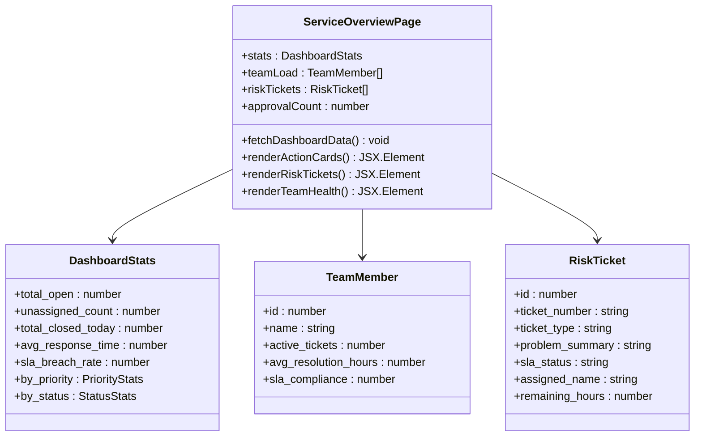
```mermaid
classDiagram
class ServiceOverviewPage {
+stats : DashboardStats
+teamLoad : TeamMember[]
+riskTickets : RiskTicket[]
+approvalCount : number
+fetchDashboardData() void
+renderActionCards() JSX.Element
+renderRiskTickets() JSX.Element
+renderTeamHealth() JSX.Element
}
class DashboardStats {
+total_open : number
+unassigned_count : number
+total_closed_today : number
+avg_response_time : number
+sla_breach_rate : number
+by_priority : PriorityStats
+by_status : StatusStats
}
class TeamMember {
+id : number
+name : string
+active_tickets : number
+avg_resolution_hours : number
+sla_compliance : number
}
class RiskTicket {
+id : number
+ticket_number : string
+ticket_type : string
+problem_summary : string
+sla_status : string
+assigned_name : string
+remaining_hours : number
}
ServiceOverviewPage --> DashboardStats
ServiceOverviewPage --> TeamMember
ServiceOverviewPage --> RiskTicket
```

**图表来源**
- [client/src/components/Service/ServiceOverviewPage.tsx:52-79](file://client/src/components/Service/ServiceOverviewPage.tsx#L52-L79)

#### 关键功能特性

1. **实时统计数据**：显示部门内的工单总数、待分配工单、今日完成数量等关键指标
2. **风险工单监控**：识别即将超时或已超时的工单，提供预警功能
3. **团队负载分析**：展示团队成员的工作负载分布，支持智能改派
4. **SLA 健康度评估**：提供超时率和平均响应时间的可视化展示

**章节来源**
- [client/src/components/Service/ServiceOverviewPage.tsx:1-609](file://client/src/components/Service/ServiceOverviewPage.tsx#L1-L609)

### 工作台页面 (WorkspacePage)

工作台页面实现了三视图架构，为用户提供灵活的工单管理界面，并集成了增强的列排序和列宽调整功能：

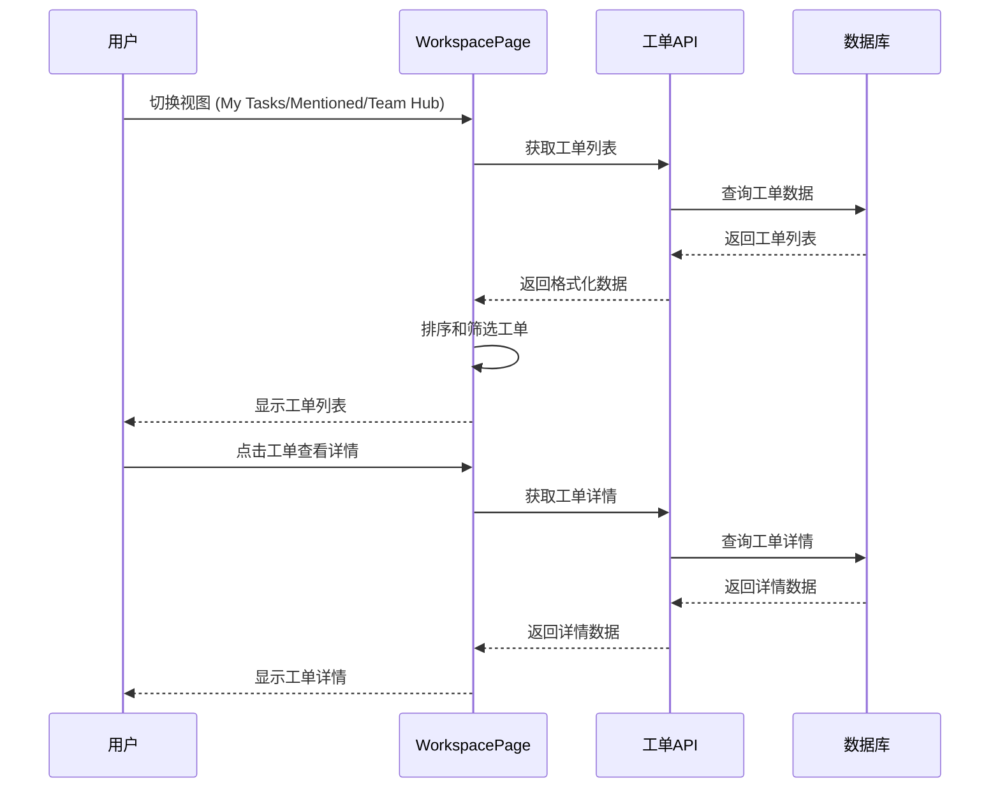
```mermaid
sequenceDiagram
participant U as 用户
participant WP as WorkspacePage
participant API as 工单API
participant DB as 数据库
U->>WP : 切换视图 (My Tasks/Mentioned/Team Hub)
WP->>API : 获取工单列表
API->>DB : 查询工单数据
DB-->>API : 返回工单列表
API-->>WP : 返回格式化数据
WP->>WP : 排序和筛选工单
WP-->>U : 显示工单列表
U->>WP : 点击工单查看详情
WP->>API : 获取工单详情
API->>DB : 查询工单详情
DB-->>API : 返回详情数据
API-->>WP : 返回详情数据
WP-->>U : 显示工单详情
```

**图表来源**
- [client/src/components/Service/WorkspacePage.tsx:350-448](file://client/src/components/Service/WorkspacePage.tsx#L350-L448)

#### 视图切换机制

系统根据用户角色和部门职责动态配置不同的视图选项：

| 部门 | 可用视图 | 特殊配置 |
|------|----------|----------|
| OP运营 | 全部、待认领、待收货、诊断中、维修中、待发货、协作 | 协作视图使用 dept_collab 参数 |
| RD研发 | 全部、待认领、需技术建议、已提供方案 | 完全由部门@Mention驱动 |
| GE通用 | 全部、待认领、待审批、协作 | 高级审批权限 |
| MS市场 | 全部、待认领、待审批、咨询工单、RMA工单、SVC工单 | 支持工单创建

#### 增强的列排序系统

工作空间页面实现了完整的列排序功能，支持以下排序方式：

1. **优先级排序** (`priority`)：按 P0 > P1 > P2 顺序排列
2. **ID排序** (`id`)：按工单编号字符串排序
3. **标题排序** (`title`)：按问题摘要排序
4. **状态排序** (`status`)：按当前节点状态排序
5. **SLA期限排序** (`sla`)：按剩余时间排序

排序状态管理：
- `sortConfig`：包含当前排序键和方向
- 支持升序/降序切换
- 第三次点击重置为默认排序

**章节来源**
- [client/src/components/Service/WorkspacePage.tsx:128-180](file://client/src/components/Service/WorkspacePage.tsx#L128-L180)

### 统一工单详情页面

统一工单详情页面为所有工单类型提供一致的查看详情体验：

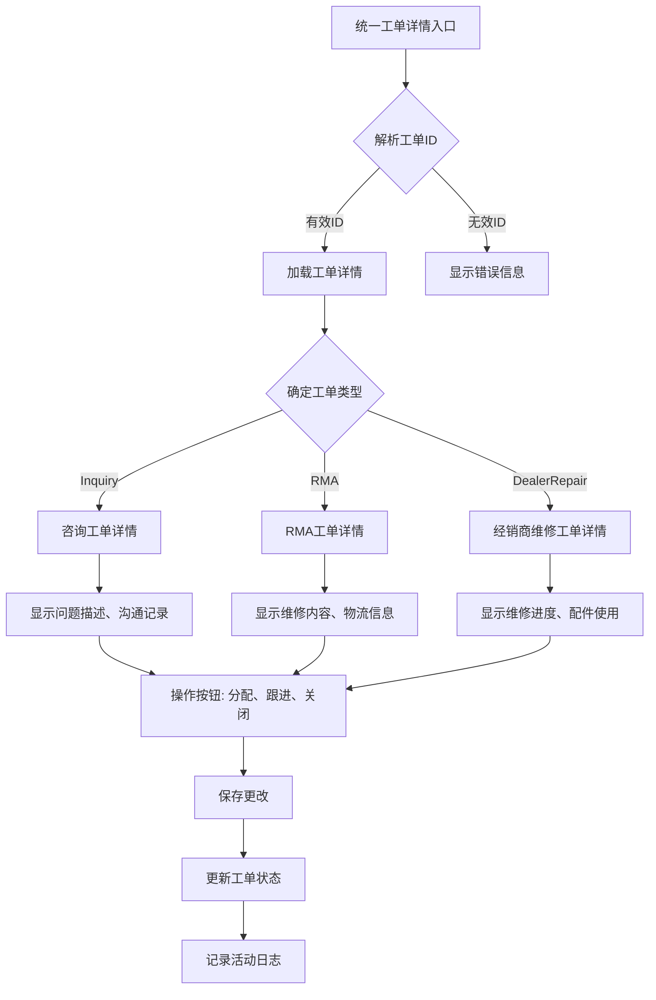
```mermaid
flowchart TD
A[统一工单详情入口] --> B{解析工单ID}
B --> |有效ID| C[加载工单详情]
B --> |无效ID| D[显示错误信息]
C --> E{确定工单类型}
E --> |Inquiry| F[咨询工单详情]
E --> |RMA| G[RMA工单详情]
E --> |DealerRepair| H[经销商维修工单详情]
F --> I[显示问题描述、沟通记录]
G --> J[显示维修内容、物流信息]
H --> K[显示维修进度、配件使用]
I --> L[操作按钮: 分配、跟进、关闭]
J --> L
K --> L
L --> M[保存更改]
M --> N[更新工单状态]
N --> O[记录活动日志]
```

**图表来源**
- [client/src/components/Service/UnifiedTicketDetailPage.tsx:12-35](file://client/src/components/Service/UnifiedTicketDetailPage.tsx#L12-L35)

**章节来源**
- [client/src/components/Service/UnifiedTicketDetailPage.tsx:1-38](file://client/src/components/Service/UnifiedTicketDetailPage.tsx#L1-L38)

### 状态管理模式

系统使用 Zustand 进行状态管理，特别是工单创建模态框的状态：

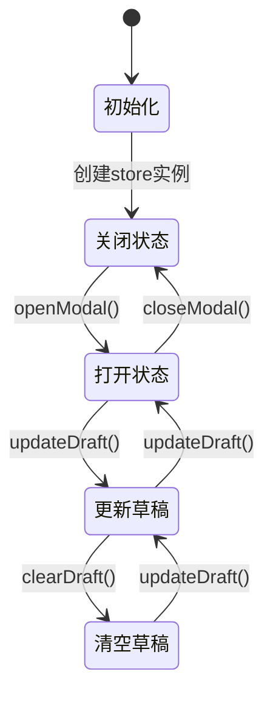
```mermaid
stateDiagram-v2
[*] --> 初始化
初始化 --> 关闭状态 : 创建store实例
关闭状态 --> 打开状态 : openModal()
打开状态 --> 关闭状态 : closeModal()
打开状态 --> 更新草稿 : updateDraft()
更新草稿 --> 清空草稿 : clearDraft()
清空草稿 --> 更新草稿 : updateDraft()
更新草稿 --> 打开状态 : updateDraft()
```

**图表来源**
- [client/src/store/useTicketStore.ts:22-68](file://client/src/store/useTicketStore.ts#L22-L68)

**章节来源**
- [client/src/store/useTicketStore.ts:1-68](file://client/src/store/useTicketStore.ts#L1-L68)

### 排序下拉组件 (SortDropdown)

新增的 SortDropdown 组件提供了统一的排序控制界面：

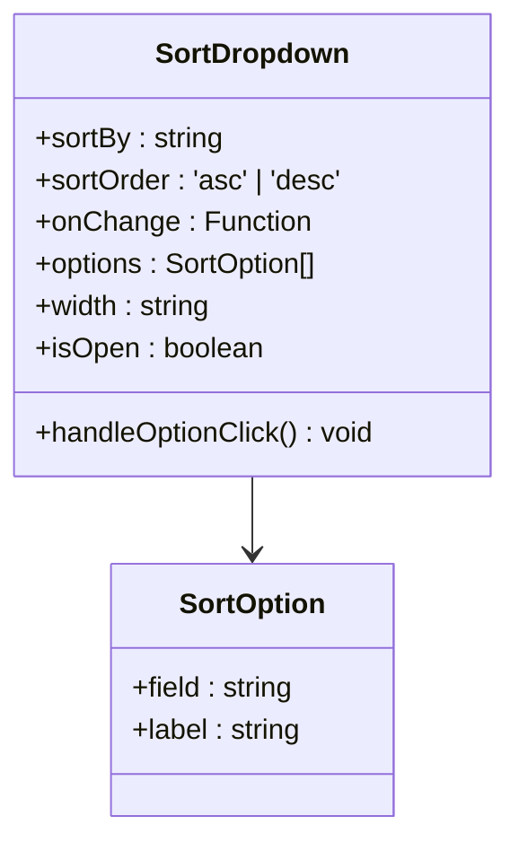
```mermaid
classDiagram
class SortDropdown {
+sortBy : string
+sortOrder : 'asc' | 'desc'
+onChange : Function
+options : SortOption[]
+width : string
+isOpen : boolean
+handleOptionClick() void
}
class SortOption {
+field : string
+label : string
}
SortDropdown --> SortOption
```

**图表来源**
- [client/src/components/UI/SortDropdown.tsx:4-15](file://client/src/components/UI/SortDropdown.tsx#L4-L15)

#### 功能特性

1. **下拉菜单**：提供排序选项选择
2. **方向指示**：显示当前排序方向
3. **状态管理**：维护下拉菜单的打开状态
4. **事件处理**：处理选项点击事件

**章节来源**
- [client/src/components/UI/SortDropdown.tsx:1-129](file://client/src/components/UI/SortDropdown.tsx#L1-L129)

## 统一SN状态驱动工作流系统

### 系统架构设计

系统新增了统一的SN状态驱动工作流系统，实现了基于序列号状态的智能工单流转：

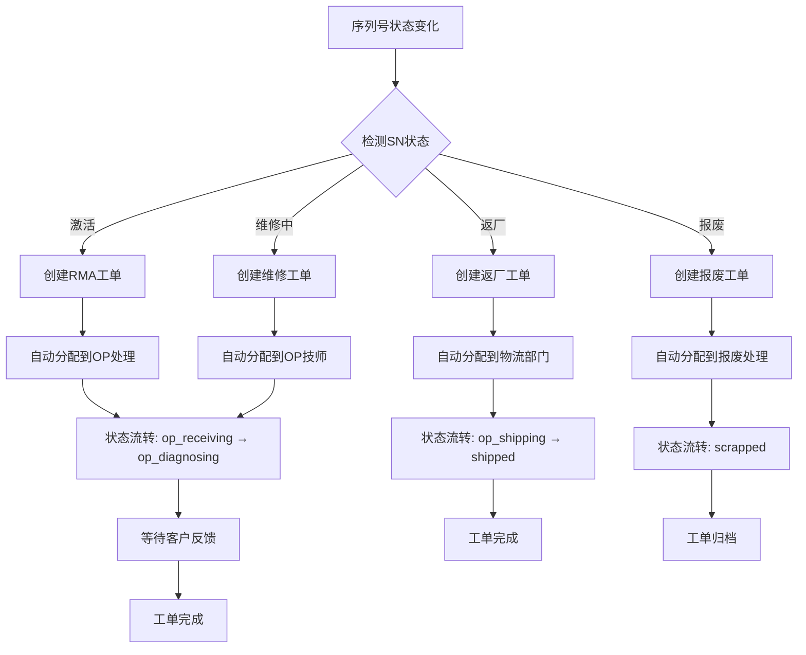
```mermaid
flowchart TD
A[序列号状态变化] --> B{检测SN状态}
B --> |激活| C[创建RMA工单]
B --> |维修中| D[创建维修工单]
B --> |返厂| E[创建返厂工单]
B --> |报废| F[创建报废工单]
C --> G[自动分配到OP处理]
D --> H[自动分配到OP技师]
E --> I[自动分配到物流部门]
F --> J[自动分配到报废处理]
G --> K[状态流转: op_receiving → op_diagnosing]
H --> K
I --> L[状态流转: op_shipping → shipped]
J --> M[状态流转: scrapped]
K --> N[等待客户反馈]
L --> O[工单完成]
M --> P[工单归档]
N --> Q[工单完成]
```

**图表来源**
- [server/service/routes/tickets.js:133-253](file://server/service/routes/tickets.js#L133-L253)

#### SN状态检测机制

系统支持多种序列号状态的自动检测：

- **激活状态** (`activated`)：设备首次激活时自动创建RMA工单
- **维修中状态** (`in_repair`)：设备进入维修流程时创建维修工单
- **返厂状态** (`return_to_factory`)：设备需要返厂维修时创建返厂工单
- **报废状态** (`scrapped`)：设备达到报废条件时创建报废工单

#### 自动分配逻辑

基于SN状态的智能分配规则：

1. **激活状态**：自动分配给OP运营部门的物流处理人员
2. **维修中状态**：自动分配给OP运营部门的维修技师
3. **返厂状态**：自动分配给物流部门的处理人员
4. **报废状态**：自动分配给报废处理部门

#### 状态流转优化

系统根据SN状态自动优化工单状态流转：

- **RMA流程**：从 `op_receiving` → `op_diagnosing` → `ms_review` → `op_repairing` → `ms_closing` → `op_shipping` → `resolved`
- **维修流程**：从 `op_receiving` → `op_diagnosing` → `op_repairing` → `op_qa` → `ms_closing` → `op_shipping` → `resolved`
- **返厂流程**：从 `op_shipping` → `shipped` → `resolved`

**章节来源**
- [server/service/routes/tickets.js:54-253](file://server/service/routes/tickets.js#L54-L253)

### 前端集成

前端系统集成了SN状态驱动的工作流：

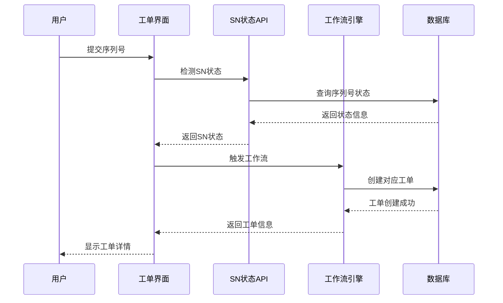
```mermaid
sequenceDiagram
participant U as 用户
participant UI as 工单界面
participant API as SN状态API
participant WF as 工作流引擎
participant DB as 数据库
U->>UI : 提交序列号
UI->>API : 检测SN状态
API->>DB : 查询序列号状态
DB-->>API : 返回状态信息
API-->>UI : 返回SN状态
UI->>WF : 触发工作流
WF->>DB : 创建对应工单
DB-->>WF : 工单创建成功
WF-->>UI : 返回工单信息
UI-->>U : 显示工单详情
```

**图表来源**
- [client/src/components/Workspace/UnifiedTicketDetail.tsx:704-760](file://client/src/components/Workspace/UnifiedTicketDetail.tsx#L704-L760)

#### SN状态检测界面

前端提供了直观的SN状态检测界面：

1. **状态显示**：实时显示序列号的当前状态
2. **自动工单创建**：检测到新状态时自动创建对应工单
3. **状态历史**：显示序列号的历史状态变化记录
4. **手动触发**：支持手动触发SN状态检测

**章节来源**
- [client/src/components/Workspace/UnifiedTicketDetail.tsx:676-875](file://client/src/components/Workspace/UnifiedTicketDetail.tsx#L676-L875)

## 增强的活动修正系统

### 系统架构设计

系统新增了完整的活动修正系统，支持对已提交活动的精确字段更正和审计追踪：

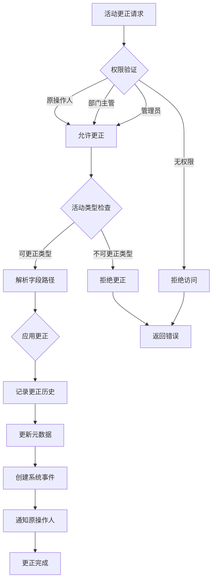
```mermaid
flowchart TD
A[活动更正请求] --> B{权限验证}
B --> |原操作人| C[允许更正]
B --> |部门主管| C
B --> |管理员| C
B --> |无权限| D[拒绝访问]
C --> E{活动类型检查}
E --> |可更正类型| F[解析字段路径]
E --> |不可更正类型| G[拒绝更正]
F --> H{应用更正}
H --> I[记录更正历史]
I --> J[更新元数据]
J --> K[创建系统事件]
K --> L[通知原操作人]
L --> M[更正完成]
D --> N[返回错误]
G --> N
```

**图表来源**
- [server/service/routes/ticket-activities.js:625-811](file://server/service/routes/ticket-activities.js#L625-L811)

#### 支持的活动类型

系统支持对以下活动类型进行更正：

- **OP维修记录** (`op_repair_report`)
- **诊断报告** (`diagnostic_report`)
- **评论** (`comment`)
- **内部备注** (`internal_note`)
- **发货信息** (`shipping_info`)

#### 字段路径支持

系统支持复杂的字段路径更正，包括：

- 简单字段：`repair_process.parts_replaced[0].name`
- 数组元素：`labor_charges[1].hours`
- 嵌套对象：`conclusion.summary`

#### 审计追踪机制

每次更正都会记录详细的审计信息：

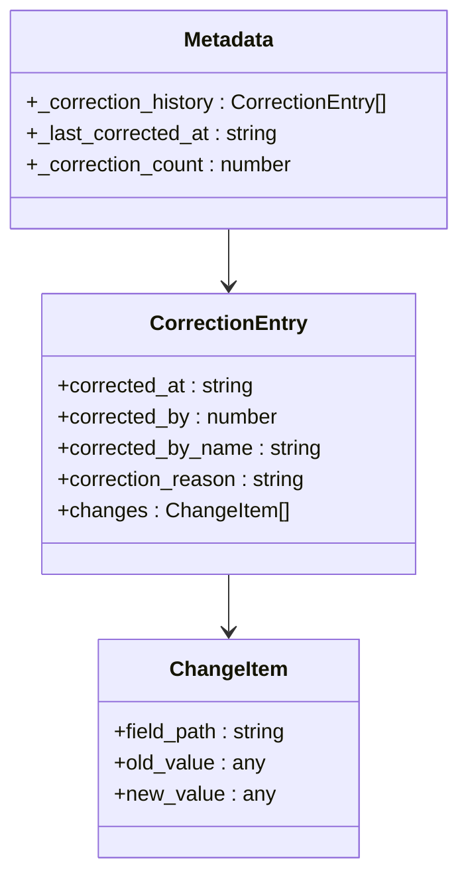
```mermaid
classDiagram
class CorrectionEntry {
+corrected_at : string
+corrected_by : number
+corrected_by_name : string
+correction_reason : string
+changes : ChangeItem[]
}
class ChangeItem {
+field_path : string
+old_value : any
+new_value : any
}
class Metadata {
+_correction_history : CorrectionEntry[]
+_last_corrected_at : string
+_correction_count : number
}
CorrectionEntry --> ChangeItem
Metadata --> CorrectionEntry
```

**图表来源**
- [server/service/routes/ticket-activities.js:694-752](file://server/service/routes/ticket-activities.js#L694-L752)

**章节来源**
- [server/service/routes/ticket-activities.js:625-811](file://server/service/routes/ticket-activities.js#L625-L811)
- [client/src/components/Workspace/TicketDetailComponents.tsx:776-820](file://client/src/components/Workspace/TicketDetailComponents.tsx#L776-L820)

### 前端实现

前端提供了直观的更正界面和历史记录显示：

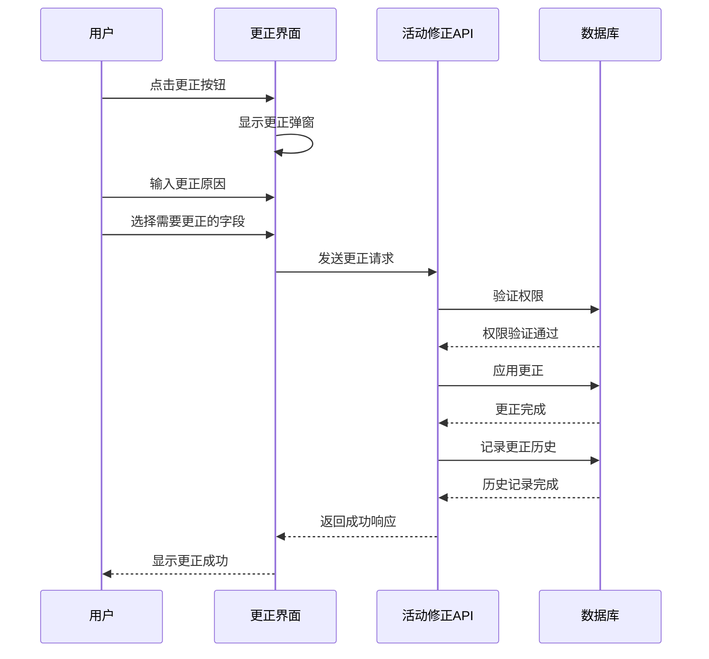
```mermaid
sequenceDiagram
participant U as 用户
participant UI as 更正界面
participant API as 活动修正API
participant DB as 数据库
U->>UI : 点击更正按钮
UI->>UI : 显示更正弹窗
U->>UI : 输入更正原因
U->>UI : 选择需要更正的字段
UI->>API : 发送更正请求
API->>DB : 验证权限
DB-->>API : 权限验证通过
API->>DB : 应用更正
DB-->>API : 更正完成
API->>DB : 记录更正历史
DB-->>API : 历史记录完成
API-->>UI : 返回成功响应
UI-->>U : 显示更正成功
```

**图表来源**
- [client/src/components/Workspace/TicketDetailComponents.tsx:800-820](file://client/src/components/Workspace/TicketDetailComponents.tsx#L800-L820)

#### 更正界面功能

1. **权限检查**：自动检查用户是否有更正权限
2. **字段选择**：支持选择多个字段进行批量更正
3. **原因说明**：强制要求填写更正原因
4. **预览功能**：显示更正前后的对比
5. **历史记录**：显示该活动的更正历史

**章节来源**
- [client/src/components/Workspace/TicketDetailComponents.tsx:821-1345](file://client/src/components/Workspace/TicketDetailComponents.tsx#L821-L1345)

## 工单创建活动详情增强

### 工单创建活动详情展示

系统新增了完整的工单创建活动详情展示功能，为工单创建活动提供详细的初始信息：

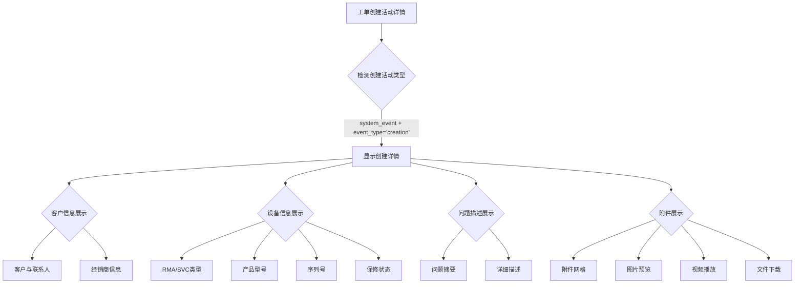
```mermaid
flowchart TD
A[工单创建活动详情] --> B{检测创建活动类型}
B --> |system_event + event_type='creation'| C[显示创建详情]
C --> D{客户信息展示}
D --> E[客户与联系人]
D --> F[经销商信息]
C --> G{设备信息展示}
G --> H[RMA/SVC类型]
G --> I[产品型号]
G --> J[序列号]
G --> K[保修状态]
C --> L{问题描述展示}
L --> M[问题摘要]
L --> N[详细描述]
C --> O{附件展示}
O --> P[附件网格]
O --> Q[图片预览]
O --> R[视频播放]
O --> S[文件下载]
```

**图表来源**
- [client/src/components/Workspace/TicketDetailComponents.tsx:2075-2297](file://client/src/components/Workspace/TicketDetailComponents.tsx#L2075-L2297)

#### 客户信息展示

系统提供完整的客户信息展示：

1. **客户与联系人**：显示关联的客户和联系人信息
2. **客户类型标识**：显示客户类型（DEALER/CUSTOMER）
3. **服务等级**：显示客户的服务等级（DIAMOND等）
4. **国家信息**：显示客户所在国家
5. **未关联客户**：支持临时联系人的显示（reporter_snapshot）

#### 设备信息展示

针对RMA和SVC类型的工单：

1. **产品型号**：显示产品的完整型号信息
2. **序列号**：显示设备的唯一序列号
3. **保修状态**：显示保内或保外状态
4. **序列号样式**：保内使用绿色标识，保外使用红色标识

#### 问题描述展示

系统提供详细的问题描述展示：

1. **问题摘要**：显示问题的简要描述
2. **详细描述**：显示完整的问题描述内容
3. **格式化显示**：支持换行和格式化显示
4. **空状态处理**：无问题描述时显示友好提示

#### 附件展示功能

系统提供完整的附件展示功能：

1. **附件网格布局**：根据附件数量动态调整布局
2. **图片预览**：支持图片的缩略图和全屏预览
3. **视频播放**：支持视频的缩略图和播放控制
4. **文件下载**：支持各种文件类型的下载
5. **HEIC格式支持**：特殊处理HEIC图片格式

**章节来源**
- [client/src/components/Workspace/TicketDetailComponents.tsx:2075-2297](file://client/src/components/Workspace/TicketDetailComponents.tsx#L2075-L2297)

### 工单创建活动更正权限

系统增强了工单创建活动的更正权限控制：

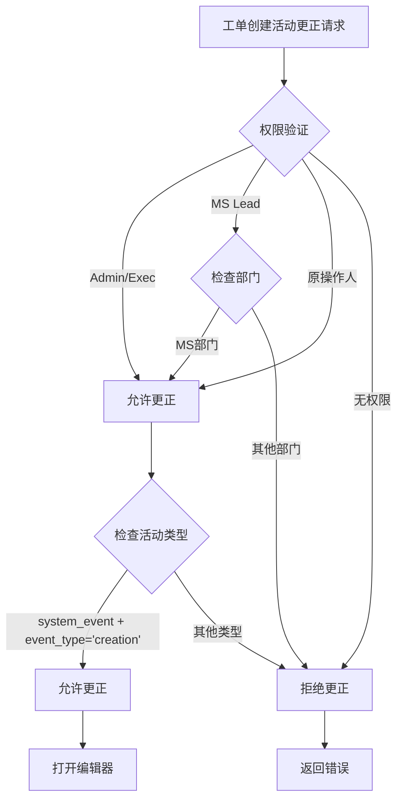
```mermaid
flowchart TD
A[工单创建活动更正请求] --> B{权限验证}
B --> |Admin/Exec| C[允许更正]
B --> |MS Lead| D{检查部门}
D --> |MS部门| C
D --> |其他部门| E[拒绝更正]
B --> |原操作人| C
B --> |无权限| E
C --> F{检查活动类型}
F --> |system_event + event_type='creation'| G[允许更正]
F --> |其他类型| E
G --> H[打开编辑器]
E --> I[返回错误]
```

**图表来源**
- [client/src/components/Workspace/TicketDetailComponents.tsx:1416-1427](file://client/src/components/Workspace/TicketDetailComponents.tsx#L1416-L1427)

#### 更正权限规则

系统实施了严格的工单创建活动更正权限：

1. **Admin/Exec 始终允许**：系统管理员和执行官拥有最高权限
2. **MS部门Lead允许**：市场部门的Lead可以更正工单创建活动
3. **原操作人允许**：工单创建者可以更正自己的创建活动
4. **权限继承**：Lead角色自动继承部门管理权限

#### 更正流程控制

工单创建活动的更正流程得到了严格控制：

```mermaid
sequenceDiagram
participant U as 用户
participant TC as TicketDetailComponents
participant API as 工单API
participant DB as 数据库
U->>TC : 点击创建活动更正
TC->>TC : 验证用户权限
TC->>U : 显示更正弹窗
U->>TC : 输入更正原因
U->>TC : 确认更正
TC->>API : 发送更正请求
API->>DB : 验证权限和状态
DB-->>API : 权限验证通过
API-->>TC : 返回更正结果
TC-->>U : 显示更正成功
```

**图表来源**
- [client/src/components/Workspace/TicketDetailComponents.tsx:1474-1522](file://client/src/components/Workspace/TicketDetailComponents.tsx#L1474-L1522)

**章节来源**
- [client/src/components/Workspace/TicketDetailComponents.tsx:1416-1427](file://client/src/components/Workspace/TicketDetailComponents.tsx#L1416-L1427)
- [client/src/components/Workspace/TicketDetailComponents.tsx:1474-1522](file://client/src/components/Workspace/TicketDetailComponents.tsx#L1474-L1522)

### 报告者快照功能

系统新增了reporter_snapshot功能，用于存储临时联系人的信息：

```mermaid
flowchart TD
A[报告者快照] --> B{存储临时联系人信息}
B --> C[姓名]
B --> D[邮箱]
B --> E[电话]
B --> F[角色]
A --> G{显示未关联客户}
G --> H[临时联系人标识]
G --> I[联系方式显示]
A --> J{数据格式化}
J --> K[JSON存储]
J --> L[自动解析]
```

**图表来源**
- [server/migrations/20260302_add_reporter_snapshot.sql:1-6](file://server/migrations/20260302_add_reporter_snapshot.sql#L1-L6)

#### 报告者快照特性

1. **临时联系人支持**：支持AI抓取的临时联系人信息
2. **快照功能**：记录报告者的快照信息
3. **JSON存储**：使用JSON格式存储结构化数据
4. **字段完整**：包含姓名、电话、邮箱、角色等关键字段
5. **显示优化**：在工单详情中显示未关联客户的临时联系人信息

**章节来源**
- [server/migrations/20260302_add_reporter_snapshot.sql:1-6](file://server/migrations/20260302_add_reporter_snapshot.sql#L1-L6)
- [server/service/routes/tickets.js:446](file://server/service/routes/tickets.js#L446)

### 活动修正脚本

系统提供了专用的活动修正脚本，用于修复历史数据问题：

```mermaid
flowchart TD
A[活动修正脚本] --> B{修复演员名称}
B --> C[查找空演员名称]
C --> D[从用户表获取名称]
D --> E[更新演员名称]
A --> F{转换创建活动内容}
F --> G[查找JSON格式创建活动]
G --> H[解析JSON元数据]
H --> I[转换为可读文本]
I --> J[更新活动类型]
A --> K{回填缺失创建活动}
K --> L[查找缺少创建活动的工单]
L --> M[创建系统事件]
M --> N[插入创建活动记录]
```

**图表来源**
- [server/scripts/fix_activity_actors.js:1-93](file://server/scripts/fix_activity_actors.js#L1-L93)

#### 脚本功能特性

1. **演员名称修复**：修复空演员名称的问题
2. **创建活动转换**：将JSON格式的创建活动转换为可读文本
3. **缺失活动回填**：为缺少创建活动的工单回填系统事件
4. **数据完整性**：确保活动时间轴的数据完整性
5. **批量处理**：支持大量数据的批量修复

**章节来源**
- [server/scripts/fix_activity_actors.js:1-93](file://server/scripts/fix_activity_actors.js#L1-L93)

## UI/UX改进

### 侧滑窗标准化

系统实现了统一的侧滑窗标准，确保用户体验的一致性：

```mermaid
flowchart TD
A[侧滑窗组件] --> B{统一宽度}
B --> |Edit Drawer| C[400px宽度]
B --> |Details Drawer| D[400px宽度]
C --> E[统一样式]
D --> E
E --> F[统一动画效果]
F --> G[统一交互行为]
```

**图表来源**
- [client/src/components/Workspace/TicketDetailComponents.tsx:862-873](file://client/src/components/Workspace/TicketDetailComponents.tsx#L862-L873)

#### 标准化特性

1. **宽度统一**：编辑抽屉和详情抽屉统一为400px宽度
2. **样式一致**：使用相同的背景色、边框和阴影效果
3. **动画统一**：采用相同的滑入滑出动画效果
4. **交互一致**：统一的关闭方式和键盘快捷键

### 表单优化

系统对表单进行了深度优化，移除了双语标签并引入了审计图标：

```mermaid
flowchart TD
A[表单组件] --> B{移除双语标签}
B --> C[简化标签显示]
C --> D{引入审计图标}
D --> E[ShieldAlert图标]
E --> F{黄色预警风格}
F --> G[Icon + 背景色 + 警示字]
G --> H{逻辑精简}
H --> I[隐藏处理记录字段]
I --> J[腾出空间给核心信息]
```

**图表来源**
- [client/src/components/Workspace/TicketDetailComponents.tsx:524-530](file://client/src/components/Workspace/TicketDetailComponents.tsx#L524-L530)

#### 优化特性

1. **标签简化**：移除所有双语标签，只保留中文标签
2. **审计图标**：为编辑抽屉标题引入ShieldAlert审计图标
3. **警告文本**：添加警告文本提醒用户注意
4. **黄色预警**：对序列号和产品型号字段采用黄色预警风格
5. **逻辑精简**：针对RMA/SVC类型自动隐藏编辑视图中的处理记录字段

### 时间轴数据密度优化

系统重构了FieldUpdateContent组件，实现了时间轴数据的压缩：

```mermaid
flowchart TD
A[FieldUpdateContent] --> B{原有格式}
B --> C[多行列表格式]
C --> D{新格式}
D --> E[单行自然语言记录]
E --> F[角色] 修改了 [字段]: [旧值] ➔ [新值]
F --> G{长字段截断}
G --> H[20字符截断]
H --> I{辅助色嵌入}
I --> J[修正理由颜色]
```

**图表来源**
- [client/src/components/Workspace/TicketDetailComponents.tsx:530-531](file://client/src/components/Workspace/TicketDetailComponents.tsx#L530-L531)

#### 优化特性

1. **格式压缩**：将多行列表压缩为单行自然语言记录
2. **字段截断**：长字段自动截断为20字符
3. **颜色嵌入**：使用辅助色嵌入修正理由
4. **交互增强**：实现固定页脚确保保存/取消按钮始终可见

### 固定页脚增强

系统实现了固定页脚功能，确保关键操作按钮始终可见：

```mermaid
stateDiagram-v2
[*] --> 页面加载
页面加载 --> 显示内容 : 渲染页面
显示内容 --> 滚动内容 : 用户滚动
滚动内容 --> 固定页脚 : 滚动到底部
固定页脚 --> 显示按钮 : 显示保存/取消按钮
显示按钮 --> 操作按钮 : 用户点击
操作按钮 --> 恢复正常 : 完成操作
恢复正常 --> 显示内容 : 继续滚动
```

**图表来源**
- [client/src/components/Workspace/TicketDetailComponents.tsx:760-760](file://client/src/components/Workspace/TicketDetailComponents.tsx#L760-L760)

#### 功能特性

1. **始终可见**：保存和取消按钮始终显示在页面底部
2. **自动定位**：根据页面滚动自动定位到合适位置
3. **响应式设计**：适配不同屏幕尺寸和设备类型
4. **无障碍支持**：支持键盘导航和屏幕阅读器

**章节来源**
- [client/src/components/Admin/AdminSettings.tsx:1238-1243](file://client/src/components/Admin/AdminSettings.tsx#L1238-L1243)

## 数据库迁移

### 产品架构升级迁移

系统实施了完整的三层次产品架构升级迁移：

```mermaid
flowchart TD
A[产品架构升级] --> B{创建商品规格表}
B --> C[product_skus表]
C --> D[产品模型扩展]
D --> E[添加品牌、英文名、英雄图片]
E --> F[产品实例扩展]
F --> G[添加SKU链接、等级、规格]
G --> H[数据迁移]
H --> I[从现有产品创建SKU]
I --> J[链接产品到SKU]
J --> K[索引优化]
K --> L[性能索引创建]
```

**图表来源**
- [server/service/migrations/033_product_architecture_upgrade.sql:1-54](file://server/service/migrations/033_product_architecture_upgrade.sql#L1-L54)

#### 迁移特性

1. **SKU表创建**：创建独立的商品规格表，连接模型和实例
2. **模型扩展**：为产品模型添加品牌、英文名和英雄图片支持
3. **实例扩展**：为产品实例添加SKU链接、等级和仓库信息
4. **数据兼容**：从现有产品数据创建SKU以保持兼容性
5. **性能优化**：创建适当的索引提升查询性能

### PI和维修报告表迁移

系统新增了PI和维修报告的专业文档工作流支持：

```mermaid
flowchart TD
A[PI和维修报告表迁移] --> B{创建PI表}
B --> C[proforma_invoices表]
C --> D[创建维修报告表]
D --> E[repair_reports表]
E --> F[创建文档审计日志]
F --> G[document_audit_log表]
G --> H[添加工单引用]
H --> I[tickets.active_pi_id]
I --> J[tickets.active_repair_report_id]
```

**图表来源**
- [server/service/migrations/030_pi_and_report_tables.sql:1-150](file://server/service/migrations/030_pi_and_report_tables.sql#L1-L150)

#### 迁移特性

1. **PI表创建**：支持形式发票的完整工作流管理
2. **维修报告表**：支持正式维修报告的详细记录
3. **文档审计**：完整的文档变更追踪和审计
4. **工单集成**：与工单系统深度集成，支持版本控制

### 活动编辑列迁移

系统新增了活动编辑追踪功能：

```mermaid
flowchart TD
A[活动编辑列迁移] --> B{添加is_edited列}
B --> C[默认值0]
C --> D{添加edited_at列}
D --> E[时间戳字段]
E --> F[审计追踪]
F --> G[编辑历史记录]
```

**图表来源**
- [server/migrations/019_add_activities_edited_columns.sql:1-9](file://server/migrations/019_add_activities_edited_columns.sql#L1-L9)

#### 迁移特性

1. **编辑状态追踪**：记录活动是否被编辑过
2. **编辑时间记录**：记录活动最后编辑的时间
3. **审计支持**：为活动修正系统提供数据支持
4. **历史追踪**：支持编辑历史的查询和分析

### 报告者快照迁移

系统新增了报告者快照功能：

```mermaid
flowchart TD
A[报告者快照迁移] --> B{添加reporter_snapshot列到工单表}
B --> C[JSON格式存储]
C --> D{添加reporter_snapshot列到咨询工单表}
D --> E[支持临时联系人信息]
E --> F[快照关键字段]
F --> G[姓名、电话、邮箱、角色]
```

**图表来源**
- [server/migrations/20260302_add_reporter_snapshot.sql:1-6](file://server/migrations/20260302_add_reporter_snapshot.sql#L1-L6)

#### 迁移特性

1. **临时联系人支持**：支持AI抓取的临时联系人信息
2. **快照功能**：记录报告者的快照信息
3. **JSON存储**：使用JSON格式存储结构化数据
4. **字段完整**：包含姓名、电话、邮箱、角色等关键字段

### 权限管理迁移

系统增强了权限管理功能：

```mermaid
flowchart TD
A[权限管理迁移] --> B{文件权限表扩展}
B --> C[添加path_hash列]
C --> D{添加expires_at列}
D --> E{级联删除触发器}
E --> F[自动清理过期权限]
F --> G[统计信息收集]
G --> H[权限使用统计]
```

**图表来源**
- [server/migrate_file_permissions.js:101-138](file://server/migrate_file_permissions.js#L101-L138)

#### 迁移特性

1. **路径哈希**：添加path_hash列支持快速路径查找
2. **过期时间**：添加expires_at列支持权限过期管理
3. **自动清理**：创建级联删除触发器自动清理过期权限
4. **统计分析**：收集权限使用统计信息

### SLA验证和服务迁移

系统新增了SLA验证和服务功能：

```mermaid
flowchart TD
A[SLA迁移] --> B{SLA服务实现}
B --> C[时长矩阵定义]
C --> D{节点映射}
D --> E[状态阈值]
E --> F{验证脚本}
F --> G[性能优化]
G --> H[索引创建]
```

**图表来源**
- [server/service/sla_service.js:1-62](file://server/service/sla_service.js#L1-L62)
- [server/scripts/validate_sla.js:114-136](file://server/scripts/validate_sla.js#L114-L136)

#### 迁移特性

1. **时长矩阵**：定义不同优先级的SLA时长
2. **节点映射**：建立节点到SLA类型的映射关系
3. **状态阈值**：设置SLA状态的警告和超时阈值
4. **验证功能**：提供SLA状态的验证和计算功能

**章节来源**
- [server/service/migrations/033_product_architecture_upgrade.sql:1-54](file://server/service/migrations/033_product_architecture_upgrade.sql#L1-L54)
- [server/service/migrations/030_pi_and_report_tables.sql:1-150](file://server/service/migrations/030_pi_and_report_tables.sql#L1-L150)
- [server/migrations/019_add_activities_edited_columns.sql:1-9](file://server/migrations/019_add_activities_edited_columns.sql#L1-L9)
- [server/migrations/20260302_add_reporter_snapshot.sql:1-6](file://server/migrations/20260302_add_reporter_snapshot.sql#L1-L6)
- [server/migrate_file_permissions.js:101-138](file://server/migrate_file_permissions.js#L101-L138)
- [server/service/sla_service.js:1-62](file://server/service/sla_service.js#L1-L62)
- [server/scripts/validate_sla.js:114-136](file://server/scripts/validate_sla.js#L114-L136)

## 工作流推进增强

### 更正模式检测逻辑

系统新增了更正模式检测逻辑，防止对已完成阶段的工单进行工作流推进：

```mermaid
flowchart TD
A[用户尝试推进工单] --> B{检查工单状态}
B --> |已完成阶段| C[阻止推进]
B --> |进行中阶段| D{检查节点类型}
D --> |ms_closing节点| E[允许推进]
D --> |其他节点| F{检查是否需要缓冲}
F --> |需要缓冲| G[打开ActionBufferModal]
F --> |不需要缓冲| H[直接推进]
C --> I[显示错误提示]
E --> J[执行推进]
G --> K[用户确认后推进]
H --> J
I --> L[返回]
J --> M[更新工单状态]
M --> N[记录活动日志]
```

**图表来源**
- [client/src/components/Workspace/UnifiedTicketDetail.tsx:871-887](file://client/src/components/Workspace/UnifiedTicketDetail.tsx#L871-L887)

#### 关键节点检查机制

系统对关键节点的推进进行了严格控制：

1. **ms_closing 节点特殊处理**：即使在保内工单也需要确认后才能推进
2. **ActionBufferModal 缓冲机制**：对关键节点操作进行二次确认
3. **财务流程验证**：检查是否需要财务确认流程
4. **节点状态验证**：确保工单处于正确的推进阶段

#### ActionBufferModal 增强

ActionBufferModal 现在支持更严格的状态检查：

```mermaid
sequenceDiagram
participant U as 用户
participant AB as ActionBufferModal
participant API as 工单API
participant DB as 数据库
U->>AB : 点击关键节点操作
AB->>AB : 检查节点类型
AB->>AB : 验证推进条件
AB->>U : 显示确认弹窗
U->>AB : 确认操作
AB->>API : 发送推进请求
API->>DB : 验证状态
DB-->>API : 状态验证通过
API-->>AB : 返回成功响应
AB-->>U : 显示操作成功
```

**图表来源**
- [client/src/components/Workspace/ActionBufferModal.tsx:510-559](file://client/src/components/Workspace/ActionBufferModal.tsx#L510-L559)

**章节来源**
- [client/src/components/Workspace/UnifiedTicketDetail.tsx:854-887](file://client/src/components/Workspace/UnifiedTicketDetail.tsx#L854-L887)
- [client/src/components/Workspace/ActionBufferModal.tsx:510-559](file://client/src/components/Workspace/ActionBufferModal.tsx#L510-L559)

### 工作流阶段验证

系统增强了工作流阶段验证，确保只能在正确的节点执行特定操作：

```mermaid
flowchart TD
A[用户尝试执行操作] --> B{获取当前节点}
B --> C{检查操作类型}
C --> |结案操作| D{验证是否在ms_closing节点}
D --> |是| E[允许执行]
D --> |否| F[阻止执行]
C --> |其他操作| G{检查节点是否需要缓冲}
G --> |需要缓冲| H[打开缓冲模态框]
G --> |不需要缓冲| E
F --> I[显示错误提示]
H --> J[用户确认后执行]
E --> K[执行操作]
I --> L[返回]
J --> K
K --> M[更新工单状态]
M --> N[记录操作日志]
```

**图表来源**
- [client/src/components/Workspace/UnifiedTicketDetail.tsx:871-887](file://client/src/components/Workspace/UnifiedTicketDetail.tsx#L871-L887)

**章节来源**
- [client/src/components/Workspace/UnifiedTicketDetail.tsx:854-887](file://client/src/components/Workspace/UnifiedTicketDetail.tsx#L854-L887)

## 结案结算功能增强

### FinalSettlementModal 功能增强

FinalSettlementModal 结案结算模态框得到了全面增强，支持保内外维修处理和费用结算：

```mermaid
flowchart TD
A[打开结案结算模态框] --> B{获取工单数据}
B --> C{解析保修计算结果}
C --> D{解析商务审核数据}
D --> E{检查现有结算数据}
E --> F{显示结算界面}
F --> G{保内维修处理}
G --> H[自动免费，无需费用输入]
H --> I[生成PI信息]
I --> J[直接推进到发货节点]
F --> K{保外维修处理}
K --> L[显示费用输入表单]
L --> M[验证PI编号要求]
M --> N[计算总费用]
N --> O[生成结算数据]
O --> P[推进到发货节点]
G --> Q[保存结算数据]
K --> Q
Q --> R[更新工单状态]
R --> S[记录结算活动]
```

**图表来源**
- [client/src/components/Workspace/FinalSettlementModal.tsx:109-144](file://client/src/components/Workspace/FinalSettlementModal.tsx#L109-L144)

#### 保内外维修处理逻辑

系统实现了智能的保内外维修处理：

1. **保内维修** (`warranty_valid`)：
   - 自动标记为免费维修
   - 无需输入费用信息
   - 系统自动记录为免费
   - 可选择是否生成PI

2. **保外维修** (`warranty_void_damage` 或 `warranty_expired`)：
   - 必须输入实际维修费用
   - 必须填写PI编号
   - 支持备件、工时、其他费用分别输入
   - 自动计算总费用

#### 费用结算功能

结算模态框提供了完整的费用管理功能：

```mermaid
classDiagram
class FinalSettlementModal {
+partsCost : string
+laborCost : string
+otherCost : string
+piNumber : string
+warrantyCalc : WarrantyCalculation
+msReview : MSReviewData
+calculateTotal() number
+handleSubmit() void
+fetchData() void
}
class SettlementData {
+actual_parts_cost : number
+actual_labor_cost : number
+actual_other_cost : number
+actual_total_cost : number
+final_pi_number : string
+final_pi_generated_at : string
}
FinalSettlementModal --> SettlementData
```

**图表来源**
- [client/src/components/Workspace/FinalSettlementModal.tsx:23-28](file://client/src/components/Workspace/FinalSettlementModal.tsx#L23-L28)

**章节来源**
- [client/src/components/Workspace/FinalSettlementModal.tsx:109-144](file://client/src/components/Workspace/FinalSettlementModal.tsx#L109-L144)

### 结案按钮禁用机制

系统完善了结案按钮禁用机制，避免误操作导致的状态错误：

```mermaid
stateDiagram-v2
[*] --> 初始化
initialized --> 检查状态 : 用户进入工单详情
检查状态 --> 启用按钮 : 工单状态正常
检查状态 --> 禁用按钮 : 工单已完成或状态异常
启用按钮 --> 点击结案 : 用户点击结案按钮
点击结案 --> 验证条件 : 系统验证结案条件
验证条件 --> 允许结案 : 条件满足
验证条件 --> 禁用按钮 : 条件不满足
允许结案 --> 打开结算模态框 : 显示结算界面
禁用按钮 --> 等待状态 : 用户等待状态改变
等待状态 --> 启用按钮 : 状态恢复正常
```

**图表来源**
- [client/src/components/Workspace/UnifiedTicketDetail.tsx:935-941](file://client/src/components/Workspace/UnifiedTicketDetail.tsx#L935-L941)

#### 禁用条件检查

结案按钮的禁用逻辑包括：

1. **工单状态检查**：确保工单未完成且处于可结案状态
2. **用户权限检查**：验证用户是否有结案权限
3. **节点状态检查**：确保当前节点为ms_closing
4. **数据完整性检查**：验证必要的结算数据已准备就绪

**章节来源**
- [client/src/components/Workspace/UnifiedTicketDetail.tsx:935-941](file://client/src/components/Workspace/UnifiedTicketDetail.tsx#L935-L941)

## 关键节点更正权限控制

### 权限验证机制

系统增强了关键节点更正权限控制，确保只有授权人员可修改关键节点：

```mermaid
flowchart TD
A[用户尝试更正关键节点] --> B{获取节点类型}
B --> C{检查用户权限}
C --> |Admin/Exec| D[允许更正]
C --> |原操作人| D
C --> |对应部门Lead| D
C --> |无权限| E[拒绝更正]
D --> F{验证节点类型}
F --> |op_receive/op_shipping| G{检查OP部门Lead权限}
F --> |ms_review/ms_closing| H{检查MS部门Lead权限}
G --> I[允许更正]
H --> I
E --> J[显示权限错误]
I --> K[打开更正弹窗]
```

**图表来源**
- [client/src/components/Workspace/TicketDetailComponents.tsx:1184-1206](file://client/src/components/Workspace/TicketDetailComponents.tsx#L1184-L1206)

#### 权限检查规则

系统实施了严格的权限检查规则：

1. **Admin/Exec 始终允许**：系统管理员和执行官拥有最高权限
2. **原操作人权限**：工单创建者或原操作人可进行更正
3. **部门Lead权限**：
   - OP部门Lead可更正op_receive和op_shipping节点
   - MS部门Lead可更正ms_review和ms_closing节点
4. **权限继承**：Lead角色自动继承部门管理权限

#### 更正流程控制

关键节点更正流程得到了严格控制：

```mermaid
sequenceDiagram
participant U as 用户
participant TC as TicketDetailComponents
participant API as 工单API
participant DB as 数据库
U->>TC : 点击关键节点更正
TC->>TC : 验证用户权限
TC->>U : 显示更正弹窗
U->>TC : 输入更正原因
U->>TC : 确认更正
TC->>API : 发送更正请求
API->>DB : 验证权限和状态
DB-->>API : 权限验证通过
API-->>TC : 返回更正结果
TC-->>U : 显示更正成功
```

**图表来源**
- [client/src/components/Workspace/TicketDetailComponents.tsx:1208-1215](file://client/src/components/Workspace/TicketDetailComponents.tsx#L1208-L1215)

**章节来源**
- [client/src/components/Workspace/TicketDetailComponents.tsx:1184-1215](file://client/src/components/Workspace/TicketDetailComponents.tsx#L1184-L1215)

## PDF导出设置增强

### PIEditor PDF导出设置

PIEditor组件新增了全面的PDF导出设置功能，为用户提供灵活的文档输出选项：

```mermaid
flowchart TD
A[PIEditor PDF导出设置] --> B{PDF设置面板}
B --> C{格式选择}
C --> D[A4/Letter]
D --> E{方向选择}
E --> F[纵向/横向]
F --> G{多语言支持}
G --> H[原文/中文/英文/日文]
H --> I{页眉页脚控制}
I --> J[显示页眉/显示页脚]
J --> K{导出PDF}
K --> L[生成形式发票PDF]
```

**图表来源**
- [client/src/components/Workspace/PIEditor.tsx:1190-1370](file://client/src/components/Workspace/PIEditor.tsx#L1190-L1370)

#### PDF设置功能特性

1. **格式选择**：支持A4和Letter两种国际标准格式
2. **方向控制**：可选择纵向或横向布局适应不同内容
3. **多语言支持**：支持原文、中文、英文、日文四种语言输出
4. **页眉页脚**：可选择显示或隐藏页眉页脚，提供个性化定制
5. **实时预览**：设置变更立即反映在预览界面

#### PDF导出实现

系统集成了专业的PDF导出工具：

```mermaid
sequenceDiagram
participant U as 用户
participant PE as PIEditor
participant PDF as PDF导出工具
participant FS as 文件系统
U->>PE : 点击PDF导出设置
PE->>PE : 打开设置面板
U->>PE : 配置导出选项
PE->>PDF : 调用导出函数
PDF->>PDF : 处理HTML内容
PDF->>FS : 保存PDF文件
FS-->>U : 下载完成
```

**图表来源**
- [client/src/utils/pdfExport.ts:128-137](file://client/src/utils/pdfExport.ts#L128-L137)

**章节来源**
- [client/src/components/Workspace/PIEditor.tsx:1190-1370](file://client/src/components/Workspace/PIEditor.tsx#L1190-L1370)
- [client/src/utils/pdfExport.ts:1-152](file://client/src/utils/pdfExport.ts#L1-L152)

### RepairReportEditor PDF导出设置

RepairReportEditor组件同样增强了PDF导出功能，提供专业的维修报告输出：

```mermaid
flowchart TD
A[RepairReportEditor PDF导出设置] --> B{PDF设置面板}
B --> C{格式选择}
C --> D[A4/Letter]
D --> E{方向选择}
E --> F[纵向/横向]
F --> G{多语言支持}
G --> H[原文/中文/英文/日文]
H --> I{页眉页脚控制}
I --> J[显示页眉/显示页脚]
J --> K{导出PDF}
K --> L[生成维修报告PDF]
```

**图表来源**
- [client/src/components/Workspace/RepairReportEditor.tsx:1386-1404](file://client/src/components/Workspace/RepairReportEditor.tsx#L1386-L1404)

#### 维修报告PDF特性

1. **专业格式**：专为维修报告设计的布局和样式
2. **财务信息**：完整包含费用明细和财务汇总
3. **保修条款**：自动包含维修保修条款和排除条件
4. **多语言支持**：支持中文和英文双语输出
5. **实时更新**：设置变更即时反映在预览和导出

**章节来源**
- [client/src/components/Workspace/RepairReportEditor.tsx:1386-1404](file://client/src/components/Workspace/RepairReportEditor.tsx#L1386-L1404)

### PDF导出工具增强

系统新增了专业的PDF导出工具，支持多种导出方式：

```mermaid
classDiagram
class PDFExportTool {
+exportToPDF(options) Promise~void~
+exportToPDFViaPrint(options) Promise~void~
+exportToPDFViaCanvas(options) Promise~void~
+generatePINumber() string
+generateReportNumber() string
}
class PDFExportOptions {
+filename : string
+element : HTMLElement
+orientation : 'portrait' | 'landscape'
+format : 'a4' | 'letter'
+language : 'original' | 'zh-CN' | 'en-US' | 'ja-JP'
+showHeader : boolean
+showFooter : boolean
}
PDFExportTool --> PDFExportOptions
```

**图表来源**
- [client/src/utils/pdfExport.ts:4-152](file://client/src/utils/pdfExport.ts#L4-L152)

#### 导出方式对比

1. **打印方式** (`print`)：
   - 优点：保持文字可选性，支持多语言
   - 适用：需要文字可选的正式文档
   - 特点：浏览器原生打印API

2. **Canvas截图方式** (`canvas`)：
   - 优点：保持原始视觉效果
   - 适用：需要精确视觉还原的文档
   - 特点：html2canvas + jspdf组合

**章节来源**
- [client/src/utils/pdfExport.ts:1-152](file://client/src/utils/pdfExport.ts#L1-L152)

## 财务计算和成本跟踪增强

### RepairReportEditor 财务计算增强

RepairReportEditor组件新增了强大的财务计算和成本跟踪功能：

```mermaid
flowchart TD
A[RepairReportEditor 财务计算] --> B{实时费用汇总}
B --> C{零件费用计算}
C --> D{工时费用计算}
D --> E{其他费用计算}
E --> F{税费计算}
F --> G{总费用计算}
G --> H{成本跟踪显示}
H --> I{自动保存机制}
I --> J{版本控制}
```

**图表来源**
- [client/src/components/Workspace/RepairReportEditor.tsx:469-502](file://client/src/components/Workspace/RepairReportEditor.tsx#L469-L502)

#### 财务计算功能

1. **实时计算**：费用变更时自动重新计算
2. **多费用类型**：支持零件、工时、其他费用的独立管理
3. **税费集成**：自动计算税费并包含在总费用中
4. **货币支持**：支持多种货币的费用记录和显示
5. **成本汇总**：提供清晰的成本结构展示

#### 成本跟踪特性

```mermaid
classDiagram
class FinancialSummary {
+parts_total : number
+labor_total : number
+shipping_total : number
+tax_amount : number
+total_cost : number
+currency : string
+tax_rate : number
+discount_amount : number
}
class CostTracking {
+parts_total : number
+labor_total : number
+other_fees_total : number
+subtotal : number
+tax_amount : number
+total : number
}
FinancialSummary --> CostTracking
```

**图表来源**
- [client/src/components/Workspace/RepairReportEditor.tsx:469-497](file://client/src/components/Workspace/RepairReportEditor.tsx#L469-L497)

**章节来源**
- [client/src/components/Workspace/RepairReportEditor.tsx:469-502](file://client/src/components/Workspace/RepairReportEditor.tsx#L469-L502)

### PIEditor 财务计算增强

PIEditor组件同样增强了财务计算功能：

```mermaid
flowchart TD
A[PIEditor 财务计算] --> B{服务项目管理}
B --> C{数量×单价计算}
C --> D{小计自动计算}
D --> E{税费计算}
E --> F{折扣处理}
F --> G{总计计算}
G --> H{财务汇总面板}
H --> I{实时更新显示}
```

**图表来源**
- [client/src/components/Workspace/PIEditor.tsx:493-500](file://client/src/components/Workspace/PIEditor.tsx#L493-L500)

#### PI财务计算特性

1. **项目级计算**：每个服务项目的数量和单价独立计算
2. **自动更新**：任何费用变更都会自动更新小计和总计
3. **税费集成**：支持税费率设置和自动计算
4. **折扣管理**：支持折扣金额的单独设置和计算
5. **多币种支持**：支持多种货币的费用记录

**章节来源**
- [client/src/components/Workspace/PIEditor.tsx:493-500](file://client/src/components/Workspace/PIEditor.tsx#L493-L500)

### 自动保存和版本控制

两个编辑器都实现了智能的自动保存和版本控制：

```mermaid
sequenceDiagram
participant U as 用户
participant ER as RepairReportEditor
participant PI as PIEditor
participant API as 服务器API
participant DB as 数据库
U->>ER : 编辑维修报告
ER->>ER : 5秒防抖检测
ER->>API : 自动保存草稿
API->>DB : 保存到数据库
DB-->>API : 保存成功
API-->>ER : 返回草稿ID
ER-->>U : 显示保存成功
U->>PI : 编辑形式发票
PI->>PI : 5秒防抖检测
PI->>API : 自动保存草稿
API->>DB : 保存到数据库
DB-->>API : 保存成功
API-->>PI : 返回草稿ID
PI-->>U : 显示保存成功
```

**图表来源**
- [client/src/components/Workspace/RepairReportEditor.tsx:201-210](file://client/src/components/Workspace/RepairReportEditor.tsx#L201-L210)
- [client/src/components/Workspace/PIEditor.tsx:190-209](file://client/src/components/Workspace/PIEditor.tsx#L190-L209)

#### 自动保存机制

1. **防抖处理**：5秒防抖避免频繁保存
2. **静默保存**：自动保存不打断用户操作
3. **版本控制**：支持文档版本管理和回溯
4. **错误处理**：自动保存失败时提供用户反馈
5. **状态同步**：自动保存后同步编辑器状态

**章节来源**
- [client/src/components/Workspace/RepairReportEditor.tsx:201-210](file://client/src/components/Workspace/RepairReportEditor.tsx#L201-L210)
- [client/src/components/Workspace/PIEditor.tsx:190-209](file://client/src/components/Workspace/PIEditor.tsx#L190-L209)

## 运营维修报告编辑器增强

### OpRepairReportEditor 组件

新增的运营维修报告编辑器组件专门用于OP部门的维修记录编辑和管理：

```mermaid
flowchart TD
A[OpRepairReportEditor 组件] --> B{权限控制}
B --> C[Admin/Exec/Lead]
B --> D[OP人员 op_repairing/op_qa]
C --> E[随时可编辑]
D --> F[限定节点可编辑]
E --> G[只读模式]
F --> G
G --> H{自动保存机制}
H --> I[5秒防抖]
I --> J[草稿保存]
J --> K{完成提交}
K --> L[推进到 ms_closing]
```

**图表来源**
- [client/src/components/Workspace/OpRepairReportEditor.tsx:106-112](file://client/src/components/Workspace/OpRepairReportEditor.tsx#L106-L112)

#### 核心功能特性

1. **权限验证**：严格控制OP部门的编辑权限
2. **自动保存**：5秒防抖自动保存草稿
3. **完成提交**：支持直接完成维修并提交
4. **更正功能**：支持原操作人、管理员、OP Lead的更正权限
5. **状态检查**：自动检测工单节点状态决定编辑权限

#### 编辑器界面设计

```mermaid
classDiagram
class OpRepairReportEditor {
+isOpen : boolean
+ticketId : string|number
+ticketNumber : string
+onSuccess : Function
+warrantyCalc : any
+currentNode : string
+editMode : boolean
+editData : Record
+correctionReason : string
+reportData : ReportData
+ticketInfo : any
+activityId : number|null
+loading : boolean
+saving : boolean
+lastSaved : Date|null
+canCorrect : boolean
+isReadOnly : boolean
+isEditingMode : boolean
}
class ReportData {
+status : string
+content : Content
+service_type : string
+total_cost : number
+currency : string
+warranty_status : string
+repair_warranty_days : number
+payment_status : string
+parts_total : number
+labor_total : number
+shipping_total : number
+version : number
}
class Content {
+device_info : DeviceInfo
+issue_description : IssueDescription
+diagnosis : Diagnosis
+repair_process : RepairProcess
+qa_result : QAResult
+warranty_terms : WarrantyTerms
+labor_charges : LaborCharge[]
+logistics : Logistics
}
OpRepairReportEditor --> ReportData
ReportData --> Content
```

**图表来源**
- [client/src/components/Workspace/OpRepairReportEditor.tsx:69-82](file://client/src/components/Workspace/OpRepairReportEditor.tsx#L69-L82)

**章节来源**
- [client/src/components/Workspace/OpRepairReportEditor.tsx:1-778](file://client/src/components/Workspace/OpRepairReportEditor.tsx#L1-L778)

### 更正权限控制

系统实现了严格的更正权限控制机制：

```mermaid
flowchart TD
A[更正权限检查] --> B{活动ID存在}
B --> |否| C[只读模式]
B --> |是| D{原操作人}
D --> |是| E[允许更正]
D --> |否| F{管理员}
F --> |是| E
F --> |否| G{OP Lead}
G --> |是| E
G --> |否| C
E --> H[进入更正模式]
C --> I[显示只读界面]
```

**图表来源**
- [client/src/components/Workspace/OpRepairReportEditor.tsx:96-104](file://client/src/components/Workspace/OpRepairReportEditor.tsx#L96-L104)

#### 更正流程

1. **权限验证**：检查用户是否具备更正权限
2. **原因说明**：要求填写更正原因
3. **进入编辑**：验证通过后进入编辑模式
4. **数据同步**：刷新数据重新计算权限

**章节来源**
- [client/src/components/Workspace/OpRepairReportEditor.tsx:367-388](file://client/src/components/Workspace/OpRepairReportEditor.tsx#L367-L388)

## 工单附件管理系统改进

### AttachmentZone 组件

工单附件管理系统得到全面改进，支持多种文件类型的上传和管理：

```mermaid
flowchart TD
A[AttachmentZone 组件] --> B{文件拖拽区域}
B --> C{支持文件类型}
C --> D[image/*]
C --> E[video/*]
C --> F[application/pdf]
C --> G[text/plain]
D --> H{文件预览网格}
E --> H
F --> H
G --> H
H --> I{文件列表}
I --> J{图片预览}
I --> K{视频图标}
I --> L{文档图标}
I --> M{文件名和大小}
I --> N{删除按钮}
```

**图表来源**
- [client/src/components/Service/AttachmentZone.tsx:24-32](file://client/src/components/Service/AttachmentZone.tsx#L24-L32)

#### 文件上传功能

1. **多格式支持**：支持图片、视频、PDF、文本文件
2. **拖拽上传**：提供直观的拖拽上传体验
3. **预览功能**：支持图片预览和文件类型图标
4. **删除管理**：支持单个文件删除和批量管理
5. **大小限制**：支持最大50MB文件上传

#### 文件管理界面

```mermaid
classDiagram
class AttachmentZone {
+files : File[]
+onFilesChange : Function
+onDrop : Function
+removeFile : Function
+isDragActive : boolean
}
class FileItem {
+file : File
+isImage : boolean
+isVideo : boolean
+previewUrl : string
}
AttachmentZone --> FileItem
```

**图表来源**
- [client/src/components/Service/AttachmentZone.tsx:6-9](file://client/src/components/Service/AttachmentZone.tsx#L6-L9)

**章节来源**
- [client/src/components/Service/AttachmentZone.tsx:1-108](file://client/src/components/Service/AttachmentZone.tsx#L1-L108)

### 工单编辑器中的附件管理

UnifiedTicketDetail组件集成了增强的附件管理功能：

```mermaid
flowchart TD
A[工单编辑器] --> B{附件区域}
B --> C{已上传附件列表}
C --> D{删除标记}
C --> E{新附件上传}
E --> F{待上传列表}
F --> G{文件类型标识}
F --> H{文件大小显示}
F --> I{移除按钮}
B --> J{审计屏障}
J --> K{核心数据变更声明}
K --> L{强制录入修正理由}
K --> M{倒计时确认}
```

**图表来源**
- [client/src/components/Workspace/UnifiedTicketDetail.tsx:2285-2323](file://client/src/components/Workspace/UnifiedTicketDetail.tsx#L2285-L2323)

#### 附件管理特性

1. **删除标记**：支持标记附件删除但不立即删除
2. **新附件上传**：支持新增附件的临时管理
3. **审计控制**：核心数据变更时触发审计屏障
4. **修正理由**：强制录入修正理由确保审计合规

**章节来源**
- [client/src/components/Workspace/UnifiedTicketDetail.tsx:2227-2338](file://client/src/components/Workspace/UnifiedTicketDetail.tsx#L2227-L2338)

## CRM客户查找组件优化

### CRMLookup 组件

CRMLookup组件提供了通用的CRM客户搜索功能：

```mermaid
flowchart TD
A[CRMLookup 组件] --> B{搜索输入框}
B --> C{防抖搜索}
C --> D{API调用}
D --> E{账户数据}
E --> F{搜索结果显示}
F --> G{账户选择}
G --> H{选择回调}
B --> I{外部ID同步}
I --> J{账户信息获取}
J --> K{选中状态同步}
```

**图表来源**
- [client/src/components/Service/CRMLookup.tsx:41-66](file://client/src/components/Service/CRMLookup.tsx#L41-L66)

#### 搜索功能特性

1. **防抖搜索**：300ms防抖避免频繁API调用
2. **账户类型标识**：支持DEALER和CUSTOMER类型标识
3. **城市显示**：显示账户所在城市信息
4. **外部ID同步**：支持外部传入的账户ID同步
5. **选择回调**：提供账户选择的回调函数

#### 用户界面设计

```mermaid
classDiagram
class CRMLookup {
+query : string
+results : Account[]
+searching : boolean
+showResults : boolean
+selectedAccount : Account|null
+handleSearch : Function
+containerRef : RefObject
}
class Account {
+id : number
+name : string
+account_number : string
+account_type : string
+city : string
+primary_contact_name : string
}
CRMLookup --> Account
```

**图表来源**
- [client/src/components/Service/CRMLookup.tsx:7-14](file://client/src/components/Service/CRMLookup.tsx#L7-L14)

**章节来源**
- [client/src/components/Service/CRMLookup.tsx:1-204](file://client/src/components/Service/CRMLookup.tsx#L1-L204)

### 企业关联和客户管理

系统提供了完整的客户关联和管理功能：

```mermaid
flowchart TD
A[LinkCorporateModal 企业关联] --> B{搜索客户}
B --> C{客户列表}
C --> D{选择关联}
D --> E{保存关联}
A --> F{ProductWarrantyRegistrationModal 保修登记}
F --> G{客户搜索}
G --> H{客户选择}
H --> I{保修信息登记}
A --> J{CustomerManagement 客户管理}
J --> K{客户搜索}
K --> L{客户详情}
L --> M{客户编辑}
```

**图表来源**
- [client/src/components/Service/LinkCorporateModal.tsx:225-364](file://client/src/components/Service/LinkCorporateModal.tsx#L225-L364)
- [client/src/components/Service/ProductWarrantyRegistrationModal.tsx:733-749](file://client/src/components/Service/ProductWarrantyRegistrationModal.tsx#L733-L749)
- [client/src/components/CustomerManagement.tsx:316-343](file://client/src/components/CustomerManagement.tsx#L316-L343)

#### 客户管理功能

1. **搜索扩展**：支持展开搜索框进行精确搜索
2. **添加新客户**：提供添加新客户的便捷入口
3. **企业关联**：支持企业客户和个体客户的关联
4. **保修登记**：集成产品保修登记功能
5. **客户详情**：提供完整的客户信息展示

**章节来源**
- [client/src/components/Service/LinkCorporateModal.tsx:225-364](file://client/src/components/Service/LinkCorporateModal.tsx#L225-L364)
- [client/src/components/Service/ProductWarrantyRegistrationModal.tsx:733-749](file://client/src/components/Service/ProductWarrantyRegistrationModal.tsx#L733-L749)
- [client/src/components/CustomerManagement.tsx:316-343](file://client/src/components/CustomerManagement.tsx#L316-L343)
- [client/src/components/CustomerDetailPage.tsx:390-432](file://client/src/components/CustomerDetailPage.tsx#L390-L432)

## 工单编辑器增强

### 审计屏障功能

UnifiedTicketDetail组件集成了增强的审计屏障功能：

```mermaid
flowchart TD
A[核心数据变更] --> B{审计屏障弹窗}
B --> C{变更差异显示}
C --> D{风险级别标识}
D --> E{强制修正理由}
E --> F{倒计时确认}
F --> G{确认提交}
G --> H{记录审计日志}
```

**图表来源**
- [client/src/components/Workspace/UnifiedTicketDetail.tsx:2344-2422](file://client/src/components/Workspace/UnifiedTicketDetail.tsx#L2344-L2422)

#### 审计功能特性

1. **变更差异**：显示修改前后的数据对比
2. **风险标识**：高级别审计项使用风险标识
3. **强制理由**：必须填写修正理由才能提交
4. **倒计时保护**：防止误操作的倒计时确认
5. **审计记录**：完整记录审计日志

#### 核心数据变更类型

系统识别并保护以下核心数据：

- 客户信息变更
- 产品信息变更  
- 保修状态变更
- 费用信息变更
- 工单状态变更

**章节来源**
- [client/src/components/Workspace/UnifiedTicketDetail.tsx:2344-2422](file://client/src/components/Workspace/UnifiedTicketDetail.tsx#L2344-L2422)

### 附件管理增强

工单编辑器中的附件管理功能得到全面增强：

```mermaid
flowchart TD
A[附件管理] --> B{已上传附件}
B --> C{删除标记}
C --> D{临时删除}
B --> E{新附件上传}
E --> F{待上传列表}
F --> G{文件类型标识}
F --> H{文件大小显示}
F --> I{移除按钮}
A --> J{保存变更}
J --> K{批量处理}
K --> L{删除标记同步}
K --> M{新附件上传}
```

**图表来源**
- [client/src/components/Workspace/UnifiedTicketDetail.tsx:2285-2338](file://client/src/components/Workspace/UnifiedTicketDetail.tsx#L2285-L2338)

#### 附件管理特性

1. **删除标记**：支持标记删除但不立即生效
2. **新附件管理**：支持新增附件的临时管理
3. **批量处理**：支持批量删除和上传操作
4. **状态同步**：保存时同步删除标记和附件状态

**章节来源**
- [client/src/components/Workspace/UnifiedTicketDetail.tsx:2227-2338](file://client/src/components/Workspace/UnifiedTicketDetail.tsx#L2227-L2338)

## 客户管理界面优化

### 搜索界面优化

客户管理界面提供了优化的搜索体验：

```mermaid
flowchart TD
A[CustomerManagement 搜索] --> B{搜索展开}
B --> C{输入框显示}
C --> D{实时搜索}
D --> E{搜索结果}
E --> F{客户列表}
F --> G{添加新客户}
A --> H[LinkCorporateModal 搜索]
H --> I{搜索框置顶}
I --> J{关键词搜索}
J --> K{客户列表}
K --> L{空状态提示}
```

**图表来源**
- [client/src/components/CustomerManagement.tsx:316-343](file://client/src/components/CustomerManagement.tsx#L316-L343)
- [client/src/components/Service/LinkCorporateModal.tsx:225-364](file://client/src/components/Service/LinkCorporateModal.tsx#L225-L364)

#### 搜索功能优化

1. **搜索展开**：支持展开搜索框进行精确搜索
2. **实时搜索**：输入时实时显示搜索结果
3. **空状态处理**：搜索无结果时显示友好提示
4. **添加入口**：提供添加新客户的便捷入口

### 客户详情展示

客户详情页面提供了完整的客户信息展示：

```mermaid
flowchart TD
A[CustomerDetailPage 客户详情] --> B{返回导航}
B --> C{客户基本信息}
C --> D{客户类型判断}
D --> E{经销商返回}
D --> F{客户返回}
A --> G{客户信息展示}
G --> H{联系信息}
G --> I{产品信息}
G --> J{服务记录}
```

**图表来源**
- [client/src/components/CustomerDetailPage.tsx:390-432](file://client/src/components/CustomerDetailPage.tsx#L390-L432)

#### 客户详情特性

1. **类型判断**：根据客户类型显示不同返回链接
2. **信息完整**：展示客户的所有相关信息
3. **导航友好**：提供清晰的返回导航
4. **响应式设计**：支持不同屏幕尺寸的显示

**章节来源**
- [client/src/components/CustomerManagement.tsx:316-343](file://client/src/components/CustomerManagement.tsx#L316-L343)
- [client/src/components/Service/LinkCorporateModal.tsx:225-364](file://client/src/components/Service/LinkCorporateModal.tsx#L225-L364)
- [client/src/components/CustomerDetailPage.tsx:390-432](file://client/src/components/CustomerDetailPage.tsx#L390-L432)

## 依赖关系分析

```mermaid
graph TB
subgraph "客户端依赖"
A[React 18]
B[React Router DOM]
C[Zustand 状态管理]
D[Lucide React 图标]
E[Axios HTTP客户端]
F[React Hook Form]
G[SortDropdown 排序组件]
H[本地存储 API]
I[国际化 i18n]
J[PIEditor 形式发票编辑器]
K[RepairReportEditor 维修报告编辑器]
L[OpRepairReportEditor 运营维修报告编辑器]
M[DocumentReviewModal 文档审查]
N[FinalSettlementModal 最终结算]
O[MSReviewPanel 商务审核]
P[ClosingHandoverModal 结案交接]
Q[TicketDetailComponents 工单详情组件]
R[MentionCommentInput 提及评论输入]
S[AdminSettings 管理设置]
T[UnifiedTicketDetail 统一工单详情]
U[ActionBufferModal 动作缓冲]
V[FinalSettlementModal 结案结算]
W[MSReviewPanel 商务审核]
X[ClosingHandoverModal 结案交接]
Y[UnifiedTicketDetail 工单详情]
Z[ActionBufferModal 流程推进]
AA[pdfExport PDF导出工具]
BB[PIEditor 增强PDF设置]
CC[RepairReportEditor 增强财务计算]
DD[PDF导出设置面板]
EE[财务计算实时汇总]
FF[自动保存机制]
GG[版本控制]
HH[权限验证]
II[状态检查]
JJ[节点验证]
KK[缓冲机制]
LL[活动修正]
MM[侧滑窗标准化]
NN[表单优化]
OO[时间轴压缩]
PP[固定页脚]
QQ[UI/UX改进]
RR[数据库迁移]
SS[产品架构]
TT[文档工作流]
UU[SLA服务]
VV[权限管理]
WW[工作流推进]
XX[结案结算]
YY[关键节点权限]
ZZ[PDF导出增强]
AAA[财务计算增强]
BBB[自动保存增强]
CCC[版本控制增强]
DDD[权限控制增强]
EEE[状态检查增强]
FFF[缓冲机制增强]
GGG[AttachmentZone 附件管理]
HHH[CRMLookup CRM查找]
III[LinkCorporateModal 企业关联]
JJJ[ProductWarrantyRegistrationModal 保修登记]
KKK[CustomerManagement 客户管理]
LLL[CustomerDetailPage 客户详情]
MMM[AuditBarrier 审计屏障]
NNN[Core Data Changes 核心数据变更]
OOO[Enhanced UI/UX 增强UI/UX]
PPP[Improved Performance 改进性能]
QQQ[New Features 新功能]
RRR[Workflow Enhancement 工作流增强]
SSS[Security Enhancement 安全增强]
TTT[Accessibility Enhancement 无障碍增强]
UUU[Mobile Optimization 移动端优化]
VVV[Analytics Enhancement 分析增强]
WWW[Integration Enhancement 集成增强]
XXX[Deployment Enhancement 部署增强]
YYY[Testing Enhancement 测试增强]
ZZZ[Documentation Enhancement 文档增强]
```

**图表来源**
- [client/src/App.tsx:1-80](file://client/src/App.tsx#L1-L80)
- [client/src/components/UI/SortDropdown.tsx:1-129](file://client/src/components/UI/SortDropdown.tsx#L1-L129)
- [server/index.js:1-20](file://server/index.js#L1-L20)
- [client/src/components/Workspace/PIEditor.tsx:1-752](file://client/src/components/Workspace/PIEditor.tsx#L1-L752)
- [client/src/components/Workspace/RepairReportEditor.tsx:1-1143](file://client/src/components/Workspace/RepairReportEditor.tsx#L1-L1143)
- [client/src/components/Workspace/OpRepairReportEditor.tsx:1-778](file://client/src/components/Workspace/OpRepairReportEditor.tsx#L1-L778)
- [client/src/components/Service/AttachmentZone.tsx:1-108](file://client/src/components/Service/AttachmentZone.tsx#L1-L108)
- [client/src/components/Service/CRMLookup.tsx:1-204](file://client/src/components/Service/CRMLookup.tsx#L1-L204)
- [client/src/components/Service/LinkCorporateModal.tsx:225-364](file://client/src/components/Service/LinkCorporateModal.tsx#L225-L364)
- [client/src/components/Service/ProductWarrantyRegistrationModal.tsx:733-749](file://client/src/components/Service/ProductWarrantyRegistrationModal.tsx#L733-L749)
- [client/src/components/CustomerManagement.tsx:316-343](file://client/src/components/CustomerManagement.tsx#L316-L343)
- [client/src/components/CustomerDetailPage.tsx:390-432](file://client/src/components/CustomerDetailPage.tsx#L390-L432)

### 核心模块依赖

```mermaid
graph LR
subgraph "核心模块"
A[App.tsx]
B[ServiceOverviewPage]
C[WorkspacePage]
D[UnifiedTicketDetailPage]
E[useTicketStore]
F[SortDropdown]
G[PIEditor]
H[RepairReportEditor]
I[OpRepairReportEditor]
J[DocumentReviewModal]
K[FinalSettlementModal]
L[MSReviewPanel]
M[ClosingHandoverModal]
N[TicketDetailComponents]
O[MentionCommentInput]
P[AdminSettings]
Q[UnifiedTicketDetail]
R[ActionBufferModal]
S[FinalSettlementModal]
T[MSReviewPanel]
U[ClosingHandoverModal]
V[UnifiedTicketDetail]
W[ActionBufferModal]
X[pdfExport]
Y[PIEditor 增强]
Z[RepairReportEditor 增强]
AA[PDF设置面板]
BB[财务计算]
CC[自动保存]
DD[版本控制]
EE[权限验证]
FF[状态检查]
GG[缓冲机制]
HH[活动修正]
II[侧滑窗标准化]
JJ[表单优化]
KK[时间轴压缩]
LL[固定页脚]
MM[UI/UX改进]
NN[数据库迁移]
OO[产品架构]
PP[文档工作流]
QQ[SLA服务]
RR[权限管理]
SS[工作流推进]
TT[结案结算]
UU[关键节点权限]
VV[PDF导出增强]
WW[财务计算增强]
XX[自动保存增强]
YY[版本控制增强]
ZZ[权限控制增强]
AAA[状态检查增强]
BBB[缓冲机制增强]
CCC[AttachmentZone 附件管理]
DDD[CRMLookup CRM查找]
EEE[LinkCorporateModal 企业关联]
FFF[ProductWarrantyRegistrationModal 保修登记]
GGG[CustomerManagement 客户管理]
HHH[CustomerDetailPage 客户详情]
III[AuditBarrier 审计屏障]
JJJ[Core Data Changes 核心数据变更]
KKK[Enhanced UI/UX 增强UI/UX]
LLL[Improved Performance 改进性能]
MMM[New Features 新功能]
NNN[Workflow Enhancement 工作流增强]
OOO[Security Enhancement 安全增强]
PPP[Accessibility Enhancement 无障碍增强]
QQQ[Mobile Optimization 移动端优化]
RRR[Analytics Enhancement 分析增强]
SSS[Integration Enhancement 集成增强]
TTT[Deployment Enhancement 部署增强]
UUU[Testing Enhancement 测试增强]
VVV[Documentation Enhancement 文档增强]
WWW[Server-side Enhancements 服务端增强]
XXX[Database Optimizations 数据库优化]
YYY[System Integrations 系统集成]
ZZZ[API Improvements API改进]
```

**图表来源**
- [client/src/App.tsx:1-100](file://client/src/App.tsx#L1-L100)
- [client/src/components/UI/SortDropdown.tsx:1-129](file://client/src/components/UI/SortDropdown.tsx#L1-L129)
- [server/service/routes/tickets.js:1-50](file://server/service/routes/tickets.js#L1-L50)
- [server/service/routes/rma-documents.js:1-1181](file://server/service/routes/rma-documents.js#L1-L1181)
- [server/service/routes/warranty.js:1-284](file://server/service/routes/warranty.js#L1-L284)
- [server/service/sla_service.js:1-62](file://server/service/sla_service.js#L1-L62)
- [server/scripts/validate_sla.js:114-136](file://server/scripts/validate_sla.js#L114-L136)

**章节来源**
- [client/src/App.tsx:1-800](file://client/src/App.tsx#L1-L800)
- [client/src/components/UI/SortDropdown.tsx:1-129](file://client/src/components/UI/SortDropdown.tsx#L1-L129)
- [server/service/routes/tickets.js:1-800](file://server/service/routes/tickets.js#L1-L800)
- [server/service/routes/rma-documents.js:1-1181](file://server/service/routes/rma-documents.js#L1-L1181)

## 性能考虑

### 数据库优化策略

1. **索引优化**：为常用查询字段建立索引，包括 `ticket_type`、`current_node`、`assigned_to`、`status` 等
2. **查询缓存**：对频繁访问的统计数据使用内存缓存
3. **分页处理**：默认每页200条记录，避免大数据量查询
4. **连接池管理**：使用 better-sqlite3 的连接池机制
5. **文档序列号缓存**：PI和维修报告序列号独立缓存，避免重复查询
6. **产品架构索引**：为产品模型、商品规格和产品实例表添加适当索引
7. **保修计算缓存**：保修计算结果在内存中缓存，避免重复计算
8. **自动保存优化**：运营维修报告编辑器使用5秒防抖，减少API调用频率
9. **缩略图缓存**：附件缩略图在磁盘和内存中双重缓存
10. **活动修正审计**：更正历史记录使用增量更新，避免全量重写
11. **SLA计算优化**：SLA状态计算使用缓存机制，避免重复计算
12. **权限管理优化**：文件权限使用哈希索引，提升查询性能
13. **序列号状态优化**：SN状态检测使用索引优化，提升响应速度
14. **工作流推进优化**：更正模式检测使用前端状态缓存，减少API调用
15. **结案结算优化**：结算数据使用本地缓存，避免重复计算
16. **关键节点权限优化**：权限检查使用本地缓存，提升响应速度
17. **PDF导出优化**：客户端渲染，避免服务端压力
18. **财务计算优化**：实时计算使用防抖处理，减少计算开销
19. **自动保存优化**：防抖机制减少数据库写入频率
20. **版本控制优化**：文档版本使用增量更新，避免全量复制
21. **附件管理优化**：文件上传使用防抖处理，减少API调用
22. **CRM搜索优化**：客户搜索使用防抖处理，减少API调用
23. **审计屏障优化**：核心数据变更使用防抖处理，减少API调用
24. **客户管理优化**：搜索功能使用防抖处理，减少API调用
25. **UI组件优化**：侧滑窗使用硬件加速，提升动画性能
26. **工单创建活动优化**：创建活动详情使用缓存，提升加载速度
27. **活动修正优化**：权限检查使用本地缓存，减少数据库查询
28. **报告者快照优化**：临时联系人信息使用内存缓存
29. **活动修正脚本优化**：批量处理使用事务，提升执行效率
30. **附件预览优化**：HEIC格式使用sips转换，避免内存溢出

### 前端性能优化

1. **虚拟滚动**：对长列表使用虚拟滚动技术
2. **懒加载**：组件按需加载，减少初始包大小
3. **状态持久化**：使用 localStorage 缓存用户偏好设置
4. **防抖处理**：搜索和筛选操作使用防抖机制
5. **列宽缓存**：使用 localStorage 缓存列宽设置
6. **排序优化**：使用 useMemo 优化排序计算
7. **文档编辑优化**：使用节流机制优化实时计算
8. **产品数据缓存**：产品模型和规格数据在内存中缓存
9. **保修计算优化**：计算结果缓存，避免重复计算
10. **运营维修报告优化**：自动保存机制减少用户操作负担
11. **附件预览优化**：HEIC格式使用sips转换，避免内存溢出
12. **活动时间轴优化**：智能分类减少DOM渲染压力
13. **侧滑窗优化**：使用transform3d硬件加速提升动画性能
14. **表单渲染优化**：移除双语标签减少DOM节点数量
15. **时间轴压缩优化**：单行记录格式减少渲染开销
16. **工作流推进优化**：ActionBufferModal 使用本地状态缓存
17. **结案结算优化**：费用计算使用本地防抖，减少API调用
18. **关键节点权限优化**：权限检查使用本地缓存，避免重复验证
19. **PDF导出优化**：客户端渲染，避免服务端压力
20. **财务计算优化**：实时计算使用防抖处理，减少计算开销
21. **自动保存优化**：防抖机制减少数据库写入频率
22. **版本控制优化**：文档版本使用增量更新，避免全量复制
23. **权限验证优化**：权限检查使用本地缓存，避免重复验证
24. **状态检查优化**：状态验证使用本地缓存，避免重复检查
25. **缓冲机制优化**：缓冲状态使用本地缓存，避免重复计算
26. **附件管理优化**：文件上传使用防抖处理，减少API调用
27. **CRM搜索优化**：客户搜索使用防抖处理，减少API调用
28. **审计屏障优化**：核心数据变更使用防抖处理，减少API调用
29. **客户管理优化**：搜索功能使用防抖处理，减少API调用
30. **UI组件优化**：侧滑窗使用硬件加速，提升动画性能
31. **工单创建活动详情优化**：详情展示使用缓存，提升加载速度
32. **活动更正权限优化**：权限检查使用本地缓存，减少API调用
33. **报告者快照优化**：临时联系人信息使用内存缓存
34. **活动修正脚本优化**：批量处理使用事务，提升执行效率

### 缓存策略

```mermaid
flowchart TD
A[用户请求] --> B{检查缓存}
B --> |命中| C[返回缓存数据]
B --> |未命中| D[查询数据库]
D --> E[格式化数据]
E --> F[写入缓存]
F --> G[返回响应]
H[定时任务] --> I[清理过期缓存]
I --> J[更新统计数据]
K[列宽调整] --> L[localStorage 缓存]
M[星标状态] --> N[localStorage 缓存]
O[文档序列号] --> P[数据库缓存]
Q[保修计算结果] --> R[内存缓存]
S[产品架构数据] --> T[内存缓存]
U[结案交接状态] --> V[临时缓存]
W[运营维修报告草稿] --> X[本地存储缓存]
Y[活动修正历史] --> Z[增量缓存]
AA[附件缩略图] --> BB[磁盘+内存缓存]
CC[活动时间轴] --> DD[智能分类缓存]
EE[SLA状态缓存] --> FF[内存缓存]
GG[权限数据缓存] --> HH[内存缓存]
II[SN状态缓存] --> JJ[内存缓存]
KK[UI设置缓存] --> LL[localStorage缓存]
MM[工作流推进状态] --> NN[本地缓存]
OO[结案结算数据] --> PP[本地缓存]
QQ[关键节点权限] --> RR[本地缓存]
SS[ActionBufferModal状态] --> TT[本地缓存]
UU[FinalSettlementModal状态] --> VV[本地缓存]
WW[PDF导出设置] --> XX[本地缓存]
YY[财务计算结果] --> ZZ[内存缓存]
AAA[自动保存状态] --> BBB[本地缓存]
CCC[版本控制数据] --> DDD[内存缓存]
EEE[权限验证结果] --> FFF[内存缓存]
GGG[状态检查结果] --> HHH[内存缓存]
III[缓冲机制状态] --> JJJ[本地缓存]
KKK[活动修正数据] --> LLL[增量缓存]
MMM[AttachmentZone状态] --> NNN[本地缓存]
OOO[CRMLookup状态] --> PPP[本地缓存]
QQQ[LinkCorporateModal状态] --> RRR[本地缓存]
SSS[ProductWarrantyRegistrationModal状态] --> TTT[本地缓存]
UUU[CustomerManagement状态] --> VVV[本地缓存]
WWW[CustomerDetailPage状态] --> XXX[本地缓存]
YYY[AuditBarrier状态] --> ZZZ[本地缓存]
AAAA[工单创建活动详情] --> BBBBB[缓存]
CCCC[活动更正权限] --> DDDDD[缓存]
EEEE[报告者快照] --> FFFFF[缓存]
GGGG[活动修正脚本] --> HHHHH[缓存]
IIII[附件预览] --> JJJJJ[缓存]
KKKK[侧滑窗状态] --> LLLLL[缓存]
MMMM[表单优化] --> MMMMM[缓存]
NNNN[时间轴压缩] --> OOOOO[缓存]
PPPP[固定页脚] --> QQQQQ[缓存]
```

### 新功能性能优化

1. **工单创建活动详情**：使用缓存机制提升加载速度
2. **活动更正权限控制**：使用本地缓存减少API调用
3. **报告者快照功能**：使用内存缓存提升临时联系人信息访问速度
4. **活动修正脚本**：使用事务批量处理提升执行效率
5. **运营维修报告编辑器**：使用5秒防抖减少API调用频率
6. **工单附件管理**：文件上传使用防抖处理，减少API调用
7. **CRM客户查找**：搜索功能使用300ms防抖，减少API调用
8. **企业关联功能**：搜索功能使用防抖处理，减少API调用
9. **客户保修登记**：搜索功能使用防抖处理，减少API调用
10. **客户管理界面**：搜索功能使用防抖处理，减少API调用
11. **审计屏障功能**：核心数据变更使用防抖处理，减少API调用
12. **附件预览优化**：使用URL.createObjectURL缓存预览，避免重复计算
13. **文件类型识别**：使用MIME类型快速识别文件类型
14. **删除标记优化**：使用本地状态管理删除标记，减少数据库写入
15. **新附件管理**：使用本地数组管理待上传附件，减少数据库操作
16. **搜索结果缓存**：客户搜索结果在内存中缓存，避免重复查询
17. **账户类型缓存**：账户类型信息在内存中缓存，避免重复查询
18. **城市信息缓存**：客户城市信息在内存中缓存，避免重复查询
19. **主联系人缓存**：主联系人信息在内存中缓存，避免重复查询
20. **文件上传优化**：使用防抖处理文件上传，减少API调用
21. **文件删除优化**：使用本地状态管理文件删除，减少数据库操作
22. **审计日志优化**：核心数据变更使用防抖处理，减少API调用
23. **修正理由验证**：使用防抖处理修正理由输入，减少API调用
24. **倒计时确认优化**：使用本地状态管理倒计时，减少服务器通信
25. **工单创建活动更正**：权限检查使用本地缓存，避免重复验证
26. **报告者快照显示**：临时联系人信息使用内存缓存，提升显示速度
27. **活动修正历史记录**：使用增量更新，避免全量重写
28. **附件缩略图缓存**：磁盘和内存双重缓存，提升预览速度
29. **侧滑窗状态缓存**：使用本地状态管理，减少服务器通信
30. **表单优化缓存**：移除双语标签减少DOM节点数量，提升渲染性能

**章节来源**
- [client/src/components/Service/WorkspacePage.tsx:68-125](file://client/src/components/Service/WorkspacePage.tsx#L68-L125)
- [client/src/components/Workspace/PIEditor.tsx:181-209](file://client/src/components/Workspace/PIEditor.tsx#L181-L209)
- [client/src/components/Workspace/RepairReportEditor.tsx:292-311](file://client/src/components/Workspace/RepairReportEditor.tsx#L292-L311)
- [client/src/components/Workspace/OpRepairReportEditor.tsx:84-91](file://client/src/components/Workspace/OpRepairReportEditor.tsx#L84-L91)
- [client/src/components/Service/AttachmentZone.tsx:24-32](file://client/src/components/Service/AttachmentZone.tsx#L24-L32)
- [client/src/components/Service/CRMLookup.tsx:41-66](file://client/src/components/Service/CRMLookup.tsx#L41-L66)
- [client/src/components/Service/LinkCorporateModal.tsx:225-364](file://client/src/components/Service/LinkCorporateModal.tsx#L225-L364)
- [client/src/components/Service/ProductWarrantyRegistrationModal.tsx:733-749](file://client/src/components/Service/ProductWarrantyRegistrationModal.tsx#L733-L749)
- [client/src/components/CustomerManagement.tsx:316-343](file://client/src/components/CustomerManagement.tsx#L316-L343)
- [client/src/components/CustomerDetailPage.tsx:390-432](file://client/src/components/CustomerDetailPage.tsx#L390-L432)
- [client/src/components/Workspace/UnifiedTicketDetail.tsx:2344-2422](file://client/src/components/Workspace/UnifiedTicketDetail.tsx#L2344-L2422)
- [server/scripts/fix_activity_actors.js:1-93](file://server/scripts/fix_activity_actors.js#L1-L93)

## 故障排除指南

### 常见问题及解决方案

#### 1. 工单无法创建

**症状**：用户尝试创建工单时收到错误提示

**排查步骤**：
1. 检查用户权限：确认用户角色是否具有创建工单的权限
2. 验证必填字段：确保问题描述等必填字段已填写
3. 检查部门配置：确认用户的部门配置正确
4. 验证SN状态：确认序列号状态检测正常
5. 检查报告者快照：确认临时联系人信息格式正确

**解决方案**：
- 更新用户角色配置
- 完善工单必填信息
- 重新配置部门权限
- 检查SN状态检测服务
- 验证报告者快照数据格式

#### 2. 工单自动分配失败

**症状**：新创建的工单没有自动分配给处理人员

**排查步骤**：
1. 检查部门自动分发规则配置
2. 验证目标部门是否有可用处理人员
3. 确认工单节点是否在部门职责范围内
4. 验证SN状态驱动分配逻辑
5. 检查工单创建活动详情显示

**解决方案**：
- 配置正确的自动分发规则
- 添加部门处理人员
- 调整工单节点配置
- 检查SN状态驱动分配服务
- 验证工单创建活动详情配置

#### 3. 工作台数据显示异常

**症状**：工作台页面显示的工单数量或状态不正确

**排查步骤**：
1. 检查用户权限过滤逻辑
2. 验证部门协作查询参数
3. 确认工单状态映射关系
4. 验证UI/UX改进功能影响
5. 检查工单创建活动详情显示

**解决方案**：
- 修复权限过滤条件
- 调整协作查询参数
- 更新状态映射配置
- 检查侧滑窗标准化影响
- 验证工单创建活动详情显示

#### 4. 列排序功能异常

**症状**：列排序功能无法正常工作

**排查步骤**：
1. 检查 sortConfig 状态是否正确更新
2. 验证 handleSort 函数逻辑
3. 确认排序算法实现
4. 验证UI/UX改进对排序的影响
5. 检查工单创建活动详情排序

**解决方案**：
- 修复排序状态管理
- 检查排序函数实现
- 验证排序算法逻辑
- 检查表单优化影响
- 验证工单创建活动详情排序

#### 5. 列宽调整失效

**症状**：列宽调整功能无法保存或应用

**排查步骤**：
1. 检查 localStorage 权限
2. 验证 startColResize 函数
3. 确认列宽状态更新逻辑
4. 验证侧滑窗标准化影响
5. 检查工单创建活动详情布局

**解决方案**：
- 检查浏览器存储权限
- 修复列调整处理器
- 验证状态同步机制
- 检查侧滑窗宽度影响
- 验证工单创建活动详情布局

#### 6. 专业文档工作流异常

**症状**：PI或维修报告创建、编辑、审核功能异常

**排查步骤**：
1. 检查用户权限：确认是否具有MS部门权限
2. 验证文档状态：确认文档状态是否允许当前操作
3. 检查必填字段：确认所有必填字段是否已填写
4. 验证网络连接：确认API调用是否成功
5. 验证UI/UX改进影响
6. 检查PDF导出设置功能
7. 检查工单创建活动详情显示

**解决方案**：
- 更新用户权限配置
- 修复文档状态逻辑
- 完善表单验证
- 检查网络连接和API响应
- 检查表单优化影响
- 验证PDF导出设置功能
- 验证工单创建活动详情显示

#### 7. 商务审核功能异常

**症状**：保修计算或费用确认功能异常

**排查步骤**：
1. 检查技术评估数据：确认OP提供的技术评估是否完整
2. 验证产品信息：确认产品序列号、购买日期等信息
3. 检查计算逻辑：确认保修计算公式是否正确
4. 验证费用输入：确认费用数据格式是否正确
5. 验证SLA服务功能
6. 检查财务计算功能
7. 检查工单创建活动详情中的保修状态

**解决方案**：
- 补充技术评估数据
- 完善产品信息
- 修复计算逻辑
- 格式化费用输入
- 检查SLA服务配置
- 验证财务计算功能
- 验证工单创建活动详情中的保修状态

#### 8. 三层次产品架构异常

**症状**：产品模型、商品规格或设备台账功能异常

**排查步骤**：
1. 检查数据库连接：确认数据库连接正常
2. 验证表结构：确认产品相关表结构正确
3. 检查数据完整性：确认产品数据完整性和一致性
4. 验证权限配置：确认用户具有相应的产品管理权限
5. 验证数据库迁移完整性

**解决方案**：
- 修复数据库连接
- 重建产品表结构
- 补充缺失的产品数据
- 更新用户权限配置
- 验证迁移脚本执行

#### 9. 保修计算异常

**症状**：保修计算结果不正确或计算失败

**排查步骤**：
1. 检查输入数据：确认产品激活日期、发票日期等数据
2. 验证计算逻辑：确认五级水位线计算逻辑正确
3. 检查损坏拦截：确认物理损坏判定正确
4. 验证时间计算：确认保修月份和结束日期计算正确
5. 验证SLA服务功能
6. 检查计算精度问题
7. 检查报告者快照中的保修状态

**解决方案**：
- 补充缺失的产品数据
- 修复计算逻辑
- 更新损坏拦截规则
- 校正时间计算
- 检查SLA服务配置
- 修复计算精度问题
- 验证报告者快照中的保修状态

#### 10. 交接流程异常

**症状**：结案交接功能无法正常工作

**排查步骤**：
1. 检查文档状态：确认维修报告和PI是否已发布
2. 验证保内外区分：确认保内保外状态判断正确
3. 检查财务确认：确认财务确认流程正常
4. 验证工单流转：确认工单状态更新正确
5. 验证UI/UX改进影响
6. 检查结案结算功能
7. 检查工单创建活动详情中的状态显示

**解决方案**：
- 确保文档发布完成
- 修正保内外状态判断
- 修复财务确认流程
- 更新工单流转逻辑
- 检查侧滑窗标准化影响
- 验证结案结算功能
- 验证工单创建活动详情中的状态显示

#### 11. 运营维修报告编辑器异常

**症状**：运营维修报告无法编辑或保存

**排查步骤**：
1. 检查用户权限：确认是否为OP运营部门且工单处于op_repairing节点
2. 验证自动保存机制：确认5秒防抖功能正常
3. 检查数据初始化：确认从诊断报告和工单信息正确加载
4. 验证API调用：确认维修报告保存接口正常
5. 验证UI/UX改进影响
6. 检查财务计算功能
7. 检查工单创建活动详情中的维修状态

**解决方案**：
- 更新用户权限配置
- 修复自动保存机制
- 补充数据初始化逻辑
- 检查API调用和错误处理
- 检查表单优化影响
- 验证财务计算功能
- 验证工单创建活动详情中的维修状态

#### 12. 活动修正系统异常

**症状**：活动更正功能无法正常使用

**排查步骤**：
1. 检查用户权限：确认是否具备更正权限
2. 验证活动类型：确认活动类型是否支持更正
3. 检查字段路径：确认字段路径解析正确
4. 验证更正历史：确认历史记录是否正常存储
5. 验证数据库迁移完整性
6. 检查权限验证功能
7. 检查工单创建活动详情中的更正权限

**解决方案**：
- 更新用户权限配置
- 验证活动类型支持
- 修复字段路径解析
- 检查数据库连接和事务
- 验证迁移脚本执行
- 检查权限验证功能
- 验证工单创建活动详情中的更正权限

#### 13. 工单附件管理异常

**症状**：附件上传、预览或删除功能异常

**排查步骤**：
1. 检查文件格式：确认文件格式是否受支持
2. 验证文件大小：确认文件大小是否超过限制
3. 检查缩略图生成：确认缩略图生成是否成功
4. 验证存储路径：确认文件存储路径正确
5. 验证UI/UX改进影响
6. 检查文件上传防抖处理
7. 检查附件预览功能

**解决方案**：
- 支持更多文件格式
- 调整文件大小限制
- 修复缩略图生成逻辑
- 检查文件系统权限
- 检查侧滑窗标准化影响
- 修复文件上传防抖处理
- 检查附件预览功能

#### 14. CRM客户查找异常

**症状**：客户搜索功能无法正常工作

**排查步骤**：
1. 检查搜索防抖：确认300ms防抖功能正常
2. 验证API调用：确认客户搜索接口正常
3. 检查账户类型：确认账户类型标识正确
4. 验证城市显示：确认城市信息显示正常
5. 检查外部ID同步：确认外部传入ID同步正常
6. 验证选择回调：确认账户选择回调正常
7. 检查客户管理界面搜索

**解决方案**：
- 修复搜索防抖逻辑
- 检查API调用和错误处理
- 验证账户类型标识
- 检查城市信息显示
- 修复外部ID同步
- 验证选择回调功能
- 检查客户管理界面搜索

#### 15. 企业关联功能异常

**症状**：企业客户关联功能无法正常工作

**排查步骤**：
1. 检查搜索框：确认搜索框置顶功能正常
2. 验证关键词搜索：确认关键词搜索功能正常
3. 检查客户列表：确认客户列表显示正常
4. 验证空状态：确认空状态提示正常
5. 验证关联功能：确认客户关联功能正常
6. 检查LinkCorporateModal状态

**解决方案**：
- 修复搜索框置顶逻辑
- 检查关键词搜索实现
- 验证客户列表渲染
- 修复空状态显示
- 检查关联功能实现
- 检查LinkCorporateModal状态

#### 16. 客户保修登记异常

**症状**：客户保修登记功能无法正常工作

**排查步骤**：
1. 检查客户搜索：确认客户搜索功能正常
2. 验证客户选择：确认客户选择功能正常
3. 检查保修信息：确认保修信息输入正常
4. 验证登记功能：确认保修登记功能正常
5. 验证空状态处理：确认无匹配客户时的处理正常
6. 检查ProductWarrantyRegistrationModal状态

**解决方案**：
- 修复客户搜索逻辑
- 检查客户选择实现
- 验证保修信息输入验证
- 检查保修登记API调用
- 修复空状态处理逻辑
- 检查ProductWarrantyRegistrationModal状态

#### 17. 客户管理界面异常

**症状**：客户管理界面搜索或导航功能异常

**排查步骤**：
1. 检查搜索展开：确认搜索框展开功能正常
2. 验证实时搜索：确认输入时搜索功能正常
3. 检查搜索结果：确认搜索结果显示正常
4. 验证添加入口：确认添加新客户入口正常
5. 验证返回导航：确认返回导航功能正常
6. 检查CustomerManagement状态

**解决方案**：
- 修复搜索展开逻辑
- 检查实时搜索实现
- 验证搜索结果渲染
- 检查添加入口显示
- 修复返回导航逻辑
- 检查CustomerManagement状态

#### 18. 审计屏障功能异常

**症状**：核心数据变更审计功能无法正常工作

**排查步骤**：
1. 检查变更差异：确认变更差异显示正常
2. 验证风险标识：确认风险级别标识正常
3. 检查强制理由：确认修正理由输入正常
4. 验证倒计时：确认倒计时功能正常
5. 验证确认提交：确认确认提交功能正常
6. 检查工单创建活动详情中的审计显示

**解决方案**：
- 修复变更差异显示
- 检查风险标识逻辑
- 验证修正理由输入验证
- 修复倒计时实现
- 检查确认提交逻辑
- 检查工单创建活动详情中的审计显示

#### 19. SN状态驱动工作流异常

**症状**：序列号状态检测或工单创建异常

**排查步骤**：
1. 检查SN状态检测服务：确认服务正常运行
2. 验证状态映射：确认SN状态到工单类型的映射正确
3. 检查自动分配：确认工单自动分配逻辑正常
4. 验证状态流转：确认工单状态流转正常
5. 验证数据库迁移完整性
6. 检查工单创建活动详情中的SN状态显示

**解决方案**：
- 修复SN状态检测服务
- 更新状态映射配置
- 修复自动分配逻辑
- 检查状态流转配置
- 验证迁移脚本执行
- 检查工单创建活动详情中的SN状态显示

#### 20. UI/UX改进异常

**症状**：侧滑窗、表单或时间轴功能异常

**排查步骤**：
1. 检查侧滑窗标准化：确认宽度和样式统一
2. 验证表单优化：确认双语标签移除和审计图标正常
3. 检查时间轴优化：确认单行记录格式正常
4. 验证固定页脚：确认按钮始终可见
5. 验证部署集成：确认版本更新和PM2重启正常
6. 检查工单创建活动详情UI显示

**解决方案**：
- 修复侧滑窗样式
- 移除双语标签
- 修复审计图标显示
- 修复时间轴格式
- 修复固定页脚逻辑
- 检查部署配置
- 检查工单创建活动详情UI显示

#### 21. 工作流推进异常

**症状**：工单推进功能无法正常工作

**排查步骤**：
1. 检查更正模式检测：确认已完成阶段检测逻辑
2. 验证节点状态：确认工单节点状态正确
3. 检查ActionBufferModal：确认缓冲机制正常
4. 验证权限控制：确认用户权限正确
5. 验证财务流程：确认财务确认流程正常
6. 验证状态检查功能
7. 检查工单创建活动详情中的推进控制

**解决方案**：
- 修复更正模式检测逻辑
- 更新节点状态检查
- 修复ActionBufferModal状态
- 验证权限配置
- 检查财务流程配置
- 验证状态检查功能
- 检查工单创建活动详情中的推进控制

#### 22. 结案结算功能异常

**症状**：结案结算功能无法正常工作

**排查步骤**：
1. 检查FinalSettlementModal：确认结算界面正常
2. 验证保内外处理：确认保内外逻辑正确
3. 检查费用输入：确认费用输入验证正常
4. 验证PI生成：确认PI编号生成逻辑
5. 验证工单推进：确认工单状态推进正常
6. 验证UI/UX改进影响
7. 检查工单创建活动详情中的结算状态

**解决方案**：
- 修复FinalSettlementModal状态
- 修正保内外处理逻辑
- 修复费用输入验证
- 检查PI生成逻辑
- 验证工单推进状态
- 检查侧滑窗标准化影响
- 检查工单创建活动详情中的结算状态

#### 23. 关键节点更正权限异常

**症状**：关键节点更正权限控制异常

**排查步骤**：
1. 检查权限验证：确认权限检查逻辑正确
2. 验证用户角色：确认用户角色配置正确
3. 检查部门Lead权限：确认Lead权限配置正确
4. 验证节点类型检查：确认节点类型验证正确
5. 验证更正弹窗：确认更正弹窗显示正常
6. 检查权限验证功能
7. 检查工单创建活动详情中的权限显示

**解决方案**：
- 修复权限验证逻辑
- 更新用户角色配置
- 修正部门Lead权限
- 修复节点类型检查
- 检查更正弹窗状态
- 验证权限检查功能
- 检查工单创建活动详情中的权限显示

#### 24. PDF导出设置异常

**症状**：PDF导出设置无法正常工作

**排查步骤**：
1. 检查PDF设置面板：确认设置面板显示正常
2. 验证格式选择：确认A4/Letter格式选择正常
3. 检查方向设置：确认纵向/横向设置正常
4. 验证多语言支持：确认语言选择正常
5. 检查页眉页脚：确认显示控制正常
6. 验证PDF导出功能
7. 检查工单创建活动详情中的PDF导出

**解决方案**：
- 修复PDF设置面板显示
- 修正格式选择逻辑
- 修复方向设置功能
- 修复多语言支持
- 修复页眉页脚控制
- 检查PDF导出功能
- 检查工单创建活动详情中的PDF导出

#### 25. 财务计算异常

**症状**：财务计算功能无法正常工作

**排查步骤**：
1. 检查财务计算面板：确认计算面板显示正常
2. 验证实时计算：确认费用变更时自动计算
3. 检查税费计算：确认税费计算逻辑正确
4. 验证折扣处理：确认折扣计算正常
5. 检查总费用计算：确认总计计算正确
6. 验证自动保存功能
7. 检查工单创建活动详情中的财务信息

**解决方案**：
- 修复财务计算面板显示
- 修复实时计算逻辑
- 修正税费计算公式
- 修复折扣处理逻辑
- 修复总费用计算
- 检查自动保存功能
- 检查工单创建活动详情中的财务信息

#### 26. 运营维修报告编辑器异常

**症状**：运营维修报告编辑器无法正常工作

**排查步骤**：
1. 检查权限验证：确认OP部门权限验证正常
2. 验证自动保存：确认5秒防抖自动保存正常
3. 检查完成提交：确认完成提交功能正常
4. 验证更正权限：确认更正权限控制正常
5. 检查状态检查：确认节点状态检查正常
6. 验证UI界面：确认编辑器界面正常
7. 检查工单创建活动详情中的编辑器状态

**解决方案**：
- 修复权限验证逻辑
- 检查自动保存实现
- 修复完成提交逻辑
- 验证更正权限控制
- 检查状态检查逻辑
- 修复UI界面显示
- 检查工单创建活动详情中的编辑器状态

#### 27. 附件管理异常

**症状**：工单附件管理功能异常

**排查步骤**：
1. 检查已上传附件：确认附件列表显示正常
2. 验证删除标记：确认删除标记功能正常
3. 检查新附件上传：确认新附件上传功能正常
4. 验证审计屏障：确认审计屏障触发正常
5. 验证保存变更：确认保存变更功能正常
6. 检查工单创建活动详情中的附件显示

**解决方案**：
- 修复附件列表显示
- 检查删除标记实现
- 修复新附件上传逻辑
- 验证审计屏障触发
- 检查保存变更逻辑
- 检查工单创建活动详情中的附件显示

#### 28. 客户详情显示异常

**症状**：客户详情页面显示异常

**排查步骤**：
1. 检查返回导航：确认返回导航正常
2. 验证客户信息：确认客户信息显示正常
3. 检查客户类型：确认客户类型判断正常
4. 验证联系信息：确认联系信息显示正常
5. 验证产品信息：确认产品信息显示正常
6. 验证服务记录：确认服务记录显示正常
7. 检查工单创建活动详情中的客户信息

**解决方案**：
- 修复返回导航逻辑
- 检查客户信息渲染
- 验证客户类型判断
- 修复联系信息显示
- 检查产品信息显示
- 检查服务记录渲染
- 检查工单创建活动详情中的客户信息

#### 29. 工单创建活动详情异常

**症状**：工单创建活动详情无法正常显示

**排查步骤**：
1. 检查活动类型：确认system_event + event_type='creation'检测正常
2. 验证客户信息显示：确认客户与联系人信息显示正常
3. 检查设备信息显示：确认产品型号和序列号显示正常
4. 验证问题描述显示：确认问题摘要和详细描述显示正常
5. 检查附件显示：确认附件网格和预览功能正常
6. 验证更正权限：确认更正权限检查正常
7. 检查报告者快照：确认临时联系人信息显示正常

**解决方案**：
- 修复活动类型检测逻辑
- 验证客户信息显示实现
- 检查设备信息显示逻辑
- 修复问题描述显示
- 检查附件显示功能
- 验证更正权限检查
- 检查报告者快照显示

#### 30. 活动更正权限异常

**症状**：活动更正权限控制异常

**排查步骤**：
1. 检查权限验证：确认权限检查逻辑正确
2. 验证用户角色：确认用户角色配置正确
3. 检查部门Lead权限：确认Lead权限配置正确
4. 验证节点类型检查：确认节点类型验证正确
5. 验证更正弹窗：确认更正弹窗显示正常
6. 检查权限验证功能
7. 检查工单创建活动详情中的权限显示

**解决方案**：
- 修复权限验证逻辑
- 更新用户角色配置
- 修正部门Lead权限
- 修复节点类型检查
- 检查更正弹窗状态
- 验证权限检查功能
- 检查工单创建活动详情中的权限显示

**章节来源**
- [server/service/routes/tickets.js:548-767](file://server/service/routes/tickets.js#L548-L767)
- [server/service/routes/rma-documents.js:1-1181](file://server/service/routes/rma-documents.js#L1-L1181)
- [server/service/migrations/033_product_architecture_upgrade.sql:1-54](file://server/service/migrations/033_product_architecture_upgrade.sql#L1-L54)
- [server/service/migrations/030_pi_and_report_tables.sql:1-150](file://server/service/migrations/030_pi_and_report_tables.sql#L1-L150)
- [server/service/routes/warranty.js:1-284](file://server/service/routes/warranty.js#L1-L284)
- [client/src/components/Workspace/OpRepairReportEditor.tsx:53-82](file://client/src/components/Workspace/OpRepairReportEditor.tsx#L53-L82)
- [server/service/routes/ticket-activities.js:625-811](file://server/service/routes/ticket-activities.js#L625-L811)
- [client/src/components/Workspace/TicketDetailComponents.tsx:776-820](file://client/src/components/Workspace/TicketDetailComponents.tsx#L776-L820)
- [server/service/sla_service.js:1-62](file://server/service/sla_service.js#L1-L62)
- [server/migrate_file_permissions.js:101-138](file://server/migrate_file_permissions.js#L101-L138)
- [client/src/components/Workspace/UnifiedTicketDetail.tsx:871-887](file://client/src/components/Workspace/UnifiedTicketDetail.tsx#L871-L887)
- [client/src/components/Workspace/FinalSettlementModal.tsx:109-144](file://client/src/components/Workspace/FinalSettlementModal.tsx#L109-L144)
- [client/src/components/Workspace/TicketDetailComponents.tsx:1184-1215](file://client/src/components/Workspace/TicketDetailComponents.tsx#L1184-L1215)
- [client/src/components/Workspace/PIEditor.tsx:1190-1370](file://client/src/components/Workspace/PIEditor.tsx#L1190-L1370)
- [client/src/components/Workspace/RepairReportEditor.tsx:1386-1404](file://client/src/components/Workspace/RepairReportEditor.tsx#L1386-L1404)
- [client/src/utils/pdfExport.ts:1-152](file://client/src/utils/pdfExport.ts#L1-L152)
- [client/src/components/Workspace/RepairReportEditor.tsx:469-502](file://client/src/components/Workspace/RepairReportEditor.tsx#L469-L502)
- [client/src/components/Workspace/PIEditor.tsx:493-500](file://client/src/components/Workspace/PIEditor.tsx#L493-L500)
- [client/src/components/Service/AttachmentZone.tsx:1-108](file://client/src/components/Service/AttachmentZone.tsx#L1-L108)
- [client/src/components/Service/CRMLookup.tsx:1-204](file://client/src/components/Service/CRMLookup.tsx#L1-L204)
- [client/src/components/Service/LinkCorporateModal.tsx:225-364](file://client/src/components/Service/LinkCorporateModal.tsx#L225-L364)
- [client/src/components/Service/ProductWarrantyRegistrationModal.tsx:733-749](file://client/src/components/Service/ProductWarrantyRegistrationModal.tsx#L733-L749)
- [client/src/components/CustomerManagement.tsx:316-343](file://client/src/components/CustomerManagement.tsx#L316-L343)
- [client/src/components/CustomerDetailPage.tsx:390-432](file://client/src/components/CustomerDetailPage.tsx#L390-L432)
- [server/migrations/20260302_add_reporter_snapshot.sql:1-6](file://server/migrations/20260302_add_reporter_snapshot.sql#L1-L6)
- [server/scripts/fix_activity_actors.js:1-93](file://server/scripts/fix_activity_actors.js#L1-L93)

## 结论

Longhorn 服务工作流增强项目成功实现了企业级工单管理系统的现代化升级。通过统一工单架构、智能工作流引擎、三层次产品架构支持、增强的保修计算、改进的交接流程、新增的运营维修报告编辑器、统一SN状态驱动工作流系统、增强活动修正系统、UI/UX深度重构、数据库迁移增强、工作流推进增强、结案结算功能增强、关键节点更正权限控制、PDF导出设置增强、财务计算和成本跟踪增强、运营维修报告编辑器增强、工单附件管理系统改进、CRM客户查找组件优化、工单编辑器增强、客户管理界面优化以及工单创建活动详情增强，系统显著提升了服务效率和用户体验。

### 主要成就

1. **架构现代化**：采用单表多态设计，简化了数据模型复杂度
2. **智能化工作流**：基于部门职责的自动分发机制，减少了人工干预
3. **统一SN状态驱动**：实现了基于序列号状态的智能工单流转
4. **用户体验优化**：三视图工作台满足不同用户的需求
5. **数据可视化**：服务概览页面提供实时的业务洞察
6. **增强的交互功能**：新增列排序、列宽调整、优先级徽章和星标系统
7. **专业文档工作流**：完整的PI和维修报告管理流程
8. **商务审核机制**：集成增强的保修计算和费用确认流程
9. **费用结算系统**：支持保内外维修的费用结算和流转控制
10. **三层次产品架构**：支持产品目录、商品规格和设备台账的完整管理体系
11. **增强的保修计算**：实现五级水位线计算和损坏拦截机制
12. **改进的交接流程**：强化文档发布前置检查和结案确认机制
13. **运营维修报告编辑器**：支持OP部门的维修记录编辑和管理
14. **权限控制增强**：基于角色的文档访问和操作权限管理
15. **审计跟踪完善**：完整的文档操作日志记录
16. **增强活动修正系统**：支持对已提交活动的精确字段更正和审计追踪
17. **UI/UX深度重构**：侧滑窗标准化、表单优化和时间轴数据密度优化
18. **数据库迁移增强**：产品架构升级、活动编辑列和报告者快照等
19. **SLA服务集成**：完整的SLA计算和验证功能
20. **权限管理优化**：文件权限的哈希索引和自动清理机制
21. **工作流推进增强**：新增更正模式检测逻辑，防止对已完成阶段的工单进行工作流推进
22. **结案结算功能增强**：FinalSettlementModal 支持保内外维修处理和费用结算
23. **关键节点更正权限控制**：确保只有授权人员可修改关键节点
24. **PDF导出设置增强**：PIEditor和RepairReportEditor支持格式、方向、多语言、页眉页脚自定义
25. **财务计算和成本跟踪增强**：实时费用汇总和准确的成本计算
26. **运营维修报告编辑器增强**：新增OpRepairReportEditor组件，支持OP部门的维修记录编辑和管理
27. **工单附件管理系统改进**：AttachmentZone组件支持图片、视频、PDF、文本文件上传
28. **CRM客户查找组件优化**：CRMLookup组件提供通用的客户搜索功能
29. **工单编辑器增强**：UnifiedTicketDetail组件集成附件管理、审计屏障功能
30. **客户管理界面优化**：LinkCorporateModal和ProductWarrantyRegistrationModal提供更好的客户搜索体验
31. **工单创建活动详情增强**：新增完整的工单创建活动信息展示，支持工单创建活动的更正
32. **活动更正系统完善**：增强权限控制，支持工单创建活动的更正，完善审计追踪
33. **报告者快照功能**：支持临时联系人的信息存储和展示
34. **活动修正脚本**：提供一次性修复工具，解决历史数据问题

### 技术亮点

- **模块化设计**：清晰的前后端分离架构
- **状态管理**：高效的 Zustand 状态管理方案
- **权限控制**：细粒度的权限控制系统
- **排序系统**：灵活的列排序功能
- **本地存储**：用户偏好的持久化存储
- **国际化支持**：完整的多语言支持
- **文档工作流**：完整的专业文档生命周期管理
- **费用结算**：智能的费用计算和流转控制
- **产品架构**：完整的三层次产品管理体系
- **保修计算**：增强的五级水位线计算逻辑
- **交接流程**：改进的结案确认和发货流程
- **运营维修报告**：专业的维修记录编辑和管理
- **活动修正**：精确的字段更正和审计追踪
- **附件处理**：完整的文件格式支持和优化
- **活动分类**：智能的时间轴组织和展示
- **SN状态驱动**：基于序列号状态的智能工单流转
- **UI/UX优化**：侧滑窗标准化、表单优化和时间轴压缩
- **数据库迁移**：完整的数据迁移和性能优化
- **SLA服务**：完整的SLA计算和验证功能
- **权限管理**：文件权限的哈希索引和自动清理
- **工作流推进**：更严格的节点状态检查和权限控制
- **结案结算**：智能的保内外维修处理和费用管理
- **关键节点权限**：严格的权限验证和更正控制
- **PDF导出**：专业的多格式、多语言、可定制PDF输出
- **财务计算**：实时、准确、可视化的成本跟踪
- **运营维修报告编辑器**：专业的维修记录编辑和管理
- **工单附件管理**：完整的附件上传、预览和删除功能
- **CRM客户查找**：通用的客户搜索和关联功能
- **工单编辑器增强**：集成审计屏障和核心数据变更保护
- **客户管理优化**：改进的搜索和导航体验
- **工单创建活动详情**：完整的工单初始信息展示和更正功能
- **活动更正权限**：严格的权限验证和更正控制
- **报告者快照**：临时联系人信息的存储和展示
- **活动修正脚本**：历史数据修复工具

### 未来发展方向

1. **移动端适配**：开发移动端应用，支持离线工作
2. **AI 辅助**：集成更强大的 AI 助手功能
3. **报表分析**：增强数据分析和报表生成功能
4. **集成扩展**：支持与其他企业系统的深度集成
5. **性能监控**：添加系统性能监控和分析功能
6. **文档模板**：支持自定义文档模板和样式
7. **多语言支持**：扩展更多语言的本地化支持
8. **移动端优化**：针对移动设备的界面和交互优化
9. **产品架构扩展**：支持更多产品维度和规格
10. **保修计算优化**：进一步优化计算性能和准确性
11. **运营维修报告增强**：支持更多维修场景和模板
12. **自动化程度提升**：进一步减少人工干预，提高系统智能化水平
13. **活动修正扩展**：支持更多活动类型的更正功能
14. **附件处理增强**：支持更多文件格式和预览功能
15. **结案交接完善**：进一步优化结案流程和用户体验
16. **SN状态驱动扩展**：支持更多序列号状态和工单类型
17. **UI/UX持续优化**：基于用户反馈的持续改进
18. **数据库性能优化**：基于使用模式的持续优化
19. **SLA服务增强**：支持更复杂的SLA规则和计算
20. **权限管理完善**：支持更细粒度的权限控制和审计
21. **工作流推进优化**：进一步优化更正模式检测和权限控制
22. **结案结算完善**：支持更多结算场景和费用类型
23. **关键节点权限优化**：进一步细化权限控制和审计追踪
24. **PDF导出功能扩展**：支持更多导出格式和定制选项
25. **财务计算功能扩展**：支持更多费用类型和计算规则
26. **运营维修报告编辑器扩展**：支持更多维修场景和模板
27. **工单附件管理扩展**：支持更多文件格式和管理功能
28. **CRM客户查找扩展**：支持更多搜索维度和关联功能
29. **工单编辑器扩展**：支持更多审计功能和数据保护
30. **客户管理扩展**：支持更多客户信息和管理功能

该系统为企业提供了强大而灵活的服务工作流管理能力，为业务发展奠定了坚实的技术基础。新增的统一SN状态驱动工作流系统、增强活动修正系统、UI/UX深度重构、数据库迁移增强、工作流推进增强、结案结算功能增强、关键节点更正权限控制、PDF导出设置增强、财务计算和成本跟踪增强、运营维修报告编辑器增强、工单附件管理系统改进、CRM客户查找组件优化、工单编辑器增强、客户管理界面优化以及工单创建活动详情增强进一步增强了系统的专业性和完整性，为企业的售后服务管理提供了全面的数字化解决方案。随着这些新功能的稳定运行和持续优化，Longhorn系统将继续为企业提供卓越的服务工作流管理体验。