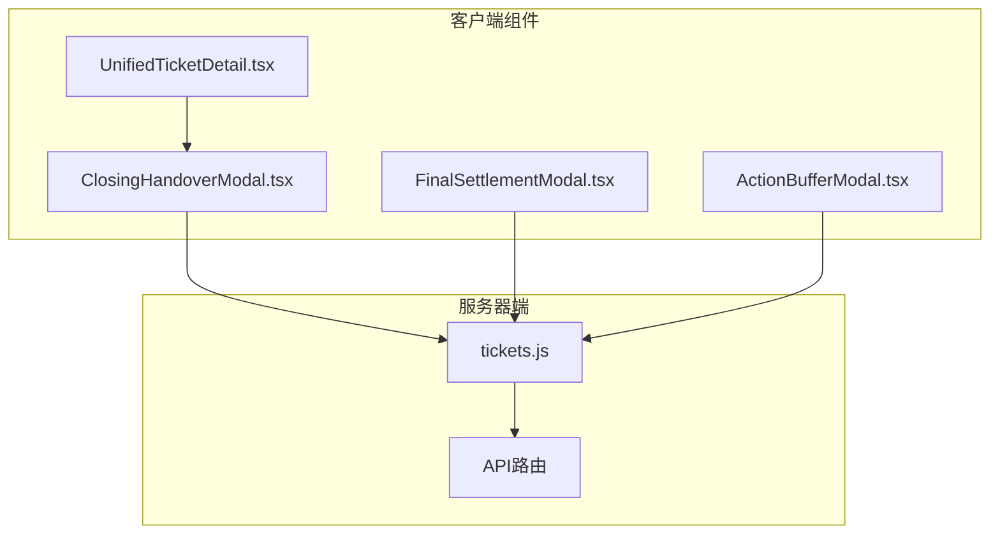
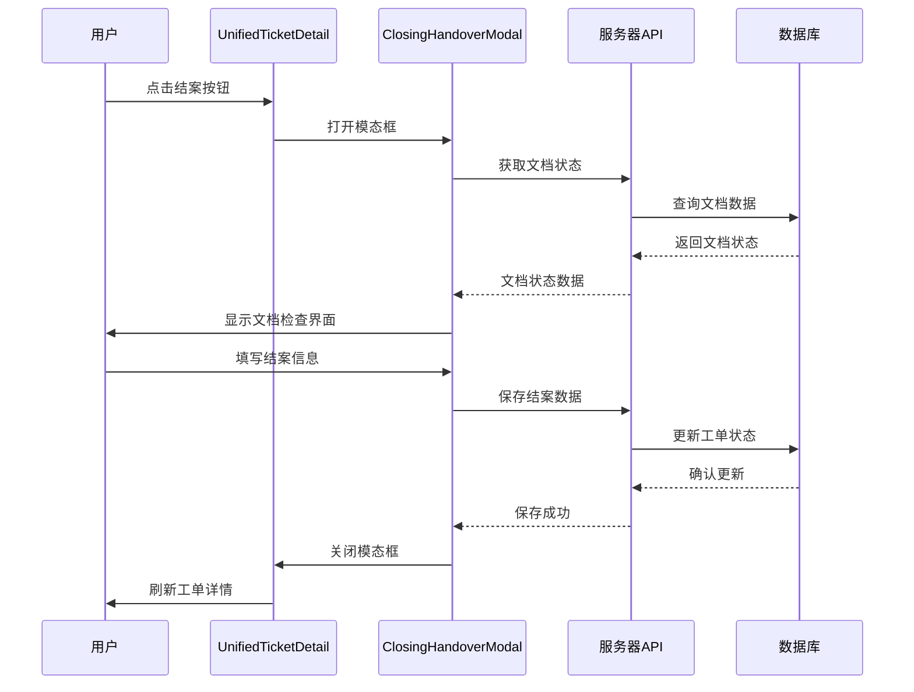
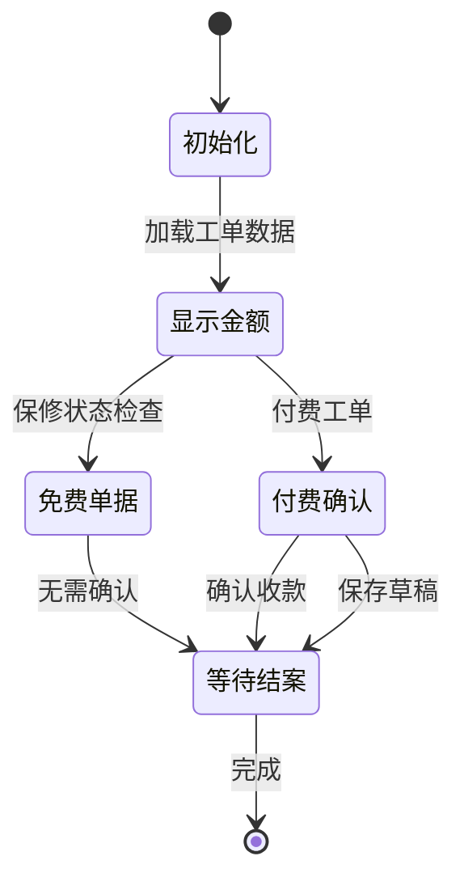
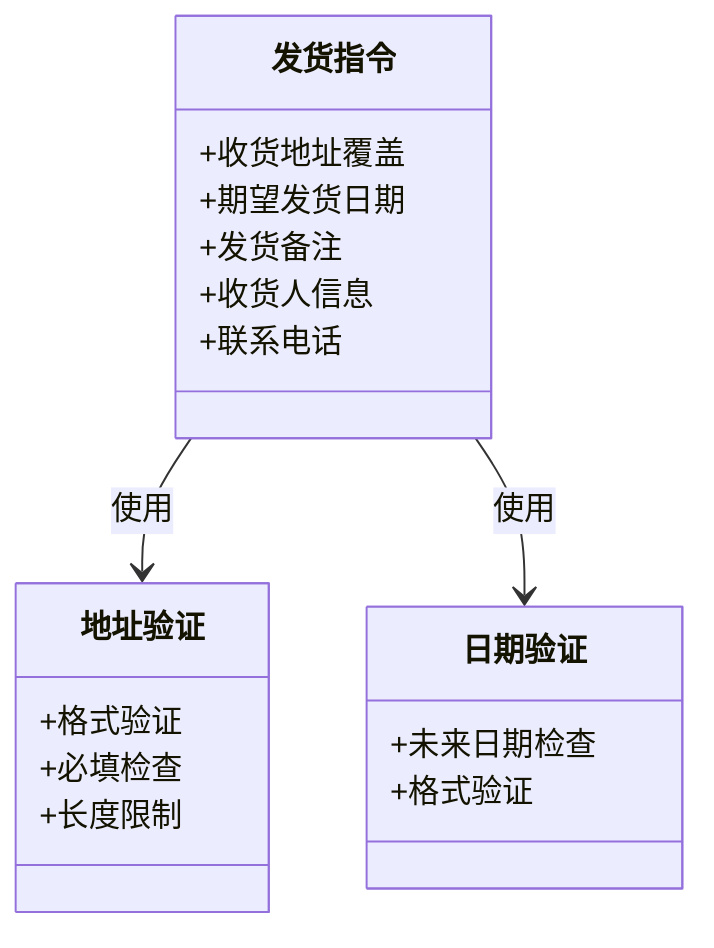
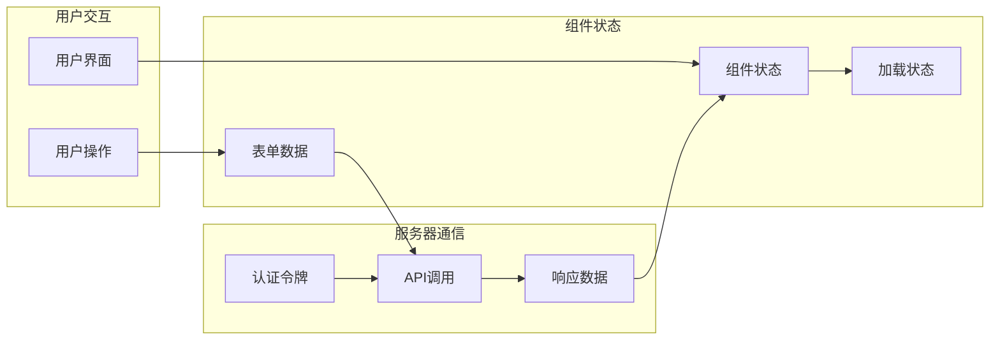
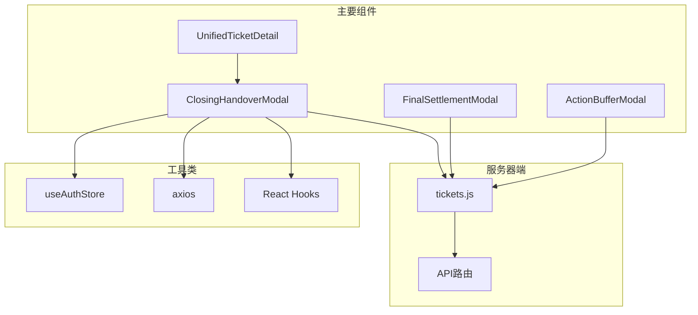

# 结案交接模态框

<cite>
**本文档引用的文件**
- [ClosingHandoverModal.tsx](file://client/src/components/Workspace/ClosingHandoverModal.tsx)
- [UnifiedTicketDetail.tsx](file://client/src/components/Workspace/UnifiedTicketDetail.tsx)
- [FinalSettlementModal.tsx](file://client/src/components/Workspace/FinalSettlementModal.tsx)
- [ActionBufferModal.tsx](file://client/src/components/Workspace/ActionBufferModal.tsx)
- [tickets.js](file://server/service/routes/tickets.js)
</cite>

## 目录
1. [简介](#简介)
2. [项目结构](#项目结构)
3. [核心组件](#核心组件)
4. [架构概览](#架构概览)
5. [详细组件分析](#详细组件分析)
6. [依赖关系分析](#依赖关系分析)
7. [性能考虑](#性能考虑)
8. [故障排除指南](#故障排除指南)
9. [结论](#结论)

## 简介

结案交接模态框是Longhorn工单管理系统中的关键组件，负责在工单完成维修流程后进行最终确认和交接操作。该模态框提供了一个完整的结案确认工作流，包括文档检查、款项确认和发货指令三个主要功能模块。

该组件实现了以下核心功能：
- 文档状态检查和验证
- 保修状态判断和费用处理
- 发货信息配置和管理
- 多部门协作流程支持
- 数据持久化和状态同步

## 项目结构

结案交接模态框位于客户端组件目录中，与相关的工单管理组件共同构成了完整的工单处理系统：

**图表来源**
- [ClosingHandoverModal.tsx:1-335](file://client/src/components/Workspace/ClosingHandoverModal.tsx#L1-L335)
- [UnifiedTicketDetail.tsx:1994-2013](file://client/src/components/Workspace/UnifiedTicketDetail.tsx#L1994-L2013)
- [tickets.js:1-200](file://server/service/routes/tickets.js#L1-L200)

**章节来源**
- [ClosingHandoverModal.tsx:1-335](file://client/src/components/Workspace/ClosingHandoverModal.tsx#L1-L335)
- [UnifiedTicketDetail.tsx:1994-2013](file://client/src/components/Workspace/UnifiedTicketDetail.tsx#L1994-L2013)

## 核心组件

### ClosingHandoverModal 组件

ClosingHandoverModal是结案交接的核心组件，提供了完整的结案确认界面和功能：

#### 主要特性
- **三标签页界面**：文档检查、款项确认、发货指令
- **智能状态检查**：自动验证相关文档是否已发布
- **保修状态集成**：根据保修状态自动调整界面和验证逻辑
- **实时数据同步**：与服务器端数据保持同步

#### 关键属性
- `isOpen`: 控制模态框显示状态
- `onClose`: 关闭回调函数
- `ticket`: 工单数据对象
- `onSuccess`: 成功回调函数
- `refreshTrigger`: 数据刷新触发器

**章节来源**
- [ClosingHandoverModal.tsx:6-14](file://client/src/components/Workspace/ClosingHandoverModal.tsx#L6-L14)
- [ClosingHandoverModal.tsx:16-98](file://client/src/components/Workspace/ClosingHandoverModal.tsx#L16-L98)

## 架构概览

结案交接模态框在整个系统架构中扮演着重要的桥梁角色，连接了前端界面和后端服务：

**图表来源**
- [UnifiedTicketDetail.tsx:1994-2013](file://client/src/components/Workspace/UnifiedTicketDetail.tsx#L1994-L2013)
- [ClosingHandoverModal.tsx:78-98](file://client/src/components/Workspace/ClosingHandoverModal.tsx#L78-L98)
- [tickets.js:712-724](file://server/service/routes/tickets.js#L712-L724)

## 详细组件分析

### 文档检查模块

文档检查模块是结案交接的核心验证环节，确保所有必要的服务文档都已完成发布：

**图表来源**
- [ClosingHandoverModal.tsx:49-74](file://client/src/components/Workspace/ClosingHandoverModal.tsx#L49-L74)
- [ClosingHandoverModal.tsx:111-112](file://client/src/components/Workspace/ClosingHandoverModal.tsx#L111-L112)

#### 文档状态验证逻辑

组件通过并行请求获取维修报告和PI文档的状态，并根据保修状态决定验证要求：

- **免费单据**：只需验证维修报告已发布
- **付费单据**：需同时验证维修报告和PI文档已发布

**章节来源**
- [ClosingHandoverModal.tsx:50-74](file://client/src/components/Workspace/ClosingHandoverModal.tsx#L50-L74)

### 款项确认模块

款项确认模块处理付费工单的财务确认流程：

**图表来源**
- [ClosingHandoverModal.tsx:204-246](file://client/src/components/Workspace/ClosingHandoverModal.tsx#L204-L246)

#### 金额显示和验证

组件根据工单的保修状态动态显示不同的金额颜色和文本：
- **免费单据**：显示绿色金额，提示"保内免费"
- **付费单据**：显示黄色金额，提示"保外收费"

**章节来源**
- [ClosingHandoverModal.tsx:100-108](file://client/src/components/Workspace/ClosingHandoverModal.tsx#L100-L108)

### 发货指令模块

发货指令模块配置工单的发货相关信息：

**图表来源**
- [ClosingHandoverModal.tsx:248-285](file://client/src/components/Workspace/ClosingHandoverModal.tsx#L248-L285)

#### 发货信息配置

组件提供以下发货信息配置选项：
- **收货地址**：支持覆盖默认地址
- **发货日期**：设置期望发货时间
- **内部备注**：提供给OP部门的特殊说明

**章节来源**
- [ClosingHandoverModal.tsx:250-283](file://client/src/components/Workspace/ClosingHandoverModal.tsx#L250-L283)

### 状态管理和数据流

结案交接模态框实现了复杂的状态管理和数据流控制：

**图表来源**
- [ClosingHandoverModal.tsx:16-74](file://client/src/components/Workspace/ClosingHandoverModal.tsx#L16-L74)

**章节来源**
- [ClosingHandoverModal.tsx:17-47](file://client/src/components/Workspace/ClosingHandoverModal.tsx#L17-L47)

## 依赖关系分析

### 组件间依赖关系

**图表来源**
- [ClosingHandoverModal.tsx:1-4](file://client/src/components/Workspace/ClosingHandoverModal.tsx#L1-L4)
- [UnifiedTicketDetail.tsx:30](file://client/src/components/Workspace/UnifiedTicketDetail.tsx#L30)

### 外部依赖

组件依赖以下外部库和工具：

| 依赖项 | 版本 | 用途 |
|--------|------|------|
| react | 最新 | UI框架 |
| lucide-react | 图标库 | 图标显示 |
| axios | HTTP客户端 | API通信 |
| framer-motion | 动画库 | 页面过渡效果 |

**章节来源**
- [ClosingHandoverModal.tsx:1-4](file://client/src/components/Workspace/ClosingHandoverModal.tsx#L1-L4)

## 性能考虑

### 数据加载优化

组件实现了多项性能优化措施：

1. **并行数据加载**：文档状态检查使用Promise.all并行获取多个API响应
2. **条件渲染**：根据当前标签页动态渲染对应内容
3. **状态缓存**：合理使用useState避免不必要的重渲染

### 网络请求优化

- **批量请求**：文档状态检查同时发起多个API请求
- **错误处理**：完善的异常捕获和用户提示机制
- **加载状态**：显示加载指示器提升用户体验

## 故障排除指南

### 常见问题和解决方案

#### 文档状态检查失败
**问题**：文档状态检查显示异常
**解决方案**：
1. 检查网络连接状态
2. 验证用户权限
3. 确认相关文档已正确创建

#### 结案按钮不可用
**问题**：确认按钮灰色不可点击
**可能原因**：
- 相关文档未发布
- 付费工单未确认收款
- 系统数据同步延迟

**解决步骤**：
1. 检查文档发布状态
2. 确认收款信息
3. 刷新页面重试

#### API调用错误
**问题**：保存数据时出现错误
**排查方法**：
1. 检查认证令牌有效性
2. 验证服务器状态
3. 查看浏览器开发者工具中的错误信息

**章节来源**
- [ClosingHandoverModal.tsx:92-97](file://client/src/components/Workspace/ClosingHandoverModal.tsx#L92-L97)

## 结论

结案交接模态框是一个功能完整、设计合理的工单处理组件，它有效地整合了文档验证、财务确认和发货管理等功能。该组件具有以下特点：

**优势**：
- 清晰的三阶段工作流设计
- 智能的业务逻辑处理
- 良好的用户体验设计
- 完善的错误处理机制

**技术亮点**：
- 组件化设计，职责分离明确
- 异步数据处理，性能优化到位
- 类型安全的React组件实现
- 与后端API的紧密集成

该组件为Longhorn工单管理系统的结案流程提供了可靠的技术支撑，确保了工单处理过程的规范性和完整性。