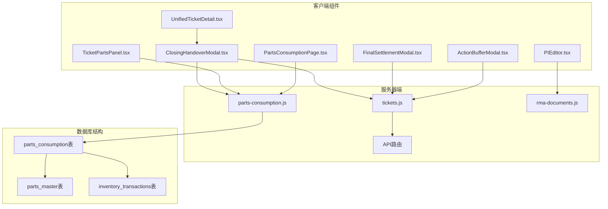
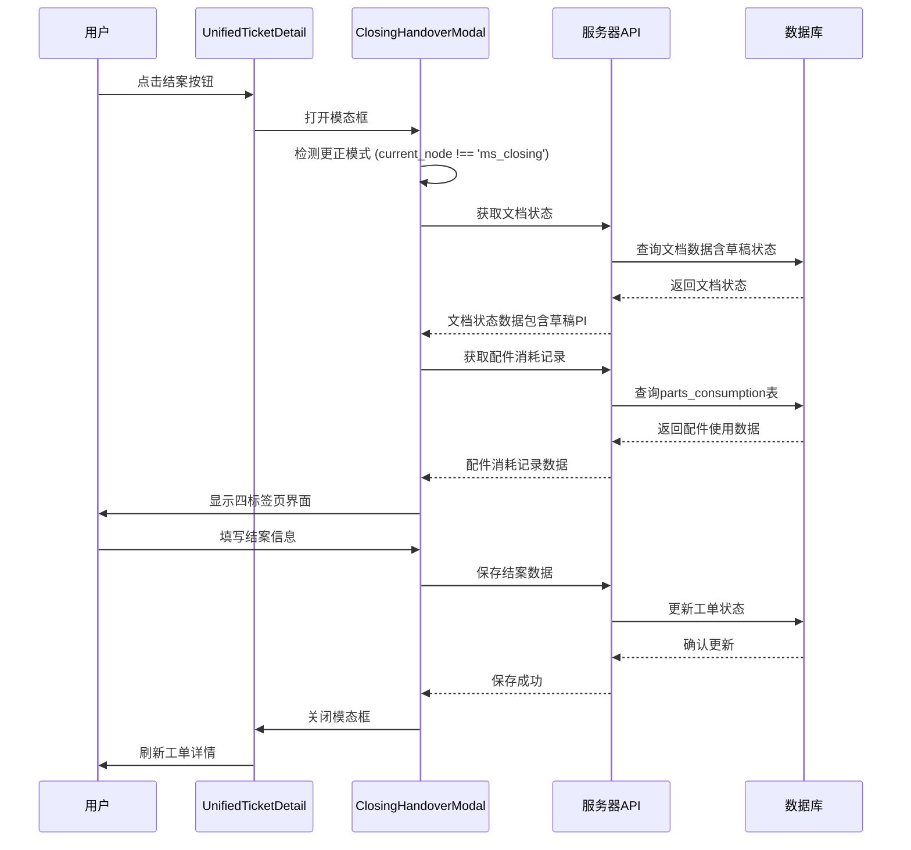
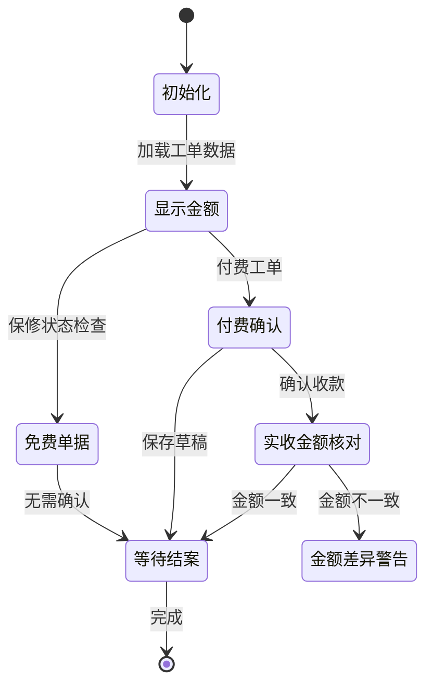
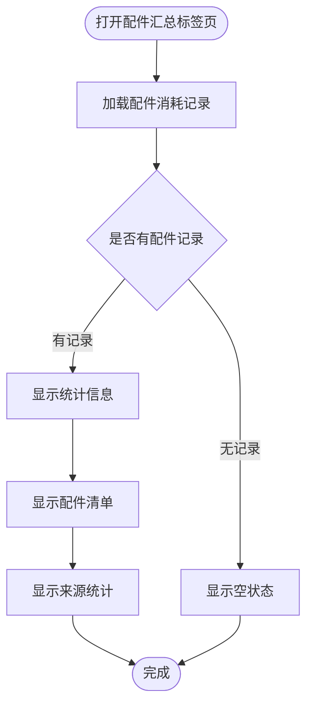
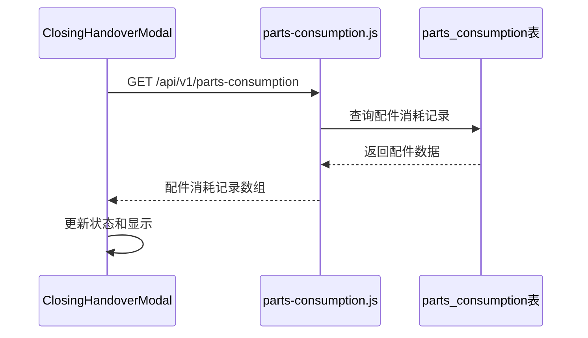
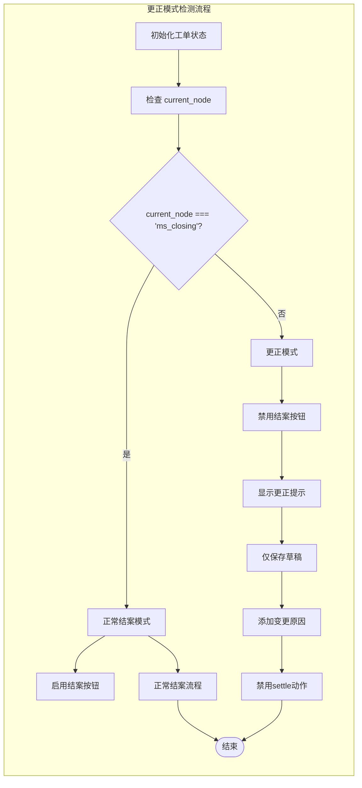
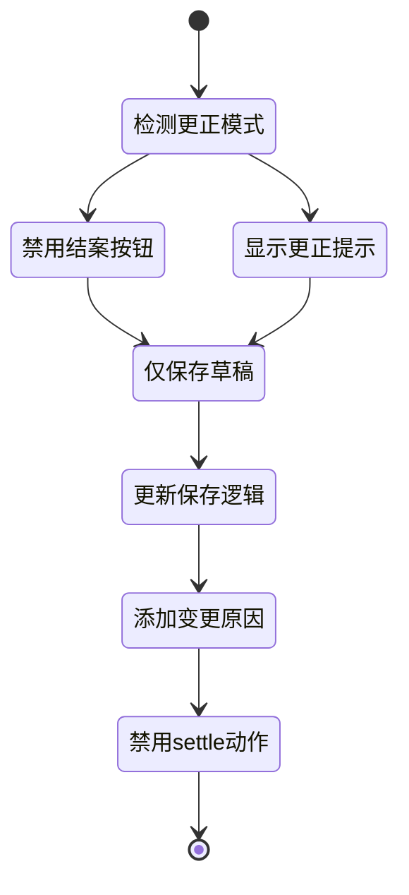
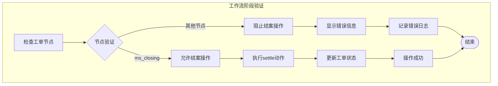
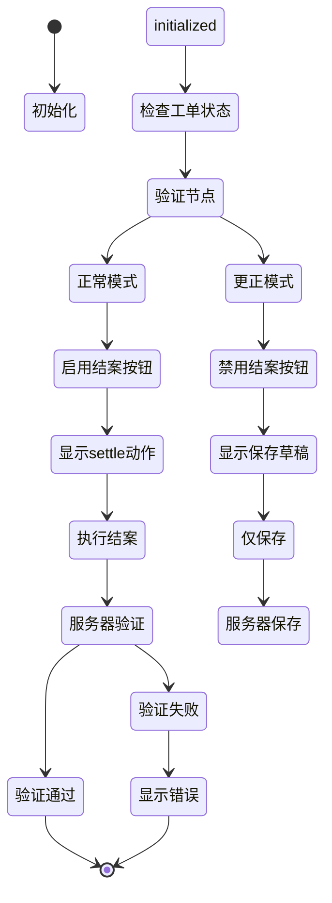
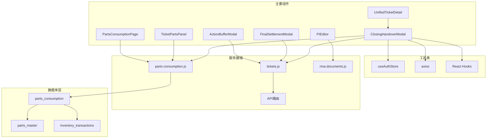

# 结案交接模态框

<cite>
**本文档引用的文件**
- [ClosingHandoverModal.tsx](file://client/src/components/Workspace/ClosingHandoverModal.tsx)
- [UnifiedTicketDetail.tsx](file://client/src/components/Workspace/UnifiedTicketDetail.tsx)
- [FinalSettlementModal.tsx](file://client/src/components/Workspace/FinalSettlementModal.tsx)
- [ActionBufferModal.tsx](file://client/src/components/Workspace/ActionBufferModal.tsx)
- [parts-consumption.js](file://server/service/routes/parts-consumption.js)
- [rma-documents.js](file://server/service/routes/rma-documents.js)
- [TicketPartsPanel.tsx](file://client/src/components/PartsManagement/TicketPartsPanel.tsx)
- [PartsConsumptionPage.tsx](file://client/src/components/PartsManagement/PartsConsumptionPage.tsx)
- [031_parts_master.sql](file://server/service/migrations/031_parts_master.sql)
- [log_dev.md](file://docs/log_dev.md)
</cite>

## 更新摘要
**变更内容**
- 新增全面的配件消耗跟踪标签页，显示维修工作中使用的配件详细信息
- 扩展组件以包含配件使用统计、来源类型分类和成本计算功能
- 集成配件消耗记录API，支持实时数据加载和展示
- 增强结案确认流程，提供完整的配件使用情况概览

## 目录
1. [简介](#简介)
2. [项目结构](#项目结构)
3. [核心组件](#核心组件)
4. [架构概览](#架构概览)
5. [详细组件分析](#详细组件分析)
6. [配件消耗跟踪功能](#配件消耗跟踪功能)
7. [更正模式检测](#更正模式检测)
8. [工作流阶段验证](#工作流阶段验证)
9. [依赖关系分析](#依赖关系分析)
10. [性能考虑](#性能考虑)
11. [故障排除指南](#故障排除指南)
12. [结论](#结论)

## 简介

结案交接模态框是Longhorn工单管理系统中的关键组件，负责在工单完成维修流程后进行最终确认和交接操作。该模态框提供了一个完整的结案确认工作流，包括文档检查、款项确认、配件汇总和发货指令四个主要功能模块。

**重大功能增强**：
- **更正模式检测**：新增对已完成阶段工单的检测和保护机制
- **工作流阶段验证**：确保只能在正确的 ms_closing 节点执行结案操作
- **智能按钮控制**：根据工单状态动态启用/禁用结案按钮
- **防误操作保护**：防止对已完成工单的意外工作流推进
- **增强文档验证**：支持草稿和已发布状态的文档检查
- **智能费用处理**：区分免费单据和付费单据的不同处理逻辑
- **全面配件跟踪**：新增配件消耗记录的完整展示和统计功能

**新增配件跟踪功能**：
- **配件使用统计**：显示工单使用的配件总数和总金额
- **来源类型分类**：按总部库存、经销商库存、外部采购、保修免费进行分类
- **详细配件清单**：展示每个配件的名称、SKU、数量和成本
- **实时数据加载**：从服务器API获取最新的配件消耗记录
- **来源统计面板**：提供按来源类型的汇总统计信息

该组件实现了以下核心功能：
- 文档状态检查和验证（支持草稿和已发布状态）
- 保修状态判断和费用处理
- 配件使用情况的完整展示和统计
- 发货信息配置和管理
- 多部门协作流程支持
- 数据持久化和状态同步
- 工作流阶段安全验证

## 项目结构

结案交接模态框位于客户端组件目录中，与相关的工单管理组件和配件管理系统共同构成了完整的工单处理系统：



**图表来源**
- [ClosingHandoverModal.tsx:1-725](file://client/src/components/Workspace/ClosingHandoverModal.tsx#L1-L725)
- [parts-consumption.js:1-489](file://server/service/routes/parts-consumption.js#L1-L489)
- [031_parts_master.sql:44-82](file://server/service/migrations/031_parts_master.sql#L44-L82)

**章节来源**
- [ClosingHandoverModal.tsx:1-725](file://client/src/components/Workspace/ClosingHandoverModal.tsx#L1-L725)
- [UnifiedTicketDetail.tsx:2103-2122](file://client/src/components/Workspace/UnifiedTicketDetail.tsx#L2103-L2122)

## 核心组件

### ClosingHandoverModal 组件

ClosingHandoverModal是结案交接的核心组件，提供了完整的结案确认界面和功能，现已扩展为包含四个标签页的完整工作流：

#### 主要特性
- **四标签页界面**：文档检查、款项确认、配件汇总、发货指令
- **智能状态检查**：自动验证相关文档是否已发布（支持草稿状态）
- **保修状态集成**：根据保修状态自动调整界面和验证逻辑
- **实时数据同步**：与服务器端数据保持同步
- **草稿PI处理**：支持检测和处理草稿状态的PI文档
- **更正模式检测**：识别已完成阶段的工单并提供相应处理
- **工作流阶段验证**：确保只能在 ms_closing 节点执行结案操作
- **配件消耗跟踪**：完整展示维修工单的配件使用情况

#### 关键属性
- `isOpen`: 控制模态框显示状态
- `onClose`: 关闭回调函数
- `ticket`: 工单数据对象（包含 current_node 状态）
- `onSuccess`: 成功回调函数
- `refreshTrigger`: 数据刷新触发器

**章节来源**
- [ClosingHandoverModal.tsx:30-38](file://client/src/components/Workspace/ClosingHandoverModal.tsx#L30-L38)
- [ClosingHandoverModal.tsx:40-107](file://client/src/components/Workspace/ClosingHandoverModal.tsx#L40-L107)

## 架构概览

结案交接模态框在整个系统架构中扮演着重要的桥梁角色，连接了前端界面、配件管理系统和后端服务：



**图表来源**
- [UnifiedTicketDetail.tsx:2103-2122](file://client/src/components/Workspace/UnifiedTicketDetail.tsx#L2103-L2122)
- [ClosingHandoverModal.tsx:151-171](file://client/src/components/Workspace/ClosingHandoverModal.tsx#L151-L171)
- [parts-consumption.js:28-132](file://server/service/routes/parts-consumption.js#L28-L132)

## 详细组件分析

### 文档检查模块

文档检查模块是结案交接的核心验证环节，确保所有必要的服务文档都已完成发布：


**图表来源**
- [ClosingHandoverModal.tsx:109-149](file://client/src/components/Workspace/ClosingHandoverModal.tsx#L109-L149)
- [ClosingHandoverModal.tsx:234-235](file://client/src/components/Workspace/ClosingHandoverModal.tsx#L234-L235)

#### 文档状态验证逻辑

组件通过并行请求获取维修报告和PI文档的状态，并根据多种条件决定验证要求：

- **免费单据**：只需验证维修报告已发布
- **付费单据**：需同时验证维修报告和PI文档已发布
- **草稿PI检测**：即使没有收费项目，也会检测是否存在草稿PI

**章节来源**
- [ClosingHandoverModal.tsx:109-149](file://client/src/components/Workspace/ClosingHandoverModal.tsx#L109-L149)

### 款项确认模块

款项确认模块处理付费工单的财务确认流程：



**图表来源**
- [ClosingHandoverModal.tsx:364-425](file://client/src/components/Workspace/ClosingHandoverModal.tsx#L364-L425)

#### 金额显示和验证

组件根据工单的保修状态动态显示不同的金额颜色和文本：
- **免费单据**：显示绿色金额，提示"保内免费"
- **付费单据**：显示黄色金额，提示"保外收费"

**章节来源**
- [ClosingHandoverModal.tsx:215-232](file://client/src/components/Workspace/ClosingHandoverModal.tsx#L215-L232)

## 配件消耗跟踪功能

### 配件汇总标签页

新增的配件汇总标签页提供了维修工单配件使用情况的完整展示和统计功能：



**图表来源**
- [ClosingHandoverModal.tsx:427-526](file://client/src/components/Workspace/ClosingHandoverModal.tsx#L427-L526)
- [parts-consumption.js:28-132](file://server/service/routes/parts-consumption.js#L28-L132)

#### 配件消耗记录数据结构

组件定义了完整的配件消耗记录接口，支持详细的配件使用信息：

```typescript
interface PartConsumption {
    id: number;
    part_id: number;
    part_sku: string;
    part_name: string;
    part_category: string;
    quantity: number;
    unit_price_cny: number;
    total_price_cny: number;
    source_type: 'hq_inventory' | 'dealer_inventory' | 'external_purchase' | 'warranty_free';
    dealer_name?: string;
    settlement_status: string;
    created_at: string;
}
```

#### 配件来源类型分类

系统支持四种主要的配件来源类型，每种都有特定的颜色标识和图标：

| 来源类型 | 颜色 | 图标 | 描述 |
|----------|------|------|------|
| hq_inventory | #3B82F6 | 🏢 | 总部库存 |
| dealer_inventory | #10B981 | 🤝 | 经销商库存 |
| external_purchase | #FFD200 | 🛒 | 外部采购 |
| warranty_free | #8B5CF6 | 🎁 | 保修免费 |

#### 配件统计功能

组件提供了多层次的统计信息展示：

1. **使用配件数统计**：显示工单使用的配件总数量
2. **配件总金额统计**：显示工单使用的配件总成本
3. **来源类型统计**：按来源类型分组显示使用情况
4. **详细配件清单**：列出每个配件的使用详情

**章节来源**
- [ClosingHandoverModal.tsx:7-28](file://client/src/components/Workspace/ClosingHandoverModal.tsx#L7-L28)
- [ClosingHandoverModal.tsx:427-526](file://client/src/components/Workspace/ClosingHandoverModal.tsx#L427-L526)

### 配件消耗API集成

组件通过API与服务器端的配件消耗系统进行集成：



**图表来源**
- [ClosingHandoverModal.tsx:151-171](file://client/src/components/Workspace/ClosingHandoverModal.tsx#L151-L171)
- [parts-consumption.js:28-132](file://server/service/routes/parts-consumption.js#L28-L132)

#### API查询参数

服务器端API支持多种查询参数来过滤和排序配件消耗记录：

- `ticket_id`: 按工单ID过滤
- `page_size`: 设置每页记录数
- `source_type`: 按来源类型过滤
- `settlement_status`: 按结算状态过滤
- `start_date/end_date`: 按时间范围过滤

**章节来源**
- [ClosingHandoverModal.tsx:151-171](file://client/src/components/Workspace/ClosingHandoverModal.tsx#L151-L171)
- [parts-consumption.js:37-102](file://server/service/routes/parts-consumption.js#L37-L102)

## 更正模式检测

### 更正模式识别和处理

更正模式检测功能是本次重大功能增强的核心部分，提供了对已完成阶段工单的智能识别和保护能力：



**图表来源**
- [ClosingHandoverModal.tsx:175-176](file://client/src/components/Workspace/ClosingHandoverModal.tsx#L175-L176)
- [ClosingHandoverModal.tsx:190-193](file://client/src/components/Workspace/ClosingHandoverModal.tsx#L190-L193)

#### 更正模式检测逻辑

组件实现了智能的更正模式检测机制：
- **节点状态检查**：通过 `ticket.current_node !== 'ms_closing'` 判断工单是否已完成结案阶段
- **按钮状态控制**：在更正模式下禁用结案按钮，仅允许保存草稿
- **界面提示**：向用户明确显示当前处于更正模式
- **操作限制**：防止对已完成工单的工作流推进

**章节来源**
- [ClosingHandoverModal.tsx:175-176](file://client/src/components/Workspace/ClosingHandoverModal.tsx#L175-L176)

### 更正模式处理逻辑

当检测到更正模式时，组件会自动调整界面和操作行为：



**图表来源**
- [ClosingHandoverModal.tsx:178-213](file://client/src/components/Workspace/ClosingHandoverModal.tsx#L178-L213)
- [ClosingHandoverModal.tsx:190-193](file://client/src/components/Workspace/ClosingHandoverModal.tsx#L190-L193)

**章节来源**
- [ClosingHandoverModal.tsx:178-213](file://client/src/components/Workspace/ClosingHandoverModal.tsx#L178-L213)

## 工作流阶段验证

### 工作流阶段安全控制

工作流阶段验证功能确保系统只能在正确的节点执行结案操作，防止状态错误：



**图表来源**
- [parts-consumption.js:28-132](file://server/service/routes/parts-consumption.js#L28-L132)

#### 服务器端工作流验证

服务器端实现了严格的工作流阶段验证：
- **节点检查**：`if (ticket.current_node !== 'ms_closing')` 确保只有在 ms_closing 节点才能执行结案
- **状态转换**：从 ms_closing 移动到 op_shipping 的状态转换
- **错误处理**：对非法状态转换返回 400 错误
- **活动记录**：记录状态变更的详细信息

**章节来源**
- [parts-consumption.js:28-132](file://server/service/routes/parts-consumption.js#L28-L132)

### 客户端工作流验证

客户端也实现了相应的验证逻辑来提供更好的用户体验：



**图表来源**
- [ClosingHandoverModal.tsx:175-176](file://client/src/components/Workspace/ClosingHandoverModal.tsx#L175-L176)
- [ClosingHandoverModal.tsx:190-193](file://client/src/components/Workspace/ClosingHandoverModal.tsx#L190-L193)

**章节来源**
- [ClosingHandoverModal.tsx:175-176](file://client/src/components/Workspace/ClosingHandoverModal.tsx#L175-L176)

## 依赖关系分析

### 组件间依赖关系



**图表来源**
- [ClosingHandoverModal.tsx:1-4](file://client/src/components/Workspace/ClosingHandoverModal.tsx#L1-L4)
- [UnifiedTicketDetail.tsx:30](file://client/src/components/Workspace/UnifiedTicketDetail.tsx#L30)

### 外部依赖

组件依赖以下外部库和工具：

| 依赖项 | 版本 | 用途 |
|--------|------|------|
| react | 最新 | UI框架 |
| lucide-react | 图标库 | 图标显示 |
| axios | HTTP客户端 | API通信 |
| framer-motion | 动画库 | 页面过渡效果 |

**章节来源**
- [ClosingHandoverModal.tsx:1-4](file://client/src/components/Workspace/ClosingHandoverModal.tsx#L1-L4)

## 性能考虑

### 数据加载优化

组件实现了多项性能优化措施：

1. **并行数据加载**：文档状态检查使用Promise.all并行获取多个API响应
2. **条件渲染**：根据当前标签页动态渲染对应内容
3. **状态缓存**：合理使用useState避免不必要的重渲染
4. **智能表单更新**：仅在相关字段变化时更新表单状态
5. **草稿状态优化**：草稿PI检测仅在必要时进行
6. **更正模式快速检测**：通过简单的节点比较快速识别更正模式
7. **配件数据懒加载**：仅在打开配件标签页时加载配件消耗记录
8. **分页查询优化**：API支持分页参数，避免大量数据传输

### 网络请求优化

- **批量请求**：文档状态检查同时发起多个API请求
- **错误处理**：完善的异常捕获和用户提示机制
- **加载状态**：显示加载指示器提升用户体验
- **防抖处理**：输入验证采用防抖机制减少不必要的计算
- **节点状态缓存**：避免重复的更正模式检测
- **API缓存策略**：合理利用HTTP缓存头

## 故障排除指南

### 常见问题和解决方案

#### 文档状态检查失败
**问题**：文档状态检查显示异常
**解决方案**：
1. 检查网络连接状态
2. 验证用户权限
3. 确认相关文档已正确创建

#### 更正模式检测异常
**问题**：更正模式检测功能失效
**可能原因**：
- 工单节点状态获取失败
- current_node 字段为空或格式不正确
- API响应格式不匹配

**解决步骤**：
1. 检查工单API调用
2. 验证节点状态数据格式
3. 确认工单状态同步

#### 结案按钮不可用
**问题**：确认按钮灰色不可点击
**可能原因**：
- 工单已在 ms_closing 节点之外
- 相关文档未发布
- 付费工单未确认收款
- 系统数据同步延迟
- 物流信息配置不完整
- 草稿PI存在但未处理
- 配件消耗记录加载失败

**解决步骤**：
1. 检查工单节点状态 (`current_node`)
2. 验证文档发布状态
3. 确认收款信息
4. 验证物流配置
5. 处理草稿PI
6. 刷新页面重试
7. 检查配件消耗记录API

#### 工作流验证错误
**问题**：保存时出现工作流验证错误
**可能原因**：
- 工单状态已改变，不再处于 ms_closing 节点
- 服务器端工作流验证失败
- 并发操作导致状态冲突

**解决步骤**：
1. 刷新工单详情获取最新状态
2. 检查是否有其他用户同时操作
3. 确认工单状态是否已被其他操作改变
4. 重新打开结案模态框

#### API调用错误
**问题**：保存数据时出现错误
**排查方法**：
1. 检查认证令牌有效性
2. 验证服务器状态
3. 查看浏览器开发者工具中的错误信息
4. 确认final_settlement字段格式正确
5. 检查配件消耗记录API响应

#### 配件消耗记录加载失败
**问题**：配件汇总标签页显示加载失败
**可能原因**：
- 配件消耗API不可用
- 网络连接问题
- 权限不足访问配件数据
- 数据库查询超时

**解决步骤**：
1. 检查API服务状态
2. 验证用户权限
3. 查看API响应状态码
4. 检查数据库连接
5. 重新加载页面

#### 物流配置问题
**问题**：物流信息保存失败
**可能原因**：
- 合并指令需要参考号但未填写
- 日期格式不正确
- 运费方式选择无效

**解决步骤**：
1. 检查合单指令的参考号填写
2. 验证日期格式为YYYY-MM-DD
3. 确认运费方式选择有效
4. 重新保存配置

**章节来源**
- [ClosingHandoverModal.tsx:178-213](file://client/src/components/Workspace/ClosingHandoverModal.tsx#L178-L213)

## 结论

结案交接模态框经过重大功能增强后，已成为一个功能完整、设计合理的工单处理组件，它有效地整合了文档验证、财务确认、配件跟踪和物流管理等功能。该组件具有以下特点：

**重大功能增强**：
- **更正模式检测**：新增对已完成阶段工单的智能识别和保护机制
- **工作流阶段验证**：确保只能在正确的 ms_closing 节点执行结案操作
- **智能按钮控制**：根据工单状态动态启用/禁用结案按钮
- **防误操作保护**：防止对已完成工单的意外工作流推进
- **增强文档验证**：支持草稿和已发布状态的文档检查
- **智能费用处理**：区分免费单据和付费单据的不同处理逻辑
- **全面配件跟踪**：新增完整的配件消耗记录展示和统计功能

**技术亮点**：
- 组件化设计，职责分离明确
- 异步数据处理，性能优化到位
- 类型安全的React组件实现
- 与后端API的紧密集成
- 完整的数据持久化机制
- 严格的服务器端工作流验证
- 实时配件消耗数据展示

**优势**：
- 清晰的四阶段工作流设计
- 智能的业务逻辑处理
- 良好的用户体验设计
- 完善的错误处理机制
- 实时的数据验证和反馈
- 多层次的安全保护机制
- 全面的配件使用情况跟踪

**新增功能价值**：
- **更正模式保护**：通过 current_node 检测防止对已完成工单的误操作
- **工作流安全**：双重验证确保只能在正确节点执行结案操作
- **用户友好**：智能的界面提示和按钮状态控制
- **系统稳定**：防止状态错误和并发操作冲突
- **文档完整性**：支持草稿状态的文档验证
- **费用准确性**：智能区分免费和付费单据的处理流程
- **配件透明度**：完整的配件使用情况展示和统计
- **来源追踪**：清晰的配件来源类型分类和追踪
- **成本控制**：实时的成本计算和统计功能

**新增配件跟踪功能的价值**：
- **维修透明度**：客户和内部团队都能清楚看到具体的配件使用情况
- **成本控制**：通过详细的成本统计帮助控制维修成本
- **库存管理**：与库存系统集成，支持准确的库存扣减
- **结算支持**：为经销商结算提供准确的数据支持
- **质量保证**：通过配件来源追踪确保使用正品配件
- **数据分析**：支持基于配件使用情况的业务分析

该组件为Longhorn工单管理系统的结案流程提供了可靠的技术支撑，确保了工单处理过程的规范性和完整性，特别是在更正模式检测、工作流阶段验证和配件消耗跟踪方面的增强，大大提升了系统的安全性和可靠性，为维修业务的数字化转型提供了强有力的技术保障。