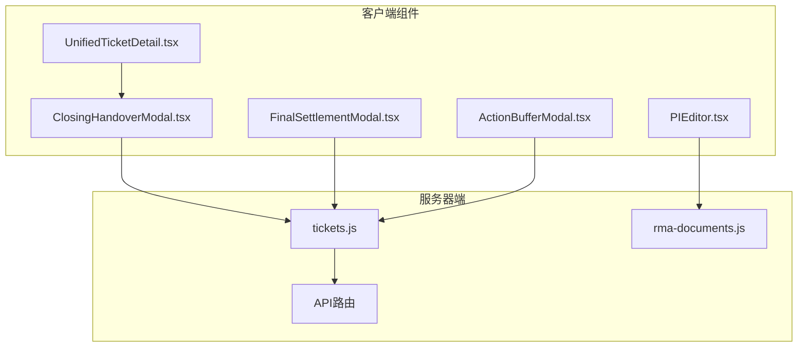
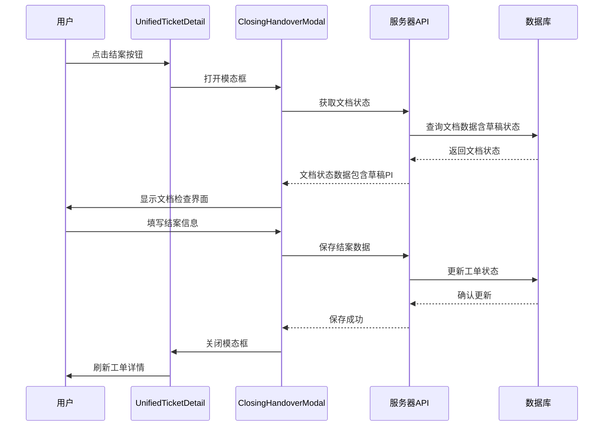
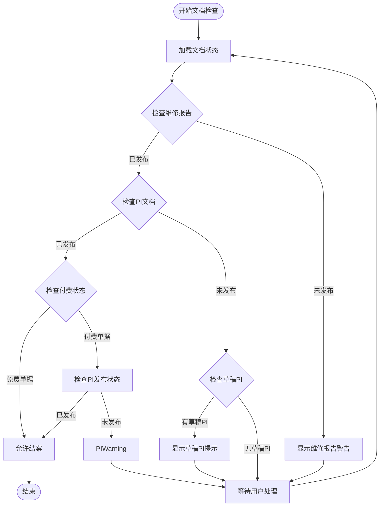
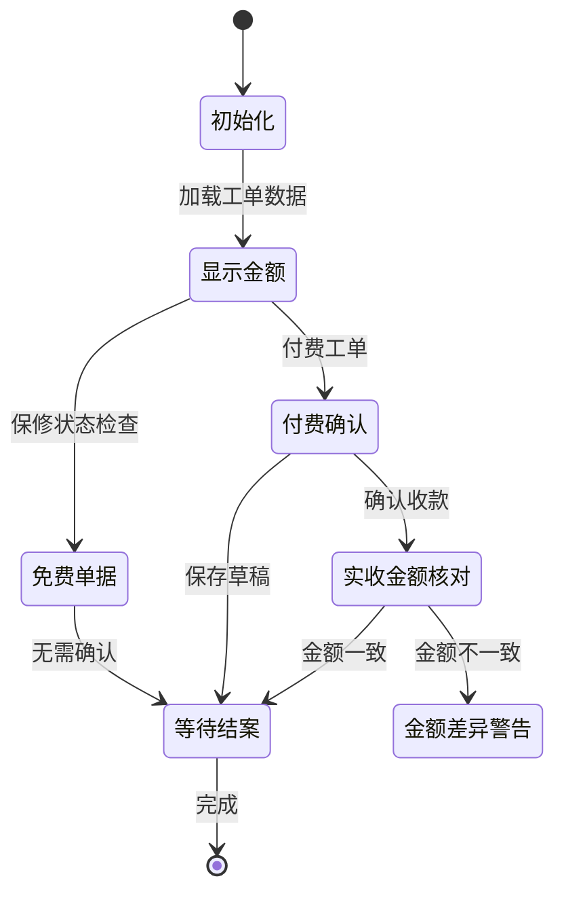
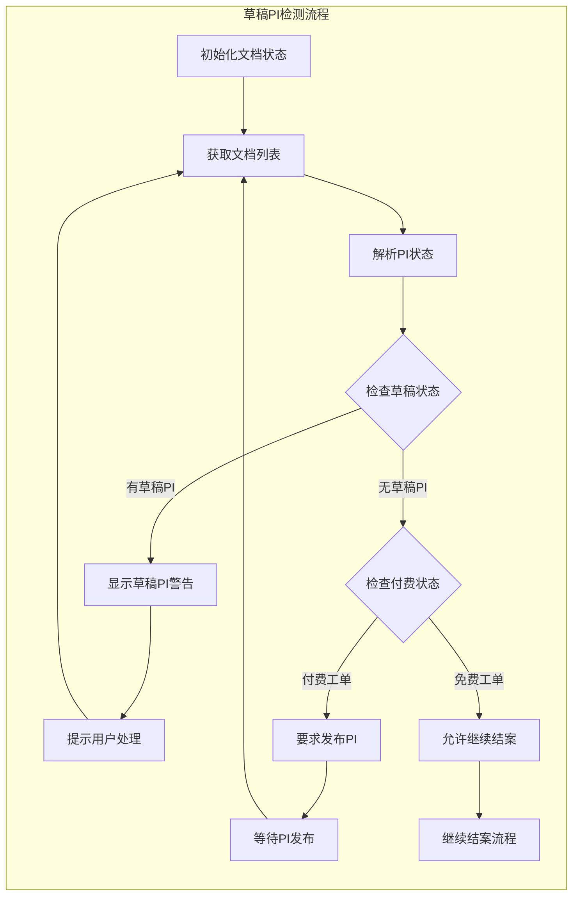
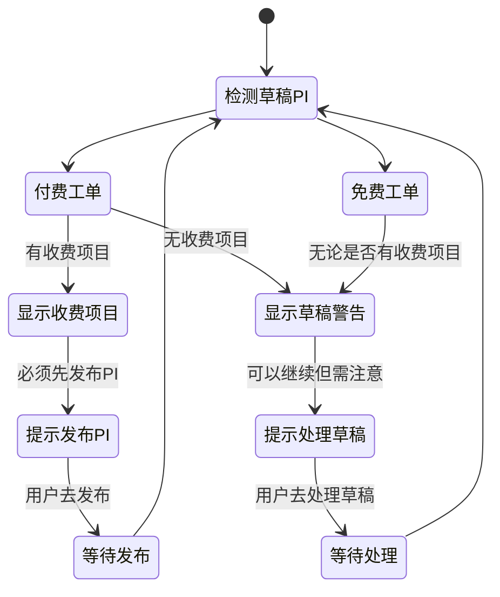
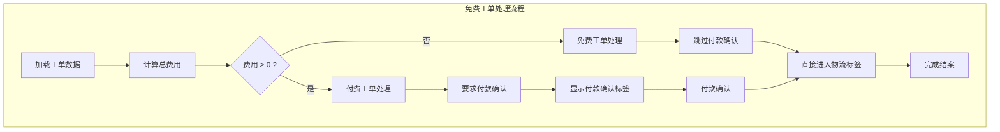
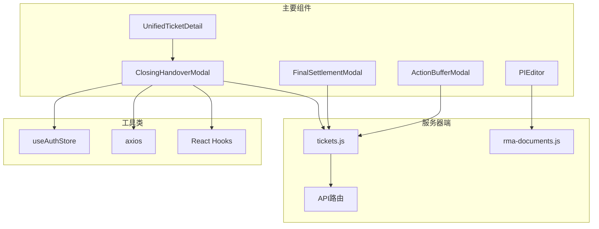

# 结案交接模态框

<cite>
**本文档引用的文件**
- [ClosingHandoverModal.tsx](file://client/src/components/Workspace/ClosingHandoverModal.tsx)
- [UnifiedTicketDetail.tsx](file://client/src/components/Workspace/UnifiedTicketDetail.tsx)
- [FinalSettlementModal.tsx](file://client/src/components/Workspace/FinalSettlementModal.tsx)
- [ActionBufferModal.tsx](file://client/src/components/Workspace/ActionBufferModal.tsx)
- [tickets.js](file://server/service/routes/tickets.js)
- [rma-documents.js](file://server/service/routes/rma-documents.js)
</cite>

## 更新摘要
**变更内容**
- 新增草稿PI检测功能，能够识别和处理未发布的PI文档
- 扩展未支付票据支持，允许在没有收费项目的情况下继续结案流程
- 增强文档状态检查逻辑，区分已发布和草稿状态的PI
- 改进付款确认流程，支持无收费项目的免费工单

## 目录
1. [简介](#简介)
2. [项目结构](#项目结构)
3. [核心组件](#核心组件)
4. [架构概览](#架构概览)
5. [详细组件分析](#详细组件分析)
6. [草稿PI检测功能](#草稿pi检测功能)
7. [未支付票据支持](#未支付票据支持)
8. [依赖关系分析](#依赖关系分析)
9. [性能考虑](#性能考虑)
10. [故障排除指南](#故障排除指南)
11. [结论](#结论)

## 简介

结案交接模态框是Longhorn工单管理系统中的关键组件，负责在工单完成维修流程后进行最终确认和交接操作。该模态框提供了一个完整的结案确认工作流，包括文档检查、款项确认、发货指令三个主要功能模块。

**重大功能增强**：
- **草稿PI检测**：新增对草稿状态PI的检测和处理能力
- **未支付票据支持**：扩展支持无收费项目的免费工单结案
- **智能文档状态检查**：区分已发布和草稿状态的文档验证
- **灵活的付款确认流程**：根据工单类型自动调整付款确认要求

该组件实现了以下核心功能：
- 文档状态检查和验证（支持草稿和已发布状态）
- 保修状态判断和费用处理
- 发货信息配置和管理
- 多部门协作流程支持
- 数据持久化和状态同步

## 项目结构

结案交接模态框位于客户端组件目录中，与相关的工单管理组件共同构成了完整的工单处理系统：

**图表来源**
- [ClosingHandoverModal.tsx:1-549](file://client/src/components/Workspace/ClosingHandoverModal.tsx#L1-L549)
- [UnifiedTicketDetail.tsx:2103-2122](file://client/src/components/Workspace/UnifiedTicketDetail.tsx#L2103-L2122)
- [tickets.js:1630-1829](file://server/service/routes/tickets.js#L1630-L1829)
- [rma-documents.js:290-489](file://server/service/routes/rma-documents.js#L290-L489)

**章节来源**
- [ClosingHandoverModal.tsx:1-549](file://client/src/components/Workspace/ClosingHandoverModal.tsx#L1-L549)
- [UnifiedTicketDetail.tsx:2103-2122](file://client/src/components/Workspace/UnifiedTicketDetail.tsx#L2103-L2122)

## 核心组件

### ClosingHandoverModal 组件

ClosingHandoverModal是结案交接的核心组件，提供了完整的结案确认界面和功能：

#### 主要特性
- **三标签页界面**：文档检查、款项确认、发货指令
- **智能状态检查**：自动验证相关文档是否已发布（支持草稿状态）
- **保修状态集成**：根据保修状态自动调整界面和验证逻辑
- **实时数据同步**：与服务器端数据保持同步
- **草稿PI处理**：支持检测和处理草稿状态的PI文档

#### 关键属性
- `isOpen`: 控制模态框显示状态
- `onClose`: 关闭回调函数
- `ticket`: 工单数据对象
- `onSuccess`: 成功回调函数
- `refreshTrigger`: 数据刷新触发器

**章节来源**
- [ClosingHandoverModal.tsx:6-14](file://client/src/components/Workspace/ClosingHandoverModal.tsx#L6-L14)
- [ClosingHandoverModal.tsx:16-98](file://client/src/components/Workspace/ClosingHandoverModal.tsx#L16-L98)

## 架构概览

结案交接模态框在整个系统架构中扮演着重要的桥梁角色，连接了前端界面和后端服务：

**图表来源**
- [UnifiedTicketDetail.tsx:2103-2122](file://client/src/components/Workspace/UnifiedTicketDetail.tsx#L2103-L2122)
- [ClosingHandoverModal.tsx:121-141](file://client/src/components/Workspace/ClosingHandoverModal.tsx#L121-L141)
- [tickets.js:1732-1737](file://server/service/routes/tickets.js#L1732-L1737)

## 详细组件分析

### 文档检查模块

文档检查模块是结案交接的核心验证环节，确保所有必要的服务文档都已完成发布：

**图表来源**
- [ClosingHandoverModal.tsx:78-117](file://client/src/components/Workspace/ClosingHandoverModal.tsx#L78-L117)
- [ClosingHandoverModal.tsx:162](file://client/src/components/Workspace/ClosingHandoverModal.tsx#L162)

#### 文档状态验证逻辑

组件通过并行请求获取维修报告和PI文档的状态，并根据多种条件决定验证要求：

- **免费单据**：只需验证维修报告已发布
- **付费单据**：需同时验证维修报告和PI文档已发布
- **草稿PI检测**：即使没有收费项目，也会检测是否存在草稿PI

**章节来源**
- [ClosingHandoverModal.tsx:78-117](file://client/src/components/Workspace/ClosingHandoverModal.tsx#L78-L117)

### 款项确认模块

款项确认模块处理付费工单的财务确认流程：

**图表来源**
- [ClosingHandoverModal.tsx:288-349](file://client/src/components/Workspace/ClosingHandoverModal.tsx#L288-L349)

#### 金额显示和验证

组件根据工单的保修状态动态显示不同的金额颜色和文本：
- **免费单据**：显示绿色金额，提示"保内免费"
- **付费单据**：显示黄色金额，提示"保外收费"

**章节来源**
- [ClosingHandoverModal.tsx:143-159](file://client/src/components/Workspace/ClosingHandoverModal.tsx#L143-L159)

## 草稿PI检测功能

### 草稿状态识别和处理

草稿PI检测功能是本次重大功能增强的核心部分，提供了对草稿状态PI的智能识别和处理能力：

**图表来源**
- [ClosingHandoverModal.tsx:93-109](file://client/src/components/Workspace/ClosingHandoverModal.tsx#L93-L109)
- [ClosingHandoverModal.tsx:250-272](file://client/src/components/Workspace/ClosingHandoverModal.tsx#L250-L272)

#### 草稿PI状态检测

组件实现了智能的草稿PI检测机制：
- **并行状态检查**：同时获取维修报告和PI文档的完整状态列表
- **状态过滤**：识别草稿状态的文档，忽略已发布的文档
- **智能提示**：根据是否有收费项目显示不同的处理建议

**章节来源**
- [ClosingHandoverModal.tsx:93-109](file://client/src/components/Workspace/ClosingHandoverModal.tsx#L93-L109)

### 草稿PI处理逻辑

当检测到草稿PI时，组件会根据工单类型提供相应的处理建议：

**图表来源**
- [ClosingHandoverModal.tsx:267-271](file://client/src/components/Workspace/ClosingHandoverModal.tsx#L267-L271)

**章节来源**
- [ClosingHandoverModal.tsx:267-271](file://client/src/components/Workspace/ClosingHandoverModal.tsx#L267-L271)

## 未支付票据支持

### 免费工单结案流程

未支付票据支持功能扩展了系统对免费工单的处理能力，允许在没有收费项目的情况下继续结案流程：

**图表来源**
- [ClosingHandoverModal.tsx:143-157](file://client/src/components/Workspace/ClosingHandoverModal.tsx#L143-L157)
- [ClosingHandoverModal.tsx:346-350](file://client/src/components/Workspace/ClosingHandoverModal.tsx#L346-L350)

#### 免费工单识别逻辑

组件实现了智能的免费工单识别机制：
- **费用计算**：综合维修报告费用和PI金额进行判断
- **状态判断**：如果费用为0则标记为免费工单
- **界面适配**：免费工单跳过付款确认步骤

**章节来源**
- [ClosingHandoverModal.tsx:143-157](file://client/src/components/Workspace/ClosingHandoverModal.tsx#L143-L157)

### 付款确认优化

针对免费工单的付款确认流程进行了优化：
- **自动跳过**：免费工单直接显示"无需确认收款"提示
- **状态保持**：即使工单被标记为免费，仍可进行其他结案操作
- **兼容性**：与付费工单的付款确认流程完全兼容

**章节来源**
- [ClosingHandoverModal.tsx:346-350](file://client/src/components/Workspace/ClosingHandoverModal.tsx#L346-L350)

## 依赖关系分析

### 组件间依赖关系

**图表来源**
- [ClosingHandoverModal.tsx:1-4](file://client/src/components/Workspace/ClosingHandoverModal.tsx#L1-L4)
- [UnifiedTicketDetail.tsx:30](file://client/src/components/Workspace/UnifiedTicketDetail.tsx#L30)

### 外部依赖

组件依赖以下外部库和工具：

| 依赖项 | 版本 | 用途 |
|--------|------|------|
| react | 最新 | UI框架 |
| lucide-react | 图标库 | 图标显示 |
| axios | HTTP客户端 | API通信 |
| framer-motion | 动画库 | 页面过渡效果 |

**章节来源**
- [ClosingHandoverModal.tsx:1-4](file://client/src/components/Workspace/ClosingHandoverModal.tsx#L1-L4)

## 性能考虑

### 数据加载优化

组件实现了多项性能优化措施：

1. **并行数据加载**：文档状态检查使用Promise.all并行获取多个API响应
2. **条件渲染**：根据当前标签页动态渲染对应内容
3. **状态缓存**：合理使用useState避免不必要的重渲染
4. **智能表单更新**：仅在相关字段变化时更新表单状态
5. **草稿状态优化**：草稿PI检测仅在必要时进行

### 网络请求优化

- **批量请求**：文档状态检查同时发起多个API请求
- **错误处理**：完善的异常捕获和用户提示机制
- **加载状态**：显示加载指示器提升用户体验
- **防抖处理**：输入验证采用防抖机制减少不必要的计算

## 故障排除指南

### 常见问题和解决方案

#### 文档状态检查失败
**问题**：文档状态检查显示异常
**解决方案**：
1. 检查网络连接状态
2. 验证用户权限
3. 确认相关文档已正确创建

#### 草稿PI检测异常
**问题**：草稿PI检测功能失效
**可能原因**：
- PI文档状态查询失败
- 草稿状态识别逻辑错误
- API响应格式不匹配

**解决步骤**：
1. 检查PI文档API调用
2. 验证草稿状态标识
3. 确认文档状态数据格式

#### 免费工单结案失败
**问题**：免费工单无法正常结案
**可能原因**：
- 费用计算逻辑错误
- 付款确认步骤未正确跳过
- 状态检查条件不满足

**解决步骤**：
1. 检查费用计算逻辑
2. 验证免费工单识别条件
3. 确认结案流程状态

#### 结案按钮不可用
**问题**：确认按钮灰色不可点击
**可能原因**：
- 相关文档未发布
- 付费工单未确认收款
- 系统数据同步延迟
- 物流信息配置不完整
- 草稿PI存在但未处理

**解决步骤**：
1. 检查文档发布状态
2. 确认收款信息
3. 验证物流配置
4. 处理草稿PI
5. 刷新页面重试

#### API调用错误
**问题**：保存数据时出现错误
**排查方法**：
1. 检查认证令牌有效性
2. 验证服务器状态
3. 查看浏览器开发者工具中的错误信息
4. 确认final_settlement字段格式正确

#### 物流配置问题
**问题**：物流信息保存失败
**可能原因**：
- 合并指令需要参考号但未填写
- 日期格式不正确
- 运费方式选择无效

**解决步骤**：
1. 检查合单指令的参考号填写
2. 验证日期格式为YYYY-MM-DD
3. 确认运费方式选择有效
4. 重新保存配置

**章节来源**
- [ClosingHandoverModal.tsx:121-141](file://client/src/components/Workspace/ClosingHandoverModal.tsx#L121-L141)

## 结论

结案交接模态框经过重大功能增强后，已成为一个功能完整、设计合理的工单处理组件，它有效地整合了文档验证、财务确认、物流管理和发货指令等功能。该组件具有以下特点：

**重大功能增强**：
- **草稿PI检测**：新增对草稿状态PI的智能识别和处理能力
- **未支付票据支持**：扩展支持无收费项目的免费工单结案流程
- **智能文档状态检查**：区分已发布和草稿状态的文档验证逻辑
- **灵活的付款确认流程**：根据工单类型自动调整付款确认要求

**技术亮点**：
- 组件化设计，职责分离明确
- 异步数据处理，性能优化到位
- 类型安全的React组件实现
- 与后端API的紧密集成
- 完整的数据持久化机制

**优势**：
- 清晰的三阶段工作流设计
- 智能的业务逻辑处理
- 良好的用户体验设计
- 完善的错误处理机制
- 实时的数据验证和反馈

**新增功能价值**：
- **草稿PI处理**：提高了工单处理的灵活性，允许在PI草稿状态下继续推进结案流程
- **免费工单支持**：简化了免费工单的结案流程，减少了不必要的操作步骤
- **智能状态识别**：通过草稿状态检测，提高了系统的智能化水平

该组件为Longhorn工单管理系统的结案流程提供了可靠的技术支撑，确保了工单处理过程的规范性和完整性，特别是在草稿PI检测和未支付票据支持方面的增强，大大提升了系统的实用性和可靠性。