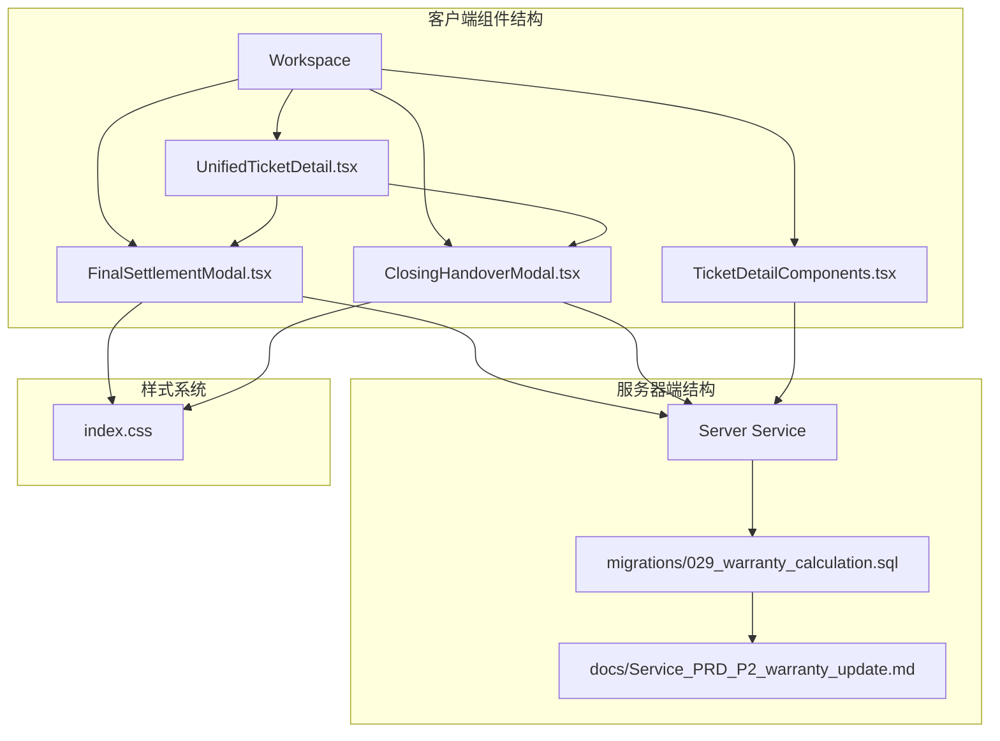
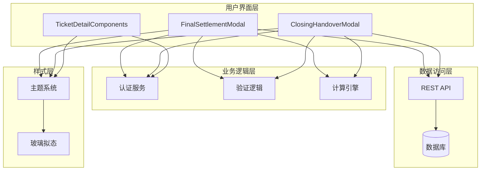
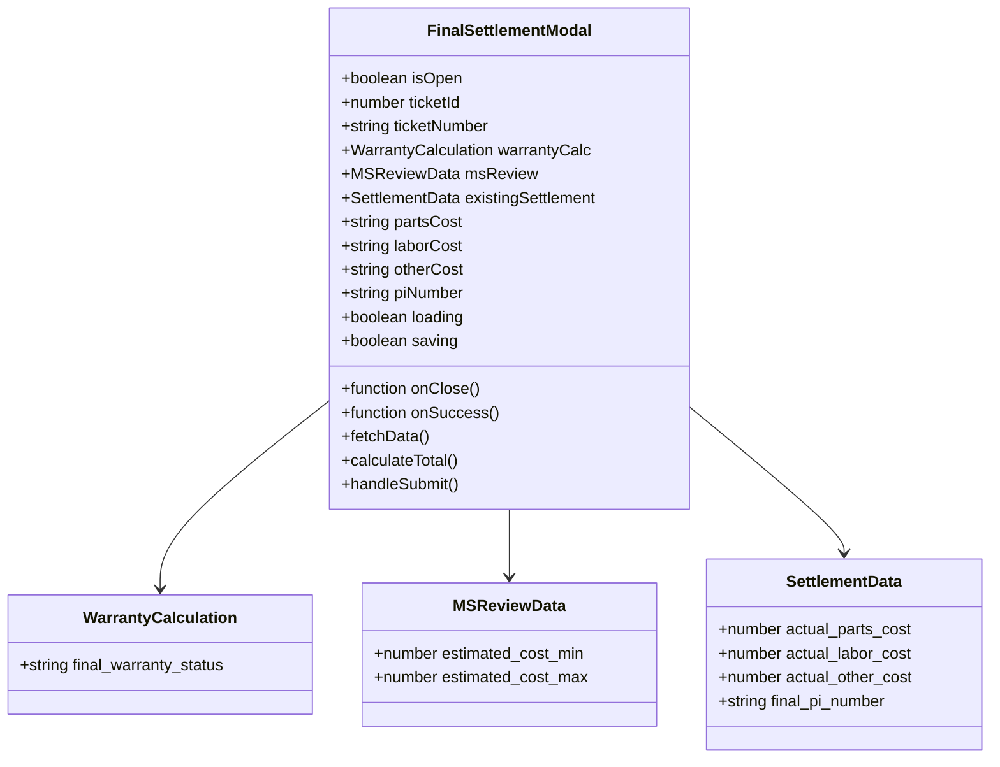
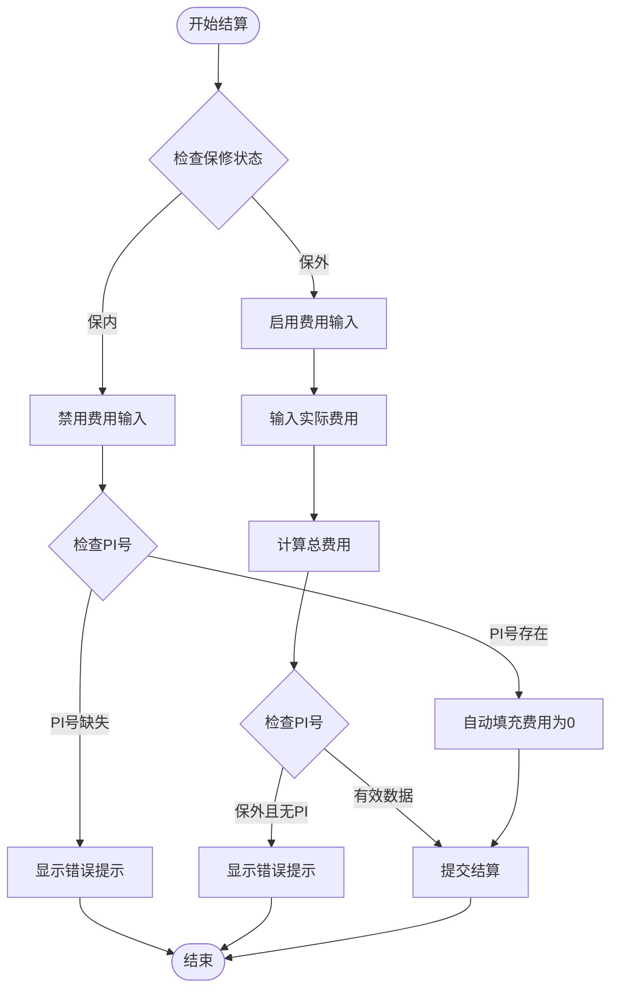
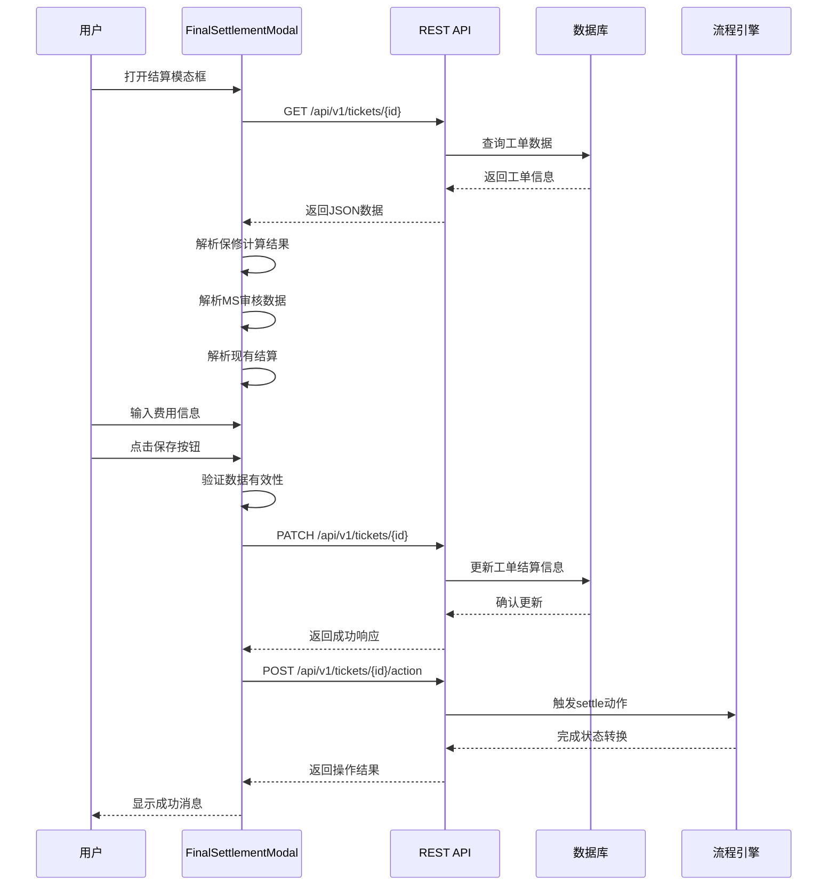
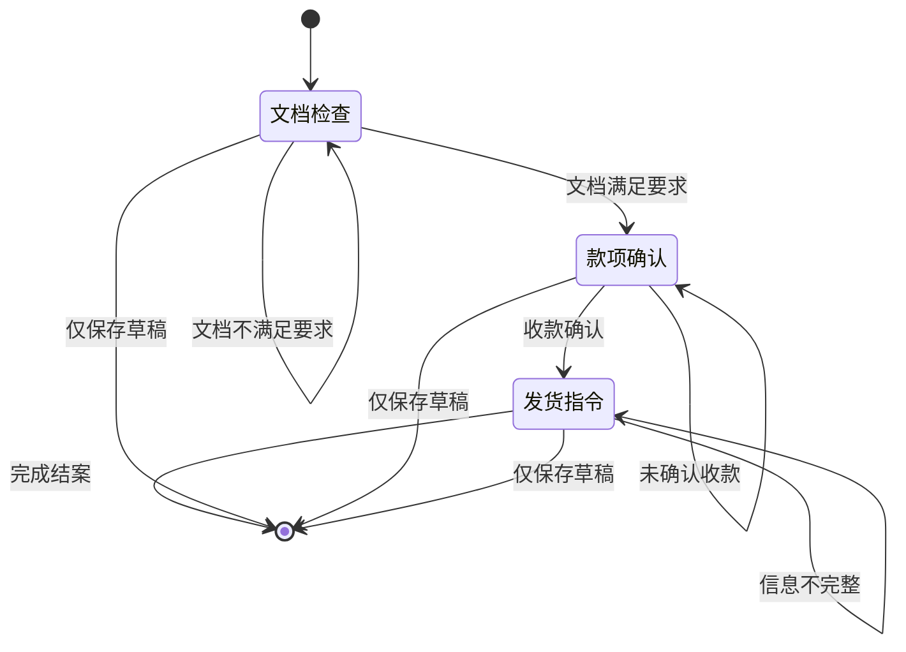
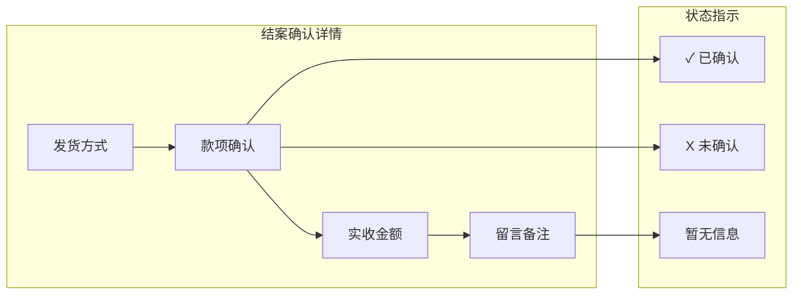
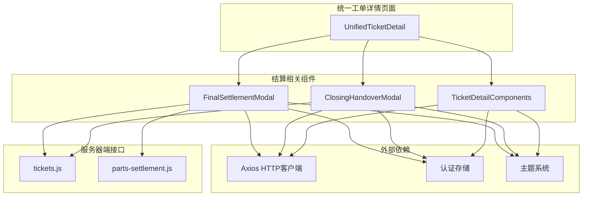

# 结案结算模态框

<cite>
**本文档引用的文件**
- [FinalSettlementModal.tsx](file://client/src/components/Workspace/FinalSettlementModal.tsx)
- [UnifiedTicketDetail.tsx](file://client/src/components/Workspace/UnifiedTicketDetail.tsx)
- [ClosingHandoverModal.tsx](file://client/src/components/Workspace/ClosingHandoverModal.tsx)
- [TicketDetailComponents.tsx](file://client/src/components/Workspace/TicketDetailComponents.tsx)
- [029_warranty_calculation.sql](file://server/service/migrations/029_warranty_calculation.sql)
- [Service_PRD_P2_warranty_update.md](file://docs/Service_PRD_P2_warranty_update.md)
- [index.css](file://client/src/index.css)
</cite>

## 目录
1. [简介](#简介)
2. [项目结构](#项目结构)
3. [核心组件](#核心组件)
4. [架构概览](#架构概览)
5. [详细组件分析](#详细组件分析)
6. [依赖关系分析](#依赖关系分析)
7. [性能考虑](#性能考虑)
8. [故障排除指南](#故障排除指南)
9. [结论](#结论)

## 简介

结案结算模态框是Longhorn服务管理系统中的关键组件，负责处理工单维修完成后的最终费用结算流程。该模态框集成了保修计算、费用录入、PI生成和发货流转等多个功能模块，为用户提供了一站式的结案结算解决方案。

该组件采用现代化的玻璃拟态设计风格，支持保内和保外两种维修模式，并通过严格的业务逻辑确保数据的准确性和完整性。系统通过JSON格式存储复杂的结算信息，包括实际费用、PI信息、发货要求等关键数据。

## 项目结构

结案结算模态框位于客户端组件目录的Workspace子目录中，与相关的工单管理组件共同构成了完整的工单生命周期管理系统。

**图表来源**
- [FinalSettlementModal.tsx:1-329](file://client/src/components/Workspace/FinalSettlementModal.tsx#L1-L329)
- [ClosingHandoverModal.tsx:1-566](file://client/src/components/Workspace/ClosingHandoverModal.tsx#L1-L566)
- [029_warranty_calculation.sql:1-23](file://server/service/migrations/029_warranty_calculation.sql#L1-L23)

**章节来源**
- [FinalSettlementModal.tsx:1-329](file://client/src/components/Workspace/FinalSettlementModal.tsx#L1-L329)
- [index.css:1-200](file://client/src/index.css#L1-L200)

## 核心组件

### FinalSettlementModal 组件

FinalSettlementModal是结案结算的核心组件，负责处理最终费用结算的完整流程。该组件具有以下关键特性：

- **多阶段数据集成**：整合保修计算结果、MS审核数据和现有结算信息
- **智能表单验证**：根据保修状态自动调整表单字段和验证规则
- **实时费用计算**：动态计算实际总费用并提供可视化反馈
- **JSON数据存储**：以结构化格式存储结算相关信息

### ClosingHandoverModal 组件

ClosingHandoverModal作为结案确认与交接组件，提供了更全面的结案管理功能：

- **三阶段工作流**：文档检查、款项确认、发货指令三个主要阶段
- **多维度验证**：确保所有必要文档已发布且款项已结清
- **灵活发货配置**：支持多种发货方式和物流选项
- **状态跟踪**：实时监控结案进度和状态变化

### TicketDetailComponents 组件

该组件负责展示结案确认详情，提供历史数据的可视化展示：

- **结构化数据显示**：以清晰的格式展示结算相关信息
- **状态指示器**：通过颜色和图标直观显示各项状态
- **历史记录追踪**：记录和展示结案过程中的关键信息

**章节来源**
- [FinalSettlementModal.tsx:30-329](file://client/src/components/Workspace/FinalSettlementModal.tsx#L30-L329)
- [ClosingHandoverModal.tsx:6-566](file://client/src/components/Workspace/ClosingHandoverModal.tsx#L6-L566)
- [TicketDetailComponents.tsx:1590-1630](file://client/src/components/Workspace/TicketDetailComponents.tsx#L1590-L1630)

## 架构概览

结案结算模态框采用了分层架构设计，确保了系统的可维护性和扩展性。

**图表来源**
- [FinalSettlementModal.tsx:33-144](file://client/src/components/Workspace/FinalSettlementModal.tsx#L33-L144)
- [ClosingHandoverModal.tsx:16-158](file://client/src/components/Workspace/ClosingHandoverModal.tsx#L16-L158)
- [index.css:1-200](file://client/src/index.css#L1-L200)

系统架构的关键特点包括：

1. **组件化设计**：每个模态框都是独立的功能单元，便于维护和测试
2. **状态管理**：通过React状态管理实现组件间的数据共享
3. **异步数据处理**：使用Promise和async/await处理API调用
4. **响应式设计**：支持不同屏幕尺寸和设备类型

## 详细组件分析

### FinalSettlementModal 组件深度分析

FinalSettlementModal组件实现了完整的结案结算流程，包含以下核心功能：

#### 数据模型设计

**图表来源**
- [FinalSettlementModal.tsx:6-28](file://client/src/components/Workspace/FinalSettlementModal.tsx#L6-L28)

#### 表单验证流程

**图表来源**
- [FinalSettlementModal.tsx:109-144](file://client/src/components/Workspace/FinalSettlementModal.tsx#L109-L144)

#### API交互流程

**图表来源**
- [FinalSettlementModal.tsx:54-144](file://client/src/components/Workspace/FinalSettlementModal.tsx#L54-L144)

**章节来源**
- [FinalSettlementModal.tsx:1-329](file://client/src/components/Workspace/FinalSettlementModal.tsx#L1-L329)

### ClosingHandoverModal 组件分析

ClosingHandoverModal组件提供了更复杂的结案管理功能，支持三阶段工作流：

#### 三阶段工作流设计

**图表来源**
- [ClosingHandoverModal.tsx:182-186](file://client/src/components/Workspace/ClosingHandoverModal.tsx#L182-L186)

#### 文档状态管理

组件通过以下机制确保文档发布的完整性：

1. **并发API调用**：同时检查维修报告和PI的状态
2. **状态缓存**：使用useState管理文档状态
3. **实时验证**：根据文档状态动态调整UI元素

**章节来源**
- [ClosingHandoverModal.tsx:1-566](file://client/src/components/Workspace/ClosingHandoverModal.tsx#L1-L566)

### TicketDetailComponents 组件分析

该组件负责展示结案确认的详细信息，提供历史数据的可视化展示：

#### 数据展示模式

**图表来源**
- [TicketDetailComponents.tsx:1595-1627](file://client/src/components/Workspace/TicketDetailComponents.tsx#L1595-L1627)

**章节来源**
- [TicketDetailComponents.tsx:1590-1630](file://client/src/components/Workspace/TicketDetailComponents.tsx#L1590-L1630)

## 依赖关系分析

结案结算模态框组件之间存在紧密的依赖关系，形成了完整的工单管理生态系统。

**图表来源**
- [UnifiedTicketDetail.tsx:2413-2422](file://client/src/components/Workspace/UnifiedTicketDetail.tsx#L2413-L2422)
- [FinalSettlementModal.tsx:1-4](file://client/src/components/Workspace/FinalSettlementModal.tsx#L1-L4)
- [ClosingHandoverModal.tsx:1-4](file://client/src/components/Workspace/ClosingHandoverModal.tsx#L1-L4)

### 组件耦合度分析

- **低耦合高内聚**：各组件职责明确，相互依赖程度适中
- **数据流向清晰**：从UnifiedTicketDetail触发，到具体结算组件处理
- **状态共享机制**：通过父组件状态管理和回调函数实现数据传递

**章节来源**
- [UnifiedTicketDetail.tsx:2400-2502](file://client/src/components/Workspace/UnifiedTicketDetail.tsx#L2400-L2502)

## 性能考虑

结案结算模态框在设计时充分考虑了性能优化，采用了多种策略来提升用户体验：

### 数据加载优化

1. **条件加载**：仅在模态框打开时才加载相关数据
2. **并发请求**：使用Promise.all同时获取多个数据源
3. **缓存机制**：利用useEffect的依赖数组避免不必要的重新渲染

### 渲染性能优化

1. **虚拟滚动**：对于大量数据的展示使用虚拟化技术
2. **懒加载**：非关键内容采用懒加载策略
3. **防抖处理**：输入验证采用防抖机制减少重复计算

### 网络请求优化

1. **请求合并**：将多个小请求合并为批量请求
2. **错误重试**：实现智能的错误重试机制
3. **超时控制**：设置合理的请求超时时间

## 故障排除指南

### 常见问题及解决方案

#### 数据加载失败

**问题描述**：模态框无法加载工单数据

**可能原因**：
- 网络连接异常
- 认证令牌过期
- 服务器端API错误

**解决步骤**：
1. 检查网络连接状态
2. 验证用户认证状态
3. 查看浏览器开发者工具中的网络请求
4. 重新登录系统

#### 数据验证错误

**问题描述**：保存结算信息时出现验证错误

**可能原因**：
- 保外维修缺少PI号
- 费用输入格式不正确
- 保修状态与费用输入冲突

**解决步骤**：
1. 确认工单的保修状态
2. 检查PI号是否正确填写
3. 验证费用输入格式
4. 参考系统提供的错误提示

#### 状态同步问题

**问题描述**：结案状态在不同组件间显示不一致

**可能原因**：
- 数据更新延迟
- 组件刷新时机问题
- 缓存数据过期

**解决步骤**：
1. 手动刷新页面
2. 检查组件的依赖数组
3. 验证状态更新逻辑
4. 查看控制台错误日志

**章节来源**
- [FinalSettlementModal.tsx:95-144](file://client/src/components/Workspace/FinalSettlementModal.tsx#L95-L144)
- [ClosingHandoverModal.tsx:127-158](file://client/src/components/Workspace/ClosingHandoverModal.tsx#L127-L158)

## 结论

结案结算模态框作为Longhorn服务管理系统的重要组成部分，展现了现代前端开发的最佳实践。该组件通过精心设计的架构、完善的错误处理机制和优秀的用户体验，为工单管理提供了强大的技术支持。

### 主要优势

1. **功能完整性**：涵盖了从费用结算到发货流转的完整业务流程
2. **用户体验优秀**：直观的界面设计和流畅的交互体验
3. **数据安全性**：严格的数据验证和错误处理机制
4. **可维护性强**：模块化的组件设计便于后续扩展和维护

### 技术亮点

- **响应式设计**：适应不同设备和屏幕尺寸
- **状态管理**：高效的React状态管理模式
- **异步处理**：完善的异步数据处理机制
- **样式系统**：基于CSS变量的主题系统

该组件的成功实施为整个服务管理系统的稳定运行奠定了坚实基础，为用户提供了高效、可靠的工单管理体验。