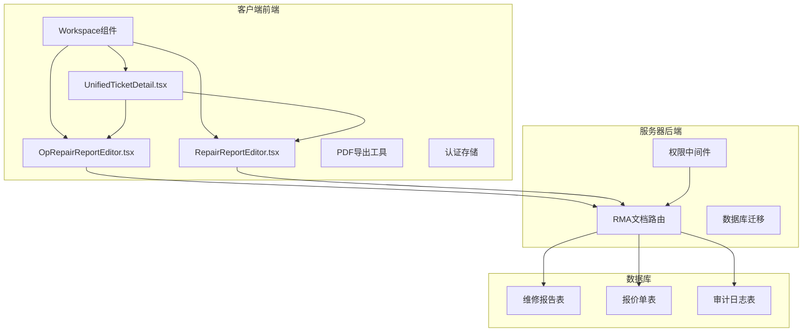
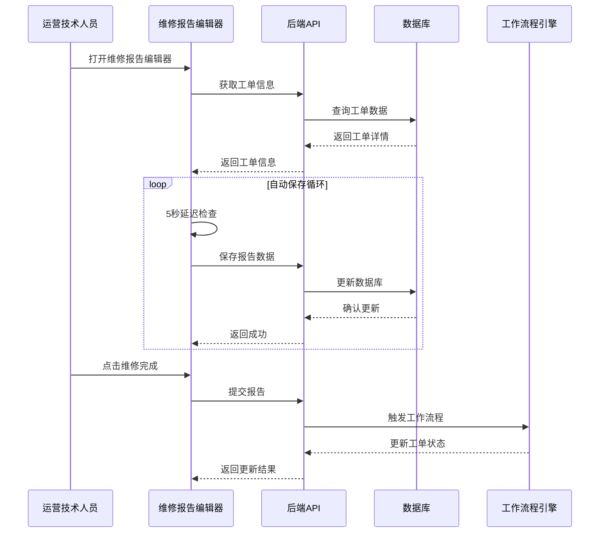
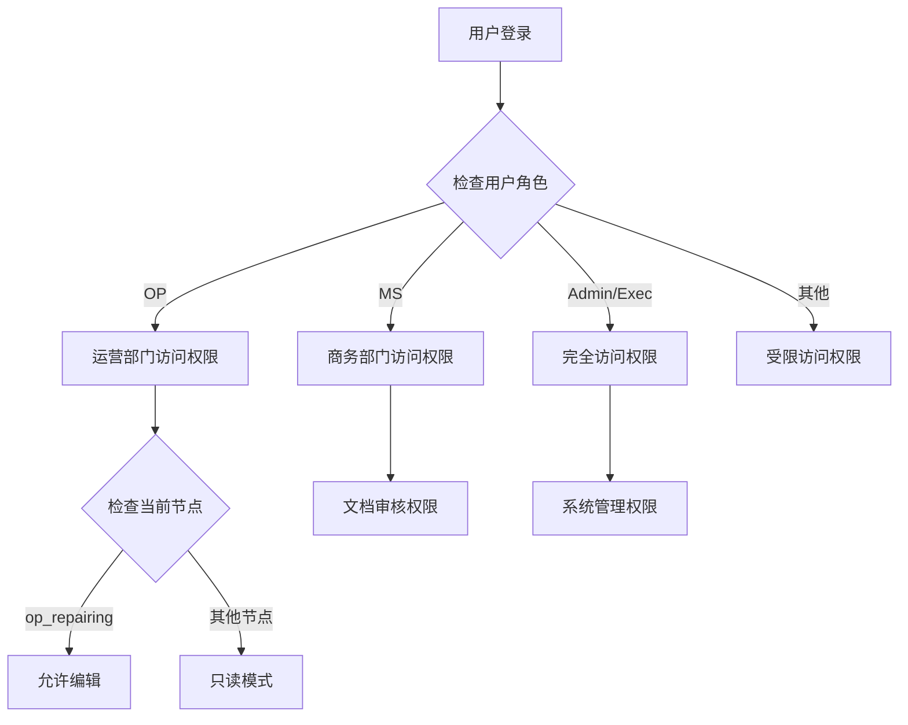
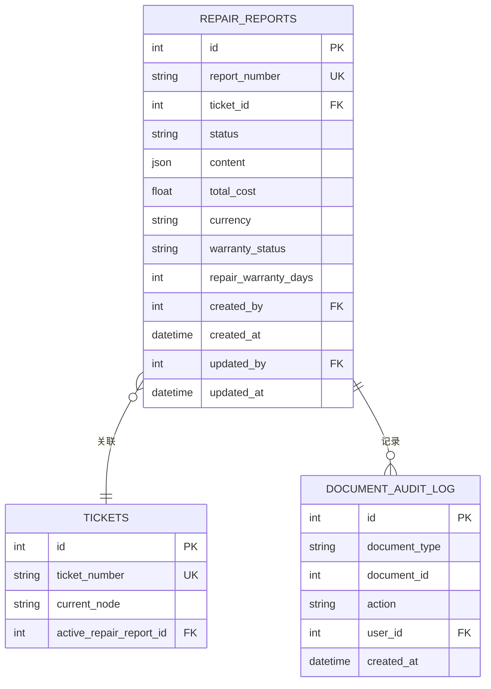
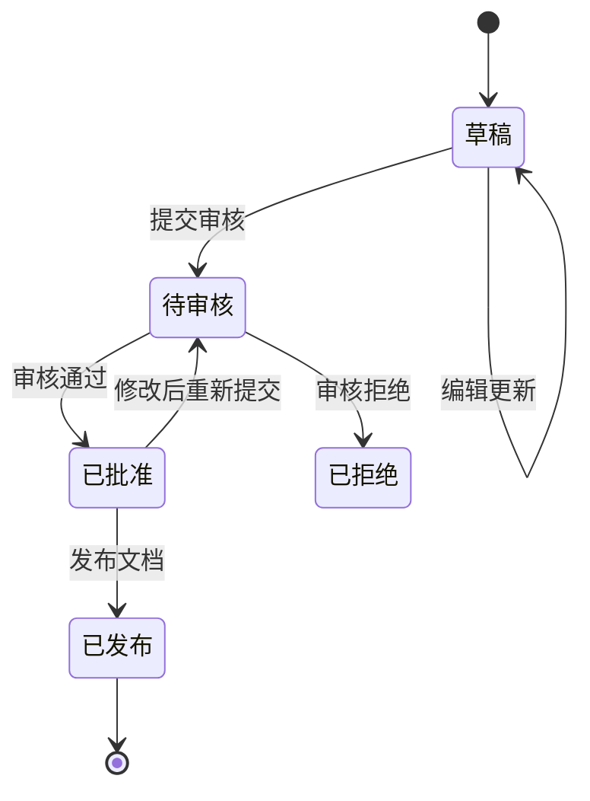
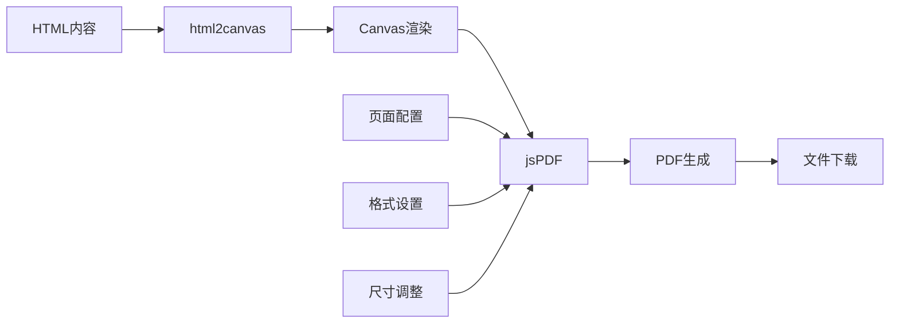
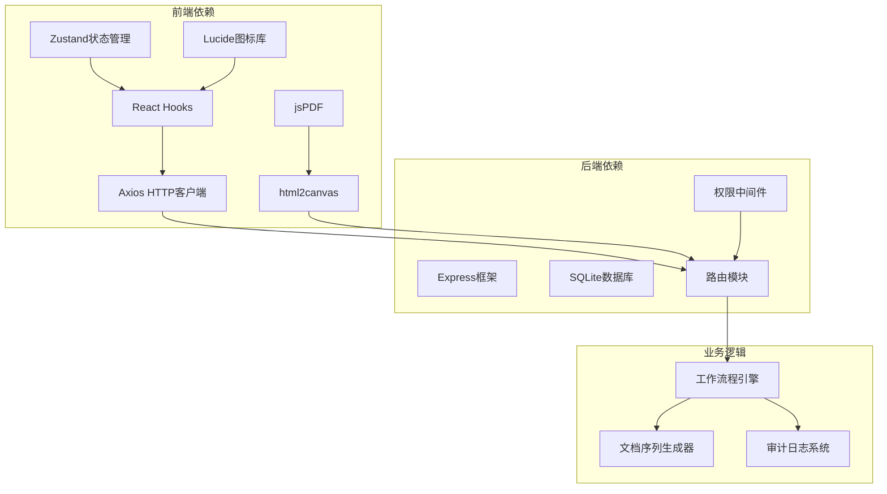

# 运营维修报告编辑器

<cite>
**本文档引用的文件**
- [OpRepairReportEditor.tsx](file://client/src/components/Workspace/OpRepairReportEditor.tsx)
- [RepairReportEditor.tsx](file://client/src/components/Workspace/RepairReportEditor.tsx)
- [rma-documents.js](file://server/service/routes/rma-documents.js)
- [030_pi_and_report_tables.sql](file://server/service/migrations/030_pi_and_report_tables.sql)
- [useAuthStore.ts](file://client/src/store/useAuthStore.ts)
- [pdfExport.ts](file://client/src/utils/pdfExport.ts)
- [UnifiedTicketDetail.tsx](file://client/src/components/Workspace/UnifiedTicketDetail.tsx)
- [RepairReport_Requirements.md](file://docs/RepairReport_Requirements.md)
- [permission.js](file://server/service/middleware/permission.js)
</cite>

## 目录
1. [简介](#简介)
2. [项目结构](#项目结构)
3. [核心组件](#核心组件)
4. [架构概览](#架构概览)
5. [详细组件分析](#详细组件分析)
6. [依赖关系分析](#依赖关系分析)
7. [性能考虑](#性能考虑)
8. [故障排除指南](#故障排除指南)
9. [结论](#结论)

## 简介

运营维修报告编辑器是Longhorn服务管理系统中的核心组件，专门用于支持运营部门（OP）的维修报告创建和管理。该系统实现了完整的维修文档工作流程，从技术诊断到维修执行，再到最终的报告生成和审核。

系统支持两种主要的维修报告编辑器：
- **运营维修报告编辑器（OpRepairReportEditor）**：专为运营技术人员设计，支持在维修执行节点自动保存
- **正式维修报告编辑器（RepairReportEditor）**：为商务审核团队设计，支持完整的文档工作流程

该系统集成了严格的角色权限控制、自动保存机制、PDF导出功能，并与整个服务工作流程无缝集成。

## 项目结构

**图表来源**
- [OpRepairReportEditor.tsx:1-577](file://client/src/components/Workspace/OpRepairReportEditor.tsx#L1-L577)
- [RepairReportEditor.tsx:1-800](file://client/src/components/Workspace/RepairReportEditor.tsx#L1-L800)
- [rma-documents.js:1-200](file://server/service/routes/rma-documents.js#L1-L200)

**章节来源**
- [OpRepairReportEditor.tsx:1-577](file://client/src/components/Workspace/OpRepairReportEditor.tsx#L1-L577)
- [RepairReportEditor.tsx:1-800](file://client/src/components/Workspace/RepairReportEditor.tsx#L1-L800)
- [rma-documents.js:1-200](file://server/service/routes/rma-documents.js#L1-L200)

## 核心组件

### 运营维修报告编辑器

运营维修报告编辑器是专门为运营技术人员设计的轻量级编辑器，具有以下特点：

- **自动保存机制**：5秒延迟自动保存，确保数据安全
- **节点权限控制**：仅在op_repairing节点允许编辑
- **简化界面**：专注于维修执行过程的记录
- **实时初始化**：从诊断活动自动填充初始数据

### 正式维修报告编辑器

正式维修报告编辑器提供完整的文档管理功能：

- **完整工作流程**：支持草稿、审核、批准、发布的完整流程
- **多角色协作**：支持MS（市场）和OP（运营）团队协作
- **财务集成**：支持人工工时、零件费用、运费的计算和管理
- **PDF导出**：支持专业的PDF格式导出

**章节来源**
- [OpRepairReportEditor.tsx:53-82](file://client/src/components/Workspace/OpRepairReportEditor.tsx#L53-L82)
- [RepairReportEditor.tsx:141-184](file://client/src/components/Workspace/RepairReportEditor.tsx#L141-L184)

## 架构概览

**图表来源**
- [OpRepairReportEditor.tsx:84-91](file://client/src/components/Workspace/OpRepairReportEditor.tsx#L84-L91)
- [RepairReportEditor.tsx:186-195](file://client/src/components/Workspace/RepairReportEditor.tsx#L186-L195)
- [rma-documents.js:950-1117](file://server/service/routes/rma-documents.js#L950-L1117)

## 详细组件分析

### 权限控制系统

系统实现了严格的基于角色的权限控制（RBAC）：

**图表来源**
- [useAuthStore.ts:3-14](file://client/src/store/useAuthStore.ts#L3-L14)
- [permission.js:34-44](file://server/service/middleware/permission.js#L34-L44)

### 数据模型设计

系统使用灵活的JSON结构存储维修报告内容：

**图表来源**
- [030_pi_and_report_tables.sql:64-114](file://server/service/migrations/030_pi_and_report_tables.sql#L64-L114)

### 工作流程管理

**图表来源**
- [rma-documents.js:950-1117](file://server/service/routes/rma-documents.js#L950-L1117)

**章节来源**
- [permission.js:1-232](file://server/service/middleware/permission.js#L1-L232)
- [030_pi_and_report_tables.sql:1-150](file://server/service/migrations/030_pi_and_report_tables.sql#L1-L150)

### PDF导出功能

系统集成了专业的PDF导出功能：

**图表来源**
- [pdfExport.ts:11-60](file://client/src/utils/pdfExport.ts#L11-L60)

**章节来源**
- [pdfExport.ts:1-75](file://client/src/utils/pdfExport.ts#L1-L75)

## 依赖关系分析

**图表来源**
- [OpRepairReportEditor.tsx:1-4](file://client/src/components/Workspace/OpRepairReportEditor.tsx#L1-L4)
- [RepairReportEditor.tsx:1-8](file://client/src/components/Workspace/RepairReportEditor.tsx#L1-L8)
- [rma-documents.js:7-10](file://server/service/routes/rma-documents.js#L7-L10)

**章节来源**
- [OpRepairReportEditor.tsx:1-577](file://client/src/components/Workspace/OpRepairReportEditor.tsx#L1-L577)
- [RepairReportEditor.tsx:1-800](file://client/src/components/Workspace/RepairReportEditor.tsx#L1-L800)

## 性能考虑

### 自动保存优化
- 5秒延迟避免频繁网络请求
- 静默保存不影响用户体验
- 错误处理确保数据一致性

### 数据加载优化
- 条件加载减少不必要的API调用
- 缓存策略提升响应速度
- 分页加载支持大数据集

### 内存管理
- 组件卸载时清理定时器
- 及时释放HTTP请求资源
- 优化数组操作避免重复渲染

## 故障排除指南

### 常见问题及解决方案

**权限问题**
- 确认用户角色和部门配置正确
- 检查当前工单节点状态
- 验证工作流程权限设置

**数据同步问题**
- 检查网络连接稳定性
- 验证API接口可用性
- 确认数据库连接正常

**界面显示问题**
- 清理浏览器缓存
- 检查CSS样式冲突
- 验证组件依赖完整性

**章节来源**
- [permission.js:107-118](file://server/service/middleware/permission.js#L107-L118)
- [OpRepairReportEditor.tsx:175-177](file://client/src/components/Workspace/OpRepairReportEditor.tsx#L175-L177)

## 结论

运营维修报告编辑器是一个功能完善、架构清晰的服务管理系统组件。它通过以下关键特性实现了高效的维修文档管理：

1. **双模式设计**：满足不同用户群体的需求
2. **严格权限控制**：确保数据安全和流程合规
3. **自动化工作流**：提升工作效率和准确性
4. **专业文档管理**：支持完整的生命周期管理
5. **集成化设计**：与整体服务系统无缝衔接

该系统为Longhorn服务管理提供了坚实的文档基础设施，支持从技术诊断到最终交付的完整维修流程管理。