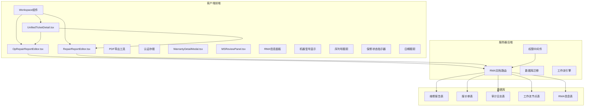
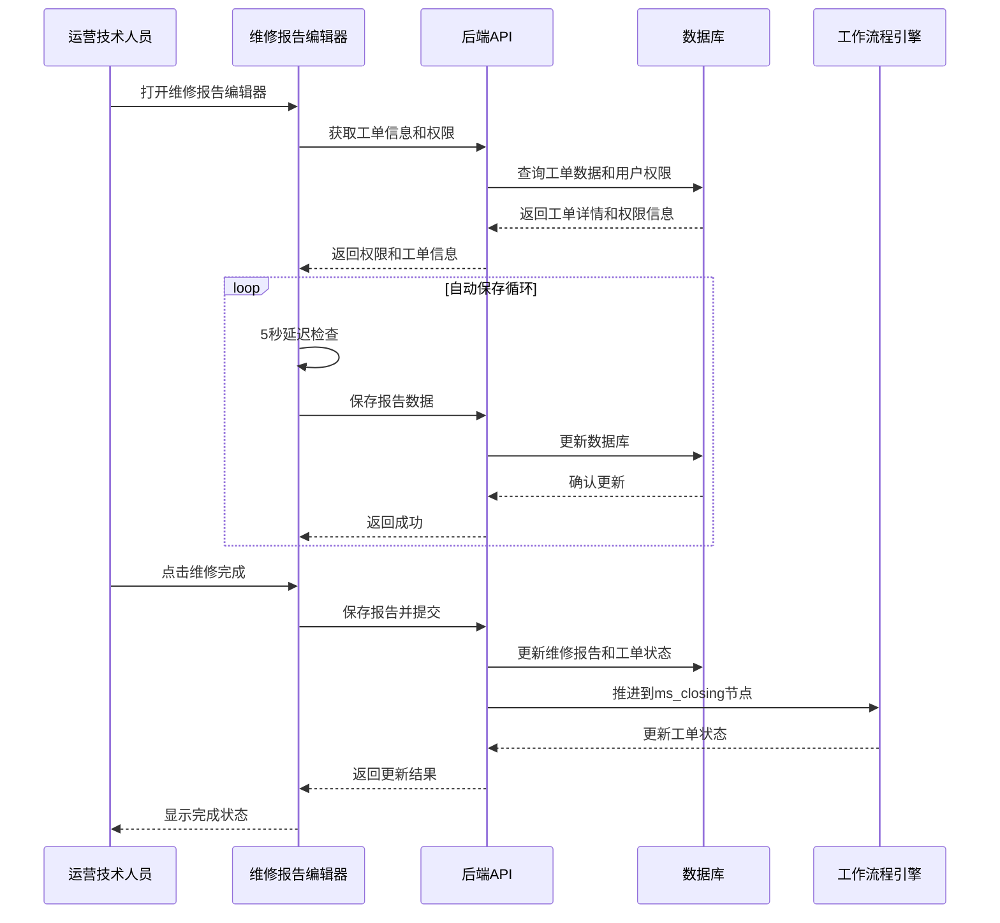
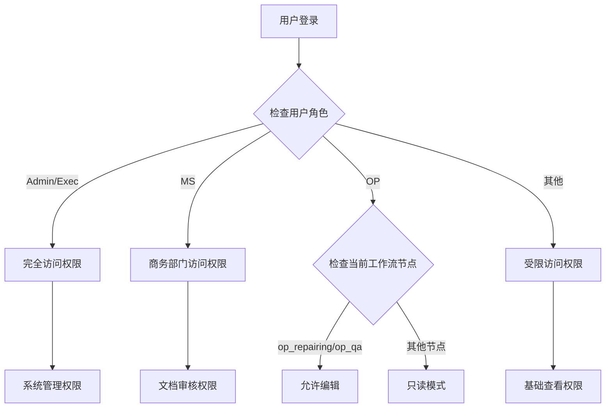
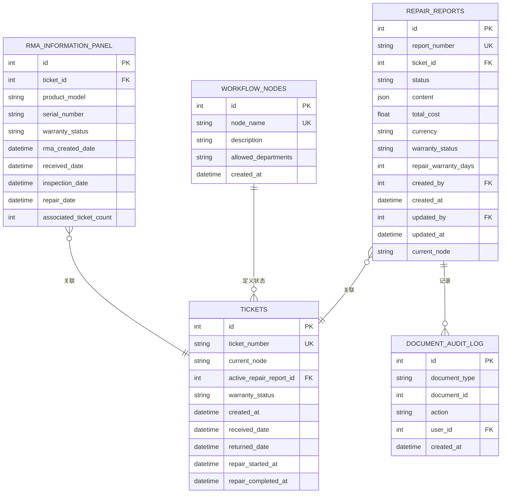
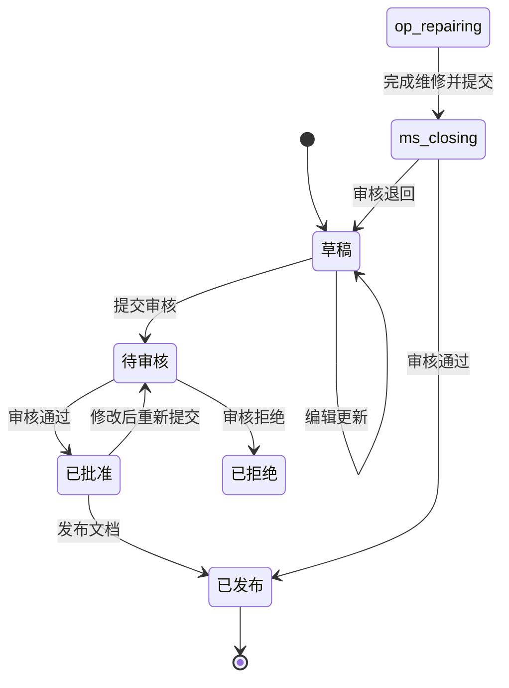
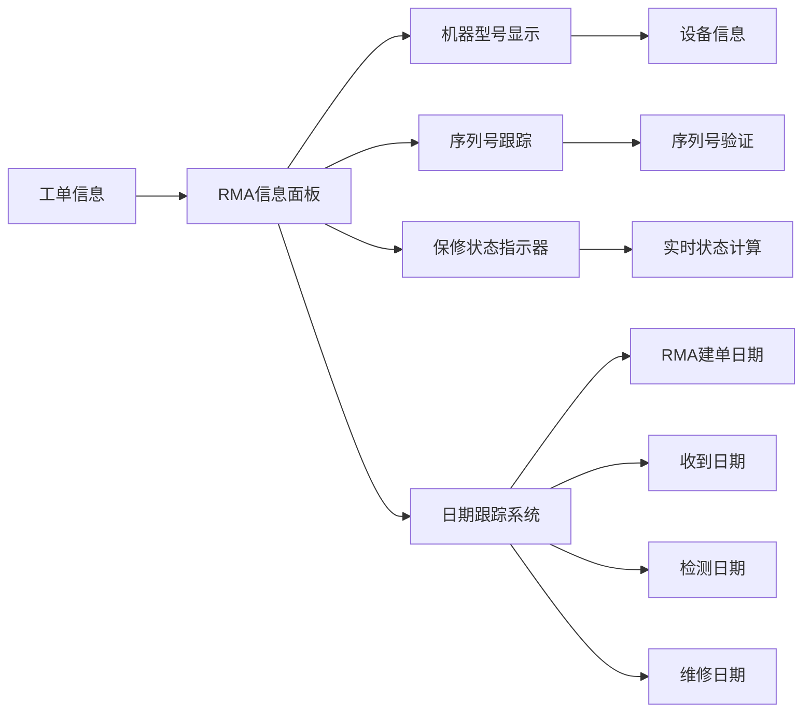
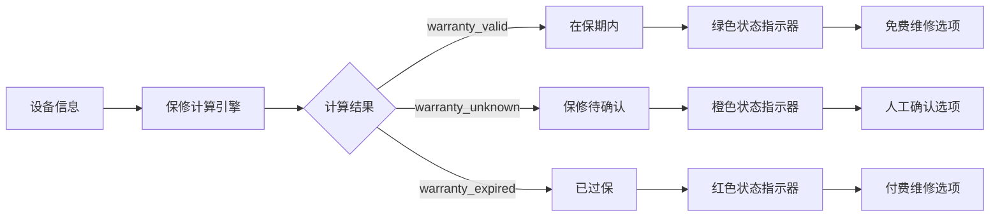
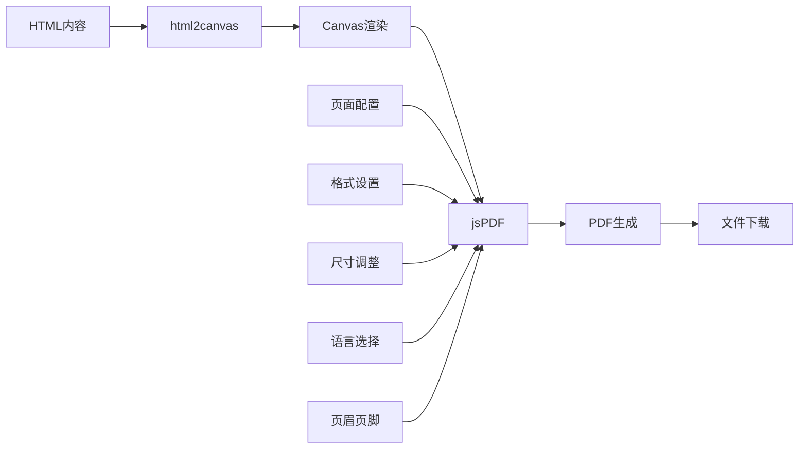
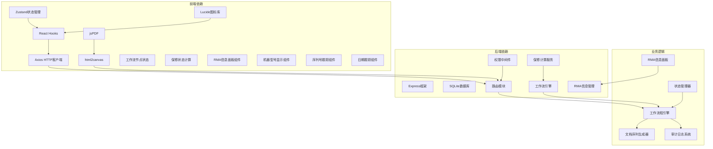

# 运营维修报告编辑器

<cite>
**本文档引用的文件**
- [OpRepairReportEditor.tsx](file://client/src/components/Workspace/OpRepairReportEditor.tsx)
- [RepairReportEditor.tsx](file://client/src/components/Workspace/RepairReportEditor.tsx)
- [rma-documents.js](file://server/service/routes/rma-documents.js)
- [030_pi_and_report_tables.sql](file://server/service/migrations/030_pi_and_report_tables.sql)
- [useAuthStore.ts](file://client/src/store/useAuthStore.ts)
- [pdfExport.ts](file://client/src/utils/pdfExport.ts)
- [UnifiedTicketDetail.tsx](file://client/src/components/Workspace/UnifiedTicketDetail.tsx)
- [RepairReport_Requirements.md](file://docs/RepairReport_Requirements.md)
- [permission.js](file://server/service/middleware/permission.js)
- [WarrantyDetailModal.tsx](file://client/src/components/Workspace/WarrantyDetailModal.tsx)
- [RMATicketCreatePage.tsx](file://client/src/components/RMATickets/RMATicketCreatePage.tsx)
</cite>

## 更新摘要
**变更内容**
- 新增RMA集成信息面板，提供完整的RMA相关信息展示
- 增强机器型号和序列号跟踪功能
- 集成实时保修状态指示器，支持在保、过保、待确认状态
- 添加多日期跟踪功能，包括RMA建单日期、收到日期、检测日期、维修日期
- 改进工作流节点状态管理，支持OP维修节点的直接状态推进
- 增强权限控制系统，限制OP人员在特定工作流节点的编辑权限

## 目录
1. [简介](#简介)
2. [项目结构](#项目结构)
3. [核心组件](#核心组件)
4. [架构概览](#架构概览)
5. [详细组件分析](#详细组件分析)
6. [依赖关系分析](#依赖关系分析)
7. [性能考虑](#性能考虑)
8. [故障排除指南](#故障排除指南)
9. [结论](#结论)

## 简介

运营维修报告编辑器是Longhorn服务管理系统中的核心组件，专门用于支持运营部门（OP）的维修报告创建和管理。该系统实现了完整的维修文档工作流程，从技术诊断到维修执行，再到最终的报告生成和审核。

**重大功能增强**：
- **智能权限控制**：基于工作流节点的动态编辑权限管理
- **一键完成功能**：支持维修完成后直接提交到下一工作流节点
- **实时保修状态**：集成保修状态计算和可视化显示
- **RMA集成信息面板**：提供完整的RMA相关信息展示和跟踪
- **机器型号序列号跟踪**：支持设备信息的精确跟踪和管理
- **多日期跟踪**：支持RMA建单、收到、检测、维修等多个关键日期的跟踪
- **改进的视觉反馈**：提供更直观的状态指示和操作反馈

系统支持两种主要的维修报告编辑器：
- **运营维修报告编辑器（OpRepairReportEditor）**：专为运营技术人员设计，支持在维修执行节点自动保存和一键完成
- **正式维修报告编辑器（RepairReportEditor）**：为商务审核团队设计，支持完整的文档工作流程和RMA信息面板

该系统集成了严格的角色权限控制、自动保存机制、PDF导出功能，并与整个服务工作流程无缝集成。

## 项目结构

**图表来源**
- [OpRepairReportEditor.tsx:1-702](file://client/src/components/Workspace/OpRepairReportEditor.tsx#L1-L702)
- [RepairReportEditor.tsx:1-1718](file://client/src/components/Workspace/RepairReportEditor.tsx#L1-L1718)
- [rma-documents.js:1-1507](file://server/service/routes/rma-documents.js#L1-L1507)

## 核心组件

### 运营维修报告编辑器

运营维修报告编辑器是专门为运营技术人员设计的轻量级编辑器，现已集成多项重要功能增强：

**权限控制增强**：
- **节点权限管理**：仅在`op_repairing`和`op_qa`节点允许编辑
- **动态权限判断**：根据当前工作流节点状态自动启用/禁用编辑功能
- **只读模式支持**：非授权用户自动进入只读模式

**完成功能增强**：
- **一键完成按钮**：在维修执行节点显示"完成维修并提交"按钮
- **自动状态推进**：完成维修后自动推进到`ms_closing`节点
- **数据完整性检查**：确保维修数据完整后再允许完成操作

**RMA集成信息面板**：
- **机器型号显示**：实时显示设备型号和序列号
- **保修状态指示**：集成实时保修状态计算和可视化
- **日期跟踪**：显示RMA建单日期、收到日期、检测日期、维修日期
- **关联工单跟踪**：显示相关工单的数量和状态

**机器型号和序列号跟踪**：
- **设备信息集成**：从工单信息中提取和显示设备型号和序列号
- **序列号验证**：支持序列号的验证和跟踪
- **设备历史关联**：显示设备的关联工单历史

**实时保修状态指示**：
- **动态状态显示**：根据保修计算结果实时显示保修状态
- **颜色编码系统**：使用绿色（在保）、橙色（待确认）、红色（过保）区分状态
- **详细状态说明**：提供状态变化的详细解释和建议

**视觉反馈改进**：
- **自动保存状态**：显示最后一次自动保存的时间和状态
- **编辑模式识别**：区分编辑模式和只读模式的界面风格
- **操作反馈**：提供保存、提交等操作的即时反馈

### 正式维修报告编辑器

正式维修报告编辑器提供完整的文档管理功能，支持多角色协作和财务集成：

- **完整工作流程**：支持草稿、审核、批准、发布的完整流程
- **多角色协作**：支持MS（市场）和OP（运营）团队协作
- **财务集成**：支持人工工时、零件费用、运费的计算和管理
- **PDF导出**：支持专业的PDF格式导出
- **RMA信息面板**：集成RMA相关信息的展示和跟踪

**章节来源**
- [OpRepairReportEditor.tsx:54-92](file://client/src/components/Workspace/OpRepairReportEditor.tsx#L54-L92)
- [RepairReportEditor.tsx:140-191](file://client/src/components/Workspace/RepairReportEditor.tsx#L140-L191)

## 架构概览

**图表来源**
- [OpRepairReportEditor.tsx:94-100](file://client/src/components/Workspace/OpRepairReportEditor.tsx#L94-L100)
- [RepairReportEditor.tsx:194-203](file://client/src/components/Workspace/RepairReportEditor.tsx#L194-L203)
- [OpRepairReportEditor.tsx:288-334](file://client/src/components/Workspace/OpRepairReportEditor.tsx#L288-L334)

## 详细组件分析

### 权限控制系统

系统实现了严格的基于角色的权限控制（RBAC），现已增强为基于工作流节点的动态权限管理：

**权限控制增强**：
- **节点级权限**：OP人员只能在特定工作流节点进行编辑
- **动态权限判断**：根据`ticketInfo.current_node`和`currentNode`属性判断编辑权限
- **默认权限策略**：用户信息加载前，默认允许OP编辑以确保数据完整性

**图表来源**
- [useAuthStore.ts:3-14](file://client/src/store/useAuthStore.ts#L3-L14)
- [permission.js:34-44](file://server/service/middleware/permission.js#L34-L44)

### 数据模型设计

系统使用灵活的JSON结构存储维修报告内容，现已扩展支持工作流状态管理和RMA信息：

**数据模型增强**：
- **工作流节点字段**：新增`current_node`字段跟踪工单状态
- **权限控制字段**：支持基于节点的权限控制
- **状态管理**：支持完整的维修报告生命周期管理
- **RMA信息面板**：新增专门的RMA信息面板表结构
- **日期跟踪字段**：支持多个关键日期的跟踪和管理

**图表来源**
- [030_pi_and_report_tables.sql:64-114](file://server/service/migrations/030_pi_and_report_tables.sql#L64-L114)

### 工作流程管理

**工作流程增强**：
- **一键完成功能**：OP维修节点支持直接提交到MS结案审核
- **状态自动推进**：完成维修后自动推进到下一个工作流节点
- **条件分支处理**：根据保修状态决定工作流路径

**图表来源**
- [OpRepairReportEditor.tsx:316-322](file://client/src/components/Workspace/OpRepairReportEditor.tsx#L316-L322)
- [rma-documents.js:950-1117](file://server/service/routes/rma-documents.js#L950-L1117)

### RMA集成信息面板

系统集成了全面的RMA信息面板，提供完整的RMA相关信息展示和跟踪功能：

**RMA信息面板增强**：
- **机器型号显示**：实时显示设备型号和序列号
- **序列号跟踪**：支持序列号的精确跟踪和验证
- **保修状态指示器**：集成实时保修状态计算和可视化
- **多日期跟踪**：支持RMA建单、收到、检测、维修等多个关键日期
- **关联工单统计**：显示相关工单的数量和状态

**图表来源**
- [RepairReportEditor.tsx:708-762](file://client/src/components/Workspace/RepairReportEditor.tsx#L708-L762)
- [OpRepairReportEditor.tsx:405-458](file://client/src/components/Workspace/OpRepairReportEditor.tsx#L405-L458)

### 实时保修状态指示器

系统集成了先进的保修状态计算和可视化显示功能：

**状态指示器增强**：
- **颜色编码系统**：使用绿色（在保）、橙色（待确认）、红色（过保）直观显示状态
- **实时计算**：基于设备信息和保修规则实时计算状态
- **详细说明**：提供状态变化的详细解释和建议措施

**图表来源**
- [OpRepairReportEditor.tsx:417-425](file://client/src/components/Workspace/OpRepairReportEditor.tsx#L417-L425)
- [WarrantyDetailModal.tsx:127-152](file://client/src/components/Workspace/WarrantyDetailModal.tsx#L127-L152)

### PDF导出功能

系统集成了专业的PDF导出功能，支持多种格式和语言设置：

**PDF导出增强**：
- **多语言支持**：支持中文、英文、日文等多种语言输出
- **自定义格式**：支持A4、Letter等纸张尺寸和横竖版式
- **页面设置**：可选择显示或隐藏页眉页脚

**图表来源**
- [pdfExport.ts:129-137](file://client/src/utils/pdfExport.ts#L129-L137)

**章节来源**
- [permission.js:1-232](file://server/service/middleware/permission.js#L1-L232)
- [030_pi_and_report_tables.sql:1-150](file://server/service/migrations/030_pi_and_report_tables.sql#L1-L150)

## 依赖关系分析

**依赖关系增强**：
- **工作流集成**：前端组件直接支持工作流节点状态管理
- **保修服务集成**：实时调用保修计算服务获取最新状态
- **RMA信息集成**：集成RMA信息面板的数据管理和展示
- **状态同步**：前后端状态保持实时同步

**图表来源**
- [OpRepairReportEditor.tsx:1-4](file://client/src/components/Workspace/OpRepairReportEditor.tsx#L1-L4)
- [RepairReportEditor.tsx:1-8](file://client/src/components/Workspace/RepairReportEditor.tsx#L1-L8)
- [rma-documents.js:7-10](file://server/service/routes/rma-documents.js#L7-L10)

**章节来源**
- [OpRepairReportEditor.tsx:1-702](file://client/src/components/Workspace/OpRepairReportEditor.tsx#L1-L702)
- [RepairReportEditor.tsx:1-1718](file://client/src/components/Workspace/RepairReportEditor.tsx#L1-L1718)

## 性能考虑

### 自动保存优化
- 5秒延迟避免频繁网络请求
- 静默保存不影响用户体验
- 错误处理确保数据一致性
- **新增**：只在有活动ID时才执行自动保存

### 数据加载优化
- 条件加载减少不必要的API调用
- 缓存策略提升响应速度
- 分页加载支持大数据集
- **新增**：工作流节点状态缓存
- **新增**：RMA信息面板数据缓存

### 内存管理
- 组件卸载时清理定时器
- 及时释放HTTP请求资源
- 优化数组操作避免重复渲染
- **新增**：状态监听器清理
- **新增**：RMA信息面板内存管理

### 权限控制优化
- **新增**：客户端权限预检查，避免无意义的API调用
- **新增**：权限状态缓存，减少重复计算
- **新增**：异步权限验证，不阻塞UI渲染
- **新增**：RMA信息面板权限控制

### RMA信息面板优化
- **新增**：面板数据懒加载，减少初始渲染时间
- **新增**：状态变化监听优化，避免不必要的重渲染
- **新增**：日期格式化缓存，提升显示性能

## 故障排除指南

### 常见问题及解决方案

**权限问题**
- 确认用户角色和部门配置正确
- 检查当前工单节点状态
- 验证工作流程权限设置
- **新增**：检查`opEditableNodes`数组包含的节点类型
- **新增**：验证RMA信息面板的访问权限

**数据同步问题**
- 检查网络连接稳定性
- 验证API接口可用性
- 确认数据库连接正常
- **新增**：检查工作流节点状态同步
- **新增**：验证RMA信息面板数据同步

**界面显示问题**
- 清理浏览器缓存
- 检查CSS样式冲突
- 验证组件依赖完整性
- **新增**：检查RMA信息面板样式
- **新增**：验证保修状态指示器样式

**完成功能问题**
- 确认当前节点为`op_repairing`
- 检查维修数据完整性
- 验证工作流推进权限
- **新增**：检查`handleComplete`函数的错误处理
- **新增**：验证RMA信息面板的完整性

**RMA信息面板问题**
- **新增**：检查RMA信息面板的数据加载
- **新增**：验证机器型号和序列号的显示
- **新增**：确认保修状态指示器的准确性
- **新增**：检查日期跟踪功能的正确性

**章节来源**
- [permission.js:107-118](file://server/service/middleware/permission.js#L107-L118)
- [OpRepairReportEditor.tsx:175-177](file://client/src/components/Workspace/OpRepairReportEditor.tsx#L175-L177)
- [OpRepairReportEditor.tsx:288-334](file://client/src/components/Workspace/OpRepairReportEditor.tsx#L288-L334)

## 结论

运营维修报告编辑器经过重大功能增强后，已成为一个功能完善、架构清晰且高度智能化的服务管理系统组件。通过以下关键特性实现了高效的维修文档管理：

1. **智能权限控制**：基于工作流节点的动态权限管理，确保数据安全和流程合规
2. **一键完成功能**：支持维修完成后直接提交到下一工作流节点，提升工作效率
3. **实时保修状态**：集成先进的保修状态计算和可视化显示，提供直观的状态指示
4. **RMA集成信息面板**：提供完整的RMA相关信息展示和跟踪功能
5. **机器型号序列号跟踪**：支持设备信息的精确跟踪和管理
6. **多日期跟踪系统**：支持RMA建单、收到、检测、维修等多个关键日期的跟踪
7. **改进的视觉反馈**：包括自动保存状态、编辑模式识别和操作反馈
8. **增强的工作流集成**：支持完整的维修工作流程管理和状态推进
9. **专业的文档管理**：支持完整的生命周期管理和多角色协作

该系统为Longhorn服务管理提供了坚实的文档基础设施，支持从技术诊断到最终交付的完整维修流程管理。新增的功能显著提升了用户体验和工作效率，同时保持了系统的安全性和可靠性。RMA集成信息面板的引入使得维修流程更加透明和可控，为运营和技术团队提供了更好的协作平台。