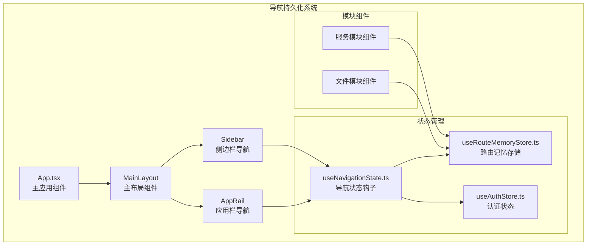
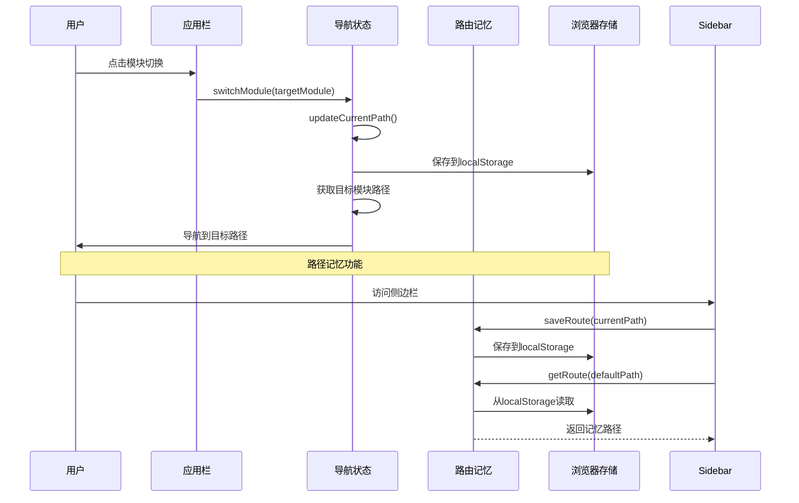
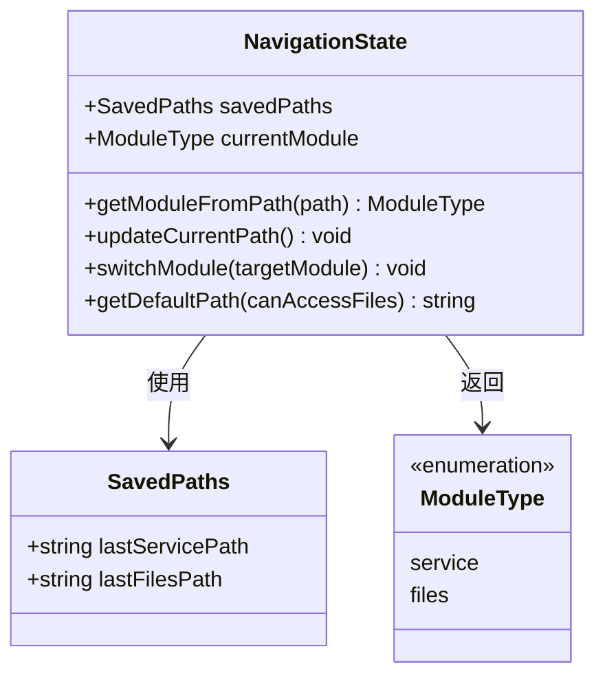
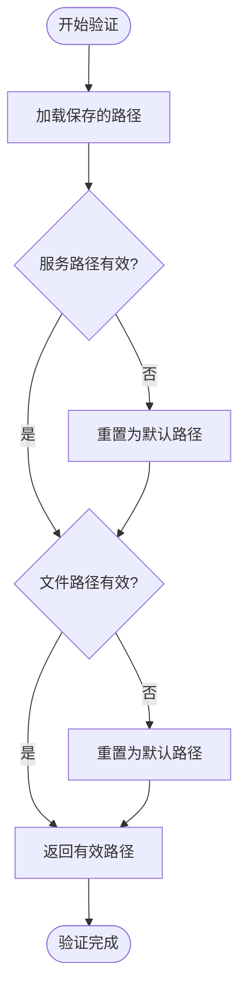
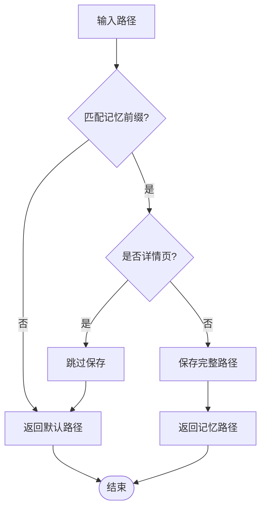
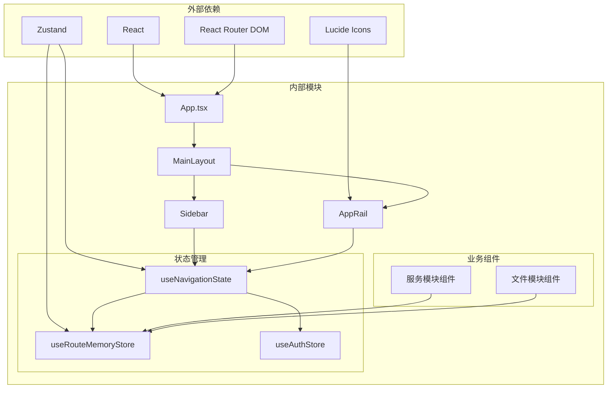

# 导航持久化

<cite>
**本文档引用的文件**
- [App.tsx](file://client/src/App.tsx)
- [main.tsx](file://client/src/main.tsx)
- [useRouteMemoryStore.ts](file://client/src/store/useRouteMemoryStore.ts)
- [useNavigationState.ts](file://client/src/hooks/useNavigationState.ts)
- [AppRail.tsx](file://client/src/components/AppRail.tsx)
- [FileBrowser.tsx](file://client/src/components/FileBrowser.tsx)
- [InquiryTicketListPage.tsx](file://client/src/components/InquiryTickets/InquiryTicketListPage.tsx)
- [useAuthStore.ts](file://client/src/store/useAuthStore.ts)
</cite>

## 目录
1. [简介](#简介)
2. [项目结构](#项目结构)
3. [核心组件](#核心组件)
4. [架构概览](#架构概览)
5. [详细组件分析](#详细组件分析)
6. [依赖关系分析](#依赖关系分析)
7. [性能考虑](#性能考虑)
8. [故障排除指南](#故障排除指南)
9. [结论](#结论)

## 简介

导航持久化是Longhorn应用中的一个关键功能，它确保用户在不同模块间切换时能够保持最佳的用户体验。该系统通过持久化用户的导航状态，使得用户在服务模块（Service）和文件模块（Files）之间切换时，能够回到他们上次离开的位置。

Longhorn应用采用双模块架构，包含：
- **服务模块**：处理工单管理、客户服务等业务功能
- **文件模块**：提供文件浏览、共享、管理等功能

导航持久化系统通过多种机制协同工作，包括路径记忆、模块状态管理和查询参数保存。

## 项目结构

Longhorn项目的前端结构采用模块化设计，导航持久化功能分布在多个关键文件中：

**图表来源**
- [App.tsx](file://client/src/App.tsx#L116-L248)
- [useNavigationState.ts](file://client/src/hooks/useNavigationState.ts#L120-L188)

**章节来源**
- [App.tsx](file://client/src/App.tsx#L1-L1013)
- [main.tsx](file://client/src/main.tsx#L1-L12)

## 核心组件

导航持久化系统由三个核心组件构成：

### 1. 导航状态管理器
负责跟踪和管理用户在不同模块间的导航状态，使用localStorage进行持久化存储。

### 2. 路由记忆存储
专门用于保存特定路由的查询参数和状态，使用zustand配合persist中间件实现。

### 3. 应用栏导航
提供快速模块切换的界面元素，支持响应式设计。

**章节来源**
- [useNavigationState.ts](file://client/src/hooks/useNavigationState.ts#L1-L198)
- [useRouteMemoryStore.ts](file://client/src/store/useRouteMemoryStore.ts#L1-L47)
- [AppRail.tsx](file://client/src/components/AppRail.tsx#L1-L141)

## 架构概览

导航持久化系统采用分层架构设计，确保各组件职责清晰且相互协作：

**图表来源**
- [useNavigationState.ts](file://client/src/hooks/useNavigationState.ts#L158-L169)
- [useRouteMemoryStore.ts](file://client/src/store/useRouteMemoryStore.ts#L21-L40)

## 详细组件分析

### 导航状态管理器 (useNavigationState)

导航状态管理器是整个导航持久化系统的核心，负责：

#### 主要功能
- **模块识别**：自动识别当前路径属于哪个模块
- **路径记忆**：保存每个模块的最后访问路径
- **模块切换**：在不同模块间进行平滑切换
- **默认路径**：为新用户提供合理的默认导航路径

#### 实现细节

**图表来源**
- [useNavigationState.ts](file://client/src/hooks/useNavigationState.ts#L11-L188)

#### 路径验证机制
系统实现了严格的路径验证机制，防止存储无效路径：

**图表来源**
- [useNavigationState.ts](file://client/src/hooks/useNavigationState.ts#L87-L96)

**章节来源**
- [useNavigationState.ts](file://client/src/hooks/useNavigationState.ts#L1-L198)

### 路由记忆存储 (useRouteMemoryStore)

路由记忆存储专门处理列表页面的导航状态，特别是查询参数的保存和恢复。

#### 核心特性
- **智能记忆**：只记忆列表页面的查询参数，不记忆详情页面
- **模块区分**：为不同模块维护独立的记忆空间
- **持久化存储**：使用localStorage长期保存用户偏好

#### 记忆策略

**图表来源**
- [useRouteMemoryStore.ts](file://client/src/store/useRouteMemoryStore.ts#L21-L40)

**章节来源**
- [useRouteMemoryStore.ts](file://client/src/store/useRouteMemoryStore.ts#L1-L47)

### 应用栏导航 (AppRail)

应用栏提供了直观的模块切换界面，支持桌面端的快速导航。

#### 设计特点
- **简洁设计**：仅显示必要的导航图标
- **响应式布局**：适应不同屏幕尺寸
- **状态指示**：通过样式变化显示当前激活状态
- **权限控制**：根据用户角色显示可用功能

**章节来源**
- [AppRail.tsx](file://client/src/components/AppRail.tsx#L1-L141)

### 侧边栏导航集成

侧边栏导航集成了路由记忆功能，为用户提供更丰富的导航体验：

#### 关键实现
- **路径保存**：在用户切换路由时自动保存当前路径
- **记忆恢复**：从localStorage恢复之前的导航状态
- **条件导航**：根据用户权限动态调整可访问的导航项

**章节来源**
- [App.tsx](file://client/src/App.tsx#L261-L266)

## 依赖关系分析

导航持久化系统的依赖关系体现了清晰的分层架构：

**图表来源**
- [App.tsx](file://client/src/App.tsx#L1-L63)
- [useNavigationState.ts](file://client/src/hooks/useNavigationState.ts#L1-L10)

**章节来源**
- [useNavigationState.ts](file://client/src/hooks/useNavigationState.ts#L1-L198)
- [useRouteMemoryStore.ts](file://client/src/store/useRouteMemoryStore.ts#L1-L47)

## 性能考虑

导航持久化系统在设计时充分考虑了性能优化：

### 存储策略
- **选择性持久化**：只保存必要的导航状态，避免存储大量无关数据
- **内存优化**：使用zustand的轻量级状态管理，减少内存占用
- **延迟加载**：导航状态在需要时才从localStorage加载

### 导航优化
- **路径验证**：定期验证存储的路径有效性，防止无效路径影响性能
- **智能缓存**：利用浏览器的localStorage机制，避免频繁的网络请求
- **事件去抖**：在路径更新时使用防抖机制，减少不必要的存储操作

### 用户体验优化
- **即时响应**：导航切换时提供即时反馈，提升用户感知速度
- **降级处理**：当存储不可用时，系统仍能正常工作，只是失去持久化功能

## 故障排除指南

### 常见问题及解决方案

#### 1. 导航状态丢失
**症状**：用户重新打开应用后，导航状态不正确
**原因**：localStorage被清理或存储损坏
**解决方案**：
- 检查浏览器的localStorage容量和状态
- 清理浏览器缓存后重新登录
- 确认应用版本兼容性

#### 2. 模块切换异常
**症状**：点击模块切换按钮无响应
**原因**：导航状态管理器初始化失败
**解决方案**：
- 检查console是否有错误信息
- 验证localStorage的可用性
- 重启应用后重试

#### 3. 查询参数丢失
**症状**：列表页面的筛选条件在切换模块后丢失
**原因**：路由记忆存储未正确保存或读取
**解决方案**：
- 确认当前页面是列表页面而非详情页面
- 检查MEMORIZED_PATHS配置是否正确
- 验证zustand存储的持久化设置

**章节来源**
- [useNavigationState.ts](file://client/src/hooks/useNavigationState.ts#L87-L103)
- [useRouteMemoryStore.ts](file://client/src/store/useRouteMemoryStore.ts#L21-L40)

## 结论

Longhorn应用的导航持久化系统通过精心设计的多层架构，为用户提供了流畅、一致的导航体验。系统的主要优势包括：

### 技术优势
- **模块化设计**：清晰的职责分离，便于维护和扩展
- **智能持久化**：选择性地保存用户偏好，避免存储冗余数据
- **健壮性**：完善的错误处理和降级机制
- **性能优化**：最小化存储操作，提升响应速度

### 用户体验优势
- **无缝切换**：在不同模块间切换时保持上下文连续性
- **个性化**：根据用户角色和权限提供定制化的导航体验
- **可靠性**：即使在异常情况下也能保证基本功能正常运行

### 扩展性考虑
系统的设计为未来的功能扩展预留了充足的空间，包括新的模块支持、更复杂的导航状态管理以及与其他系统的服务集成。

通过这些精心设计的功能，Longhorn应用成功地解决了跨模块导航的复杂性问题，为用户提供了专业级的导航体验。