# 状态管理

<cite>
**本文引用的文件**
- [useAuthStore.ts](file://client/src/store/useAuthStore.ts)
- [useConfirm.ts](file://client/src/store/useConfirm.ts)
- [useToast.ts](file://client/src/store/useToast.ts)
- [useTicketStore.ts](file://client/src/store/useTicketStore.ts)
- [useListStateStore.ts](file://client/src/store/useListStateStore.ts)
- [useNotificationStore.ts](file://client/src/store/useNotificationStore.ts)
- [useRouteMemoryStore.ts](file://client/src/store/useRouteMemoryStore.ts)
- [useThemeStore.ts](file://client/src/store/useThemeStore.ts)
- [useDetailStore.ts](file://client/src/store/useDetailStore.ts)
- [useCachedTickets.ts](file://client/src/hooks/useCachedTickets.ts)
- [useDailyWordStore.ts](file://client/src/store/useDailyWordStore.ts)
- [App.tsx](file://client/src/App.tsx)
- [Login.tsx](file://client/src/components/Login.tsx)
- [ConfirmDialog.tsx](file://client/src/components/ConfirmDialog.tsx)
- [Toast.tsx](file://client/src/components/Toast.tsx)
- [TicketCreationModal.tsx](file://client/src/components/Service/TicketCreationModal.tsx)
- [NotificationBell.tsx](file://client/src/components/Notifications/NotificationBell.tsx)
- [NotificationCenter.tsx](file://client/src/components/Notifications/NotificationCenter.tsx)
- [InquiryTicketListPage.tsx](file://client/src/components/InquiryTickets/InquiryTicketListPage.tsx)
- [RMATicketListPage.tsx](file://client/src/components/RMATickets/RMATicketListPage.tsx)
- [DealerRepairListPage.tsx](file://client/src/components/DealerRepairs/DealerRepairListPage.tsx)
- [KineSelect.tsx](file://client/src/components/UI/KineSelect.tsx)
- [CustomDatePicker.tsx](file://client/src/components/UI/CustomDatePicker.tsx)
- [SortDropdown.tsx](file://client/src/components/UI/SortDropdown.tsx)
- [package.json](file://client/package.json)
</cite>

## 更新摘要
**变更内容**
- 新增通知状态管理 Store：`useNotificationStore` 提供完整的通知中心功能
- 新增路由记忆状态管理：`useRouteMemoryStore` 实现模块间路由状态保持
- 新增主题状态管理：`useThemeStore` 支持主题切换与系统偏好
- 新增详情页状态管理：`useDetailStore` 管理详情页展开状态
- 优化全局状态架构，支持 P2 架构升级的多模块状态管理需求

## 目录
1. [简介](#简介)
2. [项目结构](#项目结构)
3. [核心组件](#核心组件)
4. [架构总览](#架构总览)
5. [详细组件分析](#详细组件分析)
6. [依赖关系分析](#依赖关系分析)
7. [性能考量](#性能考量)
8. [故障排查指南](#故障排查指南)
9. [结论](#结论)
10. [附录](#附录)

## 简介
本文件系统性梳理 Longhorn 前端基于 Zustand 的状态管理方案，覆盖 Store 设计模式、状态更新机制、订阅管理、持久化策略、全局与局部状态划分、跨组件共享、最佳实践、性能优化与调试技巧，并提供扩展与自定义 Hook 的设计思路。重点解读 useAuthStore、useConfirm、useToast、useTicketStore、useListStateStore、useNotificationStore、useRouteMemoryStore、useThemeStore 和 useDetailStore 等核心 Store 的实现原理与使用方式。

## 项目结构
前端状态管理位于 client/src/store 目录，采用"按领域拆分"的小 Store 设计，每个 Store 聚焦单一职责：
- 认证域：useAuthStore
- 全局确认对话框域：useConfirm
- 全局提示消息域：useToast
- 工单管理系统域：useTicketStore
- 列表状态管理域：useListStateStore
- 通知中心域：useNotificationStore
- 路由记忆域：useRouteMemoryStore
- 主题管理域：useThemeStore
- 详情页状态域：useDetailStore
- 缓存数据域：useCachedTickets

应用入口在 App.tsx 中挂载全局提示、确认对话框和通知中心组件，各业务页面通过对应的自定义 Hook 使用状态。新增的通知中心和路由记忆功能提供更完整的用户体验。

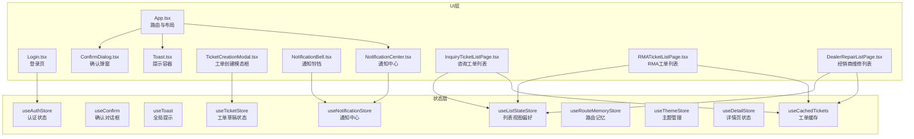

**图表来源**
- [App.tsx](file://client/src/App.tsx#L124-L125)
- [NotificationBell.tsx](file://client/src/components/Notifications/NotificationBell.tsx#L14-L14)
- [NotificationCenter.tsx](file://client/src/components/Notifications/NotificationCenter.tsx#L190-L200)
- [useNotificationStore.ts](file://client/src/store/useNotificationStore.ts#L48-L142)

## 核心组件
本节聚焦九个核心 Store 的数据结构、更新机制与订阅模型，以及它们在组件中的典型用法。

### useAuthStore：认证状态设计与持久化
- 数据结构：用户信息与令牌
- 更新机制：setAuth 写入本地存储并更新内存；logout 清空本地存储并重置状态
- 订阅模型：返回 user 与 token，组件可直接解构使用
- 典型用法：登录页调用 setAuth；App 路由守卫读取 user 判断访问权限；侧边栏等组件读取 token 发起受保护请求

**章节来源**
- [useAuthStore.ts](file://client/src/store/useAuthStore.ts#L1-L31)
- [Login.tsx](file://client/src/components/Login.tsx#L13-L27)
- [App.tsx](file://client/src/App.tsx#L129-L147)

### useConfirm：异步确认对话框
- 数据结构：对话框开关、标题、消息、按钮文案、Promise 解析器
- 更新机制：confirm 打开对话框并保存 resolve；close 触发 resolve 并清理状态
- 订阅模型：组件订阅 isOpen/title/message/confirm/close
- 典型用法：业务组件调用 confirm 获取布尔结果；ConfirmDialog 组件渲染并处理键盘事件

**章节来源**
- [useConfirm.ts](file://client/src/store/useConfirm.ts#L1-L37)
- [ConfirmDialog.tsx](file://client/src/components/ConfirmDialog.tsx#L6-L18)

### useToast：全局提示队列
- 数据结构：提示列表与自动隐藏定时器
- 更新机制：showToast 追加新提示并设置定时器自动移除；hideToast 可手动关闭
- 订阅模型：组件订阅 toasts 与 hideToast
- 典型用法：业务组件在关键操作后调用 showToast；Toast 容器渲染列表

**章节来源**
- [useToast.ts](file://client/src/store/useToast.ts#L1-L41)
- [Toast.tsx](file://client/src/components/Toast.tsx#L20-L42)

### useTicketStore：工单草稿状态管理
- 数据结构：模态框开关、工单类型、三种工单类型的草稿数据
- 更新机制：openModal 设置模态框状态和类型；updateDraft 合并草稿数据；clearDraft 清空指定类型草稿
- 订阅模型：组件订阅 isOpen/ticketType/drafts/openModal/updateDraft/clearDraft
- 典型用法：工单创建页面调用 openModal；TicketCreationModal 订阅草稿状态进行表单绑定

**章节来源**
- [useTicketStore.ts](file://client/src/store/useTicketStore.ts#L1-L68)
- [TicketCreationModal.tsx](file://client/src/components/Service/TicketCreationModal.tsx#L8-L11)

### useListStateStore：列表视图偏好管理
- 数据结构：三种工单类型的视图模式、折叠状态、滚动位置和过滤参数
- 更新机制：setViewMode/setSectionCollapsed/setScrollPosition/setFilters 等动作函数；支持持久化存储
- 订阅模型：组件订阅对应的状态和 getter 方法
- 典型用法：工单列表页面保存用户视图偏好；恢复滚动位置；保持过滤状态

**章节来源**
- [useListStateStore.ts](file://client/src/store/useListStateStore.ts#L1-L156)
- [InquiryTicketListPage.tsx](file://client/src/components/InquiryTickets/InquiryTicketListPage.tsx#L122-L131)
- [RMATicketListPage.tsx](file://client/src/components/RMATickets/RMATicketListPage.tsx#L127-L136)
- [DealerRepairListPage.tsx](file://client/src/components/DealerRepairs/DealerRepairListPage.tsx#L118-L127)

### useNotificationStore：通知中心状态管理
- 数据结构：通知列表、未读数量、按类型分类的未读数量、加载状态、面板开关
- 更新机制：addNotification 添加新通知；markAsRead 标记单个通知为已读；markAllAsRead 标记所有通知为已读；fetchNotifications 从 API 获取通知
- 订阅模型：组件订阅 notifications/unreadCount/isPanelOpen/fetchNotifications/markAsRead 等
- 典型用法：NotificationBell 显示未读数量；NotificationCenter 展示通知面板；支持点击跳转到相关页面

**更新** 新增通知状态管理 Store，提供完整的通知中心功能，包括未读计数、通知列表、标记已读等核心功能

**章节来源**
- [useNotificationStore.ts](file://client/src/store/useNotificationStore.ts#L1-L143)
- [NotificationBell.tsx](file://client/src/components/Notifications/NotificationBell.tsx#L14-L21)
- [NotificationCenter.tsx](file://client/src/components/Notifications/NotificationCenter.tsx#L190-L200)

### useRouteMemoryStore：路由记忆状态管理
- 数据结构：路由记忆映射、模块路径前缀列表
- 更新机制：saveRoute 保存列表页路由（排除详情页）；getRoute 获取记忆的路由或默认路由
- 订阅模型：组件订阅 saveRoute/getRoute 方法
- 典型用法：Sidebar 保存用户上次访问的列表页路由；导航时恢复用户的浏览位置

**更新** 新增路由记忆状态管理 Store，实现模块间路由状态保持，提升用户体验

**章节来源**
- [useRouteMemoryStore.ts](file://client/src/store/useRouteMemoryStore.ts#L1-L47)
- [App.tsx](file://client/src/App.tsx#L296-L301)

### useThemeStore：主题状态管理
- 数据结构：用户选择的主题、实际应用的主题、系统主题检测
- 更新机制：setTheme 设置用户偏好的主题；initTheme 初始化主题并监听系统主题变化
- 订阅模型：组件订阅 theme/actualTheme/setTheme/initTheme
- 典型用法：应用启动时初始化主题；用户切换主题时更新 DOM 属性

**更新** 新增主题状态管理 Store，支持明暗主题切换和系统偏好检测

**章节来源**
- [useThemeStore.ts](file://client/src/store/useThemeStore.ts#L1-L86)

### useDetailStore：详情页状态管理
- 数据结构：按账户 ID 分组的展开区域、联系人显示状态
- 更新机制：setExpandedSection 设置特定账户的展开区域；setShowAllContacts 控制联系人显示
- 订阅模型：组件订阅相关状态和 getter 方法
- 典型用法：详情页组件根据账户 ID 管理展开状态；支持多标签页独立状态

**更新** 新增详情页状态管理 Store，支持详情页的展开状态持久化

**章节来源**
- [useDetailStore.ts](file://client/src/store/useDetailStore.ts#L1-L42)

### useCachedTickets：工单列表缓存机制
- 数据结构：工单数据、分页元信息、加载状态、错误状态
- 更新机制：基于 SWR 的缓存机制，支持去重请求、后台重新验证、预取缓存
- 订阅模型：组件订阅 tickets/meta/isLoading/isValidating/error/refresh
- 典型用法：工单列表页面使用 SWR hook 获取缓存数据；支持参数变化时的即时导航体验

**章节来源**
- [useCachedTickets.ts](file://client/src/hooks/useCachedTickets.ts#L1-L136)
- [InquiryTicketListPage.tsx](file://client/src/components/InquiryTickets/InquiryTicketListPage.tsx#L89-L94)
- [RMATicketListPage.tsx](file://client/src/components/RMATickets/RMATicketListPage.tsx#L77-L86)
- [DealerRepairListPage.tsx](file://client/src/components/DealerRepairs/DealerRepairListPage.tsx#L66-L73)

## 架构总览
Zustand 在本项目中承担"轻量、直观、可组合"的状态中心角色。认证、确认、提示、工单草稿、列表状态、通知中心、路由记忆、主题管理和详情页状态九类全局状态分别由独立 Store 管理，既保证低耦合，又便于测试与复用。组件通过自定义 Hook 订阅所需字段，实现细粒度的 UI 更新。

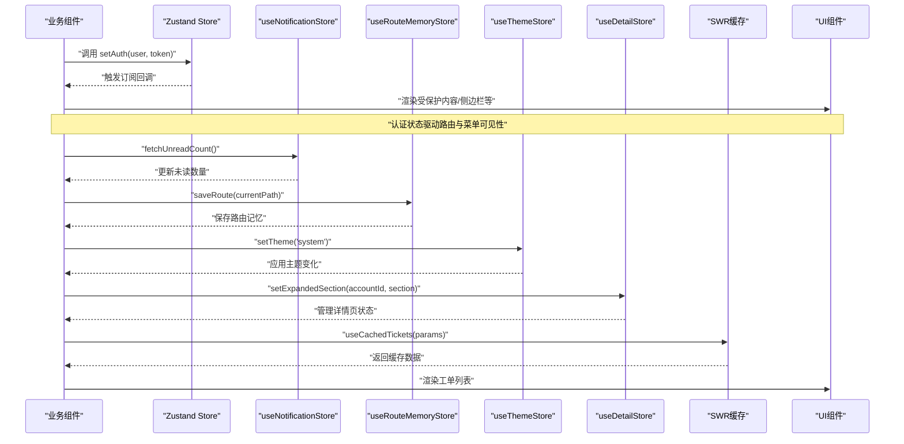

**图表来源**
- [useAuthStore.ts](file://client/src/store/useAuthStore.ts#L17-L30)
- [useNotificationStore.ts](file://client/src/store/useNotificationStore.ts#L125-L141)
- [useRouteMemoryStore.ts](file://client/src/store/useRouteMemoryStore.ts#L21-L40)
- [useThemeStore.ts](file://client/src/store/useThemeStore.ts#L33-L44)
- [useDetailStore.ts](file://client/src/store/useDetailStore.ts#L24-L35)
- [useCachedTickets.ts](file://client/src/hooks/useCachedTickets.ts#L73-L94)

## 详细组件分析

### useAuthStore：认证状态设计与持久化
- 设计要点
  - 将用户信息与令牌作为一组强关联状态，统一 setAuth 与 logout
  - 初始化时从本地存储读取，确保刷新后状态不丢失
  - 仅暴露必要字段与方法，避免过度导出内部细节
- 订阅与使用
  - 登录页：通过选择器提取 setAuth，提交成功后写入状态与本地存储
  - 路由守卫：读取 user 判断是否允许进入受保护路由
  - 侧边栏/统计：读取 token 发起受保护请求
- 章节来源
  - [useAuthStore.ts](file://client/src/store/useAuthStore.ts#L17-L30)
  - [Login.tsx](file://client/src/components/Login.tsx#L13-L27)
  - [App.tsx](file://client/src/App.tsx#L129-L147)

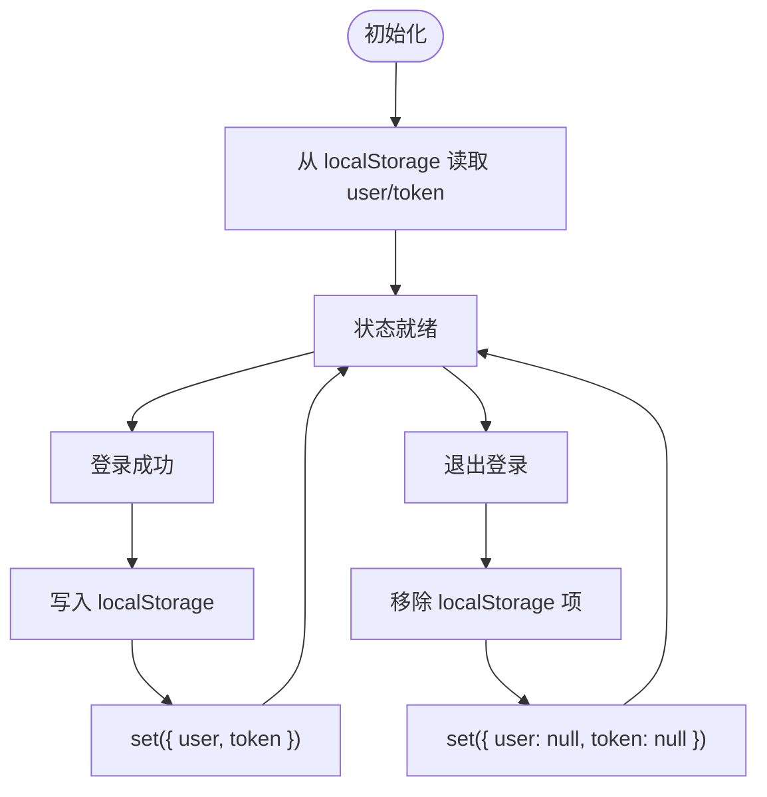

**图表来源**
- [useAuthStore.ts](file://client/src/store/useAuthStore.ts#L17-L30)

### useConfirm：异步确认对话框
- 设计要点
  - 将"打开对话框"与"等待用户选择"解耦：confirm 返回 Promise，close 触发 resolve
  - 通过 get() 获取当前 resolve，确保关闭时能正确回传值
  - 支持自定义标题、消息与按钮文案
- 订阅与使用
  - 业务组件：调用 confirm 获取布尔结果，执行后续逻辑
  - 对话框组件：订阅 isOpen/title/message/confirmLabel/cancelLabel，渲染 UI 并绑定键盘事件
- 章节来源
  - [useConfirm.ts](file://client/src/store/useConfirm.ts#L14-L36)
  - [ConfirmDialog.tsx](file://client/src/components/ConfirmDialog.tsx#L6-L18)

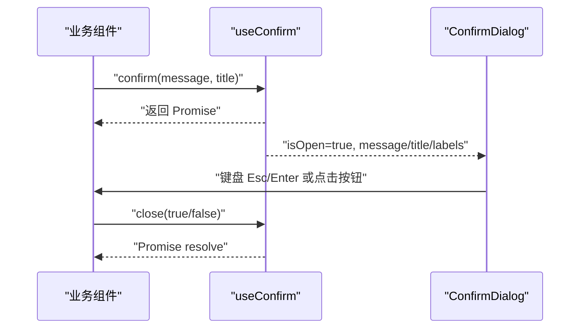

**图表来源**
- [useConfirm.ts](file://client/src/store/useConfirm.ts#L14-L36)
- [ConfirmDialog.tsx](file://client/src/components/ConfirmDialog.tsx#L6-L18)

### useToast：全局提示队列
- 设计要点
  - toasts 为数组，每条提示含唯一 id、消息与类型
  - showToast 追加提示并延时自动移除；hideToast 支持手动关闭
  - 类型映射与样式分离，便于主题化与国际化
- 订阅与使用
  - 业务组件：在关键操作后调用 showToast
  - Toast 容器：遍历渲染 toasts，支持手动关闭
- 章节来源
  - [useToast.ts](file://client/src/store/useToast.ts#L17-L40)
  - [Toast.tsx](file://client/src/components/Toast.tsx#L20-L42)

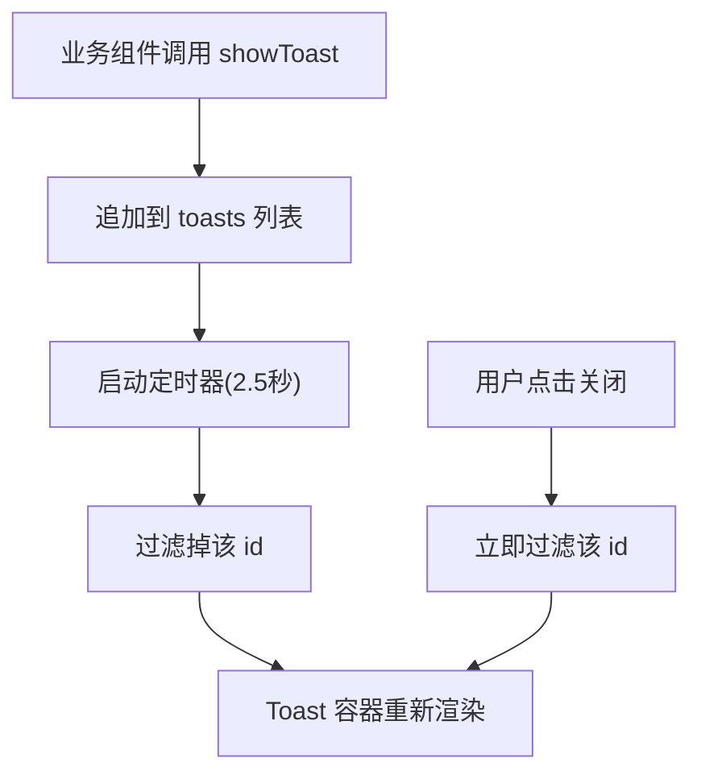

**图表来源**
- [useToast.ts](file://client/src/store/useToast.ts#L17-L40)
- [Toast.tsx](file://client/src/components/Toast.tsx#L20-L42)

### useTicketStore：工单草稿状态管理
- 设计要点
  - 支持三种工单类型：Inquiry（咨询）、RMA（退货）、DealerRepair（经销商维修）
  - 使用持久化中间件，自动保存草稿到 localStorage
  - 通过选择器模式实现细粒度订阅，避免不必要的重渲染
- 订阅与使用
  - 工单创建页面：调用 openModal(type) 打开工单类型
  - TicketCreationModal：订阅 isOpen/ticketType/drafts，实时更新表单状态
  - 表单提交：clearDraft(type) 清空草稿并重置模态框
- 章节来源
  - [useTicketStore.ts](file://client/src/store/useTicketStore.ts#L22-L67)
  - [TicketCreationModal.tsx](file://client/src/components/Service/TicketCreationModal.tsx#L8-L11)

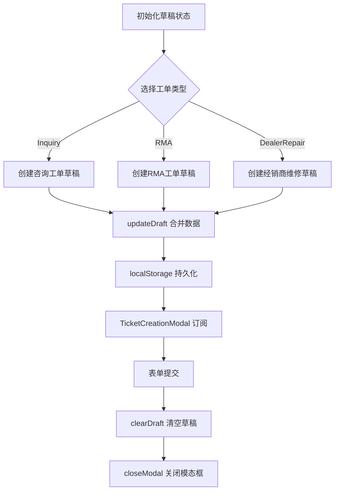

**图表来源**
- [useTicketStore.ts](file://client/src/store/useTicketStore.ts#L40-L67)
- [TicketCreationModal.tsx](file://client/src/components/Service/TicketCreationModal.tsx#L39-L99)

### useListStateStore：列表视图偏好管理
- 设计要点
  - 专为工单列表设计的视图偏好管理 Store
  - 支持三种工单类型：Inquiry、RMA、DealerRepair
  - 管理视图模式（分组/平铺）、折叠状态、滚动位置和过滤参数
  - 使用持久化中间件，自动保存用户偏好到 localStorage
  - 提供 getter 方法 isInquirySectionCollapsed/isRmaSectionCollapsed/isDealerSectionCollapsed
- 订阅与使用
  - 工单列表页面：订阅视图模式、折叠状态、滚动位置和过滤参数
  - 保存用户操作：toggleViewMode、setSectionCollapsed、setScrollPosition、setFilters
  - 恢复状态：组件挂载时自动恢复用户的视图偏好

**章节来源**
- [useListStateStore.ts](file://client/src/store/useListStateStore.ts#L1-L156)
- [InquiryTicketListPage.tsx](file://client/src/components/InquiryTickets/InquiryTicketListPage.tsx#L122-L131)
- [RMATicketListPage.tsx](file://client/src/components/RMATickets/RMATicketListPage.tsx#L127-L136)
- [DealerRepairListPage.tsx](file://client/src/components/DealerRepairs/DealerRepairListPage.tsx#L118-L127)

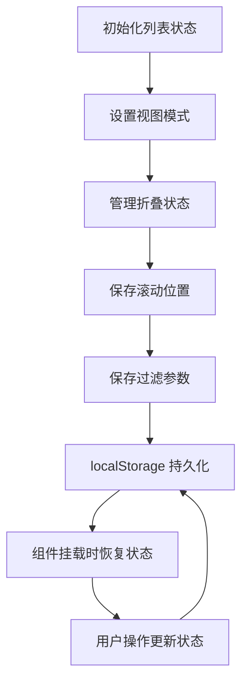

**图表来源**
- [useListStateStore.ts](file://client/src/store/useListStateStore.ts#L66-L155)

### useNotificationStore：通知中心状态管理
- 设计要点
  - 支持多种通知类型：mention、assignment、status_change、sla_warning、sla_breach、new_comment、participant_added、snooze_expired、system_announce
  - 提供完整的通知生命周期管理：添加、标记已读、批量标记、获取未读计数
  - 支持通知面板的打开/关闭和加载状态管理
  - 与后端 API 无缝集成，支持实时通知更新
- 订阅与使用
  - NotificationBell：显示未读通知数量，支持定时轮询
  - NotificationCenter：展示通知列表，支持点击跳转和标记已读
  - 通知类型图标映射和颜色分类，提供良好的视觉反馈
- **更新** 新增通知状态管理 Store，提供完整的通知中心功能

**章节来源**
- [useNotificationStore.ts](file://client/src/store/useNotificationStore.ts#L1-L143)
- [NotificationBell.tsx](file://client/src/components/Notifications/NotificationBell.tsx#L14-L21)
- [NotificationCenter.tsx](file://client/src/components/Notifications/NotificationCenter.tsx#L190-L200)

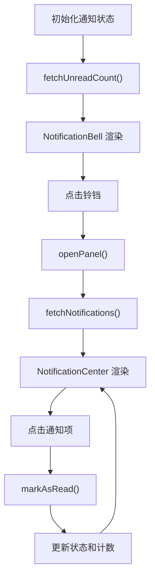

**图表来源**
- [useNotificationStore.ts](file://client/src/store/useNotificationStore.ts#L107-L141)
- [NotificationBell.tsx](file://client/src/components/Notifications/NotificationBell.tsx#L16-L21)
- [NotificationCenter.tsx](file://client/src/components/Notifications/NotificationCenter.tsx#L204-L234)

### useRouteMemoryStore：路由记忆状态管理
- 设计要点
  - 仅保存列表页路由（排除详情页），避免保存具体的记录 ID
  - 支持多个模块的记忆：服务工单、RMA 工单、经销商维修、客户管理
  - 使用正则表达式精确识别详情页（以数字结尾的路径）
  - 通过持久化中间件实现跨会话的状态保持
- 订阅与使用
  - Sidebar：在路由变化时自动保存当前列表页路由
  - 导航：根据当前模块获取记忆的路由或默认路由
  - 提升用户体验：用户回到模块时恢复到上次浏览的位置
- **更新** 新增路由记忆状态管理 Store，实现模块间路由状态保持

**章节来源**
- [useRouteMemoryStore.ts](file://client/src/store/useRouteMemoryStore.ts#L1-L47)
- [App.tsx](file://client/src/App.tsx#L296-L301)

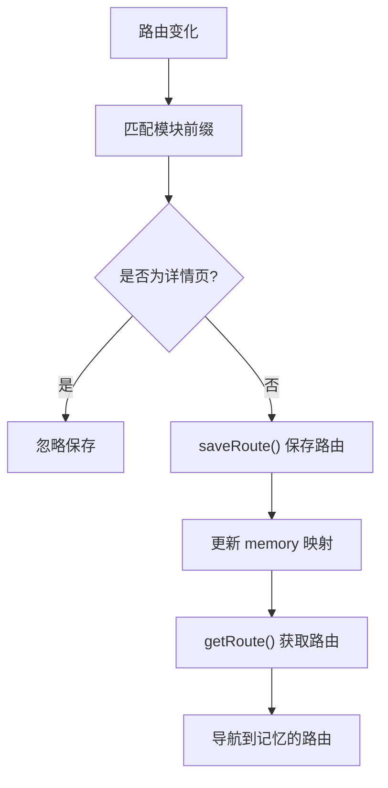

**图表来源**
- [useRouteMemoryStore.ts](file://client/src/store/useRouteMemoryStore.ts#L21-L40)

### useThemeStore：主题状态管理
- 设计要点
  - 支持三种主题模式：light（明亮）、dark（黑暗）、system（系统）
  - 当选择 system 时，动态监听系统主题变化并自动更新
  - 使用 DOM 属性而非 CSS 类来应用主题，兼容性强
  - 仅持久化用户偏好的主题设置，不持久化实际应用的主题
- 订阅与使用
  - 应用启动：initTheme 初始化主题并设置系统监听器
  - 用户操作：setTheme 更新主题设置并应用到 DOM
  - 系统变化：监听 prefers-color-scheme 媒体查询变化
- **更新** 新增主题状态管理 Store，支持明暗主题切换和系统偏好检测

**章节来源**
- [useThemeStore.ts](file://client/src/store/useThemeStore.ts#L1-L86)

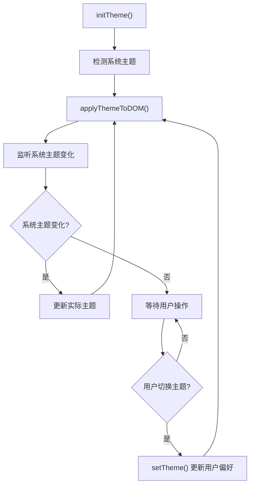

**图表来源**
- [useThemeStore.ts](file://client/src/store/useThemeStore.ts#L39-L66)

### useDetailStore：详情页状态管理
- 设计要点
  - 按账户 ID 分组管理详情页状态，支持多标签页独立状态
  - 管理展开的区域（section）和联系人显示状态（showAllContacts）
  - 使用持久化中间件，确保状态在页面刷新后仍然有效
  - 提供 getter 方法简化状态读取操作
- 订阅与使用
  - 详情页组件：根据 accountId 设置和获取展开状态
  - 多标签页：不同账户 ID 的状态相互独立
  - 用户体验：展开状态在导航和刷新后保持不变
- **更新** 新增详情页状态管理 Store，支持详情页的展开状态持久化

**章节来源**
- [useDetailStore.ts](file://client/src/store/useDetailStore.ts#L1-L42)

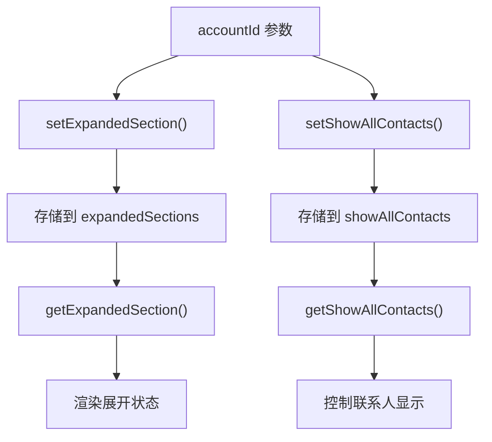

**图表来源**
- [useDetailStore.ts](file://client/src/store/useDetailStore.ts#L24-L35)

### useCachedTickets：工单列表缓存机制
- 设计要点
  - 基于 SWR 的缓存机制，支持去重请求（默认2秒内去重）
  - keepPreviousData 保持旧数据，实现即时导航体验
  - 支持预取缓存（prefetchTickets）和缓存失效（invalidateTicketCache）
  - 自动重新验证（revalidateOnFocus/revalidateOnReconnect）
- 订阅与使用
  - 工单列表页面：useCachedTickets('inquiry'|'rma'|'dealer', params)
  - 实时响应：isLoading（首次加载）、isValidating（后台重新验证）
  - 高效更新：支持参数变化时的快速切换，无需全屏加载
- 章节来源
  - [useCachedTickets.ts](file://client/src/hooks/useCachedTickets.ts#L46-L95)
  - [InquiryTicketListPage.tsx](file://client/src/components/InquiryTickets/InquiryTicketListPage.tsx#L89-L94)

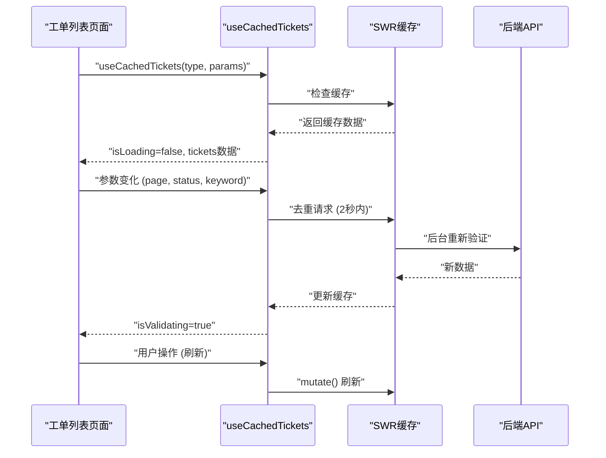

**图表来源**
- [useCachedTickets.ts](file://client/src/hooks/useCachedTickets.ts#L73-L94)
- [InquiryTicketListPage.tsx](file://client/src/components/InquiryTickets/InquiryTicketListPage.tsx#L89-L94)

### App.tsx：全局状态与布局集成
- 全局挂载
  - 在路由外层挂载 Toast 与 ConfirmDialog，确保全站可用
  - 在 MainLayout 中挂载 TicketCreationModal 和 NotificationCenter，提供全局工单创建和通知入口
- 路由守卫
  - 通过 useAuthStore 的 user 判断是否渲染受保护布局
  - 集成 useRouteMemoryStore 实现路由记忆功能
- 章节来源
  - [App.tsx](file://client/src/App.tsx#L121-L127)

### Login.tsx：认证 Store 的典型用法
- 通过选择器提取 setAuth，提交登录后写入状态
- 章节来源
  - [Login.tsx](file://client/src/components/Login.tsx#L13-L27)

### ConfirmDialog.tsx：确认对话框组件
- 订阅 useConfirm 的 isOpen/title/message/confirmLabel/cancelLabel/close
- 键盘事件监听 Esc/Enter 触发关闭
- 章节来源
  - [ConfirmDialog.tsx](file://client/src/components/ConfirmDialog.tsx#L6-L18)

### Toast.tsx：提示容器组件
- 订阅 useToast 的 toasts 与 hideToast
- 渲染提示列表并支持手动关闭
- 章节来源
  - [Toast.tsx](file://client/src/components/Toast.tsx#L20-L42)

### TicketCreationModal.tsx：工单创建模态框
- 订阅 useTicketStore 的 isOpen/ticketType/drafts/openModal/updateDraft/clearDraft
- 订阅 useAuthStore 的 token，发起受保护的 API 请求
- 支持三种工单类型的表单渲染和数据提交
- 章节来源
  - [TicketCreationModal.tsx](file://client/src/components/Service/TicketCreationModal.tsx#L8-L11)

### NotificationBell.tsx：通知铃铛组件
- 订阅 useNotificationStore 的 unreadCount/fetchUnreadCount/togglePanel
- 定时轮询未读通知数量（30秒间隔）
- 支持点击打开通知中心面板
- **更新** 新增通知铃铛组件，提供通知入口和未读计数显示

**章节来源**
- [NotificationBell.tsx](file://client/src/components/Notifications/NotificationBell.tsx#L14-L21)

### NotificationCenter.tsx：通知中心面板
- 订阅 useNotificationStore 的 notifications/unreadCount/isPanelOpen/fetchNotifications/markAsRead/markAllAsRead/closePanel
- 支持点击外部区域关闭、标记单个/全部通知为已读
- 根据通知类型显示不同的图标和颜色
- **更新** 新增通知中心面板组件，提供完整的通知管理界面

**章节来源**
- [NotificationCenter.tsx](file://client/src/components/Notifications/NotificationCenter.tsx#L190-L200)

### 工单列表页面中的使用示例
- 咨询工单列表：使用 useCachedTickets 获取缓存数据，支持时间范围、产品范围、关键词搜索和状态过滤；使用 useListStateStore 保存视图偏好
- RMA 工单列表：使用 useCachedTickets 获取缓存数据，支持状态和渠道过滤；使用 useListStateStore 保存视图偏好
- 经销商维修列表：使用 useCachedTickets 获取缓存数据，支持状态过滤；使用 useListStateStore 保存视图偏好
- 所有页面均支持即时导航体验，无全屏加载闪烁

**章节来源**
- [InquiryTicketListPage.tsx](file://client/src/components/InquiryTickets/InquiryTicketListPage.tsx#L122-L131)
- [RMATicketListPage.tsx](file://client/src/components/RMATickets/RMATicketListPage.tsx#L127-L136)
- [DealerRepairListPage.tsx](file://client/src/components/DealerRepairs/DealerRepairListPage.tsx#L118-L127)

### UI 组件的响应式设计和可访问性增强
- KineSelect：自定义选择器组件，支持键盘导航、焦点管理和无障碍标签
- CustomDatePicker：自定义日期选择器，提供月视图、键盘快捷键和屏幕阅读器支持
- SortDropdown：排序下拉框，支持图标指示器、键盘操作和视觉反馈
- CollapsibleSection：可折叠区域组件，支持动画过渡、键盘展开/收起和语义化标记

**章节来源**
- [KineSelect.tsx](file://client/src/components/UI/KineSelect.tsx#L1-L103)
- [CustomDatePicker.tsx](file://client/src/components/UI/CustomDatePicker.tsx#L1-L109)
- [SortDropdown.tsx](file://client/src/components/UI/SortDropdown.tsx#L1-L129)

## 依赖关系分析
- Zustand 版本：5.0.9
- SWR 版本：2.0.0+（用于缓存机制）
- 依赖关系图

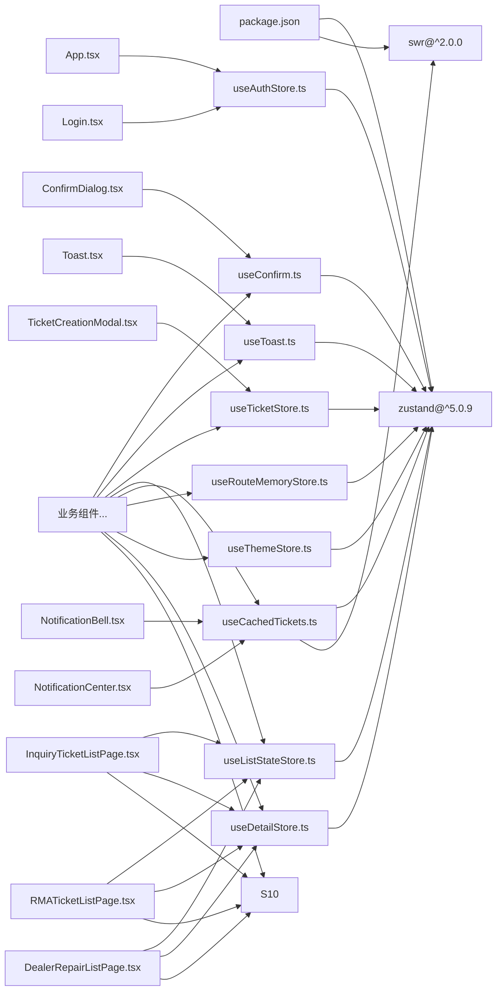

**图表来源**
- [package.json](file://client/package.json#L28-L28)
- [useAuthStore.ts](file://client/src/store/useAuthStore.ts#L1-L1)
- [useConfirm.ts](file://client/src/store/useConfirm.ts#L1-L1)
- [useToast.ts](file://client/src/store/useToast.ts#L1-L1)
- [useTicketStore.ts](file://client/src/store/useTicketStore.ts#L1-L1)
- [useListStateStore.ts](file://client/src/store/useListStateStore.ts#L1-L1)
- [useNotificationStore.ts](file://client/src/store/useNotificationStore.ts#L1-L1)
- [useRouteMemoryStore.ts](file://client/src/store/useRouteMemoryStore.ts#L1-L1)
- [useThemeStore.ts](file://client/src/store/useThemeStore.ts#L1-L1)
- [useDetailStore.ts](file://client/src/store/useDetailStore.ts#L1-L1)
- [useCachedTickets.ts](file://client/src/hooks/useCachedTickets.ts#L1-L1)

## 性能考量
- 订阅粒度
  - 使用选择器式订阅，仅订阅需要的字段，避免不必要的重渲染
  - 示例：登录页仅订阅 setAuth，不订阅整个状态对象
- 状态规模
  - 九个 Store 均为轻量数据结构，适合全局共享
  - 通知状态可能较大，但通过分页加载和懒加载优化
- 渲染优化
  - Toast 容器仅在 toasts 非空时渲染
  - ConfirmDialog 仅在 isOpen 为真时渲染
  - TicketCreationModal 仅在 isOpen 为真时渲染
  - NotificationCenter 仅在 isPanelOpen 为真时渲染
  - 列表组件仅在相关状态变化时重新渲染
- 缓存优化
  - useCachedTickets 使用 SWR 缓存，支持去重请求（2秒内）
  - keepPreviousData 保持旧数据，实现即时导航体验
  - 支持预取缓存（prefetchTickets）提升用户体验
  - useListStateStore 使用持久化中间件，减少重复计算
  - useNotificationStore 使用分页加载，限制单次请求通知数量
- 计时器与副作用
  - useToast 的定时器在组件卸载时未显式清理，建议在组件卸载时清理定时器，防止内存泄漏
  - NotificationBell 的轮询定时器会在组件卸载时自动清理
- 复杂度分析
  - 认证与确认：O(1) 写入与读取
  - 提示：追加 O(1)，自动移除 O(n)（n 为当前提示数）
  - 工单草稿：O(1) 写入与读取，支持持久化
  - 列表状态：O(1) 写入与读取，支持持久化
  - 工单缓存：查询 O(1)，更新 O(n)（n 为缓存条目数）
  - 通知状态：添加 O(1)，标记已读 O(n)，批量标记 O(n)
  - 路由记忆：O(1) 写入与读取，支持持久化
  - 主题切换：O(1) 写入与读取，DOM 操作 O(1)
  - 详情页状态：O(1) 写入与读取，支持持久化

**章节来源**
- [Login.tsx](file://client/src/components/Login.tsx#L13-L13)
- [Toast.tsx](file://client/src/components/Toast.tsx#L20-L23)
- [ConfirmDialog.tsx](file://client/src/components/ConfirmDialog.tsx#L6-L20)
- [NotificationBell.tsx](file://client/src/components/Notifications/NotificationBell.tsx#L16-L21)
- [useListStateStore.ts](file://client/src/store/useListStateStore.ts#L66-L155)
- [useNotificationStore.ts](file://client/src/store/useNotificationStore.ts#L57-L141)
- [useCachedTickets.ts](file://client/src/hooks/useCachedTickets.ts#L76-L83)

## 故障排查指南
- 登录后仍跳转至登录页
  - 检查 useAuthStore 是否正确 setAuth，并确认 App 路由守卫对 user 的判断条件
- 无法打开确认对话框
  - 检查业务组件是否调用了 confirm，确认对话框组件是否被挂载
- 提示不消失或重复出现
  - 检查 showToast 的 id 生成与定时器逻辑；确认是否存在多个相同消息同时存在的情况
- 工单草稿无法保存
  - 检查 useTicketStore 的持久化配置，确认 localStorage 是否正常工作
- 列表视图偏好不生效
  - 检查 useListStateStore 的状态更新函数是否正确调用
  - 确认组件是否正确订阅了相应的状态
- 工单列表数据不更新
  - 检查 useCachedTickets 的缓存失效机制，确认是否需要调用 invalidateTicketCache
- 工单创建失败
  - 检查 TicketCreationModal 是否正确订阅 useTicketStore，确认 token 是否有效
- 令牌失效导致受保护接口报错
  - 确保侧边栏/统计等组件使用 useAuthStore 的 token 发起请求
- **新增** 通知未显示或未更新
  - 检查 useNotificationStore 的 fetchUnreadCount 是否正常执行
  - 确认 NotificationBell 的定时轮询是否正常工作
  - 检查后端通知 API 是否返回正确的数据格式
- **新增** 路由记忆功能异常
  - 检查 useRouteMemoryStore 的 saveRoute 是否正确保存路由
  - 确认 MEMORIZED_PATHS 配置是否包含目标模块
  - 检查正则表达式是否正确识别详情页
- **新增** 主题切换无效
  - 检查 useThemeStore 的 setTheme 是否正确调用
  - 确认 DOM 属性是否正确应用到 html 元素
  - 检查系统主题监听器是否正常工作
- **新增** 详情页状态丢失
  - 检查 useDetailStore 的持久化配置
  - 确认 accountId 参数是否正确传递
  - 检查多标签页状态隔离是否正常

**章节来源**
- [useAuthStore.ts](file://client/src/store/useAuthStore.ts#L17-L30)
- [useConfirm.ts](file://client/src/store/useConfirm.ts#L14-L36)
- [useToast.ts](file://client/src/store/useToast.ts#L17-L40)
- [useTicketStore.ts](file://client/src/store/useTicketStore.ts#L40-L67)
- [useListStateStore.ts](file://client/src/store/useListStateStore.ts#L66-L155)
- [useNotificationStore.ts](file://client/src/store/useNotificationStore.ts#L62-L99)
- [useRouteMemoryStore.ts](file://client/src/store/useRouteMemoryStore.ts#L21-L40)
- [useThemeStore.ts](file://client/src/store/useThemeStore.ts#L33-L66)
- [useDetailStore.ts](file://client/src/store/useDetailStore.ts#L24-L35)
- [useCachedTickets.ts](file://client/src/hooks/useCachedTickets.ts#L127-L135)

## 结论
本项目以 Zustand 为核心，采用"小而美"的 Store 设计，将认证、确认、提示、工单草稿、列表状态、通知中心、路由记忆、主题管理和详情页状态九大全局状态清晰分离，配合自定义 Hook 实现跨组件共享与一致的用户体验。新增的 useNotificationStore、useRouteMemoryStore、useThemeStore 和 useDetailStore 等 Store 进一步完善了 P2 架构升级的状态管理能力，提供了更丰富的功能和更好的用户体验。通过选择器订阅、组件级挂载与轻量数据结构，系统在易用性与性能之间取得良好平衡。建议后续在组件卸载时完善定时器清理，并考虑引入更完善的日志与调试工具以提升可观测性。

## 附录
- 最佳实践清单
  - 使用选择器订阅，避免订阅整块状态
  - 将副作用（如网络请求、定时器）集中在 Store 或自定义 Hook 中
  - 对于全局 UI 组件（Toast、ConfirmDialog、TicketCreationModal、NotificationCenter）统一挂载于根组件
  - 为关键操作提供明确的提示与确认
  - 对于需要持久化的状态，优先考虑 localStorage/sessionStorage，注意序列化与类型安全
  - 使用 SWR 缓存机制优化列表数据的获取和更新
  - **新增** 为复杂的视图状态提供专门的 Store 进行管理
  - **新增** 重视 UI 组件的可访问性和响应式设计
  - **新增** 实现通知状态的分页加载和懒加载优化
  - **新增** 使用媒体查询监听系统主题变化
  - **新增** 实现路由记忆功能，提升用户体验
- 扩展与自定义 Hook 设计思路
  - 若需跨页面共享复杂状态，可拆分为更细粒度的 Store 或组合多个小 Store
  - 自定义 Hook 可封装"读取 + 更新 + 副作用"的完整流程，降低组件复杂度
  - 对于需要持久化的状态，优先考虑 localStorage/sessionStorage，注意序列化与类型安全
  - 考虑引入状态快照和回滚机制，提升用户体验
  - **新增** 为特定领域的状态管理提供专门的 Store，如列表状态、表格状态、通知状态等
  - **新增** 重视组件的可访问性设计，提供键盘导航和屏幕阅读器支持
  - **新增** 实现状态的分页加载和无限滚动优化
  - **新增** 使用媒体查询和事件监听器实现响应式状态管理