# 用户管理系统

<cite>
**本文档引用的文件**
- [client/src/components/Admin/UserManagement.tsx](file://client/src/components/Admin/UserManagement.tsx)
- [client/src/components/UserManagement.tsx](file://client/src/components/UserManagement.tsx)
- [server/index.js](file://server/index.js)
- [server/service/routes/auth.js](file://server/service/routes/auth.js)
- [server/service/middleware/permission.js](file://server/service/middleware/permission.js)
- [server/service/migrations/022_users_enhancement.sql](file://server/service/migrations/022_users_enhancement.sql)
- [server/service/migrations/023_migrate_user_roles.js](file://server/service/migrations/023_migrate_user_roles.js)
- [client/src/store/useAuthStore.ts](file://client/src/store/useAuthStore.ts)
- [server/service/routes/accounts.js](file://server/service/routes/accounts.js)
- [server/service/routes/departments.js](file://server/service/routes/departments.js)
</cite>

## 更新摘要
**变更内容**
- 新增高级搜索功能，支持姓名、用户名、部门的智能搜索
- 实现多维度排序功能，支持按姓名、部门、角色、加入时间排序
- 增强部门筛选功能，支持按部门代码(MS/OP/RD/GE)精确筛选
- 完善角色管理功能，支持管理员和部门主管的角色权限控制
- 引入动态权限管理，支持细粒度的文件夹访问控制
- 新增用户生命周期管理，支持启用/禁用和删除操作
- 优化用户界面交互，提供更好的用户体验

## 目录
1. [简介](#简介)
2. [项目结构](#项目结构)
3. [核心组件](#核心组件)
4. [架构概览](#架构概览)
5. [详细组件分析](#详细组件分析)
6. [高级功能特性](#高级功能特性)
7. [依赖关系分析](#依赖关系分析)
8. [性能考虑](#性能考虑)
9. [故障排除指南](#故障排除指南)
10. [结论](#结论)

## 简介

用户管理系统是 Longhorn 产品套件中的核心模块，负责管理所有系统用户、权限控制和部门组织结构。该系统采用前后端分离架构，前端使用 React + TypeScript，后端基于 Node.js 和 SQLite 数据库。

系统支持多层级权限模型，包括管理员(Admin)、执行官(Exec)、部门主管(Lead)和普通成员(Member)，以及特殊用户类型如经销商(Dealer)和客户(Customer)。通过穿透式权限中间件实现最小权限原则，确保用户只能访问与其工作相关的数据。

**更新** 系统现已大幅增强，支持高级搜索、排序、角色管理、部门控制等高级功能，为用户提供更精细的用户生命周期管理能力。

## 项目结构

Longhorn 项目采用模块化架构，用户管理系统主要分布在以下目录：

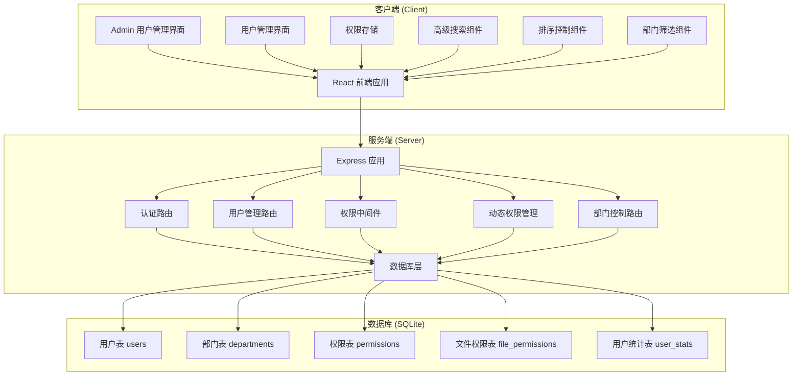

**图表来源**
- [server/index.js](file://server/index.js#L1562-L1669)
- [client/src/components/Admin/UserManagement.tsx](file://client/src/components/Admin/UserManagement.tsx#L1-L1197)

**章节来源**
- [server/index.js](file://server/index.js#L1-L5188)
- [client/src/components/Admin/UserManagement.tsx](file://client/src/components/Admin/UserManagement.tsx#L1-L1197)

## 核心组件

### 用户管理界面组件

系统提供了两个主要的用户管理界面，分别针对不同用户群体：

#### 管理员用户管理界面
- **路径**: `client/src/components/Admin/UserManagement.tsx`
- **功能**: 完整的用户管理功能，包括用户创建、编辑、禁用启用等
- **权限控制**: Admin 和 Exec 用户可管理所有用户
- **部门过滤**: 支持按部门代码(MS/OP/RD/GE)过滤用户
- **高级搜索**: 支持姓名、用户名、部门的智能搜索
- **多维排序**: 支持按姓名、部门、角色、加入时间排序

#### 普通用户管理界面  
- **路径**: `client/src/components/UserManagement.tsx`
- **功能**: 基础用户信息查看和权限管理
- **权限控制**: 支持动态权限授予和撤销
- **文件夹权限**: 支持细粒度的文件夹访问控制
- **权限浏览器**: 提供文件夹权限的可视化管理

### 服务器端架构

#### 用户管理路由
- **路径**: `server/index.js` (用户相关路由)
- **功能**: 提供完整的 CRUD 操作接口
- **权限验证**: 基于角色的访问控制
- **动态权限**: 支持动态权限的增删改查

#### 认证系统
- **路径**: `server/service/routes/auth.js`
- **功能**: 统一的登录认证机制
- **支持类型**: 员工、经销商、客户三类用户
- **权限构建**: 根据用户类型和角色构建权限数组

**章节来源**
- [client/src/components/Admin/UserManagement.tsx](file://client/src/components/Admin/UserManagement.tsx#L83-L1197)
- [client/src/components/UserManagement.tsx](file://client/src/components/UserManagement.tsx#L129-L895)
- [server/index.js](file://server/index.js#L1562-L1716)

## 架构概览

用户管理系统采用分层架构设计，实现了清晰的关注点分离：

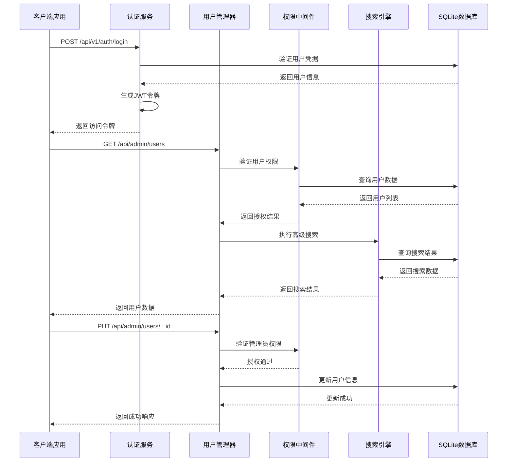

**图表来源**
- [server/service/routes/auth.js](file://server/service/routes/auth.js#L21-L103)
- [server/index.js](file://server/index.js#L1578-L1669)
- [server/service/middleware/permission.js](file://server/service/middleware/permission.js#L107-L118)

### 权限模型设计

系统实现了基于角色的权限控制(RBAC)和穿透式权限访问相结合的安全模型：

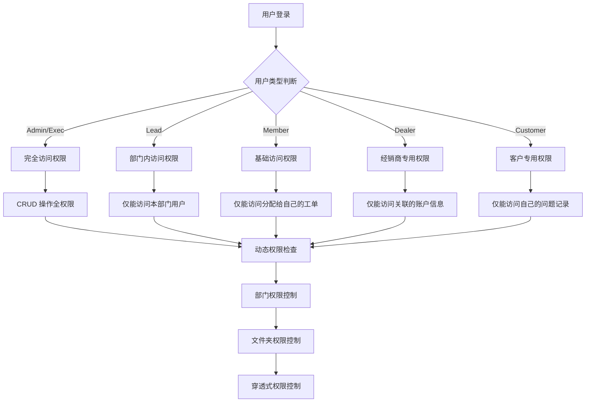

**图表来源**
- [server/service/routes/auth.js](file://server/service/routes/auth.js#L213-L278)
- [server/service/middleware/permission.js](file://server/service/middleware/permission.js#L34-L44)

**章节来源**
- [server/service/routes/auth.js](file://server/service/routes/auth.js#L1-L282)
- [server/service/middleware/permission.js](file://server/service/middleware/permission.js#L1-L232)

## 详细组件分析

### 用户数据模型

系统采用标准化的用户数据模型，支持多种用户类型和角色：

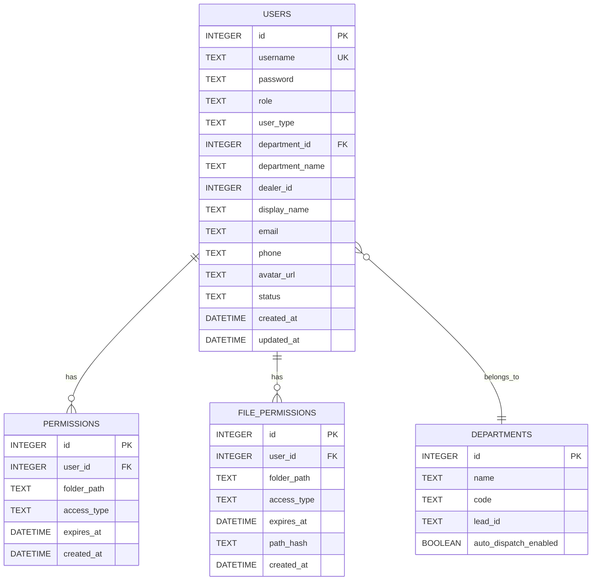

**图表来源**
- [server/index.js](file://server/index.js#L107-L131)
- [server/service/migrations/022_users_enhancement.sql](file://server/service/migrations/022_users_enhancement.sql#L1-L13)

#### 用户角色定义

系统支持以下用户角色和权限级别：

| 角色 | 权限范围 | 功能限制 | 新增功能 |
|------|----------|----------|----------|
| Admin | 系统完全控制 | 所有用户管理、系统配置 | 完整的用户生命周期管理 |
| Exec | 高级管理权限 | 除系统核心外的完全控制 | 部门统计和分析 |
| Lead | 部门管理权限 | 仅能管理本部门用户 | 部门内用户管理 |
| Member | 基础用户权限 | 查看和处理分配给自己的任务 | 个人空间管理 |
| Dealer | 经销商用户 | 仅能访问关联的账户信息 | 经销商专属功能 |
| Customer | 客户用户 | 仅能访问自己的问题记录 | 客户自助服务 |

#### 用户类型分类

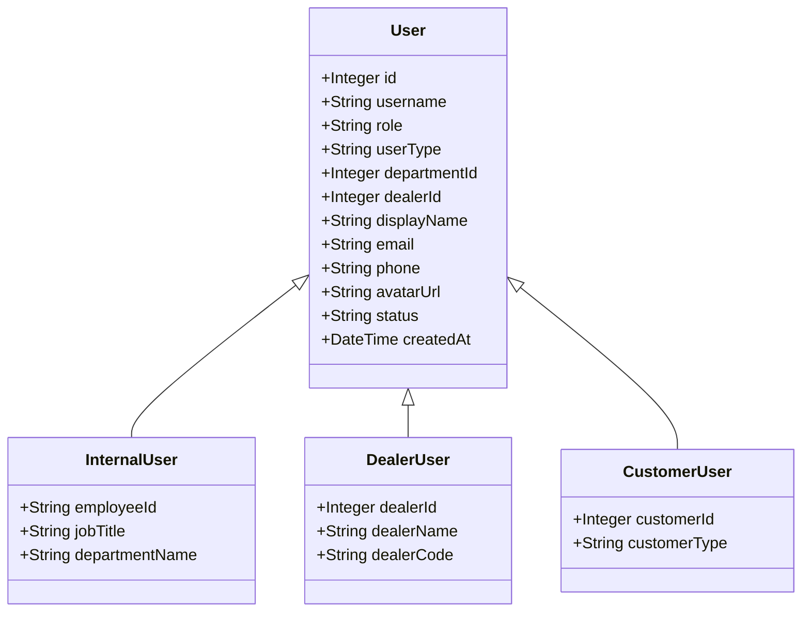

**图表来源**
- [client/src/store/useAuthStore.ts](file://client/src/store/useAuthStore.ts#L3-L14)
- [server/service/routes/auth.js](file://server/service/routes/auth.js#L213-L278)

**章节来源**
- [server/index.js](file://server/index.js#L107-L131)
- [client/src/store/useAuthStore.ts](file://client/src/store/useAuthStore.ts#L1-L37)

### 权限管理机制

#### 动态文件权限系统

系统实现了细粒度的文件夹访问控制：

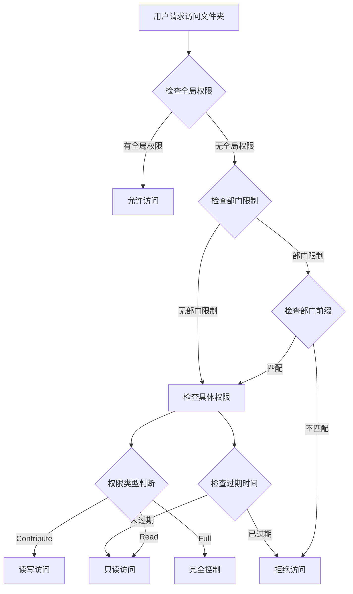

**图表来源**
- [client/src/components/UserManagement.tsx](file://client/src/components/UserManagement.tsx#L279-L313)
- [server/index.js](file://server/index.js#L1664-L1669)

#### 部门权限控制

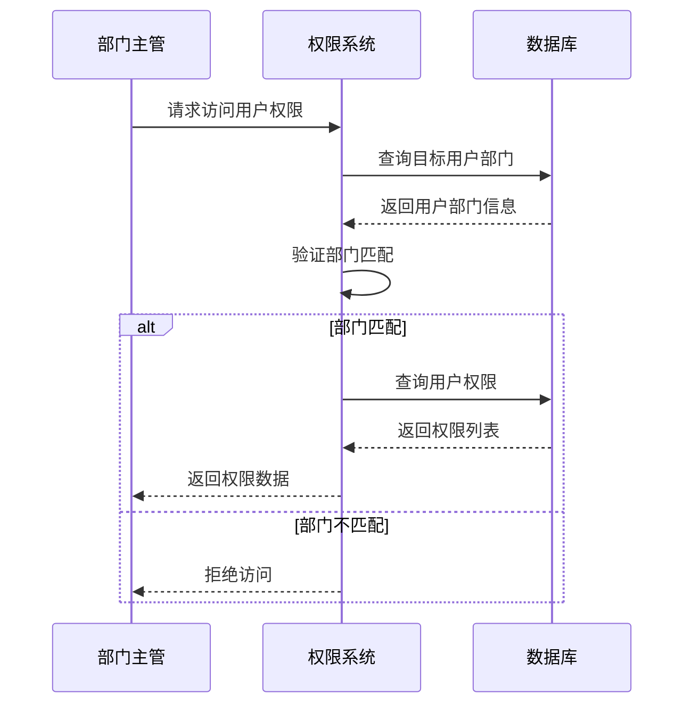

**图表来源**
- [server/index.js](file://server/index.js#L1664-L1669)
- [server/service/middleware/permission.js](file://server/service/middleware/permission.js#L535-L538)

**章节来源**
- [client/src/components/UserManagement.tsx](file://client/src/components/UserManagement.tsx#L279-L313)
- [server/index.js](file://server/index.js#L1664-L1669)

### 数据迁移和演进

系统通过迁移脚本实现用户数据结构的演进：

#### 用户表增强迁移

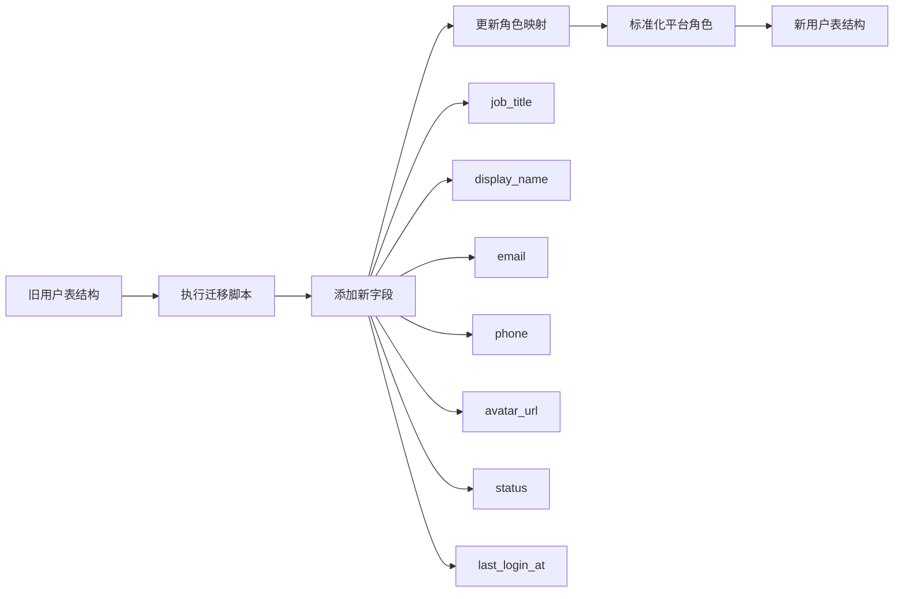

**图表来源**
- [server/service/migrations/022_users_enhancement.sql](file://server/service/migrations/022_users_enhancement.sql#L1-L13)
- [server/service/migrations/023_migrate_user_roles.js](file://server/service/migrations/023_migrate_user_roles.js#L23-L30)

**章节来源**
- [server/service/migrations/022_users_enhancement.sql](file://server/service/migrations/022_users_enhancement.sql#L1-L13)
- [server/service/migrations/023_migrate_user_roles.js](file://server/service/migrations/023_migrate_user_roles.js#L1-L95)

## 高级功能特性

### 高级搜索功能

系统实现了智能的用户搜索功能，支持多维度搜索：

#### 搜索功能实现
- **搜索字段**: 支持按姓名(display_name)、用户名(username)、部门名称(department_name)搜索
- **模糊匹配**: 支持大小写不敏感的模糊匹配
- **实时搜索**: 提供展开式搜索框，支持实时搜索结果
- **搜索优化**: 通过useMemo优化搜索性能

#### 搜索界面设计
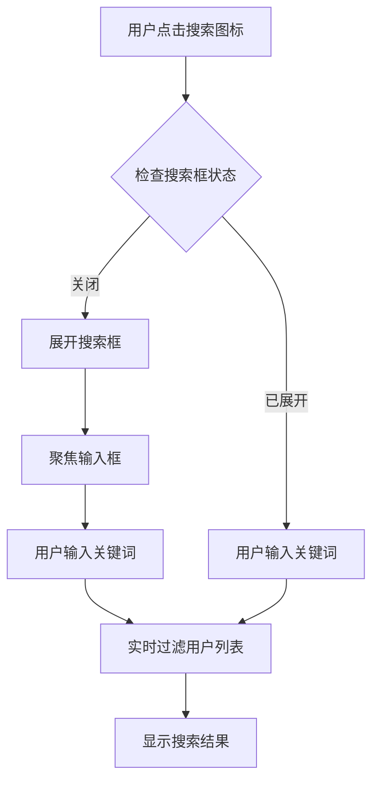

**图表来源**
- [client/src/components/Admin/UserManagement.tsx](file://client/src/components/Admin/UserManagement.tsx#L680-L736)
- [client/src/components/Admin/UserManagement.tsx](file://client/src/components/Admin/UserManagement.tsx#L620-L664)

### 多维排序功能

系统支持对用户列表进行多维度排序：

#### 排序字段
- **姓名排序**: 支持按display_name升序/降序排序
- **部门排序**: 支持按department_name升序/降序排序
- **角色排序**: 支持按role升序/降序排序
- **时间排序**: 支持按created_at升序/降序排序

#### 排序界面设计
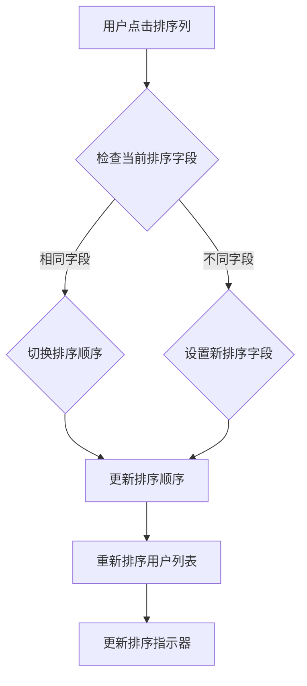

**图表来源**
- [client/src/components/Admin/UserManagement.tsx](file://client/src/components/Admin/UserManagement.tsx#L604-L608)
- [client/src/components/Admin/UserManagement.tsx](file://client/src/components/Admin/UserManagement.tsx#L879-L926)

### 部门筛选功能

系统提供了灵活的部门筛选机制：

#### 部门标签系统
- **部门代码**: 支持MS(市场部)、OP(运营部)、RD(研发部)、GE(通用台面)
- **智能筛选**: 自动识别用户所在部门并提供筛选选项
- **权限控制**: Lead用户只能看到本部门的筛选选项

#### 部门筛选界面
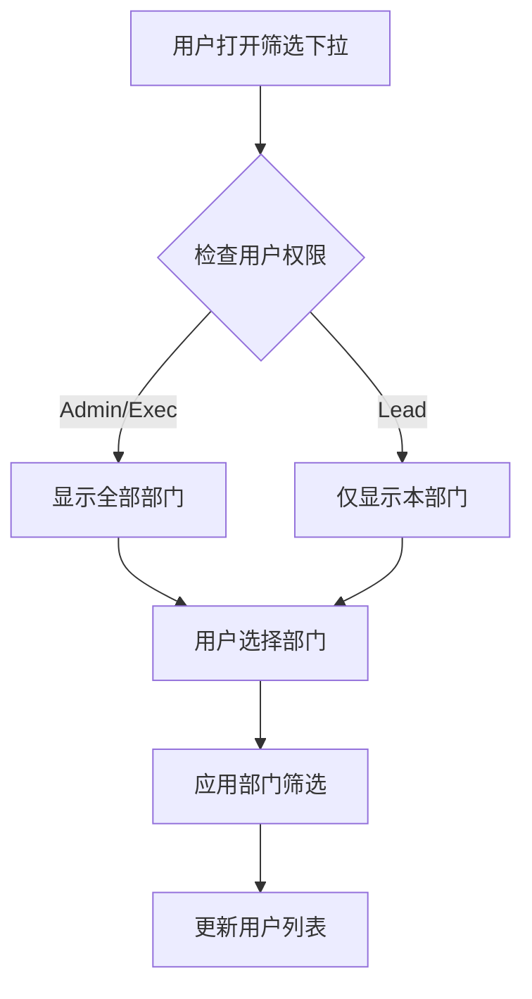

**图表来源**
- [client/src/components/Admin/UserManagement.tsx](file://client/src/components/Admin/UserManagement.tsx#L742-L820)
- [client/src/components/Admin/UserManagement.tsx](file://client/src/components/Admin/UserManagement.tsx#L611-L617)

### 用户生命周期管理

系统提供了完整的用户生命周期管理功能：

#### 用户状态管理
- **启用/禁用**: 支持用户账户的启用和禁用操作
- **删除功能**: 支持删除用户账户(仅限禁用状态)
- **安全确认**: 采用倒计时确认机制防止误操作

#### 用户状态界面
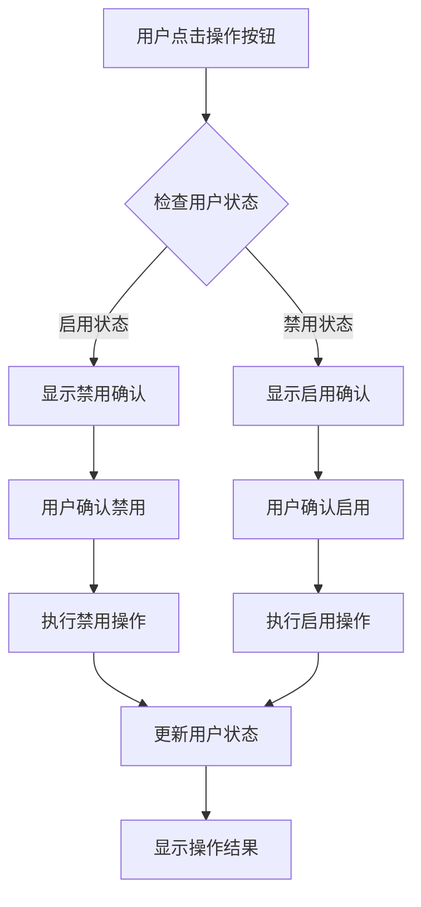

**图表来源**
- [client/src/components/Admin/UserManagement.tsx](file://client/src/components/Admin/UserManagement.tsx#L987-L1022)
- [client/src/components/Admin/UserManagement.tsx](file://client/src/components/Admin/UserManagement.tsx#L557-L578)

### 动态权限管理

系统实现了细粒度的动态权限控制系统：

#### 权限类型
- **只读权限**: Read - 仅允许查看文件夹内容
- **贡献权限**: Contribute - 允许读写文件夹内容
- **完全权限**: Full - 允许完全控制文件夹

#### 权限有效期
- **7天期限**: 默认权限有效期7天
- **1个月期限**: 可选择1个月权限有效期
- **永久权限**: 可设置永久有效权限
- **自定义日期**: 支持选择具体的过期日期

#### 权限管理界面
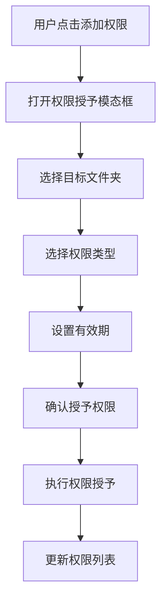

**图表来源**
- [client/src/components/UserManagement.tsx](file://client/src/components/UserManagement.tsx#L674-L807)
- [server/index.js](file://server/index.js#L1683-L1716)

**章节来源**
- [client/src/components/Admin/UserManagement.tsx](file://client/src/components/Admin/UserManagement.tsx#L448-L664)
- [client/src/components/UserManagement.tsx](file://client/src/components/UserManagement.tsx#L187-L301)
- [server/index.js](file://server/index.js#L1683-L1716)

## 依赖关系分析

### 技术栈依赖

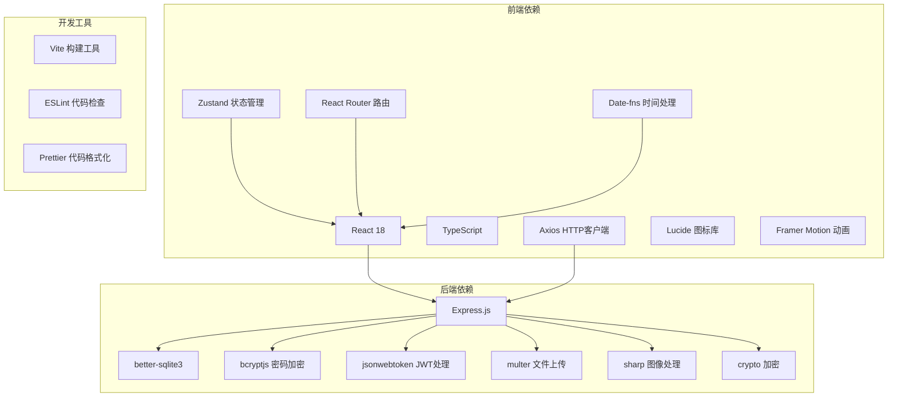

### 数据流依赖

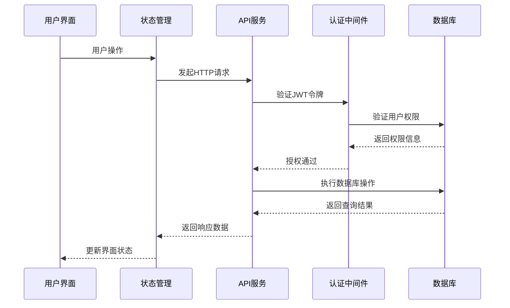

**图表来源**
- [client/src/store/useAuthStore.ts](file://client/src/store/useAuthStore.ts#L23-L36)
- [server/service/middleware/permission.js](file://server/service/middleware/permission.js#L222-L231)

**章节来源**
- [client/src/store/useAuthStore.ts](file://client/src/store/useAuthStore.ts#L1-L37)
- [server/service/middleware/permission.js](file://server/service/middleware/permission.js#L1-L232)

## 性能考虑

### 数据库优化策略

1. **索引优化**: 在用户表上建立了多个索引以提高查询性能
2. **连接池管理**: 使用 SQLite 的 WAL 模式提高并发性能
3. **查询优化**: 实现了分页查询和条件过滤减少数据传输
4. **搜索优化**: 使用useMemo和useCallback优化搜索性能

### 前端性能优化

1. **状态管理**: 使用 Zustand 实现轻量级状态管理
2. **组件优化**: 实现了虚拟滚动和懒加载
3. **缓存策略**: 本地存储用户认证信息减少重复登录
4. **渲染优化**: 使用React.memo和useMemo避免不必要的重渲染

### 安全性能平衡

1. **JWT 令牌**: 使用短期有效的访问令牌和长期刷新令牌
2. **权限检查**: 在服务端进行严格的权限验证
3. **SQL 注入防护**: 使用参数化查询防止注入攻击
4. **权限缓存**: 实现权限缓存减少重复验证

## 故障排除指南

### 常见问题诊断

#### 用户权限问题
- **症状**: 用户无法访问某些功能或数据
- **排查步骤**: 
  1. 检查用户角色和部门信息
  2. 验证穿透式权限是否生效
  3. 确认部门前缀匹配情况

#### 登录认证问题
- **症状**: 用户无法登录或频繁掉线
- **排查步骤**:
  1. 检查 JWT 令牌有效期
  2. 验证密码哈希是否正确
  3. 确认用户状态是否正常

#### 数据同步问题
- **症状**: 用户信息更新后不生效
- **排查步骤**:
  1. 检查数据库迁移是否完成
  2. 验证用户表结构是否正确
  3. 确认权限缓存是否更新

#### 搜索功能问题
- **症状**: 搜索结果不准确或无响应
- **排查步骤**:
  1. 检查搜索关键词是否正确
  2. 验证搜索索引是否完整
  3. 确认搜索权限是否正确

#### 权限管理问题
- **症状**: 权限授予后不生效
- **排查步骤**:
  1. 检查权限类型和有效期设置
  2. 验证文件夹路径是否正确
  3. 确认权限过期时间设置

**章节来源**
- [server/service/middleware/permission.js](file://server/service/middleware/permission.js#L107-L118)
- [server/service/routes/auth.js](file://server/service/routes/auth.js#L96-L102)

## 结论

Longhorn 用户管理系统通过精心设计的架构和严格的权限控制，为复杂的多用户环境提供了可靠的基础支撑。系统的主要优势包括：

1. **灵活的权限模型**: 支持多层级权限控制和动态权限管理
2. **安全的认证机制**: 统一的登录认证和穿透式权限验证
3. **可扩展的数据模型**: 支持用户类型的演进和扩展
4. **高效的性能设计**: 通过索引优化和缓存策略提升用户体验
5. **高级功能特性**: 支持高级搜索、排序、角色管理、部门控制等增强功能
6. **精细的用户管理**: 提供完整的用户生命周期管理能力

**更新** 本次重大增强使系统具备了企业级用户管理的所有关键能力，包括：
- 智能搜索和多维排序功能
- 精细化的部门和角色管理
- 动态权限控制系统
- 完整的用户生命周期管理
- 更好的用户体验和安全性

未来可以考虑的改进方向：
- 增加审计日志功能
- 实现更细粒度的权限控制
- 优化大规模用户的管理体验
- 增强移动端适配能力
- 添加用户行为分析功能

该系统为 Longhorn 产品的整体功能提供了坚实的用户管理基础，支持从简单到复杂的各种使用场景需求。