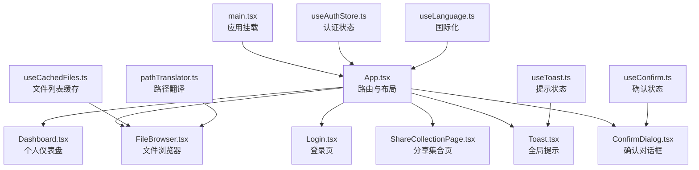
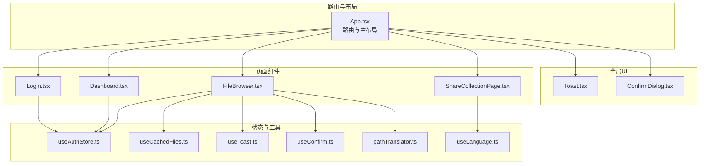
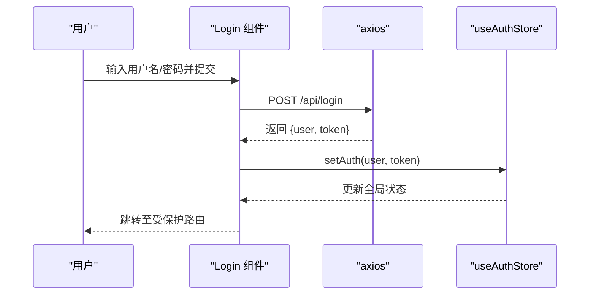
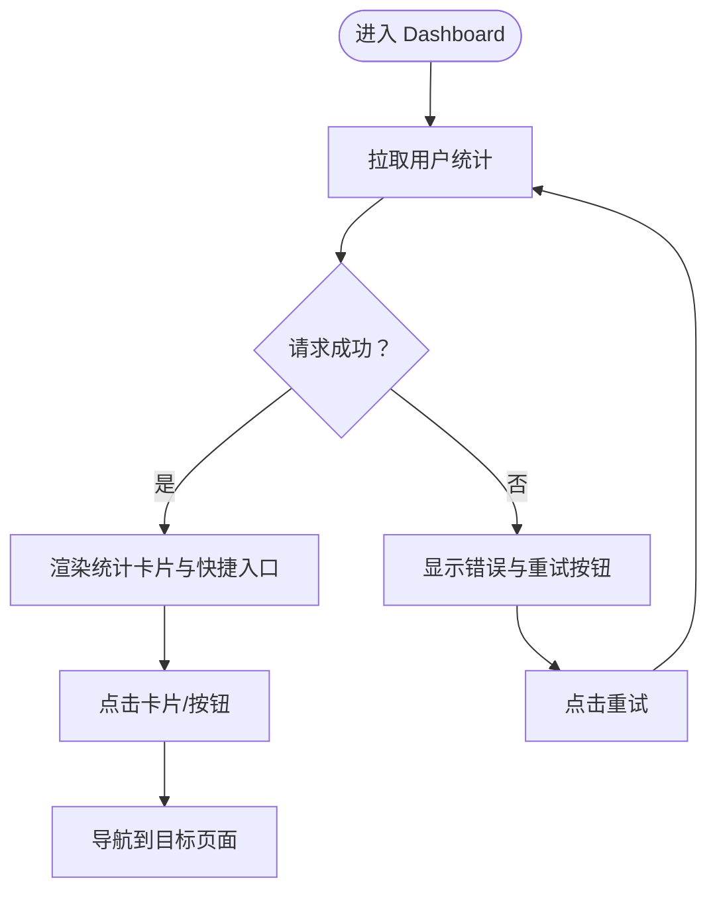
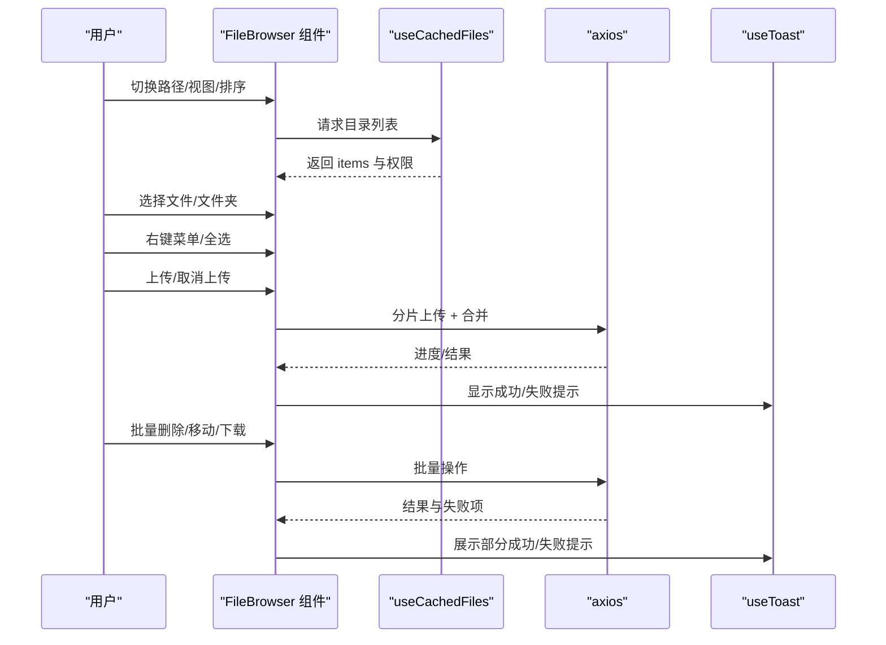
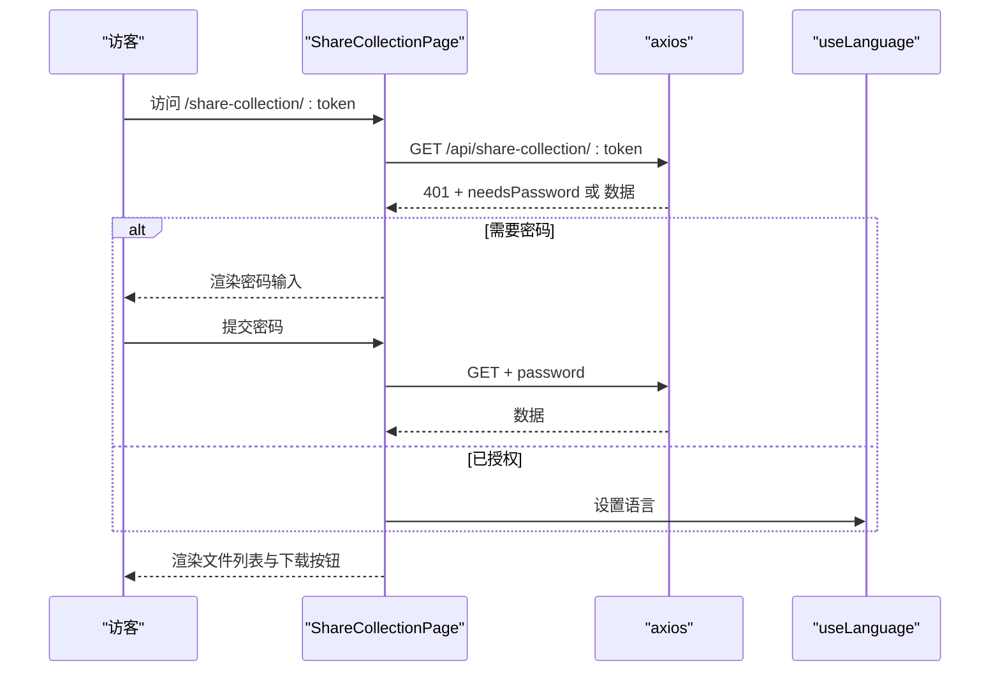
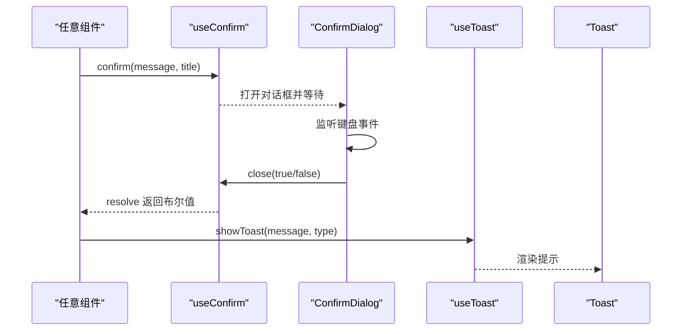
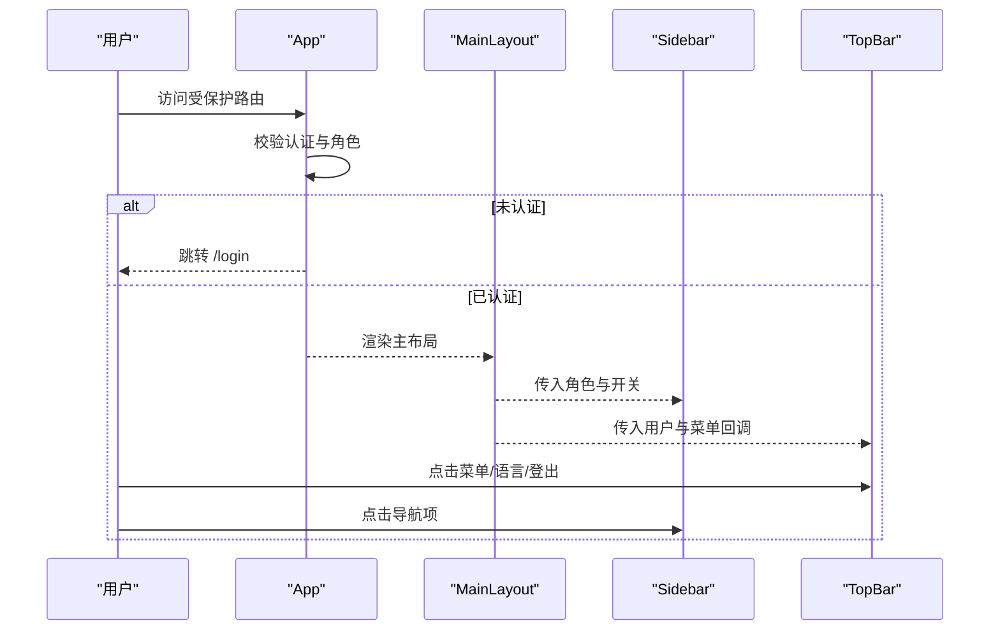
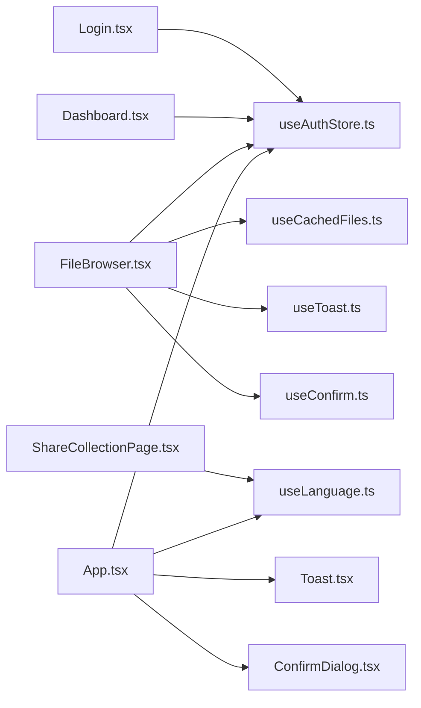

# 组件设计模式

<cite>
**本文引用的文件**
- [App.tsx](file://client/src/App.tsx)
- [main.tsx](file://client/src/main.tsx)
- [Dashboard.tsx](file://client/src/components/Dashboard.tsx)
- [Login.tsx](file://client/src/components/Login.tsx)
- [FileBrowser.tsx](file://client/src/components/FileBrowser.tsx)
- [useAuthStore.ts](file://client/src/store/useAuthStore.ts)
- [useCachedFiles.ts](file://client/src/hooks/useCachedFiles.ts)
- [Toast.tsx](file://client/src/components/Toast.tsx)
- [ConfirmDialog.tsx](file://client/src/components/ConfirmDialog.tsx)
- [ShareCollectionPage.tsx](file://client/src/components/ShareCollectionPage.tsx)
- [ShareResultModal.tsx](file://client/src/components/ShareResultModal.tsx)
- [useLanguage.ts](file://client/src/i18n/useLanguage.ts)
- [useToast.ts](file://client/src/store/useToast.ts)
- [useConfirm.ts](file://client/src/store/useConfirm.ts)
- [pathTranslator.ts](file://client/src/utils/pathTranslator.ts)
</cite>

## 目录
1. [引言](#引言)
2. [项目结构](#项目结构)
3. [核心组件](#核心组件)
4. [架构总览](#架构总览)
5. [详细组件分析](#详细组件分析)
6. [依赖关系分析](#依赖关系分析)
7. [性能考量](#性能考量)
8. [故障排查指南](#故障排查指南)
9. [结论](#结论)
10. [附录](#附录)

## 引言
本文件系统性梳理 Longhorn 前端在 React 19 下的组件设计模式与架构实践，重点覆盖函数组件设计、Props 传递机制、组件组合策略、组件间通信与事件处理、生命周期管理、复用与可扩展性、性能优化以及最佳实践与常见问题。文档以 Dashboard、FileBrowser、Login 等核心组件为主线，结合状态管理（Zustand）、数据缓存（SWR）、国际化（自研 Hook）等基础设施，给出可操作的建议与图示。

## 项目结构
前端采用按功能域分层的组织方式：页面级路由入口位于应用根组件中，通过路由表分发到各功能页面；页面内部再由多个可复用的业务组件协作完成视图渲染与交互。状态管理与工具函数分别置于 store 与 hooks、utils 目录，形成清晰的职责边界。

图表来源
- [main.tsx](file://client/src/main.tsx#L1-L11)
- [App.tsx](file://client/src/App.tsx#L66-L126)
- [Dashboard.tsx](file://client/src/components/Dashboard.tsx#L29-L378)
- [FileBrowser.tsx](file://client/src/components/FileBrowser.tsx#L72-L800)
- [Login.tsx](file://client/src/components/Login.tsx#L7-L161)
- [ShareCollectionPage.tsx](file://client/src/components/ShareCollectionPage.tsx#L31-L324)
- [Toast.tsx](file://client/src/components/Toast.tsx#L20-L45)
- [ConfirmDialog.tsx](file://client/src/components/ConfirmDialog.tsx#L6-L126)
- [useAuthStore.ts](file://client/src/store/useAuthStore.ts#L17-L31)
- [useCachedFiles.ts](file://client/src/hooks/useCachedFiles.ts#L40-L102)
- [useLanguage.ts](file://client/src/i18n/useLanguage.ts#L30-L59)
- [useToast.ts](file://client/src/store/useToast.ts#L17-L41)
- [useConfirm.ts](file://client/src/store/useConfirm.ts#L14-L37)
- [pathTranslator.ts](file://client/src/utils/pathTranslator.ts#L14-L53)

章节来源
- [main.tsx](file://client/src/main.tsx#L1-L11)
- [App.tsx](file://client/src/App.tsx#L66-L126)

## 核心组件
- 应用入口与路由布局
  - 入口文件负责创建根节点并启用严格模式。
  - 根组件负责路由配置、公共与受保护路由划分、主布局包装与全局提示/确认对话框挂载。
- 登录组件
  - 负责用户凭据收集、调用后端登录接口、设置认证状态并触发路由跳转。
- 仪表盘组件
  - 展示用户统计信息、配额使用情况、账户信息与快捷入口，支持重试加载。
- 文件浏览器组件
  - 支持网格/列表视图、排序、预览、上传（分片）、批量操作、分享、收藏、访问统计等。
- 分享集合页
  - 面向外部链接的只读浏览界面，支持密码解锁、语言切换、批量下载。
- 全局提示与确认对话框
  - 通过独立状态存储与渲染组件实现跨组件的消息与交互确认。

章节来源
- [main.tsx](file://client/src/main.tsx#L6-L10)
- [App.tsx](file://client/src/App.tsx#L66-L126)
- [Login.tsx](file://client/src/components/Login.tsx#L7-L161)
- [Dashboard.tsx](file://client/src/components/Dashboard.tsx#L29-L378)
- [FileBrowser.tsx](file://client/src/components/FileBrowser.tsx#L72-L800)
- [ShareCollectionPage.tsx](file://client/src/components/ShareCollectionPage.tsx#L31-L324)
- [Toast.tsx](file://client/src/components/Toast.tsx#L20-L45)
- [ConfirmDialog.tsx](file://client/src/components/ConfirmDialog.tsx#L6-L126)

## 架构总览
Longhorn 前端采用“路由驱动 + 函数组件 + 状态库 + 缓存库”的组合架构：
- 路由层：BrowserRouter + Routes + 路由守卫（基于认证状态与角色）
- 视图层：函数组件按功能拆分，通过 Props 向下传递数据与回调
- 状态层：Zustand 管理认证、提示、确认等跨组件状态
- 数据层：SWR 提供文件列表缓存、去重与刷新策略
- 国际化：自研 Hook 暴露 t 函数与语言切换，内部维护订阅者集合

图表来源
- [App.tsx](file://client/src/App.tsx#L66-L126)
- [Login.tsx](file://client/src/components/Login.tsx#L7-L161)
- [Dashboard.tsx](file://client/src/components/Dashboard.tsx#L29-L378)
- [FileBrowser.tsx](file://client/src/components/FileBrowser.tsx#L72-L800)
- [ShareCollectionPage.tsx](file://client/src/components/ShareCollectionPage.tsx#L31-L324)
- [useAuthStore.ts](file://client/src/store/useAuthStore.ts#L17-L31)
- [useCachedFiles.ts](file://client/src/hooks/useCachedFiles.ts#L40-L102)
- [useToast.ts](file://client/src/store/useToast.ts#L17-L41)
- [useConfirm.ts](file://client/src/store/useConfirm.ts#L14-L37)
- [useLanguage.ts](file://client/src/i18n/useLanguage.ts#L30-L59)
- [pathTranslator.ts](file://client/src/utils/pathTranslator.ts#L14-L53)
- [Toast.tsx](file://client/src/components/Toast.tsx#L20-L45)
- [ConfirmDialog.tsx](file://client/src/components/ConfirmDialog.tsx#L6-L126)

## 详细组件分析

### 登录组件 Login 设计与实现
- 设计要点
  - 使用表单受控输入，提交时调用登录接口，成功后写入本地存储并更新全局认证状态。
  - 错误处理统一通过状态展示，避免异常冒泡。
- Props 与状态
  - 外部依赖：国际化 Hook、认证 Store 的 setAuth 方法。
  - 内部状态：用户名/密码、错误消息、加载状态。
- 生命周期
  - 表单提交时触发副作用；无额外副作用钩子。
- 事件处理
  - 表单提交、输入变更、按钮点击。
- 可复用性
  - 作为独立页面组件，可直接被路由挂载；若需复用可抽象为受控表单片段。

图表来源
- [Login.tsx](file://client/src/components/Login.tsx#L15-L27)
- [useAuthStore.ts](file://client/src/store/useAuthStore.ts#L20-L24)

章节来源
- [Login.tsx](file://client/src/components/Login.tsx#L7-L161)
- [useAuthStore.ts](file://client/src/store/useAuthStore.ts#L17-L31)

### 仪表盘组件 Dashboard 设计与实现
- 设计要点
  - 加载态、错误态、成功态三态渲染；统计卡片点击跳转到对应空间或列表。
  - 使用日期格式化与国际化语言环境。
- Props 与状态
  - 外部依赖：认证 Store、国际化 Hook、路由导航。
  - 内部状态：统计数据、加载/错误标志。
- 生命周期
  - 首次挂载拉取数据；错误时提供重试按钮。
- 事件处理
  - 卡片点击、重试按钮点击。
- 性能与可扩展性
  - 将配额计算与格式化抽离为纯函数，便于测试与复用。

图表来源
- [Dashboard.tsx](file://client/src/components/Dashboard.tsx#L37-L55)
- [Dashboard.tsx](file://client/src/components/Dashboard.tsx#L65-L97)
- [Dashboard.tsx](file://client/src/components/Dashboard.tsx#L101-L374)

章节来源
- [Dashboard.tsx](file://client/src/components/Dashboard.tsx#L29-L378)

### 文件浏览器组件 FileBrowser 设计与实现
- 设计要点
  - 支持多种视图模式、排序、预览（图片/视频/PDF/DOCX/XLSX/TXT 等）、上传（分片 + 进度 + 速率）、批量操作（移动/删除/下载）、分享（单个/批量）、收藏、访问统计。
  - 使用 SWR 缓存目录列表，配合预取提升导航体验。
- Props 与状态
  - 外部依赖：认证 Store、Toast、Confirm、语言、缓存 Hook。
  - 内部状态：当前路径、视图模式、排序键/序、预览项、菜单锚点、上传进度、批量选择、分享参数等。
- 生命周期
  - 监听键盘 Esc 关闭预览/模态；监听鼠标点击外部关闭上下文菜单；根据路径变化清理选择。
- 事件处理
  - 文件/文件夹点击、右键菜单、全选/逐项选择、上传/取消、删除/移动/下载、分享、收藏、回退等。
- 性能与可扩展性
  - 分片上传避免大文件阻塞；SWR 去重与轮询；预取子目录缓存；懒加载缩略图；按需渲染复杂预览内容。

图表来源
- [FileBrowser.tsx](file://client/src/components/FileBrowser.tsx#L96-L102)
- [FileBrowser.tsx](file://client/src/components/FileBrowser.tsx#L340-L449)
- [FileBrowser.tsx](file://client/src/components/FileBrowser.tsx#L536-L598)
- [useCachedFiles.ts](file://client/src/hooks/useCachedFiles.ts#L40-L86)
- [useToast.ts](file://client/src/store/useToast.ts#L17-L41)

章节来源
- [FileBrowser.tsx](file://client/src/components/FileBrowser.tsx#L72-L800)
- [useCachedFiles.ts](file://client/src/hooks/useCachedFiles.ts#L40-L102)
- [useToast.ts](file://client/src/store/useToast.ts#L17-L41)

### 分享集合页 ShareCollectionPage 设计与实现
- 设计要点
  - 外链只读浏览，支持密码解锁、语言切换、批量下载。
  - 从 URL 参数解析 token，按需请求数据并设置初始语言。
- Props 与状态
  - 外部依赖：国际化 Hook。
  - 内部状态：加载、错误、是否需要密码、密码值、数据。
- 生命周期
  - 首次挂载拉取分享集合；若返回需要密码则进入密码输入流程。
- 事件处理
  - 密码提交、下载全部、语言切换。

图表来源
- [ShareCollectionPage.tsx](file://client/src/components/ShareCollectionPage.tsx#L42-L69)
- [ShareCollectionPage.tsx](file://client/src/components/ShareCollectionPage.tsx#L97-L134)
- [ShareCollectionPage.tsx](file://client/src/components/ShareCollectionPage.tsx#L138-L321)

章节来源
- [ShareCollectionPage.tsx](file://client/src/components/ShareCollectionPage.tsx#L31-L324)

### 全局提示与确认对话框
- 设计要点
  - 通过独立状态存储与渲染组件实现跨组件通知与确认。
  - 支持键盘 Esc/Enter 快捷键。
- 交互流程
  - 组件内部监听键盘事件；通过状态存储的 resolve 回调返回布尔值。

图表来源
- [ConfirmDialog.tsx](file://client/src/components/ConfirmDialog.tsx#L10-L18)
- [ConfirmDialog.tsx](file://client/src/components/ConfirmDialog.tsx#L20-L125)
- [useConfirm.ts](file://client/src/store/useConfirm.ts#L19-L35)
- [Toast.tsx](file://client/src/components/Toast.tsx#L20-L45)
- [useToast.ts](file://client/src/store/useToast.ts#L17-L41)

章节来源
- [ConfirmDialog.tsx](file://client/src/components/ConfirmDialog.tsx#L6-L126)
- [useConfirm.ts](file://client/src/store/useConfirm.ts#L14-L37)
- [Toast.tsx](file://client/src/components/Toast.tsx#L20-L45)
- [useToast.ts](file://client/src/store/useToast.ts#L17-L41)

### 路由与布局（App、MainLayout、Sidebar、TopBar）
- 设计要点
  - 主布局封装侧边栏、顶部栏与内容区 Outlet；侧边栏根据用户角色与可访问部门动态生成导航项。
  - 顶部栏集成搜索、用户信息、语言切换、统计卡片与登出。
  - 路由守卫根据认证状态与角色决定渲染主布局或登录页。
- 事件处理
  - 侧边栏菜单点击、顶部栏菜单点击、下拉菜单点击外部关闭、语言切换、登出。
- 可复用性
  - 通过 Props 注入 user、onMenuClick 等，使布局组件可在不同页面复用。

图表来源
- [App.tsx](file://client/src/App.tsx#L78-L120)
- [App.tsx](file://client/src/App.tsx#L38-L64)
- [App.tsx](file://client/src/App.tsx#L128-L268)
- [App.tsx](file://client/src/App.tsx#L349-L616)

章节来源
- [App.tsx](file://client/src/App.tsx#L38-L126)
- [App.tsx](file://client/src/App.tsx#L128-L268)
- [App.tsx](file://client/src/App.tsx#L349-L616)

## 依赖关系分析
- 组件耦合
  - 页面组件依赖于状态存储与工具 Hook；布局组件依赖认证与国际化；文件浏览器依赖缓存与提示。
- 外部依赖
  - axios 用于 HTTP 请求；lucide-react 用于图标；date-fns 用于时间格式化；docx-preview、xlsx 用于预览。
- 循环依赖
  - 当前结构未见循环依赖迹象；状态存储与工具函数均为单向依赖。

图表来源
- [Login.tsx](file://client/src/components/Login.tsx#L7-L161)
- [Dashboard.tsx](file://client/src/components/Dashboard.tsx#L29-L378)
- [FileBrowser.tsx](file://client/src/components/FileBrowser.tsx#L72-L800)
- [ShareCollectionPage.tsx](file://client/src/components/ShareCollectionPage.tsx#L31-L324)
- [useAuthStore.ts](file://client/src/store/useAuthStore.ts#L17-L31)
- [useCachedFiles.ts](file://client/src/hooks/useCachedFiles.ts#L40-L102)
- [useToast.ts](file://client/src/store/useToast.ts#L17-L41)
- [useConfirm.ts](file://client/src/store/useConfirm.ts#L14-L37)
- [useLanguage.ts](file://client/src/i18n/useLanguage.ts#L30-L59)
- [App.tsx](file://client/src/App.tsx#L66-L126)
- [Toast.tsx](file://client/src/components/Toast.tsx#L20-L45)
- [ConfirmDialog.tsx](file://client/src/components/ConfirmDialog.tsx#L6-L126)

章节来源
- [App.tsx](file://client/src/App.tsx#L66-L126)
- [useAuthStore.ts](file://client/src/store/useAuthStore.ts#L17-L31)
- [useCachedFiles.ts](file://client/src/hooks/useCachedFiles.ts#L40-L102)
- [useToast.ts](file://client/src/store/useToast.ts#L17-L41)
- [useConfirm.ts](file://client/src/store/useConfirm.ts#L14-L37)
- [useLanguage.ts](file://client/src/i18n/useLanguage.ts#L30-L59)

## 性能考量
- 数据缓存与去重
  - 使用 SWR 对目录列表进行缓存、去重与轮询，keepPreviousData 提升导航即时感。
- 预取与懒加载
  - 预取可见子目录，缩略图懒加载与错误降级，减少首屏压力。
- 上传优化
  - 分片上传 + 进度 + 速率估算 + 取消控制，避免长时间阻塞。
- 渲染优化
  - 仅在必要时重新计算排序与过滤；将格式化逻辑抽离为纯函数；使用 useMemo 稳定路径与模式。
- 状态与事件
  - 使用 Zustand 精简状态更新路径；事件监听在组件卸载时及时清理，避免内存泄漏。

## 故障排查指南
- 登录失败
  - 检查网络请求与后端响应；确认错误消息是否正确显示；查看认证状态是否写入本地存储。
- 文件列表不更新
  - 确认 SWR 缓存键是否包含 token；检查刷新方法是否调用；确认去重间隔与轮询设置。
- 上传卡住或中断
  - 检查 AbortController 是否正确创建与释放；确认分片大小与合并请求是否成功；查看进度回调与速率计算。
- 分享链接无法打开
  - 确认 token 与密码参数是否正确传递；检查语言设置是否影响页面渲染；验证批量下载接口返回。
- 全局提示/确认不显示
  - 检查状态存储初始化与渲染组件挂载；确认自动隐藏定时器是否生效；核对类型与消息体。

章节来源
- [Login.tsx](file://client/src/components/Login.tsx#L15-L27)
- [useCachedFiles.ts](file://client/src/hooks/useCachedFiles.ts#L58-L86)
- [FileBrowser.tsx](file://client/src/components/FileBrowser.tsx#L340-L449)
- [ShareCollectionPage.tsx](file://client/src/components/ShareCollectionPage.tsx#L42-L69)
- [Toast.tsx](file://client/src/components/Toast.tsx#L20-L45)
- [ConfirmDialog.tsx](file://client/src/components/ConfirmDialog.tsx#L20-L125)

## 结论
Longhorn 前端在 React 19 下采用清晰的函数组件分层与状态/数据分离策略，结合 SWR 的缓存与去重能力、Zustand 的轻量状态管理以及自研国际化与工具模块，实现了高可维护性与良好用户体验。通过组件组合与 Props 传递，页面与功能得以快速拼装；通过缓存与预取策略，复杂交互场景下的性能得到保障。后续可在以下方面持续优化：进一步拆分大型组件、引入更细粒度的 memo 化、完善错误边界与日志上报、增强国际化文案与占位符替换。

## 附录
- 最佳实践清单
  - 将副作用集中在 useEffect 中，并在卸载时清理。
  - 使用受控组件与受控表单，避免非受控状态漂移。
  - 将纯函数（格式化、转换）抽离到独立模块，便于测试与复用。
  - 对长列表与复杂预览采用虚拟滚动与懒加载。
  - 对上传/下载等耗时操作提供明确的进度反馈与取消能力。
  - 对外链页面（分享页）确保最小依赖与安全校验。
- 常见问题速查
  - 路由跳转后状态未重置：检查路径变化时的副作用清理。
  - 语言切换无效：确认 useLanguage 的订阅与存储同步。
  - 分享链接复制失败：优先使用 Clipboard API，回退 execCommand 方案。