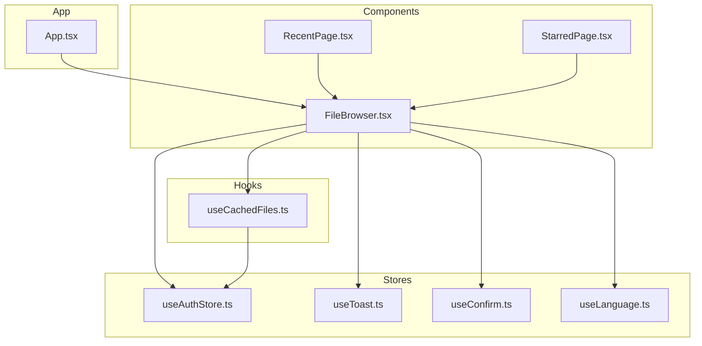
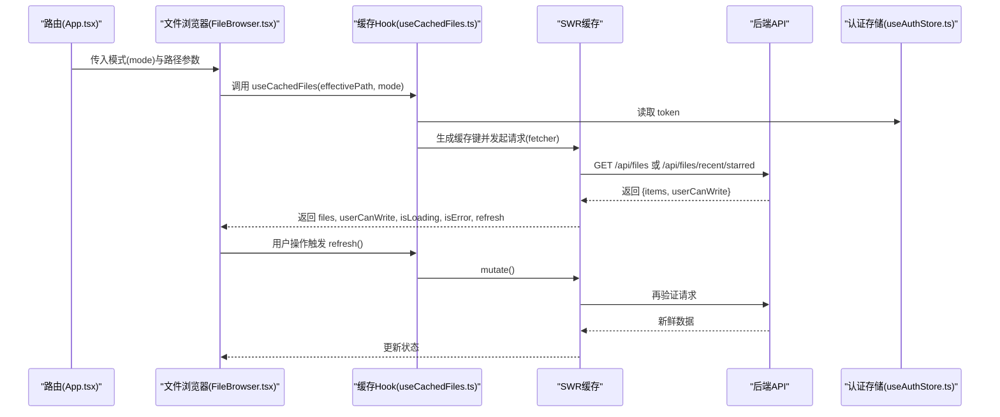
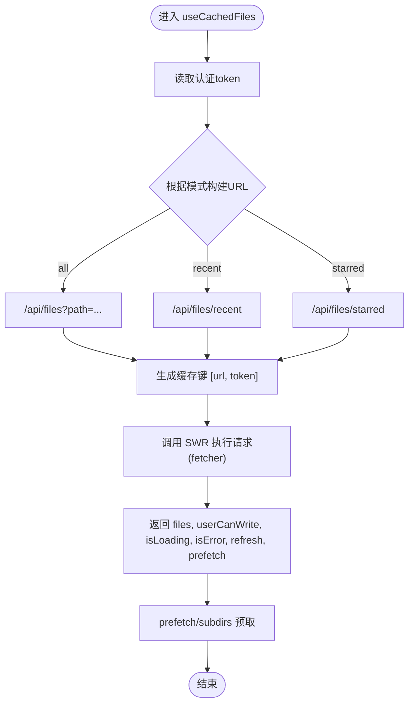
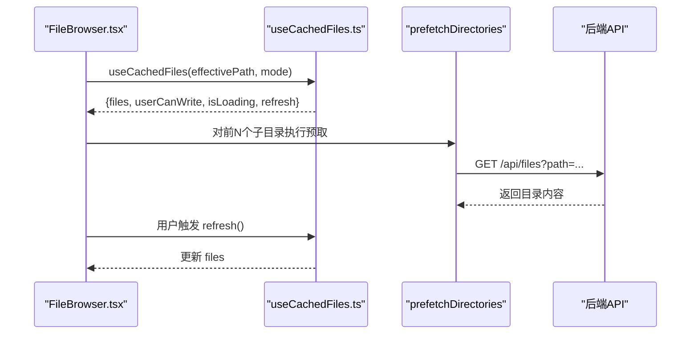
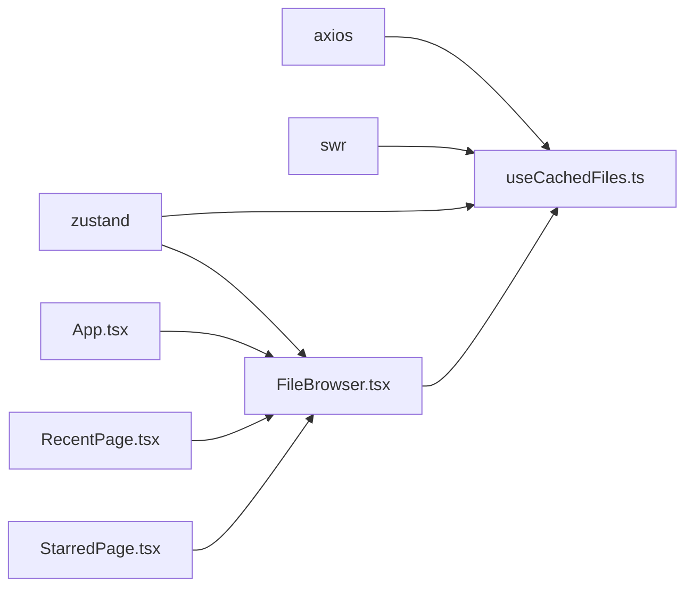

# 自定义 Hook 设计

<cite>
**本文引用的文件**
- [useCachedFiles.ts](file://client/src/hooks/useCachedFiles.ts)
- [FileBrowser.tsx](file://client/src/components/FileBrowser.tsx)
- [useAuthStore.ts](file://client/src/store/useAuthStore.ts)
- [useToast.ts](file://client/src/store/useToast.ts)
- [useConfirm.ts](file://client/src/store/useConfirm.ts)
- [useLanguage.ts](file://client/src/i18n/useLanguage.ts)
- [package.json](file://client/package.json)
- [App.tsx](file://client/src/App.tsx)
- [RecentPage.tsx](file://client/src/components/RecentPage.tsx)
- [StarredPage.tsx](file://client/src/components/StarredPage.tsx)
</cite>

## 目录
1. [简介](#简介)
2. [项目结构](#项目结构)
3. [核心组件](#核心组件)
4. [架构总览](#架构总览)
5. [详细组件分析](#详细组件分析)
6. [依赖关系分析](#依赖关系分析)
7. [性能考量](#性能考量)
8. [故障排查指南](#故障排查指南)
9. [结论](#结论)
10. [附录](#附录)

## 简介
本文件围绕 Longhorn 前端的自定义 Hook 设计展开，重点解析 useCachedFiles.ts 中的缓存与文件列表能力，并结合 FileBrowser.tsx 的使用场景，系统阐述 Hook 的设计理念、实现模式、复用策略、依赖管理、副作用处理、与第三方库的集成方式、性能优化、内存管理与错误处理，最后给出可测试、可维护的 Hook 开发指南与最佳实践。

## 项目结构
Longhorn 客户端采用 React + TypeScript 技术栈，前端代码位于 client/src 目录。与本主题直接相关的模块包括：
- hooks/useCachedFiles.ts：提供基于 SWR 的文件列表缓存与预取能力
- components/FileBrowser.tsx：文件浏览器视图组件，消费 useCachedFiles 并驱动 UI 行为
- store/useAuthStore.ts、useToast.ts、useConfirm.ts、useLanguage.ts：状态与交互支撑
- App.tsx、RecentPage.tsx、StarredPage.tsx：路由与页面级使用示例

图表来源
- [useCachedFiles.ts](file://client/src/hooks/useCachedFiles.ts#L1-L102)
- [FileBrowser.tsx](file://client/src/components/FileBrowser.tsx#L1-L200)
- [useAuthStore.ts](file://client/src/store/useAuthStore.ts#L1-L31)
- [useToast.ts](file://client/src/store/useToast.ts#L1-L41)
- [useConfirm.ts](file://client/src/store/useConfirm.ts#L1-L37)
- [useLanguage.ts](file://client/src/i18n/useLanguage.ts#L1-L59)
- [App.tsx](file://client/src/App.tsx#L66-L126)
- [RecentPage.tsx](file://client/src/components/RecentPage.tsx#L1-L9)
- [StarredPage.tsx](file://client/src/components/StarredPage.tsx#L1-L200)

章节来源
- [package.json](file://client/package.json#L12-L28)

## 核心组件
- useCachedFiles：基于 SWR 的文件列表 Hook，负责构建缓存键、请求分发、去重、轮询、预取与刷新等
- FileBrowser：文件浏览视图，根据路由参数与模式计算有效路径，消费 Hook 返回的数据与控制函数
- 路由层：App.tsx 将 FileBrowser 以不同模式挂载到多条路由，实现“全部/最近/星标/个人”空间

章节来源
- [useCachedFiles.ts](file://client/src/hooks/useCachedFiles.ts#L40-L86)
- [FileBrowser.tsx](file://client/src/components/FileBrowser.tsx#L72-L102)
- [App.tsx](file://client/src/App.tsx#L98-L102)

## 架构总览
useCachedFiles 通过 SWR 提供稳定的缓存与再验证机制，结合全局 mutate 进行预热；FileBrowser 在渲染层消费数据、触发刷新与预取，同时通过路由参数与模式决定请求 URL 与路径上下文。

图表来源
- [useCachedFiles.ts](file://client/src/hooks/useCachedFiles.ts#L40-L86)
- [FileBrowser.tsx](file://client/src/components/FileBrowser.tsx#L96-L102)
- [useAuthStore.ts](file://client/src/store/useAuthStore.ts#L17-L30)
- [App.tsx](file://client/src/App.tsx#L98-L102)

## 详细组件分析

### useCachedFiles.ts 组件分析
- 数据模型
  - FileItem：文件/目录项的基本字段集合
  - FilesResponse：接口返回体，包含 items 与 userCanWrite
- 缓存与请求
  - 使用 SWR 管理缓存键、去重、轮询与再验证
  - 根据 mode 动态选择 URL：普通路径、最近、星标
  - 通过 token 构建稳定缓存键，避免未授权数据污染
- 预取与刷新
  - prefetch：在不阻塞当前渲染的前提下预热子目录缓存
  - prefetchDirectories：批量预热多个目录
  - refresh：通过 mutate 触发手动刷新
- 选项与行为
  - 支持 revalidateOnFocus、revalidateOnReconnect、dedupingInterval、refreshInterval
  - keepPreviousData：展示过期数据的同时进行后台再验证，保证导航即时感

图表来源
- [useCachedFiles.ts](file://client/src/hooks/useCachedFiles.ts#L40-L86)
- [useCachedFiles.ts](file://client/src/hooks/useCachedFiles.ts#L88-L101)

章节来源
- [useCachedFiles.ts](file://client/src/hooks/useCachedFiles.ts#L5-L18)
- [useCachedFiles.ts](file://client/src/hooks/useCachedFiles.ts#L27-L32)
- [useCachedFiles.ts](file://client/src/hooks/useCachedFiles.ts#L40-L86)
- [useCachedFiles.ts](file://client/src/hooks/useCachedFiles.ts#L88-L101)

### FileBrowser.tsx 与 Hook 的协作
- 路径与模式
  - effectivePath：依据路由参数与 mode 计算当前有效路径
  - mode：支持 all、recent、starred、personal
- 数据消费
  - files、userCanWrite、isLoading、refresh：驱动 UI 展示与交互
- 预取策略
  - 当收到 files 后，对前若干个子目录执行 prefetchDirectories，提升后续导航体验
- 其他交互
  - 通过 useAuthStore 获取 token，结合 axios 发起非缓存请求（如收藏、统计、分享等）

图表来源
- [FileBrowser.tsx](file://client/src/components/FileBrowser.tsx#L80-L102)
- [FileBrowser.tsx](file://client/src/components/FileBrowser.tsx#L184-L190)
- [useCachedFiles.ts](file://client/src/hooks/useCachedFiles.ts#L88-L101)

章节来源
- [FileBrowser.tsx](file://client/src/components/FileBrowser.tsx#L72-L102)
- [FileBrowser.tsx](file://client/src/components/FileBrowser.tsx#L184-L190)

### 路由与页面级使用
- App.tsx 将 FileBrowser 以不同 key 与 mode 挂载到多条路由，覆盖“个人/部门/最近/星标/回收站/分享”等场景
- RecentPage.tsx、StarredPage.tsx 作为轻量包装，直接传递 mode 给 FileBrowser

章节来源
- [App.tsx](file://client/src/App.tsx#L98-L102)
- [RecentPage.tsx](file://client/src/components/RecentPage.tsx#L4-L5)
- [StarredPage.tsx](file://client/src/components/StarredPage.tsx#L28-L35)

## 依赖关系分析
- 第三方库
  - axios：HTTP 请求
  - swr：缓存与再验证
  - zustand：状态管理（认证、提示、确认、语言）
- 组件间耦合
  - FileBrowser 依赖 useCachedFiles 与多个 store
  - useCachedFiles 仅依赖 SWR 与认证 store，内聚性高、耦合度低
- 可能的循环依赖
  - 未见直接循环导入；Hook 与组件通过 props 与状态解耦

图表来源
- [package.json](file://client/package.json#L12-L28)
- [useCachedFiles.ts](file://client/src/hooks/useCachedFiles.ts#L1-L3)
- [useAuthStore.ts](file://client/src/store/useAuthStore.ts#L1-L31)
- [FileBrowser.tsx](file://client/src/components/FileBrowser.tsx#L1-L10)
- [App.tsx](file://client/src/App.tsx#L66-L126)
- [RecentPage.tsx](file://client/src/components/RecentPage.tsx#L1-L9)
- [StarredPage.tsx](file://client/src/components/StarredPage.tsx#L1-L200)

章节来源
- [package.json](file://client/package.json#L12-L28)

## 性能考量
- 缓存与去重
  - dedupingInterval 控制请求去重窗口，降低重复请求成本
  - keepPreviousData 提升导航即时性，避免闪烁
- 轮询与再验证
  - refreshInterval 与 revalidateOnFocus/revalidateOnReconnect 保持数据新鲜度
- 预取策略
  - prefetch 与 prefetchDirectories 在用户可能的下一步操作前预热缓存
- 资源与网络
  - ETag/服务端校验使轮询成本较低
  - 图片缩略图与预览分离，减少首屏压力

章节来源
- [useCachedFiles.ts](file://client/src/hooks/useCachedFiles.ts#L42-L68)
- [useCachedFiles.ts](file://client/src/hooks/useCachedFiles.ts#L78-L84)
- [useCachedFiles.ts](file://client/src/hooks/useCachedFiles.ts#L92-L100)

## 故障排查指南
- 常见问题
  - 无 token 导致无法请求：检查 useAuthStore 是否正确初始化与持久化
  - 刷新无效：确认是否通过 Hook 返回的 refresh 调用 mutate
  - 预取未生效：确认 token 存在且目录名正确
- 错误处理
  - Hook 暴露 isError 与 error，可在上层组件中统一展示
  - FileBrowser 中对部分操作（如收藏、删除、批量移动）使用 toast 与 confirm 统一反馈
- 排查步骤
  - 打开网络面板确认请求 URL 与响应
  - 检查 SWR 缓存键是否唯一（含 token）
  - 验证路由参数与 mode 是否匹配预期

章节来源
- [useCachedFiles.ts](file://client/src/hooks/useCachedFiles.ts#L74-L76)
- [FileBrowser.tsx](file://client/src/components/FileBrowser.tsx#L173-L182)
- [useToast.ts](file://client/src/store/useToast.ts#L17-L40)
- [useConfirm.ts](file://client/src/store/useConfirm.ts#L14-L36)

## 结论
useCachedFiles.ts 以 SWR 为核心，提供了稳定、可配置、可预取的文件列表缓存方案。配合 FileBrowser 的路径与模式计算、路由层的多场景挂载，形成了一套可扩展、可维护的前端文件浏览体系。通过合理的去重、轮询与预取策略，兼顾了用户体验与资源消耗；通过明确的错误暴露与统一的交互反馈，提升了系统的可诊断性与可用性。

## 附录

### 开发指南与最佳实践
- 设计理念
  - 单一职责：Hook 专注数据获取与缓存，UI 专注展示与交互
  - 明确输入输出：通过参数与返回值清晰表达依赖与副作用
- 依赖管理
  - 将外部依赖（如 axios、SWR、认证 store）作为内部实现细节，对外暴露稳定接口
- 副作用处理
  - 将异步副作用封装在 Hook 内部，通过返回值（如 refresh、prefetch）供上层调用
- 可测试性
  - 将 fetcher 与缓存键构造抽离，便于单元测试与 mock
  - 通过 options 参数注入行为（如 dedupingInterval、refreshInterval），便于测试不同场景
- 可维护性
  - 保持 Hook 无 UI 逻辑，避免与具体组件耦合
  - 对外暴露简洁 API，内部实现可演进
- 与第三方库集成
  - SWR：合理配置 keepPreviousData、revalidateOnFocus、revalidateOnReconnect
  - axios：统一在 fetcher 中处理鉴权头，避免在组件中分散处理
  - zustand：仅在必要处读取 token，避免过度耦合

章节来源
- [useCachedFiles.ts](file://client/src/hooks/useCachedFiles.ts#L27-L32)
- [useCachedFiles.ts](file://client/src/hooks/useCachedFiles.ts#L42-L68)
- [useAuthStore.ts](file://client/src/store/useAuthStore.ts#L17-L30)