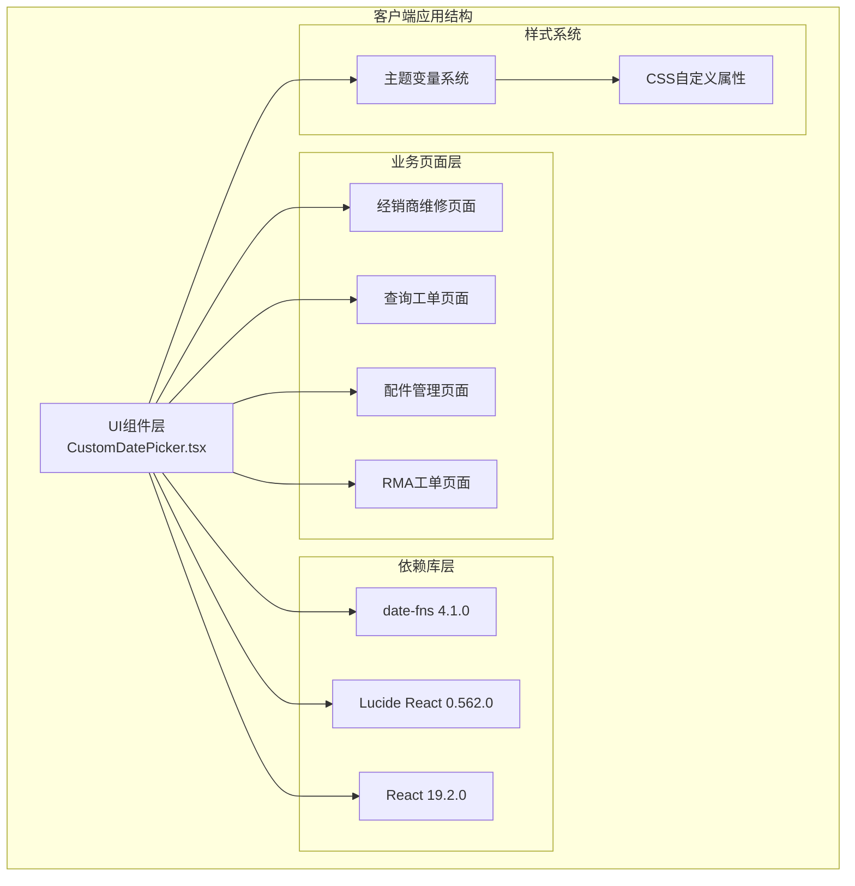
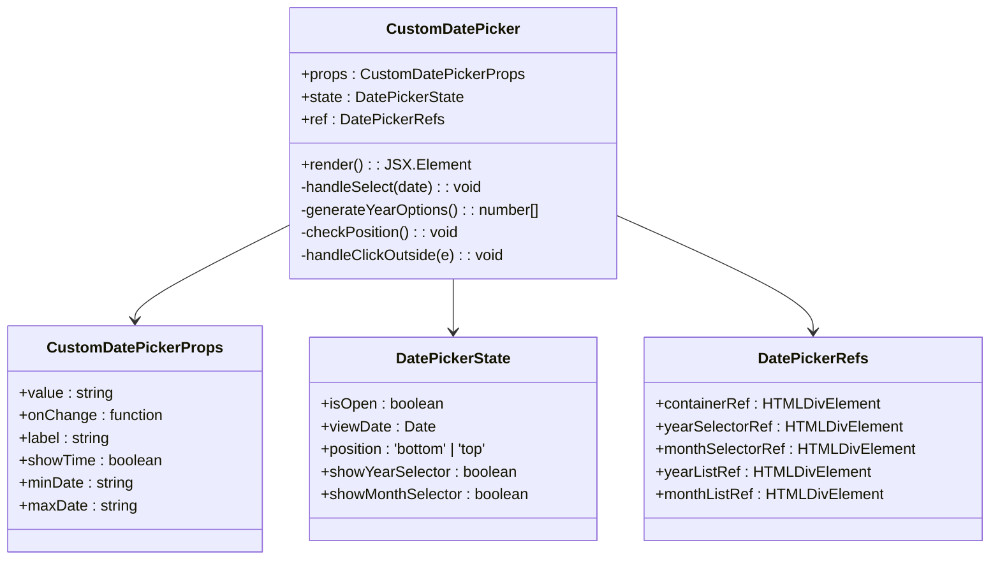
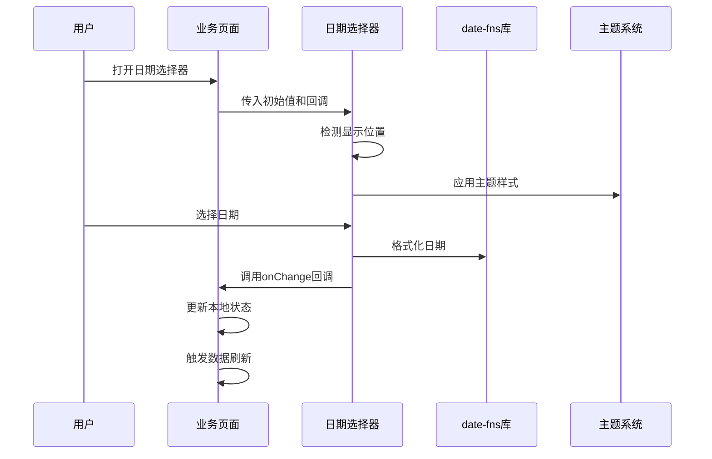
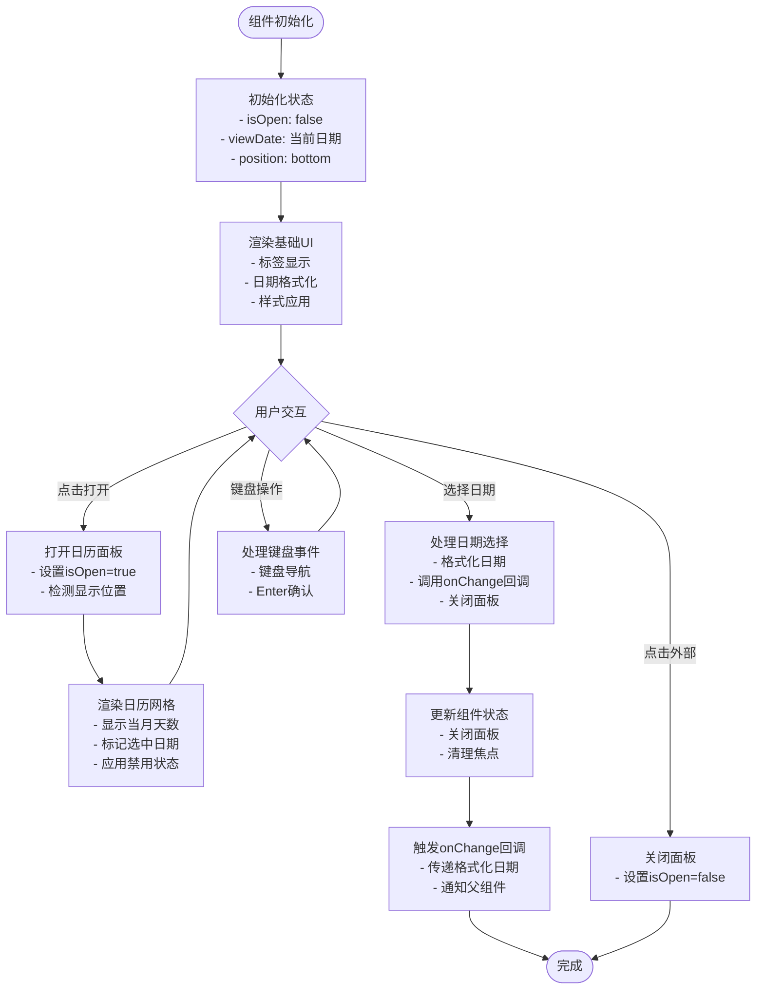
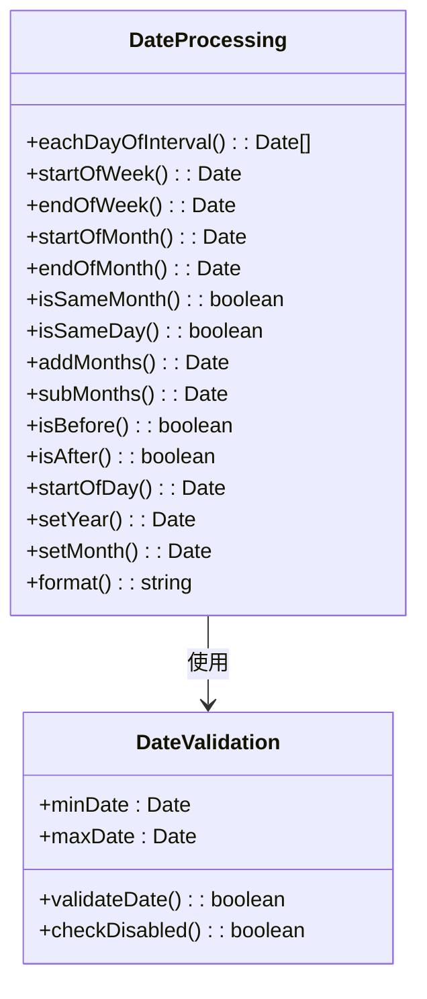
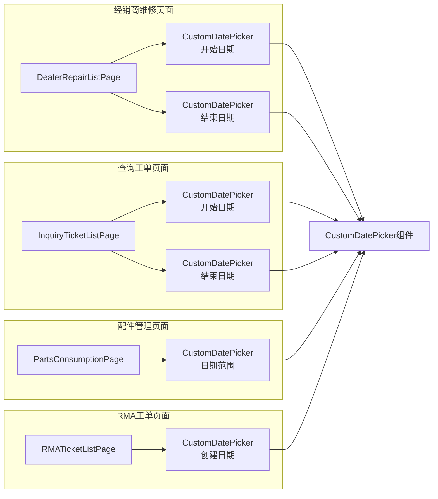
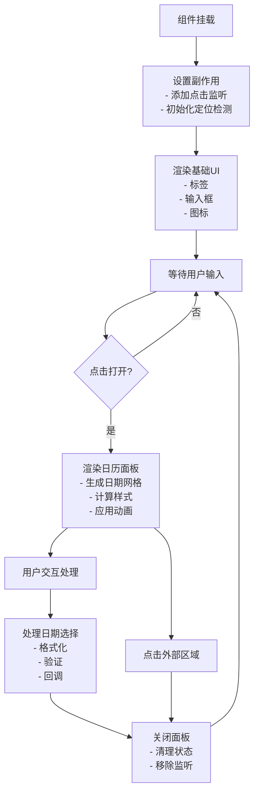
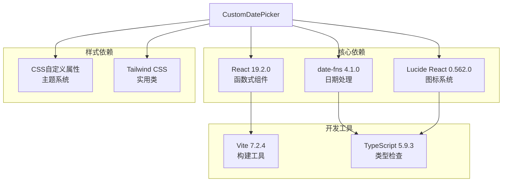
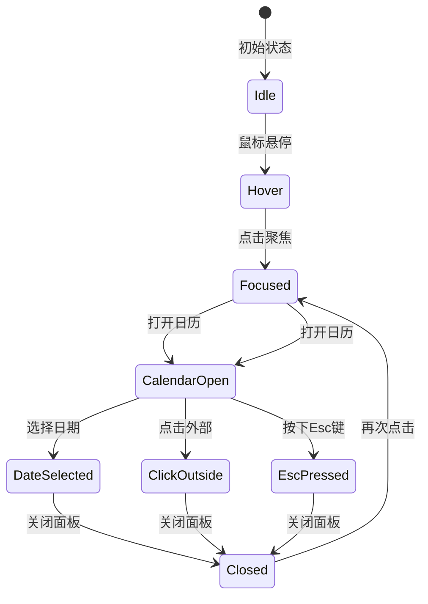

# 自定义日期选择器组件

<cite>
**本文档引用的文件**
- [CustomDatePicker.tsx](file://client/src/components/UI/CustomDatePicker.tsx)
- [DealerRepairListPage.tsx](file://client/src/components/DealerRepairs/DealerRepairListPage.tsx)
- [InquiryTicketListPage.tsx](file://client/src/components/InquiryTickets/InquiryTicketListPage.tsx)
- [PartsConsumptionPage.tsx](file://client/src/components/PartsManagement/PartsConsumptionPage.tsx)
- [RMATicketListPage.tsx](file://client/src/components/RMATickets/RMATicketListPage.tsx)
- [package.json](file://client/package.json)
- [index.css](file://client/src/index.css)
</cite>

## 目录
1. [简介](#简介)
2. [项目结构](#项目结构)
3. [核心组件](#核心组件)
4. [架构概览](#架构概览)
5. [详细组件分析](#详细组件分析)
6. [依赖关系分析](#依赖关系分析)
7. [性能考虑](#性能考虑)
8. [故障排除指南](#故障排除指南)
9. [结论](#结论)

## 简介

自定义日期选择器组件是Longhorn项目中的一个核心UI组件，专为满足项目特定的日期选择需求而设计。该组件基于React开发，集成了现代化的日期处理库和响应式设计，提供了丰富的功能特性，包括年份和月份选择器、日期范围过滤、主题适配等。

该组件在多个业务模块中得到广泛应用，包括经销商维修管理、查询工单、配件消耗统计和RMA工单管理等场景，为用户提供了一致且高效的日期选择体验。

## 项目结构

该项目采用模块化的前端架构，日期选择器组件位于UI组件目录下，通过依赖注入的方式被各个业务页面引用。整体项目结构体现了清晰的分层设计：

**图表来源**
- [CustomDatePicker.tsx:1-296](file://client/src/components/UI/CustomDatePicker.tsx#L1-L296)
- [package.json:12-49](file://client/package.json#L12-L49)

**章节来源**
- [CustomDatePicker.tsx:1-296](file://client/src/components/UI/CustomDatePicker.tsx#L1-L296)
- [package.json:1-66](file://client/package.json#L1-L66)

## 核心组件

### 组件架构设计

自定义日期选择器组件采用了现代化的React Hooks模式，结合函数式组件的优势，实现了高度可复用和可维护的代码结构：

**图表来源**
- [CustomDatePicker.tsx:5-24](file://client/src/components/UI/CustomDatePicker.tsx#L5-L24)

### 主要功能特性

1. **智能定位系统**: 自动检测容器位置，根据可用空间决定向上或向下显示
2. **多级选择器**: 支持年份和月份的快速导航
3. **日期范围限制**: 可设置最小和最大日期范围
4. **主题适配**: 完全支持深色和浅色主题切换
5. **无障碍访问**: 提供键盘导航和屏幕阅读器支持

**章节来源**
- [CustomDatePicker.tsx:14-296](file://client/src/components/UI/CustomDatePicker.tsx#L14-L296)

## 架构概览

### 组件交互流程

该组件与业务页面的集成采用了事件驱动的设计模式，通过回调函数实现数据流的单向传递：

**图表来源**
- [DealerRepairListPage.tsx:710-720](file://client/src/components/DealerRepairs/DealerRepairListPage.tsx#L710-L720)
- [InquiryTicketListPage.tsx:831-841](file://client/src/components/InquiryTickets/InquiryTicketListPage.tsx#L831-L841)

### 数据流管理

组件内部采用了受控组件的设计模式，确保状态的一致性和可预测性：

**图表来源**
- [CustomDatePicker.tsx:43-46](file://client/src/components/UI/CustomDatePicker.tsx#L43-L46)
- [CustomDatePicker.tsx:126-292](file://client/src/components/UI/CustomDatePicker.tsx#L126-L292)

**章节来源**
- [CustomDatePicker.tsx:14-296](file://client/src/components/UI/CustomDatePicker.tsx#L14-L296)

## 详细组件分析

### 核心实现逻辑

#### 日期处理机制

组件使用date-fns库进行精确的日期计算和格式化，确保跨浏览器兼容性和国际化支持：

**图表来源**
- [CustomDatePicker.tsx:38-41](file://client/src/components/UI/CustomDatePicker.tsx#L38-L41)
- [CustomDatePicker.tsx:259-264](file://client/src/components/UI/CustomDatePicker.tsx#L259-L264)

#### 样式系统集成

组件完全集成到项目的主题系统中，支持动态主题切换和响应式设计：

| 样式变量 | 深色主题值 | 浅色主题值 | 用途 |
|---------|-----------|-----------|------|
| --bg-main | #000000 | #E5E7EB | 主背景色 |
| --bg-sidebar | #1C1C1E | #E5E7EB | 侧边栏背景 |
| --accent-blue | #FFD200 | #E6BD00 | 强调色 |
| --text-main | #FFFFFF | #1C1C1E | 主文字色 |
| --text-secondary | #9CA3AF | #4B5563 | 次要文字色 |
| --glass-border | rgba(255,255,255,.12) | rgba(0,0,0,.1) | 玻璃边框 |

**章节来源**
- [CustomDatePicker.tsx:100-141](file://client/src/components/UI/CustomDatePicker.tsx#L100-L141)
- [index.css:7-130](file://client/src/index.css#L7-L130)

### 组件使用模式

#### 在业务页面中的集成

组件在不同业务页面中展现了高度的复用性和适应性：

**图表来源**
- [DealerRepairListPage.tsx:710-720](file://client/src/components/DealerRepairs/DealerRepairListPage.tsx#L710-L720)
- [InquiryTicketListPage.tsx:831-841](file://client/src/components/InquiryTickets/InquiryTicketListPage.tsx#L831-L841)
- [PartsConsumptionPage.tsx:405-418](file://client/src/components/PartsManagement/PartsConsumptionPage.tsx#L405-L418)

**章节来源**
- [DealerRepairListPage.tsx:700-748](file://client/src/components/DealerRepairs/DealerRepairListPage.tsx#L700-L748)
- [InquiryTicketListPage.tsx:820-1001](file://client/src/components/InquiryTickets/InquiryTicketListPage.tsx#L820-L1001)
- [PartsConsumptionPage.tsx:400-599](file://client/src/components/PartsManagement/PartsConsumptionPage.tsx#L400-L599)

### 性能优化策略

#### 内存管理和事件处理

组件采用了多项性能优化技术来确保流畅的用户体验：

1. **事件委托**: 使用useEffect清理函数避免内存泄漏
2. **条件渲染**: 仅在需要时渲染日历面板
3. **防抖处理**: 对搜索和过滤操作进行节流
4. **虚拟滚动**: 大列表数据的优化处理

#### 渲染优化

**图表来源**
- [CustomDatePicker.tsx:48-63](file://client/src/components/UI/CustomDatePicker.tsx#L48-L63)
- [CustomDatePicker.tsx:65-77](file://client/src/components/UI/CustomDatePicker.tsx#L65-L77)

**章节来源**
- [CustomDatePicker.tsx:48-97](file://client/src/components/UI/CustomDatePicker.tsx#L48-L97)

## 依赖关系分析

### 外部依赖库

组件依赖于以下关键库来实现其功能：

**图表来源**
- [package.json:28](file://client/package.json#L28)
- [package.json:34](file://client/package.json#L34)

### 版本兼容性

组件与各依赖库的版本兼容性经过精心测试，确保在生产环境中的稳定性：

| 依赖库 | 版本要求 | 兼容版本 | 用途 |
|--------|----------|----------|------|
| React | ^19.2.0 | 19.2.0 | 组件框架 |
| date-fns | ^4.1.0 | 4.1.0 | 日期处理 |
| lucide-react | ^0.562.0 | 0.562.0 | 图标组件 |
| react-router-dom | ^7.11.0 | 7.11.0 | 路由导航 |
| zustand | ^5.0.9 | 5.0.9 | 状态管理 |

**章节来源**
- [package.json:12-49](file://client/package.json#L12-L49)

## 性能考虑

### 渲染性能优化

组件在设计时充分考虑了渲染性能，采用了以下优化策略：

1. **懒加载**: 日历面板仅在用户交互时渲染
2. **样式缓存**: 使用CSS变量减少样式计算开销
3. **事件优化**: 合理的事件绑定和解绑机制
4. **内存管理**: 及时清理DOM引用和事件监听器

### 用户体验优化

**图表来源**
- [CustomDatePicker.tsx:104-124](file://client/src/components/UI/CustomDatePicker.tsx#L104-L124)

### 最佳实践建议

1. **合理使用**: 在需要日期选择的场景中优先考虑使用此组件
2. **性能监控**: 定期检查组件的渲染性能和内存使用情况
3. **主题一致性**: 确保组件样式与整体设计系统保持一致
4. **无障碍访问**: 遵循WCAG指南，提供键盘导航支持

## 故障排除指南

### 常见问题及解决方案

#### 日期格式问题

**问题描述**: 日期格式不正确或显示异常

**解决方案**:
1. 确保传入的value参数符合'yyyy-MM-dd'格式
2. 检查onChange回调是否正确处理日期字符串
3. 验证minDate和maxDate参数的有效性

#### 样式显示异常

**问题描述**: 组件样式不符合预期或主题不匹配

**解决方案**:
1. 检查CSS变量是否正确加载
2. 确认主题切换逻辑正常工作
3. 验证容器元素的定位属性

#### 交互问题

**问题描述**: 点击无效或无法关闭面板

**解决方案**:
1. 检查onClick事件绑定是否正确
2. 验证useEffect清理函数是否执行
3. 确认事件冒泡和捕获处理

**章节来源**
- [CustomDatePicker.tsx:43-46](file://client/src/components/UI/CustomDatePicker.tsx#L43-L46)
- [CustomDatePicker.tsx:65-77](file://client/src/components/UI/CustomDatePicker.tsx#L65-L77)

### 调试技巧

1. **开发者工具**: 使用React DevTools检查组件状态
2. **控制台日志**: 添加必要的console.log语句进行调试
3. **样式检查**: 使用浏览器开发者工具检查CSS变量应用
4. **事件监听**: 监听关键事件如click、focus、blur等

## 结论

自定义日期选择器组件是Longhorn项目中一个设计精良、功能完善的UI组件。它不仅满足了项目的核心需求，还展现了优秀的架构设计和实现质量。

### 主要优势

1. **高度可复用**: 通过标准化的接口设计，在多个业务场景中得到成功应用
2. **性能优异**: 采用多项优化策略，确保流畅的用户体验
3. **主题适配**: 完全集成到项目的主题系统中，支持深色和浅色模式
4. **易于维护**: 清晰的代码结构和完善的注释，便于后续维护和扩展

### 技术亮点

- 基于现代React Hooks的函数式组件设计
- 精确的日期处理和格式化逻辑
- 智能的UI布局和响应式设计
- 完善的事件处理和状态管理
- 优秀的性能优化和内存管理

该组件为Longhorn项目的用户界面提供了可靠的基础，是项目前端架构中的重要组成部分。其设计理念和实现方式为类似组件的开发提供了良好的参考模板。