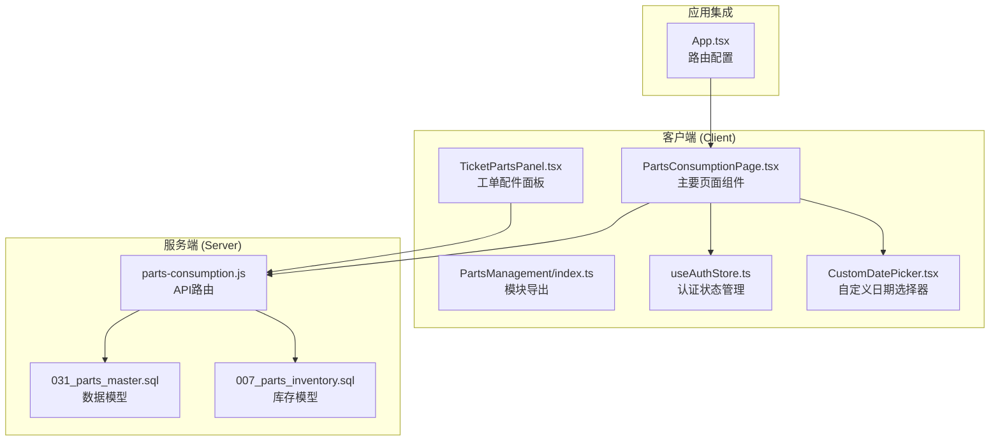
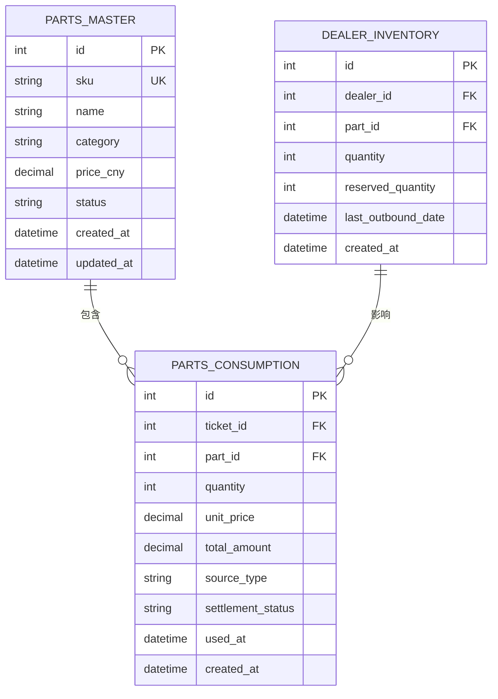
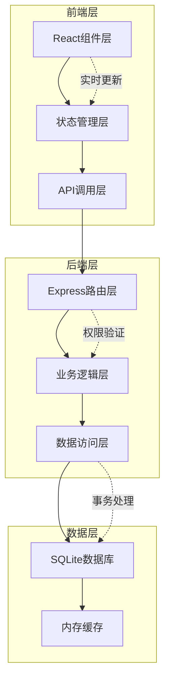
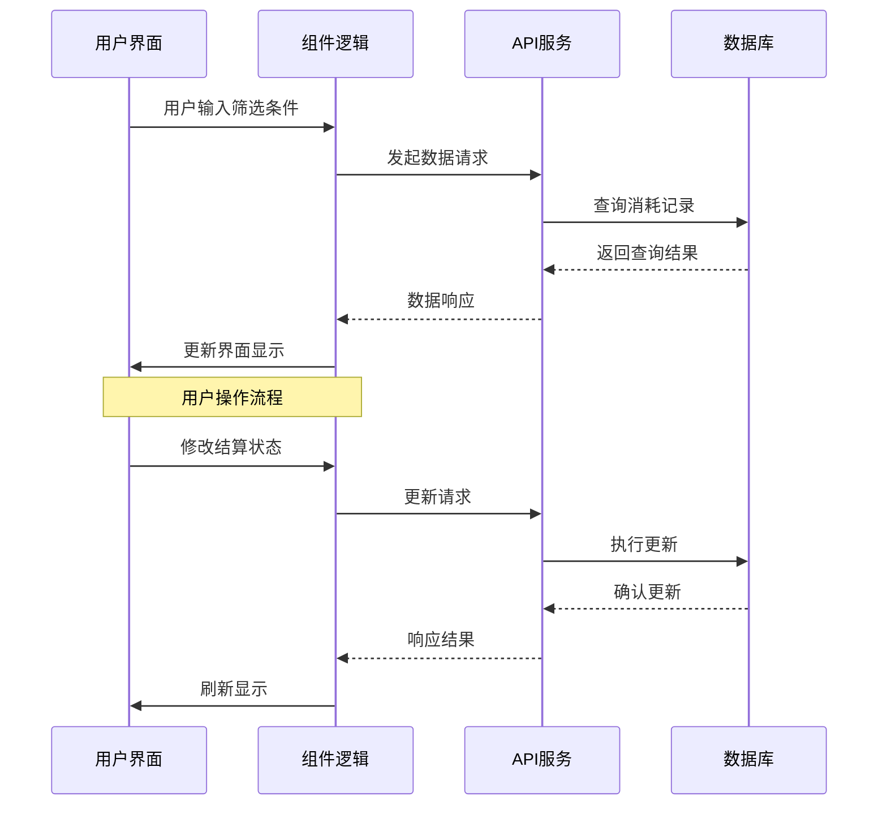
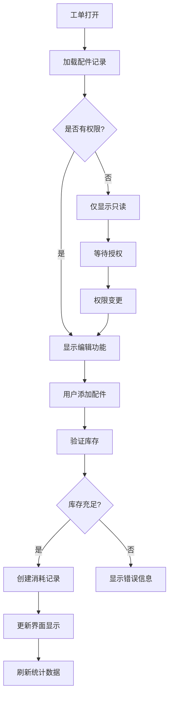
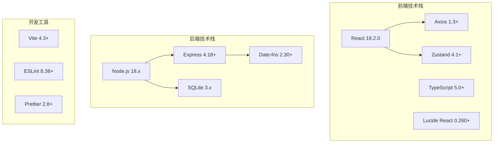
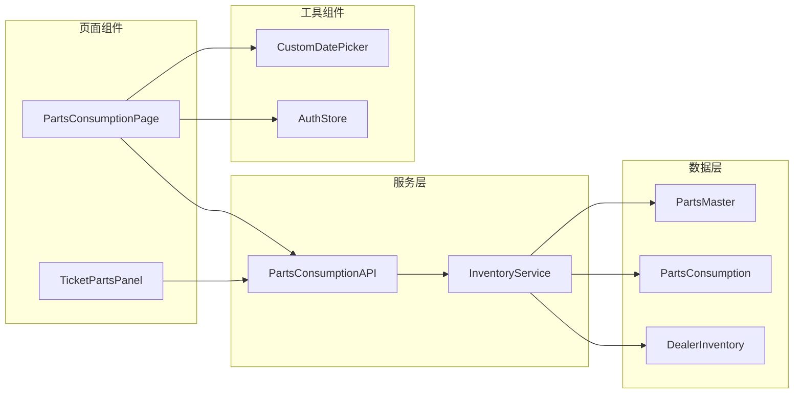

# 配件消耗页面

<cite>
**本文档引用的文件**
- [PartsConsumptionPage.tsx](file://client/src/components/PartsManagement/PartsConsumptionPage.tsx)
- [index.ts](file://client/src/components/PartsManagement/index.ts)
- [parts-consumption.js](file://server/service/routes/parts-consumption.js)
- [useAuthStore.ts](file://client/src/store/useAuthStore.ts)
- [CustomDatePicker.tsx](file://client/src/components/UI/CustomDatePicker.tsx)
- [031_parts_master.sql](file://server/service/migrations/031_parts_master.sql)
- [007_parts_inventory.sql](file://server/service/migrations/007_parts_inventory.sql)
- [TicketPartsPanel.tsx](file://client/src/components/PartsManagement/TicketPartsPanel.tsx)
- [App.tsx](file://client/src/App.tsx)
</cite>

## 目录
1. [简介](#简介)
2. [项目结构](#项目结构)
3. [核心组件](#核心组件)
4. [架构概览](#架构概览)
5. [详细组件分析](#详细组件分析)
6. [依赖关系分析](#依赖关系分析)
7. [性能考虑](#性能考虑)
8. [故障排除指南](#故障排除指南)
9. [结论](#结论)

## 简介

配件消耗页面是Longhorn服务管理系统中的核心功能模块，专门用于记录、追踪和管理维修过程中使用的配件消耗情况。该系统支持多种配件来源（总部库存、经销商库存、外部采购、保修免费），提供完整的库存管理和结算跟踪功能。

系统采用前后端分离架构，前端使用React + TypeScript构建用户界面，后端基于Node.js和Express提供RESTful API服务。数据存储采用SQLite数据库，通过精心设计的数据模型确保数据完整性和查询效率。

## 项目结构

配件消耗功能在项目中的组织结构如下：

**图表来源**
- [PartsConsumptionPage.tsx:1-621](file://client/src/components/PartsManagement/PartsConsumptionPage.tsx#L1-L621)
- [parts-consumption.js:1-488](file://server/service/routes/parts-consumption.js#L1-L488)

**章节来源**
- [PartsConsumptionPage.tsx:1-621](file://client/src/components/PartsManagement/PartsConsumptionPage.tsx#L1-L621)
- [parts-consumption.js:1-488](file://server/service/routes/parts-consumption.js#L1-L488)

## 核心组件

### 数据模型设计

系统采用三层数据模型设计，确保配件消耗的完整生命周期管理：

**图表来源**
- [031_parts_master.sql:46-82](file://server/service/migrations/031_parts_master.sql#L46-L82)
- [031_parts_master.sql:154-189](file://server/service/migrations/031_parts_master.sql#L154-L189)

### 权限控制机制

系统实现了严格的权限分级控制：

| 用户角色 | 访问权限 | 操作权限 |
|---------|---------|---------|
| Admin | 查看所有消耗记录 | 创建、修改、删除 |
| Lead | 查看所有消耗记录 | 修改结算状态 |
| Exec | 查看所有消耗记录 | 修改结算状态 |
| MS部门 | 查看MS部门消耗记录 | 修改结算状态 |
| GE部门 | 查看GE部门消耗记录 | 仅查看 |
| OP部门 | 查看OP部门消耗记录 | 仅查看 |

**章节来源**
- [parts-consumption.js:14-22](file://server/service/routes/parts-consumption.js#L14-L22)
- [PartsConsumptionPage.tsx:98](file://client/src/components/PartsManagement/PartsConsumptionPage.tsx#L98)

## 架构概览

配件消耗系统的整体架构采用MVC模式，前后端分离设计：

**图表来源**
- [PartsConsumptionPage.tsx:100-126](file://client/src/components/PartsManagement/PartsConsumptionPage.tsx#L100-L126)
- [parts-consumption.js:28-131](file://server/service/routes/parts-consumption.js#L28-L131)

## 详细组件分析

### 主要页面组件

#### 配件消耗记录页面

该页面提供了完整的配件消耗管理功能：

**核心功能特性：**
- 实时数据展示和统计分析
- 多维度筛选和搜索功能
- 结算状态管理
- 库存自动扣减
- 撤销操作支持

**数据流处理：**

**图表来源**
- [PartsConsumptionPage.tsx:100-126](file://client/src/components/PartsManagement/PartsConsumptionPage.tsx#L100-L126)
- [parts-consumption.js:374-417](file://server/service/routes/parts-consumption.js#L374-L417)

**章节来源**
- [PartsConsumptionPage.tsx:86-621](file://client/src/components/PartsManagement/PartsConsumptionPage.tsx#L86-L621)

### 工单配件面板

#### 集成式工单管理

工单配件面板作为UnifiedTicketDetail的组成部分，提供实时的配件使用记录：

**关键特性：**
- 与工单系统的深度集成
- 实时库存状态显示
- 快速添加和删除功能
- 保修状态自动识别

**操作流程：**

**图表来源**
- [TicketPartsPanel.tsx:83-101](file://client/src/components/PartsManagement/TicketPartsPanel.tsx#L83-L101)
- [TicketPartsPanel.tsx:123-147](file://client/src/components/PartsManagement/TicketPartsPanel.tsx#L123-L147)

**章节来源**
- [TicketPartsPanel.tsx:65-507](file://client/src/components/PartsManagement/TicketPartsPanel.tsx#L65-L507)

### API服务层

#### RESTful接口设计

系统提供完整的RESTful API接口：

| 端点 | 方法 | 功能 | 权限要求 |
|------|------|------|----------|
| `/api/v1/parts-consumption` | GET | 获取消耗记录列表 | 查看权限 |
| `/api/v1/parts-consumption` | POST | 创建消耗记录 | 管理权限 |
| `/api/v1/parts-consumption/summary` | GET | 获取统计摘要 | 查看权限 |
| `/api/v1/parts-consumption/:id/settlement` | PATCH | 更新结算状态 | 管理权限 |
| `/api/v1/parts-consumption/:id` | DELETE | 撤销消耗记录 | Admin权限 |

**章节来源**
- [parts-consumption.js:28-484](file://server/service/routes/parts-consumption.js#L28-L484)

## 依赖关系分析

### 技术栈依赖

系统采用现代化的技术栈组合：

**图表来源**
- [package.json](file://client/package.json)
- [server/package.json](file://server/package.json)

### 组件间依赖关系

**图表来源**
- [PartsConsumptionPage.tsx:8-24](file://client/src/components/PartsManagement/PartsConsumptionPage.tsx#L8-L24)
- [TicketPartsPanel.tsx:7-16](file://client/src/components/PartsManagement/TicketPartsPanel.tsx#L7-L16)

**章节来源**
- [index.ts:6-12](file://client/src/components/PartsManagement/index.ts#L6-L12)

## 性能考虑

### 数据查询优化

系统采用了多项性能优化策略：

1. **索引优化**
   - 配件SKU索引：`idx_parts_master_sku`
   - 消耗记录时间索引：`idx_parts_consumption_used_at`
   - 结算状态索引：`idx_parts_consumption_settlement`

2. **分页查询**
   - 默认每页50条记录
   - 支持自定义page_size参数
   - 总记录数预计算

3. **并发处理**
   - 使用Promise.all并行获取数据
   - 防抖处理搜索请求
   - 缓存常用查询结果

### 内存管理

- 合理的组件卸载清理
- 防止内存泄漏的事件监听器移除
- 大数据集的虚拟滚动支持

## 故障排除指南

### 常见问题诊断

**权限相关问题：**
- 症状：无法查看或修改消耗记录
- 解决方案：检查用户角色和部门归属
- 验证命令：`GET /api/v1/parts-consumption`

**库存不足问题：**
- 症状：创建消耗记录时报库存不足
- 解决方案：检查dealer_inventory表中的可用数量
- 验证命令：`SELECT quantity FROM dealer_inventory WHERE part_id = ?`

**API连接问题：**
- 症状：页面加载失败或数据不更新
- 解决方案：检查网络连接和API端点可达性
- 验证命令：`curl -I http://localhost:3000/api/v1/parts-consumption`

**章节来源**
- [parts-consumption.js:124-130](file://server/service/routes/parts-consumption.js#L124-L130)
- [PartsConsumptionPage.tsx:121-126](file://client/src/components/PartsManagement/PartsConsumptionPage.tsx#L121-L126)

## 结论

配件消耗页面作为Longhorn系统的重要组成部分，展现了现代Web应用的最佳实践。系统通过合理的架构设计、完善的数据模型和严格的权限控制，为用户提供了一个功能全面、性能优异的配件管理解决方案。

**主要优势：**
- 完整的生命周期管理
- 灵活的权限控制
- 高效的数据查询
- 用户友好的界面设计
- 强大的扩展性

**未来改进方向：**
- 增加更多统计分析功能
- 优化移动端用户体验
- 实现更高级的库存预测算法
- 集成更多的第三方系统