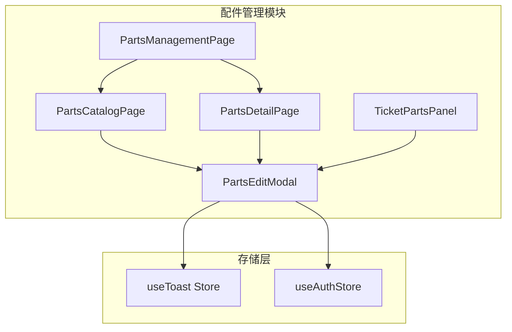
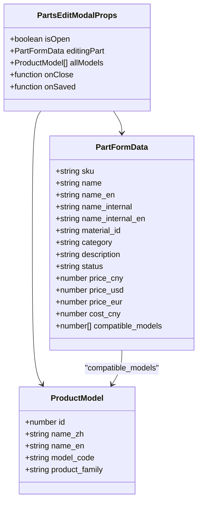
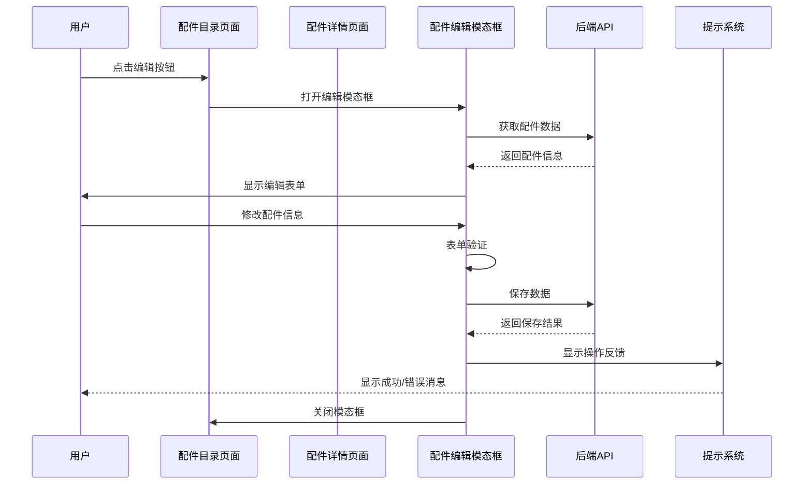
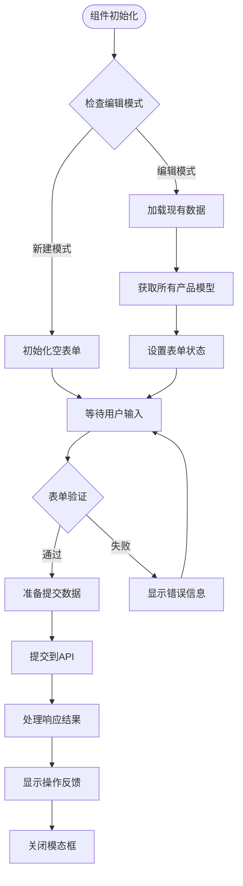
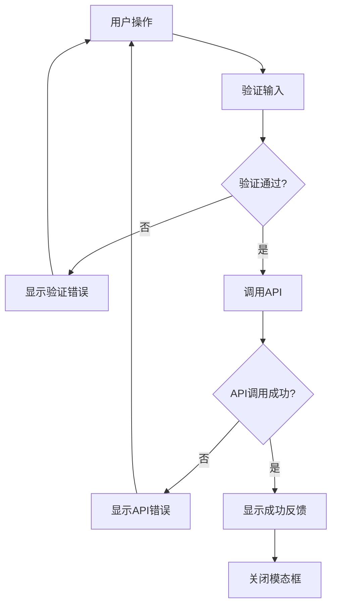
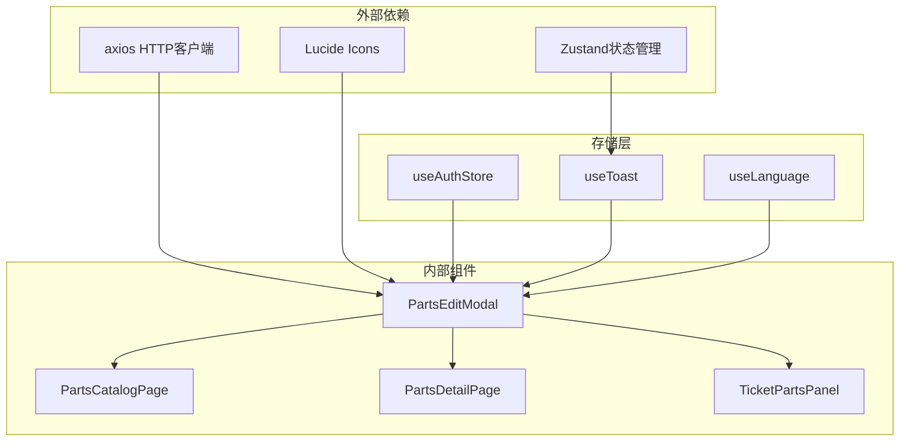

# 配件编辑模态框组件

<cite>
**本文档引用的文件**
- [PartsEditModal.tsx](file://client/src/components/PartsManagement/PartsEditModal.tsx)
- [PartsCatalogPage.tsx](file://client/src/components/PartsManagement/PartsCatalogPage.tsx)
- [PartsDetailPage.tsx](file://client/src/components/PartsManagement/PartsDetailPage.tsx)
- [useToast.ts](file://client/src/store/useToast.ts)
- [TicketPartsPanel.tsx](file://client/src/components/PartsManagement/TicketPartsPanel.tsx)
- [index.ts](file://client/src/components/PartsManagement/index.ts)
</cite>

## 目录
1. [简介](#简介)
2. [项目结构](#项目结构)
3. [核心组件](#核心组件)
4. [架构概览](#架构概览)
5. [详细组件分析](#详细组件分析)
6. [依赖关系分析](#依赖关系分析)
7. [性能考虑](#性能考虑)
8. [故障排除指南](#故障排除指南)
9. [结论](#结论)

## 简介

配件编辑模态框组件是Longhorn服务管理系统中的核心功能模块，用于管理和维护维修配件信息。该组件提供了完整的配件生命周期管理功能，包括配件的创建、编辑、查询和删除操作。

该组件采用macOS26设计风格，使用Kine Yellow主题色彩方案，实现了现代化的用户界面体验。组件支持多语言显示（中文/英文），具备响应式设计和深色模式兼容性。

## 项目结构

配件编辑模态框组件位于客户端React应用的PartsManagement模块中，与相关的配件管理页面协同工作：

**图表来源**
- [PartsEditModal.tsx:1-630](file://client/src/components/PartsManagement/PartsEditModal.tsx#L1-L630)
- [PartsCatalogPage.tsx:1-654](file://client/src/components/PartsManagement/PartsCatalogPage.tsx#L1-L654)
- [PartsDetailPage.tsx:1-359](file://client/src/components/PartsManagement/PartsDetailPage.tsx#L1-L359)

**章节来源**
- [PartsEditModal.tsx:1-630](file://client/src/components/PartsManagement/PartsEditModal.tsx#L1-L630)
- [index.ts:1-13](file://client/src/components/PartsManagement/index.ts#L1-L13)

## 核心组件

### 配件编辑模态框组件

配件编辑模态框组件是整个配件管理系统的中央控制单元，提供以下核心功能：

#### 主要特性
- **双栏布局设计**：左侧基本信息表单，右侧价格与兼容性信息
- **多语言支持**：支持中文和英文界面显示
- **实时验证**：表单输入的即时验证和错误提示
- **模型兼容性管理**：支持配件与产品型号的关联管理
- **价格多币种支持**：支持CNY、USD、EUR三种货币定价

#### 数据结构
组件使用标准化的数据结构来管理配件信息：

**图表来源**
- [PartsEditModal.tsx:18-56](file://client/src/components/PartsManagement/PartsEditModal.tsx#L18-L56)
- [PartsEditModal.tsx:79-85](file://client/src/components/PartsManagement/PartsEditModal.tsx#L79-L85)

**章节来源**
- [PartsEditModal.tsx:18-629](file://client/src/components/PartsManagement/PartsEditModal.tsx#L18-L629)

## 架构概览

配件编辑模态框组件采用模块化的架构设计，与系统其他组件形成清晰的层次结构：

**图表来源**
- [PartsCatalogPage.tsx:641-648](file://client/src/components/PartsManagement/PartsCatalogPage.tsx#L641-L648)
- [PartsDetailPage.tsx:320-327](file://client/src/components/PartsManagement/PartsDetailPage.tsx#L320-L327)

## 详细组件分析

### 表单设计与布局

组件采用左右分栏的布局设计，优化用户体验和信息展示：

#### 左侧基本信息区域
- **SKU编码**：唯一标识符，创建后不可修改
- **物料ID**：内部物料编号
- **名称字段**：支持中英文双重显示
- **分类状态**：下拉选择框，支持多种状态
- **价格信息**：多币种价格输入

#### 右侧兼容性区域
- **机型搜索**：智能搜索和筛选功能
- **兼容机型列表**：可视化展示已选择的机型
- **添加删除功能**：动态管理机型关联

### 数据处理逻辑

**图表来源**
- [PartsEditModal.tsx:100-138](file://client/src/components/PartsManagement/PartsEditModal.tsx#L100-L138)
- [PartsEditModal.tsx:144-181](file://client/src/components/PartsManagement/PartsEditModal.tsx#L144-L181)

### 状态管理机制

组件使用React Hooks进行状态管理，实现高效的状态同步：

#### 主要状态变量
- `formData`: 完整的配件表单数据
- `saving`: 保存操作状态指示
- `modelSearch`: 机型搜索关键词
- `isDropdownOpen`: 下拉菜单展开状态

#### 状态更新策略
- 使用`useState`管理本地状态
- 通过`useEffect`处理副作用和数据加载
- 实现受控组件模式确保数据一致性

**章节来源**
- [PartsEditModal.tsx:87-138](file://client/src/components/PartsManagement/PartsEditModal.tsx#L87-L138)

### 错误处理与用户反馈

组件集成了完整的错误处理和用户反馈机制：

**图表来源**
- [PartsEditModal.tsx:144-181](file://client/src/components/PartsManagement/PartsEditModal.tsx#L144-L181)
- [useToast.ts:17-40](file://client/src/store/useToast.ts#L17-L40)

**章节来源**
- [PartsEditModal.tsx:144-181](file://client/src/components/PartsManagement/PartsEditModal.tsx#L144-L181)
- [useToast.ts:17-40](file://client/src/store/useToast.ts#L17-L40)

## 依赖关系分析

### 组件间依赖关系

**图表来源**
- [PartsEditModal.tsx:11-16](file://client/src/components/PartsManagement/PartsEditModal.tsx#L11-L16)
- [PartsCatalogPage.tsx:20](file://client/src/components/PartsManagement/PartsCatalogPage.tsx#L20)

### 外部API集成

组件通过HTTP请求与后端服务进行数据交互：

#### 主要API端点
- `/api/v1/parts-master` - 配件主数据管理
- `/api/v1/admin/product-models` - 产品模型查询
- `/api/v1/parts-consumption` - 配件消耗记录

#### 认证机制
- 使用Bearer Token认证
- 自动从`useAuthStore`获取访问令牌
- 支持权限验证和角色控制

**章节来源**
- [PartsEditModal.tsx:124-134](file://client/src/components/PartsManagement/PartsEditModal.tsx#L124-L134)
- [PartsDetailPage.tsx:87-90](file://client/src/components/PartsManagement/PartsDetailPage.tsx#L87-L90)

## 性能考虑

### 渲染优化
- 使用React.memo避免不必要的重新渲染
- 实现虚拟滚动处理大量数据
- 优化CSS变量使用减少重绘

### 网络请求优化
- 实现防抖机制避免频繁搜索请求
- 使用缓存策略减少重复API调用
- 支持批量操作提高效率

### 内存管理
- 及时清理事件监听器
- 合理使用useEffect依赖数组
- 避免内存泄漏

## 故障排除指南

### 常见问题及解决方案

#### 表单验证失败
**症状**: 保存按钮禁用或显示红色边框
**原因**: 必填字段未填写或格式不正确
**解决**: 检查SKU、配件名称、分类等必填字段

#### API请求错误
**症状**: 显示"操作失败"或网络错误提示
**原因**: 网络连接问题或权限不足
**解决**: 检查网络连接和用户权限

#### 模态框无法关闭
**症状**: 点击保存后模态框仍然显示
**原因**: 异步操作未完成或错误处理异常
**解决**: 检查onClose回调函数和错误处理逻辑

**章节来源**
- [PartsEditModal.tsx:146-178](file://client/src/components/PartsManagement/PartsEditModal.tsx#L146-L178)

## 结论

配件编辑模态框组件是一个功能完整、设计精良的React组件，具有以下特点：

### 技术优势
- **模块化设计**: 清晰的组件边界和职责分离
- **类型安全**: 完整的TypeScript类型定义
- **状态管理**: 高效的状态同步和更新机制
- **用户体验**: 流畅的交互和及时的反馈

### 功能完整性
- 支持完整的CRUD操作
- 多语言和多币种支持
- 智能搜索和筛选功能
- 完善的错误处理机制

### 扩展性
- 易于添加新字段和功能
- 支持自定义验证规则
- 模块化架构便于维护

该组件为Longhorn服务管理系统提供了强大的配件管理能力，是系统核心功能的重要组成部分。