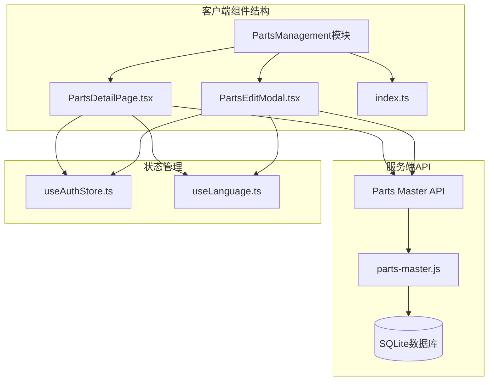
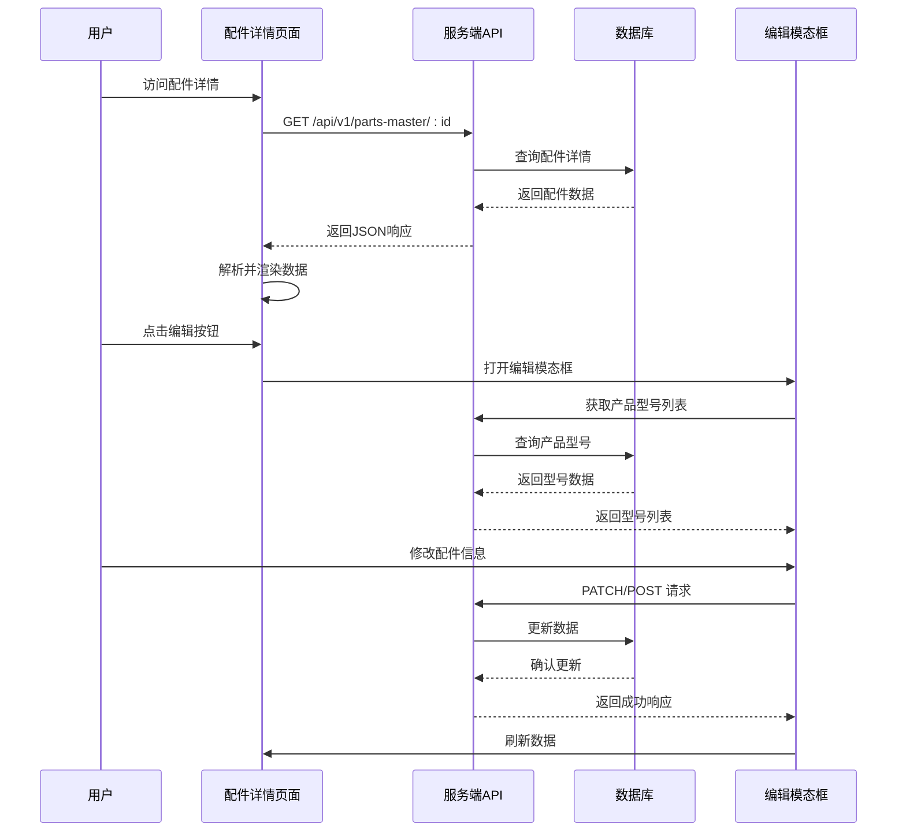
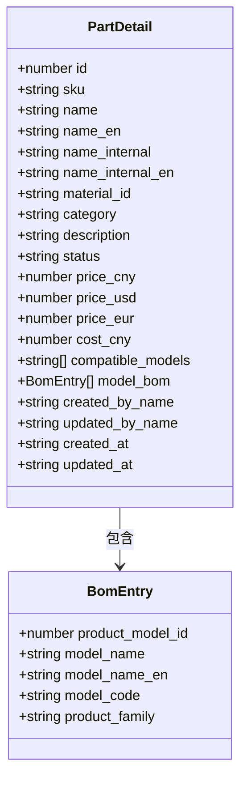
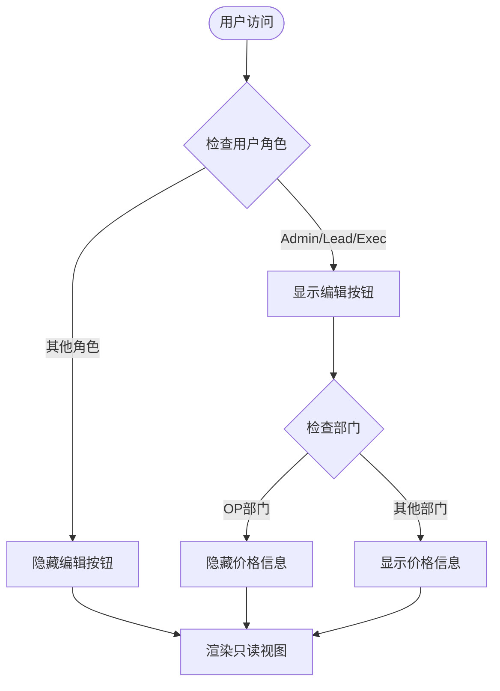
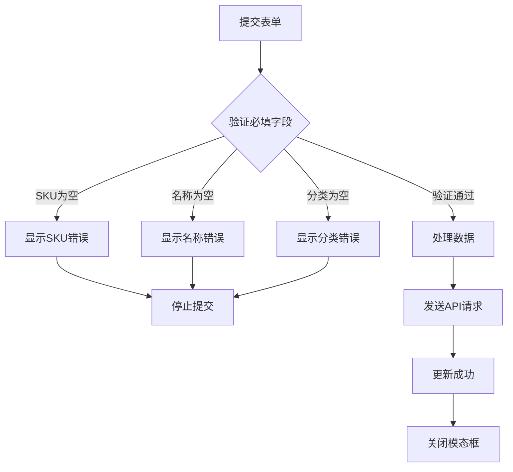
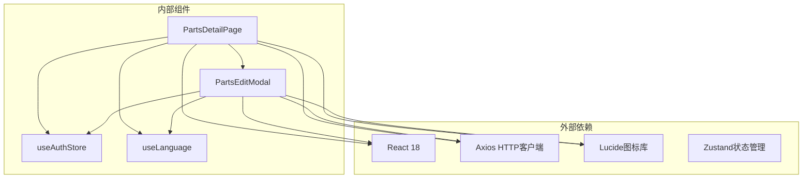

# 配件详情页面组件

<cite>
**本文档引用的文件**
- [PartsDetailPage.tsx](file://client/src/components/PartsManagement/PartsDetailPage.tsx)
- [PartsEditModal.tsx](file://client/src/components/PartsManagement/PartsEditModal.tsx)
- [index.ts](file://client/src/components/PartsManagement/index.ts)
- [useAuthStore.ts](file://client/src/store/useAuthStore.ts)
- [useLanguage.ts](file://client/src/i18n/useLanguage.ts)
- [index.css](file://client/src/index.css)
- [parts-master.js](file://server/service/routes/parts-master.js)
</cite>

## 目录
1. [简介](#简介)
2. [项目结构](#项目结构)
3. [核心组件](#核心组件)
4. [架构概览](#架构概览)
5. [详细组件分析](#详细组件分析)
6. [依赖关系分析](#依赖关系分析)
7. [性能考虑](#性能考虑)
8. [故障排除指南](#故障排除指南)
9. [结论](#结论)

## 简介

配件详情页面组件是Longhorn服务管理系统中的核心功能模块，负责展示单个维修配件的完整信息。该组件提供了配件的基本信息展示、价格信息显示、兼容机型列表管理等功能，并集成了编辑权限控制和响应式设计。

该组件采用现代化的React Hooks架构，使用TypeScript进行类型安全编程，实现了深色/浅色主题的无缝切换，并遵循macOS 26的设计语言规范。组件支持完整的CRUD操作，包括配件信息的查看、编辑和管理。

## 项目结构

配件详情页面组件位于客户端的PartsManagement模块中，采用清晰的文件组织结构：

**图表来源**
- [PartsDetailPage.tsx:1-359](file://client/src/components/PartsManagement/PartsDetailPage.tsx#L1-L359)
- [PartsEditModal.tsx:1-630](file://client/src/components/PartsManagement/PartsEditModal.tsx#L1-L630)
- [parts-master.js:1-621](file://server/service/routes/parts-master.js#L1-L621)

**章节来源**
- [PartsDetailPage.tsx:1-359](file://client/src/components/PartsManagement/PartsDetailPage.tsx#L1-L359)
- [PartsEditModal.tsx:1-630](file://client/src/components/PartsManagement/PartsEditModal.tsx#L1-L630)
- [index.ts:1-13](file://client/src/components/PartsManagement/index.ts#L1-L13)

## 核心组件

### 配件详情页面 (PartsDetailPage)

PartsDetailPage是配件详情展示的核心组件，负责渲染单个配件的完整信息。该组件实现了以下关键功能：

- **数据获取与处理**：通过API调用获取配件详情，包括基本信息、价格信息和兼容机型列表
- **权限控制**：根据用户角色和部门信息控制编辑按钮的显示
- **响应式布局**：采用网格布局设计，支持不同屏幕尺寸的适配
- **主题兼容**：完全兼容深色/浅色主题切换

### 配件编辑模态框 (PartsEditModal)

PartsEditModal提供了一个完整的配件编辑界面，支持新增和编辑两种模式：

- **双栏布局**：左侧基本信息表单，右侧价格信息和兼容机型管理
- **实时验证**：对必填字段进行实时验证和错误提示
- **模型搜索**：集成产品型号搜索功能，支持按名称、代码等条件筛选
- **价格管理**：支持多币种价格设置和成本管理

**章节来源**
- [PartsDetailPage.tsx:63-330](file://client/src/components/PartsManagement/PartsDetailPage.tsx#L63-L330)
- [PartsEditModal.tsx:87-617](file://client/src/components/PartsManagement/PartsEditModal.tsx#L87-L617)

## 架构概览

配件详情页面组件采用了清晰的分层架构设计，确保了代码的可维护性和扩展性：

**图表来源**
- [PartsDetailPage.tsx:78-96](file://client/src/components/PartsManagement/PartsDetailPage.tsx#L78-L96)
- [PartsEditModal.tsx:144-181](file://client/src/components/PartsManagement/PartsEditModal.tsx#L144-L181)
- [parts-master.js:134-195](file://server/service/routes/parts-master.js#L134-L195)

## 详细组件分析

### 配件详情页面组件

#### 数据结构设计

组件使用了精心设计的数据结构来表示配件信息：

**图表来源**
- [PartsDetailPage.tsx:32-61](file://client/src/components/PartsManagement/PartsDetailPage.tsx#L32-L61)

#### 权限控制系统

组件实现了多层次的权限控制机制：

**图表来源**
- [PartsDetailPage.tsx:75-76](file://client/src/components/PartsManagement/PartsDetailPage.tsx#L75-L76)
- [PartsDetailPage.tsx:233-253](file://client/src/components/PartsManagement/PartsDetailPage.tsx#L233-L253)

#### 主题系统集成

组件完全兼容CSS变量主题系统：

| 主题变量 | 深色模式 | 浅色模式 |
|---------|---------|---------|
| --bg-main | #000000 | #E5E7EB |
| --text-main | #FFFFFF | #1C1C1E |
| --glass-bg-hover | rgba(255, 255, 255, 0.12) | rgba(0, 0, 0, 0.12) |
| --accent-blue | #FFD200 | #E6BD00 |

**章节来源**
- [PartsDetailPage.tsx:63-330](file://client/src/components/PartsManagement/PartsDetailPage.tsx#L63-L330)
- [index.css:1-100](file://client/src/index.css#L1-L100)

### 配件编辑模态框组件

#### 表单验证机制

编辑模态框实现了严格的表单验证逻辑：

**图表来源**
- [PartsEditModal.tsx:144-181](file://client/src/components/PartsManagement/PartsEditModal.tsx#L144-L181)

#### 兼容机型管理

组件提供了强大的兼容机型管理功能：

- **智能搜索**：支持按名称、英文名、型号代码搜索
- **家族标签**：根据产品族显示不同的颜色标识
- **双向绑定**：支持添加和移除兼容机型
- **实时预览**：在模态框右侧实时显示已选择的机型

**章节来源**
- [PartsEditModal.tsx:183-193](file://client/src/components/PartsManagement/PartsEditModal.tsx#L183-L193)
- [PartsEditModal.tsx:195-204](file://client/src/components/PartsManagement/PartsEditModal.tsx#L195-L204)

## 依赖关系分析

### 组件间依赖关系

**图表来源**
- [PartsDetailPage.tsx:9-18](file://client/src/components/PartsManagement/PartsDetailPage.tsx#L9-L18)
- [PartsEditModal.tsx:11-16](file://client/src/components/PartsManagement/PartsEditModal.tsx#L11-L16)

### API接口依赖

组件与服务端API的交互遵循RESTful设计原则：

| 接口方法 | 路径 | 权限要求 | 功能描述 |
|---------|------|---------|---------|
| GET | /api/v1/parts-master/:id | 部门: MS/GE/OP | 获取配件详情 |
| POST | /api/v1/parts-master | 角色: Admin/Lead/Exec | 创建新配件 |
| PATCH | /api/v1/parts-master/:id | 角色: Admin/Lead/Exec | 更新配件信息 |
| GET | /api/v1/admin/product-models | 角色: Admin/Lead/Exec | 获取产品型号列表 |

**章节来源**
- [parts-master.js:28-128](file://server/service/routes/parts-master.js#L28-L128)
- [parts-master.js:198-315](file://server/service/routes/parts-master.js#L198-L315)

## 性能考虑

### 数据加载优化

组件实现了多种性能优化策略：

- **懒加载**：仅在需要时加载配件详情数据
- **缓存机制**：利用HTTP缓存减少重复请求
- **错误边界**：提供友好的错误处理和重试机制
- **虚拟滚动**：对于大量数据的场景提供虚拟化支持

### 渲染性能

- **React.memo**：对子组件进行记忆化处理
- **状态分离**：避免不必要的重新渲染
- **事件防抖**：对高频事件进行防抖处理
- **CSS变量**：使用CSS变量实现主题切换的高性能渲染

## 故障排除指南

### 常见问题及解决方案

| 问题类型 | 症状 | 可能原因 | 解决方案 |
|---------|------|---------|---------|
| 加载失败 | 显示错误信息 | 网络连接问题或API错误 | 检查网络连接，重试请求 |
| 权限不足 | 编辑按钮不可见 | 用户角色不正确 | 检查用户权限配置 |
| 数据不显示 | 页面空白或部分区域缺失 | API响应格式错误 | 检查API返回数据结构 |
| 主题异常 | 颜色显示不正确 | CSS变量未正确应用 | 检查主题切换逻辑 |

### 调试工具

组件提供了完善的调试支持：

- **开发工具**：使用React DevTools进行组件状态检查
- **网络监控**：监控API请求和响应
- **状态检查**：检查用户认证状态和权限信息
- **错误日志**：记录详细的错误信息和堆栈跟踪

**章节来源**
- [PartsDetailPage.tsx:91-95](file://client/src/components/PartsManagement/PartsDetailPage.tsx#L91-L95)
- [PartsEditModal.tsx:175-180](file://client/src/components/PartsManagement/PartsEditModal.tsx#L175-L180)

## 结论

配件详情页面组件是一个功能完整、设计精良的React组件，它成功地实现了以下目标：

1. **功能完整性**：提供了配件信息的完整展示和管理功能
2. **用户体验**：采用现代化的设计语言，提供流畅的用户交互体验
3. **技术先进性**：使用最新的React技术和最佳实践
4. **可维护性**：清晰的代码结构和完善的文档说明
5. **可扩展性**：模块化的架构设计便于功能扩展和维护

该组件不仅满足了当前的功能需求，还为未来的功能扩展奠定了坚实的基础。通过合理的架构设计和严格的质量控制，确保了组件的长期稳定运行和持续发展。