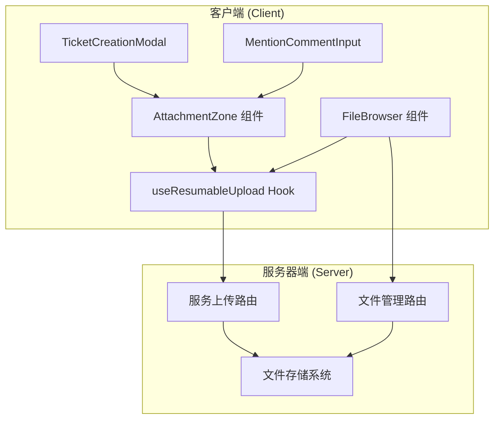
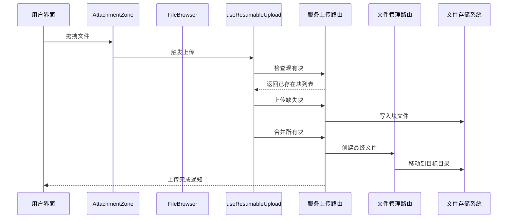
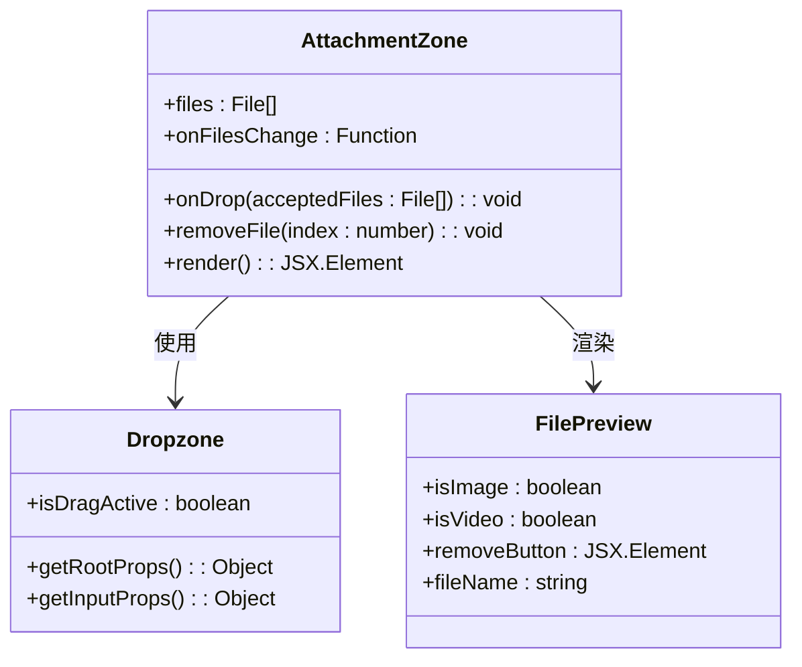
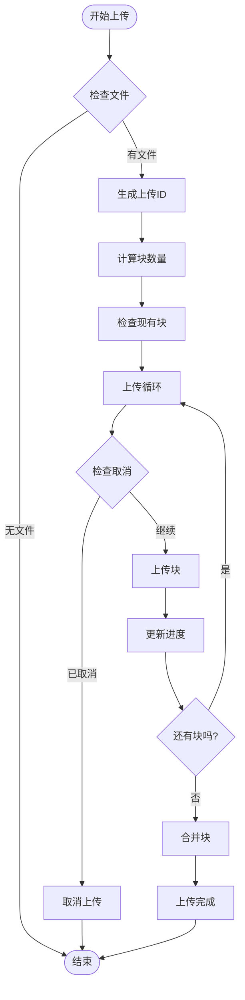
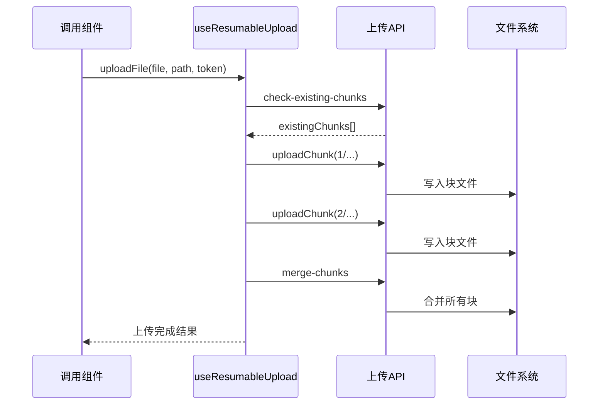
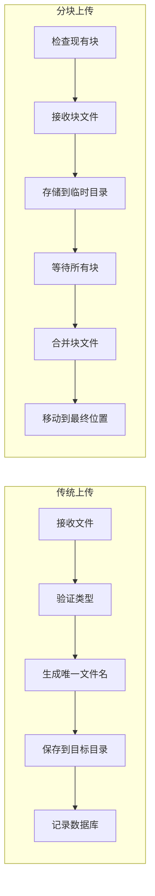
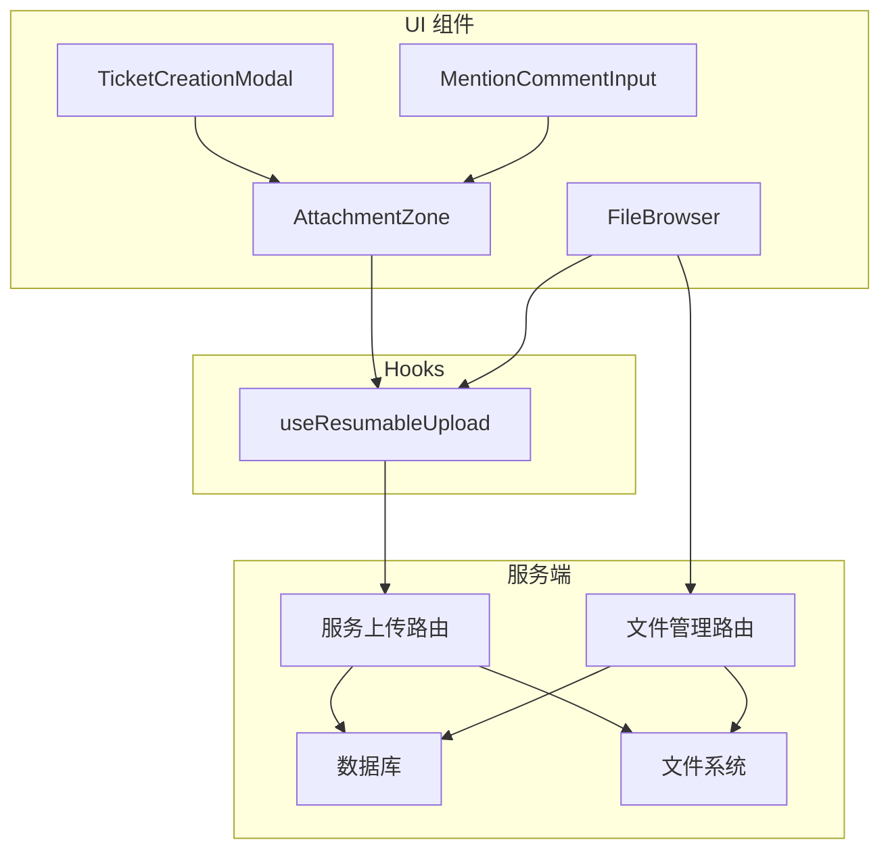

# 附件上传组件

<cite>
**本文档引用的文件**
- [AttachmentZone.tsx](file://client/src/components/Service/AttachmentZone.tsx)
- [FileBrowser.tsx](file://client/src/components/FileBrowser.tsx)
- [useResumableUpload.ts](file://client/src/hooks/useResumableUpload.ts)
- [upload.js](file://server/service/routes/upload.js)
- [routes.js](file://server/files/routes.js)
- [TicketCreationModal.tsx](file://client/src/components/Service/TicketCreationModal.tsx)
- [MentionCommentInput.tsx](file://client/src/components/Workspace/MentionCommentInput.tsx)
</cite>

## 目录
1. [简介](#简介)
2. [项目结构](#项目结构)
3. [核心组件](#核心组件)
4. [架构概览](#架构概览)
5. [详细组件分析](#详细组件分析)
6. [依赖关系分析](#依赖关系分析)
7. [性能考虑](#性能考虑)
8. [故障排除指南](#故障排除指南)
9. [结论](#结论)

## 简介

附件上传组件是 Longhorn 文件管理系统中的核心功能模块，提供了完整的文件上传、预览、管理和分享能力。该组件支持多种文件格式，包括图片、视频、PDF 和文本文件，并实现了断点续传、批量上传、拖拽上传等高级功能。

系统采用前后端分离架构，前端使用 React 和 TypeScript 构建用户界面，后端使用 Node.js 和 Express 处理文件操作。整个上传流程经过精心设计，确保了高可靠性和用户体验。

## 项目结构

附件上传组件分布在客户端和服务器端两个主要部分：

**图表来源**
- [AttachmentZone.tsx:1-108](file://client/src/components/Service/AttachmentZone.tsx#L1-L108)
- [FileBrowser.tsx:1-800](file://client/src/components/FileBrowser.tsx#L1-L800)
- [useResumableUpload.ts:1-340](file://client/src/hooks/useResumableUpload.ts#L1-L340)

**章节来源**
- [AttachmentZone.tsx:1-108](file://client/src/components/Service/AttachmentZone.tsx#L1-L108)
- [FileBrowser.tsx:1-800](file://client/src/components/FileBrowser.tsx#L1-L800)
- [useResumableUpload.ts:1-340](file://client/src/hooks/useResumableUpload.ts#L1-L340)

## 核心组件

### 附件区域组件 (AttachmentZone)

AttachmentZone 是专门用于服务场景的附件上传组件，提供了直观的拖拽上传界面：

- **拖拽支持**: 用户可以通过拖拽文件到指定区域进行上传
- **文件预览**: 支持图片、视频和文档文件的实时预览
- **文件管理**: 提供删除功能，允许用户移除不需要的文件
- **多格式支持**: 支持图片、视频、PDF 和纯文本文件

### 文件浏览器组件 (FileBrowser)

FileBrowser 是完整的文件管理界面，集成了高级上传功能：

- **断点续传**: 支持大文件的分块上传和断点续传
- **批量上传**: 可以同时上传多个文件
- **进度监控**: 实时显示上传进度和速度
- **权限控制**: 基于用户角色的文件访问权限管理

### 断点续传 Hook (useResumableUpload)

这是一个可复用的上传钩子，提供了完整的断点续传功能：

- **分块上传**: 自动将大文件分割为 5MB 的块
- **智能恢复**: 检测并跳过已上传的块
- **进度跟踪**: 精确的上传进度计算
- **网络异常处理**: 自动重连和错误恢复

**章节来源**
- [AttachmentZone.tsx:6-32](file://client/src/components/Service/AttachmentZone.tsx#L6-L32)
- [FileBrowser.tsx:340-499](file://client/src/components/FileBrowser.tsx#L340-L499)
- [useResumableUpload.ts:30-339](file://client/src/hooks/useResumableUpload.ts#L30-L339)

## 架构概览

附件上传系统的整体架构采用分层设计，确保了功能的模块化和可维护性：

**图表来源**
- [AttachmentZone.tsx:14-22](file://client/src/components/Service/AttachmentZone.tsx#L14-L22)
- [FileBrowser.tsx:376-474](file://client/src/components/FileBrowser.tsx#L376-L474)
- [useResumableUpload.ts:64-173](file://client/src/hooks/useResumableUpload.ts#L64-L173)

系统的核心优势在于其断点续传机制，这使得即使在网络不稳定的情况下也能保证上传的可靠性。

**章节来源**
- [upload.js:1-205](file://server/service/routes/upload.js#L1-L205)
- [routes.js:431-496](file://server/files/routes.js#L431-L496)

## 详细组件分析

### AttachmentZone 组件分析

AttachmentZone 组件采用了现代化的 React 设计模式：

**图表来源**
- [AttachmentZone.tsx:6-108](file://client/src/components/Service/AttachmentZone.tsx#L6-L108)

组件特点：
- **响应式设计**: 支持不同屏幕尺寸的设备
- **即时反馈**: 拖拽激活时提供视觉反馈
- **文件类型限制**: 通过 MIME 类型过滤支持的文件类型
- **预览功能**: 自动生成缩略图和文件图标

**章节来源**
- [AttachmentZone.tsx:24-32](file://client/src/components/Service/AttachmentZone.tsx#L24-L32)
- [AttachmentZone.tsx:60-102](file://client/src/components/Service/AttachmentZone.tsx#L60-L102)

### FileBrowser 组件上传流程

FileBrowser 组件实现了复杂的上传逻辑，特别是断点续传功能：

**图表来源**
- [FileBrowser.tsx:376-474](file://client/src/components/FileBrowser.tsx#L376-L474)

**章节来源**
- [FileBrowser.tsx:358-499](file://client/src/components/FileBrowser.tsx#L358-L499)

### useResumableUpload Hook 分析

useResumableUpload Hook 提供了完整的断点续传功能：

**图表来源**
- [useResumableUpload.ts:178-307](file://client/src/hooks/useResumableUpload.ts#L178-L307)

**章节来源**
- [useResumableUpload.ts:44-59](file://client/src/hooks/useResumableUpload.ts#L44-L59)
- [useResumableUpload.ts:178-307](file://client/src/hooks/useResumableUpload.ts#L178-L307)

### 服务器端上传处理

服务器端提供了两种上传方式：传统上传和分块上传：

**图表来源**
- [upload.js:96-154](file://server/service/routes/upload.js#L96-L154)
- [routes.js:446-496](file://server/files/routes.js#L446-L496)

**章节来源**
- [upload.js:27-74](file://server/service/routes/upload.js#L27-L74)
- [routes.js:431-496](file://server/files/routes.js#L431-L496)

## 依赖关系分析

附件上传组件之间的依赖关系如下：

**图表来源**
- [AttachmentZone.tsx:1-108](file://client/src/components/Service/AttachmentZone.tsx#L1-L108)
- [FileBrowser.tsx:1-800](file://client/src/components/FileBrowser.tsx#L1-L800)
- [useResumableUpload.ts:1-340](file://client/src/hooks/useResumableUpload.ts#L1-L340)

**章节来源**
- [TicketCreationModal.tsx:616-633](file://client/src/components/Service/TicketCreationModal.tsx#L616-L633)
- [MentionCommentInput.tsx:333-350](file://client/src/components/Workspace/MentionCommentInput.tsx#L333-L350)

## 性能考虑

附件上传组件在设计时充分考虑了性能优化：

### 断点续传优化
- **智能块检测**: 自动跳过已上传的块，避免重复传输
- **并发控制**: 合理的并发上传策略，平衡速度和稳定性
- **内存管理**: 及时释放文件对象，避免内存泄漏

### 网络优化
- **进度计算**: 精确的总进度计算，包含所有文件的上传进度
- **速率监控**: 实时显示上传速度，提供更好的用户体验
- **错误重试**: 自动重试机制，提高上传成功率

### 存储优化
- **文件命名**: 自动生成唯一的文件名，避免冲突
- **目录组织**: 按功能分类的目录结构，便于管理
- **权限控制**: 细粒度的文件访问权限管理

## 故障排除指南

### 常见问题及解决方案

**上传失败**
- 检查网络连接是否稳定
- 确认目标目录是否有写入权限
- 验证文件大小是否超过限制

**断点续传异常**
- 确认服务器磁盘空间充足
- 检查临时目录的读写权限
- 验证文件系统完整性

**进度显示异常**
- 刷新页面重新开始上传
- 检查浏览器控制台的错误信息
- 确认客户端和服务器的时间同步

**权限问题**
- 验证用户登录状态
- 检查部门权限设置
- 确认目标文件夹的访问权限

**章节来源**
- [FileBrowser.tsx:481-499](file://client/src/components/FileBrowser.tsx#L481-L499)
- [useResumableUpload.ts:299-307](file://client/src/hooks/useResumableUpload.ts#L299-L307)

## 结论

附件上传组件是一个功能完整、设计精良的文件管理解决方案。它成功地结合了现代前端技术和可靠的后端架构，为用户提供了流畅的文件上传体验。

主要优势包括：
- **可靠性**: 断点续传确保大文件上传的稳定性
- **易用性**: 直观的拖拽界面和实时进度反馈
- **扩展性**: 模块化的架构设计便于功能扩展
- **安全性**: 完善的权限控制和文件验证机制

该组件为 Longhorn 系统的文档管理和协作功能奠定了坚实的基础，是整个文件管理系统的重要组成部分。