# 服务 PRD_P2 服务产品需求文档

<cite>
**本文档引用的文件**
- [Service_UserScenarios.md](file://docs/Service_UserScenarios.md)
- [Service_PRD_P2.md](file://docs/Service_PRD_P2.md)
- [Service_PRD_P2_warranty_update.md](file://docs/Service_PRD_P2_warranty_update.md)
- [warranty_implementation_plan.md](file://docs/warranty_implementation_plan.md)
- [App.tsx](file://client/src/App.tsx)
- [index.js](file://server/index.js)
- [service/index.js](file://server/service/index.js)
- [tickets.js](file://server/service/routes/tickets.js)
- [dealer-inventory.js](file://server/service/routes/dealer-inventory.js)
- [warranty.js](file://server/service/routes/warranty.js)
- [warranty_service.js](file://server/service/warranty_service.js)
- [products.js](file://server/service/routes/products.js)
- [products-admin.js](file://server/service/routes/products-admin.js)
- [product-models-admin.js](file://server/service/routes/product-models-admin.js)
- [product-skus.js](file://server/service/routes/product-skus.js)
- [API_DOCUMENTATION.md](file://docs/API_DOCUMENTATION.md)
- [sla_service.js](file://server/service/sla_service.js)
- [notifications.js](file://server/service/routes/notifications.js)
- [permission.js](file://server/service/middleware/permission.js)
- [ticket-activities.js](file://server/service/routes/ticket-activities.js)
- [accounts.js](file://server/service/routes/accounts.js)
- [contacts.js](file://server/service/routes/contacts.js)
- [020_p2_unified_tickets.sql](file://server/service/migrations/020_p2_unified_tickets.sql)
- [029_warranty_calculation.sql](file://server/service/migrations/029_warranty_calculation.sql)
- [033_product_architecture_upgrade.sql](file://server/service/migrations/033_product_architecture_upgrade.sql)
- [035_force_seed_models_skus.sql](file://server/service/migrations/035_force_seed_models_skus.sql)
- [phase2.sql](file://server/migrations/phase2.sql)
- [system.js](file://server/service/routes/system.js)
- [statistics.js](file://server/service/routes/statistics.js)
- [settings.js](file://server/service/routes/settings.js)
- [issues.js](file://server/service/routes/issues.js)
- [compatibility.js](file://server/service/routes/compatibility.js)
- [knowledge_audit.js](file://server/service/routes/knowledge_audit.js)
- [KnowledgeAuditLog.tsx](file://client/src/components/KnowledgeAuditLog.tsx)
- [ParticipantsSidebar.tsx](file://client/src/components/Workspace/ParticipantsSidebar.tsx)
- [UnifiedTicketDetail.tsx](file://client/src/components/Workspace/UnifiedTicketDetail.tsx)
- [ViewAsComponents.tsx](file://client/src/components/Workspace/ViewAsComponents.tsx)
- [SubmitDiagnosticModal.tsx](file://client/src/components/Workspace/SubmitDiagnosticModal.tsx)
- [MSReviewPanel.tsx](file://client/src/components/Workspace/MSReviewPanel.tsx)
- [WarrantyDetailModal.tsx](file://client/src/components/Workspace/WarrantyDetailModal.tsx)
- [ProductModelsManagement.tsx](file://client/src/components/ProductModelsManagement.tsx)
- [ProductSkusManagement.tsx](file://client/src/components/ProductSkusManagement.tsx)
- [ProductManagement.tsx](file://client/src/components/ProductManagement.tsx)
- [ProductModelDetailPage.tsx](file://client/src/components/ProductModelDetailPage.tsx)
- [023_migrate_user_roles.js](file://server/service/migrations/023_migrate_user_roles.js)
- [025_ticket_audit_softdelete.sql](file://server/service/migrations/025_ticket_audit_softdelete.sql)
- [024_add_account_lifecycle.sql](file://server/service/migrations/024_add_account_lifecycle.sql)
- [fix_missing_accounts.js](file://server/scripts/fix_missing_accounts.js)
- [test_view_as.js](file://server/scripts/test_view_as.js)
- [Service_DataModel.md](file://docs/Service_DataModel.md)
- [Service_API.md](file://docs/Service_API.md)
- [log_prompt.md](file://docs/log_prompt.md)
</cite>

## 更新摘要
**所做更改**
- 更新产品目录访问权限政策，从基于角色的限制扩展为对所有内部人员的通用访问
- 新增MS和OP部门的通用访问权限，无需Admin或Exec权限
- 更新产品管理前端路由权限，支持更广泛的内部人员访问
- 新增产品模型和SKU的通用访问控制逻辑
- 更新权限中间件，支持内部人员的穿透式访问

## 目录
1. [项目概述](#项目概述)
2. [P2架构升级概览](#p2架构升级概览)
3. [统一工单系统](#统一工单系统)
4. [SLA引擎](#sla引擎)
5. [通知中心](#通知中心)
6. [权限中间件](#权限中间件)
7. [工单活动时间轴](#工单活动时间轴)
8. [账户-联系人双层架构](#账户-联系人双层架构)
9. [三层工单模型](#三层工单模型)
10. [用户角色与权限](#用户角色与权限)
11. [审计和可见性要求](#审计和可见性要求)
12. [软删除机制](#软删除机制)
13. [保修计算引擎](#保修计算引擎)
14. [三层产品架构](#三层产品架构)
15. [工作区协作功能规范](#工作区协作功能规范)
16. [客户生命周期管理](#客户生命周期管理)
17. [权限系统改进](#权限系统改进)
18. [数据清理脚本](#数据清理脚本)
19. [核心功能模块](#核心功能模块)
20. [系统架构](#系统架构)
21. [API接口设计](#api接口设计)
22. [数据模型](#数据模型)
23. [业务流程](#业务流程)
24. [性能与扩展性](#性能与扩展性)
25. [安全与权限控制](#安全与权限控制)
26. [向后兼容API](#向后兼容api)
27. [统一查询参数](#统一查询参数)
28. [总结](#总结)

## 项目概述

Longhorn服务系统经过Phase 2.0的重大架构升级，现已发展为一个功能完整、架构清晰的企业级服务管理平台。系统采用统一工单模型，集成了SLA引擎、通知中心、权限中间件、审计日志、软删除机制、保修计算引擎、三层产品架构、工作区协作和客户生命周期管理等新功能，为企业用户提供更加智能化、高效且合规的服务管理体验。

### 系统特性

- **统一工单系统**：单表多态设计，支持咨询工单、RMA返厂单、经销商维修单的统一管理
- **智能SLA引擎**：基于优先级的自动化SLA计算和状态监控
- **macOS风格通知中心**：实时通知推送和消息管理
- **穿透式权限控制**：基于角色的精细化权限管理和视图模式
- **工单活动时间轴**：完整的评论、提醒和活动历史管理
- **账户-联系人双层架构**：独立的账户管理和联系人路由
- **审计和可见性**：完整操作审计日志和合规性追踪
- **软删除机制**：工单软删除功能，支持数据恢复和审计追踪
- **保修计算引擎**：分离OP技术判定与MS商业保修判定的两阶段流程
- **三层产品架构**：产品目录、商品规格、设备台账的三层结构
- **工作区协作**：智能参与者管理和协作功能
- **客户生命周期管理**：完整的客户状态管理和自动升级机制
- **权限系统改进**：增强的ViewAs角色切换功能
- **数据清理工具**：自动化数据修复和迁移脚本
- **多端支持**：Web端和iOS端双平台支持
- **AI智能辅助**：集成AI服务提供智能分类、回复建议等功能
- **向后兼容API**：保持与现有系统的兼容性

## P2架构升级概览

Phase 2.0服务系统引入了多项重大架构升级，形成了全新的统一服务管理平台。

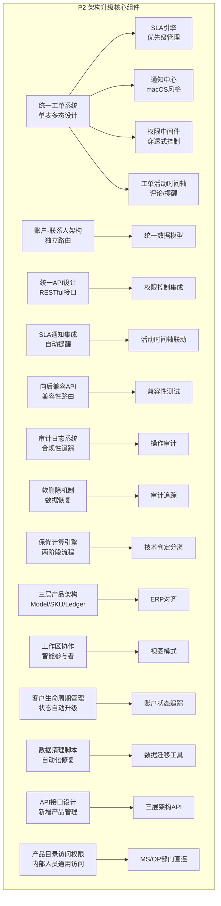

**图表来源**
- [service/index.js:50-53](file://server/service/index.js#L50-L53)
- [020_p2_unified_tickets.sql:1-27](file://server/service/migrations/020_p2_unified_tickets.sql#L1-L27)

### 架构升级要点

1. **统一工单模型**：将原有的三个独立工单系统整合为统一的单表多态设计
2. **智能SLA管理**：引入基于优先级的自动化SLA计算和状态监控
3. **实时通知系统**：实现macOS风格的通知中心，支持多种通知类型
4. **权限控制增强**：提供穿透式的权限中间件，支持视图模式
5. **活动时间轴**：完整的工单活动历史记录和评论管理
6. **账户架构优化**：独立的账户和联系人管理路由
7. **审计合规性**：新增完整的操作审计日志和合规性追踪
8. **软删除机制**：工单软删除功能，支持数据恢复和审计追踪
9. **保修计算引擎**：分离OP技术判定与MS商业判定，实现两阶段流程
10. **三层产品架构**：产品目录、商品规格、设备台账的三层结构
11. **协作功能增强**：智能参与者管理和工作区协作功能
12. **客户生命周期管理**：完整的客户状态管理和自动升级机制
13. **权限系统改进**：增强的ViewAs角色切换功能
14. **数据清理工具**：自动化数据修复和迁移脚本
15. **向后兼容性**：保持与现有系统的API兼容性
16. **统一查询接口**：提供统一的工单查询参数和过滤机制
17. **API扩展**：新增保修计算和产品管理相关API端点
18. **产品目录访问权限**：扩展为对所有内部人员的通用访问

**章节来源**
- [service/index.js:50-53](file://server/service/index.js#L50-L53)
- [020_p2_unified_tickets.sql:1-27](file://server/service/migrations/020_p2_unified_tickets.sql#L1-L27)

## 统一工单系统

统一工单系统是P2架构升级的核心组件，采用单表多态设计，将咨询工单、RMA返厂单、经销商维修单整合为统一的工单管理平台。

### 工单类型与状态机

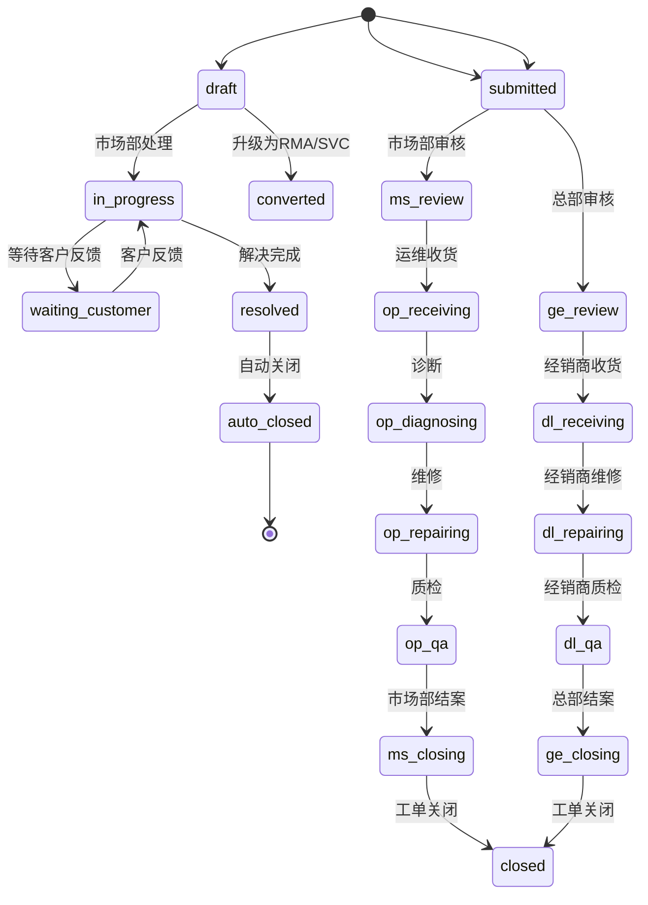

**图表来源**
- [tickets.js:15-20](file://server/service/routes/tickets.js#L15-L20)

### 工单优先级管理

| 优先级 | 首次响应时间 | 方案输出时间 | 报价输出时间 | 完结时间 | 适用场景 |
|--------|-------------|-------------|-------------|---------|---------|
| **P0** | 2小时 | 4小时 | 24小时 | 36小时 | 紧急问题，关键客户 |
| **P1** | 8小时 | 24小时 | 48小时 | 3个工作日 | 高优先级问题 |
| **P2** | 24小时 | 48小时 | 5天 | 7个工作日 | 常规服务请求 |

### 工单审计集成

统一工单系统现已集成审计日志功能，所有工单操作都将被完整记录：

- **操作类型**：创建、更新、删除、状态变更、指派等
- **审计字段**：操作者信息、时间戳、变更详情、影响范围
- **合规性**：支持监管要求和内部审计追踪
- **性能影响**：异步记录，不影响主业务流程

### 保修计算集成

统一工单系统现已集成保修计算功能，支持技术损坏判定和商业保修审核的分离：

- **技术损坏判定**：OP技术人员进行物理损坏评估
- **保修计算引擎**：MS部门自动计算保修状态和有效期
- **费用预估**：两阶段费用确认流程
- **数据存储**：JSON格式存储复杂的保修计算结果

**章节来源**
- [tickets.js:472-486](file://server/service/routes/tickets.js#L472-L486)
- [sla_service.js:9-28](file://server/service/sla_service.js#L9-L28)
- [025_ticket_audit_softdelete.sql:1-50](file://server/service/migrations/025_ticket_audit_softdelete.sql#L1-L50)

## SLA引擎

SLA引擎是P2架构中的智能管理组件，提供基于优先级的自动化SLA计算和状态监控。

### SLA时长矩阵

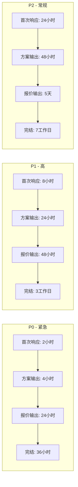

**图表来源**
- [sla_service.js:9-28](file://server/service/sla_service.js#L9-L28)

### SLA状态监控

SLA引擎提供三种状态监控：

1. **正常状态**：工单在SLA时限内
2. **警告状态**：剩余时间少于25%时触发
3. **超时状态**：工单已超过SLA时限

### SLA计算逻辑

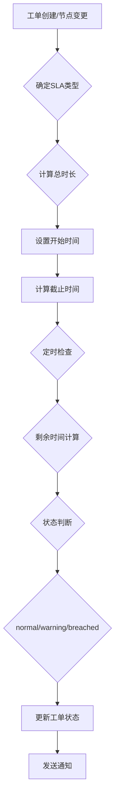

**图表来源**
- [sla_service.js:85-122](file://server/service/sla_service.js#L85-L122)

**章节来源**
- [sla_service.js:85-122](file://server/service/sla_service.js#L85-L122)
- [sla_service.js:174-225](file://server/service/sla_service.js#L174-L225)

## 通知中心

通知中心提供macOS风格的通知系统，支持多种通知类型和实时消息管理。

### 通知类型

| 通知类型 | 触发场景 | 图标 | 作用 |
|----------|----------|------|------|
| **sla_warning** | SLA即将超时 | ⚠️ | 提醒处理时限 |
| **sla_breach** | SLA已超时 | ❗ | 紧急处理提醒 |
| **assignment** | 工单指派 | 📝 | 新工单通知 |
| **status_change** | 状态变更 | 🔔 | 流程更新通知 |
| **new_comment** | 新评论 | 💬 | 互动提醒 |
| **mention** | @提及 | 👀 | 特定用户提醒 |
| **system_announce** | 系统公告 | 📢 | 重要通知 |

### 通知管理API

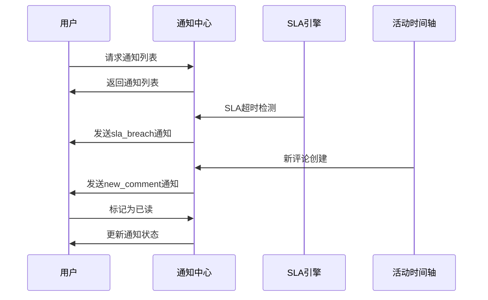

**图表来源**
- [notifications.js:85-151](file://server/service/routes/notifications.js#L85-L151)

**章节来源**
- [notifications.js:85-151](file://server/service/routes/notifications.js#L85-L151)
- [notifications.js:363-395](file://server/service/routes/notifications.js#L363-L395)

## 权限中间件

权限中间件提供穿透式的权限控制系统，支持基于角色的精细化权限管理和视图模式功能。

### 角色权限矩阵

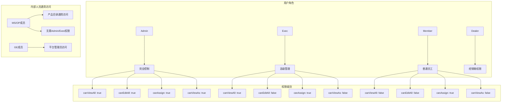

**图表来源**
- [permission.js:11-52](file://server/service/middleware/permission.js#L11-L52)

### 权限检查流程

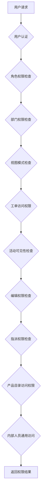

**图表来源**
- [permission.js:83-210](file://server/service/middleware/permission.js#L83-L210)

### 产品目录访问权限

**更新** 产品目录访问权限已从基于角色的限制扩展为对所有内部人员的通用访问：

- **Admin/Exec**：完全控制权限
- **MS成员**：产品目录通用访问权限
- **OP成员**：产品目录通用访问权限  
- **GE成员**：平台管理员访问权限
- **无需Admin/Exec权限**：MS/OP部门成员可直接访问产品目录

**章节来源**
- [permission.js:83-210](file://server/service/middleware/permission.js#L83-L210)
- [permission.js:226-246](file://server/service/middleware/permission.js#L226-L246)

## 工单活动时间轴

工单活动时间轴提供完整的评论、提醒和活动历史管理功能，支持多种可见性和交互方式。

### 活动类型

| 活动类型 | 描述 | 可见性 | 作用 |
|----------|------|--------|------|
| **comment** | 评论内容 | all/internal/op_only | 用户交流 |
| **internal_note** | 内部备注 | internal/op_only | 内部记录 |
| **priority_change** | 优先级变更 | all | 状态更新 |
| **status_change** | 状态变更 | all | 流程跟踪 |
| **mention** | @提及提醒 | internal | 用户互动 |
| **assignment** | 工单指派 | all | 责任转移 |
| **system_event** | 系统事件 | internal | 系统操作记录 |
| **diagnostic_report** | 诊断报告 | all | 技术评估记录 |

### 活动可见性控制

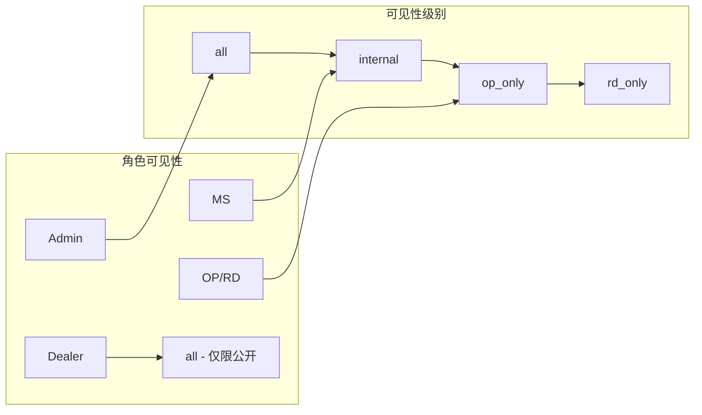

**图表来源**
- [ticket-activities.js:125-147](file://server/service/routes/ticket-activities.js#L125-L147)

### @提及功能

系统支持智能@提及功能，自动解析评论中的用户提及并发送通知：

1. **@用户名**：自动查找用户并发送通知
2. **@[@姓名](用户ID)**：精确指定用户
3. **自动参与者添加**：被提及用户自动加入工单参与者
4. **提及活动记录**：记录@提及活动便于追溯

**章节来源**
- [ticket-activities.js:17-43](file://server/service/routes/ticket-activities.js#L17-L43)
- [ticket-activities.js:129-206](file://server/service/routes/ticket-activities.js#L129-L206)
- [ticket-activities.js:208-338](file://server/service/routes/ticket-activities.js#L208-L338)

## 账户-联系人双层架构

账户-联系人双层架构提供独立的账户管理和联系人路由，支持企业级客户关系管理。

### 账户类型

| 账户类型 | 代码 | 描述 | 适用场景 |
|----------|------|------|---------|
| **DEALER** | DL | 经销商 | 分销商、代理商 |
| **ORGANIZATION** | ORG | 企业组织 | 企业客户 |
| **INDIVIDUAL** | IND | 个人 | 个人消费者 |
| **INTERNAL** | INT | 内部部门 | 公司内部部门 |

### 联系人管理

联系人系统提供独立的CRUD操作，支持跨账户联系人查询和管理：

1. **独立路由**：联系人操作不再依赖账户路径
2. **跨账户查询**：支持按账户筛选联系人
3. **状态管理**：支持ACTIVE、INACTIVE、PRIMARY状态
4. **偏好设置**：语言偏好和沟通偏好管理

**章节来源**
- [accounts.js:40-169](file://server/service/routes/accounts.js#L40-L169)
- [contacts.js:14-102](file://server/service/routes/contacts.js#L14-L102)

## 三层工单模型

系统采用创新的三层工单模型，实现了从客户咨询到最终维修的完整服务闭环。

```mermaid
graph TB
subgraph "三层工单模型"
A[咨询工单<br/>KYYMM-XXXX<br/>客户咨询、问题排查、远程协助] --> B[RMA返厂单<br/>RMA-{C/D}-YYMM-XXXX<br/>设备寄回总部维修]
A --> C[经销商维修单<br/>SVC-D-YYMM-XXXX<br/>本地维修、配件消耗]
B --> D[总部维修中心<br/>专业维修、质量控制]
C --> E[一级经销商<br/>区域分销商]
C --> F[二级经销商<br/>有维修能力]
C --> G[三级经销商<br/>无维修能力]
end
```

**图表来源**
- [Service_UserScenarios.md:10-31](file://docs/Service_UserScenarios.md#L10-L31)

### 工单类型详解

| 工单类型 | ID格式 | 示例 | 用途 | 适用阶段 |
|---------|--------|------|------|---------|
| **咨询工单** | KYYMM-XXXX | K2602-0001 | 客户咨询、问题排查、远程协助等 | 1.0/2.0/3.0 |
| **RMA返厂单** | RMA-{C}-YYMM-XXXX | RMA-D-2602-0001 | 设备寄回Kinefinity总部维修 | 1.0/2.0 |
| **经销商维修单** | SVC-D-YYMM-XXXX | SVC-D-2602-0001 | 经销商本地维修，配件消耗管理 | 1.0/2.0 |

### 系统开放阶段

| 阶段 | 开放对象 | 咨询工单 | RMA返厂单 | 经销商维修单 |
|-----|---------|---------|----------|-------------|
| **1.0** | 市场部 | 市场部创建 | 市场部代创建 | 市场部代创建 |
| **2.0** | 经销商 | 经销商可创建 | 经销商提交需审批 | 经销商自行管理 |
| **3.0** | 终端客户 | 客户可提交 | - | - |

**章节来源**
- [Service_UserScenarios.md:10-80](file://docs/Service_UserScenarios.md#L10-L80)

## 用户角色与权限

系统定义了多层次的用户角色体系，确保不同角色具有相应的操作权限和责任范围。

### 平台角色标准化

经过角色迁移，用户角色体系已标准化：

| 平台角色 | 职位头衔 | 描述 | 权限范围 |
|----------|----------|------|---------|
| **Admin** | 管理员 | 系统完全控制 | 全部功能 |
| **Exec** | 执行官 | 高级管理权限 | 管理功能 |
| **Member** | 普通员工 | 基础操作权限 | 业务功能 |
| **Dealer** | 经销商 | 特殊业务权限 | 经销商业务 |

### 角色权限矩阵更新

| 角色 | 代表人物/示例 | 使用端 | 主要职责 | 权限范围 |
|-----|-------------|-------|---------|---------|
| **Admin** | 管理员 | Web + iOS | 系统管理、用户管理、审计 | 完全控制 |
| **Exec** | Jihua | Web + iOS | 高层决策、报表分析 | 管理功能 |
| **Member** | 黄碧珊、陈高松 | Web | 具体业务操作 | 业务功能 |
| **Dealer** | ProAV、Gafpa | Web | 经销商业务、客户服务 | 经销商业务 |

### 经销商分级说明

| 分级 | 特点 | 配件库存 | 维修能力 | 结算方式 |
|-----|------|---------|---------|---------|
| **一级** | 区域分销商，销售能力强 | 有，定期补货 | 强 | 定期结算 |
| **二级** | 有维修能力，销售能力一般 | 无，需临时发货 | 有 | 单次开PI |
| **三级** | 无维修能力，销售能力一般 | 无 | 无 | 单次开PI |

**章节来源**
- [Service_UserScenarios.md:34-78](file://docs/Service_UserScenarios.md#L34-L78)
- [023_migrate_user_roles.js:22-30](file://server/service/migrations/023_migrate_user_roles.js#L22-L30)

## 审计和可见性要求

系统新增完整的审计和可见性要求，确保所有操作都可追踪、可审计、符合合规性标准。

### 知识库审计日志

知识库操作审计日志提供完整的操作追踪功能：

#### 审计日志类型

| 操作类型 | 描述 | 记录字段 | 合规用途 |
|----------|------|----------|---------|
| **create** | 文章创建 | 标题、内容、分类 | 创建追踪 |
| **update** | 文章更新 | 修改前后对比、变更摘要 | 变更审计 |
| **delete** | 文章删除 | 删除原因、恢复选项 | 删除审计 |
| **publish** | 文章发布 | 发布状态、发布时间 | 发布追踪 |
| **archive** | 文章归档 | 归档原因、归档时间 | 归档审计 |
| **import** | 批量导入 | 导入批次、导入数量 | 批量操作审计 |

#### 审计日志字段

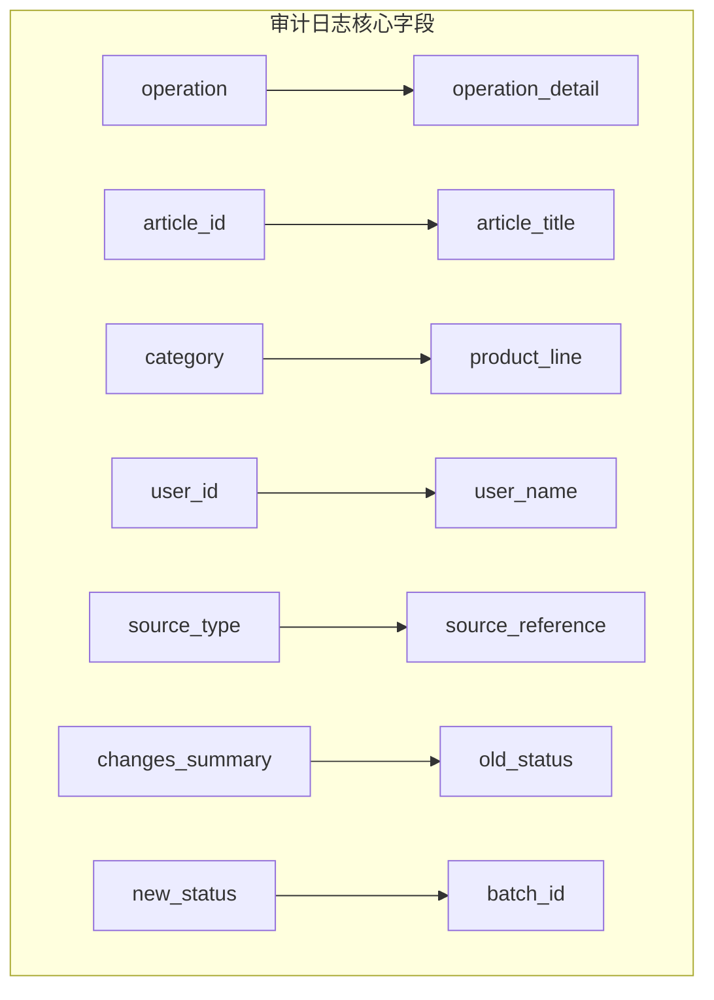

**图表来源**
- [knowledge_audit.js:16-74](file://server/service/routes/knowledge_audit.js#L16-L74)

#### 审计权限控制

- **访问权限**：仅Admin可访问审计日志
- **数据脱敏**：敏感信息进行脱敏处理
- **访问日志**：审计日志访问行为也被记录
- **合规导出**：支持审计数据导出

### 工单审计集成

统一工单系统集成审计功能：

#### 工单审计事件

| 事件类型 | 触发条件 | 审计内容 | 存储位置 |
|----------|----------|----------|---------|
| **工单创建** | 新建工单 | 创建者、创建时间、初始状态 | 工单表审计字段 |
| **状态变更** | 节点推进 | 变更人、变更时间、变更详情 | 工单活动表 |
| **优先级调整** | 优先级修改 | 调整人、调整原因、影响范围 | 工单活动表 |
| **指派操作** | 指派处理人 | 指派人、被指派人、指派原因 | 工单活动表 |
| **评论操作** | 新增/编辑评论 | 评论人、评论内容、可见性 | 工单活动表 |
| **软删除操作** | 工单删除 | 删除人、删除时间、删除原因 | 工单活动表 |
| **保修计算** | 保修状态变更 | 计算结果、计算依据、影响范围 | 工单表 |

#### 审计查询接口

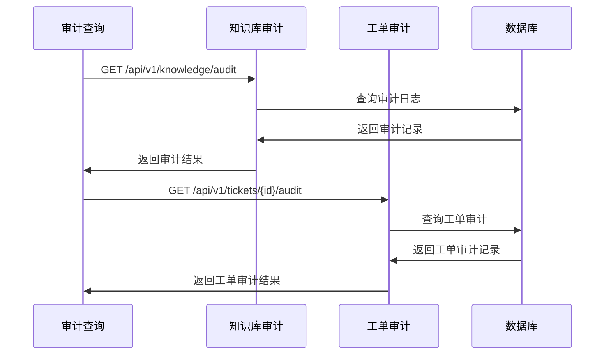

**图表来源**
- [knowledge_audit.js:77-190](file://server/service/routes/knowledge_audit.js#L77-L190)

**章节来源**
- [knowledge_audit.js:1-281](file://server/service/routes/knowledge_audit.js#L1-L281)
- [KnowledgeAuditLog.tsx:64-100](file://client/src/components/KnowledgeAuditLog.tsx#L64-L100)

## 软删除机制

系统新增软删除机制，支持工单的软删除和数据恢复功能，同时保持完整的审计追踪。

### 软删除实现

#### 数据库结构变更

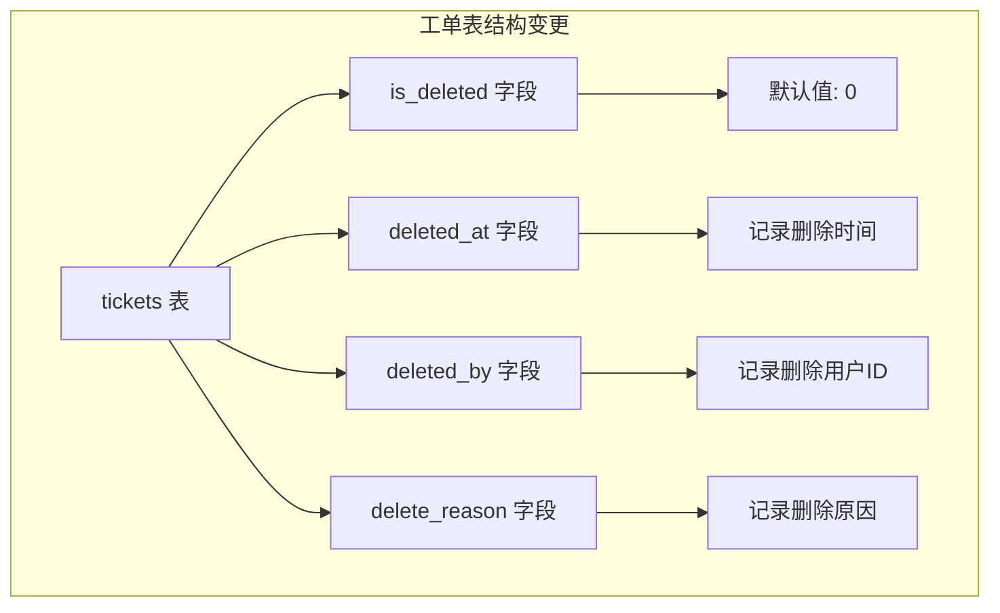

**图表来源**
- [025_ticket_audit_softdelete.sql:1-18](file://server/service/migrations/025_ticket_audit_softdelete.sql#L1-L18)

#### 软删除字段说明

| 字段名 | 类型 | 默认值 | 描述 | 约束 |
|--------|------|--------|------|------|
| **is_deleted** | INTEGER | 0 | 工单删除状态 | DEFAULT 0 |
| **deleted_at** | TEXT | NULL | 删除时间戳 | |
| **deleted_by** | INTEGER | NULL | 删除用户ID | REFERENCES users(id) |
| **delete_reason** | TEXT | NULL | 删除原因说明 | |

### 软删除流程

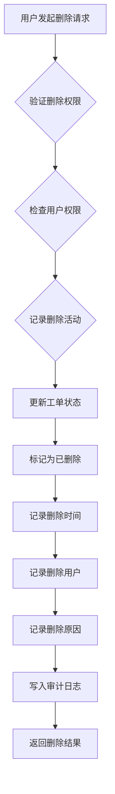

**图表来源**
- [tickets.js:1212-1233](file://server/service/routes/tickets.js#L1212-L1233)

### 软删除审计事件

软删除操作会生成专门的审计事件：

1. **软删除活动记录**：在工单活动时间轴中记录删除事件
2. **系统事件类型**：使用 `soft_delete` 事件类型
3. **删除详情**：包含删除原因、删除用户、删除时间
4. **审计追踪**：完整的删除操作审计记录

### 数据查询过滤

系统自动过滤已删除的工单数据：

1. **默认查询**：查询时自动排除已删除工单
2. **索引优化**：为 `is_deleted` 字段建立索引
3. **查询性能**：使用索引快速过滤已删除数据
4. **权限控制**：删除权限仅限管理员和特定角色

**章节来源**
- [025_ticket_audit_softdelete.sql:1-50](file://server/service/migrations/025_ticket_audit_softdelete.sql#L1-L50)
- [tickets.js:1212-1233](file://server/service/routes/tickets.js#L1212-L1233)

## 保修计算引擎

系统新增保修计算引擎，实现OP技术判定与MS商业保修判定的分离，采用两阶段费用确认流程。

### 保修计算原则

保修计算由 **MS 部门在 `ms_review` 节点** 自动触发，综合以下两类数据：

| 数据类型 | 字段 | 说明 |
|----------|------|------|
| **设备基础数据** (IB) | `iot_activation_date` | IoT激活日期（最高优先级） |
| | `sales_invoice_date` | 销售发票日期 |
| | `registration_date` | 官网注册日期 |
| | `ship_date` / `ship_to_dealer_date` | 发货日期 |
| **OP技术判定** | `technical_damage_status` | 人为损坏/物理损伤会**直接否定保修** |
| | `technical_warranty_suggestion` | OP的技术建议（供MS参考） |

### 保修计算逻辑（瀑布流 + 人为损坏拦截）

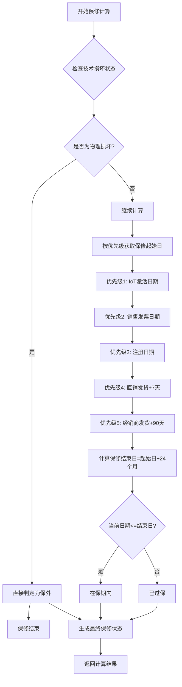

**图表来源**
- [warranty.js:167-239](file://server/service/routes/warranty.js#L167-L239)

### MS审核界面显示内容

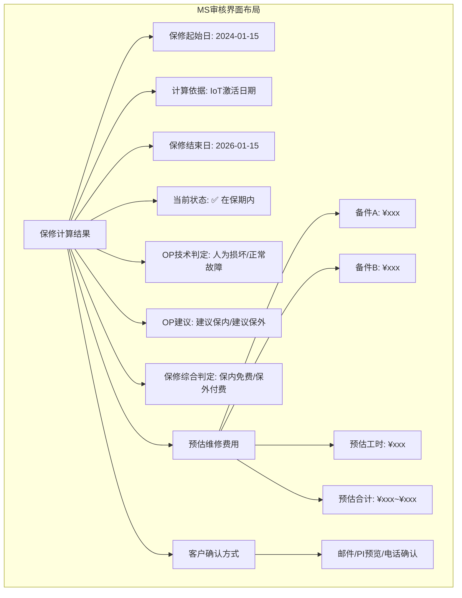

**图表来源**
- [MSReviewPanel.tsx:240-310](file://client/src/components/Workspace/MSReviewPanel.tsx#L240-L310)

### 费用结算流程（两阶段）

| 阶段 | 节点 | 功能 | 说明 |
|------|------|------|------|
| **第一阶段** | `ms_review` | **预估费用 + 客户确认** | 基于OP备件清单，给出预估费用范围，获得客户确认后开始维修 |
| **第二阶段** | `ms_closing` | **实际费用结算 + 生成PI** | 维修完成后，根据实际发生的备件+工时+其他费用，生成最终PI |

### 保修计算API

系统提供完整的保修计算API：

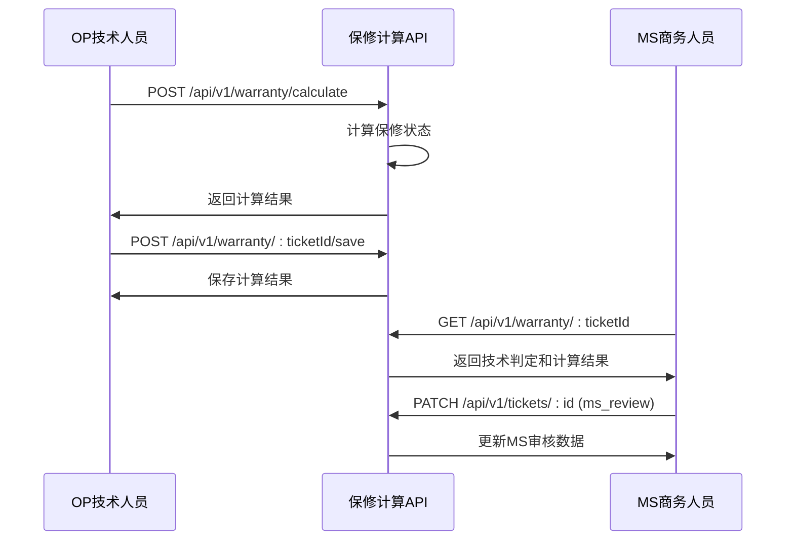

**图表来源**
- [warranty.js:34-154](file://server/service/routes/warranty.js#L34-L154)

**章节来源**
- [warranty.js:1-240](file://server/service/routes/warranty.js#L1-L240)
- [warranty_service.js:1-205](file://server/service/warranty_service.js#L1-L205)
- [SubmitDiagnosticModal.tsx:181-252](file://client/src/components/Workspace/SubmitDiagnosticModal.tsx#L181-L252)
- [MSReviewPanel.tsx:76-151](file://client/src/components/Workspace/MSReviewPanel.tsx#L76-L151)
- [WarrantyDetailModal.tsx:54-85](file://client/src/components/Workspace/WarrantyDetailModal.tsx#L54-L85)

## 三层产品架构

系统引入三层产品架构，实现与ERP系统的深度对齐，解决产品管理的复杂性问题。

### 三层架构定义

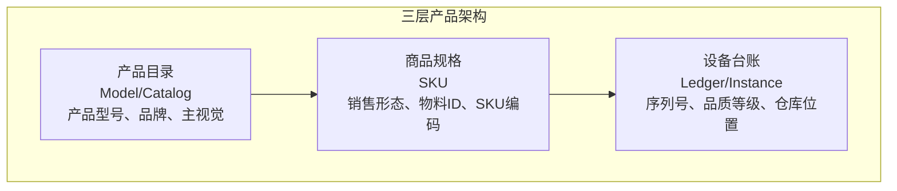

**图表来源**
- [Service_PRD_P2.md:711-733](file://docs/Service_PRD_P2.md#L711-L733)

### 产品目录 (Product Model/Catalog)

产品目录定义基础平台硬件型号，主要存储：

- **产品型号 (Model Code)**：如 C181
- **产品名称 (Product Name)**：中文和英文名称
- **品牌信息**：品牌标识和相关信息
- **主视觉图片 (Hero Image)**：产品主图和展示图
- **ERP对齐**：内部前缀与ERP 9系列对齐

### 商品规格 (Product SKU)

商品规格定义具体的销售形态，主要存储：

- **商品编码 (SKU ID)**：如 A010-001-01
- **物料 ID (Material ID)**：ERP ID，如 9-010-01-01
- **规格标签**：颜色、卡口、套装等规格描述
- **SKU图片**：专属产品图片和全家福
- **激活状态**：商品规格的有效性管理

### 设备台账 (Product Instance/Ledger)

设备台账定义每一台出厂的具体设备，主要存储：

- **序列号 (Serial Number)**：唯一设备标识
- **SKU关联**：关联到具体商品规格
- **品质等级**：A(全新)、B(官翻)、C(维修级)
- **仓库位置**：实时物理位置和库存状态
- **保修依据**：激活日期、发票日期、注册日期等

### 三层架构优势

1. **ERP对齐**：与内部ERP系统的9系列和A系列深度对齐
2. **配置管理**：支持相同型号的多种配置和规格
3. **品质追踪**：区分全新、官翻、维修级设备
4. **库存管理**：精确到单台设备的库存和位置追踪
5. **保修计算**：基于设备实例的精确保修计算

**章节来源**
- [Service_PRD_P2.md:711-796](file://docs/Service_PRD_P2.md#L711-L796)

## 工作区协作功能规范

系统提供完整的工作区协作功能，支持智能参与者管理和多维度协作。

### 协作参与者管理

#### 参与者角色定义

| 角色 | 标识颜色 | 权限范围 | 功能特性 |
|------|----------|----------|---------|
| **owner** | 🟡 金 | 完全控制 | 创建、删除、管理 |
| **assignee** | 🟢 绿 | 处理权限 | 编辑、评论、指派 |
| **mentioned** | 🔵 蓝 | 协作权限 | 评论、查看、通知 |
| **follower** | 🟣 紫 | 查看权限 | 查看、通知、评论 |

#### 参与者邀请机制

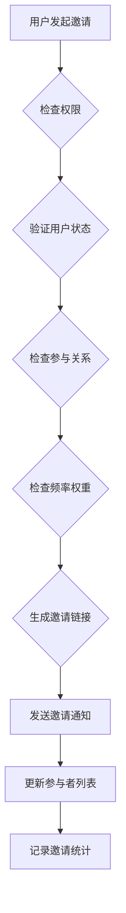

**图表来源**
- [ParticipantsSidebar.tsx:86-113](file://client/src/components/Workspace/ParticipantsSidebar.tsx#L86-L113)

#### 智能邀请推荐

系统提供智能邀请推荐功能：

1. **交互频率统计**：基于历史交互次数排序
2. **邀请统计分析**：统计被邀请次数作为权重
3. **部门分组显示**：按部门分组展示用户
4. **常用用户置顶**：高频用户优先显示

### 产品目录访问权限

**更新** 产品目录访问权限已扩展为对所有内部人员的通用访问：

- **Admin/Exec**：完全控制权限
- **MS成员**：产品目录通用访问权限
- **OP成员**：产品目录通用访问权限
- **无需Admin/Exec权限**：MS/OP部门成员可直接访问产品目录

### 保修计算协作流程

工作区协作功能现已集成保修计算相关的协作流程：

1. **OP技术判定**：OP技术人员在诊断报告中填写技术损坏状态
2. **MS审核协作**：MS商务人员在审核界面查看计算结果和OP建议
3. **客户确认**：MS人员与客户确认维修费用和方式
4. **费用确认**：客户确认后工单流转到维修执行阶段

**章节来源**
- [ParticipantsSidebar.tsx:1-401](file://client/src/components/Workspace/ParticipantsSidebar.tsx#L1-L401)

## 客户生命周期管理

系统新增完整的客户生命周期管理功能，支持从潜在客户到正式客户的完整状态流转和自动升级机制。

### 生命周期状态模型

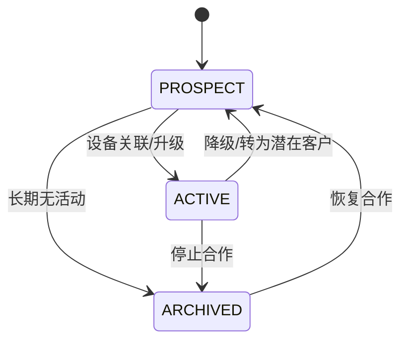

**图表来源**
- [024_add_account_lifecycle.sql:1-13](file://server/service/migrations/024_add_account_lifecycle.sql#L1-L13)

### 状态管理功能

#### 生命周期状态

| 状态 | 描述 | 默认值 | 适用场景 |
|------|------|--------|---------|
| **PROSPECT** | 潜在客户 | 新建账户默认 | 访客、潜在客户 |
| **ACTIVE** | 正式客户 | 设备关联后自动 | 已有设备的客户 |
| **ARCHIVED** | 归档客户 | 长期无活动 | 停止合作的客户 |

#### 自动升级机制

系统实现自动升级逻辑：

1. **设备关联触发**：当设备与账户关联时，自动从PROSPECT升级为ACTIVE
2. **手动升级**：支持在工单转换时手动指定生命周期状态
3. **状态查询**：支持按生命周期状态过滤客户列表

### 工单转换集成

#### 转换API

系统提供统一的工单转换为账户API：

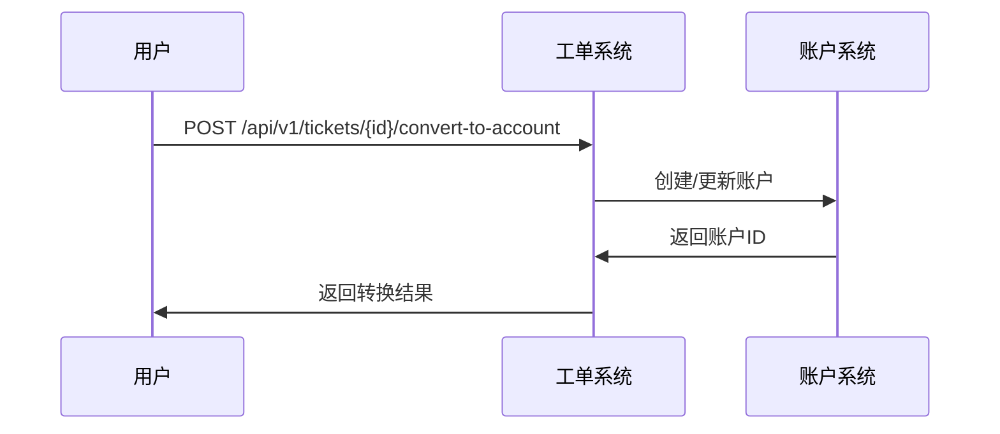

**图表来源**
- [accounts.js:51-186](file://server/service/routes/accounts.js#L51-L186)

#### 转换表单

转换表单支持灵活的状态选择：

1. **默认状态**：默认选择PROSPECT状态
2. **手动选择**：支持选择ACTIVE或ARCHIVED状态
3. **账户类型**：支持INDIVIDUAL、ORGANIZATION、DEALER类型

**章节来源**
- [accounts.js:51-186](file://server/service/routes/accounts.js#L51-L186)
- [ConvertIndividualModal.tsx:18-40](file://client/src/components/Service/ConvertIndividualModal.tsx#L18-L40)
- [024_add_account_lifecycle.sql:1-13](file://server/service/migrations/024_add_account_lifecycle.sql#L1-L13)

## 权限系统改进

系统新增增强的权限控制功能，特别是ViewAs角色切换功能，提供更灵活的权限管理和审计追踪。

### ViewAs角色切换功能

#### 视图模式概述

视图模式允许管理员以其他用户身份进行操作，同时保持审计追踪：

```mermaid
graph TB
subgraph "视图模式工作流"
A[管理员选择用户] --> B[切换视图模式]
B --> C[记录视图模式状态]
C --> D[所有操作以目标用户身份执行]
D --> E[审计日志标注视图模式]
E --> F[退出视图模式]
F --> G[恢复原用户身份]
end
```

**图表来源**
- [ViewAsComponents.tsx:377-392](file://client/src/components/Workspace/ViewAsComponents.tsx#L377-L392)

#### 视图模式权限

| 功能 | Admin | 其他用户 |
|------|-------|---------|
| 查看用户列表 | ✅ | ❌ |
| 切换视图模式 | ✅ | ✅（已处于视图模式） |
| 退出视图模式 | ✅ | ✅（仅退出自己的视图） |
| 持久化存储 | ✅ | ❌ |
| 审计追踪 | ✅ | ✅ |

#### 视图模式界面

系统提供直观的视图模式指示器：

1. **底部横幅提示**：显示当前视图用户信息
2. **一键退出功能**：便捷的视图模式退出
3. **动画效果**：平滑的进入和退出动画
4. **状态同步**：界面状态与实际权限同步

### 权限测试脚本

系统提供完整的权限测试脚本，验证ViewAs功能的正确性：

#### 测试场景

1. **Admin权限测试**：验证Admin用户可以ViewAs任意用户
2. **Dealer权限测试**：验证Dealer用户不能使用ViewAs功能
3. **数据隔离测试**：验证ViewAs模式下的数据访问权限
4. **权限边界测试**：验证权限边界的正确性

#### 测试结果

测试脚本验证了以下关键功能：

- Admin用户可以切换到任何Dealer用户
- Dealer用户无法使用ViewAs功能
- ViewAs模式下的数据访问符合权限规则
- 权限边界得到正确保护

**章节来源**
- [ViewAsComponents.tsx:1-410](file://client/src/components/Workspace/ViewAsComponents.tsx#L1-L410)
- [test_view_as.js:1-319](file://server/scripts/test_view_as.js#L1-L319)

## 数据清理脚本

系统提供完整的数据清理和修复脚本，用于处理历史数据问题和维护数据完整性。

### 账户关联修复脚本

#### 脚本功能

账户关联修复脚本用于修复历史工单中缺失的账户关联问题：

```mermaid
flowchart TD
A[启动数据修复脚本] --> B{检查统一工单表}
B --> C[查找reporter_name为空的工单]
C --> D{查找匹配的账户}
D --> E[更新工单account_id]
E --> F{检查历史工单表}
F --> G[查找customer_name为空的工单]
G --> H{查找匹配的账户}
H --> I[更新工单account_id]
I --> J[记录修复结果]
J --> K[完成修复]
```

**图表来源**
- [fix_missing_accounts.js:10-92](file://server/scripts/fix_missing_accounts.js#L10-L92)

#### 修复范围

脚本支持以下修复场景：

1. **统一工单表修复**：修复tickets表中reporter_name缺失的问题
2. **历史工单表修复**：修复inquiry_tickets表中customer_name缺失的问题
3. **数据一致性**：确保reporter_snapshot中的信息也被正确处理
4. **批量处理**：支持--dry-run模式进行数据预览

### 数据修复流程

#### 预检查阶段

1. **数据库连接**：连接到主数据库和service数据库
2. **表存在性检查**：验证目标表是否存在
3. **数据完整性检查**：检查待修复数据的完整性

#### 修复执行阶段

1. **数据提取**：从历史表中提取需要修复的数据
2. **账户匹配**：根据名称匹配对应的账户
3. **数据更新**：更新工单表中的account_id字段
4. **日志记录**：记录修复过程和结果

#### 后续处理

1. **数据验证**：验证修复后的数据完整性
2. **性能优化**：为修复的字段添加必要的索引
3. **清理工作**：清理历史字段数据

**章节来源**
- [fix_missing_accounts.js:1-92](file://server/scripts/fix_missing_accounts.js#L1-L92)
- [log_prompt.md:1-800](file://docs/log_prompt.md#L1-L800)

## 核心功能模块

### 1. 工单管理模块

#### 统一工单管理
- 单表多态设计，支持三种工单类型的统一管理
- 智能SLA计算和状态监控
- 自动化工单转换和升级
- 优先级管理和服务级别控制
- **新增**：完整审计日志集成
- **新增**：软删除机制和数据恢复
- **新增**：客户生命周期状态管理
- **新增**：保修计算引擎和两阶段费用确认

#### 工单活动管理
- 完整的评论和提醒系统
- @提及功能和智能通知
- 活动时间轴和历史记录
- 可见性控制和权限管理
- **新增**：软删除审计事件
- **新增**：智能参与者协作管理
- **新增**：诊断报告和保修评估

### 2. 通知管理模块

#### 实时通知系统
- macOS风格的通知中心
- 多种通知类型和样式
- 自动化SLA提醒和超时通知
- 通知分类和优先级管理

#### 通知管理API
- 通知列表查询和过滤
- 未读通知统计和计数
- 通知状态更新和管理
- 系统公告和重要通知

### 3. 权限控制模块

#### 穿透式权限管理
- 基于角色的权限控制
- 部门权限和可见性控制
- **新增**：ViewAs角色切换功能
- **新增**：内部人员通用访问权限
- 实时权限检查和验证

#### 权限中间件
- Express中间件集成
- 路由级权限控制
- 查询条件自动过滤
- 权限装饰器支持

### 4. 账户管理模块

#### 账户架构
- 独立的账户和联系人管理
- 多种账户类型支持
- 服务等级和行业标签
- **新增**：客户生命周期状态管理
- 经销商特有属性

#### 联系人管理
- 独立的联系人路由
- 跨账户联系人查询
- 状态和偏好管理
- 工单历史关联

### 5. 审计管理模块

#### 操作审计
- 完整的操作追踪
- 合规性审计日志
- 权限访问监控
- 数据变更记录
- **新增**：软删除审计事件
- **新增**：保修计算审计事件

#### 审计查询
- 多维度过滤查询
- 统计分析功能
- 导出功能支持
- 审计报告生成

### 6. 保修管理模块

#### 保修计算引擎
- 分离OP技术判定与MS商业判定
- 瀑布流计算逻辑
- 人为损坏拦截机制
- 两阶段费用确认流程

#### 保修数据管理
- 技术损坏状态记录
- 保修计算结果存储
- MS审核确认数据
- 最终结算信息管理

#### 保修界面组件
- OP诊断报告表单
- MS审核面板
- 保修详情模态框
- 自动计算和保存功能

### 7. 产品管理模块

#### 三层产品架构
- 产品目录管理
- 商品规格配置
- 设备台账追踪
- ERP系统对齐

#### 产品数据管理
- 产品型号维护
- SKU规格管理
- 库存和位置追踪
- 保修依据计算

#### 产品API接口
- 产品查询和搜索
- 保修状态检查
- 产品注册和更新
- 库存状态查询

#### 产品目录访问权限
- **更新**：扩展为内部人员通用访问
- **新增**：MS/OP部门成员可直接访问
- **无需Admin/Exec权限**：简化访问流程

**章节来源**
- [App.tsx:146-206](file://client/src/App.tsx#L146-L206)

## 系统架构

### 整体架构设计

```mermaid
graph TB
subgraph "客户端层"
A[Web前端<br/>React + TypeScript]
B[iOS客户端<br/>Swift + SwiftUI]
end
subgraph "应用层"
C[API网关<br/>Express.js]
D[统一工单系统<br/>单表多态设计]
E[SLA引擎<br/>优先级管理]
F[通知中心<br/>macOS风格]
G[权限中间件<br/>穿透式控制]
H[工单活动时间轴<br/>评论/提醒]
I[账户-联系人架构<br/>独立路由]
J[向后兼容API<br/>兼容性路由]
K[审计日志系统<br/>合规性追踪]
L[软删除机制<br/>数据恢复]
M[保修计算引擎<br/>两阶段流程]
N[三层产品架构<br/>Model/SKU/Ledger]
O[工作区协作<br/>智能参与者]
P[客户生命周期管理<br/>状态自动升级]
Q[权限系统改进<br/>ViewAs功能]
R[数据清理脚本<br/>自动化修复]
S[产品管理API<br/>三层架构]
T[产品目录访问权限<br/>内部人员通用访问]
end
subgraph "数据层"
U[SQLite数据库<br/>Better-SQLite3]
V[文件存储<br/>磁盘文件系统]
W[缓存层<br/>内存缓存]
end
subgraph "AI服务层"
X[AI服务<br/>智能分类、建议生成]
Y[知识库<br/>文档检索]
end
A --> C
B --> C
C --> D
C --> E
C --> F
C --> G
C --> H
C --> I
C --> J
C --> K
C --> L
C --> M
C --> N
C --> O
C --> P
C --> Q
C --> R
C --> S
C --> T
D --> U
E --> U
F --> U
G --> U
H --> U
I --> U
J --> U
K --> U
L --> U
M --> U
N --> U
O --> U
P --> U
Q --> U
R --> U
S --> U
T --> U
E --> X
X --> Y
```

**图表来源**
- [index.js:23-60](file://server/index.js#L23-L60)
- [service/index.js:20-35](file://server/service/index.js#L20-L35)

### 技术栈

#### 前端技术栈
- **框架**：React 18 + TypeScript
- **构建工具**：Vite
- **状态管理**：Zustand + SWR
- **UI组件库**：自定义组件库
- **国际化**：React Intl

#### 后端技术栈
- **框架**：Express.js
- **数据库**：SQLite (Better-SQLite3)
- **文件存储**：本地磁盘存储
- **缓存**：内存缓存
- **AI集成**：可插拔AI服务架构

#### 移动端技术栈
- **平台**：iOS 14+
- **开发语言**：Swift + SwiftUI
- **架构**：MVVM模式
- **网络层**：Alamofire

**章节来源**
- [API_DOCUMENTATION.md:64-105](file://docs/API_DOCUMENTATION.md#L64-L105)

## API接口设计

### 认证与用户管理

| 方法 | 端点 | 描述 | 认证 | 角色要求 |
| :--- | :--- | :--- | :--- | :--- |
| `POST` | `/api/login` | 用户登录 | No | All |
| `GET` | `/api/user/accessible-departments` | 获取用户可访问的部门列表 | Yes | All |
| `GET` | `/api/user/permissions` | 获取用户的特殊文件夹权限 | Yes | All |
| `GET` | `/api/user/stats` | 获取用户个人统计 | Yes | All |

### 统一工单API

#### 工单管理
- `GET /api/v1/tickets` - 获取工单列表（支持统一查询）
- `GET /api/v1/tickets/:id` - 获取工单详情
- `POST /api/v1/tickets` - 创建新工单（支持三种类型）
- `PATCH /api/v1/tickets/:id` - 更新工单
- `POST /api/v1/tickets/:id/convert` - 工单转换（inquiry → rma/svc）
- **新增**：`DELETE /api/v1/tickets/:id` - 软删除工单
- **新增**：`PATCH /api/v1/tickets/:id/restore` - 恢复已删除工单

#### 工单活动API
- `GET /api/v1/tickets/:ticketId/activities` - 获取工单活动记录
- `POST /api/v1/tickets/:ticketId/activities` - 添加工单活动
- `PATCH /api/v1/tickets/:ticketId/activities/:activityId` - 编辑活动
- `DELETE /api/v1/tickets/:ticketId/activities/:activityId` - 删除活动

#### 工单参与者API
- `GET /api/v1/tickets/:ticketId/participants` - 获取参与者列表
- `POST /api/v1/tickets/:ticketId/participants` - 添加参与者
- `DELETE /api/v1/tickets/:ticketId/participants/:userId` - 移除参与者
- `GET /api/v1/tickets/invite-stats` - 获取邀请统计

### 保修计算API

#### 保修引擎API
- `POST /api/v1/warranty/calculate` - 计算保修状态（POST）
- `GET /api/v1/warranty/:ticketId` - 获取保修计算数据（GET）
- `POST /api/v1/warranty/:ticketId/save` - 保存保修计算结果（POST）

#### MS审核API
- `PATCH /api/v1/tickets/:id` - 更新MS审核数据（ms_review字段）
- `GET /api/v1/tickets/:id` - 获取工单详情（含保修信息）

### 产品管理API

#### 产品查询API
- `GET /api/v1/products/check-warranty` - 检查产品保修状态
- `POST /api/v1/products/register-warranty` - 注册产品保修信息
- `GET /api/v1/products/:id` - 获取产品详情
- `GET /api/v1/products` - 获取产品列表

#### 产品管理API
- `POST /api/v1/products` - 创建新产品
- `PATCH /api/v1/products/:id` - 更新产品信息
- `DELETE /api/v1/products/:id` - 删除产品

### 产品模型管理API

#### 产品型号管理
- `GET /api/v1/admin/product-models` - 获取产品型号列表
- `GET /api/v1/admin/product-models/:id` - 获取产品型号详情
- `POST /api/v1/admin/product-models` - 创建产品型号
- `PUT /api/v1/admin/product-models/:id` - 更新产品型号
- `GET /api/v1/admin/product-models/:id/skus` - 获取型号关联的SKU列表

#### 商品规格管理
- `GET /api/v1/admin/product-skus` - 获取SKU列表
- `GET /api/v1/admin/product-skus/:id` - 获取SKU详情
- `POST /api/v1/admin/product-skus` - 创建SKU
- `PUT /api/v1/admin/product-skus/:id` - 更新SKU

#### 设备台账管理
- `GET /api/v1/admin/products` - 获取设备台账列表
- `GET /api/v1/admin/products/:id` - 获取设备详情
- `POST /api/v1/admin/products` - 创建设备
- `PUT /api/v1/admin/products/:id` - 更新设备

### 通知管理API

#### 通知查询
- `GET /api/v1/notifications` - 获取通知列表
- `GET /api/v1/notifications/unread-count` - 获取未读通知计数
- `GET /api/v1/notifications/:id` - 获取单个通知

#### 通知操作
- `PATCH /api/v1/notifications/:id/read` - 标记为已读
- `PATCH /api/v1/notifications/read-all` - 全部标记为已读
- `PATCH /api/v1/notifications/:id/archive` - 归档通知
- `DELETE /api/v1/notifications/:id` - 删除通知
- `DELETE /api/v1/notifications/clear-all` - 清空通知

### 权限控制API

#### 权限检查
- `GET /api/v1/permissions/check` - 检查特定权限
- `GET /api/v1/permissions/roles` - 获取角色权限列表
- `GET /api/v1/permissions/departments` - 获取部门权限

#### 视图模式
- `PATCH /api/v1/users/view-as` - 切换视图模式
- `GET /api/v1/users/current-view` - 获取当前视图用户

### 审计管理API

#### 知识库审计
- `GET /api/v1/knowledge/audit` - 获取知识库操作审计日志（仅Admin）
- `GET /api/v1/knowledge/audit/stats` - 获取审计统计信息（仅Admin）

#### 工单审计
- `GET /api/v1/tickets/:ticketId/audit` - 获取工单操作审计日志
- **新增**：`GET /api/v1/tickets/:ticketId/audit/soft-delete` - 获取软删除审计记录
- **新增**：`GET /api/v1/tickets/:ticketId/audit/warranty` - 获取保修计算审计记录

### 客户生命周期管理API

#### 账户管理
- `GET /api/v1/accounts` - 获取账户列表（支持生命周期状态过滤）
- `GET /api/v1/accounts/:id` - 获取账户详情
- `POST /api/v1/accounts` - 创建新账户
- `PATCH /api/v1/accounts/:id` - 更新账户

#### 工单转换
- `POST /api/v1/tickets/:id/convert-to-account` - 将工单转换为账户

### 产品目录访问权限API

#### 产品目录访问
- `GET /api/v1/admin/product-models` - 获取产品型号列表（内部人员通用访问）
- `GET /api/v1/admin/product-skus` - 获取SKU列表（内部人员通用访问）
- `GET /api/v1/admin/products` - 获取设备台账列表（内部人员通用访问）

**章节来源**
- [API_DOCUMENTATION.md:20-45](file://docs/API_DOCUMENTATION.md#L20-L45)

## 数据模型

### 核心数据表结构

#### 统一工单表 (tickets)
| 字段名 | 类型 | 描述 | 约束 |
| :--- | :--- | :--- | :--- |
| id | INTEGER | 主键 | PRIMARY KEY |
| ticket_number | TEXT | 工单编号 | UNIQUE NOT NULL |
| ticket_type | TEXT | 工单类型 | IN ('inquiry','rma','svc') |
| current_node | TEXT | 当前节点状态 | DEFAULT 'draft' |
| status | TEXT | 摘要状态 | DEFAULT 'open' |
| priority | TEXT | 优先级 | DEFAULT 'P2' |
| status_changed_at | DATETIME | 状态变更时间 | |
| node_entered_at | DATETIME | 进入当前节点时间 | |
| sla_due_at | DATETIME | SLA截止时间 | |
| sla_status | TEXT | SLA状态 | DEFAULT 'normal' |
| breach_counter | INTEGER | 超时计数 | DEFAULT 0 |
| account_id | INTEGER | 客户账户ID | |
| dealer_id | INTEGER | 经销商ID | |
| product_id | INTEGER | 产品ID | |
| problem_description | TEXT | 问题描述 | |
| solution_for_customer | TEXT | 客户解决方案 | |
| is_deleted | INTEGER | 软删除状态 | DEFAULT 0 |
| deleted_at | DATETIME | 删除时间 | |
| deleted_by | INTEGER | 删除用户ID | REFERENCES users(id) |
| delete_reason | TEXT | 删除原因 | |
| technical_damage_status | TEXT | 技术损坏状态 | CHECK(technical_damage_status IN ('no_damage', 'physical_damage', 'uncertain')) |
| technical_warranty_suggestion | TEXT | 保修建议 | CHECK(technical_warranty_suggestion IN ('suggest_in_warranty', 'suggest_out_warranty', 'needs_verification')) |
| warranty_calculation | TEXT | 保修计算结果(JSON) | |
| ms_review | TEXT | MS审核数据(JSON) | |
| final_settlement | TEXT | 最终结算数据(JSON) | |
| created_at | DATETIME | 创建时间 | DEFAULT CURRENT_TIMESTAMP |
| updated_at | DATETIME | 更新时间 | DEFAULT CURRENT_TIMESTAMP |

#### 通知表 (notifications)
| 字段名 | 类型 | 描述 | 约束 |
| :--- | :--- | :--- | :--- |
| id | INTEGER | 主键 | PRIMARY KEY |
| recipient_id | INTEGER | 接收用户ID | NOT NULL |
| notification_type | TEXT | 通知类型 | NOT NULL |
| title | TEXT | 通知标题 | NOT NULL |
| content | TEXT | 通知内容 | NOT NULL |
| icon | TEXT | 图标类型 | DEFAULT 'info' |
| related_type | TEXT | 关联类型 | |
| related_id | INTEGER | 关联ID | |
| action_url | TEXT | 操作链接 | |
| metadata | TEXT | 元数据JSON | |
| is_read | BOOLEAN | 是否已读 | DEFAULT 0 |
| read_at | DATETIME | 读取时间 | |
| is_archived | BOOLEAN | 是否归档 | DEFAULT 0 |
| created_at | DATETIME | 创建时间 | DEFAULT CURRENT_TIMESTAMP |

#### 工单活动表 (ticket_activities)
| 字段名 | 类型 | 描述 | 约束 |
| :--- | :--- | :--- | :--- |
| id | INTEGER | 主键 | PRIMARY KEY |
| ticket_id | INTEGER | 工单ID | NOT NULL |
| activity_type | TEXT | 活动类型 | DEFAULT 'comment' |
| content | TEXT | 活动内容 | |
| content_html | TEXT | HTML格式内容 | |
| metadata | TEXT | 元数据JSON | |
| visibility | TEXT | 可见性 | DEFAULT 'all' |
| actor_id | INTEGER | 操作者ID | |
| actor_name | TEXT | 操作者姓名 | |
| actor_role | TEXT | 操作者角色 | |
| is_edited | BOOLEAN | 是否编辑过 | DEFAULT 0 |
| edited_at | DATETIME | 编辑时间 | |
| created_at | DATETIME | 创建时间 | DEFAULT CURRENT_TIMESTAMP |

#### 知识库审计日志表 (knowledge_audit_log)
| 字段名 | 类型 | 描述 | 约束 |
| :--- | :--- | :--- | :--- |
| id | INTEGER | 主键 | PRIMARY KEY |
| operation | TEXT | 操作类型 | NOT NULL |
| operation_detail | TEXT | 操作详情 | |
| article_id | INTEGER | 文章ID | |
| article_title | TEXT | 文章标题 | NOT NULL |
| article_slug | TEXT | 文章别名 | |
| category | TEXT | 分类 | |
| product_line | TEXT | 产品线 | |
| product_models | TEXT | 产品型号JSON | |
| changes_summary | TEXT | 变更摘要JSON | |
| old_status | TEXT | 旧状态 | |
| new_status | TEXT | 新状态 | |
| source_type | TEXT | 来源类型 | |
| source_reference | TEXT | 来源引用 | |
| batch_id | TEXT | 批次ID | |
| user_id | INTEGER | 操作用户ID | NOT NULL |
| user_name | TEXT | 操作用户名 | NOT NULL |
| user_role | TEXT | 操作用户角色 | |
| created_at | DATETIME | 创建时间 | DEFAULT CURRENT_TIMESTAMP |

#### 账户生命周期表 (accounts)
| 字段名 | 类型 | 描述 | 约束 |
| :--- | :--- | :--- | :--- |
| id | INTEGER | 主键 | PRIMARY KEY |
| account_number | TEXT | 账户编号 | UNIQUE NOT NULL |
| name | TEXT | 账户名称 | NOT NULL |
| account_type | TEXT | 账户类型 | IN ('DEALER','ORGANIZATION','INDIVIDUAL','INTERNAL') |
| email | TEXT | 邮箱地址 | |
| phone | TEXT | 电话号码 | |
| country | TEXT | 国家 | |
| city | TEXT | 城市 | |
| service_tier | TEXT | 服务等级 | DEFAULT 'STANDARD' |
| lifecycle_stage | TEXT | 生命周期状态 | DEFAULT 'ACTIVE' CHECK(lifecycle_stage IN ('PROSPECT','ACTIVE','ARCHIVED')) |
| industry_tags | TEXT | 行业标签JSON | |
| is_active | BOOLEAN | 是否激活 | DEFAULT 1 |
| dealer_code | TEXT | 经销商代码 | |
| dealer_level | TEXT | 经销商等级 | |
| repair_level | TEXT | 维修能力等级 | |
| region | TEXT | 地区 | |
| can_repair | BOOLEAN | 是否可维修 | DEFAULT 0 |
| created_at | DATETIME | 创建时间 | DEFAULT CURRENT_TIMESTAMP |
| updated_at | DATETIME | 更新时间 | DEFAULT CURRENT_TIMESTAMP |

#### 产品目录表 (product_models)
| 字段名 | 类型 | 描述 | 约束 |
| :--- | :--- | :--- | :--- |
| id | INTEGER | 主键 | PRIMARY KEY |
| model_code | TEXT | 产品型号 | UNIQUE NOT NULL |
| model_name | TEXT | 产品名称 | NOT NULL |
| name_zh | TEXT | 中文名称 | NOT NULL |
| name_en | TEXT | 英文名称 | |
| brand | TEXT | 品牌 | NOT NULL |
| internal_prefix | TEXT | ERP内部前缀 | NOT NULL |
| hero_image | TEXT | 主视觉图片 | |
| is_active | BOOLEAN | 是否激活 | DEFAULT 1 |
| created_at | DATETIME | 创建时间 | DEFAULT CURRENT_TIMESTAMP |
| updated_at | DATETIME | 更新时间 | DEFAULT CURRENT_TIMESTAMP |

#### 商品规格表 (product_skus)
| 字段名 | 类型 | 描述 | 约束 |
| :--- | :--- | :--- | :--- |
| id | INTEGER | 主键 | PRIMARY KEY |
| model_id | INTEGER | 产品目录ID | NOT NULL |
| sku_code | TEXT | 商品编码 | UNIQUE NOT NULL |
| erp_code | TEXT | ERP物料编码 | NOT NULL |
| display_name | TEXT | 显示名称 | NOT NULL |
| display_name_en | TEXT | 英文显示名称 | |
| spec_label | TEXT | 规格标签 | NOT NULL |
| sku_image | TEXT | SKU图片 | |
| is_active | BOOLEAN | 是否激活 | DEFAULT 1 |
| created_at | DATETIME | 创建时间 | DEFAULT CURRENT_TIMESTAMP |
| updated_at | DATETIME | 更新时间 | DEFAULT CURRENT_TIMESTAMP |

#### 设备台账表 (products)
| 字段名 | 类型 | 描述 | 约束 |
| :--- | :--- | :--- | :--- |
| id | INTEGER | 主键 | PRIMARY KEY |
| serial_number | TEXT | 序列号 | UNIQUE NOT NULL |
| sku_id | INTEGER | 商品规格ID | NOT NULL |
| model_name | TEXT | 型号名称 | NOT NULL |
| product_sku | TEXT | SKU编码 | NOT NULL |
| grade | TEXT | 品质等级 | DEFAULT 'A' CHECK(grade IN ('A','B','C')) |
| warehouse | TEXT | 仓库位置 | NOT NULL |
| entry_channel | TEXT | 入库渠道 | DEFAULT 'FACTORY' CHECK(entry_channel IN ('FACTORY','RETURN','TRADE_IN')) |
| is_iot_device | BOOLEAN | 是否联网设备 | DEFAULT 0 |
| is_activated | BOOLEAN | 是否已激活 | DEFAULT 0 |
| activation_date | DATE | 激活日期 | |
| sales_invoice_date | DATE | 销售发票日期 | |
| registration_date | DATE | 注册日期 | |
| ship_to_dealer_date | DATE | 发货至经销商日期 | |
| warranty_start_date | DATE | 保修起始日 | |
| warranty_end_date | DATE | 保修结束日 | |
| warranty_months | INTEGER | 保修月数 | DEFAULT 24 |
| warranty_status | TEXT | 保修状态 | DEFAULT 'ACTIVE' CHECK(warranty_status IN ('ACTIVE','EXPIRED')) |
| warranty_source | TEXT | 保修计算来源 | |
| created_at | DATETIME | 创建时间 | DEFAULT CURRENT_TIMESTAMP |
| updated_at | DATETIME | 更新时间 | DEFAULT CURRENT_TIMESTAMP |

### 关系图

```mermaid
erDiagram
ACCOUNTS {
integer id PK
string account_number
string name
string account_type
string service_tier
string lifecycle_stage
boolean is_active
datetime created_at
datetime updated_at
}
CONTACTS {
integer id PK
integer account_id FK
string name
string email
string phone
string wechat
string job_title
string department
string status
boolean is_primary
datetime created_at
}
PRODUCT_MODELS {
integer id PK
string model_code
string model_name
string name_zh
string name_en
string brand
string internal_prefix
string hero_image
boolean is_active
datetime created_at
datetime updated_at
}
PRODUCT_SKUS {
integer id PK
integer model_id FK
string sku_code
string erp_code
string display_name
string display_name_en
string spec_label
string sku_image
boolean is_active
datetime created_at
datetime updated_at
}
PRODUCTS {
integer id PK
string serial_number
integer sku_id FK
string model_name
string product_sku
string grade
string warehouse
string entry_channel
boolean is_iot_device
boolean is_activated
date activation_date
date sales_invoice_date
date registration_date
date ship_to_dealer_date
date warranty_start_date
date warranty_end_date
integer warranty_months
string warranty_status
string warranty_source
datetime created_at
datetime updated_at
}
DEALER_INVENTORY {
integer id PK
integer dealer_id FK
integer part_id FK
integer quantity
integer reserved_quantity
integer min_stock_level
integer reorder_point
datetime last_inbound_date
datetime last_outbound_date
datetime updated_at
}
INVENTORY_TRANSACTIONS {
integer id PK
integer dealer_id FK
integer part_id FK
string transaction_type
integer quantity
integer balance_after
string reference_type
integer reference_id
string reason
integer created_by FK
datetime created_at
}
TICKETS {
integer id PK
string ticket_number
string ticket_type
string current_node
string status
string priority
datetime status_changed_at
datetime node_entered_at
datetime sla_due_at
string sla_status
integer breach_counter
integer account_id FK
integer dealer_id FK
integer product_id FK
integer is_deleted
datetime deleted_at
integer deleted_by
string delete_reason
string technical_damage_status
string technical_warranty_suggestion
text warranty_calculation
text ms_review
text final_settlement
datetime created_at
datetime updated_at
}
NOTIFICATIONS {
integer id PK
integer recipient_id FK
string notification_type
string title
string content
string icon
string related_type
integer related_id
string action_url
text metadata
boolean is_read
datetime read_at
boolean is_archived
datetime created_at
}
TICKET_ACTIVITIES {
integer id PK
integer ticket_id FK
string activity_type
text content
text content_html
text metadata
string visibility
integer actor_id
string actor_name
string actor_role
boolean is_edited
datetime edited_at
datetime created_at
}
KNOWLEDGE_AUDIT_LOG {
integer id PK
string operation
string operation_detail
integer article_id
string article_title
string article_slug
string category
string product_line
text product_models
text changes_summary
string old_status
string new_status
string source_type
string source_reference
string batch_id
integer user_id
string user_name
string user_role
datetime created_at
}
ACCOUNTS ||--o{ CONTACTS : has
ACCOUNTS ||--o{ TICKETS : creates
PRODUCT_MODELS ||--o{ PRODUCT_SKUS : contains
PRODUCT_SKUS ||--o{ PRODUCTS : manages
PRODUCTS ||--o{ TICKETS : associated_with
DEALER_INVENTORY ||--o{ INVENTORY_TRANSACTIONS : records
TICKETS ||--o{ NOTIFICATIONS : generates
TICKETS ||--o{ TICKET_ACTIVITIES : contains
TICKETS ||--o{ KNOWLEDGE_AUDIT_LOG : audited_by
```

**图表来源**
- [dealer-inventory.js:13-108](file://server/service/routes/dealer-inventory.js#L13-L108)
- [tickets.js:100-208](file://server/service/routes/tickets.js#L100-L208)
- [products.js:255-292](file://server/service/routes/products.js#L255-L292)

**章节来源**
- [dealer-inventory.js:1-643](file://server/service/routes/dealer-inventory.js#L1-L643)
- [tickets.js:1-872](file://server/service/routes/tickets.js#L1-L872)
- [products.js:1-400](file://server/service/routes/products.js#L1-L400)

## 业务流程

### 统一工单处理流程

```mermaid
sequenceDiagram
participant C as 客户
participant M as 市场部
participant S as 统一工单系统
participant D as 经销商
participant N as 通知中心
C->>M : 通过各种渠道反馈问题
M->>S : 创建统一工单 (inquiry)
S->>S : SLA引擎计算截止时间
S->>M : 展示处理建议和SLA状态
M->>C : 与客户沟通解决方案
M->>S : 更新工单状态和活动
alt 需要返厂维修
M->>S : 升级为RMA工单
S->>N : 发送工单状态变更通知
S->>D : 通知经销商处理
else 需要经销商维修
M->>S : 升级为SVC工单
S->>N : 发送工单状态变更通知
S->>D : 指派经销商处理
else 已解决
M->>S : 标记工单解决
S->>N : 发送工单完成通知
S->>C : 确认客户满意度
end
```

**图表来源**
- [Service_UserScenarios.md:89-181](file://docs/Service_UserScenarios.md#L89-L181)

### 保修计算处理流程

```mermaid
sequenceDiagram
participant OP as OP技术人员
participant API as 保修计算API
participant MS as MS商务人员
participant DB as 数据库
OP->>API : 提交诊断报告
API->>DB : 保存技术损坏状态
MS->>API : 请求计算保修状态
API->>DB : 获取设备基础数据
API->>API : 执行瀑布流计算
API->>DB : 保存计算结果
MS->>DB : 更新MS审核数据
MS->>DB : 保存费用预估和确认
```

**图表来源**
- [warranty.js:34-154](file://server/service/routes/warranty.js#L34-L154)

### 三层产品管理流程

```mermaid
sequenceDiagram
participant P as 产品经理
participant PM as 产品管理API
participant DB as 数据库
P->>PM : 创建产品目录
PM->>DB : 插入产品目录记录
P->>PM : 创建商品规格
PM->>DB : 插入商品规格记录
P->>PM : 创建设备台账
PM->>DB : 插入设备台账记录
P->>PM : 查询产品信息
PM->>DB : 查询产品目录/规格/台账
DB->>PM : 返回产品数据
PM->>P : 返回产品详情
```

**图表来源**
- [products.js:255-292](file://server/service/routes/products.js#L255-L292)

### SLA监控流程

```mermaid
flowchart TD
A[定时任务启动] --> B[获取所有活跃工单]
B --> C{检查SLA截止时间}
C --> D{是否已超时?}
D --> |是| E[更新SLA状态为breached]
D --> |否| F{剩余时间<25%?}
F --> |是| G[更新SLA状态为warning]
F --> |否| H[保持normal状态]
E --> I[发送SLA超时通知]
G --> J[发送SLA警告通知]
H --> K[继续监控]
I --> L[更新工单状态]
J --> L
K --> B
L --> B
```

**图表来源**
- [sla_service.js:174-225](file://server/service/sla_service.js#L174-L225)

### 权限控制流程

```mermaid
flowchart TD
A[用户发起请求] --> B{用户认证}
B --> C{角色权限检查}
C --> D{部门权限检查}
D --> E{视图模式检查}
E --> F{工单访问权限}
F --> G{活动可见性检查}
G --> H{编辑权限检查}
H --> I{指派权限检查}
I --> J{产品目录访问权限}
J --> K{内部人员通用访问}
K --> L{允许访问}
L --> M{拒绝访问}
```

**图表来源**
- [permission.js:83-210](file://server/service/middleware/permission.js#L83-L210)

### 审计追踪流程

```mermaid
flowchart TD
A[业务操作执行] --> B{检查审计需求}
B --> C{记录审计日志}
C --> D{异步写入数据库}
D --> E{更新审计统计}
E --> F{触发审计通知}
F --> G[审计日志可用]
```

**图表来源**
- [knowledge_audit.js:16-74](file://server/service/routes/knowledge_audit.js#L16-L74)

### 软删除处理流程

```mermaid
flowchart TD
A[用户请求删除工单] --> B{验证删除权限}
B --> C{检查用户角色}
C --> D{记录删除活动}
D --> E[更新工单状态]
E --> F[标记为已删除]
F --> G[记录删除时间]
G --> H[记录删除用户]
H --> I[记录删除原因]
I --> J[写入审计日志]
J --> K[返回删除结果]
```

**图表来源**
- [tickets.js:1212-1233](file://server/service/routes/tickets.js#L1212-L1233)

### 客户生命周期管理流程

```mermaid
flowchart TD
A[工单创建] --> B{检查账户关联}
B --> C{是否有设备关联?}
C --> |是| D[自动升级为ACTIVE]
C --> |否| E[保持PROSPECT状态]
D --> F[更新账户生命周期状态]
E --> G[记录状态变更]
F --> H[发送状态变更通知]
G --> H
H --> I[完成流程]
```

**图表来源**
- [accounts.js:51-186](file://server/service/routes/accounts.js#L51-L186)

### 数据修复流程

```mermaid
flowchart TD
A[启动修复脚本] --> B{检查统一工单表}
B --> C[查找reporter_name为空的工单]
C --> D{查找匹配的账户}
D --> E[更新工单account_id]
E --> F{检查历史工单表}
F --> G[查找customer_name为空的工单]
G --> H{查找匹配的账户}
H --> I[更新工单account_id]
I --> J[记录修复结果]
J --> K[完成修复]
```

**图表来源**
- [fix_missing_accounts.js:10-92](file://server/scripts/fix_missing_accounts.js#L10-L92)

### 产品目录访问权限流程

**更新** 产品目录访问权限流程已简化：

```mermaid
flowchart TD
A[用户请求产品目录] --> B{用户认证}
B --> C{检查部门权限}
C --> D{MS/OP部门成员?}
D --> |是| E[允许访问产品目录]
D --> |否| F{Admin/Exec权限?}
F --> |是| G[允许访问产品目录]
F --> |否| H[拒绝访问]
E --> I[返回产品目录数据]
G --> I
H --> J[返回错误信息]
```

**图表来源**
- [product-models-admin.js:10-41](file://server/service/routes/product-models-admin.js#L10-L41)
- [product-skus.js:10-41](file://server/service/routes/product-skus.js#L10-L41)

**章节来源**
- [Service_UserScenarios.md:84-793](file://docs/Service_UserScenarios.md#L84-L793)

## 性能与扩展性

### 性能优化策略

#### 数据库优化
- **索引优化**：为常用查询字段建立索引
- **查询优化**：使用参数化查询避免SQL注入
- **连接池**：合理配置数据库连接池大小
- **事务管理**：使用事务保证数据一致性
- **新增**：软删除字段索引优化
- **新增**：保修计算字段索引优化
- **新增**：三层产品架构索引优化

#### 缓存策略
- **内存缓存**：使用Redis或内存缓存热点数据
- **文件缓存**：图片和文件的CDN加速
- **查询缓存**：对频繁查询的结果进行缓存

#### API优化
- **分页查询**：大数据集使用分页避免性能问题
- **批量操作**：支持批量数据处理
- **压缩传输**：启用Gzip压缩减少传输体积

### 扩展性设计

#### 水平扩展
- **微服务架构**：将功能模块拆分为独立服务
- **负载均衡**：支持多实例部署
- **数据库分片**：大数据量时进行数据分片

#### 功能扩展
- **插件机制**：支持第三方插件集成
- **API版本控制**：支持API版本演进
- **配置驱动**：通过配置文件控制功能开关

## 安全与权限控制

### 认证机制

系统采用JWT（JSON Web Token）进行用户认证，确保API调用的安全性。

#### 认证流程

```mermaid
sequenceDiagram
participant U as 用户
participant A as 认证服务
participant T as Token存储
participant S as 业务服务
U->>A : 提交用户名密码
A->>A : 验证用户凭据
A->>T : 生成JWT令牌
T->>U : 返回访问令牌
U->>S : 携带令牌访问API
S->>A : 验证令牌有效性
A->>S : 返回用户信息
S->>U : 返回受保护资源
```

**图表来源**
- [API_DOCUMENTATION.md:12-16](file://docs/API_DOCUMENTATION.md#L12-L16)

### 权限控制

#### 角色权限矩阵

| 角色 | 文件访问 | 工单创建 | 工单审批 | 系统管理 |
| :--- | :--- | :--- | :--- | :--- |
| **Admin** | 全部 | 全部 | 全部 | 完全控制 |
| **Exec** | 读写 | 创建、编辑 | 审批 | 有限管理 |
| **Member** | 读取 | 创建、编辑 | 无 | 业务操作 |
| **Dealer** | 读取 | 创建 | 无 | 经销商业务 |

#### 数据访问控制

系统实现基于角色的数据访问控制，确保用户只能访问其权限范围内的数据。

#### 产品目录访问权限

**更新** 产品目录访问权限已扩展为内部人员通用访问：

- **Admin/Exec**：完全控制权限
- **MS成员**：产品目录通用访问权限
- **OP成员**：产品目录通用访问权限
- **无需Admin/Exec权限**：MS/OP部门成员可直接访问产品目录

**章节来源**
- [index.js:589-680](file://server/index.js#L589-L680)

## 向后兼容API

系统提供向后兼容的API接口，确保与现有系统的平滑过渡。

### 兼容性路由

#### 兼容性测试路由
- `GET /api/v1/compatibility` - 获取兼容性测试结果列表
- `GET /api/v1/compatibility/:id` - 获取兼容性测试详情
- `POST /api/v1/compatibility` - 创建兼容性测试结果
- `PATCH /api/v1/compatibility/:id` - 更新兼容性测试结果
- `GET /api/v1/compatibility/matrix/:productModel` - 获取产品兼容性矩阵

#### 兼容性测试字段

| 字段名 | 类型 | 描述 | 必填 |
| :--- | :--- | :--- | :--- |
| product_model | TEXT | 产品型号 | 是 |
| firmware_version | TEXT | 固件版本 | 否 |
| target_type | TEXT | 目标类型 | 是 |
| target_brand | TEXT | 目标品牌 | 是 |
| target_model | TEXT | 目标型号 | 是 |
| target_version | TEXT | 目标版本 | 否 |
| compatibility_status | TEXT | 兼容性状态 | 是 |
| test_date | DATE | 测试日期 | 否 |
| test_notes | TEXT | 测试备注 | 否 |
| known_issues | JSON | 已知问题 | 否 |
| workarounds | JSON | 解决方案 | 否 |
| related_article_id | INTEGER | 相关文章ID | 否 |

### 兼容性测试流程

```mermaid
flowchart TD
A[开始兼容性测试] --> B{收集测试数据}
B --> C[执行兼容性测试]
C --> D{测试结果评估}
D --> E{记录测试结果}
E --> F{生成测试报告}
F --> G[更新知识库]
G --> H[通知相关人员]
H --> I[结束测试流程]
```

**图表来源**
- [compatibility.js:1-367](file://server/service/routes/compatibility.js#L1-L367)

**章节来源**
- [compatibility.js:1-367](file://server/service/routes/compatibility.js#L1-L367)

## 统一查询参数

系统提供统一的工单查询参数，支持灵活的过滤和排序功能。

### 查询参数列表

#### 基础查询参数
- `page` (数字): 页码，默认1
- `page_size` (数字): 每页数量，默认20
- `sort_by` (字符串): 排序字段，默认created_at
- `sort_order` (字符串): 排序顺序，默认desc

#### 工单类型过滤
- `ticket_type` (枚举): 工单类型，可选值：inquiry, rma, svc
- `status` (枚举): 工单状态，可选值：open, in_progress, waiting, resolved, closed, cancelled
- `current_node` (字符串): 当前节点状态
- `priority` (枚举): 优先级，可选值：P0, P1, P2

#### SLA相关过滤
- `sla_status` (枚举): SLA状态，可选值：normal, warning, breached
- `sla_due_at` (日期范围): SLA截止时间范围

#### 关联信息过滤
- `account_id` (数字): 账户ID
- `dealer_id` (数字): 经销商ID
- `assigned_to` (数字): 指派人ID
- `submitted_by` (数字): 提交人ID

#### 产品信息过滤
- `product_id` (数字): 产品ID
- `serial_number` (字符串): 序列号（模糊匹配）
- **新增**：`model_code` (字符串): 产品型号代码
- **新增**：`sku_code` (字符串): 商品规格代码
- **新增**：`warranty_status` (枚举): 保修状态，可选值：ACTIVE, EXPIRED

#### 时间范围过滤
- `created_from` (日期): 创建时间起始
- `created_to` (日期): 创建时间结束

#### 关键词搜索
- `keyword` (字符串): 关键词搜索，支持工单号、问题摘要、问题描述、序列号、账户名称等字段

#### 客户生命周期过滤
- `lifecycle_stage` (枚举): 客户生命周期状态，可选值：PROSPECT, ACTIVE, ARCHIVED
- `is_active` (布尔): 账户激活状态

#### 软删除过滤
- **新增**：`include_deleted` (布尔): 是否包含已删除工单，默认false
- **新增**：`deleted_by` (数字): 删除用户ID过滤
- **新增**：`deleted_from` (日期): 删除时间起始范围
- **新增**：`deleted_to` (日期): 删除时间结束范围

#### 保修相关过滤
- **新增**：`technical_damage_status` (枚举): 技术损坏状态，可选值：no_damage, physical_damage, uncertain
- **新增**：`warranty_status` (枚举): 保修状态，可选值：warranty_valid, warranty_void_damage, warranty_expired
- **新增**：`is_in_warranty` (布尔): 是否在保期内
- **新增**：`warranty_start_from` (日期): 保修起始日范围
- **新增**：`warranty_start_to` (日期): 保修起始日范围
- **新增**：`warranty_end_from` (日期): 保修结束日范围
- **新增**：`warranty_end_to` (日期): 保修结束日范围

#### 产品目录访问权限过滤
- **新增**：`internal_access` (布尔): 是否允许内部人员访问产品目录
- **新增**：`department_code` (字符串): 部门代码过滤（MS/OP/GE）

### 查询参数验证

系统对查询参数进行严格验证：

1. **类型验证**：确保参数类型正确
2. **范围验证**：验证数值范围和枚举值
3. **格式验证**：验证日期格式和邮箱格式
4. **权限验证**：根据用户角色限制查询范围

### 查询性能优化

#### 索引策略
- 为常用过滤字段建立数据库索引
- 使用复合索引优化多条件查询
- 实施查询计划分析和优化
- **新增**：软删除字段索引优化
- **新增**：保修计算字段索引优化
- **新增**：三层产品架构字段索引优化

#### 分页策略
- 限制最大页码和每页数量
- 使用游标分页提高大偏移量查询性能
- 实施预取和延迟加载

**章节来源**
- [tickets.js:240-388](file://server/service/routes/tickets.js#L240-L388)

## 总结

Longhorn服务系统经过Phase 2.0的重大架构升级，现已发展为一个功能完整、架构清晰的企业级服务管理平台。通过统一工单系统、SLA引擎、通知中心、权限中间件、审计日志、软删除机制、保修计算引擎、三层产品架构、工作区协作、客户生命周期管理和权限系统改进等新功能的全面集成，系统能够有效处理从客户咨询到最终维修的完整服务流程，并满足严格的合规性要求。

### 核心优势

1. **统一服务管理**：单表多态设计实现三种工单类型的统一管理
2. **智能SLA监控**：基于优先级的自动化SLA计算和状态监控
3. **实时通知系统**：macOS风格的通知中心提供及时的消息提醒
4. **穿透式权限控制**：精细化的权限管理体系确保数据安全
5. **智能活动管理**：完整的评论、提醒和活动历史管理
6. **灵活账户架构**：独立的账户和联系人管理支持复杂客户关系
7. **完整审计功能**：新增的审计日志确保所有操作可追踪、可审计
8. **软删除机制**：工单软删除功能支持数据恢复和审计追踪
9. **智能协作功能**：工作区协作提供高效的团队协作体验
10. **客户生命周期管理**：完整的客户状态管理和自动升级机制
11. **增强的权限系统**：ViewAs角色切换功能提供灵活的权限管理
12. **自动化数据修复**：数据清理脚本确保数据完整性
13. **多端支持**：Web和iOS双平台支持，满足不同使用场景
14. **AI智能辅助**：集成AI服务提供智能分类和建议功能
15. **向后兼容性**：保持与现有系统的API兼容性
16. **统一查询接口**：提供灵活的工单查询参数和过滤机制
17. **保修计算引擎**：分离OP技术判定与MS商业判定，实现两阶段流程
18. **费用确认机制**：预估费用和客户确认的两阶段结算流程
19. **三层产品架构**：产品目录、商品规格、设备台账的完整产品管理体系
20. **ERP系统对齐**：与内部ERP系统的深度集成，支持复杂的业务场景
21. **产品目录访问权限扩展**：从基于角色的限制扩展为对所有内部人员的通用访问

### 发展方向

1. **AI能力增强**：进一步提升AI智能辅助能力
2. **移动端优化**：持续改进iOS用户体验
3. **数据分析**：加强业务数据分析和报表功能
4. **集成扩展**：支持更多第三方系统集成
5. **国际化支持**：完善多语言和多币种支持
6. **性能优化**：持续优化查询性能和系统响应时间
7. **安全加固**：加强数据安全和隐私保护措施
8. **合规性增强**：持续完善审计和合规性功能
9. **协作功能扩展**：进一步增强工作区协作能力
10. **权限系统完善**：持续改进ViewAs功能和权限控制
11. **保修系统优化**：根据实际使用情况优化保修计算逻辑
12. **费用结算完善**：完善两阶段费用结算的用户体验
13. **产品管理深化**：进一步完善三层产品架构的功能
14. **API生态建设**：构建完善的API生态系统和开发者支持
15. **产品目录访问权限优化**：根据使用情况进一步优化权限控制

该系统为Kinefinity公司的客户服务提供了强有力的技术支撑，有助于提升服务质量和运营效率，为未来的业务发展奠定了坚实的技术基础。通过纳入审计和可见性要求、软删除机制、更新角色权限矩阵、工作区协作功能规范、客户生命周期管理、权限系统改进、三层产品架构、保修计算引擎以及新增的API端点，系统在保持强大功能的同时，也满足了现代企业对合规性、协作性、灵活性、专业性和ERP对齐性的更高要求。

**更新摘要**
- 产品目录访问权限政策已从基于角色的限制扩展为对所有内部人员的通用访问
- 新增MS和OP部门的通用访问权限，无需Admin或Exec权限
- 更新产品管理前端路由权限，支持更广泛的内部人员访问
- 新增产品模型和SKU的通用访问控制逻辑
- 更新权限中间件，支持内部人员的穿透式访问
- 简化了产品目录的访问流程，提升了用户体验