# 开发工具与基础设施

<cite>
**本文档引用的文件**
- [package.json](file://package.json)
- [client/package.json](file://client/package.json)
- [server/package.json](file://server/package.json)
- [client/vite.config.ts](file://client/vite.config.ts)
- [server/index.js](file://server/index.js)
- [server/service/index.js](file://server/service/index.js)
- [server/service/ai_service.js](file://server/service/ai_service.js)
- [scripts/deploy.sh](file://scripts/deploy.sh)
- [scripts/setup.sh](file://scripts/setup.sh)
- [client/src/main.tsx](file://client/src/main.tsx)
- [client/src/App.tsx](file://client/src/App.tsx)
- [ios/LonghornApp/LonghornApp.swift](file://ios/LonghornApp/LonghornApp.swift)
- [ios/LonghornApp/Services/AuthManager.swift](file://ios/LonghornApp/Services/AuthManager.swift)
</cite>

## 目录
1. [简介](#简介)
2. [项目结构](#项目结构)
3. [核心组件](#核心组件)
4. [架构概览](#架构概览)
5. [详细组件分析](#详细组件分析)
6. [依赖关系分析](#依赖关系分析)
7. [性能考虑](#性能考虑)
8. [故障排除指南](#故障排除指南)
9. [结论](#结论)

## 简介

Longhorn 是一个企业级文件管理和客户服务系统，采用现代化的全栈技术架构。该项目提供了完整的开发工具链和基础设施，包括前端 React 应用、后端 Node.js 服务、iOS 移动应用以及自动化部署脚本。

系统的核心特点包括：
- 多模块架构设计（文件管理、客户服务、知识库）
- AI 驱动的服务助手（Bokeh）
- 完整的权限控制系统
- 支持多语言的国际化功能
- 自动化的部署和监控机制

## 项目结构

Longhorn 项目采用清晰的分层架构，主要分为以下几个核心部分：

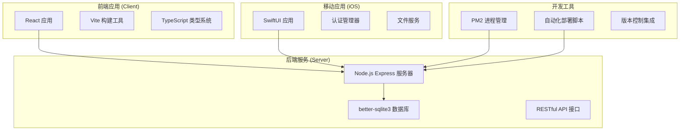

**图表来源**
- [client/src/main.tsx](file://client/src/main.tsx#L1-L12)
- [server/index.js](file://server/index.js#L1-L800)
- [ios/LonghornApp/LonghornApp.swift](file://ios/LonghornApp/LonghornApp.swift#L1-L26)

### 目录结构组织

项目采用按功能模块划分的目录结构：

- **client/**: 前端 React 应用，包含组件、存储、国际化等
- **server/**: 后端 Node.js 服务，包含 API 路由、数据库服务等
- **ios/**: iOS 移动应用，基于 SwiftUI 架构
- **scripts/**: 自动化部署和维护脚本
- **docs/**: 项目文档和开发指南

**章节来源**
- [package.json](file://package.json#L1-L19)
- [client/package.json](file://client/package.json#L1-L49)
- [server/package.json](file://server/package.json#L1-L40)

## 核心组件

### 前端应用架构

前端采用 React 19 和 Vite 构建工具，提供现代化的用户体验：

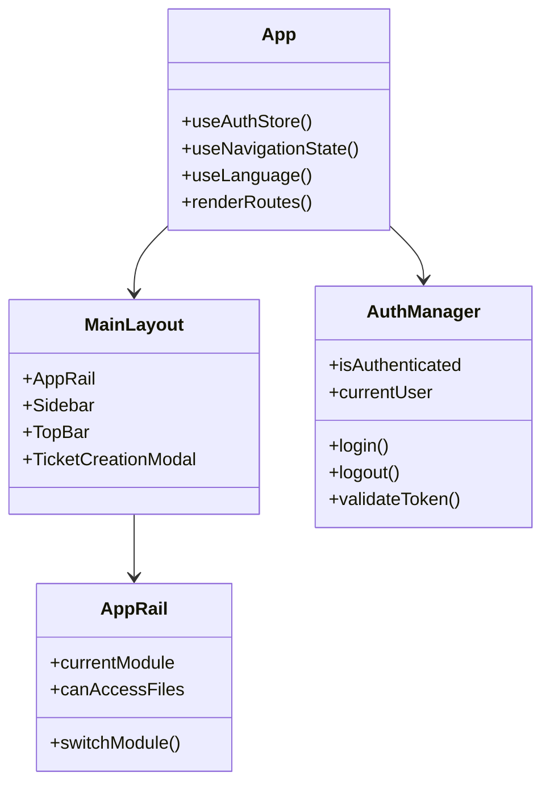

**图表来源**
- [client/src/App.tsx](file://client/src/App.tsx#L121-L265)
- [client/src/main.tsx](file://client/src/main.tsx#L1-L12)

### 后端服务架构

后端基于 Node.js 和 Express，提供 RESTful API 服务：

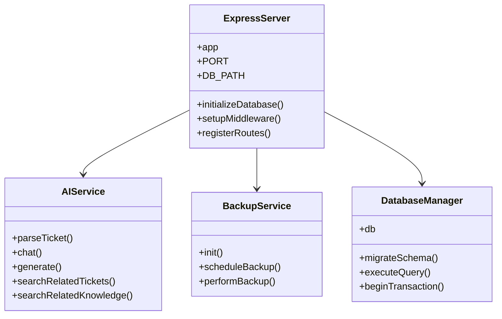

**图表来源**
- [server/index.js](file://server/index.js#L1-L800)
- [server/service/ai_service.js](file://server/service/ai_service.js#L1-L489)

### 移动应用架构

iOS 应用采用 SwiftUI 架构，提供原生移动体验：

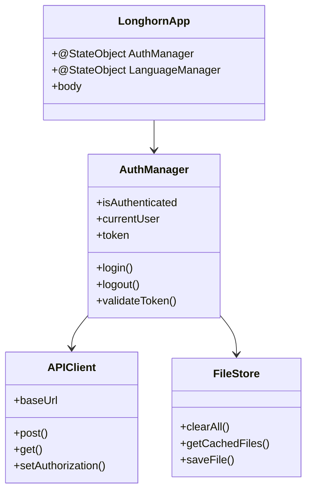

**图表来源**
- [ios/LonghornApp/LonghornApp.swift](file://ios/LonghornApp/LonghornApp.swift#L1-L26)
- [ios/LonghornApp/Services/AuthManager.swift](file://ios/LonghornApp/Services/AuthManager.swift#L1-L195)

**章节来源**
- [client/src/App.tsx](file://client/src/App.tsx#L1-L800)
- [server/index.js](file://server/index.js#L1-L800)
- [ios/LonghornApp/Services/AuthManager.swift](file://ios/LonghornApp/Services/AuthManager.swift#L1-L195)

## 架构概览

Longhorn 采用微服务架构，将不同功能模块分离为独立的服务：

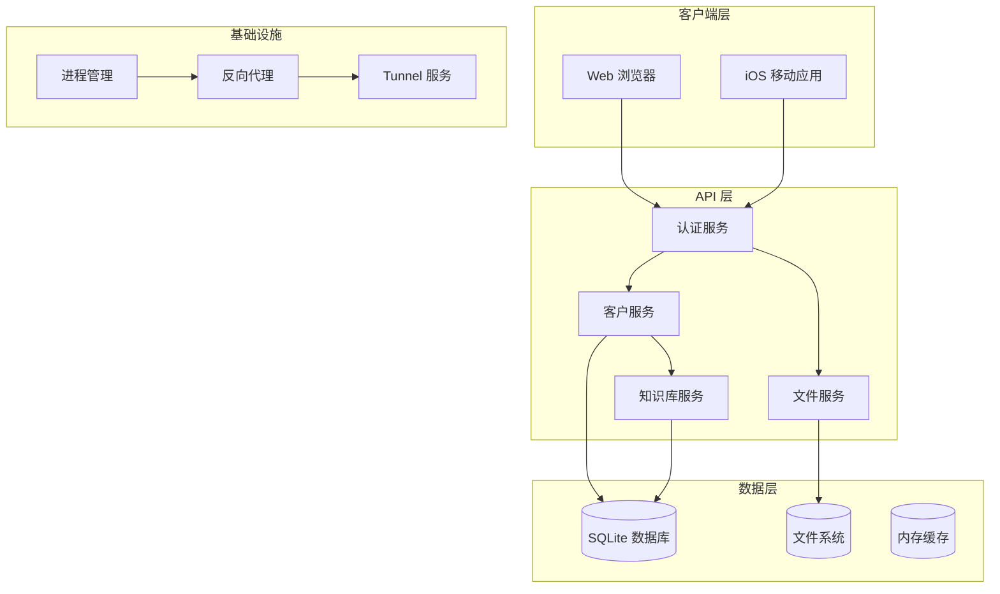

**图表来源**
- [server/index.js](file://server/index.js#L1-L800)
- [scripts/deploy.sh](file://scripts/deploy.sh#L1-L167)

### 数据流处理

系统采用事件驱动的数据流架构：

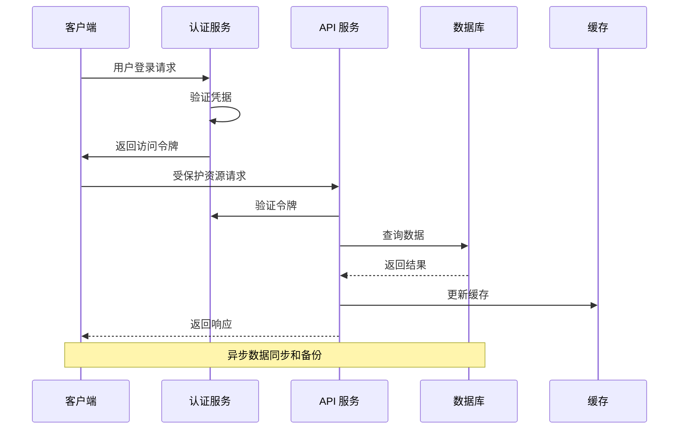

**图表来源**
- [server/index.js](file://server/index.js#L592-L621)
- [ios/LonghornApp/Services/AuthManager.swift](file://ios/LonghornApp/Services/AuthManager.swift#L44-L89)

## 详细组件分析

### 开发工具链

#### Vite 构建配置

Vite 作为构建工具，提供了快速的开发体验和优化的生产构建：

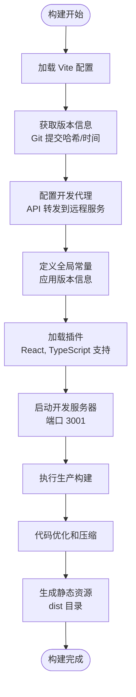

**图表来源**
- [client/vite.config.ts](file://client/vite.config.ts#L1-L94)

#### 包管理策略

项目采用统一的包管理策略，支持多环境部署：

**章节来源**
- [client/vite.config.ts](file://client/vite.config.ts#L1-L94)
- [package.json](file://package.json#L1-L19)

### 部署基础设施

#### 自动化部署脚本

部署脚本提供了两种部署模式以适应不同的部署需求：

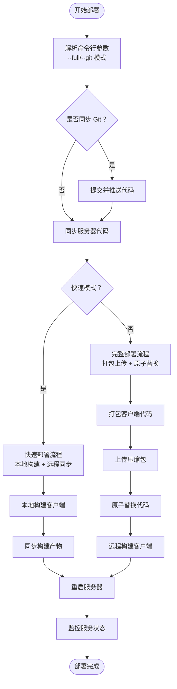

**图表来源**
- [scripts/deploy.sh](file://scripts/deploy.sh#L1-L167)

#### 环境初始化脚本

环境初始化脚本自动化了生产环境的设置过程：

**章节来源**
- [scripts/deploy.sh](file://scripts/deploy.sh#L1-L167)
- [scripts/setup.sh](file://scripts/setup.sh#L1-L112)

### 服务模块化架构

#### 服务模块初始化

服务模块采用模块化设计，支持动态路由注册：

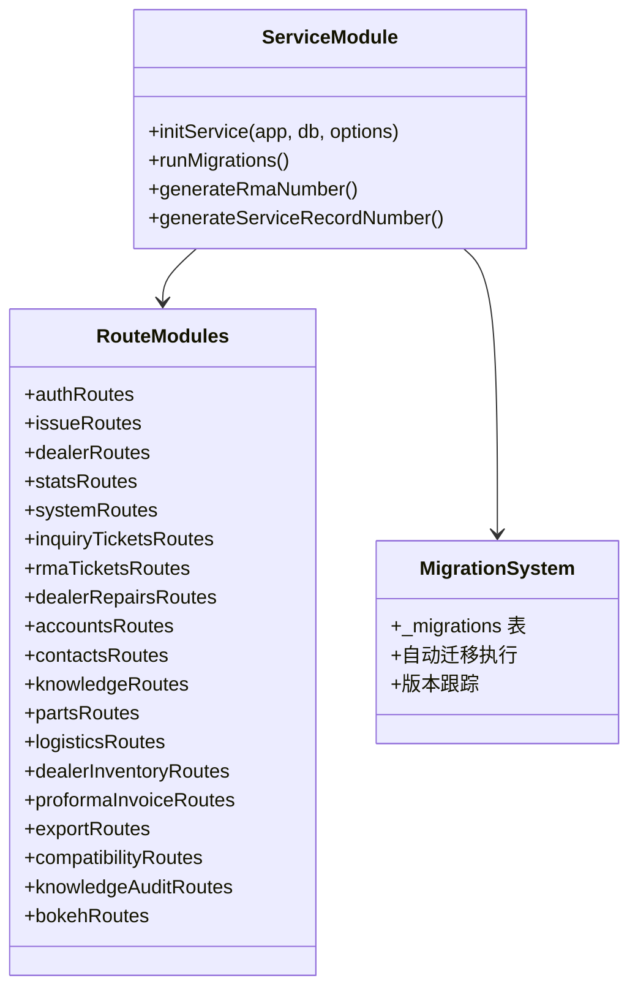

**图表来源**
- [server/service/index.js](file://server/service/index.js#L20-L145)

#### AI 服务集成

AI 服务集成了多种大语言模型，提供智能客服功能：

**章节来源**
- [server/service/index.js](file://server/service/index.js#L1-L292)
- [server/service/ai_service.js](file://server/service/ai_service.js#L1-L489)

### 移动应用认证流程

#### iOS 认证管理

iOS 应用实现了完整的认证生命周期管理：

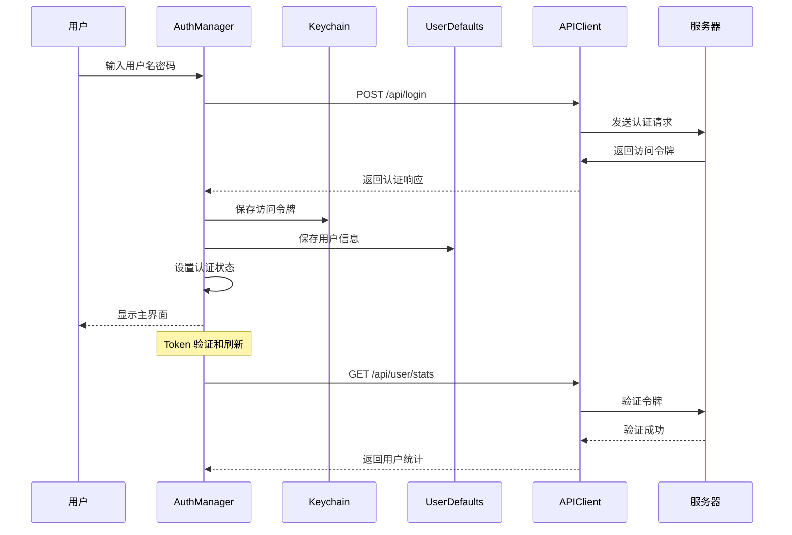

**图表来源**
- [ios/LonghornApp/Services/AuthManager.swift](file://ios/LonghornApp/Services/AuthManager.swift#L44-L123)

**章节来源**
- [ios/LonghornApp/Services/AuthManager.swift](file://ios/LonghornApp/Services/AuthManager.swift#L1-L195)

## 依赖关系分析

### 技术栈依赖

项目采用了经过验证的技术栈组合：

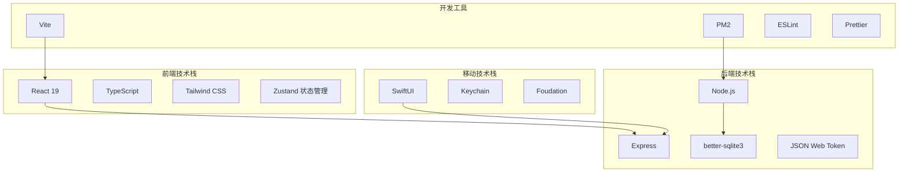

**图表来源**
- [client/package.json](file://client/package.json#L12-L32)
- [server/package.json](file://server/package.json#L15-L37)
- [package.json](file://package.json#L14-L18)

### 数据库设计

系统采用 SQLite 作为主要数据存储，支持复杂的业务逻辑：

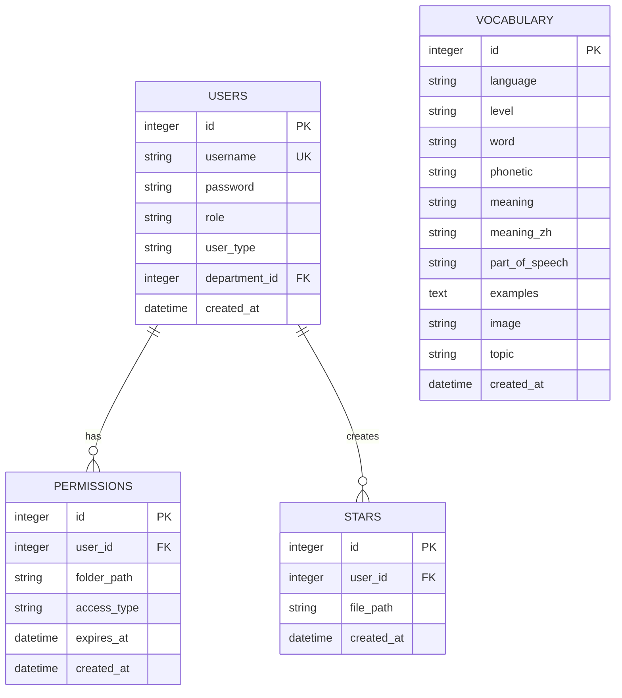

**图表来源**
- [server/index.js](file://server/index.js#L101-L142)

**章节来源**
- [server/index.js](file://server/index.js#L1-L800)

## 性能考虑

### 缓存策略

系统实现了多层次的缓存策略以提升性能：

1. **内存缓存**: 使用内存存储频繁访问的数据
2. **文件缓存**: 图片缩略图和预览文件的本地缓存
3. **数据库查询缓存**: 频繁查询的结果缓存
4. **浏览器缓存**: 静态资源的长期缓存策略

### 并发处理

系统采用异步编程模式处理并发请求：

- **非阻塞 I/O**: Node.js 的事件驱动架构
- **数据库连接池**: better-sqlite3 的连接复用
- **文件操作异步化**: 大文件上传和下载的流式处理

### 监控和诊断

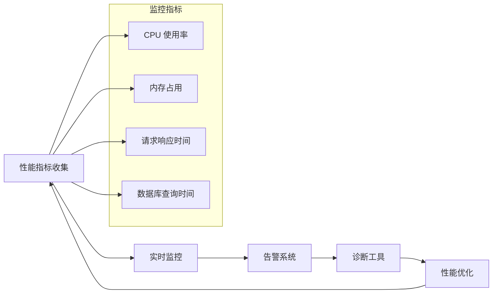

## 故障排除指南

### 常见部署问题

#### 环境依赖问题

**问题**: Homebrew 缓存冲突导致安装失败
**解决方案**: 运行环境初始化脚本中的清理步骤

**问题**: Node.js 版本不兼容
**解决方案**: 使用官方安装包或指定版本号

#### 服务启动问题

**问题**: 数据库连接失败
**解决方案**: 检查数据库文件权限和路径配置

**问题**: 端口被占用
**解决方案**: 修改配置文件中的端口号或停止占用进程

### 开发调试技巧

#### 前端调试

- 使用浏览器开发者工具检查网络请求
- 利用 React DevTools 分析组件状态
- 通过控制台输出调试信息

#### 后端调试

- 查看服务器日志输出
- 使用数据库管理工具检查数据状态
- 利用 API 测试工具验证接口功能

**章节来源**
- [scripts/setup.sh](file://scripts/setup.sh#L1-L112)
- [scripts/deploy.sh](file://scripts/deploy.sh#L1-L167)

## 结论

Longhorn 项目展现了现代全栈应用开发的最佳实践。通过合理的架构设计、完善的开发工具链和自动化部署流程，项目实现了高可用性和可维护性。

### 主要优势

1. **模块化设计**: 清晰的功能模块分离，便于维护和扩展
2. **全栈技术栈**: 前后端技术栈成熟稳定，生态完善
3. **自动化程度高**: 从开发到部署的全流程自动化
4. **性能优化**: 多层次的性能优化策略
5. **安全性考虑**: 完善的认证授权机制

### 发展方向

未来可以考虑的方向包括：
- 微服务架构的进一步细化
- 容器化部署的引入
- 更完善的监控和日志系统
- AI 功能的持续增强

这个项目为类似的企业级应用开发提供了优秀的参考模板，展示了如何在保证功能完整性的同时，实现高效的开发和运维流程。