# 开发指南

<cite>
**本文引用的文件**
- [client/package.json](file://client/package.json)
- [client/eslint.config.js](file://client/eslint.config.js)
- [client/tsconfig.json](file://client/tsconfig.json)
- [client/vite.config.ts](file://client/vite.config.ts)
- [client/src/main.tsx](file://client/src/main.tsx)
- [client/.gitignore](file://client/.gitignore)
- [server/package.json](file://server/package.json)
- [server/index.js](file://server/index.js)
- [scripts/setup.sh](file://scripts/setup.sh)
- [scripts/update_service_docs_smart.sh](file://scripts/update_service_docs_smart.sh)
- [scripts/update_service_docs.sh](file://scripts/update_service_docs.sh)
- [scripts/README.md](file://scripts/README.md)
- [scripts/deploy.sh](file://scripts/deploy.sh)
- [scripts/update.sh](file://scripts/update.sh)
- [scripts/health-check.sh](file://scripts/health-check.sh)
- [scripts/db-validate.sh](file://scripts/db-validate.sh)
- [scripts/sync-db.sh](file://scripts/sync-db.sh)
- [scripts/diagnose-performance.sh](file://scripts/diagnose-performance.sh)
- [scripts/migrate_dealers.js](file://scripts/migrate_dealers.js)
- [scripts/migrate_dealers_v2.js](file://scripts/migrate_dealers_v2.js)
- [server/scripts/fix_service_tickets.js](file://server/scripts/fix_service_tickets.js)
- [server/scripts/import_dealers_from_tickets.js](file://server/scripts/import_dealers_from_tickets.js)
- [apitest.sh](file://apitest.sh)
- [test_api.js](file://test_api.js)
- [docs/README.md](file://docs/README.md)
- [docs/CONTRIBUTE_PERMISSION_IMPLEMENTATION.md](file://docs/CONTRIBUTE_PERMISSION_IMPLEMENTATION.md)
- [docs/iOS_Dev_Guide.md](file://docs/iOS_Dev_Guide.md)
- [docs/REMOTE_DEV_GUIDE.md](file://docs/REMOTE_DEV_GUIDE.md)
- [docs/Service_API.md](file://docs/Service_API.md)
- [docs/Service_PRD.md](file://docs/Service_PRD.md)
- [docs/Service_UserScenarios.md](file://docs/Service_UserScenarios.md)
- [docs/log_dev.md](file://docs/log_dev.md)
- [ios/LonghornApp/LonghornApp.swift](file://ios/LonghornApp/LonghornApp.swift)
- [ios/LonghornApp/Info.plist](file://ios/LonghornApp/Info.plist)
- [ios/LonghornApp/Resources/Localizable.xcstrings](file://ios/LonghornApp/Resources/Localizable.xcstrings)
- [ios/LonghornApp/Services/LanguageManager.swift](file://ios/LonghornApp/Services/LanguageManager.swift)
- [ios/LonghornApp/Views/Issues/IssueCreateView.swift](file://ios/LonghornApp/Views/Issues/IssueCreateView.swift)
- [ios/LonghornApp/Views/Settings/SettingsView.swift](file://ios/LonghornApp/Views/Settings/SettingsView.swift)
- [server/service/migrations/002_service_records.sql](file://server/service/migrations/002_service_records.sql)
- [server/service/migrations/005_knowledge_base.sql](file://server/service/migrations/005_knowledge_base.sql)
- [server/service/migrations/006_repair_management.sql](file://server/service/migrations/006_repair_management.sql)
- [server/service/migrations/007_parts_inventory.sql](file://server/service/migrations/007.parts_inventory.sql)
- [server/service/migrations/009_three_layer_tickets.sql](file://server/service/migrations/009_three_layer_tickets.sql)
- [server/service/routes/service-records.js](file://server/service/routes/service-records.js)
- [server/service/routes/inquiry-tickets.js](file://server/service/routes/inquiry-tickets.js)
- [server/service/routes/rma-tickets.js](file://server/service/routes/rma-tickets.js)
- [server/service/routes/dealer-repairs.js](file://server/service/routes/dealer-repairs.js)
- [server/service/routes/knowledge.js](file://server/service/routes/knowledge.js)
- [server/service/routes/tickets.js](file://server/service/routes/tickets.js)
- [client/src/components/ServiceRecords/ServiceRecordListPage.tsx](file://client/src/components/ServiceRecords/ServiceRecordListPage.tsx)
- [client/src/components/ServiceRecords/ServiceRecordDetailPage.tsx](file://client/src/components/ServiceRecords/ServiceRecordDetailPage.tsx)
- [client/src/components/Issues/IssueListPage.tsx](file://client/src/components/Issues/IssueListPage.tsx)
- [client/src/components/Issues/IssueDetailPage.tsx](file://client/src/components/Issues/IssueDetailPage.tsx)
- [client/src/components/AppRail.tsx](file://client/src/components/AppRail.tsx)
- [client/src/hooks/useCachedTickets.ts](file://client/src/hooks/useCachedTickets.ts)
- [client/src/components/Service/AttachmentZone.tsx](file://client/src/components/Service/AttachmentZone.tsx)
- [client/src/components/Service/TicketCreationModal.tsx](file://client/src/components/Service/TicketCreationModal.tsx)
- [client/src/components/Service/UnifiedTicketDetailPage.tsx](file://client/src/components/Service/UnifiedTicketDetailPage.tsx)
- [client/src/components/Workspace/UnifiedTicketDetail.tsx](file://client/src/components/Workspace/UnifiedTicketDetail.tsx)
- [client/src/store/useTicketStore.ts](file://client/src/store/useTicketStore.ts)
- [client/src/i18n/translations.ts](file://client/src/i18n/translations.ts)
- [client/src/i18n/useLanguage.ts](file://client/src/i18n/useLanguage.ts)
- [client/src/components/DealerRepairs/DealerRepairListPage.tsx](file://client/src/components/DealerRepairs/DealerRepairListPage.tsx)
- [client/src/components/InquiryTickets/InquiryTicketListPage.tsx](file://client/src/components/InquiryTickets/InquiryTicketListPage.tsx)
- [client/src/components/RMATickets/RMATicketListPage.tsx](file://client/src/components/RMATickets/RMATicketListPage.tsx)
- [.agent/workflows/finalize_task.md](file://.agent/workflows/finalize_task.md)
- [.agent/workflows/pmlog.md](file://.agent/workflows/pmlog.md)
- [.agent/workflows/remote_ops.md](file://.agent/workflows/remote_ops.md)
- [.agent/workflows/uiux.md](file://.agent/workflows/uiux.md)
- [.agent/workflows/upd.md](file://.agent/workflows/upd.md)
</cite>

## 更新摘要
**变更内容**
- 更新了工单系统架构，从三层次工单系统向统一工单模型转变
- 移除了专门的 DealerRepairs、InquiryTickets、RMATickets 模块描述
- 新增统一工单 API 和统一工单详情页面
- 更新了工单类型映射和统一工单处理流程
- 扩展了智能文档更新系统，支持统一工单模型的文档维护

## 目录
1. [简介](#简介)
2. [项目结构](#项目结构)
3. [核心组件](#核心组件)
4. [架构总览](#架构总览)
5. [详细组件分析](#详细组件分析)
6. [智能文档更新系统](#智能文档更新系统)
7. [开发工具与脚本系统](#开发工具与脚本系统)
8. [测试与质量保证](#测试与质量保证)
9. [数据迁移与维护工具](#数据迁移与维护工具)
10. [工作流管理规范](#工作流管理规范)
11. [统一工单系统开发指南](#统一工单系统开发指南)
12. [现代化UI组件开发指南](#现代化ui组件开发指南)
13. [服务管理功能开发指南](#服务管理功能开发指南)
14. [国际化开发指南](#国际化开发指南)
15. [iOS应用开发指南](#ios应用开发指南)
16. [依赖关系分析](#依赖关系分析)
17. [性能考量](#性能考量)
18. [故障排查指南](#故障排查指南)
19. [结论](#结论)
20. [附录](#附录)

## 简介
本开发指南面向 Longhorn 项目的前端、后端与 iOS 客户端开发者，系统阐述代码规范、命名约定、最佳实践、开发流程、分支与代码评审标准、调试技巧、测试策略、IDE 配置与效率提升、贡献流程与问题报告模板，以及常见问题的解决方案与团队协作规范。文档同时提供可视化架构图与流程图，帮助不同技术背景的读者快速理解与高效协作。

**更新** 系统已从三层次工单系统向统一工单模型转变，删除了专门的 DealerRepairs、InquiryTickets、RMATickets 模块描述，新增统一工单 API 和统一工单详情页面，提供更简洁高效的工单管理体验。

## 项目结构
Longhorn 采用多模块分层组织：
- 前端（React + TypeScript + Vite）：位于 client/，负责 Web 端界面与交互。
- 服务端（Node.js + Express + better-sqlite3）：位于 server/，提供 REST API、文件存储与权限控制。
- iOS 客户端（SwiftUI + MVVM）：位于 ios/LonghornApp/，提供移动端文件浏览与预览能力。
- **统一工单系统**：基于统一工单模型，支持 inquiry、rma、svc 三种工单类型的统一管理。
- 现代化UI组件：包括 AppRail 布局组件、AttachmentZone 附件上传组件、TicketCreationModal 工单创建模态框等。
- 服务管理系统：基于服务闭环理念，提供服务记录、工单管理、知识库等功能。
- 国际化支持：多语言本地化资源管理与动态语言切换机制。
- **智能文档更新系统**：位于 scripts/，包含自动化文档维护脚本，提供智能分析和自动更新功能。
- **开发工具与脚本系统**：位于 scripts/，提供部署、数据库维护、性能诊断等完整工具链。
- **测试与质量保证**：包含API测试脚本、性能测试工具、数据验证脚本等。
- **数据迁移与维护工具**：JavaScript脚本支持经销商数据迁移、工单修复、数据同步等。
- **工作流管理系统**：位于 .agent/workflows/，包含任务完成、项目日志、远程操作、UI/UX 设计规范和更新流程的标准工作流。
- 文档：位于 docs/，包含产品、开发、运维与指南类文档。

```mermaid
graph TB
subgraph "前端(client)"
FE_Main["src/main.tsx"]
FE_Config["vite.config.ts"]
FE_ESLint["eslint.config.js"]
FE_TS["tsconfig.json"]
AppRail["AppRail 布局组件"]
AttachmentZone["AttachmentZone 附件组件"]
TicketCreationModal["TicketCreationModal 模态框"]
UnifiedTicketDetail["UnifiedTicketDetail 统一工单详情"]
TicketHooks["useCachedTickets Hook"]
TicketStore["useTicketStore Store"]
ServiceRecordComponents["服务记录组件"]
IssueComponents["工单组件"]
Translations["国际化翻译"]
LanguageHook["useLanguage Hook"]
end
subgraph "服务端(server)"
BE_Index["index.js"]
BE_Pkg["package.json"]
UnifiedTicketRoutes["统一工单路由"]
ServiceRoutes["服务路由"]
KnowledgeRoutes["知识库路由"]
end
subgraph "iOS(ios)"
IOS_App["LonghornApp.swift"]
IOS_Info["Info.plist"]
IOS_Lang["LanguageManager.swift"]
IOS_Local["Localizable.xcstrings"]
end
subgraph "智能文档更新系统"
SmartDocScript["update_service_docs_smart.sh"]
DocUpdateScript["update_service_docs.sh"]
DocAnalysis["智能分析引擎"]
AutoUpdate["自动更新机制"]
end
subgraph "开发工具与脚本系统"
DeployScript["deploy.sh"]
UpdateScript["update.sh"]
HealthScript["health-check.sh"]
DBScript["db-validate.sh"]
PerfScript["diagnose-performance.sh"]
MigrateScript["migrate_dealers.js"]
MigrateV2Script["migrate_dealers_v2.js"]
end
subgraph "测试与质量保证"
APITest["apitest.sh"]
NodeTest["test_api.js"]
FixTickets["fix_service_tickets.js"]
ImportDealers["import_dealers_from_tickets.js"]
end
subgraph "工作流管理系统"
FinalizeTask["finalize_task.md"]
PMLog["pmlog.md"]
RemoteOps["remote_ops.md"]
UIUX["uiux.md"]
UpdateWorkflow["upd.md"]
end
subgraph "统一工单系统"
UnifiedTicketAPI["统一工单API v2.0"]
UnifiedTicketDB["统一工单数据库迁移"]
end
subgraph "脚本与文档"
Scripts["scripts/README.md"]
Docs["docs/README.md"]
end
FE_Main --> FE_Config
FE_Config --> BE_Index
BE_Index --> BE_Pkg
IOS_App --> IOS_Info
IOS_App --> IOS_Lang
IOS_Lang --> IOS_Local
AppRail --> UnifiedTicketRoutes
AttachmentZone --> TicketCreationModal
TicketHooks --> UnifiedTicketRoutes
TicketStore --> TicketCreationModal
ServiceRecordComponents --> ServiceRoutes
IssueComponents --> ServiceRoutes
ServiceRecordComponents --> KnowledgeRoutes
UnifiedTicketDetail --> UnifiedTicketAPI
TicketCreationModal --> UnifiedTicketAPI
UnifiedTicketAPI --> UnifiedTicketDB
UnifiedTicketRoutes --> UnifiedTicketAPI
SmartDocScript --> DocAnalysis
DocUpdateScript --> AutoUpdate
DeployScript --> HealthScript
UpdateScript --> PerfScript
DBScript --> MigrateScript
MigrateV2Script --> FixTickets
APITest --> NodeTest
ImportDealers --> FixTickets
FinalizeTask --> Docs
PMLog --> Docs
RemoteOps --> Scripts
UIUX --> AppRail
UIUX --> AttachmentZone
UIUX --> TicketCreationModal
UpdateWorkflow --> Scripts
Scripts --> BE_Index
Docs --> BE_Index
Translations --> LanguageHook
LanguageHook --> AppRail
LanguageHook --> TicketCreationModal
```

**图表来源**
- [client/src/main.tsx](file://client/src/main.tsx#L1-L11)
- [client/vite.config.ts](file://client/vite.config.ts#L1-L82)
- [client/eslint.config.js](file://client/eslint.config.js#L1-L24)
- [client/tsconfig.json](file://client/tsconfig.json#L1-L8)
- [server/package.json](file://server/package.json#L1-L30)
- [server/index.js](file://server/index.js#L1-L200)
- [ios/LonghornApp/LonghornApp.swift](file://ios/LonghornApp/LonghornApp.swift#L1-L26)
- [ios/LonghornApp/Info.plist](file://ios/LonghornApp/Info.plist#L1-L12)
- [ios/LonghornApp/Services/LanguageManager.swift](file://ios/LonghornApp/Services/LanguageManager.swift#L1-L57)
- [ios/LonghornApp/Resources/Localizable.xcstrings](file://ios/LonghornApp/Resources/Localizable.xcstrings#L1-L800)
- [docs/Service_API.md](file://docs/Service_API.md#L1-L800)
- [docs/Service_PRD.md](file://docs/Service_PRD.md#L1-L800)
- [docs/Service_UserScenarios.md](file://docs/Service_UserScenarios.md#L1-L800)
- [scripts/README.md](file://scripts/README.md#L1-L32)
- [scripts/deploy.sh](file://scripts/deploy.sh#L1-L167)
- [scripts/update.sh](file://scripts/update.sh#L1-L33)
- [scripts/health-check.sh](file://scripts/health-check.sh#L1-L115)
- [scripts/db-validate.sh](file://scripts/db-validate.sh#L1-L52)
- [scripts/diagnose-performance.sh](file://scripts/diagnose-performance.sh#L1-L122)
- [scripts/migrate_dealers.js](file://scripts/migrate_dealers.js#L1-L88)
- [scripts/migrate_dealers_v2.js](file://scripts/migrate_dealers_v2.js#L1-L235)
- [server/scripts/fix_service_tickets.js](file://server/scripts/fix_service_tickets.js#L1-L431)
- [server/scripts/import_dealers_from_tickets.js](file://server/scripts/import_dealers_from_tickets.js#L1-L58)
- [apitest.sh](file://apitest.sh#L1-L29)
- [test_api.js](file://test_api.js#L1-L52)
- [docs/README.md](file://docs/README.md#L1-L19)
- [client/src/components/AppRail.tsx](file://client/src/components/AppRail.tsx#L1-L152)
- [client/src/hooks/useCachedTickets.ts](file://client/src/hooks/useCachedTickets.ts#L1-L136)
- [client/src/components/Service/AttachmentZone.tsx](file://client/src/components/Service/AttachmentZone.tsx#L1-L108)
- [client/src/components/Service/TicketCreationModal.tsx](file://client/src/components/Service/TicketCreationModal.tsx#L1-L345)
- [client/src/components/Service/UnifiedTicketDetailPage.tsx](file://client/src/components/Service/UnifiedTicketDetailPage.tsx#L1-L345)
- [client/src/components/Workspace/UnifiedTicketDetail.tsx](file://client/src/components/Workspace/UnifiedTicketDetail.tsx#L1-L1569)
- [client/src/store/useTicketStore.ts](file://client/src/store/useTicketStore.ts#L1-L68)
- [client/src/i18n/translations.ts](file://client/src/i18n/translations.ts#L1-L800)
- [client/src/i18n/useLanguage.ts](file://client/src/i18n/useLanguage.ts#L1-L59)
- [.agent/workflows/finalize_task.md](file://.agent/workflows/finalize_task.md#L1-L20)
- [.agent/workflows/pmlog.md](file://.agent/workflows/pmlog.md#L1-L38)
- [.agent/workflows/remote_ops.md](file://.agent/workflows/remote_ops.md#L1-L52)
- [.agent/workflows/uiux.md](file://.agent/workflows/uiux.md#L1-L7)
- [.agent/workflows/upd.md](file://.agent/workflows/upd.md#L1-L5)

**章节来源**
- [client/package.json](file://client/package.json#L1-L45)
- [client/eslint.config.js](file://client/eslint.config.js#L1-L24)
- [client/tsconfig.json](file://client/tsconfig.json#L1-L8)
- [client/vite.config.ts](file://client/vite.config.ts#L1-L82)
- [client/src/main.tsx](file://client/src/main.tsx#L1-L11)
- [server/package.json](file://server/package.json#L1-L30)
- [server/index.js](file://server/index.js#L1-L200)
- [scripts/README.md](file://scripts/README.md#L1-L32)
- [scripts/deploy.sh](file://scripts/deploy.sh#L1-L167)
- [scripts/update.sh](file://scripts/update.sh#L1-L33)
- [scripts/health-check.sh](file://scripts/health-check.sh#L1-L115)
- [scripts/db-validate.sh](file://scripts/db-validate.sh#L1-L52)
- [scripts/diagnose-performance.sh](file://scripts/diagnose-performance.sh#L1-L122)
- [scripts/migrate_dealers.js](file://scripts/migrate_dealers.js#L1-L88)
- [scripts/migrate_dealers_v2.js](file://scripts/migrate_dealers_v2.js#L1-L235)
- [server/scripts/fix_service_tickets.js](file://server/scripts/fix_service_tickets.js#L1-L431)
- [server/scripts/import_dealers_from_tickets.js](file://server/scripts/import_dealers_from_tickets.js#L1-L58)
- [apitest.sh](file://apitest.sh#L1-L29)
- [test_api.js](file://test_api.js#L1-L52)
- [docs/README.md](file://docs/README.md#L1-L19)
- [ios/LonghornApp/LonghornApp.swift](file://ios/LonghornApp/LonghornApp.swift#L1-L26)
- [ios/LonghornApp/Info.plist](file://ios/LonghornApp/Info.plist#L1-L12)
- [ios/LonghornApp/Services/LanguageManager.swift](file://ios/LonghornApp/Services/LanguageManager.swift#L1-L57)
- [ios/LonghornApp/Resources/Localizable.xcstrings](file://ios/LonghornApp/Resources/Localizable.xcstrings#L1-L800)
- [docs/Service_API.md](file://docs/Service_API.md#L1-L800)
- [docs/Service_PRD.md](file://docs/Service_PRD.md#L1-L800)
- [docs/Service_UserScenarios.md](file://docs/Service_UserScenarios.md#L1-L800)
- [docs/log_dev.md](file://docs/log_dev.md#L977-L978)

## 核心组件
- 前端应用入口与构建：React 应用入口、Vite 构建配置、TypeScript 多项目引用、ESLint 平台化配置。
- 服务端 API 与权限：Express 服务、better-sqlite3 数据库、JWT 认证、Multer 上传、权限引擎与文件操作接口。
- iOS 客户端：SwiftUI 主应用、语言与认证环境注入、Info.plist 网络安全配置。
- **统一工单系统**：基于统一工单模型，支持 inquiry（咨询工单）、rma（返修工单）、svc（经销商维修工单）三种工单类型的统一管理。
- 现代化UI组件：AppRail 布局组件提供侧边导航，AttachmentZone 附件上传组件支持拖拽上传，TicketCreationModal 工单创建模态框提供现代化表单体验。
- 服务管理系统：基于服务闭环理念，提供服务记录、工单管理、知识库、上下文查询等完整功能。
- 国际化支持：多语言本地化资源管理、动态语言切换、部门名称本地化等。
- **智能文档更新系统**：自动化文档维护脚本，提供智能分析代码变更、自动提取API接口信息、版本管理和文档模板更新功能。
- **开发工具与脚本系统**：完整的运维工具集，包含部署、数据库维护、性能诊断、系统监控等工具。
- **测试与质量保证**：API测试脚本、性能测试工具、数据验证脚本，提供全面的质量保障。
- **数据迁移与维护工具**：JavaScript脚本支持经销商数据迁移、工单修复、数据同步等维护操作。
- **工作流管理系统**：位于 .agent/workflows/ 目录，包含任务完成、项目日志、远程操作、UI/UX 设计规范和更新流程的标准工作流。
- 开发与运维：一键初始化脚本、远程开发与发布 SOP、权限系统实施文档。

**更新** 系统已向统一工单模型转变，删除了专门的 DealerRepairs、InquiryTickets、RMATickets 模块描述，新增统一工单 API 和统一工单详情页面。

**章节来源**
- [client/src/main.tsx](file://client/src/main.tsx#L1-L11)
- [client/vite.config.ts](file://client/vite.config.ts#L1-L82)
- [client/tsconfig.json](file://client/tsconfig.json#L1-L8)
- [client/eslint.config.js](file://client/eslint.config.js#L1-L24)
- [server/index.js](file://server/index.js#L1-L200)
- [ios/LonghornApp/LonghornApp.swift](file://ios/LonghornApp/LonghornApp.swift#L1-L26)
- [ios/LonghornApp/Info.plist](file://ios/LonghornApp/Info.plist#L1-L12)
- [ios/LonghornApp/Services/LanguageManager.swift](file://ios/LonghornApp/Services/LanguageManager.swift#L1-L57)
- [docs/Service_API.md](file://docs/Service_API.md#L1-L800)
- [docs/Service_PRD.md](file://docs/Service_PRD.md#L1-L800)
- [docs/Service_UserScenarios.md](file://docs/Service_UserScenarios.md#L1-L800)
- [scripts/README.md](file://scripts/README.md#L1-L32)
- [scripts/deploy.sh](file://scripts/deploy.sh#L1-L167)
- [scripts/update.sh](file://scripts/update.sh#L1-L33)
- [scripts/health-check.sh](file://scripts/health-check.sh#L1-L115)
- [scripts/db-validate.sh](file://scripts/db-validate.sh#L1-L52)
- [scripts/diagnose-performance.sh](file://scripts/diagnose-performance.sh#L1-L122)
- [scripts/migrate_dealers.js](file://scripts/migrate_dealers.js#L1-L88)
- [scripts/migrate_dealers_v2.js](file://scripts/migrate_dealers_v2.js#L1-L235)
- [server/scripts/fix_service_tickets.js](file://server/scripts/fix_service_tickets.js#L1-L431)
- [server/scripts/import_dealers_from_tickets.js](file://server/scripts/import_dealers_from_tickets.js#L1-L58)
- [apitest.sh](file://apitest.sh#L1-L29)
- [test_api.js](file://test_api.js#L1-L52)
- [docs/CONTRIBUTE_PERMISSION_IMPLEMENTATION.md](file://docs/CONTRIBUTE_PERMISSION_IMPLEMENTATION.md#L1-L261)
- [.agent/workflows/finalize_task.md](file://.agent/workflows/finalize_task.md#L1-L20)
- [.agent/workflows/pmlog.md](file://.agent/workflows/pmlog.md#L1-L38)
- [.agent/workflows/remote_ops.md](file://.agent/workflows/remote_ops.md#L1-L52)
- [.agent/workflows/uiux.md](file://.agent/workflows/uiux.md#L1-L7)
- [.agent/workflows/upd.md](file://.agent/workflows/upd.md#L1-L5)

## 架构总览
Longhorn 采用前后端分离与移动端原生客户端的混合架构：
- 前端通过 Vite 开发服务器代理到后端服务端口，提供本地联调。
- 后端提供 REST API，负责用户认证、权限校验、文件上传/下载/删除、回收站、缩略图生成与分享链接。
- iOS 客户端基于 SwiftUI，采用 MVVM，结合预览缓存与轮询机制提升体验。
- **统一工单系统**：基于统一工单模型，支持 inquiry、rma、svc 三种工单类型的统一管理，提供完整的工单管理闭环。
- 现代化UI组件提供优秀的用户体验，包括侧边导航、附件上传、工单创建等。
- 服务管理系统提供完整的服务闭环，包括服务记录、工单管理、知识库等。
- 国际化系统支持多语言切换与本地化资源管理。
- **智能文档更新系统**：自动化分析代码变更，智能提取API接口信息，自动更新PRD和API文档。
- **开发工具与脚本系统**：完整的运维工具集，提供部署、数据库维护、性能诊断、系统监控等自动化解决方案。
- **测试与质量保证**：API测试脚本、性能测试工具、数据验证脚本，确保系统质量和稳定性。
- **数据迁移与维护工具**：JavaScript脚本支持经销商数据迁移、工单修复、数据同步等维护操作。
- **工作流管理系统**：标准化任务完成流程、项目日志记录、远程操作和UI/UX设计规范。
- 脚本与文档支撑初始化、部署、监控与权限实施。

**更新** 架构图新增统一工单系统模块，删除了专门的 DealerRepairs、InquiryTickets、RMATickets 模块描述，体现了系统向统一工单模型的转变。

```mermaid
graph TB
Browser["浏览器/Web App"] --> FE["Vite 开发服务器<br/>/api 代理到 4000"]
Mobile["iOS 客户端"] --> FE
FE --> API["Express API (server/index.js)"]
API --> DB["SQLite (better-sqlite3)"]
API --> FS["磁盘存储 (DISK_A)"]
API --> Thumb["缩略图生成"]
API --> Share["分享链接/密码校验"]
UnifiedTicketSystem["统一工单系统<br/>inquiry/rma/svc<br/>v2.0"]
ModernUI["现代化UI组件<br/>AppRail/AttachmentZone/TicketCreationModal<br/>v0.8.0"]
ServiceSystem["服务管理系统<br/>服务记录/工单/知识库<br/>v0.7.0"]
International["国际化系统<br/>多语言支持/本地化<br/>v0.7.0"]
SmartDocSystem["智能文档更新系统<br/>自动化文档维护<br/>v0.8.0"]
DevToolsSystem["开发工具与脚本系统<br/>部署/数据库/性能诊断<br/>v0.8.0"]
TestQualitySystem["测试与质量保证<br/>API测试/性能验证/数据验证<br/>v0.8.0"]
DataMigrationSystem["数据迁移与维护工具<br/>经销商迁移/工单修复/数据同步<br/>v0.8.0"]
WorkflowSystem["工作流管理系统<br/>任务完成/项目日志/远程操作<br/>v0.8.0"]
API --> UnifiedTicketSystem
API --> ModernUI
API --> ServiceSystem
API --> International
API --> SmartDocSystem
API --> DevToolsSystem
API --> TestQualitySystem
API --> DataMigrationSystem
API --> WorkflowSystem
SmartDocSystem --> PRD["Service_PRD.md"]
SmartDocSystem --> API_DOC["Service_API.md"]
DevToolsSystem --> Deploy["deploy.sh"]
DevToolsSystem --> Health["health-check.sh"]
DevToolsSystem --> DBValidate["db-validate.sh"]
DevToolsSystem --> PerfDiag["diagnose-performance.sh"]
TestQualitySystem --> APITest["apitest.sh"]
TestQualitySystem --> NodeTest["test_api.js"]
DataMigrationSystem --> Migrate["migrate_dealers.js"]
DataMigrationSystem --> MigrateV2["migrate_dealers_v2.js"]
DataMigrationSystem --> FixTickets["fix_service_tickets.js"]
DataMigrationSystem --> ImportDealers["import_dealers_from_tickets.js"]
WorkflowSystem --> FinalizeTask["finalize_task.md"]
WorkflowSystem --> PMLog["pmlog.md"]
WorkflowSystem --> RemoteOps["remote_ops.md"]
WorkflowSystem --> UIUX["uiux.md"]
WorkflowSystem --> UpdateWorkflow["upd.md"]
```

**图表来源**
- [client/vite.config.ts](file://client/vite.config.ts#L72-L80)
- [server/index.js](file://server/index.js#L1-L200)
- [docs/Service_API.md](file://docs/Service_API.md#L1-L800)
- [docs/Service_PRD.md](file://docs/Service_PRD.md#L1-L800)
- [ios/LonghornApp/Services/LanguageManager.swift](file://ios/LonghornApp/Services/LanguageManager.swift#L1-L57)
- [client/src/components/AppRail.tsx](file://client/src/components/AppRail.tsx#L1-L152)
- [client/src/hooks/useCachedTickets.ts](file://client/src/hooks/useCachedTickets.ts#L1-L136)
- [scripts/update_service_docs_smart.sh](file://scripts/update_service_docs_smart.sh#L1-L292)
- [scripts/README.md](file://scripts/README.md#L1-L32)
- [scripts/deploy.sh](file://scripts/deploy.sh#L1-L167)
- [scripts/health-check.sh](file://scripts/health-check.sh#L1-L115)
- [scripts/db-validate.sh](file://scripts/db-validate.sh#L1-L52)
- [scripts/diagnose-performance.sh](file://scripts/diagnose-performance.sh#L1-L122)
- [scripts/migrate_dealers.js](file://scripts/migrate_dealers.js#L1-L88)
- [scripts/migrate_dealers_v2.js](file://scripts/migrate_dealers_v2.js#L1-L235)
- [server/scripts/fix_service_tickets.js](file://server/scripts/fix_service_tickets.js#L1-L431)
- [server/scripts/import_dealers_from_tickets.js](file://server/scripts/import_dealers_from_tickets.js#L1-L58)
- [apitest.sh](file://apitest.sh#L1-L29)
- [test_api.js](file://test_api.js#L1-L52)
- [.agent/workflows/finalize_task.md](file://.agent/workflows/finalize_task.md#L1-L20)
- [.agent/workflows/pmlog.md](file://.agent/workflows/pmlog.md#L1-L38)
- [.agent/workflows/remote_ops.md](file://.agent/workflows/remote_ops.md#L1-L52)
- [.agent/workflows/uiux.md](file://.agent/workflows/uiux.md#L1-L7)
- [.agent/workflows/upd.md](file://.agent/workflows/upd.md#L1-L5)

**章节来源**
- [client/vite.config.ts](file://client/vite.config.ts#L1-L82)
- [server/index.js](file://server/index.js#L1-L200)
- [docs/Service_API.md](file://docs/Service_API.md#L1-L800)
- [docs/Service_PRD.md](file://docs/Service_PRD.md#L1-L800)
- [docs/Service_UserScenarios.md](file://docs/Service_UserScenarios.md#L1-L800)
- [scripts/README.md](file://scripts/README.md#L1-L32)
- [scripts/deploy.sh](file://scripts/deploy.sh#L1-L167)
- [scripts/update.sh](file://scripts/update.sh#L1-L33)
- [scripts/health-check.sh](file://scripts/health-check.sh#L1-L115)
- [scripts/db-validate.sh](file://scripts/db-validate.sh#L1-L52)
- [scripts/diagnose-performance.sh](file://scripts/diagnose-performance.sh#L1-L122)
- [scripts/migrate_dealers.js](file://scripts/migrate_dealers.js#L1-L88)
- [scripts/migrate_dealers_v2.js](file://scripts/migrate_dealers_v2.js#L1-L235)
- [server/scripts/fix_service_tickets.js](file://server/scripts/fix_service_tickets.js#L1-L431)
- [server/scripts/import_dealers_from_tickets.js](file://server/scripts/import_dealers_from_tickets.js#L1-L58)
- [apitest.sh](file://apitest.sh#L1-L29)
- [test_api.js](file://test_api.js#L1-L52)

## 详细组件分析

### 前端工程化与代码规范
- 构建与版本注入：Vite 在构建时注入版本、提交哈希、提交时间与构建时间，便于追踪与排障。
- 代理与端口：开发服务器监听 3001，将 /api 与 /preview 代理到后端 4000 端口。
- ESLint 配置：使用 TypeScript ESLint 推荐规则、React Hooks 与 React Refresh 插件，统一风格与质量。
- TypeScript 多项目引用：通过 tsconfig.json 的 references 管理 app 与 node 两套配置。
- 依赖与脚本：React 19、React Router 7、Zustand 状态管理、Axios、Framer Motion、SWR 等生态。

**更新** 前端工程化配置保持不变，主要服务于现有功能。

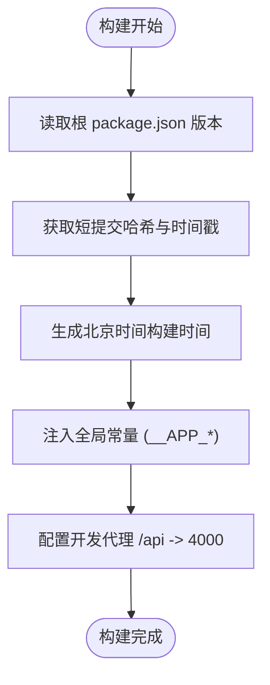

**图表来源**
- [client/vite.config.ts](file://client/vite.config.ts#L8-L58)

**章节来源**
- [client/vite.config.ts](file://client/vite.config.ts#L1-L82)
- [client/eslint.config.js](file://client/eslint.config.js#L1-L24)
- [client/tsconfig.json](file://client/tsconfig.json#L1-L8)
- [client/package.json](file://client/package.json#L1-L45)
- [client/.gitignore](file://client/.gitignore#L1-L25)

### 服务端 API 与权限引擎
- 数据库与表：部门、用户、权限、收藏、词汇表等核心表，WAL 模式提升并发写入。
- 权限类型：Read（只读）、Contribute（贡献，仅可修改/删除自己上传内容）、Full（完全）。
- 权限判断：hasPermission 函数支持用户角色、部门路径、授权表与文件所有者检查；上传/删除/批量删除/批量移动等接口均按新权限体系调整。
- 文件操作：上传、删除、移动、列表、缩略图生成、回收站、分享链接等。
- 安全与中间件：CORS、压缩、JWT、bcrypt 密码、Multer 分片上传、Sharp 图像处理。

**更新** 服务端API扩展支持统一工单系统，包括统一工单API和工单类型映射。版本从 0.7.0 升级到 2.0，新增统一工单模型。

**章节来源**
- [server/index.js](file://server/index.js#L1-L200)
- [docs/CONTRIBUTE_PERMISSION_IMPLEMENTATION.md](file://docs/CONTRIBUTE_PERMISSION_IMPLEMENTATION.md#L1-L261)
- [docs/Service_API.md](file://docs/Service_API.md#L1-L800)

### iOS 客户端架构与缓存机制
- 架构：SwiftUI + MVVM，数据驱动 UI，服务层单例封装网络、认证、缓存。
- 预览缓存：LRU 策略，上限 500MB，通过 index.json 持久化，App 启动异步加载。
- 列表轮询：前台每 5 秒轮询刷新，静默模式避免 UI 抖动，差异对比清理被删除项。
- 竞态条件防护：使用 item 绑定而非布尔状态，确保 UI 构建时机正确。

**更新** iOS客户端架构保持不变，主要服务于现有功能。

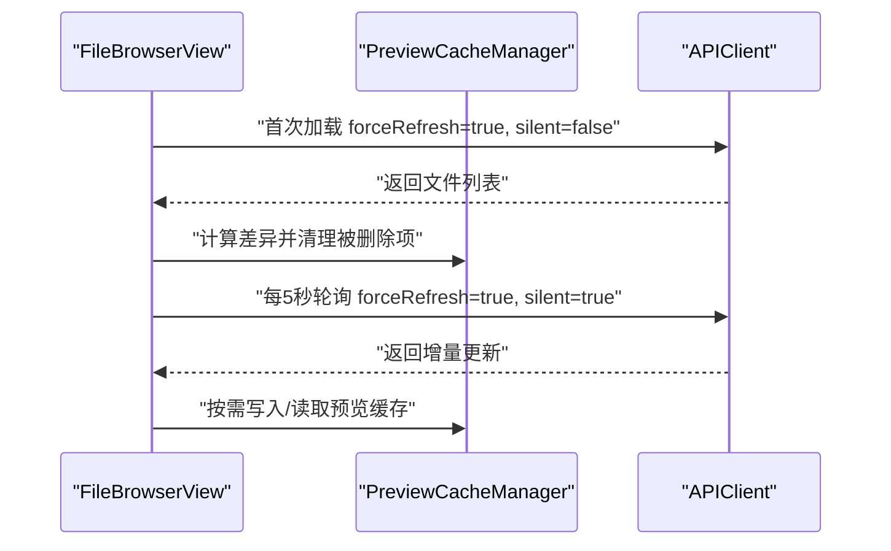

**图表来源**
- [docs/iOS_Dev_Guide.md](file://docs/iOS_Dev_Guide.md#L47-L58)

**章节来源**
- [ios/LonghornApp/LonghornApp.swift](file://ios/LonghornApp/LonghornApp.swift#L1-L26)
- [ios/LonghornApp/Info.plist](file://ios/LonghornApp/Info.plist#L1-L12)
- [docs/iOS_Dev_Guide.md](file://docs/iOS_Dev_Guide.md#L1-L77)

### 开发流程、分支管理与代码评审
- 远程开发与发布 SOP：提供 VS Code 远程 SSH、本地开发 + 远程同步、无人值守自动同步与 CI/CD 方案。
- 发布三步法：MBAir 提交 -> 登录 Mac mini -> 一键部署。
- 分支与评审建议：建议采用 Feature 分支 + Pull Request + 代码评审 + 自动化检查（ESLint、构建）的流程，评审要点包括权限逻辑、安全性、性能与兼容性。

**更新** 开发流程保持不变，适用于所有模块的开发与维护。

**章节来源**
- [docs/REMOTE_DEV_GUIDE.md](file://docs/REMOTE_DEV_GUIDE.md#L1-L158)
- [client/eslint.config.js](file://client/eslint.config.js#L1-L24)

### 调试技巧与测试策略
- 前端调试：利用 Vite 代理、浏览器开发者工具、React DevTools；ESLint 提前发现潜在问题。
- 服务端调试：使用 nodemon 开发模式，关注数据库事务、权限查询与文件系统异常；必要时启用 WAL 日志。
- iOS 调试：关注预览黑屏（item 绑定）、缩略图生成（ffmpeg/sips）、HEIC 渲染与竞态条件。
- 测试建议：按权限矩阵进行功能测试，覆盖本部门/被授权目录/历史文件/跨部门授权等边界场景。

**更新** 调试技巧保持不变，适用于所有模块的开发与维护。

**章节来源**
- [server/package.json](file://server/package.json#L1-L30)
- [docs/CONTRIBUTE_PERMISSION_IMPLEMENTATION.md](file://docs/CONTRIBUTE_PERMISSION_IMPLEMENTATION.md#L193-L214)
- [docs/iOS_Dev_Guide.md](file://docs/iOS_Dev_Guide.md#L61-L71)

### IDE 配置与效率提升
- VS Code：推荐 Remote - SSH 连接 Mac mini，获得一致的插件与运行环境；.gitignore 屏蔽 IDE 临时文件。
- 前端：启用 ESLint 插件与 TypeScript 类型检查；Vite 热更新与代理提升开发效率。
- iOS：Xcode 默认配置即可，注意 Info.plist 的 ATS 设置；Cloudflared 隧道加速远程 SSH。

**更新** IDE配置保持不变，适用于所有模块的开发与维护。

**章节来源**
- [client/.gitignore](file://client/.gitignore#L1-L25)
- [docs/REMOTE_DEV_GUIDE.md](file://docs/REMOTE_DEV_GUIDE.md#L62-L77)
- [ios/LonghornApp/Info.plist](file://ios/LonghornApp/Info.plist#L1-L12)

### 贡 Contribution 流程、问题报告与功能请求
- 贡献流程：在本地完成功能开发与自测，提交 PR 并附带变更说明与测试清单。
- 问题报告：提供环境信息（前端/后端/移动端版本、数据库状态）、复现步骤、期望与实际结果、相关日志片段。
- 功能请求：描述使用场景、收益与风险评估，必要时附权限/安全影响分析。

**更新** 贡献指南保持不变，适用于所有模块的开发与维护。

**章节来源**
- [docs/README.md](file://docs/README.md#L1-L19)
- [docs/CONTRIBUTE_PERMISSION_IMPLEMENTATION.md](file://docs/CONTRIBUTE_PERMISSION_IMPLEMENTATION.md#L1-L261)

## 智能文档更新系统

### 系统概述
Longhorn 智能文档更新系统是一个自动化文档维护解决方案，通过 `update_service_docs_smart.sh` 脚本提供智能化的文档更新功能。该系统能够自动分析代码变更、提取API接口信息、管理文档版本并更新文档模板。

**更新** 新增智能文档更新系统开发指南，详细介绍自动化文档维护功能。

### 核心功能特性

#### 1. 智能代码变更分析
- **变更检测**：自动检测最近一次提交或工作区变更的文件
- **文件类型分类**：统计路由文件、组件文件、服务文件、数据模型等变更数量
- **变更深度分析**：提取路由定义、组件功能描述、服务逻辑变更等详细信息

#### 2. 自动API接口提取
- **路由文件解析**：自动提取新增和修改的API接口定义
- **接口变更追踪**：通过git diff追踪接口的新增、删除和修改
- **数据模型变更**：自动检测数据库模型和数据结构的变更

#### 3. 智能文档更新
- **PRD文档更新**：自动生成智能更新分析内容，包含变更概览和详细分析
- **API文档更新**：自动提取接口变更，生成详细的API更新内容
- **版本管理**：自动更新文档版本号和状态信息

#### 4. 模板化文档生成
- **标准化格式**：使用统一的文档模板格式
- **智能内容填充**：根据代码变更自动生成相关内容
- **待完善标记**：为需要人工补充的内容添加标记

### 脚本架构设计

#### 主要脚本组件

##### update_service_docs_smart.sh
主脚本文件，提供完整的智能文档更新功能：

```bash
#!/bin/bash

# 智能Service文档更新脚本
# 基于代码变更自动分析并更新PRD和API文档

set -e

echo "🤖 开始智能分析文档更新..."

# 获取当前时间
CURRENT_TIME=$(date '+%Y-%m-%d %H:%M:%S')

# 文档路径
SERVICE_PRD="docs/Service_PRD.md"
SERVICE_API="docs/Service_API.md"

echo "📝 分析时间: $CURRENT_TIME"

# 获取最近一次提交的变更文件
get_changed_files() {
    echo "🔍 分析最近代码变更..."
    CHANGED_FILES=$(git diff --name-only HEAD~1 HEAD 2>/dev/null || echo "")
    if [ -z "$CHANGED_FILES" ]; then
        # 如果没有上一次提交，获取工作区变更
        CHANGED_FILES=$(git diff --name-only HEAD 2>/dev/null || echo "")
    fi
    echo "$CHANGED_FILES"
}
```

##### 智能分析引擎
- **变更类型识别**：自动识别路由文件、组件文件、服务文件等变更类型
- **内容提取算法**：使用正则表达式和git diff解析代码变更内容
- **结构化输出**：将提取的信息格式化为文档更新内容

##### 自动更新机制
- **PRD智能更新**：更新Service_PRD.md的智能分析内容
- **API智能更新**：更新Service_API.md的API变更信息
- **版本管理**：自动更新文档版本号和状态

### 使用流程

#### 1. 基本使用
```bash
# 执行智能文档更新
./scripts/update_service_docs_smart.sh

# 输出示例：
# 🤖 开始智能分析文档更新...
# 📝 分析时间: 2026-02-15 00:02:23
# 🔍 分析最近代码变更...
# 📊 变更分析结果:
#   - 路由文件变更: 9 个
#   - 组件文件变更: 13 个
#   - 服务文件变更: 12 个
#   - 数据模型变更: 0 个
#   - API相关变更: 21 个
# 📄 智能更新 Service_PRD.md...
# ✅ Service PRD 智能更新完成
# 📄 智能更新 Service_API.md...
# ✅ Service API 智能更新完成
# 🎉 智能文档更新完成！
```

#### 2. 高级功能
- **智能提取**：自动提取路由定义、组件功能、服务变更等详细信息
- **版本升级**：自动更新文档版本号
- **状态管理**：更新文档状态和最后更新时间
- **关联文档**：自动同步PRD和API文档的关联关系

### 与其他文档更新脚本的关系

#### 与 update_service_docs.sh 的区别
- **智能分析**：update_service_docs_smart.sh 提供更智能的代码分析功能
- **自动提取**：自动提取API接口信息，无需手动维护
- **版本管理**：自动管理文档版本和状态
- **模板更新**：提供更完善的模板化文档生成

#### 协作关系
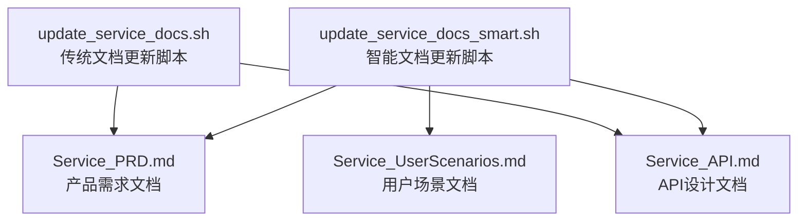

**图表来源**
- [scripts/update_service_docs_smart.sh](file://scripts/update_service_docs_smart.sh#L1-L292)
- [scripts/update_service_docs.sh](file://scripts/update_service_docs.sh#L1-L194)

### 最佳实践

#### 1. 使用建议
- **定期执行**：在每次重大代码变更后执行智能文档更新
- **人工审核**：自动更新的内容需要人工审核和补充
- **版本控制**：确保文档变更纳入版本控制系统
- **团队协作**：团队成员了解智能文档更新的工作流程

#### 2. 故障排查
- **Git权限**：确保脚本有权限访问git仓库
- **文件权限**：确保脚本有权限读写文档文件
- **依赖工具**：确保系统安装了必要的工具（git、awk等）
- **路径配置**：确保文档路径配置正确

**章节来源**
- [scripts/update_service_docs_smart.sh](file://scripts/update_service_docs_smart.sh#L1-L292)
- [scripts/update_service_docs.sh](file://scripts/update_service_docs.sh#L1-L194)
- [docs/Service_PRD.md](file://docs/Service_PRD.md#L1-L261)
- [docs/Service_API.md](file://docs/Service_API.md#L1-L174)

## 开发工具与脚本系统

### 脚本系统概述
Longhorn 开发工具与脚本系统是一个完整的运维工具集，位于根目录 `scripts/`，提供部署、数据库维护、性能诊断、系统监控等全方位的自动化解决方案。

**更新** 新增完整的开发工具与脚本系统指南，提供从开发到运维的全流程支持。

### 脚本分类与功能

#### 1. 部署与发布脚本
- **deploy.sh**：全量生产环境部署，支持快速模式和完整模式
- **update.sh**：增量更新同步，自动构建和重启服务
- **publish.sh**：发布代码到运行环境
- **deploy-watch.sh**：监视文件变化并热更新

#### 2. 数据库维护脚本
- **sync-db.sh**：本地数据库同步工具，支持SCP同步
- **sync-remote-db.sh**：从生产服务器下载最新数据库
- **db-validate.sh**：数据库结构一致性检查与自动修复
- **migrate_dealers.js**：经销商数据迁移脚本
- **migrate_dealers_v2.js**：经销商数据迁移V2版本

#### 3. 系统工具脚本
- **setup.sh**：首次环境搭建脚本，一键初始化Mac mini M1生产环境
- **health-check.sh**：服务器实时健康监测与自动恢复
- **diagnose-performance.sh**：性能诊断报告生成
- **ssh-mini.sh**：快速 SSH 连接Mac mini服务器

#### 4. 监控与维护脚本
- **deploy-complete.sh**：完整的部署完成检查
- **deploy-robust.sh**：健壮的部署脚本，处理各种异常情况
- **ecosystem.config.js**：PM2生态系统配置
- **query-backup-settings.js**：备份设置查询脚本

### 部署脚本详解

#### deploy.sh - 全量部署脚本
提供两种部署模式，满足不同场景需求：

**快速模式（默认）**：
- 本地构建客户端代码
- 同步构建产物到服务器
- 远程重启PM2进程
- 适合快速迭代和开发环境

**完整模式（--full）**：
- 打包客户端代码为tarball
- 原子性替换远程代码
- 远程安装依赖并构建
- 适合生产环境和正式发布

```bash
# 快速模式部署
./scripts/deploy.sh

# 完整模式部署
./scripts/deploy.sh --full

# 同步Git并部署
./scripts/deploy.sh --git
```

#### update.sh - 增量更新脚本
在生产服务器上执行，自动拉取最新代码、安装依赖、构建客户端并重启服务：

```bash
# 在生产服务器上执行
./scripts/update.sh
```

### 数据库维护工具

#### health-check.sh - 健康检查脚本
提供完整的服务器健康检查功能：

- **端口检查**：检查前端（3001）和后端（4000）服务状态
- **数据库完整性**：自动检查和修复缺失的数据库列
- **自动启动**：支持交互式启动停止的服务
- **彩色输出**：友好的终端输出格式

#### db-validate.sh - 数据库验证脚本
自动验证数据库结构并修复缺失的列：

```bash
# 验证数据库结构
./scripts/db-validate.sh
```

#### sync-db.sh - 数据库同步脚本
将本地修复好的数据库覆盖到服务器：

```bash
# 同步数据库到服务器
./scripts/sync-db.sh
```

### 性能诊断工具

#### diagnose-performance.sh - 性能诊断脚本
生成详细的性能诊断报告：

- **PM2进程状态**：检查进程运行状态和详细信息
- **API响应测试**：测试本地API响应速度
- **数据库统计**：统计文件、用户、分享链接数量
- **系统资源**：内存使用、磁盘使用情况
- **网络连接**：Cloudflare Tunnel状态和网络连通性

### 最佳实践

#### 1. 部署流程
- **开发环境**：使用快速模式部署，快速迭代
- **生产环境**：使用完整模式部署，确保原子性
- **紧急修复**：使用update.sh进行快速增量更新

#### 2. 数据库维护
- **定期检查**：每周运行health-check.sh检查服务状态
- **结构验证**：每月运行db-validate.sh验证数据库结构
- **数据同步**：使用sync-db.sh同步修复后的数据库

#### 3. 性能监控
- **日常监控**：使用diagnose-performance.sh生成日报
- **异常处理**：结合health-check.sh进行自动恢复
- **容量规划**：定期检查磁盘使用和数据库大小

**章节来源**
- [scripts/README.md](file://scripts/README.md#L1-L32)
- [scripts/deploy.sh](file://scripts/deploy.sh#L1-L167)
- [scripts/update.sh](file://scripts/update.sh#L1-L33)
- [scripts/health-check.sh](file://scripts/health-check.sh#L1-L115)
- [scripts/db-validate.sh](file://scripts/db-validate.sh#L1-L52)
- [scripts/sync-db.sh](file://scripts/sync-db.sh#L1-L28)
- [scripts/diagnose-performance.sh](file://scripts/diagnose-performance.sh#L1-L122)
- [scripts/migrate_dealers.js](file://scripts/migrate_dealers.js#L1-L88)
- [scripts/migrate_dealers_v2.js](file://scripts/migrate_dealers_v2.js#L1-L235)

## 测试与质量保证

### 测试工具概述
Longhorn 测试与质量保证系统包含多种测试工具，从API测试到性能验证，确保系统质量和稳定性。

**更新** 新增测试与质量保证系统指南，提供完整的测试工具链。

### API测试工具

#### apitest.sh - API测试快捷脚本
提供常用的API测试命令预设：

- **备份状态测试**：测试备份状态API
- **统一工单API测试**：测试统一工单相关API
- **服务健康测试**：测试服务健康状态
- **帮助信息**：显示所有可用命令

```bash
# 测试备份状态
./apitest.sh backup

# 测试统一工单API
./apitest.sh tickets

# 测试服务健康
./apitest.sh health

# 显示帮助
./apitest.sh help
```

#### test_api.js - Node.js API测试脚本
提供批量API测试功能，支持多语言和多级别测试：

- **批量测试**：测试多个语言和级别的词汇API
- **状态码验证**：验证HTTP状态码
- **JSON解析**：测试JSON响应解析
- **错误处理**：处理网络错误和解析错误

```javascript
// 测试组合
const testCombos = [
    { lang: 'en', level: 'Advanced' },
    { lang: 'en', level: 'Intermediate' },
    { lang: 'en', level: 'Common Phrases' },
    { lang: 'zh', level: 'Idioms' },
    { lang: 'de', level: 'A1' }
];

// 批量执行测试
testCombos.forEach(c => test(c.lang, c.level));
```

### 数据验证工具

#### server/scripts/fix_service_tickets.js - 工单修复脚本
提供完整的工单数据修复功能：

- **迁移应用**：应用所有未运行的数据库迁移
- **经销商维修单修复**：修复ID格式和补充详细内容
- **RMA单区分**：区分经销商返厂和直客返厂
- **示例数据生成**：生成测试用的工单数据

```javascript
// 应用数据库迁移
for (const file of files) {
    const applied = db.prepare('SELECT 1 FROM _migrations WHERE name = ?').get(file);
    if (!applied) {
        const sql = fs.readFileSync(path.join(migrationsDir, file), 'utf8');
        const statements = sql.split(';').filter(s => s.trim());
        for (const stmt of statements) {
            try {
                db.exec(stmt);
            } catch (err) {
                if (!err.message.includes('duplicate column name')) {
                    console.error(`    错误: ${err.message}`);
                }
            }
        }
        db.prepare('INSERT INTO _migrations (name) VALUES (?)').run(file);
    }
}
```

#### server/scripts/import_dealers_from_tickets.js - 经销商导入脚本
从工单数据中提取并导入经销商信息：

- **数据提取**：从RMA工单中提取唯一经销商
- **用户创建**：为经销商创建用户账户
- **数据规范化**：用户名规范化处理
- **批量导入**：事务性批量导入操作

### 测试最佳实践

#### 1. API测试流程
- **单元测试**：使用apitest.sh进行基本API功能测试
- **集成测试**：使用test_api.js进行批量API测试
- **回归测试**：定期运行完整的API测试套件
- **性能测试**：监控API响应时间和吞吐量

#### 2. 数据验证流程
- **数据完整性**：定期验证数据库结构和数据完整性
- **业务逻辑验证**：验证工单数据的业务逻辑正确性
- **数据迁移验证**：验证数据迁移过程的正确性
- **备份验证**：验证备份和恢复流程

#### 3. 质量保证流程
- **代码审查**：所有代码变更必须经过代码审查
- **自动化测试**：集成CI/CD管道中的自动化测试
- **性能监控**：持续监控系统性能指标
- **用户验收测试**：新功能发布前的用户验收测试

**章节来源**
- [apitest.sh](file://apitest.sh#L1-L29)
- [test_api.js](file://test_api.js#L1-L52)
- [server/scripts/fix_service_tickets.js](file://server/scripts/fix_service_tickets.js#L1-L431)
- [server/scripts/import_dealers_from_tickets.js](file://server/scripts/import_dealers_from_tickets.js#L1-L58)

## 数据迁移与维护工具

### 数据迁移系统概述
Longhorn 数据迁移与维护工具提供完整的数据处理和维护功能，支持经销商数据迁移、工单修复、数据同步等操作。

**更新** 新增数据迁移与维护工具指南，提供完整的数据处理解决方案。

### 经销商数据迁移工具

#### migrate_dealers.js - 基础经销商迁移脚本
支持从旧的经销商表迁移到新的客户表：

- **数据映射**：将经销商字段映射到客户表字段
- **事务处理**：使用事务确保数据完整性
- **外键更新**：自动更新相关表的外键引用
- **注释保留**：保留原始经销商代码信息

```javascript
// 迁移经销商数据
const insertCustomer = db.prepare(`
    INSERT INTO customers (
        customer_type, customer_name, contact_person, phone, email,
        country, province, city, company_name, notes,
        account_type, service_tier, created_at, updated_at
    ) VALUES (
        'Dealer', @name, @contact_person, @contact_phone, @contact_email,
        @country, @region, @city, @name, @notes,
        @dealer_type, @repair_level, @created_at, @updated_at
    )
`);

// 更新外键引用
const updateUsers = db.prepare('UPDATE users SET dealer_id = ? WHERE dealer_id = ?');
const updateRMA = db.prepare('UPDATE rma_tickets SET dealer_id = ? WHERE dealer_id = ?');
const updateRepairs = db.prepare('UPDATE dealer_repairs SET dealer_id = ? WHERE dealer_id = ?');
```

#### migrate_dealers_v2.js - 高级经销商迁移脚本
提供完整的数据库结构迁移和数据迁移：

- **外键禁用**：迁移过程中禁用外键约束
- **结构迁移**：更新相关表的数据库结构
- **视图重建**：重建相关的数据库视图
- **Schema更新**：更新外键定义和表结构

```javascript
// 禁用外键约束
db.pragma('foreign_keys = OFF');
console.log('Foreign Keys Disabled.');

// 迁移表结构
db.prepare('ALTER TABLE rma_tickets RENAME TO rma_tickets_old').run();
db.prepare('CREATE TABLE rma_tickets (...)').run();
db.prepare('INSERT INTO rma_tickets SELECT * FROM rma_tickets_old').run();
db.prepare('DROP TABLE rma_tickets_old').run();

// 重新启用外键约束
db.pragma('foreign_keys = ON');
```

### 工单数据维护工具

#### fix_service_tickets.js - 工单修复脚本
提供完整的工单数据修复和示例数据生成：

- **迁移应用**：自动应用所有未运行的数据库迁移
- **数据修复**：修复工单数据格式和内容
- **示例数据**：生成测试用的工单示例数据
- **序号管理**：管理工单编号的序列号

```javascript
// 生成工单编号
function generateSvcNumber(yearMonth, seq) {
    const seqStr = seq < 10000 ? String(seq).padStart(4, '0') : seq.toString(16).toUpperCase().padStart(4, '0');
    return `SVC-D-${yearMonth}-${seqStr}`;
}

// 生成RMA编号
function generateRmaNumber(channel, yearMonth, seq) {
    const seqStr = seq < 10000 ? String(seq).padStart(4, '0') : seq.toString(16).toUpperCase().padStart(4, '0');
    return `RMA-${channel}-${yearMonth}-${seqStr}`;
}
```

#### import_dealers_from_tickets.js - 经销商导入脚本
从工单数据中自动提取和导入经销商信息：

- **数据提取**：从RMA工单中提取唯一的经销商名称
- **用户创建**：为每个经销商创建用户账户
- **数据规范化**：用户名规范化处理
- **批量导入**：使用事务确保数据一致性

```javascript
// 提取唯一经销商
const rmaDealers = db.prepare(`
    SELECT DISTINCT dealer_name 
    FROM rma_tickets 
    WHERE dealer_name IS NOT NULL AND dealer_name != ''
`).all();

// 批量导入经销商
db.transaction(() => {
    for (const d of rmaDealers) {
        const name = d.dealer_name.trim();
        if (!name) continue;

        const username = name.replace(/[^a-zA-Z0-9]/g, '').toLowerCase() + '_admin';
        const passwordHash = '$2a$10$CwTycUXWue0Thq9StjUM0uJ0.pQp.e.g.s.o.m.e.h.a.s.h';

        const result = insertDealer.run({
            username: username,
            password: passwordHash,
            name: name
        });
    }
})();
```

### 数据维护最佳实践

#### 1. 迁移流程
- **备份数据**：迁移前务必备份数据库
- **测试环境**：先在测试环境验证迁移脚本
- **事务处理**：使用事务确保数据一致性
- **回滚机制**：准备数据回滚方案

#### 2. 数据验证
- **完整性检查**：验证迁移后的数据完整性
- **业务逻辑验证**：验证业务逻辑的正确性
- **性能测试**：测试迁移后的系统性能
- **用户验收**：业务用户的验收测试

#### 3. 维护策略
- **定期维护**：制定定期的数据维护计划
- **监控告警**：建立数据异常监控告警机制
- **文档记录**：详细记录数据维护操作
- **知识传承**：确保维护流程的可传承性

**章节来源**
- [scripts/migrate_dealers.js](file://scripts/migrate_dealers.js#L1-L88)
- [scripts/migrate_dealers_v2.js](file://scripts/migrate_dealers_v2.js#L1-L235)
- [server/scripts/fix_service_tickets.js](file://server/scripts/fix_service_tickets.js#L1-L431)
- [server/scripts/import_dealers_from_tickets.js](file://server/scripts/import_dealers_from_tickets.js#L1-L58)

## 工作流管理规范

### 工作流系统概述
Longhorn 工作流管理系统位于 .agent/workflows/ 目录，提供标准化的任务管理、项目日志记录、远程操作和UI/UX设计规范。系统包含五个核心工作流文件，每个文件定义了特定的开发流程和标准操作。

**更新** 新增工作流管理规范，基于现有的 .agent/workflows/ 目录文件制定标准流程。

### 核心工作流文件

#### 1. 任务完成工作流 (finalize_task.md)
标准化的任务完成流程，确保项目文档与Git同步更新。

- **文档更新**：自动更新 Service_API.md、Service_PRD.md、Service_UserScenarios.md
- **版本管理**：标记已实现功能为 Completed，记录设计变更
- **Git操作**：标准化的提交和推送流程

#### 2. 项目日志工作流 (pmlog.md)
快速记录Prompt对话到项目日志的标准流程。

- **响应时长计算**：从接收Prompt到当前时间的总耗时
- **日志格式**：标准化的Markdown格式，使用简体中文
- **文档同步**：自动更新 log_prompt.md、log_backlog.md、log_dev.md

#### 3. 远程操作工作流 (remote_ops.md)
安全执行远程Mac mini服务器命令的标准操作流程。

- **上下文检查**：执行前检查服务器状态和基础设施详情
- **SSH黄金法则**：非交互SSH会话必须使用登录shell包装器
- **常见操作**：服务器重启、数据库清理、日志查看等

#### 4. UI/UX设计规范 (uiux.md)
统一的界面设计风格和交互规范。

- **设计风格**：Web端遵循macOS26风格，iOS端遵循iOS26风格
- **主题色彩**：Kine Yellow (#FFD700)、Kine Green (#4CAF50)、Kine Red (#EF4444)、Kine Blue (#3B82F6)
- **交互规范**：Toast提示、确认弹窗等

#### 5. 更新流程 (upd.md)
明确的代码更新和版本发布流程。

- **版本递增**：服务器端和客户端软件版本号递增
- **远程部署**：读取OPS.md和context.md了解远程服务器访问方式

### 工作流执行流程

#### 1. 任务完成标准流程
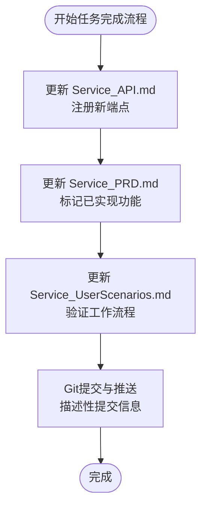

#### 2. 项目日志记录流程
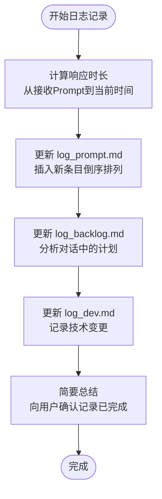

#### 3. 远程操作安全流程
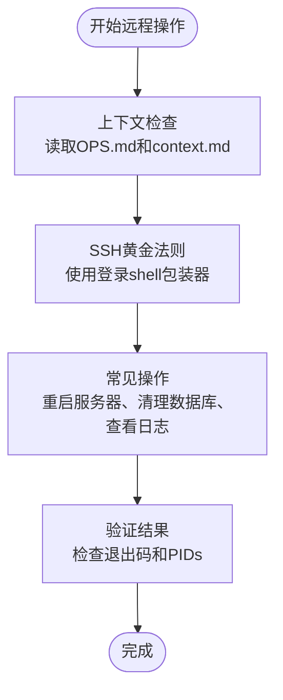

### 最佳实践

#### 1. 工作流执行建议
- **标准化执行**：严格按照工作流文件定义的步骤执行
- **文档同步**：确保所有相关文档都得到更新
- **版本控制**：使用描述性的Git提交信息
- **安全第一**：远程操作时严格遵守SSH黄金法则

#### 2. 工作流维护
- **定期审查**：定期审查工作流的有效性和适用性
- **团队培训**：确保所有团队成员熟悉工作流程
- **持续改进**：根据项目发展不断优化工作流程
- **文档更新**：工作流程变更时及时更新相关文档

**章节来源**
- [.agent/workflows/finalize_task.md](file://.agent/workflows/finalize_task.md#L1-L20)
- [.agent/workflows/pmlog.md](file://.agent/workflows/pmlog.md#L1-L38)
- [.agent/workflows/remote_ops.md](file://.agent/workflows/remote_ops.md#L1-L52)
- [.agent/workflows/uiux.md](file://.agent/workflows/uiux.md#L1-L7)
- [.agent/workflows/upd.md](file://.agent/workflows/upd.md#L1-L5)
- [docs/log_dev.md](file://docs/log_dev.md#L977-L978)

## 统一工单系统开发指南

### 工单系统概述
Longhorn 统一工单系统是一个完整的工单管理闭环，基于统一工单模型支持 inquiry（咨询工单）、rma（返修工单）、svc（经销商维修工单）三种工单类型的统一管理。系统采用单表多态设计，提供统一的工单创建、处理、跟踪和关闭流程。

**更新** 新增统一工单系统开发指南，详细介绍统一工单模型的架构与实现方案。系统已从三层次工单系统向统一工单模型转变。

### 统一工单模型

#### 工单类型设计
统一工单系统支持三种工单类型，每种类型具有不同的业务流程和字段要求：

- **inquiry（咨询工单）**：用于客户咨询、技术支持等轻量级服务请求
- **rma（返修工单）**：用于需要寄回总部维修的复杂问题
- **svc（经销商维修工单）**：用于一级和二级经销商可本地处理的维修服务

#### 工单数据模型
所有工单类型共享统一的数据模型，通过 `ticket_type` 字段区分不同类型：

- **标识字段**：工单编号、创建时间、更新时间、工单类型
- **状态管理**：统一的状态枚举和状态流转规则
- **客户信息**：统一的客户、联系人、经销商信息
- **产品信息**：统一的产品型号、序列号
- **服务信息**：统一的问题描述、处理记录

#### 工单编号生成
统一工单编号生成规则，根据工单类型和创建时间生成唯一编号：

- **inquiry**：KYYMM-XXXX 格式
- **rma**：RMA-C/YYMM-XXXX 格式
- **svc**：SVC-D-YYMM-XXXX 格式

### 统一工单API设计

#### 统一API规范
所有工单类型遵循统一的API设计规范：

- **端点命名**：`/api/v1/tickets` 统一端点
- **请求格式**：JSON，支持分页、过滤、排序
- **响应格式**：统一的成功/失败结构
- **鉴权机制**：Bearer Token（JWT）

#### 工单操作API

##### 列表查询
- **GET** `/api/v1/tickets`
- **支持参数**：工单类型、状态、节点、优先级、客户、产品、分页
- **响应**：工单列表、总数、分页信息

##### 创建工单
- **POST** `/api/v1/tickets`
- **支持字段**：所有必需字段，包括工单类型
- **响应**：创建成功的工单信息

##### 更新工单
- **PATCH** `/api/v1/tickets/{id}`
- **支持字段**：可更新字段，包括状态流转
- **响应**：更新后的工单信息

##### 删除工单
- **DELETE** `/api/v1/tickets/{id}`
- **响应**：删除成功状态

### 统一工单状态管理

#### 统一状态流程
所有工单类型遵循统一的状态管理流程：

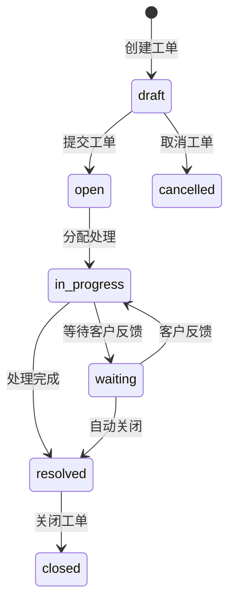

#### 工单节点管理
统一的工单节点管理，支持不同工单类型的节点流转：

- **MS（市场部）节点**：draft、submitted、ms_review、waiting_customer、ms_closing
- **OP（生产运营部）节点**：op_receiving、op_diagnosing、op_repairing、op_shipping、op_qa
- **GE（通用台面）节点**：ge_review、ge_closing
- **RD（研发部）节点**：rd_consulting、rd_resolved

### 统一工单权限控制

#### 角色权限矩阵
- **客户**：只能查看自己的工单
- **客服**：可以查看和处理所有工单
- **经销商**：只能查看和处理分配给自己的工单
- **管理员**：可以查看和管理所有工单

#### 数据访问控制
- **读取权限**：根据工单状态和用户角色控制
- **写入权限**：严格的字段级权限控制
- **删除权限**：仅管理员可删除已完成工单

### 统一工单详情页面

#### UnifiedTicketDetail 组件
统一工单详情页面提供完整的工单信息展示和操作功能：

- **基本信息**：工单编号、类型、状态、优先级、SLA状态
- **客户信息**：客户名称、联系人、联系方式
- **产品信息**：产品型号、序列号、固件版本
- **处理流程**：节点进度条、活动时间轴、评论框
- **协作者**：参与者列表、指派人信息

#### 工单操作
统一工单详情页面支持完整的工单操作：

- **状态流转**：根据当前节点显示相应的操作按钮
- **编辑功能**：权限控制下的字段编辑
- **删除恢复**：权限控制下的工单删除和恢复
- **附件管理**：统一的附件上传和管理

**章节来源**
- [docs/Service_API.md](file://docs/Service_API.md#L1-L800)
- [docs/Service_PRD.md](file://docs/Service_PRD.md#L1-L800)
- [docs/Service_UserScenarios.md](file://docs/Service_UserScenarios.md#L1-L800)
- [server/service/routes/tickets.js](file://server/service/routes/tickets.js#L1-L2502)
- [client/src/components/Service/UnifiedTicketDetailPage.tsx](file://client/src/components/Service/UnifiedTicketDetailPage.tsx#L1-L345)
- [client/src/components/Workspace/UnifiedTicketDetail.tsx](file://client/src/components/Workspace/UnifiedTicketDetail.tsx#L1-L1569)

## 现代化UI组件开发指南

### AppRail 布局组件

#### 组件概述
AppRail 是 Longhorn 项目的核心布局组件，提供简洁高效的侧边导航栏，支持服务模块、文件模块和管理员模块的快速切换。

**更新** 新增 AppRail 布局组件开发指南，详细介绍现代化侧边导航的设计与实现。

#### 组件特性
- **响应式设计**：紧凑的图标导航，支持动态标签显示
- **模块化导航**：支持服务、文件、管理员三个主要模块
- **权限控制**：根据用户角色动态显示模块
- **国际化支持**：完整的多语言支持
- **品牌展示**：内置品牌Logo区域

#### 组件接口

##### Props 接口
```typescript
interface AppRailProps {
  currentModule: ModuleType;           // 当前激活模块
  onModuleChange: (module: ModuleType) => void;  // 模块切换回调
  canAccessFiles: boolean;             // 是否可访问文件模块
  userRole: string;                    // 用户角色
}
```

##### 模块类型定义
```typescript
type ModuleType = 'service' | 'files' | 'admin';
```

#### 导航模块

##### 服务模块
- **图标**：耳机图标（Headphones）
- **功能**：访问所有服务相关功能
- **权限**：所有用户可见

##### 文件模块
- **图标**：文件夹图标（FolderOpen）
- **功能**：文件浏览、上传、下载
- **权限**：根据 canAccessFiles 决定显示

##### 管理员模块
- **图标**：网络图标（Network）
- **功能**：系统管理、用户管理、权限设置
- **权限**：仅管理员可见

#### 样式设计
组件采用深色主题设计，符合现代Web应用的视觉规范：

- **尺寸**：宽度72px，全高显示
- **颜色**：黑色背景，蓝色激活状态
- **动画**：平滑的悬停效果和激活动画
- **阴影**：激活状态带有黄色发光效果

**章节来源**
- [client/src/components/AppRail.tsx](file://client/src/components/AppRail.tsx#L1-L152)

### useCachedTickets Hook

#### Hook概述
useCachedTickets 是一个专门为工单管理设计的数据缓存Hook，基于 SWR 实现，提供高性能的工单列表数据管理。

**更新** 新增 useCachedTickets Hook 开发指南，详细介绍工单数据缓存与性能优化方案。

#### 核心特性
- **类型安全**：支持三种工单类型的类型推断
- **智能缓存**：自动缓存工单列表数据
- **去重请求**：2秒内重复请求自动去重
- **后台刷新**：支持焦点和网络重连时的自动刷新
- **预取功能**：支持预加载即将访问的数据

#### API 设计

##### 主要接口
```typescript
function useCachedTickets<T = any>(
  ticketType: TicketType,
  params: Record<string, string | number | undefined> = {},
  options: CacheOptions = {}
): {
  tickets: T[];
  meta: TicketMeta;
  isLoading: boolean;
  isValidating: boolean;
  isError: boolean;
  error: any;
  refresh: () => void;
};
```

##### 类型定义
```typescript
type TicketType = 'inquiry' | 'rma' | 'dealer';

interface TicketMeta {
  total: number;
  page: number;
  pageSize: number;
}

interface CacheOptions {
  revalidateOnFocus?: boolean;
  revalidateOnReconnect?: boolean;
  dedupingInterval?: number;
  refreshInterval?: number;
}
```

##### 端点映射
```typescript
const endpoints: Record<TicketType, string> = {
  inquiry: '/api/v1/inquiry-tickets',
  rma: '/api/v1/rma-tickets',
  dealer: '/api/v1/dealer-repairs'
};
```

#### 性能优化
- **去重间隔**：默认2秒，避免频繁重复请求
- **后台刷新**：网络重连时自动刷新缓存
- **数据比较**：使用JSON比较函数避免不必要的重渲染
- **预取支持**：支持预加载功能提升用户体验

#### 使用示例
```typescript
// 基础使用
const { tickets, isLoading, isValidating } = useCachedTickets('inquiry');

// 带参数查询
const { tickets, meta } = useCachedTickets('dealer', {
  status: 'InProgress',
  dealerId: 123
});

// 自定义选项
const { tickets, refresh } = useCachedTickets('rma', {}, {
  revalidateOnFocus: true,
  dedupingInterval: 5000
});
```

**章节来源**
- [client/src/hooks/useCachedTickets.ts](file://client/src/hooks/useCachedTickets.ts#L1-L136)

### AttachmentZone 附件上传组件

#### 组件概述
AttachmentZone 是一个功能完整的附件上传组件，支持拖拽上传、文件预览、批量管理等功能，为工单创建提供优质的附件处理体验。

**更新** 新增 AttachmentZone 附件上传组件开发指南，详细介绍现代化附件处理组件的实现。

#### 核心功能
- **拖拽上传**：支持拖拽和点击两种上传方式
- **文件预览**：支持图片、视频、PDF等文件类型预览
- **批量管理**：支持多文件选择和删除
- **类型限制**：严格的文件类型和大小限制
- **响应式设计**：自适应不同屏幕尺寸

#### 支持的文件类型
- **图片**：支持 JPG、PNG、GIF、HEIC 等
- **视频**：支持 MP4、MOV、AVI 等
- **文档**：支持 PDF、TXT 等
- **大小限制**：单个文件最大50MB

#### 组件接口

##### Props 接口
```typescript
interface AttachmentZoneProps {
  files: File[];                           // 已选择的文件数组
  onFilesChange: (files: File[]) => void;   // 文件变化回调
}
```

#### 交互设计
- **拖拽状态**：拖拽时显示高亮效果和特殊样式
- **文件网格**：文件列表采用响应式网格布局
- **悬停效果**：文件项悬停时显示删除按钮
- **进度指示**：支持上传进度显示（扩展功能）

#### 样式设计
组件采用现代化的设计语言：

- **边框样式**：虚线边框，悬停时变为实线
- **背景渐变**：拖拽时显示淡黄色背景
- **图标设计**：使用简洁的上传图标
- **卡片布局**：文件预览采用卡片式设计

**章节来源**
- [client/src/components/Service/AttachmentZone.tsx](file://client/src/components/Service/AttachmentZone.tsx#L1-L108)

### TicketCreationModal 工单创建模态框

#### 组件概述
TicketCreationModal 是一个现代化的工单创建模态框组件，提供完整的工单创建表单，支持统一工单模型的三种工单类型。

**更新** 新增 TicketCreationModal 工单创建模态框开发指南，详细介绍现代化工单创建组件的实现。

#### 设计特色
- **macOS风格**：采用圆角设计和毛玻璃效果
- **类型化界面**：根据工单类型显示不同的界面元素
- **双列布局**：左右分区的高效表单布局
- **草稿保存**：自动保存表单草稿到本地存储
- **附件管理**：集成 AttachmentZone 组件

#### 界面布局

##### 头部区域
- **类型图标**：根据工单类型显示对应颜色的图标
- **标题显示**：显示当前工单类型的中文标题
- **关闭按钮**：右上角的圆形关闭按钮

##### 表单主体
采用双列布局设计：

###### 左侧列 - 客户与产品信息
- **客户信息区**：客户名称、联系方式输入
- **产品信息区**：产品选择、序列号输入
- **分隔线**：清晰的区域划分

###### 右侧列 - 问题详情与附件
- **问题详情区**：问题描述或摘要输入
- **附件管理区**：AttachmentZone 组件集成
- **文件列表**：显示已选择的附件文件

##### 底部区域
- **状态指示**：显示草稿保存状态
- **操作按钮**：取消和创建按钮
- **创建按钮**：采用品牌色的突出设计

#### 工单类型差异化

##### Inquiry 工单
- **问题字段**：使用 `problem_summary`（摘要）
- **颜色主题**：蓝色主题
- **图标样式**：消息气泡图标

##### RMA 工单
- **问题字段**：使用 `problem_description`（详细描述）
- **颜色主题**：橙色主题
- **图标样式**：盾牌图标

##### DealerRepair 工单
- **问题字段**：使用 `problem_description`（详细描述）
- **颜色主题**：绿色主题
- **图标样式**：扳手图标

#### 数据处理
- **草稿管理**：使用 Zustand 状态管理保存草稿
- **初始数据**：自动加载产品和经销商列表
- **附件处理**：支持多文件上传和删除
- **表单验证**：前端基础验证，后端严格验证

#### 动画效果
组件采用平滑的动画过渡：

- **弹出动画**：从底部向上弹出的动画效果
- **透明度变化**：背景模糊和透明度渐变
- **按钮状态**：悬停时的颜色和亮度变化

**章节来源**
- [client/src/components/Service/TicketCreationModal.tsx](file://client/src/components/Service/TicketCreationModal.tsx#L1-L345)

### 工单状态管理

#### 状态存储
使用 Zustand 管理工单状态：

```typescript
export const useTicketStore = create<TicketStore>()(
  persist(
    (set) => ({
      isOpen: false,
      ticketType: 'Inquiry',
      drafts: initialDrafts,
      // actions...
    }),
    {
      name: 'longhorn-ticket-drafts',
      partialize: (state) => ({ drafts: state.drafts }),
    }
  )
);
```

#### 草稿存储
- **本地持久化**：使用 localStorage 存储草稿
- **类型安全**：支持三种工单类型的独立草稿
- **自动恢复**：页面刷新后自动恢复草稿

**章节来源**
- [client/src/store/useTicketStore.ts](file://client/src/store/useTicketStore.ts#L1-L68)

## 服务管理功能开发指南

### 服务管理系统概述
Longhorn 服务管理系统是一个完整的产品服务闭环系统，以"服务"为核心，连接客户、经销商和公司内部团队，围绕产品建立完整的服务生态。系统包含服务记录、统一工单管理、知识库、上下文查询等核心功能模块。

**更新** 服务管理系统保持稳定，继续提供完整的服务闭环支持。版本从 0.7.0 升级到 2.0，新增统一工单系统的完整功能实现。

### 核心功能模块

#### 1. 服务记录管理
服务记录是系统的核心入口，用于记录咨询、问题排查等轻量级服务，可升级为统一工单。

- **创建服务记录**：支持快速查询模式和代客户服务模式
- **服务类型**：咨询服务、问题排查、本地维修、返修服务、功能期望
- **生命周期管理**：创建 → 处理中 → 待客户反馈 → 已解决/自动关闭/转工单
- **状态流转**：支持重新打开、自动关闭等业务规则

#### 2. 统一工单管理
统一工单系统支持 inquiry、rma、svc 三种工单类型的统一管理，提供完整的维修流程管理。

- **工单类型**：统一工单模型支持三种工单类型
- **维修优先级**：R1（加急1天）、R2（优先3天）、R3（标准7天）
- **维修流程**：创建 → 分配 → 维修 → 结算 → 关闭
- **配件管理**：支持配件库存查询、使用记录、补货申请

#### 3. 知识库系统
知识库系统提供FAQ、故障排除指南、案例等知识内容，支持多维度检索和权限控制。

- **知识类型**：FAQ、故障排除、案例分析
- **可见性控制**：Public、Dealer、Internal、Department
- **产品关联**：支持多产品关联，便于精准检索
- **AI辅助**：智能问答、内容生成、相似度匹配

#### 4. 上下文查询系统
系统支持按客户或按产品SN查询上下文信息，便于快速了解客户背景和设备历史。

- **双维度查询**：按客户查询（显示设备列表、服务历史、AI画像）和按SN查询（显示设备历史、所有权记录）
- **AI客户画像**：基于历史交互生成客户标签和偏好
- **历史追溯**：支持设备转让/出租后的服务历史追溯

**章节来源**
- [docs/Service_API.md](file://docs/Service_API.md#L1-L800)
- [docs/Service_PRD.md](file://docs/Service_PRD.md#L1-L800)
- [docs/Service_UserScenarios.md](file://docs/Service_UserScenarios.md#L1-L800)

### API 设计规范

#### 认证与授权
- **认证方式**：Bearer Token（JWT）
- **权限控制**：基于角色的权限矩阵，支持部门级权限继承
- **API版本**：URL路径版本控制 `/api/v1/`

#### 数据模型
- **服务记录**：包含服务类型、问题摘要、沟通记录、状态等字段
- **统一工单**：包含工单类型、产品信息、问题描述、维修内容、状态等字段
- **知识库**：包含知识类型、标题、内容、可见性、产品关联等字段

#### 错误处理
- **统一响应格式**：success、data、error 字段
- **HTTP状态码**：200、201、400、401、403、404、422、500
- **错误码规范**：VALIDATION_ERROR、AUTH_ERROR、PERMISSION_ERROR等

**章节来源**
- [docs/Service_API.md](file://docs/Service_API.md#L1-L800)

### 开发最佳实践

#### 1. 服务记录开发
- **快速查询模式**：适合简单咨询，不创建服务记录，直接查询知识库
- **代客户服务模式**：适合需要跟踪的服务，创建服务记录并记录详细信息
- **客户信息管理**：支持匿名客户，可选填客户姓名、联系方式、产品信息

#### 2. 统一工单开发
- **统一工单模型**：支持三种工单类型的统一管理
- **工单类型映射**：inquiry → inquiry，rma → rma，svc → svc
- **RMA管理**：返修工单自动生成RMA号，支持物流跟踪

#### 3. 知识库开发
- **内容结构化**：FAQ使用问答结构，故障排除使用步骤化结构
- **多语言支持**：支持英文、中文、德文、日文等多语言内容
- **权限控制**：根据用户角色控制知识库可见范围

**章节来源**
- [docs/Service_UserScenarios.md](file://docs/Service_UserScenarios.md#L1-L800)
- [docs/Service_PRD.md](file://docs/Service_PRD.md#L1-L800)

### 数据库设计与迁移

#### 服务记录数据库设计
服务记录系统采用完整的数据库设计，支持服务记录的完整生命周期管理。

- **主表设计**：包含记录编号、客户信息、产品信息、服务详情、状态管理等字段
- **索引优化**：为常用查询字段建立索引，提升查询性能
- **数据完整性**：通过外键约束保证数据一致性

#### 知识库数据库设计
知识库系统支持多层级的知识管理，包含文章、版本、反馈等完整功能。

- **文章表**：支持标题、内容、分类、标签、可见性等字段
- **版本管理**：记录文章的历史版本，支持审计追踪
- **全文搜索**：集成FTS搜索引擎，支持快速检索

#### 统一工单数据库设计
统一工单系统采用单表多态设计，支持三种工单类型的统一管理。

- **主表设计**：包含工单编号、工单类型、客户信息、产品信息、状态管理等字段
- **类型化字段**：根据工单类型存储不同类型的数据
- **索引优化**：为工单类型、状态、节点等字段建立索引
- **数据完整性**：通过外键约束保证数据一致性

**章节来源**
- [server/service/migrations/002_service_records.sql](file://server/service/migrations/002_service_records.sql#L1-L44)
- [server/service/migrations/005_knowledge_base.sql](file://server/service/migrations/005_knowledge_base.sql#L1-L214)
- [server/service/migrations/006_repair_management.sql](file://server/service/migrations/006_repair_management.sql#L1-L353)
- [server/service/migrations/007.parts_inventory.sql](file://server/service/migrations/007.parts_inventory.sql#L1-L349)
- [server/service/migrations/009_three_layer_tickets.sql](file://server/service/migrations/009_three_layer_tickets.sql#L125-L169)

## 国际化开发指南

### 多语言支持架构
Longhorn 项目采用完整的多语言支持架构，包括本地化资源管理、动态语言切换、部门名称本地化等功能。

**更新** 国际化开发指南保持稳定，继续提供完整的多语言支持。版本从 0.7.0 升级到 2.0，新增统一工单系统的国际化支持。

### 语言管理机制

#### 1. 语言切换系统
系统支持英语、简体中文、德文、日文四种语言，通过 LanguageManager 统一管理。

- **语言代码映射**：系统语言代码到应用语言代码的映射
- **默认语言设置**：根据系统语言自动选择应用语言
- **语言持久化**：使用 AppStorage 保存用户选择的语言偏好

#### 2. 本地化资源管理
所有界面文本通过 Localizable.xcstrings 管理，支持多语言翻译。

- **资源文件结构**：按语言分组的字符串资源文件
- **占位符支持**：支持 %@、%lld 等格式化占位符
- **状态管理**：支持 new、translated、needs-review 等翻译状态

#### 3. 部门名称本地化
系统支持部门名称的本地化显示，包括代码提取和名称转换。

- **代码提取**：从 "Name (Code)" 格式中提取部门代码
- **代码映射**：支持 MS（市场部）、OP（运营部）、RD（研发部）、RE（资源部）等代码
- **名称转换**：根据代码映射到本地化名称

**章节来源**
- [ios/LonghornApp/Services/LanguageManager.swift](file://ios/LonghornApp/Services/LanguageManager.swift#L1-L57)
- [ios/LonghornApp/Resources/Localizable.xcstrings](file://ios/LonghornApp/Resources/Localizable.xcstrings#L1-L800)
- [ios/LonghornApp/Models/Department+Extensions.swift](file://ios/LonghornApp/Models/Department+Extensions.swift#L19-L93)

### 国际化开发流程

#### 1. 添加新语言支持
- **创建语言文件**：在 Localizable.xcstrings 中添加新的语言条目
- **翻译内容**：为每种语言添加对应的翻译内容
- **测试验证**：验证翻译内容的正确性和完整性

#### 2. 本地化资源管理
- **字符串提取**：使用 NSLocalizedString 提取需要本地化的字符串
- **占位符处理**：正确处理格式化占位符和复数形式
- **上下文标注**：为复杂的字符串添加上下文说明

#### 3. 语言切换实现
- **用户界面**：在设置页面提供语言选择器
- **实时切换**：支持运行时语言切换而无需重启应用
- **状态同步**：确保语言切换后所有界面正确更新

**章节来源**
- [ios/LonghornApp/Views/Settings/SettingsView.swift](file://ios/LonghornApp/Views/Settings/SettingsView.swift#L1-L124)
- [ios/LonghornApp/Services/LanguageManager.swift](file://ios/LonghornApp/Services/LanguageManager.swift#L1-L57)

### 最佳实践

#### 1. 文本本地化
- **避免硬编码**：所有用户可见文本都应通过 NSLocalizedString 获取
- **格式化处理**：正确处理数字、日期、百分比等格式化需求
- **复数形式**：使用合适的复数形式处理 1/many 场景

#### 2. 布局适配
- **文字长度**：考虑不同语言的文字长度差异，预留足够的空间
- **文本方向**：支持从右到左的语言布局（如需要）
- **字体选择**：确保所选字体支持所有目标语言字符

#### 3. 文化适配
- **日期时间**：使用本地化的日期时间格式
- **数字格式**：使用本地化的数字、货币、百分比格式
- **单位系统**：根据地区使用合适的单位系统

**章节来源**
- [ios/LonghornApp/Resources/Localizable.xcstrings](file://ios/LonghornApp/Resources/Localizable.xcstrings#L1-L800)
- [ios/LonghornApp/Views/Settings/SettingsView.swift](file://ios/LonghornApp/Views/Settings/SettingsView.swift#L1-L124)

## iOS应用开发指南

### iOS应用架构设计
Longhorn iOS 应用采用 SwiftUI + MVVM 架构，强调数据驱动 UI 原则，提供完整的文件管理、服务管理、国际化支持等功能。

**更新** iOS应用开发指南保持稳定，继续提供完整的iOS开发流程、架构设计与最佳实践。版本从 0.7.0 升级到 2.0，新增统一工单系统的iOS支持。

### 架构概览

#### 1. MVVM 架构模式
- **Views (视图)**：纯 SwiftUI 构建，负责 UI 渲染
- **ViewModels (视图模型)**：管理状态和业务逻辑
- **Services (服务)**：单例模式，负责底层逻辑（网络、缓存、认证）

#### 2. 核心服务组件
- **APIClient**：网络请求核心（REST）
- **AuthManager**：JWT 令牌管理（Keychain）
- **FileCacheManager**：文件列表缓存（Actor）
- **PreviewCacheManager**：预览文件持久化缓存（Codable Index）

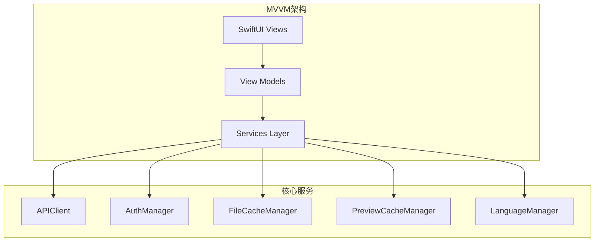

**图表来源**
- [docs/iOS_Dev_Guide.md](file://docs/iOS_Dev_Guide.md#L9-L21)

### 核心机制设计

#### 1. 预览与缓存机制
为了对齐 Web 端的流畅体验，iOS 实现了以下特制机制：

| 特性 | Web 端实现 | iOS 端实现 | 设计思考 |
|:---|:---|:---|:---|
| **列表刷新** | 5秒轮询 (SWR Hook) | **前台5秒轮询 (.task 循环)** | 消除"手机端数据滞后"的刻板印象。 |
| **删除同步** | 轮询发现文件消失 -> 移除 DOM | **轮询差异对比 (Diff)** -> 自动清理缓存 | 避免用户点击已删除的"幽灵文件"。 |
| **预览持久化** | 浏览器缓存 (Disk Cache) | **PreviewCacheManager + index.json** | 重启 App 后预览缓存依然有效，节省流量，提升秒开率。 |
| **HEIC 支持** | 浏览器原生支持有限 | **Native AsyncImage** | 原生渲染，支持高性能缩放/回弹。 |

#### 2. 竞态条件防护
在 `FileBrowserView` 中，严格遵循**数据优先**原则：
- ❌ **禁止**：使用 `Bool` 状态 (`$showPreview`) 控制全屏弹窗。
- ✅ **必须**：使用 `Date/Item` 状态 (`$previewFile`) 控制全屏弹窗。
  - `fullScreenCover(item: $previewFile)` 确保了只有当数据存在时，UI 才会构建，彻底解决了"黑屏"问题。

#### 3. 国际化支持
iOS 应用集成了完整的国际化支持，包括：
- **动态语言切换**：支持运行时语言切换
- **本地化资源**：通过 Localizable.xcstrings 管理多语言资源
- **文化适配**：自动适配日期、数字、货币等格式

**章节来源**
- [docs/iOS_Dev_Guide.md](file://docs/iOS_Dev_Guide.md#L23-L77)

### 关键模块详解

#### 1. 预览缓存管理器 (PreviewCacheManager)
- **位置**：`Services/PreviewCacheManager.swift`
- **策略**：LRU (Least Recently Used)，上限 500MB。
- **持久化**：通过 `index.json` 记录文件名与原始路径映射。App 启动时异步加载索引，不再清空缓存。

#### 2. 列表轮询 (loadFiles)
- **位置**：`FileBrowserView.swift`
- **逻辑**： 
  1. 首次进入显示 Loading Spinner。
  2. 之后每 5 秒发起 `forceRefresh: true` 请求，但标记 `silent: true` (不显示 Spinner)。
  3. 获取新列表后，计算 `Old - New` 差集，调用 `PreviewCacheManager.invalidate` 清理已被他人删除的文件的缓存。

#### 3. 服务管理集成
iOS 应用集成了统一工单管理功能，包括：
- **统一工单列表**：显示统一工单列表，支持搜索和筛选
- **统一工单详情**：展示统一工单详细信息，支持评论和附件管理
- **上下文查询**：支持按客户和SN查询设备信息

**章节来源**
- [docs/iOS_Dev_Guide.md](file://docs/iOS_Dev_Guide.md#L47-L77)

### 调试指南

#### 1. 常见问题
- **预览黑屏**:
  - 检查是否使用了 `item:` 绑定而非 `isPresented:`。
  - 检查服务端是否正确返回 `Content-Type: image/jpeg` (对于 HEIC 转换后的流)。
- **缩略图失效**:
  - 服务器必须安装 `ffmpeg` (处理视频) 和 `sips` (处理 HEIC)。
  - 检查服务器日志 `server/index.js` 中的 `[Thumbnail]` 输出。
- **国际化问题**:
  - 检查 Localizable.xcstrings 文件完整性
  - 验证语言切换逻辑是否正确

#### 2. 性能优化
- **内存管理**：合理使用 Weak Reference 避免循环引用
- **网络请求**：使用 URLSessionConfiguration 配置超时和缓存策略
- **UI渲染**：避免在主线程进行 heavy operations

**章节来源**
- [docs/iOS_Dev_Guide.md](file://docs/iOS_Dev_Guide.md#L61-L77)

### 打包与发布
- **Bundle ID**: `com.kinefinity.LonghornApp`
- **签名**: Automatic Signing (需配置 Team)
- **最低版本**: iOS 16.0
- **构建配置**：Debug/Release 不同的配置文件和编译标志

**章节来源**
- [docs/iOS_Dev_Guide.md](file://docs/iOS_Dev_Guide.md#L73-L77)

### 开发最佳实践

#### 1. SwiftUI 开发
- **状态管理**：使用 @State、@ObservableObject、@EnvironmentObject 合理管理状态
- **数据绑定**：使用 @Binding 进行父子组件通信
- **副作用处理**：使用 .task、.onAppear、.onChange 等修饰符处理生命周期事件

#### 2. 错误处理
- **网络错误**：统一的错误处理机制，提供用户友好的错误提示
- **数据验证**：在数据层进行严格的验证和转换
- **异常捕获**：使用 do-catch 处理异步操作中的异常

#### 3. 性能优化
- **视图重建**：合理使用 @ViewBuilder 和 LazyVStack 减少不必要的视图重建
- **内存使用**：及时释放不需要的对象，避免 retain cycle
- **网络优化**：使用适当的缓存策略和并发请求

**章节来源**
- [ios/LonghornApp/Views/Issues/IssueCreateView.swift](file://ios/LonghornApp/Views/Issues/IssueCreateView.swift#L1-L444)
- [ios/LonghornApp/Views/Settings/SettingsView.swift](file://ios/LonghornApp/Views/Settings/SettingsView.swift#L1-L124)

## 依赖关系分析
- 前端依赖：React、React Router、Axios、SWR、Zustand、Tailwind Merge、Lucide React、QRCode 等；开发依赖包括 ESLint、TypeScript、Vite 与 React 插件。
- 服务端依赖：Express、better-sqlite3、bcryptjs、jsonwebtoken、multer、sharp、archiver、compression、cors、fs-extra、dotenv、nodemon。
- iOS 依赖：SwiftUI、Foundation、UIKit（通过 SwiftUI 使用）、系统图像与视频处理能力。
- **统一工单系统**：基于统一工单模型，支持 inquiry、rma、svc 三种工单类型的统一管理。
- 现代化UI组件：AppRail 布局组件、AttachmentZone 附件上传组件、TicketCreationModal 工单创建模态框等。
- 服务管理依赖：完整的 API 设计、数据库迁移、权限控制。
- 国际化依赖：Localizable.xcstrings、语言管理器、部门名称本地化。
- **智能文档更新系统**：update_service_docs_smart.sh 提供智能分析和自动更新功能，update_service_docs.sh 提供传统文档更新功能。
- **开发工具与脚本系统**：完整的运维工具集，包含部署、数据库维护、性能诊断、系统监控等工具。
- **测试与质量保证**：API测试脚本、性能测试工具、数据验证脚本。
- **数据迁移与维护工具**：JavaScript脚本支持经销商数据迁移、工单修复、数据同步等维护操作。
- **工作流管理系统**：.agent/workflows/ 目录包含标准化的工作流文件，确保开发流程的一致性和可追溯性。

**更新** 依赖关系分析新增统一工单系统、开发工具与脚本系统、测试与质量保证、数据迁移与维护工具相关依赖。版本从 0.7.0 升级到 2.0，新增统一工单系统的完整功能。

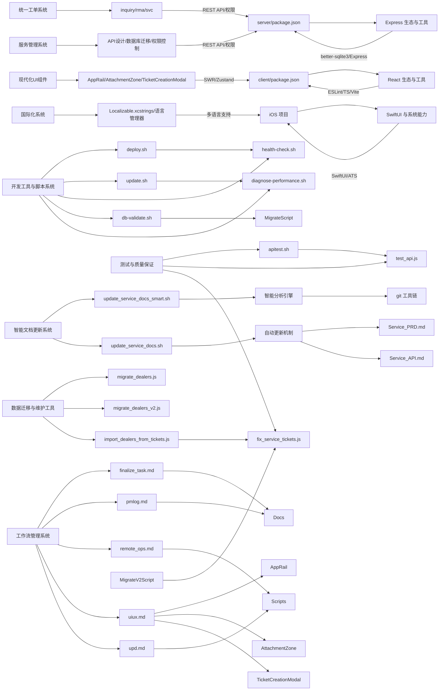

**图表来源**
- [client/package.json](file://client/package.json#L12-L29)
- [client/package.json](file://client/package.json#L30-L43)
- [server/package.json](file://server/package.json#L15-L28)
- [docs/Service_API.md](file://docs/Service_API.md#L1-L800)
- [ios/LonghornApp/Resources/Localizable.xcstrings](file://ios/LonghornApp/Resources/Localizable.xcstrings#L1-L800)
- [client/src/components/AppRail.tsx](file://client/src/components/AppRail.tsx#L1-L152)
- [client/src/hooks/useCachedTickets.ts](file://client/src/hooks/useCachedTickets.ts#L1-L136)
- [client/src/components/Service/AttachmentZone.tsx](file://client/src/components/Service/AttachmentZone.tsx#L1-L108)
- [client/src/components/Service/TicketCreationModal.tsx](file://client/src/components/Service/TicketCreationModal.tsx#L1-L345)
- [scripts/README.md](file://scripts/README.md#L1-L32)
- [scripts/deploy.sh](file://scripts/deploy.sh#L1-L167)
- [scripts/update.sh](file://scripts/update.sh#L1-L33)
- [scripts/health-check.sh](file://scripts/health-check.sh#L1-L115)
- [scripts/db-validate.sh](file://scripts/db-validate.sh#L1-L52)
- [scripts/diagnose-performance.sh](file://scripts/diagnose-performance.sh#L1-L122)
- [scripts/migrate_dealers.js](file://scripts/migrate_dealers.js#L1-L88)
- [scripts/migrate_dealers_v2.js](file://scripts/migrate_dealers_v2.js#L1-L235)
- [server/scripts/fix_service_tickets.js](file://server/scripts/fix_service_tickets.js#L1-L431)
- [server/scripts/import_dealers_from_tickets.js](file://server/scripts/import_dealers_from_tickets.js#L1-L58)
- [apitest.sh](file://apitest.sh#L1-L29)
- [test_api.js](file://test_api.js#L1-L52)
- [.agent/workflows/finalize_task.md](file://.agent/workflows/finalize_task.md#L1-L20)
- [.agent/workflows/pmlog.md](file://.agent/workflows/pmlog.md#L1-L38)
- [.agent/workflows/remote_ops.md](file://.agent/workflows/remote_ops.md#L1-L52)
- [.agent/workflows/uiux.md](file://.agent/workflows/uiux.md#L1-L7)
- [.agent/workflows/upd.md](file://.agent/workflows/upd.md#L1-L5)

**章节来源**
- [client/package.json](file://client/package.json#L1-L45)
- [server/package.json](file://server/package.json#L1-L30)
- [docs/Service_API.md](file://docs/Service_API.md#L1-L800)
- [ios/LonghornApp/Resources/Localizable.xcstrings](file://ios/LonghornApp/Resources/Localizable.xcstrings#L1-L800)
- [scripts/README.md](file://scripts/README.md#L1-L32)
- [scripts/deploy.sh](file://scripts/deploy.sh#L1-L167)
- [scripts/update.sh](file://scripts/update.sh#L1-L33)
- [scripts/health-check.sh](file://scripts/health-check.sh#L1-L115)
- [scripts/db-validate.sh](file://scripts/db-validate.sh#L1-L52)
- [scripts/diagnose-performance.sh](file://scripts/diagnose-performance.sh#L1-L122)
- [scripts/migrate_dealers.js](file://scripts/migrate_dealers.js#L1-L88)
- [scripts/migrate_dealers_v2.js](file://scripts/migrate_dealers_v2.js#L1-L235)
- [server/scripts/fix_service_tickets.js](file://server/scripts/fix_service_tickets.js#L1-L431)
- [server/scripts/import_dealers_from_tickets.js](file://server/scripts/import_dealers_from_tickets.js#L1-L58)
- [apitest.sh](file://apitest.sh#L1-L29)
- [test_api.js](file://test_api.js#L1-L52)
- [.agent/workflows/finalize_task.md](file://.agent/workflows/finalize_task.md#L1-L20)
- [.agent/workflows/pmlog.md](file://.agent/workflows/pmlog.md#L1-L38)
- [.agent/workflows/remote_ops.md](file://.agent/workflows/remote_ops.md#L1-L52)
- [.agent/workflows/uiux.md](file://.agent/workflows/uiux.md#L1-L7)
- [.agent/workflows/upd.md](file://.agent/workflows/upd.md#L1-L5)

## 性能考量
- 前端：Vite 构建注入版本信息，减少运行时解析成本；代理与热更新提升开发效率。
- 服务端：WAL 模式提升 SQLite 并发；缩略图与 Sharp 处理图片；分片上传与压缩传输。
- iOS：预览缓存与轮询差异对比，降低网络与 CPU 开销；HEIC 原生渲染提升缩放与回弹性能。
- **统一工单系统**：useCachedTickets Hook 提供智能缓存和去重机制，提升工单列表加载性能。
- 现代化UI：AppRail 采用CSS动画优化，AttachmentZone 支持文件预览缓存，TicketCreationModal 提供平滑的模态框体验。
- 服务管理：合理的数据库索引设计，优化查询性能；缓存策略提升服务响应速度。
- 国际化：本地化资源的懒加载，减少内存占用；语言切换的性能优化。
- **智能文档更新系统**：智能分析引擎减少人工维护成本，自动提取功能提升文档更新效率。
- **开发工具与脚本系统**：自动化部署和维护工具提升开发效率，减少人工操作错误。
- **测试与质量保证**：自动化测试工具确保系统质量，性能测试工具监控系统性能。
- **数据迁移与维护工具**：事务性数据处理确保数据一致性，迁移工具提供安全的数据转换。
- **工作流管理系统**：标准化的工作流程减少重复劳动，提高开发效率和质量一致性。

**更新** 性能考量新增统一工单系统、开发工具与脚本系统、测试与质量保证、数据迁移与维护工具相关的优化策略。版本从 0.7.0 升级到 2.0，新增统一工单系统的完整功能。

**章节来源**
- [client/vite.config.ts](file://client/vite.config.ts#L8-L58)
- [server/index.js](file://server/index.js#L29-L31)
- [docs/iOS_Dev_Guide.md](file://docs/iOS_Dev_Guide.md#L25-L35)
- [docs/Service_API.md](file://docs/Service_API.md#L1-L800)
- [ios/LonghornApp/Services/LanguageManager.swift](file://ios/LonghornApp/Services/LanguageManager.swift#L1-L57)
- [client/src/hooks/useCachedTickets.ts](file://client/src/hooks/useCachedTickets.ts#L39-L95)
- [client/src/components/AppRail.tsx](file://client/src/components/AppRail.tsx#L83-L146)
- [scripts/README.md](file://scripts/README.md#L1-L32)
- [scripts/deploy.sh](file://scripts/deploy.sh#L1-L167)
- [scripts/health-check.sh](file://scripts/health-check.sh#L1-L115)
- [scripts/diagnose-performance.sh](file://scripts/diagnose-performance.sh#L1-L122)
- [apitest.sh](file://apitest.sh#L1-L29)
- [test_api.js](file://test_api.js#L1-L52)
- [scripts/migrate_dealers.js](file://scripts/migrate_dealers.js#L1-L88)
- [scripts/migrate_dealers_v2.js](file://scripts/migrate_dealers_v2.js#L1-L235)
- [server/scripts/fix_service_tickets.js](file://server/scripts/fix_service_tickets.js#L1-L431)
- [server/scripts/import_dealers_from_tickets.js](file://server/scripts/import_dealers_from_tickets.js#L1-L58)

## 故障排查指南
- 前端
  - 构建失败：检查 Vite 版本与 Node 版本兼容性；确认 ESLint 与 TS 配置无语法错误。
  - 代理不通：确认 vite.config.ts 中 /api 与 /preview 代理目标与端口。
- 服务端
  - 数据库异常：检查 WAL 模式与表结构；核对权限查询与文件所有者字段。
  - 权限不足：对照权限矩阵与授权表，确认用户角色、目标目录与文件所有者。
  - 缩略图/视频预览失败：确认服务器安装 ffmpeg 与 sips，并查看服务端日志。
  - **统一工单系统API异常**：检查API版本兼容性、权限验证、数据库连接状态。
  - 知识库搜索失败：检查 FTS 搜索索引是否正确建立。
- iOS
  - 预览黑屏：使用 item 绑定而非布尔状态；检查 Content-Type。
  - 缩略图失效：确认服务器缩略图生成日志与系统工具安装。
  - 语言切换失败：检查 Localizable.xcstrings 文件完整性、语言代码映射。
  - 缓存问题：清理预览缓存、缩略图缓存，检查磁盘空间。
  - **统一工单管理功能异常**：检查网络请求、权限验证、数据模型映射。
- 现代化UI组件
  - AppRail 显示异常：检查 CSS 样式、图标资源、国际化文本。
  - AttachmentZone 上传失败：检查文件类型、大小限制、拖拽事件。
  - TicketCreationModal 无法打开：检查 Zustand 状态、路由配置、权限验证。
  - useCachedTickets 缓存问题：检查 SWR 配置、缓存键、去重间隔。
- 国际化组件
  - 翻译缺失：检查 translations.ts 中的键值对、语言文件完整性。
  - 语言切换无效：检查 useLanguage Hook、localStorage 存储、事件通知机制。
  - 文本格式化错误：检查占位符替换、参数传递、格式化函数。
- **智能文档更新系统**
  - 脚本执行失败：检查 git 权限、文件权限、依赖工具安装。
  - 变更检测异常：检查 git 状态、分支信息、文件变更检测。
  - 文档更新失败：检查文档文件权限、路径配置、版本管理。
  - 智能分析错误：检查正则表达式、git diff 解析、内容提取算法。
- **开发工具与脚本系统**
  - 部署失败：检查部署脚本权限、网络连接、服务器状态。
  - 数据库同步失败：检查SCP权限、服务器连接、文件路径。
  - 健康检查失败：检查端口占用、进程状态、数据库连接。
  - 性能诊断失败：检查系统权限、磁盘空间、网络连通性。
- **测试与质量保证**
  - API测试失败：检查网络连接、API端点、认证信息。
  - 性能测试异常：检查测试环境、负载模拟、资源监控。
  - 数据验证失败：检查数据库连接、查询语句、数据格式。
- **数据迁移与维护工具**
  - 迁移失败：检查数据库连接、事务处理、回滚机制。
  - 数据修复异常：检查数据完整性、业务逻辑验证、备份恢复。
  - 数据导入失败：检查文件格式、数据映射、批量处理。
- **工作流管理系统**
  - 工作流执行失败：检查工作流文件权限、路径配置、执行环境。
  - 任务完成流程中断：检查文档更新、Git操作、版本控制。
  - 项目日志记录异常：检查日志文件权限、格式化、同步机制。
  - 远程操作安全问题：检查SSH配置、权限设置、验证流程。
  - UI/UX设计规范冲突：检查设计风格、色彩方案、交互规范。

**更新** 故障排查指南新增统一工单系统、开发工具与脚本系统、测试与质量保证、数据迁移与维护工具相关的故障处理方法。版本从 0.7.0 升级到 2.0，新增统一工单系统的完整功能。

**章节来源**
- [client/vite.config.ts](file://client/vite.config.ts#L72-L80)
- [docs/CONTRIBUTE_PERMISSION_IMPLEMENTATION.md](file://docs/CONTRIBUTE_PERMISSION_IMPLEMENTATION.md#L147-L152)
- [docs/iOS_Dev_Guide.md](file://docs/iOS_Dev_Guide.md#L61-L71)
- [docs/Service_API.md](file://docs/Service_API.md#L1-L800)
- [ios/LonghornApp/Services/LanguageManager.swift](file://ios/LonghornApp/Services/LanguageManager.swift#L1-L57)
- [client/src/components/AppRail.tsx](file://client/src/components/AppRail.tsx#L1-L152)
- [client/src/hooks/useCachedTickets.ts](file://client/src/hooks/useCachedTickets.ts#L1-L136)
- [client/src/components/Service/AttachmentZone.tsx](file://client/src/components/Service/AttachmentZone.tsx#L1-L108)
- [client/src/components/Service/TicketCreationModal.tsx](file://client/src/components/Service/TicketCreationModal.tsx#L1-L345)
- [client/src/i18n/translations.ts](file://client/src/i18n/translations.ts#L1-L800)
- [client/src/i18n/useLanguage.ts](file://client/src/i18n/useLanguage.ts#L1-L59)
- [scripts/README.md](file://scripts/README.md#L1-L32)
- [scripts/deploy.sh](file://scripts/deploy.sh#L1-L167)
- [scripts/update.sh](file://scripts/update.sh#L1-L33)
- [scripts/health-check.sh](file://scripts/health-check.sh#L1-L115)
- [scripts/db-validate.sh](file://scripts/db-validate.sh#L1-L52)
- [scripts/sync-db.sh](file://scripts/sync-db.sh#L1-L28)
- [scripts/diagnose-performance.sh](file://scripts/diagnose-performance.sh#L1-L122)
- [apitest.sh](file://apitest.sh#L1-L29)
- [test_api.js](file://test_api.js#L1-L52)
- [scripts/migrate_dealers.js](file://scripts/migrate_dealers.js#L1-L88)
- [scripts/migrate_dealers_v2.js](file://scripts/migrate_dealers_v2.js#L1-L235)
- [server/scripts/fix_service_tickets.js](file://server/scripts/fix_service_tickets.js#L1-L431)
- [server/scripts/import_dealers_from_tickets.js](file://server/scripts/import_dealers_from_tickets.js#L1-L58)
- [.agent/workflows/finalize_task.md](file://.agent/workflows/finalize_task.md#L1-L20)
- [.agent/workflows/pmlog.md](file://.agent/workflows/pmlog.md#L1-L38)
- [.agent/workflows/remote_ops.md](file://.agent/workflows/remote_ops.md#L1-L52)
- [.agent/workflows/uiux.md](file://.agent/workflows/uiux.md#L1-L7)
- [.agent/workflows/upd.md](file://.agent/workflows/upd.md#L1-L5)

## 结论
本指南提供了 Longhorn 项目从前端到服务端再到移动端的开发与协作规范，涵盖代码规范、权限体系、调试与测试、IDE 配置与效率提升、贡献与问题处理流程。**更新** 新增的智能文档更新系统、开发工具与脚本系统、测试与质量保证、数据迁移与维护工具和工作流管理规范开发指南，提供自动化文档维护、完整工具链支持、全面质量保障、安全数据处理和标准化工作流程解决方案，全面覆盖了Longhorn项目的统一工单系统、现代化UI组件、国际化支持、移动端开发、智能文档维护、自动化运维、质量保证和标准化工作流程。版本从 0.7.0 升级到 2.0，新增统一工单系统的完整功能、现代化 UI 组件、智能文档更新功能、开发工具链、测试工具和标准化工作流程。建议团队在日常开发中严格执行 ESLint 与构建检查，落实权限矩阵与边界场景测试，通过远程开发与自动化脚本提升交付效率与稳定性，利用智能文档更新系统、开发工具链、测试工具和数据迁移工具提升开发效率和质量保证，通过工作流管理系统确保开发流程的一致性和可追溯性。

## 附录
- 初始化与部署：使用脚本一键安装依赖并构建，随后通过 PM2 启动服务与 Cloudflared 隧道。
- 文档导航：PRD、部署、快速上线、远程开发指南与权限实施文档集中于 docs/ 目录。
- **统一工单管理文档**：API设计、PRD、用户场景文档提供完整的统一工单管理功能说明。
- 现代化UI组件：AppRail、AttachmentZone、TicketCreationModal 等组件提供完整的用户界面。
- 服务管理文档：API设计、PRD、用户场景文档提供完整的服务管理功能说明。
- 国际化资源：Localizable.xcstrings 文件包含所有本地化字符串，支持多语言切换。
- 前端组件：服务记录列表、服务记录详情、统一工单列表、统一工单详情等组件提供完整的用户界面。
- 数据库迁移：服务记录、知识库、维修管理、配件库存、统一工单管理等数据库迁移脚本确保数据结构完整。
- **统一工单管理页面**：统一工单列表、统一工单详情页面提供完整的工单管理界面。
- 状态管理：useTicketStore 提供工单草稿状态管理，支持本地持久化。
- **智能文档更新脚本**：update_service_docs_smart.sh 提供智能分析和自动更新功能，update_service_docs.sh 提供传统文档更新功能。
- **开发工具与脚本系统**：scripts/README.md 提供完整的脚本系统使用指南，包含部署、数据库维护、性能诊断等工具。
- **测试与质量保证**：apitest.sh 提供API测试工具，test_api.js 提供批量API测试，fix_service_tickets.js 和 import_dealers_from_tickets.js 提供数据验证和修复工具。
- **数据迁移与维护工具**：migrate_dealers.js 和 migrate_dealers_v2.js 提供经销商数据迁移，fix_service_tickets.js 生成测试数据，sync-db.sh 支持数据库同步。
- **工作流管理文件**：.agent/workflows/ 目录包含标准化的工作流文件，确保开发流程的一致性和可追溯性。
- **文档版本管理**：智能更新内容包含版本升级、状态变更和最后更新时间。
- **项目日志系统**：log_dev.md、log_backlog.md、log_prompt.md 提供完整的项目开发日志记录。
- **脚本权限配置**：所有脚本均配置为可执行权限，支持直接运行。
- **环境变量配置**：setup.sh 自动配置Homebrew、Node.js、PM2、Cloudflared等环境。
- **备份与恢复**：db-validate.sh 和 sync-db.sh 提供数据库备份和恢复功能。
- **性能监控**：diagnose-performance.sh 生成详细的性能诊断报告。

**更新** 附录新增统一工单系统、开发工具与脚本系统、测试与质量保证、数据迁移与维护工具相关的文档与资源说明。版本从 0.7.0 升级到 2.0，新增统一工单系统的完整功能、现代化 UI 组件、智能文档更新功能、开发工具链、测试工具和标准化工作流程。

**章节来源**
- [scripts/README.md](file://scripts/README.md#L1-L32)
- [scripts/setup.sh](file://scripts/setup.sh#L1-L112)
- [docs/README.md](file://docs/README.md#L1-L19)
- [docs/Service_API.md](file://docs/Service_API.md#L1-L800)
- [docs/Service_PRD.md](file://docs/Service_PRD.md#L1-L800)
- [docs/Service_UserScenarios.md](file://docs/Service_UserScenarios.md#L1-L800)
- [ios/LonghornApp/Resources/Localizable.xcstrings](file://ios/LonghornApp/Resources/Localizable.xcstrings#L1-L800)
- [client/src/components/ServiceRecords/ServiceRecordListPage.tsx](file://client/src/components/ServiceRecords/ServiceRecordListPage.tsx#L1-L370)
- [client/src/components/ServiceRecords/ServiceRecordDetailPage.tsx](file://client/src/components/ServiceRecords/ServiceRecordDetailPage.tsx#L1-L637)
- [client/src/components/Issues/IssueListPage.tsx](file://client/src/components/Issues/IssueListPage.tsx#L1-L337)
- [client/src/components/Issues/IssueDetailPage.tsx](file://client/src/components/Issues/IssueDetailPage.tsx#L1-L600)
- [client/src/components/AppRail.tsx](file://client/src/components/AppRail.tsx#L1-L152)
- [client/src/hooks/useCachedTickets.ts](file://client/src/hooks/useCachedTickets.ts#L1-L136)
- [client/src/components/Service/AttachmentZone.tsx](file://client/src/components/Service/AttachmentZone.tsx#L1-L108)
- [client/src/components/Service/TicketCreationModal.tsx](file://client/src/components/Service/TicketCreationModal.tsx#L1-L345)
- [client/src/store/useTicketStore.ts](file://client/src/store/useTicketStore.ts#L1-L68)
- [client/src/i18n/translations.ts](file://client/src/i18n/translations.ts#L1-L800)
- [client/src/i18n/useLanguage.ts](file://client/src/i18n/useLanguage.ts#L1-L59)
- [client/src/components/Service/UnifiedTicketDetailPage.tsx](file://client/src/components/Service/UnifiedTicketDetailPage.tsx#L1-L345)
- [client/src/components/Workspace/UnifiedTicketDetail.tsx](file://client/src/components/Workspace/UnifiedTicketDetail.tsx#L1-L1569)
- [scripts/update_service_docs_smart.sh](file://scripts/update_service_docs_smart.sh#L1-L292)
- [scripts/update_service_docs.sh](file://scripts/update_service_docs.sh#L1-L194)
- [scripts/deploy.sh](file://scripts/deploy.sh#L1-L167)
- [scripts/update.sh](file://scripts/update.sh#L1-L33)
- [scripts/health-check.sh](file://scripts/health-check.sh#L1-L115)
- [scripts/db-validate.sh](file://scripts/db-validate.sh#L1-L52)
- [scripts/sync-db.sh](file://scripts/sync-db.sh#L1-L28)
- [scripts/diagnose-performance.sh](file://scripts/diagnose-performance.sh#L1-L122)
- [scripts/migrate_dealers.js](file://scripts/migrate_dealers.js#L1-L88)
- [scripts/migrate_dealers_v2.js](file://scripts/migrate_dealers_v2.js#L1-L235)
- [server/scripts/fix_service_tickets.js](file://server/scripts/fix_service_tickets.js#L1-L431)
- [server/scripts/import_dealers_from_tickets.js](file://server/scripts/import_dealers_from_tickets.js#L1-L58)
- [apitest.sh](file://apitest.sh#L1-L29)
- [test_api.js](file://test_api.js#L1-L52)
- [.agent/workflows/finalize_task.md](file://.agent/workflows/finalize_task.md#L1-L20)
- [.agent/workflows/pmlog.md](file://.agent/workflows/pmlog.md#L1-L38)
- [.agent/workflows/remote_ops.md](file://.agent/workflows/remote_ops.md#L1-L52)
- [.agent/workflows/uiux.md](file://.agent/workflows/uiux.md#L1-L7)
- [.agent/workflows/upd.md](file://.agent/workflows/upd.md#L1-L5)
- [docs/log_dev.md](file://docs/log_dev.md#L977-L978)