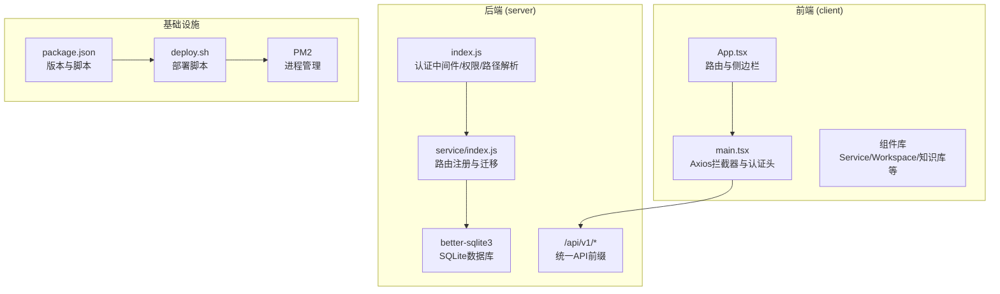
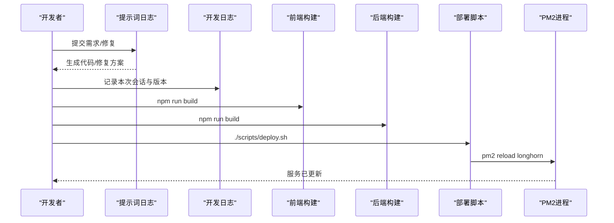
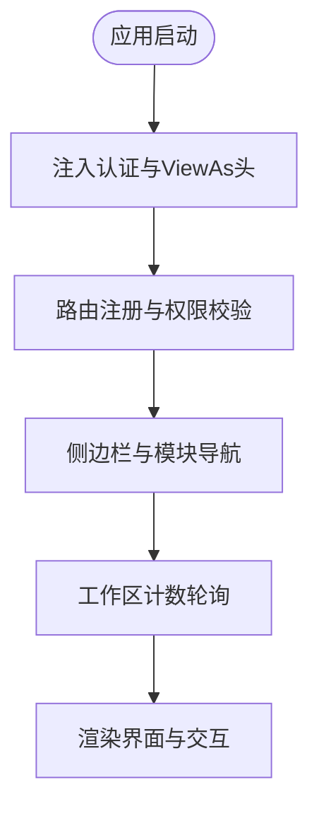
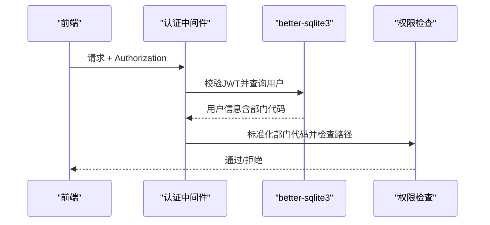
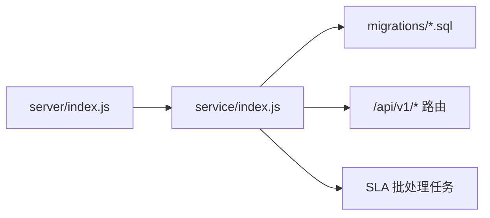
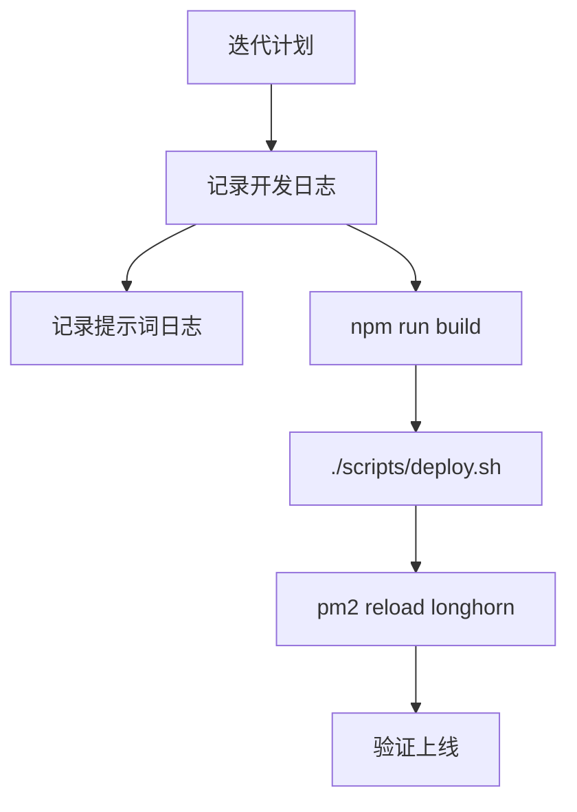
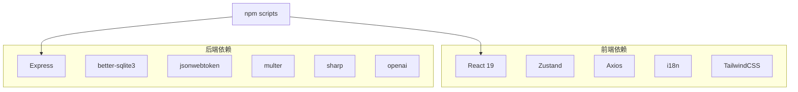

# 开发日志

<cite>
**本文引用的文件**
- [package.json](file://package.json)
- [client/package.json](file://client/package.json)
- [server/package.json](file://server/package.json)
- [docs/log_dev.md](file://docs/log_dev.md)
- [docs/log_prompt.md](file://docs/log_prompt.md)
- [client/src/App.tsx](file://client/src/App.tsx)
- [client/src/main.tsx](file://client/src/main.tsx)
- [server/index.js](file://server/index.js)
- [server/service/index.js](file://server/service/index.js)
</cite>

## 目录
1. [简介](#简介)
2. [项目结构](#项目结构)
3. [核心组件](#核心组件)
4. [架构总览](#架构总览)
5. [详细组件分析](#详细组件分析)
6. [依赖关系分析](#依赖关系分析)
7. [性能考量](#性能考量)
8. [故障排除指南](#故障排除指南)
9. [结论](#结论)
10. [附录](#附录)

## 简介
本开发日志系统性梳理 Longhorn 项目的开发与交付历程，涵盖前端（React/Vite）、后端（Node.js/Express/better-sqlite3）与基础设施（PM2 部署、脚本化发布）的演进。文档以“开发会话日志”和“提示词日志”为主线，记录每次迭代的目标、关键改动、技术产出与版本发布，帮助读者快速理解项目现状、近期变化与交付节奏。

## 项目结构
Longhorn 采用前后端分离架构：
- 前端（client）：React 19 + Vite，使用 TypeScript、TailwindCSS、Zustand 状态管理、Axios 网络请求、国际化（i18n）等。
- 后端（server）：Node.js + Express，使用 better-sqlite3 作为主数据库，multer/Busboy 处理文件上传，提供统一 API（/api/v1）。
- 基础设施：PM2 管理生产进程，脚本化部署（deploy.sh）与版本号管理（package.json）。

**图表来源**
- [client/src/App.tsx:182-366](file://client/src/App.tsx#L182-L366)
- [client/src/main.tsx:8-32](file://client/src/main.tsx#L8-L32)
- [server/index.js:655-729](file://server/index.js#L655-L729)
- [server/service/index.js:90-199](file://server/service/index.js#L90-L199)
- [package.json:4-12](file://package.json#L4-L12)

**章节来源**
- [package.json:1-18](file://package.json#L1-L18)
- [client/package.json:1-65](file://client/package.json#L1-L65)
- [server/package.json:1-40](file://server/package.json#L1-L40)

## 核心组件
- 前端应用入口与拦截器：在应用启动时注入认证与“以他人身份查看”头，确保每次请求携带有效令牌与可选的 ViewAs 用户 ID。
- 侧边栏与路由：统一管理服务模块（工作区、工单、档案、知识库、配件、经销商运营等）的导航与权限控制。
- 后端认证与权限：JWT 校验、部门代码标准化、路径解析与文件权限检查，保障跨模块访问安全。
- 服务模块路由注册：统一挂载 /api/v1 下的各类业务路由（工单、知识库、保修、RMA 文档、配件、上传等），并启动 SLA 批处理任务。

**章节来源**
- [client/src/main.tsx:8-32](file://client/src/main.tsx#L8-L32)
- [client/src/App.tsx:182-366](file://client/src/App.tsx#L182-L366)
- [server/index.js:655-729](file://server/index.js#L655-L729)
- [server/service/index.js:90-199](file://server/service/index.js#L90-L199)

## 架构总览
Longhorn 的开发与交付围绕“统一工单系统（P2）”展开，强调：
- 前端：三视图（我的任务/协作/团队队列）与沉浸式详情页，强化协作与部门池功能。
- 后端：统一 API、权限与数据一致性，配套 SLA 引擎、知识库、保修计算引擎与 RMA 文档工作流。
- 基础设施：版本号驱动的自动化部署（/upd）、PM2 热重载与全量同步（deploy.sh）。

**图表来源**
- [docs/log_prompt.md:1-800](file://docs/log_prompt.md#L1-L800)
- [docs/log_dev.md:1-800](file://docs/log_dev.md#L1-L800)
- [package.json:4-12](file://package.json#L4-L12)

## 详细组件分析

### 前端应用与拦截器
- Axios 拦截器：自动注入 Authorization 令牌与 ViewAs 用户 ID，确保跨模块访问与审计。
- 侧边栏与模块化路由：按模块（服务/文件/管理）分组，支持折叠、持久化与动态角标（工作区待办计数）。
- 多语言与品牌化：菜单项与界面文案统一走 i18n，品牌色与 UI 组件逐步收敛。

**图表来源**
- [client/src/main.tsx:8-32](file://client/src/main.tsx#L8-L32)
- [client/src/App.tsx:182-366](file://client/src/App.tsx#L182-L366)

**章节来源**
- [client/src/main.tsx:8-32](file://client/src/main.tsx#L8-L32)
- [client/src/App.tsx:456-475](file://client/src/App.tsx#L456-L475)

### 后端认证与权限
- JWT 校验与用户信息加载：从数据库重新加载用户角色与部门信息，确保权限判断一致。
- 部门代码标准化：将中文部门名映射为短代码（MS/OP/RD/GE），修复 d.code 字段引用错误。
- 文件权限与路径解析：支持个人空间、部门空间与扩展权限，路径解析兼容 NFD/NFC。

**图表来源**
- [server/index.js:655-729](file://server/index.js#L655-L729)
- [server/index.js:638-653](file://server/index.js#L638-L653)
- [server/index.js:734-787](file://server/index.js#L734-L787)

**章节来源**
- [server/index.js:638-653](file://server/index.js#L638-L653)
- [server/index.js:734-787](file://server/index.js#L734-L787)

### 服务模块路由与迁移
- 路由注册：统一挂载 /api/v1 下的工单、知识库、保修、RMA 文档、配件、上传等路由。
- 迁移管理：自动扫描 migrations 目录，幂等执行 SQL 迁移并记录已应用版本。
- SLA 批处理：定时扫描工单 SLA 状态，生成预警与超时通知。

**图表来源**
- [server/service/index.js:90-199](file://server/service/index.js#L90-L199)
- [server/service/index.js:235-281](file://server/service/index.js#L235-L281)
- [server/service/index.js:200-224](file://server/service/index.js#L200-L224)

**章节来源**
- [server/service/index.js:90-199](file://server/service/index.js#L90-L199)
- [server/service/index.js:235-281](file://server/service/index.js#L235-L281)
- [server/service/index.js:200-224](file://server/service/index.js#L200-L224)

### 开发与交付流程
- 版本号驱动：每次迭代递增 client/server/package.json 的版本号，配合 /upd 自动化脚本。
- 构建与部署：前端 build 后通过 deploy.sh 同步至生产服务器，PM2 重载服务。
- 日志归档：开发日志与提示词日志定期归档，形成可追溯的交付记录。

**图表来源**
- [docs/log_dev.md:1-800](file://docs/log_dev.md#L1-L800)
- [docs/log_prompt.md:1-800](file://docs/log_prompt.md#L1-L800)
- [package.json:4-12](file://package.json#L4-L12)

**章节来源**
- [docs/log_dev.md:1-800](file://docs/log_dev.md#L1-L800)
- [docs/log_prompt.md:1-800](file://docs/log_prompt.md#L1-L800)
- [package.json:4-12](file://package.json#L4-L12)

## 依赖关系分析
- 前端依赖：React 19、Vite、Axios、Zustand、i18n、TailwindCSS、Mermaid、QRCode 等，支撑现代化 UI 与国际化。
- 后端依赖：Express、better-sqlite3、JWT、Multer、Sharp、OpenAI、PDF Parse 等，支撑 API、文件处理与 AI 能力。
- 项目脚本：统一管理安装、构建、部署与 PM2 管理，便于 CI/CD 与本地开发。

**图表来源**
- [client/package.json:12-49](file://client/package.json#L12-L49)
- [server/package.json:15-38](file://server/package.json#L15-L38)
- [package.json:4-12](file://package.json#L4-L12)

**章节来源**
- [client/package.json:12-49](file://client/package.json#L12-L49)
- [server/package.json:15-38](file://server/package.json#L15-L38)
- [package.json:4-12](file://package.json#L4-L12)

## 性能考量
- 前端性能：组件按需加载、状态持久化（Zustand）、列表虚拟化与轻量动画（Framer Motion）减少重绘。
- 后端性能：SQLite WAL 模式、索引优化、批量 SLA 检查与迁移幂等执行，降低数据库压力。
- 部署性能：PM2 热重载与差异同步（deploy.sh）缩短停机时间，提升交付效率。

## 故障排除指南
- 部门代码映射错误：生产数据库中部门名为中文，需通过 normalizeDeptCode 标准化为短代码，修复 d.code 引用。
- 权限校验失败：确认用户角色与部门信息正确加载，检查 hasPermission 的路径解析与扩展权限。
- 部署失败：检查 deploy.sh 是否正确执行、PM2 是否成功 reload，必要时使用 --full 模式全量同步。
- 500 错误：关注接口参数校验、数值转换（布尔/整数）与元数据 JSON 解析，确保前后端类型一致。

**章节来源**
- [server/index.js:638-653](file://server/index.js#L638-L653)
- [server/index.js:734-787](file://server/index.js#L734-L787)
- [docs/log_dev.md:368-374](file://docs/log_dev.md#L368-L374)

## 结论
Longhorn 项目在 P2 阶段完成了统一工单系统、协作与部门池、知识库、保修计算引擎与 RMA 文档工作流等关键能力的落地。开发日志与提示词日志清晰记录了每次迭代的目标、修复与发布，配合自动化脚本与 PM2 热重载，形成了稳定的交付节奏。建议持续关注权限标准化、数据一致性与 UI/UX 的细节优化，以进一步提升系统稳定性与用户体验。

## 附录
- 版本与脚本：通过 package.json 统一管理版本与脚本，支持一键安装、构建与部署。
- 文档与日志：开发日志与提示词日志作为项目知识资产，便于回溯与复盘。

**章节来源**
- [package.json:4-12](file://package.json#L4-L12)
- [docs/log_dev.md:1-800](file://docs/log_dev.md#L1-L800)
- [docs/log_prompt.md:1-800](file://docs/log_prompt.md#L1-L800)