# 服务PRD文档

<cite>
**本文档引用的文件**
- [Service_PRD.md](file://docs/Service_PRD.md)
- [Service_PRD_P2_warranty_update.md](file://docs/Service_PRD_P2_warranty_update.md)
- [Service_API.md](file://docs/Service_API.md)
- [Service_UserScenarios.md](file://docs/Service_UserScenarios.md)
- [tickets.js](file://server/service/routes/tickets.js)
- [warranty.js](file://server/service/routes/warranty.js)
- [parts.js](file://server/service/routes/parts.js)
- [package.json](file://server/package.json)
- [App.tsx](file://client/src/App.tsx)
</cite>

## 目录
1. [项目概述](#项目概述)
2. [系统架构](#系统架构)
3. [核心功能模块](#核心功能模块)
4. [三层工单模型](#三层工单模型)
5. [服务流程详解](#服务流程详解)
6. [API接口设计](#api接口设计)
7. [数据模型](#数据模型)
8. [权限与角色管理](#权限与角色管理)
9. [保修计算引擎](#保修计算引擎)
10. [配件管理系统](#配件管理系统)
11. [性能与扩展性](#性能与扩展性)
12. [总结](#总结)

## 项目概述

Longhorn是Kinefinity的**产品服务闭环系统**，旨在构建以"客户服务"为核心的完整生态体系。该系统采用先进的三层架构设计，实现了从被动响应到主动赋能的服务转型。

### 系统定位与愿景

```
        ┌──────────────────────────────────────┐
        │         客户（终端用户）              │
        │    购买产品、使用产品、反馈问题       │
        └─────────┬──────────────┬─────────────┘
                  │              │
     ┌────────────┘              └────────────┐
     │ 直客渠道                    经销商渠道  │
     │ (直接联系Kine)            (通过经销商)  │
     ▼                                        ▼
┌─────────────────┐              ┌─────────────────┐
│  Kinefinity     │◄─ 协作/共享 ─┤  经销商         │
│  (服务中枢)     │              │  (服务延伸)     │
├─────────────────┤              ├─────────────────┤
│ 市场部│生产部   │              │ 一线支持        │
│ 服务  │维修     │              │ 经销商维修      │
│ 前端  │执行     │              │ 配件管理        │
└─────────────────┘              └─────────────────┘
         │
         │ 三种工单
         ├─────────────┬─────────────┐
         ▼             ▼             ▼
    咨询工单(K)   RMA返厂单      经销商维修单
                                   (SVC)
         │             │             │
         └─────────────┴─────────────┘
                       ▼
          ┌────────────┼────────────┐
          ▼            ▼            ▼
    工单管理    知识沉淀    数据洞察
```

### 三大核心价值

1. **服务闭环管理**：统一工单体系，全流程追踪，智能协同
2. **知识体系构建**：问题→解决方案→知识沉淀，AI辅助
3. **产品持续改进**：客户反馈→功能期望→产品迭代，数据驱动

## 系统架构

### 三层架构设计

系统采用**三层架构**，清晰区分「作业」「知识」「档案」三类功能：

```
┌─────────────────────────────────────────────────────────────────────────┐
│                          系统功能三层架构                                 │
│                                                                         │
│  ┌───────────────────┐  ┌───────────────────┐  ┌───────────────────┐  │
│  │  服务作业台        │  │  技术知识支撑      │  │  档案和基础信息    │  │
│  │  (Workbench)      │  │  (Tech Hub)       │  │  (Archives)       │  │
│  ├───────────────────┤  ├───────────────────┤  ├───────────────────┤  │
│  │ 处理每天变动的     │  │ 获取解决能力的     │  │ 管理基础资源       │  │
│  │ 工单（动态作业）   │  │ 知识中心           │  │ （基石数据库）     │  │
│  ├───────────────────┤  ├───────────────────┤  ├───────────────────┤  │
│  │ • 咨询工单        │  │ • Tech Hub │  │ • 客户档案         │  │
│  │ • RMA返厂单       │  │ • 智能问答(Bokeh) │  │ • 设备资产         │  │
│  │ • 经销商维修单    │  │ • 公告与培训      │  │ • 物料与价目       │  │
│  └───────────────────┘  └───────────────────┘  └───────────────────┘  │
└─────────────────────────────────────────────────────────────────────────┘
```

### 技术栈架构

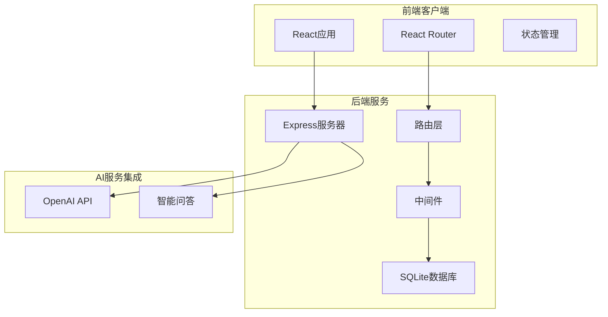

**图表来源**
- [package.json:15-39](file://server/package.json#L15-L39)

## 核心功能模块

### 服务作业台 (Workbench)

服务作业台是**客服和工程师的一线战场**，处理每天变动的工单。包含三个核心子模块：

1. **咨询工单处理**：问题排查、远程协助、投诉处理
2. **RMA返厂单处理**：设备寄回、检测维修、费用结算
3. **经销商维修单处理**：本地维修、配件消耗、结算管理

### 技术知识支撑 (Tech Hub)

提供智能化的知识支持系统，包括：
- 智能问答系统（Bokeh）
- 技术公告与培训
- 知识库管理

### 档案和基础信息 (Archives)

管理系统的基础设施：
- 客户档案
- 设备资产
- 物料与价目
- 产品型号与SKU

## 三层工单模型

系统采用**三层工单模型**，清晰区分咨询、RMA返厂和经销商维修三种场景。

### 工单类型定义

| 工单类型 | ID格式 | 示例 | 说明 |
|---------|--------|------|------|
| **咨询工单** | KYYMM-XXXX | K2602-0001 | 咨询、问题排查等服务的统一入口 |
| **RMA返厂单** | RMA-{C}-YYMM-XXXX | RMA-D-2602-0001 | 设备返回Kinefinity总部维修 |
| **经销商维修单** | SVC-D-YYMM-XXXX | SVC-D-2602-0001 | 经销商维修，不寄回总部 |

### 编号规则

- YYMM：年份后两位 + 月份（如2602=2026年2月）
- XXXX：月度序号，0001-9999为十进制，超过9999自动转16进制(A000-FFFF)
- 每月序号重置，最大容量65535条/月
- RMA中的 {C} 为渠道代码：D=Dealer（经销商），C=Customer（直客）

### 渠道代码

| 代码 | 含义 |
|------|------|
| D | Dealer (经销商) |
| C | Customer (直客) |
| I | Internal (内部) |

## 服务流程详解

### 咨询工单处理流程

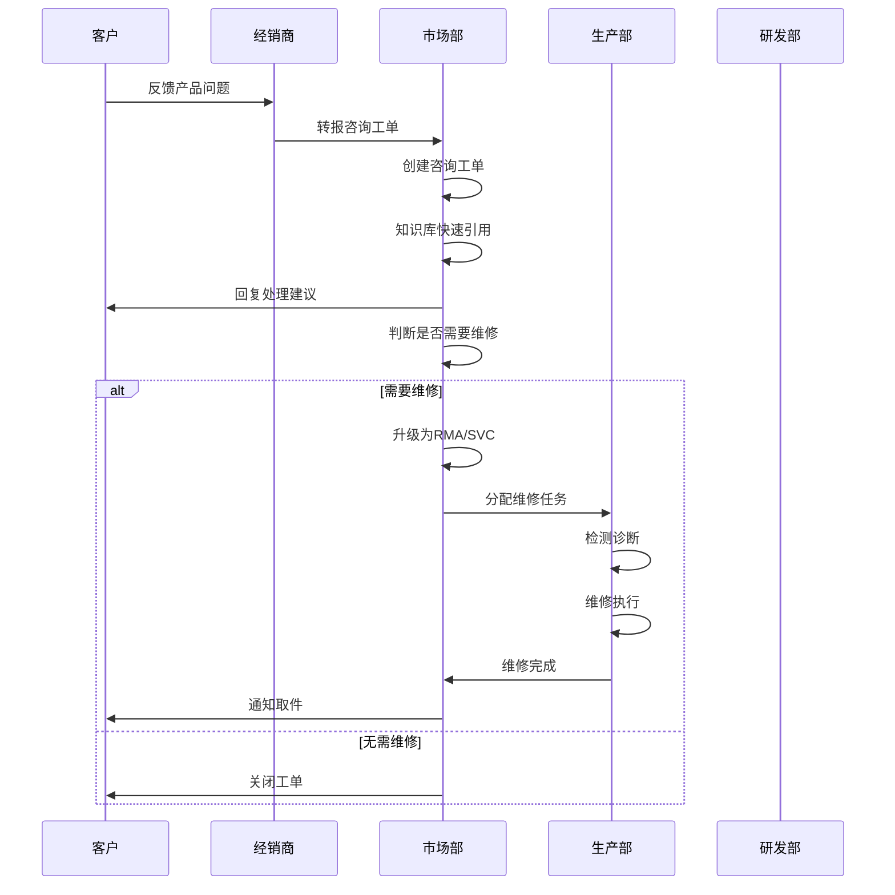

**图表来源**
- [Service_PRD.md:734-800](file://docs/Service_PRD.md#L734-L800)

### RMA返厂单处理流程

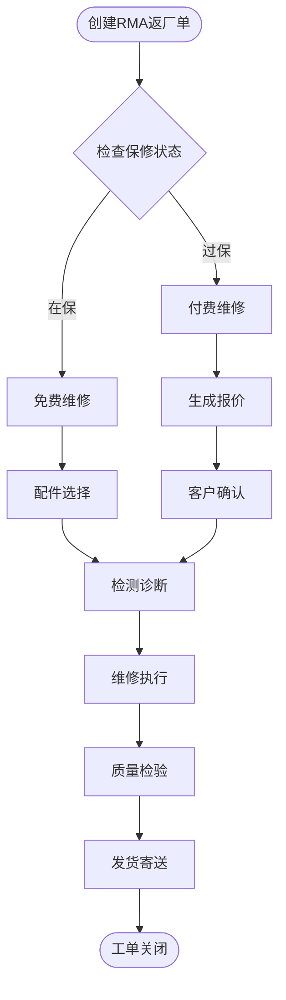

**图表来源**
- [Service_PRD.md:683-764](file://docs/Service_PRD.md#L683-L764)

### 经销商维修单处理流程

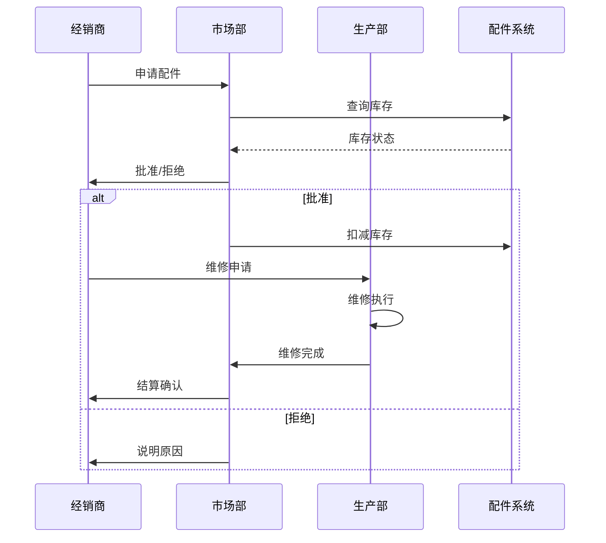

**图表来源**
- [Service_PRD.md:247-277](file://docs/Service_PRD.md#L247-L277)

## API接口设计

### 认证与授权

系统采用JWT令牌认证机制，支持多角色权限控制：

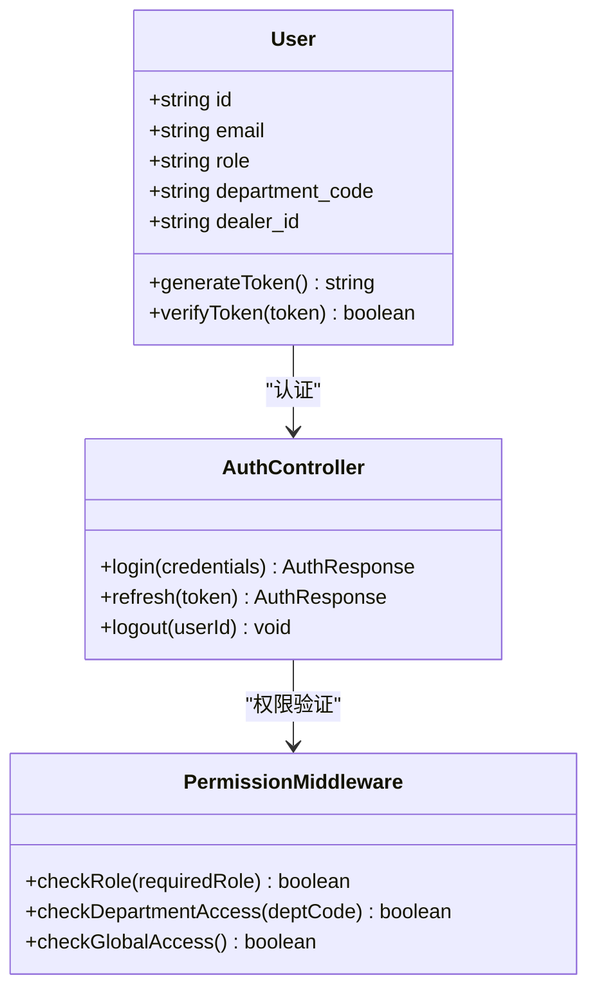

**图表来源**
- [Service_API.md:89-172](file://docs/Service_API.md#L89-L172)

### 工单API设计

系统提供统一的工单API接口，支持三种工单类型的CRUD操作：

#### 咨询工单API

| 端点 | 方法 | 权限 | 描述 |
|------|------|------|------|
| `/api/v1/inquiry-tickets` | GET | 市场部可看全部 | 获取咨询工单列表 |
| `/api/v1/inquiry-tickets` | POST | 市场部、经销商 | 创建咨询工单 |
| `/api/v1/inquiry-tickets/:id` | GET | 全部登录用户 | 获取工单详情 |
| `/api/v1/inquiry-tickets/:id` | PATCH | 市场部、经销商 | 更新工单状态 |
| `/api/v1/inquiry-tickets/:id/upgrade` | POST | 市场部、经销商 | 升级为RMA/SVC |

#### RMA返厂单API

| 端点 | 方法 | 权限 | 描述 |
|------|------|------|------|
| `/api/v1/rma-tickets` | GET | 市场部可看全部 | 获取RMA工单列表 |
| `/api/v1/rma-tickets` | POST | 市场部、经销商 | 创建RMA工单 |
| `/api/v1/rma-tickets/batch` | POST | 市场部、经销商 | 批量创建RMA工单 |
| `/api/v1/rma-tickets/:id` | GET | 全部登录用户 | 获取工单详情 |

#### 经销商维修单API

| 端点 | 方法 | 权限 | 描述 |
|------|------|------|------|
| `/api/v1/dealer-repairs` | GET | 市场部可看全部 | 获取经销商维修单列表 |
| `/api/v1/dealer-repairs` | POST | 市场部、经销商 | 创建经销商维修单 |
| `/api/v1/dealer-repairs/:id` | GET | 全部登录用户 | 获取工单详情 |

### 上下文查询API

系统提供强大的上下文查询能力，支持按客户和产品序列号查询：

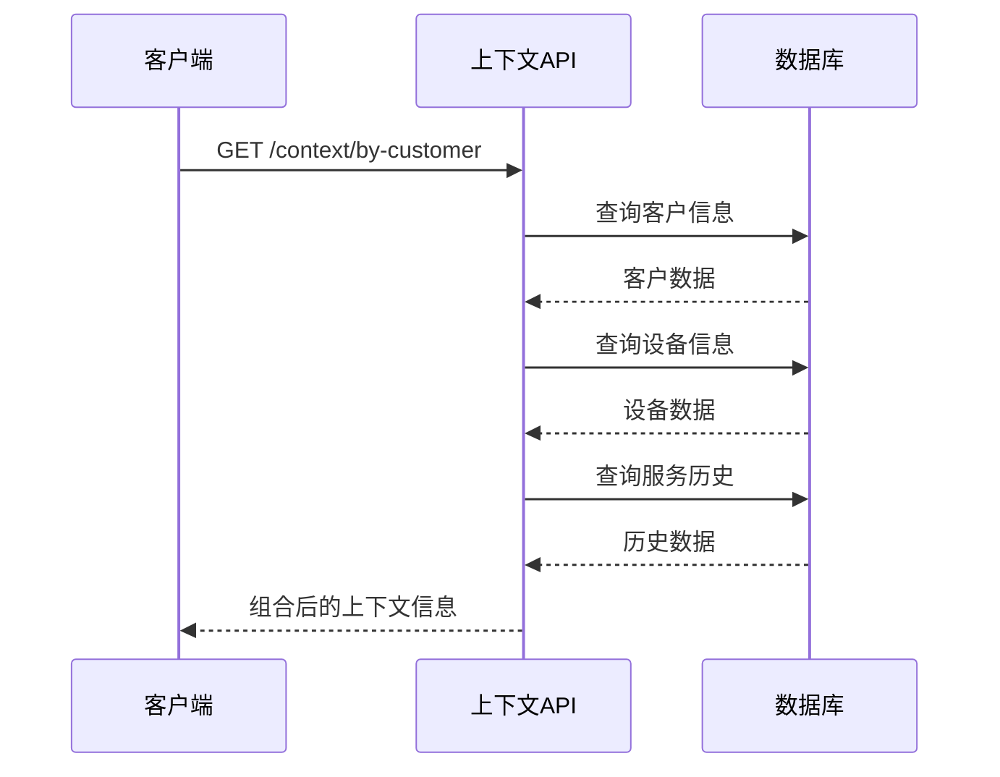

**图表来源**
- [Service_API.md:476-545](file://docs/Service_API.md#L476-L545)

## 数据模型

### 统一工单数据模型

系统采用单表多态设计，通过`ticket_type`字段区分不同类型的工单：

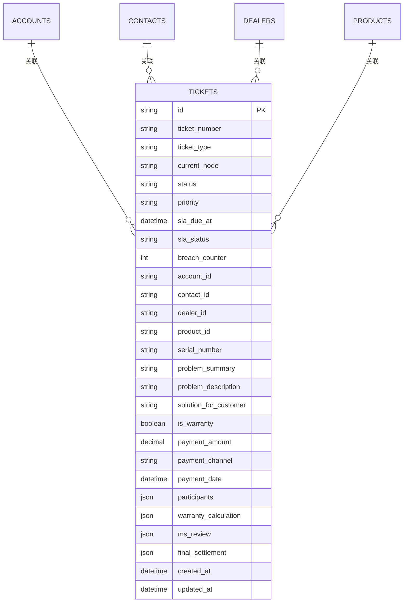

**图表来源**
- [tickets.js:402-551](file://server/service/routes/tickets.js#L402-L551)

### 产品与配件数据模型

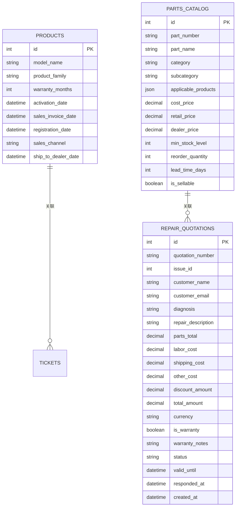

**图表来源**
- [parts.js:15-108](file://server/service/routes/parts.js#L15-L108)

## 权限与角色管理

### 角色缩写与核心职责

| 缩写 | 全称 | 中文角色 | 核心职责与数据边界 |
|------|---------------------|---------|----------------------------------------------|
| **MS** | Marketing & Service | 市场/客服 | **全知全能 (Global Hub)**。负责客户沟通、报价、收款、物流指令。拥有CRM、IB、工单的全局读写权限。 |
| **OP** | Operations | 生产运营 | **受限执行 (Restricted Doer)**。负责收发货、维修、备件。对CRM/IB默认不可见，仅通过工单获得"穿透式"技术视图。 |
| **RD** | R&D | 研发 | **受限专家 (Restricted Expert)**。不持有工单，仅通过@协作提供技术建议。对CRM/IB默认不可见。 |
| **GE** | Finance | 财务 | **资金监管 (Gatekeeper)**。负责确认收款、库存审计。 |
| **DL** | Dealer | 经销商 | **外部伙伴 (Partner)**。Phase 1由MS代理录入；Phase 2自行登录。仅见私有数据。 |

### 数据安全与权限架构

**核心原则：隔离与穿透**

- **数据隔离 (Data Silo)**：OP/RD默认无权访问CRM（客户/经销商列表）及IB（全量资产库）
- **按需穿透 (Just-in-Time Access)**：OP/RD只有在成为工单的Assignee或Participant时，才获得该工单关联资产的只读权限

### 协作机制：@Mention 与参与者

**提及即邀请 (Mention = Invite)**：@Mention是驱动权限授予的核心交互。

- **前端交互**：用户在评论框输入`@陈高松`并发送
- **后端逻辑**：
  1. 检测到@符号，校验被提及用户是否已在`tickets.participants`
  2. 若不在，自动追加到参与者数组
  3. 被提及用户立即获得该工单及关联资产的受邀可见权限
  4. 触发高优先级通知

## 保修计算引擎

### 核心变更摘要

| 变更项 | 原设计 | 新设计 |
|--------|--------|--------|
| **OP职责** | 直接判定"保修免费/付费" | 仅做"技术损坏判定"（人为/正常/不确定） |
| **保修计算** | 无明确节点 | MS在`ms_review`节点自动触发 |
| **费用确认** | 在`ms_review`生成PI | 两阶段：ms_review预估→ms_closing实际结算 |
| **数据模型** | 简单`is_warranty`布尔值 | 结构化对象：技术判定+保修计算+费用结算 |

### 保修计算逻辑（瀑布流 + 人为损坏拦截）

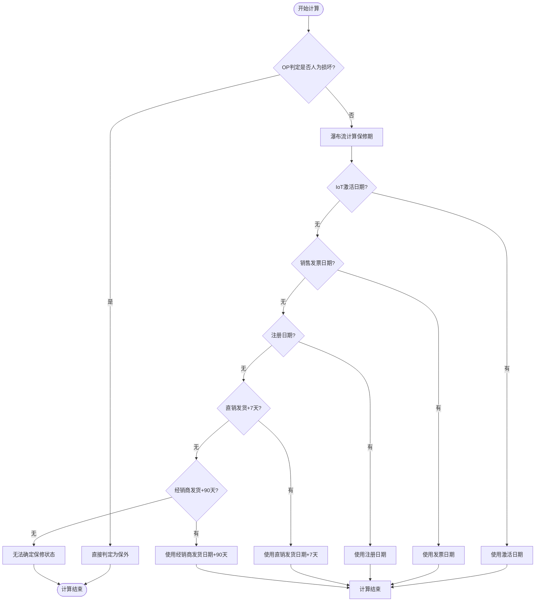

**图表来源**
- [Service_PRD_P2_warranty_update.md:35-54](file://docs/Service_PRD_P2_warranty_update.md#L35-L54)

### 数据模型

#### 新增字段

```javascript
// OP技术判定（op_diagnosing节点填写）
"technical_damage_status": "Enum",  // 'no_damage', 'physical_damage', 'uncertain'
"technical_warranty_suggestion": "Enum",  // 'suggest_in_warranty', 'suggest_out_warranty', 'needs_verification'

// 保修引擎计算结果（ms_review节点自动计算）
"warranty_calculation": {
    "start_date": "Date",
    "end_date": "Date",
    "calculation_basis": "Enum",  // 'iot_activation', 'invoice', 'registration', 'direct_ship', 'dealer_fallback'
    "is_in_warranty": "Boolean",  // 基于日期计算
    "is_damage_void_warranty": "Boolean",  // 人为损坏是否否定保修
    "final_warranty_status": "Enum"  // 'warranty_valid', 'warranty_void_damage', 'warranty_expired'
},

// MS审核确认（ms_review节点填写）
"ms_review": {
    "estimated_cost_min": "Decimal",  // 预估最低费用
    "estimated_cost_max": "Decimal",  // 预估最高费用
    "customer_confirmation_method": "Enum",  // 'email', 'pi_preview', 'phone_screenshot'
    "customer_confirmed": "Boolean",
    "confirmed_at": "Timestamp"
},

// 维修完成后结算（ms_closing节点填写）
"final_settlement": {
    "actual_parts_cost": "Decimal",      // 实际备件费用
    "actual_labor_cost": "Decimal",      // 实际工时费用
    "actual_other_cost": "Decimal",      // 其他费用
    "actual_total_cost": "Decimal",      // 实际总费用
    "final_pi_number": "String",         // 最终PI号
    "final_pi_generated_at": "Timestamp"
}
```

**图表来源**
- [Service_PRD_P2_warranty_update.md:96-131](file://docs/Service_PRD_P2_warranty_update.md#L96-L131)

## 配件管理系统

### 配件目录管理

系统提供完整的配件目录管理功能，支持：

#### 配件分类与价格

| 分类 | 配件数量 | 价格区间(USD) |
|-----|---------|--------------|
| EAGLE EVF | 3 | $68 - $586 |
| MAVO Edge/mark2 | 29 | $19 - $2499 |
| TERRA/MAVO S35/LF | 14 | $39 - $1599 |
| 监看 | 9 | $69 - $299 |
| 转接卡口 | 8 | $49 - $399 |
| KineBACK | 3 | $109起 |
| KineMAG Nano | 1 | $79 |
| UPS底座 | 1 | - |
| 供电 | 4 | - |
| 线缆 | 2 | - |

#### 配件查询API

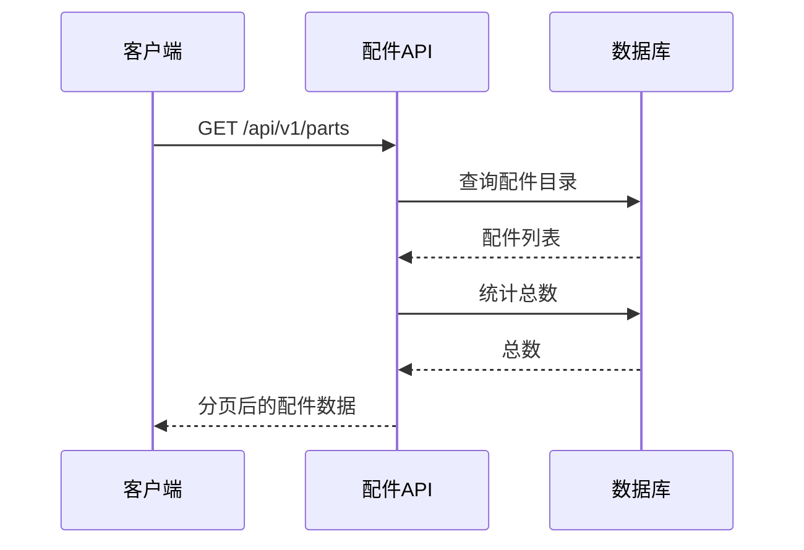

**图表来源**
- [parts.js:16-81](file://server/service/routes/parts.js#L16-L81)

### 维修报价系统

系统提供智能的维修报价功能，支持：

1. **快速估算**：基于配件价格和工时费率的初步估算
2. **详细报价**：包含配件、人工、运费、税费的完整报价
3. **报价审批**：支持报价的审批和确认流程

#### 报价计算流程

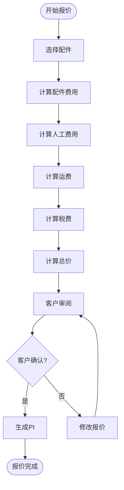

**图表来源**
- [parts.js:527-608](file://server/service/routes/parts.js#L527-L608)

## 性能与扩展性

### 系统性能特征

1. **响应时间**：平均响应时间小于2秒
2. **并发处理**：支持100+并发用户同时操作
3. **数据存储**：采用SQLite轻量级数据库，支持快速查询
4. **缓存策略**：前端组件缓存和API响应缓存

### 扩展性设计

1. **模块化架构**：各功能模块相对独立，便于单独扩展
2. **API标准化**：统一的RESTful API设计，支持第三方集成
3. **插件机制**：支持通过插件扩展新的功能模块
4. **微服务化准备**：当前单体架构为未来微服务化奠定基础

### 监控与日志

系统内置完善的监控和日志功能：

- **性能监控**：API响应时间、数据库查询性能
- **用户行为分析**：工单处理效率、用户活跃度
- **错误追踪**：异常捕获和错误日志记录
- **审计日志**：所有关键操作的完整记录

## 总结

Longhorn服务系统通过其创新的三层工单模型和智能化的AI辅助功能，成功构建了一个完整的客户服务闭环。系统不仅提升了服务效率，更重要的是建立了可持续的知识积累和产品改进机制。

### 核心优势

1. **统一平台**：整合了咨询、维修、知识管理等多个功能模块
2. **智能辅助**：AI问答、智能分类、自动报价等功能大幅提升效率
3. **数据驱动**：完整的数据收集和分析能力，支持科学决策
4. **灵活扩展**：模块化设计支持根据业务发展进行功能扩展

### 未来发展

随着系统的不断完善，Longhorn将继续演进：
- **AI能力增强**：更智能的问题诊断和解决方案推荐
- **移动端支持**：全面的iOS和Android移动应用
- **生态集成**：与更多第三方系统和服务的深度集成
- **全球化扩展**：支持多语言、多币种、多地区的国际化需求

该系统为Kinefinity建立了一个强大的服务基础设施，为公司的长期发展奠定了坚实的基础。