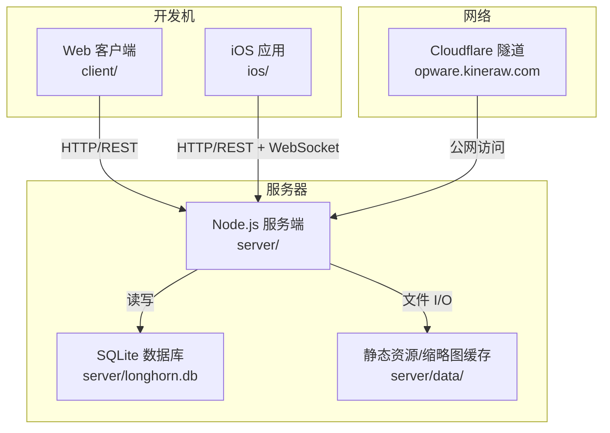
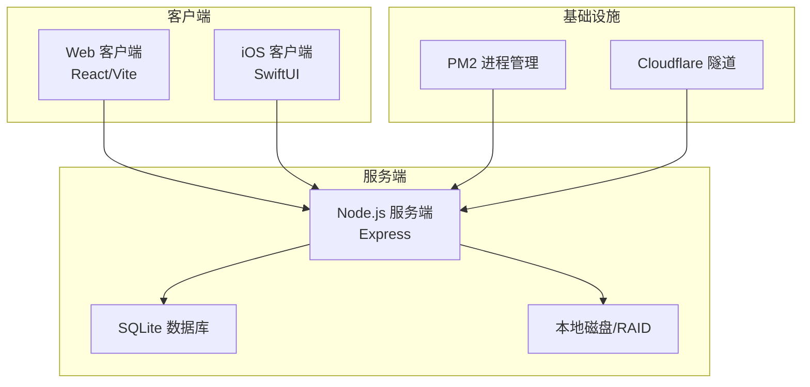
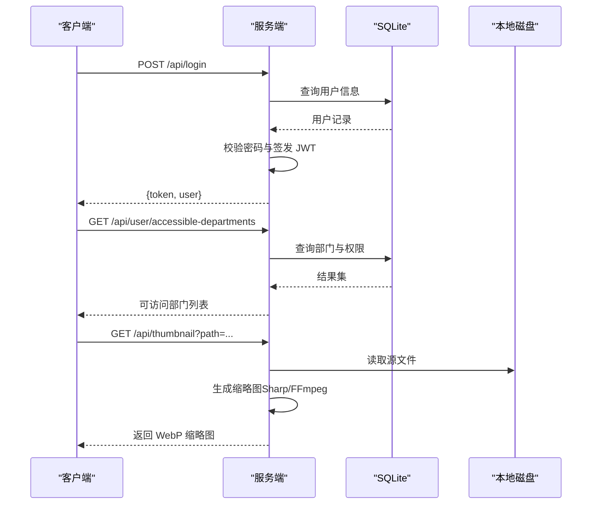
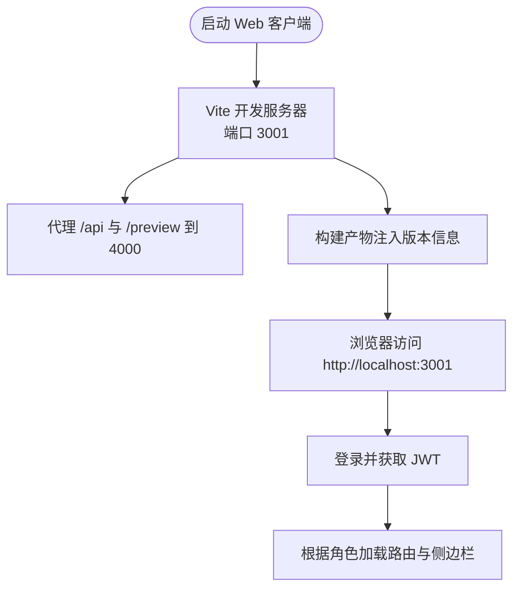
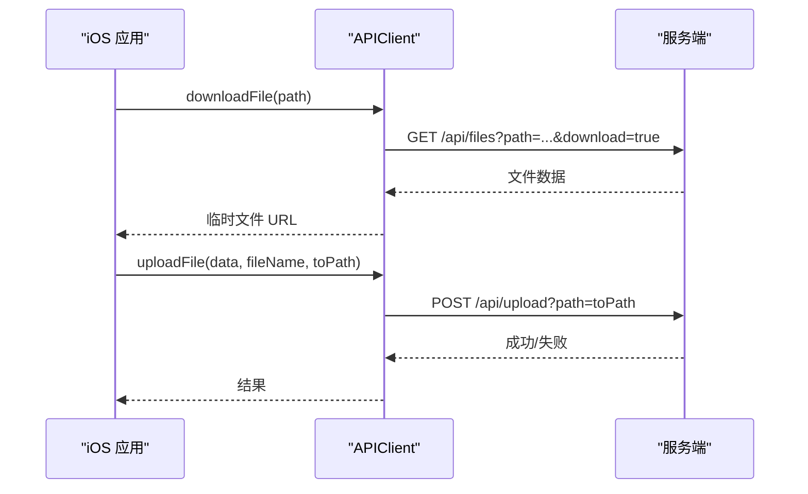
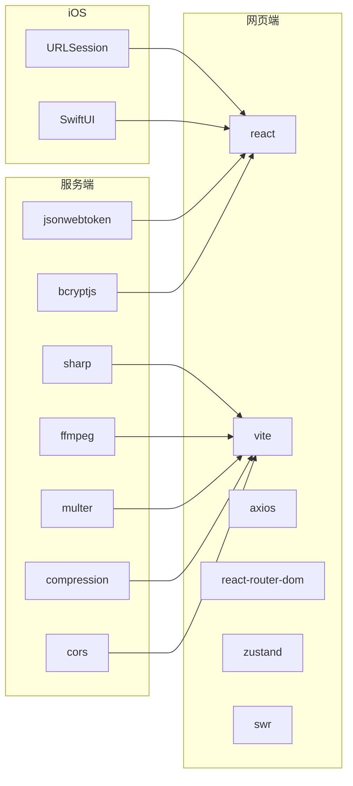

# 快速开始

<cite>
**本文引用的文件**
- [Longhorn.md](file://Longhorn.md)
- [client/package.json](file://client/package.json)
- [server/package.json](file://server/package.json)
- [ios/README.md](file://ios/README.md)
- [scripts/setup.sh](file://scripts/setup.sh)
- [docs/QUICK_DEPLOY.md](file://docs/QUICK_DEPLOY.md)
- [docs/FULL_DEPLOYMENT_RECAP.md](file://docs/FULL_DEPLOYMENT_RECAP.md)
- [docs/REMOTE_DEV_GUIDE.md](file://docs/REMOTE_DEV_GUIDE.md)
- [server/index.js](file://server/index.js)
- [client/vite.config.ts](file://client/vite.config.ts)
- [scripts/deploy.sh](file://scripts/deploy.sh)
- [scripts/ecosystem.config.js](file://scripts/ecosystem.config.js)
- [client/src/main.tsx](file://client/src/main.tsx)
- [client/src/App.tsx](file://client/src/App.tsx)
- [ios/LonghornApp/LonghornApp.swift](file://ios/LonghornApp/LonghornApp.swift)
- [ios/LonghornApp/Services/APIClient.swift](file://ios/LonghornApp/Services/APIClient.swift)
- [server/migrations/phase2.sql](file://server/migrations/phase2.sql)
- [scripts/db-validate.sh](file://scripts/db-validate.sh)
</cite>

## 目录
1. [简介](#简介)
2. [项目结构](#项目结构)
3. [核心组件](#核心组件)
4. [架构总览](#架构总览)
5. [详细组件分析](#详细组件分析)
6. [依赖分析](#依赖分析)
7. [性能考虑](#性能考虑)
8. [故障排除指南](#故障排除指南)
9. [结论](#结论)
10. [附录](#附录)

## 简介
本指南面向首次接触 Longhorn 的用户，帮助你在 Windows、macOS、Linux 三大平台上快速完成开发环境搭建、依赖安装、数据库初始化与首次运行。Longhorn 是一套企业级本地数据协作系统，包含三部分：
- 服务端（Server）：基于 Node.js + SQLite，提供 REST API、文件 I/O、权限校验与缩略图生成等能力
- 网页端（Web Client）：基于 React + Vite，提供文件浏览、权限管理、仪表盘等功能
- 移动端（iOS App）：基于 SwiftUI，提供移动端文件查看与缓存能力

## 项目结构
Longhorn 采用多模块组织方式，根目录包含服务端、网页端、iOS 客户端与运维脚本。各模块职责清晰，便于独立开发与联调。

图表来源
- [Longhorn.md](file://Longhorn.md#L47-L66)
- [server/index.js](file://server/index.js#L1-L30)

章节来源
- [Longhorn.md](file://Longhorn.md#L1-L71)

## 核心组件
- 服务端（Server）
  - 端口：默认 4000
  - 数据库：SQLite（首次运行自动创建）
  - 关键功能：用户认证（JWT）、文件上传/下载、缩略图生成、权限控制、回收站、词汇表接口等
- 网页端（Web Client）
  - 端口：默认 3001
  - 代理：Vite 开发服务器将 /api 与 /preview 代理到服务端
  - 构建：Vite + React + TypeScript
- iOS 客户端（iOS App）
  - 基于 SwiftUI，网络层通过 APIClient.swift 调用服务端 API
  - 支持文件下载、批量下载、上传、缩略图预览等

章节来源
- [server/package.json](file://server/package.json#L6-L10)
- [client/package.json](file://client/package.json#L6-L11)
- [client/vite.config.ts](file://client/vite.config.ts#L72-L80)
- [ios/README.md](file://ios/README.md#L1-L27)

## 架构总览
Longhorn 采用“前端（Web/iOS）—后端（Node.js）—数据库（SQLite）—磁盘（本地/RAID）”的分层架构。服务端通过 better-sqlite3 访问 SQLite，使用 JWT 进行鉴权，Multer 处理文件上传，Sharp/FFmpeg 生成缩略图。

图表来源
- [Longhorn.md](file://Longhorn.md#L47-L66)
- [server/index.js](file://server/index.js#L1-L30)

## 详细组件分析

### 服务端（Node.js + SQLite）
- 环境变量与路径
  - 端口：PORT（默认 4000）
  - 数据库路径：DB_PATH（server/longhorn.db）
  - 磁盘根目录：DISK_A（默认 data/DiskA）
  - JWT 密钥：JWT_SECRET（默认开发密钥）
- 数据库初始化
  - 启动时自动创建 departments、users、permissions、stars、vocabulary 等表
  - 若 vocabulary 为空，自动从 seeds/vocabulary_seed.json 注入示例数据
- 路由与中间件
  - 压缩：compression
  - CORS：cors
  - 全局日志：HTTP 请求记录
  - 鉴权：JWT 校验中间件
- 关键接口
  - 登录：/api/login（返回 token 与用户信息）
  - 获取可访问部门：/api/user/accessible-departments
  - 词汇表批量查询：/api/vocabulary/batch
  - 缩略图生成：/api/thumbnail（支持图片与视频/HEIC）
  - 健康检查：/api/status
- 权限控制
  - Admin 全部放行
  - Lead/Member 根据部门与显式权限判断
  - 支持个人空间与部门空间的路径解析与权限判定

图表来源
- [server/index.js](file://server/index.js#L684-L713)
- [server/index.js](file://server/index.js#L716-L756)
- [server/index.js](file://server/index.js#L483-L679)

章节来源
- [server/index.js](file://server/index.js#L14-L30)
- [server/index.js](file://server/index.js#L33-L78)
- [server/index.js](file://server/index.js#L684-L713)
- [server/index.js](file://server/index.js#L716-L756)
- [server/index.js](file://server/index.js#L483-L679)

### 网页端（React + Vite）
- 开发服务器
  - 端口：3001
  - 代理：/api → http://localhost:4000，/preview → http://localhost:4000
- 版本注入
  - 构建时注入版本号、提交哈希、提交时间、构建时间
- 启动入口
  - main.tsx 创建根节点并渲染 App
- 路由与布局
  - App.tsx 定义受保护路由与公共路由，按角色显示侧边栏与功能

图表来源
- [client/vite.config.ts](file://client/vite.config.ts#L72-L80)
- [client/src/main.tsx](file://client/src/main.tsx#L1-L11)
- [client/src/App.tsx](file://client/src/App.tsx#L66-L126)

章节来源
- [client/vite.config.ts](file://client/vite.config.ts#L62-L81)
- [client/src/main.tsx](file://client/src/main.tsx#L1-L11)
- [client/src/App.tsx](file://client/src/App.tsx#L66-L126)

### iOS 客户端（SwiftUI）
- 网络层
  - APIClient.swift 提供统一的 GET/POST/DELETE/PUT 方法
  - 支持下载单文件、批量下载 ZIP、上传文件
  - 自动处理 401 未授权并触发登出
- 启动流程
  - LonghornApp.swift 作为应用入口，注入 AuthManager 与 LanguageManager

图表来源
- [ios/LonghornApp/Services/APIClient.swift](file://ios/LonghornApp/Services/APIClient.swift#L113-L145)
- [ios/LonghornApp/Services/APIClient.swift](file://ios/LonghornApp/Services/APIClient.swift#L195-L243)

章节来源
- [ios/LonghornApp/LonghornApp.swift](file://ios/LonghornApp/LonghornApp.swift#L11-L25)
- [ios/LonghornApp/Services/APIClient.swift](file://ios/LonghornApp/Services/APIClient.swift#L38-L108)

## 依赖分析
- 服务端依赖
  - better-sqlite3：SQLite 访问
  - express：Web 框架
  - jsonwebtoken：JWT 鉴权
  - bcryptjs：密码加密
  - multer：文件上传
  - sharp/ffmpeg：缩略图生成
  - compression/cors：中间件
- 网页端依赖
  - react/react-dom：UI 框架
  - vite：构建与开发服务器
  - axios：HTTP 客户端
  - react-router-dom：路由
  - zustand/swr：状态与缓存
- iOS 客户端依赖
  - URLSession：网络请求
  - SwiftUI：界面与生命周期

图表来源
- [server/package.json](file://server/package.json#L15-L28)
- [client/package.json](file://client/package.json#L12-L28)
- [ios/README.md](file://ios/README.md#L15-L18)

章节来源
- [server/package.json](file://server/package.json#L15-L28)
- [client/package.json](file://client/package.json#L12-L28)
- [ios/README.md](file://ios/README.md#L15-L18)

## 性能考虑
- 缩略图生成
  - 使用 Sharp 处理图片，FFmpeg 处理视频与 HEIC
  - 限制并发数量（最多 2 个），避免 CPU/IO 过载
  - 缓存策略：命中缓存直接返回，缓存过期或损坏自动重建
- 压缩与缓存
  - 启用 gzip 压缩与静态资源缓存（1 天）
  - Range 请求支持，提升移动端预览体验
- 进程管理
  - PM2 集群模式（max）充分利用多核 CPU
  - 优雅重启与日志聚合，保障稳定性

章节来源
- [server/index.js](file://server/index.js#L555-L577)
- [server/index.js](file://server/index.js#L521-L551)
- [server/index.js](file://server/index.js#L418-L419)
- [scripts/ecosystem.config.js](file://scripts/ecosystem.config.js#L7-L9)

## 故障排除指南
- 服务端启动失败（数据库相关）
  - 现象：启动时报错或无法访问 /api
  - 排查：确认 server/longhorn.db 是否存在；若缺失，服务端会自动创建
  - 验证：访问 /api/status 检查服务状态
- 缩略图生成失败
  - 现象：缩略图接口返回 404 或失败
  - 排查：确认 FFmpeg/Sharp 可用；检查源文件是否存在；查看缓存目录权限
- 权限不足
  - 现象：访问部门/个人空间提示无权限
  - 排查：确认用户角色与部门；检查 permissions 表中的显式权限
- 数据库结构不一致
  - 现象：字段缺失或索引异常
  - 处理：运行数据库验证脚本自动修复
- iOS 无法下载/上传
  - 现象：网络错误或 401
  - 排查：确认服务器地址配置；检查 Token 是否有效；查看 APIClient 日志

章节来源
- [server/index.js](file://server/index.js#L477-L479)
- [server/index.js](file://server/index.js#L512-L515)
- [scripts/db-validate.sh](file://scripts/db-validate.sh#L17-L41)
- [ios/LonghornApp/Services/APIClient.swift](file://ios/LonghornApp/Services/APIClient.swift#L287-L301)

## 结论
通过本指南，你可以在任意主流操作系统上完成 Longhorn 的开发环境搭建与首次运行。建议先在本地启动服务端与网页端，验证登录与缩略图功能，再接入 iOS 客户端进行联调。生产部署可参考自动化部署与 Cloudflare 隧道配置，实现公网访问与无人值守更新。

## 附录

### 平台安装与运行步骤

- Windows
  - 安装 Node.js 与 Git
  - 安装依赖：在 client 与 server 目录分别执行安装命令
  - 启动服务端：在 server 目录执行开发模式命令
  - 启动网页端：在 client 目录执行开发模式命令
  - 访问：浏览器打开网页端地址，登录后即可使用
- macOS
  - 安装 Homebrew（如未安装）
  - 安装 Node.js 与 Git
  - 可使用一键安装脚本完成环境准备与依赖安装
  - 启动顺序：先启动服务端，再启动网页端
- Linux
  - 安装 Node.js 与 Git
  - 安装依赖：在 client 与 server 目录分别执行安装命令
  - 启动服务端与网页端，按端口访问

章节来源
- [scripts/setup.sh](file://scripts/setup.sh#L37-L49)
- [docs/QUICK_DEPLOY.md](file://docs/QUICK_DEPLOY.md#L26-L29)

### 首次运行与验证清单
- 启动服务端与网页端，访问健康检查接口确认服务可用
- 使用默认账号登录，检查可访问部门列表
- 上传/下载测试文件，验证缩略图生成
- iOS 客户端连接公网地址或本地代理，完成登录与文件浏览

章节来源
- [server/index.js](file://server/index.js#L477-L479)
- [client/vite.config.ts](file://client/vite.config.ts#L72-L80)
- [ios/README.md](file://ios/README.md#L20-L23)

### 数据库初始化与迁移
- 首次启动：服务端自动创建核心表并注入示例数据
- 迁移：新增功能可通过 SQL 文件进行结构扩展
- 验证：使用数据库验证脚本检查表结构与字段

章节来源
- [server/index.js](file://server/index.js#L33-L78)
- [server/migrations/phase2.sql](file://server/migrations/phase2.sql#L1-L32)
- [scripts/db-validate.sh](file://scripts/db-validate.sh#L17-L41)

### 生产部署与自动化
- 使用一键安装脚本完成环境准备与依赖安装
- 通过 PM2 管理服务，实现集群模式与自动重启
- 使用 Cloudflare 隧道提供公网访问
- 通过哨兵脚本实现无人值守自动同步与部署

章节来源
- [scripts/setup.sh](file://scripts/setup.sh#L81-L111)
- [docs/QUICK_DEPLOY.md](file://docs/QUICK_DEPLOY.md#L69-L82)
- [docs/FULL_DEPLOYMENT_RECAP.md](file://docs/FULL_DEPLOYMENT_RECAP.md#L51-L61)
- [docs/REMOTE_DEV_GUIDE.md](file://docs/REMOTE_DEV_GUIDE.md#L35-L40)