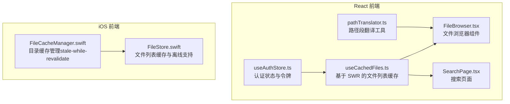
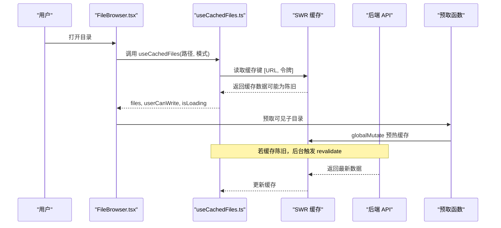
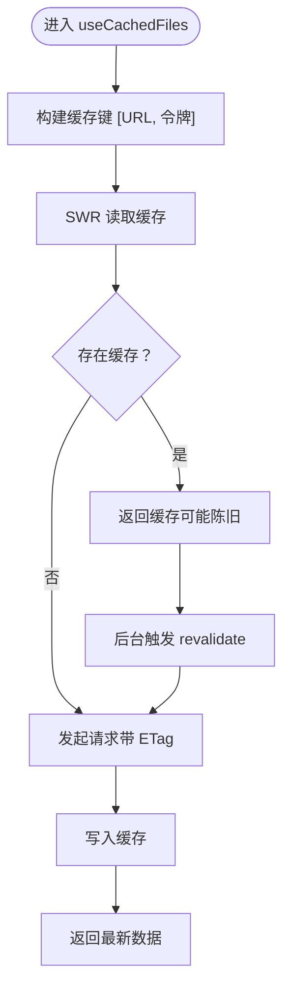
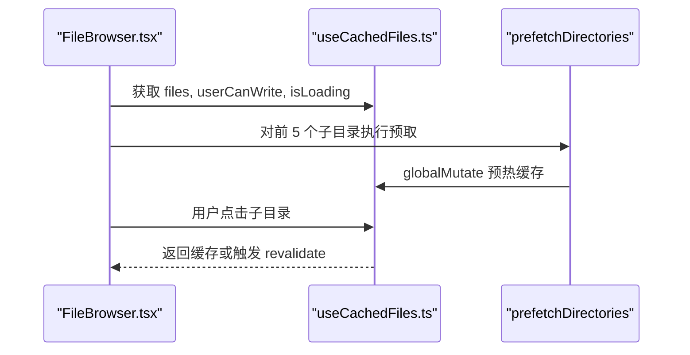
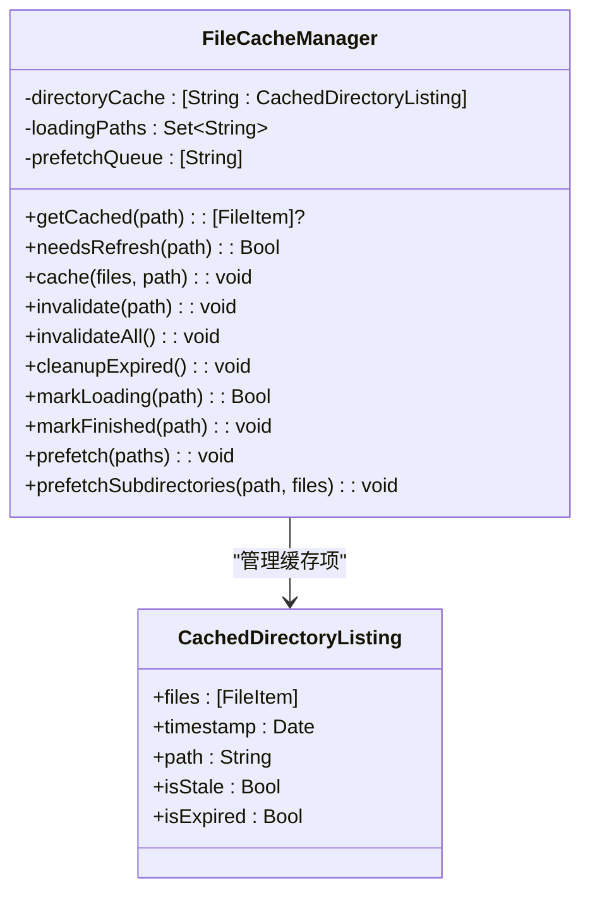
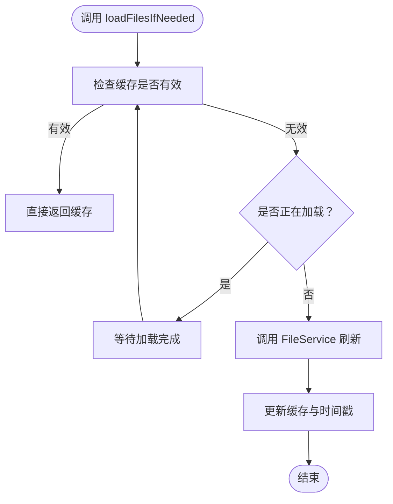
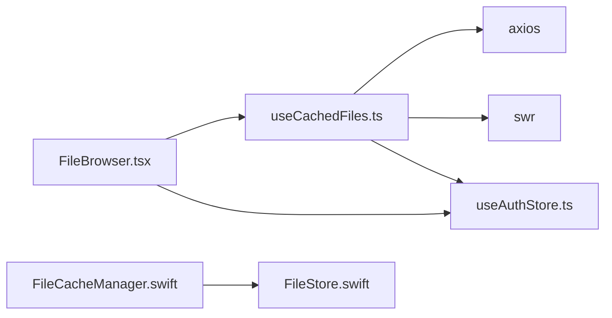

# 前端缓存策略

<cite>
**本文引用的文件**
- [useCachedFiles.ts](file://client/src/hooks/useCachedFiles.ts)
- [FileBrowser.tsx](file://client/src/components/FileBrowser.tsx)
- [SearchPage.tsx](file://client/src/components/SearchPage.tsx)
- [pathTranslator.ts](file://client/src/utils/pathTranslator.ts)
- [useAuthStore.ts](file://client/src/store/useAuthStore.ts)
- [FileCacheManager.swift](file://ios/LonghornApp/Services/FileCacheManager.swift)
- [FileStore.swift](file://ios/LonghornApp/Services/FileStore.swift)
- [package.json](file://client/package.json)
</cite>

## 目录
1. [简介](#简介)
2. [项目结构](#项目结构)
3. [核心组件](#核心组件)
4. [架构总览](#架构总览)
5. [详细组件分析](#详细组件分析)
6. [依赖关系分析](#依赖关系分析)
7. [性能考量](#性能考量)
8. [故障排查指南](#故障排查指南)
9. [结论](#结论)
10. [附录](#附录)

## 简介
本文件系统化梳理 Longhorn 前端的缓存策略，重点覆盖 React Hooks 中的缓存机制（useCachedFiles）、iOS 端的目录缓存（FileCacheManager.swift、FileStore.swift），以及文件路径转换器的缓存优化思路。文档围绕以下目标展开：
- 解释 useCachedFiles 钩子的工作原理与缓存生命周期管理
- 阐述文件路径转换器的缓存优化策略
- 说明缓存失效机制、内存管理与缓存一致性保证
- 提供缓存命中率优化、预加载策略与离线访问支持
- 给出缓存配置参数、性能监控指标与调试方法

## 项目结构
前端缓存相关代码主要分布在以下位置：
- React Hooks 层：useCachedFiles.ts（基于 SWR 的文件列表缓存）
- React 组件层：FileBrowser.tsx（使用 useCachedFiles 的文件浏览器）、SearchPage.tsx（搜索结果展示）
- 工具层：pathTranslator.ts（路径段翻译，可作为 UI 缓存的输入）
- 状态层：useAuthStore.ts（认证令牌，影响缓存键）
- iOS Swift 层：FileCacheManager.swift（stale-while-revalidate 模式）、FileStore.swift（文件列表缓存与离线支持）

图表来源
- [useCachedFiles.ts](file://client/src/hooks/useCachedFiles.ts#L1-L102)
- [FileBrowser.tsx](file://client/src/components/FileBrowser.tsx#L1-L200)
- [SearchPage.tsx](file://client/src/components/SearchPage.tsx#L1-L200)
- [pathTranslator.ts](file://client/src/utils/pathTranslator.ts#L1-L53)
- [useAuthStore.ts](file://client/src/store/useAuthStore.ts#L1-L31)
- [FileCacheManager.swift](file://ios/LonghornApp/Services/FileCacheManager.swift#L1-L185)
- [FileStore.swift](file://ios/LonghornApp/Services/FileStore.swift#L1-L140)

章节来源
- [useCachedFiles.ts](file://client/src/hooks/useCachedFiles.ts#L1-L102)
- [FileBrowser.tsx](file://client/src/components/FileBrowser.tsx#L1-L200)
- [SearchPage.tsx](file://client/src/components/SearchPage.tsx#L1-L200)
- [pathTranslator.ts](file://client/src/utils/pathTranslator.ts#L1-L53)
- [useAuthStore.ts](file://client/src/store/useAuthStore.ts#L1-L31)
- [FileCacheManager.swift](file://ios/LonghornApp/Services/FileCacheManager.swift#L1-L185)
- [FileStore.swift](file://ios/LonghornApp/Services/FileStore.swift#L1-L140)

## 核心组件
- useCachedFiles：基于 SWR 的文件列表缓存钩子，提供自动缓存、去重、轮询与预取能力
- FileBrowser：使用 useCachedFiles 获取当前路径下的文件列表，结合预取策略提升导航体验
- SearchPage：搜索结果展示，可与缓存策略配合进行结果缓存与去重
- pathTranslator：路径段翻译工具，可作为 UI 缓存的输入，减少重复计算
- FileCacheManager（iOS）：实现 stale-while-revalidate 模式，区分“陈旧但可用”与“完全过期”
- FileStore（iOS）：提供文件列表缓存、首次加载状态、离线可用性与乐观更新

章节来源
- [useCachedFiles.ts](file://client/src/hooks/useCachedFiles.ts#L40-L86)
- [FileBrowser.tsx](file://client/src/components/FileBrowser.tsx#L96-L102)
- [SearchPage.tsx](file://client/src/components/SearchPage.tsx#L30-L49)
- [pathTranslator.ts](file://client/src/utils/pathTranslator.ts#L14-L36)
- [FileCacheManager.swift](file://ios/LonghornApp/Services/FileCacheManager.swift#L29-L76)
- [FileStore.swift](file://ios/LonghornApp/Services/FileStore.swift#L12-L85)

## 架构总览
前端缓存策略采用“客户端缓存 + 服务端 ETag/条件请求”的组合模式：
- React 层：useCachedFiles 使用 SWR，以“缓存键 + 令牌”作为唯一标识，启用 keepPreviousData、dedupingInterval、refreshInterval，实现即时导航与低开销轮询
- iOS 层：FileCacheManager 以“stale-while-revalidate”模式管理目录缓存，区分“陈旧（5分钟）”与“过期（30分钟）”，并在后台刷新；FileStore 提供离线场景下的缓存保留与乐观更新

图表来源
- [FileBrowser.tsx](file://client/src/components/FileBrowser.tsx#L184-L190)
- [useCachedFiles.ts](file://client/src/hooks/useCachedFiles.ts#L58-L68)
- [useCachedFiles.ts](file://client/src/hooks/useCachedFiles.ts#L77-L84)

## 详细组件分析

### useCachedFiles 钩子与缓存生命周期
- 缓存键设计：以 [URL, 令牌] 作为缓存键，确保不同用户与路由参数下的缓存隔离
- 去重与轮询：dedupingInterval 控制请求去重窗口（默认 5 秒），refreshInterval 控制轮询间隔（默认 5 秒），均基于 ETag 的低成本请求
- 即时导航体验：keepPreviousData 为 true，允许显示“陈旧数据 + 后台刷新”，避免切换目录时的闪烁
- 预取能力：提供 prefetch 与 prefetchDirectories，通过 globalMutate 预热缓存，不触发 re-render
- 刷新控制：暴露 refresh 方法，调用 mutate 触发手动 revalidate

图表来源
- [useCachedFiles.ts](file://client/src/hooks/useCachedFiles.ts#L40-L86)
- [useCachedFiles.ts](file://client/src/hooks/useCachedFiles.ts#L77-L84)

章节来源
- [useCachedFiles.ts](file://client/src/hooks/useCachedFiles.ts#L40-L86)
- [useCachedFiles.ts](file://client/src/hooks/useCachedFiles.ts#L88-L101)

### FileBrowser 与预加载策略
- 预取可见子目录：当文件列表就绪且存在令牌时，对前 5 个子目录执行预取，提升后续导航体验
- 导航与权限：根据 mode（all/personal/recent/starred）动态拼接 URL；个人空间路径与部门路径分别处理
- 刷新与错误：暴露 refresh 方法，统一由 SWR 驱动；错误状态通过 isError/error 字段反馈

图表来源
- [FileBrowser.tsx](file://client/src/components/FileBrowser.tsx#L96-L102)
- [FileBrowser.tsx](file://client/src/components/FileBrowser.tsx#L184-L190)
- [useCachedFiles.ts](file://client/src/hooks/useCachedFiles.ts#L92-L101)

章节来源
- [FileBrowser.tsx](file://client/src/components/FileBrowser.tsx#L96-L102)
- [FileBrowser.tsx](file://client/src/components/FileBrowser.tsx#L184-L190)

### iOS 目录缓存（stale-while-revalidate）
- 缓存结构：以路径为键，存储文件列表与时间戳；区分“陈旧（5分钟）”与“过期（30分钟）”
- 并发控制：loadingPaths 防止重复请求；markLoading/markFinished 管理加载状态
- 预取策略：prefetchSubdirectories 仅预取前 5 个子目录，避免过度占用资源
- 后台刷新：needsRefresh 为真时，后台异步刷新缓存，不影响 UI 呈现
- 清理与失效：cleanupExpired 清理完全过期缓存；invalidate/invalidateAll 支持按路径或全局失效

图表来源
- [FileCacheManager.swift](file://ios/LonghornApp/Services/FileCacheManager.swift#L11-L25)
- [FileCacheManager.swift](file://ios/LonghornApp/Services/FileCacheManager.swift#L29-L76)
- [FileCacheManager.swift](file://ios/LonghornApp/Services/FileCacheManager.swift#L101-L132)

章节来源
- [FileCacheManager.swift](file://ios/LonghornApp/Services/FileCacheManager.swift#L29-L76)
- [FileCacheManager.swift](file://ios/LonghornApp/Services/FileCacheManager.swift#L101-L132)
- [FileCacheManager.swift](file://ios/LonghornApp/Services/FileCacheManager.swift#L137-L184)

### iOS 文件列表缓存与离线支持
- 缓存结构：cache、lastUpdated、loadingStates 三元组，支持首次加载状态与过期判断
- 智能加载：loadFilesIfNeeded 在缓存有效期内直接返回；否则防重复请求并刷新
- 离线策略：刷新失败时不清理旧缓存，保证离线可用性
- 乐观更新：addFile、deleteFile、renameFile 支持 UI 乐观更新，随后由后台刷新同步

图表来源
- [FileStore.swift](file://ios/LonghornApp/Services/FileStore.swift#L47-L60)
- [FileStore.swift](file://ios/LonghornApp/Services/FileStore.swift#L63-L85)

章节来源
- [FileStore.swift](file://ios/LonghornApp/Services/FileStore.swift#L47-L85)

### 路径转换器的缓存优化
- 输入缓存：translatePathSegment/translateFullPath 对路径段进行解码与部门代码提取，翻译后拼接，适合作为 UI 显示缓存的输入
- 适用场景：在渲染文件路径时，对路径段进行一次翻译并缓存结果，避免重复计算
- 与缓存键的关系：路径翻译结果可作为 UI 层的“显示缓存”，与 SWR 的数据缓存互补

章节来源
- [pathTranslator.ts](file://client/src/utils/pathTranslator.ts#L14-L36)
- [pathTranslator.ts](file://client/src/utils/pathTranslator.ts#L46-L52)

## 依赖关系分析
- useCachedFiles 依赖：
  - axios：HTTP 请求
  - SWR：缓存与去重、轮询、revalidate
  - useAuthStore：获取令牌，参与缓存键
- FileBrowser 依赖：
  - useCachedFiles：文件列表与预取
  - useAuthStore：令牌与用户信息
  - react-router-dom：路由参数解析
- iOS 层：
  - FileCacheManager 与 FileStore 通过 FileService 共享缓存策略

图表来源
- [useCachedFiles.ts](file://client/src/hooks/useCachedFiles.ts#L1-L3)
- [useCachedFiles.ts](file://client/src/hooks/useCachedFiles.ts#L40-L47)
- [FileBrowser.tsx](file://client/src/components/FileBrowser.tsx#L40-L40)
- [useAuthStore.ts](file://client/src/store/useAuthStore.ts#L1-L31)
- [FileCacheManager.swift](file://ios/LonghornApp/Services/FileCacheManager.swift#L1-L10)
- [FileStore.swift](file://ios/LonghornApp/Services/FileStore.swift#L1-L10)

章节来源
- [package.json](file://client/package.json#L12-L28)
- [useCachedFiles.ts](file://client/src/hooks/useCachedFiles.ts#L1-L3)
- [FileBrowser.tsx](file://client/src/components/FileBrowser.tsx#L40-L40)
- [useAuthStore.ts](file://client/src/store/useAuthStore.ts#L1-L31)
- [FileCacheManager.swift](file://ios/LonghornApp/Services/FileCacheManager.swift#L1-L10)
- [FileStore.swift](file://ios/LonghornApp/Services/FileStore.swift#L1-L10)

## 性能考量
- 缓存命中率优化
  - 使用 keepPreviousData 提升导航即时感，降低感知延迟
  - dedupingInterval 与 refreshInterval 基于 ETag 的低成本请求，减少网络与 CPU 开销
  - iOS 层“陈旧但可用”策略在后台刷新，兼顾实时性与性能
- 预加载策略
  - React：对可见子目录执行预取，减少二次打开的等待
  - iOS：仅预取前 5 个子目录，避免过度占用资源
- 内存管理
  - iOS：cleanupExpired 清理完全过期缓存；FileStore 刷新失败不清理旧缓存，保障离线可用
  - React：SWR 默认具备去重与失效能力，建议结合业务场景合理设置 refreshInterval
- 离线访问支持
  - iOS：FileStore 在刷新失败时保留旧缓存，实现离线可用
  - React：可通过 keepPreviousData 与合理的缓存键设计，提升离线体验

[本节为通用性能讨论，无需列出具体文件来源]

## 故障排查指南
- 常见问题
  - 无令牌导致缓存键为空：确认 useAuthStore.token 是否存在
  - 预取失败：globalMutate 的 catch 回调会静默处理，可在调用处增加日志
  - iOS 预取失败：FileCacheManager 的 print 输出可用于定位
- 调试方法
  - React：在调用 prefetch 或 refresh 前后打印缓存键与数据长度，观察去重与轮询行为
  - iOS：在 FileCacheManager 的 prefetch 与 markLoading/markFinished 之间插入日志，确认并发控制生效
  - 路径翻译：在 pathTranslator 的 translatePathSegment/translateFullPath 周围增加日志，验证输入与输出

章节来源
- [useCachedFiles.ts](file://client/src/hooks/useCachedFiles.ts#L77-L84)
- [useCachedFiles.ts](file://client/src/hooks/useCachedFiles.ts#L92-L101)
- [FileCacheManager.swift](file://ios/LonghornApp/Services/FileCacheManager.swift#L112-L121)

## 结论
Longhorn 前端缓存策略通过 React（SWR）与 iOS（stale-while-revalidate）双端协同，实现了：
- 即时导航体验（keepPreviousData）
- 低开销轮询与去重（ETag + dedupingInterval/refreshInterval）
- 智能预取（可见子目录与前 N 子目录）
- 离线可用性（iOS 保留旧缓存）
- 缓存失效与清理（按路径与全局）

建议在生产环境中结合业务场景调整 refreshInterval 与预取数量，并在关键路径增加日志与监控，持续优化命中率与用户体验。

[本节为总结性内容，无需列出具体文件来源]

## 附录

### 缓存配置参数
- React（useCachedFiles）
  - revalidateOnFocus：焦点回到页面时是否重新验证
  - revalidateOnReconnect：网络重连时是否重新验证
  - dedupingInterval：请求去重窗口（毫秒）
  - refreshInterval：轮询间隔（毫秒）
  - keepPreviousData：是否显示上一次数据用于即时导航
- iOS（FileCacheManager/FileStore）
  - 缓存有效期：陈旧（5 分钟）、过期（30 分钟）
  - 预取数量：最多 5 个子目录
  - 并发控制：loadingPaths 防重复请求

章节来源
- [useCachedFiles.ts](file://client/src/hooks/useCachedFiles.ts#L42-L67)
- [FileCacheManager.swift](file://ios/LonghornApp/Services/FileCacheManager.swift#L16-L24)
- [FileCacheManager.swift](file://ios/LonghornApp/Services/FileCacheManager.swift#L124-L132)
- [FileStore.swift](file://ios/LonghornApp/Services/FileStore.swift#L22-L23)

### 性能监控指标（建议）
- 命中率：缓存命中次数 / 总请求次数
- 去重率：去重窗口内重复请求次数占比
- 预取命中：预取后被使用的比例
- 平均响应时间：含缓存与不含缓存的对比
- 离线命中：离线状态下返回缓存的比例

[本节为通用建议，无需列出具体文件来源]