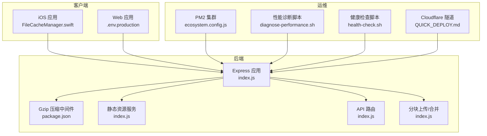
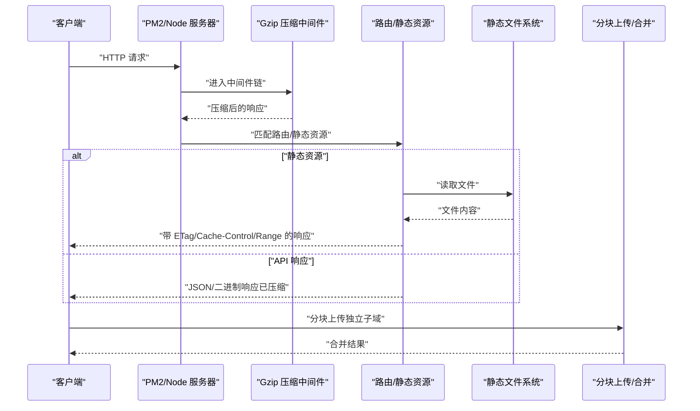
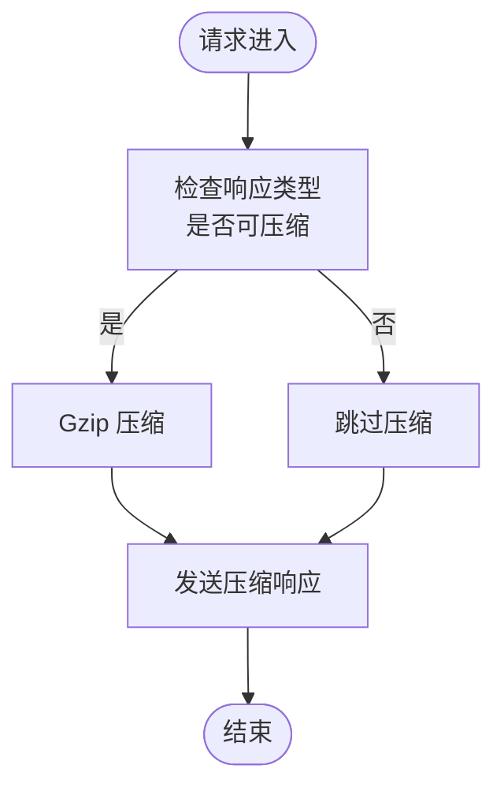
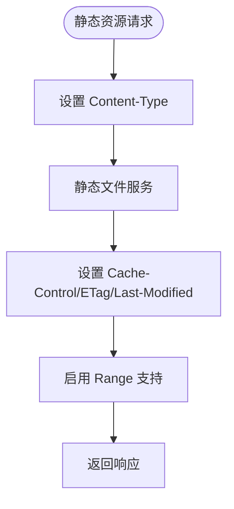
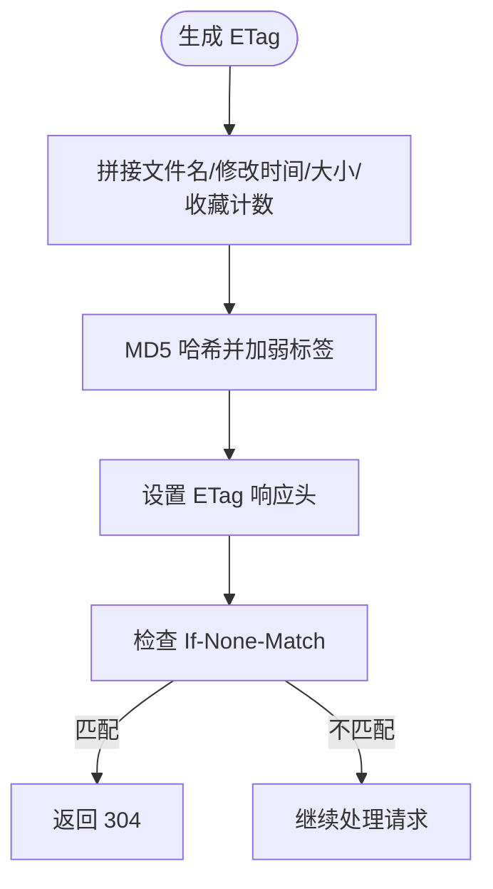
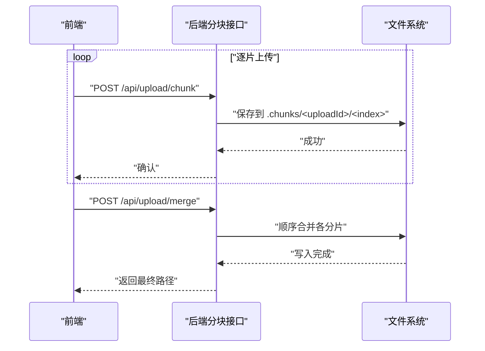
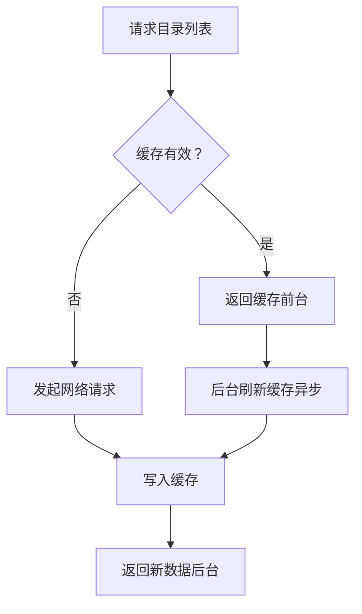
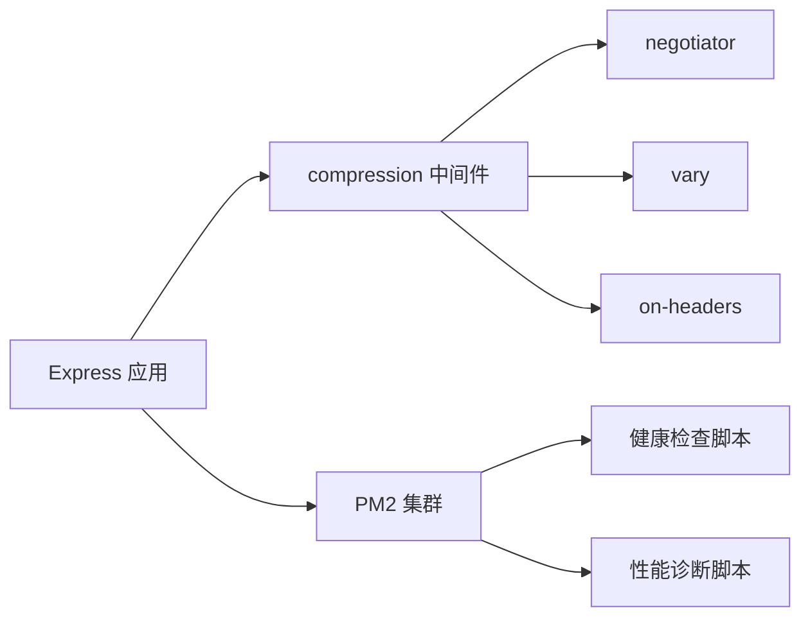

# 压缩与传输优化

<cite>
**本文引用的文件**
- [server/index.js](file://server/index.js)
- [server/package.json](file://server/package.json)
- [client/.env.production](file://client/.env.production)
- [ios/LonghornApp/Services/FileCacheManager.swift](file://ios/LonghornApp/Services/FileCacheManager.swift)
- [scripts/diagnose-performance.sh](file://scripts/diagnose-performance.sh)
- [scripts/health-check.sh](file://scripts/health-check.sh)
- [scripts/ecosystem.config.js](file://scripts/ecosystem.config.js)
- [docs/QUICK_DEPLOY.md](file://docs/QUICK_DEPLOY.md)
</cite>

## 目录
1. [简介](#简介)
2. [项目结构](#项目结构)
3. [核心组件](#核心组件)
4. [架构总览](#架构总览)
5. [详细组件分析](#详细组件分析)
6. [依赖关系分析](#依赖关系分析)
7. [性能考量](#性能考量)
8. [故障排查指南](#故障排查指南)
9. [结论](#结论)
10. [附录](#附录)

## 简介
本文件聚焦 Longhorn 在压缩与传输方面的优化实践，覆盖以下主题：
- Gzip 压缩中间件的配置与性能影响，包括静态资源压缩与 API 响应优化
- HTTP 缓存策略、ETag 机制与 Last-Modified 头部使用
- Range 请求支持、分块传输与大文件下载优化
- 网络传输协议优化、带宽利用率提升与 CDN 集成策略
- 传输性能监控、延迟分析与网络瓶颈识别方法

## 项目结构
Longhorn 由 Node.js 后端、iOS 客户端与若干运维脚本组成。与压缩与传输优化直接相关的模块包括：
- 后端中间件与路由：Gzip 压缩、静态资源缓存、ETag 生成、Range 支持、分块上传/合并
- 客户端缓存策略：stale-while-revalidate（SWR）模式
- 运维脚本：性能诊断、健康检查、PM2 集群部署

图表来源
- [server/index.js](file://server/index.js#L418-L419)
- [server/package.json](file://server/package.json#L19-L27)
- [client/.env.production](file://client/.env.production#L1-L8)
- [scripts/ecosystem.config.js](file://scripts/ecosystem.config.js#L1-L41)
- [scripts/diagnose-performance.sh](file://scripts/diagnose-performance.sh#L1-L122)
- [scripts/health-check.sh](file://scripts/health-check.sh#L1-L115)
- [docs/QUICK_DEPLOY.md](file://docs/QUICK_DEPLOY.md#L66-L83)

章节来源
- [server/index.js](file://server/index.js#L418-L419)
- [server/package.json](file://server/package.json#L19-L27)
- [client/.env.production](file://client/.env.production#L1-L8)
- [scripts/ecosystem.config.js](file://scripts/ecosystem.config.js#L1-L41)

## 核心组件
- Gzip 压缩中间件：通过 compression 模块启用，对可压缩响应进行透明压缩，降低带宽占用。
- 静态资源缓存：静态目录设置 Cache-Control、ETag、Last-Modified 与 Range 支持，提升图片等静态资源命中率。
- ETag 生成与条件请求：目录列表接口基于文件名、修改时间、大小与收藏计数生成 ETag，并支持 If-None-Match。
- Range 请求与分块传输：静态资源开启 acceptRanges；分块上传通过多片段上传与合并规避代理超时限制。
- 客户端缓存：iOS 采用 stale-while-revalidate 模式，减少重复请求与服务器压力。
- CDN/隧道：通过 Cloudflare Tunnel 提供全球加速与安全接入，结合独立上传子域绕过代理超时限制。

章节来源
- [server/index.js](file://server/index.js#L397-L416)
- [server/index.js](file://server/index.js#L2321-L2342)
- [server/package.json](file://server/package.json#L19-L27)
- [client/.env.production](file://client/.env.production#L1-L8)
- [ios/LonghornApp/Services/FileCacheManager.swift](file://ios/LonghornApp/Services/FileCacheManager.swift#L1-L185)

## 架构总览
下图展示了压缩与传输优化在系统中的位置与交互：

图表来源
- [server/index.js](file://server/index.js#L418-L419)
- [server/index.js](file://server/index.js#L397-L416)
- [server/index.js](file://server/index.js#L843-L932)
- [client/.env.production](file://client/.env.production#L1-L8)

## 详细组件分析

### Gzip 压缩中间件
- 配置位置：应用启动后立即启用压缩中间件，对可压缩类型进行透明压缩。
- 影响范围：API 响应、静态资源（在静态服务之前）。
- 性能权衡：CPU 压缩成本换取带宽节省，适合文本类响应；二进制内容（如图片、视频）通常无需压缩或已压缩。

图表来源
- [server/index.js](file://server/index.js#L418-L419)
- [server/package.json](file://server/package.json#L19-L27)

章节来源
- [server/index.js](file://server/index.js#L418-L419)
- [server/package.json](file://server/package.json#L19-L27)

### 静态资源压缩与缓存策略
- 静态目录配置：为预览目录设置缓存控制、ETag、Last-Modified 与 Range 支持，确保图片等静态资源高效传输。
- MIME 类型：针对 HEIC/HEVC/MOV 等格式显式设置 Content-Type，避免浏览器误判。
- 压缩顺序：静态服务应在压缩中间件之前设置 MIME 类型，以正确支持速率限制与 Range 请求。

图表来源
- [server/index.js](file://server/index.js#L397-L416)

章节来源
- [server/index.js](file://server/index.js#L397-L416)

### ETag 机制与条件请求
- ETag 生成：基于目录项名称、修改时间、大小以及用户收藏计数拼接后哈希生成，包含弱标签标识。
- 条件请求：若客户端携带 If-None-Match 且匹配，则返回 304，避免重复传输。
- 适用场景：目录列表、静态资源等可变但可快速计算摘要的内容。

图表来源
- [server/index.js](file://server/index.js#L2321-L2342)

章节来源
- [server/index.js](file://server/index.js#L2321-L2342)

### Last-Modified 头部使用
- 静态资源：静态服务启用 lastModified，浏览器可利用 If-Modified-Since 进行条件请求。
- API 响应：未显式设置 Last-Modified，建议对可缓存的只读数据接口补充该头部以进一步提升缓存命中。

章节来源
- [server/index.js](file://server/index.js#L412-L415)

### Range 请求支持与分块传输
- Range 支持：静态服务开启 acceptRanges，允许断点续传与并行下载，提升大文件体验。
- 分块上传：后端提供分块上传与合并接口，前端按固定大小切片上传，绕过代理超时限制。
- 上传子域：生产环境变量允许将上传指向独立子域，避免代理层超时与限速。

图表来源
- [server/index.js](file://server/index.js#L843-L932)
- [client/.env.production](file://client/.env.production#L1-L8)

章节来源
- [server/index.js](file://server/index.js#L843-L932)
- [client/.env.production](file://client/.env.production#L1-L8)

### 客户端缓存策略（iOS）
- stale-while-revalidate（SWR）：优先返回缓存，后台异步刷新，提升首屏与重复访问速度。
- 预取策略：对直接子目录进行有限数量预取，降低后续导航延迟。
- 并发控制：避免重复请求，清理过期缓存，保持缓存一致性。

图表来源
- [ios/LonghornApp/Services/FileCacheManager.swift](file://ios/LonghornApp/Services/FileCacheManager.swift#L1-L185)

章节来源
- [ios/LonghornApp/Services/FileCacheManager.swift](file://ios/LonghornApp/Services/FileCacheManager.swift#L1-L185)

### CDN 集成与网络传输优化
- Cloudflare 隧道：通过 cloudflared 建立安全隧道，提供全球加速与 TLS 终止。
- 上传子域：独立上传域名绕过代理层 100 秒超时限制，提升大文件上传稳定性。
- 集成建议：静态资源可进一步接入 CDN 缓存与边缘压缩，配合 ETag/Cache-Control 实现最优命中。

章节来源
- [docs/QUICK_DEPLOY.md](file://docs/QUICK_DEPLOY.md#L66-L83)
- [client/.env.production](file://client/.env.production#L1-L8)

## 依赖关系分析
- 中间件依赖：compression 依赖 negotiator、vary、on-headers 等模块，确保协商与响应头正确处理。
- 运维依赖：PM2 集群模式利用多核提升并发处理能力；健康检查与性能诊断脚本辅助定位瓶颈。

图表来源
- [server/package.json](file://server/package.json#L19-L27)
- [scripts/ecosystem.config.js](file://scripts/ecosystem.config.js#L1-L41)
- [scripts/health-check.sh](file://scripts/health-check.sh#L1-L115)
- [scripts/diagnose-performance.sh](file://scripts/diagnose-performance.sh#L1-L122)

章节来源
- [server/package.json](file://server/package.json#L19-L27)
- [scripts/ecosystem.config.js](file://scripts/ecosystem.config.js#L1-L41)

## 性能考量
- 压缩策略
  - 文本类 API 响应建议启用压缩；二进制内容（如 WebP、视频）通常无需二次压缩。
  - 对于静态图片，建议在生成阶段完成压缩与格式优化，减少运行时 CPU 开销。
- 缓存策略
  - 静态资源设置长缓存与 ETag，结合浏览器/CDN 缓存显著降低带宽。
  - 目录列表等动态内容使用 ETag 与短缓存，平衡新鲜度与性能。
- 传输优化
  - 大文件优先使用分块上传与 Range 下载，避免代理超时与中断重传。
  - 上传走独立子域，减少主站代理层干扰。
- 并发与资源
  - PM2 集群模式提升多用户并发处理能力；注意内存上限与重启策略。
  - 静态缩略图生成队列限制并发，避免 CPU/IO 过载。

## 故障排查指南
- 性能诊断
  - 使用性能诊断脚本收集 PM2 状态、本地 API 响应时间、数据库规模、图片分布、Cloudflare Tunnel 状态与网络连通性。
- 健康检查
  - 检查后端/前端服务端口监听状态，必要时自动启动；校验数据库完整性与关键字段存在性。
- 常见问题
  - 上传超时：确认是否使用独立上传子域；检查分块上传流程与合并逻辑。
  - 缓存不生效：核对静态资源的 Cache-Control、ETag 设置；检查客户端缓存策略。
  - Range 不可用：确认静态服务已启用 acceptRanges；检查客户端支持情况。

章节来源
- [scripts/diagnose-performance.sh](file://scripts/diagnose-performance.sh#L1-L122)
- [scripts/health-check.sh](file://scripts/health-check.sh#L1-L115)
- [server/index.js](file://server/index.js#L397-L416)
- [server/index.js](file://server/index.js#L843-L932)

## 结论
Longhorn 在压缩与传输方面已具备较为完善的基础设施：Gzip 压缩中间件、静态资源缓存与 ETag、Range 支持、分块上传与独立上传子域。为进一步提升性能与稳定性，建议：
- 对静态资源引入 CDN 与边缘压缩，结合 ETag/Cache-Control 实现极致命中。
- 在 API 层对热点文本响应启用压缩，对二进制响应避免重复压缩。
- 优化分块大小与并发策略，结合客户端 SWR 与服务端缓存，实现低延迟高吞吐。

## 附录
- 部署与隧道参考：Cloudflare Tunnel 配置与上传子域设置。
- 运维脚本：性能诊断、健康检查与 PM2 集群配置。

章节来源
- [docs/QUICK_DEPLOY.md](file://docs/QUICK_DEPLOY.md#L66-L83)
- [scripts/ecosystem.config.js](file://scripts/ecosystem.config.js#L1-L41)