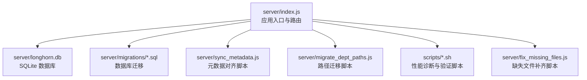
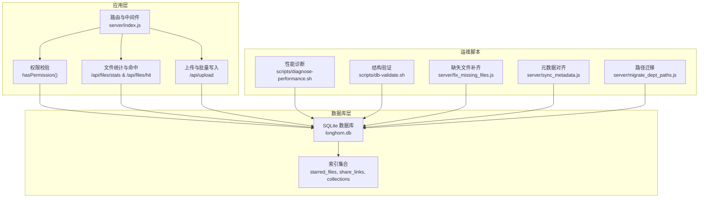
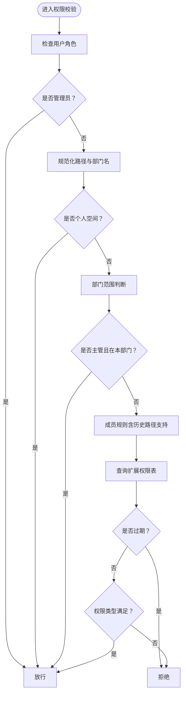
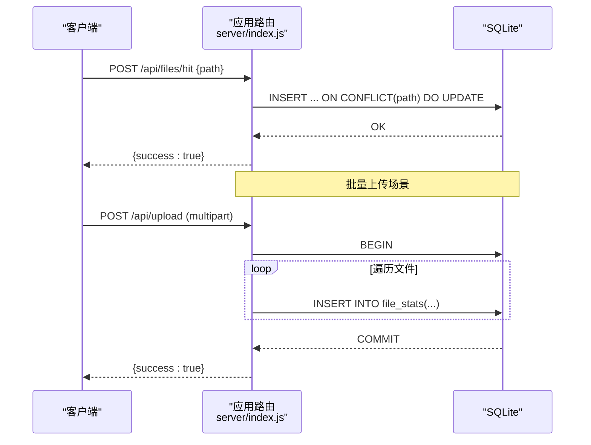
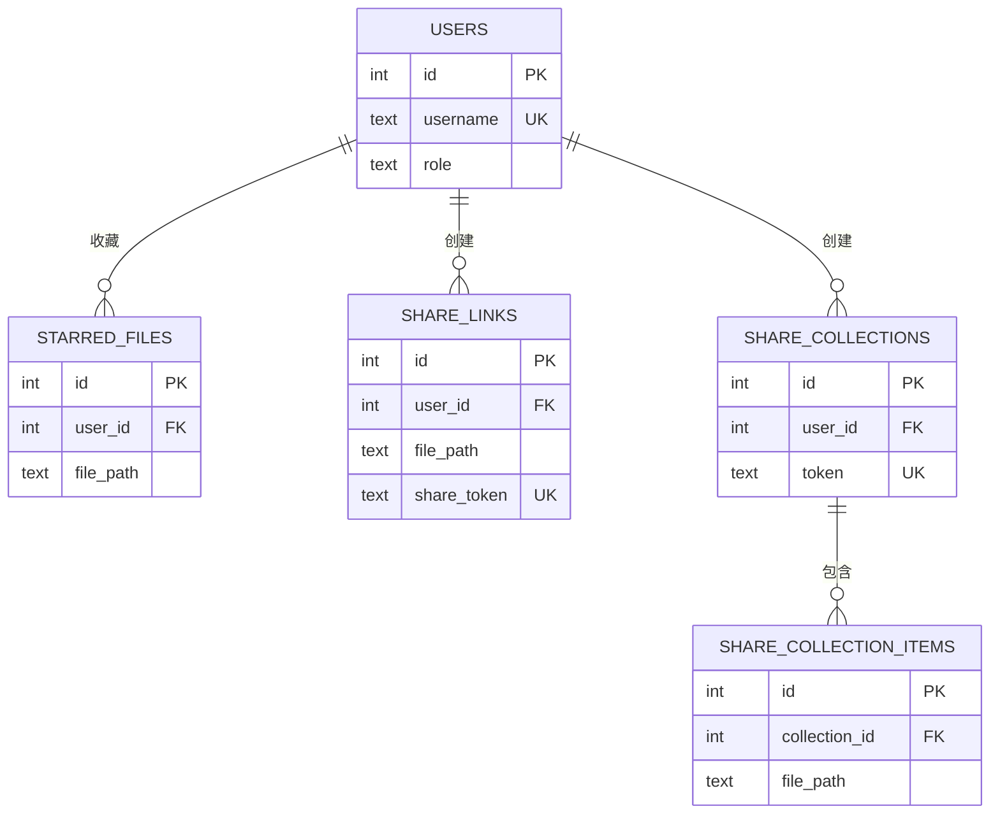
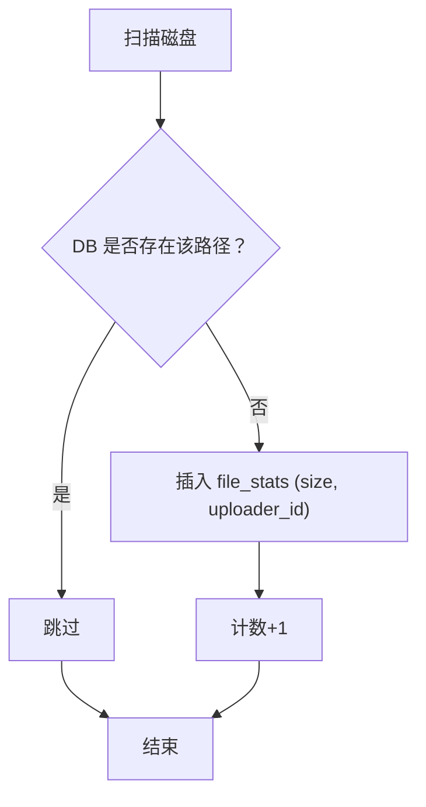
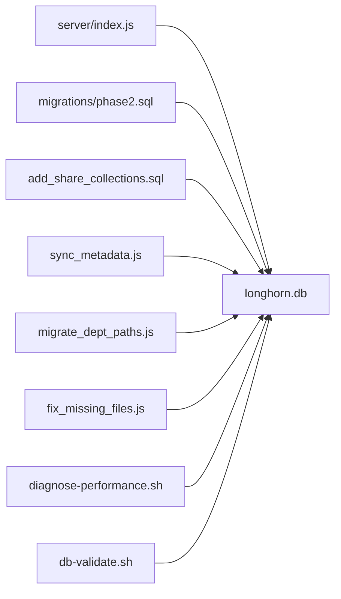

# 后端数据库优化

<cite>
**本文引用的文件**
- [server/index.js](file://server/index.js)
- [server/migrations/phase2.sql](file://server/migrations/phase2.sql)
- [server/migrations/add_share_collections.sql](file://server/migrations/add_share_collections.sql)
- [server/sync_metadata.js](file://server/sync_metadata.js)
- [server/migrate_dept_paths.js](file://server/migrate_dept_paths.js)
- [scripts/diagnose-performance.sh](file://scripts/diagnose-performance.sh)
- [scripts/db-validate.sh](file://scripts/db-validate.sh)
- [scripts/check_db.js](file://scripts/check_db.js)
- [server/fix_missing_files.js](file://server/fix_missing_files.js)
</cite>

## 目录
1. [简介](#简介)
2. [项目结构](#项目结构)
3. [核心组件](#核心组件)
4. [架构总览](#架构总览)
5. [详细组件分析](#详细组件分析)
6. [依赖关系分析](#依赖关系分析)
7. [性能考量](#性能考量)
8. [故障排查指南](#故障排查指南)
9. [结论](#结论)
10. [附录](#附录)

## 简介
本文件面向 Longhorn 后端数据库优化，聚焦 SQLite 在 Node.js 环境下的性能优化策略与工程实践。内容涵盖 WAL 模式配置、索引优化与查询计划分析、连接池与事务优化、并发控制、文件元数据查询与权限检查优化、批量操作优化、监控指标与慢查询分析、性能瓶颈识别以及数据库维护、备份与容量规划建议。

## 项目结构
Longhorn 后端采用单进程 Node.js + better-sqlite3 的轻量级架构，数据库文件位于 server/longhorn.db，迁移脚本与运维脚本集中于 server/migrations 与 scripts 目录。核心业务逻辑集中在 server/index.js 中，围绕文件元数据、权限校验、缩略图生成等场景进行数据库读写。

图表来源
- [server/index.js](file://server/index.js#L1-L120)
- [server/migrations/phase2.sql](file://server/migrations/phase2.sql#L1-L32)
- [server/migrations/add_share_collections.sql](file://server/migrations/add_share_collections.sql#L1-L32)
- [server/sync_metadata.js](file://server/sync_metadata.js#L1-L37)
- [server/migrate_dept_paths.js](file://server/migrate_dept_paths.js#L1-L81)
- [scripts/diagnose-performance.sh](file://scripts/diagnose-performance.sh#L1-L122)
- [scripts/db-validate.sh](file://scripts/db-validate.sh#L1-L52)
- [server/fix_missing_files.js](file://server/fix_missing_files.js#L1-L66)

章节来源
- [server/index.js](file://server/index.js#L1-L120)

## 核心组件
- 数据库初始化与 WAL 模式
  - 初始化时设置 journal_mode=WAL，提升并发读写能力与崩溃恢复效率。
  - 参考路径：[server/index.js](file://server/index.js#L28-L31)

- 表结构与索引
  - 基础表：departments、users、permissions、stars、vocabulary。
  - 扩展表：starred_files、share_links、share_collections、share_collection_items。
  - 索引：针对常用查询字段建立索引，如 starred_files(user_id, file_path)、share_links(share_token, user_id)、share_collections(token, user_id)、share_collection_items(collection_id)。
  - 参考路径：
    - [server/index.js](file://server/index.js#L33-L78)
    - [server/migrations/phase2.sql](file://server/migrations/phase2.sql#L4-L31)
    - [server/migrations/add_share_collections.sql](file://server/migrations/add_share_collections.sql#L5-L32)

- 权限检查与元数据查询
  - hasPermission 函数结合数据库查询进行路径权限判定，包含部门映射、个人空间、扩展权限等逻辑。
  - 文件访问统计与命中接口，使用 upsert 与冲突更新减少往返。
  - 参考路径：
    - [server/index.js](file://server/index.js#L298-L353)
    - [server/index.js](file://server/index.js#L2242-L2467)

- 批量操作与事务
  - 上传接口使用 db.transaction 包裹批量插入，显著降低写放大与锁竞争。
  - 参考路径：[server/index.js](file://server/index.js#L823-L832)

- 运维与诊断
  - 诊断脚本收集数据库规模、表结构、网络与系统资源等信息。
  - 结构验证脚本自动修复缺失列。
  - 参考路径：
    - [scripts/diagnose-performance.sh](file://scripts/diagnose-performance.sh#L1-L122)
    - [scripts/db-validate.sh](file://scripts/db-validate.sh#L1-L52)

章节来源
- [server/index.js](file://server/index.js#L28-L78)
- [server/migrations/phase2.sql](file://server/migrations/phase2.sql#L1-L32)
- [server/migrations/add_share_collections.sql](file://server/migrations/add_share_collections.sql#L1-L32)
- [server/index.js](file://server/index.js#L298-L353)
- [server/index.js](file://server/index.js#L2242-L2467)
- [server/index.js](file://server/index.js#L823-L832)
- [scripts/diagnose-performance.sh](file://scripts/diagnose-performance.sh#L1-L122)
- [scripts/db-validate.sh](file://scripts/db-validate.sh#L1-L52)

## 架构总览
下图展示数据库相关模块之间的交互关系与职责边界。

图表来源
- [server/index.js](file://server/index.js#L298-L353)
- [server/index.js](file://server/index.js#L2242-L2467)
- [server/index.js](file://server/index.js#L823-L832)
- [server/migrations/phase2.sql](file://server/migrations/phase2.sql#L27-L31)
- [server/migrations/add_share_collections.sql](file://server/migrations/add_share_collections.sql#L18-L32)
- [scripts/diagnose-performance.sh](file://scripts/diagnose-performance.sh#L34-L61)
- [scripts/db-validate.sh](file://scripts/db-validate.sh#L16-L47)
- [server/fix_missing_files.js](file://server/fix_missing_files.js#L28-L66)
- [server/sync_metadata.js](file://server/sync_metadata.js#L18-L37)
- [server/migrate_dept_paths.js](file://server/migrate_dept_paths.js#L25-L40)

## 详细组件分析

### 权限检查与查询优化
- 查询模式
  - 用户登录后加载角色与部门信息，随后在每次权限判断前可复用该上下文，避免重复查询。
  - hasPermission 使用一次多条件查询匹配扩展权限，注意 LIKE 前缀匹配与过期时间过滤。
- 索引建议
  - permissions(user_id, folder_path) 可覆盖常用“按用户+路径”的筛选。
  - 若存在频繁的“按路径前缀”查询，可考虑 folder_path 上的前缀索引或函数索引（取决于 SQLite 版本与扩展）。
- 并发与锁
  - 权限查询通常短小且只读，建议在高并发场景下通过连接池限制并发，避免长事务持有锁。
- 优化要点
  - 将部门名称标准化为代码（如 OP/MS/RD），减少字符串比较与转换成本。
  - 对于路径匹配，尽量使用精确相等或前缀 LIKE，并确保索引命中。

图表来源
- [server/index.js](file://server/index.js#L298-L353)

章节来源
- [server/index.js](file://server/index.js#L298-L353)

### 文件元数据查询与批量写入优化
- 访问统计与命中
  - /api/files/hit 使用 upsert（INSERT ... ON CONFLICT ... UPDATE）对全局计数与用户计数进行原子更新，减少往返。
  - /api/files/stats 通过 JOIN 获取最近访问用户列表，注意按 last_access 排序的代价。
- 批量写入
  - /api/upload 使用 db.transaction 包裹批量插入 file_stats，显著降低锁竞争与 WAL 写放大。
- 索引建议
  - file_stats(path) 作为主键/唯一约束，适合按路径查找；若存在大量“按路径前缀模糊匹配”，可评估前缀索引或函数索引。
  - access_logs(path, user_id) 组合索引可优化按路径与用户的访问日志查询。
- 并发与锁
  - 批量写入建议在事务中完成，避免长时间持有行级锁。
  - 读多写少场景下，WAL 模式配合只读查询可降低阻塞。

图表来源
- [server/index.js](file://server/index.js#L2442-L2467)
- [server/index.js](file://server/index.js#L818-L832)

章节来源
- [server/index.js](file://server/index.js#L2442-L2467)
- [server/index.js](file://server/index.js#L818-L832)

### 分享与收藏功能的索引设计
- starred_files(user_id, file_path)：支持“某用户收藏了哪些文件”和“某文件被哪些用户收藏”两类查询。
- share_links(share_token, user_id)：支持“按令牌查询分享链接”和“按用户查询分享链接”。
- share_collections(token, user_id)：同上。
- share_collection_items(collection_id)：支持“某集合包含哪些条目”。

图表来源
- [server/migrations/phase2.sql](file://server/migrations/phase2.sql#L4-L31)
- [server/migrations/add_share_collections.sql](file://server/migrations/add_share_collections.sql#L5-L32)

章节来源
- [server/migrations/phase2.sql](file://server/migrations/phase2.sql#L27-L31)
- [server/migrations/add_share_collections.sql](file://server/migrations/add_share_collections.sql#L18-L32)

### 运维与数据对齐脚本
- 元数据对齐（sync_metadata.js）
  - 修复 uploader_id 关联不一致问题。
  - 清理路径前缀与规范化路径，统一存储路径格式。
- 路径迁移（migrate_dept_paths.js）
  - 将中文路径映射为英文代码，分两步：先迁移数据库路径，再重命名物理目录。
- 缺失文件补齐（fix_missing_files.js）
  - 遍历磁盘，将缺失的文件元数据回填至 file_stats。

图表来源
- [server/fix_missing_files.js](file://server/fix_missing_files.js#L28-L66)
- [server/sync_metadata.js](file://server/sync_metadata.js#L18-L37)
- [server/migrate_dept_paths.js](file://server/migrate_dept_paths.js#L25-L40)

章节来源
- [server/fix_missing_files.js](file://server/fix_missing_files.js#L1-L66)
- [server/sync_metadata.js](file://server/sync_metadata.js#L1-L37)
- [server/migrate_dept_paths.js](file://server/migrate_dept_paths.js#L1-L81)

## 依赖关系分析
- 组件耦合
  - server/index.js 是数据库访问与业务逻辑的核心入口，耦合度较高；建议将权限校验、统计与日志等模块化拆分，降低主文件复杂度。
  - 迁移脚本与运维脚本独立于主服务，通过直接连接数据库执行维护任务，耦合度低但需保证 WAL 模式与事务一致性。
- 外部依赖
  - better-sqlite3 提供高性能 SQLite 绑定；WAL 模式由应用启动时设置。
  - 运维脚本依赖 sqlite3 命令行工具与系统命令（如 find、ls、ps）。

图表来源
- [server/index.js](file://server/index.js#L28-L31)
- [server/migrations/phase2.sql](file://server/migrations/phase2.sql#L1-L32)
- [server/migrations/add_share_collections.sql](file://server/migrations/add_share_collections.sql#L1-L32)
- [server/sync_metadata.js](file://server/sync_metadata.js#L1-L11)
- [server/migrate_dept_paths.js](file://server/migrate_dept_paths.js#L1-L13)
- [server/fix_missing_files.js](file://server/fix_missing_files.js#L1-L19)
- [scripts/diagnose-performance.sh](file://scripts/diagnose-performance.sh#L36-L61)
- [scripts/db-validate.sh](file://scripts/db-validate.sh#L16-L47)

章节来源
- [server/index.js](file://server/index.js#L28-L31)
- [server/migrations/phase2.sql](file://server/migrations/phase2.sql#L1-L32)
- [server/migrations/add_share_collections.sql](file://server/migrations/add_share_collections.sql#L1-L32)
- [server/sync_metadata.js](file://server/sync_metadata.js#L1-L11)
- [server/migrate_dept_paths.js](file://server/migrate_dept_paths.js#L1-L13)
- [server/fix_missing_files.js](file://server/fix_missing_files.js#L1-L19)
- [scripts/diagnose-performance.sh](file://scripts/diagnose-performance.sh#L36-L61)
- [scripts/db-validate.sh](file://scripts/db-validate.sh#L16-L47)

## 性能考量
- WAL 模式与并发
  - 已启用 WAL 模式，有利于提升并发读取与写入吞吐；建议保持该设置。
  - 对于高并发写入场景，优先使用事务包裹批量写入，减少锁竞争。
- 索引与查询计划
  - 为 permissions(folder_path)、file_stats(path)、access_logs(path,user_id) 等热点查询字段建立合适索引。
  - 使用 EXPLAIN QUERY PLAN 或 .explain + .eqp（sqlite3 CLI）分析查询计划，避免全表扫描。
- 批量操作
  - 上传接口已使用事务；建议对大批次写入设置合理的批大小，避免单事务过大导致锁持有时间过长。
- 缓存与预计算
  - 对于高频统计（如 top 访问者、存储用量），可在应用层引入短期缓存，定期刷新。
- I/O 与 CPU
  - 缩略图生成使用队列与并发限制，避免 CPU/IO 过载；可结合硬件资源调整并发上限。

[本节为通用性能指导，无需列出具体文件来源]

## 故障排查指南
- 性能诊断
  - 使用 scripts/diagnose-performance.sh 收集数据库规模、表记录数、系统资源与网络状态，定位瓶颈。
  - 关注 /api/status、/api/files/stats、/api/files/hit 等关键接口的响应时间。
- 结构验证
  - 使用 scripts/db-validate.sh 自动检测并修复缺失列（如 users.last_login），确保表结构一致性。
- 数据库检查
  - 使用 scripts/check_db.js 快速打开数据库并打印关键表内容，辅助问题定位。
- 运维脚本
  - 对齐与迁移：先运行 sync_metadata.js 修复关联，再运行 migrate_dept_paths.js 完成路径迁移。
  - 缺失补齐：运行 fix_missing_files.js 将磁盘上的文件补齐到 file_stats。

章节来源
- [scripts/diagnose-performance.sh](file://scripts/diagnose-performance.sh#L1-L122)
- [scripts/db-validate.sh](file://scripts/db-validate.sh#L1-L52)
- [scripts/check_db.js](file://scripts/check_db.js#L1-L20)
- [server/sync_metadata.js](file://server/sync_metadata.js#L1-L37)
- [server/migrate_dept_paths.js](file://server/migrate_dept_paths.js#L1-L81)
- [server/fix_missing_files.js](file://server/fix_missing_files.js#L1-L66)

## 结论
Longhorn 的数据库优化以 WAL 模式与事务批处理为核心，辅以针对性索引与运维脚本保障数据一致性与可维护性。建议持续关注热点查询的索引命中情况，结合诊断脚本与缓存策略进一步提升并发与响应表现，并在容量增长过程中定期评估索引与查询计划，确保系统长期稳定高效运行。

[本节为总结性内容，无需列出具体文件来源]

## 附录
- 监控指标建议
  - 数据库层面：表记录数、索引使用率、WAL 文件大小、锁等待时间。
  - 应用层面：关键接口 P95/P99 延迟、并发连接数、错误率、缓存命中率。
- 慢查询分析步骤
  - 使用 sqlite3 CLI 开启 .explain + .eqp，分析慢 SQL 的执行计划。
  - 结合 scripts/diagnose-performance.sh 输出，定位系统资源瓶颈。
- 备份与容量规划
  - 备份：通过 /api/admin/restore 接口进行数据库替换与重启（需谨慎操作）。
  - 容量规划：基于文件数量与平均元数据大小估算数据库体积，预留 20%-30% 空间用于 WAL 与索引增长。

章节来源
- [server/index.js](file://server/index.js#L3089-L3118)
- [scripts/diagnose-performance.sh](file://scripts/diagnose-performance.sh#L36-L61)