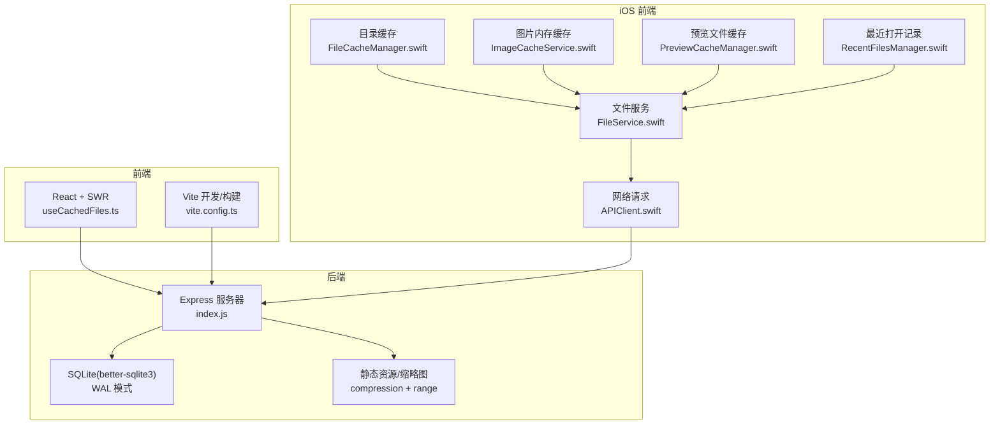
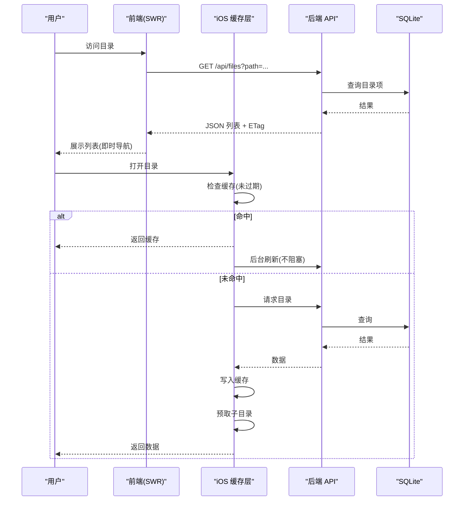
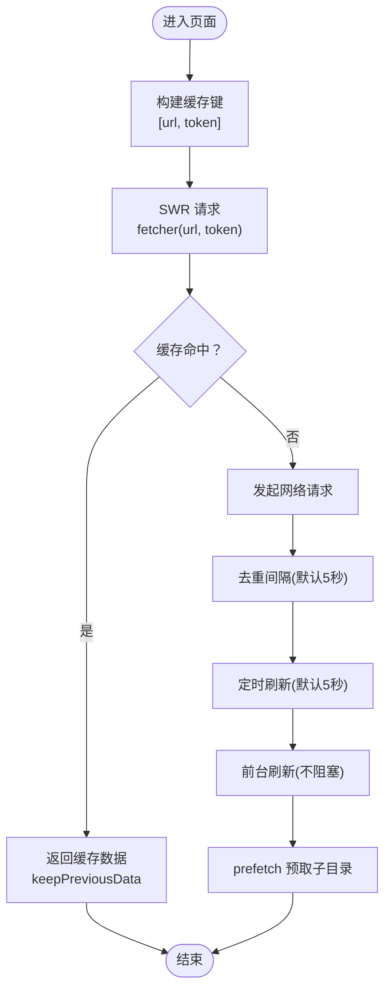
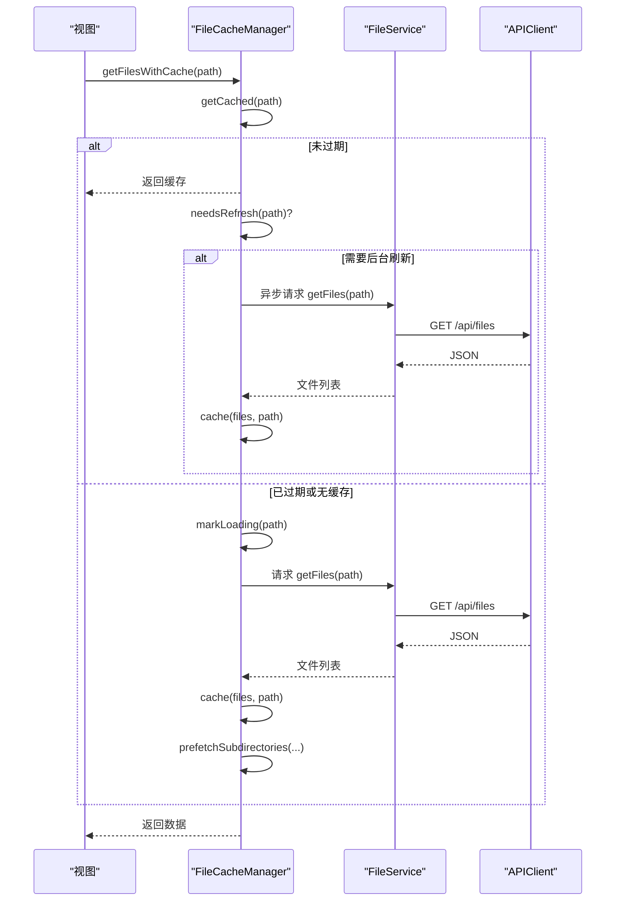
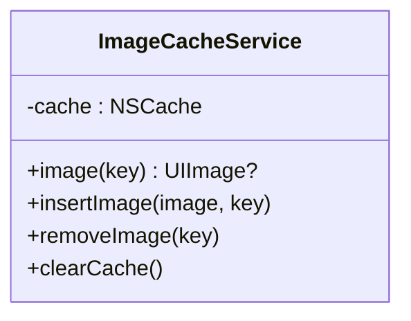
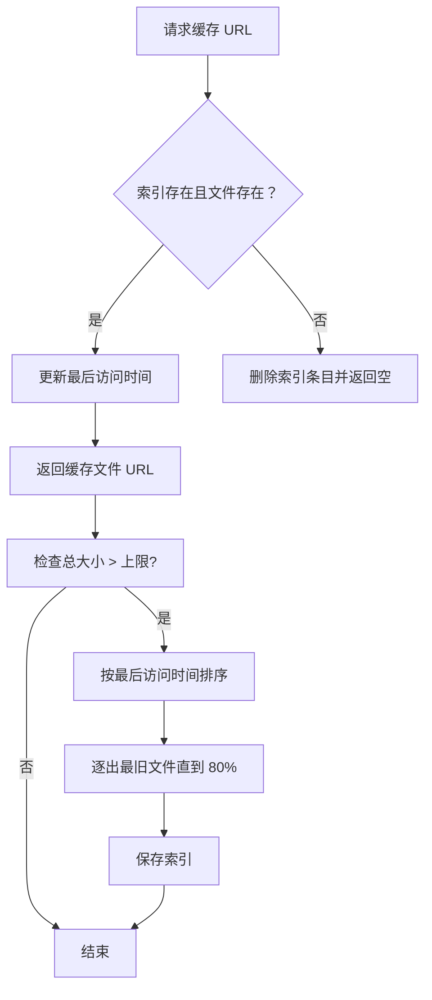
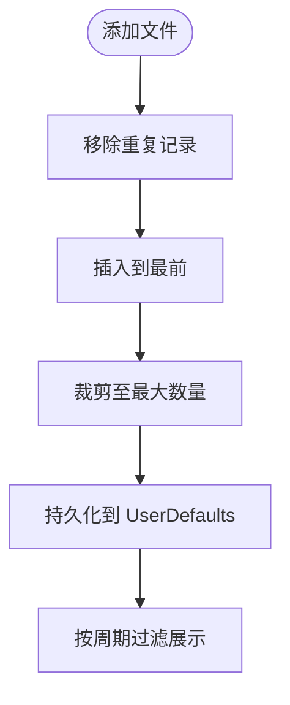
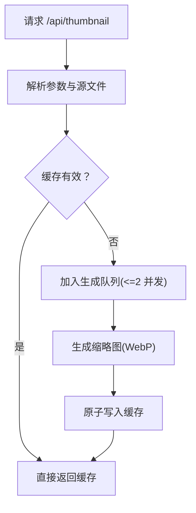
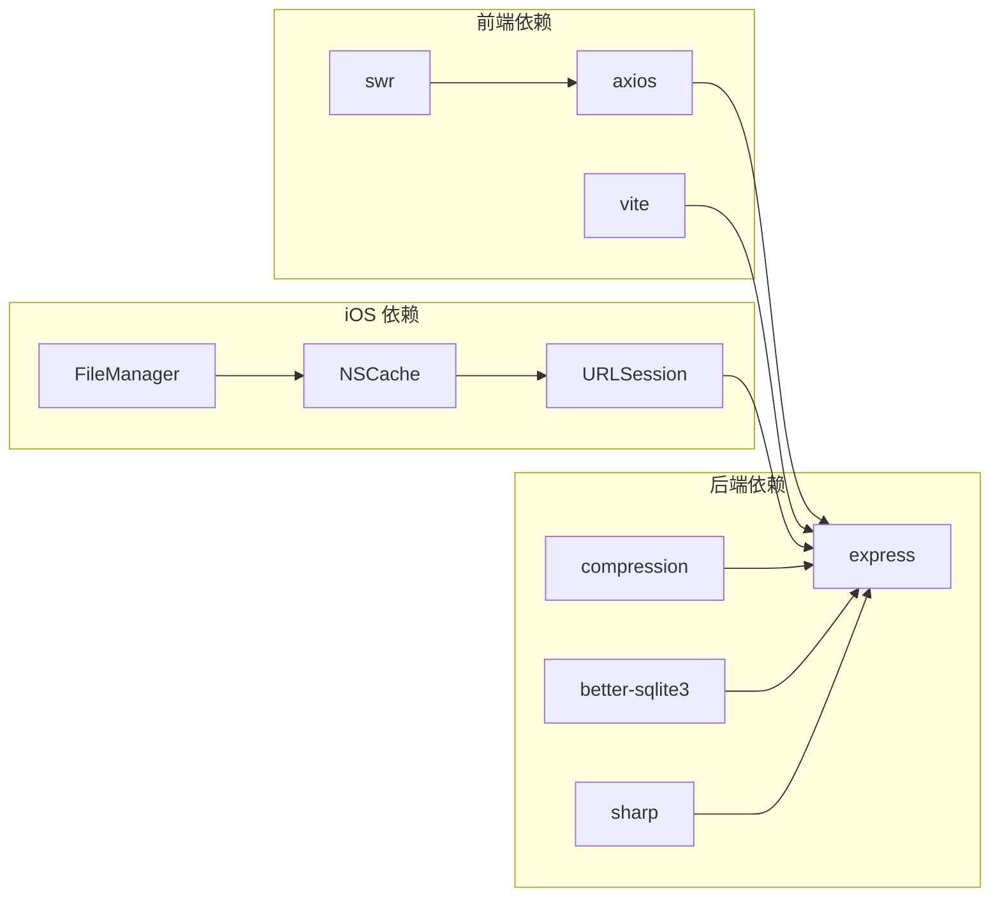

# 性能优化

<cite>
**本文引用的文件**
- [client/src/hooks/useCachedFiles.ts](file://client/src/hooks/useCachedFiles.ts)
- [client/vite.config.ts](file://client/vite.config.ts)
- [ios/LonghornApp/Services/FileCacheManager.swift](file://ios/LonghornApp/Services/FileCacheManager.swift)
- [ios/LonghornApp/Services/ImageCacheService.swift](file://ios/LonghornApp/Services/ImageCacheService.swift)
- [ios/LonghornApp/Services/PreviewCacheManager.swift](file://ios/LonghornApp/Services/PreviewCacheManager.swift)
- [ios/LonghornApp/Services/RecentFilesManager.swift](file://ios/LonghornApp/Services/RecentFilesManager.swift)
- [ios/LonghornApp/Services/FileService.swift](file://ios/LonghornApp/Services/FileService.swift)
- [ios/LonghornApp/Services/APIClient.swift](file://ios/LonghornApp/Services/APIClient.swift)
- [server/index.js](file://server/index.js)
- [server/package.json](file://server/package.json)
- [client/package.json](file://client/package.json)
- [scripts/diagnose-performance.sh](file://scripts/diagnose-performance.sh)
</cite>

## 目录
1. [简介](#简介)
2. [项目结构](#项目结构)
3. [核心组件](#核心组件)
4. [架构总览](#架构总览)
5. [详细组件分析](#详细组件分析)
6. [依赖关系分析](#依赖关系分析)
7. [性能考量与优化建议](#性能考量与优化建议)
8. [故障排查指南](#故障排查指南)
9. [结论](#结论)
10. [附录](#附录)

## 简介
本文件面向 Longhorn 的性能优化目标，系统梳理前后端缓存策略、并发控制与资源优化方案，并覆盖移动端图片缓存、文件预加载与懒加载实现；后端数据库查询优化、连接池与内存使用优化；移动端电池续航与网络优化策略；以及性能监控指标、基准测试方法、瓶颈分析工具与扩展性设计、容量规划建议。

## 项目结构
Longhorn 采用前后端分离架构：
- 前端（React + Vite）通过 SWR 实现目录列表缓存与预取，代理到后端 API。
- iOS 前端（Swift）实现目录列表缓存（stale-while-revalidate）、图片内存缓存、预览文件磁盘缓存与最近打开记录持久化。
- 后端（Node.js + Express + better-sqlite3）提供文件浏览、缩略图生成、静态资源缓存与压缩、限流与范围请求支持。

图表来源
- [client/src/hooks/useCachedFiles.ts](file://client/src/hooks/useCachedFiles.ts#L40-L86)
- [client/vite.config.ts](file://client/vite.config.ts#L62-L81)
- [ios/LonghornApp/Services/FileCacheManager.swift](file://ios/LonghornApp/Services/FileCacheManager.swift#L29-L133)
- [ios/LonghornApp/Services/ImageCacheService.swift](file://ios/LonghornApp/Services/ImageCacheService.swift#L10-L36)
- [ios/LonghornApp/Services/PreviewCacheManager.swift](file://ios/LonghornApp/Services/PreviewCacheManager.swift#L10-L219)
- [ios/LonghornApp/Services/RecentFilesManager.swift](file://ios/LonghornApp/Services/RecentFilesManager.swift#L34-L125)
- [ios/LonghornApp/Services/APIClient.swift](file://ios/LonghornApp/Services/APIClient.swift#L38-L64)
- [server/index.js](file://server/index.js#L16-L31)

章节来源
- [client/src/hooks/useCachedFiles.ts](file://client/src/hooks/useCachedFiles.ts#L1-L102)
- [client/vite.config.ts](file://client/vite.config.ts#L1-L82)
- [ios/LonghornApp/Services/FileCacheManager.swift](file://ios/LonghornApp/Services/FileCacheManager.swift#L1-L185)
- [ios/LonghornApp/Services/ImageCacheService.swift](file://ios/LonghornApp/Services/ImageCacheService.swift#L1-L37)
- [ios/LonghornApp/Services/PreviewCacheManager.swift](file://ios/LonghornApp/Services/PreviewCacheManager.swift#L1-L219)
- [ios/LonghornApp/Services/RecentFilesManager.swift](file://ios/LonghornApp/Services/RecentFilesManager.swift#L1-L125)
- [ios/LonghornApp/Services/APIClient.swift](file://ios/LonghornApp/Services/APIClient.swift#L1-L326)
- [server/index.js](file://server/index.js#L1-L800)

## 核心组件
- 前端目录缓存与预取：基于 SWR 的目录列表缓存、去重请求、前台刷新、预取接口。
- iOS 目录缓存（SWR 类似模式）：stale-while-revalidate、并发加载去重、后台刷新与子目录预取。
- iOS 图片内存缓存：NSCache 限制数量与总成本，避免滚动卡顿。
- iOS 预览文件缓存：基于磁盘的 LRU 缓存，按大小上限清理，异步保存索引。
- iOS 最近打开记录：UserDefaults 持久化，按时间区间过滤。
- 后端缩略图与静态资源：压缩、ETag/Last-Modified、Range 请求、缓存目录与并发队列。
- 后端数据库：WAL 模式、事务批量插入、索引与查询优化点。

章节来源
- [client/src/hooks/useCachedFiles.ts](file://client/src/hooks/useCachedFiles.ts#L40-L86)
- [ios/LonghornApp/Services/FileCacheManager.swift](file://ios/LonghornApp/Services/FileCacheManager.swift#L29-L184)
- [ios/LonghornApp/Services/ImageCacheService.swift](file://ios/LonghornApp/Services/ImageCacheService.swift#L10-L36)
- [ios/LonghornApp/Services/PreviewCacheManager.swift](file://ios/LonghornApp/Services/PreviewCacheManager.swift#L10-L219)
- [ios/LonghornApp/Services/RecentFilesManager.swift](file://ios/LonghornApp/Services/RecentFilesManager.swift#L34-L125)
- [server/index.js](file://server/index.js#L418-L475)

## 架构总览
前端通过 SWR 与 iOS 的缓存层减少重复请求；后端通过压缩、ETag、Range 与缩略图缓存降低带宽与 CPU；数据库采用 WAL 提升并发写入能力。

图表来源
- [client/src/hooks/useCachedFiles.ts](file://client/src/hooks/useCachedFiles.ts#L58-L86)
- [ios/LonghornApp/Services/FileCacheManager.swift](file://ios/LonghornApp/Services/FileCacheManager.swift#L137-L184)
- [server/index.js](file://server/index.js#L418-L475)

## 详细组件分析

### 前端缓存与预取（SWR）
- 使用 SWR 对目录列表进行缓存，支持去重间隔与前台刷新，保持即时导航体验。
- 提供 prefetch 接口，提前预热子目录缓存，减少用户点击延迟。
- Vite 开发代理将 /api 与 /preview 代理至本地后端，便于联调。

图表来源
- [client/src/hooks/useCachedFiles.ts](file://client/src/hooks/useCachedFiles.ts#L40-L86)
- [client/vite.config.ts](file://client/vite.config.ts#L76-L81)

章节来源
- [client/src/hooks/useCachedFiles.ts](file://client/src/hooks/useCachedFiles.ts#L40-L86)
- [client/vite.config.ts](file://client/vite.config.ts#L62-L81)

### iOS 目录缓存（SWR 类似模式）
- 实现 stale-while-revalidate：缓存 5 分钟过期、30 分钟完全过期；后台刷新不阻塞 UI。
- 并发加载去重：loadingPaths 防止重复请求；后台任务完成后写入缓存。
- 预取策略：最多预取 5 个直接子目录，提升用户下钻体验。

图表来源
- [ios/LonghornApp/Services/FileCacheManager.swift](file://ios/LonghornApp/Services/FileCacheManager.swift#L137-L184)
- [ios/LonghornApp/Services/FileService.swift](file://ios/LonghornApp/Services/FileService.swift#L18-L39)
- [ios/LonghornApp/Services/APIClient.swift](file://ios/LonghornApp/Services/APIClient.swift#L69-L72)

章节来源
- [ios/LonghornApp/Services/FileCacheManager.swift](file://ios/LonghornApp/Services/FileCacheManager.swift#L29-L184)
- [ios/LonghornApp/Services/FileService.swift](file://ios/LonghornApp/Services/FileService.swift#L1-L419)
- [ios/LonghornApp/Services/APIClient.swift](file://ios/LonghornApp/Services/APIClient.swift#L38-L64)

### iOS 图片内存缓存
- 使用 NSCache 控制图片数量与总成本，避免内存峰值导致的 OOM。
- 提供插入、查询、移除与清空接口，适配滚动列表场景。

图表来源
- [ios/LonghornApp/Services/ImageCacheService.swift](file://ios/LonghornApp/Services/ImageCacheService.swift#L10-L36)

章节来源
- [ios/LonghornApp/Services/ImageCacheService.swift](file://ios/LonghornApp/Services/ImageCacheService.swift#L1-L37)

### iOS 预览文件缓存（磁盘 LRU）
- 基于缓存目录与索引文件持久化，按大小上限（500MB）进行 LRU 清理。
- 异步保存索引，避免频繁磁盘写；访问时间用于排序，惰性清理至 80%。

图表来源
- [ios/LonghornApp/Services/PreviewCacheManager.swift](file://ios/LonghornApp/Services/PreviewCacheManager.swift#L84-L166)

章节来源
- [ios/LonghornApp/Services/PreviewCacheManager.swift](file://ios/LonghornApp/Services/PreviewCacheManager.swift#L10-L219)

### iOS 最近打开记录
- UserDefaults 持久化最近文件列表，支持按时间区间过滤（今日/周/两周/月）。
- 限制最大记录数，避免无限增长。

图表来源
- [ios/LonghornApp/Services/RecentFilesManager.swift](file://ios/LonghornApp/Services/RecentFilesManager.swift#L67-L81)

章节来源
- [ios/LonghornApp/Services/RecentFilesManager.swift](file://ios/LonghornApp/Services/RecentFilesManager.swift#L34-L125)

### 后端缩略图与静态资源优化
- 静态资源：启用 compression、ETag、Last-Modified、Range 请求，提升缓存命中与带宽效率。
- 缩略图：支持图片与视频/HEIC；使用队列限制并发（默认 2），避免 CPU/IO 过载；缓存目录原子写入，WebP 输出。
- 本地预览：对 preview 模式保留比例，提高清晰度。

图表来源
- [server/index.js](file://server/index.js#L481-L679)

章节来源
- [server/index.js](file://server/index.js#L418-L475)
- [server/index.js](file://server/index.js#L481-L679)

### 后端数据库与连接池
- 使用 better-sqlite3，开启 WAL 模式以提升并发写入与读写分离效果。
- 批量插入使用事务封装，降低写放大。
- 查询路径解析与权限校验需关注索引与条件字段。

章节来源
- [server/index.js](file://server/index.js#L29-L31)
- [server/package.json](file://server/package.json#L15-L28)

## 依赖关系分析

图表来源
- [client/package.json](file://client/package.json#L12-L29)
- [server/package.json](file://server/package.json#L15-L28)
- [ios/LonghornApp/Services/APIClient.swift](file://ios/LonghornApp/Services/APIClient.swift#L53-L64)
- [ios/LonghornApp/Services/ImageCacheService.swift](file://ios/LonghornApp/Services/ImageCacheService.swift#L13-L19)
- [ios/LonghornApp/Services/PreviewCacheManager.swift](file://ios/LonghornApp/Services/PreviewCacheManager.swift#L22-L29)

章节来源
- [client/package.json](file://client/package.json#L1-L45)
- [server/package.json](file://server/package.json#L1-L30)
- [ios/LonghornApp/Services/APIClient.swift](file://ios/LonghornApp/Services/APIClient.swift#L38-L64)
- [ios/LonghornApp/Services/ImageCacheService.swift](file://ios/LonghornApp/Services/ImageCacheService.swift#L10-L36)
- [ios/LonghornApp/Services/PreviewCacheManager.swift](file://ios/LonghornApp/Services/PreviewCacheManager.swift#L10-L39)

## 性能考量与优化建议

### 前端缓存与并发
- SWR 去重与前台刷新：合理设置去重间隔与刷新间隔，平衡实时性与网络压力。
- 预取策略：根据用户行为与热点路径，预取 3–5 个热门子目录，避免过度预取造成带宽浪费。
- Vite 代理：开发时使用代理，生产环境确保跨域与缓存头正确下发。

章节来源
- [client/src/hooks/useCachedFiles.ts](file://client/src/hooks/useCachedFiles.ts#L40-L86)
- [client/vite.config.ts](file://client/vite.config.ts#L76-L81)

### iOS 缓存与内存
- 图片缓存：根据设备内存调整 countLimit 与 totalCostLimit；在列表滚动时及时释放不可见项。
- 预览缓存：定期清理至 80% 上限，避免磁盘空间膨胀；索引异步保存减少抖动。
- 目录缓存：后台刷新与子目录预取结合，减少首屏等待。

章节来源
- [ios/LonghornApp/Services/ImageCacheService.swift](file://ios/LonghornApp/Services/ImageCacheService.swift#L15-L19)
- [ios/LonghornApp/Services/PreviewCacheManager.swift](file://ios/LonghornApp/Services/PreviewCacheManager.swift#L147-L166)
- [ios/LonghornApp/Services/FileCacheManager.swift](file://ios/LonghornApp/Services/FileCacheManager.swift#L177-L180)

### 后端数据库与缩略图
- 数据库：WAL 模式已启用；建议为高频查询字段建立索引（如 users.username、permissions.user_id 等）。
- 缩略图并发：默认 2 并发，适合小型服务器；高并发场景可按 CPU 核心数动态调整。
- 静态资源：确保 ETag/Last-Modified 与 Range 支持，配合 CDN 提升全球访问性能。

章节来源
- [server/index.js](file://server/index.js#L30-L31)
- [server/index.js](file://server/index.js#L555-L577)
- [server/index.js](file://server/index.js#L418-L416)

### 移动端电池续航与网络优化
- 网络超时：URLSession 请求与资源超时已配置，建议在网络不佳时降低并发与预取强度。
- 预取时机：仅在 WiFi 或电量充足时进行大文件预取；后台刷新优先级低于前台交互。
- 图片质量：根据屏幕密度与网络状况动态选择缩略图尺寸与质量，减少传输与解码开销。

章节来源
- [ios/LonghornApp/Services/APIClient.swift](file://ios/LonghornApp/Services/APIClient.swift#L57-L64)
- [server/index.js](file://server/index.js#L481-L679)

### 性能监控与基准测试
- 指标建议：首包时间、TTI、P95/P99 缩略图生成耗时、缓存命中率、CPU/内存/磁盘 IO、网络 RTT。
- 基准测试：对目录列表、缩略图生成、搜索与批量下载进行压测，记录不同并发下的延迟与吞吐。
- 瓶颈分析：使用诊断脚本收集进程、数据库规模、磁盘与网络状态，定位 CPU/IO/网络瓶颈。

章节来源
- [scripts/diagnose-performance.sh](file://scripts/diagnose-performance.sh#L1-L122)

### 扩展性与容量规划
- 前端：组件级懒加载与代码分割，路由级懒加载；图片懒加载与占位符。
- 后端：水平扩展可通过多实例 + 负载均衡；数据库读写分离与只读副本；CDN 缓存静态资源。
- 存储：预览缓存与缩略图缓存目录独立挂载，避免与业务数据争用磁盘 IO。

章节来源
- [ios/LonghornApp/Services/PreviewCacheManager.swift](file://ios/LonghornApp/Services/PreviewCacheManager.swift#L22-L39)
- [server/index.js](file://server/index.js#L418-L416)

## 故障排查指南
- 诊断脚本：收集 PM2 进程、本地 API 响应时间、数据库规模、图片分布、Cloudflare Tunnel 状态、系统资源与版本信息。
- 常见问题：缩略图生成失败（检查 ffmpeg/sips 路径与权限）、缓存损坏（删除空缓存文件）、权限不足（确认 JWT 与路径解析）。

章节来源
- [scripts/diagnose-performance.sh](file://scripts/diagnose-performance.sh#L16-L115)

## 结论
Longhorn 在前端与移动端已具备完善的缓存与并发控制基础：SWR 目录缓存、iOS 缓存层（SWR 类似模式）、图片内存缓存与预览磁盘缓存、后端压缩与缩略图并发队列。建议进一步完善数据库索引、优化预取策略与网络超时配置，并引入系统化监控与压测流程，持续迭代性能表现。

## 附录
- 关键实现路径参考：
  - 前端目录缓存与预取：[useCachedFiles.ts](file://client/src/hooks/useCachedFiles.ts#L40-L86)
  - iOS 目录缓存与预取：[FileCacheManager.swift](file://ios/LonghornApp/Services/FileCacheManager.swift#L137-L184)
  - iOS 图片内存缓存：[ImageCacheService.swift](file://ios/LonghornApp/Services/ImageCacheService.swift#L10-L36)
  - iOS 预览缓存（LRU）：[PreviewCacheManager.swift](file://ios/LonghornApp/Services/PreviewCacheManager.swift#L147-L166)
  - 后端缩略图与静态资源：[index.js](file://server/index.js#L481-L679)
  - 后端数据库与依赖：[index.js](file://server/index.js#L29-L31)、[package.json](file://server/package.json#L15-L28)
  - 前端依赖与代理：[package.json](file://client/package.json#L12-L29)、[vite.config.ts](file://client/vite.config.ts#L76-L81)
  - iOS 网络与超时：[APIClient.swift](file://ios/LonghornApp/Services/APIClient.swift#L57-L64)