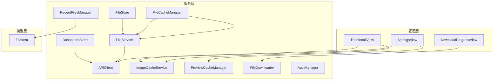
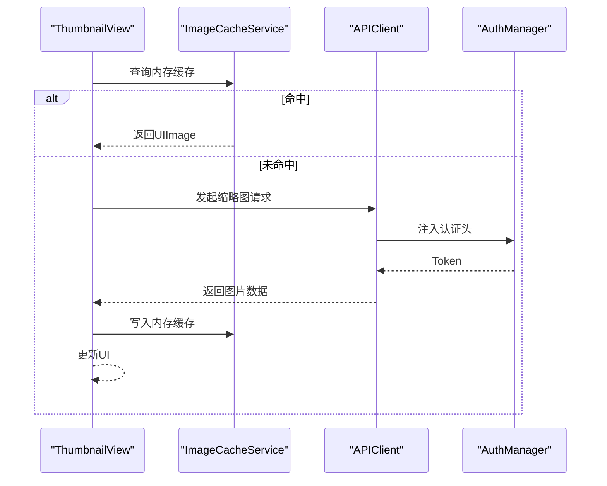
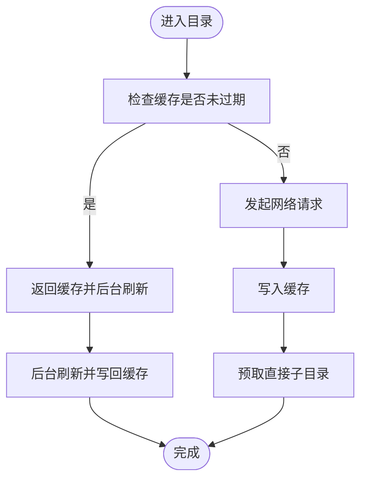
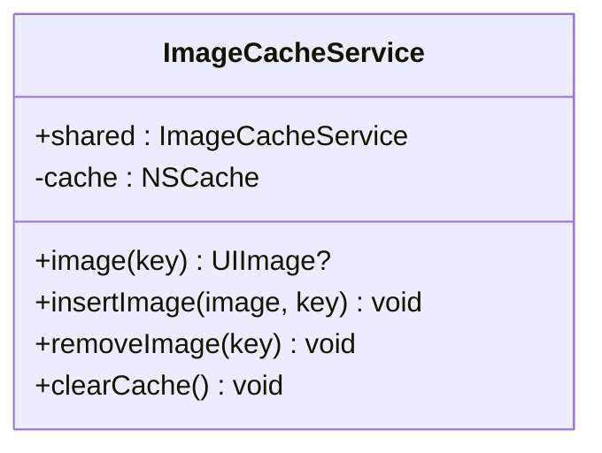
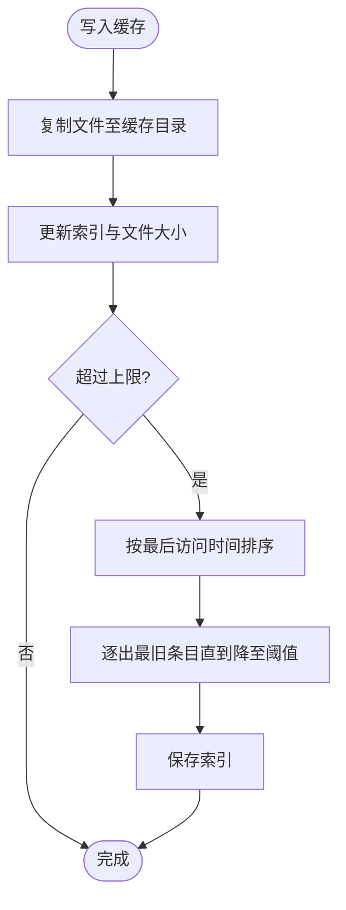
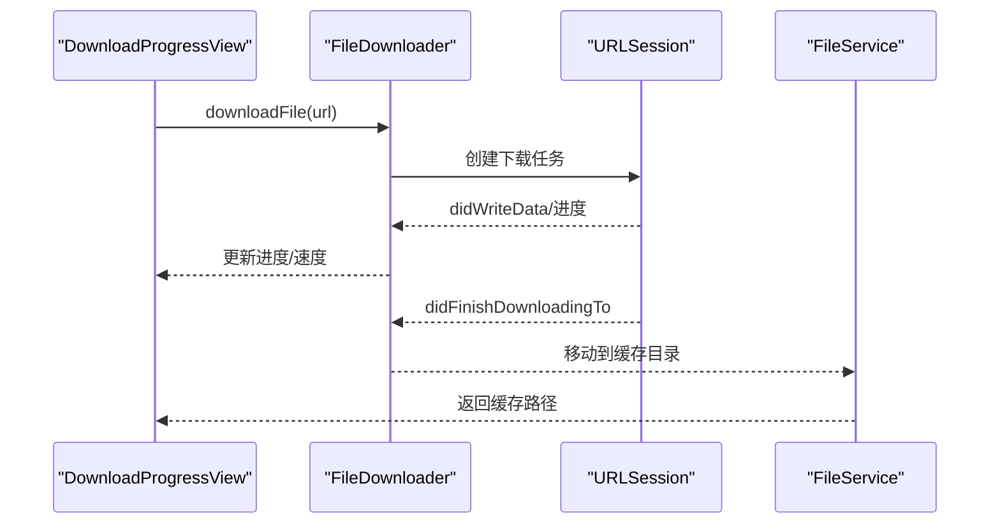
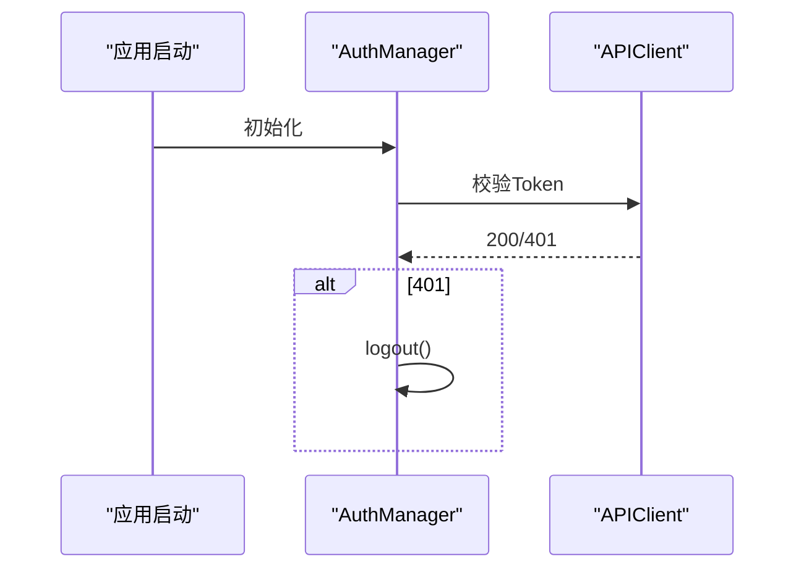
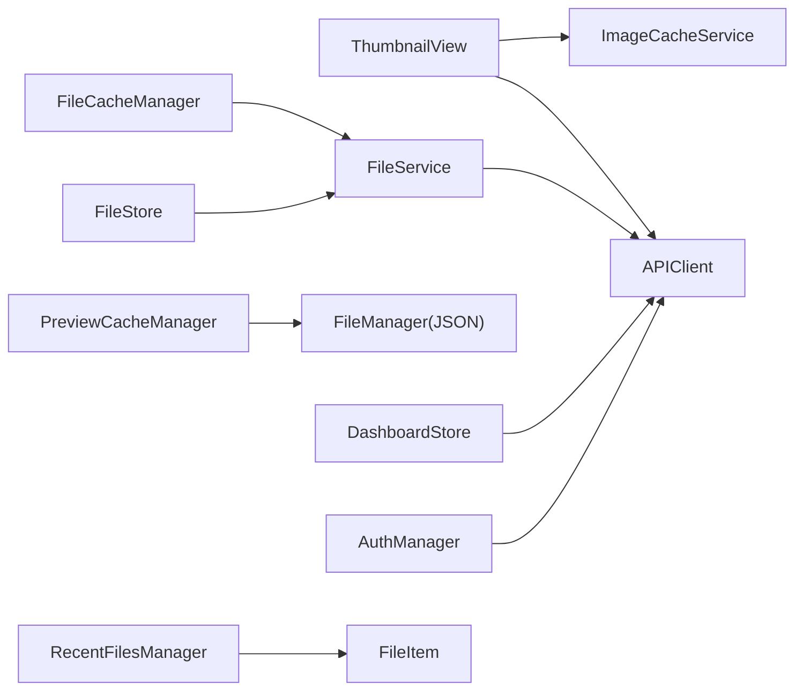

# 移动端性能调优

<cite>
**本文引用的文件**
- [FileCacheManager.swift](file://ios/LonghornApp/Services/FileCacheManager.swift)
- [ImageCacheService.swift](file://ios/LonghornApp/Services/ImageCacheService.swift)
- [PreviewCacheManager.swift](file://ios/LonghornApp/Services/PreviewCacheManager.swift)
- [FileDownloader.swift](file://ios/LonghornApp/Services/FileDownloader.swift)
- [APIClient.swift](file://ios/LonghornApp/Services/APIClient.swift)
- [FileService.swift](file://ios/LonghornApp/Services/FileService.swift)
- [AuthManager.swift](file://ios/LonghornApp/Services/AuthManager.swift)
- [RecentFilesManager.swift](file://ios/LonghornApp/Services/RecentFilesManager.swift)
- [FileItem.swift](file://ios/LonghornApp/Models/FileItem.swift)
- [ThumbnailView.swift](file://ios/LonghornApp/Views/Components/ThumbnailView.swift)
- [DownloadProgressView.swift](file://ios/LonghornApp/Views/Components/DownloadProgressView.swift)
- [DashboardStore.swift](file://ios/LonghornApp/Services/DashboardStore.swift)
- [FileStore.swift](file://ios/LonghornApp/Services/FileStore.swift)
- [SettingsView.swift](file://ios/LonghornApp/Views/Settings/SettingsView.swift)
</cite>

## 目录
1. [引言](#引言)
2. [项目结构](#项目结构)
3. [核心组件](#核心组件)
4. [架构总览](#架构总览)
5. [详细组件分析](#详细组件分析)
6. [依赖关系分析](#依赖关系分析)
7. [性能考量](#性能考量)
8. [故障排查指南](#故障排查指南)
9. [结论](#结论)
10. [附录](#附录)

## 引言
本文件面向 Longhorn 移动端（iOS）的性能调优，聚焦以下主题：
- 内存管理策略：图像缓存服务与文件缓存管理器的实现与优化
- 本地缓存策略、磁盘空间管理与缓存清理机制
- 网络请求优化、后台同步策略与电池续航考虑
- 性能监控指标、内存泄漏检测与崩溃分析方法
- 移动端特有的优化技巧、用户体验改进与设备兼容性处理

## 项目结构
Longhorn iOS 采用分层清晰的服务与视图架构：
- 服务层：网络请求、缓存、认证、文件操作等
- 模型层：数据结构定义（如文件项）
- 视图层：SwiftUI 组件，负责 UI 表现与交互
- 设置与工具：缓存清理入口、下载进度展示等

**图表来源**
- [ThumbnailView.swift](file://ios/LonghornApp/Views/Components/ThumbnailView.swift#L1-L216)
- [DownloadProgressView.swift](file://ios/LonghornApp/Views/Components/DownloadProgressView.swift#L1-L89)
- [SettingsView.swift](file://ios/LonghornApp/Views/Settings/SettingsView.swift#L99-L120)
- [APIClient.swift](file://ios/LonghornApp/Services/APIClient.swift#L1-L326)
- [FileService.swift](file://ios/LonghornApp/Services/FileService.swift#L1-L419)
- [FileCacheManager.swift](file://ios/LonghornApp/Services/FileCacheManager.swift#L1-L185)
- [ImageCacheService.swift](file://ios/LonghornApp/Services/ImageCacheService.swift#L1-L37)
- [PreviewCacheManager.swift](file://ios/LonghornApp/Services/PreviewCacheManager.swift#L1-L219)
- [FileDownloader.swift](file://ios/LonghornApp/Services/FileDownloader.swift#L1-L106)
- [AuthManager.swift](file://ios/LonghornApp/Services/AuthManager.swift#L1-L195)
- [DashboardStore.swift](file://ios/LonghornApp/Services/DashboardStore.swift#L1-L157)
- [FileStore.swift](file://ios/LonghornApp/Services/FileStore.swift#L1-L140)
- [RecentFilesManager.swift](file://ios/LonghornApp/Services/RecentFilesManager.swift#L1-L125)
- [FileItem.swift](file://ios/LonghornApp/Models/FileItem.swift#L1-L288)

**章节来源**
- [APIClient.swift](file://ios/LonghornApp/Services/APIClient.swift#L1-L326)
- [FileService.swift](file://ios/LonghornApp/Services/FileService.swift#L1-L419)
- [FileCacheManager.swift](file://ios/LonghornApp/Services/FileCacheManager.swift#L1-L185)
- [ImageCacheService.swift](file://ios/LonghornApp/Services/ImageCacheService.swift#L1-L37)
- [PreviewCacheManager.swift](file://ios/LonghornApp/Services/PreviewCacheManager.swift#L1-L219)
- [FileDownloader.swift](file://ios/LonghornApp/Services/FileDownloader.swift#L1-L106)
- [AuthManager.swift](file://ios/LonghornApp/Services/AuthManager.swift#L1-L195)
- [DashboardStore.swift](file://ios/LonghornApp/Services/DashboardStore.swift#L1-L157)
- [FileStore.swift](file://ios/LonghornApp/Services/FileStore.swift#L1-L140)
- [RecentFilesManager.swift](file://ios/LonghornApp/Services/RecentFilesManager.swift#L1-L125)
- [FileItem.swift](file://ios/LonghornApp/Models/FileItem.swift#L1-L288)
- [ThumbnailView.swift](file://ios/LonghornApp/Views/Components/ThumbnailView.swift#L1-L216)
- [DownloadProgressView.swift](file://ios/LonghornApp/Views/Components/DownloadProgressView.swift#L1-L89)
- [SettingsView.swift](file://ios/LonghornApp/Views/Settings/SettingsView.swift#L99-L120)

## 核心组件
- 网络层：统一的 APIClient 提供超时控制、认证头注入、批量/单文件下载与上传能力；FileService 对接具体业务接口。
- 缓存层：内存图像缓存（NSCache）、目录列表缓存（SWR 模式）、预览文件缓存（基于磁盘 LRU）。
- 下载层：FileDownloader 封装 URLSession 下载任务，提供进度、速度与取消能力。
- 认证与状态：AuthManager 管理 Token 与会话，DashboardStore/FileStore 提供数据缓存与过期控制。
- 视图层：ThumbnailView 使用内存缓存与网络请求加载缩略图；DownloadProgressView 展示下载进度与速率。

**章节来源**
- [APIClient.swift](file://ios/LonghornApp/Services/APIClient.swift#L38-L326)
- [FileService.swift](file://ios/LonghornApp/Services/FileService.swift#L11-L419)
- [FileCacheManager.swift](file://ios/LonghornApp/Services/FileCacheManager.swift#L29-L185)
- [ImageCacheService.swift](file://ios/LonghornApp/Services/ImageCacheService.swift#L10-L37)
- [PreviewCacheManager.swift](file://ios/LonghornApp/Services/PreviewCacheManager.swift#L10-L219)
- [FileDownloader.swift](file://ios/LonghornApp/Services/FileDownloader.swift#L4-L106)
- [AuthManager.swift](file://ios/LonghornApp/Services/AuthManager.swift#L13-L195)
- [DashboardStore.swift](file://ios/LonghornApp/Services/DashboardStore.swift#L12-L157)
- [FileStore.swift](file://ios/LonghornApp/Services/FileStore.swift#L12-L140)
- [ThumbnailView.swift](file://ios/LonghornApp/Views/Components/ThumbnailView.swift#L10-L216)
- [DownloadProgressView.swift](file://ios/LonghornApp/Views/Components/DownloadProgressView.swift#L10-L89)

## 架构总览
Longhorn iOS 的性能相关架构围绕“缓存优先、异步加载、后台刷新、资源限制”展开，确保在弱网、低电量与有限内存场景下的稳定体验。

**图表来源**
- [ThumbnailView.swift](file://ios/LonghornApp/Views/Components/ThumbnailView.swift#L64-L110)
- [ImageCacheService.swift](file://ios/LonghornApp/Services/ImageCacheService.swift#L21-L27)
- [APIClient.swift](file://ios/LonghornApp/Services/APIClient.swift#L247-L269)
- [AuthManager.swift](file://ios/LonghornApp/Services/AuthManager.swift#L25-L34)

## 详细组件分析

### 文件缓存管理器（SWR 模式）
- 设计要点
  - 目录列表缓存结构包含时间戳与路径，支持“过期（30分钟）”与“陈旧（5分钟）”判断。
  - 使用 actor 保证并发安全；Set 控制重复加载；预取队列减少抖动。
  - 与 FileService 扩展结合，实现“先返回缓存，后台刷新”的 stale-while-revalidate 流程。
- 关键行为
  - 读取：若未过期则返回缓存；否则返回空以触发网络请求。
  - 刷新：后台 Task 在标记加载完成后写回缓存。
  - 预取：对直接子目录进行最多 N 个的预取，避免用户进入时的等待。
- 性能影响
  - 减少首屏延迟与重复网络请求；在弱网下提升可用性。
  - 需注意缓存大小与过期策略，避免占用过多内存或返回过时数据。

**图表来源**
- [FileCacheManager.swift](file://ios/LonghornApp/Services/FileCacheManager.swift#L46-L183)
- [FileService.swift](file://ios/LonghornApp/Services/FileService.swift#L138-L183)

**章节来源**
- [FileCacheManager.swift](file://ios/LonghornApp/Services/FileCacheManager.swift#L29-L133)
- [FileService.swift](file://ios/LonghornApp/Services/FileService.swift#L138-L183)

### 图像缓存服务（内存 NSCache）
- 设计要点
  - 使用 NSCache 限制对象数量与总成本，避免内存峰值过高。
  - 提供查询、插入、移除与清空接口，便于 UI 组件与设置页联动。
- 性能影响
  - 平滑滚动体验，降低重复解码与网络请求。
  - 需配合合适的尺寸与质量策略，避免缓存命中率低或内存压力大。

**图表来源**
- [ImageCacheService.swift](file://ios/LonghornApp/Services/ImageCacheService.swift#L10-L36)

**章节来源**
- [ImageCacheService.swift](file://ios/LonghornApp/Services/ImageCacheService.swift#L10-L37)
- [ThumbnailView.swift](file://ios/LonghornApp/Views/Components/ThumbnailView.swift#L71-L110)

### 预览文件缓存管理器（磁盘 LRU）
- 设计要点
  - 基于沙盒 Caches 目录的磁盘缓存，索引持久化为 JSON，支持孤儿文件清理。
  - 以最大缓存大小（默认 500MB）为上限，按 LRU（最后访问时间）淘汰。
  - 提供按路径、路径集合与目录前缀的清理能力。
- 性能影响
  - 适合大文件预览与离线场景，避免频繁网络下载。
  - 需注意磁盘 IO 与索引写入频率，采用去抖保存策略降低写放大。

**图表来源**
- [PreviewCacheManager.swift](file://ios/LonghornApp/Services/PreviewCacheManager.swift#L115-L166)

**章节来源**
- [PreviewCacheManager.swift](file://ios/LonghornApp/Services/PreviewCacheManager.swift#L10-L219)

### 网络请求与下载优化
- APIClient
  - 统一超时配置（请求 30s，资源 120s），自动注入认证头，集中处理 401 与错误映射。
  - 提供单文件下载、批量下载（ZIP）与上传能力，下载后移动到缓存目录。
- FileDownloader
  - 基于 URLSessionDownloadDelegate，提供进度、总大小与速度计算（每 0.5s 更新一次）。
  - 支持取消与异常回调，UI 侧可即时反馈。
- FileService
  - 对接具体业务接口，封装文件列表、搜索、收藏、回收站、分享等操作。

**图表来源**
- [DownloadProgressView.swift](file://ios/LonghornApp/Views/Components/DownloadProgressView.swift#L10-L89)
- [FileDownloader.swift](file://ios/LonghornApp/Services/FileDownloader.swift#L20-L106)
- [FileService.swift](file://ios/LonghornApp/Services/FileService.swift#L18-L40)

**章节来源**
- [APIClient.swift](file://ios/LonghornApp/Services/APIClient.swift#L38-L326)
- [FileDownloader.swift](file://ios/LonghornApp/Services/FileDownloader.swift#L4-L106)
- [FileService.swift](file://ios/LonghornApp/Services/FileService.swift#L11-L419)

### 认证与后台同步
- AuthManager
  - Token 存储于 Keychain，UserDefaults 持久化用户信息；启动时尝试恢复会话并异步校验。
  - 登出时清理各 Store 缓存并发送登出事件。
- 后台同步
  - FileCacheManager 在返回缓存后，使用 detached Task 后台刷新目录列表，不阻塞 UI。
  - DashboardStore/FileStore 使用 5 分钟有效期缓存，减少重复请求。

**图表来源**
- [AuthManager.swift](file://ios/LonghornApp/Services/AuthManager.swift#L94-L123)
- [APIClient.swift](file://ios/LonghornApp/Services/APIClient.swift#L287-L301)

**章节来源**
- [AuthManager.swift](file://ios/LonghornApp/Services/AuthManager.swift#L13-L195)
- [FileCacheManager.swift](file://ios/LonghornApp/Services/FileCacheManager.swift#L147-L157)
- [DashboardStore.swift](file://ios/LonghornApp/Services/DashboardStore.swift#L36-L61)
- [FileStore.swift](file://ios/LonghornApp/Services/FileStore.swift#L47-L85)

### 缓存清理与设置入口
- 设置页提供一键清理内存缩略图缓存与磁盘预览缓存，清理后通过 Toast 反馈。
- 清理策略
  - 内存：清空 NSCache。
  - 磁盘：删除缓存目录并重建，清空索引。

**章节来源**
- [SettingsView.swift](file://ios/LonghornApp/Views/Settings/SettingsView.swift#L105-L119)
- [ImageCacheService.swift](file://ios/LonghornApp/Services/ImageCacheService.swift#L33-L35)
- [PreviewCacheManager.swift](file://ios/LonghornApp/Services/PreviewCacheManager.swift#L204-L209)

## 依赖关系分析
- 缓存依赖
  - ThumbnailView 依赖 ImageCacheService 与 APIClient。
  - FileCacheManager 依赖 FileService 与 FileService 扩展。
  - PreviewCacheManager 依赖 FileManager 与 JSON 序列化。
- 状态与同步
  - DashboardStore/FileStore 依赖 APIClient 与 FileService。
  - AuthManager 依赖 APIClient 与 Keychain。
- UI 与数据
  - FileItem 为跨模块共享的数据模型，被视图与服务广泛使用。

**图表来源**
- [ThumbnailView.swift](file://ios/LonghornApp/Views/Components/ThumbnailView.swift#L71-L110)
- [ImageCacheService.swift](file://ios/LonghornApp/Services/ImageCacheService.swift#L10-L37)
- [FileCacheManager.swift](file://ios/LonghornApp/Services/FileCacheManager.swift#L137-L183)
- [FileService.swift](file://ios/LonghornApp/Services/FileService.swift#L11-L419)
- [PreviewCacheManager.swift](file://ios/LonghornApp/Services/PreviewCacheManager.swift#L10-L219)
- [DashboardStore.swift](file://ios/LonghornApp/Services/DashboardStore.swift#L12-L157)
- [FileStore.swift](file://ios/LonghornApp/Services/FileStore.swift#L12-L140)
- [AuthManager.swift](file://ios/LonghornApp/Services/AuthManager.swift#L13-L195)
- [RecentFilesManager.swift](file://ios/LonghornApp/Services/RecentFilesManager.swift#L34-L125)
- [FileItem.swift](file://ios/LonghornApp/Models/FileItem.swift#L12-L288)

**章节来源**
- [ThumbnailView.swift](file://ios/LonghornApp/Views/Components/ThumbnailView.swift#L10-L216)
- [FileCacheManager.swift](file://ios/LonghornApp/Services/FileCacheManager.swift#L29-L185)
- [PreviewCacheManager.swift](file://ios/LonghornApp/Services/PreviewCacheManager.swift#L10-L219)
- [FileService.swift](file://ios/LonghornApp/Services/FileService.swift#L11-L419)
- [APIClient.swift](file://ios/LonghornApp/Services/APIClient.swift#L38-L326)
- [AuthManager.swift](file://ios/LonghornApp/Services/AuthManager.swift#L13-L195)
- [DashboardStore.swift](file://ios/LonghornApp/Services/DashboardStore.swift#L12-L157)
- [FileStore.swift](file://ios/LonghornApp/Services/FileStore.swift#L12-L140)
- [RecentFilesManager.swift](file://ios/LonghornApp/Services/RecentFilesManager.swift#L34-L125)
- [FileItem.swift](file://ios/LonghornApp/Models/FileItem.swift#L12-L288)

## 性能考量
- 内存管理
  - 图像缓存：合理设置 countLimit 与 totalCostLimit，避免 OOM；在后台任务中进行缓存清理。
  - 目录缓存：使用 SWR 模式平衡新鲜度与性能；避免缓存无限增长。
- 磁盘空间管理
  - 预览缓存：设定上限并按 LRU 淘汰；定期去抖保存索引，降低写放大。
  - 下载缓存：下载完成后移动至缓存目录，避免临时文件残留。
- 网络优化
  - 超时与重试：根据弱网环境调整超时；对可重试的 5xx/网络错误进行退避重试。
  - 并发控制：避免重复请求（loadingPaths/Set）；预取策略限制并发数量。
- 电池续航
  - 后台刷新：使用 detached Task，避免阻塞主线程；合并频繁更新（去抖）。
  - UI 更新：仅在必要时刷新，避免不必要的视图重建。
- 用户体验
  - 占位图与进度：缩略图加载失败时提供占位图；下载进度与速度实时反馈。
  - 离线可用：缓存过期但未完全失效时仍可返回旧数据，减少白屏。

[本节为通用指导，无需列出具体文件来源]

## 故障排查指南
- 缓存相关
  - 内存缓存异常：检查 NSCache 的 countLimit/totalCostLimit 是否过小或过大；确认 key 生成一致性。
  - 磁盘缓存异常：索引损坏时会清空缓存；检查索引保存与孤儿文件清理逻辑。
  - 预取失败：捕获异常并静默处理，避免影响主流程。
- 网络相关
  - 401 未授权：APIClient 自动触发登出；检查 AuthManager 的 Token 生命周期。
  - 下载中断：FileDownloader 支持取消；确认 UI 侧取消回调与状态同步。
- 认证与会话
  - Token 存储：Keychain 读写失败时需重试或降级；UserDefaults 仅存用户信息。
  - 登出清理：确认各 Store 的 clearAll 调用链完整。
- UI 与数据
  - 缩略图不显示：检查 URL 编码与鉴权头；确认内存缓存命中与网络请求路径。
  - 列表卡顿：检查是否存在大量同步 UI 更新；优化列表渲染与懒加载。

**章节来源**
- [ImageCacheService.swift](file://ios/LonghornApp/Services/ImageCacheService.swift#L15-L19)
- [PreviewCacheManager.swift](file://ios/LonghornApp/Services/PreviewCacheManager.swift#L52-L63)
- [FileCacheManager.swift](file://ios/LonghornApp/Services/FileCacheManager.swift#L112-L121)
- [APIClient.swift](file://ios/LonghornApp/Services/APIClient.swift#L287-L301)
- [FileDownloader.swift](file://ios/LonghornApp/Services/FileDownloader.swift#L37-L42)
- [AuthManager.swift](file://ios/LonghornApp/Services/AuthManager.swift#L72-L89)
- [ThumbnailView.swift](file://ios/LonghornApp/Views/Components/ThumbnailView.swift#L64-L110)

## 结论
Longhorn iOS 的性能调优围绕“缓存优先、异步加载、后台刷新、资源限制”展开。通过内存图像缓存、目录列表 SWR 缓存与磁盘预览缓存的组合，配合合理的网络超时与并发控制，能够在弱网与低电量环境下保持流畅体验。建议持续监控缓存命中率、内存与磁盘使用情况，并根据用户反馈与设备差异进一步优化缓存策略与 UI 渲染效率。

[本节为总结性内容，无需列出具体文件来源]

## 附录
- 性能监控指标建议
  - 缓存命中率（内存/磁盘）
  - 首次加载时延（含缓存未命中）
  - 后台刷新耗时与成功率
  - 下载速度与成功率
  - 内存峰值与 GC 次数
  - 电池消耗（前台/后台）
- 内存泄漏检测与崩溃分析
  - 使用 Instruments Leaks/Allocations；关注 NSCache、URLSession 与 UI 图像对象生命周期。
  - 崩溃日志收集与符号化，定位主线程阻塞与后台任务异常。
- 移动端优化技巧
  - 图片：按需缩放、懒加载、渐进式显示。
  - 列表：复用单元、惰性加载、分页与骨架屏。
  - 网络：连接池复用、GZIP 压缩、CDN 与边缘缓存。
  - 存储：区分内存与磁盘缓存边界，定期维护索引与碎片整理。

[本节为通用指导，无需列出具体文件来源]