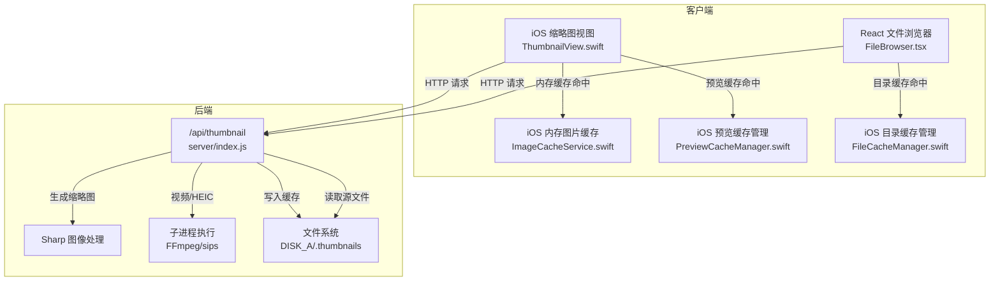
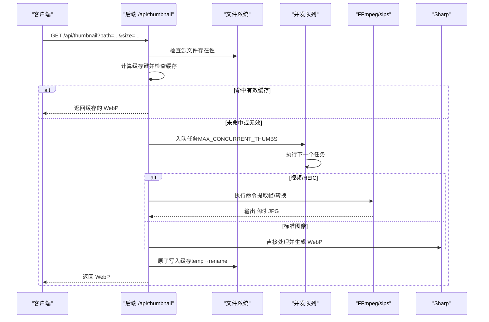
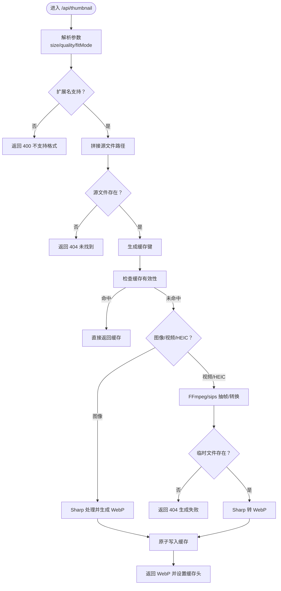
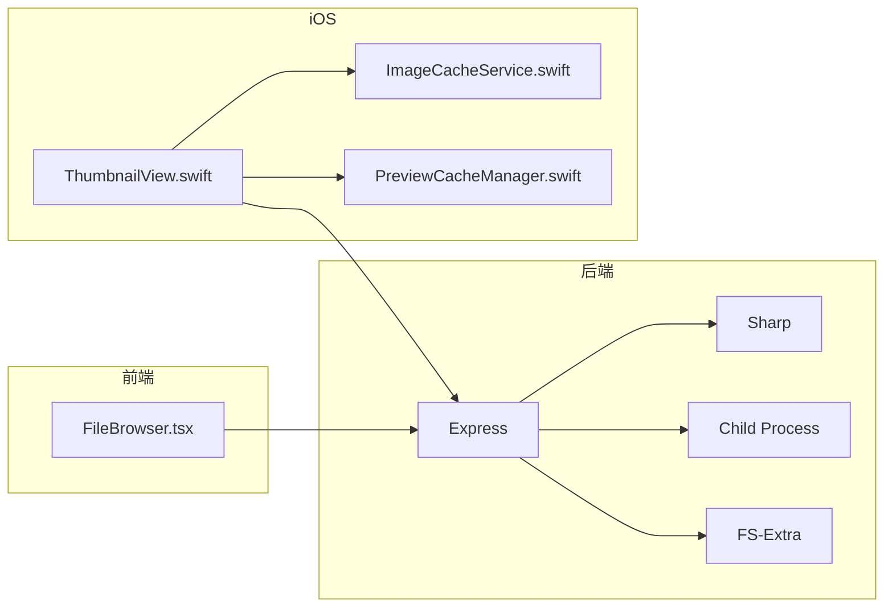

# 缩略图生成系统

<cite>
**本文档引用的文件**
- [server/index.js](file://server/index.js)
- [client/src/components/FileBrowser.tsx](file://client/src/components/FileBrowser.tsx)
- [ios/LonghornApp/Views/Components/ThumbnailView.swift](file://ios/LonghornApp/Views/Components/ThumbnailView.swift)
- [ios/LonghornApp/Services/ImageCacheService.swift](file://ios/LonghornApp/Services/ImageCacheService.swift)
- [ios/LonghornApp/Services/PreviewCacheManager.swift](file://ios/LonghornApp/Services/PreviewCacheManager.swift)
- [ios/LonghornApp/Services/FileCacheManager.swift](file://ios/LonghornApp/Services/FileCacheManager.swift)
- [server/package.json](file://server/package.json)
- [scripts/diagnose-performance.sh](file://scripts/diagnose-performance.sh)
</cite>

## 目录
1. [简介](#简介)
2. [项目结构](#项目结构)
3. [核心组件](#核心组件)
4. [架构总览](#架构总览)
5. [详细组件分析](#详细组件分析)
6. [依赖关系分析](#依赖关系分析)
7. [性能考虑](#性能考虑)
8. [故障排除指南](#故障排除指南)
9. [结论](#结论)

## 简介
本文件面向 Longhorn 缩略图生成系统，提供从后端到前端与 iOS 客户端的完整技术文档。内容涵盖：
- 缩略图生成流程：文件格式支持、尺寸计算、质量控制
- 并发处理队列机制：MAX_CONCURRENT_THUMBS 限制与任务调度策略
- HEIC/HEIF 视频格式处理：FFmpeg 集成与 macOS sips 命令使用
- 缓存策略设计：内存缓存、预览缓存、原子写入与错误处理
- 性能优化建议、资源消耗监控与故障排除方法

## 项目结构
Longhorn 的缩略图系统横跨后端 Node.js 服务、Web 前端 React 组件以及 iOS Swift 组件，形成“请求 → 生成/缓存 → 响应”的闭环。

图表来源
- [server/index.js](file://server/index.js#L480-L679)
- [client/src/components/FileBrowser.tsx](file://client/src/components/FileBrowser.tsx#L770-L825)
- [ios/LonghornApp/Views/Components/ThumbnailView.swift](file://ios/LonghornApp/Views/Components/ThumbnailView.swift#L18-L110)
- [ios/LonghornApp/Services/ImageCacheService.swift](file://ios/LonghornApp/Services/ImageCacheService.swift#L10-L36)
- [ios/LonghornApp/Services/PreviewCacheManager.swift](file://ios/LonghornApp/Services/PreviewCacheManager.swift#L10-L218)

章节来源
- [server/index.js](file://server/index.js#L18-L25)
- [server/package.json](file://server/package.json#L15-L28)

## 核心组件
- 后端缩略图 API：负责参数解析、格式校验、缓存检查、并发队列、FFmpeg/sips 执行、Sharp 转码与原子写入缓存。
- 前端缩略图加载：React 组件通过 /api/thumbnail 获取 WebP 缩略图，并在失败时回退到原图预览。
- iOS 缩略图视图：SwiftUI 组件异步加载缩略图，优先内存缓存，网络请求失败时显示占位图标。
- iOS 缓存体系：内存图片缓存、预览缓存（基于大小限制的 LRU）、目录列表缓存（stale-while-revalidate）。

章节来源
- [server/index.js](file://server/index.js#L480-L679)
- [client/src/components/FileBrowser.tsx](file://client/src/components/FileBrowser.tsx#L770-L825)
- [ios/LonghornApp/Views/Components/ThumbnailView.swift](file://ios/LonghornApp/Views/Components/ThumbnailView.swift#L10-L110)
- [ios/LonghornApp/Services/ImageCacheService.swift](file://ios/LonghornApp/Services/ImageCacheService.swift#L10-L36)
- [ios/LonghornApp/Services/PreviewCacheManager.swift](file://ios/LonghornApp/Services/PreviewCacheManager.swift#L10-L218)
- [ios/LonghornApp/Services/FileCacheManager.swift](file://ios/LonghornApp/Services/FileCacheManager.swift#L29-L133)

## 架构总览
缩略图生成采用“请求即触发”的模式：客户端发起 /api/thumbnail 请求，后端先检查缓存，若未命中则按格式选择处理路径（图像直接用 Sharp，视频/HEIC 使用 FFmpeg 或 macOS sips），生成后转换为 WebP 并进行原子写入缓存，最后返回响应。

图表来源
- [server/index.js](file://server/index.js#L480-L679)

## 详细组件分析

### 后端缩略图 API（/api/thumbnail）
- 参数与尺寸控制
  - 支持 size=200（默认）与 size=preview（较大尺寸、更高质量）两种模式。
  - preview 模式使用“inside”适配以保持宽高比；常规模式使用“cover”裁剪。
  - 质量参数：preview=85，常规=75。
- 文件格式支持
  - 标准图像：.jpg/jpeg/.png/.gif/.webp/.bmp/.tiff（由 Sharp 直接处理）。
  - 视频与 HEIC/HEIF：.mov/.mp4/.m4v/.avi/.mkv/.hevc/.heic/.heif（由 FFmpeg 或 macOS sips 处理）。
- 缓存策略
  - 缓存键：基于路径与尺寸组合，文件名以 .webp 结尾。
  - 缓存有效性：要求缓存文件大小>0 且修改时间晚于源文件。
  - 命中缓存：直接读取并设置长缓存头。
- 并发队列与限流
  - 自定义队列：thumbQueue + thumbProcessing 控制并发。
  - MAX_CONCURRENT_THUMBS=2，适合树莓派/迷你主机等资源受限场景。
  - 任务超时：FFmpeg 执行设置超时，避免阻塞。
- FFmpeg/sips 集成
  - HEIC/HEIF：优先使用 macOS sips（更可靠）。
  - 视频：优先尝试 1 秒处抽帧，失败则回退至开头抽帧；统一应用缩放与裁剪滤镜。
  - 错误日志：将错误与标准错误追加到 ffmpeg_error.log。
- 原子写入与错误处理
  - 生成的 WebP 先写入临时文件，再通过重命名覆盖实现原子写入，避免部分写入。
  - 任何阶段失败均清理临时文件并返回相应错误码。

图表来源
- [server/index.js](file://server/index.js#L480-L679)

章节来源
- [server/index.js](file://server/index.js#L480-L679)

### 前端缩略图加载（React）
- 缩略图 URL 构造：对路径进行编码，size=200，用于快速加载。
- 错误回退：当缩略图加载失败时，自动切换到原图预览地址。
- 预览策略：对于大于 1MB 的图片，使用 size=preview 的高质量缩略图；否则直接渲染原图并提供简单操作控件。

章节来源
- [client/src/components/FileBrowser.tsx](file://client/src/components/FileBrowser.tsx#L770-L825)

### iOS 缩略图视图（SwiftUI）
- 缓存链路：
  1) 内存缓存命中：ImageCacheService（NSCache，限制数量与总成本）。
  2) 网络请求：向 /api/thumbnail 发起请求，附带 Authorization 头。
  3) 成功后写入内存缓存，主线程更新 UI。
- 占位与错误处理：加载失败时显示占位图标，避免空白或崩溃。

章节来源
- [ios/LonghornApp/Views/Components/ThumbnailView.swift](file://ios/LonghornApp/Views/Components/ThumbnailView.swift#L10-L110)
- [ios/LonghornApp/Services/ImageCacheService.swift](file://ios/LonghornApp/Services/ImageCacheService.swift#L10-L36)

### iOS 预览缓存管理（PreviewCacheManager）
- 基于大小限制的 LRU 缓存，无时间过期。
- 原子持久化索引（index.json），定期去孤儿文件。
- 最大缓存 500MB，超过阈值按最久未访问顺序淘汰至 80%。

章节来源
- [ios/LonghornApp/Services/PreviewCacheManager.swift](file://ios/LonghornApp/Services/PreviewCacheManager.swift#L10-L218)

### iOS 目录缓存管理（FileCacheManager）
- stale-while-revalidate 模式：5 分钟 stale、30 分钟 expired。
- 防止重复请求：loadingPaths 去重。
- 预取策略：最多预取 5 个子目录，提升交互流畅度。

章节来源
- [ios/LonghornApp/Services/FileCacheManager.swift](file://ios/LonghornApp/Services/FileCacheManager.swift#L29-L133)

## 依赖关系分析
- 后端依赖
  - sharp：图像处理与 WebP 编码。
  - child_process：执行 FFmpeg/sips。
  - express：HTTP 服务与路由。
  - fs-extra：文件系统操作（含移动覆盖）。
- 前端与 iOS
  - 前端通过 /api/thumbnail 获取缩略图。
  - iOS 通过 /api/thumbnail 获取缩略图，并结合内存与预览缓存。

图表来源
- [server/package.json](file://server/package.json#L15-L28)
- [server/index.js](file://server/index.js#L27-L27)
- [client/src/components/FileBrowser.tsx](file://client/src/components/FileBrowser.tsx#L770-L825)
- [ios/LonghornApp/Views/Components/ThumbnailView.swift](file://ios/LonghornApp/Views/Components/ThumbnailView.swift#L18-L110)

章节来源
- [server/package.json](file://server/package.json#L15-L28)

## 性能考虑
- 并发与限流
  - MAX_CONCURRENT_THUMBS=2，避免 CPU/IO 过载，适合低功耗设备。
  - 队列采用 Promise 包装，确保异常可捕获与日志记录。
- 缓存策略
  - 后端：按源文件 mtime 与缓存文件大小双重校验，避免陈旧缓存。
  - 原子写入：temp→rename，降低竞态风险与部分写入概率。
  - 前端/iOS：内存缓存与预览缓存减少重复请求与解码开销。
- 尺寸与质量
  - preview 模式提高质量与尺寸，兼顾加载速度与观感。
  - 无放大（withoutEnlargement）避免模糊。
- FFmpeg/sips 优化
  - HEIC 优先 sips，macOS 上更稳定。
  - 视频抽帧优先 1 秒处，失败回退至开头，保证成功率。
- 监控与诊断
  - 使用诊断脚本收集 PM2、数据库、系统资源与网络状态，辅助定位性能瓶颈。

章节来源
- [server/index.js](file://server/index.js#L555-L577)
- [server/index.js](file://server/index.js#L521-L551)
- [server/index.js](file://server/index.js#L660-L668)
- [scripts/diagnose-performance.sh](file://scripts/diagnose-performance.sh#L1-L122)

## 故障排除指南
- 常见错误与定位
  - 400 不支持格式：确认扩展名在支持列表内。
  - 404 未找到：检查源文件是否存在，DISK_A 路径是否正确。
  - 404 生成失败：查看 ffmpeg_error.log，确认 FFmpeg 路径与可用性。
  - 缓存读取失败：删除损坏缓存文件后重试。
- FFmpeg/sips 问题排查
  - 自动探测路径失败：手动设置可执行文件路径或安装 FFmpeg。
  - 超时：适当增大超时时间或检查源文件体积。
- 缓存一致性
  - 若修改源文件但缓存未更新：删除对应缓存文件或等待 mtime 更新。
- iOS 缓存问题
  - 预览缓存过大：确认最大缓存阈值与清理策略生效。
  - 内存缓存溢出：调整 NSCache 的数量与总成本限制。

章节来源
- [server/index.js](file://server/index.js#L506-L508)
- [server/index.js](file://server/index.js#L512-L515)
- [server/index.js](file://server/index.js#L617-L620)
- [server/index.js](file://server/index.js#L547-L550)
- [ios/LonghornApp/Services/PreviewCacheManager.swift](file://ios/LonghornApp/Services/PreviewCacheManager.swift#L147-L166)

## 结论
Longhorn 缩略图系统通过清晰的前后端分工与多层缓存策略，在保证加载速度的同时兼顾了质量与稳定性。后端采用严格的缓存校验与原子写入，前端与 iOS 则通过内存与预览缓存进一步优化用户体验。针对 HEIC/HEIF 与视频格式，系统分别采用 sips 与 FFmpeg 的最佳实践，配合并发队列与超时控制，有效避免了资源争用与长时间卡顿。建议在部署时关注 FFmpeg 路径、DISK_A 权限与缓存目录空间，并结合诊断脚本持续监控系统健康状况。