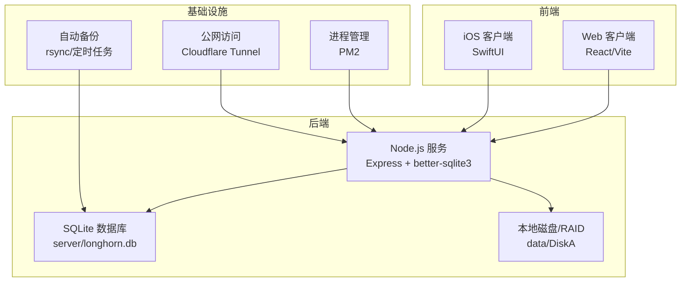
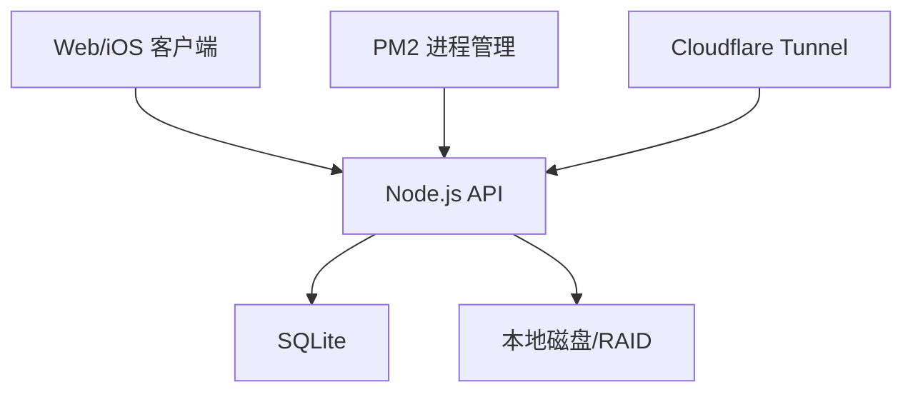
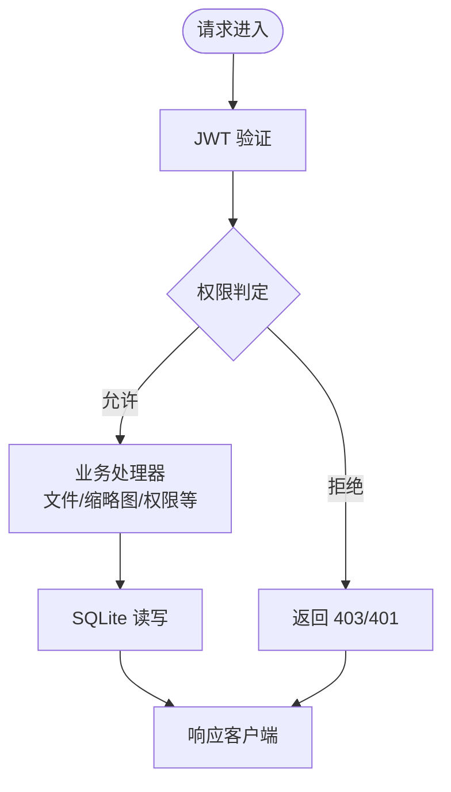
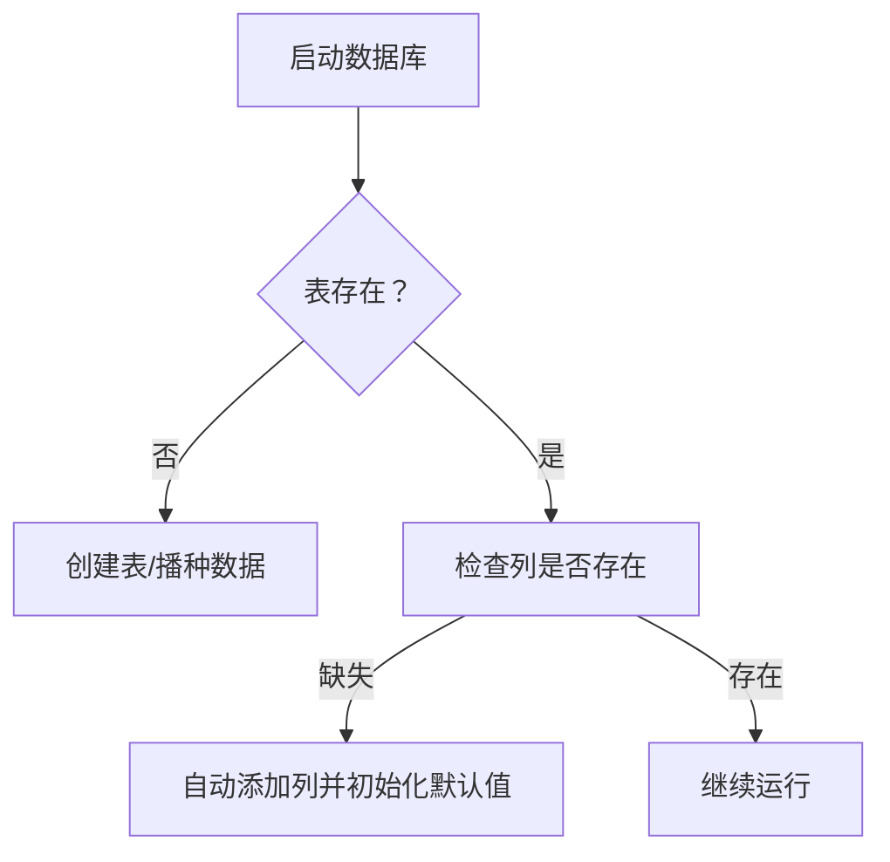
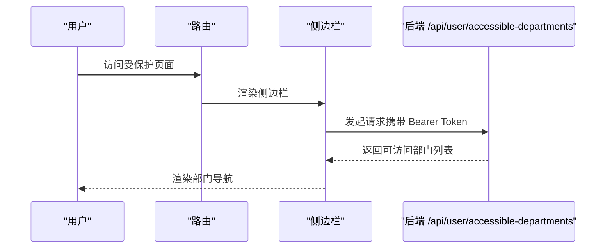
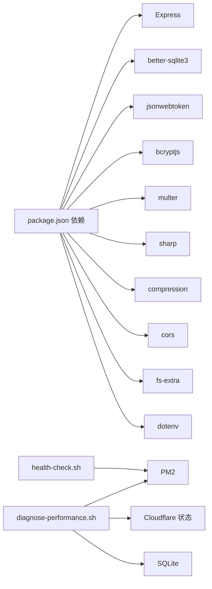
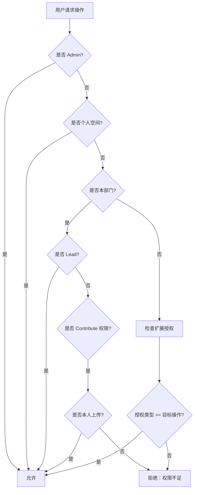

# 故障排除

<cite>
**本文引用的文件**   
- [Longhorn.md](file://Longhorn.md)
- [OPS.md](file://docs/OPS.md)
- [SYSTEM_CONTEXT.md](file://docs/SYSTEM_CONTEXT.md)
- [CONTRIBUTE_PERMISSION_IMPLEMENTATION.md](file://docs/CONTRIBUTE_PERMISSION_IMPLEMENTATION.md)
- [diagnose-performance.sh](file://scripts/diagnose-performance.sh)
- [health-check.sh](file://scripts/health-check.sh)
- [db-validate.sh](file://scripts/db-validate.sh)
- [check_db.js](file://scripts/check_db.js)
- [index.js](file://server/index.js)
- [package.json](file://server/package.json)
- [fix_missing_files.js](file://server/fix_missing_files.js)
- [fix_remote_db.js](file://server/fix_remote_db.js)
- [App.tsx](file://client/src/App.tsx)
- [LonghornApp.swift](file://ios/LonghornApp/LonghornApp.swift)
</cite>

## 目录
1. [简介](#简介)
2. [项目结构](#项目结构)
3. [核心组件](#核心组件)
4. [架构总览](#架构总览)
5. [详细组件分析](#详细组件分析)
6. [依赖关系分析](#依赖关系分析)
7. [性能考量](#性能考量)
8. [故障排除指南](#故障排除指南)
9. [结论](#结论)
10. [附录](#附录)

## 简介
本指南面向 Longhorn 项目的运维与开发人员，聚焦于系统启动失败、连接超时、权限错误、性能问题等常见故障的诊断与处置。内容覆盖日志收集、错误监控与告警、数据库问题、网络连接与文件系统异常的解决方案，并提供紧急恢复程序、数据修复工具与系统回滚策略，以及内存泄漏检测与资源耗尽处理方法。

## 项目结构
Longhorn 由三部分组成：Web 客户端、iOS 客户端与共享后端服务。后端基于 Node.js + SQLite，提供文件 I/O、权限验证（JWT）、数据库管理与缩略图生成等能力；前端负责文件浏览、权限分配与系统设置；移动端提供移动办公与个人空间管理。

**图表来源**
- [Longhorn.md](file://Longhorn.md#L47-L66)
- [SYSTEM_CONTEXT.md](file://docs/SYSTEM_CONTEXT.md#L7-L48)

**章节来源**
- [Longhorn.md](file://Longhorn.md#L1-L71)
- [SYSTEM_CONTEXT.md](file://docs/SYSTEM_CONTEXT.md#L1-L95)

## 核心组件
- 后端服务（Node.js + Express）
  - 负责认证（JWT）、权限校验、文件浏览、缩略图生成、数据库交互与静态资源服务。
  - 关键模块：认证中间件、权限判定函数、缩略图队列与缓存、健康检查端点。
- 数据库（SQLite）
  - 使用 better-sqlite3 进行高效读写；包含用户、部门、权限、星标、词汇表等核心表。
- 前端（React/Vite）
  - 路由保护、侧边栏部门列表、个人空间与部门空间导航、用户统计展示。
- 移动端（SwiftUI）
  - 应用入口与语言环境初始化，配合后端 API 实现文件浏览与预览。

**章节来源**
- [index.js](file://server/index.js#L1-L120)
- [package.json](file://server/package.json#L1-L30)
- [App.tsx](file://client/src/App.tsx#L1-L120)
- [LonghornApp.swift](file://ios/LonghornApp/LonghornApp.swift#L1-L26)

## 架构总览
后端通过 HTTP/REST 与 WebSocket（iOS）与前后端通信；数据库与文件系统位于同一服务器；通过 PM2 管理进程，Cloudflare Tunnel 提供公网访问；自动部署哨兵脚本实现代码同步与重启。

**图表来源**
- [Longhorn.md](file://Longhorn.md#L47-L66)
- [OPS.md](file://docs/OPS.md#L100-L111)

**章节来源**
- [OPS.md](file://docs/OPS.md#L100-L111)

## 详细组件分析

### 后端服务（Node.js + Express）
- 认证与权限
  - JWT 验证中间件：校验令牌有效性并刷新用户最新角色/部门信息。
  - 权限判定函数：支持 Admin 全权、Lead 部门全权、Member 部门贡献（仅可删除自己上传的文件）、扩展授权（Read/Contribute/Full）。
- 缩略图与缓存
  - 基于 sharp 与 ffmpeg 的缩略图生成，带并发队列与缓存（WebP）。
  - 预览静态资源服务，启用压缩与范围请求。
- 健康检查与调试
  - /api/status 健康端点；/api/debug/info 用于诊断远端服务器状态。
- 数据库初始化与自动播种
  - 初始化核心表与词汇表自动播种逻辑。

**图表来源**
- [index.js](file://server/index.js#L268-L353)
- [index.js](file://server/index.js#L477-L480)
- [index.js](file://server/index.js#L483-L679)

**章节来源**
- [index.js](file://server/index.js#L268-L353)
- [index.js](file://server/index.js#L477-L480)
- [index.js](file://server/index.js#L483-L679)

### 数据库（SQLite）
- 结构与完整性
  - 包含 departments、users、permissions、stars、vocabulary 等表；支持列缺失自动修复与初始化播种。
- 常用诊断脚本
  - db-validate.sh：验证并自动修复 users 表的 last_login 列。
  - check_db.js：打开数据库并打印 departments 与 admin 用户信息，便于快速确认数据库可用性。
- 数据修复工具
  - fix_remote_db.js：清理旧部门名称、修正部门命名、输出当前部门列表以便核对。
  - fix_missing_files.js：扫描磁盘并将缺失的文件记录回写到 file_stats，适合文件系统与数据库不同步后的修复。

**图表来源**
- [index.js](file://server/index.js#L33-L78)
- [db-validate.sh](file://scripts/db-validate.sh#L10-L47)
- [check_db.js](file://scripts/check_db.js#L1-L20)
- [fix_remote_db.js](file://server/fix_remote_db.js#L1-L39)
- [fix_missing_files.js](file://server/fix_missing_files.js#L1-L67)

**章节来源**
- [index.js](file://server/index.js#L33-L78)
- [db-validate.sh](file://scripts/db-validate.sh#L1-L52)
- [check_db.js](file://scripts/check_db.js#L1-L20)
- [fix_remote_db.js](file://server/fix_remote_db.js#L1-L39)
- [fix_missing_files.js](file://server/fix_missing_files.js#L1-L67)

### 前端（React/Vite）
- 路由与权限
  - 登录路由保护，侧边栏根据用户可访问部门动态加载；个人空间与部门空间路由区分。
- 用户统计与国际化
  - 获取用户统计信息并在顶部展示上传数量、存储用量与分享数量；支持多语言切换。
- 错误处理
  - 获取部门列表与用户统计接口失败时设置默认值，避免前端崩溃。

**图表来源**
- [App.tsx](file://client/src/App.tsx#L134-L150)
- [index.js](file://server/index.js#L716-L756)

**章节来源**
- [App.tsx](file://client/src/App.tsx#L134-L150)
- [index.js](file://server/index.js#L716-L756)

### 移动端（SwiftUI）
- 应用入口
  - 初始化认证与语言管理对象，设置深色主题偏好。
- 与后端交互
  - 通过 HTTP/REST 与后端通信，实现文件浏览与预览（缩略图由后端生成与缓存）。

**章节来源**
- [LonghornApp.swift](file://ios/LonghornApp/LonghornApp.swift#L1-L26)

## 依赖关系分析
- 后端依赖
  - Express、better-sqlite3、jsonwebtoken、bcryptjs、multer、sharp、compression、cors、fs-extra、dotenv。
- 健康检查与运维
  - health-check.sh：检查端口、数据库完整性、自动启动服务。
  - diagnose-performance.sh：收集 PM2、数据库、网络、系统资源与 Cloudflare 状态，生成性能诊断报告。
- 部署与自启动
  - OPS.md 提供 SSH 访问、Cloudflare Tunnel 状态检查、PM2 自启动与开机自启动配置。

**图表来源**
- [package.json](file://server/package.json#L15-L28)
- [health-check.sh](file://scripts/health-check.sh#L1-L115)
- [diagnose-performance.sh](file://scripts/diagnose-performance.sh#L1-L122)
- [OPS.md](file://docs/OPS.md#L122-L158)

**章节来源**
- [package.json](file://server/package.json#L1-L30)
- [health-check.sh](file://scripts/health-check.sh#L1-L115)
- [diagnose-performance.sh](file://scripts/diagnose-performance.sh#L1-L122)
- [OPS.md](file://docs/OPS.md#L122-L158)

## 性能考量
- 缩略图生成与并发控制
  - 使用并发队列限制同时处理的缩略图数量，避免 CPU/IO 过载。
- 压缩与缓存
  - 启用 gzip 压缩与静态资源缓存（ETag/Last-Modified/Range Requests），降低带宽与延迟。
- 系统资源监控
  - 通过 diagnose-performance.sh 收集内存、磁盘、Node/npm 版本、Cloudflare 状态与本地 API 响应时间，辅助定位性能瓶颈。

**章节来源**
- [index.js](file://server/index.js#L418-L427)
- [index.js](file://server/index.js#L556-L577)
- [diagnose-performance.sh](file://scripts/diagnose-performance.sh#L92-L107)

## 故障排除指南

### 一、启动失败
- 现象
  - 端口 4000/3001 未监听；服务未启动。
- 诊断步骤
  - 使用健康检查脚本检查端口与数据库完整性，必要时自动启动服务。
  - 查看 PM2 日志：pm2 logs longhorn、pm2 logs longhorn-watcher。
  - 确认 Node/npm 版本与依赖安装。
- 处置建议
  - 若数据库列缺失，db-validate.sh 会自动添加；若仍失败，使用 check_db.js 手动验证数据库可用性。
  - 如需手动部署，按 OPS.md 执行部署脚本。

**章节来源**
- [health-check.sh](file://scripts/health-check.sh#L1-L115)
- [db-validate.sh](file://scripts/db-validate.sh#L1-L52)
- [check_db.js](file://scripts/check_db.js#L1-L20)
- [OPS.md](file://docs/OPS.md#L23-L41)

### 二、连接超时
- 现象
  - 前端或移动端无法访问后端 API；公网不可达。
- 诊断步骤
  - 检查 Cloudflare Tunnel 服务是否运行（launchctl list | grep cloudflare）。
  - 本地连通性测试：curl -s http://localhost:4000/api/status。
  - 使用 diagnose-performance.sh 收集网络与隧道状态。
- 处置建议
  - 重启 cloudflared 服务；确认防火墙放行端口；如为内网访问，确认 SSH 代理链路。

**章节来源**
- [OPS.md](file://docs/OPS.md#L112-L118)
- [diagnose-performance.sh](file://scripts/diagnose-performance.sh#L84-L89)

### 三、权限错误
- 现象
  - 403/401；“权限不足”；无法删除他人文件。
- 诊断步骤
  - 使用 /api/debug/info 检查当前用户、路径解析与权限判定结果。
  - 核对 hasPermission 逻辑：Admin 全权；Lead 部门全权；Member 部门贡献（仅可删除自己上传的文件）；扩展授权（Read/Contribute/Full）。
  - 检查 file_stats 的 uploader_id 是否为空（历史文件或新建文件夹未记录）。
- 处置建议
  - 为历史文件补全 uploader_id；确保新建文件夹也记录到 file_stats。
  - 对跨部门授权场景，确认授权类型与目标目录归属。

**图表来源**
- [index.js](file://server/index.js#L298-L353)
- [CONTRIBUTE_PERMISSION_IMPLEMENTATION.md](file://docs/CONTRIBUTE_PERMISSION_IMPLEMENTATION.md#L92-L133)

**章节来源**
- [index.js](file://server/index.js#L298-L353)
- [CONTRIBUTE_PERMISSION_IMPLEMENTATION.md](file://docs/CONTRIBUTE_PERMISSION_IMPLEMENTATION.md#L92-L133)

### 四、性能问题
- 现象
  - 缩略图生成缓慢、API 响应慢、CPU/内存占用高。
- 诊断步骤
  - 使用 diagnose-performance.sh 收集 PM2、数据库、图片文件分布、Cloudflare 状态、系统资源与本地 API 响应时间。
  - 检查缩略图并发队列与缓存命中率。
- 处置建议
  - 降低并发（MAX_CONCURRENT_THUMBS）；优化磁盘布局与缓存目录；升级硬件或减少并发视频处理。

**章节来源**
- [diagnose-performance.sh](file://scripts/diagnose-performance.sh#L1-L122)
- [index.js](file://server/index.js#L556-L577)

### 五、数据库问题
- 现象
  - 表结构缺失列、部门名称不一致、文件统计与实际不一致。
- 诊断步骤
  - db-validate.sh：自动修复 users 表 last_login 列。
  - fix_remote_db.js：清理旧部门名称、修正命名、输出当前部门列表核对。
  - fix_missing_files.js：扫描磁盘并回填 file_stats。
  - check_db.js：打开数据库并打印 departments 与 admin 用户信息。
- 处置建议
  - 定期执行 db-validate.sh；修复完成后再次核对部门列表；对历史文件执行补录脚本。

**章节来源**
- [db-validate.sh](file://scripts/db-validate.sh#L1-L52)
- [fix_remote_db.js](file://server/fix_remote_db.js#L1-L39)
- [fix_missing_files.js](file://server/fix_missing_files.js#L1-L67)
- [check_db.js](file://scripts/check_db.js#L1-L20)

### 六、网络连接与文件系统异常
- 现象
  - 无法访问公网、Cloudflare 通道异常、磁盘不可读/容量不足。
- 诊断步骤
  - 检查 cloudflared 进程与日志；使用 diagnose-performance.sh 的网络测试项。
  - 确认 DISK_A 路径与挂载状态；检查磁盘使用率与 inode 情况。
- 处置建议
  - 重启 cloudflared 服务；修复磁盘挂载；清理缓存与日志释放空间。

**章节来源**
- [OPS.md](file://docs/OPS.md#L112-L118)
- [diagnose-performance.sh](file://scripts/diagnose-performance.sh#L74-L100)

### 七、日志收集、错误监控与告警
- 日志收集
  - pm2 logs longhorn、pm2 logs longhorn-watcher；后端全局 HTTP 日志中间件输出请求信息。
- 错误监控
  - 健康检查脚本输出颜色化状态；diagnose-performance.sh 输出诊断报告。
- 告警处理
  - 建议结合 PM2 自动重启与 Cloudflare Tunnel 状态报警；对数据库异常与网络中断建立阈值告警。

**章节来源**
- [health-check.sh](file://scripts/health-check.sh#L1-L115)
- [diagnose-performance.sh](file://scripts/diagnose-performance.sh#L1-L122)
- [index.js](file://server/index.js#L424-L427)

### 八、紧急恢复程序
- 步骤
  - 停止服务：pm2 stop longhorn；备份数据库：cp server/longhorn.db server/longhorn_backup_$(date +%Y%m%d).db。
  - 修复数据库：执行 db-validate.sh 与 fix_remote_db.js；必要时使用 check_db.js 核对。
  - 重新启动：pm2 start；或按 OPS.md 手动部署。
- 回滚策略
  - 使用备份数据库替换当前数据库；或回退到上一个稳定版本的代码并重新部署。

**章节来源**
- [OPS.md](file://docs/OPS.md#L79-L87)
- [db-validate.sh](file://scripts/db-validate.sh#L1-L52)
- [fix_remote_db.js](file://server/fix_remote_db.js#L1-L39)

### 九、数据修复工具
- fix_remote_db.js：清理旧部门名称、修正命名、输出当前部门列表核对。
- fix_missing_files.js：扫描磁盘并将缺失文件记录回写到 file_stats。
- check_db.js：打开数据库并打印 departments 与 admin 用户信息。

**章节来源**
- [fix_remote_db.js](file://server/fix_remote_db.js#L1-L39)
- [fix_missing_files.js](file://server/fix_missing_files.js#L1-L67)
- [check_db.js](file://scripts/check_db.js#L1-L20)

### 十、内存泄漏检测与资源耗尽处理
- 检测
  - 使用 diagnose-performance.sh 收集内存使用与磁盘占用；观察 PM2 进程内存曲线。
- 处置
  - 限制缩略图并发；清理缓存目录；重启 PM2；必要时扩容硬件。

**章节来源**
- [diagnose-performance.sh](file://scripts/diagnose-performance.sh#L92-L100)
- [index.js](file://server/index.js#L556-L577)

## 结论
本指南提供了从启动、连接、权限、性能到数据库与网络异常的系统化排障流程，并配套脚本与工具以实现自动化诊断与修复。建议在日常运维中定期执行健康检查与性能诊断，建立完善的日志与告警机制，确保 Longhorn 在生产环境的稳定性与可靠性。

## 附录
- 快速参考
  - 健康检查：./health-check.sh
  - 性能诊断：./diagnose-performance.sh
  - 数据库验证：./db-validate.sh
  - 数据库检查：node scripts/check_db.js
  - 部署与自启动：参阅 OPS.md

**章节来源**
- [health-check.sh](file://scripts/health-check.sh#L1-L115)
- [diagnose-performance.sh](file://scripts/diagnose-performance.sh#L1-L122)
- [db-validate.sh](file://scripts/db-validate.sh#L1-L52)
- [check_db.js](file://scripts/check_db.js#L1-L20)
- [OPS.md](file://docs/OPS.md#L1-L171)