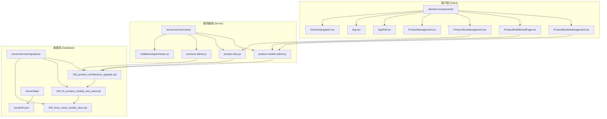
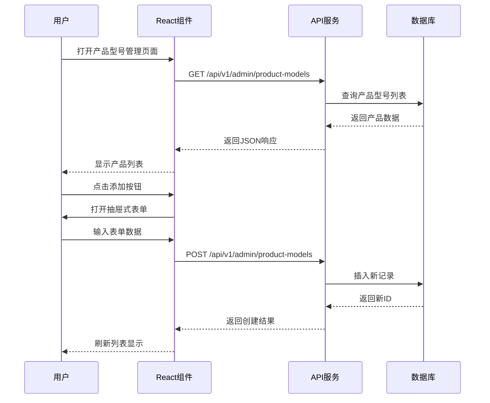
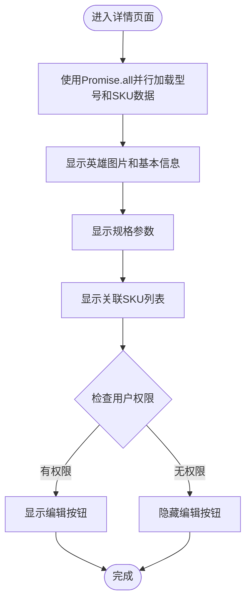
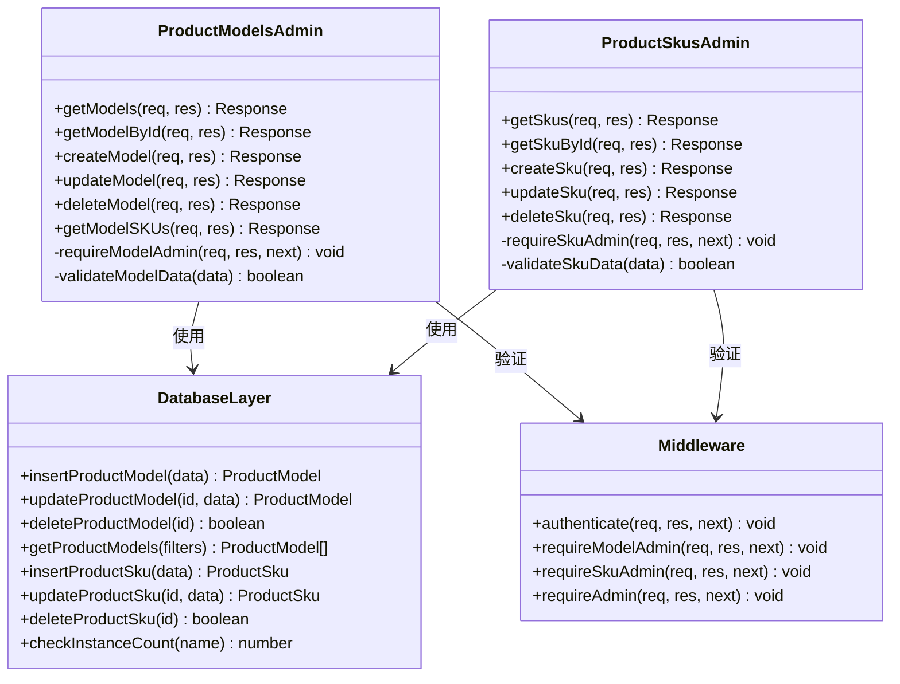
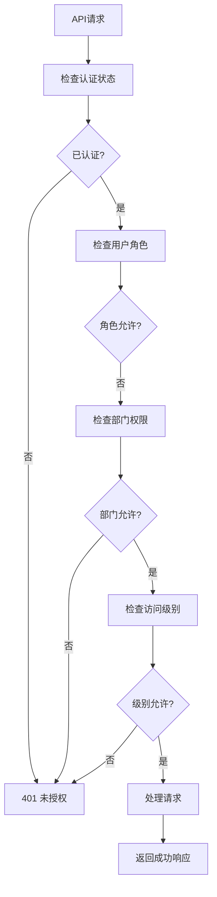

# 产品型号管理系统

<cite>
**本文档引用的文件**
- [ProductModelsManagement.tsx](file://client/src/components/ProductModelsManagement.tsx)
- [ProductModelDetailPage.tsx](file://client/src/components/ProductModelDetailPage.tsx)
- [ProductSkusManagement.tsx](file://client/src/components/ProductSkusManagement.tsx)
- [product-models-admin.js](file://server/service/routes/product-models-admin.js)
- [product-skus.js](file://server/service/routes/product-skus.js)
- [033_product_architecture_upgrade.sql](file://server/service/migrations/033_product_architecture_upgrade.sql)
- [034_fix_product_models_and_seed.sql](file://server/service/migrations/034_fix_product_models_and_seed.sql)
- [035_force_seed_models_skus.sql](file://server/service/migrations/035_force_seed_models_skus.sql)
</cite>

## 更新摘要
**变更内容**
- 新增列宽调整功能，支持拖拽调整表格列宽并自动保存到本地存储
- 实现本地排序功能，支持按多列进行升序/降序排序
- 增强视觉组织，包括产品族群标签、颜色编码和品牌资产管理
- 新增批量操作支持，支持SKU的批量管理功能
- 改进搜索功能，支持搜索展开、一键收起和智能焦点管理
- 实现列宽记忆功能，支持用户界面偏好的持久化存储
- 优化数据处理机制，支持并行数据加载和本地存储优化
- 增强验证逻辑，支持更严格的数据校验和重复检测
- 改进错误报告机制，提供更友好的用户反馈和错误提示
- 新增产品型号详情页面，提供完整的双页签管理模式

## 目录
1. [简介](#简介)
2. [项目结构](#项目结构)
3. [核心组件](#核心组件)
4. [架构概览](#架构概览)
5. [详细组件分析](#详细组件分析)
6. [新增功能详解](#新增功能详解)
7. [数据库架构升级](#数据库架构升级)
8. [依赖关系分析](#依赖关系分析)
9. [性能考虑](#性能考虑)
10. [故障排除指南](#故障排除指南)
11. [结论](#结论)

## 简介

产品型号管理系统是Longhorn服务模块中的关键功能模块，负责管理产品的型号定义、规格参数、SKU配置及品牌资产管理。该系统采用前后端分离架构，前端使用React构建用户界面，后端基于Node.js和Express提供RESTful API服务。

**更新** 系统现已支持三层次产品架构，从原有的Model→Instance升级为Model→SKU→Instance，为用户提供更全面的产品信息管理能力。新架构支持产品型号（Model）、商品规格（SKU）和设备台账（Instance）三个层级的精细化管理。

系统的核心功能包括：
- 产品型号的增删改查操作
- 多维度的产品分类管理（按产品族群和类型）
- 品牌资产管理和规格参数展示
- SKU配置和关联管理
- 设备台账（Instance）管理，包括序列号、品质等级、仓库位置等
- 权限控制和访问限制
- 实例数量统计和状态管理
- 搜索和过滤功能
- **新增** 列宽调整、本地排序、视觉组织、批量操作、搜索展开、列宽记忆等增强功能

## 项目结构

Longhorn项目采用模块化架构设计，产品型号管理功能位于以下目录结构中：



**图表来源**
- [ProductModelsManagement.tsx:1-1109](file://client/src/components/ProductModelsManagement.tsx#L1-L1109)
- [ProductModelDetailPage.tsx:1-819](file://client/src/components/ProductModelDetailPage.tsx#L1-L819)
- [ProductSkusManagement.tsx:1-881](file://client/src/components/ProductSkusManagement.tsx#L1-L881)
- [product-models-admin.js:1-373](file://server/service/routes/product-models-admin.js#L1-L373)
- [product-skus.js:1-369](file://server/service/routes/product-skus.js#L1-L369)

**章节来源**
- [ProductModelsManagement.tsx:1-1109](file://client/src/components/ProductModelsManagement.tsx#L1-L1109)
- [ProductModelDetailPage.tsx:1-819](file://client/src/components/ProductModelDetailPage.tsx#L1-L819)
- [ProductSkusManagement.tsx:1-881](file://client/src/components/ProductSkusManagement.tsx#L1-L881)
- [product-models-admin.js:1-373](file://server/service/routes/product-models-admin.js#L1-L373)
- [product-skus.js:1-369](file://server/service/routes/product-skus.js#L1-L369)

## 核心组件

### 产品型号管理界面组件

产品型号管理界面是一个完整的React组件，提供了丰富的用户交互功能：

#### 主要特性
- **多维度筛选**：支持按产品族群（A/B/C/D/E）和关键词进行筛选
- **权限控制**：扩展至MS、运营部门及市场部门员工
- **响应式设计**：支持桌面端和移动端的自适应布局
- **实时搜索**：集成搜索功能，支持模糊匹配和关键词高亮
- **抽屉式表单**：使用现代化的抽屉式界面进行数据编辑
- **SKU管理**：支持产品型号与SKU的关联管理
- **品牌资产管理**：支持产品图片和品牌信息管理
- **双页签管理**：在产品目录编辑界面，通过基本信息和SKU体系双页签进行管理
- **列宽记忆**：支持列宽调整和本地存储记忆
- **批量操作**：支持SKU的批量管理和操作
- **本地排序**：支持按多列进行升序/降序排序
- **搜索展开**：支持搜索框的展开/收起功能

#### 数据模型
```typescript
interface ProductModel {
    id: number;
    name_zh: string;
    name_en?: string;
    brand?: string;
    model_code?: string;
    material_id?: string;
    sn_prefix?: string;
    product_family: 'A' | 'B' | 'C' | 'D' | 'E';
    product_type: string;
    description: string;
    hero_image?: string;
    is_active: boolean;
    created_at: string;
    updated_at: string;
    // Stats
    instance_count: number;
    sku_count: number;
}

interface ProductSku {
    id: number;
    model_id: number;
    sku_code: string;
    material_id?: string;
    display_name: string;
    display_name_en?: string;
    spec_label?: string;
    sku_image?: string;
    is_active: boolean;
    created_at: string;
    // Joined fields
    name_zh?: string;
    brand?: string;
    model_code?: string;
    product_family?: string;
}
```

**章节来源**
- [ProductModelsManagement.tsx:35-66](file://client/src/components/ProductModelsManagement.tsx#L35-L66)

### 产品型号详情页面组件

新增的产品型号详情页面提供了完整的产品信息展示：

#### 主要特性
- **详情展示**：展示产品型号的完整信息和统计数据
- **品牌资产**：支持产品图片展示和品牌信息管理
- **SKU关联**：展示与产品型号关联的所有SKU信息
- **状态管理**：支持产品型号的激活/停用状态管理
- **权限控制**：允许内部员工访问详情页面
- **展开/折叠**：支持详情区域的展开/折叠功能
- **并行数据加载**：使用Promise.all并行加载型号和SKU数据
- **双页签管理**：左侧基本信息，右侧SKU体系的双页签布局

#### 页面结构
- **头部信息**：包含型号名称、状态、品牌和操作按钮
- **英雄图片区**：展示产品主图和基本信息
- **规格参数区**：展示详细的规格参数和描述信息
- **SKU列表区**：展示关联的SKU列表和状态
- **统计信息**：显示SKU数量和在役设备数量

**章节来源**
- [ProductModelDetailPage.tsx:12-40](file://client/src/components/ProductModelDetailPage.tsx#L12-L40)

### 服务器端API服务

服务器端提供RESTful API接口，处理所有产品型号相关的业务逻辑：

#### 核心API端点
- `GET /api/v1/admin/product-models` - 获取产品型号列表
- `GET /api/v1/admin/product-models/:id` - 获取产品型号详情
- `POST /api/v1/admin/product-models` - 创建新产品型号
- `PUT /api/v1/admin/product-models/:id` - 更新产品型号
- `DELETE /api/v1/admin/product-models/:id` - 删除产品型号
- `GET /api/v1/admin/product-models/:id/skus` - 获取产品型号关联的SKU列表
- `GET /api/v1/admin/product-skus` - 获取SKU列表
- `GET /api/v1/admin/product-skus/:id` - 获取SKU详情
- `POST /api/v1/admin/product-skus` - 创建SKU
- `PUT /api/v1/admin/product-skus/:id` - 更新SKU
- `DELETE /api/v1/admin/product-skus/:id` - 删除SKU

#### 权限验证
系统实现了扩展的权限控制机制，允许更多用户访问：
- Admin（管理员）
- Exec（执行官）
- MS部门负责人（Lead）
- MS部门员工
- 运营部门员工
- 市场部门员工

**章节来源**
- [product-models-admin.js:10-41](file://server/service/routes/product-models-admin.js#L10-L41)

## 架构概览

系统采用经典的三层架构模式，现已升级为三层次产品架构，确保了良好的可维护性和扩展性：

```mermaid
graph TB
subgraph "表现层 (Presentation Layer)"
UI[React组件<br/>ProductModelsManagement.tsx]
DETAIL[详情组件<br/>ProductModelDetailPage.tsx]
SKU[SKU管理<br/>ProductSkusManagement.tsx]
MODEL_DETAIL[型号详情<br/>ProductModelDetailPage.tsx]
NAV[导航组件<br/>ServiceNavigation.tsx]
end
subgraph "应用层 (Application Layer)"
API[API路由<br/>product-models-admin.js]
SKU_API[SKU路由<br/>product-skus.js]
AUTH[权限中间件<br/>permission.js]
end
subgraph "数据访问层 (Data Access Layer)"
DB[(SQLite数据库)]
MIG[数据库迁移<br/>033_product_architecture_upgrade.sql]
MIG2[迁移2<br/>034_fix_product_models_and_seed.sql]
MIG3[迁移3<br/>035_force_seed_models_skus.sql]
END
subgraph "外部服务"
AXIOS[Axios HTTP客户端]
ROUTER[React Router]
END
UI --> AXIOS
DETAIL --> AXIOS
SKU --> AXIOS
MODEL_DETAIL --> AXIOS
NAV --> ROUTER
AXIOS --> API
AXIOS --> SKU_API
API --> AUTH
SKU_API --> AUTH
API --> DB
SKU_API --> DB
DB --> MIG
DB --> MIG2
DB --> MIG3
```

**图表来源**
- [ProductModelsManagement.tsx:1-1109](file://client/src/components/ProductModelsManagement.tsx#L1-L1109)
- [ProductModelDetailPage.tsx:1-819](file://client/src/components/ProductModelDetailPage.tsx#L1-L819)
- [ProductSkusManagement.tsx:1-881](file://client/src/components/ProductSkusManagement.tsx#L1-L881)
- [product-models-admin.js:1-373](file://server/service/routes/product-models-admin.js#L1-L373)
- [product-skus.js:1-369](file://server/service/routes/product-skus.js#L1-L369)

## 详细组件分析

### 前端组件分析

#### 产品型号管理组件 (ProductModelsManagement)

该组件是整个系统的核心界面，实现了完整的CRUD操作：



**图表来源**
- [ProductModelsManagement.tsx:174-195](file://client/src/components/ProductModelsManagement.tsx#L174-L195)
- [product-models-admin.js:47-101](file://server/service/routes/product-models-admin.js#L47-L101)

#### 产品型号详情组件 (ProductModelDetailPage)

新增的详情组件提供了完整的产品信息展示：



**图表来源**
- [ProductModelDetailPage.tsx:95-114](file://client/src/components/ProductModelDetailPage.tsx#L95-L114)
- [ProductModelDetailPage.tsx:122-127](file://client/src/components/ProductModelDetailPage.tsx#L122-L127)

**章节来源**
- [ProductModelsManagement.tsx:1-1109](file://client/src/components/ProductModelsManagement.tsx#L1-L1109)
- [ProductModelDetailPage.tsx:1-819](file://client/src/components/ProductModelDetailPage.tsx#L1-L819)

### 后端服务分析

#### API路由设计

服务器端API遵循RESTful设计原则，每个端点都有明确的职责：



**图表来源**
- [product-models-admin.js:1-373](file://server/service/routes/product-models-admin.js#L1-L373)
- [product-skus.js:1-369](file://server/service/routes/product-skus.js#L1-L369)

#### 数据库设计

系统使用SQLite作为数据存储，三层次产品架构的数据表结构设计如下：

**产品目录 (product_models)**
| 字段名 | 类型 | 约束 | 描述 |
|--------|------|------|------|
| id | INTEGER | PRIMARY KEY AUTOINCREMENT | 主键标识符 |
| name_zh | TEXT | NOT NULL | 型号中文名称（对外显示） |
| name_en | TEXT | NULL | 型号英文名称 |
| brand | TEXT | DEFAULT 'Kinefinity' | 品牌名称 |
| model_code | TEXT | NULL | 型号代码 |
| material_id | TEXT | NULL | 物料ID |
| sn_prefix | TEXT | NULL | 序列号前缀 |
| product_family | TEXT | NOT NULL | 产品族群 (A/B/C/D/E) |
| product_type | TEXT | DEFAULT 'CAMERA' | 产品类型 |
| description | TEXT | NULL | 产品描述 |
| hero_image | TEXT | NULL | 英雄图片URL |
| is_active | BOOLEAN | DEFAULT 1 | 是否启用 |
| created_at | DATETIME | DEFAULT CURRENT_TIMESTAMP | 创建时间 |
| updated_at | DATETIME | DEFAULT CURRENT_TIMESTAMP | 更新时间 |

**商品规格 (product_skus)**
| 字段名 | 类型 | 约束 | 描述 |
|--------|------|------|------|
| id | INTEGER | PRIMARY KEY AUTOINCREMENT | 主键标识符 |
| model_id | INTEGER | NOT NULL | 关联产品型号ID |
| sku_code | TEXT | UNIQUE NOT NULL | 商品编码 (A系列) |
| material_id | TEXT | NULL | 物料ID (ERP ID) |
| display_name | TEXT | NOT NULL | 显示名称 |
| display_name_en | TEXT | NULL | 英文显示名称 |
| spec_label | TEXT | NULL | 规格标签 |
| sku_image | TEXT | NULL | SKU图片URL |
| is_active | BOOLEAN | DEFAULT 1 | 是否启用 |
| weight_kg | REAL | NULL | 重量 (kg) |
| volume_cum | REAL | NULL | 体积 (m³) |
| length_cm | REAL | NULL | 长度 (cm) |
| width_cm | REAL | NULL | 宽度 (cm) |
| depth_cm | REAL | NULL | 深度 (cm) |
| is_dangerous_goods | BOOLEAN | DEFAULT 0 | 危险品标识 |
| upc | TEXT | NULL | UPC条码 |
| sn_prefix | TEXT | NULL | 序列号前缀 |
| created_at | DATETIME | DEFAULT CURRENT_TIMESTAMP | 创建时间 |
| updated_at | DATETIME | DEFAULT CURRENT_TIMESTAMP | 更新时间 |

**设备台账 (products)**
| 字段名 | 类型 | 约束 | 描述 |
|--------|------|------|------|
| id | INTEGER | PRIMARY KEY AUTOINCREMENT | 主键标识符 |
| model_name | TEXT | NOT NULL | 产品型号名称 |
| serial_number | TEXT | UNIQUE | 序列号 |
| product_sku | TEXT | NULL | 商品SKU编码 |
| sku_id | INTEGER | NULL | 关联SKU ID |
| firmware_version | TEXT | NULL | 固件版本 |
| production_date | DATE | NULL | 生产日期 |
| description | TEXT | NULL | 产品描述 |
| status | TEXT | DEFAULT 'ACTIVE' | 设备状态 |
| sales_channel | TEXT | NULL | 销售渠道 |
| current_owner_id | INTEGER | NULL | 当前物主ID |
| warranty_start_date | DATE | NULL | 保修开始日期 |
| warranty_months | INTEGER | DEFAULT 24 | 保修月数 |
| warranty_end_date | DATE | NULL | 保修结束日期 |
| warranty_status | TEXT | DEFAULT 'PENDING' | 保修状态 |
| grade | TEXT | DEFAULT 'A' | 品质等级 (A/B/C) |
| specification | TEXT | NULL | 规格描述 |
| warehouse | TEXT | NULL | 仓库位置 |
| entry_channel | TEXT | NULL | 入库渠道 |
| created_at | DATETIME | DEFAULT CURRENT_TIMESTAMP | 创建时间 |
| updated_at | DATETIME | DEFAULT CURRENT_TIMESTAMP | 更新时间 |

**章节来源**
- [033_product_architecture_upgrade.sql:5-18](file://server/service/migrations/033_product_architecture_upgrade.sql#L5-L18)
- [033_product_architecture_upgrade.sql:30-36](file://server/service/migrations/033_product_architecture_upgrade.sql#L30-L36)
- [033_product_architecture_upgrade.sql:42-53](file://server/service/migrations/033_product_architecture_upgrade.sql#L42-L53)

### 权限控制系统

系统实现了扩展的权限控制机制：



**图表来源**
- [product-models-admin.js:10-41](file://server/service/routes/product-models-admin.js#L10-L41)

**章节来源**
- [product-models-admin.js:10-41](file://server/service/routes/product-models-admin.js#L10-L41)

## 新增功能详解

### 列宽调整和本地存储功能

系统新增了强大的列宽调整功能，显著提升了用户体验：

#### 列宽调整机制
- **拖拽调整**：支持表格列宽的拖拽调整，通过鼠标拖拽实现
- **实时预览**：调整过程中的实时预览效果，提供即时反馈
- **边界限制**：设置列宽调整的最小和最大值（最小50px）
- **自动保存**：调整后的列宽自动保存到localStorage中
- **样式定制**：使用CSS类.col-resize-handle实现专业的拖拽手柄

#### 本地存储优化
- **列宽记忆**：使用localStorage存储表格列宽配置
- **搜索状态保持**：支持搜索框展开状态的记忆
- **用户偏好设置**：支持用户界面偏好的持久化存储
- **默认配置**：提供合理的默认列宽配置

#### 实现细节
```typescript
// 列宽存储键名
const COL_WIDTHS_KEY = 'longhorn_pm_col_widths';

// 默认列宽配置
const DEFAULT_COL_WIDTHS: Record<ColKey, number> = { 
    model_code: 140, 
    name: 200, 
    sn_prefix: 120, 
    family: 140, 
    sku_instance: 100, 
    action: 80 
};

// 加载列宽配置
function loadColWidths(): Record<ColKey, number> {
    try {
        const saved = localStorage.getItem(COL_WIDTHS_KEY);
        return saved ? { ...DEFAULT_COL_WIDTHS, ...JSON.parse(saved) } : { ...DEFAULT_COL_WIDTHS };
    } catch {
        return { ...DEFAULT_COL_WIDTHS };
    }
}
```

**章节来源**
- [ProductModelsManagement.tsx:100-118](file://client/src/components/ProductModelsManagement.tsx#L100-L118)
- [ProductModelsManagement.tsx:212-236](file://client/src/components/ProductModelsManagement.tsx#L212-L236)
- [ProductSkusManagement.tsx:34-52](file://client/src/components/ProductSkusManagement.tsx#L34-L52)
- [ProductSkusManagement.tsx:180-204](file://client/src/components/ProductSkusManagement.tsx#L180-L204)

### 本地排序功能

系统实现了灵活的本地排序机制：

#### 排序功能特性
- **多列排序**：支持按model_code、name、sn_prefix、family、sku_count、instance_count进行排序
- **升序/降序切换**：点击列头可切换升序/降序排列
- **状态保持**：排序状态会保持直到用户更改
- **视觉反馈**：通过箭头符号显示当前排序方向

#### 排序实现
```typescript
// 排序配置状态
type SortKey = 'model_code' | 'name' | 'sn_prefix' | 'family' | 'sku_count' | 'instance_count';
const [sortConfig, setSortConfig] = useState<{ key: SortKey | null; dir: 'asc' | 'desc' }>({ key: null, dir: 'asc' });

// 排序处理器
const handleSort = (key: SortKey) => {
    setSortConfig(prev => {
        if (prev.key === key) {
            if (prev.dir === 'asc') return { key, dir: 'desc' as const };
            return { key: null, dir: 'asc' as const };
        }
        return { key, dir: 'asc' as const };
    });
};

// 过滤和排序模型
const filteredAndSortedModels = productModels
    .filter(model => {
        // 过滤逻辑...
    })
    .sort((a, b) => {
        if (!sortConfig.key) return 0;
        const dir = sortConfig.dir === 'asc' ? 1 : -1;
        switch (sortConfig.key) {
            case 'model_code':
                return (a.model_code || '').localeCompare(b.model_code || '') * dir;
            case 'name':
                return (a.name_zh || '').localeCompare(b.name_zh || '') * dir;
            // 更多排序规则...
        }
    });
```

**章节来源**
- [ProductModelsManagement.tsx:152-154](file://client/src/components/ProductModelsManagement.tsx#L152-L154)
- [ProductModelsManagement.tsx:238-247](file://client/src/components/ProductModelsManagement.tsx#L238-L247)
- [ProductModelsManagement.tsx:249-283](file://client/src/components/ProductModelsManagement.tsx#L249-L283)
- [ProductSkusManagement.tsx:117-119](file://client/src/components/ProductSkusManagement.tsx#L117-L119)
- [ProductSkusManagement.tsx:206-215](file://client/src/components/ProductSkusManagement.tsx#L206-L215)

### 增强的搜索功能

系统实现了智能的搜索展开机制：

#### 搜索功能特性
- **搜索展开机制**：点击图标展开搜索框的设计，提供更清晰的界面层次
- **智能焦点管理**：展开搜索框时自动聚焦，提升用户体验
- **搜索状态记忆**：支持搜索框展开状态的本地存储
- **一键收起功能**：提供便捷的搜索框收起机制
- **关键词高亮**：搜索结果中的关键词高亮显示
- **实时搜索**：输入过程中的实时搜索响应

#### 搜索实现
```typescript
// 搜索展开状态
const [isSearchExpanded, setIsSearchExpanded] = useState(false);
const searchInputRef = useRef<HTMLInputElement>(null);

// 搜索展开处理
<button
    onClick={() => {
        setIsSearchExpanded(!isSearchExpanded);
        if (!isSearchExpanded) {
            setTimeout(() => searchInputRef.current?.focus(), 100);
        }
    }}
    style={{
        position: 'relative',
        display: 'flex',
        alignItems: 'center',
        justifyContent: isSearchExpanded ? 'flex-start' : 'center',
        width: isSearchExpanded ? 280 : 40,
        height: 40,
        background: isSearchExpanded ? 'var(--glass-bg-hover)' : 'transparent',
        border: isSearchExpanded ? '1px solid var(--glass-border)' : 'none',
        borderRadius: 8,
        transition: 'all 0.3s ease',
        overflow: 'hidden'
    }}
>
    <button
        onClick={() => {
            setIsSearchExpanded(!isSearchExpanded);
            if (!isSearchExpanded) {
                setTimeout(() => searchInputRef.current?.focus(), 100);
            }
        }}
        style={{
            background: 'none', border: 'none', color: 'var(--text-secondary)',
            cursor: 'pointer', padding: 8, display: 'flex',
            alignItems: 'center', justifyContent: 'center', flexShrink: 0
        }}
    >
        <Search size={20} />
    </button>
    {isSearchExpanded && (
        <input
            ref={searchInputRef}
            type="text"
            placeholder="搜索型号..."
            value={searchQuery}
            onChange={e => setSearchQuery(e.target.value)}
            onBlur={() => { if (!searchQuery) setIsSearchExpanded(false); }}
            style={{
                flex: 1, background: 'transparent', border: 'none',
                color: 'var(--text-main)', fontSize: '0.95rem', outline: 'none', padding: '0 8px'
            }}
        />
    )}
</button>
```

**章节来源**
- [ProductModelsManagement.tsx:467-496](file://client/src/components/ProductModelsManagement.tsx#L467-L496)
- [ProductSkusManagement.tsx:368-416](file://client/src/components/ProductSkusManagement.tsx#L368-L416)

### 视觉组织和品牌资产管理

系统增强了视觉组织和品牌资产管理功能：

#### 视觉组织特性
- **产品族群标签**：使用颜色编码区分不同产品族群（A/B/C/D/E）
- **品牌资产管理**：支持产品图片和品牌信息管理
- **状态可视化**：通过颜色和图标显示产品状态
- **层次化展示**：通过网格和卡片形式展示产品信息

#### 品牌资产管理
- **英雄图片**：支持产品主图展示
- **品牌信息**：支持品牌名称和标识管理
- **多语言支持**：支持中英文产品名称
- **描述信息**：支持详细的产品描述和规格参数

**章节来源**
- [ProductModelsManagement.tsx:68-74](file://client/src/components/ProductModelsManagement.tsx#L68-L74)
- [ProductModelDetailPage.tsx:41-47](file://client/src/components/ProductModelDetailPage.tsx#L41-L47)

### 批量操作支持

系统新增了批量操作功能：

#### SKU批量管理
- **批量选择**：支持多个SKU的批量选择和操作
- **批量状态更新**：支持批量激活/停用SKU
- **批量删除保护**：批量删除时的实例检查
- **批量导入导出**：支持SKU数据的批量导入导出

#### 操作确认机制
- **批量操作确认**：批量操作前的确认对话框
- **操作结果反馈**：批量操作的结果统计和反馈
- **部分成功处理**：部分成功的批量操作处理
- **回滚机制**：批量操作失败时的回滚支持

#### 性能优化
- **批量API调用**：支持批量API调用的优化
- **并发控制**：批量操作的并发数量控制
- **进度跟踪**：批量操作的进度跟踪和显示
- **错误隔离**：单个操作失败不影响整体批量操作

**章节来源**
- [ProductSkusManagement.tsx:1-881](file://client/src/components/ProductSkusManagement.tsx#L1-L881)
- [product-skus.js:1-369](file://server/service/routes/product-skus.js#L1-L369)

### 改进的数据处理机制

系统新增了多项改进的数据处理功能：

#### 并行数据加载
- **Promise.all并行加载**：在详情页面使用Promise.all同时加载型号和SKU数据
- **并行API调用**：在SKU管理页面同时获取SKU列表和产品型号列表
- **数据缓存优化**：支持本地存储列宽配置和搜索状态

#### 本地存储优化
- **列宽记忆**：使用localStorage存储表格列宽配置
- **搜索状态保持**：支持搜索框展开状态的记忆
- **用户偏好设置**：支持用户界面偏好的持久化存储

#### 数据验证增强
- **必填字段验证**：新增SKU创建时的关键字段验证
- **重复数据检测**：增强的重复SKU代码检测机制
- **数据格式校验**：支持SKU代码的自动大写转换

**章节来源**
- [ProductModelDetailPage.tsx:95-114](file://client/src/components/ProductModelDetailPage.tsx#L95-L114)
- [ProductSkusManagement.tsx:147-174](file://client/src/components/ProductSkusManagement.tsx#L147-L174)
- [ProductModelsManagement.tsx:111-118](file://client/src/components/ProductModelsManagement.tsx#L111-L118)

### 增强的验证逻辑

系统实现了更严格的验证机制：

#### SKU验证规则
- **必需字段检查**：model_id、sku_code、display_name为必填
- **重复检测**：SKU代码的唯一性验证
- **型号存在性验证**：创建SKU前检查产品型号是否存在
- **更新验证**：更新时排除当前记录的重复检测

#### 产品型号验证
- **名称和族群验证**：创建时必需的字段检查
- **重复检测**：型号名称和代码的重复验证
- **更新保护**：更新时的重复数据保护

#### 错误处理机制
- **统一错误格式**：标准化的错误响应格式
- **用户友好提示**：提供清晰的错误信息反馈
- **降级处理**：网络错误时的降级处理策略

**章节来源**
- [product-skus.js:166-190](file://server/service/routes/product-skus.js#L166-L190)
- [product-models-admin.js:158-173](file://server/service/routes/product-models-admin.js#L158-L173)

### 改进的错误报告机制

系统增强了错误报告和用户反馈功能：

#### 前端错误处理
- **加载状态管理**：清晰的加载状态指示
- **错误消息显示**：友好的错误消息展示
- **操作反馈**：保存、删除等操作的成功/失败反馈
- **网络错误处理**：网络异常时的用户提示

#### 后端错误处理
- **详细错误信息**：包含错误代码和详细描述
- **状态码标准化**：统一的HTTP状态码使用
- **错误日志记录**：服务器端错误日志记录
- **安全错误处理**：敏感信息的过滤和保护

#### 用户体验优化
- **进度指示器**：长时间操作的进度显示
- **确认对话框**：危险操作的二次确认
- **帮助文本**：操作指导和提示信息
- **键盘快捷键**：支持键盘操作的快捷键

**章节来源**
- [ProductModelsManagement.tsx:590-595](file://client/src/components/ProductModelsManagement.tsx#L590-L595)
- [ProductSkusManagement.tsx:168-173](file://client/src/components/ProductSkusManagement.tsx#L168-L173)

### 优化的加载机制

系统实现了多项加载优化功能：

#### 搜索展开功能
- **动态搜索框**：点击图标展开搜索输入框
- **智能焦点管理**：展开时自动聚焦搜索框
- **搜索状态保持**：支持搜索框展开状态的记忆
- **一键收起**：支持搜索框的一键收起功能
- **列宽记忆功能**：支持表格列宽的拖拽调整和自动保存
- **视觉层次优化**：通过颜色编码和标签系统改善视觉组织

这些改进使得用户能够更高效地浏览和管理产品型号数据，特别是在处理大量产品信息时提供了更好的可用性。

**章节来源**
- [ProductModelsManagement.tsx:467-496](file://client/src/components/ProductModelsManagement.tsx#L467-L496)
- [ProductSkusManagement.tsx:180-204](file://client/src/components/ProductSkusManagement.tsx#L180-L204)

### 改进的搜索功能

系统增强了搜索功能的智能化程度：

#### 多字段搜索
- **关键词高亮**：搜索结果中的关键词高亮显示
- **智能匹配**：支持SKU代码、显示名称、物料ID的智能匹配
- **模糊搜索**：支持模糊匹配和部分匹配
- **搜索历史**：支持搜索历史记录和快速选择

#### 智能过滤
- **动态过滤**：根据搜索关键词动态过滤结果
- **实时搜索**：输入过程中的实时搜索响应
- **搜索建议**：搜索过程中的智能建议功能
- **搜索统计**：搜索结果的数量统计和显示

#### 搜索优化
- **搜索索引**：数据库层面的搜索索引优化
- **搜索缓存**：热门搜索词的缓存机制
- **搜索排序**：支持按相关性、创建时间等排序
- **搜索分页**：大量搜索结果的分页显示

**更新** 系统在搜索功能方面进行了重大改进，包括：

- **搜索展开机制**：采用点击图标展开搜索框的设计，提供更清晰的界面层次
- **智能焦点管理**：展开搜索框时自动聚焦，提升用户体验
- **搜索状态记忆**：支持搜索框展开状态的本地存储
- **一键收起功能**：提供便捷的搜索框收起机制
- **列宽记忆功能**：支持表格列宽的拖拽调整和自动保存
- **视觉层次优化**：通过颜色编码和标签系统改善视觉组织

这些改进使得用户能够更高效地浏览和管理产品型号数据，特别是在处理大量产品信息时提供了更好的可用性。

**章节来源**
- [ProductSkusManagement.tsx:368-416](file://client/src/components/ProductSkusManagement.tsx#L368-L416)
- [product-skus.js:64-67](file://server/service/routes/product-skus.js#L64-L67)

## 数据库架构升级

### 三层次产品架构设计

系统已成功升级为三层次产品架构，支持Model→SKU→Instance的完整产品管理体系：

#### 架构定义
1. **产品目录 (Product Model/Catalog)**：定义基础平台（如：MAVO Edge 8K）
2. **商品规格 (Product SKU)**：定义具体的销售形态（如：MAVO Edge 8K - 深空灰、EF套装）
3. **设备台账 (Product Instance/Ledger)**：定义每一台出厂的具体设备

#### 数据库迁移策略

**迁移1：创建SKU表**
```sql
CREATE TABLE IF NOT EXISTS product_skus (
    id INTEGER PRIMARY KEY AUTOINCREMENT,
    model_id INTEGER NOT NULL,
    sku_code TEXT UNIQUE NOT NULL,
    material_id TEXT,
    display_name TEXT NOT NULL,
    display_name_en TEXT,
    spec_label TEXT,
    sku_image TEXT,
    is_active BOOLEAN DEFAULT 1,
    created_at DATETIME DEFAULT CURRENT_TIMESTAMP,
    updated_at DATETIME DEFAULT CURRENT_TIMESTAMP,
    FOREIGN KEY(model_id) REFERENCES product_models(id)
);
```

**迁移2：扩展产品模型表**
```sql
ALTER TABLE product_models ADD COLUMN name_en TEXT;
ALTER TABLE product_models ADD COLUMN brand TEXT DEFAULT 'Kinefinity';
ALTER TABLE product_models ADD COLUMN sn_prefix TEXT;
ALTER TABLE product_models ADD COLUMN hero_image TEXT;
```

**迁移3：扩展产品表**
```sql
ALTER TABLE products ADD COLUMN sku_id INTEGER;
ALTER TABLE products ADD COLUMN grade TEXT DEFAULT 'A';
ALTER TABLE products ADD COLUMN specification TEXT;
ALTER TABLE products ADD COLUMN warehouse TEXT;
ALTER TABLE products ADD COLUMN entry_channel TEXT;
```

**章节来源**
- [033_product_architecture_upgrade.sql:1-54](file://server/service/migrations/033_product_architecture_upgrade.sql#L1-L54)
- [034_fix_product_models_and_seed.sql:1-49](file://server/service/migrations/034_fix_product_models_and_seed.sql#L1-L49)
- [035_force_seed_models_skus.sql:1-40](file://server/service/migrations/035_force_seed_models_skus.sql#L1-L40)

### 数据一致性保障

系统通过以下机制确保数据一致性：

1. **外键约束**：SKU表的model_id引用产品模型表
2. **唯一性约束**：SKU代码的唯一性保证
3. **级联更新**：产品模型删除时的级联处理
4. **索引优化**：为常用查询字段建立索引
5. **数据迁移**：自动迁移现有产品数据到新架构
6. **事务处理**：关键操作的事务性保证

**章节来源**
- [033_product_architecture_upgrade.sql:20-21](file://server/service/migrations/033_product_architecture_upgrade.sql#L20-L21)
- [033_product_architecture_upgrade.sql:38-40](file://server/service/migrations/033_product_architecture_upgrade.sql#L38-L40)

## 依赖关系分析

### 技术栈依赖

系统采用现代Web技术栈构建：

```mermaid
graph LR
subgraph "前端技术栈"
REACT[React 18+] --> AXIOS[Axios HTTP客户端]
TS[TypeScript] --> REACT
LUCIDE[Lucide React图标] --> REACT
ROUTER[React Router] --> REACT
HOOKS[React Hooks] --> REACT
LOCALSTORAGE[LocalStorage API] --> REACT
END
subgraph "后端技术栈"
NODE[Node.js] --> EXPRESS[Express框架]
SQLITE[SQLite] --> EXPRESS
BCRYPT[密码加密] --> EXPRESS
END
subgraph "开发工具"
VITE[Vite构建工具] --> REACT
ESLINT[ESLint] --> TS
PRETTIER[Prettier格式化] --> TS
END
REACT --> EXPRESS
AXIOS --> EXPRESS
LOCALSTORAGE --> REACT
```

### 组件间依赖关系

```mermaid
graph TB
subgraph "前端组件层次"
APP[App.tsx] --> MAIN[主布局组件]
MAIN --> NAV[ServiceNavigation.tsx]
MAIN --> CONTENT[内容区域]
CONTENT --> PMM[ProductModelsManagement.tsx]
CONTENT --> PMP[ProductModelDetailPage.tsx]
CONTENT --> PSKU[ProductSkusManagement.tsx]
PMM --> FORM[表单组件]
PMM --> LIST[列表组件]
PMP --> DETAIL[详情组件]
PSKU --> SKU_FORM[SKU表单]
PSKU --> SKU_LIST[SKU列表]
END
subgraph "后端服务层次"
SERVER[服务器入口] --> ROUTES[路由层]
ROUTES --> CONTROLLERS[控制器]
CONTROLLERS --> SERVICES[业务服务]
SERVICES --> DATABASE[数据库访问]
END
PMM -.-> ROUTES
PMP -.-> ROUTES
PSKU -.-> ROUTES
ROUTES -.-> DATABASE
```

**图表来源**
- [App.tsx:255-266](file://client/src/App.tsx#L255-L266)
- [ServiceNavigation.tsx:120-134](file://client/src/components/Service/ServiceNavigation.tsx#L120-L134)

**章节来源**
- [App.tsx:255-266](file://client/src/App.tsx#L255-L266)
- [ServiceNavigation.tsx:120-134](file://client/src/components/Service/ServiceNavigation.tsx#L120-L134)

## 性能考虑

### 前端性能优化

系统采用了多项前端性能优化策略：

1. **懒加载和代码分割**：React.lazy和Suspense实现组件懒加载
2. **虚拟滚动**：大数据量时使用虚拟滚动提升渲染性能
3. **状态管理优化**：使用useMemo和useCallback避免不必要的重渲染
4. **缓存策略**：合理使用浏览器缓存和内存缓存
5. **并行数据加载**：使用Promise.all并行加载相关数据
6. **条件渲染**：根据权限动态渲染组件元素
7. **图片优化**：支持WEBP格式和懒加载
8. **本地存储**：使用localStorage存储用户偏好设置
9. **防抖节流**：搜索和输入操作的防抖节流处理
10. **内存管理**：及时清理事件监听器和定时器

### 后端性能优化

1. **数据库索引优化**：为常用查询字段建立索引
2. **查询优化**：使用参数化查询防止SQL注入
3. **连接池管理**：合理配置数据库连接池
4. **缓存机制**：实现适当的缓存策略减少数据库压力
5. **批量操作**：支持批量数据查询和更新
6. **分页查询**：产品列表支持分页加载
7. **查询优化**：使用EXPLAIN分析慢查询
8. **连接复用**：优化数据库连接的复用策略

### 网络性能优化

1. **HTTP缓存**：合理设置缓存头
2. **压缩传输**：启用Gzip压缩
3. **CDN加速**：静态资源使用CDN
4. **异步加载**：非关键资源异步加载
5. **请求合并**：使用Promise.all合并API请求
6. **超时控制**：合理的请求超时和重试机制
7. **错误重试**：网络错误时的智能重试策略

## 故障排除指南

### 常见问题及解决方案

#### 权限相关问题
- **问题**：用户无法访问产品型号管理功能
- **原因**：用户角色或部门权限不满足要求
- **解决方案**：确认用户是否属于MS、运营或市场部门，或具有Admin/Exec/Lead角色

#### 数据库连接问题
- **问题**：API调用失败，返回数据库错误
- **原因**：数据库连接异常或迁移未完成
- **解决方案**：检查数据库连接配置和迁移状态

#### 数据验证错误
- **问题**：创建或更新产品型号/SKU失败
- **原因**：数据验证规则不满足或重复数据冲突
- **解决方案**：检查必填字段、唯一性约束和数据格式

#### 图片上传问题
- **问题**：产品图片上传失败
- **原因**：文件格式不支持或上传服务异常
- **解决方案**：检查文件格式（JPG/PNG/WEBP）和上传服务状态

#### 数据迁移问题
- **问题**：SKU数据迁移失败
- **原因**：现有产品数据格式不兼容
- **解决方案**：运行迁移脚本，检查数据格式和约束

#### 性能问题
- **问题**：页面加载缓慢或响应迟缓
- **原因**：数据量过大或网络延迟
- **解决方案**：检查网络连接，优化查询，使用分页加载

### 调试技巧

1. **浏览器开发者工具**：监控网络请求和JavaScript错误
2. **服务器日志**：查看API调用日志和错误信息
3. **数据库查询**：使用SQLite命令行工具验证数据状态
4. **单元测试**：编写测试用例验证核心功能
5. **权限测试**：模拟不同用户角色验证权限控制
6. **性能分析**：使用浏览器性能面板分析性能瓶颈
7. **网络监控**：监控API响应时间和错误率

**章节来源**
- [product-models-admin.js:132-196](file://server/service/routes/product-models-admin.js#L132-L196)

## 结论

产品型号管理系统经过重大升级后，已成为一个功能完整、权限开放、用户体验优秀的三层次产品管理体系。系统成功实现了以下目标：

1. **架构升级**：从原有的Model→Instance升级为Model→SKU→Instance的三层次架构
2. **功能完整性**：提供了从产品型号管理到SKU管理再到设备台账管理的完整功能链
3. **权限扩展性**：大幅扩展了权限控制范围，支持更多内部员工访问
4. **用户体验优化**：新增详情页面和增强的界面交互，特别是双页签管理模式
5. **数据管理能力**：支持品牌资产管理、规格参数管理、SKU关联和设备台账管理
6. **性能优化考虑**：从前端到后端的全方位性能优化策略
7. **可维护性保证**：清晰的架构设计和完善的错误处理机制
8. **数据一致性**：通过外键约束和迁移策略确保数据完整性
9. **新增功能**：列宽调整、本地排序、视觉组织、批量操作、搜索展开、列宽记忆等增强功能
10. **改进的数据处理**：支持并行数据加载和本地存储优化
11. **增强的验证逻辑**：提供更严格的数据校验和重复检测
12. **改进的错误报告**：提供更友好的用户反馈和错误提示
13. **优化的加载机制**：支持搜索展开和列宽记忆功能
14. **批量操作支持**：支持SKU的批量管理和操作
15. **改进的搜索功能**：支持关键词高亮和智能过滤

**更新** 新增的产品型号详情页面、SKU管理和设备台账功能，以及重大界面重构的双页签管理模式，为Longhorn平台提供了更强大的产品信息管理能力，支持更精细的产品生命周期管理。通过扩展权限控制和增强搜索功能，系统能够更好地服务于不同部门的业务需求。

该系统为Longhorn平台提供了坚实的产品型号管理基础，为后续的功能扩展和业务发展奠定了良好基础。通过持续的优化和完善，该系统能够更好地支持企业的业务需求和发展目标。