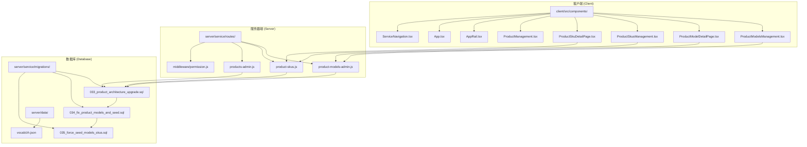
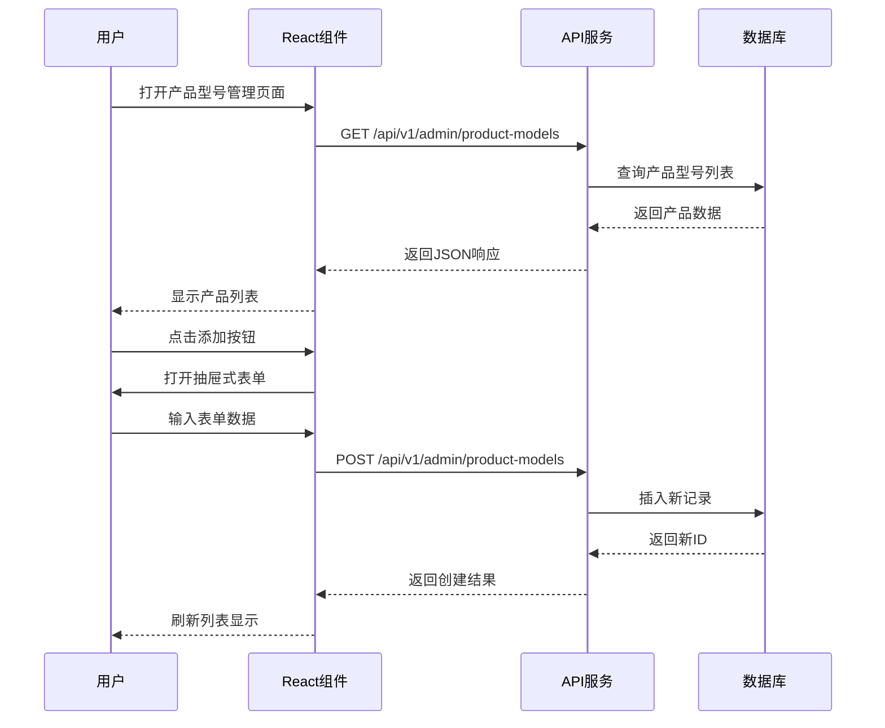
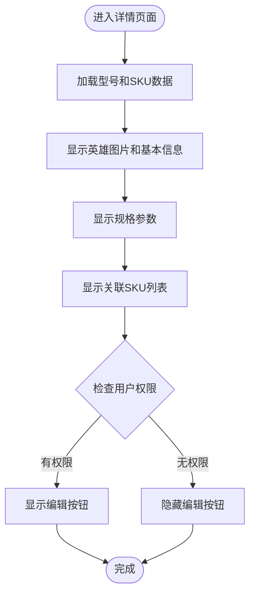
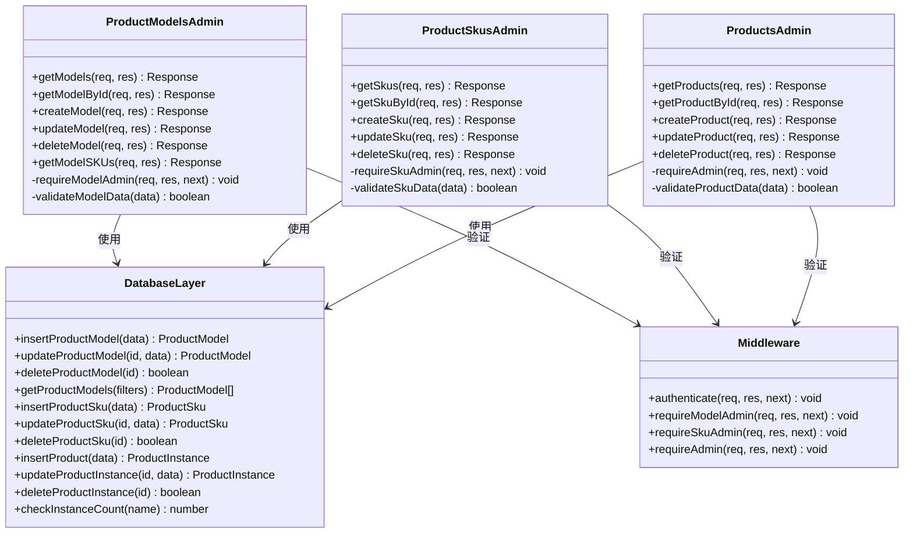
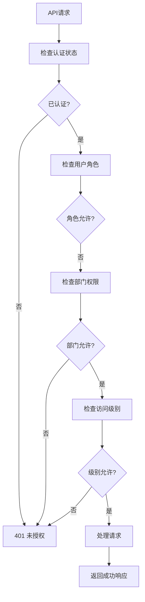
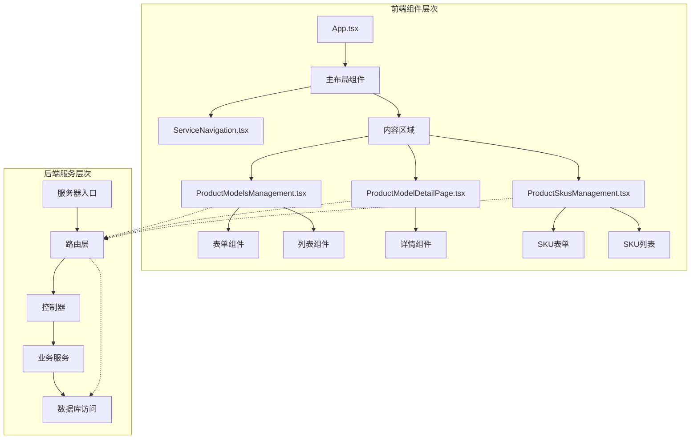

# 产品型号管理系统

<cite>
**本文档引用的文件**
- [ProductModelsManagement.tsx](file://client/src/components/ProductModelsManagement.tsx)
- [ProductModelDetailPage.tsx](file://client/src/components/ProductModelDetailPage.tsx)
- [ProductSkusManagement.tsx](file://client/src/components/ProductSkusManagement.tsx)
- [ProductSkuDetailPage.tsx](file://client/src/components/ProductSkuDetailPage.tsx)
- [product-models-admin.js](file://server/service/routes/product-models-admin.js)
- [product-skus.js](file://server/service/routes/product-skus.js)
- [products-admin.js](file://server/service/routes/products-admin.js)
- [033_product_architecture_upgrade.sql](file://server/service/migrations/033_product_architecture_upgrade.sql)
- [034_fix_product_models_and_seed.sql](file://server/service/migrations/034_fix_product_models_and_seed.sql)
- [035_force_seed_models_skus.sql](file://server/service/migrations/035_force_seed_models_skus.sql)
- [Service PRD_P2.md](file://docs/Service PRD_P2.md)
- [Service_DataModel.md](file://docs/Service_DataModel.md)
- [ProductManagement.tsx](file://client/src/components/ProductManagement.tsx)
- [products-admin.js](file://server/service/routes/products-admin.js)
- [App.tsx](file://client/src/App.tsx)
- [AppRail.tsx](file://client/src/components/AppRail.tsx)
- [ServiceNavigation.tsx](file://client/src/components/Service/ServiceNavigation.tsx)
</cite>

## 更新摘要
**变更内容**
- 新增三层次产品架构支持，从原有的Model→Instance升级为Model→SKU→Instance
- 新增产品SKU管理功能，支持SKU的创建、编辑、删除和状态管理
- 新增产品型号详情展示页面，提供完整的型号信息和SKU关联展示
- 扩展权限控制范围，允许更多内部员工访问产品型号管理功能
- 增强搜索和过滤功能，支持更精确的产品型号和SKU检索
- 更新数据库架构，新增product_skus表和相关索引
- **重大重构**：产品型号管理界面新增双标签页编辑界面，支持基本信息和SKU体系的分离管理

## 目录
1. [简介](#简介)
2. [项目结构](#项目结构)
3. [核心组件](#核心组件)
4. [架构概览](#架构概览)
5. [详细组件分析](#详细组件分析)
6. [新增功能详解](#新增功能详解)
7. [数据库架构升级](#数据库架构升级)
8. [依赖关系分析](#依赖关系分析)
9. [性能考虑](#性能考虑)
10. [故障排除指南](#故障排除指南)
11. [结论](#结论)

## 简介

产品型号管理系统是Longhorn服务模块中的关键功能模块，负责管理产品的型号定义、规格参数、SKU配置及品牌资产管理。该系统采用前后端分离架构，前端使用React构建用户界面，后端基于Node.js和Express提供RESTful API服务。

**更新** 系统现已支持三层次产品架构，从原有的Model→Instance升级为Model→SKU→Instance，为用户提供更全面的产品信息管理能力。新架构支持产品型号（Model）、商品规格（SKU）和设备台账（Instance）三个层级的精细化管理。

系统的核心功能包括：
- 产品型号的增删改查操作
- 多维度的产品分类管理（按产品族群和类型）
- 品牌资产管理和规格参数展示
- SKU配置和关联管理
- 设备台账（Instance）管理，包括序列号、品质等级、仓库位置等
- 权限控制和访问限制
- 实例数量统计和状态管理
- 搜索和过滤功能

## 项目结构

Longhorn项目采用模块化架构设计，产品型号管理功能位于以下目录结构中：



**图表来源**
- [ProductModelsManagement.tsx:1-943](file://client/src/components/ProductModelsManagement.tsx#L1-L943)
- [ProductModelDetailPage.tsx:1-357](file://client/src/components/ProductModelDetailPage.tsx#L1-L357)
- [product-models-admin.js:1-362](file://server/service/routes/product-models-admin.js#L1-L362)
- [product-skus.js:1-309](file://server/service/routes/product-skus.js#L1-L309)

**章节来源**
- [ProductModelsManagement.tsx:1-943](file://client/src/components/ProductModelsManagement.tsx#L1-L943)
- [ProductModelDetailPage.tsx:1-357](file://client/src/components/ProductModelDetailPage.tsx#L1-L357)
- [product-models-admin.js:1-362](file://server/service/routes/product-models-admin.js#L1-L362)

## 核心组件

### 产品型号管理界面组件

产品型号管理界面是一个完整的React组件，提供了丰富的用户交互功能：

#### 主要特性
- **多维度筛选**：支持按产品族群（A/B/C/D）和关键词进行筛选
- **权限控制**：扩展至MS、运营部门及市场部门员工
- **响应式设计**：支持桌面端和移动端的自适应布局
- **实时搜索**：集成搜索功能，支持模糊匹配
- **抽屉式表单**：使用现代化的抽屉式界面进行数据编辑
- **SKU管理**：支持产品型号与SKU的关联管理
- **品牌资产管理**：支持产品图片和品牌信息管理
- **双页签管理**：在产品目录编辑界面，通过基本信息和SKU体系双页签进行管理

#### 数据模型
```typescript
interface ProductModel {
    id: number;
    name_zh: string;
    name_en?: string;
    brand?: string;
    model_code?: string;
    material_id_prefix?: string;
    product_family: 'A' | 'B' | 'C' | 'D';
    product_type: string;
    description: string;
    hero_image?: string;
    is_active: boolean;
    created_at: string;
    updated_at: string;
    // Stats
    instance_count: number;
    sku_count: number;
}

interface ProductSku {
    id: number;
    model_id: number;
    sku_code: string;
    material_id?: string;
    display_name: string;
    display_name_en?: string;
    spec_label?: string;
    sku_image?: string;
    is_active: boolean;
    created_at: string;
    // Joined fields
    name_zh?: string;
    brand?: string;
}
```

**章节来源**
- [ProductModelsManagement.tsx:14-45](file://client/src/components/ProductModelsManagement.tsx#L14-L45)

### 产品型号详情页面组件

新增的产品型号详情页面提供了完整的产品信息展示：

#### 主要特性
- **详情展示**：展示产品型号的完整信息和统计数据
- **品牌资产**：支持产品图片展示和品牌信息管理
- **SKU关联**：展示与产品型号关联的所有SKU信息
- **状态管理**：支持产品型号的激活/停用状态管理
- **权限控制**：允许内部员工访问详情页面
- **展开/折叠**：支持详情区域的展开/折叠功能

#### 页面结构
- **头部信息**：包含型号名称、状态、品牌和操作按钮
- **英雄图片区**：展示产品主图和基本信息
- **规格参数区**：展示详细的规格参数和描述信息
- **SKU列表区**：展示关联的SKU列表和状态
- **统计信息**：显示SKU数量和在役设备数量

**章节来源**
- [ProductModelDetailPage.tsx:11-37](file://client/src/components/ProductModelDetailPage.tsx#L11-L37)

### 服务器端API服务

服务器端提供RESTful API接口，处理所有产品型号相关的业务逻辑：

#### 核心API端点
- `GET /api/v1/admin/product-models` - 获取产品型号列表
- `GET /api/v1/admin/product-models/:id` - 获取产品型号详情
- `POST /api/v1/admin/product-models` - 创建新产品型号
- `PUT /api/v1/admin/product-models/:id` - 更新产品型号
- `DELETE /api/v1/admin/product-models/:id` - 删除产品型号
- `GET /api/v1/admin/product-models/:id/skus` - 获取产品型号关联的SKU列表
- `GET /api/v1/admin/product-skus` - 获取SKU列表
- `GET /api/v1/admin/product-skus/:id` - 获取SKU详情
- `POST /api/v1/admin/product-skus` - 创建SKU
- `PUT /api/v1/admin/product-skus/:id` - 更新SKU
- `DELETE /api/v1/admin/product-skus/:id` - 删除SKU

#### 权限验证
系统实现了扩展的权限控制机制，允许更多用户访问：
- Admin（管理员）
- Exec（执行官）
- MS部门负责人（Lead）
- MS部门员工
- 运营部门员工
- 市场部门员工

**章节来源**
- [product-models-admin.js:10-41](file://server/service/routes/product-models-admin.js#L10-L41)

## 架构概览

系统采用经典的三层架构模式，现已升级为三层次产品架构，确保了良好的可维护性和扩展性：

```mermaid
graph TB
subgraph "表现层 (Presentation Layer)"
UI[React组件<br/>ProductModelsManagement.tsx]
DETAIL[详情组件<br/>ProductModelDetailPage.tsx]
SKU[SKU管理<br/>ProductSkusManagement.tsx]
MODEL_DETAIL[型号详情<br/>ProductModelDetailPage.tsx]
NAV[导航组件<br/>ServiceNavigation.tsx]
end
subgraph "应用层 (Application Layer)"
API[API路由<br/>product-models-admin.js]
SKU_API[SKU路由<br/>product-skus.js]
PRODUCTS_API[产品路由<br/>products-admin.js]
AUTH[权限中间件<br/>permission.js]
end
subgraph "数据访问层 (Data Access Layer)"
DB[(SQLite数据库)]
MIG[数据库迁移<br/>033_product_architecture_upgrade.sql]
MIG2[迁移2<br/>034_fix_product_models_and_seed.sql]
MIG3[迁移3<br/>035_force_seed_models_skus.sql]
END
subgraph "外部服务"
AXIOS[Axios HTTP客户端]
ROUTER[React Router]
end
UI --> AXIOS
DETAIL --> AXIOS
SKU --> AXIOS
MODEL_DETAIL --> AXIOS
NAV --> ROUTER
AXIOS --> API
AXIOS --> SKU_API
AXIOS --> PRODUCTS_API
API --> AUTH
SKU_API --> AUTH
PRODUCTS_API --> AUTH
API --> DB
SKU_API --> DB
PRODUCTS_API --> DB
DB --> MIG
DB --> MIG2
DB --> MIG3
```

**图表来源**
- [ProductModelsManagement.tsx:1-943](file://client/src/components/ProductModelsManagement.tsx#L1-L943)
- [ProductModelDetailPage.tsx:1-357](file://client/src/components/ProductModelDetailPage.tsx#L1-L357)
- [product-models-admin.js:1-362](file://server/service/routes/product-models-admin.js#L1-L362)
- [product-skus.js:1-309](file://server/service/routes/product-skus.js#L1-L309)

## 详细组件分析

### 前端组件分析

#### 产品型号管理组件 (ProductModelsManagement)

该组件是整个系统的核心界面，实现了完整的CRUD操作：



**图表来源**
- [ProductModelsManagement.tsx:117-138](file://client/src/components/ProductModelsManagement.tsx#L117-L138)
- [product-models-admin.js:47-90](file://server/service/routes/product-models-admin.js#L47-L90)

#### 产品型号详情组件 (ProductModelDetailPage)

新增的详情组件提供了完整的产品信息展示：



**图表来源**
- [ProductModelDetailPage.tsx:56-83](file://client/src/components/ProductModelDetailPage.tsx#L56-L83)
- [ProductModelDetailPage.tsx:156-161](file://client/src/components/ProductModelDetailPage.tsx#L156-L161)

**章节来源**
- [ProductModelsManagement.tsx:1-943](file://client/src/components/ProductModelsManagement.tsx#L1-L943)
- [ProductModelDetailPage.tsx:1-357](file://client/src/components/ProductModelDetailPage.tsx#L1-L357)

### 后端服务分析

#### API路由设计

服务器端API遵循RESTful设计原则，每个端点都有明确的职责：



**图表来源**
- [product-models-admin.js:1-362](file://server/service/routes/product-models-admin.js#L1-L362)
- [product-skus.js:1-309](file://server/service/routes/product-skus.js#L1-L309)
- [products-admin.js:1-652](file://server/service/routes/products-admin.js#L1-L652)

#### 数据库设计

系统使用SQLite作为数据存储，三层次产品架构的数据表结构设计如下：

**产品目录 (product_models)**
| 字段名 | 类型 | 约束 | 描述 |
|--------|------|------|------|
| id | INTEGER | PRIMARY KEY AUTOINCREMENT | 主键标识符 |
| name_zh | TEXT | NOT NULL | 型号中文名称（对外显示） |
| name_en | TEXT | NULL | 型号英文名称 |
| brand | TEXT | DEFAULT 'Kinefinity' | 品牌名称 |
| model_code | TEXT | NULL | 型号代码 |
| material_id_prefix | TEXT | NULL | 物料号前缀 |
| product_family | TEXT | NOT NULL | 产品族群 (A/B/C/D) |
| product_type | TEXT | DEFAULT 'CAMERA' | 产品类型 |
| description | TEXT | NULL | 产品描述 |
| hero_image | TEXT | NULL | 英雄图片URL |
| is_active | BOOLEAN | DEFAULT 1 | 是否启用 |
| created_at | DATETIME | DEFAULT CURRENT_TIMESTAMP | 创建时间 |
| updated_at | DATETIME | DEFAULT CURRENT_TIMESTAMP | 更新时间 |

**商品规格 (product_skus)**
| 字段名 | 类型 | 约束 | 描述 |
|--------|------|------|------|
| id | INTEGER | PRIMARY KEY AUTOINCREMENT | 主键标识符 |
| model_id | INTEGER | NOT NULL | 关联产品型号ID |
| sku_code | TEXT | UNIQUE NOT NULL | 商品编码 (A系列) |
| material_id | TEXT | NULL | 物料ID (ERP ID) |
| display_name | TEXT | NOT NULL | 显示名称 |
| display_name_en | TEXT | NULL | 英文显示名称 |
| spec_label | TEXT | NULL | 规格标签 |
| sku_image | TEXT | NULL | SKU图片URL |
| is_active | BOOLEAN | DEFAULT 1 | 是否启用 |
| created_at | DATETIME | DEFAULT CURRENT_TIMESTAMP | 创建时间 |
| updated_at | DATETIME | DEFAULT CURRENT_TIMESTAMP | 更新时间 |

**设备台账 (products)**
| 字段名 | 类型 | 约束 | 描述 |
|--------|------|------|------|
| id | INTEGER | PRIMARY KEY AUTOINCREMENT | 主键标识符 |
| model_name | TEXT | NOT NULL | 产品型号名称 |
| serial_number | TEXT | UNIQUE | 序列号 |
| product_sku | TEXT | NULL | 商品SKU编码 |
| sku_id | INTEGER | NULL | 关联SKU ID |
| firmware_version | TEXT | NULL | 固件版本 |
| production_date | DATE | NULL | 生产日期 |
| description | TEXT | NULL | 产品描述 |
| status | TEXT | DEFAULT 'ACTIVE' | 设备状态 |
| sales_channel | TEXT | NULL | 销售渠道 |
| current_owner_id | INTEGER | NULL | 当前物主ID |
| warranty_start_date | DATE | NULL | 保修开始日期 |
| warranty_months | INTEGER | DEFAULT 24 | 保修月数 |
| warranty_end_date | DATE | NULL | 保修结束日期 |
| warranty_status | TEXT | DEFAULT 'PENDING' | 保修状态 |
| grade | TEXT | DEFAULT 'A' | 品质等级 (A/B/C) |
| specification | TEXT | NULL | 规格描述 |
| warehouse | TEXT | NULL | 仓库位置 |
| entry_channel | TEXT | NULL | 入库渠道 |
| created_at | DATETIME | DEFAULT CURRENT_TIMESTAMP | 创建时间 |
| updated_at | DATETIME | DEFAULT CURRENT_TIMESTAMP | 更新时间 |

**章节来源**
- [033_product_architecture_upgrade.sql:5-18](file://server/service/migrations/033_product_architecture_upgrade.sql#L5-L18)
- [033_product_architecture_upgrade.sql:30-36](file://server/service/migrations/033_product_architecture_upgrade.sql#L30-L36)
- [033_product_architecture_upgrade.sql:42-53](file://server/service/migrations/033_product_architecture_upgrade.sql#L42-L53)

### 权限控制系统

系统实现了扩展的权限控制机制：



**图表来源**
- [product-models-admin.js:10-41](file://server/service/routes/product-models-admin.js#L10-L41)

**章节来源**
- [product-models-admin.js:10-41](file://server/service/routes/product-models-admin.js#L10-L41)

## 新增功能详解

### 产品型号详情展示功能

新增的产品型号详情页面提供了完整的产品信息展示能力：

#### 功能特性
- **完整信息展示**：展示产品型号的所有基本信息
- **品牌资产管理**：支持产品图片上传和展示
- **SKU关联展示**：展示与产品型号关联的所有SKU
- **状态统计**：显示SKU数量和在役设备数量
- **权限控制**：允许内部员工访问详情页面
- **展开/折叠**：支持详情区域的展开/折叠功能

#### 技术实现
- 使用Promise.all并行加载型号和SKU数据
- 实现展开/折叠的详情区域
- 支持图片上传和预览
- 提供编辑按钮（仅对有权限的用户）

**章节来源**
- [ProductModelDetailPage.tsx:46-94](file://client/src/components/ProductModelDetailPage.tsx#L46-L94)

### 增强的SKU管理功能

系统新增了完整的SKU管理功能：

#### SKU管理特性
- **SKU创建**：支持创建新的产品SKU
- **SKU编辑**：支持编辑现有SKU信息
- **SKU删除**：支持删除SKU（需无关联实例）
- **SKU搜索**：支持按型号和关键词搜索
- **SKU状态管理**：支持SKU的激活/停用
- **SKU图片管理**：支持SKU专属图片上传

#### API端点
- `GET /api/v1/admin/product-skus` - 获取SKU列表
- `GET /api/v1/admin/product-skus/:id` - 获取SKU详情
- `POST /api/v1/admin/product-skus` - 创建SKU
- `PUT /api/v1/admin/product-skus/:id` - 更新SKU
- `DELETE /api/v1/admin/product-skus/:id` - 删除SKU

**章节来源**
- [product-skus.js:47-88](file://server/service/routes/product-skus.js#L47-L88)
- [ProductSkusManagement.tsx:35-98](file://client/src/components/ProductSkusManagement.tsx#L35-L98)

### 扩展的权限控制

系统权限控制范围得到显著扩展：

#### 允许访问的用户群体
- **Admin**（管理员）
- **Exec**（执行官）
- **MS部门负责人**（Lead）
- **MS部门员工**
- **运营部门员工**
- **市场部门员工**

#### 权限检查逻辑
```javascript
const canViewModels = (user) => {
    return user.role === 'Admin' ||
        user.role === 'Exec' ||
        ['MS', 'OP'].includes(user.department_code) ||
        (user.department_name || '').includes('市场') ||
        (user.department_name || '').includes('运营');
};
```

**章节来源**
- [product-models-admin.js:10-17](file://server/service/routes/product-models-admin.js#L10-L17)

### 设备台账管理功能

系统新增了完整的设备台账（Instance）管理功能：

#### 设备台账特性
- **序列号管理**：支持唯一序列号的录入和管理
- **品质等级管理**：支持A/B/C等级的设备分类
- **仓库位置管理**：支持设备物理位置跟踪
- **保修状态管理**：支持保修期计算和状态跟踪
- **所有权管理**：支持当前物主信息管理
- **状态跟踪**：支持在役、维修中、失窃、报废等状态

#### API端点
- `GET /api/v1/admin/products` - 获取设备列表
- `GET /api/v1/admin/products/:id` - 获取设备详情
- `POST /api/v1/admin/products` - 创建设备
- `PUT /api/v1/admin/products/:id` - 更新设备
- `DELETE /api/v1/admin/products/:id` - 删除设备

**章节来源**
- [products-admin.js:25-115](file://server/service/routes/products-admin.js#L25-L115)
- [ProductManagement.tsx:11-63](file://client/src/components/ProductManagement.tsx#L11-L63)

### 重大界面重构：双标签页管理模式

**更新** 产品型号管理界面经历了重大重构，新增了双标签页管理模式：

#### 双页签功能
- **基本信息页签**：管理产品型号的基础信息，包括名称、品牌、代码、描述等
- **SKU体系页签**：管理与产品型号关联的SKU列表和配置

#### 界面特性
- **页签切换**：支持在基本信息和SKU体系之间快速切换
- **SKU列表管理**：在SKU页签中直接管理关联的SKU
- **SKU创建向导**：提供SKU创建的完整流程
- **SKU状态追踪**：显示每个SKU的激活状态和关联设备数量

#### 技术实现
- 使用React状态管理实现页签切换
- 集成SKU列表的增删改查功能
- 实现SKU与型号的双向关联
- 支持SKU图片和规格标签管理

**章节来源**
- [ProductModelsManagement.tsx:611-636](file://client/src/components/ProductModelsManagement.tsx#L611-L636)
- [ProductModelsManagement.tsx:772-805](file://client/src/components/ProductModelsManagement.tsx#L772-L805)

## 数据库架构升级

### 三层次产品架构设计

系统已成功升级为三层次产品架构，支持Model→SKU→Instance的完整产品管理体系：

#### 架构定义
1. **产品目录 (Product Model/Catalog)**：定义基础平台（如：MAVO Edge 8K）
2. **商品规格 (Product SKU)**：定义具体的销售形态（如：MAVO Edge 8K - 深空灰、EF套装）
3. **设备台账 (Product Instance/Ledger)**：定义每一台出厂的具体设备

#### 数据库迁移策略

**迁移1：创建SKU表**
```sql
CREATE TABLE IF NOT EXISTS product_skus (
    id INTEGER PRIMARY KEY AUTOINCREMENT,
    model_id INTEGER NOT NULL,
    sku_code TEXT UNIQUE NOT NULL,
    material_id TEXT,
    display_name TEXT NOT NULL,
    display_name_en TEXT,
    spec_label TEXT,
    sku_image TEXT,
    is_active BOOLEAN DEFAULT 1,
    created_at DATETIME DEFAULT CURRENT_TIMESTAMP,
    updated_at DATETIME DEFAULT CURRENT_TIMESTAMP,
    FOREIGN KEY(model_id) REFERENCES product_models(id)
);
```

**迁移2：扩展产品模型表**
```sql
ALTER TABLE product_models ADD COLUMN name_en TEXT;
ALTER TABLE product_models ADD COLUMN brand TEXT DEFAULT 'Kinefinity';
ALTER TABLE product_models ADD COLUMN internal_prefix TEXT;
ALTER TABLE product_models ADD COLUMN hero_image TEXT;
```

**迁移3：扩展产品表**
```sql
ALTER TABLE products ADD COLUMN sku_id INTEGER;
ALTER TABLE products ADD COLUMN grade TEXT DEFAULT 'A';
ALTER TABLE products ADD COLUMN specification TEXT;
ALTER TABLE products ADD COLUMN warehouse TEXT;
ALTER TABLE products ADD COLUMN entry_channel TEXT;
```

**章节来源**
- [033_product_architecture_upgrade.sql:1-54](file://server/service/migrations/033_product_architecture_upgrade.sql#L1-L54)
- [034_fix_product_models_and_seed.sql:1-49](file://server/service/migrations/034_fix_product_models_and_seed.sql#L1-L49)
- [035_force_seed_models_skus.sql:1-40](file://server/service/migrations/035_force_seed_models_skus.sql#L1-L40)

### 数据一致性保障

系统通过以下机制确保数据一致性：

1. **外键约束**：SKU表的model_id引用产品模型表
2. **唯一性约束**：SKU代码的唯一性保证
3. **级联更新**：产品模型删除时的级联处理
4. **索引优化**：为常用查询字段建立索引
5. **数据迁移**：自动迁移现有产品数据到新架构

**章节来源**
- [033_product_architecture_upgrade.sql:20-21](file://server/service/migrations/033_product_architecture_upgrade.sql#L20-L21)
- [033_product_architecture_upgrade.sql:38-40](file://server/service/migrations/033_product_architecture_upgrade.sql#L38-L40)

## 依赖关系分析

### 技术栈依赖

系统采用现代Web技术栈构建：

```mermaid
graph LR
subgraph "前端技术栈"
REACT[React 18+] --> AXIOS[Axios HTTP客户端]
TS[TypeScript] --> REACT
LUCIDE[Lucide React图标] --> REACT
ROUTER[React Router] --> REACT
HOOKS[React Hooks] --> REACT
END
subgraph "后端技术栈"
NODE[Node.js] --> EXPRESS[Express框架]
SQLITE[SQLite] --> EXPRESS
BCRYPT[密码加密] --> EXPRESS
END
subgraph "开发工具"
VITE[Vite构建工具] --> REACT
ESLINT[ESLint] --> TS
PRETTIER[Prettier格式化] --> TS
END
REACT --> EXPRESS
AXIOS --> EXPRESS
```

### 组件间依赖关系



**图表来源**
- [App.tsx:255-266](file://client/src/App.tsx#L255-L266)
- [ServiceNavigation.tsx:120-134](file://client/src/components/Service/ServiceNavigation.tsx#L120-L134)

**章节来源**
- [App.tsx:255-266](file://client/src/App.tsx#L255-L266)
- [ServiceNavigation.tsx:120-134](file://client/src/components/Service/ServiceNavigation.tsx#L120-L134)

## 性能考虑

### 前端性能优化

系统采用了多项前端性能优化策略：

1. **懒加载和代码分割**：React.lazy和Suspense实现组件懒加载
2. **虚拟滚动**：大数据量时使用虚拟滚动提升渲染性能
3. **状态管理优化**：使用useMemo和useCallback避免不必要的重渲染
4. **缓存策略**：合理使用浏览器缓存和内存缓存
5. **并行数据加载**：使用Promise.all并行加载相关数据
6. **条件渲染**：根据权限动态渲染组件元素
7. **图片优化**：支持WEBP格式和懒加载

### 后端性能优化

1. **数据库索引优化**：为常用查询字段建立索引
2. **查询优化**：使用参数化查询防止SQL注入
3. **连接池管理**：合理配置数据库连接池
4. **缓存机制**：实现适当的缓存策略减少数据库压力
5. **批量操作**：支持批量数据查询和更新
6. **分页查询**：产品列表支持分页加载

### 网络性能优化

1. **HTTP缓存**：合理设置缓存头
2. **压缩传输**：启用Gzip压缩
3. **CDN加速**：静态资源使用CDN
4. **异步加载**：非关键资源异步加载
5. **请求合并**：使用Promise.all合并API请求

## 故障排除指南

### 常见问题及解决方案

#### 权限相关问题
- **问题**：用户无法访问产品型号管理功能
- **原因**：用户角色或部门权限不满足要求
- **解决方案**：确认用户是否属于MS、运营或市场部门，或具有Admin/Exec/Lead角色

#### 数据库连接问题
- **问题**：API调用失败，返回数据库错误
- **原因**：数据库连接异常或迁移未完成
- **解决方案**：检查数据库连接配置和迁移状态

#### 数据验证错误
- **问题**：创建或更新产品型号/SKU失败
- **原因**：数据验证规则不满足或重复数据冲突
- **解决方案**：检查必填字段、唯一性约束和数据格式

#### 图片上传问题
- **问题**：产品图片上传失败
- **原因**：文件格式不支持或上传服务异常
- **解决方案**：检查文件格式（JPG/PNG/WEBP）和上传服务状态

#### 数据迁移问题
- **问题**：SKU数据迁移失败
- **原因**：现有产品数据格式不兼容
- **解决方案**：运行迁移脚本，检查数据格式和约束

### 调试技巧

1. **浏览器开发者工具**：监控网络请求和JavaScript错误
2. **服务器日志**：查看API调用日志和错误信息
3. **数据库查询**：使用SQLite命令行工具验证数据状态
4. **单元测试**：编写测试用例验证核心功能
5. **权限测试**：模拟不同用户角色验证权限控制

**章节来源**
- [product-models-admin.js:132-196](file://server/service/routes/product-models-admin.js#L132-L196)

## 结论

产品型号管理系统经过重大升级后，已成为一个功能完整、权限开放、用户体验优秀的三层次产品管理体系。系统成功实现了以下目标：

1. **架构升级**：从原有的Model→Instance升级为Model→SKU→Instance的三层次架构
2. **功能完整性**：提供了从产品型号管理到SKU管理再到设备台账管理的完整功能链
3. **权限扩展性**：大幅扩展了权限控制范围，支持更多内部员工访问
4. **用户体验优化**：新增详情页面和增强的界面交互，特别是双页签管理模式
5. **数据管理能力**：支持品牌资产管理、规格参数管理、SKU关联和设备台账管理
6. **性能优化考虑**：从前端到后端的全方位性能优化策略
7. **可维护性保证**：清晰的架构设计和完善的错误处理机制
8. **数据一致性**：通过外键约束和迁移策略确保数据完整性

**更新** 新增的产品型号详情页面、SKU管理和设备台账功能，以及重大界面重构的双页签管理模式，为Longhorn平台提供了更强大的产品信息管理能力，支持更精细的产品生命周期管理。通过扩展权限控制和增强搜索功能，系统能够更好地服务于不同部门的业务需求。

该系统为Longhorn平台提供了坚实的产品型号管理基础，为后续的功能扩展和业务发展奠定了良好基础。通过持续的优化和完善，该系统能够更好地支持企业的业务需求和发展目标。