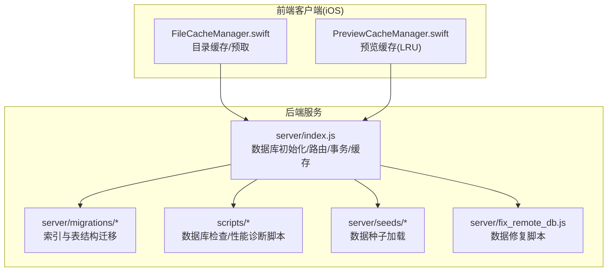
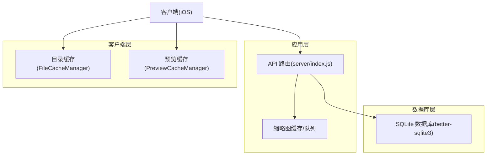
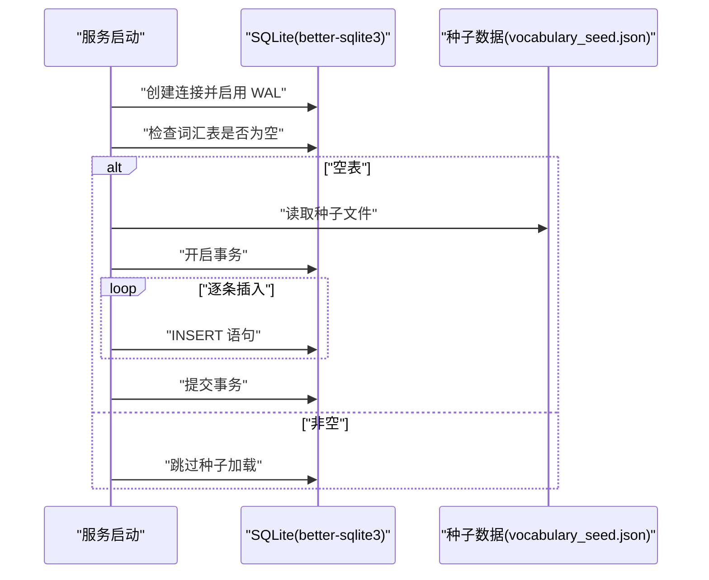
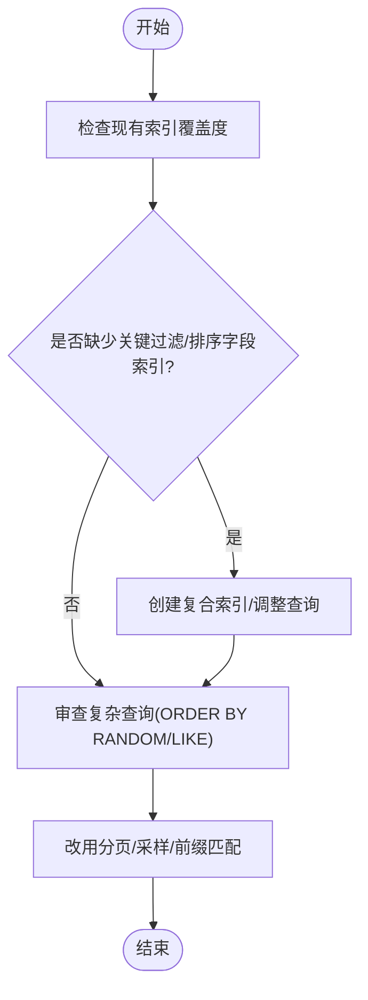
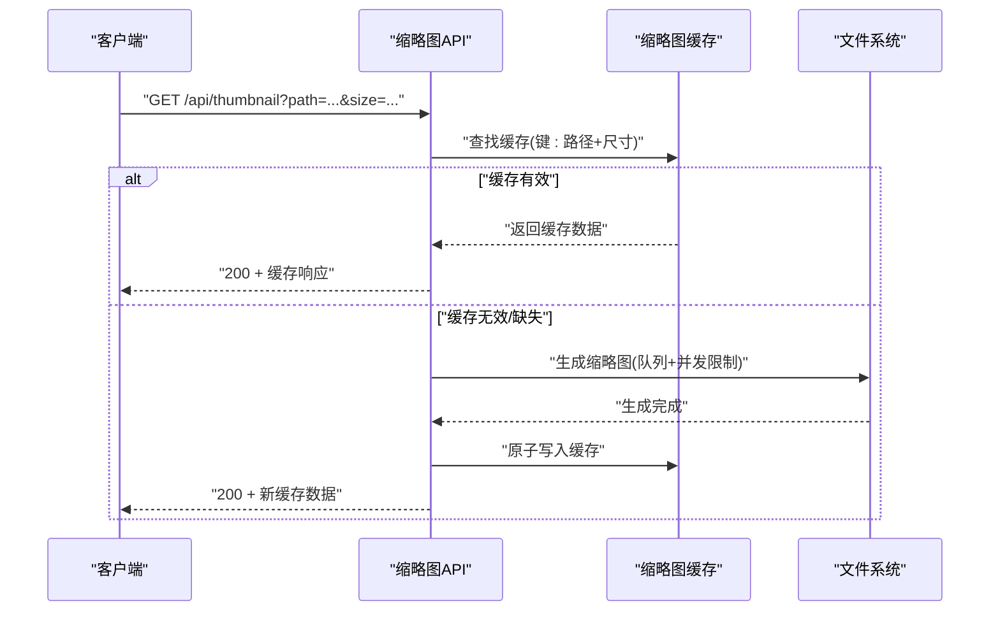
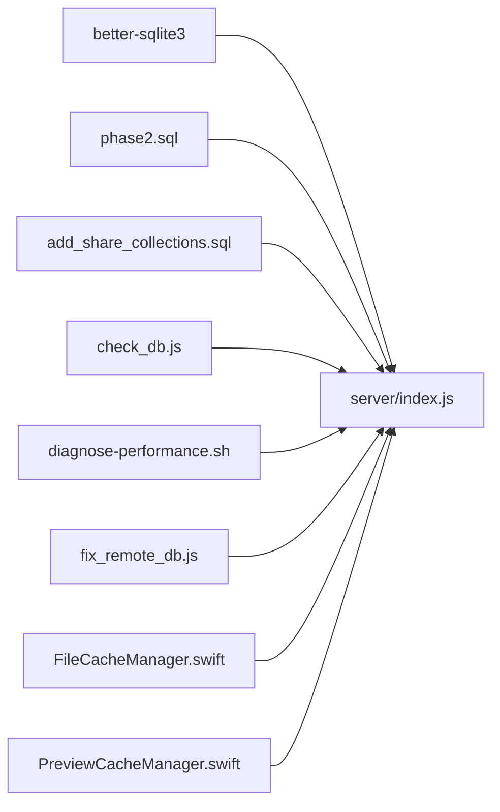

# 数据库性能优化

<cite>
**本文引用的文件**
- [server/index.js](file://server/index.js)
- [server/migrations/phase2.sql](file://server/migrations/phase2.sql)
- [server/migrations/add_share_collections.sql](file://server/migrations/add_share_collections.sql)
- [scripts/check_db.js](file://scripts/check_db.js)
- [scripts/diagnose-performance.sh](file://scripts/diagnose-performance.sh)
- [server/fix_remote_db.js](file://server/fix_remote_db.js)
- [server/seeds/vocabulary_seed.json](file://server/seeds/vocabulary_seed.json)
- [ios/LonghornApp/Services/FileCacheManager.swift](file://ios/LonghornApp/Services/FileCacheManager.swift)
- [ios/LonghornApp/Services/PreviewCacheManager.swift](file://ios/LonghornApp/Services/PreviewCacheManager.swift)
</cite>

## 目录
1. [简介](#简介)
2. [项目结构](#项目结构)
3. [核心组件](#核心组件)
4. [架构总览](#架构总览)
5. [详细组件分析](#详细组件分析)
6. [依赖关系分析](#依赖关系分析)
7. [性能考量与优化建议](#性能考量与优化建议)
8. [故障排查指南](#故障排查指南)
9. [结论](#结论)
10. [附录](#附录)

## 简介
本文件面向 Longhorn 项目的数据库性能优化，聚焦 SQLite 在 Node.js 环境下的使用现状与优化策略。Longhorn 使用 better-sqlite3 作为数据库驱动，采用 WAL 日志模式，并在服务端实现了若干与性能相关的特性，如批量插入事务、缓存与预取、索引设计等。本文将从索引设计、查询优化、缓存机制、连接池与事务管理、并发控制、数据种子加载与批量操作、性能监控与瓶颈识别等方面进行系统化梳理，并给出可落地的优化建议与最佳实践。

## 项目结构
Longhorn 的数据库相关实现主要集中在后端 Node.js 服务中，核心入口负责数据库初始化、表结构与索引、批量操作、鉴权与权限校验、以及与前端缓存策略的协同。iOS 客户端侧也实现了目录与预览缓存策略，以减轻后端压力并提升用户体验。

图表来源
- [server/index.js](file://server/index.js#L1-L120)
- [server/migrations/phase2.sql](file://server/migrations/phase2.sql#L1-L32)
- [server/migrations/add_share_collections.sql](file://server/migrations/add_share_collections.sql#L1-L32)
- [scripts/check_db.js](file://scripts/check_db.js#L1-L20)
- [scripts/diagnose-performance.sh](file://scripts/diagnose-performance.sh#L1-L122)
- [server/fix_remote_db.js](file://server/fix_remote_db.js#L1-L38)
- [server/seeds/vocabulary_seed.json](file://server/seeds/vocabulary_seed.json#L1-L200)
- [ios/LonghornApp/Services/FileCacheManager.swift](file://ios/LonghornApp/Services/FileCacheManager.swift#L27-L184)
- [ios/LonghornApp/Services/PreviewCacheManager.swift](file://ios/LonghornApp/Services/PreviewCacheManager.swift#L1-L50)

章节来源
- [server/index.js](file://server/index.js#L1-L120)
- [server/migrations/phase2.sql](file://server/migrations/phase2.sql#L1-L32)
- [server/migrations/add_share_collections.sql](file://server/migrations/add_share_collections.sql#L1-L32)
- [scripts/check_db.js](file://scripts/check_db.js#L1-L20)
- [scripts/diagnose-performance.sh](file://scripts/diagnose-performance.sh#L1-L122)
- [server/fix_remote_db.js](file://server/fix_remote_db.js#L1-L38)
- [server/seeds/vocabulary_seed.json](file://server/seeds/vocabulary_seed.json#L1-L200)
- [ios/LonghornApp/Services/FileCacheManager.swift](file://ios/LonghornApp/Services/FileCacheManager.swift#L27-L184)
- [ios/LonghornApp/Services/PreviewCacheManager.swift](file://ios/LonghornApp/Services/PreviewCacheManager.swift#L1-L50)

## 核心组件
- 数据库初始化与 WAL 模式：服务启动时创建数据库连接并设置 WAL 日志模式，有助于提升并发读写性能。
- 表与索引：基础表结构包含部门、用户、权限、星标、词汇等；迁移脚本新增了星标与分享相关表及索引。
- 批量操作与事务：对种子数据与上传文件元数据的批量写入均使用事务封装，减少提交开销。
- 权限与路径解析：鉴权中间件与路径解析逻辑配合数据库查询，确保访问控制与路径一致性。
- 缓存与预取：服务端对缩略图生成与缓存进行队列化控制；客户端实现目录与预览缓存，降低重复请求与 IO 压力。
- 性能诊断：提供数据库检查与性能诊断脚本，便于定位瓶颈与异常。

章节来源
- [server/index.js](file://server/index.js#L28-L111)
- [server/migrations/phase2.sql](file://server/migrations/phase2.sql#L1-L32)
- [server/migrations/add_share_collections.sql](file://server/migrations/add_share_collections.sql#L1-L32)
- [scripts/check_db.js](file://scripts/check_db.js#L1-L20)
- [scripts/diagnose-performance.sh](file://scripts/diagnose-performance.sh#L1-L122)
- [server/fix_remote_db.js](file://server/fix_remote_db.js#L1-L38)

## 架构总览
下图展示了数据库层与业务层的交互关系，以及缓存与并发控制的关键节点。

图表来源
- [server/index.js](file://server/index.js#L28-L111)
- [ios/LonghornApp/Services/FileCacheManager.swift](file://ios/LonghornApp/Services/FileCacheManager.swift#L27-L184)
- [ios/LonghornApp/Services/PreviewCacheManager.swift](file://ios/LonghornApp/Services/PreviewCacheManager.swift#L1-L50)

## 详细组件分析

### 数据库初始化与事务管理
- 初始化：创建数据库连接并启用 WAL 模式，提升并发读取能力。
- 事务封装：批量插入与修复脚本均使用事务，减少多次提交带来的开销。
- 自动种子加载：启动时检测词汇表为空则批量插入，使用事务包裹循环插入，避免逐条提交。

图表来源
- [server/index.js](file://server/index.js#L28-L111)
- [server/seeds/vocabulary_seed.json](file://server/seeds/vocabulary_seed.json#L1-L200)

章节来源
- [server/index.js](file://server/index.js#L28-L111)
- [server/seeds/vocabulary_seed.json](file://server/seeds/vocabulary_seed.json#L1-L200)

### 索引设计与查询优化
- 现状索引：
  - 星标文件：按用户与路径建立唯一索引，加速查询与去重。
  - 分享链接：按令牌与用户建立索引，支持快速查找与权限校验。
  - 分享集合：集合令牌与用户索引，集合项按集合 ID 建立索引。
- 查询优化建议：
  - 对高频过滤字段（如 language、level、user_id、file_path）建立复合索引，减少随机扫描。
  - 将 ORDER BY RANDOM() 改为基于索引的分页或采样策略，避免全表随机排序。
  - 对 LIKE 查询使用前缀匹配或全文检索替代，必要时考虑虚拟表或额外字段。
  - 合理拆分大查询，使用 LIMIT 控制单次返回量，结合客户端分页。

图表来源
- [server/migrations/phase2.sql](file://server/migrations/phase2.sql#L27-L32)
- [server/migrations/add_share_collections.sql](file://server/migrations/add_share_collections.sql#L18-L32)
- [server/index.js](file://server/index.js#L431-L475)

章节来源
- [server/migrations/phase2.sql](file://server/migrations/phase2.sql#L27-L32)
- [server/migrations/add_share_collections.sql](file://server/migrations/add_share_collections.sql#L18-L32)
- [server/index.js](file://server/index.js#L431-L475)

### 缓存机制与并发控制
- 服务端缓存：
  - 缩略图缓存：根据源文件修改时间判断缓存有效性，命中则直接返回；生成过程采用队列与并发上限控制，避免 CPU/IO 过载。
  - 静态资源缓存：预览静态资源启用缓存头与范围请求，提升传输效率。
- 客户端缓存：
  - 目录缓存：实现“过期/陈旧”策略与预取队列，减少重复请求。
  - 预览缓存：基于 LRU 的大小限制缓存，异步持久化索引，定期清理孤儿文件。

图表来源
- [server/index.js](file://server/index.js#L481-L679)
- [ios/LonghornApp/Services/FileCacheManager.swift](file://ios/LonghornApp/Services/FileCacheManager.swift#L27-L184)
- [ios/LonghornApp/Services/PreviewCacheManager.swift](file://ios/LonghornApp/Services/PreviewCacheManager.swift#L1-L50)

章节来源
- [server/index.js](file://server/index.js#L481-L679)
- [ios/LonghornApp/Services/FileCacheManager.swift](file://ios/LonghornApp/Services/FileCacheManager.swift#L27-L184)
- [ios/LonghornApp/Services/PreviewCacheManager.swift](file://ios/LonghornApp/Services/PreviewCacheManager.swift#L1-L50)

### 并发控制与连接池
- 连接池：better-sqlite3 默认每个进程一个连接，无需外部连接池。可通过进程/容器部署实现水平扩展。
- 并发策略：
  - 缩略图生成队列与并发上限，避免同时大量 CPU/IO 占用。
  - 事务批处理，减少锁竞争与提交次数。
  - 客户端缓存与预取，降低后端并发压力。

章节来源
- [server/index.js](file://server/index.js#L555-L577)
- [server/index.js](file://server/index.js#L93-L101)

### 数据种子加载与批量操作
- 种子加载：启动时检测词汇表为空则批量导入，使用事务包裹循环插入，显著降低写入成本。
- 批量元数据同步：上传流程中对文件元数据进行批量写入，同样使用事务封装，保证一致性与性能。

章节来源
- [server/index.js](file://server/index.js#L80-L111)
- [server/index.js](file://server/index.js#L822-L831)

### 权限与路径解析的查询优化
- 路径解析：将中文部门名映射为代码，统一大小写与格式，减少数据库模糊匹配。
- 权限查询：通过 JOIN 与条件过滤，尽量使用索引字段；对过期时间与路径前缀匹配进行优化。

章节来源
- [server/index.js](file://server/index.js#L233-L259)
- [server/index.js](file://server/index.js#L341-L353)

## 依赖关系分析
- 服务端依赖 better-sqlite3 提供高性能 SQLite 访问；WAL 模式提升并发读取。
- 迁移脚本定义表结构与索引，确保查询性能与数据完整性。
- 客户端缓存与服务端缓存形成协同，减少网络与 IO 压力。
- 诊断脚本与修复脚本辅助维护数据库健康状态。

图表来源
- [server/index.js](file://server/index.js#L1-L120)
- [server/migrations/phase2.sql](file://server/migrations/phase2.sql#L1-L32)
- [server/migrations/add_share_collections.sql](file://server/migrations/add_share_collections.sql#L1-L32)
- [scripts/check_db.js](file://scripts/check_db.js#L1-L20)
- [scripts/diagnose-performance.sh](file://scripts/diagnose-performance.sh#L1-L122)
- [server/fix_remote_db.js](file://server/fix_remote_db.js#L1-L38)
- [ios/LonghornApp/Services/FileCacheManager.swift](file://ios/LonghornApp/Services/FileCacheManager.swift#L27-L184)
- [ios/LonghornApp/Services/PreviewCacheManager.swift](file://ios/LonghornApp/Services/PreviewCacheManager.swift#L1-L50)

章节来源
- [server/index.js](file://server/index.js#L1-L120)
- [server/migrations/phase2.sql](file://server/migrations/phase2.sql#L1-L32)
- [server/migrations/add_share_collections.sql](file://server/migrations/add_share_collections.sql#L1-L32)
- [scripts/check_db.js](file://scripts/check_db.js#L1-L20)
- [scripts/diagnose-performance.sh](file://scripts/diagnose-performance.sh#L1-L122)
- [server/fix_remote_db.js](file://server/fix_remote_db.js#L1-L38)
- [ios/LonghornApp/Services/FileCacheManager.swift](file://ios/LonghornApp/Services/FileCacheManager.swift#L27-L184)
- [ios/LonghornApp/Services/PreviewCacheManager.swift](file://ios/LonghornApp/Services/PreviewCacheManager.swift#L1-L50)

## 性能考量与优化建议

### 索引与查询优化
- 建议为以下字段建立索引或复合索引：
  - vocabulary(language, level)
  - file_stats(path)
  - users(username)
  - permissions(user_id, folder_path)
  - share_links(share_token)
  - share_collections(token)
- 避免全表随机排序：将 ORDER BY RANDOM() 替换为基于主键的分页或采样策略。
- LIKE 查询优化：优先使用前缀匹配；若需全文搜索，考虑引入虚拟表或额外字段。

章节来源
- [server/migrations/phase2.sql](file://server/migrations/phase2.sql#L27-L32)
- [server/migrations/add_share_collections.sql](file://server/migrations/add_share_collections.sql#L18-L32)
- [server/index.js](file://server/index.js#L431-L475)

### 缓存与并发控制
- 服务端：
  - 缩略图生成队列与并发上限，防止 CPU/IO 过载。
  - 静态资源缓存与范围请求，提升传输效率。
- 客户端：
  - 目录缓存采用“过期/陈旧”策略与预取队列，减少重复请求。
  - 预览缓存基于 LRU 的大小限制，定期清理孤儿文件。

章节来源
- [server/index.js](file://server/index.js#L555-L577)
- [server/index.js](file://server/index.js#L481-L679)
- [ios/LonghornApp/Services/FileCacheManager.swift](file://ios/LonghornApp/Services/FileCacheManager.swift#L27-L184)
- [ios/LonghornApp/Services/PreviewCacheManager.swift](file://ios/LonghornApp/Services/PreviewCacheManager.swift#L1-L50)

### 事务与批量操作
- 事务批处理：对批量插入与修复操作使用事务，减少提交开销与锁竞争。
- 批量元数据同步：上传流程中批量写入文件元数据，保证一致性与性能。

章节来源
- [server/index.js](file://server/index.js#L93-L101)
- [server/index.js](file://server/index.js#L822-L831)
- [server/fix_remote_db.js](file://server/fix_remote_db.js#L1-L38)

### 内存与磁盘 I/O 优化
- 内存：
  - 服务端：合理设置 Node.js 堆大小与垃圾回收参数，避免频繁 GC。
  - 客户端：目录缓存与预览缓存采用 LRU 与大小限制，避免内存膨胀。
- 磁盘 I/O：
  - 使用 WAL 模式与范围请求，减少写放大与网络往返。
  - 缩略图缓存采用原子写入与缓存校验，避免重复生成与磁盘抖动。

章节来源
- [server/index.js](file://server/index.js#L28-L31)
- [server/index.js](file://server/index.js#L481-L679)
- [ios/LonghornApp/Services/PreviewCacheManager.swift](file://ios/LonghornApp/Services/PreviewCacheManager.swift#L24-L39)

### 性能监控与瓶颈识别
- 使用诊断脚本收集系统资源、数据库规模与网络状态，定位性能瓶颈。
- 定期检查数据库文件大小、表记录数与索引状态，评估查询计划与执行时间。

章节来源
- [scripts/diagnose-performance.sh](file://scripts/diagnose-performance.sh#L1-L122)
- [scripts/check_db.js](file://scripts/check_db.js#L1-L20)

## 故障排查指南
- 数据库检查：通过脚本验证部门与管理员用户是否存在，确认基本表结构。
- 诊断报告：运行性能诊断脚本，收集 PM2 状态、本地 API 响应时间、数据库规模、图片分布、Cloudflare Tunnel 状态与系统资源使用情况。
- 数据修复：针对重复部门与命名不一致问题，使用修复脚本清理与修正。

章节来源
- [scripts/check_db.js](file://scripts/check_db.js#L1-L20)
- [scripts/diagnose-performance.sh](file://scripts/diagnose-performance.sh#L1-L122)
- [server/fix_remote_db.js](file://server/fix_remote_db.js#L1-L38)

## 结论
Longhorn 在 SQLite 性能方面已具备良好基础：WAL 模式、事务批处理、缓存与并发控制、以及客户端缓存策略共同提升了整体性能与稳定性。为进一步优化，建议补充关键字段索引、优化随机排序与 LIKE 查询、完善监控与诊断流程，并持续迭代缓存策略以适配更大规模的数据与并发场景。

## 附录
- 术语
  - WAL：Write-Ahead Logging，提升并发读取与写入性能。
  - LRU：Least Recently Used，基于最近最少使用原则的缓存淘汰算法。
  - SWR：Stale-While-Revalidate，陈旧数据在后台刷新的缓存策略。
- 参考实现位置
  - 数据库初始化与 WAL：[server/index.js](file://server/index.js#L28-L31)
  - 批量事务插入：[server/index.js](file://server/index.js#L93-L101)
  - 缩略图缓存与队列：[server/index.js](file://server/index.js#L555-L679)
  - 客户端目录缓存：[ios/LonghornApp/Services/FileCacheManager.swift](file://ios/LonghornApp/Services/FileCacheManager.swift#L27-L184)
  - 客户端预览缓存：[ios/LonghornApp/Services/PreviewCacheManager.swift](file://ios/LonghornApp/Services/PreviewCacheManager.swift#L1-L50)
  - 索引与迁移：[server/migrations/phase2.sql](file://server/migrations/phase2.sql#L27-L32)、[server/migrations/add_share_collections.sql](file://server/migrations/add_share_collections.sql#L18-L32)
  - 性能诊断与检查：[scripts/diagnose-performance.sh](file://scripts/diagnose-performance.sh#L1-L122)、[scripts/check_db.js](file://scripts/check_db.js#L1-L20)
  - 数据修复：[server/fix_remote_db.js](file://server/fix_remote_db.js#L1-L38)