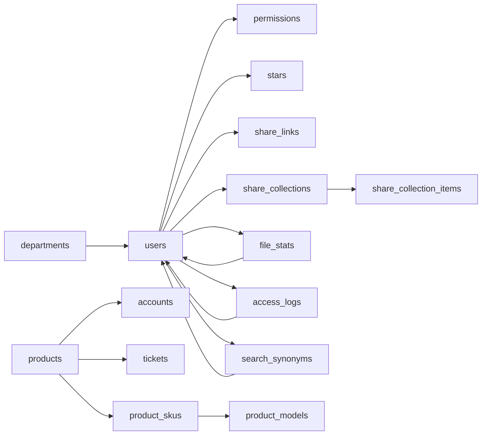

# 数据库表结构

<cite>
**本文档引用的文件**
- [server/index.js](file://server/index.js)
- [server/migrations/phase2.sql](file://server/migrations/phase2.sql)
- [server/migrations/add_share_collections.sql](file://server/migrations/add_share_collections.sql)
- [server/migrations/015_extend_products_installed_base.sql](file://server/migrations/015_extend_products_installed_base.sql)
- [server/migrations/016_add_product_models.sql](file://server/migrations/016_add_product_models.sql)
- [server/migrations/017_add_product_status.sql](file://server/migrations/017_add_product_status.sql)
- [server/migrations/022_add_products_sku_id.sql](file://server/migrations/022_add_products_sku_id.sql)
- [server/service/migrations/039_add_product_metadata_fields.sql](file://server/service/migrations/039_add_product_metadata_fields.sql)
- [server/service/migrations/033_product_architecture_upgrade.sql](file://server/service/migrations/033_product_architecture_upgrade.sql)
- [server/service/migrations/034_fix_product_models_and_seed.sql](file://server/service/migrations/034_fix_product_models_and_seed.sql)
- [server/service/migrations/036_add_missing_product_fields.sql](file://server/service/migrations/036_add_missing_product_fields.sql)
- [server/service/migrations/018_search_synonyms.sql](file://server/service/migrations/018_search_synonyms.sql)
- [server/service/routes/synonyms.js](file://server/service/routes/synonyms.js)
- [server/service/routes/knowledge.js](file://server/service/routes/knowledge.js)
- [server/service/routes/products.js](file://server/service/routes/products.js)
- [server/service/routes/products-admin.js](file://server/service/routes/products-admin.js)
- [server/service/routes/product-skus.js](file://server/service/routes/product-skus.js)
- [server/service/routes/product-models-admin.js](file://server/service/routes/product-models-admin.js)
- [server/service/ai_service.js](file://server/service/ai_service.js)
- [client/src/components/Knowledge/SynonymManager.tsx](file://client/src/components/Knowledge/SynonymManager.tsx)
- [client/src/components/ProductManagement.tsx](file://client/src/components/ProductManagement.tsx)
- [client/src/components/ProductModelsManagement.tsx](file://client/src/components/ProductModelsManagement.tsx)
- [server/scripts/backfill-stats.js](file://server/scripts/backfill-stats.js)
- [server/restore_db.js](file://server/restore_db.js)
- [server/fix_missing_files.js](file://server/fix_missing_files.js)
- [server/fix_uploader.js](file://server/fix_uploader.js)
- [server/fix_uploader_null.js](file://server/fix_uploader_null.js)
- [server/seeds/vocabulary_seed.json](file://server/seeds/vocabulary_seed.json)
- [server/seeds/init_vocab.js](file://server/seeds/init_vocab.js)
</cite>

## 更新摘要
**所做更改**
- 新增产品模型表（product_models）支持产品线管理，包含品牌、内部前缀、英雄图片等字段
- 新增产品SKU表（product_skus）支持物理属性、危险品标识、UPC和序列号前缀等元数据
- 新增产品SKU关联字段（sku_id）实现产品与SKU的强关联关系
- 新增产品元数据字段迁移，包括重量、体积、尺寸、危险品标识、UPC、序列号前缀等
- 更新产品架构升级，新增等级（Grade）、规格、仓库位置、入库渠道等字段
- 新增产品模型修复迁移，完善模型与SKU的关联关系
- 新增产品缺失字段迁移，补充产品表的物理身份扩展
- 更新产品状态字段迁移，引入状态检查约束和索引优化

## 目录
1. [简介](#简介)
2. [项目结构](#项目结构)
3. [核心组件](#核心组件)
4. [架构总览](#架构总览)
5. [详细组件分析](#详细组件分析)
6. [依赖分析](#依赖分析)
7. [性能考虑](#性能考虑)
8. [故障排查指南](#故障排查指南)
9. [结论](#结论)

## 简介
本文件系统性梳理 Longhorn 的数据库表结构与设计意图，聚焦核心业务表：departments（部门）、users（用户）、permissions（权限）、stars（星标，兼容旧名 starred_files）、vocabulary（词库）、search_synonyms（搜索同义词）、products（产品）、product_models（产品模型）、product_skus（产品SKU）。同时补充与之配套的迁移脚本、索引策略、外键约束与参照完整性，并给出表间关系图与字段说明，帮助开发者与运维人员快速理解与维护数据库。

**更新** 本次更新反映了数据库模式的重大改进，新增了完整的产品管理体系，包括产品模型、产品SKU和产品元数据字段。产品模型表支持品牌、内部前缀、英雄图片等企业级功能；产品SKU表支持物理属性、危险品标识、UPC和序列号前缀等元数据管理；产品表通过sku_id字段与SKU建立强关联关系，实现了更精细的产品管理能力。

## 项目结构
Longhorn 的数据库初始化与迁移主要分布在后端入口文件与迁移脚本中：
- 后端启动时通过入口文件创建核心表与基础数据
- 迁移脚本负责后续功能扩展（如星标、分享链接、批量分享集合、搜索同义词、产品状态管理）
- 产品管理体系通过专门的迁移脚本实现，包括产品模型、产品SKU和产品元数据
- 统计与访问日志相关表通过独立脚本创建并维护
- 新增数据库恢复工具用于跨版本数据库迁移与恢复
- 搜索同义词功能通过专门的迁移脚本和路由模块实现
- 产品状态管理通过专门的迁移脚本和路由模块实现

```mermaid
graph TB
A["server/index.js<br/>启动时创建核心表"] --> B["departments 表"]
A --> C["users 表"]
A --> D["permissions 表"]
A --> E["stars 表兼容旧名 starred_files"]
A --> F["vocabulary 表"]
A --> G["search_synonyms 表<br/>新增：搜索同义词功能"]
H["server/migrations/phase2.sql<br/>星标/分享链接迁移"] --> E
H --> I["share_links 表"]
J["server/migrations/add_share_collections.sql<br/>批量分享集合迁移"] --> K["share_collections 表"]
J --> L["share_collection_items 表"]
M["server/migrations/015_extend_products_installed_base.sql<br/>产品安装基线扩展"] --> N["products 表<br/>新增：安装基线字段"]
M --> O["新增：warranty_status 字段"]
P["server/migrations/017_add_product_status.sql<br/>产品状态迁移"] --> Q["新增：status 字段"]
P --> R["新增：状态检查约束"]
S["server/service/migrations/018_search_synonyms.sql<br/>新增：同义词表迁移"] --> G
T["server/service/migrations/039_add_product_metadata_fields.sql<br/>新增：产品元数据字段"] --> U["product_models 表<br/>新增：物料ID字段"]
T --> V["product_skus 表<br/>新增：物理属性字段"]
W["server/service/migrations/033_product_architecture_upgrade.sql<br/>新增：产品架构升级"] --> X["新增：sku_id 字段"]
W --> Y["新增：等级、规格、仓库位置字段"]
Z["server/service/migrations/034_fix_product_models_and_seed.sql<br/>新增：产品模型修复"] --> U
AA["server/service/migrations/036_add_missing_product_fields.sql<br/>新增：产品缺失字段"] --> N
BB["server/service/routes/products.js<br/>产品API"] --> N
CC["server/service/routes/products-admin.js<br/>产品管理API"] --> N
DD["server/service/routes/product-skus.js<br/>产品SKU管理API"] --> V
EE["server/service/routes/product-models-admin.js<br/>产品模型管理API"] --> U
FF["server/service/routes/synonyms.js<br/>同义词路由"] --> G
GG["client/src/components/ProductManagement.tsx<br/>产品管理界面"] --> N
HH["client/src/components/ProductModelsManagement.tsx<br/>产品模型管理界面"] --> U
II["client/src/components/Knowledge/SynonymManager.tsx<br/>前端管理界面"] --> G
```



**图表来源**
- [server/index.js:33-78](file://server/index.js#L33-L78)
- [server/migrations/phase2.sql:1-32](file://server/migrations/phase2.sql#L1-L32)
- [server/migrations/add_share_collections.sql:1-32](file://server/migrations/add_share_collections.sql#L1-L32)
- [server/migrations/015_extend_products_installed_base.sql:1-54](file://server/migrations/015_extend_products_installed_base.sql#L1-L54)
- [server/migrations/016_add_product_models.sql:1-31](file://server/migrations/016_add_product_models.sql#L1-L31)
- [server/migrations/017_add_product_status.sql:1-17](file://server/migrations/017_add_product_status.sql#L1-L17)
- [server/service/migrations/039_add_product_metadata_fields.sql:1-18](file://server/service/migrations/039_add_product_metadata_fields.sql#L1-L18)
- [server/service/migrations/033_product_architecture_upgrade.sql:23-53](file://server/service/migrations/033_product_architecture_upgrade.sql#L23-L53)
- [server/service/migrations/034_fix_product_models_and_seed.sql:33-48](file://server/service/migrations/034_fix_product_models_and_seed.sql#L33-L48)
- [server/service/migrations/036_add_missing_product_fields.sql:30-38](file://server/service/migrations/036_add_missing_product_fields.sql#L30-L38)
- [server/service/migrations/018_search_synonyms.sql:1-66](file://server/service/migrations/018_search_synonyms.sql#L1-L66)
- [server/scripts/backfill-stats.js:10-20](file://server/scripts/backfill-stats.js#L10-L20)
- [server/restore_db.js:1-105](file://server/restore_db.js#L1-L105)
- [server/service/routes/products.js:1-288](file://server/service/routes/products.js#L1-L288)
- [server/service/routes/products-admin.js:1-645](file://server/service/routes/products-admin.js#L1-L645)
- [server/service/routes/product-skus.js:1-352](file://server/service/routes/product-skus.js#L1-L352)
- [server/service/routes/product-models-admin.js:1-113](file://server/service/routes/product-models-admin.js#L1-L113)

**章节来源**
- [server/index.js:33-78](file://server/index.js#L33-L78)
- [server/migrations/phase2.sql:1-32](file://server/migrations/phase2.sql#L1-L32)
- [server/migrations/add_share_collections.sql:1-32](file://server/migrations/add_share_collections.sql#L1-L32)
- [server/migrations/015_extend_products_installed_base.sql:1-54](file://server/migrations/015_extend_products_installed_base.sql#L1-L54)
- [server/migrations/016_add_product_models.sql:1-31](file://server/migrations/016_add_product_models.sql#L1-L31)
- [server/migrations/017_add_product_status.sql:1-17](file://server/migrations/017_add_product_status.sql#L1-L17)
- [server/service/migrations/039_add_product_metadata_fields.sql:1-18](file://server/service/migrations/039_add_product_metadata_fields.sql#L1-L18)
- [server/service/migrations/033_product_architecture_upgrade.sql:23-53](file://server/service/migrations/033_product_architecture_upgrade.sql#L23-L53)
- [server/service/migrations/034_fix_product_models_and_seed.sql:33-48](file://server/service/migrations/034_fix_product_models_and_seed.sql#L33-L48)
- [server/service/migrations/036_add_missing_product_fields.sql:30-38](file://server/service/migrations/036_add_missing_product_fields.sql#L30-L38)
- [server/service/migrations/018_search_synonyms.sql:1-66](file://server/service/migrations/018_search_synonyms.sql#L1-L66)
- [server/scripts/backfill-stats.js:10-20](file://server/scripts/backfill-stats.js#L10-L20)
- [server/restore_db.js:1-105](file://server/restore_db.js#L1-L105)

## 核心组件
本节对核心业务表进行逐项解析，包括设计目的、字段定义、数据类型、约束与索引策略。

- departments（部门）
  - 设计目的：存储组织内的部门信息，用于路径解析与权限判定
  - 主键：id（自增整型）
  - 唯一约束：name、code
  - 字段概览（按出现顺序）：id、name、code
  - 参照完整性：被 users.dept_id 引用

- users（用户）
  - 设计目的：用户身份与角色管理，关联部门与个人空间
  - 主键：id（自增整型）
  - 唯一约束：username
  - 外键：department_id → departments(id)
  - 字段概览：id、username、password、role、department_id、department_name、created_at
  - 参照完整性：级联删除不适用（users 被 permissions 引用）

- permissions（权限）
  - 设计目的：细粒度控制用户对目录的访问类型与有效期
  - 主键：id（自增整型）
  - 外键：user_id → users(id)
  - 字段概览：id、user_id、folder_path、access_type、expires_at、created_at
  - 约束：无显式唯一约束；可通过业务逻辑保证同一用户对同一路径的权限唯一

- stars（星标）
  - 设计目的：记录用户对文件的星标收藏
  - 主键：id（自增整型）
  - 唯一约束：user_id + file_path
  - 外键：user_id → users(id)
  - 字段概览：id、user_id、file_path、created_at

- vocabulary（词库）
  - 设计目的：多语言词汇数据，支持随机抽样与分页查询
  - 主键：id（自增整型）
  - 默认值：level 默认为 General
  - 字段概览：id、language、level、word、phonetic、meaning、meaning_zh、part_of_speech、examples（JSON 字符串）、image、created_at
  - 初始化：启动时自动检测空表并导入种子数据

- search_synonyms（搜索同义词）
  - 设计目的：存储同义词组以增强知识库搜索的召回效果
  - 主键：id（自增整型）
  - 字段概览：id、category、words、created_by、created_at、updated_at
  - 外键：created_by → users(id)
  - 约束：words 必须为至少包含两个词的数组，category 不能为空
  - 初始化：包含50组行业专用同义词（如音频、设置、录制等）

- products（产品）
  - 设计目的：产品生命周期管理，支持安装基线追踪与状态管理
  - 主键：id（自增整型）
  - 唯一约束：serial_number
  - 字段概览：id、model_name、serial_number、product_sku、sku_id、product_type、status、firmware_version、production_date、description、sales_channel、original_order_id、sold_to_dealer_id、ship_to_dealer_date、current_owner_id、registration_date、sales_invoice_date、sales_invoice_proof、warranty_source、warranty_start_date、warranty_months、warranty_end_date、warranty_status、is_iot_device、is_activated、activation_date、last_connected_at、ip_address、grade、specification、warehouse、entry_channel、created_at、updated_at
  - 约束：status 字段包含检查约束，仅允许 ACTIVE、IN_REPAIR、STOLEN、SCRAPPED 四个枚举值
  - 外键：sold_to_dealer_id → accounts(id)、current_owner_id → accounts(id)、sku_id → product_skus(id)
  - 索引：serial_number、current_owner_id、sold_to_dealer_id、warranty_status、status、sku_id、grade

- product_models（产品模型）
  - 设计目的：产品线管理，支持品牌、内部前缀、英雄图片等企业级功能
  - 主键：id（自增整型）
  - 唯一约束：model_name
  - 字段概览：id、model_name、internal_name、product_family、product_type、description、is_active、name_en、brand、internal_prefix、hero_image、created_at、updated_at
  - 外键：无
  - 索引：product_family、is_active

- product_skus（产品SKU）
  - 设计目的：产品SKU管理，支持物理属性、危险品标识、UPC和序列号前缀等元数据
  - 主键：id（自增整型）
  - 唯一约束：sku_code
  - 字段概览：id、model_id、sku_code、material_id、display_name、display_name_en、spec_label、sku_image、is_active、weight_kg、volume_cum、length_cm、width_cm、depth_cm、is_dangerous_goods、upc、sn_prefix、created_at、updated_at
  - 外键：model_id → product_models(id)
  - 索引：model_id、is_active

**章节来源**
- [server/index.js:34-77](file://server/index.js#L34-L77)
- [server/migrations/015_extend_products_installed_base.sql:1-54](file://server/migrations/015_extend_products_installed_base.sql#L1-L54)
- [server/migrations/016_add_product_models.sql:1-31](file://server/migrations/016_add_product_models.sql#L1-L31)
- [server/migrations/017_add_product_status.sql:1-17](file://server/migrations/017_add_product_status.sql#L1-L17)
- [server/migrations/022_add_products_sku_id.sql:1-10](file://server/migrations/022_add_products_sku_id.sql#L1-L10)
- [server/service/migrations/039_add_product_metadata_fields.sql:1-18](file://server/service/migrations/039_add_product_metadata_fields.sql#L1-L18)
- [server/service/migrations/033_product_architecture_upgrade.sql:23-53](file://server/service/migrations/033_product_architecture_upgrade.sql#L23-L53)
- [server/service/migrations/034_fix_product_models_and_seed.sql:33-48](file://server/service/migrations/034_fix_product_models_and_seed.sql#L33-L48)
- [server/service/migrations/036_add_missing_product_fields.sql:30-38](file://server/service/migrations/036_add_missing_product_fields.sql#L30-L38)
- [server/service/migrations/018_search_synonyms.sql:5-12](file://server/service/migrations/018_search_synonyms.sql#L5-L12)
- [server/seeds/vocabulary_seed.json:1-20](file://server/seeds/vocabulary_seed.json#L1-L20)
- [server/seeds/init_vocab.js:13-27](file://server/seeds/init_vocab.js#L13-L27)

## 架构总览
下图展示核心表之间的关系与关键索引策略，包括新增的产品模型、产品SKU和产品元数据管理。

```mermaid
erDiagram
DEPARTMENTS {
int id PK
text name UK
text code UK
}
USERS {
int id PK
text username UK
text password
text role
int department_id FK
text department_name
datetime created_at
}
PERMISSIONS {
int id PK
int user_id FK
text folder_path
text access_type
datetime expires_at
datetime created_at
}
STARS {
int id PK
int user_id FK
text file_path
datetime created_at
}
VOCABULARY {
int id PK
text language
text level
text word
text phonetic
text meaning
text meaning_zh
text part_of_speech
text examples
text image
datetime created_at
}
SEARCH_SYNONYMS {
int id PK
text category
text words
int created_by FK
datetime created_at
datetime updated_at
}
FILE_STATS {
text path PK
int uploaded_by FK
int accessed_count
datetime last_accessed
int size
datetime upload_date
}
ACCESS_LOGS {
int id PK
text path
int user_id FK
text username
int count
datetime last_access
}
PRODUCTS {
int id PK
text model_name
text serial_number UK
text product_sku
int sku_id FK
text product_type
text status CK
text firmware_version
date production_date
text description
text sales_channel
text original_order_id
int sold_to_dealer_id FK
date ship_to_dealer_date
int current_owner_id FK
date registration_date
date sales_invoice_date
text sales_invoice_proof
text warranty_source
date warranty_start_date
int warranty_months
date warranty_end_date
text warranty_status
boolean is_iot_device
boolean is_activated
date activation_date
datetime last_connected_at
text ip_address
text grade
text specification
text warehouse
text entry_channel
datetime created_at
datetime updated_at
}
PRODUCT_MODELS {
int id PK
text model_name UK
text internal_name
text product_family
text product_type
text description
boolean is_active
text name_en
text brand
text internal_prefix
text hero_image
datetime created_at
datetime updated_at
}
PRODUCT_SKUS {
int id PK
int model_id FK
text sku_code UK
text material_id
text display_name
text display_name_en
text spec_label
text sku_image
boolean is_active
decimal weight_kg
decimal volume_cum
decimal length_cm
decimal width_cm
decimal depth_cm
boolean is_dangerous_goods
varchar upc
varchar sn_prefix
datetime created_at
datetime updated_at
}
ACCOUNTS {
int id PK
text name
text email
text account_type
text lifecycle_stage
datetime created_at
datetime updated_at
}
DEPARTMENTS ||--o{ USERS : "department_id"
USERS ||--o{ PERMISSIONS : "user_id"
USERS ||--o{ STARS : "user_id"
USERS ||--o{ FILE_STATS : "uploaded_by"
USERS ||--o{ SEARCH_SYNONYMS : "created_by"
PRODUCTS ||--o{ ACCESS_LOGS : "path"
PRODUCTS ||--o{ TICKETS : "product_id"
PRODUCTS }o--|| ACCOUNTS : "sold_to_dealer_id"
PRODUCTS }o--|| ACCOUNTS : "current_owner_id"
PRODUCTS }o--|| PRODUCT_SKUS : "sku_id"
PRODUCT_SKUS }o--|| PRODUCT_MODELS : "model_id"
```

**图表来源**
- [server/index.js:34-77](file://server/index.js#L34-L77)
- [server/migrations/015_extend_products_installed_base.sql:1-54](file://server/migrations/015_extend_products_installed_base.sql#L1-L54)
- [server/migrations/016_add_product_models.sql:1-31](file://server/migrations/016_add_product_models.sql#L1-L31)
- [server/migrations/017_add_product_status.sql:1-17](file://server/migrations/017_add_product_status.sql#L1-L17)
- [server/migrations/022_add_products_sku_id.sql:1-10](file://server/migrations/022_add_products_sku_id.sql#L1-L10)
- [server/service/migrations/039_add_product_metadata_fields.sql:1-18](file://server/service/migrations/039_add_product_metadata_fields.sql#L1-L18)
- [server/service/migrations/033_product_architecture_upgrade.sql:23-53](file://server/service/migrations/033_product_architecture_upgrade.sql#L23-L53)
- [server/service/migrations/034_fix_product_models_and_seed.sql:33-48](file://server/service/migrations/034_fix_product_models_and_seed.sql#L33-L48)
- [server/service/migrations/036_add_missing_product_fields.sql:30-38](file://server/service/migrations/036_add_missing_product_fields.sql#L30-L38)
- [server/service/migrations/018_search_synonyms.sql:5-12](file://server/service/migrations/018_search_synonyms.sql#L5-L12)

## 详细组件分析

### departments（部门）表
- 设计要点
  - 唯一性：name 与 code 均唯一，确保路径解析与显示一致性
  - 用途：作为路径首段的部门标识，配合前端路径映射实现中英文到代码的转换
- 字段说明
  - id：主键，自增整型
  - name：唯一文本，部门名称
  - code：唯一文本，部门代码（大写）
- 约束与索引
  - 唯一约束：name、code
  - 无额外索引（通常通过唯一约束提供索引）

**章节来源**
- [server/index.js:34-38](file://server/index.js#L34-L38)

### users（用户）表
- 设计要点
  - 用户凭据与角色：username 唯一，password 存储哈希
  - 部门关联：department_id 指向 departments，department_name 用于 UI 展示
  - 创建时间：默认当前时间戳
- 字段说明
  - id：主键，自增整型
  - username：唯一文本
  - password：文本（存储哈希）
  - role：文本（如 Admin、Lead、Member）
  - department_id：整型，外键指向 departments.id
  - department_name：文本，用于 UI 展示
  - created_at：时间戳，默认当前时间
- 约束与索引
  - 唯一约束：username
  - 外键：department_id → departments(id)
  - 无额外索引（可通过业务查询模式评估是否添加）

**章节来源**
- [server/index.js:39-48](file://server/index.js#L39-L48)

### permissions（权限）表
- 设计要点
  - folder_path 支持前缀匹配，便于"目录级"授权
  - expires_at 控制权限有效期
  - access_type 决定读取/贡献/全量权限
- 字段说明
  - id：主键，自增整型
  - user_id：整型，外键 users.id
  - folder_path：文本，授权的目录路径
  - access_type：文本（如 Read、Contributor、Full）
  - expires_at：时间戳（可选），可为空表示永不过期
  - created_at：时间戳，默认当前时间
- 约束与索引
  - 外键：user_id → users(id)
  - 无唯一约束；查询时建议使用复合过滤条件避免重复授权

**章节来源**
- [server/index.js:49-57](file://server/index.js#L49-L57)

### stars（星标）表
- 设计要点
  - 唯一性：同一用户对同一文件路径仅能星标一次
  - created_at 记录收藏时间
- 字段说明
  - id：主键，自增整型
  - user_id：整型，外键 users.id
  - file_path：文本，目标文件路径
  - created_at：时间戳，默认当前时间
- 约束与索引
  - 唯一约束：user_id + file_path
  - 外键：user_id → users(id)

**章节来源**
- [server/index.js:58-64](file://server/index.js#L58-L64)

### vocabulary（词库）表
- 设计要点
  - 多语言与等级：language、level 支持筛选
  - examples 以 JSON 字符串存储例句数组
  - 启动时自动填充种子数据
- 字段说明
  - id：主键，自增整型
  - language：文本，语言代码
  - level：文本，默认 General
  - word：文本，单词
  - phonetic：文本，音标
  - meaning：文本，英文释义
  - meaning_zh：文本，中文释义
  - part_of_speech：文本，词性
  - examples：文本（JSON 字符串），例句与翻译
  - image：文本，表情符号或图片路径
  - created_at：时间戳，默认当前时间
- 约束与索引
  - 无唯一约束；可通过业务查询随机抽样与分页

**章节来源**
- [server/index.js:65-77](file://server/index.js#L65-L77)
- [server/seeds/vocabulary_seed.json:1-20](file://server/seeds/vocabulary_seed.json#L1-L20)
- [server/seeds/init_vocab.js:13-27](file://server/seeds/init_vocab.js#L13-L27)

### search_synonyms（搜索同义词）表
- 设计要点
  - 存储同义词组以增强搜索召回效果
  - 支持按类别组织同义词
  - 通过进程内缓存提供高性能查询
  - 限制每组至少包含两个词
- 字段说明
  - id：主键，自增整型
  - category：文本，同义词组类别（如音频、设置、录制等）
  - words：文本（JSON 字符串），包含至少两个词的数组
  - created_by：整型，外键 users.id，记录创建者
  - created_at：文本，默认当前时间（SQLite DATETIME 格式）
  - updated_at：文本，默认当前时间（SQLite DATETIME 格式）
- 约束与索引
  - 外键：created_by → users(id)
  - 约束：words 必须为至少包含两个词的数组，category 不能为空
  - 无额外索引（通过进程内 Map 缓存提供高效查询）

**章节来源**
- [server/service/migrations/018_search_synonyms.sql:5-12](file://server/service/migrations/018_search_synonyms.sql#L5-L12)
- [server/service/migrations/018_search_synonyms.sql:14-66](file://server/service/migrations/018_search_synonyms.sql#L14-L66)

### products（产品）表
- 设计要点
  - 安装基线追踪：支持销售溯源、所有权追踪、保修计算
  - 状态管理：支持产品生命周期状态跟踪
  - IoT 设备支持：网络连接状态与激活信息
  - SKU 关联：通过 sku_id 字段与产品SKU建立强关联
  - 等级管理：支持产品等级（A、B、C）分类
  - 索引优化：针对常用查询字段建立索引
- 字段说明
  - id：主键，自增整型
  - model_name：文本，产品型号
  - serial_number：唯一文本，序列号
  - product_sku：文本，产品SKU代码
  - sku_id：整型，外键 product_skus.id，产品SKU关联
  - product_type：文本，默认 CAMERA
  - status：文本，产品状态，包含检查约束（ACTIVE、IN_REPAIR、STOLEN、SCRAPPED）
  - firmware_version：文本，固件版本
  - production_date：日期，生产日期
  - description：文本，产品描述
  - sales_channel：文本，默认 DIRECT
  - original_order_id：文本，原始订单号
  - sold_to_dealer_id：整型，外键 accounts.id，销售给经销商
  - ship_to_dealer_date：日期，发运给经销商日期
  - current_owner_id：整型，外键 accounts.id，当前所有者
  - registration_date：日期，注册日期
  - sales_invoice_date：日期，销售发票日期
  - sales_invoice_proof：文本，销售发票证明
  - warranty_source：文本，保修来源
  - warranty_start_date：日期，保修开始日期
  - warranty_months：整数，默认 24
  - warranty_end_date：日期，保修结束日期
  - warranty_status：文本，默认 ACTIVE
  - is_iot_device：布尔，默认 0
  - is_activated：布尔，默认 0
  - activation_date：日期，激活日期
  - last_connected_at：时间戳，最后连接时间
  - ip_address：文本，IP地址
  - grade：文本，默认 A，支持 A（新品）、B（认证翻新）、C（维修）
  - specification：文本，冗余规格用于快速显示
  - warehouse：文本，物理位置
  - entry_channel：文本，入库渠道（FACTORY、RETURN、TRADE_IN等）
  - created_at：时间戳，默认当前时间
  - updated_at：时间戳，默认当前时间
- 约束与索引
  - 唯一约束：serial_number
  - 外键：sold_to_dealer_id → accounts(id)、current_owner_id → accounts(id)、sku_id → product_skus(id)
  - 检查约束：status IN ('ACTIVE', 'IN_REPAIR', 'STOLEN', 'SCRAPPED')
  - 索引：serial_number、current_owner_id、sold_to_dealer_id、warranty_status、status、sku_id、grade

**章节来源**
- [server/migrations/015_extend_products_installed_base.sql:1-54](file://server/migrations/015_extend_products_installed_base.sql#L1-L54)
- [server/migrations/017_add_product_status.sql:1-17](file://server/migrations/017_add_product_status.sql#L1-L17)
- [server/migrations/022_add_products_sku_id.sql:1-10](file://server/migrations/022_add_products_sku_id.sql#L1-L10)
- [server/service/migrations/033_product_architecture_upgrade.sql:23-53](file://server/service/migrations/033_product_architecture_upgrade.sql#L23-L53)
- [server/service/migrations/036_add_missing_product_fields.sql:30-38](file://server/service/migrations/036_add_missing_product_fields.sql#L30-L38)
- [server/service/routes/products.js:1-288](file://server/service/routes/products.js#L1-L288)
- [server/service/routes/products-admin.js:1-645](file://server/service/routes/products-admin.js#L1-L645)

### product_models（产品模型）表
- 设计要点
  - 产品线管理：支持品牌、内部前缀、英雄图片等企业级功能
  - 产品族分类：支持 A、B、C、D 产品族分类
  - 类型定义：支持 CAMERA、VIEWFINDER、LENS、STORAGE、ACCESSORY 等类型
  - 激活状态：支持产品模型的启用/停用管理
  - 多语言支持：支持中英文名称
- 字段说明
  - id：主键，自增整型
  - model_name：唯一文本，产品模型名称
  - internal_name：文本，内部代码
  - product_family：文本，产品族（A、B、C、D）
  - product_type：文本，默认 CAMERA
  - description：文本，产品描述
  - is_active：布尔，默认 1，是否激活
  - name_en：文本，英文名称
  - brand：文本，默认 Kinefinity，品牌名称
  - internal_prefix：文本，ERP 9系列前缀
  - hero_image：文本，英雄图片路径
  - created_at：时间戳，默认当前时间
  - updated_at：时间戳，默认当前时间
- 约束与索引
  - 唯一约束：model_name
  - 索引：product_family、is_active

**章节来源**
- [server/migrations/016_add_product_models.sql:1-31](file://server/migrations/016_add_product_models.sql#L1-L31)
- [server/service/migrations/033_product_architecture_upgrade.sql:23-29](file://server/service/migrations/033_product_architecture_upgrade.sql#L23-L29)
- [server/service/migrations/034_fix_product_models_and_seed.sql:33-48](file://server/service/migrations/034_fix_product_models_and_seed.sql#L33-L48)

### product_skus（产品SKU）表
- 设计要点
  - SKU 管理：支持产品SKU的创建、更新、删除
  - 物理属性：支持重量、体积、长度、宽度、深度等物理属性
  - 危险品标识：支持危险品标识管理
  - 外部标识：支持 UPC 条形码和序列号前缀
  - 模型关联：通过 model_id 字段关联到产品模型
  - 激活状态：支持 SKU 的启用/停用管理
- 字段说明
  - id：主键，自增整型
  - model_id：整型，外键 product_models.id
  - sku_code：唯一文本，SKU代码
  - material_id：文本，物料ID/ SaaS ID
  - display_name：文本，显示名称
  - display_name_en：文本，英文显示名称
  - spec_label：文本，规格标签
  - sku_image：文本，SKU图片路径
  - is_active：布尔，默认 1，是否激活
  - weight_kg：十进制，重量（公斤）
  - volume_cum：十进制，体积（立方米）
  - length_cm：十进制，长度（厘米）
  - width_cm：十进制，宽度（厘米）
  - depth_cm：十进制，深度（厘米）
  - is_dangerous_goods：布尔，默认 0，是否危险品
  - upc：文本，UPC 条形码
  - sn_prefix：文本，序列号前缀
  - created_at：时间戳，默认当前时间
  - updated_at：时间戳，默认当前时间
- 约束与索引
  - 唯一约束：sku_code
  - 外键：model_id → product_models(id)
  - 索引：model_id、is_active

**章节来源**
- [server/migrations/016_add_product_models.sql:1-31](file://server/migrations/016_add_product_models.sql#L1-L31)
- [server/migrations/022_add_products_sku_id.sql:1-10](file://server/migrations/022_add_products_sku_id.sql#L1-L10)
- [server/service/migrations/039_add_product_metadata_fields.sql:1-18](file://server/service/migrations/039_add_product_metadata_fields.sql#L1-L18)
- [server/service/routes/product-skus.js:1-352](file://server/service/routes/product-skus.js#L1-L352)

### 迁移扩展表

#### starred_files（兼容旧名）
- 设计要点
  - 与 stars 功能一致，但表名更贴合"收藏文件"的语义
- 字段说明
  - id：主键，自增整型
  - user_id：整型，外键 users.id
  - file_path：文本
  - starred_at：时间戳，默认当前时间
- 约束与索引
  - 唯一约束：user_id + file_path
  - 外键：user_id → users(id)
  - 索引：user_id、file_path

**章节来源**
- [server/migrations/phase2.sql:4-11](file://server/migrations/phase2.sql#L4-L11)
- [server/migrations/phase2.sql:27-30](file://server/migrations/phase2.sql#L27-L30)

#### share_links（分享链接）
- 设计要点
  - 为单文件生成分享链接，支持密码、过期时间与访问统计
- 字段说明
  - id：主键，自增整型
  - user_id：整型，外键 users.id
  - file_path：文本
  - share_token：唯一文本，分享令牌
  - password：文本（可选）
  - expires_at：时间戳（可选）
  - access_count：整型，默认 0
  - last_accessed：时间戳（可选）
  - created_at：时间戳，默认当前时间
- 约束与索引
  - 唯一约束：share_token
  - 外键：user_id → users(id)
  - 索引：share_token、user_id

**章节来源**
- [server/migrations/phase2.sql:14-25](file://server/migrations/phase2.sql#L14-L25)
- [server/migrations/phase2.sql:27-30](file://server/migrations/phase2.sql#L27-L30)

#### share_collections（批量分享集合）
- 设计要点
  - 将多个文件打包为集合，统一生成分享令牌
- 字段说明
  - id：主键，自增整型
  - user_id：整型，外键 users.id
  - token：唯一文本，集合令牌
  - name：文本（可选）
  - password：文本（可选）
  - expires_at：时间戳（可选）
  - access_count：整型，默认 0
  - last_accessed：时间戳（可选）
  - created_at：时间戳，默认当前时间
- 约束与索引
  - 唯一约束：token
  - 外键：user_id → users(id)
  - 索引：token、user_id

**章节来源**
- [server/migrations/add_share_collections.sql:5-16](file://server/migrations/add_share_collections.sql#L5-L16)
- [server/migrations/add_share_collections.sql:18-19](file://server/migrations/add_share_collections.sql#L18-L19)

#### share_collection_items（集合项）
- 设计要点
  - 记录集合内具体文件或目录
- 字段说明
  - id：主键，自增整型
  - collection_id：整型，外键 share_collections.id（级联删除）
  - file_path：文本
  - is_directory：布尔，默认 0
  - added_at：时间戳，默认当前时间
- 约束与索引
  - 外键：collection_id → share_collections(id)（ON DELETE CASCADE）
  - 索引：collection_id

**章节来源**
- [server/migrations/add_share_collections.sql:22-29](file://server/migrations/add_share_collections.sql#L22-L29)
- [server/migrations/add_share_collections.sql:31-31](file://server/migrations/add_share_collections.sql#L31-L31)

### file_stats（文件统计）
- 设计要点
  - 以 path 为主键，记录上传者、大小、访问次数与最后访问时间
  - 与 users 建立外键关联
  - **更新** 列名标准化：uploader_id→uploaded_by，access_count→accessed_count，last_access→last_accessed
- 字段说明
  - path：主键，文本（文件或目录路径）
  - uploaded_by：整型，外键 users.id（标准化后的列名）
  - accessed_count：整型，默认 0（标准化后的列名）
  - last_accessed：时间戳（可选）（标准化后的列名）
  - size：整型，默认 0
  - upload_date：时间戳，默认当前时间
- 约束与索引
  - 外键：uploaded_by → users(id)
  - 无额外索引（可通过业务查询模式评估）

**章节来源**
- [server/scripts/backfill-stats.js:10-19](file://server/scripts/backfill-stats.js#L10-L19)
- [server/index.js:1203-1206](file://server/index.js#L1203-L1206)
- [server/index.js:1364-1367](file://server/index.js#L1364-L1367)
- [server/index.js:3229-3232](file://server/index.js#L3229-L3232)

### access_logs（访问日志）
- 设计要点
  - 记录文件访问历史，支持按路径和用户聚合统计
- 字段说明
  - id：主键，自增整型
  - path：文本，访问的文件路径
  - user_id：整型，外键 users.id
  - username：文本，用户名（冗余存储，便于查询）
  - count：整型，默认 0，累计访问次数
  - last_access：时间戳，默认当前时间，最近访问时间
- 约束与索引
  - 外键：user_id → users(id)
  - 索引：path、user_id

**章节来源**
- [server/index.js:1745-1747](file://server/index.js#L1745-L1747)

### 数据库恢复工具 restore_db.js

#### 功能概述
新增的数据库恢复工具用于处理数据库损坏或版本升级场景，提供智能的跨版本数据恢复能力。

#### 核心特性
- **智能列匹配**：自动检测新旧数据库的列差异，只恢复共同存在的列
- **外键约束管理**：在恢复过程中临时禁用外键约束，避免约束冲突
- **错误处理机制**：跳过重复或错误数据，继续处理其他记录
- **进度监控**：显示每个表的恢复进度和统计信息

#### 支持的表范围
工具支持恢复以下类别的表：
- **文件应用相关表**：departments、starred_files、file_stats、share_links、access_logs、permissions
- **服务工单相关表**：inquiry_tickets、inquiry_ticket_sequences、rma_tickets、rma_ticket_sequences、dealer_repairs、dealer_repair_sequences、dealer_repair_parts
- **Issues相关表**：issues、issue_sequences、issue_comments、issue_attachments、issue_status_history、issue_time_metrics
- **基础数据表**：customers、dealers、products、parts_catalog、ai_providers、system_settings
- **新增** **知识库相关表**：search_synonyms（支持搜索同义词功能）
- **新增** **产品相关表**：products、product_models、product_skus（支持完整的产品管理体系）
- **新增** **产品SKU相关表**：products（支持产品状态管理）

#### 恢复流程
1. **连接数据库**：建立损坏数据库和新数据库的连接
2. **禁用外键**：临时关闭外键约束检查
3. **表扫描**：遍历指定的表列表
4. **列匹配**：比较新旧表的列结构，识别共同列
5. **数据恢复**：使用 INSERT 语句恢复数据
6. **错误跳过**：忽略 UNIQUE 约束冲突等错误
7. **恢复完成**：重新启用外键约束并输出统计结果

#### 使用场景
- 数据库文件损坏后的恢复
- 版本升级过程中的数据迁移
- 不同数据库结构间的同步
- 测试环境的数据准备

**章节来源**
- [server/restore_db.js:1-105](file://server/restore_db.js#L1-L105)

### 修复脚本更新

#### fix_missing_files.js
- **更新** 使用标准化列名：`uploaded_by` 替代 `uploader_id`
- **更新** 使用标准化列名：`accessed_count` 替代 `access_count`
- **更新** 使用标准化列名：`last_accessed` 替代 `last_access`

#### fix_uploader.js
- **更新** 使用标准化列名：`uploaded_by` 替代 `uploader_id`
- **更新** 使用标准化列名：`accessed_count` 替代 `access_count`
- **更新** 使用标准化列名：`last_accessed` 替代 `last_access`

#### fix_uploader_null.js
- **更新** 使用标准化列名：`uploaded_by` 替代 `uploader_id`
- **更新** 使用标准化列名：`accessed_count` 替代 `access_count`
- **更新** 使用标准化列名：`last_accessed` 替代 `last_access`

## 依赖分析
- 表间依赖
  - departments ← users（外键：department_id）
  - users ← permissions（外键：user_id）
  - users ← stars（外键：user_id）
  - users ← share_links（外键：user_id）
  - users ← share_collections（外键：user_id）
  - users ← file_stats（外键：uploaded_by）
  - users ← access_logs（外键：user_id）
  - users ← search_synonyms（外键：created_by）
  - share_collections ← share_collection_items（外键：collection_id，级联删除）
  - products ← access_logs（外键：path）
  - products ← tickets（外键：product_id）
  - products }o--|| accounts（外键：sold_to_dealer_id、current_owner_id）
  - products }o--|| product_skus（外键：sku_id）
  - product_skus }o--|| product_models（外键：model_id）
- 查询与索引
  - stars：常用 user_id 与 file_path 过滤，建议保留唯一约束与索引
  - share_links：常用 share_token 与 user_id 过滤，建议保留唯一与索引
  - permissions：常用 user_id 与 folder_path 前缀匹配，建议评估是否增加索引
  - file_stats：path 作为主键，访问效率高；建议在 uploaded_by 上添加索引以支持按上传者查询
  - access_logs：path 和 user_id 上的索引支持常见的查询模式
  - **新增** products：serial_number、current_owner_id、sold_to_dealer_id、warranty_status、status、sku_id、grade 等字段的索引支持产品查询与状态管理
  - **新增** product_models：product_family、is_active 等字段的索引支持产品模型查询
  - **新增** product_skus：model_id、is_active 等字段的索引支持SKU查询
  - **新增** search_synonyms：通过进程内 Map 缓存提供高效查询，无需数据库索引



**图表来源**
- [server/index.js:34-77](file://server/index.js#L34-L77)
- [server/migrations/phase2.sql:14-25](file://server/migrations/phase2.sql#L14-L25)
- [server/migrations/add_share_collections.sql:5-16](file://server/migrations/add_share_collections.sql#L5-L16)
- [server/migrations/015_extend_products_installed_base.sql:1-54](file://server/migrations/015_extend_products_installed_base.sql#L1-L54)
- [server/migrations/016_add_product_models.sql:1-31](file://server/migrations/016_add_product_models.sql#L1-L31)
- [server/migrations/017_add_product_status.sql:1-17](file://server/migrations/017_add_product_status.sql#L1-L17)
- [server/migrations/022_add_products_sku_id.sql:1-10](file://server/migrations/022_add_products_sku_id.sql#L1-L10)
- [server/scripts/backfill-stats.js:10-19](file://server/scripts/backfill-stats.js#L10-L19)
- [server/service/migrations/039_add_product_metadata_fields.sql:1-18](file://server/service/migrations/039_add_product_metadata_fields.sql#L1-L18)
- [server/service/migrations/033_product_architecture_upgrade.sql:23-53](file://server/service/migrations/033_product_architecture_upgrade.sql#L23-L53)
- [server/service/migrations/034_fix_product_models_and_seed.sql:33-48](file://server/service/migrations/034_fix_product_models_and_seed.sql#L33-L48)
- [server/service/migrations/036_add_missing_product_fields.sql:30-38](file://server/service/migrations/036_add_missing_product_fields.sql#L30-L38)
- [server/service/migrations/018_search_synonyms.sql:5-12](file://server/service/migrations/018_search_synonyms.sql#L5-L12)

**章节来源**
- [server/index.js:34-77](file://server/index.js#L34-L77)
- [server/migrations/phase2.sql:14-25](file://server/migrations/phase2.sql#L14-L25)
- [server/migrations/add_share_collections.sql:5-16](file://server/migrations/add_share_collections.sql#L5-L16)
- [server/migrations/015_extend_products_installed_base.sql:1-54](file://server/migrations/015_extend_products_installed_base.sql#L1-L54)
- [server/migrations/016_add_product_models.sql:1-31](file://server/migrations/016_add_product_models.sql#L1-L31)
- [server/migrations/017_add_product_status.sql:1-17](file://server/migrations/017_add_product_status.sql#L1-L17)
- [server/migrations/022_add_products_sku_id.sql:1-10](file://server/migrations/022_add_products_sku_id.sql#L1-L10)
- [server/scripts/backfill-stats.js:10-19](file://server/scripts/backfill-stats.js#L10-L19)
- [server/service/migrations/039_add_product_metadata_fields.sql:1-18](file://server/service/migrations/039_add_product_metadata_fields.sql#L1-L18)
- [server/service/migrations/033_product_architecture_upgrade.sql:23-53](file://server/service/migrations/033_product_architecture_upgrade.sql#L23-L53)
- [server/service/migrations/034_fix_product_models_and_seed.sql:33-48](file://server/service/migrations/034_fix_product_models_and_seed.sql#L33-L48)
- [server/service/migrations/036_add_missing_product_fields.sql:30-38](file://server/service/migrations/036_add_missing_product_fields.sql#L30-L38)
- [server/service/migrations/018_search_synonyms.sql:5-12](file://server/service/migrations/018_search_synonyms.sql#L5-L12)

## 性能考虑
- 索引策略
  - stars：已具备 user_id + file_path 唯一约束，满足去重与快速查找
  - share_links：已具备 share_token 唯一与 user_id 索引，满足令牌查询与归属查询
  - permissions：folder_path 使用前缀匹配，建议评估在高频场景下增加索引
  - file_stats：path 作为主键，访问效率高；建议在 uploaded_by 上添加索引以支持按上传者查询
  - access_logs：path 和 user_id 上的索引支持常见的查询模式
  - **新增** products：serial_number、current_owner_id、sold_to_dealer_id、warranty_status、status、sku_id、grade 等索引支持产品查询与状态管理
  - **新增** product_models：product_family、is_active 等索引支持产品模型查询
  - **新增** product_skus：model_id、is_active 等索引支持SKU查询
  - **新增** search_synonyms：通过进程内 Map 缓存提供 O(1) 查询性能，无需数据库索引
- 批量操作
  - vocabulary 自动填充采用事务批量插入，减少 IO 开销
  - **新增** search_synonyms 种子数据批量插入，提升初始性能
  - **新增** products 安装基线数据迁移采用批量更新，提升数据填充效率
  - **新增** product_models 和 product_skus 的批量数据迁移，提升产品管理体系初始化效率
- 主键选择
  - file_stats 使用 path 作为主键，适合按路径直接访问；若存在大量路径前缀查询，可评估组合索引
  - **新增** products 使用 id 作为主键，status 字段的检查约束确保数据完整性
  - **新增** product_models 使用 id 作为主键，model_name 字段的唯一约束确保产品模型唯一性
  - **新增** product_skus 使用 id 作为主键，sku_code 字段的唯一约束确保SKU唯一性
  - **新增** search_synonyms 使用自增主键，配合进程内缓存实现高效查询

## 故障排查指南
- 启动时词库为空
  - 现象：启动日志提示自动填充词库
  - 排查：确认种子文件存在且格式正确；检查 JSON 中 examples 是否为字符串或对象
- 外键约束失败
  - 现象：插入或更新时报外键错误
  - 排查：确认关联表数据存在（如 users、departments、accounts），检查字段类型与大小写
- 唯一约束冲突
  - 现象：重复插入同一用户对同一文件的星标
  - 排查：业务层应先查询再决定插入或更新
- 分享链接无法访问
  - 现象：令牌有效但无法获取资源
  - 排查：核对分享链接表的过期时间、密码校验与文件实际路径是否存在
- **新增** 产品状态验证失败
  - 现象：插入或更新产品时报状态约束错误
  - 排查：确认 status 字段值为 ACTIVE、IN_REPAIR、STOLEN 或 SCRAPPED 中的一个
- **新增** 产品序列号重复
  - 现象：插入产品时报序列号唯一约束冲突
  - 排查：检查产品序列号是否已存在，确保唯一性
- **新增** 产品安装基线数据不一致
  - 现象：产品保修状态与实际数据不符
  - 排查：检查 warranty_start_date、warranty_months、warranty_end_date 的计算逻辑
- **新增** 搜索同义词功能异常
  - 现象：知识库搜索召回效果不佳或报错
  - 排查：检查 search_synonyms 表数据完整性，确认同义词组至少包含两个词，验证进程内缓存重建是否成功
- **新增** 数据库恢复失败
  - 现象：restore_db.js 执行中断或数据不完整
  - 排查：检查源数据库文件是否存在，确认目标数据库有足够权限，查看控制台错误信息
- **新增** 列名不匹配问题
  - 现象：修复脚本执行时报列名错误
  - 排查：确认数据库版本是否已更新为使用标准化列名，检查脚本中的列名是否已更新
- **新增** 产品SKU关联失败
  - 现象：产品表无法关联到对应的SKU
  - 排查：确认 product_skus 表中存在对应的 SKU 记录，检查 sku_id 字段是否正确设置
- **新增** 产品模型数据不一致
  - 现象：产品SKU无法关联到对应的产品模型
  - 排查：确认 product_models 表中存在对应的产品模型记录，检查 model_id 字段是否正确设置
- **新增** 产品元数据字段缺失
  - 现象：产品SKU缺少物理属性或危险品标识等元数据
  - 排查：确认产品元数据字段迁移是否已完成，检查字段是否正确添加到表结构中

**章节来源**
- [server/index.js:80-111](file://server/index.js#L80-L111)
- [server/seeds/init_vocab.js:33-57](file://server/seeds/init_vocab.js#L33-L57)
- [server/restore_db.js:72-88](file://server/restore_db.js#L72-L88)
- [server/migrations/017_add_product_status.sql:6-7](file://server/migrations/017_add_product_status.sql#L6-L7)
- [server/migrations/015_extend_products_installed_base.sql:44-45](file://server/migrations/015_extend_products_installed_base.sql#L44-L45)
- [server/service/migrations/018_search_synonyms.sql:14-66](file://server/service/migrations/018_search_synonyms.sql#L14-L66)
- [server/service/routes/synonyms.js:198-218](file://server/service/routes/synonyms.js#L198-L218)
- [server/migrations/039_add_product_metadata_fields.sql:1-18](file://server/migrations/039_add_product_metadata_fields.sql#L1-L18)
- [server/migrations/033_product_architecture_upgrade.sql:23-53](file://server/migrations/033_product_architecture_upgrade.sql#L23-L53)
- [server/migrations/034_fix_product_models_and_seed.sql:33-48](file://server/migrations/034_fix_product_models_and_seed.sql#L33-L48)

## 结论
Longhorn 的数据库围绕"部门-用户-权限-文件"主线构建，核心表结构清晰、约束明确，迁移脚本覆盖了星标、分享与批量分享集合等扩展能力。新增的产品模型、产品SKU和产品元数据字段迁移引入了完整的三级产品管理体系，支持品牌、内部前缀、英雄图片、物理属性、危险品标识、UPC和序列号前缀等企业级功能。产品状态字段迁移引入了完整的状态管理机制，支持产品生命周期的精确跟踪，包括 ACTIVE、IN_REPAIR、STOLEN、SCRAPPED 四种状态。新增的 search_synonyms 表为知识库搜索提供了智能化的同义词扩展功能，通过进程内缓存实现了高效的搜索召回。

**更新** 最新版本中，file_stats 表已实现列名标准化，提升了数据库设计的一致性和可读性。新增的产品安装基线功能提供了完整的销售溯源、所有权追踪和保修管理能力。新增的产品模型和产品SKU表建立了完整的三级产品管理体系，支持产品线管理、SKU管理和产品元数据管理。新增的数据库恢复工具进一步增强了系统的可维护性，能够处理复杂的跨版本数据迁移场景。search_synonyms 表的引入标志着系统在智能化搜索方面的重大进步，为用户提供更加精准和全面的知识检索体验。

建议在高并发或复杂权限查询场景下，根据实际业务行为进一步评估与补充索引策略，特别是在 file_stats 表的 uploaded_by 字段上考虑添加适当的索引以优化按上传者查询的性能。同时，products、product_models、product_skus 表的状态字段检查约束应定期验证其有效性，确保产品管理体系的准确性。search_synonyms 表的缓存机制应定期验证其有效性，确保搜索功能的稳定运行。产品SKU与产品模型的关联关系应定期检查，确保产品数据的完整性和一致性。