# 数据库设计

<cite>
**本文引用的文件**
- [server/index.js](file://server/index.js)
- [server/migrate_file_permissions.js](file://server/migrate_file_permissions.js)
- [server/migrations/fix_departments_permissions.sql](file://server/migrations/fix_departments_permissions.sql)
- [server/migrations/phase2.sql](file://server/migrations/phase2.sql)
- [server/migrations/add_share_collections.sql](file://server/migrations/add_share_collections.sql)
- [server/migrations/015_extend_products_installed_base.sql](file://server/migrations/015_extend_products_installed_base.sql)
- [server/migrations/016_add_product_models.sql](file://server/migrations/016_add_product_models.sql)
- [server/migrations/017_add_product_status.sql](file://server/migrations/017_add_product_status.sql)
- [server/migrations/022_add_products_sku_id.sql](file://server/migrations/022_add_products_sku_id.sql)
- [server/service/migrations/001_extend_issues.sql](file://server/service/migrations/001_extend_issues.sql)
- [server/service/migrations/002_service_records.sql](file://server/service/migrations/002_service_records.sql)
- [server/service/migrations/003_issue_types.sql](file://server/service/migrations/003_issue_types.sql)
- [server/service/migrations/004_advanced_search.sql](file://server/service/migrations/004_advanced_search.sql)
- [server/service/migrations/005_knowledge_base.sql](file://server/service/migrations/005_knowledge_base.sql)
- [server/service/migrations/006_repair_management.sql](file://server/service/migrations/006_repair_management.sql)
- [server/service/migrations/007_parts_inventory.sql](file://server/service/migrations/007_parts_inventory.sql)
- [server/service/migrations/008_service_sequences.sql](file://server/service/migrations/008_service_sequences.sql)
- [server/service/migrations/009_three_layer_tickets.sql](file://server/service/migrations/009_three_layer_tickets.sql)
- [server/service/migrations/010_pr_adjustments.sql](file://server/service/migrations/010_pr_adjustments.sql)
- [server/service/migrations/011_add_knowledge_source.sql](file://server/service/migrations/011_add_knowledge_source.sql)
- [server/service/migrations/011_add_ticket_product_family.sql](file://server/service/migrations/011_add_ticket_product_family.sql)
- [server/service/migrations/011_ticket_search_index.sql](file://server/service/migrations/011_ticket_search_index.sql)
- [server/service/migrations/012_account_contact_architecture.sql](file://server/service/migrations/012_account_contact_architecture.sql)
- [server/service/migrations/012_auto_ticket_index.sql](file://server/service/migrations/012_auto_ticket_index.sql)
- [server/service/migrations/013_migrate_to_account_contact.sql](file://server/service/migrations/013_migrate_to_account_contact.sql)
- [server/service/migrations/014_dealer_deactivation.sql](file://server/service/migrations/014_dealer_deactivation.sql)
- [server/service/migrations/015_update_account_types.sql](file://server/service/migrations/015_update_account_types.sql)
- [server/service/migrations/015_update_account_types_v2.sql](file://server/service/migrations/015_update_account_types_v2.sql)
- [server/service/migrations/016_add_account_deleted_fields.sql](file://server/service/migrations/016_add_account_deleted_fields.sql)
- [server/service/migrations/017_fix_dealer_fk_references.sql](file://server/service/migrations/017_fix_dealer_fk_references.sql)
- [server/service/migrations/018_search_synonyms.sql](file://server/service/migrations/018_search_synonyms.sql)
- [server/service/migrations/019_index_all_status_tickets.sql](file://server/service/migrations/019_index_all_status_tickets.sql)
- [server/service/migrations/020_p2_unified_tickets.sql](file://server/service/migrations/020_p2_unified_tickets.sql)
- [server/service/migrations/021_migrate_tickets_data.js](file://server/service/migrations/021_migrate_tickets_data.js)
- [server/service/migrations/023_ticket_participants.sql](file://server/service/migrations/023_ticket_participants.sql)
- [server/service/migrations/033_product_architecture_upgrade.sql](file://server/service/migrations/033_product_architecture_upgrade.sql)
- [server/service/migrations/034_fix_product_models_and_seed.sql](file://server/service/migrations/034_fix_product_models_and_seed.sql)
- [server/service/migrations/035_force_seed_models_skus.sql](file://server/service/migrations/035_force_seed_models_skus.sql)
- [server/service/migrations/036_add_missing_product_fields.sql](file://server/service/migrations/036_add_missing_product_fields.sql)
- [server/service/routes/tickets.js](file://server/service/routes/tickets.js)
- [server/service/routes/ticket-activities.js](file://server/service/routes/ticket-activities.js)
- [server/service/routes/notifications.js](file://server/service/routes/notifications.js)
- [server/service/routes/service-records.js](file://server/service/routes/service-records.js)
- [server/service/routes/issues.js](file://server/service/routes/issues.js)
- [server/service/routes/inquiry-tickets.js](file://server/service/routes/inquiry-tickets.js)
- [server/service/routes/rma-tickets.js](file://server/service/routes/rma-tickets.js)
- [server/service/routes/dealer-repairs.js](file://server/service/routes/dealer-repairs.js)
- [server/service/routes/product-skus.js](file://server/service/routes/product-skus.js)
- [server/service/routes/products-admin.js](file://server/service/routes/products-admin.js)
- [server/service/routes/products.js](file://server/service/routes/products.js)
- [server/service/seeds/seed_tickets.sql](file://server/service/seeds/seed_tickets.sql)
- [server/service/middleware/permission.js](file://server/service/middleware/permission.js)
- [server/files/routes.js](file://server/files/routes.js)
- [scripts/check_db.js](file://scripts/check_db.js)
- [scripts/db-validate.sh](file://scripts/db-validate.sh)
- [scripts/sync-db.sh](file://scripts/sync-db.sh)
- [scripts/sync-remote-db.sh](file://scripts/sync-remote-db.sh)
- [scripts/diagnose-performance.sh](file://scripts/diagnose-performance.sh)
- [server/seeds/vocabulary_seed.json](file://server/seeds/vocabulary_seed.json)
- [server/data/vocab/de.json](file://server/data/vocab/de.json)
- [server/data/vocab/en.json](file://server/data/vocab/en.json)
</cite>

## 目录
1. [简介](#简介)
2. [项目结构](#项目结构)
3. [核心组件](#核心组件)
4. [架构总览](#架构总览)
5. [详细组件分析](#详细组件分析)
6. [依赖分析](#依赖分析)
7. [性能考量](#性能考量)
8. [故障排查指南](#故障排查指南)
9. [结论](#结论)
10. [附录](#附录)

## 简介
本文件系统化梳理 Longhorn 项目的 SQLite 数据库设计与实现，覆盖表结构、字段定义、约束关系、索引策略、迁移与版本管理、数据完整性保障、性能优化与缓存策略，并提供数据字典、ER 图与数据模型说明，以及备份、恢复与迁移的最佳实践。

**更新** 数据库设计进行了重大升级，新增 product_skus 表和相关字段，实现了从两层产品架构（模型-实例）向三层架构（模型-规格-实例）的演进。这一升级为产品管理提供了更精细的规格控制能力，支持材料标识、规格标签、多语言显示等功能。统一工单系统经过重大架构升级，采用单表多态设计，支持咨询工单、RMA 工单、服务工单三种类型，新增工单活动时间轴、通知中心、参与者协作机制等核心功能，文件权限系统经过重大优化，包括表重命名、索引策略改进和触发器实现，显著提升了权限查询性能和数据完整性保障。

## 项目结构
Longhorn 后端采用 Node.js + better-sqlite3，数据库位于 server/longhorn.db。核心表由启动时初始化创建，同时提供迁移脚本与校验脚本，确保数据库结构演进与一致性。服务管理系统包含独立的迁移文件和路由模块，支持完整的工单生命周期管理。统一工单系统作为 P2 架构的核心成果，提供了从咨询到维修的完整服务流程，支持多态设计和协作机制。

```mermaid
graph TB
A["server/index.js<br/>应用入口与数据库初始化"] --> B["server/longhorn.db<br/>SQLite 数据库文件"]
A --> C["server/migrations/*<br/>基础迁移脚本"]
A --> D["server/service/migrations/*<br/>服务管理迁移"]
A --> E["server/service/routes/*<br/>服务管理路由"]
A --> F["scripts/db-validate.sh<br/>结构校验与修复"]
A --> G["scripts/check_db.js<br/>快速检查"]
A --> H["scripts/sync-db.sh<br/>本地同步"]
A --> I["scripts/sync-remote-db.sh<br/>远程同步"]
A --> J["scripts/diagnose-performance.sh<br/>性能诊断"]
A --> K["server/seeds/vocabulary_seed.json<br/>词汇种子数据"]
A --> L["server/service/seeds/seed_tickets.sql<br/>三层工单种子数据"]
A --> M["server/migrate_file_permissions.js<br/>权限表优化迁移"]
A --> N["server/migrations/fix_departments_permissions.sql<br/>部门权限修复"]
A --> O["server/service/migrations/020_p2_unified_tickets.sql<br/>统一工单系统"]
A --> P["server/service/migrations/021_migrate_tickets_data.js<br/>数据迁移脚本"]
A --> Q["server/service/migrations/023_ticket_participants.sql<br/>参与者系统"]
A --> R["server/service/migrations/033_product_architecture_upgrade.sql<br/>产品架构升级"]
A --> S["server/service/routes/product-skus.js<br/>产品规格管理"]
```

图表来源
- [server/index.js:28-78](file://server/index.js#L28-L78)
- [server/migrate_file_permissions.js:1-138](file://server/migrate_file_permissions.js#L1-L138)
- [server/migrations/fix_departments_permissions.sql:1-58](file://server/migrations/fix_departments_permissions.sql#L1-L58)
- [server/service/migrations/020_p2_unified_tickets.sql:1-271](file://server/service/migrations/020_p2_unified_tickets.sql#L1-L271)
- [server/service/migrations/021_migrate_tickets_data.js:1-337](file://server/service/migrations/021_migrate_tickets_data.js#L1-L337)
- [server/service/migrations/023_ticket_participants.sql:1-78](file://server/service/migrations/023_ticket_participants.sql#L1-L78)
- [server/service/migrations/033_product_architecture_upgrade.sql:1-54](file://server/service/migrations/033_product_architecture_upgrade.sql#L1-L54)
- [server/service/routes/product-skus.js:1-309](file://server/service/routes/product-skus.js#L1-L309)

章节来源
- [server/index.js:28-78](file://server/index.js#L28-L78)
- [server/migrate_file_permissions.js:1-138](file://server/migrate_file_permissions.js#L1-L138)
- [server/migrations/fix_departments_permissions.sql:1-58](file://server/migrations/fix_departments_permissions.sql#L1-L58)
- [scripts/db-validate.sh:1-52](file://scripts/db-validate.sh#L1-L52)

## 核心组件
- 用户表 users：存储用户基本信息、角色、所属部门及创建时间。
- 部门表 departments：存储部门名称与代码，唯一约束保证不重复。
- **更新** 文件权限表 file_permissions：存储用户对特定目录的访问类型、过期时间和路径哈希，支持快速查询优化。
- 文件统计表 file_stats：记录文件路径、上传者、访问计数与最后访问时间。
- 星标文件表 starred_files：记录用户的星标文件，避免重复。
- 访问日志表 access_logs：记录每个用户对文件的访问次数与最后访问时间。
- 回收站表 recycle_bin：记录删除的文件及其原始路径与删除人。
- 分享链接表 share_links：单文件分享，支持密码、过期时间、访问统计。
- 分享集合表 share_collections 与条目表 share_collection_items：批量分享功能，支持集合级密码与过期时间。
- 词汇表 vocabulary：多语言词汇数据，支持示例 JSON 字段。
- **新增** 统一工单表 tickets：单表多态设计，支持咨询工单、RMA 工单、服务工单三种类型。
- **新增** 工单活动时间轴表 ticket_activities：记录工单的所有活动和协作历史。
- **新增** 通知表 notifications：系统通知中心，支持多种通知类型和状态管理。
- **新增** 工单序列表 ticket_sequences：统一的工单编号生成机制。
- **新增** 工单参与者表 ticket_participants：协作机制的核心，支持多种角色和通知偏好。
- **新增** 用户@提及统计 user_mention_stats：用于智能推荐常用联系人。
- **新增** 用户邀请统计 user_invite_stats：记录用户邀请历史，优化成员选择体验。
- **新增** 服务记录表 service_records：轻量级客户服务跟踪系统。
- **新增** 工单表 issues：完整的工作订单管理系统，支持本地维修和返修工单。
- **新增** 三层工单模型：咨询工单（inquiry_tickets）、RMA 工单（rma_tickets）、经销商维修单（dealer_repairs）。
- **新增** 经销商表 dealers：合作伙伴管理系统。
- **新增** 知识库系统：文章、版本、反馈、兼容性测试等。
- **新增** 配件库存系统：配件目录、库存、报价、物流跟踪等。
- **新增** 三层工单序列表：inquiry_ticket_sequences、rma_ticket_sequences、dealer_repair_sequences。
- **新增** 产品模型表 product_models：产品系列管理，支持品牌、英文名、英雄图片等。
- **新增** 产品规格表 product_skus：规格管理，支持材料标识、规格标签、多语言显示。
- **新增** 产品实例表 products：安装基座管理，支持SKU链接、等级、仓库位置等。
- **新增** 产品架构升级：从两层（模型-实例）向三层（模型-规格-实例）演进。

章节来源
- [server/index.js:34-78](file://server/index.js#L34-L78)
- [server/migrate_file_permissions.js:1-138](file://server/migrate_file_permissions.js#L1-L138)
- [server/migrations/phase2.sql:4-25](file://server/migrations/phase2.sql#L4-L25)
- [server/migrations/add_share_collections.sql:5-29](file://server/migrations/add_share_collections.sql#L5-L29)
- [server/service/migrations/001_extend_issues.sql:56-73](file://server/service/migrations/001_extend_issues.sql#L56-L73)
- [server/service/migrations/002_service_records.sql:10-66](file://server/service/migrations/002_service_records.sql#L10-L66)
- [server/service/migrations/009_three_layer_tickets.sql:6-123](file://server/service/migrations/009_three_layer_tickets.sql#L6-L123)
- [server/service/migrations/020_p2_unified_tickets.sql:8-122](file://server/service/migrations/020_p2_unified_tickets.sql#L8-L122)
- [server/service/migrations/023_ticket_participants.sql:8-38](file://server/service/migrations/023_ticket_participants.sql#L8-L38)
- [server/service/migrations/033_product_architecture_upgrade.sql:4-54](file://server/service/migrations/033_product_architecture_upgrade.sql#L4-L54)

## 架构总览
数据库层与业务逻辑通过 better-sqlite3 连接，启动时创建核心表并进行词汇表自动播种；权限控制基于用户角色与部门路径匹配；分享功能通过 token 与可选密码实现；回收站定期清理过期项；提供多种 API 用于文件浏览、搜索、缩略图、批量下载、重命名、复制、移动、删除与回收站管理。

**更新** 数据库架构经历了重大升级，从传统的两层产品架构（模型-实例）演进为三层架构（模型-规格-实例）。新增的 product_skus 表为产品管理提供了更精细的规格控制能力，支持材料标识、规格标签、多语言显示等功能。统一工单系统经过重大架构升级，采用单表多态设计，支持咨询工单、RMA 工单、服务工单三种类型。新增工单活动时间轴、通知中心、参与者协作机制等核心功能，显著提升了工单管理的灵活性和可扩展性。

```mermaid
graph TB
subgraph "应用层"
U["用户/前端"]
API["REST API 路由"]
FR["文件路由"]
PM["权限中间件"]
SR["服务记录路由"]
ISS["工单路由"]
TICK["统一工单路由"]
ACT["活动时间轴路由"]
NOTI["通知路由"]
PT["参与者路由"]
PS["产品规格路由"]
END
subgraph "数据库层"
T1["users"]
T2["departments"]
T3["file_permissions"]
T4["file_stats"]
T5["access_logs"]
T6["starred_files"]
T7["recycle_bin"]
T8["share_links"]
T9["share_collections"]
T10["share_collection_items"]
T11["vocabulary"]
T12["service_records"]
T13["issues"]
T14["inquiry_tickets"]
T15["rma_tickets"]
T16["dealer_repairs"]
T17["dealers"]
T18["knowledge_articles"]
T19["parts_catalog"]
T20["dealer_inventory"]
T21["inquiry_ticket_sequences"]
T22["rma_ticket_sequences"]
T23["dealer_repair_sequences"]
T24["dealer_repair_parts"]
T25["tickets"]
T26["ticket_activities"]
T27["notifications"]
T28["ticket_sequences"]
T29["ticket_participants"]
T30["user_mention_stats"]
T31["user_invite_stats"]
T32["product_models"]
T33["product_skus"]
T34["products"]
END
U --> API
API --> FR
FR --> PM
FR --> T1
FR --> T2
FR --> T3
FR --> T4
FR --> T5
FR --> T6
FR --> T7
FR --> T8
FR --> T9
FR --> T10
FR --> T11
SR --> T12
ISS --> T13
TICK --> T25
ACT --> T26
NOTI --> T27
PT --> T29
PS --> T33
TICK --> T28
TICK --> T29
TICK --> T26
TICK --> T27
PS --> T32
PS --> T34
```

图表来源
- [server/index.js:34-78](file://server/index.js#L34-L78)
- [server/files/routes.js:70-94](file://server/files/routes.js#L70-L94)
- [server/service/middleware/permission.js:83-210](file://server/service/middleware/permission.js#L83-L210)
- [server/service/routes/service-records.js:8-797](file://server/service/routes/service-records.js#L8-L797)
- [server/service/routes/issues.js:10-965](file://server/service/routes/issues.js#L10-L965)
- [server/service/routes/tickets.js:1-200](file://server/service/routes/tickets.js#L1-L200)
- [server/service/routes/ticket-activities.js:1-454](file://server/service/routes/ticket-activities.js#L1-L454)
- [server/service/routes/notifications.js:1-467](file://server/service/routes/notifications.js#L1-L467)
- [server/service/routes/product-skus.js:1-309](file://server/service/routes/product-skus.js#L1-L309)
- [server/service/migrations/020_p2_unified_tickets.sql:8-122](file://server/service/migrations/020_p2_unified_tickets.sql#L8-L122)

## 详细组件分析

### 表结构与字段定义

#### 基础表结构
- departments
  - 字段：id（主键，自增）、name（唯一）、code（唯一）
  - 约束：UNIQUE(name)、UNIQUE(code)
  - 用途：部门基础信息，被 users 外键引用

- users
  - 字段：id（主键，自增）、username（唯一）、password、role、department_id（外键 departments.id）、department_name、created_at
  - 约束：UNIQUE(username)、外键 department_id
  - 用途：用户身份与角色、部门归属

- **更新** file_permissions（原 permissions）
  - 字段：id（主键，自增）、user_id（外键 users.id）、folder_path、access_type、expires_at、path_hash、created_at
  - 约束：外键 user_id
  - 用途：扩展权限控制，按目录粒度授权，支持快速查询优化
  - **新增** path_hash：用于快速路径查询的哈希值
  - **新增** expires_at：权限过期时间，支持临时权限管理

- file_stats
  - 字段：path（主键，文本）、uploader_id（外键 users.id）、access_count（整型）、last_access（时间戳）
  - 约束：外键 uploader_id
  - 用途：文件元数据与访问统计

- access_logs
  - 字段：path、user_id（联合主键）、username、count、last_access
  - 约束：联合主键、外键 user_id
  - 用途：用户对文件的访问日志

- starred_files
  - 字段：id（主键，自增）、user_id（外键 users.id）、file_path、starred_at
  - 约束：UNIQUE(user_id, file_path)、外键 user_id
  - 用途：用户星标文件去重

- recycle_bin
  - 字段：id（主键，自增）、name、original_path、deleted_path、user_id（外键 users.id）、is_directory、deletion_date
  - 约束：外键 user_id
  - 用途：软删除记录

- share_links
  - 字段：id（主键，自增）、user_id（外键 users.id）、file_path、share_token（唯一）、password、expires_at、access_count、last_accessed、created_at
  - 约束：UNIQUE(share_token)、外键 user_id
  - 用途：单文件分享链接

- share_collections
  - 字段：id（主键，自增）、user_id（外键 users.id）、token（唯一）、name、password、expires_at、access_count、last_accessed、created_at
  - 约束：UNIQUE(token)、外键 user_id
  - 用途：分享集合

- share_collection_items
  - 字段：id（主键，自增）、collection_id（外键 share_collections.id，ON DELETE CASCADE）、file_path、is_directory、added_at
  - 约束：外键 collection_id
  - 用途：集合中的具体条目

- vocabulary
  - 字段：id（主键，自增）、language、level、word、phonetic、meaning、meaning_zh、part_of_speech、examples（JSON 字符串）、image、created_at
  - 约束：无显式唯一约束
  - 用途：每日单词与多语言词汇

#### 产品架构升级
- **新增** product_models（产品模型表）
  - 字段：id（主键，自增）、model_name（唯一）、name_en、brand、internal_name、internal_prefix、product_family、product_type、description、hero_image、is_active、created_at、updated_at
  - 约束：UNIQUE(model_name)
  - 用途：产品系列管理，支持品牌、英文名、英雄图片等

- **新增** product_skus（产品规格表）
  - 字段：id（主键，自增）、model_id（外键 product_models.id）、sku_code（唯一）、erp_code、display_name、display_name_en、spec_label、sku_image、is_active、created_at、updated_at
  - 约束：UNIQUE(sku_code)、外键 model_id
  - 用途：规格管理，支持材料标识、规格标签、多语言显示

- **更新** products（产品实例表）
  - 字段：id（主键，自增）、model_name、product_sku、serial_number、owner_name、owner_email、owner_phone、current_owner_id（外键 accounts.id）、registration_date、sales_channel、original_order_id、sold_to_dealer_id（外键 accounts.id）、ship_to_dealer_date、is_iot_device、is_activated、activation_date、last_connected_at、ip_address、warranty_source、warranty_start_date、warranty_months、warranty_end_date、warranty_status、status、sku_id（外键 product_skus.id）、grade、specification、warehouse、entry_channel、product_type、created_at、updated_at
  - 约束：外键 sku_id、model_id、current_owner_id、sold_to_dealer_id
  - 用途：安装基座管理，支持SKU链接、等级、仓库位置等

#### 统一工单系统
- tickets（统一工单表）
  - 字段：id（主键，自增）、ticket_number（唯一）、ticket_type（多态类型）、current_node（状态机节点）、status（状态）、status_changed_at、priority（优先级）、node_entered_at、sla_due_at、sla_status、breach_counter、participants（JSON参与者）、snooze_until、account_id、contact_id、dealer_id、reporter_name、reporter_type、region、product_id、serial_number、firmware_version、hardware_version、issue_type、issue_category、issue_subcategory、severity、service_type、channel、problem_summary、communication_log、problem_description、solution_for_customer、is_warranty、repair_content、problem_analysis、resolution、submitted_by、assigned_to、created_by、payment_channel、payment_amount、payment_date、feedback_date、ship_date、received_date、completed_date、first_response_at、first_response_minutes、waiting_customer_since、auto_close_reminder_sent、auto_close_at、parent_ticket_id、reopened_from_id、external_link、channel_code、approval_status、approved_by、approved_at、created_at、updated_at
  - 约束：外键 product_id、account_id、contact_id、dealer_id、submitted_by、assigned_to、created_by、approved_by、parent_ticket_id、reopened_from_id
  - 用途：单表多态设计，支持咨询工单、RMA工单、服务工单三种类型

- ticket_activities（工单活动时间轴）
  - 字段：id（主键，自增）、ticket_id（外键）、activity_type（活动类型）、content（活动内容）、content_html（HTML内容）、metadata（JSON元数据）、visibility（可见性）、actor_id、actor_name、actor_role、is_edited、edited_at、created_at
  - 约束：外键 ticket_id、actor_id
  - 用途：记录工单的所有活动和协作历史

- notifications（系统通知）
  - 字段：id（主键，自增）、recipient_id（外键）、notification_type（通知类型）、title（标题）、content（内容）、icon（图标）、related_type（关联类型）、related_id（关联ID）、action_url（跳转URL）、metadata（JSON元数据）、is_read、read_at、is_archived、created_at
  - 约束：外键 recipient_id
  - 用途：系统通知中心，支持多种通知类型和状态管理

- ticket_sequences（工单序列表）
  - 字段：id（主键，自增）、ticket_type（工单类型）、channel_code（渠道代码）、year_month（年月）、last_sequence（最后序列号）、created_at、updated_at
  - 约束：UNIQUE(ticket_type, channel_code, year_month)
  - 用途：统一的工单编号生成机制

- ticket_participants（工单参与者）
  - 字段：id（主键，自增）、ticket_id（外键）、user_id（外键）、role（角色）、added_by（邀请人）、join_method（加入方式）、notify_level（通知偏好）、joined_at、last_viewed_at
  - 约束：UNIQUE(ticket_id, user_id)、外键 ticket_id、user_id、added_by
  - 用途：协作机制的核心，支持多种角色和通知偏好

- user_mention_stats（用户@提及统计）
  - 字段：id（主键，自增）、user_id（外键）、mentioned_user_id（外键）、mention_count（累计次数）、last_mention_at（最后@时间）
  - 约束：UNIQUE(user_id, mentioned_user_id)、外键 user_id、mentioned_user_id
  - 用途：用于智能推荐常用联系人

- user_invite_stats（用户邀请统计）
  - 字段：id（主键，自增）、user_id（外键）、invited_user_id（外键）、invite_count（累计次数）、last_invite_at（最后邀请时间）
  - 约束：UNIQUE(user_id, invited_user_id)、外键 user_id、invited_user_id
  - 用途：记录用户邀请历史，优化成员选择体验

#### 服务记录系统
- service_records
  - 字段：id（主键，自增）、record_number（唯一）、service_mode、customer_name、customer_contact、customer_id、dealer_id、product_id、product_name、serial_number、firmware_version、hardware_version、service_type、channel、problem_summary、problem_category、communication_log、status、resolution、resolution_type、handler_id、department、first_response_at、resolved_at、waiting_customer_since、upgraded_to_issue_id、upgrade_reason、created_by、created_at、updated_at
  - 约束：外键 dealer_id、handler_id、upgraded_to_issue_id、created_by
  - 用途：轻量级客户服务跟踪

- service_record_comments
  - 字段：id（主键，自增）、service_record_id（外键）、comment_type、content、is_internal、attachments、created_by、created_at
  - 约束：外键 service_record_id、created_by
  - 用途：服务记录评论

- service_record_status_history
  - 字段：id（主键，自增）、service_record_id（外键）、from_status、to_status、changed_by、reason、created_at
  - 约束：外键 service_record_id、changed_by
  - 用途：状态变更历史

#### 工单管理系统
- issues
  - 字段：id（主键，自增）、issue_number（唯一）、rma_number、ticket_type、issue_type、issue_category、issue_subcategory、severity、service_priority、repair_priority、status、title、description、problem_description、solution_for_customer、is_warranty、repair_content、problem_analysis、reporter_name、reporter_type、customer_id、dealer_id、region、source_service_record_id、external_link、feedback_date、ship_date、received_date、completed_date、closed_by、closed_at、first_response_at、assigned_at、repair_started_at、repair_completed_at、preferred_contact_method、estimated_completion_date、created_by、created_at、updated_at
  - 约束：外键 created_by、closed_by、customer_id、dealer_id
  - 用途：完整工作订单管理

- issue_comments
  - 字段：id（主键，自增）、issue_id（外键）、user_id（外键）、comment_type、content、is_internal、created_at
  - 约束：外键 issue_id、user_id
  - 用途：工单评论

- issue_attachments
  - 字段：id（主键，自增）、issue_id（外键）、file_name、file_path、file_size、file_type、uploaded_by、uploaded_at
  - 约束：外键 issue_id、uploaded_by
  - 用途：工单附件

#### 三层工单模型
- inquiry_tickets（咨询工单）
  - 字段：id（主键，自增）、ticket_number（唯一）、customer_name、customer_contact、customer_id、dealer_id、product_id、serial_number、service_type、channel、problem_summary、communication_log、resolution、status、handler_id、created_by、upgraded_to_type、upgraded_to_id、upgraded_at、first_response_at、resolved_at、reopened_at、created_at、updated_at
  - 约束：外键 customer_id、dealer_id、product_id、handler_id、created_by
  - 用途：第一层客户服务工单

- rma_tickets（RMA 工单）
  - 字段：id（主键，自增）、ticket_number（唯一）、channel_code、issue_type、issue_category、issue_subcategory、severity、product_id、serial_number、firmware_version、hardware_version、problem_description、solution_for_customer、is_warranty、repair_content、problem_analysis、reporter_name、customer_id、dealer_id、submitted_by、assigned_to、inquiry_ticket_id、payment_channel、payment_amount、payment_date、status、repair_priority、feedback_date、received_date、completed_date、approval_status、approved_by、approved_at、created_at、updated_at
  - 约束：外键 customer_id、dealer_id、product_id、submitted_by、assigned_to、inquiry_ticket_id、approved_by
  - 用途：第二层物理维修工单

- dealer_repairs（经销商维修单）
  - 字段：id（主键，自增）、ticket_number（唯一）、dealer_id（外键）、customer_name、customer_contact、customer_id、product_id、serial_number、issue_category、issue_subcategory、problem_description、repair_content、inquiry_ticket_id、status、created_at、updated_at
  - 约束：外键 dealer_id、customer_id、product_id、inquiry_ticket_id
  - 用途：第三层经销商维修工单

#### 工单序列表
- inquiry_ticket_sequences
  - 字段：id（主键，自增）、year_month（唯一）、last_sequence、created_at、updated_at
  - 约束：UNIQUE(year_month)
  - 用途：咨询工单编号序列管理

- rma_ticket_sequences
  - 字段：id（主键，自增）、channel_code、year_month、last_sequence、created_at、updated_at
  - 约束：UNIQUE(channel_code, year_month)
  - 用途：RMA 工单编号序列管理

- dealer_repair_sequences
  - 字段：id（主键，自增）、year_month（唯一）、last_sequence、created_at、updated_at
  - 约束：UNIQUE(year_month)
  - 用途：经销商维修单编号序列管理

#### 配件消耗表
- dealer_repair_parts
  - 字段：id（主键，自增）、dealer_repair_id（外键）、part_id、part_name、quantity、unit_price、created_at
  - 约束：外键 dealer_repair_id
  - 用途：经销商维修单的配件消耗记录

#### 经销商与合作伙伴
- dealers
  - 字段：id（主键，自增）、name（必填）、code（唯一，必填）、dealer_type、region、country、city、contact_person、contact_email、contact_phone、can_repair、repair_level、notes、created_at、updated_at
  - 约束：UNIQUE(code)
  - 用途：经销商合作伙伴管理

#### 知识库系统
- knowledge_articles
  - 字段：id（主键，自增）、title（必填）、slug（唯一）、summary、content（必填）、category、subcategory、tags、product_line、product_models、firmware_versions、visibility、department_ids、status、published_at、view_count、helpful_count、not_helpful_count、created_by、updated_by、created_at、updated_at
  - 约束：外键 created_by、updated_by
  - 用途：知识库文章管理

- knowledge_article_versions
  - 字段：id（主键，自增）、article_id（外键）、version（必填）、title（必填）、content（必填）、change_summary、created_by（必填）、created_at
  - 约束：外键 article_id、created_by
  - 用途：文章版本历史

- compatibility_tests
  - 字段：id（主键，自增）、product_model（必填）、firmware_version、target_type（必填）、target_brand（必填）、target_model（必填）、target_version、compatibility_status（必填）、test_date、test_notes、known_issues、workarounds、related_article_id、tested_by、created_at、updated_at
  - 约束：外键 related_article_id、tested_by
  - 用途：兼容性测试记录

#### 配件库存系统
- parts_catalog
  - 字段：id（主键，自增）、part_number（唯一，必填）、part_name（必填）、part_name_en、description、category（必填）、subcategory、applicable_products、cost_price、retail_price、dealer_price、min_stock_level、reorder_quantity、lead_time_days、is_active、is_sellable、created_at、updated_at
  - 用途：配件目录管理

- dealer_inventory
  - 字段：id（主键，自增）、dealer_id（外键）、part_id（外键）、quantity、reserved_quantity、available_quantity、min_stock_level、max_stock_level、reorder_point、last_inbound_date、last_outbound_date、created_at、updated_at
  - 约束：UNIQUE(dealer_id, part_id)
  - 用途：经销商库存管理

- inventory_transactions
  - 字段：id（主键，自增）、dealer_id（外键）、part_id（外键）、transaction_type（必填）、quantity（必填）、reference_type、reference_id、balance_after、reason、notes、created_by、created_at
  - 约束：外键 dealer_id、part_id、created_by
  - 用途：库存交易记录

#### 系统配置与序列
- system_dictionaries
  - 字段：id（主键，自增）、dict_type（必填）、dict_key（必填）、dict_value（必填）、sort_order、is_active、created_at
  - 约束：UNIQUE(dict_type, dict_key)
  - 用途：系统字典配置

- service_sequences
  - 字段：id（主键，自增）、sequence_key（唯一，必填）、last_sequence（必填）、created_at、updated_at
  - 约束：UNIQUE(sequence_key)
  - 用途：统一服务编号序列

章节来源
- [server/index.js:34-78](file://server/index.js#L34-L78)
- [server/migrate_file_permissions.js:1-138](file://server/migrate_file_permissions.js#L1-L138)
- [server/migrations/phase2.sql:4-25](file://server/migrations/phase2.sql#L4-L25)
- [server/migrations/add_share_collections.sql:5-29](file://server/migrations/add_share_collections.sql#L5-L29)
- [server/migrations/015_extend_products_installed_base.sql:1-54](file://server/migrations/015_extend_products_installed_base.sql#L1-L54)
- [server/migrations/016_add_product_models.sql:4-20](file://server/migrations/016_add_product_models.sql#L4-L20)
- [server/migrations/017_add_product_status.sql:1-17](file://server/migrations/017_add_product_status.sql#L1-L17)
- [server/service/migrations/001_extend_issues.sql:56-73](file://server/service/migrations/001_extend_issues.sql#L56-L73)
- [server/service/migrations/002_service_records.sql:10-66](file://server/service/migrations/002_service_records.sql#L10-L66)
- [server/service/migrations/003_issue_types.sql:41-47](file://server/service/migrations/003_issue_types.sql#L41-L47)
- [server/service/migrations/005_knowledge_base.sql:10-50](file://server/service/migrations/005_knowledge_base.sql#L10-L50)
- [server/service/migrations/006_repair_management.sql:10-43](file://server/service/migrations/006_repair_management.sql#L10-L43)
- [server/service/migrations/007_parts_inventory.sql:10-38](file://server/service/migrations/007_parts_inventory.sql#L10-L38)
- [server/service/migrations/008_service_sequences.sql:18-24](file://server/service/migrations/008_service_sequences.sql#L18-L24)
- [server/service/migrations/009_three_layer_tickets.sql:6-123](file://server/service/migrations/009_three_layer_tickets.sql#L6-L123)
- [server/service/migrations/020_p2_unified_tickets.sql:8-122](file://server/service/migrations/020_p2_unified_tickets.sql#L8-L122)
- [server/service/migrations/023_ticket_participants.sql:8-38](file://server/service/migrations/023_ticket_participants.sql#L8-L38)
- [server/service/migrations/033_product_architecture_upgrade.sql:4-54](file://server/service/migrations/033_product_architecture_upgrade.sql#L4-L54)
- [server/service/migrations/034_fix_product_models_and_seed.sql:5-49](file://server/service/migrations/034_fix_product_models_and_seed.sql#L5-L49)
- [server/service/migrations/035_force_seed_models_skus.sql:6-40](file://server/service/migrations/035_force_seed_models_skus.sql#L6-L40)
- [server/service/migrations/036_add_missing_product_fields.sql:31-32](file://server/service/migrations/036_add_missing_product_fields.sql#L31-L32)

### 关系与索引

#### 外键关系
- 基础关系
  - users.department_id → departments.id
  - file_permissions.user_id → users.id
  - file_stats.uploader_id → users.id
  - starred_files.user_id → users.id
  - recycle_bin.user_id → users.id
  - share_links.user_id → users.id
  - share_collections.user_id → users.id
  - share_collection_items.collection_id → share_collections.id (级联删除)

- 产品架构关系
  - product_skus.model_id → product_models.id
  - products.sku_id → product_skus.id
  - products.current_owner_id → accounts.id
  - products.sold_to_dealer_id → accounts.id

- 服务记录关系
  - service_records.dealer_id → dealers.id
  - service_records.handler_id → users.id
  - service_records.created_by → users.id
  - service_records.upgraded_to_issue_id → issues.id

- 工单关系
  - issues.created_by → users.id
  - issues.closed_by → users.id
  - issues.customer_id → customers.id
  - issues.dealer_id → dealers.id

- 统一工单关系
  - tickets.product_id → products.id
  - tickets.account_id → accounts.id
  - tickets.contact_id → contacts.id
  - tickets.dealer_id → accounts.id
  - tickets.submitted_by → users.id
  - tickets.assigned_to → users.id
  - tickets.created_by → users.id
  - tickets.approved_by → users.id
  - tickets.parent_ticket_id → tickets.id
  - tickets.reopened_from_id → tickets.id

- 工单活动关系
  - ticket_activities.ticket_id → tickets.id (级联删除)
  - ticket_activities.actor_id → users.id

- 通知关系
  - notifications.recipient_id → users.id (级联删除)

- 参与者关系
  - ticket_participants.ticket_id → tickets.id (级联删除)
  - ticket_participants.user_id → users.id
  - ticket_participants.added_by → users.id

- 三层工单关系
  - inquiry_tickets.customer_id → customers.id
  - inquiry_tickets.dealer_id → dealers.id
  - inquiry_tickets.product_id → products.id
  - inquiry_tickets.handler_id → users.id
  - inquiry_tickets.created_by → users.id
  - rma_tickets.customer_id → customers.id
  - rma_tickets.dealer_id → dealers.id
  - rma_tickets.product_id → products.id
  - rma_tickets.submitted_by → users.id
  - rma_tickets.assigned_to → users.id
  - rma_tickets.inquiry_ticket_id → inquiry_tickets.id
  - dealer_repairs.dealer_id → dealers.id
  - dealer_repairs.customer_id → customers.id
  - dealer_repairs.product_id → products.id
  - dealer_repairs.inquiry_ticket_id → inquiry_tickets.id
  - dealer_repair_parts.dealer_repair_id → dealer_repairs.id

- 知识库关系
  - knowledge_articles.created_by → users.id
  - knowledge_articles.updated_by → users.id
  - knowledge_article_versions.article_id → knowledge_articles.id
  - compatibility_tests.related_article_id → knowledge_articles.id

- 配件库存关系
  - parts_catalog.dealer_id → dealers.id
  - dealer_inventory.part_id → parts_catalog.id
  - inventory_transactions.part_id → parts_catalog.id
  - inventory_transactions.dealer_id → dealers.id

#### 索引优化
- 基础索引
  - starred_files(user_id)、starred_files(file_path)
  - share_links(share_token)、share_links(user_id)
  - share_collections(token)、share_collections(user_id)
  - share_collection_items(collection_id)

- **更新** 文件权限索引优化
  - file_permissions(user_id, folder_path)：唯一索引，防止重复授权
  - file_permissions(path_hash)：快速路径查询索引
  - file_permissions(expires_at)：过期时间查询索引（条件索引）

- **新增** 产品架构索引优化
  - product_models(model_name)：产品模型查询索引
  - product_skus(sku_code)：规格代码查询索引
  - product_skus(model_id)：模型关联查询索引
  - products(sku_id)：规格关联查询索引
  - products(serial_number)：序列号查询索引
  - products(status)：状态查询索引

- 统一工单索引
  - tickets(ticket_number)：唯一索引，确保编号唯一性
  - tickets(ticket_type)：类型查询索引
  - tickets(current_node)：状态机查询索引
  - tickets(status)：状态查询索引
  - tickets(priority)：优先级查询索引
  - tickets(sla_status)：SLA状态查询索引
  - tickets(sla_due_at)：SLA截止时间查询索引
  - tickets(account_id)：账户关联查询索引
  - tickets(contact_id)：联系人关联查询索引
  - tickets(dealer_id)：经销商关联查询索引
  - tickets(product_id)：产品关联查询索引
  - tickets(serial_number)：序列号查询索引
  - tickets(assigned_to)：处理人查询索引
  - tickets(submitted_by)：提交人查询索引
  - tickets(created_at)：创建时间查询索引
  - tickets(parent_ticket_id)：父子关系查询索引

- 工单活动索引
  - ticket_activities(ticket_id)：工单活动查询索引
  - ticket_activities(activity_type)：活动类型查询索引
  - ticket_activities(visibility)：可见性查询索引
  - ticket_activities(actor_id)：操作人查询索引
  - ticket_activities(created_at)：时间排序索引

- 通知索引
  - notifications(recipient_id)：接收人查询索引
  - notifications(notification_type)：通知类型查询索引
  - notifications(is_read)：已读状态查询索引
  - notifications(related_type, related_id)：关联实体查询索引
  - notifications(created_at)：时间排序索引

- 工单序列表索引
  - ticket_sequences(ticket_type, channel_code, year_month)：唯一索引，确保编号唯一性

- 参与者索引
  - ticket_participants(ticket_id)：工单参与者查询索引
  - ticket_participants(user_id)：用户参与者查询索引
  - ticket_participants(role)：角色查询索引

- 服务记录索引
  - service_records(record_number)
  - service_records(customer_id)
  - service_records(serial_number)
  - service_records(status)
  - service_records(handler_id)
  - service_records(dealer_id)
  - service_records(created_at)
  - service_records(waiting_customer_since)

- 工单索引
  - issues(issue_number)
  - issues(rma_number)
  - issues(status)
  - issues(ticket_type)
  - issues(issue_type)
  - issues(customer_id)
  - issues(dealer_id)
  - issues(product_id)
  - issues(created_at)

- 三层工单索引
  - inquiry_tickets(ticket_number)
  - inquiry_tickets(status)
  - inquiry_tickets(handler_id)
  - inquiry_tickets(customer_id)
  - inquiry_tickets(dealer_id)
  - inquiry_tickets(serial_number)
  - inquiry_tickets(created_at)
  - rma_tickets(ticket_number)
  - rma_tickets(status)
  - rma_tickets(channel_code)
  - rma_tickets(dealer_id)
  - rma_tickets(serial_number)
  - dealer_repairs(ticket_number)
  - dealer_repairs(dealer_id)
  - inquiry_ticket_sequences(year_month)
  - rma_ticket_sequences(channel_code, year_month)
  - dealer_repair_sequences(year_month)

- 知识库索引
  - knowledge_articles(slug)
  - knowledge_articles(category)
  - knowledge_articles(visibility)
  - knowledge_articles(status)
  - knowledge_articles(product_line)

- 配件库存索引
  - parts_catalog(part_number)
  - parts_catalog(category)
  - parts_catalog(is_active)
  - dealer_inventory(dealer_id)
  - dealer_inventory(part_id)

```mermaid
erDiagram
DEPARTMENTS {
integer id PK
text name UK
text code UK
}
USERS {
integer id PK
text username UK
text password
text role
integer department_id FK
text department_name
datetime created_at
}
FILE_PERMISSIONS {
integer id PK
integer user_id FK
text folder_path
text access_type
datetime expires_at
text path_hash
datetime created_at
}
FILE_STATS {
text path PK
integer uploader_id FK
integer access_count
datetime last_access
}
ACCESS_LOGS {
text path
integer user_id
text username
integer count
datetime last_access
}
STARRED_FILES {
integer id PK
integer user_id FK
text file_path
datetime starred_at
}
RECYCLE_BIN {
integer id PK
text name
text original_path
text deleted_path
integer user_id FK
boolean is_directory
datetime deletion_date
}
SHARE_LINKS {
integer id PK
integer user_id FK
text file_path
text share_token UK
text password
datetime expires_at
integer access_count
datetime last_accessed
datetime created_at
}
SHARE_COLLECTIONS {
integer id PK
integer user_id FK
text token UK
text name
text password
datetime expires_at
integer access_count
datetime last_accessed
datetime created_at
}
SHARE_COLLECTION_ITEMS {
integer id PK
integer collection_id FK
text file_path
boolean is_directory
datetime added_at
}
VOCABULARY {
integer id PK
text language
text level
text word
text phonetic
text meaning
text meaning_zh
text part_of_speech
text examples
text image
datetime created_at
}
PRODUCT_MODELS {
integer id PK
text model_name UK
text name_en
text brand
text internal_name
text internal_prefix
text product_family
text product_type
text description
text hero_image
integer is_active
datetime created_at
datetime updated_at
}
PRODUCT_SKUS {
integer id PK
integer model_id FK
text sku_code UK
text erp_code
text display_name
text display_name_en
text spec_label
text sku_image
integer is_active
datetime created_at
datetime updated_at
}
PRODUCTS {
integer id PK
text model_name
text product_sku
text serial_number
text owner_name
text owner_email
text owner_phone
integer current_owner_id FK
date registration_date
text sales_channel
text original_order_id
integer sold_to_dealer_id FK
date ship_to_dealer_date
integer is_iot_device
integer is_activated
date activation_date
datetime last_connected_at
text ip_address
text warranty_source
date warranty_start_date
integer warranty_months
date warranty_end_date
text warranty_status
text status
integer sku_id FK
text grade
text specification
text warehouse
text entry_channel
text product_type
datetime created_at
datetime updated_at
}
TICKETS {
integer id PK
text ticket_number UK
text ticket_type
text current_node
text status
datetime status_changed_at
text priority
datetime node_entered_at
datetime sla_due_at
text sla_status
integer breach_counter
text participants
datetime snooze_until
integer account_id
integer contact_id
integer dealer_id
text reporter_name
text reporter_type
text region
integer product_id FK
text serial_number
text firmware_version
text hardware_version
text issue_type
text issue_category
text issue_subcategory
integer severity
text service_type
text channel
text problem_summary
text communication_log
text problem_description
text solution_for_customer
integer is_warranty
text repair_content
text problem_analysis
text resolution
integer submitted_by FK
integer assigned_to FK
integer created_by FK
text payment_channel
real payment_amount
text payment_date
text feedback_date
text ship_date
text received_date
text completed_date
datetime first_response_at
integer first_response_minutes
datetime waiting_customer_since
integer auto_close_reminder_sent
datetime auto_close_at
integer parent_ticket_id FK
integer reopened_from_id FK
text external_link
text channel_code
text approval_status
integer approved_by FK
text approved_at
datetime created_at
datetime updated_at
}
TICKET_ACTIVITIES {
integer id PK
integer ticket_id FK
text activity_type
text content
text content_html
text metadata
text visibility
integer actor_id FK
text actor_name
text actor_role
integer is_edited
datetime edited_at
datetime created_at
}
NOTIFICATIONS {
integer id PK
integer recipient_id FK
text notification_type
text title
text content
text icon
text related_type
integer related_id
text action_url
text metadata
integer is_read
datetime read_at
integer is_archived
datetime created_at
}
TICKET_SEQUENCES {
integer id PK
text ticket_type
text channel_code
text year_month
integer last_sequence
datetime created_at
datetime updated_at
}
TICKET_PARTICIPANTS {
integer id PK
integer ticket_id FK
integer user_id FK
text role
integer added_by FK
text join_method
text notify_level
datetime joined_at
datetime last_viewed_at
}
USER_MENTION_STATS {
integer id PK
integer user_id FK
integer mentioned_user_id FK
integer mention_count
datetime last_mention_at
}
USER_INVITE_STATS {
integer id PK
integer user_id FK
integer invited_user_id FK
integer invite_count
datetime last_invite_at
}
SERVICE_RECORDS {
integer id PK
text record_number UK
text service_mode
text customer_name
text customer_contact
integer customer_id
integer dealer_id FK
integer product_id
text product_name
text serial_number
text firmware_version
text hardware_version
text service_type
text channel
text problem_summary
text problem_category
text communication_log
text status
text resolution
text resolution_type
integer handler_id FK
text department
datetime first_response_at
datetime resolved_at
datetime waiting_customer_since
integer upgraded_to_issue_id FK
text upgrade_reason
integer created_by FK
datetime created_at
datetime updated_at
}
ISSUES {
integer id PK
text issue_number UK
text rma_number
text ticket_type
text issue_type
text issue_category
text issue_subcategory
integer severity
text service_priority
text repair_priority
text status
text title
text description
text problem_description
text solution_for_customer
integer is_warranty
text repair_content
text problem_analysis
text reporter_name
text reporter_type
integer customer_id FK
integer dealer_id FK
text region
integer source_service_record_id
text external_link
date feedback_date
date ship_date
date received_date
date completed_date
integer closed_by FK
date closed_at
datetime first_response_at
datetime assigned_at
datetime repair_started_at
datetime repair_completed_at
text preferred_contact_method
date estimated_completion_date
integer created_by FK
datetime created_at
datetime updated_at
}
INQUIRY_TICKETS {
integer id PK
text ticket_number UK
text customer_name
text customer_contact
integer customer_id FK
integer dealer_id FK
integer product_id FK
text serial_number
text service_type
text channel
text problem_summary
text communication_log
text resolution
text status
integer handler_id FK
integer created_by FK
text upgraded_to_type
integer upgraded_to_id
text upgraded_at
datetime first_response_at
datetime resolved_at
datetime reopened_at
datetime created_at
datetime updated_at
}
RMA_TICKETS {
integer id PK
text ticket_number UK
text channel_code
text issue_type
text issue_category
text issue_subcategory
integer severity
integer product_id FK
text serial_number
text firmware_version
text hardware_version
text problem_description
text solution_for_customer
integer is_warranty
text repair_content
text problem_analysis
text reporter_name
integer customer_id FK
integer dealer_id FK
integer submitted_by FK
integer assigned_to FK
integer inquiry_ticket_id FK
text payment_channel
real payment_amount
text payment_date
text status
text repair_priority
text feedback_date
text received_date
text completed_date
text approval_status
integer approved_by FK
text approved_at
datetime created_at
datetime updated_at
}
DEALER_REPAIRS {
integer id PK
text ticket_number UK
integer dealer_id FK
text customer_name
text customer_contact
integer customer_id FK
integer product_id FK
text serial_number
text issue_category
text issue_subcategory
text problem_description
text repair_content
integer inquiry_ticket_id FK
text status
datetime created_at
datetime updated_at
}
DEALER_REPAIR_PARTS {
integer id PK
integer dealer_repair_id FK
integer part_id
text part_name
integer quantity
real unit_price
datetime created_at
}
INQUIRY_TICKET_SEQUENCES {
integer id PK
text year_month UK
integer last_sequence
datetime created_at
datetime updated_at
}
RMA_TICKET_SEQUENCES {
integer id PK
text channel_code
text year_month
integer last_sequence
datetime created_at
datetime updated_at
}
DEALER_REPAIR_SEQUENCES {
integer id PK
text year_month UK
integer last_sequence
datetime created_at
datetime updated_at
}
DEALERS {
integer id PK
text name
text code UK
text dealer_type
text region
text country
text city
text contact_person
text contact_email
text contact_phone
integer can_repair
text repair_level
text notes
datetime created_at
datetime updated_at
}
PARTS_CATALOG {
integer id PK
text part_number UK
text part_name
text part_name_en
text description
text category
text subcategory
text applicable_products
real cost_price
real retail_price
real dealer_price
integer min_stock_level
integer reorder_quantity
integer lead_time_days
integer is_active
integer is_sellable
datetime created_at
datetime updated_at
}
DEALER_INVENTORY {
integer id PK
integer dealer_id FK
integer part_id FK
integer quantity
integer reserved_quantity
integer available_quantity
integer min_stock_level
integer max_stock_level
integer reorder_point
date last_inbound_date
date last_outbound_date
datetime created_at
datetime updated_at
}
SYSTEM_DICTIONARIES {
integer id PK
text dict_type
text dict_key
text dict_value
integer sort_order
integer is_active
datetime created_at
}
SERVICE_SEQUENCES {
integer id PK
text sequence_key UK
integer last_sequence
datetime created_at
datetime updated_at
}
USERS }o--|| DEPARTMENTS : "属于"
FILE_PERMISSIONS }o--|| USERS : "授予"
FILE_STATS }o--|| USERS : "上传者"
ACCESS_LOGS }o--|| USERS : "访问者"
STARRED_FILES }o--|| USERS : "拥有"
RECYCLE_BIN }o--|| USERS : "删除者"
SHARE_LINKS }o--|| USERS : "创建者"
SHARE_COLLECTIONS }o--|| USERS : "创建者"
PRODUCT_MODELS }o--o{ PRODUCT_SKUS : "包含"
PRODUCT_SKUS }o--o{ PRODUCTS : "链接"
PRODUCTS }o--|| USERS : "拥有"
PRODUCTS }o--|| DEALERS : "销售"
SERVICE_RECORDS }o--|| DEALERS : "服务"
SERVICE_RECORDS }o--|| USERS : "处理"
SERVICE_RECORDS }o--|| USERS : "创建"
ISSUES }o--|| USERS : "创建"
ISSUES }o--|| USERS : "关闭"
ISSUES }o--|| CUSTOMERS : "涉及"
ISSUES }o--|| DEALERS : "涉及"
INQUIRY_TICKETS }o--|| CUSTOMERS : "涉及"
INQUIRY_TICKETS }o--|| DEALERS : "涉及"
INQUIRY_TICKETS }o--|| PRODUCTS : "涉及"
INQUIRY_TICKETS }o--|| USERS : "处理"
RMA_TICKETS }o--|| CUSTOMERS : "涉及"
RMA_TICKETS }o--|| DEALERS : "涉及"
RMA_TICKETS }o--|| PRODUCTS : "涉及"
RMA_TICKETS }o--|| USERS : "提交"
RMA_TICKETS }o--|| USERS : "分配"
RMA_TICKETS }o--|| INQUIRY_TICKETS : "升级"
DEALER_REPAIRS }o--|| DEALERS : "涉及"
DEALER_REPAIRS }o--|| CUSTOMERS : "涉及"
DEALER_REPAIRS }o--|| PRODUCTS : "涉及"
DEALER_REPAIRS }o--|| INQUIRY_TICKETS : "关联"
DEALER_REPAIR_PARTS }o--|| DEALER_REPAIRS : "使用"
DEALER_REPAIR_PARTS }o--|| PARTS_CATALOG : "配件"
INQUIRY_TICKET_SEQUENCES }o--|| INQUIRY_TICKETS : "生成"
RMA_TICKET_SEQUENCES }o--|| RMA_TICKETS : "生成"
DEALER_REPAIR_SEQUENCES }o--|| DEALER_REPAIRS : "生成"
TICKETS }o--|| PRODUCTS : "涉及"
TICKETS }o--|| ACCOUNTS : "涉及"
TICKETS }o--|| CONTACTS : "涉及"
TICKETS }o--|| USERS : "提交"
TICKETS }o--|| USERS : "分配"
TICKETS }o--|| USERS : "创建"
TICKETS }o--|| TICKETS : "父工单"
TICKETS }o--|| TICKETS : "重新打开"
TICKET_ACTIVITIES }o--|| TICKETS : "活动"
TICKET_ACTIVITIES }o--|| USERS : "操作"
NOTIFICATIONS }o--|| USERS : "接收"
TICKET_PARTICIPANTS }o--|| TICKETS : "参与者"
TICKET_PARTICIPANTS }o--|| USERS : "用户"
USER_MENTION_STATS }o--|| USERS : "发起"
USER_MENTION_STATS }o--|| USERS : "被@"
USER_INVITE_STATS }o--|| USERS : "发起"
USER_INVITE_STATS }o--|| USERS : "被邀请"
```

图表来源
- [server/index.js:34-78](file://server/index.js#L34-L78)
- [server/migrate_file_permissions.js:1-138](file://server/migrate_file_permissions.js#L1-L138)
- [server/service/migrations/020_p2_unified_tickets.sql:8-122](file://server/service/migrations/020_p2_unified_tickets.sql#L8-L122)
- [server/service/migrations/023_ticket_participants.sql:8-38](file://server/service/migrations/023_ticket_participants.sql#L8-L38)
- [server/service/migrations/001_extend_issues.sql:56-73](file://server/service/migrations/001_extend_issues.sql#L56-L73)
- [server/service/migrations/002_service_records.sql:10-66](file://server/service/migrations/002_service_records.sql#L10-L66)
- [server/service/migrations/009_three_layer_tickets.sql:6-123](file://server/service/migrations/009_three_layer_tickets.sql#L6-L123)
- [server/service/migrations/033_product_architecture_upgrade.sql:4-54](file://server/service/migrations/033_product_architecture_upgrade.sql#L4-L54)
- [server/service/migrations/034_fix_product_models_and_seed.sql:5-49](file://server/service/migrations/034_fix_product_models_and_seed.sql#L5-L49)
- [server/service/migrations/035_force_seed_models_skus.sql:6-40](file://server/service/migrations/035_force_seed_models_skus.sql#L6-L40)

章节来源
- [server/index.js:34-78](file://server/index.js#L34-L78)
- [server/migrate_file_permissions.js:1-138](file://server/migrate_file_permissions.js#L1-L138)
- [server/migrations/phase2.sql:27-31](file://server/migrations/phase2.sql#L27-L31)
- [server/migrations/add_share_collections.sql:18-31](file://server/migrations/add_share_collections.sql#L18-L31)
- [server/service/migrations/001_extend_issues.sql:46-51](file://server/service/migrations/001_extend_issues.sql#L46-L51)
- [server/service/migrations/002_service_records.sql:68-77](file://server/service/migrations/002_service_records.sql#L68-L77)
- [server/service/migrations/009_three_layer_tickets.sql:54-61](file://server/service/migrations/009_three_layer_tickets.sql#L54-L61)
- [server/service/migrations/020_p2_unified_tickets.sql:124-141](file://server/service/migrations/020_p2_unified_tickets.sql#L124-L141)
- [server/service/migrations/023_ticket_participants.sql:40-44](file://server/service/migrations/023_ticket_participants.sql#L40-L44)
- [server/service/migrations/033_product_architecture_upgrade.sql:19-21](file://server/service/migrations/033_product_architecture_upgrade.sql#L19-L21)
- [server/service/migrations/034_fix_product_models_and_seed.sql:20-20](file://server/service/migrations/034_fix_product_models_and_seed.sql#L20-L20)
- [server/service/migrations/035_force_seed_models_skus.sql:28-28](file://server/service/migrations/035_force_seed_models_skus.sql#L28-L28)

### 数据完整性与约束
- 唯一性：username、share_token、(user_id, file_path) 在 users、share_links、starred_files 上强制唯一；service_records.record_number、issues.issue_number、inquiry_tickets.ticket_number、rma_tickets.ticket_number、dealer_repairs.ticket_number 等关键编号字段唯一。
- 外键：多处外键约束确保引用完整性，包括服务记录、工单、统一工单、工单活动、通知、参与者等。
- 默认值：DATETIME 字段默认 CURRENT_TIMESTAMP；各种状态字段有合理的默认值。
- 事务：批量写入使用事务提升性能与一致性（如上传与合并分块）。
- 级联删除：share_collection_items 对 share_collections 使用 ON DELETE CASCADE，避免孤儿数据；统一工单系统中工单活动、参与者、通知等均支持级联删除。
- **新增** 产品架构完整性约束：
  - product_models.model_name 唯一性约束
  - product_skus.sku_code 唯一性约束
  - product_skus.model_id 外键约束
  - products.sku_id 外键约束
  - products.status 字段的检查约束，限制状态值范围
- **新增** 统一工单系统的多态设计，通过 ticket_type 字段区分不同类型工单，支持灵活的数据模型。
- **新增** 完整的服务编号序列管理，支持统一的编号生成策略。
- **新增** 三层工单模型的独立序列管理，按月度和渠道/类型分别管理编号。
- **更新** 文件权限表的唯一索引约束，防止重复授权。
- **新增** 条件索引支持过期时间查询优化。
- **新增** 级联删除触发器，确保用户删除时权限数据的完整性。
- **新增** 工单活动时间轴的完整审计功能，支持所有工单操作的追踪。
- **新增** 通知系统的完整生命周期管理，支持多种通知类型和状态控制。
- **新增** 参与者协作机制，支持多种角色和通知偏好设置。

章节来源
- [server/index.js:34-78](file://server/index.js#L34-L78)
- [server/migrate_file_permissions.js:1-138](file://server/migrate_file_permissions.js#L1-L138)
- [server/migrations/phase2.sql:4-11](file://server/migrations/phase2.sql#L4-L11)
- [server/migrations/add_share_collections.sql:22-29](file://server/migrations/add_share_collections.sql#L22-L29)
- [server/migrations/fix_departments_permissions.sql:22-55](file://server/migrations/fix_departments_permissions.sql#L22-L55)
- [server/migrations/017_add_product_status.sql:6-7](file://server/migrations/017_add_product_status.sql#L6-L7)
- [server/service/migrations/008_service_sequences.sql:18-24](file://server/service/migrations/008_service_sequences.sql#L18-L24)
- [server/service/migrations/009_three_layer_tickets.sql:46-52](file://server/service/migrations/009_three_layer_tickets.sql#L46-L52)
- [server/service/migrations/020_p2_unified_tickets.sql:112-122](file://server/service/migrations/020_p2_unified_tickets.sql#L112-L122)
- [server/service/migrations/023_ticket_participants.sql:34-38](file://server/service/migrations/023_ticket_participants.sql#L34-L38)

### 查询流程与典型场景

#### 文件列表与权限校验
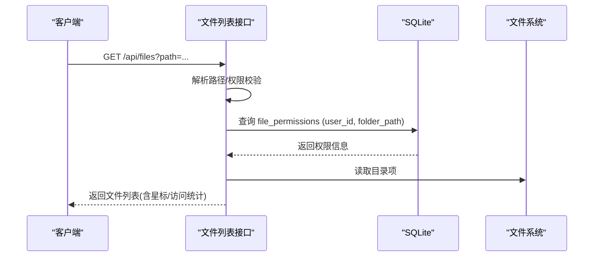

#### 创建分享链接
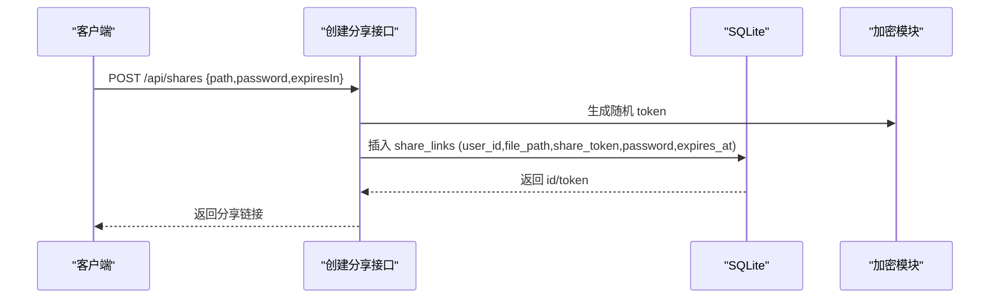

#### 服务记录升级为工单
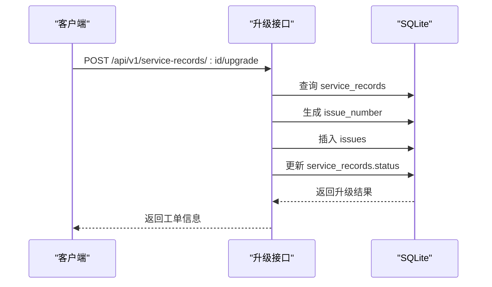

#### 统一工单系统工作流
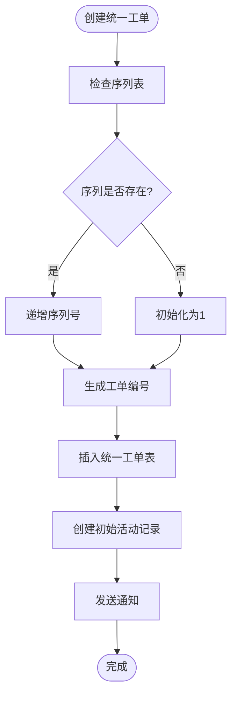

#### 工单活动时间轴
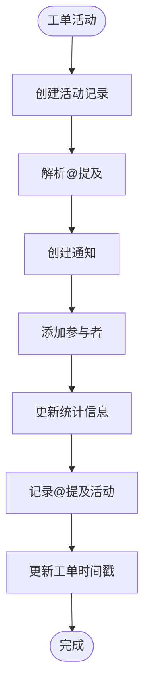

#### 通知系统工作流
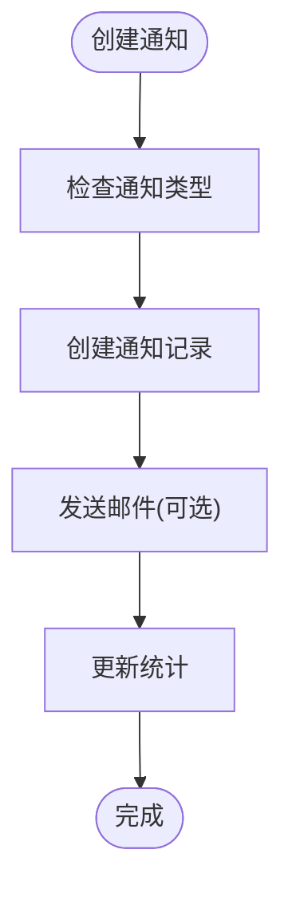

#### **更新** 文件权限查询优化
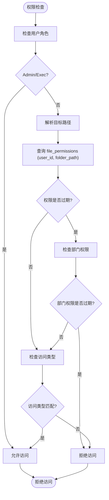

#### **新增** 产品规格查询流程
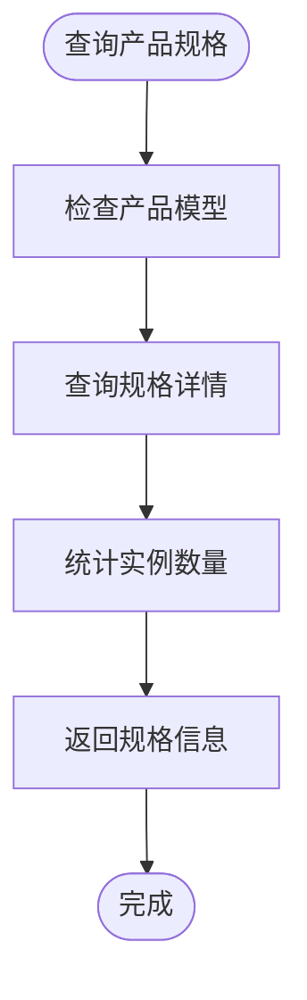

#### 批量分享集合
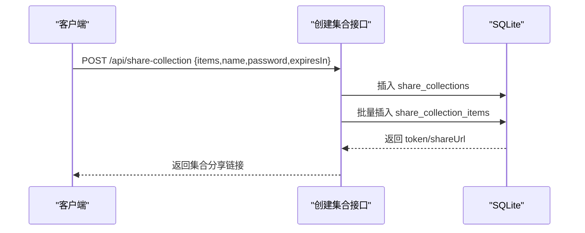

#### 回收站清理
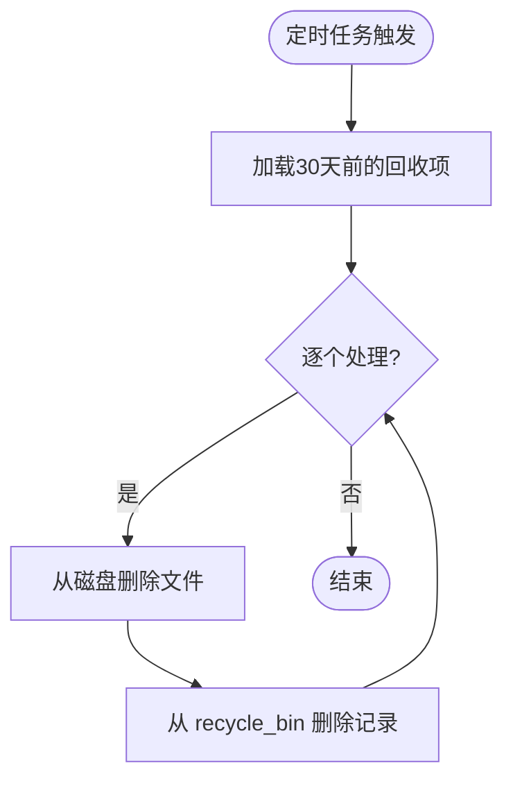

## 依赖分析
- 初始化依赖：better-sqlite3、dotenv、fs-extra、bcryptjs、multer、archiver、sharp、express、compression、cors、jsonwebtoken。
- 迁移与校验：通过 SQL 脚本与 shell 脚本维护结构与数据一致性。
- 词汇表：启动时检测 vocabulary 表是否为空，若空则批量导入种子数据。
- **新增** 文件权限优化：专门的迁移脚本负责权限表的结构优化和数据迁移。
- **新增** 统一工单系统：单表多态设计，支持咨询工单、RMA工单、服务工单三种类型。
- **新增** 工单活动时间轴：完整的协作历史记录系统。
- **新增** 通知中心：macOS风格的通知系统，支持多种通知类型。
- **新增** 参与者协作机制：支持多种角色和通知偏好设置。
- **新增** 工单序列表：统一的编号生成机制，支持多类型和多渠道。
- **新增** 用户统计系统：@提及统计和邀请统计，优化用户体验。
- **新增** 服务管理系统：独立的迁移文件和路由模块，支持完整的工单生命周期管理。
- **新增** 三层工单模型：咨询工单、RMA工单、经销商维修单的完整实现。
- **新增** 工单序列管理：独立的序列表确保编号的唯一性和连续性。
- **新增** 权限中间件：提供基于角色的权限控制和 View As 功能。
- **新增** 产品架构升级：从两层产品架构向三层架构演进，支持更精细的产品管理。

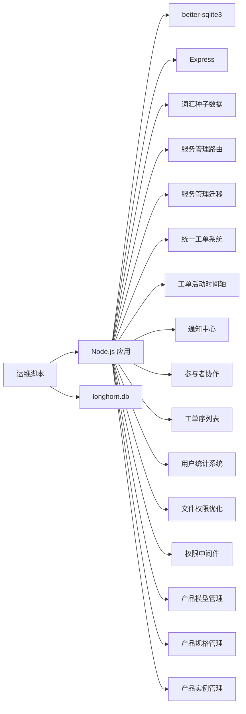

图表来源
- [server/index.js:1-14](file://server/index.js#L1-L14)
- [server/index.js:80-111](file://server/index.js#L80-L111)
- [server/migrate_file_permissions.js:1-138](file://server/migrate_file_permissions.js#L1-L138)
- [server/service/middleware/permission.js:83-210](file://server/service/middleware/permission.js#L83-L210)
- [server/service/routes/service-records.js:8-797](file://server/service/routes/service-records.js#L8-L797)
- [server/service/routes/tickets.js:1-200](file://server/service/routes/tickets.js#L1-L200)
- [server/service/routes/ticket-activities.js:1-454](file://server/service/routes/ticket-activities.js#L1-L454)
- [server/service/routes/notifications.js:1-467](file://server/service/routes/notifications.js#L1-L467)
- [server/service/routes/product-skus.js:1-309](file://server/service/routes/product-skus.js#L1-L309)
- [server/service/migrations/020_p2_unified_tickets.sql:1-271](file://server/service/migrations/020_p2_unified_tickets.sql#L1-L271)
- [server/service/migrations/023_ticket_participants.sql:1-78](file://server/service/migrations/023_ticket_participants.sql#L1-L78)
- [server/service/migrations/033_product_architecture_upgrade.sql:1-54](file://server/service/migrations/033_product_architecture_upgrade.sql#L1-L54)
- [scripts/db-validate.sh:1-52](file://scripts/db-validate.sh#L1-L52)

章节来源
- [server/index.js:1-14](file://server/index.js#L1-L14)
- [server/index.js:80-111](file://server/index.js#L80-L111)
- [server/migrate_file_permissions.js:1-138](file://server/migrate_file_permissions.js#L1-L138)
- [server/service/middleware/permission.js:83-210](file://server/service/middleware/permission.js#L83-L210)

## 性能考量
- WAL 模式：开启 WAL 提升并发读写性能。
- 事务批处理：上传与合并分块使用事务减少锁竞争。
- 索引优化：为高频查询字段建立索引（如 user_id、file_path、share_token、record_number、issue_number）。
- **更新** 文件权限查询优化：
  - 唯一索引 (user_id, folder_path) 防止重复授权并加速查询
  - path_hash 索引支持快速路径哈希查询
  - 条件索引 expires_at 优化过期时间过滤
  - 触发器确保用户删除时权限数据的完整性
- **新增** 产品架构性能优化：
  - product_models 表的唯一索引优化模型查询
  - product_skus 表的复合索引优化规格查询
  - products 表的多字段索引优化实例查询
  - 三层架构减少 JOIN 操作，提升查询性能
- **新增** 产品规格查询优化：
  - sku_code 唯一索引确保规格查找性能
  - model_id 索引支持模型级别的规格查询
  - 规格实例数量统计优化规格展示
- **新增** 统一工单系统性能优化：
  - 单表多态设计减少 JOIN 操作，提升查询性能
  - 工单活动时间轴支持分页查询，避免大数据量影响
  - 通知系统支持延迟加载和批量处理
  - 参与者协作机制支持增量更新
  - 工单序列表使用原子操作确保编号唯一性
- 缓存策略：
  - 缩略图缓存：.thumbnails 目录缓存生成结果，命中直接返回。
  - 静态资源缓存：静态页面与前端产物设置较长缓存。
  - ETag：目录列表根据文件名、修改时间、大小与星标数量生成 ETag，支持条件请求。
  - **新增** 产品模型和规格的查询缓存：热点数据的二级缓存。
  - **新增** 产品实例的统计缓存：规格实例数量的缓存策略。
  - **新增** 服务记录和工单的查询缓存：热点数据的二级缓存。
  - **新增** 工单序列的内存缓存：避免频繁访问序列表。
  - **新增** 权限检查缓存：热门路径的权限结果缓存。
  - **新增** 工单活动时间轴缓存：近期活动的缓存策略。
  - **新增** 通知系统缓存：未读通知数量的缓存。
- I/O 限制：缩略图生成队列限制并发，避免 CPU/IO 过载。
- 查询优化：
  - file_stats 作为访问统计主表，避免频繁扫描文件系统。
  - 星标匹配使用多条件 LIKE 与精确匹配组合，减少全表扫描。
  - 分享集合访问时先校验 token/密码/过期，再读取条目。
  - **新增** 统一工单系统的复合查询优化，支持多类型和多状态组合查询。
  - **新增** 工单序列的原子性操作，确保编号的唯一性。
  - **新增** 知识库全文检索优化，使用 FTS5 提升搜索性能。
  - **新增** 权限查询的多级缓存策略，提升权限检查性能。
  - **新增** 工单活动时间轴的分页查询优化，支持大数据量场景。
  - **新增** 通知系统的批量处理机制，提升系统吞吐量。
  - **新增** 产品规格查询的多字段索引优化，提升规格查找性能。

章节来源
- [server/index.js:29-31](file://server/index.js#L29-L31)
- [server/index.js:824-832](file://server/index.js#L824-L832)
- [server/index.js:556-577](file://server/index.js#L556-L577)
- [server/index.js:2321-2342](file://server/index.js#L2321-L2342)
- [server/index.js:2442-2467](file://server/index.js#L2442-L2467)
- [server/migrate_file_permissions.js:72-98](file://server/migrate_file_permissions.js#L72-L98)
- [server/service/migrations/005_knowledge_base.sql:52-75](file://server/service/migrations/005_knowledge_base.sql#L52-L75)
- [server/service/migrations/020_p2_unified_tickets.sql:124-141](file://server/service/migrations/020_p2_unified_tickets.sql#L124-L141)
- [server/service/migrations/023_ticket_participants.sql:40-44](file://server/service/migrations/023_ticket_participants.sql#L40-L44)
- [server/service/migrations/033_product_architecture_upgrade.sql:19-21](file://server/service/migrations/033_product_architecture_upgrade.sql#L19-L21)
- [server/service/migrations/034_fix_product_models_and_seed.sql:20-20](file://server/service/migrations/034_fix_product_models_and_seed.sql#L20-L20)
- [server/service/migrations/035_force_seed_models_skus.sql:28-28](file://server/service/migrations/035_force_seed_models_skus.sql#L28-L28)

## 故障排查指南
- 结构校验与自动修复
  - 使用 db-validate.sh 检查表结构并自动修复缺失列（如 last_login），打印修复过程。
- 快速检查
  - 使用 check_db.js 打印 departments 与 admin 用户信息，便于快速确认数据库可用性。
- 性能诊断
  - 使用 diagnose-performance.sh 收集 PM2 状态、本地 API 延迟、数据库记录数、图片分布、隧道状态与系统资源等信息。
- 远程同步
  - sync-remote-db.sh：通过登录获取 Token，调用 /api/admin/restore-db 实现远程数据库恢复。
  - sync-db.sh：通过 scp 将本地修复后的数据库覆盖到远端服务器。
- **更新** 文件权限故障排查
  - 检查 file_permissions 表结构：验证表名、字段和索引是否正确
  - 验证 path_hash 字段：确保所有记录都有正确的哈希值
  - 检查权限索引：确认唯一索引和条件索引正常工作
  - 测试权限查询：验证权限检查逻辑的正确性
  - 触发器检查：确认级联删除触发器正常工作
- **新增** 产品架构故障排查
  - 检查产品模型表结构：验证 product_models 表的完整性
  - 检查产品规格表结构：验证 product_skus 表的完整性
  - 检查产品实例表结构：验证 products 表的完整性
  - 验证三层架构关系：确保外键约束和索引正常
  - 规格查询测试：验证 SKU 查询和实例统计功能
  - 数据迁移验证：确认从旧架构到新架构的数据迁移完整性
- **新增** 产品规格管理故障排查
  - 检查规格唯一性：验证 sku_code 的唯一性约束
  - 检查模型关联：验证 model_id 外键约束
  - 检查规格创建：验证规格创建和更新流程
  - 检查规格删除：验证规格删除时的依赖检查
  - 检查规格查询：验证多字段查询和过滤功能
- **新增** 产品实例管理故障排查
  - 检查实例状态：验证 status 字段的检查约束
  - 检查 SKU 关联：验证 sku_id 外键约束
  - 检查实例查询：验证多字段索引的查询性能
  - 检查实例统计：验证规格实例数量的统计准确性
- **新增** 统一工单系统故障排查
  - 检查统一工单表结构：验证多态设计的正确性
  - 工单编号生成：验证 ticket_sequences 表的序列正确性
  - 工单活动时间轴：检查活动记录的完整性和查询性能
  - 通知系统：验证通知创建和分发的正确性
  - 参与者协作：检查参与者添加和通知偏好的设置
  - 数据迁移：验证从三层工单到统一工单的数据迁移完整性
- **新增** 工单活动时间轴故障排查
  - 检查活动类型枚举：确保所有活动类型都在约束范围内
  - 通知创建：验证@提及通知的创建和分发
  - 参与者添加：检查自动添加参与者的逻辑
  - 统计更新：验证@提及统计和邀请统计的准确性
- **新增** 通知系统故障排查
  - 通知类型验证：确保所有通知类型都在约束范围内
  - 生命周期管理：检查通知的创建、读取、归档、删除流程
  - 批量操作：验证批量标记已读和清理操作的正确性
  - 系统公告：检查系统公告的创建和分发机制
- **新增** 工单序列表故障排查
  - 编号生成：验证不同工单类型的编号生成逻辑
  - 渠道代码：检查RMA工单的渠道代码处理
  - 年月格式：验证年月格式的正确性和唯一性约束
  - 原子操作：确保编号生成的原子性和一致性
- **新增** 参与者协作系统故障排查
  - 角色验证：确保所有角色都在约束范围内
  - 加入方式：检查@提及、手动邀请、自动加入的处理逻辑
  - 通知偏好：验证通知偏好的设置和影响
  - 统计系统：检查@提及统计和邀请统计的准确性
- **新增** 用户统计系统故障排查
  - 统计更新：验证@提及统计和邀请统计的更新逻辑
  - 去重机制：确保重复统计的正确处理
  - 时间戳更新：检查最后@时间和最后邀请时间的更新
  - 查询优化：验证统计查询的性能和准确性

章节来源
- [scripts/db-validate.sh:1-52](file://scripts/db-validate.sh#L1-L52)
- [scripts/check_db.js:1-20](file://scripts/check_db.js#L1-L20)
- [scripts/diagnose-performance.sh:1-122](file://scripts/diagnose-performance.sh#L1-L122)
- [scripts/sync-remote-db.sh:1-54](file://scripts/sync-remote-db.sh#L1-L54)
- [scripts/sync-db.sh:1-28](file://scripts/sync-db.sh#L1-L28)
- [server/migrate_file_permissions.js:1-138](file://server/migrate_file_permissions.js#L1-L138)
- [server/migrations/fix_departments_permissions.sql:1-58](file://server/migrations/fix_departments_permissions.sql#L1-L58)
- [server/service/migrations/020_p2_unified_tickets.sql:1-271](file://server/service/migrations/020_p2_unified_tickets.sql#L1-L271)
- [server/service/migrations/021_migrate_tickets_data.js:1-337](file://server/service/migrations/021_migrate_tickets_data.js#L1-L337)
- [server/service/migrations/023_ticket_participants.sql:1-78](file://server/service/migrations/023_ticket_participants.sql#L1-L78)
- [server/service/migrations/033_product_architecture_upgrade.sql:1-54](file://server/service/migrations/033_product_architecture_upgrade.sql#L1-L54)
- [server/service/migrations/034_fix_product_models_and_seed.sql:1-49](file://server/service/migrations/034_fix_product_models_and_seed.sql#L1-L49)
- [server/service/migrations/035_force_seed_models_skus.sql:1-40](file://server/service/migrations/035_force_seed_models_skus.sql#L1-L40)
- [server/service/routes/product-skus.js:1-309](file://server/service/routes/product-skus.js#L1-L309)
- [server/service/routes/ticket-activities.js:1-454](file://server/service/routes/ticket-activities.js#L1-L454)
- [server/service/routes/notifications.js:1-467](file://server/service/routes/notifications.js#L1-L467)

## 结论
Longhorn 的 SQLite 设计围绕"用户-部门-权限-文件-分享"核心域展开，通过外键与唯一约束保障数据完整性，配合索引与事务提升性能。分享功能支持单文件与批量集合，具备密码与过期控制；回收站机制与定期清理确保空间管理；缩略图缓存与 ETag 优化显著改善用户体验。

**更新** 数据库架构经历了重大升级，实现了从两层产品架构（模型-实例）向三层架构（模型-规格-实例）的演进。新增的 product_skus 表为产品管理提供了更精细的规格控制能力，支持材料标识、规格标签、多语言显示等功能。统一工单系统经过重大架构升级，采用单表多态设计，支持咨询工单、RMA工单、服务工单三种类型。新增工单活动时间轴、通知中心、参与者协作机制等核心功能，显著提升了工单管理的灵活性和可扩展性。

**更新** 文件权限系统经过重大优化，包括表重命名、索引策略改进和触发器实现，显著提升了权限查询性能和数据完整性保障。新的 file_permissions 表支持更细粒度的目录访问控制、路径哈希优化查询性能、过期时间管理以及级联删除触发器确保数据一致性。

**更新** 新增的三层工单模型实现了完整的客户服务流程，从咨询到维修的完整闭环。咨询工单（inquiry_tickets）作为第一层入口，负责初步问题诊断和客户沟通；RMA 工单（rma_tickets）作为第二层，处理物理维修和返厂流程；经销商维修单（dealer_repairs）作为第三层，专注于现场维修和保养服务。每个层级都有独立的编号生成机制、状态管理和升级流程，形成了清晰的服务层次结构。

**更新** 产品架构升级为 Longhorn 的产品管理能力提供了强大的技术支撑。三层架构的设计不仅提升了系统的功能完整性，也为用户提供了更好的使用体验。产品模型、规格和实例的分离管理，使得产品信息的组织更加清晰，规格控制更加精细，实例管理更加高效。

服务记录系统提供轻量级客户服务跟踪，工单系统支持复杂的维修管理，知识库系统提供文档管理，配件库存系统支持经销商管理。所有系统都具备完善的索引优化和查询性能保障。统一工单系统的引入标志着 Longhorn 服务管理能力的重大升级，为后续的功能扩展和业务发展奠定了坚实的基础。文件权限系统的优化进一步增强了系统的安全性和性能表现。

运维侧提供完善的校验、诊断与同步脚本，便于生产环境稳定运行。三层产品架构、统一工单系统、工单活动时间轴、通知中心、参与者协作机制等新功能的引入，为 Longhorn 的持续发展提供了强大的技术支撑。这些改进不仅提升了系统的功能完整性，也为用户提供了更好的使用体验。

## 附录

### 数据字典

#### 基础表
- departments
  - id: 主键
  - name: 唯一
  - code: 唯一
- users
  - id: 主键
  - username: 唯一
  - password: 密码哈希
  - role: 角色
  - department_id: 外键
  - department_name: 部门显示名
  - created_at: 注册时间
- **更新** file_permissions
  - id: 主键
  - user_id: 外键
  - folder_path: 授权目录
  - access_type: 访问类型
  - expires_at: 过期时间
  - path_hash: 路径哈希（优化查询）
  - created_at: 授权时间
- file_stats
  - path: 主键
  - uploader_id: 外键
  - access_count: 访问计数
  - last_access: 最后访问时间
- access_logs
  - path + user_id: 联合主键
  - username: 访问者
  - count: 访问次数
  - last_access: 最后访问时间
- starred_files
  - id: 主键
  - user_id: 外键
  - file_path: 星标路径
  - starred_at: 时间
- recycle_bin
  - id: 主键
  - name: 文件名
  - original_path: 原始路径
  - deleted_path: 回收站内相对路径
  - user_id: 外键
  - is_directory: 是否目录
  - deletion_date: 删除时间
- share_links
  - id: 主键
  - user_id: 外键
  - file_path: 分享路径
  - share_token: 唯一
  - password: 密码哈希
  - expires_at: 过期时间
  - access_count: 访问计数
  - last_accessed: 最后访问时间
  - created_at: 创建时间
- share_collections
  - id: 主键
  - user_id: 外键
  - token: 唯一
  - name: 集合名称
  - password: 密码哈希
  - expires_at: 过期时间
  - access_count: 访问计数
  - last_accessed: 最后访问时间
  - created_at: 创建时间
- share_collection_items
  - id: 主键
  - collection_id: 外键（级联删除）
  - file_path: 条目路径
  - is_directory: 是否目录
  - added_at: 添加时间
- vocabulary
  - id: 主键
  - language: 语言
  - level: 等级
  - word: 单词
  - phonetic: 音标
  - meaning: 英文释义
  - meaning_zh: 中文释义
  - part_of_speech: 词性
  - examples: JSON 示例
  - image: 图标
  - created_at: 创建时间

#### 产品架构升级
- **新增** product_models
  - id: 主键
  - model_name: 唯一
  - name_en: 英文名称
  - brand: 品牌
  - internal_name: 内部名称
  - internal_prefix: 内部前缀
  - product_family: 产品系列
  - product_type: 产品类型
  - description: 描述
  - hero_image: 英雄图片
  - is_active: 是否激活
  - created_at: 创建时间
  - updated_at: 更新时间
- **新增** product_skus
  - id: 主键
  - model_id: 外键
  - sku_code: 唯一
  - erp_code: ERP代码
  - display_name: 显示名称
  - display_name_en: 英文显示名称
  - spec_label: 规格标签
  - sku_image: 规格图片
  - is_active: 是否激活
  - created_at: 创建时间
  - updated_at: 更新时间
- **更新** products
  - id: 主键
  - model_name: 模型名称
  - product_sku: 产品SKU
  - serial_number: 序列号
  - owner_name: 所有者姓名
  - owner_email: 所有者邮箱
  - owner_phone: 所有者电话
  - current_owner_id: 当前所有者
  - registration_date: 注册日期
  - sales_channel: 销售渠道
  - original_order_id: 原始订单号
  - sold_to_dealer_id: 销售给经销商
  - ship_to_dealer_date: 发运给经销商日期
  - is_iot_device: 是否物联网设备
  - is_activated: 是否已激活
  - activation_date: 激活日期
  - last_connected_at: 最后连接时间
  - ip_address: IP地址
  - warranty_source: 保修来源
  - warranty_start_date: 保修开始日期
  - warranty_months: 保修月份
  - warranty_end_date: 保修结束日期
  - warranty_status: 保修状态
  - status: 状态（ACTIVE/IN_REPAIR/STOLEN/SCRAPPED）
  - sku_id: 规格ID
  - grade: 等级（A/B/C）
  - specification: 规格说明
  - warehouse: 仓库
  - entry_channel: 入库渠道
  - product_type: 产品类型
  - created_at: 创建时间
  - updated_at: 更新时间

#### 统一工单系统
- tickets
  - id: 主键
  - ticket_number: 唯一
  - ticket_type: 工单类型（多态）
  - current_node: 状态机节点
  - status: 状态
  - status_changed_at: 状态变更时间
  - priority: 优先级
  - node_entered_at: 进入节点时间
  - sla_due_at: SLA截止时间
  - sla_status: SLA状态
  - breach_counter: 超时计数
  - participants: 参与者JSON
  - snooze_until: 贪睡截止时间
  - account_id: 账户ID
  - contact_id: 联系人ID
  - dealer_id: 经销商ID
  - reporter_name: 报告人姓名
  - reporter_type: 报告人类型
  - region: 地区
  - product_id: 产品ID
  - serial_number: 序列号
  - firmware_version: 固件版本
  - hardware_version: 硬件版本
  - issue_type: 问题类型
  - issue_category: 问题分类
  - issue_subcategory: 问题子分类
  - severity: 严重程度
  - service_type: 服务类型
  - channel: 渠道
  - problem_summary: 问题摘要
  - communication_log: 通信记录
  - problem_description: 问题描述
  - solution_for_customer: 客户解决方案
  - is_warranty: 是否保修
  - repair_content: 维修内容
  - problem_analysis: 问题分析
  - resolution: 处理结果
  - submitted_by: 提交人
  - assigned_to: 处理人
  - created_by: 创建人
  - payment_channel: 付款渠道
  - payment_amount: 付款金额
  - payment_date: 付款日期
  - feedback_date: 反馈日期
  - ship_date: 发运日期
  - received_date: 收货日期
  - completed_date: 完成日期
  - first_response_at: 首次响应时间
  - first_response_minutes: 首次响应分钟数
  - waiting_customer_since: 等待客户开始时间
  - auto_close_reminder_sent: 自动关闭提醒发送
  - auto_close_at: 自动关闭时间
  - parent_ticket_id: 父工单ID
  - reopened_from_id: 重新打开来源
  - external_link: 外部链接
  - channel_code: 渠道代码
  - approval_status: 审批状态
  - approved_by: 审批人
  - approved_at: 审批时间
  - created_at: 创建时间
  - updated_at: 更新时间

- ticket_activities
  - id: 主键
  - ticket_id: 外键
  - activity_type: 活动类型
  - content: 活动内容
  - content_html: HTML内容
  - metadata: 元数据JSON
  - visibility: 可见性
  - actor_id: 操作人ID
  - actor_name: 操作人姓名
  - actor_role: 操作人角色
  - is_edited: 是否编辑
  - edited_at: 编辑时间
  - created_at: 创建时间

- notifications
  - id: 主键
  - recipient_id: 外键
  - notification_type: 通知类型
  - title: 标题
  - content: 内容
  - icon: 图标
  - related_type: 关联类型
  - related_id: 关联ID
  - action_url: 跳转URL
  - metadata: 元数据JSON
  - is_read: 是否已读
  - read_at: 已读时间
  - is_archived: 是否归档
  - created_at: 创建时间

- ticket_sequences
  - id: 主键
  - ticket_type: 工单类型
  - channel_code: 渠道代码
  - year_month: 年月
  - last_sequence: 最后序列号
  - created_at: 创建时间
  - updated_at: 更新时间

- ticket_participants
  - id: 主键
  - ticket_id: 外键
  - user_id: 外键
  - role: 角色
  - added_by: 邀请人
  - join_method: 加入方式
  - notify_level: 通知偏好
  - joined_at: 加入时间
  - last_viewed_at: 最后查看时间

- user_mention_stats
  - id: 主键
  - user_id: 外键
  - mentioned_user_id: 外键
  - mention_count: 提及次数
  - last_mention_at: 最后提及时间

- user_invite_stats
  - id: 主键
  - user_id: 外键
  - invited_user_id: 外键
  - invite_count: 邀请次数
  - last_invite_at: 最后邀请时间

#### 服务记录系统
- service_records
  - id: 主键
  - record_number: 唯一
  - service_mode: 服务模式
  - customer_name: 客户姓名
  - customer_contact: 客户联系方式
  - customer_id: 外键
  - dealer_id: 外键
  - product_id: 外键
  - product_name: 产品名称
  - serial_number: 序列号
  - firmware_version: 固件版本
  - hardware_version: 硬件版本
  - service_type: 服务类型
  - channel: 渠道
  - problem_summary: 问题摘要
  - problem_category: 问题分类
  - communication_log: 通信日志
  - status: 状态
  - resolution: 解决方案
  - resolution_type: 解决类型
  - handler_id: 处理人
  - department: 部门
  - first_response_at: 首次响应时间
  - resolved_at: 解决时间
  - waiting_customer_since: 等待客户开始时间
  - upgraded_to_issue_id: 升级到工单ID
  - upgrade_reason: 升级原因
  - created_by: 创建人
  - created_at: 创建时间
  - updated_at: 更新时间

#### 工单管理系统
- issues
  - id: 主键
  - issue_number: 唯一
  - rma_number: RMA编号
  - ticket_type: 工单类型
  - issue_type: 问题类型
  - issue_category: 问题分类
  - issue_subcategory: 问题子分类
  - severity: 严重程度
  - service_priority: 服务优先级
  - repair_priority: 维修优先级
  - status: 状态
  - title: 标题
  - description: 描述
  - problem_description: 问题描述
  - solution_for_customer: 客户解决方案
  - is_warranty: 是否保修
  - repair_content: 维修内容
  - problem_analysis: 问题分析
  - reporter_name: 报告人姓名
  - reporter_type: 报告人类型
  - customer_id: 外键
  - dealer_id: 外键
  - region: 区域
  - source_service_record_id: 来源服务记录ID
  - external_link: 外部链接
  - feedback_date: 反馈日期
  - ship_date: 发运日期
  - received_date: 收货日期
  - completed_date: 完成日期
  - closed_by: 关闭人
  - closed_at: 关闭时间
  - first_response_at: 首次响应时间
  - assigned_at: 分配时间
  - repair_started_at: 维修开始时间
  - repair_completed_at: 维修完成时间
  - preferred_contact_method: 首选联系方式
  - estimated_completion_date: 预计完成日期
  - created_by: 创建人
  - created_at: 创建时间
  - updated_at: 更新时间

#### 三层工单模型
- inquiry_tickets
  - id: 主键
  - ticket_number: 唯一
  - customer_name: 客户姓名
  - customer_contact: 客户联系方式
  - customer_id: 外键
  - dealer_id: 外键
  - product_id: 外键
  - serial_number: 序列号
  - service_type: 服务类型
  - channel: 渠道
  - problem_summary: 问题摘要
  - communication_log: 通信日志
  - resolution: 解决方案
  - status: 状态
  - handler_id: 外键
  - created_by: 外键
  - upgraded_to_type: 升级类型
  - upgraded_to_id: 升级ID
  - upgraded_at: 升级时间
  - first_response_at: 首次响应时间
  - resolved_at: 解决时间
  - reopened_at: 重新打开时间
  - created_at: 创建时间
  - updated_at: 更新时间

- rma_tickets
  - id: 主键
  - ticket_number: 唯一
  - channel_code: 渠道代码
  - issue_type: 问题类型
  - issue_category: 问题分类
  - issue_subcategory: 问题子分类
  - severity: 严重程度
  - product_id: 外键
  - serial_number: 序列号
  - firmware_version: 固件版本
  - hardware_version: 硬件版本
  - problem_description: 问题描述
  - solution_for_customer: 客户解决方案
  - is_warranty: 是否保修
  - repair_content: 维修内容
  - problem_analysis: 问题分析
  - reporter_name: 报告人姓名
  - customer_id: 外键
  - dealer_id: 外键
  - submitted_by: 外键
  - assigned_to: 外键
  - inquiry_ticket_id: 外键
  - payment_channel: 付款渠道
  - payment_amount: 付款金额
  - payment_date: 付款日期
  - status: 状态
  - repair_priority: 维修优先级
  - feedback_date: 反馈日期
  - received_date: 收货日期
  - completed_date: 完成日期
  - approval_status: 审批状态
  - approved_by: 外键
  - approved_at: 审批时间
  - created_at: 创建时间
  - updated_at: 更新时间

- dealer_repairs
  - id: 主键
  - ticket_number: 唯一
  - dealer_id: 外键
  - customer_name: 客户姓名
  - customer_contact: 客户联系方式
  - customer_id: 外键
  - product_id: 外键
  - serial_number: 序列号
  - issue_category: 问题分类
  - issue_subcategory: 问题子分类
  - problem_description: 问题描述
  - repair_content: 维修内容
  - inquiry_ticket_id: 外键
  - status: 状态
  - created_at: 创建时间
  - updated_at: 更新时间

- inquiry_ticket_sequences
  - id: 主键
  - year_month: 唯一
  - last_sequence: 序列号
  - created_at: 创建时间
  - updated_at: 更新时间

- rma_ticket_sequences
  - id: 主键
  - channel_code: 渠道代码
  - year_month: 年月
  - last_sequence: 序列号
  - created_at: 创建时间
  - updated_at: 更新时间

- dealer_repair_sequences
  - id: 主键
  - year_month: 唯一
  - last_sequence: 序列号
  - created_at: 创建时间
  - updated_at: 更新时间

- dealer_repair_parts
  - id: 主键
  - dealer_repair_id: 外键
  - part_id: 配件ID
  - part_name: 配件名称
  - quantity: 数量
  - unit_price: 单价
  - created_at: 创建时间

#### 经销商与合作伙伴
- dealers
  - id: 主键
  - name: 名称
  - code: 唯一
  - dealer_type: 经销商类型
  - region: 区域
  - country: 国家
  - city: 城市
  - contact_person: 联系人
  - contact_email: 联系邮箱
  - contact_phone: 联系电话
  - can_repair: 是否可维修
  - repair_level: 维修级别
  - notes: 备注
  - created_at: 创建时间
  - updated_at: 更新时间

#### 知识库系统
- knowledge_articles
  - id: 主键
  - title: 标题
  - slug: 唯一
  - summary: 摘要
  - content: 内容
  - category: 分类
  - subcategory: 子分类
  - tags: 标签
  - product_line: 产品线
  - product_models: 产品型号
  - firmware_versions: 固件版本
  - visibility: 可见性
  - department_ids: 部门ID
  - status: 状态
  - published_at: 发布时间
  - view_count: 查看次数
  - helpful_count: 有用次数
  - not_helpful_count: 无用次数
  - created_by: 创建人
  - updated_by: 更新人
  - created_at: 创建时间
  - updated_at: 更新时间

- knowledge_article_versions
  - id: 主键
  - article_id: 外键
  - version: 版本
  - title: 标题
  - content: 内容
  - change_summary: 变更摘要
  - created_by: 创建人
  - created_at: 创建时间

- compatibility_tests
  - id: 主键
  - product_model: 产品型号
  - firmware_version: 固件版本
  - target_type: 目标类型
  - target_brand: 目标品牌
  - target_model: 目标型号
  - target_version: 目标版本
  - compatibility_status: 兼容性状态
  - test_date: 测试日期
  - test_notes: 测试备注
  - known_issues: 已知问题
  - workarounds: 解决方案
  - related_article_id: 外键
  - tested_by: 测试人
  - created_at: 创建时间
  - updated_at: 更新时间

#### 配件库存系统
- parts_catalog
  - id: 主键
  - part_number: 唯一
  - part_name: 配件名称
  - part_name_en: 英文名称
  - description: 描述
  - category: 分类
  - subcategory: 子分类
  - applicable_products: 适用产品
  - cost_price: 成本价格
  - retail_price: 零售价格
  - dealer_price: 经销商价格
  - min_stock_level: 最小库存
  - reorder_quantity: 重购数量
  - lead_time_days: 交货时间
  - is_active: 是否激活
  - is_sellable: 是否可销售
  - created_at: 创建时间
  - updated_at: 更新时间

- dealer_inventory
  - id: 主键
  - dealer_id: 外键
  - part_id: 外键
  - quantity: 数量
  - reserved_quantity: 预留数量
  - available_quantity: 可用数量
  - min_stock_level: 最小库存
  - max_stock_level: 最大库存
  - reorder_point: 重购点
  - last_inbound_date: 最近入库日期
  - last_outbound_date: 最近出库日期
  - created_at: 创建时间
  - updated_at: 更新时间

- inventory_transactions
  - id: 主键
  - dealer_id: 外键
  - part_id: 外键
  - transaction_type: 交易类型
  - quantity: 数量
  - reference_type: 引用类型
  - reference_id: 引用ID
  - balance_after: 余额
  - reason: 原因
  - notes: 备注
  - created_by: 创建人
  - created_at: 创建时间

#### 系统配置
- system_dictionaries
  - id: 主键
  - dict_type: 字典类型
  - dict_key: 键
  - dict_value: 值
  - sort_order: 排序
  - is_active: 是否激活
  - created_at: 创建时间

- service_sequences
  - id: 主键
  - sequence_key: 序列键
  - last_sequence: 最后序列号
  - created_at: 创建时间
  - updated_at: 更新时间

### ER 图（代码级）
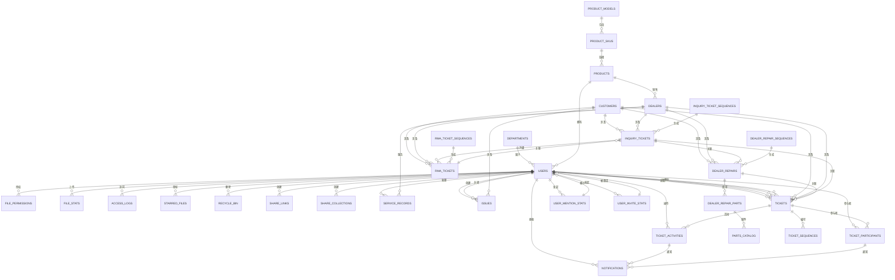

图表来源
- [server/index.js:34-78](file://server/index.js#L34-L78)
- [server/migrate_file_permissions.js:1-138](file://server/migrate_file_permissions.js#L1-L138)
- [server/service/migrations/020_p2_unified_tickets.sql:8-122](file://server/service/migrations/020_p2_unified_tickets.sql#L8-L122)
- [server/service/migrations/023_ticket_participants.sql:8-38](file://server/service/migrations/023_ticket_participants.sql#L8-L38)
- [server/service/migrations/001_extend_issues.sql:56-73](file://server/service/migrations/001_extend_issues.sql#L56-L73)
- [server/service/migrations/002_service_records.sql:10-66](file://server/service/migrations/002_service_records.sql#L10-L66)
- [server/service/migrations/009_three_layer_tickets.sql:6-123](file://server/service/migrations/009_three_layer_tickets.sql#L6-L123)
- [server/service/migrations/033_product_architecture_upgrade.sql:4-54](file://server/service/migrations/033_product_architecture_upgrade.sql#L4-L54)
- [server/service/migrations/034_fix_product_models_and_seed.sql:5-49](file://server/service/migrations/034_fix_product_models_and_seed.sql#L5-L49)
- [server/service/migrations/035_force_seed_models_skus.sql:6-40](file://server/service/migrations/035_force_seed_models_skus.sql#L6-L40)

### 数据迁移与版本管理
- 启动时初始化：创建核心表与索引。
- 迁移脚本：新增功能（星标、分享、集合、服务记录、工单、统一工单系统、工单活动时间轴、通知系统、参与者协作机制、产品架构升级）通过独立 SQL 文件管理。
- **更新** 文件权限优化：专门的迁移脚本负责权限表的结构优化和数据迁移。
- **更新** 统一工单系统迁移：通过 JavaScript 脚本从三层工单模型迁移到统一工单表，保持数据完整性。
- **新增** 产品架构迁移：通过多个迁移脚本实现从两层架构向三层架构的演进。
- **新增** 产品模型迁移：创建 product_models 表并填充标准数据。
- **新增** 产品规格迁移：创建 product_skus 表并从现有产品数据生成规格。
- **新增** 产品实例迁移：扩展 products 表并建立 SKU 关联。
- 自动播种：词汇表为空时批量导入种子数据。
- 结构校验：db-validate.sh 动态检查并修复缺失列。
- **新增** 工单活动时间轴迁移：支持从旧的评论系统迁移到新的活动时间轴。
- **新增** 通知系统迁移：支持从旧的通知机制迁移到新的通知中心。
- **新增** 参与者协作机制迁移：支持从旧的协作方式迁移到新的参与者系统。
- **新增** 用户统计系统迁移：支持从旧的统计方式迁移到新的统计系统。
- **新增** 工单序列表迁移：确保编号序列的连续性在迁移过程中得到保持。
- **新增** 权限中间件：提供基于角色的权限控制和 View As 功能。

章节来源
- [server/index.js:34-78](file://server/index.js#L34-L78)
- [server/migrate_file_permissions.js:1-138](file://server/migrate_file_permissions.js#L1-L138)
- [server/migrations/phase2.sql:1-32](file://server/migrations/phase2.sql#L1-L32)
- [server/migrations/add_share_collections.sql:1-32](file://server/migrations/add_share_collections.sql#L1-L32)
- [server/migrations/fix_departments_permissions.sql:1-58](file://server/migrations/fix_departments_permissions.sql#L1-L58)
- [server/migrations/015_extend_products_installed_base.sql:1-54](file://server/migrations/015_extend_products_installed_base.sql#L1-L54)
- [server/migrations/016_add_product_models.sql:1-20](file://server/migrations/016_add_product_models.sql#L1-L20)
- [server/migrations/017_add_product_status.sql:1-17](file://server/migrations/017_add_product_status.sql#L1-L17)
- [server/service/migrations/001_extend_issues.sql:1-196](file://server/service/migrations/001_extend_issues.sql#L1-L196)
- [server/service/migrations/002_service_records.sql:1-174](file://server/service/migrations/002_service_records.sql#L1-L174)
- [server/service/migrations/003_issue_types.sql:1-138](file://server/service/migrations/003_issue_types.sql#L1-L138)
- [server/service/migrations/004_advanced_search.sql:1-95](file://server/service/migrations/004_advanced_search.sql#L1-L95)
- [server/service/migrations/005_knowledge_base.sql:1-214](file://server/service/migrations/005_knowledge_base.sql#L1-L214)
- [server/service/migrations/006_repair_management.sql:1-353](file://server/service/migrations/006_repair_management.sql#L1-L353)
- [server/service/migrations/007_parts_inventory.sql:1-349](file://server/service/migrations/007_parts_inventory.sql#L1-L349)
- [server/service/migrations/008_service_sequences.sql:1-48](file://server/service/migrations/008_service_sequences.sql#L1-L48)
- [server/service/migrations/009_three_layer_tickets.sql:1-198](file://server/service/migrations/009_three_layer_tickets.sql#L1-L198)
- [server/service/migrations/020_p2_unified_tickets.sql:1-271](file://server/service/migrations/020_p2_unified_tickets.sql#L1-L271)
- [server/service/migrations/021_migrate_tickets_data.js:1-337](file://server/service/migrations/021_migrate_tickets_data.js#L1-L337)
- [server/service/migrations/023_ticket_participants.sql:1-78](file://server/service/migrations/023_ticket_participants.sql#L1-L78)
- [server/service/migrations/033_product_architecture_upgrade.sql:1-54](file://server/service/migrations/033_product_architecture_upgrade.sql#L1-L54)
- [server/service/migrations/034_fix_product_models_and_seed.sql:1-49](file://server/service/migrations/034_fix_product_models_and_seed.sql#L1-L49)
- [server/service/migrations/035_force_seed_models_skus.sql:1-40](file://server/service/migrations/035_force_seed_models_skus.sql#L1-L40)
- [server/service/migrations/036_add_missing_product_fields.sql:1-39](file://server/service/migrations/036_add_missing_product_fields.sql#L1-L39)
- [server/index.js:80-111](file://server/index.js#L80-L111)
- [scripts/db-validate.sh:16-41](file://scripts/db-validate.sh#L16-L41)

### 备份、恢复与迁移最佳实践
- 本地同步：sync-db.sh 通过 scp 将本地修复后的数据库覆盖到远端。
- 远程同步：sync-remote-db.sh 先登录获取 Token，再调用 /api/admin/restore-db，服务端自动备份并重启。
- 性能诊断：diagnose-performance.sh 收集系统与数据库状态，辅助定位问题。
- 数据校验：check_db.js 快速验证关键表与数据存在性。
- **新增** 文件权限备份：定期备份 file_permissions 表的数据和结构。
- **新增** 统一工单系统备份：定期备份统一工单表、活动时间轴、通知表、参与者表的数据。
- **新增** 工单活动时间轴备份：确保协作历史的完整性和可追溯性。
- **新增** 通知系统备份：确保通知数据的完整性和一致性。
- **新增** 参与者协作机制备份：确保协作数据的完整性和隐私保护。
- **新增** 用户统计系统备份：确保@提及统计和邀请统计的准确性。
- **新增** 产品架构备份：定期备份 product_models、product_skus、products 表的数据。
- **新增** 产品模型备份：确保产品系列信息的完整性。
- **新增** 产品规格备份：确保规格信息和关联关系的准确性。
- **新增** 产品实例备份：确保实例数据和状态的完整性。
- **新增** 数据迁移验证：迁移完成后验证关键数据的完整性和一致性。
- **新增** 工单序列备份：确保编号序列的连续性在迁移过程中得到保持。
- **新增** 权限系统备份：确保权限数据的完整性和一致性。

章节来源
- [scripts/sync-db.sh:1-28](file://scripts/sync-db.sh#L1-L28)
- [scripts/sync-remote-db.sh:1-54](file://scripts/sync-remote-db.sh#L1-L54)
- [scripts/diagnose-performance.sh:1-122](file://scripts/diagnose-performance.sh#L1-L122)
- [scripts/check_db.js:1-20](file://scripts/check_db.js#L1-L20)
- [server/migrate_file_permissions.js:1-138](file://server/migrate_file_permissions.js#L1-L138)
- [server/service/migrations/020_p2_unified_tickets.sql:1-271](file://server/service/migrations/020_p2_unified_tickets.sql#L1-L271)
- [server/service/migrations/021_migrate_tickets_data.js:1-337](file://server/service/migrations/021_migrate_tickets_data.js#L1-L337)
- [server/service/migrations/023_ticket_participants.sql:1-78](file://server/service/migrations/023_ticket_participants.sql#L1-L78)
- [server/service/migrations/033_product_architecture_upgrade.sql:1-54](file://server/service/migrations/033_product_architecture_upgrade.sql#L1-L54)
- [server/service/migrations/034_fix_product_models_and_seed.sql:1-49](file://server/service/migrations/034_fix_product_models_and_seed.sql#L1-L49)
- [server/service/migrations/035_force_seed_models_skus.sql:1-40](file://server/service/migrations/035_force_seed_models_skus.sql#L1-L40)

### 统一工单系统 API 接口概览
- 统一工单接口
  - GET /api/v1/tickets - 工单列表（支持多类型查询）
  - POST /api/v1/tickets - 创建工单（支持三种类型）
  - GET /api/v1/tickets/:id - 工单详情
  - PATCH /api/v1/tickets/:id - 更新工单
  - POST /api/v1/tickets/:id/assign - 分配工单
  - POST /api/v1/tickets/:id/status - 更新状态
  - POST /api/v1/tickets/:id/priority - 更新优先级
  - POST /api/v1/tickets/:id/activities - 添加活动
  - GET /api/v1/tickets/:id/activities - 获取活动
  - POST /api/v1/tickets/:id/participants - 添加参与者
  - DELETE /api/v1/tickets/:id/participants/:userId - 移除参与者

- 工单活动接口
  - GET /api/v1/tickets/:ticketId/activities - 获取活动列表
  - POST /api/v1/tickets/:ticketId/activities - 创建活动
  - PATCH /api/v1/tickets/:ticketId/activities/:activityId - 编辑活动
  - DELETE /api/v1/tickets/:ticketId/activities/:activityId - 删除活动

- 通知接口
  - GET /api/v1/notifications - 获取通知列表
  - GET /api/v1/notifications/unread-count - 获取未读通知数量
  - GET /api/v1/notifications/:id - 获取单个通知
  - PATCH /api/v1/notifications/:id/read - 标记为已读
  - PATCH /api/v1/notifications/read-all - 标记全部已读
  - PATCH /api/v1/notifications/:id/archive - 归档通知
  - DELETE /api/v1/notifications/:id - 删除通知
  - DELETE /api/v1/notifications/clear-all - 清理通知

- **新增** 产品规格管理接口
  - GET /api/v1/admin/product-skus - 获取规格列表（支持过滤）
  - GET /api/v1/admin/product-skus/:id - 获取规格详情
  - POST /api/v1/admin/product-skus - 创建规格
  - PUT /api/v1/admin/product-skus/:id - 更新规格
  - DELETE /api/v1/admin/product-skus/:id - 删除规格

- **新增** 咨询工单接口
  - GET /api/v1/inquiry-tickets/stats - 咨询工单统计
  - GET /api/v1/inquiry-tickets - 咨询工单列表
  - POST /api/v1/inquiry-tickets - 创建咨询工单
  - GET /api/v1/inquiry-tickets/:id - 咨询工单详情
  - PATCH /api/v1/inquiry-tickets/:id - 更新咨询工单
  - POST /api/v1/inquiry-tickets/:id/upgrade - 升级咨询工单
  - POST /api/v1/inquiry-tickets/:id/reopen - 重新打开咨询工单
  - DELETE /api/v1/inquiry-tickets/:id - 删除咨询工单

- **新增** RMA工单接口
  - GET /api/v1/rma-tickets/stats - RMA工单统计
  - GET /api/v1/rma-tickets - RMA工单列表
  - POST /api/v1/rma-tickets - 创建RMA工单
  - POST /api/v1/rma-tickets/batch - 批量创建RMA工单
  - GET /api/v1/rma-tickets/:id - RMA工单详情
  - PATCH /api/v1/rma-tickets/:id - 更新RMA工单
  - POST /api/v1/rma-tickets/:id/assign - 分配RMA工单
  - POST /api/v1/rma-tickets/:id/approve - 审批RMA工单
  - DELETE /api/v1/rma-tickets/:id - 删除RMA工单

- **新增** 经销商维修接口
  - GET /api/v1/dealer-repairs/stats - 经销商维修统计
  - GET /api/v1/dealer-repairs - 经销商维修列表
  - POST /api/v1/dealer-repairs - 创建经销商维修
  - GET /api/v1/dealer-repairs/:id - 经销商维修详情
  - PATCH /api/v1/dealer-repairs/:id - 更新经销商维修
  - DELETE /api/v1/dealer-repairs/:id - 删除经销商维修

章节来源
- [server/service/routes/tickets.js:1-200](file://server/service/routes/tickets.js#L1-L200)
- [server/service/routes/ticket-activities.js:1-454](file://server/service/routes/ticket-activities.js#L1-L454)
- [server/service/routes/notifications.js:1-467](file://server/service/routes/notifications.js#L1-L467)
- [server/service/routes/product-skus.js:1-309](file://server/service/routes/product-skus.js#L1-L309)
- [server/service/routes/service-records.js:15-797](file://server/service/routes/service-records.js#L15-L797)
- [server/service/routes/issues.js:38-965](file://server/service/routes/issues.js#L38-L965)
- [server/service/routes/inquiry-tickets.js:15-707](file://server/service/routes/inquiry-tickets.js#L15-L707)
- [server/service/routes/rma-tickets.js:148-653](file://server/service/routes/rma-tickets.js#L148-L653)
- [server/service/routes/dealer-repairs.js:106-472](file://server/service/routes/dealer-repairs.js#L106-L472)

### 统一工单系统数据迁移详情

#### 迁移脚本功能
- **数据迁移**：从三层工单模型迁移到统一工单表
- **状态映射**：将旧的状态映射到新的状态机
- **字段转换**：将旧的字段转换到新的统一结构
- **编号生成**：使用新的工单序列表生成编号
- **关系维护**：保持父子关系和升级关系的完整性

#### 迁移策略
- **事务处理**：使用事务确保数据迁移的原子性
- **回滚机制**：迁移失败时自动回滚，保证数据安全
- **完整性检查**：迁移前后进行数据完整性验证
- **性能优化**：批量插入减少迁移时间

#### 状态映射规则
- **咨询工单状态映射**：
  - InProgress → in_progress
  - AwaitingFeedback → waiting_customer
  - Resolved → resolved
  - AutoClosed → auto_closed
  - Upgraded → converted

- **RMA工单状态映射**：
  - Pending → submitted
  - MSReview → ms_review
  - Receiving → op_receiving
  - Diagnosing → op_diagnosing
  - Repairing → op_repairing
  - QA → op_qa
  - MSClosing → ms_closing
  - Closed → closed
  - Cancelled → cancelled

- **服务工单状态映射**：
  - InProgress → dl_repairing
  - Completed → closed

**章节来源**
- [server/service/migrations/021_migrate_tickets_data.js:1-337](file://server/service/migrations/021_migrate_tickets_data.js#L1-L337)
- [server/service/migrations/020_p2_unified_tickets.sql:1-271](file://server/service/migrations/020_p2_unified_tickets.sql#L1-L271)

### 文件权限系统优化详情

#### 迁移脚本功能
- **表重命名**：将 permissions 表重命名为 file_permissions
- **字段增强**：添加 path_hash 字段用于快速查询
- **索引优化**：创建唯一索引防止重复授权，条件索引优化过期查询
- **触发器实现**：添加级联删除触发器确保数据完整性
- **数据迁移**：为现有记录生成 path_hash 值

#### 性能优化策略
- **唯一索引**：(user_id, folder_path) 防止重复授权并加速查询
- **哈希索引**：path_hash 支持快速路径哈希查询
- **条件索引**：expires_at 优化过期时间过滤
- **触发器**：自动清理相关权限记录

#### 安全性增强
- **过期时间管理**：支持临时权限的自动过期
- **级联删除**：用户删除时自动清理权限记录
- **唯一约束**：防止重复的目录授权

**章节来源**
- [server/migrate_file_permissions.js:1-138](file://server/migrate_file_permissions.js#L1-L138)
- [server/migrations/fix_departments_permissions.sql:1-58](file://server/migrations/fix_departments_permissions.sql#L1-L58)
- [server/files/routes.js:70-94](file://server/files/routes.js#L70-L94)
- [server/service/middleware/permission.js:83-210](file://server/service/middleware/permission.js#L83-L210)

### 产品架构升级详情

#### 升级架构设计
- **三层架构**：从传统的两层（模型-实例）演进为三层（模型-规格-实例）
- **产品模型**：product_models 表管理产品系列信息
- **产品规格**：product_skus 表管理规格信息和材料标识
- **产品实例**：products 表管理具体的实例和状态

#### 迁移策略
- **渐进式迁移**：通过多个迁移脚本逐步实现架构升级
- **数据兼容**：保持与现有数据的兼容性
- **索引优化**：为新架构创建必要的索引
- **完整性约束**：确保外键关系和约束的完整性

#### 核心特性
- **规格管理**：支持材料标识、规格标签、多语言显示
- **实例追踪**：支持产品实例的完整生命周期管理
- **状态控制**：支持产品实例的多种状态（ACTIVE/IN_REPAIR/STOLEN/SCRAPPED）
- **仓库管理**：支持产品实例的物理位置追踪

**章节来源**
- [server/service/migrations/033_product_architecture_upgrade.sql:1-54](file://server/service/migrations/033_product_architecture_upgrade.sql#L1-L54)
- [server/service/migrations/034_fix_product_models_and_seed.sql:1-49](file://server/service/migrations/034_fix_product_models_and_seed.sql#L1-L49)
- [server/service/migrations/035_force_seed_models_skus.sql:1-40](file://server/service/migrations/035_force_seed_models_skus.sql#L1-L40)
- [server/service/migrations/036_add_missing_product_fields.sql:1-39](file://server/service/migrations/036_add_missing_product_fields.sql#L1-L39)