# 数据库迁移策略

<cite>
**本文引用的文件**
- [apply_service_migrations.js](file://server/apply_service_migrations.js)
- [fix_product_family_names.js](file://server/migrations/fix_product_family_names.js)
- [update_product_families.js](file://server/migrations/update_product_families.js)
- [001_extend_issues.sql](file://server/service/migrations/001_extend_issues.sql)
- [002_service_records.sql](file://server/service/migrations/002_service_records.sql)
- [005_knowledge_base.sql](file://server/service/migrations/005_knowledge_base.sql)
- [add_share_collections.sql](file://server/migrations/add_share_collections.sql)
- [phase2.sql](file://server/migrations/phase2.sql)
- [index.js](file://server/index.js)
- [check_db.js](file://scripts/check_db.js)
- [db-validate.sh](file://scripts/db-validate.sh)
- [backfill-stats.js](file://server/scripts/backfill-stats.js)
- [merge-depts.js](file://server/scripts/merge-depts.js)
- [migrate_dept_paths.js](file://server/migrate_dept_paths.js)
- [setup.sh](file://scripts/setup.sh)
- [deploy.sh](file://scripts/deploy.sh)
</cite>

## 更新摘要
**变更内容**
- 新增手动迁移运行器脚本，实现自动化的迁移跟踪和执行
- 增强迁移功能，包括 `_migrations` 表跟踪和重复列预防机制
- 新增产品家族修正和更新迁移脚本，改进产品分类管理
- 扩展服务迁移系统，包含完整的服务工单和知识库迁移方案
- 完善迁移执行策略和最佳实践

## 目录
1. [简介](#简介)
2. [项目结构](#项目结构)
3. [核心组件](#核心组件)
4. [架构总览](#架构总览)
5. [详细组件分析](#详细组件分析)
6. [依赖关系分析](#依赖关系分析)
7. [性能考量](#性能考量)
8. [故障排查指南](#故障排查指南)
9. [结论](#结论)
10. [附录](#附录)

## 简介
本文件系统化梳理 Longhorn 的数据库迁移策略，覆盖版本管理、迁移脚本编写与执行流程、现有迁移文件的作用与变更内容（如"批量分享集合"、"阶段2升级"、"产品家族修正"和"服务迁移系统"）、数据迁移最佳实践（备份、回滚、兼容性保障）、增量与全量迁移的区别与适用场景，并提供可操作的迁移步骤、常见问题与解决方案，确保数据库升级过程的安全性与可靠性。

## 项目结构
Longhorn 的数据库迁移相关能力主要分布在以下位置：
- 迁移脚本：server/migrations 下存放 SQL 迁移文件
- 服务迁移：server/service/migrations 下存放服务相关迁移
- 手动迁移运行器：server/apply_service_migrations.js 实现自动化迁移管理
- 应用启动时的表初始化：server/index.js 中对基础表进行创建与校验
- 数据库健康检查与自动修复：scripts/db-validate.sh 与 scripts/check_db.js
- 元数据回填与路径迁移：server/scripts/backfill-stats.js、server/migrate_dept_paths.js、server/scripts/merge-depts.js
- 部署与环境准备：scripts/setup.sh、scripts/deploy.sh

```mermaid
graph TB
A["应用入口<br/>server/index.js"] --> B["基础表初始化<br/>CREATE TABLE IF NOT EXISTS ..."]
A --> C["WAL 模式启用<br/>db.pragma('journal_mode=WAL')"]
D["迁移脚本<br/>server/migrations/*.sql"] --> E["批量分享集合表<br/>add_share_collections.sql"]
D --> F["阶段2功能表<br/>phase2.sql"]
G["服务迁移<br/>server/service/migrations/*.sql"] --> H["问题追踪扩展<br/>001_extend_issues.sql"]
G --> I["服务记录系统<br/>002_service_records.sql"]
G --> J["知识库系统<br/>005_knowledge_base.sql"]
K["手动迁移运行器<br/>server/apply_service_migrations.js"] --> L["_migrations 迁移跟踪表"]
K --> M["重复列预防机制"]
N["产品家族迁移<br/>server/migrations/*.js"] --> O["产品家族更新<br/>update_product_families.js"]
N --> P["产品家族修正<br/>fix_product_family_names.js"]
Q["数据库健康检查<br/>scripts/db-validate.sh"] --> A
R["数据库检查工具<br/>scripts/check_db.js"] --> A
S["元数据回填脚本<br/>server/scripts/backfill-stats.js"] --> A
T["部门路径迁移脚本<br/>server/migrate_dept_paths.js"] --> A
U["部门合并脚本<br/>server/scripts/merge-depts.js"] --> A
V["部署脚本<br/>scripts/deploy.sh"] --> A
W["环境初始化脚本<br/>scripts/setup.sh"] --> A
```

**图表来源**
- [index.js](file://server/index.js#L48-L228)
- [add_share_collections.sql](file://server/migrations/add_share_collections.sql#L1-L32)
- [phase2.sql](file://server/migrations/phase2.sql#L1-L32)
- [001_extend_issues.sql](file://server/service/migrations/001_extend_issues.sql#L1-L196)
- [002_service_records.sql](file://server/service/migrations/002_service_records.sql#L1-L174)
- [005_knowledge_base.sql](file://server/service/migrations/005_knowledge_base.sql#L1-L214)
- [apply_service_migrations.js](file://server/apply_service_migrations.js#L1-L64)
- [update_product_families.js](file://server/migrations/update_product_families.js#L1-L121)
- [fix_product_family_names.js](file://server/migrations/fix_product_family_names.js#L1-L70)
- [db-validate.sh](file://scripts/db-validate.sh#L1-L52)
- [check_db.js](file://scripts/check_db.js#L1-L20)
- [backfill-stats.js](file://server/scripts/backfill-stats.js#L1-L46)
- [migrate_dept_paths.js](file://server/migrate_dept_paths.js#L36-L81)
- [merge-depts.js](file://server/scripts/merge-depts.js#L1-L58)
- [deploy.sh](file://scripts/deploy.sh#L1-L68)
- [setup.sh](file://scripts/setup.sh#L1-L112)

**章节来源**
- [index.js](file://server/index.js#L48-L228)
- [add_share_collections.sql](file://server/migrations/add_share_collections.sql#L1-L32)
- [phase2.sql](file://server/migrations/phase2.sql#L1-L32)
- [001_extend_issues.sql](file://server/service/migrations/001_extend_issues.sql#L1-L196)
- [002_service_records.sql](file://server/service/migrations/002_service_records.sql#L1-L174)
- [005_knowledge_base.sql](file://server/service/migrations/005_knowledge_base.sql#L1-L214)
- [apply_service_migrations.js](file://server/apply_service_migrations.js#L1-L64)
- [update_product_families.js](file://server/migrations/update_product_families.js#L1-L121)
- [fix_product_family_names.js](file://server/migrations/fix_product_family_names.js#L1-L70)
- [db-validate.sh](file://scripts/db-validate.sh#L1-L52)
- [check_db.js](file://scripts/check_db.js#L1-L20)
- [backfill-stats.js](file://server/scripts/backfill-stats.js#L1-L46)
- [migrate_dept_paths.js](file://server/migrate_dept_paths.js#L36-L81)
- [merge-depts.js](file://server/scripts/merge-depts.js#L1-L58)
- [deploy.sh](file://scripts/deploy.sh#L1-L68)
- [setup.sh](file://scripts/setup.sh#L1-L112)

## 核心组件
- 基础表初始化与版本基线
  - 应用启动时通过内嵌 SQL 创建基础表（部门、用户、权限、星标、词汇表），作为数据库版本的"基线"
  - 采用"存在即跳过"的幂等策略，避免重复执行导致的错误
- 手动迁移运行器
  - 新增 apply_service_migrations.js 实现自动化迁移管理
  - 创建 _migrations 表跟踪已应用的迁移
  - 实现重复列预防机制，跳过重复列错误但继续执行其他语句
- 服务迁移系统
  - 001_extend_issues.sql：扩展问题追踪系统，新增 RMA 管理、经销商管理和字典系统
  - 002_service_records.sql：实现服务记录系统，支持客户服务和工单管理
  - 005_knowledge_base.sql：构建知识库系统，支持多层级可见性和全文检索
- 产品家族迁移
  - update_product_families.js：为现有表添加 product_family 字段并批量更新
  - fix_product_family_names.js：修正产品家族名称映射，确保数据准确性
- 迁移脚本体系
  - add_share_collections.sql：新增"批量分享集合"相关表及索引，支撑批量分享功能
  - phase2.sql：新增"星标文件"和"分享链接"表，完善快速访问与分享能力
- 健康检查与自动修复
  - db-validate.sh：对指定表进行列存在性检查与自动修复（如添加 last_login 列）
  - check_db.js：打印关键表与管理员用户信息，辅助诊断
- 元数据与路径迁移
  - backfill-stats.js：对 file_stats 表进行历史数据回填（大小、上传时间等）
  - migrate_dept_paths.js：对文件路径进行标准化与迁移，处理部门路径变更
  - merge-depts.js：合并旧部门命名到新格式，避免冲突
- 部署与环境准备
  - setup.sh：自动化安装依赖与环境准备
  - deploy.sh：远程部署、重建客户端、零停机重启服务

**章节来源**
- [index.js](file://server/index.js#L48-L228)
- [apply_service_migrations.js](file://server/apply_service_migrations.js#L10-L60)
- [001_extend_issues.sql](file://server/service/migrations/001_extend_issues.sql#L1-L196)
- [002_service_records.sql](file://server/service/migrations/002_service_records.sql#L1-L174)
- [005_knowledge_base.sql](file://server/service/migrations/005_knowledge_base.sql#L1-L214)
- [update_product_families.js](file://server/migrations/update_product_families.js#L1-L121)
- [fix_product_family_names.js](file://server/migrations/fix_product_family_names.js#L1-L70)
- [add_share_collections.sql](file://server/migrations/add_share_collections.sql#L1-L32)
- [phase2.sql](file://server/migrations/phase2.sql#L1-L32)
- [db-validate.sh](file://scripts/db-validate.sh#L1-L52)
- [check_db.js](file://scripts/check_db.js#L1-L20)
- [backfill-stats.js](file://server/scripts/backfill-stats.js#L1-L46)
- [migrate_dept_paths.js](file://server/migrate_dept_paths.js#L36-L81)
- [merge-depts.js](file://server/scripts/merge-depts.js#L1-L58)
- [setup.sh](file://scripts/setup.sh#L1-L112)
- [deploy.sh](file://scripts/deploy.sh#L1-L68)

## 架构总览
下图展示数据库迁移策略的整体架构：应用启动时的基线初始化、手动迁移运行器的自动化管理、服务迁移系统的分阶段实施、产品家族迁移的数据修正、健康检查与修复、以及元数据迁移与部署流程之间的协作关系。

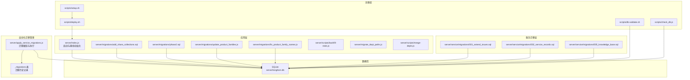

**图表来源**
- [index.js](file://server/index.js#L48-L228)
- [apply_service_migrations.js](file://server/apply_service_migrations.js#L10-L60)
- [add_share_collections.sql](file://server/migrations/add_share_collections.sql#L1-L32)
- [phase2.sql](file://server/migrations/phase2.sql#L1-L32)
- [update_product_families.js](file://server/migrations/update_product_families.js#L1-L121)
- [fix_product_family_names.js](file://server/migrations/fix_product_family_names.js#L1-L70)
- [001_extend_issues.sql](file://server/service/migrations/001_extend_issues.sql#L1-L196)
- [002_service_records.sql](file://server/service/migrations/002_service_records.sql#L1-L174)
- [005_knowledge_base.sql](file://server/service/migrations/005_knowledge_base.sql#L1-L214)
- [db-validate.sh](file://scripts/db-validate.sh#L1-L52)
- [check_db.js](file://scripts/check_db.js#L1-L20)
- [deploy.sh](file://scripts/deploy.sh#L1-L68)
- [setup.sh](file://scripts/setup.sh#L1-L112)

## 详细组件分析

### 组件A：手动迁移运行器（apply_service_migrations.js）
- 目标与作用
  - 实现自动化迁移管理，替代手动执行迁移脚本
  - 创建 _migrations 表跟踪已应用的迁移，确保幂等性
  - 实现重复列预防机制，优雅处理重复列错误
- 关键特性
  - 迁移跟踪：自动创建 _migrations 表，记录已执行的迁移文件
  - 幂等执行：检查迁移历史，跳过已应用的迁移
  - 错误处理：捕获重复列错误，继续执行其他语句
  - 顺序执行：按文件名排序执行 SQL 迁移
- 与应用集成
  - 作为独立脚本运行，不依赖应用启动流程
  - 适用于生产环境的自动化迁移管理

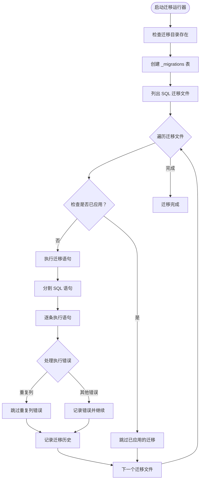

**图表来源**
- [apply_service_migrations.js](file://server/apply_service_migrations.js#L10-L60)

**章节来源**
- [apply_service_migrations.js](file://server/apply_service_migrations.js#L1-L64)

### 组件B：产品家族迁移系统
- 产品家族更新（update_product_families.js）
  - 目标：为 inquiry_tickets、rma_tickets、dealer_repairs 表添加 product_family 字段
  - 实现：批量更新现有记录，基于产品模型名称和产品线确定家族分类
  - 分类规则：MAVO、TERRA、Monitoring、Accessories 等
  - 事务处理：确保数据一致性，支持回滚
- 产品家族修正（fix_product_family_names.js）
  - 目标：修正产品家族名称映射，确保数据准确性
  - 实现：基于模型名称关键字匹配，如 EDGE、MARK2、MAVO LF、TERRA 等
  - 分类组：当前电影相机、归档电影相机、Eagle 视像机、通用配件
  - 统计输出：显示各表更新的行数统计

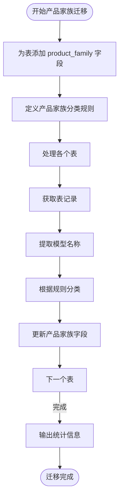

**图表来源**
- [update_product_families.js](file://server/migrations/update_product_families.js#L12-L117)
- [fix_product_family_names.js](file://server/migrations/fix_product_family_names.js#L15-L36)

**章节来源**
- [update_product_families.js](file://server/migrations/update_product_families.js#L1-L121)
- [fix_product_family_names.js](file://server/migrations/fix_product_family_names.js#L1-L70)

### 组件C：服务迁移系统
- 问题追踪扩展（001_extend_issues.sql）
  - 目标：扩展 issues 表支持完整的 RMA 和维修跟踪
  - 新增字段：RMA 编号、问题类型、序列号、固件版本、硬件版本等
  - 新增表：dealers（经销商管理）、production_feedbacks（生产反馈）、rma_sequences（RMA 序列）
  - 字典系统：system_dictionaries 支持多语言配置
  - 索引优化：为常用查询字段创建索引
- 服务记录系统（002_service_records.sql）
  - 目标：实现轻量级服务记录跟踪系统
  - 主表：service_records 支持客户服务模式和服务详情
  - 评论系统：service_record_comments 支持内部和客户评论
  - 状态历史：service_record_status_history 跟踪状态变更
  - 序列管理：service_record_sequences 管理记录编号
- 知识库系统（005_knowledge_base.sql）
  - 目标：构建多层级可见性的知识库系统
  - 文章表：knowledge_articles 支持分类、标签、产品关联
  - 全文检索：FTS5 支持高效搜索
  - 版本管理：knowledge_article_versions 记录文章历史
  - 反馈系统：knowledge_article_feedback 收集用户反馈
  - 兼容性测试：compatibility_tests 支持产品兼容性管理

```mermaid
erDiagram
DEALERS {
integer id PK
text name
text code UK
text dealer_type
text region
text country
text city
text contact_person
text contact_email
text contact_phone
integer can_repair
text repair_level
text notes
datetime created_at
datetime updated_at
}
PRODUCTION_FEEDBACKS {
integer id PK
date feedback_date
date ship_date
text category
integer severity
text product_name
text serial_number
text problem_description
text communication_feedback
text reporter
text responsible_person
text order_responsible
text remarks
integer related_issue_id FK
datetime created_at
datetime updated_at
}
RMA_SEQUENCES {
integer id PK
text product_code
text channel_code
integer year
integer last_sequence
unique product_code,channel_code,year
}
SYSTEM_DICTIONARIES {
integer id PK
text dict_type
text dict_key
text dict_value
integer sort_order
integer is_active
datetime created_at
unique dict_type,dict_key
}
DEALERS ||--o{ PRODUCTION_FEEDBACKS : "关联"
```

**图表来源**
- [001_extend_issues.sql](file://server/service/migrations/001_extend_issues.sql#L56-L195)

**章节来源**
- [001_extend_issues.sql](file://server/service/migrations/001_extend_issues.sql#L1-L196)
- [002_service_records.sql](file://server/service/migrations/002_service_records.sql#L1-L174)
- [005_knowledge_base.sql](file://server/service/migrations/005_knowledge_base.sql#L1-L214)

### 组件D：批量分享集合迁移（add_share_collections.sql）
- 目标与作用
  - 新增"分享集合"表与"集合项"表，支持将多个文件打包为集合并通过统一令牌分享
  - 提供用户维度与令牌维度的索引，提升查询与访问统计效率
- 关键表与字段
  - share_collections：集合主表，包含用户、令牌、名称、密码、过期时间、访问计数、最后访问时间、创建时间等
  - share_collection_items：集合项表，记录集合中每个文件或目录的路径与是否为目录
- 外键与约束
  - 集合项外键关联集合主表，删除集合时级联删除集合项
- 索引设计
  - 针对令牌与用户建立索引，优化按令牌查找与按用户聚合
- 与应用集成
  - 在应用启动时仅创建基线表；批量分享集合属于后续功能增强，通过独立迁移脚本引入

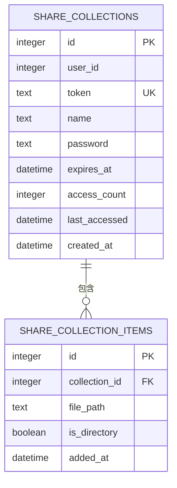

**图表来源**
- [add_share_collections.sql](file://server/migrations/add_share_collections.sql#L5-L29)

**章节来源**
- [add_share_collections.sql](file://server/migrations/add_share_collections.sql#L1-L32)

### 组件E：阶段2升级迁移（phase2.sql）
- 目标与作用
  - 引入"星标文件"表与"分享链接"表，完善快速访问与细粒度分享能力
- 关键表与字段
  - starred_files：用户对文件的星标记录，唯一约束确保同一用户对同一文件仅能星标一次
  - share_links：单个文件的分享链接，包含用户、文件路径、分享令牌、密码、过期时间、访问计数、最后访问时间、创建时间
- 索引设计
  - 为星标与分享链接分别建立用户与路径/令牌索引，提升查询性能
- 与应用集成
  - 与批量分享集合迁移类似，作为阶段2的功能增强，通过独立迁移脚本引入

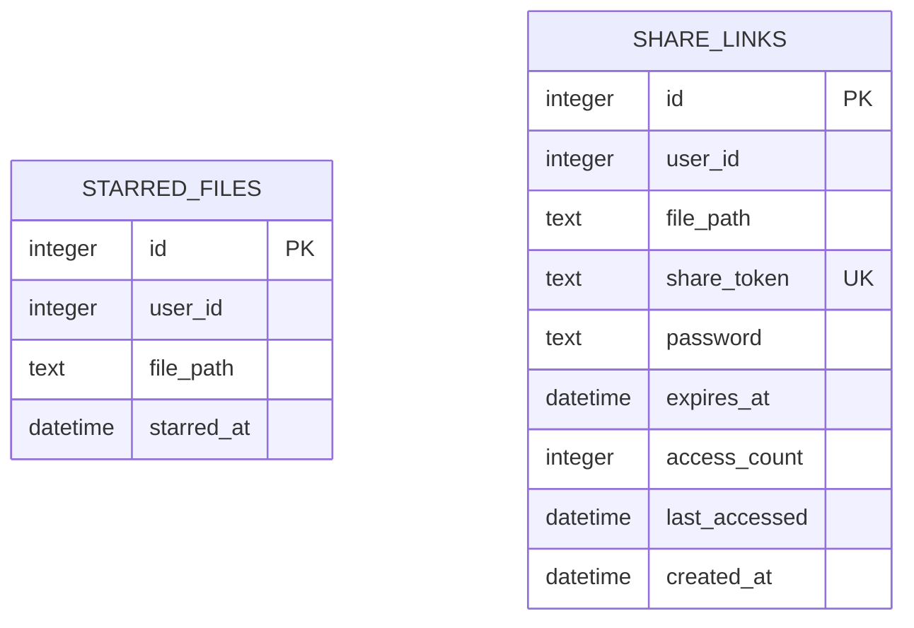

**图表来源**
- [phase2.sql](file://server/migrations/phase2.sql#L3-L31)

**章节来源**
- [phase2.sql](file://server/migrations/phase2.sql#L1-L32)

### 组件F：应用启动时的基线初始化（server/index.js）
- 基线表清单
  - departments、users、permissions、stars、vocabulary
  - products、customers、issues、issue_comments、issue_attachments
  - service_attachments、import_history
- 幂等策略
  - 使用"IF NOT EXISTS"确保重复执行不会报错
- 性能与一致性
  - 启用 WAL 模式以提升并发写入与崩溃恢复能力
- 自动播种
  - 词汇表自动播种功能已禁用，防止数据损坏

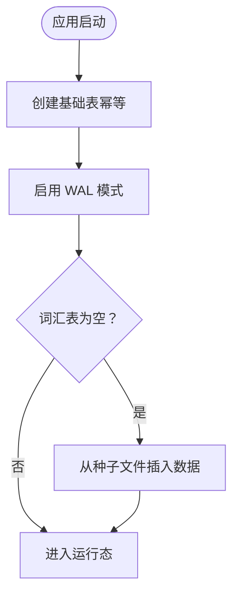

**图表来源**
- [index.js](file://server/index.js#L48-L228)

**章节来源**
- [index.js](file://server/index.js#L48-L228)

### 组件G：数据库健康检查与自动修复（scripts/db-validate.sh）
- 功能概述
  - 对指定表进行列存在性检查，缺失列自动添加并设置默认值
  - 当前示例：为 users 表添加 last_login 列并回填默认值
- 适用场景
  - 版本升级后字段缺失、历史数据补全、运维巡检

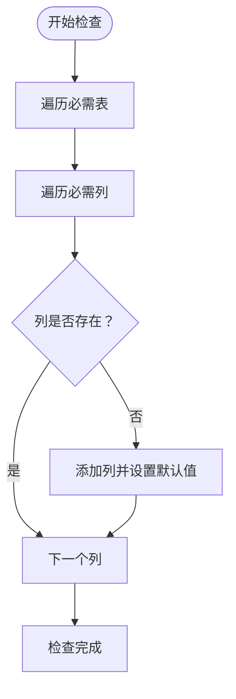

**图表来源**
- [db-validate.sh](file://scripts/db-validate.sh#L17-L41)

**章节来源**
- [db-validate.sh](file://scripts/db-validate.sh#L1-L52)

### 组件H：数据库检查工具（scripts/check_db.js）
- 功能概述
  - 打印部门表与管理员用户信息，便于快速定位数据库状态
- 使用场景
  - 启动后自检、问题排查、CI/CD 验证

**章节来源**
- [check_db.js](file://scripts/check_db.js#L1-L20)

### 组件I：元数据回填（server/scripts/backfill-stats.js）
- 目标与流程
  - 对 file_stats 表中的历史记录进行回填，计算文件大小与上传时间
  - 仅处理数据库已知的路径，避免扫描磁盘带来的不确定性
- 注意事项
  - 回填过程需谨慎处理异常，避免中断

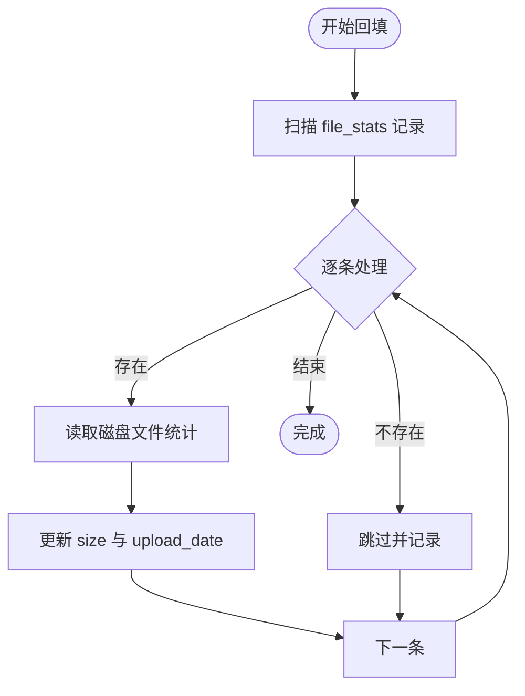

**图表来源**
- [backfill-stats.js](file://server/scripts/backfill-stats.js#L22-L43)

**章节来源**
- [backfill-stats.js](file://server/scripts/backfill-stats.js#L1-L46)

### 组件J：部门路径迁移（server/migrate_dept_paths.js）
- 目标与流程
  - 将 file_stats 中的旧路径映射为新路径，先更新数据库再重命名物理目录
  - 若新旧目录同时存在，执行内容合并与目录删除
- 安全措施
  - 事务式更新与物理重命名，完成后输出样本路径确认

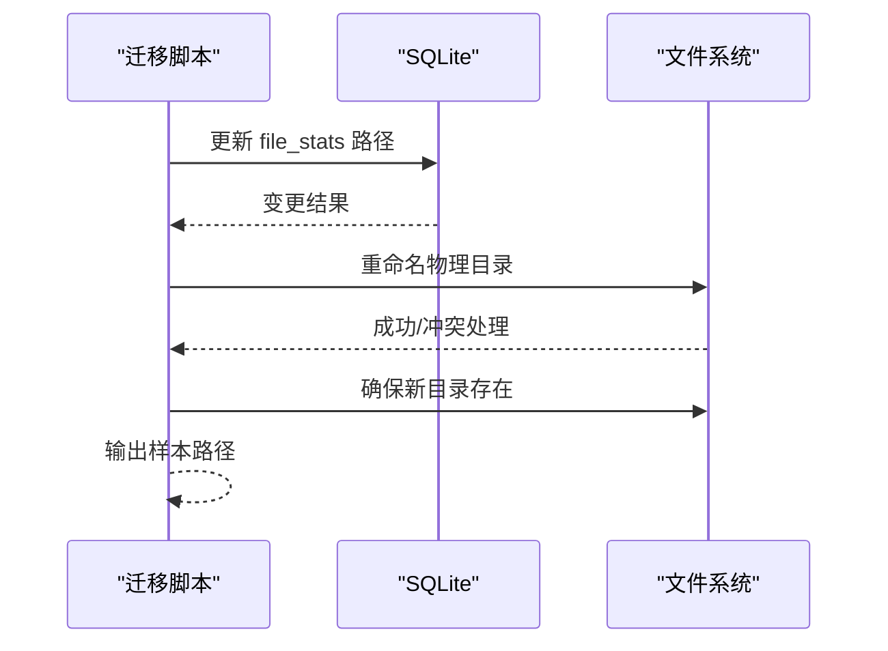

**图表来源**
- [migrate_dept_paths.js](file://server/migrate_dept_paths.js#L36-L81)

**章节来源**
- [migrate_dept_paths.js](file://server/migrate_dept_paths.js#L36-L81)

### 组件K：部门合并（server/scripts/merge-depts.js）
- 目标与流程
  - 将旧部门命名（如 OP、MS）合并到新格式（如"运营部 (OP)"），处理冲突与空目录清理
- 适用场景
  - 命名规范统一后的数据整合

**章节来源**
- [merge-depts.js](file://server/scripts/merge-depts.js#L1-L58)

### 组件L：部署与环境准备（scripts/setup.sh、scripts/deploy.sh）
- setup.sh
  - 自动化安装 Homebrew、Node.js、Git、PM2、Cloudflared 等依赖
  - 校验项目完整性并执行安装与构建
- deploy.sh
  - rsync 同步代码（排除 data、缓存、日志等）
  - 远程构建客户端、安装服务端依赖、零停机重启服务
  - 启动或重启监控任务

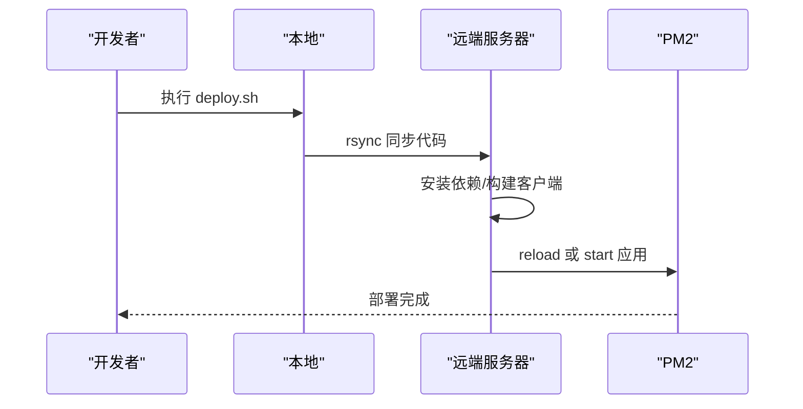

**图表来源**
- [deploy.sh](file://scripts/deploy.sh#L37-L67)
- [setup.sh](file://scripts/setup.sh#L81-L112)

**章节来源**
- [setup.sh](file://scripts/setup.sh#L1-L112)
- [deploy.sh](file://scripts/deploy.sh#L1-L68)

## 依赖关系分析
- 组件耦合
  - 迁移脚本与应用启动初始化相互独立，均以幂等方式创建基础表，避免直接耦合
  - 手动迁移运行器与服务迁移系统形成自动化管理链路
  - 产品家族迁移与服务迁移系统相互独立，专注于不同领域的数据修正
  - 健康检查脚本与部署脚本为运维工具，不直接修改业务表结构
- 外部依赖
  - better-sqlite3 用于 Node.js 侧数据库访问
  - SQLite 原生命令（PRAGMA、ALTER TABLE）用于 WAL 模式与列修复
- 循环依赖
  - 未发现循环依赖，脚本职责清晰

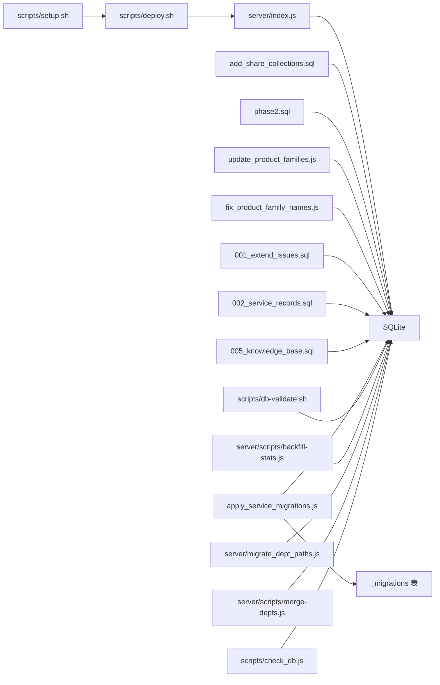

**图表来源**
- [index.js](file://server/index.js#L48-L228)
- [apply_service_migrations.js](file://server/apply_service_migrations.js#L10-L60)
- [add_share_collections.sql](file://server/migrations/add_share_collections.sql#L1-L32)
- [phase2.sql](file://server/migrations/phase2.sql#L1-L32)
- [update_product_families.js](file://server/migrations/update_product_families.js#L1-L121)
- [fix_product_family_names.js](file://server/migrations/fix_product_family_names.js#L1-L70)
- [001_extend_issues.sql](file://server/service/migrations/001_extend_issues.sql#L1-L196)
- [002_service_records.sql](file://server/service/migrations/002_service_records.sql#L1-L174)
- [005_knowledge_base.sql](file://server/service/migrations/005_knowledge_base.sql#L1-L214)
- [db-validate.sh](file://scripts/db-validate.sh#L1-L52)
- [check_db.js](file://scripts/check_db.js#L1-L20)
- [backfill-stats.js](file://server/scripts/backfill-stats.js#L1-L46)
- [migrate_dept_paths.js](file://server/migrate_dept_paths.js#L36-L81)
- [merge-depts.js](file://server/scripts/merge-depts.js#L1-L58)
- [deploy.sh](file://scripts/deploy.sh#L1-L68)
- [setup.sh](file://scripts/setup.sh#L1-L112)

**章节来源**
- [index.js](file://server/index.js#L48-L228)
- [apply_service_migrations.js](file://server/apply_service_migrations.js#L10-L60)
- [add_share_collections.sql](file://server/migrations/add_share_collections.sql#L1-L32)
- [phase2.sql](file://server/migrations/phase2.sql#L1-L32)
- [update_product_families.js](file://server/migrations/update_product_families.js#L1-L121)
- [fix_product_family_names.js](file://server/migrations/fix_product_family_names.js#L1-L70)
- [001_extend_issues.sql](file://server/service/migrations/001_extend_issues.sql#L1-L196)
- [002_service_records.sql](file://server/service/migrations/002_service_records.sql#L1-L174)
- [005_knowledge_base.sql](file://server/service/migrations/005_knowledge_base.sql#L1-L214)
- [db-validate.sh](file://scripts/db-validate.sh#L1-L52)
- [check_db.js](file://scripts/check_db.js#L1-L20)
- [backfill-stats.js](file://server/scripts/backfill-stats.js#L1-L46)
- [migrate_dept_paths.js](file://server/migrate_dept_paths.js#L36-L81)
- [merge-depts.js](file://server/scripts/merge-depts.js#L1-L58)
- [deploy.sh](file://scripts/deploy.sh#L1-L68)
- [setup.sh](file://scripts/setup.sh#L1-L112)

## 性能考量
- WAL 模式
  - 启用 WAL 提升并发写入吞吐与崩溃恢复能力，适合高并发写入场景
- 索引设计
  - 批量分享集合与阶段2迁移均新增索引，显著降低查询成本
  - 服务迁移系统包含大量索引优化，支持复杂查询场景
- 迁移跟踪
  - _migrations 表提供迁移历史记录，避免重复执行，提升迁移效率
- 回填与扫描
  - 元数据回填仅基于数据库已知路径，避免全盘扫描带来的 IO 放大
- 部署零停机
  - 使用 PM2 的 reload 实现零停机更新，结合远程构建减少服务中断时间
- 自动化执行
  - 手动迁移运行器支持批量迁移执行，减少人工干预

**章节来源**
- [index.js](file://server/index.js#L49)
- [apply_service_migrations.js](file://server/apply_service_migrations.js#L18-L25)
- [add_share_collections.sql](file://server/migrations/add_share_collections.sql#L18-L19)
- [phase2.sql](file://server/migrations/phase2.sql#L28-L31)
- [001_extend_issues.sql](file://server/service/migrations/001_extend_issues.sql#L46-L50)
- [002_service_records.sql](file://server/service/migrations/002_service_records.sql#L68-L76)
- [005_knowledge_base.sql](file://server/service/migrations/005_knowledge_base.sql#L77-L81)
- [deploy.sh](file://scripts/deploy.sh#L56-L58)

## 故障排查指南
- 数据库连接失败
  - 使用 scripts/check_db.js 快速确认数据库路径与管理员用户是否存在
- 字段缺失或结构异常
  - 运行 scripts/db-validate.sh 自动修复缺失列（如 last_login）
- 迁移后功能异常
  - 检查迁移脚本是否正确执行，确认表与索引存在
  - 使用手动迁移运行器检查 _migrations 表的迁移历史
- 产品家族数据错误
  - 运行 fix_product_family_names.js 修正产品家族名称映射
  - 运行 update_product_families.js 批量更新产品家族字段
- 部署后服务不可用
  - 使用 PM2 描述器查看状态，必要时执行 reload 或重新启动
- 路径迁移后文件丢失
  - 检查 migrate_dept_paths.js 的输出日志，确认物理目录是否成功重命名或合并
- 迁移执行失败
  - 检查重复列错误，手动迁移运行器会自动跳过此类错误
  - 查看迁移历史，确认已应用的迁移列表

**章节来源**
- [check_db.js](file://scripts/check_db.js#L1-L20)
- [db-validate.sh](file://scripts/db-validate.sh#L1-L52)
- [apply_service_migrations.js](file://server/apply_service_migrations.js#L42-L52)
- [fix_product_family_names.js](file://server/migrations/fix_product_family_names.js#L68-L70)
- [update_product_families.js](file://server/migrations/update_product_families.js#L118-L121)
- [deploy.sh](file://scripts/deploy.sh#L56-L67)
- [migrate_dept_paths.js](file://server/migrate_dept_paths.js#L36-L81)

## 结论
Longhorn 的数据库迁移策略以"基线初始化 + 自动化迁移管理 + 增量迁移 + 健康检查 + 元数据回填 + 零停机部署"为核心，既保证了功能演进的灵活性，又确保了数据安全与系统稳定性。通过新增的手动迁移运行器实现迁移跟踪和重复列预防，通过产品家族迁移系统确保数据准确性，通过完整的服务迁移系统支持复杂的业务需求，团队可以安全地推进数据库版本升级与功能迭代。

## 附录

### 数据库版本管理与迁移策略
- 版本基线
  - 应用启动时创建基础表，作为"版本 1.0"基线
- 自动化迁移管理
  - 新增 apply_service_migrations.js 实现迁移跟踪和执行
  - _migrations 表记录已应用的迁移，确保幂等性
  - 重复列预防机制，优雅处理迁移错误
- 增量迁移
  - 通过独立 SQL 脚本引入新表与索引，保持幂等与可回放
  - 服务迁移系统支持分阶段功能扩展
- 产品家族管理
  - 产品家族更新和修正脚本确保数据准确性
  - 基于模型名称的关键字匹配实现智能分类
- 健康检查
  - 运维脚本自动修复缺失列与默认值，降低人工干预
- 元数据迁移
  - 通过专用脚本处理路径与历史数据，避免影响在线业务
- 部署策略
  - 零停机更新与远程构建，缩短维护窗口

**章节来源**
- [index.js](file://server/index.js#L48-L228)
- [apply_service_migrations.js](file://server/apply_service_migrations.js#L10-L60)
- [update_product_families.js](file://server/migrations/update_product_families.js#L1-L121)
- [fix_product_family_names.js](file://server/migrations/fix_product_family_names.js#L1-L70)
- [add_share_collections.sql](file://server/migrations/add_share_collections.sql#L1-L32)
- [phase2.sql](file://server/migrations/phase2.sql#L1-L32)
- [001_extend_issues.sql](file://server/service/migrations/001_extend_issues.sql#L1-L196)
- [002_service_records.sql](file://server/service/migrations/002_service_records.sql#L1-L174)
- [005_knowledge_base.sql](file://server/service/migrations/005_knowledge_base.sql#L1-L214)
- [db-validate.sh](file://scripts/db-validate.sh#L1-L52)
- [backfill-stats.js](file://server/scripts/backfill-stats.js#L1-L46)
- [migrate_dept_paths.js](file://server/migrate_dept_paths.js#L36-L81)
- [deploy.sh](file://scripts/deploy.sh#L56-L58)

### 增量迁移与全量迁移对比
- 增量迁移
  - 优点：对线上业务影响小、可逐步上线、支持自动化管理
  - 适用：新增表、索引、约束等非破坏性变更
  - 示例：批量分享集合、阶段2功能、服务迁移系统
- 全量迁移
  - 优点：一次性完成结构变更
  - 适用：大规模重构、数据模型彻底改变
- 建议
  - 优先采用增量迁移；全量迁移需制定严格的备份与回滚计划
  - 使用 _migrations 表跟踪迁移历史，确保可追溯性

### 数据迁移最佳实践
- 备份
  - 迁移前导出数据库快照，保留 WAL/SHM 文件副本
  - 使用 _migrations 表记录迁移历史，便于回滚
- 兼容性
  - 保持外键与索引一致性，避免破坏性变更
  - 实施重复列预防机制，优雅处理迁移错误
- 回滚
  - 保留迁移前的备份与回滚脚本，确保可逆
  - 使用 _migrations 表跟踪已应用的迁移，支持选择性回滚
- 测试
  - 在测试环境验证迁移脚本与数据回填逻辑
  - 使用手动迁移运行器进行自动化测试
- 监控
  - 监控迁移执行状态，及时发现和处理错误
  - 定期检查产品家族数据准确性

### 迁移执行步骤
- 准备阶段
  - 运行 scripts/setup.sh 完成环境准备
  - 确认数据库连接和权限
- 迁移阶段
  - 执行增量迁移脚本（add_share_collections.sql、phase2.sql）
  - 运行手动迁移运行器（apply_service_migrations.js）管理服务迁移
  - 如需修复结构，运行 scripts/db-validate.sh
  - 如需回填元数据，运行 server/scripts/backfill-stats.js
  - 如需路径迁移，运行 server/migrate_dept_paths.js 与 server/scripts/merge-depts.js
  - 运行产品家族迁移脚本（update_product_families.js、fix_product_family_names.js）
- 验证阶段
  - 检查 _migrations 表的迁移历史
  - 验证数据完整性和业务功能
- 部署阶段
  - 运行 scripts/deploy.sh 执行远程部署与零停机重启

**章节来源**
- [setup.sh](file://scripts/setup.sh#L1-L112)
- [apply_service_migrations.js](file://server/apply_service_migrations.js#L1-L64)
- [add_share_collections.sql](file://server/migrations/add_share_collections.sql#L1-L32)
- [phase2.sql](file://server/migrations/phase2.sql#L1-L32)
- [001_extend_issues.sql](file://server/service/migrations/001_extend_issues.sql#L1-L196)
- [002_service_records.sql](file://server/service/migrations/002_service_records.sql#L1-L174)
- [005_knowledge_base.sql](file://server/service/migrations/005_knowledge_base.sql#L1-L214)
- [db-validate.sh](file://scripts/db-validate.sh#L1-L52)
- [backfill-stats.js](file://server/scripts/backfill-stats.js#L1-L46)
- [migrate_dept_paths.js](file://server/migrate_dept_paths.js#L36-L81)
- [merge-depts.js](file://server/scripts/merge-depts.js#L1-L58)
- [update_product_families.js](file://server/migrations/update_product_families.js#L1-L121)
- [fix_product_family_names.js](file://server/migrations/fix_product_family_names.js#L1-L70)
- [deploy.sh](file://scripts/deploy.sh#L1-L68)