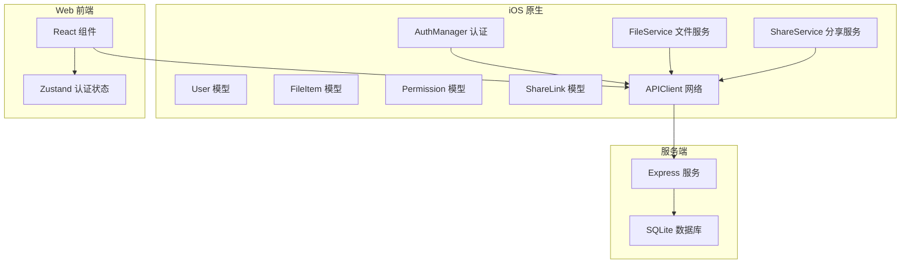
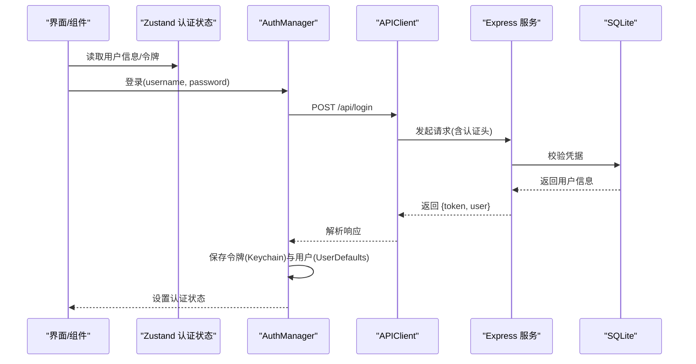
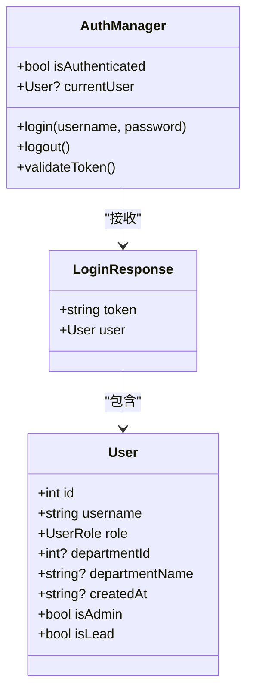
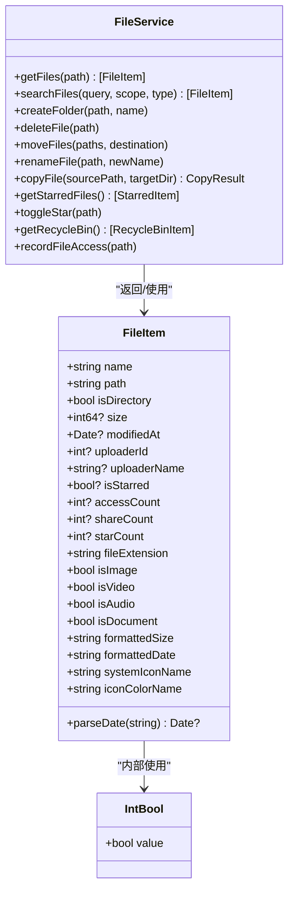
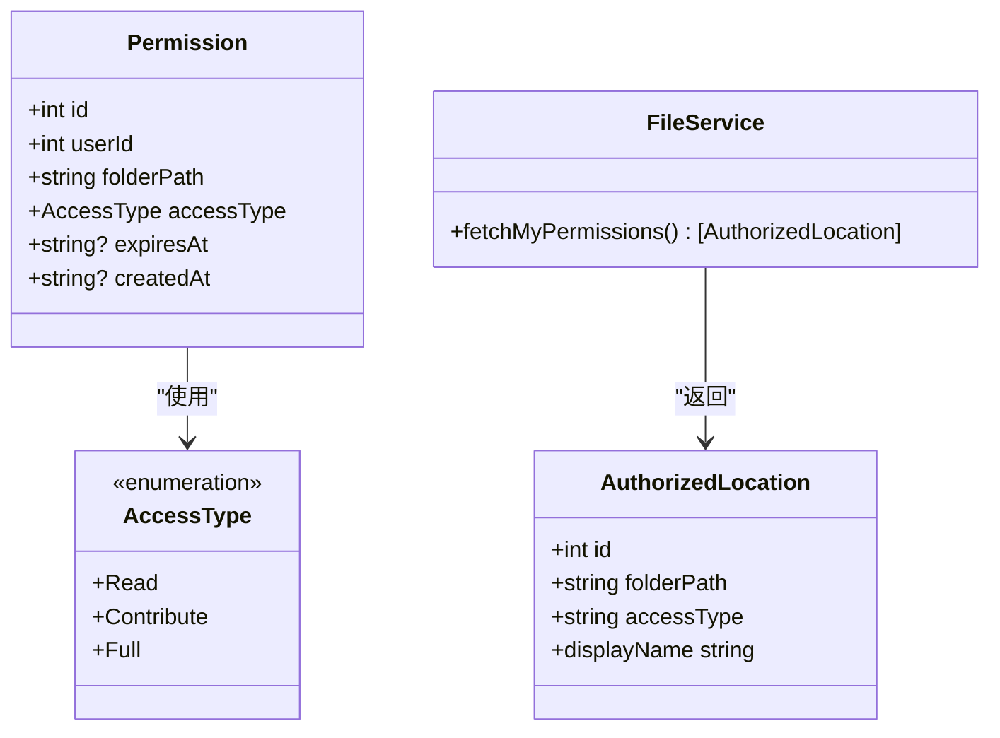
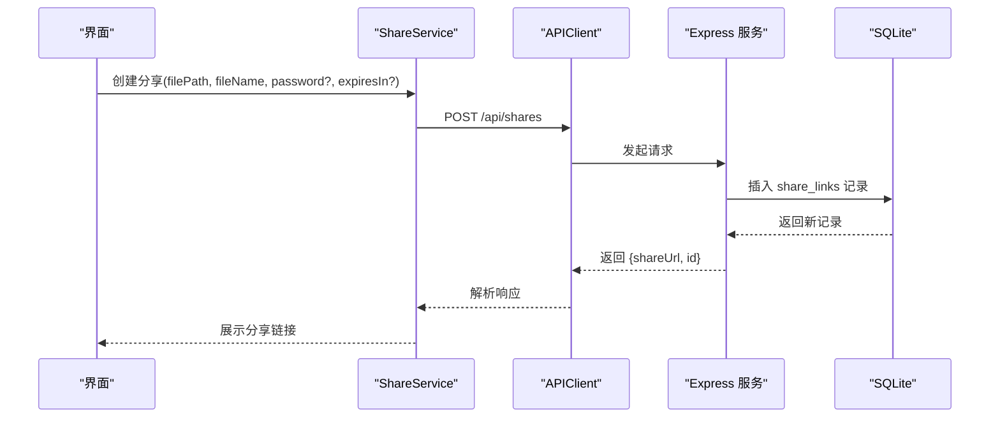
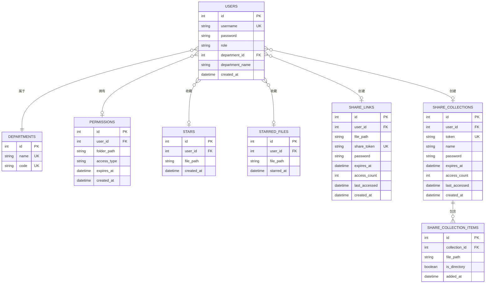
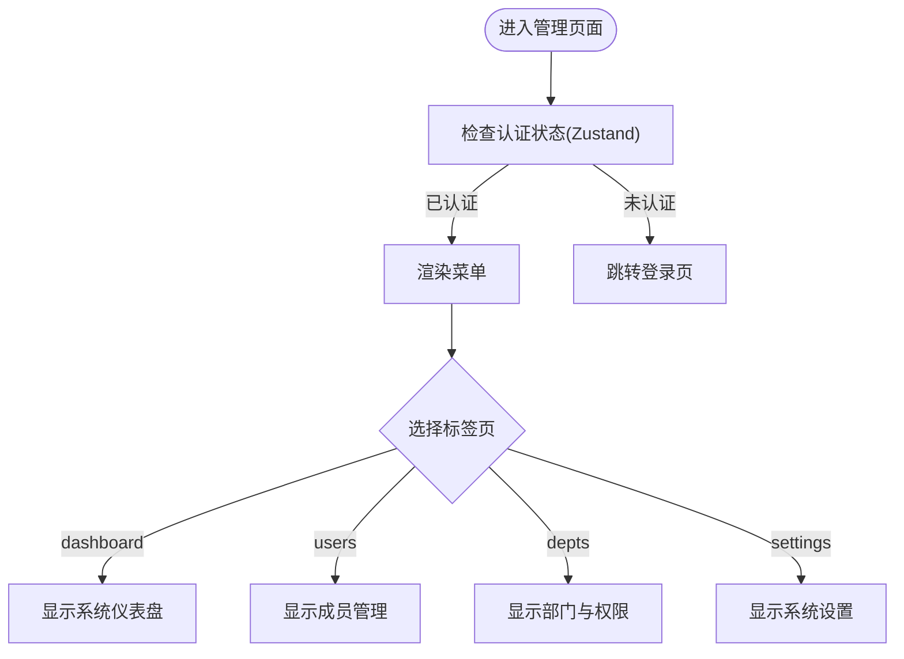
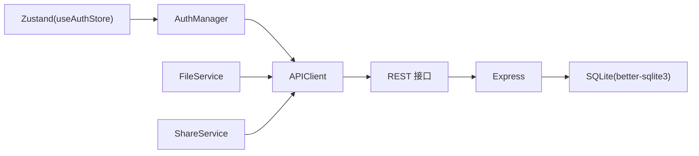

# 数据模型设计

<cite>
**本文引用的文件**
- [User.swift](file://ios/LonghornApp/Models/User.swift)
- [FileItem.swift](file://ios/LonghornApp/Models/FileItem.swift)
- [Permission.swift](file://ios/LonghornApp/Models/Permission.swift)
- [ShareLink.swift](file://ios/LonghornApp/Models/ShareLink.swift)
- [UserStats.swift](file://ios/LonghornApp/Models/UserStats.swift)
- [AuthManager.swift](file://ios/LonghornApp/Services/AuthManager.swift)
- [FileService.swift](file://ios/LonghornApp/Services/FileService.swift)
- [ShareService.swift](file://ios/LonghornApp/Services/ShareService.swift)
- [APIClient.swift](file://ios/LonghornApp/Services/APIClient.swift)
- [useAuthStore.ts](file://client/src/store/useAuthStore.ts)
- [AdminPanel.tsx](file://client/src/components/AdminPanel.tsx)
- [index.js](file://server/index.js)
- [phase2.sql](file://server/migrations/phase2.sql)
- [add_share_collections.sql](file://server/migrations/add_share_collections.sql)
</cite>

## 目录
1. [简介](#简介)
2. [项目结构](#项目结构)
3. [核心组件](#核心组件)
4. [架构总览](#架构总览)
5. [详细组件分析](#详细组件分析)
6. [依赖分析](#依赖分析)
7. [性能考虑](#性能考虑)
8. [故障排查指南](#故障排查指南)
9. [结论](#结论)
10. [附录](#附录)

## 简介
本文件系统性梳理 Longhorn 的数据模型设计，覆盖用户、文件、权限、分享等核心实体，阐明其在前端与后端之间的映射关系、序列化/反序列化流程、业务与约束规则，并给出模型关系图与使用示例，帮助开发者与产品人员准确理解与使用数据模型。

## 项目结构
Longhorn 采用“iOS 原生 + Web 前端 + Node.js 服务端”的三层架构：
- iOS 原生层：定义用户、文件、权限、分享等模型，通过 APIClient 统一调用服务端接口。
- Web 前端：React + Zustand 管理认证状态，承载部分管理功能入口。
- 服务端：Node.js + better-sqlite3，提供 REST API 并维护 SQLite 数据库。

**图表来源**
- [APIClient.swift](file://ios/LonghornApp/Services/APIClient.swift#L38-L64)
- [AuthManager.swift](file://ios/LonghornApp/Services/AuthManager.swift#L13-L39)
- [FileService.swift](file://ios/LonghornApp/Services/FileService.swift#L11-L14)
- [ShareService.swift](file://ios/LonghornApp/Services/ShareService.swift#L11-L14)
- [index.js](file://server/index.js#L16-L31)

**章节来源**
- [APIClient.swift](file://ios/LonghornApp/Services/APIClient.swift#L38-L64)
- [AuthManager.swift](file://ios/LonghornApp/Services/AuthManager.swift#L13-L39)
- [FileService.swift](file://ios/LonghornApp/Services/FileService.swift#L11-L14)
- [ShareService.swift](file://ios/LonghornApp/Services/ShareService.swift#L11-L14)
- [index.js](file://server/index.js#L16-L31)

## 核心组件
本节对用户、文件、权限、分享等核心数据模型进行深入解析，包括字段语义、序列化键映射、业务规则与约束。

- 用户模型（User）
  - 字段要点：id、username、role、departmentId、departmentName、createdAt
  - 编码映射：department_id、department_name、created_at
  - 角色枚举：Admin、Lead、Member；提供本地化显示名
  - 行为：isAdmin、isLead 属性便捷判断
  - 生命周期：登录成功后持久化至 Keychain 与 UserDefaults，启动时自动恢复

- 文件项模型（FileItem）
  - 字段要点：name、path、isDirectory、size、mtime、uploader_id/name、starred、access_count/share_count/star_count
  - 编码映射：mtime、uploader_id、uploader_name、starred、access_count、share_count、star_count
  - 日期解析：支持 ISO8601（含毫秒/不含毫秒）、JavaScript toISOString、简单日期格式
  - 类型判定：图片、视频、音频、文档
  - UI 辅助：formattedSize、formattedDate、systemIconName、iconColorName
  - 特殊类型：IntBool 用于 SQLite 0/1 到 Bool 的双向转换

- 权限模型（Permission）
  - 字段要点：id、userId、folderPath、accessType、expiresAt、createdAt
  - 编码映射：user_id、folder_path、access_type、expires_at、created_at
  - 访问类型：Read、Contribute、Full

- 分享模型（ShareLink 与 ShareCollection）
  - 分享链接：id、userId、filePath、fileName、fileSize、uploaderName、token、expiresAt、createdAt、accessCount、language、hasPassword
  - 分享合集：id、token、name、expiresAt、accessCount、createdAt、itemCount、hasPassword
  - 编码映射：多处使用 snake_case 键（如 file_path、expires_at、has_password 等）
  - 过期判断：基于 expiresAt 的 ISO8601 解析与当前时间比较
  - URL 生成：/s/{token} 或 /c/{token}

- 用户统计（UserStats）
  - 字段要点：uploadCount、storageUsed、starredCount、shareCount、lastLogin、accountCreated、username、role
  - 用途：占位骨架加载态与展示

**章节来源**
- [User.swift](file://ios/LonghornApp/Models/User.swift#L26-L50)
- [FileItem.swift](file://ios/LonghornApp/Models/FileItem.swift#L12-L73)
- [FileItem.swift](file://ios/LonghornApp/Models/FileItem.swift#L76-L108)
- [FileItem.swift](file://ios/LonghornApp/Models/FileItem.swift#L110-L194)
- [FileItem.swift](file://ios/LonghornApp/Models/FileItem.swift#L267-L287)
- [Permission.swift](file://ios/LonghornApp/Models/Permission.swift#L10-L26)
- [ShareLink.swift](file://ios/LonghornApp/Models/ShareLink.swift#L11-L73)
- [ShareLink.swift](file://ios/LonghornApp/Models/ShareLink.swift#L93-L135)
- [UserStats.swift](file://ios/LonghornApp/Models/UserStats.swift#L3-L17)

## 架构总览
Longhorn 的数据模型在前后端之间以 JSON 协议交换，遵循以下约定：
- 前端模型字段命名采用 camelCase，后端数据库与 API 返回采用 snake_case
- 日期统一使用 ISO8601 字符串，前端解析为 Date
- 权限与分享均通过 JWT Bearer 认证头携带
- 服务端提供 REST 接口，前端通过 APIClient 统一调用

**图表来源**
- [AuthManager.swift](file://ios/LonghornApp/Services/AuthManager.swift#L44-L69)
- [APIClient.swift](file://ios/LonghornApp/Services/APIClient.swift#L69-L88)
- [index.js](file://server/index.js#L16-L31)

**章节来源**
- [AuthManager.swift](file://ios/LonghornApp/Services/AuthManager.swift#L44-L69)
- [APIClient.swift](file://ios/LonghornApp/Services/APIClient.swift#L69-L88)
- [index.js](file://server/index.js#L16-L31)

## 详细组件分析

### 用户模型与认证流程
- 设计理念
  - 用户模型仅承载展示与鉴权所需字段，避免冗余
  - 角色枚举集中管理，便于国际化与权限控制
  - 登录响应封装 token 与用户信息，便于前端统一处理
- 序列化/反序列化
  - User 与 LoginResponse 使用自定义 CodingKeys 实现 snake_case 映射
  - AuthManager 使用 Keychain 存储 token，UserDefaults 存储用户对象
- 业务规则
  - isAdmin/isLead 提供快速角色判断
  - 启动时尝试恢复会话并异步校验 token 有效性
- 生命周期
  - 登录成功后持久化；登出清理缓存并移除存储

**图表来源**
- [User.swift](file://ios/LonghornApp/Models/User.swift#L26-L56)
- [AuthManager.swift](file://ios/LonghornApp/Services/AuthManager.swift#L13-L39)

**章节来源**
- [User.swift](file://ios/LonghornApp/Models/User.swift#L26-L56)
- [AuthManager.swift](file://ios/LonghornApp/Services/AuthManager.swift#L44-L69)
- [AuthManager.swift](file://ios/LonghornApp/Services/AuthManager.swift#L94-L123)

### 文件模型与文件操作
- 设计理念
  - FileItem 抽象文件与文件夹的共同属性，支持多种媒体类型识别
  - 日期解析兼容多种格式，提升鲁棒性
  - UI 辅助字段简化视图层逻辑
- 序列化/反序列化
  - CodingKeys 映射 mtime、uploader_id 等字段
  - 自定义 init(from:) 解析日期字符串
  - IntBool 支持 SQLite 0/1 与 Bool 的互转
- 业务规则
  - isDirectory 默认 false，确保向后兼容
  - 类型判定基于扩展名集合
- 生命周期
  - 由 FileService 通过 API 获取与更新

**图表来源**
- [FileItem.swift](file://ios/LonghornApp/Models/FileItem.swift#L12-L194)
- [FileItem.swift](file://ios/LonghornApp/Models/FileItem.swift#L267-L287)
- [FileService.swift](file://ios/LonghornApp/Services/FileService.swift#L18-L39)

**章节来源**
- [FileItem.swift](file://ios/LonghornApp/Models/FileItem.swift#L12-L73)
- [FileItem.swift](file://ios/LonghornApp/Models/FileItem.swift#L76-L108)
- [FileItem.swift](file://ios/LonghornApp/Models/FileItem.swift#L110-L194)
- [FileItem.swift](file://ios/LonghornApp/Models/FileItem.swift#L267-L287)
- [FileService.swift](file://ios/LonghornApp/Services/FileService.swift#L18-L39)

### 权限模型与访问控制
- 设计理念
  - 以 folder_path 为粒度控制访问类型（Read/Contribute/Full）
  - 支持过期时间，便于短期授权场景
- 序列化/反序列化
  - CodingKeys 映射 user_id、folder_path、access_type、expires_at、created_at
- 业务规则
  - accessType 决定写入/贡献/完全权限
  - 过期时间为空表示长期有效

**图表来源**
- [Permission.swift](file://ios/LonghornApp/Models/Permission.swift#L10-L26)
- [FileService.swift](file://ios/LonghornApp/Services/FileService.swift#L47-L49)

**章节来源**
- [Permission.swift](file://ios/LonghornApp/Models/Permission.swift#L10-L26)
- [FileService.swift](file://ios/LonghornApp/Services/FileService.swift#L47-L49)

### 分享模型与分享流程
- 设计理念
  - 分享链接与分享合集分别满足“单文件分享”和“批量分享”
  - 支持密码保护与过期时间控制
- 序列化/反序列化
  - CodingKeys 映射 file_path、expires_at、has_password 等
  - isExpired 基于 expiresAt 解析与当前时间比较
- 业务规则
  - token 唯一且用于生成公开 URL
  - 访问计数与最后访问时间用于审计
- 生命周期
  - 通过 ShareService 创建、更新、删除与查询

**图表来源**
- [ShareService.swift](file://ios/LonghornApp/Services/ShareService.swift#L24-L39)
- [APIClient.swift](file://ios/LonghornApp/Services/APIClient.swift#L75-L79)
- [index.js](file://server/index.js#L1728-L1755)

**章节来源**
- [ShareLink.swift](file://ios/LonghornApp/Models/ShareLink.swift#L11-L73)
- [ShareLink.swift](file://ios/LonghornApp/Models/ShareLink.swift#L93-L135)
- [ShareService.swift](file://ios/LonghornApp/Services/ShareService.swift#L24-L39)
- [APIClient.swift](file://ios/LonghornApp/Services/APIClient.swift#L75-L79)
- [index.js](file://server/index.js#L1728-L1755)

### 数据库表与模型映射
服务端通过 better-sqlite3 维护 SQLite 数据库，核心表如下：
- users：用户基本信息
- departments：部门信息
- permissions：用户对文件夹的访问权限
- stars：用户收藏文件
- vocabulary：词汇表（与文件模型无直接关联）
- starred_files：星标文件（Quick Access 功能）
- share_links：分享链接
- share_collections：分享合集
- share_collection_items：分享合集中的条目

**图表来源**
- [index.js](file://server/index.js#L34-L78)
- [phase2.sql](file://server/migrations/phase2.sql#L4-L25)
- [add_share_collections.sql](file://server/migrations/add_share_collections.sql#L5-L29)

**章节来源**
- [index.js](file://server/index.js#L34-L78)
- [phase2.sql](file://server/migrations/phase2.sql#L4-L25)
- [add_share_collections.sql](file://server/migrations/add_share_collections.sql#L5-L29)

### 前端状态与管理入口
- 认证状态（Web 前端）
  - 使用 Zustand 管理 user 与 token，localStorage 持久化
  - 提供 setAuth 与 logout 方法
- 管理面板（Web 前端）
  - AdminPanel 提供仪表盘、成员管理、部门与权限、系统设置入口

**图表来源**
- [useAuthStore.ts](file://client/src/store/useAuthStore.ts#L17-L30)
- [AdminPanel.tsx](file://client/src/components/AdminPanel.tsx#L10-L33)

**章节来源**
- [useAuthStore.ts](file://client/src/store/useAuthStore.ts#L17-L30)
- [AdminPanel.tsx](file://client/src/components/AdminPanel.tsx#L10-L33)

## 依赖分析
- 前端依赖
  - APIClient 统一处理网络请求、超时、认证头、错误处理
  - AuthManager 依赖 APIClient 进行登录与 token 校验
  - FileService/ShareService 依赖 APIClient 进行业务调用
  - Web 前端使用 Zustand 管理认证状态
- 后端依赖
  - Express 提供路由与中间件
  - better-sqlite3 访问 SQLite
  - JWT/Bcrypt 用于认证与加密
  - Multer/Sharp/archiver 用于文件上传、缩略图与打包

**图表来源**
- [APIClient.swift](file://ios/LonghornApp/Services/APIClient.swift#L38-L64)
- [AuthManager.swift](file://ios/LonghornApp/Services/AuthManager.swift#L13-L39)
- [FileService.swift](file://ios/LonghornApp/Services/FileService.swift#L11-L14)
- [ShareService.swift](file://ios/LonghornApp/Services/ShareService.swift#L11-L14)
- [useAuthStore.ts](file://client/src/store/useAuthStore.ts#L17-L30)
- [index.js](file://server/index.js#L16-L31)

**章节来源**
- [APIClient.swift](file://ios/LonghornApp/Services/APIClient.swift#L38-L64)
- [AuthManager.swift](file://ios/LonghornApp/Services/AuthManager.swift#L13-L39)
- [FileService.swift](file://ios/LonghornApp/Services/FileService.swift#L11-L14)
- [ShareService.swift](file://ios/LonghornApp/Services/ShareService.swift#L11-L14)
- [useAuthStore.ts](file://client/src/store/useAuthStore.ts#L17-L30)
- [index.js](file://server/index.js#L16-L31)

## 性能考虑
- 前端
  - 使用 IntBool 将 SQLite 0/1 转换为 Bool，减少额外判断
  - 日期解析支持多种格式，避免因格式差异导致的失败重试
  - 文件大小与日期格式化使用系统工具，减少自定义逻辑
- 后端
  - WAL 模式提升并发写入性能
  - 为 starred_files 与 share_links 建立索引，加速查询
  - 批量下载使用 ZIP 流式输出，降低内存占用

[本节为通用指导，无需列出具体文件来源]

## 故障排查指南
- 认证失败
  - 检查 AuthManager 是否正确保存 token 与用户信息
  - 确认 APIClient 在 401 时触发登出并清理缓存
- 文件解析异常
  - 确认 mtime 字段格式符合预期（ISO8601）
  - 检查 IntBool 是否正确处理 0/1
- 分享链接不可用
  - 校验 expiresAt 是否为空或已过期
  - 确认 share_token 唯一且未被删除
- 数据库问题
  - 确认 migrations 已执行，索引存在
  - 检查 foreign key 关系是否满足

**章节来源**
- [AuthManager.swift](file://ios/LonghornApp/Services/AuthManager.swift#L94-L123)
- [APIClient.swift](file://ios/LonghornApp/Services/APIClient.swift#L287-L301)
- [FileItem.swift](file://ios/LonghornApp/Models/FileItem.swift#L76-L108)
- [FileItem.swift](file://ios/LonghornApp/Models/FileItem.swift#L267-L287)
- [ShareLink.swift](file://ios/LonghornApp/Models/ShareLink.swift#L40-L47)
- [phase2.sql](file://server/migrations/phase2.sql#L27-L31)

## 结论
Longhorn 的数据模型围绕用户、文件、权限与分享四大主题构建，前后端通过明确的键映射与统一的日期格式实现稳定交互。数据库层面通过索引与外键保证一致性与性能。整体设计兼顾易用性与可维护性，适合在企业级知识库场景中推广使用。

[本节为总结性内容，无需列出具体文件来源]

## 附录
- 使用示例（概念性）
  - 登录后获取用户信息并持久化
  - 获取文件列表并根据 isStarred 标记收藏状态
  - 创建分享链接并复制分享 URL
  - 查询分享合集列表并按过期状态筛选

[本节为概念性内容，无需列出具体文件来源]