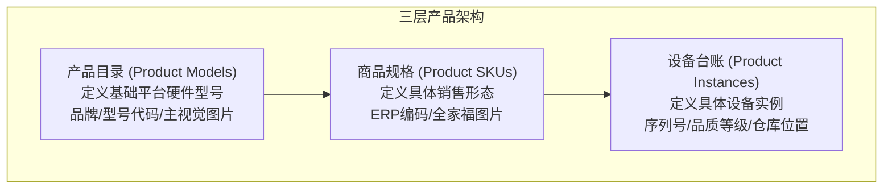
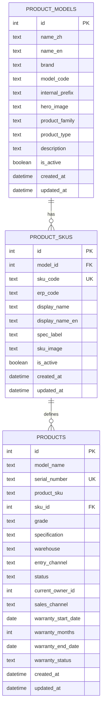
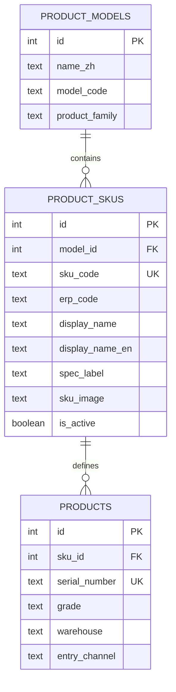
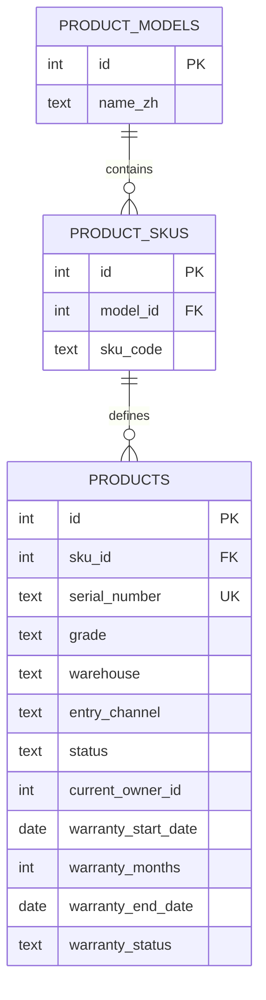
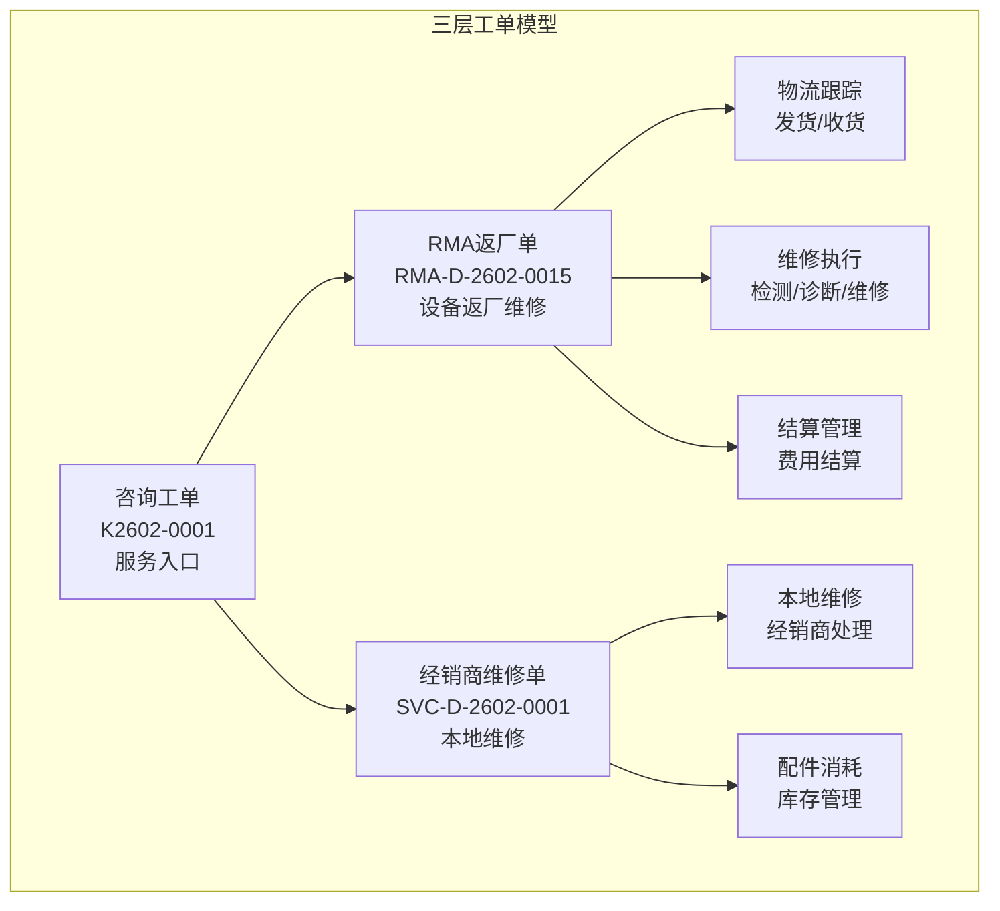
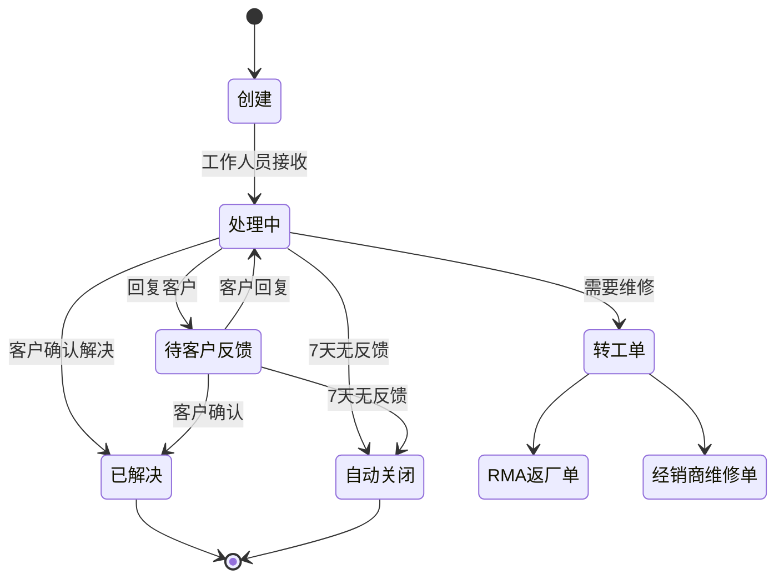
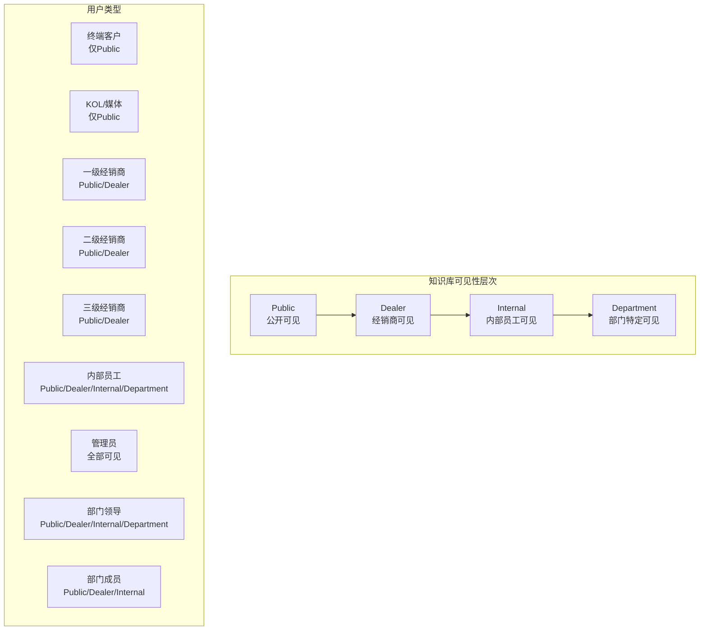
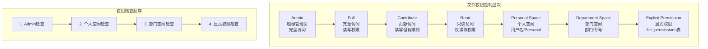
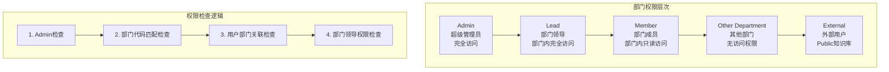

# 服务数据模型

<cite>
**本文档引用的文件**
- [Service_DataModel.md](file://docs/Service_DataModel.md)
- [Service_PRD_P2.md](file://docs/Service_PRD_P2.md)
- [Service_API.md](file://docs/Service_API.md)
- [016_add_product_models.sql](file://server/migrations/016_add_product_models.sql)
- [017_add_product_status.sql](file://server/migrations/017_add_product_status.sql)
- [033_product_architecture_upgrade.sql](file://server/service/migrations/033_product_architecture_upgrade.sql)
- [030_pi_and_report_tables.sql](file://server/service/migrations/030_pi_and_report_tables.sql)
- [034_add_report_translations.sql](file://server/service/migrations/034_add_report_translations.sql)
- [add_knowledge_audit_log.sql](file://server/migrations/add_knowledge_audit_log.sql)
- [025_ticket_audit_softdelete.sql](file://server/service/migrations/025_ticket_audit_softdelete.sql)
- [rma-documents.js](file://server/service/routes/rma-documents.js)
- [knowledge_audit.js](file://server/service/routes/knowledge_audit.js)
- [product-models-admin.js](file://server/service/routes/product-models-admin.js)
- [product-skus.js](file://server/service/routes/product-skus.js)
- [products-admin.js](file://server/service/routes/products-admin.js)
- [ProductModelsManagement.tsx](file://client/src/components/ProductModelsManagement.tsx)
- [ProductSkusManagement.tsx](file://client/src/components/ProductSkusManagement.tsx)
- [ProductSkuDetailPage.tsx](file://client/src/components/ProductSkuDetailPage.tsx)
- [ProductManagement.tsx](file://client/src/components/ProductManagement.tsx)
- [migrate_file_permissions.js](file://server/migrate_file_permissions.js)
- [fix_departments_permissions.sql](file://server/migrations/fix_departments_permissions.sql)
- [routes.js](file://server/files/routes.js)
- [index.js](file://server/index.js)
- [001_extend_issues.sql](file://server/service/migrations/001_extend_issues.sql)
- [002_service_records.sql](file://server/service/migrations/002_service_records.sql)
- [003_issue_types.sql](file://server/service/migrations/003_issue_types.sql)
- [004_advanced_search.sql](file://server/service/migrations/004_advanced_search.sql)
- [005_knowledge_base.sql](file://server/service/migrations/005_knowledge_base.sql)
- [006_repair_management.sql](file://server/service/migrations/006_repair_management.sql)
- [007_parts_inventory.sql](file://server/service/migrations/007_parts_inventory.sql)
- [008_service_sequences.sql](file://server/service/migrations/008_service_sequences.sql)
- [009_three_layer_tickets.sql](file://server/service/migrations/009_three_layer_tickets.sql)
- [011_ticket_search_index.sql](file://server/service/migrations/011_ticket_search_index.sql)
- [011_add_ticket_product_family.sql](file://server/service/migrations/011_add_ticket_product_family.sql)
- [012_account_contact_architecture.sql](file://server/service/migrations/012_account_contact_architecture.sql)
- [013_migrate_to_account_contact.sql](file://server/service/migrations/013_migrate_to_account_contact.sql)
- [014_dealer_deactivation.sql](file://server/service/migrations/014_dealer_deactivation.sql)
- [015_update_account_types.sql](file://server/service/migrations/015_update_account_types.sql)
- [016_add_account_deleted_fields.sql](file://server/service/migrations/016_add_account_deleted_fields.sql)
- [015_update_account_types_v2.sql](file://server/service/migrations/015_update_account_types_v2.sql)
- [024_add_account_lifecycle.sql](file://server/service/migrations/024_add_account_lifecycle.sql)
- [20260302_add_reporter_snapshot.sql](file://server/migrations/20260302_add_reporter_snapshot.sql)
- [update_product_families.js](file://server/migrations/update_product_families.js)
- [fix_product_family_names.js](file://server/migrations/fix_product_family_names.js)
- [migrate_to_accounts.sql](file://server/migrations/migrate_to_accounts.sql)
- [issues.js](file://server/service/routes/issues.js)
- [service-records.js](file://server/service/routes/service-records.js)
- [dealers.js](file://server/service/routes/dealers.js)
- [knowledge.js](file://server/service/routes/knowledge.js)
- [parts.js](file://server/service/routes/parts.js)
- [rma-tickets.js](file://server/service/routes/rma-tickets.js)
- [logistics.js](file://server/service/routes/logistics.js)
- [dealer-repairs.js](file://server/service/routes/dealer-repairs.js)
- [dealer-inventory.js](file://server/service/routes/dealer-inventory.js)
- [proforma-invoice.js](file://server/service/routes/proforma-invoice.js)
- [accounts.js](file://server/service/routes/accounts.js)
- [contacts.js](file://server/service/routes/contacts.js)
- [context.js](file://server/service/routes/context.js)
- [fix_dealer_contacts.js](file://server/scripts/fix_dealer_contacts.js)
- [fix_missing_accounts.js](file://server/scripts/fix_missing_accounts.js)
- [departments.js](file://server/service/routes/departments.js)
- [027_add_department_lead.sql](file://server/service/migrations/027_add_department_lead.sql)
- [028_add_department_code.sql](file://server/service/migrations/028_add_department_code.sql)
- [026_dispatch_rules.sql](file://server/service/migrations/026_dispatch_rules.sql)
- [022_users_enhancement.sql](file://server/service/migrations/022_users_enhancement.sql)
- [fix_departments.js](file://server/fix_departments.js)
- [Department+Extensions.swift](file://ios/LonghornApp/Models/Department+Extensions.swift)
- [DispatchRulesDrawer.tsx](file://client/src/components/Service/DispatchRulesDrawer.tsx)
- [tickets.js](file://server/service/routes/tickets.js)
</cite>

## 更新摘要
**变更内容**
- 新增维修报告翻译系统，包括翻译缓存表和翻译审计日志
- 新增文档审计日志系统，支持PI和维修报告的完整操作追踪
- 新增知识库审计日志系统，提供完整的知识库操作审计
- 新增工单字段审计日志，支持工单字段变更的强制审计
- 新增报告序列号管理，确保报告编号的唯一性和连续性
- 新增用户识别字段增强，提升审计系统的用户追踪能力

## 目录
1. [项目概述](#项目概述)
2. [核心实体架构](#核心实体架构)
3. [三层次产品架构](#三层次产品架构)
4. [产品模型管理](#产品模型管理)
5. [商品规格管理](#商品规格管理)
6. [设备台账管理](#设备台账管理)
7. [账户联系人架构](#账户联系人架构)
8. [工单系统设计](#工单系统设计)
9. [三层工单模型](#三层工单模型)
10. [知识库系统](#知识库系统)
11. [配件管理系统](#配件管理系统)
12. [AI智能助手系统](#ai智能助手系统)
13. [VoC管理数据模型](#voc管理数据模型)
14. [数据模型关系图](#数据模型关系图)
15. [权限与访问控制](#权限与访问控制)
16. [文件权限管理](#文件权限管理)
17. [API接口设计](#api接口设计)
18. [性能优化策略](#性能优化策略)

## 项目概述

Longhorn服务数据模型是Kinefinity公司产品服务闭环系统的核心数据架构，基于三层工单模型设计，涵盖从咨询到维修再到结算的完整服务生命周期。该系统采用现代化的数据库设计原则，支持多维度分类、灵活权限管理和AI友好设计。

**重大更新** 系统已完成多项重要改进，包括报告表结构优化、翻译缓存系统、用户识别增强和审计日志系统完善。这些改进显著提升了系统的可追溯性、可审计性和国际化支持能力。

**新增翻译系统功能** 系统现已支持维修报告的多语言翻译，包括：
- AI翻译缓存机制，避免重复翻译和提升性能
- 翻译审计日志，追踪所有翻译操作和修改历史
- 支持多种语言的翻译内容存储和管理

**新增审计日志系统** 系统现已建立完善的审计追踪机制：
- 文档审计日志：追踪PI和维修报告的所有操作
- 知识库审计日志：记录知识库的所有写操作
- 工单字段审计日志：强制审计工单字段变更
- 用户识别增强：提供更准确的用户身份追踪

**新增报告序列号管理** 系统现已支持报告编号的自动序列化：
- 基于日期的序列号生成机制
- 独立的序列号表管理
- 确保报告编号的唯一性和连续性

**系统设计理念**

- **服务驱动**：以"服务"为核心，连接客户、经销商和公司内部团队
- **三层工单模型**：咨询工单 → RMA返厂单 / 经销商维修单
- **完整追溯链**：从咨询→维修→结算的完整数据关联
- **灵活分类**：支持多维度分类与标签
- **权限分级**：数据访问权限分为Public/Dealer/Internal/Department
- **AI友好**：为AI应用预留字段（向量化、建议记录等）
- **账户联系人架构**：统一管理企业客户和经销商，支持多联系人管理
- **产品族群分析**：支持按产品族群进行统计和分析
- **文件权限控制**：提供细粒度的文件系统访问控制
- **账户生命周期管理**：支持潜在客户、正式客户、归档客户的完整生命周期
- **数据完整性保障**：通过报告者快照和数据清理脚本确保数据质量
- **智能上下文分析**：提供完整的客户信息聚合和分析能力
- **部门管理体系**：支持标准化的部门管理、权限控制和工作流自动化
- **国际化支持**：多语言环境下的本地化显示和交互
- **三层产品架构**：产品目录 → 商品规格 → 设备台账的完整产品生命周期管理
- **ERP系统对齐**：与内部ERP系统的物料代码和商品SKU深度集成
- **品质等级管理**：支持A（全新）、B（官翻）、C（维修级）的品质等级管理
- **仓库位置追踪**：支持设备的实时仓库位置和入库渠道管理
- **翻译系统集成**：支持维修报告的多语言翻译和本地化
- **审计追踪完善**：提供完整的操作审计和数据追溯能力
- **用户识别增强**：提升审计系统的用户身份识别准确性

## 核心实体架构

### 产品实体 (Products)

产品实体是整个服务系统的基石，定义了所有可维修产品的基本信息：

```sql
products (产品)
├── id: SERIAL PRIMARY KEY
├── name: VARCHAR(255) NOT NULL -- 产品名称
├── model: VARCHAR(100) -- 型号
├── category: ENUM('camera', 'viewfinder', 'accessory', 'cable') -- 分类
├── series: VARCHAR(50) -- 系列 (Edge/MM2/Terra/Eagle)
├── current_firmware_version: VARCHAR(20) -- 当前固件版本
├── product_family: VARCHAR(50) -- 产品族群 (MAVO/TERRA/Monitoring/Accessories)
│   -- A: 在售电影机, B: 历史机型, C: 电子寻像器, D: 通用配件
├── is_active: BOOLEAN DEFAULT true -- 是否在售
├── created_at: TIMESTAMP DEFAULT CURRENT_TIMESTAMP
└── updated_at: TIMESTAMP DEFAULT CURRENT_TIMESTAMP ON UPDATE CURRENT_TIMESTAMP
```

**索引设计**：
- PRIMARY KEY (id)
- INDEX idx_model (model)
- INDEX idx_category (category)
- INDEX idx_series (series)
- INDEX idx_product_family (product_family)

## 三层次产品架构

### 产品架构升级概述

系统已完成从单一层级产品管理到三层架构的重大升级，实现了与内部ERP系统的深度对齐。新架构包含三个核心层次：



**图表来源**
- [Service_PRD_P2.md:711-720](file://docs/Service_PRD_P2.md#L711-L720)
- [033_product_architecture_upgrade.sql:1-54](file://server/service/migrations/033_product_architecture_upgrade.sql#L1-L54)

### 产品目录 (Product Models)

产品目录定义基础平台硬件型号，支持品牌、型号代码和主视觉图片管理：

```sql
product_models (产品目录/型号)
├── id: INTEGER PRIMARY KEY AUTOINCREMENT
├── name_zh: TEXT NOT NULL -- 中文产品名称
├── name_en: TEXT -- 英文产品名称
├── brand: TEXT DEFAULT 'Kinefinity' -- 品牌
├── model_code: TEXT -- 产品型号 (Model Code, 如 C181)
├── internal_prefix: TEXT -- ERP 9-series 前缀
├── hero_image: TEXT -- 主视觉图片 URL
├── product_family: TEXT NOT NULL -- 产品族群 (A/B/C/D)
├── product_type: TEXT DEFAULT 'CAMERA' -- 产品类型
├── description: TEXT -- 产品描述
├── is_active: BOOLEAN DEFAULT 1 -- 是否启用
├── created_at: DATETIME DEFAULT CURRENT_TIMESTAMP
└── updated_at: DATETIME DEFAULT CURRENT_TIMESTAMP
```

**索引设计**：
- PRIMARY KEY (id)
- UNIQUE KEY (model_code)
- INDEX idx_product_models_family (product_family)
- INDEX idx_product_models_active (is_active)

### 商品规格 (Product SKUs)

商品规格定义具体的销售形态，支持ERP编码和全家福图片管理：

```sql
product_skus (商品规格/SKU)
├── id: INTEGER PRIMARY KEY AUTOINCREMENT
├── model_id: INTEGER NOT NULL -- 关联产品目录 (product_models.id)
├── sku_code: TEXT UNIQUE NOT NULL -- A系列 SKU 编码 (如 A010-001-01)
├── erp_code: TEXT -- ERP 9系列完整编码
├── display_name: TEXT NOT NULL -- 显示名称 (如 MAVO Edge 8K 基础套装)
├── display_name_en: TEXT -- 英文显示名称
├── spec_label: TEXT -- 规格描述 (如 Space Grey / E Mount)
├── sku_image: TEXT -- SKU图片 URL
├── is_active: BOOLEAN DEFAULT 1
├── created_at: DATETIME DEFAULT CURRENT_TIMESTAMP
└── updated_at: DATETIME DEFAULT CURRENT_TIMESTAMP
```

**索引设计**：
- PRIMARY KEY (id)
- UNIQUE KEY (sku_code)
- INDEX idx_product_skus_model (model_id)
- INDEX idx_product_skus_sku (sku_code)

### 设备台账 (Product Instances)

设备台账定义每一台出厂的具体设备，支持序列号、品质等级和仓库位置管理：

```sql
products (设备台账/序列号实例)
├── id: SERIAL PRIMARY KEY
├── model_name: VARCHAR(255) NOT NULL -- 产品型号 (冗余)
├── serial_number: VARCHAR(100) UNIQUE -- 序列号 (符合 SNSKU.md 规范)
├── product_sku: VARCHAR(100) -- 商品 SKU (冗余)
├── sku_id: INTEGER -- 关联SKU (新增字段)
├── grade: ENUM('A', 'B', 'C') DEFAULT 'A' -- 品级: A(全新), B(官翻), C(维修备机)
├── specification: TEXT -- 冗余规格描述 (用于快速展示)
├── warehouse: VARCHAR(100) -- 物理仓库/当前位置
├── entry_channel: VARCHAR(100) -- 入库渠道 (FACTORY, RETURN, TRADE_IN)
├── status: ENUM('ACTIVE', 'IN_REPAIR', 'STOLEN', 'SCRAPPED') DEFAULT 'ACTIVE' -- 设备状态
├── current_owner_id: INTEGER -- 当前物主账号 (Account ID)
├── sales_channel: VARCHAR(50) -- 销售渠道 (DIRECT/DEALER)
├── warranty_start_date: DATE -- 保修起算
├── warranty_months: INTEGER DEFAULT 24 -- 保修时长 (月)
├── warranty_end_date: DATE -- 保修截止
├── warranty_status: ENUM('ACTIVE', 'EXPIRED', 'PENDING') -- 保修状态
├── created_at: TIMESTAMP DEFAULT CURRENT_TIMESTAMP
└── updated_at: TIMESTAMP DEFAULT CURRENT_TIMESTAMP
```

**索引设计**：
- PRIMARY KEY (id)
- UNIQUE KEY (serial_number)
- INDEX idx_products_sku_id (sku_id)
- INDEX idx_products_grade (grade)
- INDEX idx_products_status (status)

**章节来源**
- [033_product_architecture_upgrade.sql:1-54](file://server/service/migrations/033_product_architecture_upgrade.sql#L1-L54)
- [016_add_product_models.sql:1-31](file://server/migrations/016_add_product_models.sql#L1-L31)
- [017_add_product_status.sql:1-17](file://server/migrations/017_add_product_status.sql#L1-L17)
- [Service_PRD_P2.md:734-796](file://docs/Service_PRD_P2.md#L734-L796)

## 产品模型管理

### 产品模型数据结构

产品模型管理支持产品目录的完整CRUD操作，包含品牌、型号代码和主视觉图片等核心字段：



**图表来源**
- [033_product_architecture_upgrade.sql:5-48](file://server/service/migrations/033_product_architecture_upgrade.sql#L5-L48)
- [product-models-admin.js:47-126](file://server/service/routes/product-models-admin.js#L47-L126)

### 产品模型管理API

系统提供完整的产品模型管理API，支持产品目录的创建、查询、更新和删除操作：

#### 获取产品模型列表

```javascript
// GET /api/v1/admin/product-models
// 权限: 市场部/运营部/管理员
// 查询参数
{
  product_family: 'A', // 产品族群过滤
  keyword: 'Edge 8K',  // 关键词搜索
  page: 1,
  page_size: 20
}
```

#### 创建产品模型

```javascript
// POST /api/v1/admin/product-models
// 权限: 管理员/执行董事/市场部主管
// 请求体示例
{
  name_zh: 'MAVO Edge 8K',
  name_en: 'MAVO Edge 8K',
  brand: 'Kinefinity',
  model_code: 'C181',
  material_id_prefix: '9-010-001',
  product_family: 'A',
  product_type: 'CAMERA',
  description: '旗舰8K电影机',
  hero_image: 'https://example.com/image.jpg',
  is_active: true
}
```

#### 更新产品模型

```javascript
// PUT /api/v1/admin/product-models/:id
// 权限: 管理员/执行董事/市场部主管
// 请求体示例
{
  name_zh: 'MAVO Edge 8K Pro',
  brand: 'Kinefinity',
  model_code: 'C181P',
  is_active: true
}
```

#### 删除产品模型

```javascript
// DELETE /api/v1/admin/product-models/:id
// 权限: 管理员/执行董事/市场部主管
// 限制: 仅当没有设备实例使用时才能删除
```

**章节来源**
- [product-models-admin.js:47-329](file://server/service/routes/product-models-admin.js#L47-L329)
- [ProductModelsManagement.tsx:117-142](file://client/src/components/ProductModelsManagement.tsx#L117-L142)

## 商品规格管理

### 商品规格数据结构

商品规格管理支持SKU的完整CRUD操作，包含ERP编码、显示名称和规格标签等核心字段：



**图表来源**
- [033_product_architecture_upgrade.sql:5-48](file://server/service/migrations/033_product_architecture_upgrade.sql#L5-L48)
- [product-skus.js:47-122](file://server/service/routes/product-skus.js#L47-L122)

### 商品规格管理API

系统提供完整的产品SKU管理API，支持销售形态的创建、查询、更新和删除操作：

#### 获取SKU列表

```javascript
// GET /api/v1/admin/product-skus
// 权限: 市场部/运营部/管理员
// 查询参数
{
  model_id: 1,        // 按产品模型过滤
  keyword: 'Basic Kit', // 关键词搜索
  page: 1,
  page_size: 20
}
```

#### 创建SKU

```javascript
// POST /api/v1/admin/product-skus
// 权限: 管理员/执行董事/市场部主管
// 请求体示例
{
  model_id: 1,
  sku_code: 'A010-001-01',
  material_id: '9-010-001-01',
  display_name: 'MAVO Edge 8K 基础套装',
  display_name_en: 'MAVO Edge 8K Basic Kit',
  spec_label: '深空灰 / E卡口',
  sku_image: 'https://example.com/sku-image.jpg',
  is_active: true
}
```

#### 更新SKU

```javascript
// PUT /api/v1/admin/product-skus/:id
// 权限: 管理员/执行董事/市场部主管
// 请求体示例
{
  display_name: 'MAVO Edge 8K 基础套装 (升级版)',
  spec_label: '深空灰 / EF卡口',
  is_active: true
}
```

#### 删除SKU

```javascript
// DELETE /api/v1/admin/product-skus/:id
// 权限: 管理员/执行董事/市场部主管
// 限制: 仅当没有设备实例使用时才能删除
```

**章节来源**
- [product-skus.js:47-305](file://server/service/routes/product-skus.js#L47-L305)
- [ProductSkusManagement.tsx:68-98](file://client/src/components/ProductSkusManagement.tsx#L68-L98)

## 设备台账管理

### 设备台账数据结构

设备台账管理支持设备实例的完整CRUD操作，包含序列号、品质等级和仓库位置等核心字段：



**图表来源**
- [033_product_architecture_upgrade.sql:30-54](file://server/service/migrations/033_product_architecture_upgrade.sql#L30-L54)
- [products-admin.js:25-115](file://server/service/routes/products-admin.js#L25-L115)

### 设备台账管理API

系统提供完整的设备台账管理API，支持设备实例的创建、查询、更新和删除操作：

#### 获取设备列表

```javascript
// GET /api/v1/admin/products
// 权限: 管理员/部门主管
// 查询参数
{
  product_family: 'A',    // 产品族群过滤
  keyword: 'KD8K-2501',   // 关键词搜索
  status: 'ACTIVE',       // 设备状态过滤
  page: 1,
  page_size: 20
}
```

#### 创建设备

```javascript
// POST /api/v1/admin/products
// 权限: 管理员/部门主管
// 请求体示例
{
  model_name: 'MAVO Edge 8K',
  serial_number: 'KD8K-2501-0099',
  product_sku: 'A010-001-01',
  sku_id: 1,
  grade: 'A',
  specification: '深空灰 / E卡口',
  warehouse: 'HQ-MAIN-001',
  entry_channel: 'FACTORY',
  warranty_start_date: '2026-01-15',
  warranty_months: 24,
  current_owner_id: 101,
  sales_channel: 'DIRECT'
}
```

#### 更新设备

```javascript
// PUT /api/v1/admin/products/:id
// 权限: 管理员/部门主管
// 请求体示例
{
  grade: 'B',
  warehouse: 'HQ-REFURB-001',
  current_owner_id: 102,
  warranty_months: 36
}
```

#### 删除设备

```javascript
// DELETE /api/v1/admin/products/:id
// 权限: 管理员/部门主管
// 限制: 仅当没有关联工单时才能删除
```

**章节来源**
- [products-admin.js:25-652](file://server/service/routes/products-admin.js#L25-L652)
- [ProductManagement.tsx:142-174](file://client/src/components/ProductManagement.tsx#L142-L174)

## 账户联系人架构

### 账户表 (Accounts)

**新增** 账户表统一管理所有客户和经销商实体，提供灵活的企业客户管理：

```sql
accounts (账户)
├── id: INTEGER PRIMARY KEY AUTOINCREMENT
├── account_number: TEXT UNIQUE -- 账户编号 (ACC-2026-0001)
├── name: TEXT NOT NULL -- 账户名称
├── account_type: TEXT NOT NULL CHECK(account_type IN ('DEALER', 'ORGANIZATION', 'INDIVIDUAL')))
├── email: TEXT -- 联系邮箱
├── phone: TEXT -- 联系电话
├── country: TEXT -- 国家
├── province: TEXT -- 省份/州
├── city: TEXT -- 城市
├── address: TEXT -- 详细地址
├── service_tier: TEXT DEFAULT 'STANDARD' CHECK(service_tier IN ('STANDARD', 'VIP', 'VVIP', 'BLACKLIST'))
├── industry_tags: TEXT -- 行业标签 (JSON数组)
├── credit_limit: REAL DEFAULT 0 -- 信用额度
├── dealer_code: TEXT -- 经销商代码 (当 account_type = 'DEALER' 时)
├── dealer_level: TEXT -- 经销商级别 (tier1/tier2/tier3)
├── region: TEXT -- 销售区域
├── can_repair: INTEGER DEFAULT 0 -- 是否具备维修能力
├── repair_level: TEXT -- 维修能力级别
├── parent_dealer_id: INTEGER REFERENCES accounts(id) -- 上级经销商ID
├── is_active: INTEGER DEFAULT 1 -- 是否启用
├── is_deleted: INTEGER DEFAULT 0 -- 是否软删除
├── notes: TEXT -- 备注
├── deactivated_at: DATETIME -- 停用时间
├── deactivated_reason: TEXT -- 停用原因
├── successor_account_id: INTEGER REFERENCES accounts(id) -- 后继经销商ID
├── lifecycle_stage: TEXT DEFAULT 'ACTIVE' CHECK(lifecycle_stage IN ('PROSPECT', 'ACTIVE', 'ARCHIVED')) -- 账户生命周期阶段 (新增)
├── created_at: TEXT DEFAULT CURRENT_TIMESTAMP
└── updated_at: TEXT DEFAULT CURRENT_TIMESTAMP
```

**索引设计**：
- PRIMARY KEY (id)
- UNIQUE KEY (account_number)
- INDEX idx_accounts_type (account_type)
- INDEX idx_accounts_parent (parent_dealer_id)
- INDEX idx_accounts_deleted (is_deleted)
- INDEX idx_accounts_deactivated (is_active, account_type) WHERE account_type = 'DEALER'
- INDEX idx_accounts_lifecycle_stage (lifecycle_stage) -- **新增生命周期索引**

### 联系人表 (Contacts)

**新增** 联系人表管理账户下的多个联系人，支持主联系人和备用联系人：

```sql
contacts (联系人)
├── id: INTEGER PRIMARY KEY AUTOINCREMENT
├── account_id: INTEGER NOT NULL REFERENCES accounts(id)
├── name: TEXT NOT NULL -- 联系人姓名
├── email: TEXT -- 邮箱
├── phone: TEXT -- 电话
├── wechat: TEXT -- 微信号
├── job_title: TEXT -- 职位
├── department: TEXT -- 部门
├── language_preference: TEXT DEFAULT 'zh' -- 语言偏好
├── communication_preference: TEXT DEFAULT 'EMAIL' -- 沟通偏好
├── status: TEXT DEFAULT 'ACTIVE' CHECK(status IN ('ACTIVE', 'INACTIVE', 'PRIMARY'))
├── is_primary: INTEGER DEFAULT 0 -- 是否为主联系人
├── notes: TEXT -- 备注
├── created_at: TEXT DEFAULT CURRENT_TIMESTAMP
└── updated_at: TEXT DEFAULT CURRENT_TIMESTAMP
```

**索引设计**：
- PRIMARY KEY (id)
- UNIQUE KEY (account_id, email)
- INDEX idx_contacts_account (account_id)
- INDEX idx_contacts_status (status)

### 账户设备关联表 (Account Devices)

**新增** 账户设备关联表管理账户下设备的详细信息：

```sql
account_devices (账户设备)
├── id: INTEGER PRIMARY KEY AUTOINCREMENT
├── account_id: INTEGER NOT NULL REFERENCES accounts(id)
├── product_id: INTEGER NOT NULL REFERENCES products(id)
├── serial_number: TEXT NOT NULL -- 序列号
├── firmware_version: TEXT -- 固件版本
├── purchase_date: TEXT -- 购买日期
├── warranty_until: TEXT -- 保修截止日期
├── device_status: TEXT DEFAULT 'ACTIVE' CHECK(device_status IN ('ACTIVE', 'SOLD', 'RETIRED'))
├── created_at: TEXT DEFAULT CURRENT_TIMESTAMP
└── updated_at: TEXT DEFAULT CURRENT_TIMESTAMP
```

**索引设计**：
- PRIMARY KEY (id)
- UNIQUE KEY (account_id, serial_number)
- INDEX idx_account_devices_account (account_id)

### 账户类型转换历史表

**新增** 记录账户类型转换的历史信息：

```sql
account_type_history (账户类型转换历史)
├── id: INTEGER PRIMARY KEY AUTOINCREMENT
├── account_id: INTEGER NOT NULL REFERENCES accounts(id)
├── old_type: TEXT NOT NULL -- 旧类型
├── new_type: TEXT NOT NULL -- 新类型
├── converted_by: INTEGER REFERENCES users(id) -- 操作人
├── converted_at: TEXT DEFAULT CURRENT_TIMESTAMP -- 转换时间
├── reason: TEXT -- 转换原因
```

**索引设计**：
- PRIMARY KEY (id)
- INDEX idx_account_type_history_account (account_id)
- INDEX idx_account_type_history_converted_at (converted_at)

### 客户转移记录表

**新增** 记录经销商停用时的客户转移历史：

```sql
account_transfers (账户转移记录)
├── id: INTEGER PRIMARY KEY AUTOINCREMENT
├── account_id: INTEGER NOT NULL REFERENCES accounts(id)
├── from_dealer_id: INTEGER REFERENCES accounts(id)
├── to_dealer_id: INTEGER REFERENCES accounts(id)
├── transferred_at: DATETIME DEFAULT CURRENT_TIMESTAMP
├── transferred_by: INTEGER REFERENCES users(id)
├── reason: TEXT
├── transfer_type: TEXT CHECK(transfer_type IN ('dealer_to_dealer', 'dealer_to_direct'))
```

**索引设计**：
- PRIMARY KEY (id)
- INDEX idx_account_transfers_account (account_id)
- INDEX idx_account_transfers_from_dealer (from_dealer_id)
- INDEX idx_account_transfers_to_dealer (to_dealer_id)

## 工单系统设计

### 咨询工单实体 (Inquiry Tickets)

咨询工单是服务流程的统一入口，支持多种服务类型和沟通渠道：

```sql
inquiry_tickets (咨询工单 - 系统入口)
├── id: SERIAL PRIMARY KEY
├── ticket_number: VARCHAR(20) UNIQUE NOT NULL -- 工单编号 (KYYMM-XXXX)
│
├── // 账户联系人关联
├── account_id: INTEGER REFERENCES accounts(id) -- 关联账户
├── contact_id: INTEGER REFERENCES contacts(id) -- 关联联系人
├── product_family: TEXT -- 产品族群
│
├── // 客户信息 (代客户服务模式下可选)
├── customer_name: VARCHAR(255) -- 客户姓名 (可选)
├── customer_contact: VARCHAR(255) -- 联系方式 (可选)
├── customer_id: INT -- 关联客户 (可为空)
├── dealer_id: INT -- 关联经销商 (可为空)
├── dealer_code: TEXT -- 经销商代码
│
├── // 产品信息 (可选)
├── product_id: INT -- 关联产品 (可为空)
├── serial_number: VARCHAR(100) -- 序列号 (可为空)
├── firmware_version: VARCHAR(20) -- 固件版本 (可为空)
├── hardware_version: VARCHAR(50) -- 硬件版本 (可为空)
│
├── // 服务内容
├── service_type: ENUM('consultation', 'troubleshooting', 'remote_assist', 'complaint') -- 服务类型
├── channel: ENUM('phone', 'email', 'wechat', 'enterprise_wechat') -- 沟通渠道
├── problem_summary: VARCHAR(500) -- 问题摘要
├── communication_log: TEXT -- 沟通记录
├── resolution: TEXT -- 处理结果
│
├── // 处理信息
├── handler_id: INT -- 处理人ID
├── handler_name: VARCHAR(255) -- 处理人姓名
│
├── // 状态管理
├── status: ENUM('in_progress', 'waiting_customer', 'resolved', 'auto_closed', 'converted') -- 状态
├── status_changed_at: TIMESTAMP -- 最近状态变更时间
├── waiting_customer_since: TIMESTAMP -- 进入待反馈状态的时间
│
├── // 时间追踪
├── first_response_at: TIMESTAMP -- 首次响应时间
├── first_response_minutes: INT -- 首次响应时长(分钟)
├── total_duration_minutes: INT -- 总服务时长(分钟)
├── effective_duration_minutes: INT -- 有效处理时长(分钟)
├── waiting_duration_minutes: INT -- 等待客户反馈累计时长(分钟)
│
├── // 关联
├── related_ticket_id: INT -- 升级后的工单ID
├── related_ticket_type: ENUM('rma', 'dealer_repair') -- 关联工单类型
├── reopened_from_id: INT -- 如是重新打开，原咨询工单ID
│
├── // 自动关闭提醒
├── auto_close_reminder_sent: BOOLEAN DEFAULT false -- 是否已发送关闭提醒
├── auto_close_at: TIMESTAMP -- 预计自动关闭时间
│
├── // 报告者快照 (新增)
├── reporter_snapshot: TEXT -- 报告者快照 (JSON格式)
│
├── created_at: TIMESTAMP DEFAULT CURRENT_TIMESTAMP
└── updated_at: TIMESTAMP DEFAULT CURRENT_TIMESTAMP ON UPDATE CURRENT_TIMESTAMP
```

**索引设计**：
- PRIMARY KEY (id)
- UNIQUE KEY (ticket_number)
- INDEX idx_customer (customer_id)
- INDEX idx_dealer (dealer_id)
- INDEX idx_handler (handler_id)
- INDEX idx_status (status)
- INDEX idx_created_at (created_at)
- INDEX idx_inquiry_account (account_id)
- INDEX idx_inquiry_contact (contact_id)
- INDEX idx_inquiry_product_family (product_family)
- INDEX idx_inquiry_reporter_snapshot (reporter_snapshot) -- **新增快照索引**

### 工单实体 (Tickets)

工单实体支持RMA返厂单和经销商维修单两种类型：

```sql
tickets (工单/RMA返厂单/经销商维修单)
├── id: SERIAL PRIMARY KEY
├── ticket_number: VARCHAR(30) UNIQUE NOT NULL -- 工单编号
│   -- 格式：RMA-{C}-YYMM-XXXX 或 SVC-D-YYMM-XXXX
│   -- {C} = D(Dealer) 或 C(Customer)
│
├── ticket_type: ENUM('rma', 'dealer_repair') -- 工单类型
│
├── // 问题分类
├── issue_type: ENUM('production', 'shipping', 'customer_return', 'internal_sample') -- 来源类型
├── issue_category: VARCHAR(100) -- 大类 (稳定性/素材/监看/SSD/音频/兼容性/时码/硬件结构)
├── issue_subcategory: VARCHAR(100) -- 小类
├── severity: ENUM('1', '2', '3') -- 等级
│
├── // 产品信息
├── product_id: INT NOT NULL -- 关联产品
├── serial_number: VARCHAR(100) NOT NULL -- 序列号
├── firmware_version: VARCHAR(20) -- 固件版本
├── hardware_version: VARCHAR(50) -- 硬件版本/批次
├── product_family: TEXT -- 产品族群
│
├── // 问题描述 (市场部填写)
├── problem_description: TEXT -- 问题描述
├── solution_for_customer: TEXT -- 解决方案(对客户)
├── is_warranty: BOOLEAN -- 是否在保
│
├── // 维修信息 (生产部填写)
├── repair_content: TEXT -- 维修内容
├── problem_analysis: TEXT -- 问题分析
│
├── // 关联人员
├── reporter_name: VARCHAR(255) -- 反馈人姓名
├── reporter_type: ENUM('customer', 'dealer', 'internal') -- 反馈人类型
├── customer_id: INT -- 关联客户
├── dealer_id: INT -- 关联经销商
├── region: VARCHAR(100) -- 地区
│
├── // 内部负责人
├── submitted_by: INT -- 提交人(市场部)
├── assigned_to: INT -- 当前处理人(生产部)
├── created_by: INT -- 创建人
│
├── // 收款信息
├── payment_channel: ENUM('wechat', 'alipay', 'bank_transfer') -- 收款渠道
├── payment_amount: DECIMAL(10,2) -- 收款金额
├── payment_date: DATE -- 收款日期
│
├── // 状态与时间
├── status: ENUM('pending', 'in_progress', 'repaired', 'waiting_payment', 'closed') -- 状态
├── feedback_date: DATE -- 反馈时间
├── ship_date: DATE -- 发货日期 (原始发货)
├── received_date: DATE -- 收货日期 (返修收货)
├── completed_date: DATE -- 完成日期
│
├── // 外部链接
├── external_link: TEXT -- RMA工单链接
│
├── // 关联咨询工单
├── inquiry_ticket_id: INT -- 关联的咨询工单ID
│
├── // 报告者快照 (新增)
├── reporter_snapshot: TEXT -- 报告者快照 (JSON格式)
│
├── created_at: TIMESTAMP DEFAULT CURRENT_TIMESTAMP
└── updated_at: TIMESTAMP DEFAULT CURRENT_TIMESTAMP ON UPDATE CURRENT_TIMESTAMP
```

**索引设计**：
- PRIMARY KEY (id)
- UNIQUE KEY (ticket_number)
- INDEX idx_ticket_type (ticket_type)
- INDEX idx_product (product_id)
- INDEX idx_customer (customer_id)
- INDEX idx_dealer (dealer_id)
- INDEX idx_serial_number (serial_number)
- INDEX idx_status (status)
- INDEX idx_created_at (created_at)
- INDEX idx_inquiry (inquiry_ticket_id)
- INDEX idx_ticket_product_family (product_family)
- INDEX idx_ticket_reporter_snapshot (reporter_snapshot) -- **新增快照索引**

### 工单附件实体 (Issue Attachments)

工单附件支持图片、视频和文档等多种文件类型：

```sql
issue_attachments (工单附件)
├── id: SERIAL PRIMARY KEY
├── issue_id: INT NOT NULL -- 关联工单 (可以是 inquiry_tickets 或 tickets)
├── issue_type: ENUM('inquiry', 'ticket') -- 工单类型
├── file_name: VARCHAR(255) NOT NULL -- 文件名
├── file_path: VARCHAR(500) -- 文件路径
├── file_url: TEXT -- 文件URL
├── file_size: BIGINT -- 文件大小 (bytes)
├── file_type: ENUM('image', 'video', 'document') -- 文件类型
├── mime_type: VARCHAR(100) -- MIME类型
├── uploaded_by: INT -- 上传人
├── created_at: TIMESTAMP DEFAULT CURRENT_TIMESTAMP
```

**索引设计**：
- PRIMARY KEY (id)
- INDEX idx_issue (issue_id, issue_type)
- INDEX idx_uploaded_by (uploaded_by)

### 工单评论实体 (Issue Comments)

工单评论支持不同类型和可见性的评论：

```sql
issue_comments (工单评论)
├── id: SERIAL PRIMARY KEY
├── issue_id: INT NOT NULL -- 关联工单
├── issue_type: ENUM('inquiry', 'ticket') -- 工单类型
├── comment_type: ENUM('progress', 'internal_note', 'customer_communication') -- 类型
├── content: TEXT NOT NULL -- 内容
├── author_id: INT NOT NULL -- 作者ID
├── author_name: VARCHAR(255) -- 作者姓名
├── author_department: VARCHAR(100) -- 作者部门
├── is_internal: BOOLEAN DEFAULT false -- 是否仅内部可见
├── created_at: TIMESTAMP DEFAULT CURRENT_TIMESTAMP
```

**索引设计**：
- PRIMARY KEY (id)
- INDEX idx_issue (issue_id, issue_type)
- INDEX idx_author (author_id)
- INDEX idx_created_at (created_at)

## 三层工单模型

### 工单编号规则

系统采用标准化的工单编号规则，确保全球唯一性和可追溯性：

| 工单类型 | 编号格式 | 示例 | 说明 |
|---------|---------|------|------|
| **咨询工单** | KYYMM-XXXX | K2602-0001 | 咨询、问题排查等服务的统一入口 |
| **RMA返厂单** | RMA-{C}-YYMM-XXXX | RMA-D-2602-0015 | 设备返回Kinefinity总部维修 |
| **经销商维修单** | SVC-D-YYMM-XXXX | SVC-D-2602-0001 | 经销商本地维修，不寄回总部 |

### 工单类型定义

系统支持三种主要工单类型，每种都有特定的处理流程和权限要求：



**图表来源**
- [Service_DataModel.md:68-98](file://docs/Service_DataModel.md#L68-L98)
- [Service_PRD.md:68-89](file://docs/Service_PRD.md#L68-L89)

### 工单生命周期管理

系统提供完整的工单生命周期管理，包括状态流转、时间追踪和自动关闭机制：



**图表来源**
- [Service_PRD.md:404-433](file://docs/Service_PRD.md#L404-L433)

## 知识库系统

### 知识库条目实体 (Knowledge Articles)

知识库系统支持多层级可见性控制和版本管理：

```sql
knowledge_articles (知识库条目)
├── id: SERIAL PRIMARY KEY
├── article_number: VARCHAR(20) UNIQUE -- 知识编号 (KB-0023)
├── title: VARCHAR(500) NOT NULL -- 标题
├── knowledge_type: ENUM('faq', 'troubleshooting', 'compatibility', 'firmware', 'basics', 'case', 'manual') -- 类型
│   -- faq: FAQ常见问题
│   -- troubleshooting: 故障排查
│   -- compatibility: 兼容性列表
│   -- firmware: 固件知识
│   -- basics: 基础知识
│   -- case: 问题案例
│   -- manual: 维修手册
│
├── // FAQ特有
├── question: TEXT -- 问题 (FAQ类型)
├── external_answer: TEXT -- 外部回答
├── internal_answer: TEXT -- 内部回答
│
├── // 通用
├── content: TEXT -- 正文内容 (Markdown)
├── visibility: ENUM('public', 'dealer', 'internal', 'department') DEFAULT 'internal' -- 可见性
│
├── // 关联
├── firmware_version: VARCHAR(20) -- 相关固件版本
├── related_issues: JSON -- 关联工单ID列表
│
├── // 版本控制
├── version: INT DEFAULT 1 -- 版本号
├── status: ENUM('draft', 'published') DEFAULT 'draft' -- 状态
├── created_by: INT -- 创建人
├── updated_by: INT -- 更新人
├── published_at: TIMESTAMP -- 发布时间
├── created_at: TIMESTAMP DEFAULT CURRENT_TIMESTAMP
└── updated_at: TIMESTAMP DEFAULT CURRENT_TIMESTAMP ON UPDATE CURRENT_TIMESTAMP
```

**索引设计**：
- PRIMARY KEY (id)
- UNIQUE KEY (article_number)
- INDEX idx_knowledge_type (knowledge_type)
- INDEX idx_visibility (visibility)
- INDEX idx_status (status)
- FULLTEXT INDEX ft_content (title, question, content)

### 知识库产品关联实体 (Knowledge Products)

知识库与产品的关联管理：

```sql
knowledge_products (知识-产品关联)
├── id: SERIAL PRIMARY KEY
├── knowledge_id: INT NOT NULL
└── product_id: INT NOT NULL
```

**索引设计**：
- PRIMARY KEY (id)
- UNIQUE KEY (knowledge_id, product_id)

### 知识库标签实体 (Knowledge Tags)

标签系统支持知识的多维度分类：

```sql
knowledge_tags (知识标签)
├── id: SERIAL PRIMARY KEY
├── knowledge_id: INT NOT NULL
└── tag: VARCHAR(100) NOT NULL -- 标签名称
```

**索引设计**：
- PRIMARY KEY (id)
- INDEX idx_tag (tag)

## 配件管理系统

### 配件目录实体 (Parts Catalog)

配件管理系统支持完整的配件生命周期管理：

```sql
parts_catalog (配件目录)
├── id: SERIAL PRIMARY KEY
├── part_number: VARCHAR(50) UNIQUE NOT NULL -- SKU
├── part_name: VARCHAR(255) NOT NULL
├── part_name_en: VARCHAR(255) -- 英文名称
├── description: TEXT
│
├── // 分类
├── category: ENUM('sensor', 'board', 'mechanical', 'cable', 'optical', 'accessory') -- 分类
├── subcategory: VARCHAR(100)
│
├── // 适用产品
├── applicable_products: JSON -- 适用产品列表
│
├── // 定价 (人民币)
├── cost_price: DECIMAL(10,2) DEFAULT 0 -- 成本价
├── retail_price: DECIMAL(10,2) DEFAULT 0 -- 零售价
├── dealer_price: DECIMAL(10,2) DEFAULT 0 -- 经销商价
│
├── // 库存信息
├── min_stock_level: INT DEFAULT 0
├── reorder_quantity: INT DEFAULT 1
├── lead_time_days: INT DEFAULT 7
│
├── // 状态
├── is_active: BOOLEAN DEFAULT 1
├── is_sellable: BOOLEAN DEFAULT 1 -- 是否可单独销售
│
├── created_at: TIMESTAMP DEFAULT CURRENT_TIMESTAMP
└── updated_at: TIMESTAMP DEFAULT CURRENT_TIMESTAMP ON UPDATE CURRENT_TIMESTAMP
```

**索引设计**：
- PRIMARY KEY (id)
- UNIQUE KEY (part_number)
- INDEX idx_category (category)
- INDEX idx_active (is_active)

### 维修报价实体 (Repair Quotations)

报价系统支持详细的维修成本计算：

```sql
repair_quotations (维修报价)
├── id: SERIAL PRIMARY KEY
├── quotation_number: VARCHAR(30) UNIQUE NOT NULL -- 报价单号 (QT-YYYYMMDD-XXX)
│
├── issue_id: INT NOT NULL -- 关联工单
│
├── // 客户信息 (冗余存储)
├── customer_name: VARCHAR(255)
├── customer_email: VARCHAR(255)
│
├── // 报价详情
├── diagnosis: TEXT -- 初步诊断
├── repair_description: TEXT -- 维修内容
│
├── // 价格明细
├── parts_total: DECIMAL(10,2) DEFAULT 0
├── labor_cost: DECIMAL(10,2) DEFAULT 0
├── shipping_cost: DECIMAL(10,2) DEFAULT 0
├── other_cost: DECIMAL(10,2) DEFAULT 0
├── discount_amount: DECIMAL(10,2) DEFAULT 0
├── discount_reason: TEXT
├── total_amount: DECIMAL(10,2) DEFAULT 0
│
├── // 货币
├── currency: VARCHAR(10) DEFAULT 'RMB'
├── exchange_rate: DECIMAL(10,6) DEFAULT 1
│
├── // 保修
├── is_warranty: BOOLEAN DEFAULT 0
├── warranty_notes: TEXT
│
├── // 状态
├── status: ENUM('draft', 'sent', 'approved', 'rejected', 'expired') DEFAULT 'draft'
├── valid_until: DATE -- 报价有效期
│
├── // 客户响应
├── customer_response: VARCHAR(50) -- approved/rejected
├── customer_notes: TEXT
├── responded_at: TIMESTAMP
│
├── // 审计
├── created_by: INT NOT NULL
├── approved_by: INT
├── created_at: TIMESTAMP DEFAULT CURRENT_TIMESTAMP
└── updated_at: TIMESTAMP DEFAULT CURRENT_TIMESTAMP ON UPDATE CURRENT_TIMESTAMP
```

**索引设计**：
- PRIMARY KEY (id)
- UNIQUE KEY (quotation_number)
- INDEX idx_issue (issue_id)
- INDEX idx_status (status)
- INDEX idx_created_at (created_at)

### 物流追踪实体 (Logistics Tracking)

物流追踪系统支持完整的快递管理：

```sql
logistics_tracking (物流追踪)
├── id: SERIAL PRIMARY KEY
├── issue_id: INTEGER NOT NULL -- 关联工单
├── shipment_type: TEXT NOT NULL -- Inbound/Outbound (customer to us / us to customer)
├── carrier: TEXT -- DHL/FedEx/UPS/SF/Other
├── tracking_number: TEXT,
├── from_address: TEXT,
├── to_address: TEXT,
├── status: TEXT DEFAULT 'Pending', -- Pending/Shipped/InTransit/Delivered/Exception
├── shipped_at: DATETIME,
├── estimated_delivery: DATE,
├── delivered_at: DATETIME,
├── package_count: INTEGER DEFAULT 1,
├── total_weight: REAL, -- in kg
├── dimensions: TEXT, -- JSON: {length, width, height}
├── shipping_cost: REAL DEFAULT 0,
├── currency: TEXT DEFAULT 'RMB',
├── notes: TEXT,
├── exception_reason: TEXT,
├── created_by: INTEGER,
├── created_at: DATETIME DEFAULT CURRENT_TIMESTAMP,
├── updated_at: DATETIME DEFAULT CURRENT_TIMESTAMP
```

**索引设计**：
- PRIMARY KEY (id)
- INDEX idx_logistics_issue (issue_id)
- INDEX idx_logistics_tracking (tracking_number)
- INDEX idx_logistics_status (status)

### 维修异常实体 (Repair Exceptions)

维修异常处理系统支持异常报告和处理：

```sql
repair_exceptions (维修异常)
├── id: SERIAL PRIMARY KEY
├── issue_id: INTEGER NOT NULL -- 关联工单
├── exception_type: TEXT NOT NULL, -- CustomerDelay/PartShortage/TechnicalIssue/QualityIssue/Other
├── description: TEXT NOT NULL,
├── impact: TEXT, -- How it affects the repair
├── status: TEXT DEFAULT 'Open', -- Open/InProgress/Resolved/Closed
├── resolution: TEXT,
├── resolved_at: DATETIME,
├── reported_by: INTEGER NOT NULL,
├── resolved_by: INTEGER,
├── created_at: DATETIME DEFAULT CURRENT_TIMESTAMP,
├── updated_at: DATETIME DEFAULT CURRENT_TIMESTAMP
```

**索引设计**：
- PRIMARY KEY (id)
- INDEX idx_exceptions_issue (issue_id)
- INDEX idx_exceptions_status (status)

### 经销商库存管理实体

**新增** 经销商库存管理支持完整的库存控制和补货流程：

```sql
dealer_inventory (经销商库存)
├── id: SERIAL PRIMARY KEY
├── dealer_id: INTEGER NOT NULL -- 关联经销商
├── part_id: INTEGER NOT NULL -- 关联配件
├── quantity: INTEGER DEFAULT 0 -- 当前库存数量
├── reserved_quantity: INTEGER DEFAULT 0 -- 预留数量
├── available_quantity: INTEGER GENERATED ALWAYS AS (quantity - reserved_quantity) STORED -- 可用数量
├── min_stock_level: INTEGER DEFAULT 0 -- 最小安全库存
├── max_stock_level: INTEGER -- 最大库存限制
├── reorder_point: INTEGER DEFAULT 0 -- 重购点
├── last_inbound_date: DATE -- 最后入库日期
├── last_outbound_date: DATE -- 最后出库日期
├── created_at: DATETIME DEFAULT CURRENT_TIMESTAMP
├── updated_at: DATETIME DEFAULT CURRENT_TIMESTAMP
```

**索引设计**：
- PRIMARY KEY (id)
- UNIQUE KEY (dealer_id, part_id)
- INDEX idx_dealer_inv_dealer (dealer_id)
- INDEX idx_dealer_inv_part (part_id)

### 库存交易实体

**新增** 库存交易记录支持完整的库存变动追踪：

```sql
inventory_transactions (库存交易)
├── id: SERIAL PRIMARY KEY
├── dealer_id: INTEGER NOT NULL -- 关联经销商
├── part_id: INTEGER NOT NULL -- 关联配件
├── transaction_type: TEXT NOT NULL -- Inbound/Outbound/Adjustment/Reserve/Release
├── quantity: INTEGER NOT NULL -- 数量 (正数入库，负数出库)
├── reference_type: TEXT -- Issue/RestockOrder/Adjustment/PI
├── reference_id: INTEGER -- 关联ID
├── balance_after: INTEGER -- 交易后余额
├── reason: TEXT -- 交易原因
├── notes: TEXT -- 备注
├── created_by: INTEGER -- 操作人
├── created_at: DATETIME DEFAULT CURRENT_TIMESTAMP
```

**索引设计**：
- PRIMARY KEY (id)
- INDEX idx_inv_trans_dealer (dealer_id)
- INDEX idx_inv_trans_date (created_at)

### 补货订单实体

**新增** 补货订单支持经销商的补货申请和审批流程：

```sql
restock_orders (补货订单)
├── id: SERIAL PRIMARY KEY
├── order_number: TEXT UNIQUE NOT NULL -- 订单号 (RO-YYYYMMDD-XXX)
├── dealer_id: INTEGER NOT NULL -- 关联经销商
├── status: TEXT DEFAULT 'Draft' --  草稿/已提交/已批准/处理中/已发货/已送达/已取消
├── shipping_address: TEXT -- 发货地址
├── shipping_method: TEXT -- 运输方式
├── tracking_number: TEXT -- 追踪号
├── subtotal: REAL DEFAULT 0 -- 小计
├── shipping_cost: REAL DEFAULT 0 -- 运费
├── total_amount: REAL DEFAULT 0 -- 总金额
├── currency: TEXT DEFAULT 'USD' -- 货币
├── submitted_at: DATETIME -- 提交时间
├── approved_at: DATETIME -- 批准时间
├── shipped_at: DATETIME -- 发货时间
├── delivered_at: DATETIME -- 送达时间
├── dealer_notes: TEXT -- 经销商备注
├── internal_notes: TEXT -- 内部备注
├── pi_id: INTEGER -- 关联PI
├── created_by: INTEGER -- 创建人
├── approved_by: INTEGER -- 批准人
├── created_at: DATETIME DEFAULT CURRENT_TIMESTAMP
└── updated_at: DATETIME DEFAULT CURRENT_TIMESTAMP
```

**索引设计**：
- PRIMARY KEY (id)
- UNIQUE KEY (order_number)
- INDEX idx_restock_dealer (dealer_id)
- INDEX idx_restock_status (status)

### 补货订单项实体

**新增** 补货订单项支持订单中的具体配件明细：

```sql
restock_order_items (补货订单项)
├── id: SERIAL PRIMARY KEY
├── order_id: INTEGER NOT NULL -- 关联订单
├── part_id: INTEGER NOT NULL -- 关联配件
├── quantity_requested: INTEGER NOT NULL -- 申请数量
├── quantity_approved: INTEGER -- 批准数量
├── quantity_shipped: INTEGER -- 已发货数量
├── unit_price: REAL DEFAULT 0 -- 单价
├── total_price: REAL DEFAULT 0 -- 总价
├── notes: TEXT -- 备注
```

**索引设计**：
- PRIMARY KEY (id)
- INDEX idx_roi_order (order_id)

### Proforma Invoice实体

**新增** 形式发票支持经销商结算管理：

```sql
proforma_invoices (形式发票)
├── id: SERIAL PRIMARY KEY
├── pi_number: TEXT UNIQUE NOT NULL -- 发票号 (PI-YYYYMMDD-XXX)
├── ticket_id: INTEGER NOT NULL -- 关联工单
├── status: TEXT DEFAULT 'draft' -- 草稿/待审核/已批准/已拒绝/已发布
├── content: TEXT NOT NULL -- JSON: {header, customer_info, device_info, items, terms, notes}
├── subtotal: REAL DEFAULT 0 -- 小计
├── tax_rate: REAL DEFAULT 0 -- 税率
├── tax_amount: REAL DEFAULT 0 -- 税额
├── discount_amount: REAL DEFAULT 0 -- 折扣
├── total_amount: REAL DEFAULT 0 -- 总金额
├── currency: TEXT DEFAULT 'CNY' -- 货币
├── valid_until: TEXT -- 有效期
├── created_by: INTEGER -- 创建人
├── created_at: TEXT DEFAULT CURRENT_TIMESTAMP -- 创建时间
├── updated_by: INTEGER -- 更新人
├── updated_at: TEXT DEFAULT CURRENT_TIMESTAMP -- 更新时间
├── submitted_for_review_at: TEXT -- 提交审核时间
├── submitted_by: INTEGER -- 提交人
├── reviewed_by: INTEGER -- 审核人
├── reviewed_at: TEXT -- 审核时间
├── review_comment: TEXT -- 审核意见
├── published_by: INTEGER -- 发布人
├── published_at: TEXT -- 发布时间
├── version: INTEGER DEFAULT 1 -- 版本号
├── parent_version_id: INTEGER -- 父版本ID
├── is_deleted: INTEGER DEFAULT 0 -- 软删除标记
├── deleted_at: TEXT -- 删除时间
├── deleted_by: INTEGER -- 删除人
```

**索引设计**：
- PRIMARY KEY (id)
- UNIQUE KEY (pi_number)
- INDEX idx_pi_ticket (ticket_id)
- INDEX idx_pi_status (status)
- INDEX idx_pi_number (pi_number)

### PI明细实体

**新增** PI明细支持发票中的具体项目：

```sql
pi_line_items (PI明细)
├── id: SERIAL PRIMARY KEY
├── pi_id: INTEGER NOT NULL -- 关联发票
├── item_type: TEXT NOT NULL -- Part/Service/Shipping/Other
├── part_id: INTEGER -- 关联配件
├── description: TEXT NOT NULL -- 描述
├── quantity: INTEGER DEFAULT 1 -- 数量
├── unit_price: REAL DEFAULT 0 -- 单价
├── discount_percent: REAL DEFAULT 0 -- 折扣%
├── total_price: REAL DEFAULT 0 -- 总价
├── restock_order_id: INTEGER -- 关联补货订单
```

**索引设计**：
- PRIMARY KEY (id)
- INDEX idx_pili_pi (pi_id)

### 月度结算实体

**新增** 月度结算支持经销商的周期性结算：

```sql
monthly_settlements (月度结算)
├── id: SERIAL PRIMARY KEY
├── dealer_id: INTEGER NOT NULL -- 关联经销商
├── settlement_period: TEXT NOT NULL -- 结算期间 (YYYY-MM)
├── total_repairs: INTEGER DEFAULT 0 -- 维修总数
├── parts_used_count: INTEGER DEFAULT 0 -- 配件使用数量
├── parts_used_value: REAL DEFAULT 0 -- 配件使用价值
├── status: TEXT DEFAULT 'Pending' -- 状态
├── pi_id: INTEGER -- 关联PI
├── calculated_at: DATETIME -- 计算时间
├── approved_at: DATETIME -- 审批时间
├── approved_by: INTEGER -- 审批人
├── created_at: DATETIME DEFAULT CURRENT_TIMESTAMP
```

**索引设计**：
- PRIMARY KEY (id)
- UNIQUE KEY (dealer_id, settlement_period)
- INDEX idx_settlement_dealer (dealer_id)
- INDEX idx_settlement_period (settlement_period)

## AI智能助手系统

### AI建议记录实体

**新增** AI建议记录支持AI辅助决策的追踪和分析：

```sql
ai_suggestions (AI建议记录)
├── id: SERIAL PRIMARY KEY
├── suggestion_type: VARCHAR(100) -- 建议类型
├── related_entity_type: VARCHAR(50) -- 关联实体类型
├── related_entity_id: INT -- 关联实体ID
├── suggestions: JSON -- [{option, confidence, reason}]
├── recommended_index: INT
├── user_action: ENUM('accepted', 'modified', 'rejected', 'ignored')
├── user_choice: TEXT
├── user_modification: TEXT
├── action_by: INT
├── action_at: TIMESTAMP
├── model_used: VARCHAR(100)
├── prompt_version: VARCHAR(50)
├── processing_time_ms: INT
└── created_at: TIMESTAMP DEFAULT CURRENT_TIMESTAMP
```

**索引设计**：
- PRIMARY KEY (id)
- INDEX idx_ai_suggestion_type (suggestion_type)
- INDEX idx_ai_related_entity (related_entity_type, related_entity_id)

### Bokeh智能问答实体

**新增** Bokeh智能问答支持知识库智能检索和引导式故障排查：

```sql
bokeh_sessions (Bokeh会话)
├── id: SERIAL PRIMARY KEY
├── session_id: VARCHAR(100) UNIQUE -- 会话ID
├── user_id: INT -- 用户ID
├── question: TEXT -- 用户问题
├── answer: TEXT -- AI答案
├── context: JSON -- 检索上下文
├── references: JSON -- 引用来源
├── suggested_actions: JSON -- 建议操作
├── confidence: FLOAT -- 置信度
├── created_at: TIMESTAMP DEFAULT CURRENT_TIMESTAMP
└── updated_at: TIMESTAMP DEFAULT CURRENT_TIMESTAMP ON UPDATE CURRENT_TIMESTAMP
```

**索引设计**：
- PRIMARY KEY (id)
- UNIQUE KEY (session_id)
- INDEX idx_bokeh_user (user_id)

## VoC管理数据模型

### VoC条目实体

**新增** Voice of Customer (VoC)管理支持客户反馈的完整生命周期：

```sql
voc_entries (VoC条目)
├── id: SERIAL PRIMARY KEY
├── voc_number: VARCHAR(20) UNIQUE -- VoC编号 (VOC-YYMM-XXXX)
├── voc_type: ENUM('bug', 'wishlist', 'voice') -- 类型
├── title: VARCHAR(500) NOT NULL -- 标题
├── description: TEXT -- 描述
├── status: ENUM('new', 'reviewing', 'planned', 'in_progress', 'resolved', 'wont_fix') DEFAULT 'new' -- 状态
├── priority: VARCHAR(10) -- P1/P2/P3
├── severity: ENUM('low', 'medium', 'high', 'critical') -- 严重程度
├── products: JSON -- 关联产品
├── reporter: JSON -- 报告者信息
├── source: VARCHAR(50) -- 来源
├── source_ref: JSON -- 来源引用
├── assigned_to: JSON -- 分配给
├── planned_release: VARCHAR(20) -- 计划版本
├── votes: INTEGER DEFAULT 0 -- 投票数
├── voters: JSON -- 投票者
├── related_vocs: JSON -- 相关VoC
├── timeline: JSON -- 时间线
├── created_at: TIMESTAMP DEFAULT CURRENT_TIMESTAMP
└── updated_at: TIMESTAMP DEFAULT CURRENT_TIMESTAMP ON UPDATE CURRENT_TIMESTAMP
```

**索引设计**：
- PRIMARY KEY (id)
- UNIQUE KEY (voc_number)
- INDEX idx_voc_type (voc_type)
- INDEX idx_voc_status (status)
- INDEX idx_voc_priority (priority)
- INDEX idx_voc_severity (severity)

### VoC投票实体

**新增** VoC投票支持客户参与产品改进的投票机制：

```sql
voc_votes (VoC投票)
├── id: SERIAL PRIMARY KEY
├── voc_id: INTEGER NOT NULL -- 关联VoC
├── voter_id: VARCHAR(50) -- 投票者ID
├── voter_name: VARCHAR(255) -- 投票者姓名
├── voted_at: TIMESTAMP DEFAULT CURRENT_TIMESTAMP -- 投票时间
```

**索引设计**：
- PRIMARY KEY (id)
- UNIQUE KEY (voc_id, voter_id)
- INDEX idx_voc_vote_voc (voc_id)
- INDEX idx_voc_vote_voter (voter_id)

### VoC统计实体

**新增** VoC统计支持VoC系统的数据分析和报告：

```sql
voc_stats (VoC统计)
├── id: SERIAL PRIMARY KEY
├── stat_type: VARCHAR(100) -- 统计类型
├── filters: JSON -- 过滤条件
├── data: JSON -- 统计数据
├── generated_at: TIMESTAMP DEFAULT CURRENT_TIMESTAMP -- 生成时间
```

**索引设计**：
- PRIMARY KEY (id)
- INDEX idx_voc_stat_type (stat_type)

## 数据模型关系图

```mermaid
erDiagram
PRODUCT_MODELS {
int id PK
string name_zh
string name_en
string brand
string model_code
string internal_prefix
string hero_image
string product_family
string product_type
text description
boolean is_active
timestamp created_at
timestamp updated_at
}
PRODUCT_SKUS {
int id PK
int model_id FK
string sku_code UK
string erp_code
string display_name
string display_name_en
string spec_label
string sku_image
boolean is_active
timestamp created_at
timestamp updated_at
}
PRODUCTS {
int id PK
string model_name
string serial_number UK
string product_sku
int sku_id FK
string grade
string specification
string warehouse
string entry_channel
string status
int current_owner_id
string sales_channel
date warranty_start_date
int warranty_months
date warranty_end_date
string warranty_status
timestamp created_at
timestamp updated_at
}
ACCOUNTS {
int id PK
string account_number UK
string name
string account_type
string email
string phone
string country
string province
string city
text address
string service_tier
text industry_tags
real credit_limit
string dealer_code
string dealer_level
string region
int can_repair
string repair_level
int parent_dealer_id FK
int is_active
int is_deleted
text notes
timestamp deactivated_at
string deactivated_reason
int successor_account_id FK
string lifecycle_stage
timestamp created_at
timestamp updated_at
}
CONTACTS {
int id PK
int account_id FK
string name
string email
string phone
string wechat
string job_title
string department
string language_preference
string communication_preference
string status
int is_primary
text notes
timestamp created_at
timestamp updated_at
}
ACCOUNT_DEVICES {
int id PK
int account_id FK
int product_id FK
string serial_number
string firmware_version
string purchase_date
string warranty_until
string device_status
timestamp created_at
timestamp updated_at
}
DEPARTMENTS {
int id PK
string name
string code
int lead_id FK
int auto_dispatch_enabled
timestamp created_at
timestamp updated_at
}
USERS {
int id PK
string name
string username UK
string email UK
string password_hash
string job_title
string display_name
string phone
string avatar_url
string status
string department_code
timestamp last_login_at
timestamp created_at
timestamp updated_at
}
DISPATCH_RULES {
int id PK
int department_id FK
string ticket_type
string node_key
int default_assignee_id FK
int is_enabled
text config
timestamp created_at
timestamp updated_at
}
CUSTOMERS {
int id PK
string name
string company
string email
string phone
string wechat
enum customer_type
enum customer_level
string country
string province
string city
text address
int dealer_id FK
text notes
timestamp created_at
timestamp updated_at
}
DEALERS {
int id PK
string name
string code UK
enum dealer_type
string region
string country
string province
string city
string contact_name
string contact_email
string contact_phone
decimal credit_limit
boolean is_active
text notes
timestamp created_at
timestamp updated_at
}
INQUIRY_TICKETS {
int id PK
string ticket_number UK
int account_id FK
int contact_id FK
string product_family
string customer_name
string customer_contact
int customer_id FK
int dealer_id FK
string dealer_code
int product_id FK
string serial_number
string firmware_version
string hardware_version
enum service_type
enum channel
string problem_summary
text communication_log
text resolution
int handler_id FK
string handler_name
enum status
timestamp status_changed_at
timestamp waiting_customer_since
timestamp first_response_at
int first_response_minutes
int total_duration_minutes
int effective_duration_minutes
int waiting_duration_minutes
int related_ticket_id
enum related_ticket_type
int reopened_from_id
boolean auto_close_reminder_sent
timestamp auto_close_at
text reporter_snapshot
timestamp created_at
timestamp updated_at
}
TICKETS {
int id PK
string ticket_number UK
enum ticket_type
enum issue_type
string issue_category
string issue_subcategory
enum severity
int product_id FK
string serial_number
string firmware_version
string hardware_version
string product_family
text problem_description
text solution_for_customer
boolean is_warranty
text repair_content
text problem_analysis
string reporter_name
enum reporter_type
int customer_id FK
int dealer_id FK
string region
int submitted_by FK
int assigned_to FK
int created_by FK
enum payment_channel
decimal payment_amount
date payment_date
enum status
date feedback_date
date ship_date
date received_date
date completed_date
text external_link
int inquiry_ticket_id FK
text reporter_snapshot
timestamp created_at
timestamp updated_at
}
ISSUE_ATTACHMENTS {
int id PK
int issue_id
enum issue_type
string file_name
string file_path
text file_url
bigint file_size
enum file_type
string mime_type
int uploaded_by FK
timestamp created_at
}
ISSUE_COMMENTS {
int id PK
int issue_id
enum issue_type
enum comment_type
text content
int author_id FK
string author_name
string author_department
boolean is_internal
timestamp created_at
}
KNOWLEDGE_ARTICLES {
int id PK
string article_number UK
string title
enum knowledge_type
text question
text external_answer
text internal_answer
text content
enum visibility
string firmware_version
json related_issues
int version
enum status
int created_by FK
int updated_by FK
timestamp published_at
timestamp created_at
timestamp updated_at
}
PARTS_CATALOG {
int id PK
string part_number UK
string part_name
string part_name_en
text description
enum category
string subcategory
json applicable_products
decimal cost_price
decimal retail_price
decimal dealer_price
int min_stock_level
int reorder_quantity
int lead_time_days
boolean is_active
boolean is_sellable
timestamp updated_at
}
REPAIR_QUOTATIONS {
int id PK
string quotation_number UK
int issue_id FK
string customer_name
string customer_email
text diagnosis
text repair_description
decimal parts_total
decimal labor_cost
decimal shipping_cost
decimal other_cost
decimal discount_amount
text discount_reason
decimal total_amount
string currency
boolean is_warranty
text warranty_notes
enum status
date valid_until
string customer_response
text customer_notes
timestamp responded_at
int created_by FK
int approved_by FK
timestamp created_at
timestamp updated_at
}
LOGISTICS_TRACKING {
int id PK
int issue_id FK
string shipment_type
string carrier
string tracking_number
text from_address
text to_address
string status
datetime shipped_at
date estimated_delivery
datetime delivered_at
int package_count
real total_weight
text dimensions
real shipping_cost
string currency
text notes
text exception_reason
int created_by FK
timestamp created_at
timestamp updated_at
}
REPAIR_EXCEPTIONS {
int id PK
int issue_id FK
string exception_type
text description
text impact
string status
text resolution
datetime resolved_at
int reported_by FK
int resolved_by FK
timestamp created_at
timestamp updated_at
}
DEALER_INVENTORY {
int id PK
int dealer_id FK
int part_id FK
int quantity
int reserved_quantity
int available_quantity
int min_stock_level
int max_stock_level
int reorder_point
date last_inbound_date
date last_outbound_date
timestamp created_at
timestamp updated_at
}
INVENTORY_TRANSACTIONS {
int id PK
int dealer_id FK
int part_id FK
string transaction_type
int quantity
string reference_type
int reference_id
int balance_after
string reason
text notes
int created_by FK
timestamp created_at
}
RESTOCK_ORDERS {
int id PK
string order_number UK
int dealer_id FK
string status
text shipping_address
text shipping_method
text tracking_number
real subtotal
real shipping_cost
real total_amount
string currency
timestamp submitted_at
timestamp approved_at
timestamp shipped_at
timestamp delivered_at
text dealer_notes
text internal_notes
int pi_id FK
int created_by FK
int approved_by FK
timestamp created_at
timestamp updated_at
}
RESTOCK_ORDER_ITEMS {
int id PK
int order_id FK
int part_id FK
int quantity_requested
int quantity_approved
int quantity_shipped
real unit_price
real total_price
text notes
}
PROFORMA_INVOICES {
int id PK
string pi_number UK
int ticket_id FK
string status
text content
real subtotal
real tax_rate
real tax_amount
real discount_amount
real total_amount
string currency
text valid_until
int created_by FK
text created_at
int updated_by FK
text updated_at
text submitted_for_review_at
int submitted_by FK
int reviewed_by FK
text reviewed_at
text review_comment
int published_by FK
text published_at
int version
int parent_version_id FK
int is_deleted
text deleted_at
int deleted_by FK
}
PI_LINE_ITEMS {
int id PK
int pi_id FK
string item_type
int part_id
text description
int quantity
real unit_price
real discount_percent
real total_price
int restock_order_id
}
MONTHLY_SETTLEMENTS {
int id PK
int dealer_id FK
string settlement_period
int total_repairs
int parts_used_count
real parts_used_value
string status
int pi_id FK
timestamp calculated_at
timestamp approved_at
int approved_by FK
timestamp created_at
}
AI_SUGGESTIONS {
int id PK
string suggestion_type
string related_entity_type
int related_entity_id
json suggestions
int recommended_index
enum user_action
text user_choice
text user_modification
int action_by
timestamp action_at
string model_used
string prompt_version
int processing_time_ms
timestamp created_at
}
VOC_ENTRIES {
int id PK
string voc_number UK
enum voc_type
string title
text description
enum status
string priority
enum severity
json products
json reporter
string source
json source_ref
json assigned_to
string planned_release
int votes
json voters
json related_vocs
json timeline
timestamp created_at
timestamp updated_at
}
ACCOUNT_TYPE_HISTORY {
int id PK
int account_id FK
string old_type
string new_type
int converted_by FK
timestamp converted_at
string reason
}
ACCOUNT_TRANSFERS {
int id PK
int account_id FK
int from_dealer_id FK
int to_dealer_id FK
timestamp transferred_at
int transferred_by FK
string reason
string transfer_type
}
FILE_PERMISSIONS {
int id PK
int user_id FK
string folder_path
string access_type
datetime expires_at
string path_hash
datetime created_at
}
TRANSLATION_CACHE {
int id PK
int source_text
string source_lang
string target_lang
int translated_text
string model_used
text created_at
int use_count
}
TRANSLATION_AUDIT_LOG {
int id PK
int report_id FK
string field_name
string target_lang
string action
text ai_translation
text manual_correction
int user_id FK
string user_name
text created_at
}
DOCUMENT_AUDIT_LOG {
int id PK
string document_type
int document_id
string action
int user_id FK
string user_name
text changes_summary
text comment
text created_at
}
KNOWLEDGE_AUDIT_LOG {
int id PK
string operation
string operation_detail
int article_id FK
string article_title
string article_slug
string category
string product_line
text product_models
text changes_summary
string old_status
string new_status
string source_type
string source_reference
string batch_id
int user_id FK
string user_name
string user_role
text created_at
}
REPORT_SEQUENCES {
int id PK
string date_key
int last_sequence
text created_at
}
TICKET_FIELD_AUDIT_LOG {
int id PK
int ticket_id FK
string field_name
text old_value
text new_value
text change_reason
int changed_by FK
text changed_at
}
PROFORMA_INVOICES ||--o{ PI_LINE_ITEMS : "has"
PROFORMA_INVOICES ||--o{ RESTOCK_ORDERS : "generates"
RESTOCK_ORDERS ||--o{ RESTOCK_ORDER_ITEMS : "contains"
DEPARTMENTS ||--o{ DISPATCH_RULES : "has"
DEPARTMENTS ||--o{ USERS : "leads"
DEPARTMENTS ||--o{ INQUIRY_TICKETS : "handles"
DEPARTMENTS ||--o{ TICKETS : "handles"
FILE_PERMISSIONS ||--o{ USERS : "granted_to"
TRANSLATION_CACHE ||--o{ TRANSLATION_AUDIT_LOG : "logs"
TRANSLATION_AUDIT_LOG ||--o{ REPAIR_REPORTS : "audits"
DOCUMENT_AUDIT_LOG ||--o{ PROFORMA_INVOICES : "tracks"
DOCUMENT_AUDIT_LOG ||--o{ REPAIR_REPORTS : "tracks"
KNOWLEDGE_AUDIT_LOG ||--o{ KNOWLEDGE_ARTICLES : "audits"
REPORT_SEQUENCES ||--o{ REPAIR_REPORTS : "sequences"
TICKET_FIELD_AUDIT_LOG ||--o{ TICKETS : "audits"
```



**图表来源**
- [Service_DataModel.md:37-324](file://docs/Service_DataModel.md#L37-L324)
- [Service_DataModel.md:391-490](file://docs/Service_DataModel.md#L391-L490)
- [Service_DataModel.md:517-628](file://docs/Service_DataModel.md#L517-L628)
- [007_parts_inventory.sql:10-309](file://server/service/migrations/007_parts_inventory.sql#L10-L309)
- [012_account_contact_architecture.sql:6-131](file://server/service/migrations/012_account_contact_architecture.sql#L6-L131)
- [013_migrate_to_account_contact.sql:8-284](file://server/service/migrations/013_migrate_to_account_contact.sql#L8-L284)
- [027_add_department_lead.sql:1-10](file://server/service/migrations/027_add_department_lead.sql#L1-L10)
- [028_add_department_code.sql:1-7](file://server/service/migrations/028_add_department_code.sql#L1-L7)
- [026_dispatch_rules.sql:1-17](file://server/service/migrations/026_dispatch_rules.sql#L1-L17)
- [030_pi_and_report_tables.sql:120-150](file://server/service/migrations/030_pi_and_report_tables.sql#L120-L150)
- [034_add_report_translations.sql:10-50](file://server/service/migrations/034_add_report_translations.sql#L10-L50)
- [add_knowledge_audit_log.sql:1-50](file://server/migrations/add_knowledge_audit_log.sql#L1-50)
- [025_ticket_audit_softdelete.sql:20-40](file://server/service/migrations/025_ticket_audit_softdelete.sql#L20-L40)
- [index.js:117-129](file://server/index.js#L117-L129)

## 权限与访问控制

### 用户角色与权限分层

系统采用多层级权限控制，确保数据安全和业务流程的正确执行：

| 层级 | 角色 | 说明 | 数据访问范围 |
|-----|------|------|-------------|
| **外部** | 终端客户 | 购买产品的最终用户 | 仅自己的工单、Public知识库 |
| **外部** | KOL/媒体 | 测评人员 | 同客户 |
| **合作伙伴** | 一级经销商 | 有配件库存+维修能力 | 自己客户的工单、Dealer知识库、配件库存管理 |
| **合作伙伴** | 二级经销商 | 有维修能力但无备件 | 自己客户的工单、Dealer知识库 |
| **合作伙伴** | 三级经销商 | 无维修能力无备件 | 自己客户的工单、Dealer知识库 |
| **内部** | 市场部 | 国内(李雨健)、国外(Effy) | 全部工单、全部知识库 |
| **内部** | 生产部 | 黄碧珊(负责人)、陈高松、张工、张平娇等 | 全部工单(维修视角)、内部知识库 |
| **内部** | 研发部 | 吴琪萌(产品)、时春杰(软件) | 全部工单(分析视角)、内部知识库 |
| **内部** | 管理层 | Jihua | 全部数据 + 统计报表 |
| **内部** | 部门领导 | 各部门负责人 | 本部门工单、本部门知识库、部门成员管理 |
| **内部** | 部门成员 | 普通员工 | 本部门工单、本部门知识库 |

### 知识库可见性控制

知识库系统支持四层可见性控制，确保信息的适当共享：



**图表来源**
- [Service_DataModel.md:30-31](file://docs/Service_DataModel.md#L30-L31)
- [knowledge.js:423-447](file://server/service/routes/knowledge.js#L423-L447)

### 文件系统权限控制

**新增** 文件权限管理提供细粒度的文件系统访问控制：



**图表来源**
- [routes.js:49-94](file://server/files/routes.js#L49-L94)
- [index.js:1840-1852](file://server/index.js#L1840-L1852)

### 部门权限管理

**新增** 基于部门代码的精细化权限控制：



**图表来源**
- [departments.js:13-28](file://server/service/routes/departments.js#L13-L28)
- [Department+Extensions.swift:8-16](file://ios/LonghornApp/Models/Department+Extensions.swift#L8-L16)

## 文件权限管理

### 文件权限表设计

**新增** file_permissions 表提供细粒度的文件系统权限管理：

```sql
file_permissions (文件权限表)
├── id: INTEGER PRIMARY KEY AUTOINCREMENT -- 主键
├── user_id: INTEGER NOT NULL -- 用户ID (外键)
├── folder_path: TEXT NOT NULL -- 文件夹路径
├── access_type: TEXT NOT NULL CHECK(access_type IN ('Read', 'Contribute', 'Full')) -- 访问类型
├── expires_at: DATETIME -- 过期时间 (可为空)
├── path_hash: TEXT -- 路径哈希 (用于快速查询)
├── created_at: DATETIME DEFAULT CURRENT_TIMESTAMP -- 创建时间
├── FOREIGN KEY(user_id) REFERENCES users(id) -- 外键约束
```

**索引设计**：
- PRIMARY KEY (id)
- UNIQUE KEY (user_id, folder_path) -- 防止重复授权
- INDEX idx_file_permissions_path_hash (path_hash) -- 快速查询
- INDEX idx_file_permissions_expires (expires_at) WHERE expires_at IS NOT NULL -- 过期时间索引

### 权限类型定义

文件权限系统支持三种访问级别：

| 权限类型 | 描述 | 允许操作 | 使用场景 |
|---------|------|----------|----------|
| **Read** | 只读权限 | 查看文件列表、下载文件、预览文件 | 部门成员查看权限 |
| **Contribute** | 贡献权限 | 读取 + 上传/修改文件 | 项目协作成员 |
| **Full** | 完全权限 | 读取 + 上传/修改 + 删除文件 | 项目负责人/管理员 |

### 权限检查逻辑

文件权限检查遵循以下优先级顺序：

1. **管理员检查**：Admin角色拥有完全访问权限
2. **个人空间检查**：路径以 `members/{username}` 开头的个人空间
3. **部门空间检查**：根据用户部门自动授予部门空间访问权限
4. **显式权限检查**：查询 file_permissions 表获取精确权限

### 权限管理API接口

**新增** 动态权限管理API：

#### 创建文件权限

```javascript
// POST /api/admin/permissions
// 权限: Admin
// 请求体示例
{
  "user_id": 101,
  "folder_path": "MS/ProjectX",
  "access_type": "Contribute",
  "expiry_option": "7days"
}
```

#### 删除文件权限

```javascript
// DELETE /api/admin/permissions/:id
// 权限: Admin/Led
// 返回示例
{
  "success": true
}
```

#### 获取用户权限

```javascript
// GET /api/user/permissions
// 权限: 登录用户
// 返回示例
[
  {
    "id": 1,
    "folder_path": "MS/ProjectX",
    "access_type": "Contribute",
    "expires_at": "2026-02-15T10:30:00Z"
  }
]
```

### 权限迁移脚本

**新增** 文件权限迁移脚本提供表结构优化：

```javascript
// migrate_file_permissions.js
/*
迁移功能：
1. 重命名表：permissions → file_permissions
2. 增加 path_hash 字段用于快速查询
3. 创建唯一索引防止重复授权
4. 添加过期时间索引优化查询性能
*/
```

**迁移步骤**：
1. 验证 file_permissions 表存在
2. 检查并添加 path_hash 列
3. 创建/验证索引
4. 更新权限数据结构

## API接口设计

### 工单管理API

系统提供RESTful API接口，支持完整的工单生命周期管理：

#### 工单查询接口

```javascript
// GET /api/v1/issues
// 查询参数示例
{
  page: 1,
  page_size: 20,
  status: 'pending,in_progress',
  issue_type: 'customer_return',
  ticket_type: 'rma',
  product_id: 123,
  dealer_id: 456,
  region: '国内',
  assigned_to: 'me',
  is_warranty: true,
  created_from: '2026-01-01',
  created_to: '2026-01-31',
  keyword: '搜索关键词',
  product_family: 'MAVO'
}
```

#### 工单创建接口

```javascript
// POST /api/v1/issues
// 请求体示例
{
  issue_type: 'customer_return',
  ticket_type: 'rma',
  issue_category: 'stability',
  issue_subcategory: 'monitor',
  severity: 3,
  product_id: 123,
  serial_number: 'ME_207890',
  firmware_version: '8023',
  title: '设备死机问题',
  problem_description: '设备在使用中频繁死机',
  solution_for_customer: '建议更换SDI模块',
  is_warranty: true,
  reporter_name: '客户姓名',
  reporter_type: 'customer',
  customer_id: 456,
  dealer_id: 789,
  region: '国内',
  external_link: '外部链接',
  feedback_date: '2026-01-15',
  source_service_record_id: 101,
  preferred_contact_method: 'email',
  account_id: 101,
  contact_id: 202,
  product_family: 'MAVO'
}
```

#### 工单状态更新接口

```javascript
// PATCH /api/v1/issues/:id
// 请求体示例
{
  status: 'in_progress',
  repair_content: '检测到SDI模块故障',
  problem_analysis: '主板可能存在腐蚀',
  payment_channel: 'wechat',
  payment_amount: 799.00,
  payment_date: '2026-01-20',
  product_family: 'MAVO'
}
```

### 服务记录API

服务记录系统提供轻量级的服务跟踪功能：

#### 服务记录创建接口

```javascript
// POST /api/v1/service-records
// 请求体示例
{
  service_mode: 'customer_service',
  customer_name: '客户姓名',
  customer_contact: '电话/邮箱',
  customer_id: 456,
  dealer_id: 789,
  product_id: 123,
  product_name: '产品型号',
  serial_number: 'ME_207890',
  firmware_version: '8023',
  hardware_version: 'A1',
  service_type: 'consultation',
  channel: 'phone',
  problem_summary: '设备无法开机',
  problem_category: 'power',
  handler_id: 101,
  department: 'marketing',
  account_id: 101,
  contact_id: 202
}
```

### 知识库API

#### 知识库文章查询接口

```javascript
// GET /api/v1/knowledge
// 查询参数示例
{
  page: 1,
  page_size: 20,
  category: 'troubleshooting',
  product_line: 'cinema',
  visibility: 'dealer',
  status: 'published',
  search: '固件升级',
  tag: 'SDI模块',
  product_family: 'MAVO'
}
```

#### 知识库文章创建接口

```javascript
// POST /api/v1/knowledge
// 请求体示例
{
  title: 'SDI模块故障排查',
  slug: 'sdi-module-troubleshooting',
  summary: 'SDI模块常见问题及解决方案',
  content: '# 故障排查指南\n\n## 问题现象\n设备无法正常输出视频信号...',
  category: 'troubleshooting',
  subcategory: 'monitor',
  tags: ['SDI', '视频输出', '故障排查'],
  product_line: 'cinema',
  product_models: ['edge_8k', 'edge_6k'],
  firmware_versions: ['8023', '8024'],
  visibility: 'dealer',
  department_ids: [1, 2],
  status: 'draft',
  product_family: 'MAVO'
}
```

### 配件管理API

#### 配件查询接口

```javascript
// GET /api/v1/parts
// 查询参数示例
{
  page: 1,
  page_size: 50,
  category: 'sensor',
  search: 'SDI',
  product_model: 'edge_8k',
  is_active: '1',
  product_family: 'MAVO'
}
```

#### 报价单创建接口

```javascript
// POST /api/v1/parts/quotations
// 请求体示例
{
  issue_id: 123,
  diagnosis: '初步诊断SDI模块故障',
  repair_description: '更换SDI模块并清洁主板',
  line_items: [
    {
      item_type: 'part',
      part_id: 456,
      description: 'SDI模块',
      quantity: 1,
      unit_price: 299.00,
      notes: '原装正品'
    },
    {
      item_type: 'labor',
      description: '检测工时',
      quantity: 2,
      unit_price: 150.00
    }
  ],
  labor_hours: 2,
  labor_rate_type: 'advanced',
  shipping_cost: 50.00,
  other_cost: 0,
  discount_amount: 0,
  discount_reason: '',
  is_warranty: true,
  warranty_notes: '在保期内免费维修',
  currency: 'RMB',
  valid_days: 30,
  product_family: 'MAVO'
}
```

### 返修报价API

#### AI故障诊断接口

```javascript
// POST /api/v1/rma-tickets/{id}/diagnose
// 权限: 市场部、生产部
// 请求体示例
{
  "problem_description": "拍摄4K 50fps时随机死机",
  "firmware_version": "8023",
  "usage_scenario": "长时间4K RAW拍摄",
  "product_family": "MAVO"
}
```

#### 生成维修报价接口

```javascript
// POST /api/v1/rma-tickets/{id}/estimate
// 权限: 市场部、生产部
// 请求体示例
{
  "currency": "usd",
  "parts": [
    { "part_id": "part_015", "quantity": 1 }
  ],
  "labor_hours": 0,
  "include_shipping": true,
  "shipping_region": "Europe",
  "product_family": "MAVO"
}
```

#### 客户确认报价接口

```javascript
// POST /api/v1/rma-tickets/{id}/estimate/{estimate_id}/confirm
// 权限: 市场部（代客户确认）、经销商（代客户确认）
// 请求体示例
{
  "confirmed_by": "customer",
  "confirmation_method": "邮件",
  "confirmed_at": "2026-02-05T14:30:00Z",
  "customer_notes": "同意维修，请尽快处理"
}
```

#### 报价超时管理接口

```javascript
// GET /api/v1/rma-tickets/estimate-timeout
// 权限: 市场部
// 查询参数
{
  "timeout_level": "7d",
  "page": 1,
  "product_family": "MAVO"
}
```

### 物流追踪API

#### 更新快递信息接口

```javascript
// PATCH /api/v1/rma-tickets/{id}/shipping
// 权限: 市场部、生产部、经销商
// 请求体示例 - 客户寄回总部
{
  "direction": "to_kinefinity",
  "tracking_method": "customer_fills",
  "tracking_number": "SF1234567890",
  "carrier": "顺丰速运",
  "shipped_at": "2026-02-05",
  "estimated_arrival": "2026-02-07",
  "product_family": "MAVO"
}
```

#### 查询物流状态接口

```javascript
// GET /api/v1/rma-tickets/{id}/shipping-status
// 查询参数
{
  "product_family": "MAVO"
}
```

### 维修异常处理API

#### 报告维修异常接口

```javascript
// POST /api/v1/rma-tickets/{id}/exceptions
// 权限: 市场部、生产部、经销商
// 请求体示例
{
  "exception_type": "CustomerDelay",
  "description": "客户未按时寄回设备",
  "impact": "影响维修进度",
  "product_family": "MAVO"
}
```

#### 更新/解决异常接口

```javascript
// PATCH /api/v1/rma-tickets/{id}/exceptions/{exception_id}
// 权限: 按费用分级
// 请求体示例
{
  "status": "Resolved",
  "resolution": "已与客户沟通并重新安排寄回时间"
}
```

#### 获取异常列表接口

```javascript
// GET /api/v1/rma-exceptions
// 查询参数
{
  "status": "pending_market",
  "exception_type": "CustomerDelay",
  "severity": "medium",
  "product_family": "MAVO"
}
```

### 经销商维修单API

#### 创建经销商维修单接口

```javascript
// POST /api/v1/dealer-repairs
// 权限: 市场部(1.0)、经销商(2.0)
// Content-Type: multipart/form-data
// 表单字段
{
  "dealer_id": "dealer_proav",
  "product_id": "prod_edge8k",
  "serial_number": "ME_207890",
  "customer_name": "Max Mueller",
  "customer_contact": "max@example.uk",
  "issue_category": "硬件结构",
  "issue_subcategory": "SDI模块",
  "problem_description": "SDI输出无信号",
  "repair_content": "更换SDI模块",
  "parts_used": [
    { "part_id": "part_001", "quantity": 1 }
  ],
  "account_id": 101,
  "contact_id": 202,
  "product_family": "MAVO"
}
```

#### 获取经销商维修单列表接口

```javascript
// GET /api/v1/dealer-repairs
// 权限: 市场部可看全部，经销商仅看自己的
// 查询参数
{
  "dealer_id": "dealer_proav",
  "product_id": "prod_edge8k",
  "created_from": "2026-01-01",
  "created_to": "2026-01-31",
  "product_family": "MAVO"
}
```

#### 获取经销商维修单详情接口

```javascript
// GET /api/v1/dealer-repairs/{id}
// 查询参数
{
  "product_family": "MAVO"
}
```

#### 更新经销商维修单接口

```javascript
// PATCH /api/v1/dealer-repairs/{id}
// 请求体示例
{
  "repair_content": "更换SDI模块和风扇",
  "parts_used": [
    { "part_id": "part_001", "quantity": 1 },
    { "part_id": "part_025", "quantity": 1 }
  ],
  "product_family": "MAVO"
}
```

### 经销商库存管理API

**新增** 经销商库存管理API支持完整的库存控制和补货流程：

#### 获取经销商库存列表接口

```javascript
// GET /api/v1/dealer-inventory
// 权限: 市场部、经销商
// 查询参数
{
  "page": 1,
  "page_size": 50,
  "dealer_id": "dealer_proav",
  "part_id": "part_001",
  "low_stock": "true",
  "category": "sensor",
  "product_family": "MAVO"
}
```

#### 记录库存交易接口

```javascript
// POST /api/v1/dealer-inventory/transaction
// 权限: 市场部、高级管理员、经销商
// 请求体示例
{
  "dealer_id": "dealer_proav",
  "part_id": "part_001",
  "transaction_type": "Inbound",
  "quantity": 10,
  "reference_type": "Issue",
  "reference_id": 123,
  "reason": "维修使用",
  "notes": "从库存扣减",
  "product_family": "MAVO"
}
```

#### 获取库存交易记录接口

```javascript
// GET /api/v1/dealer-inventory/transactions
// 权限: 市场部、经销商
// 查询参数
{
  "page": 1,
  "page_size": 50,
  "dealer_id": "dealer_proav",
  "part_id": "part_001",
  "transaction_type": "Outbound",
  "date_from": "2026-01-01",
  "date_to": "2026-01-31",
  "product_family": "MAVO"
}
```

#### 获取低库存预警接口

```javascript
// GET /api/v1/dealer-inventory/low-stock
// 权限: 市场部、经销商
// 查询参数
{
  "product_family": "MAVO"
}
```

#### 获取补货订单列表接口

```javascript
// GET /api/v1/dealer-inventory/restock-orders
// 权限: 市场部、经销商
// 查询参数
{
  "page": 1,
  "page_size": 20,
  "status": "Draft",
  "dealer_id": "dealer_proav",
  "product_family": "MAVO"
}
```

#### 创建补货订单接口

```javascript
// POST /api/v1/dealer-inventory/restock-orders
// 权限: 经销商
// 请求体示例
{
  "dealer_id": "dealer_proav",
  "items": [
    { "part_id": "part_001", "quantity": 5 },
    { "part_id": "part_025", "quantity": 2 }
  ],
  "shipping_address": "深圳市南山区科技园",
  "shipping_method": "快递",
  "dealer_notes": "紧急补货",
  "product_family": "MAVO"
}
```

#### 获取补货订单详情接口

```javascript
// GET /api/v1/dealer-inventory/restock-orders/:id
// 权限: 市场部、经销商
// 查询参数
{
  "product_family": "MAVO"
}
```

#### 更新补货订单状态接口

```javascript
// PATCH /api/v1/dealer-inventory/restock-orders/:id/status
// 权限: 市场部、高级管理员
// 请求体示例
{
  "status": "Submitted",
  "tracking_number": "SF1234567890",
  "internal_notes": "已提交审批"
}
```

### 形式发票API

**新增** 形式发票API支持经销商结算管理：

#### 获取形式发票列表接口

```javascript
// GET /api/v1/proforma-invoices
// 权限: 市场部、经销商
// 查询参数
{
  "page": 1,
  "page_size": 20,
  "dealer_id": "dealer_proav",
  "status": "Draft",
  "payment_status": "Pending",
  "date_from": "2026-01-01",
  "date_to": "2026-01-31",
  "product_family": "MAVO"
}
```

#### 获取形式发票详情接口

```javascript
// GET /api/v1/proforma-invoices/:id
// 权限: 市场部、经销商
// 查询参数
{
  "product_family": "MAVO"
}
```

#### 创建形式发票接口

```javascript
// POST /api/v1/proforma-invoices
// 权限: 市场部、高级管理员
// 请求体示例
{
  "ticket_id": 123,
  "content": {
    "header": {},
    "customer_info": {},
    "device_info": {},
    "items": [],
    "terms": {},
    "notes": {}
  },
  "status": "draft",
  "subtotal": 1500.00,
  "tax_rate": 0,
  "tax_amount": 0,
  "discount_amount": 0,
  "total_amount": 1550.00,
  "currency": "CNY",
  "valid_until": "2026-02-28",
  "created_by": 101,
  "updated_by": 101,
  "product_family": "MAVO"
}
```

#### 更新形式发票状态接口

```javascript
// PATCH /api/v1/proforma-invoices/:id/status
// 权限: 市场部、高级管理员
// 请求体示例
{
  "status": "Published",
  "published_by": 101,
  "published_at": "2026-02-01T10:30:00Z"
}
```

#### 记录付款接口

```javascript
// POST /api/v1/proforma-invoices/:id/payment
// 权限: 市场部、高级管理员
// 请求体示例
{
  "amount": 1500.00,
  "paid_date": "2026-02-05"
}
```

#### 从补货订单生成形式发票接口

```javascript
// POST /api/v1/proforma-invoices/from-restock-order/:orderId
// 权限: 市场部、高级管理员
// 请求体示例
{
  "payment_terms": "Net30",
  "notes": "月度结算",
  "bank_details": {
    "account_name": "Kinefinity Ltd.",
    "account_number": "123456789",
    "bank_name": "Bank of China",
    "swift": "BKCHCNBJXXX"
  }
}
```

### AI智能助手API

**新增** AI智能助手API支持Bokeh智能问答和引导式故障排查：

#### Bokeh智能问答接口

```javascript
// POST /api/v1/bokeh/chat
// 权限: 按用户角色决定检索范围
// 请求体示例
{
  "question": "MAVO Edge 8K 录制时突然停止是什么原因？",
  "context": {
    "product_id": "prod_edge8k",
    "include_issues": true,
    "include_kb": true,
    "product_family": "MAVO"
  },
  "session_id": "bokeh_session_001"
}
```

#### 引导式故障排查接口

```javascript
// POST /api/v1/bokeh/troubleshoot
// 权限: 市场部、生产部
// 请求体示例 - 开始排查
{
  "action": "start",
  "phenomenon": "Eagle屏幕不亮",
  "product_family": "MAVO"
}
```

#### 工单智能分析接口

```javascript
// POST /api/v1/ai/analyze-issues
// 权限: 研发部、管理层
// 请求体示例
{
  "analysis_type": "pattern",
  "filters": {
    "from_date": "2026-01-01",
    "product_id": "prod_edge8k",
    "product_family": "MAVO"
  }
}
```

#### 智能查询建议接口

```javascript
// POST /api/v1/ai/suggest-query
// 权限: 市场部、研发部
// 请求体示例
{
  "natural_query": "最近华东地区问题比较多",
  "product_family": "MAVO"
}
```

#### 自动标签建议接口

```javascript
// POST /api/v1/ai/suggest-tags
// 权限: 市场部、生产部
// 请求体示例
{
  "issue_id": "issue_001",
  "problem_description": "拍摄8K RAW时，约30分钟后机器自动关机，查看温度显示85度",
  "product_family": "MAVO"
}
```

### VoC管理API

**新增** VoC管理API支持客户反馈的完整生命周期：

#### 创建VoC条目接口

```javascript
// POST /api/v1/voc
// 权限: 市场部、研发部
// 请求体示例 - Bug类型
{
  "voc_type": "bug",
  "title": "Edge 8K录制时码跳帧",
  "description": "使用ProRes编码录制时，时码偶尔出现跳帧现象",
  "product_ids": ["prod_edge8k"],
  "source": "issue",
  "source_ref_id": "inq_089",
  "reporter": {
    "customer_id": "cust_001",
    "customer_name": "张先生",
    "customer_tier": "VIP"
  },
  "affected_firmware": "8023",
  "reproducible": true,
  "severity": "medium",
  "tags": ["时码", "ProRes", "Edge 8K"],
  "products": ["prod_edge8k"],
  "product_family": "MAVO"
}
```

#### 获取VoC列表接口

```javascript
// GET /api/v1/voc
// 权限: 市场部、研发部
// 查询参数
{
  "voc_type": "bug",
  "status": "reviewing",
  "product_id": "prod_edge8k",
  "priority": "P2",
  "severity": "medium",
  "tags": "时码,ProRes",
  "assigned_to": "usr_010",
  "keyword": "Edge 8K",
  "product_family": "MAVO"
}
```

#### 获取VoC详情接口

```javascript
// GET /api/v1/voc/{id}
// 权限: 市场部、研发部
// 查询参数
{
  "product_family": "MAVO"
}
```

#### 更新VoC状态接口

```javascript
// PATCH /api/v1/voc/{id}
// 权限: 研发部、市场部
// 请求体示例 - 研发部更新
{
  "status": "in_progress",
  "assigned_to": "usr_010",
  "priority": "P1",
  "planned_release": "v8026",
  "internal_notes": "已定位问题，预计2周内修复"
}
```

#### VoC投票接口

```javascript
// POST /api/v1/voc/{id}/vote
// 权限: 所有登录用户
// 请求体示例
{
  "voter_id": "cust_015",
  "voter_name": "王导演"
}
```

#### 取消VoC投票接口

```javascript
// DELETE /api/v1/voc/{id}/vote
// 权限: 所有登录用户
```

#### 关联开发接口

```javascript
// POST /api/v1/voc/{id}/link-development
// 权限: 研发部
// 请求体示例
{
  "development_type": "firmware",
  "version": "v8026",
  "jira_id": "KINE-1234",
  "estimated_release_date": "2026-03-15"
}
```

#### 发布通知接口

```javascript
// POST /api/v1/voc/{id}/notify-release
// 权限: 市场部
// 请求体示例
{
  "release_version": "v8026",
  "release_notes": "已修复ProRes时码跳帧问题",
  "notify_targets": "voters_and_reporter"
}
```

#### VoC统计接口

```javascript
// GET /api/v1/voc/stats
// 权限: 市场部、研发部
// 查询参数
{
  "product_family": "MAVO"
}
```

### 账户联系人管理API

**新增** 账户联系人管理API支持统一的客户和经销商管理：

#### 账户列表查询接口

```javascript
// GET /api/v1/accounts
// 权限: 所有登录用户
// 查询参数
{
  "account_type": "DEALER,ORGANIZATION",
  "service_tier": "VIP",
  "search": "深圳",
  "region": "国内",
  "status": "active",
  "sort_by": "created_at",
  "sort_order": "desc",
  "page": 1,
  "page_size": 20
}
```

#### 创建账户接口

```javascript
// POST /api/v1/accounts
// 权限: 市场部、管理员
// 请求体示例
{
  "name": "深圳经销商有限公司",
  "account_type": "DEALER",
  "email": "contact@szdealer.com",
  "phone": "0755-12345678",
  "country": "中国",
  "city": "深圳",
  "service_tier": "VIP",
  "dealer_code": "SZD001",
  "dealer_level": "FirstTier",
  "region": "国内",
  "can_repair": true,
  "repair_level": "Advanced",
  "parent_dealer_id": 101,
  "primary_contact": {
    "name": "张经理",
    "email": "zhang@szdealer.com",
    "phone": "13800001111",
    "job_title": "销售总监",
    "department": "销售部"
  }
}
```

#### 获取账户详情接口

```javascript
// GET /api/v1/accounts/:id
// 权限: 市场部、管理员
```

#### 更新账户接口

```javascript
// PATCH /api/v1/accounts/:id
// 权限: 市场部、管理员
// 请求体示例
{
  "name": "深圳新经销商有限公司",
  "service_tier": "VVIP",
  "can_repair": true,
  "repair_level": "Expert"
}
```

#### 获取账户联系人列表接口

```javascript
// GET /api/v1/accounts/:id/contacts
// 权限: 市场部、管理员
// 查询参数
{
  "status": "PRIMARY",
  "include_inactive": "true"
}
```

#### 创建联系人接口

```javascript
// POST /api/v1/accounts/:id/contacts
// 权限: 市场部、管理员
// 请求体示例
{
  "name": "李销售",
  "email": "li@szdealer.com",
  "phone": "13800002222",
  "job_title": "销售代表",
  "department": "销售部",
  "is_primary": false
}
```

#### 联系人管理API

#### 联系人列表查询接口

```javascript
// GET /api/v1/contacts
// 权限: 市场部、管理员
// 查询参数
{
  "account_id": 101,
  "status": "ACTIVE",
  "search": "张",
  "page": 1,
  "page_size": 20
}
```

#### 获取联系人详情接口

```javascript
// GET /api/v1/contacts/:id
// 权限: 市场部、管理员
```

#### 更新联系人接口

```javascript
// PATCH /api/v1/contacts/:id
// 权限: 市场部、管理员
// 请求体示例
{
  "name": "张总",
  "is_primary": true,
  "job_title": "总经理"
}
```

#### 删除联系人接口

```javascript
// DELETE /api/v1/contacts/:id
// 权限: 市场部、管理员
```

#### 经销商停用接口

```javascript
// POST /api/v1/accounts/:id/deactivate
// 权限: 管理员、市场部主管
// 请求体示例
{
  "reason": "业务调整",
  "transfer_type": "dealer_to_dealer",
  "successor_account_id": 102,
  "notes": "客户转移给北京经销商"
}
```

### 文件权限管理API

**新增** 文件权限管理API支持动态权限控制：

#### 创建文件权限接口

```javascript
// POST /api/admin/permissions
// 权限: Admin
// 请求体示例
{
  "user_id": 101,
  "folder_path": "MS/ProjectX",
  "access_type": "Contribute",
  "expiry_option": "7days"
}
```

#### 删除文件权限接口

```javascript
// DELETE /api/admin/permissions/:id
// 权限: Admin/Led
// 返回示例
{
  "success": true
}
```

#### 获取用户权限接口

```javascript
// GET /api/user/permissions
// 权限: 登录用户
// 返回示例
[
  {
    "id": 1,
    "folder_path": "MS/ProjectX",
    "access_type": "Contribute",
    "expires_at": "2026-02-15T10:30:00Z"
  }
]
```

### 客户上下文处理API

**新增** 客户上下文处理API提供完整的客户信息聚合：

#### 通过客户ID获取上下文

```javascript
// GET /api/v1/context/by-customer
// 权限: 所有登录用户
// 查询参数
{
  "customer_id": 101,
  "customer_name": "张三"
}
```

#### 通过账户ID获取上下文

```javascript
// GET /api/v1/context/by-account
// 权限: 所有登录用户
// 查询参数
{
  "account_id": 101
}
```

#### 通过序列号获取设备上下文

```javascript
// GET /api/v1/context/by-serial-number
// 权限: 所有登录用户
// 查询参数
{
  "serial_number": "ME_207890"
}
```

### 部门管理API

**新增** 部门管理API支持完整的部门管理体系：

#### 获取部门分发规则

```javascript
// GET /api/v1/departments/:deptId/dispatch-rules
// 权限: Lead/Admin
// 返回示例
{
  "success": true,
  "data": [
    {
      "id": 1,
      "department_id": 1,
      "ticket_type": "inquiry",
      "node_key": "ms_review",
      "default_assignee_id": 101,
      "is_enabled": 1,
      "assignee_name": "张三"
    }
  ]
}
```

#### 批量更新部门分发规则

```javascript
// POST /api/v1/departments/:deptId/dispatch-rules
// 权限: Lead/Admin
// 请求体示例
{
  "rules": [
    {
      "ticket_type": "inquiry",
      "node_key": "ms_review",
      "default_assignee_id": 101,
      "is_enabled": true
    }
  ]
}
```

#### 获取当前用户部门信息

```javascript
// GET /api/v1/departments/my/info
// 权限: 登录用户
// 返回示例
{
  "success": true,
  "data": {
    "id": 1,
    "name": "市场部 (MS)",
    "code": "MS",
    "auto_dispatch_enabled": 1,
    "lead_id": 101
  }
}
```

#### 通过部门代码获取部门信息

```javascript
// GET /api/v1/departments/code/:code/info
// 权限: 登录用户
// 返回示例
{
  "success": true,
  "data": {
    "id": 1,
    "name": "市场部 (MS)",
    "code": "MS",
    "auto_dispatch_enabled": 1,
    "lead_id": 101
  }
}
```

#### 更新部门设置

```javascript
// PATCH /api/v1/departments/:deptId/settings
// 权限: Lead/Admin
// 请求体示例
{
  "auto_dispatch_enabled": true
}
```

### 自动工单分配API

**新增** 基于部门分发规则的自动工单分配：

#### 工单自动分配流程

```javascript
// 自动分配算法
1. 根据节点ID确定目标部门 (op_, ms_, rd_, ge_)
2. 查询部门信息 (code, lead_id, auto_dispatch_enabled)
3. 获取部门分发规则 (ticket_type, node_key, default_assignee_id)
4. 如果规则存在且启用，则分配给默认负责人
5. 否则退回团队池
```

#### 工单自动分配示例

```javascript
// 示例: MS部门的咨询工单
{
  "nodeId": "ms_review",
  "ticketType": "inquiry",
  "targetDept": "MS",
  "deptInfo": {
    "id": 1,
    "code": "MS",
    "auto_dispatch_enabled": 1,
    "lead_id": 101
  },
  "dispatchRule": {
    "ticket_type": "inquiry",
    "node_key": "ms_review",
    "default_assignee_id": 101,
    "is_enabled": 1
  },
  "assignee": 101
}
```

### 产品管理API

**新增** 产品管理API支持三层架构的完整CRUD操作：

#### 获取产品模型列表

```javascript
// GET /api/v1/admin/product-models
// 权限: 市场部/运营部/管理员
// 查询参数
{
  product_family: 'A',
  keyword: 'Edge 8K',
  page: 1,
  page_size: 20
}
```

#### 创建产品模型

```javascript
// POST /api/v1/admin/product-models
// 权限: 管理员/执行董事/市场部主管
// 请求体示例
{
  name_zh: 'MAVO Edge 8K',
  name_en: 'MAVO Edge 8K',
  brand: 'Kinefinity',
  model_code: 'C181',
  material_id_prefix: '9-010-001',
  product_family: 'A',
  product_type: 'CAMERA',
  description: '旗舰8K电影机',
  hero_image: 'https://example.com/image.jpg',
  is_active: true
}
```

#### 获取产品SKU列表

```javascript
// GET /api/v1/admin/product-skus
// 权限: 市场部/运营部/管理员
// 查询参数
{
  model_id: 1,
  keyword: 'Basic Kit',
  page: 1,
  page_size: 20
}
```

#### 创建产品SKU

```javascript
// POST /api/v1/admin/product-skus
// 权限: 管理员/执行董事/市场部主管
// 请求体示例
{
  model_id: 1,
  sku_code: 'A010-001-01',
  material_id: '9-010-001-01',
  display_name: 'MAVO Edge 8K 基础套装',
  display_name_en: 'MAVO Edge 8K Basic Kit',
  spec_label: '深空灰 / E卡口',
  sku_image: 'https://example.com/sku-image.jpg',
  is_active: true
}
```

#### 获取设备列表

```javascript
// GET /api/v1/admin/products
// 权限: 管理员/部门主管
// 查询参数
{
  product_family: 'A',
  keyword: 'KD8K-2501',
  status: 'ACTIVE',
  page: 1,
  page_size: 20
}
```

#### 创建设备

```javascript
// POST /api/v1/admin/products
// 权限: 管理员/部门主管
// 请求体示例
{
  model_name: 'MAVO Edge 8K',
  serial_number: 'KD8K-2501-0099',
  product_sku: 'A010-001-01',
  sku_id: 1,
  grade: 'A',
  specification: '深空灰 / E卡口',
  warehouse: 'HQ-MAIN-001',
  entry_channel: 'FACTORY',
  warranty_start_date: '2026-01-15',
  warranty_months: 24,
  current_owner_id: 101,
  sales_channel: 'DIRECT'
}
```

### 翻译系统API

**新增** 翻译系统API支持维修报告的多语言翻译：

#### 获取翻译缓存接口

```javascript
// GET /api/v1/rma-documents/translation-cache
// 权限: 市场部、生产部
// 查询参数
{
  "source_text": "设备无法开机",
  "source_lang": "zh",
  "target_lang": "en"
}
```

#### 清理翻译缓存接口

```javascript
// DELETE /api/v1/rma-documents/translation-cache
// 权限: 管理员
// 查询参数
{
  "days_old": 30
}
```

#### 获取翻译审计日志接口

```javascript
// GET /api/v1/rma-documents/translation-audit
// 权限: 市场部、生产部
// 查询参数
{
  "report_id": 123,
  "field_name": "issue_description",
  "target_lang": "en",
  "action": "manual_edited",
  "user_id": 101,
  "start_date": "2026-01-01",
  "end_date": "2026-01-31"
}
```

#### 获取报告序列号接口

```javascript
// GET /api/v1/rma-documents/report-sequence
// 权限: 市场部、生产部
// 查询参数
{
  "date_key": "260201"
}
```

#### 更新报告序列号接口

```javascript
// PATCH /api/v1/rma-documents/report-sequence/:dateKey
// 权限: 管理员
// 请求体示例
{
  "last_sequence": 150
}
```

### 文档审计日志API

**新增** 文档审计日志API支持PI和维修报告的完整操作追踪：

#### 获取文档审计日志接口

```javascript
// GET /api/v1/rma-documents/audit-log
// 权限: 市场部、生产部
// 查询参数
{
  "document_type": "pi",
  "document_id": 123,
  "page": 1,
  "page_size": 20
}
```

#### 获取审计日志统计接口

```javascript
// GET /api/v1/rma-documents/audit-stats
// 权限: 市场部、生产部
// 查询参数
{
  "document_type": "pi",
  "start_date": "2026-01-01",
  "end_date": "2026-01-31"
}
```

### 知识库审计日志API

**新增** 知识库审计日志API提供完整的知识库操作审计：

#### 获取知识库审计日志接口

```javascript
// GET /api/v1/knowledge/audit
// 权限: 管理员
// 查询参数
{
  "page": 1,
  "page_size": 50,
  "operation": "create",
  "user_id": 101,
  "product_line": "MAVO",
  "batch_id": "batch_001",
  "start_date": "2026-01-01",
  "end_date": "2026-01-31",
  "search": "Edge 8K"
}
```

#### 获取知识库审计统计接口

```javascript
// GET /api/v1/knowledge/audit/stats
// 权限: 管理员
```

### 工单字段审计日志API

**新增** 工单字段审计日志API支持强制审计工单字段变更：

#### 获取工单字段审计日志接口

```javascript
// GET /api/v1/tickets/audit-log
// 权限: 市场部、生产部
// 查询参数
{
  "ticket_id": 123,
  "field_name": "status",
  "change_reason": "维修完成",
  "start_date": "2026-01-01",
  "end_date": "2026-01-31"
}
```

#### 获取审计统计接口

```javascript
// GET /api/v1/tickets/audit-stats
// 权限: 市场部、生产部
// 查询参数
{
  "start_date": "2026-01-01",
  "end_date": "2026-01-31"
}
```

## 性能优化策略

### 数据库索引优化

系统采用多层次索引策略，确保查询性能：

1. **主键索引**：所有表的主键自动创建
2. **业务索引**：针对常用查询条件创建索引
3. **复合索引**：针对复杂查询组合创建复合索引
4. **全文索引**：知识库内容支持全文搜索
5. **账户联系人索引**：新增账户类型、状态、删除状态等索引
6. **产品族群索引**：新增产品族群相关索引，支持高效分类查询
7. **文件权限索引**：新增 path_hash 和 expires_at 索引，优化权限查询
8. **账户生命周期索引**：新增 lifecycle_stage 索引，优化生命周期查询
9. **报告者快照索引**：新增 reporter_snapshot 索引，优化快照查询
10. **部门代码索引**：新增 departments.code 索引，优化部门查询
11. **部门负责人索引**：新增 departments.lead_id 索引，优化负责人查询
12. **分发规则索引**：新增 dispatch_rules.unique(department_id, ticket_type, node_key) 索引，优化规则查询
13. **产品模型索引**：新增 product_models.name_zh 和 model_code 索引，优化产品模型查询
14. **产品SKU索引**：新增 product_skus.sku_code 和 model_id 索引，优化SKU查询
15. **设备台账索引**：新增 products.serial_number 和 sku_id 索引，优化设备查询
16. **设备状态索引**：新增 products.status 索引，优化设备状态查询
17. **品质等级索引**：新增 products.grade 索引，优化品质等级查询
18. **翻译缓存索引**：新增 translation_cache 的唯一索引，避免重复翻译
19. **翻译审计索引**：新增 translation_audit_log.report_id 索引，优化审计查询
20. **文档审计索引**：新增 document_audit_log 的复合索引，优化文档追踪
21. **知识库审计索引**：新增 knowledge_audit_log 的多字段索引，优化审计查询
22. **工单字段审计索引**：新增 ticket_field_audit_log 的多字段索引，优化字段追踪
23. **报告序列索引**：新增 report_sequences 的日期索引，优化序列生成

### 查询优化策略

1. **分页查询**：所有列表查询都支持分页
2. **条件过滤**：支持多条件组合查询
3. **排序优化**：针对常用排序字段创建索引
4. **缓存策略**：热点数据采用缓存机制
5. **账户关联查询**：优化账户与联系人的关联查询
6. **产品族群分析**：支持按产品族群进行统计和分析查询
7. **文件权限查询**：通过 path_hash 字段实现快速路径匹配
8. **客户上下文查询**：通过专用API提供高效的上下文聚合查询
9. **生命周期查询**：通过索引优化账户生命周期状态查询
10. **部门权限查询**：通过部门代码索引优化权限检查
11. **分发规则查询**：通过复合索引优化规则匹配
12. **自动分配查询**：通过部门代码和规则索引优化自动分配
13. **产品模型查询**：通过name_zh、model_code索引优化产品模型查询
14. **产品SKU查询**：通过sku_code、model_id索引优化SKU查询
15. **设备台账查询**：通过serial_number、sku_id索引优化设备查询
16. **设备状态查询**：通过status索引优化设备状态查询
17. **品质等级查询**：通过grade索引优化品质等级查询
18. **翻译缓存查询**：通过唯一索引避免重复翻译请求
19. **翻译审计查询**：通过report_id索引快速定位审计记录
20. **文档审计查询**：通过复合索引快速筛选文档操作
21. **知识库审计查询**：通过多字段索引快速定位审计记录
22. **工单字段审计查询**：通过多字段索引快速定位字段变更
23. **报告序列查询**：通过日期索引快速生成序列号

### 数据完整性保证

1. **外键约束**：所有关联字段都设置外键约束
2. **唯一约束**：关键字段设置唯一约束
3. **默认值**：合理设置字段默认值
4. **数据验证**：前端和后端双重数据验证
5. **软删除机制**：支持账户软删除和历史追溯
6. **产品族群一致性**：通过触发器和迁移脚本确保产品族群数据一致性
7. **文件权限一致性**：通过唯一索引防止重复授权
8. **报告者快照一致性**：通过迁移脚本确保历史数据的快照完整性
9. **账户生命周期一致性**：通过CHECK约束确保生命周期状态的有效性
10. **部门代码一致性**：通过迁移脚本确保部门代码的唯一性和有效性
11. **部门负责人一致性**：通过外键约束确保部门负责人的有效性
12. **分发规则一致性**：通过UNIQUE约束确保规则的唯一性
13. **产品模型完整性**：通过外键约束确保产品模型与SKU的关联完整性
14. **产品SKU完整性**：通过外键约束确保SKU与设备的关联完整性
15. **设备状态完整性**：通过CHECK约束确保设备状态的有效性
16. **品质等级完整性**：通过CHECK约束确保品质等级的有效性
17. **翻译缓存完整性**：通过唯一约束避免重复翻译
18. **翻译审计完整性**：通过外键约束确保审计记录的完整性
19. **文档审计完整性**：通过外键约束确保文档追踪的完整性
20. **知识库审计完整性**：通过外键约束确保知识库审计的完整性
21. **工单字段审计完整性**：通过外键约束确保字段变更的完整性
22. **报告序列完整性**：通过序列号表确保报告编号的唯一性

### 扩展性设计

1. **模块化设计**：各功能模块相对独立
2. **配置化管理**：系统参数可通过配置文件管理
3. **插件机制**：支持功能模块的动态加载
4. **版本迁移**：数据库结构变更采用迁移脚本管理
5. **账户联系人架构**：支持灵活的企业客户管理
6. **产品族群扩展**：支持新的产品族群分类和分析需求
7. **文件权限扩展**：支持新的权限类型和检查逻辑
8. **生命周期管理扩展**：支持新的生命周期状态和业务流程
9. **上下文分析扩展**：支持新的客户上下文分析维度
10. **部门管理扩展**：支持新的部门结构和权限控制
11. **分发规则扩展**：支持新的工单分配策略
12. **国际化扩展**：支持新的语言和本地化需求
13. **三层产品架构扩展**：支持新的产品层级和管理需求
14. **ERP系统集成扩展**：支持新的ERP系统对接需求
15. **翻译系统扩展**：支持新的翻译引擎和缓存策略
16. **审计系统扩展**：支持新的审计维度和追踪需求
17. **用户识别扩展**：支持新的用户身份识别和追踪机制

### 新增功能的性能考虑

**翻译系统优化**：
- 使用 translation_cache 表避免重复翻译，通过唯一索引确保数据一致性
- 使用 translation_audit_log 表追踪翻译操作，通过索引优化审计查询
- 支持多种语言的翻译内容存储和管理
- 提供翻译使用次数统计，优化缓存命中率

**审计日志系统优化**：
- 使用 document_audit_log 表追踪PI和维修报告的所有操作
- 使用 knowledge_audit_log 表记录知识库的所有写操作
- 使用 ticket_field_audit_log 表强制审计工单字段变更
- 通过复合索引优化各种审计查询场景

**报告序列号管理优化**：
- 使用 report_sequences 表管理报告编号的序列化
- 通过日期键确保序列号的唯一性和连续性
- 支持并发访问下的序列号生成
- 提供序列号查询和更新的原子操作

**用户识别增强优化**：
- 通过 user_name 字段提供更准确的用户身份追踪
- 支持用户显示名称和用户名的双重识别
- 提供用户角色和部门信息的关联查询
- 优化审计日志中的用户信息存储和查询

**文档审计日志优化**：
- 支持PI和维修报告的完整操作追踪
- 提供文档状态变更的详细记录
- 支持文档版本控制和历史追踪
- 通过索引优化文档审计查询性能

**知识库审计日志优化**：
- 记录知识库的所有写操作，包括创建、更新、删除、导入等
- 提供操作人信息和操作详情的完整记录
- 支持批量操作的审计追踪
- 通过多字段索引优化知识库审计查询

**工单字段审计日志优化**：
- 强制审计工单字段变更，确保合规性
- 记录字段变更的详细信息和变更理由
- 支持字段变更的审批流程
- 通过多字段索引优化字段审计查询

**翻译缓存系统优化**：
- 通过唯一索引避免重复翻译请求
- 支持翻译使用次数统计，优化缓存命中率
- 提供翻译内容的快速查询和更新
- 通过索引优化翻译缓存的查询性能

**产品管理API优化**：
- 支持三层架构的完整CRUD操作
- 提供产品模型、SKU和设备的独立API接口
- 支持三层架构的查询和过滤功能
- 提供产品管理的前端组件和界面支持

**产品管理前端优化**：
- 支持三层架构的可视化管理界面
- 提供产品模型、SKU和设备的双页签管理
- 支持三层架构的数据展示和操作
- 提供产品管理的用户体验和交互优化