# 服务数据模型文档

<cite>
**本文档引用的文件**
- [server/service/routes/tickets.js](file://server/service/routes/tickets.js)
- [server/service/routes/service-records.js](file://server/service/routes/service-records.js)
- [server/service/routes/parts.js](file://server/service/routes/parts.js)
- [server/service/routes/dealers.js](file://server/service/routes/dealers.js)
- [server/service/routes/accounts.js](file://server/service/routes/accounts.js)
- [server/service/routes/products.js](file://server/service/routes/products.js)
- [server/service/routes/contacts.js](file://server/service/routes/contacts.js)
- [server/service/migrations/001_extend_issues.sql](file://server/service/migrations/001_extend_issues.sql)
- [server/service/migrations/002_service_records.sql](file://server/service/migrations/002_service_records.sql)
- [server/service/migrations/003_issue_types.sql](file://server/service/migrations/003_issue_types.sql)
- [server/index.js](file://server/index.js)
- [server/package.json](file://server/package.json)
</cite>

## 目录
1. [项目概述](#项目概述)
2. [架构概览](#架构概览)
3. [核心数据模型](#核心数据模型)
4. [服务数据模型详解](#服务数据模型详解)
5. [数据库关系图](#数据库关系图)
6. [数据流分析](#数据流分析)
7. [性能考虑](#性能考虑)
8. [故障排除指南](#故障排除指南)
9. [总结](#总结)

## 项目概述

Longhorn是一个基于Node.js和SQLite的综合服务管理系统，专注于工单管理、客户服务和产品支持。该项目采用现代化的单表多态设计，通过统一的工单系统支持多种业务场景。

### 核心特性
- **统一工单系统**：支持inquiry（咨询）、rma（返修）、svc（维修）三种工单类型
- **多部门协作**：MS（市场部）、OP（运营部）、GE（通用）、RD（研发部）部门协同
- **智能分配**：基于部门规则的自动工单分配机制
- **完整生命周期**：从创建到关闭的全生命周期管理
- **数据安全保障**：强制审计字段和终结期节点保护

## 架构概览

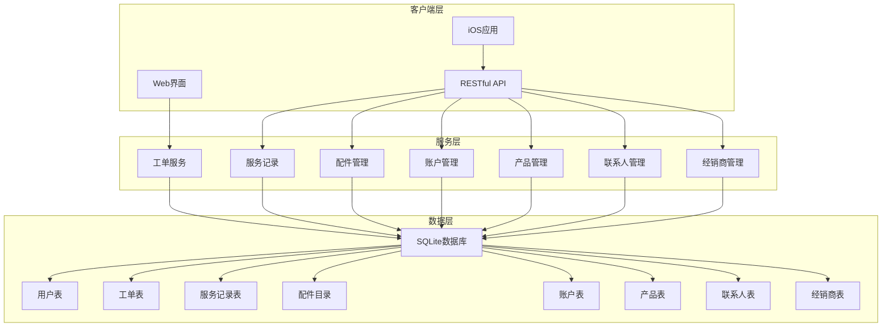

**图表来源**
- [server/index.js:1-200](file://server/index.js#L1-L200)
- [server/service/routes/tickets.js:1-800](file://server/service/routes/tickets.js#L1-L800)

## 核心数据模型

### 工单数据模型

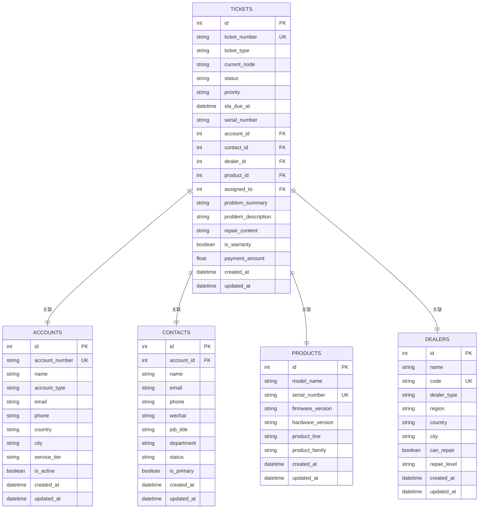

**图表来源**
- [server/service/migrations/001_extend_issues.sql:1-196](file://server/service/migrations/001_extend_issues.sql#L1-L196)
- [server/service/migrations/002_service_records.sql:1-174](file://server/service/migrations/002_service_records.sql#L1-L174)

### 服务记录数据模型

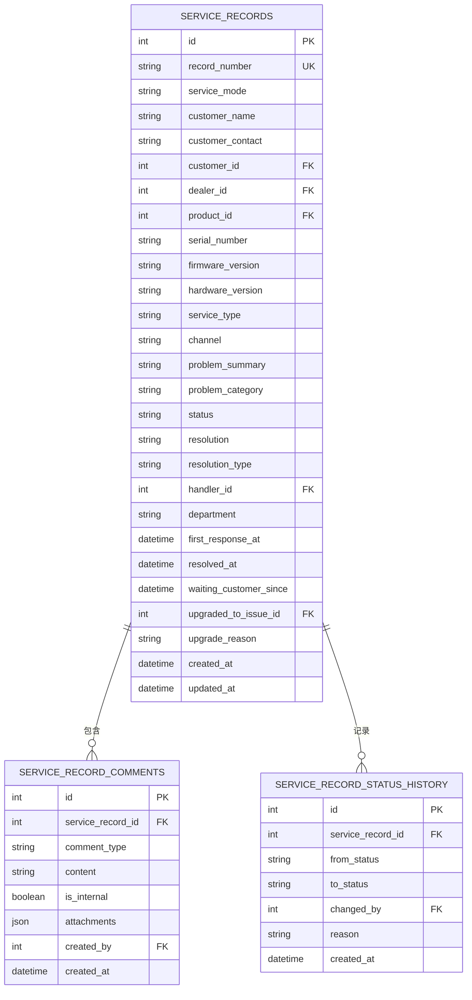

**图表来源**
- [server/service/migrations/002_service_records.sql:1-174](file://server/service/migrations/002_service_records.sql#L1-L174)

### 配件管理数据模型

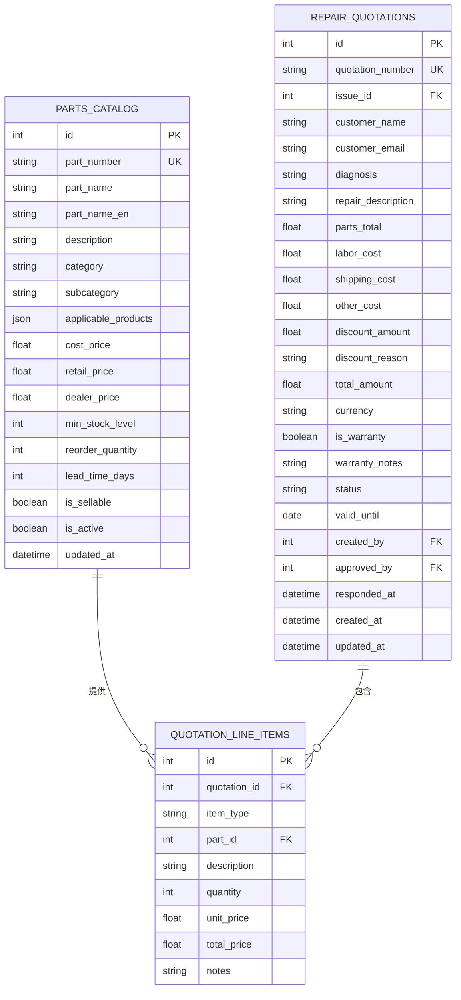

**图表来源**
- [server/service/routes/parts.js:1-660](file://server/service/routes/parts.js#L1-L660)

## 服务数据模型详解

### 工单管理系统

#### 工单类型和状态流转

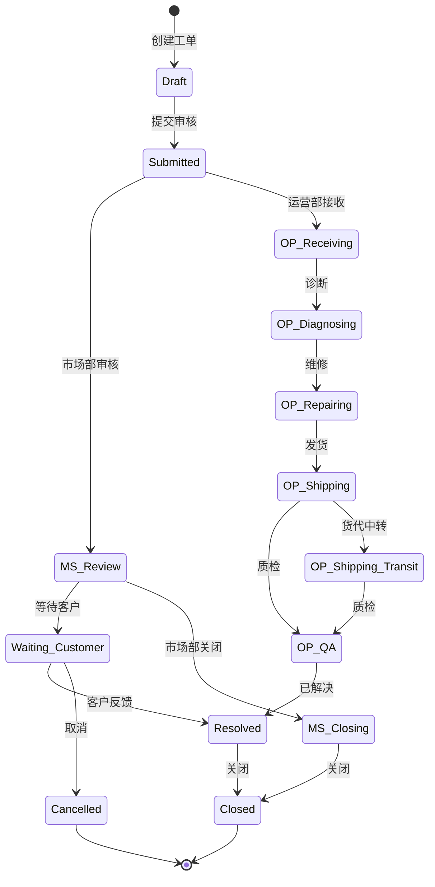

**图表来源**
- [server/service/routes/tickets.js:56-61](file://server/service/routes/tickets.js#L56-L61)

#### 工单自动分配机制

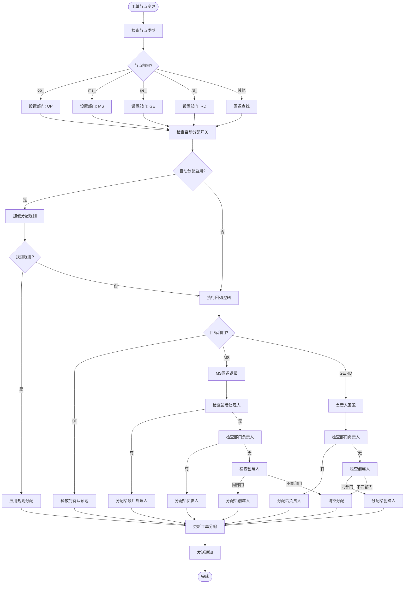

**图表来源**
- [server/service/routes/tickets.js:135-366](file://server/service/routes/tickets.js#L135-L366)

### 服务记录系统

#### 服务记录生命周期

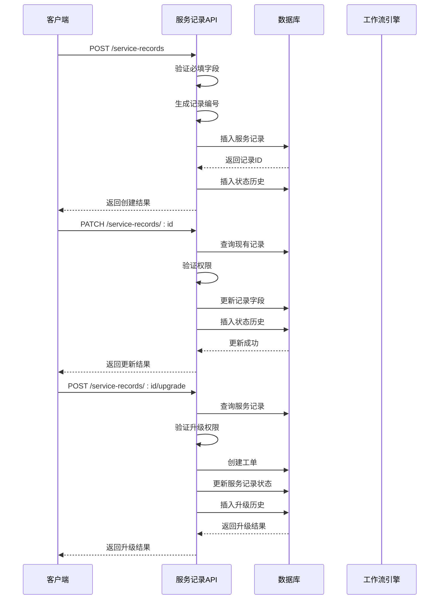

**图表来源**
- [server/service/routes/service-records.js:155-592](file://server/service/routes/service-records.js#L155-L592)

### 配件管理系统

#### 报价单生成流程

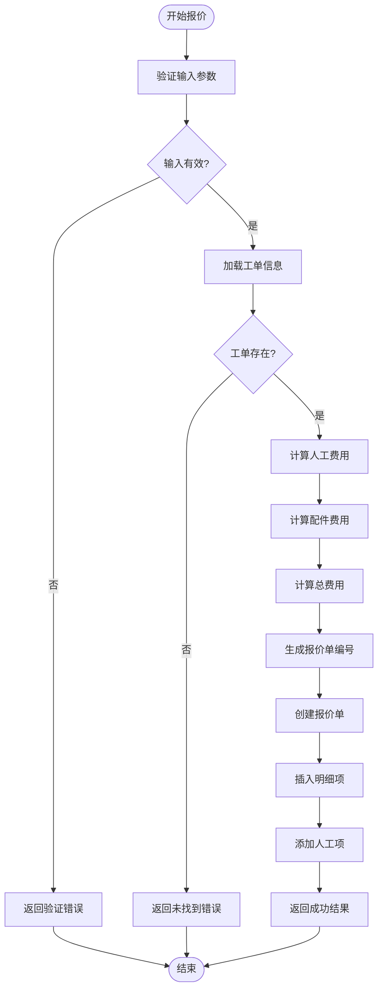

**图表来源**
- [server/service/routes/parts.js:257-387](file://server/service/routes/parts.js#L257-L387)

### 账户和联系人管理

#### 账户架构设计

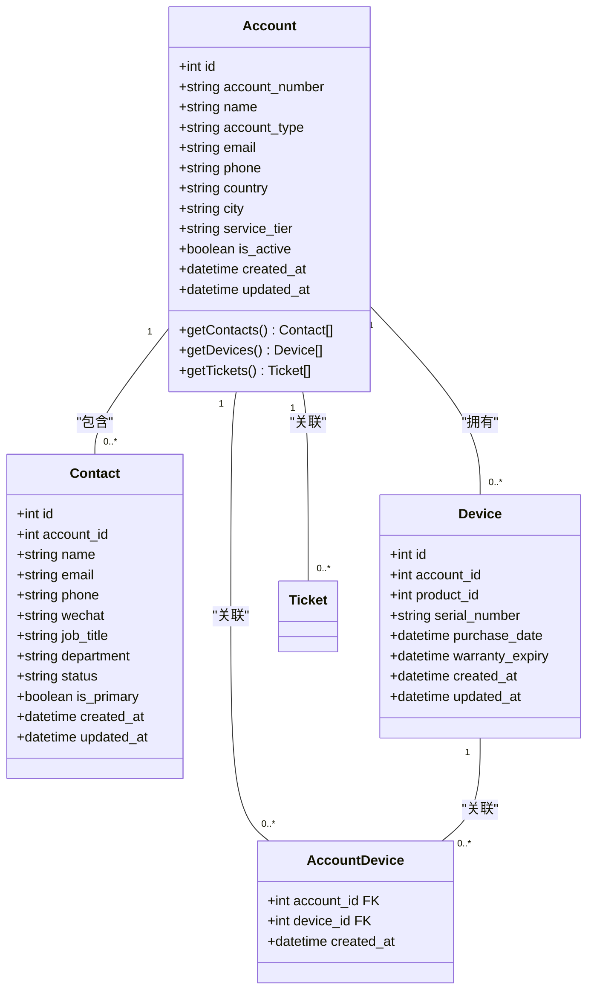

**图表来源**
- [server/service/routes/accounts.js:346-436](file://server/service/routes/accounts.js#L346-L436)

## 数据库关系图

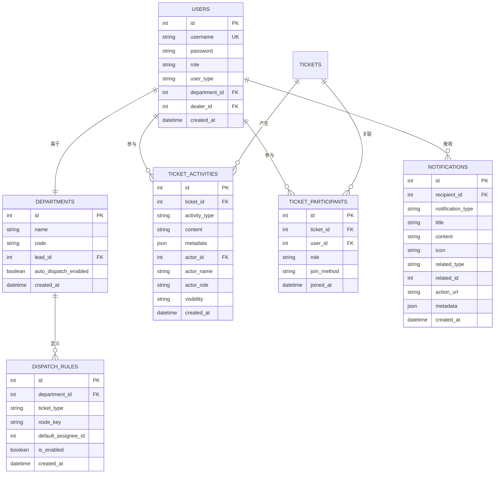

**图表来源**
- [server/service/routes/tickets.js:165-315](file://server/service/routes/tickets.js#L165-L315)

## 数据流分析

### 工单创建流程

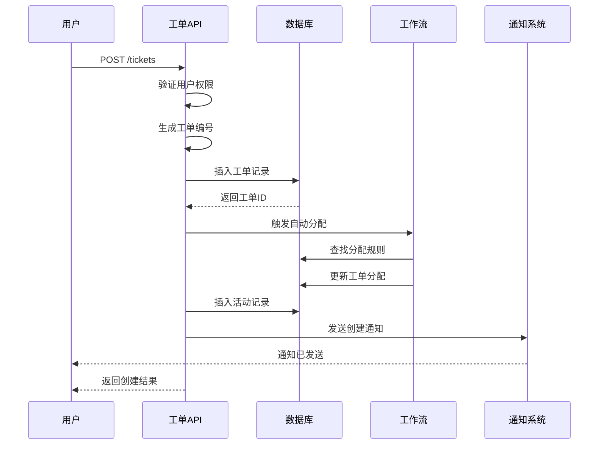

**图表来源**
- [server/service/routes/tickets.js:561-776](file://server/service/routes/tickets.js#L561-L776)

### 服务记录升级流程

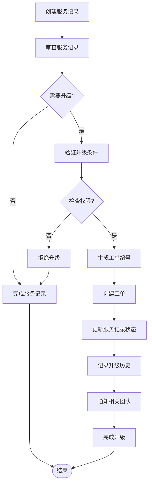

**图表来源**
- [server/service/routes/service-records.js:494-592](file://server/service/routes/service-records.js#L494-L592)

## 性能考虑

### 数据库优化策略

1. **索引优化**
   - 工单表：按ticket_type、status、created_at建立复合索引
   - 账户表：按account_type、is_active建立索引
   - 产品表：按serial_number、model_name建立索引

2. **查询优化**
   - 使用LIMIT和OFFSET进行分页
   - 避免SELECT *，只选择必要字段
   - 使用参数化查询防止SQL注入

3. **缓存策略**
   - 部门规则和用户权限信息缓存
   - 常用字典数据缓存
   - 工单统计数据定期缓存

### 性能监控指标

- **响应时间**：API请求平均响应时间应小于2秒
- **并发处理**：支持至少50个并发请求
- **数据库连接**：使用连接池管理数据库连接
- **内存使用**：保持内存使用在合理范围内

## 故障排除指南

### 常见问题及解决方案

#### 工单分配问题
**问题**：工单无法自动分配
**原因**：
- 部门自动分配功能未启用
- 分配规则配置错误
- 目标处理人不存在

**解决方案**：
1. 检查部门自动分配设置
2. 验证分配规则配置
3. 确认目标处理人状态正常

#### 权限访问问题
**问题**：用户无法访问特定工单
**原因**：
- 用户权限不足
- 工单属于其他部门
- 账户关联关系错误

**解决方案**：
1. 检查用户角色和部门
2. 验证工单的部门归属
3. 确认账户关联关系

#### 数据同步问题
**问题**：工单状态更新后前端不显示
**原因**：
- WebSocket连接断开
- 缓存数据过期
- 前端状态管理错误

**解决方案**：
1. 重新连接WebSocket
2. 清除前端缓存
3. 刷新页面重新加载数据

**章节来源**
- [server/service/routes/tickets.js:363-366](file://server/service/routes/tickets.js#L363-L366)
- [server/service/routes/accounts.js:334-343](file://server/service/routes/accounts.js#L334-L343)

## 总结

Longhorn服务数据模型通过统一的工单系统实现了高效的客户服务管理。系统的核心优势包括：

1. **模块化设计**：清晰的模块划分便于维护和扩展
2. **强类型约束**：通过数据库约束确保数据完整性
3. **灵活的权限控制**：支持多层级的权限管理和访问控制
4. **完整的审计跟踪**：所有重要操作都有详细的日志记录
5. **智能化的工作流**：自动化的工单分配和状态流转

该数据模型为后续的功能扩展奠定了坚实的基础，支持从基础的工单管理到复杂的企业级服务管理需求。通过持续的优化和改进，Longhorn将成为一个功能完备、性能优异的服务管理平台。