# 服务配件SKU定价

<cite>
**本文档引用的文件**
- [Service_Parts_SKU_Pricing.md](file://docs/Service_Parts_SKU_Pricing.md)
- [Service_PRD.md](file://docs/Service_PRD.md)
- [Service_API.md](file://docs/Service_API.md)
- [parts-master.js](file://server/service/routes/parts-master.js)
- [parts.js](file://server/service/routes/parts.js)
- [dealer-repairs.js](file://server/service/routes/dealer-repairs.js)
- [031_parts_master.sql](file://server/service/migrations/031_parts_master.sql)
- [007_parts_inventory.sql](file://server/service/migrations/007_parts_inventory.sql)
- [upgrade_parts_pricing.js](file://server/migrations/upgrade_parts_pricing.js)
- [remove_parts_prices.js](file://server/migrations/remove_parts_prices.js)
- [seed_eagle_parts.sql](file://server/service/seeds/seed_eagle_parts.sql)
- [CustomerContextSidebar.tsx](file://client/src/components/Service/CustomerContextSidebar.tsx)
- [ServiceRecordCreatePage.tsx](file://client/src/components/ServiceRecords/ServiceRecordCreatePage.tsx)
- [dealer-inventory.js](file://server/service/routes/dealer-inventory.js)
- [DealerRepairCreatePage.tsx](file://client/src/components/DealerRepairs/DealerRepairCreatePage.tsx)
- [DealerRepairDetailPage.tsx](file://client/src/components/DealerRepairs/DealerRepairDetailPage.tsx)
- [DealerRepairListPage.tsx](file://client/src/components/DealerRepairs/DealerRepairListPage.tsx)
- [proforma-invoice.js](file://server/service/routes/proforma-invoice.js)
</cite>

## 更新摘要
**所做更改**
- 完全废弃parts_master定价系统，迁移至sku_prices中心价格表
- 引入新的sku_prices通用价格表，支持多币种统一管理
- 更新配件主数据API，实现价格与主数据分离架构
- 新增破坏性迁移脚本，彻底移除parts_master中的价格字段
- 完善前端组件，适配新的价格数据结构

## 目录
1. [简介](#简介)
2. [项目结构](#项目结构)
3. [核心组件](#核心组件)
4. [架构概览](#架构概览)
5. [详细组件分析](#详细组件分析)
6. [返修报价系统](#返修报价系统)
7. [配件库存管理](#配件库存管理)
8. [价格系统架构变更](#价格系统架构变更)
9. [依赖关系分析](#依赖关系分析)
10. [性能考虑](#性能考虑)
11. [故障排除指南](#故障排除指南)
12. [结论](#结论)

## 简介

服务配件SKU定价系统是Kinefinity产品服务闭环系统的重要组成部分，负责管理维修配件的SKU编码、价格体系和报价计算。该系统基于标准化的文档规范，为前端应用提供实时的配件价格数据，支持经销商和内部团队的维修服务流程。

**重大架构变更**：系统已完成从parts_master定价系统的完全废弃，迁移到新的sku_prices通用价格表架构。这一变更实现了价格数据的集中管理和多币种统一支持，为后续的功能扩展奠定了坚实基础。

系统采用三层工单模型，涵盖咨询工单、RMA返厂单和经销商维修单三种服务场景，为每个工单类型提供完整的配件定价和报价功能。新的价格架构进一步完善了整个服务生态，实现了从配件查询到维修报价的全流程管理。

## 项目结构

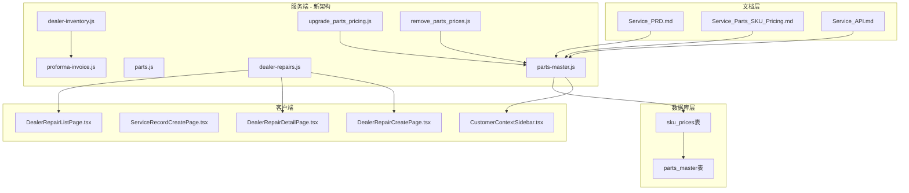

**图表来源**
- [Service_PRD.md:1-800](file://docs/Service_PRD.md#L1-L800)
- [Service_Parts_SKU_Pricing.md:1-233](file://docs/Service_Parts_SKU_Pricing.md#L1-L233)
- [parts-master.js:1-449](file://server/service/routes/parts-master.js#L1-L449)
- [upgrade_parts_pricing.js:1-92](file://server/migrations/upgrade_parts_pricing.js#L1-L92)
- [remove_parts_prices.js:1-89](file://server/migrations/remove_parts_prices.js#L1-L89)

**章节来源**
- [Service_PRD.md:1-800](file://docs/Service_PRD.md#L1-L800)
- [Service_Parts_SKU_Pricing.md:1-233](file://docs/Service_Parts_SKU_Pricing.md#L1-L233)

## 核心组件

### 配件目录管理

系统提供完整的配件目录管理功能，包括：

- **SKU编码规则**：统一的S+物料ID格式
- **价格体系**：支持CNY、USD、EUR三种货币的sku_prices中心表
- **分类管理**：按产品线和功能分类组织配件
- **兼容性管理**：基于产品模型的配件适用性

### 报价计算引擎

提供智能的报价计算功能：

- **快速估算**：基于sku_prices表的规则引擎报价
- **详细报价**：包含配件、人工、运费的完整报价
- **汇率转换**：支持多币种实时汇率计算
- **折扣管理**：支持批量折扣和促销活动

### 经销商库存管理

集成经销商库存系统：

- **实时库存查询**：支持低库存预警
- **补货订单**：自动化补货流程
- **月结结算**：定期财务结算功能

**章节来源**
- [parts-master.js:244-277](file://server/service/routes/parts-master.js#L244-L277)
- [parts-master.js:351-367](file://server/service/routes/parts-master.js#L351-L367)

## 架构概览

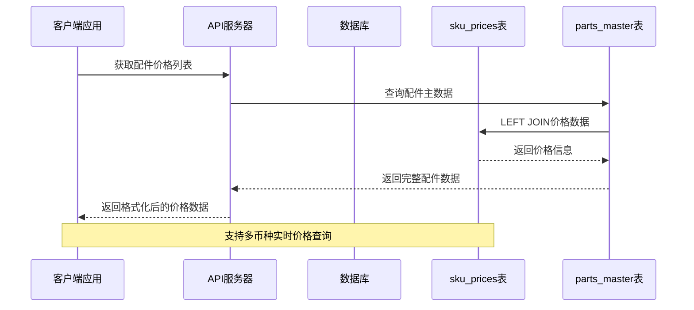

**图表来源**
- [parts-master.js:78-93](file://server/service/routes/parts-master.js#L78-L93)
- [parts-master.js:143-153](file://server/service/routes/parts-master.js#L143-L153)

系统采用RESTful API设计，所有配件相关操作都通过HTTP接口提供。前端组件通过标准的GET/POST请求与后端交互，实现数据的实时同步。新的架构通过LEFT JOIN的方式将parts_master和sku_prices表关联，实现了价格数据的动态加载。

## 详细组件分析

### 配件目录API

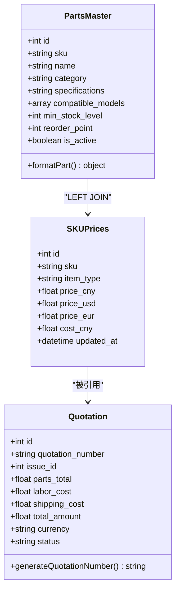

**图表来源**
- [parts-master.js:84-87](file://server/service/routes/parts-master.js#L84-L87)
- [parts-master.js:148-149](file://server/service/routes/parts-master.js#L148-L149)

配件目录API提供以下核心功能：

1. **列表查询**：支持分页、搜索、分类筛选，自动JOIN sku_prices表
2. **详情获取**：返回完整的配件信息和价格数据
3. **创建管理**：管理员权限的配件创建和更新，同时维护两个表
4. **价格计算**：实时计算配件价格和税费

**章节来源**
- [parts-master.js:28-128](file://server/service/routes/parts-master.js#L28-L128)
- [parts-master.js:134-195](file://server/service/routes/parts-master.js#L134-L195)

### 报价计算流程

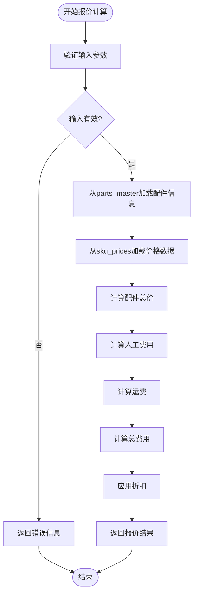

**图表来源**
- [parts-master.js:351-367](file://server/service/routes/parts-master.js#L351-L367)

报价计算流程包含以下步骤：

1. **参数验证**：检查必需参数的有效性
2. **数据加载**：从parts_master获取配件信息，从sku_prices获取价格数据
3. **成本计算**：计算配件、人工、运费的总成本
4. **折扣应用**：应用可用的折扣和优惠
5. **结果返回**：返回详细的报价分解

**章节来源**
- [parts-master.js:351-367](file://server/service/routes/parts-master.js#L351-L367)

### 前端集成组件

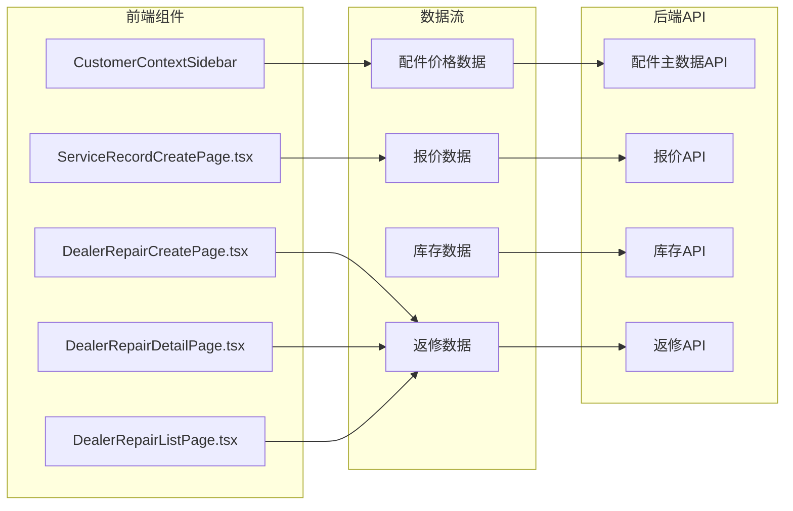

**图表来源**
- [CustomerContextSidebar.tsx:274-306](file://client/src/components/Service/CustomerContextSidebar.tsx#L274-L306)
- [ServiceRecordCreatePage.tsx:1-358](file://client/src/components/ServiceRecords/ServiceRecordCreatePage.tsx#L1-L358)
- [DealerRepairCreatePage.tsx:1-221](file://client/src/components/DealerRepairs/DealerRepairCreatePage.tsx#L1-L221)
- [DealerRepairDetailPage.tsx:1-505](file://client/src/components/DealerRepairs/DealerRepairDetailPage.tsx#L1-L505)
- [DealerRepairListPage.tsx:1-324](file://client/src/components/DealerRepairs/DealerRepairListPage.tsx#L1-L324)

前端组件通过以下方式集成：

1. **实时数据更新**：组件自动获取最新的配件价格
2. **交互式报价**：支持用户手动输入参数进行报价计算
3. **库存状态显示**：显示配件的实时库存状态
4. **历史记录追踪**：记录用户的查询和报价历史
5. **返修流程支持**：完整的返修报价和管理功能

**章节来源**
- [CustomerContextSidebar.tsx:274-306](file://client/src/components/Service/CustomerContextSidebar.tsx#L274-L306)
- [ServiceRecordCreatePage.tsx:1-358](file://client/src/components/ServiceRecords/ServiceRecordCreatePage.tsx#L1-L358)
- [DealerRepairCreatePage.tsx:1-221](file://client/src/components/DealerRepairs/DealerRepairCreatePage.tsx#L1-L221)
- [DealerRepairDetailPage.tsx:1-505](file://client/src/components/DealerRepairs/DealerRepairDetailPage.tsx#L1-L505)
- [DealerRepairListPage.tsx:1-324](file://client/src/components/DealerRepairs/DealerRepairListPage.tsx#L1-L324)

## 返修报价系统

### 经销商维修单管理

新增的返修报价系统提供了完整的经销商维修单管理功能：

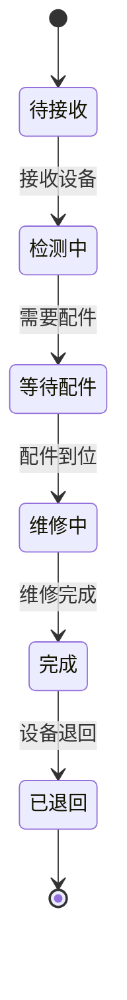

**图表来源**
- [dealer-repairs.js:16-47](file://server/service/routes/dealer-repairs.js#L16-L47)

系统支持四种维修类型：

- **在保维修**：设备在保修期内的免费维修
- **过保维修**：设备过保后的付费维修
- **升级维修**：将设备升级到更高配置
- **保养维护**：定期保养和预防性维护

### 返修报价流程

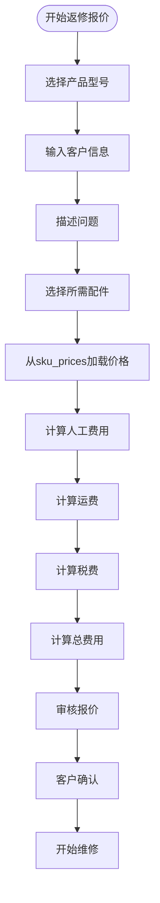

**图表来源**
- [DealerRepairCreatePage.tsx:45-79](file://client/src/components/DealerRepairs/DealerRepairCreatePage.tsx#L45-L79)
- [DealerRepairDetailPage.tsx:109-129](file://client/src/components/DealerRepairs/DealerRepairDetailPage.tsx#L109-L129)

**章节来源**
- [dealer-repairs.js:288-397](file://server/service/routes/dealer-repairs.js#L288-L397)
- [DealerRepairCreatePage.tsx:1-221](file://client/src/components/DealerRepairs/DealerRepairCreatePage.tsx#L1-L221)
- [DealerRepairDetailPage.tsx:1-505](file://client/src/components/DealerRepairs/DealerRepairDetailPage.tsx#L1-L505)
- [DealerRepairListPage.tsx:1-324](file://client/src/components/DealerRepairs/DealerRepairListPage.tsx#L1-L324)

## 配件库存管理

### 经销商库存系统

新增的配件库存管理系统提供了完整的库存管理功能：

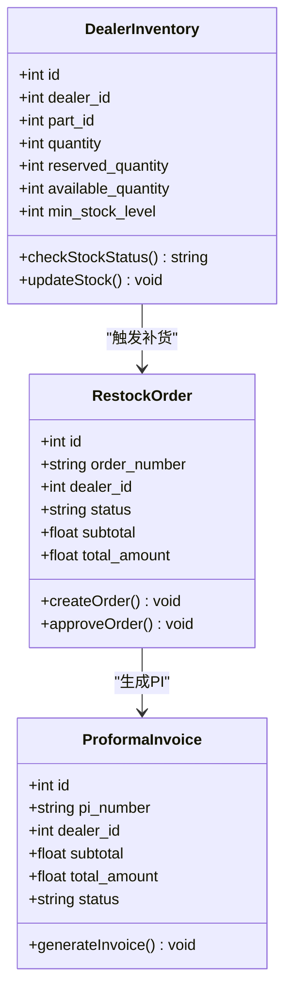

**图表来源**
- [007_parts_inventory.sql:10-80](file://server/service/migrations/007_parts_inventory.sql#L10-L80)
- [007_parts_inventory.sql:85-160](file://server/service/migrations/007_parts_inventory.sql#L85-L160)
- [007_parts_inventory.sql:177-226](file://server/service/migrations/007_parts_inventory.sql#L177-L226)

### 库存管理功能

系统提供以下库存管理功能：

1. **实时库存查询**：支持按经销商和配件的实时库存查询
2. **库存预警**：当库存低于安全线时自动预警
3. **补货申请**：经销商可以发起补货申请
4. **库存流水**：记录所有库存变动的详细流水
5. **月结结算**：支持月度库存结算和对账

### 补货订单流程

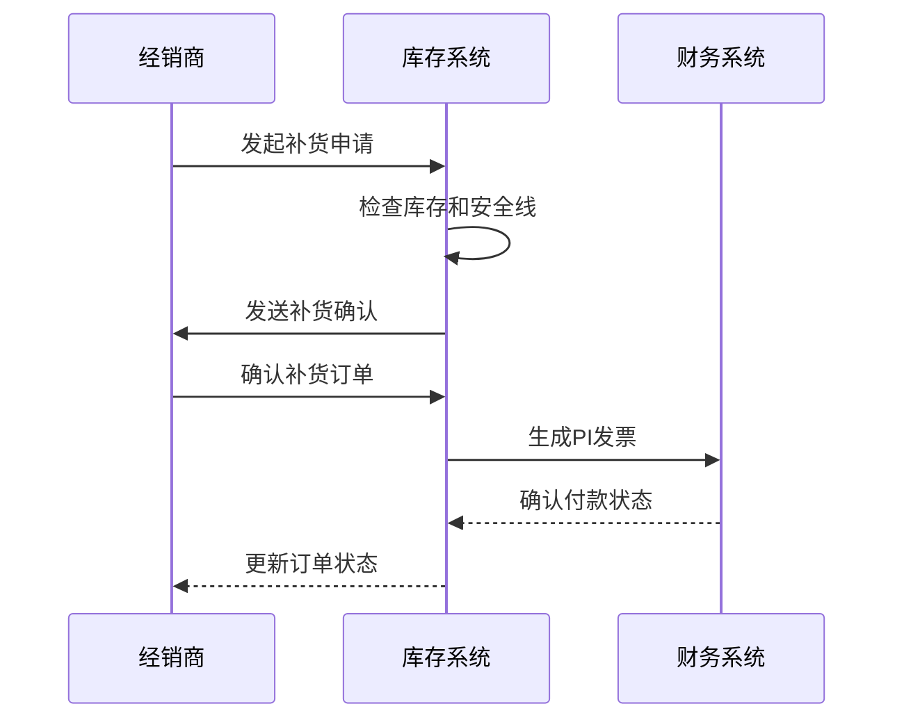

**图表来源**
- [dealer-inventory.js:466-481](file://server/service/routes/dealer-inventory.js#L466-L481)
- [proforma-invoice.js:212-324](file://server/service/routes/proforma-invoice.js#L212-L324)

**章节来源**
- [007_parts_inventory.sql:1-349](file://server/service/migrations/007_parts_inventory.sql#L1-L349)
- [dealer-inventory.js:466-642](file://server/service/routes/dealer-inventory.js#L466-L642)
- [proforma-invoice.js:1-415](file://server/service/routes/proforma-invoice.js#L1-L415)

## 价格系统架构变更

### 数据库架构演进

**旧架构（已废弃）**：
- parts_master表直接包含价格字段：price_cny、price_usd、price_eur、cost_cny
- 价格数据与配件主数据耦合在一起
- 不支持sku_prices中心化管理

**新架构（当前）**：
- parts_master表仅包含配件基本信息，移除了价格字段
- 新增sku_prices表作为价格中心，支持多币种统一管理
- 通过LEFT JOIN实现价格数据的动态加载

### 迁移策略

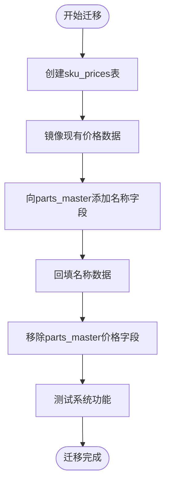

**图表来源**
- [upgrade_parts_pricing.js:18-78](file://server/migrations/upgrade_parts_pricing.js#L18-L78)
- [remove_parts_prices.js:15-78](file://server/migrations/remove_parts_prices.js#L15-L78)

### 破坏性迁移实现

新的迁移脚本采用了安全的破坏性迁移策略：

1. **版本检测**：自动检测SQLite版本支持情况
2. **条件分支**：根据支持情况选择DROP COLUMN或表重建策略
3. **事务保证**：所有操作都在单个事务中执行，确保原子性
4. **索引重建**：迁移完成后自动重建所有索引

**章节来源**
- [upgrade_parts_pricing.js:1-92](file://server/migrations/upgrade_parts_pricing.js#L1-L92)
- [remove_parts_prices.js:1-89](file://server/migrations/remove_parts_prices.js#L1-L89)

## 依赖关系分析

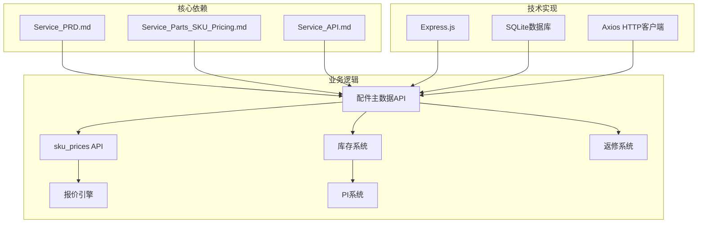

**图表来源**
- [Service_PRD.md:1-800](file://docs/Service_PRD.md#L1-L800)
- [Service_Parts_SKU_Pricing.md:1-233](file://docs/Service_Parts_SKU_Pricing.md#L1-L233)

系统的关键依赖关系：

1. **文档驱动**：所有业务逻辑都基于标准化的文档规范
2. **API标准化**：前后端通过标准化的API接口通信
3. **数据一致性**：前端和后端共享相同的数据模型
4. **权限控制**：基于角色的访问控制确保数据安全
5. **流程集成**：返修系统与库存系统无缝集成

**章节来源**
- [Service_API.md:1451-1691](file://docs/Service_API.md#L1451-L1691)

## 性能考虑

### 缓存策略

系统采用多层次缓存策略来优化性能：

- **数据库查询缓存**：热门配件查询结果缓存
- **前端组件缓存**：用户常用的报价模板缓存
- **静态资源缓存**：CSS、JS文件的浏览器缓存
- **会话缓存**：用户登录状态和权限信息缓存

### 并发处理

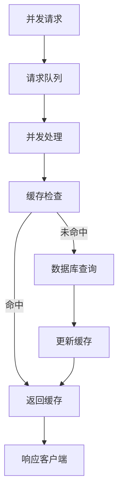

**图表来源**
- [parts-master.js:20-81](file://server/service/routes/parts-master.js#L20-L81)

### 数据库优化

- **索引优化**：为常用查询字段建立索引
- **查询优化**：使用LIMIT和OFFSET实现分页
- **连接池**：使用连接池管理数据库连接
- **事务管理**：确保库存和报价数据的一致性

## 故障排除指南

### 常见问题及解决方案

| 问题类型 | 症状 | 解决方案 |
|---------|------|----------|
| 配件价格不更新 | 前端显示过期价格 | 清除浏览器缓存或强制刷新页面 |
| 报价计算错误 | 计算结果与预期不符 | 检查输入参数和汇率设置 |
| 库存显示异常 | 库存数量不准确 | 同步库存数据或检查库存事务日志 |
| API访问失败 | 401/403错误 | 检查认证令牌和用户权限 |
| 返修单创建失败 | 500错误 | 检查产品和客户信息的完整性 |
| 库存预警不准确 | 预警延迟或缺失 | 检查安全线设置和库存更新频率 |
| 价格数据丢失 | 配件无价格信息 | 检查sku_prices表数据完整性 |

### 调试工具

1. **浏览器开发者工具**：监控网络请求和响应
2. **数据库查询工具**：直接查询数据库验证数据
3. **日志分析**：查看服务器日志定位问题
4. **API测试工具**：使用Postman测试API接口
5. **库存监控工具**：实时监控库存变化和预警状态

**章节来源**
- [parts-master.js:74-80](file://server/service/routes/parts-master.js#L74-L80)
- [parts-master.js:168-179](file://server/service/routes/parts-master.js#L168-L179)

## 结论

服务配件SKU定价系统通过标准化的文档规范和RESTful API设计，为Kinefinity的产品服务闭环提供了强大的技术支持。系统不仅满足了当前的业务需求，还具备良好的扩展性和维护性。

**主要成就**：

1. **标准化管理**：基于文档的标准化管理模式
2. **实时数据**：前后端数据的实时同步
3. **灵活扩展**：支持新的配件类别和定价策略
4. **安全可靠**：完善的权限控制和数据保护
5. **完整流程**：从配件查询到维修报价的全流程支持

**架构升级价值**：

1. **价格中心化**：sku_prices表实现了价格数据的统一管理
2. **多币种支持**：全面支持CNY、USD、EUR三种货币
3. **数据解耦**：配件主数据与价格数据分离，提升系统灵活性
4. **破坏性迁移**：安全可靠的数据库架构升级
5. **性能优化**：通过索引和缓存策略提升查询性能

**未来发展方向**：

1. **智能化报价**：集成AI算法提供更精准的报价建议
2. **移动端支持**：开发移动应用支持现场报价
3. **多语言支持**：扩展国际化功能支持更多语言
4. **数据分析**：增强数据分析功能支持业务决策
5. **供应链集成**：与供应商系统深度集成优化供应链管理