# 经销商库存管理

<cite>
**本文档引用的文件**
- [dealer-inventory.js](file://server/service/routes/dealer-inventory.js)
- [007_parts_inventory.sql](file://server/service/migrations/007_parts_inventory.sql)
- [012_account_contact_architecture.sql](file://server/service/migrations/012_account_contact_architecture.sql)
- [013_migrate_to_account_contact.sql](file://server/service/migrations/013_migrate_to_account_contact.sql)
- [migrate_to_accounts.sql](file://server/migrations/migrate_to_accounts.sql)
- [accounts.js](file://server/service/routes/accounts.js)
- [contacts.js](file://server/service/routes/contacts.js)
- [Service_DataModel.md](file://docs/Service_DataModel.md)
- [index.js](file://server/service/index.js)
- [dealers.js](file://server/service/routes/dealers.js)
- [parts.js](file://server/service/routes/parts.js)
- [DealerRepairListPage.tsx](file://client/src/components/DealerRepairs/DealerRepairListPage.tsx)
- [RMATicketListPage.tsx](file://client/src/components/RMATickets/RMATicketListPage.tsx)
- [useCachedTickets.ts](file://client/src/hooks/useCachedTickets.ts)
- [useTicketStore.ts](file://client/src/store/useTicketStore.ts)
- [AccountDetailPage.tsx](file://client/src/components/AccountDetailPage.tsx)
- [ContactManager.tsx](file://client/src/components/ContactManager.tsx)
- [DealerManagement.tsx](file://client/src/components/DealerManagement.tsx)
- [DealerDetailPage.tsx](file://client/src/components/DealerDetailPage.tsx)
- [fix_dealer_contacts.js](file://server/scripts/fix_dealer_contacts.js)
- [migrate_dealers.js](file://scripts/migrate_dealers.js)
- [migrate_dealers_v2.js](file://scripts/migrate_dealers_v2.js)
- [DealerInventoryListPage.tsx](file://client/src/components/DealerInventory/DealerInventoryListPage.tsx)
- [RestockOrderCreatePage.tsx](file://client/src/components/DealerInventory/RestockOrderCreatePage.tsx)
- [RestockOrderDetailPage.tsx](file://client/src/components/DealerInventory/RestockOrderDetailPage.tsx)
- [RestockOrderListPage.tsx](file://client/src/components/DealerInventory/RestockOrderListPage.tsx)
- [index.ts](file://client/src/components/DealerInventory/index.ts)
- [App.tsx](file://client/src/App.tsx)
</cite>

## 更新摘要
**变更内容**
- 新增四个核心组件：DealerInventoryListPage、RestockOrderCreatePage、RestockOrderDetailPage、RestockOrderListPage
- 实现完整的低库存预警功能，包括实时库存监控和预警展示
- 建立补货订单管理生命周期，支持从创建到交付的全流程管理
- 完善库存查询和筛选功能，支持按分类、状态等多维度筛选
- 增强经销商分类系统，提供tier1、tier2、tier3等级标识和维修能力标签
- 优化前端路由结构，完善服务模块的导航体系

## 目录
1. [项目概述](#项目概述)
2. [系统架构](#系统架构)
3. [核心组件](#核心组件)
4. [数据库设计](#数据库设计)
5. [API接口详解](#api接口详解)
6. [前端集成](#前端集成)
7. [业务流程](#业务流程)
8. [性能考虑](#性能考虑)
9. [故障排除指南](#故障排除指南)
10. [总结](#总结)

## 项目概述

经销商库存管理系统是Longhorn服务系统中的重要组成部分，专注于管理经销售货商的配件库存、补货订单和库存交易记录。该系统实现了完整的库存生命周期管理，包括库存查询、库存调整、补货申请和库存事务追踪等功能。

**更新** 系统现已完成统一账户联系人架构迁移，经销商管理功能完全整合到新的账户系统中，支持账户类型管理和联系人关系管理。新的架构将原有的独立经销商和客户管理统一为一个完整的账户联系人体系。

**新增** 四个核心组件的完整实现：
- DealerInventoryListPage：提供全面的库存查询和低库存预警功能
- RestockOrderCreatePage：支持配件选择、购物车管理和订单创建
- RestockOrderListPage：展示补货订单列表和状态管理
- RestockOrderDetailPage：提供订单详情查看和状态操作功能

系统采用前后端分离架构，后端基于Node.js和SQLite数据库，前端使用React构建用户界面。系统支持多角色权限管理，包括经销商、管理员和主管等不同角色，确保数据安全和操作权限的合理分配。

## 系统架构

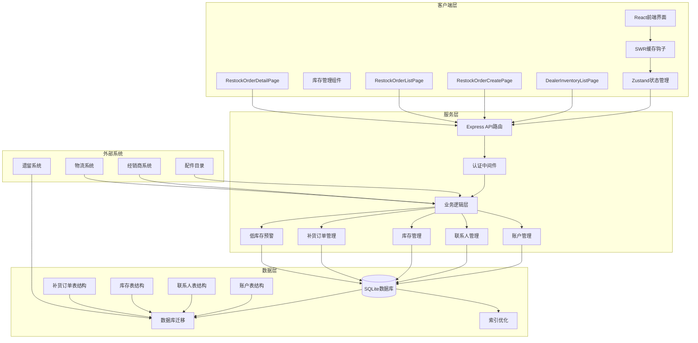

**图表来源**
- [index.js](file://server/service/index.js#L62-L94)
- [dealer-inventory.js](file://server/service/routes/dealer-inventory.js#L9-L10)
- [accounts.js](file://server/service/routes/accounts.js#L1-L800)
- [contacts.js](file://server/service/routes/contacts.js#L1-L274)
- [App.tsx](file://client/src/App.tsx#L196-L200)

**章节来源**
- [index.js](file://server/service/index.js#L1-L266)

## 核心组件

### 1. 统一账户联系人架构

**更新** 系统已完全迁移到统一的账户联系人架构，替代了原有的独立经销商和客户管理方式。

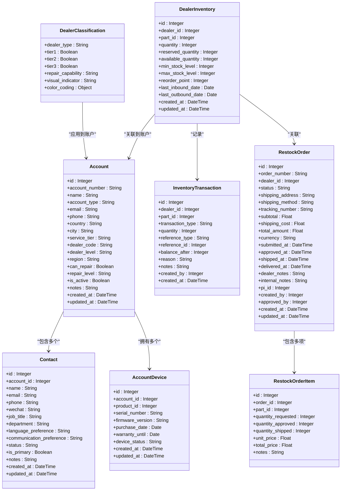

**图表来源**
- [012_account_contact_architecture.sql](file://server/service/migrations/012_account_contact_architecture.sql#L6-L43)
- [012_account_contact_architecture.sql](file://server/service/migrations/012_account_contact_architecture.sql#L45-L75)
- [012_account_contact_architecture.sql](file://server/service/migrations/012_account_contact_architecture.sql#L77-L94)
- [007_parts_inventory.sql](file://server/service/migrations/007_parts_inventory.sql#L85-L129)
- [007_parts_inventory.sql](file://server/service/migrations/007_parts_inventory.sql#L138-L159)
- [007_parts_inventory.sql](file://server/service/migrations/007_parts_inventory.sql#L314-L348)

**章节来源**
- [dealer-inventory.js](file://server/service/routes/dealer-inventory.js#L1-L643)
- [accounts.js](file://server/service/routes/accounts.js#L1-L800)

### 2. 权限控制系统

**更新** 权限控制现在基于统一的账户架构，支持更精细的权限管理。

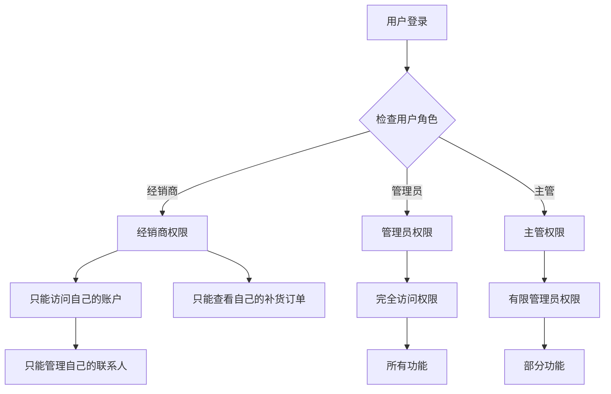

**图表来源**
- [dealer-inventory.js](file://server/service/routes/dealer-inventory.js#L31-L37)
- [dealer-inventory.js](file://server/service/routes/dealer-inventory.js#L136-L141)
- [accounts.js](file://server/service/routes/accounts.js#L684-L800)

**章节来源**
- [dealer-inventory.js](file://server/service/routes/dealer-inventory.js#L1-L643)
- [accounts.js](file://server/service/routes/accounts.js#L1-L800)

### 3. 经销商分类系统

**新增** 系统现在包含全面的经销商分类系统，支持基于等级的经销商类别和维修能力标签。

```mermaid
flowchart TD
DealerClassification[经销商分类系统] --> Tier1[tier1 - 一级经销商]
DealerClassification --> Tier2[tier2 - 二级经销商]
DealerClassification --> Tier3[tier3 - 三级经销商]
Tier1 --> VisualIndicator1[金色视觉指示器]
Tier2 --> VisualIndicator2[蓝色视觉指示器]
Tier3 --> VisualIndicator3[灰色视觉指示器]
VisualIndicator1 --> ColorCoding1[颜色编码: #FFD700]
VisualIndicator2 --> ColorCoding2[颜色编码: #60A5FA]
VisualIndicator3 --> ColorCoding3[颜色编码: #9CA3AF]
DealerClassification --> RepairCapability[维修能力标签]
RepairCapability --> Simple[简单 - 绿色: rgba(34, 197, 94, 0.1)]
RepairCapability --> Advanced[高级 - 紫色: rgba(168, 85, 247, 0.1)]
RepairCapability --> Full[完整 - 金色: rgba(255, 215, 0, 0.15)]
```

**图表来源**
- [DealerDetailPage.tsx](file://client/src/components/DealerDetailPage.tsx#L126-L169)
- [DealerManagement.tsx](file://client/src/components/DealerManagement.tsx#L590-L608)

**章节来源**
- [DealerDetailPage.tsx](file://client/src/components/DealerDetailPage.tsx#L126-L169)
- [DealerManagement.tsx](file://client/src/components/DealerManagement.tsx#L590-L608)

### 4. 新增组件架构

**新增** 四个核心组件的详细架构设计：

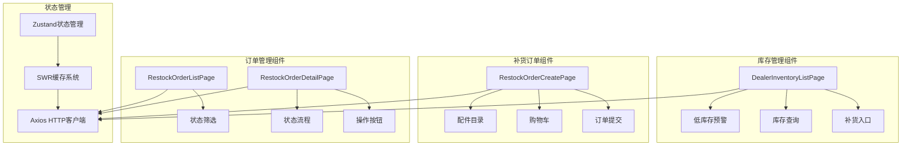

**图表来源**
- [DealerInventoryListPage.tsx](file://client/src/components/DealerInventory/DealerInventoryListPage.tsx#L46-L97)
- [RestockOrderCreatePage.tsx](file://client/src/components/DealerInventory/RestockOrderCreatePage.tsx#L41-L79)
- [RestockOrderListPage.tsx](file://client/src/components/DealerInventory/RestockOrderListPage.tsx#L38-L72)
- [RestockOrderDetailPage.tsx](file://client/src/components/DealerInventory/RestockOrderDetailPage.tsx#L62-L92)

**章节来源**
- [DealerInventoryListPage.tsx](file://client/src/components/DealerInventory/DealerInventoryListPage.tsx#L1-L437)
- [RestockOrderCreatePage.tsx](file://client/src/components/DealerInventory/RestockOrderCreatePage.tsx#L1-L515)
- [RestockOrderListPage.tsx](file://client/src/components/DealerInventory/RestockOrderListPage.tsx#L1-L294)
- [RestockOrderDetailPage.tsx](file://client/src/components/DealerInventory/RestockOrderDetailPage.tsx#L1-L442)

## 数据库设计

### 核心数据表结构

**更新** 数据库设计已完全重构以支持统一账户联系人架构。

| 表名 | 描述 | 主要字段 |
|------|------|----------|
| `accounts` | 统一账户表（替代customers + dealers） | `account_number`, `name`, `account_type`, `dealer_code`, `dealer_level`, `region`, `email`, `phone`, `is_active` |
| `contacts` | 联系人表 | `account_id`, `name`, `email`, `phone`, `wechat`, `job_title`, `department`, `status`, `is_primary` |
| `account_devices` | 账户设备关联表 | `account_id`, `product_id`, `serial_number`, `firmware_version`, `purchase_date`, `warranty_until`, `device_status` |
| `dealer_inventory` | 经销商配件库存 | `dealer_id`, `part_id`, `quantity`, `reserved_quantity`, `reorder_point` |
| `inventory_transactions` | 库存交易记录 | `dealer_id`, `part_id`, `transaction_type`, `quantity`, `balance_after` |
| `restock_orders` | 补货订单 | `order_number`, `dealer_id`, `status`, `total_amount` |
| `restock_order_items` | 补货订单明细 | `order_id`, `part_id`, `quantity_requested`, `unit_price` |
| `proforma_invoices` | 形式发票 | `pi_number`, `dealer_id`, `invoice_date`, `total_amount` |

### 索引优化策略

**更新** 新的数据库架构包含了更完善的索引策略。

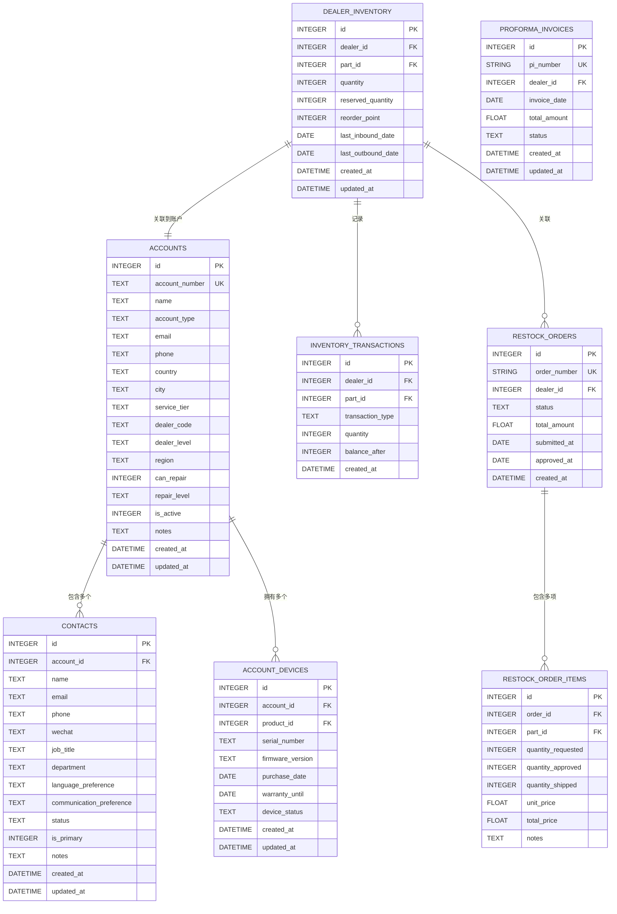

**图表来源**
- [012_account_contact_architecture.sql](file://server/service/migrations/012_account_contact_architecture.sql#L6-L43)
- [012_account_contact_architecture.sql](file://server/service/migrations/012_account_contact_architecture.sql#L45-L75)
- [012_account_contact_architecture.sql](file://server/service/migrations/012_account_contact_architecture.sql#L77-L94)
- [007_parts_inventory.sql](file://server/service/migrations/007_parts_inventory.sql#L85-L129)
- [007_parts_inventory.sql](file://server/service/migrations/007_parts_inventory.sql#L138-L159)
- [007_parts_inventory.sql](file://server/service/migrations/007_parts_inventory.sql#L167-L171)

**章节来源**
- [012_account_contact_architecture.sql](file://server/service/migrations/012_account_contact_architecture.sql#L1-L131)
- [013_migrate_to_account_contact.sql](file://server/service/migrations/013_migrate_to_account_contact.sql#L1-L284)
- [migrate_to_accounts.sql](file://server/migrations/migrate_to_accounts.sql#L1-L175)
- [Service_DataModel.md](file://docs/Service_DataModel.md#L517-L561)

## API接口详解

### 统一账户管理接口

**更新** 新的账户管理接口完全替代了原有的独立经销商管理接口。

#### 账户管理接口

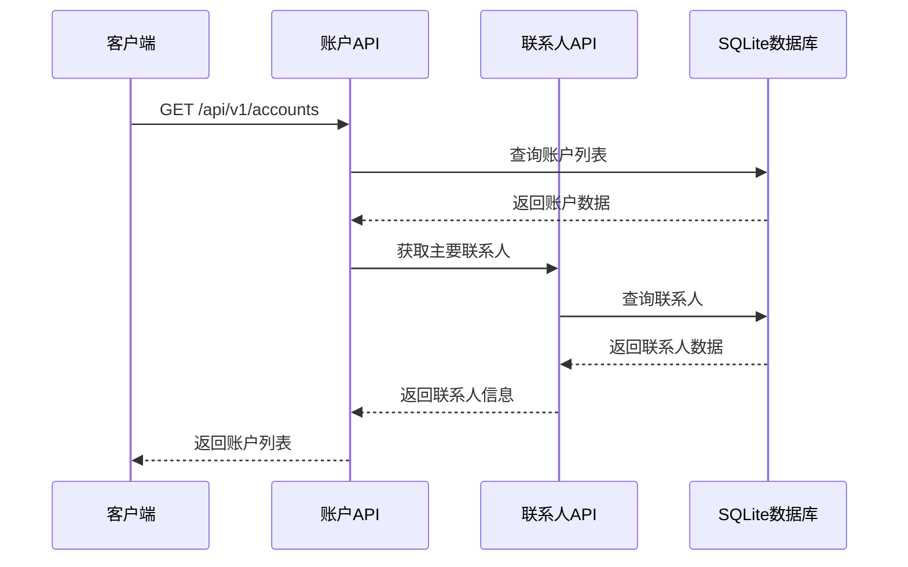

**图表来源**
- [accounts.js](file://server/service/routes/accounts.js#L50-L170)

#### 联系人管理接口

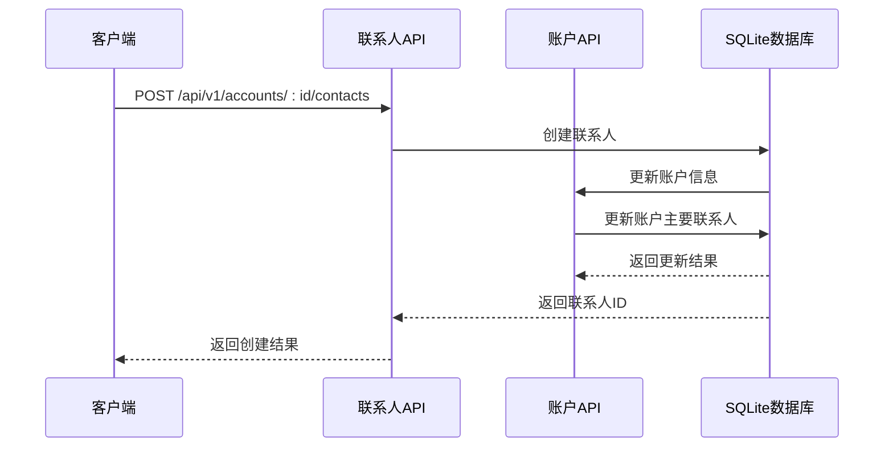

**图表来源**
- [contacts.js](file://server/service/routes/contacts.js#L104-L159)
- [accounts.js](file://server/service/routes/accounts.js#L509-L587)

### 库存查询接口

系统提供灵活的库存查询功能，支持多种过滤条件：

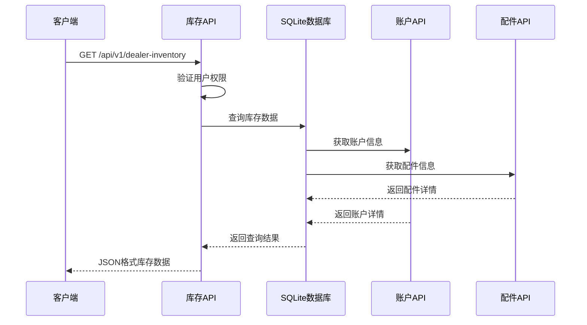

**图表来源**
- [dealer-inventory.js](file://server/service/routes/dealer-inventory.js#L16-L108)

### 低库存预警接口

**新增** 系统提供专门的低库存预警功能：

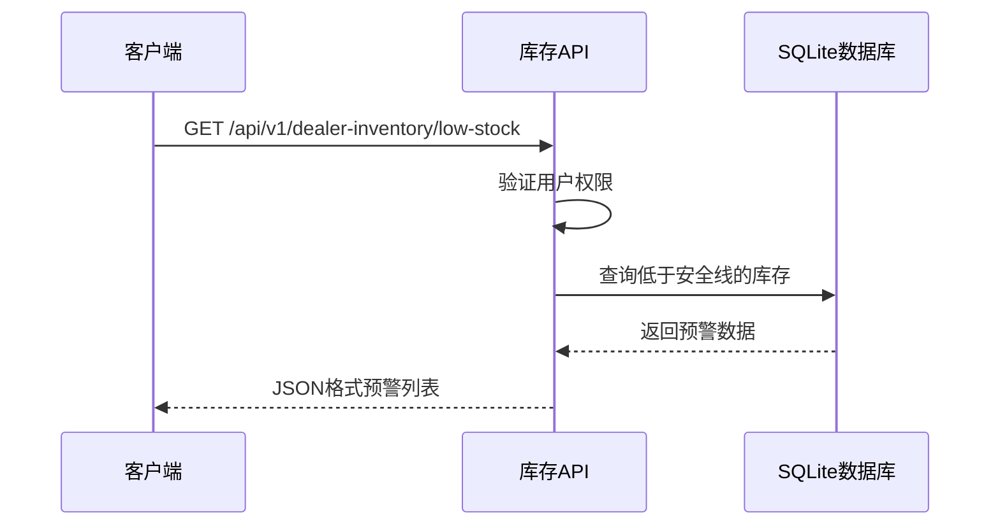

**图表来源**
- [dealer-inventory.js](file://server/service/routes/dealer-inventory.js#L287-L328)

### 补货订单管理

**新增** 系统提供完整的补货订单生命周期管理：

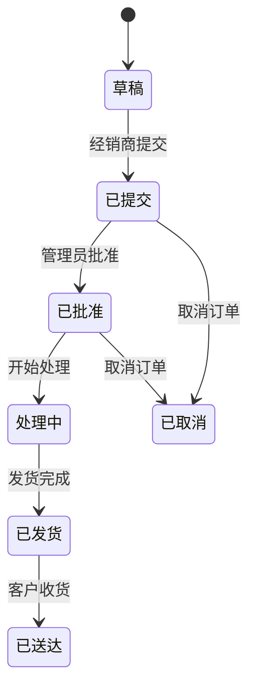

**图表来源**
- [007_parts_inventory.sql](file://server/service/migrations/007_parts_inventory.sql#L314-L348)

**章节来源**
- [dealer-inventory.js](file://server/service/routes/dealer-inventory.js#L338-L620)
- [accounts.js](file://server/service/routes/accounts.js#L1-L800)
- [contacts.js](file://server/service/routes/contacts.js#L1-L274)

## 前端集成

### React组件架构

**更新** 前端组件已完全重构以适配新的账户联系人架构。

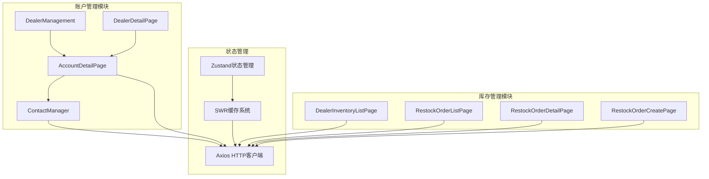

**图表来源**
- [AccountDetailPage.tsx](file://client/src/components/AccountDetailPage.tsx#L1-L472)
- [ContactManager.tsx](file://client/src/components/ContactManager.tsx#L1-L519)
- [DealerManagement.tsx](file://client/src/components/DealerManagement.tsx#L1-L742)
- [DealerDetailPage.tsx](file://client/src/components/DealerDetailPage.tsx#L1-L673)
- [index.ts](file://client/src/components/DealerInventory/index.ts#L1-L10)

### 数据缓存策略

系统使用SWR实现智能数据缓存：

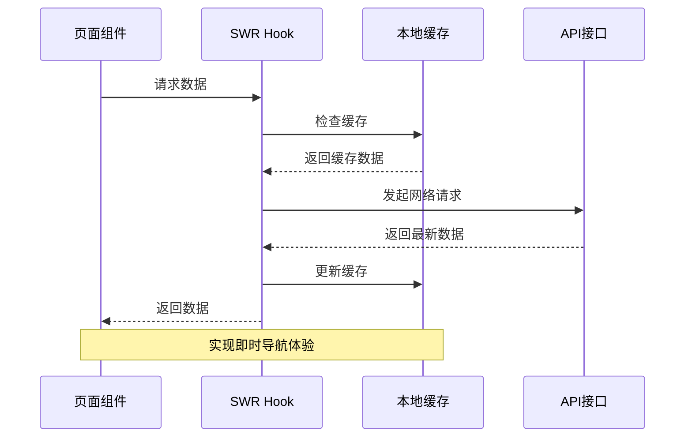

**图表来源**
- [useCachedTickets.ts](file://client/src/hooks/useCachedTickets.ts#L32-L95)

### 账户联系人管理

**新增** 新增了专门的账户联系人管理功能。

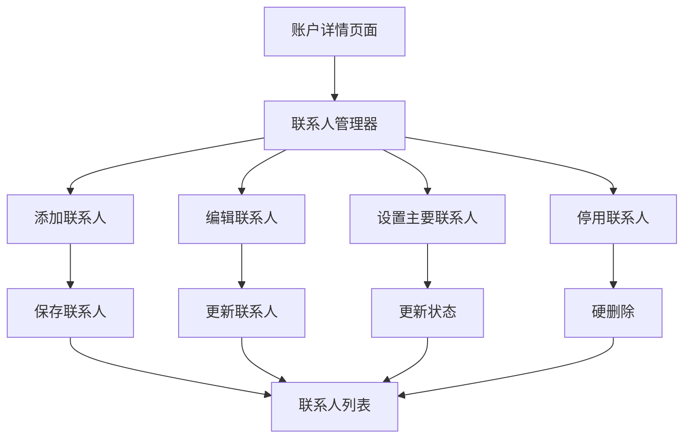

**图表来源**
- [ContactManager.tsx](file://client/src/components/ContactManager.tsx#L102-L166)
- [AccountDetailPage.tsx](file://client/src/components/AccountDetailPage.tsx#L367-L374)

### 经销商分类系统前端实现

**新增** DealerDetailPage 现在包含完整的经销商分类系统前端实现。

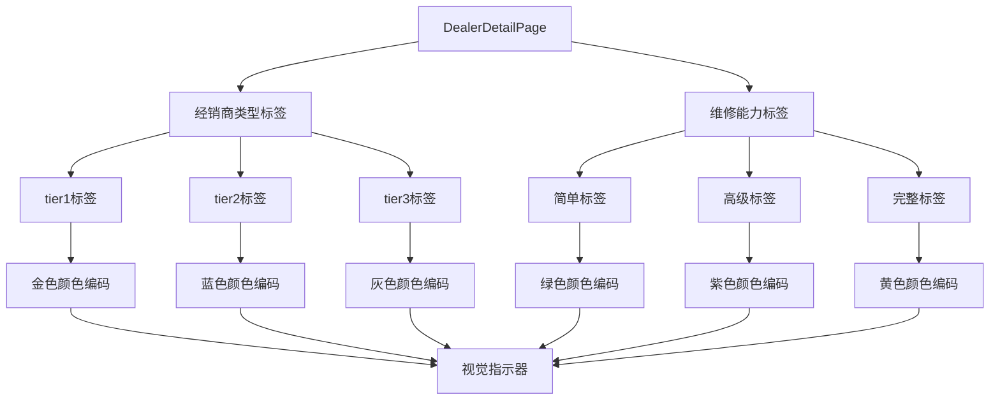

**图表来源**
- [DealerDetailPage.tsx](file://client/src/components/DealerDetailPage.tsx#L126-L169)
- [DealerDetailPage.tsx](file://client/src/components/DealerDetailPage.tsx#L292-L326)

### 新增组件前端实现

**新增** 四个核心组件的前端实现细节：

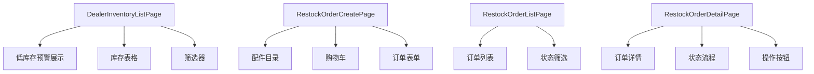

**图表来源**
- [DealerInventoryListPage.tsx](file://client/src/components/DealerInventory/DealerInventoryListPage.tsx#L46-L97)
- [RestockOrderCreatePage.tsx](file://client/src/components/DealerInventory/RestockOrderCreatePage.tsx#L41-L79)
- [RestockOrderListPage.tsx](file://client/src/components/DealerInventory/RestockOrderListPage.tsx#L38-L72)
- [RestockOrderDetailPage.tsx](file://client/src/components/DealerInventory/RestockOrderDetailPage.tsx#L62-L92)

**章节来源**
- [useCachedTickets.ts](file://client/src/hooks/useCachedTickets.ts#L1-L136)
- [useTicketStore.ts](file://client/src/store/useTicketStore.ts#L1-L68)
- [AccountDetailPage.tsx](file://client/src/components/AccountDetailPage.tsx#L1-L472)
- [ContactManager.tsx](file://client/src/components/ContactManager.tsx#L1-L519)
- [DealerManagement.tsx](file://client/src/components/DealerManagement.tsx#L1-L742)
- [DealerDetailPage.tsx](file://client/src/components/DealerDetailPage.tsx#L1-L673)
- [DealerInventoryListPage.tsx](file://client/src/components/DealerInventory/DealerInventoryListPage.tsx#L1-L437)
- [RestockOrderCreatePage.tsx](file://client/src/components/DealerInventory/RestockOrderCreatePage.tsx#L1-L515)
- [RestockOrderListPage.tsx](file://client/src/components/DealerInventory/RestockOrderListPage.tsx#L1-L294)
- [RestockOrderDetailPage.tsx](file://client/src/components/DealerInventory/RestockOrderDetailPage.tsx#L1-L442)

## 业务流程

### 统一账户联系人架构流程

**更新** 新的架构支持更复杂的业务流程。

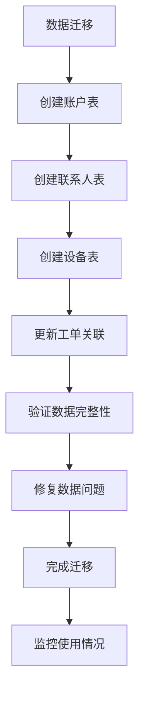

### 经销商分类系统流程

**新增** 经销商分类系统包含完整的数据处理流程。

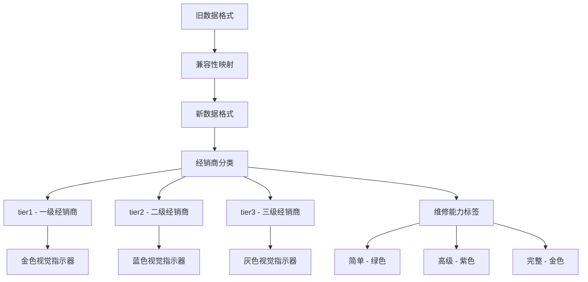

**图表来源**
- [DealerDetailPage.tsx](file://client/src/components/DealerDetailPage.tsx#L126-L169)
- [migrate_dealers.js](file://scripts/migrate_dealers.js#L46-L53)
- [migrate_dealers_v2.js](file://scripts/migrate_dealers_v2.js#L52-L56)

### 库存预警机制

**新增** 系统实现了智能的库存预警功能：

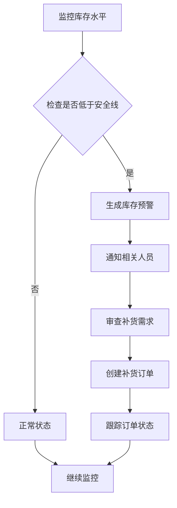

### 补货申请流程

**新增** 完整的补货订单管理流程：

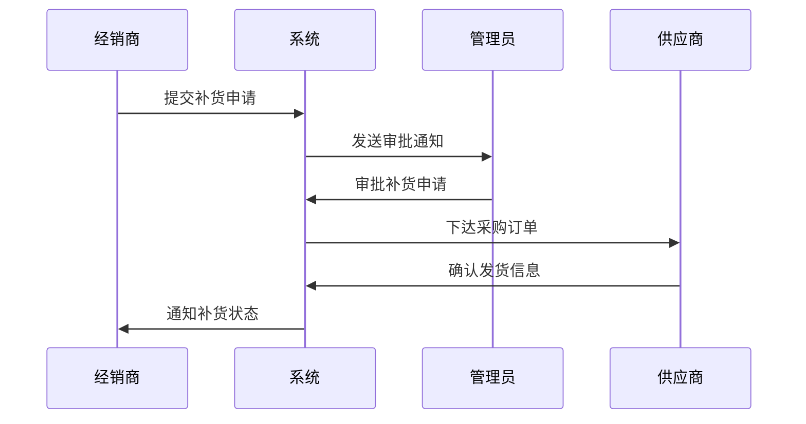

**章节来源**
- [dealer-inventory.js](file://server/service/routes/dealer-inventory.js#L288-L328)
- [013_migrate_to_account_contact.sql](file://server/service/migrations/013_migrate_to_account_contact.sql#L254-L284)
- [fix_dealer_contacts.js](file://server/scripts/fix_dealer_contacts.js#L1-L133)

## 性能考虑

### 数据库优化

**更新** 新的数据库架构包含了更完善的优化策略。

1. **索引优化**：为常用查询字段建立索引，提高查询性能
2. **分页查询**：默认每页50条记录，支持大数据量场景
3. **连接池管理**：合理配置数据库连接，避免连接泄漏
4. **查询优化**：使用参数化查询，防止SQL注入攻击
5. **账户联系人关联优化**：为账户和联系人关系建立专用索引
6. **经销商分类优化**：为 dealer_level 和 repair_level 字段建立索引
7. **补货订单优化**：为订单状态和日期字段建立索引

### 缓存策略

前端采用多层缓存机制：

1. **SWR缓存**：智能缓存策略，支持后台刷新
2. **本地存储**：使用Zustand进行状态持久化
3. **预加载机制**：提前加载可能访问的数据
4. **账户详情缓存**：缓存账户和联系人关联数据
5. **经销商分类缓存**：缓存经销商类型和维修能力标签映射
6. **库存数据缓存**：缓存配件目录和库存查询结果

## 故障排除指南

### 常见问题及解决方案

**更新** 新架构引入了一些新的问题和解决方案。

| 问题类型 | 症状 | 解决方案 |
|----------|------|----------|
| 权限错误 | 403 Forbidden | 检查用户角色和权限设置 |
| 库存不足 | 400 Insufficient Stock | 检查库存数量和预留数量 |
| 数据库连接 | 连接超时 | 检查数据库配置和网络连接 |
| API调用失败 | 500 Internal Server Error | 查看服务器日志和错误信息 |
| 账户迁移失败 | 数据不一致 | 运行数据修复脚本 |
| 联系人重复 | UNIQUE约束冲突 | 检查联系人邮箱唯一性 |
| 工单关联错误 | account_id/ contact_id为空 | 检查数据迁移完整性 |
| 经销商分类错误 | tier1/tier2/tier3标签显示异常 | 检查兼容性映射配置 |
| 维修能力标签错误 | 颜色编码不正确 | 检查维修能力映射表 |
| 低库存预警失效 | 预警不准确 | 检查reorder_point设置 |
| 补货订单状态异常 | 状态无法更新 | 检查权限和状态流转规则 |

### 调试工具

系统提供了完善的调试和监控功能：

1. **日志记录**：详细的错误日志和操作日志
2. **性能监控**：数据库查询时间和API响应时间监控
3. **错误报告**：自动化的错误收集和报告机制
4. **数据验证**：迁移后的数据完整性检查工具
5. **兼容性检查**：新旧数据格式兼容性验证工具
6. **组件调试**：React DevTools用于组件状态调试

**章节来源**
- [dealer-inventory.js](file://server/service/routes/dealer-inventory.js#L101-L107)
- [dealer-inventory.js](file://server/service/routes/dealer-inventory.js#L279-L284)
- [fix_dealer_contacts.js](file://server/scripts/fix_dealer_contacts.js#L1-L133)

## 总结

**更新** 经销商库存管理系统经过重大架构升级，现在是一个功能完整、架构清晰的统一账户联系人管理解决方案。

系统具有以下特点：

1. **统一架构**：采用统一的账户联系人架构，替代了原有的独立管理方式
2. **模块化设计**：采用模块化架构，便于维护和扩展
3. **权限控制**：完善的多角色权限管理体系
4. **数据安全**：采用参数化查询和权限验证，确保数据安全
5. **性能优化**：数据库索引优化和智能缓存策略
6. **用户体验**：现代化的React前端界面，提供良好的用户体验
7. **迁移兼容**：完整的数据迁移和修复工具，确保平滑过渡
8. **经销商分类**：新增全面的经销商分类系统，支持tier1、tier2、tier3等级
9. **视觉指示器**：提供颜色编码的维修能力标签和视觉指示器
10. **兼容性映射**：支持新旧数据格式转换

**新增功能**：
- 统一账户联系人架构
- 账户类型管理（DEALER/ORGANIZATION/INDIVIDUAL）
- 联系人关系管理
- 经销商管理功能整合
- 数据迁移和修复工具
- 增强的权限控制机制
- **经销商分类系统**：支持tier1、tier2、tier3等级
- **维修能力标签**：颜色编码的简单、高级、完整标签
- **兼容性映射**：支持新旧数据格式转换
- **低库存预警功能**：实时监控和预警展示
- **补货订单管理**：完整的订单生命周期管理
- **库存查询筛选**：多维度库存查询和筛选功能
- **组件化架构**：四个核心组件的完整实现

系统现已完全适配新的账户联系人架构，为用户提供更加统一和高效的管理体验。

### 数据迁移和修复工具

**新增** 系统包含完整的数据迁移和修复工具链：

1. **初始迁移脚本**：`migrate_to_accounts.sql` - 将现有经销商和客户数据迁移到新的账户架构
2. **架构迁移脚本**：`012_account_contact_architecture.sql` - 创建新的账户、联系人和设备表结构
3. **数据迁移脚本**：`013_migrate_to_account_contact.sql` - 将现有数据迁移到新的架构
4. **数据修复脚本**：`fix_dealer_contacts.js` - 修复特定经销商的联系人数据问题
5. **兼容性迁移脚本**：`migrate_dealers.js` 和 `migrate_dealers_v2.js` - 支持新旧数据格式转换

这些工具确保了从旧系统到新系统的平滑过渡，保证了数据的完整性和一致性。

**章节来源**
- [migrate_to_accounts.sql](file://server/migrations/migrate_to_accounts.sql#L1-L175)
- [012_account_contact_architecture.sql](file://server/service/migrations/012_account_contact_architecture.sql#L1-L131)
- [013_migrate_to_account_contact.sql](file://server/service/migrations/013_migrate_to_account_contact.sql#L1-L284)
- [fix_dealer_contacts.js](file://server/scripts/fix_dealer_contacts.js#L1-L133)
- [migrate_dealers.js](file://scripts/migrate_dealers.js#L1-L88)
- [migrate_dealers_v2.js](file://scripts/migrate_dealers_v2.js#L1-L235)