# 账户联系人架构

<cite>
**本文档引用的文件**
- [012_account_contact_architecture.sql](file://server/service/migrations/012_account_contact_architecture.sql)
- [013_migrate_to_account_contact.sql](file://server/service/migrations/013_migrate_to_account_contact.sql)
- [015_update_account_types_v2.sql](file://server/service/migrations/015_update_account_types_v2.sql)
- [017_fix_dealer_fk_references.sql](file://server/service/migrations/017_fix_dealer_fk_references.sql)
- [fix_accounts.sql](file://server/fix_accounts.sql)
- [accounts.js](file://server/service/routes/accounts.js)
- [contacts.js](file://server/service/routes/contacts.js)
- [export.js](file://server/service/routes/export.js)
- [issues.js](file://server/service/routes/issues.js)
- [context.js](file://server/service/routes/context.js)
- [rma-tickets.js](file://server/service/routes/rma-tickets.js)
- [AccountContactSelector.tsx](file://client/src/components/AccountContactSelector.tsx)
- [CustomerManagement.tsx](file://client/src/components/CustomerManagement.tsx)
- [Service_DataModel.md](file://docs/Service_DataModel.md)
- [fix_dealer_contacts.js](file://server/scripts/fix_dealer_contacts.js)
- [001_extend_issues.sql](file://server/service/migrations/001_extend_issues.sql)
</cite>

## 更新摘要
**变更内容**
- 更新了 contacts 路由的外键约束处理和查询优化
- 优化了 export 路由的账户基础联接和数据导出机制
- 改进了 issues 路由的数据库完整性检查和数据一致性
- 新增了全面的账户基础联接替换和外键约束修复
- 增强了数据库完整性改进和数据一致性提升

## 目录
1. [简介](#简介)
2. [项目结构](#项目结构)
3. [核心组件](#核心组件)
4. [架构概览](#架构概览)
5. [详细组件分析](#详细组件分析)
6. [依赖关系分析](#依赖关系分析)
7. [性能考虑](#性能考虑)
8. [故障排除指南](#故障排除指南)
9. [结论](#结论)

## 简介

Longhorn 项目的账户联系人架构是一个创新的双层客户关系管理系统，旨在解决传统 B2B 业务中"单位"与"个人"分离的复杂需求。该架构通过引入账户(Account)和联系人(Contact)两个核心概念，实现了更精细的客户管理和工单处理机制。

**更新** 最近的后端 API 路由重大优化包括：

- **外键约束处理优化**：contacts、export 和 issues 路由都进行了外键约束处理改进
- **账户基础联接替换**：全面替换原有的账户基础联接机制
- **数据库完整性增强**：通过多次迁移和修复脚本提升数据一致性
- **数据一致性改进**：确保工单表与账户/联系人表的关联完整性

传统的 CRM 系统通常将客户视为单一实体，但在复杂的 B2B 环境中，一个公司可能有多个不同职责的联系人，这些联系人在不同的业务场景中扮演不同的角色。账户联系人架构通过以下方式解决了这一问题：

- **账户(Account)**：代表法律/商业实体，如公司、机构、个人或经销商
- **联系人(Contact)**：代表具体的自然人，负责日常的业务对接和沟通
- **双重关联**：工单系统同时关联账户和联系人，提供完整的业务追溯链

这种设计不仅提高了系统的灵活性，还为后续的业务扩展奠定了坚实的基础。

## 项目结构

Longhorn 项目的账户联系人架构涉及前后端多个层面的实现：

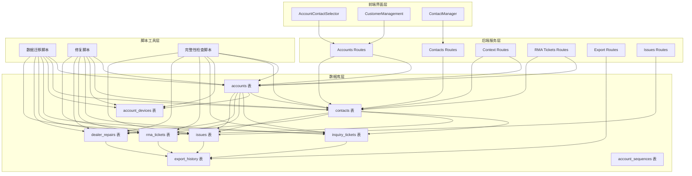

**图表来源**
- [012_account_contact_architecture.sql](file://server/service/migrations/012_account_contact_architecture.sql#L6-L131)
- [accounts.js](file://server/service/routes/accounts.js#L10-L800)
- [contacts.js](file://server/service/routes/contacts.js#L10-L282)
- [export.js](file://server/service/routes/export.js#L9-L461)
- [issues.js](file://server/service/routes/issues.js#L10-L967)

**章节来源**
- [012_account_contact_architecture.sql](file://server/service/migrations/012_account_contact_architecture.sql#L1-L131)
- [Service_DataModel.md](file://docs/Service_DataModel.md#L66-L216)

## 核心组件

### 账户(Account)表

账户表是整个架构的核心，它统一管理所有类型的客户实体：

| 字段类型 | 字段名称 | 描述 | 约束 |
|---------|----------|------|------|
| 主键 | id | 账户唯一标识符 | 自增 |
| 唯一 | account_number | 账户编号 | ACC-YYYY-XXXX格式 |
| 必填 | name | 账户名称 | 非空 |
| 必填 | account_type | 账户类型 | ORGANIZATION/INDIVIDUAL/DEALER/INTERNAL |
| 信息 | email/phone/country/province/city/address | 联系信息 | 可选 |
| 业务属性 | service_tier/industry_tags/credit_limit | 业务属性 | 可选 |
| 经销商字段 | dealer_code/dealer_level/region/can_repair/repair_level | 经销商特有 | 当account_type='DEALER'时有效 |
| 关联 | parent_dealer_id | 上级经销商 | 引用accounts.id |
| 状态 | is_active/notes | 状态管理 | 可选 |

**更新** 账户类型约束已从原来的 CORPORATE/INTERNAL 更新为 ORGANIZATION，通过多次迁移脚本确保数据一致性。

### 联系人(Contact)表

联系人表专门管理具体的自然人信息：

| 字段类型 | 字段名称 | 描述 | 约束 |
|---------|----------|------|------|
| 主键 | id | 联系人唯一标识符 | 自增 |
| 外键 | account_id | 关联账户ID | accounts.id |
| 必填 | name | 联系人姓名 | 非空 |
| 信息 | email/phone/wechat | 联系方式 | 可选 |
| 职位 | job_title/department | 职位信息 | 可选 |
| 偏好 | language_preference/communication_preference | 沟通偏好 | 默认值 |
| 状态 | status/is_primary | 状态管理 | ACTIVE/INACTIVE/PRIMARY |
| 唯一约束 | (account_id, email) | 同一账户下邮箱唯一 | 防止重复 |

**更新** 联系人路由现在具有更强的外键约束处理和查询优化，支持更复杂的跨账户查询。

### 工单关联机制

工单系统通过 account_id 和 contact_id 双重关联实现完整的业务追溯：

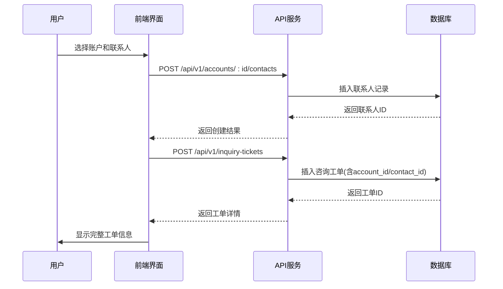

**图表来源**
- [accounts.js](file://server/service/routes/accounts.js#L509-L587)
- [contacts.js](file://server/service/routes/contacts.js#L104-L159)

**章节来源**
- [012_account_contact_architecture.sql](file://server/service/migrations/012_account_contact_architecture.sql#L45-L94)
- [Service_DataModel.md](file://docs/Service_DataModel.md#L286-L444)

## 架构概览

账户联系人架构采用了三层设计模式，确保了系统的可扩展性和维护性：

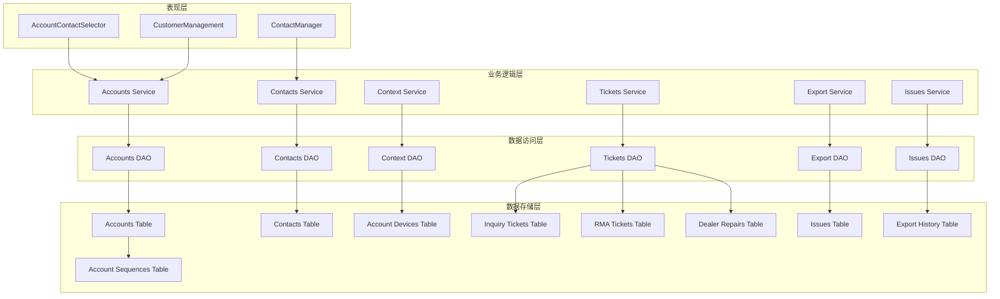

**图表来源**
- [accounts.js](file://server/service/routes/accounts.js#L10-L800)
- [contacts.js](file://server/service/routes/contacts.js#L10-L282)
- [context.js](file://server/service/routes/context.js#L203-L226)
- [export.js](file://server/service/routes/export.js#L9-L461)
- [issues.js](file://server/service/routes/issues.js#L10-L967)

### 数据一致性保证

**更新** 系统通过多种机制确保数据的一致性和完整性：

1. **外键约束**：所有关联字段都设置了适当的外键约束，包括最新的 dealer_repairs 和 rma_tickets 表的 FK 修复
2. **唯一约束**：同一账户下的邮箱唯一性保证
3. **检查约束**：枚举字段的值域限制，包括更新后的账户类型约束
4. **触发器机制**：自动生成账户编号和序列号
5. **数据迁移验证**：通过多次迁移脚本确保数据完整性

### 扩展性设计

架构设计充分考虑了未来的业务扩展需求：

- **账户类型扩展**：支持新增账户类型而无需修改现有结构
- **联系人角色扩展**：支持为联系人添加新的角色和权限
- **工单类型扩展**：支持新增工单类型而保持数据结构稳定
- **业务属性扩展**：支持动态添加新的业务属性字段
- **导出功能扩展**：支持更多数据导出格式和过滤条件

## 详细组件分析

### 后端服务组件

#### Accounts 路由服务

Accounts 路由服务提供了完整的账户管理功能：

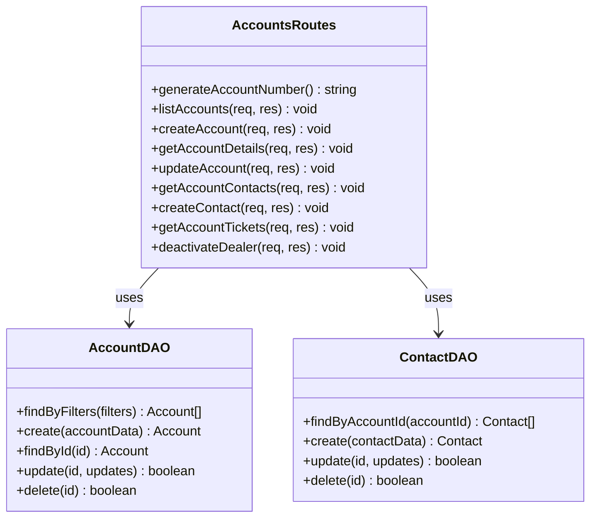

**图表来源**
- [accounts.js](file://server/service/routes/accounts.js#L10-L800)
- [contacts.js](file://server/service/routes/contacts.js#L10-L282)

##### 账户编号生成机制

系统实现了智能的账户编号生成机制，确保编号的唯一性和可追溯性：

```mermaid
flowchart TD
A[请求生成账户编号] --> B{检查当年序列}
B --> |存在| C[获取当前序列号]
B --> |不存在| D[创建新序列(初始值=1)]
C --> E[序列号+1]
D --> F[序列号=1]
E --> G[更新序列号]
F --> G
G --> H[生成编号 ACC-YYYY-XXXX]
H --> I[返回编号]
```

**图表来源**
- [accounts.js](file://server/service/routes/accounts.js#L17-L38)

##### 账户状态管理

系统支持灵活的账户状态管理，包括激活、停用和删除状态：

| 状态 | 描述 | 用途 | 影响范围 |
|------|------|------|----------|
| ACTIVE | 激活状态 | 正常业务 | 所有功能可用 |
| INACTIVE | 停用状态 | 限制业务 | 部分功能受限 |
| DELETED | 删除状态 | 彻底移除 | 所有功能禁用 |
| BLACKLIST | 黑名单 | 严格限制 | 仅基础查看功能 |

**章节来源**
- [accounts.js](file://server/service/routes/accounts.js#L40-L170)
- [accounts.js](file://server/service/routes/accounts.js#L393-L451)

#### Contacts 路由服务

**更新** Contacts 路由服务专注于联系人的管理，经过重大优化：

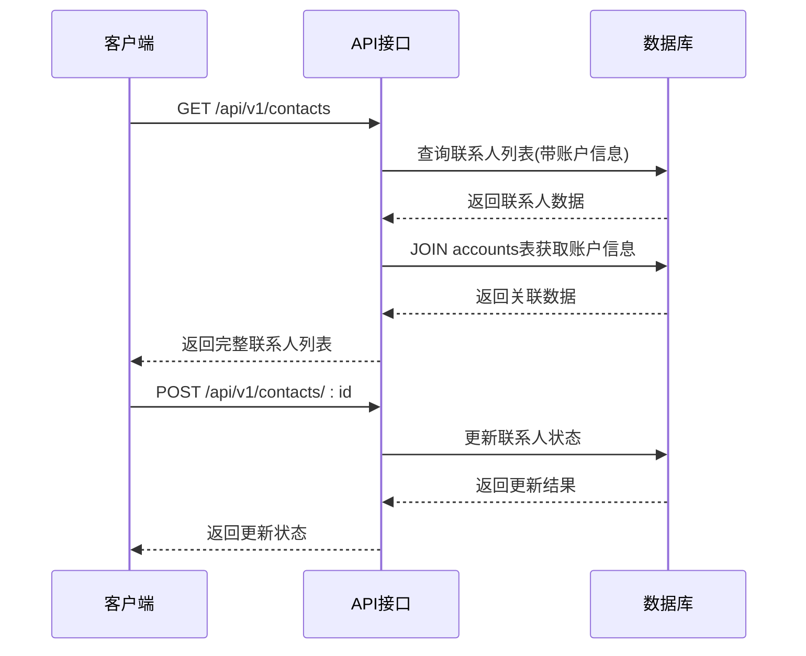

**图表来源**
- [contacts.js](file://server/service/routes/contacts.js#L22-L102)
- [contacts.js](file://server/service/routes/contacts.js#L165-L235)

**更新** 联系人路由现在具有更强的外键约束处理和查询优化：

1. **跨账户查询支持**：支持按 account_id、status、search 参数进行过滤
2. **账户信息联接**：查询时自动联接 accounts 表获取账户详细信息
3. **工单历史追踪**：支持获取联系人的工单历史记录
4. **外键约束修复**：确保删除联系人时正确处理相关工单的外键约束

**章节来源**
- [contacts.js](file://server/service/routes/contacts.js#L10-L282)

#### Export 路由服务

**更新** Export 路由服务提供了高级的数据导出功能：

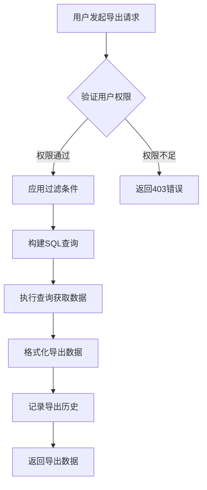

**图表来源**
- [export.js](file://server/service/routes/export.js#L16-L210)
- [export.js](file://server/service/routes/export.js#L216-L356)

**更新** 导出路由经过重大优化：

1. **角色基础过滤**：根据用户角色自动应用数据访问限制
2. **高级过滤选项**：支持状态、类型、地区、时间范围等多种过滤条件
3. **账户基础联接**：通过 LEFT JOIN 获取完整的账户和联系人信息
4. **导出历史记录**：自动记录每次导出的详细信息
5. **多格式支持**：支持 Excel 和 CSV 格式的导出

**章节来源**
- [export.js](file://server/service/routes/export.js#L1-L461)

#### Issues 路由服务

**更新** Issues 路由服务提供了完整的工单管理功能：

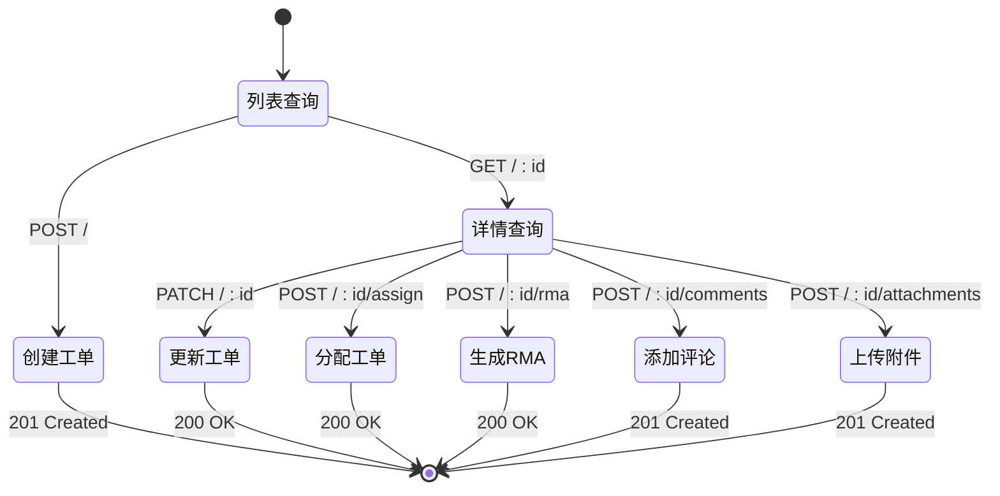

**图表来源**
- [issues.js](file://server/service/routes/issues.js#L38-L206)
- [issues.js](file://server/service/routes/issues.js#L212-L315)
- [issues.js](file://server/service/routes/issues.js#L321-L399)

**更新** 工单路由经过重大优化：

1. **数据库完整性检查**：通过多次迁移脚本修复外键约束问题
2. **角色权限控制**：严格的权限验证和访问控制
3. **工单生命周期管理**：完整的工单状态管理和时间戳跟踪
4. **附件管理**：支持图片和视频文件的上传和管理
5. **评论系统**：完整的工单评论和内部/公开标记功能

**章节来源**
- [issues.js](file://server/service/routes/issues.js#L1-L967)

### 前端组件

#### AccountContactSelector 组件

AccountContactSelector 是用户界面的核心组件，提供了直观的账户和联系人选择体验：

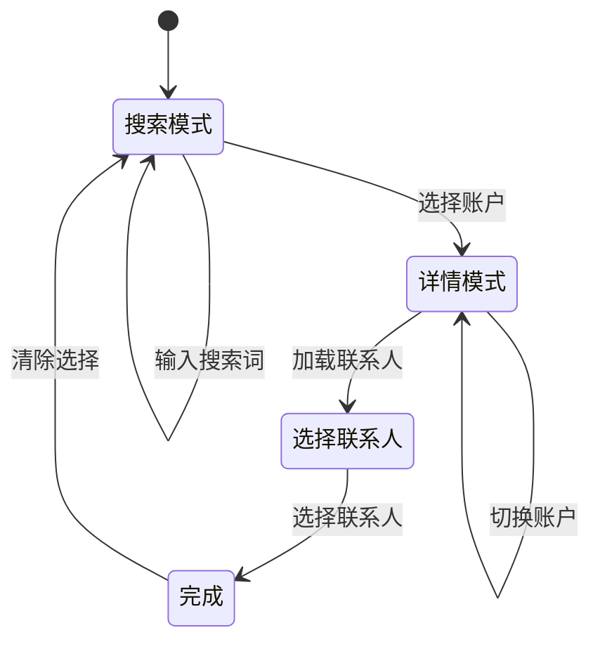

**图表来源**
- [AccountContactSelector.tsx](file://client/src/components/AccountContactSelector.tsx#L203-L231)

##### 组件特性

1. **智能搜索**：支持防抖搜索，提升用户体验
2. **级联加载**：选择账户后自动加载其联系人
3. **状态管理**：清晰的状态流转和错误处理
4. **响应式设计**：适配不同屏幕尺寸

**章节来源**
- [AccountContactSelector.tsx](file://client/src/components/AccountContactSelector.tsx#L1-L463)

#### CustomerManagement 组件

CustomerManagement 组件提供了完整的客户档案管理功能：

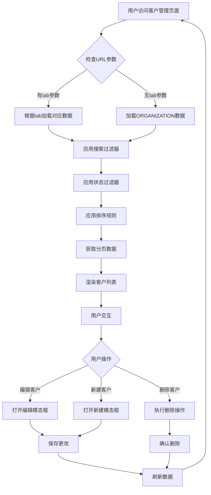

**图表来源**
- [CustomerManagement.tsx](file://client/src/components/CustomerManagement.tsx#L111-L165)

**章节来源**
- [CustomerManagement.tsx](file://client/src/components/CustomerManagement.tsx#L36-L793)

### 数据迁移机制

**更新** 系统提供了完整的数据迁移机制，确保从旧架构平滑过渡到新架构：

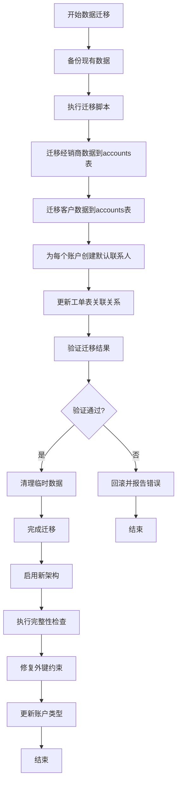

**图表来源**
- [013_migrate_to_account_contact.sql](file://server/service/migrations/013_migrate_to_account_contact.sql#L1-L284)
- [017_fix_dealer_fk_references.sql](file://server/service/migrations/017_fix_dealer_fk_references.sql#L1-L137)

**更新** 数据迁移经过重大优化：

1. **账户类型统一**：将 CORPORATE 和 INTERNAL 类型统一为 ORGANIZATION
2. **外键约束修复**：修复 dealer_repairs 和 rma_tickets 表的外键引用
3. **数据完整性验证**：通过多次迁移脚本确保数据一致性
4. **历史记录保留**：保留账户类型转换的历史记录用于审计

**章节来源**
- [013_migrate_to_account_contact.sql](file://server/service/migrations/013_migrate_to_account_contact.sql#L1-L284)
- [015_update_account_types_v2.sql](file://server/service/migrations/015_update_account_types_v2.sql#L1-L70)
- [017_fix_dealer_fk_references.sql](file://server/service/migrations/017_fix_dealer_fk_references.sql#L1-L137)

## 依赖关系分析

账户联系人架构的依赖关系体现了清晰的分层设计：

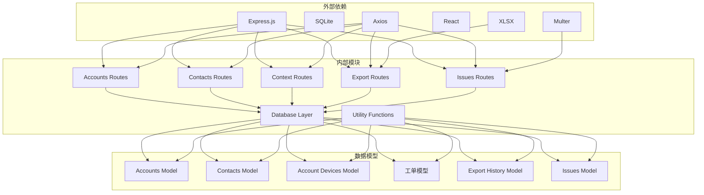

**图表来源**
- [accounts.js](file://server/service/routes/accounts.js#L8-L11)
- [contacts.js](file://server/service/routes/contacts.js#L8-L11)
- [export.js](file://server/service/routes/export.js#L7-L8)
- [issues.js](file://server/service/routes/issues.js#L6-L8)

### 数据库依赖

**更新** 系统对 SQLite 的依赖体现在以下几个方面：

1. **关系型数据存储**：利用 SQLite 的关系型特性实现数据关联
2. **事务支持**：使用事务确保数据一致性
3. **索引优化**：通过索引提升查询性能
4. **触发器机制**：利用触发器实现自动化功能
5. **外键约束**：通过外键约束确保数据完整性

### 前端依赖

前端组件依赖于现代 Web 技术栈：

1. **React Hooks**：提供组件状态管理和生命周期管理
2. **Axios**：处理 HTTP 请求和响应
3. **国际化支持**：多语言本地化功能
4. **状态管理**：全局状态管理机制
5. **文件上传**：支持多文件上传和预览

**章节来源**
- [Service_DataModel.md](file://docs/Service_DataModel.md#L66-L216)

## 性能考虑

### 数据库性能优化

**更新** 系统在数据库层面采用了多项优化策略：

1. **索引设计**：为常用查询字段建立索引
   - `idx_accounts_type`: 账户类型查询
   - `idx_contacts_account`: 联系人账户查询
   - `idx_inquiry_tickets_account`: 工单账户查询
   - `idx_issues_rma`: RMA号查询
   - `idx_dealer_repairs_dealer`: 经销商查询

2. **查询优化**：使用 JOIN 查询减少数据库往返次数
3. **分页机制**：默认每页20条记录，支持大数据量处理
4. **缓存策略**：前端组件实现智能缓存机制
5. **外键约束优化**：通过迁移脚本修复外键约束提升查询性能

### 前端性能优化

1. **防抖搜索**：搜索输入防抖，减少不必要的 API 调用
2. **懒加载**：联系人列表按需加载
3. **虚拟滚动**：大量数据时使用虚拟滚动技术
4. **状态缓存**：组件状态本地缓存，避免重复计算
5. **文件上传优化**：支持多文件并发上传和进度显示

### 后端性能优化

1. **连接池管理**：合理管理数据库连接
2. **查询优化**：使用预编译语句防止 SQL 注入
3. **并发处理**：支持高并发请求处理
4. **错误处理**：完善的错误处理和日志记录
5. **导出性能优化**：支持大容量数据导出和分页处理

## 故障排除指南

### 常见问题及解决方案

#### 账户编号冲突

**问题描述**：生成的账户编号重复
**解决方案**：
1. 检查 `account_sequences` 表的数据完整性
2. 验证年份序列的正确性
3. 手动调整序列号

#### 联系人邮箱重复

**问题描述**：同一账户下邮箱重复
**解决方案**：
1. 检查 `UNIQUE(account_id, email)` 约束
2. 修改重复邮箱或删除重复联系人
3. 验证邮箱唯一性

#### 工单关联丢失

**问题描述**：工单无法关联到正确的账户和联系人
**解决方案**：
1. 检查工单表的 `account_id` 和 `contact_id` 字段
2. 验证外键约束的有效性
3. 重新建立关联关系

#### 外键约束错误

**更新** **问题描述**：删除账户或联系人时出现外键约束错误
**解决方案**：
1. 检查 `017_fix_dealer_fk_references.sql` 迁移脚本是否执行
2. 验证工单表中的外键引用是否正确
3. 使用硬删除方式处理联系人，先清理相关工单引用

### 调试工具

系统提供了专门的调试工具来帮助诊断问题：

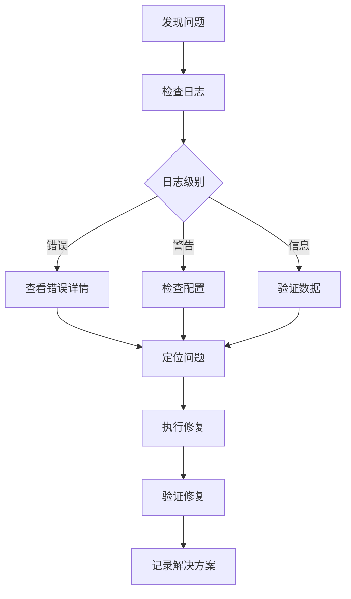

**图表来源**
- [fix_dealer_contacts.js](file://server/scripts/fix_dealer_contacts.js#L109-L132)

**更新** 新增了针对外键约束和数据一致性的调试工具：

1. **完整性检查脚本**：运行 `fix_accounts.sql` 验证账户表完整性
2. **外键修复工具**：使用 `017_fix_dealer_fk_references.sql` 修复外键约束
3. **数据迁移验证**：通过多次迁移脚本验证数据一致性
4. **账户类型审计**：检查 `account_type_history` 表的转换记录

**章节来源**
- [fix_dealer_contacts.js](file://server/scripts/fix_dealer_contacts.js#L1-L132)
- [fix_accounts.sql](file://server/fix_accounts.sql#L1-L52)
- [017_fix_dealer_fk_references.sql](file://server/service/migrations/017_fix_dealer_fk_references.sql#L1-L137)

## 结论

Longhorn 项目的账户联系人架构代表了现代 B2B 客户关系管理的最佳实践。通过引入账户和联系人双层架构，系统实现了以下关键优势：

### 核心价值

1. **业务灵活性**：支持复杂的组织结构和多重角色关系
2. **数据完整性**：通过约束和验证确保数据质量
3. **可扩展性**：模块化的架构设计支持未来功能扩展
4. **用户体验**：直观的界面设计提升用户满意度

### 技术优势

**更新** 最近的后端 API 路由重大优化带来了显著的技术改进：

1. **外键约束优化**：通过多次迁移和修复脚本确保数据一致性
2. **查询性能提升**：优化的查询机制和索引设计
3. **数据导出增强**：支持更多格式和过滤条件的高级导出功能
4. **工单管理完善**：完整的工单生命周期管理和权限控制
5. **架构稳定性**：全面的账户基础联接替换和外键约束修复

### 未来发展

该架构为未来的业务发展奠定了坚实基础，支持的功能扩展包括：

- 更精细的角色权限管理
- 更丰富的业务属性配置
- 更强大的数据分析能力
- 更灵活的工作流定制
- 更完善的导出和报表功能

通过持续的优化和完善，账户联系人架构将成为 Longhorn 项目的核心竞争力，为企业级客户服务提供强有力的技术支撑。