# 配件管理系统

<cite>
**本文档引用的文件**
- [PartsManagementPage.tsx](file://client/src/components/PartsManagement/PartsManagementPage.tsx)
- [PartsCatalogPage.tsx](file://client/src/components/PartsManagement/PartsCatalogPage.tsx)
- [PartsInventoryPage.tsx](file://client/src/components/PartsManagement/PartsInventoryPage.tsx)
- [PartsConsumptionPage.tsx](file://client/src/components/PartsManagement/PartsConsumptionPage.tsx)
- [PartsSettlementPage.tsx](file://client/src/components/PartsManagement/PartsSettlementPage.tsx)
- [PartsEditModal.tsx](file://client/src/components/PartsManagement/PartsEditModal.tsx)
- [PartsSelector.tsx](file://client/src/components/Workspace/PartsSelector.tsx)
- [TicketPartsPanel.tsx](file://client/src/components/PartsManagement/TicketPartsPanel.tsx)
- [RepairReportEditor.tsx](file://client/src/components/Workspace/RepairReportEditor.tsx)
- [parts-master.js](file://server/service/routes/parts-master.js)
- [parts-inventory.js](file://server/service/routes/parts-inventory.js)
- [parts-consumption.js](file://server/service/routes/parts-consumption.js)
- [parts-settlement.js](file://server/service/routes/parts-settlement.js)
- [parts.js](file://server/service/routes/parts.js)
- [compatibility.js](file://server/service/routes/compatibility.js)
- [tickets.js](file://server/service/routes/tickets.js)
- [032_add_ticket_product_model_id.sql](file://server/migrations/032_add_ticket_product_model_id.sql)
- [remove_parts_prices.js](file://server/migrations/remove_parts_prices.js)
- [add_material_id.js](file://server/migrations/add_material_id.js)
- [upgrade_parts_pricing.js](file://server/migrations/upgrade_parts_pricing.js)
- [031_parts_master.sql](file://server/service/migrations/031_parts_master.sql)
- [Service_Parts_SKU_Pricing.md](file://docs/Service_Parts_SKU_Pricing.md)
</cite>

## 更新摘要
**变更内容**
- 新增product_model_id参数支持，增强配件查询的精确度
- 扩展Tickets API，支持产品型号ID字段
- 更新BOM推荐系统，基于精确的产品型号关联
- 改进配件搜索算法，优先使用产品型号ID进行匹配
- 增强数据库查询性能，优化产品型号关联查询
- 移除旧的JSON兼容性字段处理逻辑，简化数据结构
- 新增子查询搜索机制，提升搜索性能和准确性
- 动态兼容性列表生成，优化响应格式

## 目录
1. [项目概述](#项目概述)
2. [系统架构](#系统架构)
3. [核心组件](#核心组件)
4. [数据库设计](#数据库设计)
5. [API 接口设计](#api-接口设计)
6. [用户界面设计](#用户界面设计)
7. [权限控制机制](#权限控制机制)
8. [业务流程分析](#业务流程分析)
9. [性能优化策略](#性能优化策略)
10. [故障排除指南](#故障排除指南)
11. [总结](#总结)

## 项目概述

配件管理系统是一个基于 React + Node.js 的企业级配件管理解决方案，主要服务于汽车维修行业，提供完整的配件生命周期管理功能。系统采用前后端分离架构，前端使用 TypeScript 和 React 构建现代化的用户界面，后端基于 Express.js 提供 RESTful API 服务。

该系统的核心功能包括：
- **配件目录管理**：维护配件主数据，包括 SKU、价格、规格等信息
- **库存管理**：跟踪总部和经销商的配件库存状态
- **消耗记录**：记录维修过程中的配件使用情况
- **结算管理**：管理经销商配件结算流程
- **智能推荐**：基于产品型号的BOM配件推荐功能
- **统一选择器**：提供一致的配件选择和管理体验
- **兼容性测试**：支持配件兼容性测试和知识库集成

**更新** 系统架构已升级为统一的SKU定价系统，移除了独立的parts_master定价结构，增强了材料标识和分类管理功能。新增的PartsSelector组件提供了统一的配件选择界面，支持智能推荐和手动添加功能。BOM推荐功能通过产品型号实现精准的配件推荐，大大提升了用户体验和工作效率。

**新增功能** 基于应用变更，系统现在支持product_model_id参数，显著改进了配件查询的精确度。当提供产品型号ID时，系统会优先使用精确的数据库关联查询来获取兼容配件，而不是依赖文本匹配。同时，Tickets API也增加了product_model_id字段支持，用于更准确地关联产品型号信息。

**更新** 新增了兼容性测试功能，支持配件与目标设备的兼容性验证，包括测试结果记录、知识库文章关联等功能。移除了旧的JSON兼容性字段处理逻辑，简化了数据结构，提升了系统的可维护性和性能。

## 系统架构

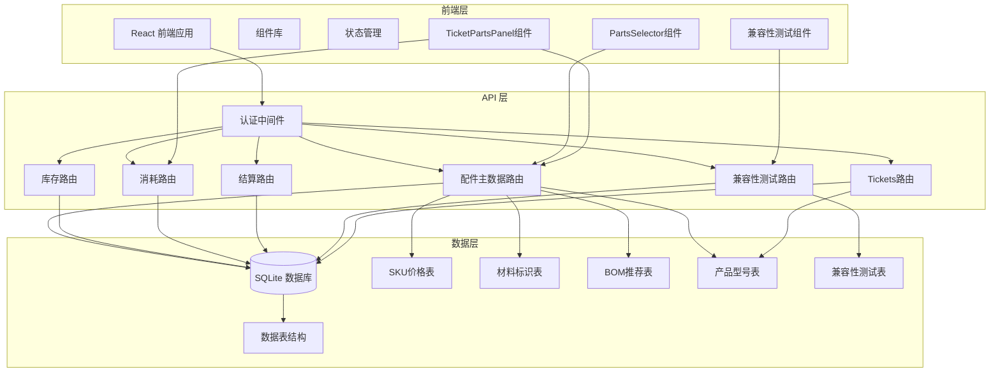

**图表来源**
- [PartsManagementPage.tsx:1-265](file://client/src/components/PartsManagement/PartsManagementPage.tsx#L1-L265)
- [PartsSelector.tsx:1-740](file://client/src/components/Workspace/PartsSelector.tsx#L1-L740)
- [TicketPartsPanel.tsx:1-507](file://client/src/components/PartsManagement/TicketPartsPanel.tsx#L1-L507)
- [compatibility.js:1-366](file://server/service/routes/compatibility.js#L1-L366)
- [parts-master.js:1-637](file://server/service/routes/parts-master.js#L1-L637)
- [tickets.js:1-3045](file://server/service/routes/tickets.js#L1-L3045)

## 核心组件

### 前端组件架构

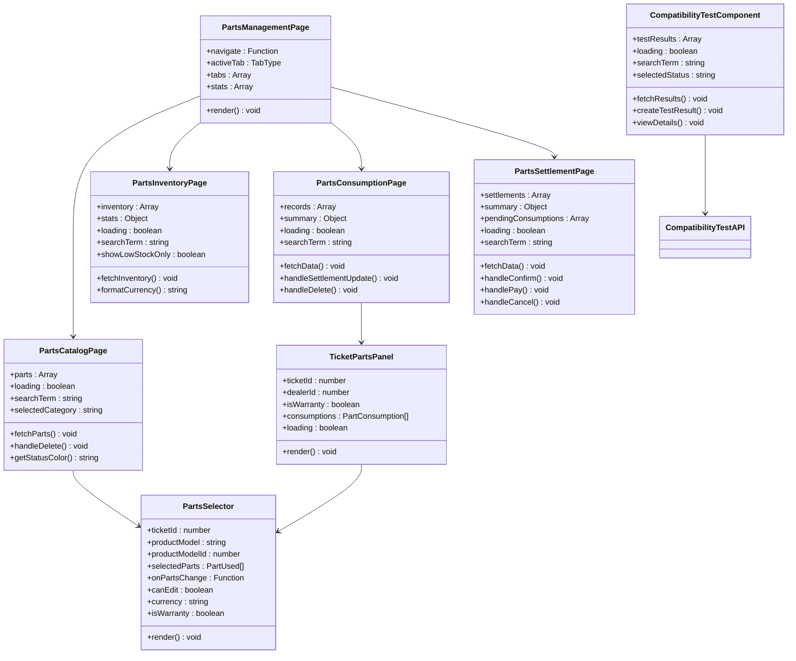

**图表来源**
- [PartsManagementPage.tsx:27-64](file://client/src/components/PartsManagement/PartsManagementPage.tsx#L27-L64)
- [PartsSelector.tsx:52-60](file://client/src/components/Workspace/PartsSelector.tsx#L52-L60)
- [TicketPartsPanel.tsx:65-49](file://client/src/components/PartsManagement/TicketPartsPanel.tsx#L65-L49)
- [compatibility.js:1-366](file://server/service/routes/compatibility.js#L1-L366)

### 后端服务架构

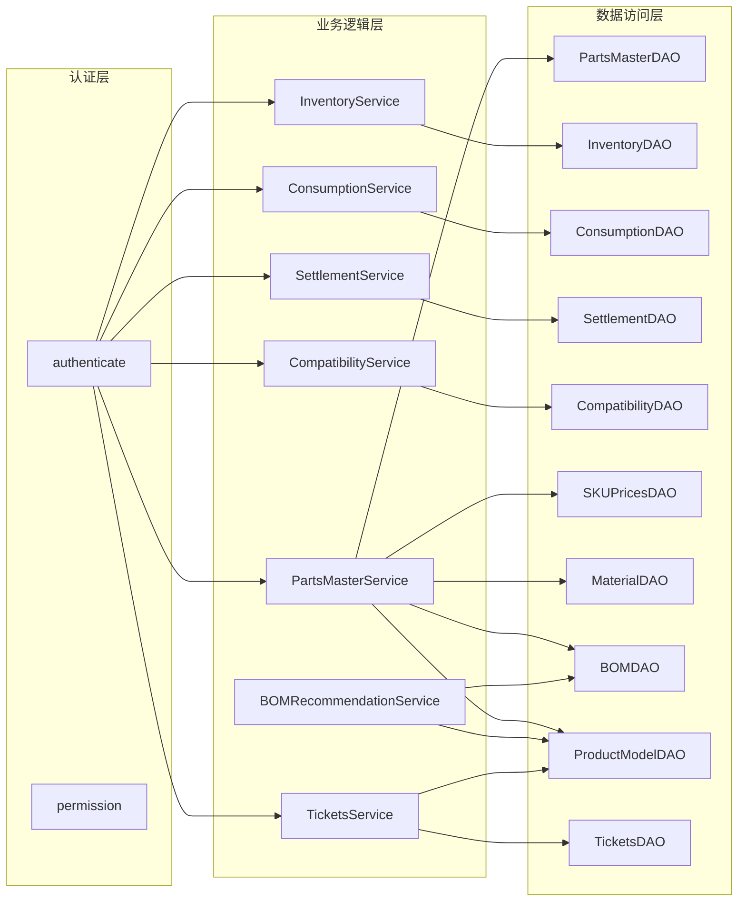

**图表来源**
- [parts-master.js:9-637](file://server/service/routes/parts-master.js#L9-L637)
- [parts-inventory.js:8-516](file://server/service/routes/parts-inventory.js#L8-L516)
- [parts-consumption.js:8-489](file://server/service/routes/parts-consumption.js#L8-L489)
- [parts-settlement.js:36-659](file://server/service/routes/parts-settlement.js#L36-L659)
- [compatibility.js:9-366](file://server/service/routes/compatibility.js#L9-L366)
- [tickets.js:1-3045](file://server/service/routes/tickets.js#L1-L3045)

**章节来源**
- [PartsManagementPage.tsx:1-265](file://client/src/components/PartsManagement/PartsManagementPage.tsx#L1-L265)
- [PartsCatalogPage.tsx:1-654](file://client/src/components/PartsManagement/PartsCatalogPage.tsx#L1-L654)
- [PartsInventoryPage.tsx:1-447](file://client/src/components/PartsManagement/PartsInventoryPage.tsx#L1-L447)
- [PartsConsumptionPage.tsx:1-626](file://client/src/components/PartsManagement/PartsConsumptionPage.tsx#L1-L626)
- [PartsSettlementPage.tsx:1-677](file://client/src/components/PartsManagement/PartsSettlementPage.tsx#L1-L677)
- [PartsSelector.tsx:1-740](file://client/src/components/Workspace/PartsSelector.tsx#L1-L740)
- [TicketPartsPanel.tsx:1-507](file://client/src/components/PartsManagement/TicketPartsPanel.tsx#L1-L507)

## 数据库设计

### 核心数据表结构

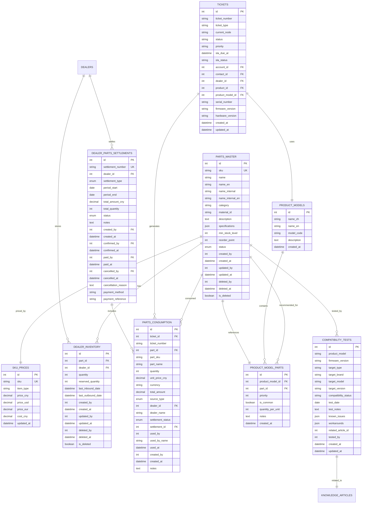

**图表来源**
- [parts-master.js:221-235](file://server/service/routes/parts-master.js#L221-L235)
- [parts-inventory.js:298-318](file://server/service/routes/parts-inventory.js#L298-L318)
- [parts-consumption.js:330-342](file://server/service/routes/parts-consumption.js#L330-L342)
- [parts-settlement.js:334-350](file://server/service/routes/parts-settlement.js#L334-L350)
- [compatibility.js:169-183](file://server/service/routes/compatibility.js#L169-L183)
- [032_add_ticket_product_model_id.sql:1-32](file://server/migrations/032_add_ticket_product_model_id.sql#L1-L32)

### 数据关系图

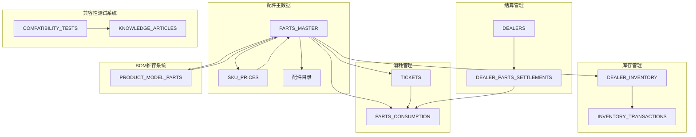

**图表来源**
- [parts-master.js:132-165](file://server/service/routes/parts-master.js#L132-L165)
- [parts-master.js:496-534](file://server/service/routes/parts-master.js#L496-L534)
- [compatibility.js:98-105](file://server/service/routes/compatibility.js#L98-L105)
- [parts-inventory.js:47-97](file://server/service/routes/parts-inventory.js#L47-L97)
- [parts-consumption.js:49-112](file://server/service/routes/parts-consumption.js#L49-L112)
- [parts-settlement.js:396-441](file://server/service/routes/parts-settlement.js#L396-L441)
- [032_add_ticket_product_model_id.sql:5-9](file://server/migrations/032_add_ticket_product_model_id.sql#L5-L9)

**章节来源**
- [parts-master.js:1-637](file://server/service/routes/parts-master.js#L1-L637)
- [parts-inventory.js:1-516](file://server/service/routes/parts-inventory.js#L1-L516)
- [parts-consumption.js:1-489](file://server/service/routes/parts-consumption.js#L1-L489)
- [parts-settlement.js:1-659](file://server/service/routes/parts-settlement.js#L1-L659)
- [compatibility.js:1-366](file://server/service/routes/compatibility.js#L1-L366)
- [tickets.js:1-3045](file://server/service/routes/tickets.js#L1-L3045)

## API 接口设计

### 配件主数据 API

| 接口 | 方法 | 路径 | 功能描述 |
|------|------|------|----------|
| 获取配件列表 | GET | `/api/v1/parts-master` | 分页获取配件列表，支持搜索、筛选，自动关联SKU价格，**新增product_model_id参数支持** |
| 获取配件详情 | GET | `/api/v1/parts-master/:id` | 获取单个配件详细信息，包含价格和材料信息 |
| 创建配件 | POST | `/api/v1/parts-master` | 创建新的配件记录，同时初始化SKU价格 |
| 更新配件 | PATCH | `/api/v1/parts-master/:id` | 更新现有配件信息，支持价格和材料字段 |
| 删除配件 | DELETE | `/api/v1/parts-master/:id` | 软删除配件记录 |
| 获取分类列表 | GET | `/api/v1/parts-master/categories/list` | 获取所有配件分类 |
| 获取BOM推荐配件 | GET | `/api/v1/parts-master/bom` | 根据产品型号获取BOM推荐配件，支持智能匹配 |

**更新** 配件列表接口现在支持product_model_id参数，当提供该参数时，系统会优先使用精确的产品型号ID关联查询来获取兼容配件，显著提高查询精度。

### 兼容性测试 API

**新增功能** 兼容性测试功能提供完整的配件兼容性验证和知识库集成。

| 接口 | 方法 | 路径 | 功能描述 |
|------|------|------|----------|
| 获取兼容性测试结果 | GET | `/api/v1/compatibility` | 分页获取兼容性测试结果列表 |
| 获取兼容性测试详情 | GET | `/api/v1/compatibility/:id` | 获取单个兼容性测试详细信息 |
| 创建兼容性测试结果 | POST | `/api/v1/compatibility` | 创建新的兼容性测试结果记录 |
| 更新兼容性测试结果 | PATCH | `/api/v1/compatibility/:id` | 更新现有兼容性测试结果 |
| 删除兼容性测试结果 | DELETE | `/api/v1/compatibility/:id` | 删除兼容性测试结果记录 |

### 库存管理 API

| 接口 | 方法 | 路径 | 功能描述 |
|------|------|------|----------|
| 获取库存列表 | GET | `/api/v1/parts-inventory` | 获取总部和经销商库存列表 |
| 库存汇总统计 | GET | `/api/v1/parts-inventory/summary` | 获取库存价值、预警等统计信息 |
| 低库存预警 | GET | `/api/v1/parts-inventory/low-stock` | 获取低库存预警列表 |
| 入库操作 | POST | `/api/v1/parts-inventory/inbound` | 执行配件入库操作 |
| 出库操作 | POST | `/api/v1/parts-inventory/outbound` | 执行配件出库操作 |
| 交易记录 | GET | `/api/v1/parts-inventory/transactions` | 获取库存交易历史记录 |

### 消耗记录 API

| 接口 | 方法 | 路径 | 功能描述 |
|------|------|------|----------|
| 获取消耗记录 | GET | `/api/v1/parts-consumption` | 获取配件消耗记录列表 |
| 消耗统计 | GET | `/api/v1/parts-consumption/summary` | 获取消耗统计信息 |
| 记录消耗 | POST | `/api/v1/parts-consumption` | 记录新的配件消耗 |
| 更新结算状态 | PATCH | `/api/v1/parts-consumption/:id/settlement` | 更新消耗记录结算状态 |
| 撤销消耗 | DELETE | `/api/v1/parts-consumption/:id` | 撤销已记录的消耗 |

### 结算管理 API

| 接口 | 方法 | 路径 | 功能描述 |
|------|------|------|----------|
| 获取结算单列表 | GET | `/api/v1/parts-settlements` | 获取经销商配件结算单列表 |
| 结算汇总统计 | GET | `/api/v1/parts-settlements/summary` | 获取结算统计信息 |
| 待结算消耗 | GET | `/api/v1/parts-settlements/pending-consumptions` | 获取待结算的消耗记录 |
| 创建结算单 | POST | `/api/v1/parts-settlements` | 创建新的结算单 |
| 获取结算详情 | GET | `/api/v1/parts-settlements/:id` | 获取结算单详细信息 |
| 确认结算单 | PATCH | `/api/v1/parts-settlements/:id/confirm` | 确认结算单 |
| 标记付款 | PATCH | `/api/v1/parts-settlements/:id/pay` | 标记结算单已付款 |
| 取消结算单 | PATCH | `/api/v1/parts-settlements/:id/cancel` | 取消结算单 |
| 删除结算单 | DELETE | `/api/v1/parts-settlements/:id` | 删除结算单 |

### 工单 API

**更新** 工单API现在支持product_model_id字段，用于更准确地关联产品型号信息。

| 接口 | 方法 | 路径 | 功能描述 |
|------|------|------|----------|
| 创建工单 | POST | `/api/v1/tickets` | 创建新的工单，**新增product_model_id字段支持** |
| 获取工单详情 | GET | `/api/v1/tickets/:id` | 获取工单详细信息，包含产品型号ID |
| 更新工单 | PATCH | `/api/v1/tickets/:id` | 更新工单信息 |
| 获取工单列表 | GET | `/api/v1/tickets` | 获取工单列表，支持多种筛选条件 |

**章节来源**
- [parts-master.js:28-117](file://server/service/routes/parts-master.js#L28-L117)
- [parts-master.js:490-637](file://server/service/routes/parts-master.js#L490-L637)
- [compatibility.js:16-200](file://server/service/routes/compatibility.js#L16-L200)
- [parts-inventory.js:28-124](file://server/service/routes/parts-inventory.js#L28-L124)
- [parts-consumption.js:28-131](file://server/service/routes/parts-consumption.js#L28-L131)
- [parts-settlement.js:43-135](file://server/service/routes/parts-settlement.js#L43-L135)
- [tickets.js:1484-1761](file://server/service/routes/tickets.js#L1484-L1761)

## 用户界面设计

### 主界面布局

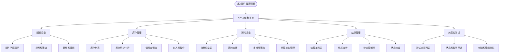

**图表来源**
- [PartsManagementPage.tsx:27-64](file://client/src/components/PartsManagement/PartsManagementPage.tsx#L27-L64)
- [PartsCatalogPage.tsx:106-178](file://client/src/components/PartsManagement/PartsCatalogPage.tsx#L106-L178)
- [PartsInventoryPage.tsx:107-305](file://client/src/components/PartsManagement/PartsInventoryPage.tsx#L107-L305)
- [PartsConsumptionPage.tsx:169-442](file://client/src/components/PartsManagement/PartsConsumptionPage.tsx#L169-L442)
- [PartsSettlementPage.tsx:215-453](file://client/src/components/PartsManagement/PartsSettlementPage.tsx#L215-L453)

### 数据展示组件

每个功能模块都包含以下标准组件：

1. **头部区域**：包含标题、描述和操作按钮
2. **统计卡片**：展示关键指标和趋势信息
3. **筛选器**：支持多种条件组合筛选
4. **数据表格**：展示详细数据列表
5. **操作面板**：提供 CRUD 操作功能

### 新增组件设计

#### PartsSelector 组件

PartsSelector 是一个功能强大的配件选择组件，提供以下特性：

- **智能搜索**：支持按SKU、名称、分类搜索配件，**新增product_model_id参数支持，优先使用精确查询**
- **BOM推荐**：根据产品型号智能推荐常用配件
- **手动添加**：支持添加非标准配件
- **批量操作**：支持数量增加、删除等操作
- **价格显示**：根据货币类型显示相应价格
- **来源管理**：支持多种配件来源类型

**更新** 当提供productModelId参数时，组件会优先使用product_model_id参数进行精确查询，如果查询无结果，则回退到普通搜索。

#### TicketPartsPanel 组件

TicketPartsPanel 专门用于工单的配件使用记录管理：

- **实时统计**：显示总数量和总金额
- **快速添加**：提供便捷的配件添加界面
- **来源区分**：支持总部库存、经销商库存、外部采购、保修免费等来源
- **状态管理**：跟踪配件使用的结算状态
- **权限控制**：根据用户角色控制操作权限

#### CompatibilityTestComponent 组件

**新增功能** 兼容性测试组件提供完整的测试结果管理和知识库集成：

- **测试结果列表**：展示所有兼容性测试结果，支持分页和筛选
- **测试详情查看**：显示详细的测试信息，包括已知问题和解决方案
- **测试结果创建**：支持创建新的兼容性测试记录
- **知识库关联**：可关联相关知识库文章
- **状态管理**：支持测试结果的状态流转和管理

**章节来源**
- [PartsManagementPage.tsx:73-256](file://client/src/components/PartsManagement/PartsManagementPage.tsx#L73-L256)
- [PartsCatalogPage.tsx:106-654](file://client/src/components/PartsManagement/PartsCatalogPage.tsx#L106-L654)
- [PartsInventoryPage.tsx:107-442](file://client/src/components/PartsManagement/PartsInventoryPage.tsx#L107-L442)
- [PartsConsumptionPage.tsx:169-622](file://client/src/components/PartsManagement/PartsConsumptionPage.tsx#L169-L622)
- [PartsSettlementPage.tsx:215-672](file://client/src/components/PartsManagement/PartsSettlementPage.tsx#L215-L672)
- [PartsSelector.tsx:1-740](file://client/src/components/Workspace/PartsSelector.tsx#L1-L740)
- [TicketPartsPanel.tsx:1-507](file://client/src/components/PartsManagement/TicketPartsPanel.tsx#L1-L507)

## 权限控制机制

### 角色权限矩阵

| 功能模块 | Admin | Lead | Exec | MS | GE | OP |
|----------|-------|------|------|----|----|----|
| 查看配件目录 | ✓ | ✓ | ✓ | ✓ | ✓ | ✓ |
| 管理配件目录 | ✓ | ✓ | ✓ | ✓ | ✗ | ✗ |
| 查看库存 | ✓ | ✓ | ✓ | ✓ | ✓ | ✓ |
| 管理库存 | ✓ | ✓ | ✓ | ✓ | ✗ | ✗ |
| 查看消耗记录 | ✓ | ✓ | ✓ | ✓ | ✓ | ✓ |
| 管理消耗记录 | ✓ | ✓ | ✓ | ✓ | ✗ | ✗ |
| 查看结算 | ✓ | ✓ | ✓ | ✓ | ✓ | ✓ |
| 管理结算 | ✓ | ✓ | ✓ | ✓ | ✗ | ✗ |
| 添加配件消耗 | ✓ | ✓ | ✓ | ✓ | ✓ | ✓ |
| 管理BOM推荐 | ✓ | ✓ | ✓ | ✓ | ✓ | ✗ |
| 查看兼容性测试 | ✓ | ✓ | ✓ | ✓ | ✓ | ✓ |
| 管理兼容性测试 | ✓ | ✓ | ✓ | ✓ | ✓ | ✓ |
| 创建兼容性测试 | ✓ | ✓ | ✓ | ✓ | ✓ | ✗ |

### 权限验证流程

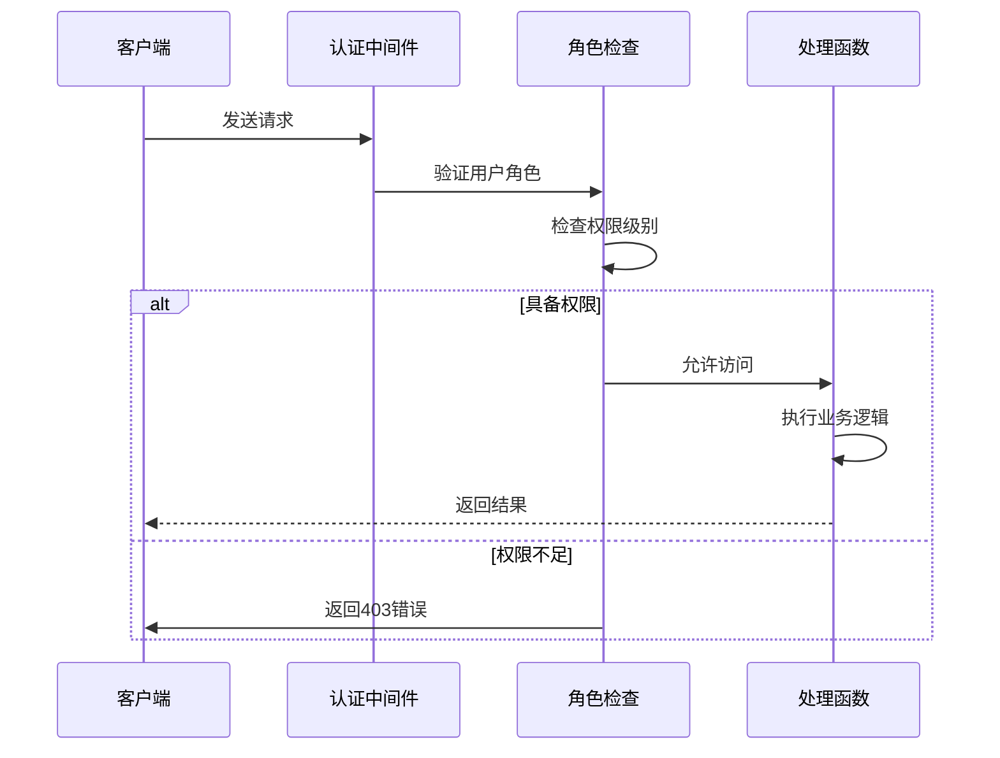

**图表来源**
- [parts-master.js:14-22](file://server/service/routes/parts-master.js#L14-L22)
- [compatibility.js:138-145](file://server/service/routes/compatibility.js#L138-L145)
- [parts-inventory.js:14-22](file://server/service/routes/parts-inventory.js#L14-L22)
- [parts-consumption.js:14-22](file://server/service/routes/parts-consumption.js#L14-L22)
- [parts-settlement.js:14-34](file://server/service/routes/parts-settlement.js#L14-L34)

**章节来源**
- [parts-master.js:14-22](file://server/service/routes/parts-master.js#L14-L22)
- [compatibility.js:138-145](file://server/service/routes/compatibility.js#L138-L145)
- [parts-inventory.js:14-22](file://server/service/routes/parts-inventory.js#L14-L22)
- [parts-consumption.js:14-22](file://server/service/routes/parts-consumption.js#L14-L22)
- [parts-settlement.js:14-34](file://server/service/routes/parts-settlement.js#L14-L34)

## 业务流程分析

### 配件入库流程

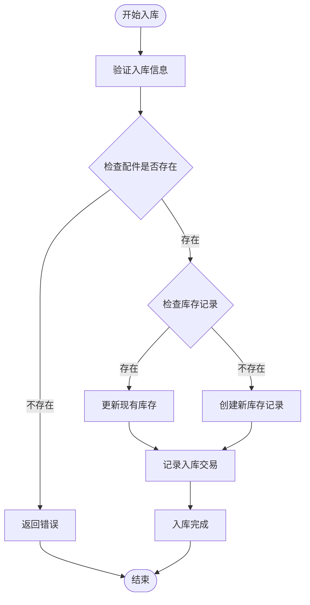

**图表来源**
- [parts-inventory.js:262-349](file://server/service/routes/parts-inventory.js#L262-L349)

### 配件出库流程

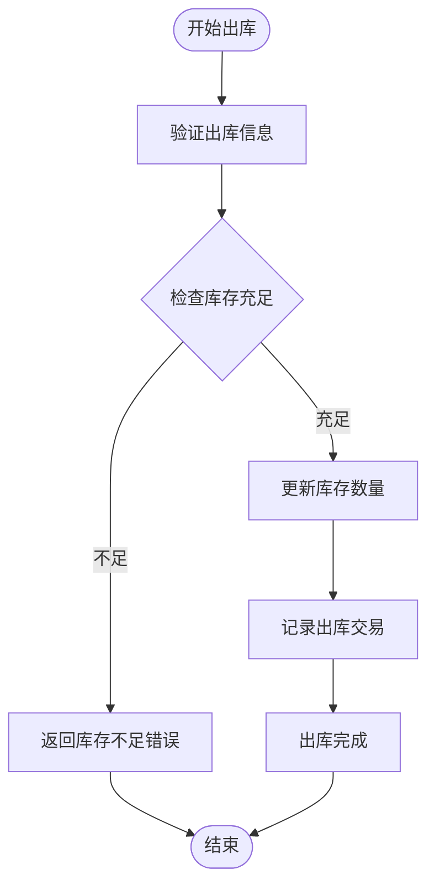

**图表来源**
- [parts-inventory.js:355-432](file://server/service/routes/parts-inventory.js#L355-L432)

### 消耗记录流程

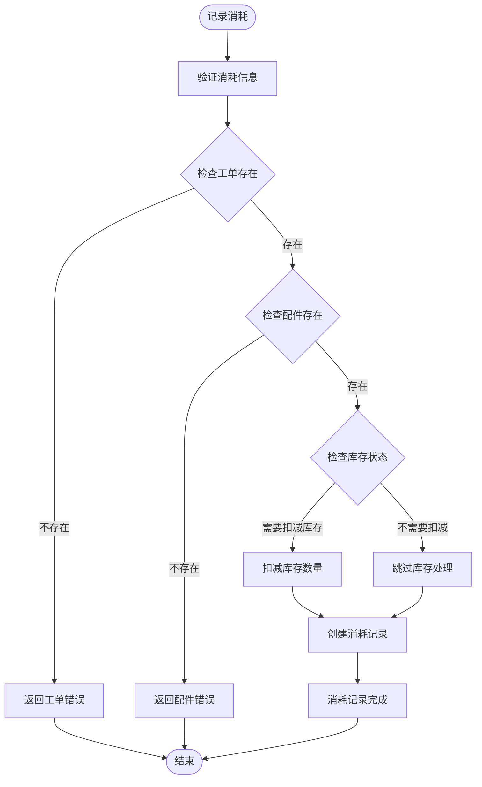

**图表来源**
- [parts-consumption.js:237-362](file://server/service/routes/parts-consumption.js#L237-L362)

### 结算单创建流程

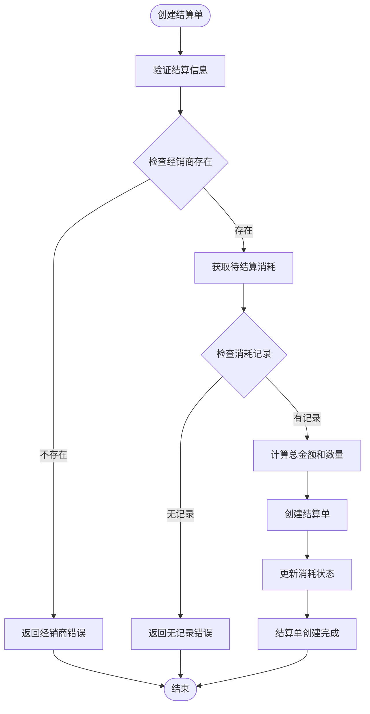

**图表来源**
- [parts-settlement.js:283-386](file://server/service/routes/parts-settlement.js#L283-L386)

### BOM推荐流程

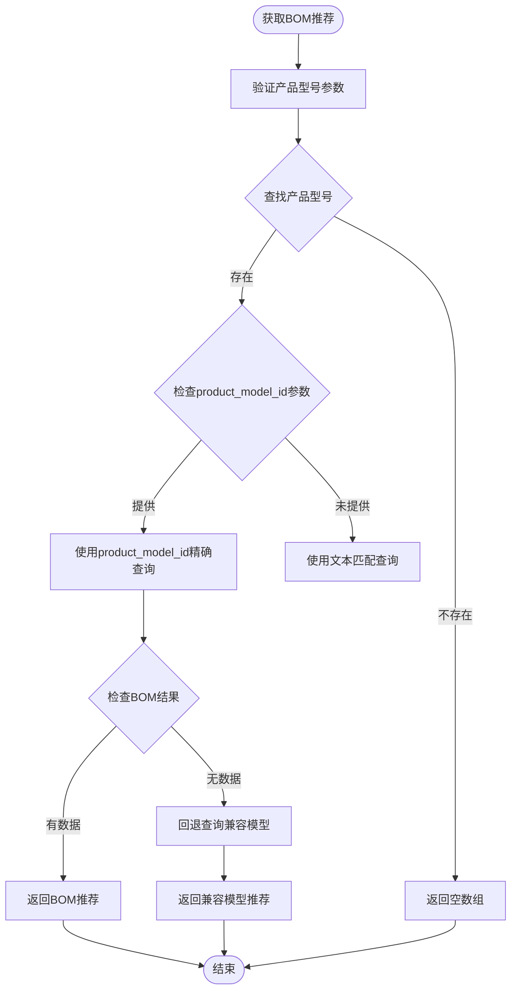

**更新** BOM推荐流程现在支持product_model_id参数。当提供product_model_id时，系统会使用精确的数据库关联查询；如果没有提供，则回退到传统的文本匹配方式。

### 兼容性测试流程

**新增功能** 兼容性测试流程提供完整的测试结果管理和知识库集成。

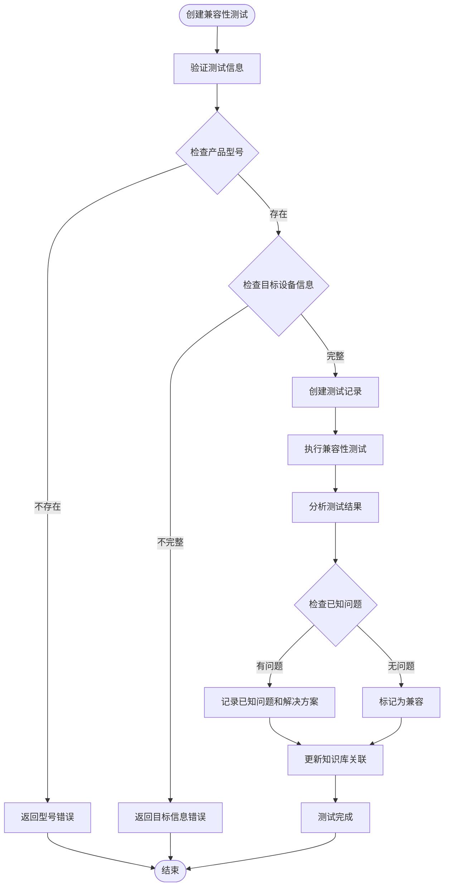

**图表来源**
- [parts-master.js:490-637](file://server/service/routes/parts-master.js#L490-L637)
- [compatibility.js:138-200](file://server/service/routes/compatibility.js#L138-L200)

**章节来源**
- [parts-inventory.js:262-432](file://server/service/routes/parts-inventory.js#L262-L432)
- [parts-consumption.js:237-362](file://server/service/routes/parts-consumption.js#L237-L362)
- [parts-settlement.js:283-386](file://server/service/routes/parts-settlement.js#L283-L386)
- [parts-master.js:490-637](file://server/service/routes/parts-master.js#L490-L637)
- [compatibility.js:138-200](file://server/service/routes/compatibility.js#L138-L200)

## 性能优化策略

### 前端性能优化

1. **组件懒加载**：使用 React.lazy 和 Suspense 实现按需加载
2. **虚拟滚动**：对于大量数据的表格使用虚拟滚动技术
3. **状态缓存**：利用 React Query 或 SWR 进行数据缓存
4. **图片优化**：使用响应式图片和适当的格式转换
5. **代码分割**：按功能模块进行代码分割
6. **防抖搜索**：对搜索功能实现防抖优化
7. **组件复用**：通过 PartsSelector 组件减少重复代码
8. **精确查询优化**：当提供product_model_id时，使用更高效的关联查询
9. **兼容性测试缓存**：对频繁访问的测试结果进行缓存

### 后端性能优化

1. **数据库索引优化**：为常用查询字段建立适当索引
2. **查询优化**：使用预编译语句和合理的查询计划
3. **缓存策略**：实现多层缓存机制
4. **连接池管理**：合理配置数据库连接池
5. **异步处理**：对于耗时操作使用队列处理
6. **BOM查询优化**：对产品型号匹配实现索引优化
7. **product_model_id查询优化**：使用EXISTS子查询进行高效关联
8. **兼容性测试查询优化**：对测试结果进行索引优化
9. **JSON字段查询优化**：使用JSON_EXTRACT函数优化JSON字段查询

### 数据库性能优化

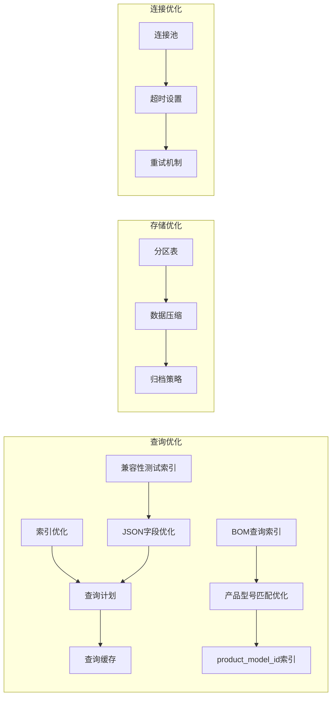

**更新** 数据库查询优化现在包括对product_model_id参数的专门优化，使用EXISTS子查询和适当的索引策略来提高精确查询的性能。新增了兼容性测试表的索引优化，提升了测试结果查询的效率。

**图表来源**
- [parts-master.js:54-62](file://server/service/routes/parts-master.js#L54-L62)
- [compatibility.js:28-57](file://server/service/routes/compatibility.js#L28-L57)
- [parts-inventory.js:88-97](file://server/service/routes/parts-inventory.js#L88-L97)
- [parts-consumption.js:103-112](file://server/service/routes/parts-consumption.js#L103-L112)
- [032_add_ticket_product_model_id.sql:8-9](file://server/migrations/032_add_ticket_product_model_id.sql#L8-L9)

## 故障排除指南

### 常见问题诊断

#### 配件管理问题

| 问题现象 | 可能原因 | 解决方案 |
|----------|----------|----------|
| 配件无法添加 | SKU重复或字段缺失 | 检查SKU唯一性，完善必填字段 |
| 库存数量不正确 | 出入库记录异常 | 检查交易记录，核对库存计算 |
| 消耗记录丢失 | 系统错误或数据清理 | 检查日志，恢复备份数据 |
| 结算单状态异常 | 状态流转错误 | 检查权限配置，重新执行操作 |
| 价格显示异常 | SKU价格表不同步 | 检查价格同步机制，重新初始化价格 |
| BOM推荐无效 | 产品型号不匹配 | 检查产品型号配置，验证BOM表数据 |
| 配件选择器无响应 | 搜索参数错误 | 验证搜索参数格式，检查API连接 |
| **新增** 配件查询不精确 | 缺少product_model_id参数 | 提供准确的产品型号ID进行查询 |
| **新增** 兼容性测试结果异常 | 测试数据格式错误 | 检查JSON字段格式，验证测试数据结构 |

#### 性能问题

| 问题现象 | 可能原因 | 解决方案 |
|----------|----------|----------|
| 页面加载缓慢 | 查询复杂或数据量大 | 优化查询语句，添加索引 |
| API响应慢 | 数据库连接池不足 | 增加连接池大小，优化并发 |
| 内存泄漏 | 组件未正确清理 | 检查组件卸载逻辑，清理事件监听 |
| 搜索响应慢 | 未实现防抖 | 添加防抖机制，优化搜索频率 |
| **新增** BOM查询慢 | 产品型号匹配复杂 | 使用product_model_id参数，优化索引 |
| **新增** 兼容性测试查询慢 | 测试结果数据量大 | 优化查询条件，添加索引 |

#### 权限问题

| 问题现象 | 可能原因 | 解决方案 |
|----------|----------|----------|
| 无权限访问 | 角色配置错误 | 检查用户角色，更新权限配置 |
| 操作被拒绝 | 权限验证失败 | 检查认证中间件，重新登录 |
| 数据可见性异常 | 部门权限限制 | 检查部门关联，调整访问范围 |

### 调试工具和方法

1. **浏览器开发者工具**：检查网络请求和JavaScript错误
2. **数据库客户端**：直接查询数据库验证数据状态
3. **日志分析**：查看应用日志和错误日志
4. **性能分析**：使用性能分析工具识别瓶颈
5. **API测试工具**：使用Postman等工具测试API接口
6. ****新增** 精确查询测试**：使用product_model_id参数测试BOM推荐准确性
7. ****新增** 兼容性测试调试**：验证测试结果数据格式和查询性能

**章节来源**
- [parts-master.js:114-180](file://server/service/routes/parts-master.js#L114-L180)
- [compatibility.js:138-200](file://server/service/routes/compatibility.js#L138-L200)
- [parts-inventory.js:262-349](file://server/service/routes/parts-inventory.js#L262-L349)
- [parts-consumption.js:237-362](file://server/service/routes/parts-consumption.js#L237-L362)
- [parts-settlement.js:283-386](file://server/service/routes/parts-settlement.js#L283-L386)

## 总结

配件管理系统是一个功能完整、架构清晰的企业级应用，具有以下特点：

### 技术优势

1. **前后端分离**：采用现代技术栈，便于维护和扩展
2. **模块化设计**：功能模块清晰，职责分离明确
3. **权限控制**：细粒度的权限管理，确保数据安全
4. **数据完整性**：完善的事务处理和数据校验机制
5. **统一定价系统**：通过SKU价格表实现统一的多币种定价管理
6. **材料标识管理**：支持材料追踪和质量控制
7. **价格数据同步**：实现了价格数据的集中管理和实时同步
8. **智能推荐系统**：基于BOM的配件推荐功能
9. **统一组件设计**：通过PartsSelector提供一致的用户体验
10. **实时数据更新**：支持实时的库存和消耗数据更新
11. ****新增** 精确查询支持**：通过product_model_id参数实现更精确的配件查询和BOM推荐
12. ****新增** 兼容性测试系统**：提供完整的配件兼容性验证和知识库集成

### 业务价值

1. **全生命周期管理**：覆盖配件从采购到结算的完整流程
2. **实时监控**：提供库存预警和消耗统计功能
3. **决策支持**：丰富的报表和数据分析功能
4. **合规管理**：完善的审计日志和变更追踪
5. **材料追踪**：增强材料来源和质量追踪功能
6. **智能推荐**：基于产品型号的精准配件推荐
7. **统一管理**：通过单一组件管理所有配件相关操作
8. ****新增** 提升查询精度**：显著改善配件搜索和推荐的准确性
9. ****新增** 质量保证**：通过兼容性测试确保配件质量

### 发展建议

1. **移动端适配**：开发移动应用提升用户体验
2. **AI集成**：引入机器学习进行需求预测
3. **供应链集成**：与供应商系统进行深度集成
4. **国际化支持**：扩展多语言和多币种支持
5. **材料追踪**：增强材料来源和质量追踪功能
6. **性能优化**：进一步优化大数据量场景下的性能表现
7. **用户体验**：持续改进用户界面和交互体验
8. ****新增** 查询优化**：继续优化product_model_id参数的使用，提升查询性能
9. ****新增** 测试系统优化**：优化兼容性测试流程，提升测试效率和准确性

该系统为企业提供了高效的配件管理解决方案，能够显著提升运营效率和管理水平。新增的PartsSelector组件和BOM推荐功能大大提升了用户的操作体验，而统一的API接口设计则为未来的功能扩展奠定了坚实的基础。

**更新** 基于最新的应用变更，系统现在支持product_model_id参数，显著提升了配件查询的精确度和BOM推荐的准确性。新增的兼容性测试功能提供了完整的配件质量保证体系，移除了旧的JSON兼容性字段处理逻辑，简化了数据结构，提升了系统的可维护性和性能。这些改进不仅改善了用户体验，也为后续的功能扩展提供了更好的基础。